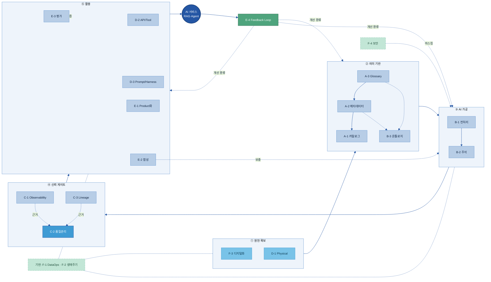
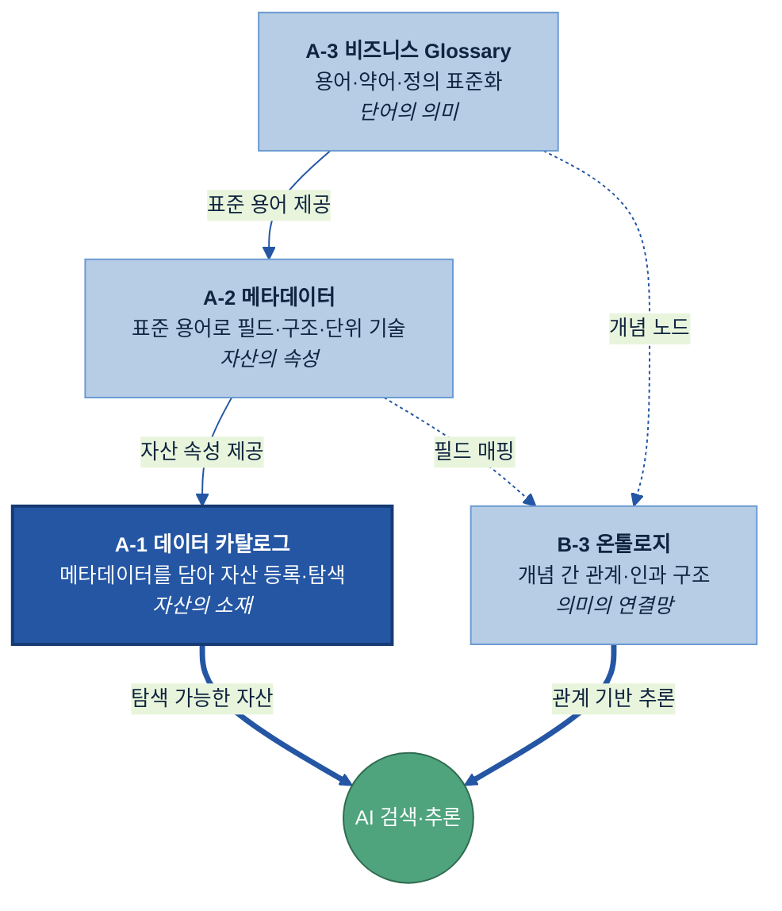

# AI-Ready Data 매뉴얼 — 전체 목차 (20개 주제)

> 목적: 20개 주제별 가이드(`A-1 데이터 카탈로그.md` 형식)를 작성하기 전에, **모든 주제의 목차를 한 곳에서 검토·확정**하기 위한 문서입니다.
> 기준: `최종 주제.md`의 주제 정의·Key Question + 참고 가이드(`data_catalog_manual.md`)의 12-섹션 구조.
> 사용법: 아래 표준 골격을 공통 뼈대로 두고, 주제별로 3·5·6·7·8·9·10·11·12 섹션의 H3를 해당 주제의 Key Question에 맞춰 조정했습니다. 수정·확정 의견을 주제 단위로 주시면 반영합니다.

---

## 전체 조감도 — 20개 주제의 연관 관계

20개 주제는 병렬 목록이 아니라, 데이터가 AI까지 가는 **가치사슬**로 서로 먹여주는(feeds-into) 의존 관계를 가진다.

### ① 전체 가치사슬 (의존 흐름)



### ② 의미 축적 스택 (A-3 → A-2 → A-1 → B-3)



> **표준 컬러 스키마**: 핵심=진파랑 `#2456A4` · 일반 노드=연파랑 `#B7CDE6` · 원천=하늘 `#79C3E8` · 게이트=밝은파랑 `#3F9BD4` · 환류/긍정=초록 `#4FA47D` · 기반=옅은초록 `#C2E6D6`(점선). 모든 주제 다이어그램은 이 테마를 따른다.

---

## 0. 표준 12-섹션 골격 (모든 주제 공통)

모든 주제는 아래 12개 H2 섹션을 공통 뼈대로 사용합니다. H3는 주제별로 달라집니다.

| # | 섹션 | 성격 | 비고 |
|---|------|------|------|
| 1 | 개요 | 공통 | 정의·목적·범위·대상조직·체계 내 역할 |
| 2 | 필요성 및 기대 효과 | 공통(2.1은 주제별) | Pain Point·필요성·기대효과·주요기능 |
| 3 | 구성 체계 | **주제별** | 주제의 핵심 구성요소·기준 |
| 4 | 추진 역할 및 책임 | 공통 | 담당자·RACI·계열사 조정 |
| 5 | 현황 조사 및 대상 선정 | **주제별** | Key Question 기반 대상·우선순위 |
| 6 | 솔루션 선정 검토 | **주제별** | 주제별 솔루션 유형·평가·PoC |
| 7 | 계열사 적용 예시 | **주제별** | 두산 계열사 가상 시나리오 |
| 8 | 구축 | **주제별** | 설계·연동·개발·초기 적재 |
| 9 | 운영 | **주제별** | 변경·서비스 연계·권한·운영관리 |
| 10 | AI-ready 체계 내 연계 범위 | **주제별** | 인접 주제와의 역할 분담 |
| 11 | KPI 및 성과 관리 | **주제별** | 활용도·효과·안정성 지표 |
| 12 | 고도화 Roadmap | **주제별** | 수기 → AI보조 → 자율 단계 |

### 공통 섹션 표준 H3 (1·4번 — 전 주제 동일, [주제] 자리만 치환)

```
1. 개요
   1.1 [주제]의 정의
   1.2 [주제]의 목적
   1.3 [주제] 적용 범위
   1.4 주요 대상 조직
   1.5 AI-ready 데이터 체계 내 [주제]의 역할

2. 필요성 및 기대 효과
   2.1 AI 과제 수행 시 주요 Pain Point   ← 주제별 작성
   2.2 [주제] 구축의 필요성
   2.3 [주제] 구축의 기대 효과
   2.4 [주제] 주요 기능

4. 추진 역할 및 책임
   4.1 주요 담당자 정의
   4.2 역할별 책임 구분 (RACI)
   4.3 계열사 상황에 따른 담당 조직 조정 기준
```

아래 각 주제 목차에서는 **1·4번은 위 표준을 따르므로 생략**하고, 주제별로 달라지는 섹션(2.1, 3, 5, 6, 7, 8, 9, 10, 11, 12) 중심으로 H3를 명시합니다.

---

# A. 발견·의미 (Discovery & Meaning)

## A-1 데이터 카탈로그
> 파일명: `A-1 데이터 카탈로그.md`
> 정의: AI와 사용자가 데이터 자산의 존재·위치·오너·접근 경로를 찾도록 등록하는 자산 목록 체계.

```
2.1 AI 과제 수행 시 주요 Pain Point (데이터 소재 파악 불가, 중복 수집)
3. 구성 체계
   3.1 카탈로그 조회 방식
   3.2 항목 구성 기준
   3.3 기본 항목 정의 (데이터명·시스템·위치·오너·접근경로·갱신주기)
   3.4 데이터 Type 작성 기준
5. 데이터 현황 조사 및 등록 대상 선정
   5.1 등록 대상 기준 정의
   5.2 데이터 유형별 등록/제외 기준
   5.3 정형 데이터 중요도 선별 기준
   5.4 시스템별 수집(자동/수동) 방식
   5.5 보안 검토 기준
   5.6 최종 등록 대상 및 우선순위
6. 솔루션 선정 검토 (카탈로그 솔루션 유형·후보·기능비교·PoC)
7. 계열사 적용 예시: 두산전자 데이터 카탈로그 구축 시나리오
8. 구축 (To-Be 아키텍처·Legacy 연동·Pipeline 개발·초기 적재/검증)
9. 운영 (변경관리·등록·검색조회·서비스 연계·권한/보안)
10. 연계 범위 (A-2 메타데이터·C-3 Lineage·F-2 생애주기와의 역할 분담)
11. KPI (활용도·신규 AI과제 활용수·탐색 Lead-time·재사용 효과)
12. 고도화 Roadmap (메타데이터 초안 자동생성 → Semantic 탐색 → Agent 연계)
```

## A-2 메타데이터
> 파일명: `A-2 메타데이터.md`
> 정의: 데이터 자산의 구조·형식·단위·생성기준·갱신주기 등 기술·운영 속성을 설명하는 관리 정보.

```
2.1 Pain Point (구조 미상의 데이터, 단위·기준 불일치로 AI 오해석)
3. 구성 체계
   3.1 AI-ready 메타데이터 표준 항목 (타입·단위·생성시스템·갱신주기·오너)
   3.2 메타데이터 스키마(메타-메타데이터) 정의·진화·버전 관리
   3.3 필드 설명서 / 컬럼 Dictionary (약어·코드 자연어 설명)
   3.4 단위·기준일·집계 방식 정의서
5. 현황 조사 및 대상 선정
   5.1 메타데이터 부재·불완전 자산 식별
   5.2 정형/반정형/비정형별 수집 가능 메타데이터 범위
   5.3 우선 정비 대상 및 우선순위
6. 솔루션 선정 검토 (메타데이터 관리·자동 수집·프로파일링 도구)
7. 계열사 적용 예시: 두산 계열사 메타데이터 표준화 시나리오
8. 구축 (스키마 정의·자동 수집 파이프라인·필드 설명 작성)
9. 운영 (자동 수집·승인 프로세스, 스키마 변경 시 갱신 후보 검토)
10. 연계 범위 (A-1 카탈로그·A-3 Glossary·B-3 온톨로지와의 역할 분담)
11. KPI (메타데이터 완성률·자동 수집률·설명 충실도·승인 리드타임)
12. 고도화 Roadmap (AI 기반 Description·태그 자동생성 → 현업 검수)
```

## A-3 비즈니스 Glossary
> 파일명: `A-3 비즈니스 Glossary.md`
> 정의: 업무 용어·약어·동의어를 표준 정의로 통일해 데이터 해석 일관성을 확보하는 용어 사전.

```
2.1 Pain Point (부서·계열사별 상이한 용어로 검색·해석 불일치)
3. 구성 체계
   3.1 Glossary 표준 템플릿 (표준명·영문·약어·동의어·금지어·정의·예시)
   3.2 용어 분류 체계 (도메인·업무영역)
   3.3 동의어·약어·금지어 관리 기준
5. 현황 조사 및 표준화 대상 선정
   5.1 표준화 대상 용어 식별 (결함명·검사항목·공정명·원인유형 등)
   5.2 용어 충돌·중복 진단
   5.3 우선 표준화 대상 및 우선순위
6. 솔루션 선정 검토 (Glossary/Business Glossary 도구, 카탈로그 연계형)
7. 계열사 적용 예시: 두산 계열사 용어 표준화 시나리오
8. 구축 (용어 수집·정의·충돌 조정·승인 구조 구성)
9. 운영 (용어 변경 관리, 신규/변경/폐기 버전 관리)
10. 연계 범위 (A-2 메타데이터·B-3 온톨로지·AI 검색(RAG/Prompt)과의 연계)
11. KPI (표준 용어 적용률·동의어 매핑 커버리지·검색 일치율 개선)
12. 고도화 Roadmap (현장 용어 자동 표준화 → AI 검색 의미 변환 연계)
```

---

# B. 변환·지식화 (Transformation & Knowledge)

## B-1 데이터 전처리
> 파일명: `B-1 데이터 전처리.md`
> 정의: 문서·표·이미지 등 비정형/반정형 데이터를 AI가 읽을 수 있는 구조화 형태로 변환.

```
2.1 Pain Point (PDF·PPT·Excel 등 AI가 바로 읽기 어려운 자료 방치)
3. 구성 체계
   3.1 전처리 대상 데이터 유형 분류
   3.2 문서 유형별 추출 기준 (문단·표·이미지·셀 구조)
   3.3 구조화 데이터 포맷 / Chunking 기준
   3.4 원본 위치 정보 보존 기준
5. 현황 조사 및 대상 선정
   5.1 전처리 대상 자료 Inventory
   5.2 활용 가능성·반복성 기반 우선순위
6. 솔루션 선정 검토 (문서 파서·OCR 보조·Chunking/Embedding 파이프라인)
7. 계열사 적용 예시: 두산 계열사 보고서 전처리 시나리오
8. 구축 (파서 구성·구조화 변환·테스트셋/파서 버전 관리)
9. 운영 (양식 변경 대응, AI 입력용 산출물 적재: 인덱스/Vector DB)
10. 연계 범위 (F-3 디지털화·C-2 품질·C-3 Lineage와의 경계)
11. KPI (전처리 자동화율·추출 정확도·양식변경 장애율)
12. 고도화 Roadmap (LLM 기반 구조 추출 → 자가 복구형 파서)
```

## B-2 데이터 해설/주석
> 파일명: `B-2 데이터 해설_주석.md`
> 정의: AI 학습을 위해 데이터에 라벨·분류·해석 기준 등 사람이 부여한 의미 정보를 붙이는 체계.

```
2.1 Pain Point (학습용 라벨 부재·기준 불일치로 모델 품질 저하)
3. 구성 체계
   3.1 라벨 Taxonomy / 라벨 정의서
   3.2 라벨 경계·상호배타성·다중라벨 기준
   3.3 Annotation Guideline / 사례집
5. 현황 조사 및 주석 대상 선정
   5.1 주석 대상 데이터 식별 (이미지·클레임·원인분석·실험결과)
   5.2 우선 주석 대상 및 규모 산정
6. 솔루션 선정 검토 (Annotation Tool, AI-assisted Labeling 플랫폼)
7. 계열사 적용 예시: 두산 계열사 결함 이미지/클레임 라벨링 시나리오
8. 구축 (라벨 체계 설계·가이드라인·초기 라벨링)
9. 운영 (AI-assisted Labeling Human-in-the-loop, 라벨 버전 관리)
10. 연계 범위 (E-3 평가데이터(정답셋)·B-3 온톨로지와의 경계)
11. KPI (라벨 정확도·작업 생산성·검수 합격률·재작업률)
12. 고도화 Roadmap (AI 1차 라벨 → 저신뢰·고위험 건 선별 검수)
```

## B-3 온톨로지
> 파일명: `B-3 온톨로지.md`
> 정의: 업무 개념 간 관계·계층·인과 구조를 정의해 AI가 맥락·연결성을 이해하게 하는 지식 구조.

```
2.1 Pain Point (단순 검색으로 원인-결과·연관 지식 추론 불가)
3. 구성 체계
   3.1 엔티티 목록 (제품·공정·결함·검사항목·원인·조치)
   3.2 관계 정의서 (발생·검출·원인·조치 등)
   3.3 공통/계열사 확장 온톨로지 구조
   3.4 개념-데이터-문서 매핑표
5. 현황 조사 및 적용 대상 선정
   5.1 온톨로지 적용 판단 기준 (관계 추론 필요 업무 식별)
   5.2 우선 모델링 도메인 선정
6. 솔루션 선정 검토 (Graph DB·온톨로지/지식그래프 도구)
7. 계열사 적용 예시: 두산 계열사 품질 지식그래프 시나리오
8. 구축 (개념·관계 모델링·데이터/문서 매핑·그래프 적재)
9. 운영 (개념·관계·계층 변경 관리, 전문가 검토·버전 관리)
10. 연계 범위 (A-3 Glossary·A-2 메타데이터·RAG/Agent와의 연계)
11. KPI (관계 커버리지·추론 정확도·유사사례 추천 적중률)
12. 고도화 Roadmap (수동 모델링 → 문서 기반 관계 자동 추출)
```

---

# C. 신뢰·관측 (Trust & Observability)

## C-1 데이터 Observability
> 파일명: `C-1 Observability.md`
> 정의: 데이터 흐름의 지연·누락·변경·이상 징후를 운영 중 감지·알림하는 모니터링 체계.

```
2.1 Pain Point (데이터 이상을 사후에야 인지, AI 결과 신뢰 저하)
3. 구성 체계
   3.1 관찰 지표 목록 (수집실패·지연·건수급변·스키마변경·결측·분포변화)
   3.2 이상 탐지 룰 / 임계값 기준
   3.3 알림 기준 / Severity Level
   3.4 데이터-모델-Prompt 관찰 체계
5. 현황 조사 및 관찰 대상 선정
   5.1 핵심 데이터 흐름 식별
   5.2 관찰 우선순위·커버리지 정의
6. 솔루션 선정 검토 (Data Observability·모니터링/알림 도구)
7. 계열사 적용 예시: 두산 계열사 파이프라인 관측 시나리오
8. 구축 (지표 정의·탐지 룰 설정·알림 연동)
9. 운영 (이상 대응 트리아지, 원인 후보 분리: 데이터/모델/Prompt)
10. 연계 범위 (C-3 Lineage(사후추적)·F-1 운영(복구)와의 경계)
11. KPI (이상 탐지 시간·미탐지/오탐률·알림 후 확인 시간·커버리지)
12. 고도화 Roadmap (룰 기반 → 학습 기반 이상 탐지 → 자동 트리아지)
```

## C-2 데이터 품질 관리
> 파일명: `C-2 데이터 품질 관리.md`
> 정의: 데이터가 AI 활용 기준을 충족하는지 판정하는 통제 체계("쓸 수 있는가" 판정).

```
2.1 Pain Point (품질·권한 미검증 데이터가 AI에 투입되어 오류 유발)
3. 구성 체계
   3.1 데이터 품질 기준 (완전성·정확성·일관성·최신성·유효성)
   3.2 AI 사용 제한 데이터 기준
   3.3 접근 권한 정책 (RBAC/ABAC)
   3.4 Quality Gate 구조
5. 현황 조사 및 적용 대상 선정
   5.1 품질 측정 대상 데이터 선정
   5.2 업무별 허용 기준 정의
6. 솔루션 선정 검토 (Data Quality·권한관리·정책엔진)
7. 계열사 적용 예시: 두산 계열사 Quality Gate 적용 시나리오
8. 구축 (품질 룰·권한 정책·Quality Gate 자동화 구성)
9. 운영 (예외 승인 프로세스, 품질/권한 위반 관리)
10. 연계 범위 (C-1 Observability·F-4 보안(접근차단)과의 경계)
11. KPI (품질 통과율·권한 위반 건수·AI 사용 차단 건수·개선 리드타임)
12. 고도화 Roadmap (수동 점검 → 자동 Quality Gate → 자가 교정)
```

## C-3 데이터 계통 Lineage
> 파일명: `C-3 데이터 계통 Lineage.md`
> 정의: 데이터 출처·이동·변환·활용 이력을 기록해 AI 결과의 근거를 추적하는 체계.

```
2.1 Pain Point (AI 답변·보고서의 근거 역추적 불가, 영향도 분석 곤란)
3. 구성 체계
   3.1 AI-ready Lineage 범위 (원천→전처리→인덱스→답변근거)
   3.2 변환 이력 기록 기준
   3.3 AI 답변 근거 로그 / Citation 구조
   3.4 영향도 분석 기준
5. 현황 조사 및 대상 선정
   5.1 Lineage 추적 대상 흐름 선정
   5.2 기록 수준(컬럼/테이블/문서) 정의
6. 솔루션 선정 검토 (Data Lineage·메타데이터 연계 도구)
7. 계열사 적용 예시: 두산 계열사 RAG 근거 추적 시나리오
8. 구축 (수집 연동·변환 이력·Citation 로깅 구성)
9. 운영 (영향도 분석, 감사 대응 Lineage Report)
10. 연계 범위 (A-1 카탈로그·C-1 Observability·F-2 생애주기와의 경계)
11. KPI (Lineage 커버리지·근거 추적 가능률·영향도 분석 소요시간)
12. 고도화 Roadmap (수동 매핑 → 자동 Lineage 수집 → 근거 자동 제시)
```

---

# D. 활용·실행 (Activation & Execution)

## D-1 Physical 데이터
> 파일명: `D-1 Physical 데이터.md`
> 정의: 센서·설비·현장 시스템 등 물리세계 데이터를 AI 입력으로 연결·활용하는 데이터 체계.

```
2.1 Pain Point (시간·단위·설비ID 미표준, 노이즈/결측으로 AI 활용 곤란)
3. 구성 체계
   3.1 Physical 데이터 대상 목록 (센서·설비상태·검사장비·알람·환경)
   3.2 현장 데이터 수집 아키텍처 (Edge·IoT·MES/QMS 연계)
   3.3 Time-series 데이터 표준 (시간동기화·설비ID·단위·샘플링)
   3.4 물리 데이터 정제 기준
5. 현황 조사 및 대상 선정
   5.1 수집 대상 설비·센서·신호 식별
   5.2 실시간/배치 처리 구분 기준
6. 솔루션 선정 검토 (IoT 플랫폼·Time-series DB·Edge 수집)
7. 계열사 적용 예시: 두산 계열사 설비 데이터 연계 시나리오
8. 구축 (수집 연동·표준화·정제 파이프라인 구성)
9. 운영 (실시간/배치 운영, 신호 끊김·단위 불일치 대응)
10. 연계 범위 (C-2 품질(최종판정)·B-1 전처리·F-1 운영과의 경계)
11. KPI (수집 안정성·시간동기화율·결측/이상률·실시간 지연)
12. 고도화 Roadmap (수집 표준화 → 엣지 전처리 → 실시간 AI 연계)
```

## D-2 API/Tool 연계 데이터
> 파일명: `D-2 API_Tool 연계 데이터.md`
> 정의: AI Agent가 외부 시스템·Tool을 안전하게 호출하도록 기능·입출력·제약을 정의한 명세 체계.

```
2.1 Pain Point (Tool 명세 부재·불일치로 Agent 오작동·호출 실패)
3. 구성 체계
   3.1 Tool 후보 목록 (조회·계산·보고서·검색·실행)
   3.2 Tool Description 표준
   3.3 Tool Schema (input/output·필수값·허용값·오류응답)
   3.4 Tool Risk Classification (조회/추천/실행/외부전송형)
5. 현황 조사 및 대상 선정
   5.1 연계 대상 시스템·API·I/F 식별
   5.2 위험도별 승인 기준 정의
6. 솔루션 선정 검토 (Tool/MCP Registry·API Gateway·인증)
7. 계열사 적용 예시: 두산 계열사 Agent Tool 연계 시나리오
8. 구축 (Tool 명세 작성·스키마 정의·Registry 구성)
9. 운영 (Tool 버전/오류 관리, Tool Call Log 기록)
10. 연계 범위 (D-3 Prompt/Harness·E-4 Feedback Loop와의 경계)
11. KPI (Tool 호출 성공률·오류율·명세 충실도·위험 Tool 승인 준수율)
12. 고도화 Roadmap (수동 명세 → 자동 스키마 생성 → 자율 Tool 조합)
```

## D-3 Prompt/Harness 자산화
> 파일명: `D-3 Prompt_Harness 자산화.md`
> 정의: 사람의 업무 절차·판단 기준을 AI가 실행 가능한 Prompt·Harness로 구조화·관리하는 체계.

```
2.1 Pain Point (Prompt 산재·버전 미관리로 재사용·품질 관리 불가)
3. 구성 체계
   3.1 Prompt/Harness 자산 목록
   3.2 업무 절차-Prompt 변환 템플릿
   3.3 Prompt Registry / 버전 관리 기준
   3.4 Prompt Dependency Map (데이터·Glossary·Tool·평가 의존성)
5. 현황 조사 및 대상 선정
   5.1 자산화 대상 Prompt/Harness 식별 (반복·고영향)
   5.2 우선 자산화 업무 선정
6. 솔루션 선정 검토 (Prompt 관리·버전관리·Harness 실행 플랫폼)
7. 계열사 적용 예시: 두산 계열사 업무 Harness 자산화 시나리오
8. 구축 (업무절차 구조화·Prompt화·Registry 구성)
9. 운영 (Prompt 개선 프로세스, Harness 패키징·재사용)
10. 연계 범위 (D-2 Tool·E-3 평가데이터·E-4 Feedback Loop와의 경계)
11. KPI (재사용률·사용자 수정률·성능 변화·배포 승인 준수율)
12. 고도화 Roadmap (수동 작성 → 평가 연동 자동 개선 → 자율 최적화)
```

---

# E. 가치화·순환 (Value & Loop)

## E-1 데이터 Product화
> 파일명: `E-1 데이터 Product화.md`
> 정의: 데이터를 반복 재사용 가능한 상품 단위로 정의하고 책임자·품질·제공 방식을 갖춰 운영.

```
2.1 Pain Point (반복 요청·중복 가공, 책임·품질 불명확)
3. 구성 체계
   3.1 데이터 Product 명세서 (사용자·목적·품질·SLA·오너·소비방식)
   3.2 계열사 환경 추상화 계층
   3.3 데이터 소비 방식 정의 (API·테이블·파일·대시보드·RAG소스)
   3.4 Data Product Owner 역할
5. 현황 조사 및 대상 선정
   5.1 Product 후보 식별 (반복 요청·다팀 사용·AI 활용 빈도)
   5.2 우선 Product화 대상 선정
6. 솔루션 선정 검토 (Data Product/Marketplace·Data Mesh 도구)
7. 계열사 적용 예시: 두산 계열사 데이터 Product 시나리오
8. 구축 (Product 정의·제공 채널·추상화 계층 구성)
9. 운영 (변경 공지·문의 대응·개선 Backlog·버전/폐기 판단)
10. 연계 범위 (A-1 카탈로그(등록)·C-2 품질·F-1 운영과의 경계)
11. KPI (재사용률·사용자 수·중복 감소·요청 처리시간·만족도)
12. 고도화 Roadmap (수동 제공 → 셀프서비스 → AI 추천 소비)
```

## E-2 합성데이터 (Synthetic)
> 파일명: `E-2 합성데이터.md`
> 정의: 실데이터가 부족·제한될 때 AI 학습·검증을 위해 인공 생성한 데이터.

```
2.1 Pain Point (희소 이벤트·보안 제한으로 학습/검증 데이터 부족)
3. 구성 체계
   3.1 합성데이터 적용 판단 기준
   3.2 합성 대상 데이터 정의 (불량·장애·예외·테스트 케이스)
   3.3 합성 방식 선택 기준 (통계·규칙·시뮬레이션·생성모델)
   3.4 Synthetic Tag / 사용 정책
5. 현황 조사 및 대상 선정
   5.1 데이터 부족 영역 진단
   5.2 합성 대상·목적 정의
6. 솔루션 선정 검토 (Synthetic Data Generation·시뮬레이션 도구)
7. 계열사 적용 예시: 두산 계열사 불량 사례 합성 시나리오
8. 구축 (생성 파이프라인·검증 리포트 구성)
9. 운영 (편향·과적합·재식별 위험 점검, 태깅 관리)
10. 연계 범위 (E-3 평가데이터·F-4 보안·C-2 품질과의 경계)
11. KPI (분포 유사도·희소패턴 재현율·모델 성능 개선·재식별 위험)
12. 고도화 Roadmap (규칙 기반 → 생성모델 → 검증 자동화)
```

## E-3 AI 평가 데이터
> 파일명: `E-3 AI 평가 데이터.md`
> 정의: AI 모델·Prompt·Agent 성능을 객관 판단하기 위한 정답셋·평가 기준 데이터.

```
2.1 Pain Point (객관적 정답셋·기준 부재로 성능 판단·회귀 검증 불가)
3. 구성 체계
   3.1 Gold Dataset 표준 (질문·입력·기대답변·근거·평가기준)
   3.2 평가 Rubric (정확성·근거성·완전성·안전성·실행가능성)
   3.3 전문가 평가 프로세스
   3.4 Evaluation Harness / 회귀 테스트셋
5. 현황 조사 및 구축 대상 선정
   5.1 평가 데이터 필요 AI 과제 식별
   5.2 우선 구축 대상·규모 산정
6. 솔루션 선정 검토 (Eval 플랫폼·LLM-as-judge·회귀 테스트)
7. 계열사 적용 예시: 두산 계열사 RAG/Agent 평가셋 시나리오
8. 구축 (Gold Dataset 작성·Rubric 정의·Harness 구성)
9. 운영 (전문가 평가 축적, 평가 데이터 버전 관리·갱신)
10. 연계 범위 (B-2 주석(학습라벨)·D-3 Prompt·E-4 Feedback과의 경계)
11. KPI (평가 커버리지·회귀 검출률·전문가 일치도·갱신 주기)
12. 고도화 Roadmap (수동 평가 → 자동 회귀 → 실패사례 자동 보강)
```

## E-4 데이터 Feedback Loop
> 파일명: `E-4 데이터 Feedback Loop.md`
> 정의: AI 운영 결과·오류·피드백을 데이터·모델·Prompt·Tool 개선으로 환류하는 체계.

```
2.1 Pain Point (운영 중 발견한 오류가 개선으로 환류되지 않음)
3. 구성 체계
   3.1 피드백 수집 항목 (실행결과·사용자수정·실패답변·Tool실패)
   3.2 오류 유형 Taxonomy (데이터·Prompt·모델·Tool·권한 문제)
   3.3 개선 Backlog 연계 기준 (주제별 라우팅)
   3.4 자동/수동 반영 기준
5. 현황 조사 및 대상 선정
   5.1 피드백 수집 가능 지점 식별
   5.2 우선 개선 환류 대상 선정
6. 솔루션 선정 검토 (피드백 수집·Backlog·실험/배포 연계 도구)
7. 계열사 적용 예시: 두산 계열사 AI 운영 환류 시나리오
8. 구축 (피드백 수집·분류·Backlog 연계 파이프라인)
9. 운영 (자동/수동 반영 운영, 위험도 기반 검토)
10. 연계 범위 (A·B-2·E-3·D-2·D-3 등 전 주제 개선 라우팅)
11. KPI (오류 재발률·반영 리드타임·사용자 수정 감소·성공률 개선)
12. 고도화 Roadmap (수동 환류 → 반자동 → 자율 개선 루프)
```

---

# F. 운영·기반 (Operations & Foundation)

## F-1 데이터 운영관리 (DataOps)
> 파일명: `F-1 데이터 운영관리.md`
> 정의: 데이터 파이프라인을 안정 실행·복구·변경 관리하는 DataOps 체계.

```
2.1 Pain Point (파이프라인 장애·무통제 변경으로 AI 서비스 중단)
3. 구성 체계
   3.1 운영 대상 파이프라인 목록
   3.2 DataOps 운영 표준 (실행주기·배포·변경승인·테스트)
   3.3 장애 대응 Runbook
   3.4 변경 관리 프로세스
5. 현황 조사 및 대상 선정
   5.1 핵심 파이프라인 식별·중요도 분류
   5.2 운영 수준 차등 기준
6. 솔루션 선정 검토 (Orchestration·CI/CD·모니터링 연계)
7. 계열사 적용 예시: 두산 계열사 DataOps 운영 시나리오
8. 구축 (파이프라인 표준화·배포 절차·Runbook 구성)
9. 운영 (장애 복구·재처리·롤백, 다팀 변경 통제)
10. 연계 범위 (C-1 Observability(탐지)·C-3 Lineage·D-1과의 경계)
11. KPI (파이프라인 성공률·평균 복구시간·SLA 준수·재처리 건수)
12. 고도화 Roadmap (수동 운영 → 자동 복구 → 자가 치유 파이프라인)
```

## F-2 데이터 생애주기 관리
> 파일명: `F-2 데이터 생애주기 관리.md`
> 정의: 데이터의 생성·사용·보관·아카이빙·폐기까지 시간축을 정책 기반으로 통제하는 체계.

```
2.1 Pain Point (무기한 보관·과정 데이터 소실, 비용·리스크 증가)
3. 구성 체계
   3.1 데이터 생애주기 단계 정의
   3.2 데이터 보존 기간 기준 (법적·업무·AI 재사용 가치)
   3.3 과정 데이터 보존 기준
   3.4 저장소 계층화 기준 (Hot/Warm/Cold)
5. 현황 조사 및 대상 선정
   5.1 데이터 유형별 보존/폐기 대상 분류
   5.2 보존 예외·법적 보존 대상 식별
6. 솔루션 선정 검토 (Lifecycle·아카이빙·스토리지 계층화 도구)
7. 계열사 적용 예시: 두산 계열사 보존·폐기 정책 시나리오
8. 구축 (정책 정의·계층화·폐기/아카이빙 절차 구성)
9. 운영 (폐기·아카이빙·복원 운영, 비용/리스크 점검)
10. 연계 범위 (A-1 카탈로그·C-3 Lineage·F-4 보안과의 경계)
11. KPI (보존정책 준수율·미사용 데이터 비중·저장 비용 절감)
12. 고도화 Roadmap (수동 정책 → 자동 분류 → 가치 기반 자동 보존)
```

## F-3 데이터 디지털화
> 파일명: `F-3 데이터 디지털화.md`
> 정의: 종이·수기·사진·암묵지 등 아날로그 자산을 AI 활용 가능한 디지털 자산으로 전환.

```
2.1 Pain Point (현장 아날로그·암묵지가 AI 활용에서 누락)
3. 구성 체계
   3.1 아날로그 자산 Inventory
   3.2 디지털화 우선순위 기준
   3.3 디지털화 방식별 적용 기준 (스캔·OCR/ICR·모바일·인터뷰 구조화)
   3.4 Digital-first 업무 전환 기준
5. 현황 조사 및 대상 선정
   5.1 누락 아날로그 자산 조사
   5.2 우선 디지털화 대상 선정
   5.3 Excel·개인PC 산재 데이터 승급 기준
6. 솔루션 선정 검토 (스캔/OCR·모바일 입력·음성변환 도구)
7. 계열사 적용 예시: 두산 계열사 현장 디지털화 시나리오
8. 구축 (전환 파이프라인·검증 기준·입력 양식 전환)
9. 운영 (전환 품질 검증, 지속 수집·Digital-first 운영)
10. 연계 범위 (B-1 전처리(기존 디지털)·C-2 품질과의 경계)
11. KPI (디지털화율·전환 정확도·산재 데이터 승급 건수·Digital-first 적용률)
12. 고도화 Roadmap (일회성 전환 → 상시 수집 → Digital-first 정착)
```

## F-4 AI 데이터 보안
> 파일명: `F-4 AI 데이터 보안.md`
> 정의: AI 학습·추론·RAG·Agent 과정에서 개인·민감정보를 탐지·마스킹·가명화해 안전하게 활용.

```
2.1 Pain Point (학습/RAG/로그에 민감정보 유입, 재식별 위험)
3. 구성 체계
   3.1 민감정보 분류 체계 (개인·고객사·계약·기술기밀 등)
   3.2 민감정보 탐지 기준 (정규식·사전·NER·LLM 문맥)
   3.3 목적별 마스킹 정책 (삭제·가명화·익명화·토큰화)
   3.4 AI 학습 가능 등급
5. 현황 조사 및 대상 선정
   5.1 민감정보 포함 데이터·경로 식별 (정형/비정형/로그)
   5.2 Utility-Preservation 기준 (유용성-보호 균형)
6. 솔루션 선정 검토 (민감정보 탐지·마스킹·가명화 도구)
7. 계열사 적용 예시: 두산 계열사 AI 데이터 비식별 시나리오
8. 구축 (탐지·마스킹 파이프라인·등급 정책 구성)
9. 운영 (AI Log/Prompt 마스킹, 재식별 위험 점검)
10. 연계 범위 (C-2 품질(접근차단)·E-2 합성데이터와의 경계)
11. KPI (탐지율·마스킹 정확도·재식별 위험 점수·유용성 유지율)
12. 고도화 Roadmap (룰 기반 탐지 → 문맥 기반 → 자동 등급 분류)
```

---

## 부록. 확정 시 검토 포인트

1. **공통 골격 유지 여부** — 20개 주제 모두 동일한 12-섹션을 쓸지, 일부 주제(예: E-2 합성, E-3 평가)는 6.솔루션·7.사례 섹션을 다르게 둘지.
2. **계열사 사례(7번) 대상** — 참고 가이드는 "두산전자" 가상 시나리오를 사용. 주제별로 적합한 계열사를 지정할지.
3. **파일명 규칙** — `A-1 데이터 카탈로그.md`처럼 공백·한글 사용 확정 (Glossary 등 영문 혼용 포함).
4. **H3 상세 깊이** — 본 문서는 H3까지만 정의. 참고 가이드 수준(H3별 본문·표·예시)으로 갈지.
