# A-1. 데이터 카탈로그 매뉴얼

> 한 줄 정의: 데이터 카탈로그(Data Catalog)는 **AI와 사람이 "어디에 무슨 데이터가 있는지" 찾을 수 있도록**, 데이터 자산의 존재·위치·오너·접근 경로를 등록해 둔 **자산 목록 체계**다.

## 목차

1. [개요](#1-개요)
2. [필요성 및 기대 효과](#2-필요성-및-기대-효과)
3. [구성 체계](#3-구성-체계)
4. [추진 역할 및 책임](#4-추진-역할-및-책임)
5. [데이터 현황 조사 및 등록 대상 선정](#5-데이터-현황-조사-및-등록-대상-선정)
6. [데이터 카탈로그 솔루션 선정 검토](#6-데이터-카탈로그-솔루션-선정-검토)
7. [계열사 적용 예시: 두산전자 시나리오](#7-계열사-적용-예시-두산전자-데이터-카탈로그-구축-시나리오)
8. [데이터 카탈로그 구축](#8-데이터-카탈로그-구축)
9. [데이터 카탈로그 운영](#9-데이터-카탈로그-운영)
10. [AI-ready 데이터 체계 내 연계 범위](#10-ai-ready-데이터-체계-내-연계-범위)
11. [KPI 및 성과 관리](#11-kpi-및-성과-관리)
12. [고도화 Roadmap](#12-고도화-roadmap)
- [별첨(Appendix)](#별첨-appendix) · [참고자료(References)](#참고자료-references)

> 관련 가이드: [A-2 메타데이터](A-2%20메타데이터.md) · [A-3 비즈니스 Glossary](A-3%20비즈니스%20Glossary.md) · [C-2 데이터 품질 관리](C-2%20데이터%20품질%20관리.md) · [C-3 데이터 계통 Lineage](C-3%20데이터%20계통%20Lineage.md) · [F-2 데이터 생애주기 관리](F-2%20데이터%20생애주기%20관리.md) · [전체 목차](00%20전체%20목차%20(20개%20주제).md)

---

## 1. 개요

**👉 한 줄 요약:** 데이터 카탈로그(Data Catalog)는 조직이 보유한 데이터 자산의 "도서관 목록"이다 — 어디에 무엇이 있는지를 등록해 두어, AI와 사람 모두 데이터를 찾을 수 있게 하는 자산 소재(所在) 체계다.

### 1.1 데이터 카탈로그의 정의

데이터 카탈로그(Data Catalog)는 조직이 보유한 데이터 자산을 **찾을 수 있도록** 등록하고 탐색할 수 있게 만든 **목록 체계**다.

**도서관 비유로 이해하기.** 도서관에서 원하는 책을 찾으려면 두 가지가 필요하다. 하나는 책 자체이고, 다른 하나는 "어떤 책이 어느 서가 몇 번 칸에 있는지"를 알려주는 목록 카드(또는 도서 검색 시스템)다. 데이터 카탈로그는 후자에 해당한다. 데이터(책) 자체를 이동시키거나 가공하는 것이 아니라, "이 데이터는 MES 시스템 `QMS.dbo.INSP_RESULT` 테이블에 있고, 오너는 품질보증팀 김OO 책임이며, 매일 갱신된다"는 소재 정보를 모아둔 것이다.

핵심은 **소재(所在) 중심**이라는 점이다. 카탈로그가 다루는 질문은 하나다: **"어디에 무엇이 있는가?"**

데이터 자산이 어디에 있는지를 찾은 다음에는 그 데이터의 구체적 속성(필드가 무슨 뜻인지, 단위가 무엇인지)을 이해해야 하는데, 이는 **메타데이터(Metadata, A-2)**가 담당한다. 같은 현상을 부르는 용어가 부서마다 다를 때의 표준화는 **비즈니스 용어집(Business Glossary, A-3)**이 담당한다. 카탈로그는 소재를 찾는 입구까지만 책임진다.

| 질문 | 담당 주제 |
|---|---|
| 이 데이터가 **어디에** 있는가? (소재) | **A-1 데이터 카탈로그** ← 여기 |
| 이 데이터의 **필드·구조·단위**는 무엇인가? (속성) | [A-2 메타데이터](A-2%20메타데이터.md) |
| 이 업무 용어의 **표준 의미**는 무엇인가? (정의) | [A-3 비즈니스 Glossary](A-3%20비즈니스%20Glossary.md) |
| 이 데이터가 **어디서 와서 어디로 흘렀는가**? (이력) | [C-3 데이터 계통 Lineage](C-3%20데이터%20계통%20Lineage.md) |
| 이 데이터를 **AI에 써도 되는가**? (품질 판정) | [C-2 데이터 품질 관리](C-2%20데이터%20품질%20관리.md) |

> **용어 풀이**
> - **데이터 자산(Data Asset):** 조직이 업무에 활용하거나 활용 가능한 모든 데이터 — 정형 DB 테이블, 보고서 파일, 센서 로그, 이미지 등.
> - **데이터 오너(Data Owner):** 특정 데이터 자산의 등록·갱신·접근 정책에 책임을 지는 담당자 또는 팀.

### 1.2 데이터 카탈로그의 목적

데이터 카탈로그를 구축하는 이유는 세 가지 핵심 문제를 해결하기 위해서다.

**① 데이터를 빠르게 발견하게 한다 (사람과 AI 모두).**
조직에 데이터가 많아질수록 "그 데이터가 어디 있죠?"를 사람에게 물어보는 일이 반복된다. 카탈로그는 이 질문에 즉시 답할 수 있는 구조를 만든다. AI의 경우 사람처럼 "옆자리에 물어볼" 수 없으므로, 기계가 읽을 수 있는 목록이 없으면 자동 탐색 자체가 불가능하다.

**② 중복 수집과 중복 가공을 줄이고 재사용을 늘린다.**
카탈로그가 없으면 누군가 이미 정제해 둔 데이터가 있어도 그 사실을 모르고, 다른 팀이 같은 원천에서 다시 수집·가공한다. 카탈로그는 "이미 있는 자산"을 가시화해 불필요한 중복 작업을 막는다.

**③ AI 과제를 지연시키는 "데이터 찾기" 낭비를 없앤다.**
AI 과제 착수 초기에 가장 많은 시간이 소모되는 작업이 데이터 소재 파악이다. 카탈로그는 이 단계를 며칠에서 몇 분으로 단축해, 실제 분석과 모델링에 시간을 쓸 수 있게 한다.

🏭 **두산전자 예시.** 동박적층판(CCL) 품질 이상 예측 모델을 만들기 위해 AI 과제팀이 구성됐다. 모델에 필요한 데이터는 MES의 공정 조건 데이터, QMS의 검사 결과 데이터, LIMS(Laboratory Information Management System = 시험실 정보 관리 시스템)의 재료 시험 데이터, SharePoint의 과거 품질 보고서다. 카탈로그가 없으면 팀원 3명이 각 시스템 담당자를 찾아 개별 문의하고, 데이터가 실제로 존재하는지·어떻게 접근하는지를 확인하는 데 평균 1~2주가 소요된다. 카탈로그가 있으면 태그 검색으로 4개 자산을 즉시 발견하고 오너와 접근 경로를 확인해 하루 안에 착수할 수 있다.

### 1.3 적용 범위 — 무엇을 다루고, 무엇을 다루지 않는가

카탈로그의 경계를 명확히 하는 것이 중요하다. 범위를 잘못 이해하면 인접 주제와 중복 작업이 생기거나, 카탈로그에 불필요한 기대를 걸게 된다.

**카탈로그가 다루는 것 (IN)**

- 데이터 자산의 **존재 사실** 등록 (이런 데이터가 있다)
- 자산의 **소재** 기록 (어느 시스템, 어느 테이블/폴더/경로에 있는가)
- 자산의 **오너·보유 부서** 명시 (누가 책임지는가)
- 자산의 **접근 경로** 안내 (어떻게 접근하는가)
- 자산의 **탐색·분류** 체계 (어떻게 찾는가)
- **최신성 유지** (소재 정보가 현실과 일치하도록 갱신)

**카탈로그가 다루지 않는 것 (OUT)**

- 필드 수준 구조·단위·형식 정의 → **A-2 메타데이터**
- 용어 표준화·동의어 관리 → **A-3 비즈니스 Glossary**
- 데이터 품질 판정 ("이 데이터를 써도 되는가") → **C-2 데이터 품질 관리**
- 데이터의 이동·변환 이력 추적 → **C-3 데이터 계보(Lineage)**
- 접근 권한 통제·차단 정책 → **C-2 데이터 품질·권한 관리**
- 데이터 보존·폐기 일정 관리 → **F-2 데이터 생애주기 관리**

> 카탈로그는 "찾기"까지다. 찾은 뒤의 "이해하기·판정하기·추적하기"는 각 인접 주제가 맡는다. 인접 주제와 중복되는 작업은 하지 않는다.

### 1.4 주요 대상 조직

데이터 카탈로그는 특정 팀만의 도구가 아니라 조직 전체가 역할을 나누어 만들고 쓰는 체계다. 주요 관여 조직과 각자의 역할은 다음과 같다.

| 조직 | 역할 |
|---|---|
| **지주/전사 데이터 조직** | 카탈로그 공통 표준·항목·거버넌스 정의. 계열사 간 일관성 확보. |
| **계열사 데이터 담당** | 자사 데이터 자산 등록·분류·갱신 운영. 오너 지정 지원. |
| **현업 데이터 오너** | 자신이 책임지는 자산의 등록 정보 확인·승인·갱신 요청. |
| **AI 과제 수행자 / 분석가** | 카탈로그로 활용 가능한 데이터를 탐색. 미등록 자산 발견 시 등록 요청. |
| **데이터 스튜워드(Data Steward)** | 도메인별 등록 품질·분류 체계 관리. (역할 규모는 계열사 사정에 따라 조정) |

🏭 **두산전자 예시.** 두산전자에서 데이터 조직이 신설 1년차라면, 처음에는 지주 데이터 조직이 표준과 항목을 정의하고 초기 등록을 지원한다. 품질보증팀 팀장이 품질 데이터 오너, 생산기술팀 팀장이 설비 데이터 오너 역할을 겸하며, AI 과제팀이 탐색·개선 요청을 한다.

### 1.5 AI-ready 데이터 체계 내 데이터 카탈로그의 역할

**👉 한 줄 요약:** 데이터 카탈로그는 20개 주제 가치사슬의 "② 의미 기반" 단계에서 **자산의 소재를 책임지는 첫 번째 입구**다 — 카탈로그가 없으면 어떤 후속 작업도 시작할 수 없다.

"② 의미 기반" 그룹 안에서 A-3 → A-2 → A-1은 하나의 스택으로 작동한다. A-3(Glossary)가 업무 용어의 표준 의미를 정의하고, A-2(메타데이터)가 그 표준 용어로 자산의 구조·속성을 기술하며, A-1(카탈로그)이 이 메타데이터를 품고 자산을 목록화해 탐색 가능하게 만든다. 탐색 가능한 자산만 ③ AI 가공 단계(전처리·주석)로 넘어갈 수 있다. (20개 주제 전체 조감도는 10장 참조.)

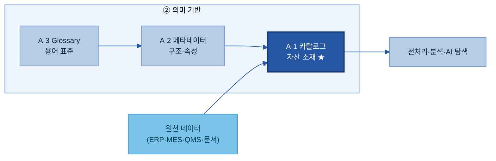

**카탈로그가 AI-ready의 입구인 이유.** 아무리 데이터 품질이 좋아도, 아무리 전처리 파이프라인이 완성되어 있어도, 카탈로그에 등록되지 않은 자산은 AI 과제팀이 존재 자체를 모르고 지나친다. 카탈로그는 "이 자산이 존재하며 접근 가능하다"는 사실을 선언하는 첫 번째 공식 등록이다.

---

## 2. 필요성 및 기대 효과

**👉 한 줄 요약:** 카탈로그가 없으면 AI 과제의 절반이 "데이터 찾기"에서 소모된다 — 이 낭비를 없애고, 데이터를 신뢰할 수 있게 쓰고, AI가 스스로 찾을 수 있게 하는 것이 카탈로그의 핵심 가치다.

### 2.1 AI 과제 수행 시 주요 Pain Point

**👉 한 줄 요약:** 카탈로그 없이 AI 과제를 시작하면, 첫 관문인 "데이터 확보"에서 일주일 이상을 소모하는 일이 반복된다.

#### 두산전자 품질 AI 과제 현업 예시

두산전자는 CCL(Copper Clad Laminate = 동박적층판)을 제조한다. AI 과제팀이 "동박 두께 불균일 결함 예측 모델"을 개발하기 위해 착수 미팅을 마쳤다. 모델에 필요한 데이터는 아래와 같이 여러 시스템에 흩어져 있다.

| 필요 데이터 | 있을 것으로 예상되는 위치 | 실제 상황 (카탈로그 없는 경우) |
|---|---|---|
| 공정 조건 (온도·압력·속도) | MES | "MES에 있을 텐데 담당자가 바뀌어서 테이블명을 모름" |
| 두께 검사 결과 | QMS | "QMS에는 있는데, 어느 테이블인지 개발팀에 물어봐야 함" |
| 재료 시험 데이터 (동박 두께·인장강도) | LIMS | "LIMS 데이터는 R&D팀이 별도로 관리하는데 공유 경로 불명" |
| 과거 결함 분석 보고서 | SharePoint · 파일서버 | "담당자 PC에도 있고 SharePoint에도 일부 있는데 어디가 최신인지 모름" |
| 고객 클레임 이력 | C/S 시스템 | "존재는 알지만 접근 권한 신청 방법을 아무도 모름" |

이 상황에서 과제팀이 겪는 Pain Point는 네 가지로 정리된다.

**Pain Point 1 — 데이터 존재 여부 불확실:** "그런 데이터가 있나요?"라는 질문에 명확히 답할 수 있는 사람이 없다. 있을 것 같아서 찾아보면 없고, 없을 것 같아서 포기했는데 나중에 발견되는 일이 반복된다.

**Pain Point 2 — 위치 파편화·탐색 불가:** 데이터가 MES, QMS, LIMS, SharePoint, 파일서버, 담당자 PC에 흩어져 있다. 어디에 무엇이 있는지 목록이 없으므로, 사람을 통해 물어보는 것이 유일한 탐색 방법이다.

**Pain Point 3 — 오너·접근 경로 불명확:** 데이터가 있다는 사실을 알아도, 접근하려면 누구에게 신청해야 하는지, 어떤 절차로 받는지가 불명확하다. 시스템 개발팀, 보안 담당자, 데이터 생성 부서를 차례로 거쳐야 할 수도 있다.

**Pain Point 4 — 매번 새로 수집·중복 가공:** 두 번째 AI 과제팀이 같은 MES 데이터를 필요로 한다. 첫 번째 팀이 정제한 데이터가 있지만 공유된 목록이 없어 존재를 모른다. 결국 다시 원천에서 수집·정제하는 중복 작업이 발생한다.

> **정량 지표 (As-Is):** 탐색에 소요되는 평균 시간, 중복 데이터 생성 건수, AI 과제 착수 지연 일수 등은 사내 현황 조사로 채운다. `[As-Is에서 채움]`

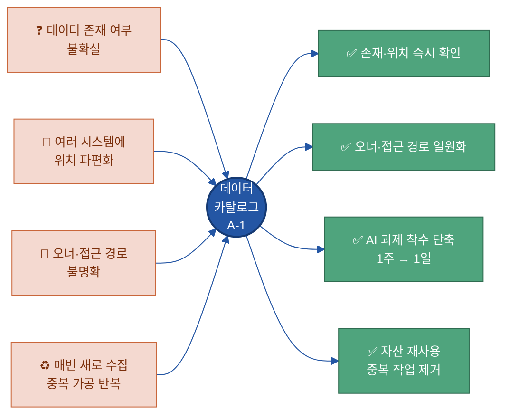

### 2.2 데이터 카탈로그 구축의 필요성

**👉 한 줄 요약:** 데이터 양이 늘수록 "있는데 못 찾는" 비용이 기하급수적으로 커지며, AI는 사람처럼 물어볼 수 없으므로 기계 판독 가능한 목록이 없으면 자동 탐색이 원천적으로 불가능하다.

#### 데이터 양 증가 → 발견 비용 문제

시스템이 하나뿐이고 데이터가 적을 때는 사람이 기억으로 "그건 MES에 있어요"라고 말할 수 있다. 그러나 두산전자처럼 SAP(ERP), MES, QMS, LIMS, SharePoint, 파일서버, 데이터레이크를 함께 운영하고, 각 시스템에 수십~수백 개의 테이블과 폴더가 있으면 사람의 기억은 더 이상 신뢰할 수 없다.

데이터 자산이 늘어날수록 발견 비용(탐색에 드는 시간과 노력)은 **선형이 아니라 급격히 증가**한다. 시스템이 3개에서 7개로 늘면 탐색해야 할 공간이 단순 증가하는 것이 아니라, 각 시스템 간 교차 탐색이 필요해지기 때문이다. 카탈로그는 이 발견 비용을 데이터 양에 무관하게 **일정 수준으로 묶는** 구조를 만든다.

#### AI는 물어볼 수 없다

사람은 "그 데이터 어디 있어요?"라고 동료에게 물어볼 수 있다. AI(RAG 검색, Agent)는 그렇게 할 수 없다. AI가 데이터를 활용하려면 **기계가 읽을 수 있는(machine-readable) 형태의 목록**이 있어야 한다. 카탈로그가 없으면 AI Agent가 "품질 검사 데이터를 분석해 줘"라는 지시를 받았을 때, 품질 검사 데이터가 어느 시스템 어느 경로에 있는지 알 방법이 없다. 카탈로그는 AI의 자율 탐색을 가능하게 하는 토대다.

> **용어 풀이**
> - **RAG(Retrieval-Augmented Generation = 검색 증강 생성):** AI가 답변을 생성하기 전에 관련 데이터·문서를 먼저 검색해서 참조하는 방식. 카탈로그가 있어야 "어떤 데이터를 검색할 수 있는지"의 인덱스가 만들어진다.
> - **AI Agent:** 사용자의 목표를 달성하기 위해 여러 도구와 데이터를 자율적으로 조합해 실행하는 AI 시스템.

#### 제조 현장의 특수성

두산전자 같은 제조 현장은 데이터 원천이 특히 다양하다. 센서·PLC(Programmable Logic Controller = 프로그래밍 가능한 설비 제어 장치)의 시계열 데이터, 검사 장비의 측정값, ERP의 자재·원가 데이터, LIMS의 시험 데이터, SharePoint의 보고서, 심지어 현장 작업자가 수기로 기록한 점검 일지까지 모두 잠재적 AI 활용 자산이다. 이처럼 이질적인 원천에서 나오는 자산들을 하나의 목록으로 통합하지 않으면, 어떤 데이터가 있는지 전체 그림을 그리는 것 자체가 불가능하다.

### 2.3 기대 효과

데이터 카탈로그가 제대로 구축되고 운영되면 다음 네 가지 효과를 얻을 수 있다.

**① 탐색 리드타임(Lead Time) 단축**

> 용어 풀이: **리드타임(Lead Time)** = 어떤 작업을 시작하고 완료하기까지 걸리는 총 시간.

"데이터 찾기"에 쓰던 시간을 실제 분석·모델링에 쓸 수 있다. 카탈로그가 갖춰지면 과제 착수 첫날 태그 검색 한 번으로 활용 가능한 자산 목록을 확인하고, 오너에게 접근 신청까지 이어진다.

🏭 **두산전자 예시:** 동박 결함 예측 AI 과제 착수 시 데이터 소재 파악에 소요되는 시간이 **`[As-Is에서 채움]`일 → 1일** 이내로 단축된다.

**② 데이터 중복 제거 및 재사용**

동일한 원천 데이터를 여러 팀이 각자 수집·정제하는 중복 작업을 없앤다. 카탈로그는 "이미 있는 자산"을 드러내어, 신규 AI 과제팀이 기존에 정제된 자산을 재사용할 수 있게 한다.

🏭 **두산전자 예시:** 품질보증팀이 정제한 "월별 수율 집계 테이블"이 카탈로그에 등록되어 있으면, 신규 원가분석 과제팀이 같은 데이터를 ERP에서 다시 추출·정제하지 않고 바로 쓸 수 있다.

**③ 신뢰 가능한 데이터 활용**

카탈로그에 등록된 자산에는 오너, 갱신 주기, 보안 등급, 데이터 유형이 명시된다. 이를 통해 "이 데이터를 믿어도 되나?"(최신인가? 오너가 있는가? 접근이 허가된 데이터인가?)를 빠르게 판단할 수 있다.

**④ AI 자동 탐색의 토대**

카탈로그가 구축되면 RAG(검색 증강 생성) 시스템이나 AI Agent가 필요한 데이터를 스스로 탐색할 수 있다. 자연어로 "동박 두께 검사 데이터 찾아줘"라는 질문이 들어오면, AI가 카탈로그를 참조해 관련 자산을 찾고 접근 경로를 안내할 수 있다. 이것이 "AI-ready"의 핵심이다 — 사람만 찾을 수 있는 데이터가 아니라, AI도 찾을 수 있는 데이터.

### 2.4 주요 기능 — 4요소 모델 연결

**👉 한 줄 요약:** 데이터 카탈로그의 기능은 4가지 핵심 요소로 구성되며, 이 4요소 모델이 이 가이드 전체에서 일관되게 사용된다.

카탈로그가 수행하는 기능을 분리해서 나열하면 탐색·등록·수집·관리 등 여러 표현이 혼재할 수 있다. 이 가이드에서는 **정본(Canonical) 모델**로 아래 4요소를 정의하고 3장 이후 모든 섹션에서 이 모델을 기준으로 설명한다.

| 구성요소 | 핵심 질문 | 역할 |
|---|---|---|
| **① 등록 항목** | 자산에 대해 무엇을 기록하는가? | 자산을 식별·접근하기 위한 최소 정보 목록 |
| **② 탐색 체계** | AI·사람이 어떻게 찾는가? | 업무 도메인·유형·조직·시스템 기준의 분류·검색 구조 |
| **③ 수집·연계** | 여러 시스템의 자산을 어떻게 모으는가? | 자동 커넥터 + 수동 등록을 통한 통합 목록 구성 |
| **④ 최신성 유지** | 목록이 현실과 일치하게 어떻게 갱신하는가? | 변경 감지·오너 확인·정기 점검을 통한 갱신 루프 |

🏭 **두산전자 예시로 4요소 연결.**
- **① 등록 항목:** "일일 품질검사 결과"를 `MES > QMS.dbo.INSP_RESULT > 품질보증팀 김OO > 일 1회 갱신 > 대외비`로 기록한다.
- **② 탐색 체계:** 과제팀이 `#품질 #검사` 태그로 검색하거나 "품질보증 도메인 > 정형 데이터 > MES" 경로로 탐색한다.
- **③ 수집·연계:** MES·QMS는 DB 커넥터로 자동 수집하고, SharePoint 보고서는 수동 등록 양식으로 등록한다.
- **④ 최신성 유지:** MES 테이블 구조가 변경되면 커넥터가 이를 감지해 오너에게 확인 요청을 보내고, 승인 후 카탈로그 정보가 갱신된다.

이 4요소의 상세 구조는 **3장 구성 체계**에서 본격적으로 다룬다.

---

## 3. 구성 체계

**👉 한 줄 요약:** 데이터 카탈로그는 **4개 구성요소** — ① 등록 항목 · ② 탐색 체계 · ③ 수집·연계 · ④ 최신성 유지 — 로 이루어지며, 이 문서 전체가 이 4요소 정본 모델을 일관되게 재사용한다.

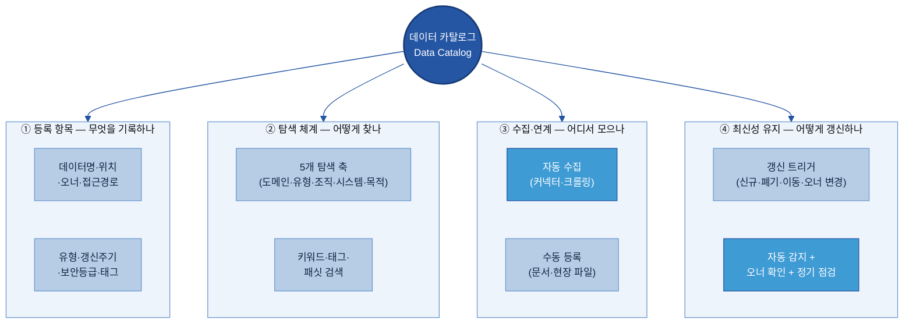

4요소는 서로 독립적이지 않다. **등록 항목**이 탐색·수집·최신성의 공통 기반이고, **탐색 체계**는 등록 항목의 분류·태그 품질에 의존하며, **수집·연계**는 자산을 처음 카탈로그에 올리는 공급선이고, **최신성 유지**는 이미 등록된 항목이 현실과 어긋나지 않도록 하는 운영 루프다.

### 3.1 ① 등록 항목 (Registration Items) — 자산을 "찾기 위한" 최소 정보

**👉 한 줄 요약:** 등록 항목은 "이 데이터가 어디에 누구 책임으로 있으며 어떻게 접근하는가"를 명확히 기록하는 최소 정보 집합이다.

카탈로그의 등록 항목은 **소재(所在) 식별 중심**이다. "이 필드가 무슨 의미인지"(→ 메타데이터 A-2), "이 용어의 정의가 무엇인지"(→ Glossary A-3)는 카탈로그 범위 밖이다. 카탈로그는 자산을 *찾고 접근하는* 데 필요한 정보만 담는다.

필수 등록 항목은 아래 10개다. 항목 수가 너무 많으면 등록 부담으로 공백이 늘어나고, 너무 적으면 탐색에 쓸 정보가 없다. 아래 10개는 "등록하지 않으면 탐색 자체가 불가능한" 항목만 남긴 것이다.

| # | 항목 | 설명 | 작성 기준 | 두산전자 완성 예시 |
|---|------|------|-----------|-------------------|
| 1 | **데이터명** | 자산을 부르는 공식 이름 | 업무에서 실제로 부르는 이름. 약어만 쓰지 않는다. | `일일 품질검사 결과 (INSP_RESULT)` |
| 2 | **보유 시스템** | 자산이 존재하는 시스템 | 솔루션명+용도 병기 | `MES (생산 실행 시스템)` |
| 3 | **저장 위치** | 테이블명·폴더 경로·DB 스키마 등 실제 위치 | 복사해서 접근할 수 있는 수준으로 적는다 | `QMS.dbo.INSP_RESULT` |
| 4 | **데이터 오너** | 이 자산의 정보 정확성과 접근 정책을 책임지는 사람 | 이름·직함·부서 모두 기재. 공백 불가 | `품질보증팀 김OO 책임` |
| 5 | **보유 부서** | 오너가 속한 관리 조직 | 오너 개인이 아니라 조직 단위를 별도로 기록 | `품질보증팀` |
| 6 | **접근 경로** | 이 자산에 접근하는 절차·방법 | 실제 신청 경로를 적는다 (URL·메일·시스템 내 경로) | `인트라넷 → 데이터 신청 → QMS 조회 권한 신청 (1일 이내 승인)` |
| 7 | **데이터 유형(Type)** | 정형/문서/이미지/시계열/반정형 등 | 3.2 탐색 체계의 필터 축에 사용. *(→ [Backup 3-2] 유형 분류 기준표 참고)* | `정형(Table)` |
| 8 | **갱신 주기** | 얼마나 자주 업데이트되는가 | 측정 빈도(1초·일·주·월·비정기 등) | `일 1회 (전일 생산 마감 후 00:30 반영)` |
| 9 | **보안 등급** | 민감도·공개 수준 | 사내 보안 분류 기준(공개/사내/대외비/기밀)에 따라 | `대외비` |
| 10 | **태그** | 탐색·필터에 쓰이는 키워드 | 도메인·공정·업무 기준으로 부여. 자유형 가능 | `#품질 #검사 #동박 #MES #제조` |

> 항목 수는 적더라도 **공백 없이 채워진 10개**가, 항목은 많지만 절반이 비어 있는 30개보다 낫다. 선택 항목(Description, 관련 시스템, AI 활용 목적 등)은 이후 메타데이터(A-2) 정비 단계에서 보강한다.

**🏭 두산전자 완성 예시 — 카드 1장:**

```
데이터명:     일일 품질검사 결과 (INSP_RESULT)
보유 시스템:  MES (생산 실행 시스템)
저장 위치:    QMS.dbo.INSP_RESULT
데이터 오너:  품질보증팀 김OO 책임  ☎ 내선 3214
보유 부서:    품질보증팀
접근 경로:    인트라넷 → 데이터 신청 → QMS 조회 권한 신청 (처리: 1 영업일)
데이터 유형:  정형(Table)
갱신 주기:    일 1회 (전일 생산 마감 후 00:30 자동 반영)
보안 등급:    대외비
태그:         #품질 #검사 #동박 #MES #제조 #AI활용가능
등록일:       2026-06-10  최종 갱신: 2026-06-17
```

> ▸ 백업: [Backup 3-1] 전체 등록 항목 표준 — Business / Technical / Operational / Compliance / AI 그룹 분류, 필수+선택 30개+ 필드

### 3.2 ② 탐색 체계 (Discovery Framework) — AI와 사람이 쉽게 찾는 분류 구조

**👉 한 줄 요약:** 탐색 체계는 "무엇으로 필터링하면 원하는 자산에 다다를 수 있는가"를 설계하는 것으로, 의미 해석이 아니라 **소재 탐색을 위한 분류 구조**만 다룬다.

카탈로그 탐색은 두 가지 경로로 이루어진다. 하나는 **브라우징(Browsing)** — 분류 축(패싯)을 따라 좁혀가는 방식, 다른 하나는 **검색(Search)** — 키워드·태그를 입력해 바로 찾는 방식이다. 실제 사용 시에는 두 경로가 혼합된다("품질 도메인에서 정형 데이터만 먼저 보고 → '검사'로 키워드 검색").

#### 5개 탐색 축 (패싯, Facets)

| 탐색 축 | 의미 | 두산전자 예시 값 |
|---------|------|-----------------|
| **업무 도메인** | 어떤 업무 영역의 데이터인가 | 품질보증 / 생산 / 설비관리 / 원가 / 구매 / 영업 |
| **데이터 유형** | 어떤 형태의 데이터인가 | 정형 / 문서 / 이미지 / 시계열 / 반정형 |
| **보유 조직** | 어느 부서가 관리하는가 | 품질보증팀 / 생산기술팀 / IT팀 / 구매팀 |
| **시스템** | 어느 시스템에서 나온 데이터인가 | SAP / MES / QMS / LIMS / SharePoint / 파일서버 / 데이터레이크 |
| **활용 목적** | 어떤 AI·업무 과제에 쓰이는가 | 품질 예측 / 설비 예지보전 / 원가 분석 / 클레임 분석 |

이 5개 축은 등록 항목(3.1)의 **도메인 태그·데이터 유형·보유 부서·보유 시스템** 필드에서 자동으로 채워진다. 즉, 등록 항목이 잘 채워져 있어야 탐색 체계가 작동한다.

#### 탐색 화면 구성 원칙

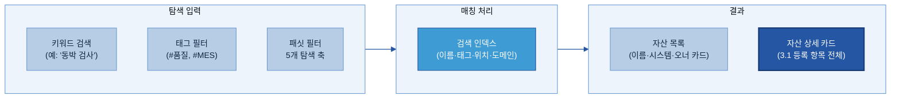

**검색 인덱스 설계 기준:** 카탈로그 검색은 데이터명·태그·보유 시스템·도메인을 기본 검색 대상으로 한다. Description(자산 설명)이 채워진 경우 전문 검색(Full-text Search)을 추가한다. 유의어·동의어 확장은 A-3 Glossary와 연결해 처리한다.

**🏭 탐색 시나리오 예시:** 두산전자 AI 과제자 이OO 선임이 동박 결함 예측 모델을 개발하려 한다. 카탈로그 탐색 화면에서 ① 업무 도메인 = "품질보증" 필터 → ② 시스템 = "MES" 필터 → ③ 태그 `#검사` 입력 → 3개 자산(`INSP_RESULT`, `DEFECT_HIST`, `LOT_JUDGE`)이 리스트에 표시 → 각 자산의 오너·접근 경로 즉시 확인 → 권한 신청 착수. 총 소요 시간 15분 (이전: 담당자 수소문 3일).

> 탐색 체계는 데이터의 **의미 해석**(이 필드가 무슨 뜻인지)을 제공하지 않는다. 그것은 A-2 메타데이터와 A-3 Glossary의 역할이다. 카탈로그 탐색은 어디에 무엇이 있는지를 찾는 것으로 끝난다.

### 3.3 ③ 수집·연계 (Data Source Integration) — 흩어진 자산 정보를 하나의 목록으로

**👉 한 줄 요약:** 원천 시스템마다 연계 방식이 다르므로, **자동 수집 가능 원천과 수동 등록 원천을 구분**해 파이프라인을 설계한다.

카탈로그가 "있는데 비어 있는" 상태가 되는 가장 큰 원인은 등록 파이프라인이 없어서다. 자산 정보를 일일이 손으로 입력하면 처음엔 채워지더라도 시스템 변경이 발생할 때 따라가지 못한다. 따라서 원천별로 **자동화 가능 여부를 먼저 판단**하고, 자동화가 어려운 영역에만 수동 등록 절차를 적용한다.

#### 자동 수집 vs 수동 등록 구분 기준

| 구분 | 조건 | 수집 방식 | 두산전자 해당 원천 |
|------|------|-----------|-------------------|
| **자동 수집** | DB·API·시스템 커넥터가 지원되는 원천 | 커넥터 또는 크롤러가 스키마·테이블·위치 정보를 주기적으로 자동 수집 | SAP·MES·QMS·LIMS·데이터레이크 |
| **수동 등록** | 표준 인터페이스가 없거나 개인 파일·현장 문서인 원천 | 표준 등록 양식(Form)으로 담당자가 직접 입력, 스튜워드가 검토 | SharePoint 문서·파일서버·개인 엑셀·현장 보고서 |

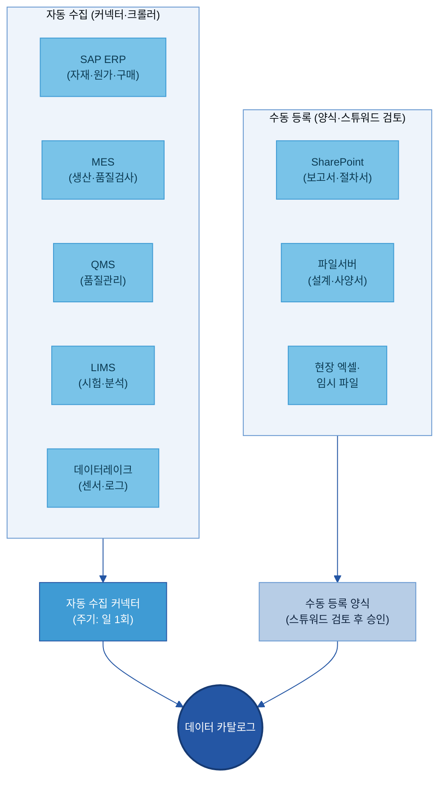

**자동 수집 커넥터의 역할:** 커넥터는 원천 시스템의 테이블 목록·스키마·저장 경로를 주기적(예: 일 1회)으로 스캔해 카탈로그에 신규 자산 후보를 생성한다. 단, 커넥터가 수집하는 것은 **기술적 소재 정보**뿐이다. 오너 지정·도메인 태그·보안 등급은 커넥터가 자동으로 채울 수 없으므로, 수집 후 **스튜워드 또는 오너의 검토·완성** 단계가 필요하다.

**수동 등록 양식 설계 기준:**
- 필수 항목 10개 중 자동으로 채울 수 없는 항목(오너·태그·보안 등급·활용 목적)만 입력창 구성.
- 보유 시스템·저장 위치는 입력자가 직접 기재하되, 드롭다운으로 시스템 목록을 안내.
- 제출 후 담당 스튜워드에게 자동 알림 → 검토·승인 후 카탈로그에 등록.

**🏭 수동 등록 예시 — SharePoint 분석 보고서:** 품질보증팀 담당자가 SharePoint에 있는 "CCL 결함 원인 분석 보고서 2025 Q4.pptx"를 카탈로그에 등록할 때, 양식에 ① 데이터명 ② 경로(`/quality/reports/2025Q4_CCL_defect.pptx`) ③ 오너(자신) ④ 태그(`#품질 #보고서 #CCL`) ⑤ 보안 등급(대외비)만 입력. 스튜워드 검토 후 1 영업일 내 등록 완료.

### 3.4 ④ 최신성 유지 (Freshness Management) — 목록이 현실과 일치하게

**👉 한 줄 요약:** 카탈로그는 등록보다 **유지**가 어렵다. 신규·폐기·위치 변경·오너 변경이 발생할 때마다 자동 감지 + 오너 확인 + 정기 점검 조합으로 최신 상태를 유지한다.

데이터 카탈로그의 실패 원인 1위는 "처음엔 잘 채웠는데 시간이 지나자 맞지 않게 됐다"는 것이다. 최신성 유지는 **갱신 트리거(언제 갱신되어야 하는가)** 와 **갱신 메커니즘(어떻게 감지하고 반영하는가)** 두 축으로 설계한다.

#### 갱신 트리거 — 카탈로그 갱신이 필요한 4가지 사건

| 트리거 | 발생 상황 | 카탈로그 갱신 내용 |
|--------|-----------|-------------------|
| **① 신규 생성** | 새 테이블/폴더/보고서가 생겼다 | 신규 자산 항목 추가 (자동 수집 대상은 후보 생성 → 오너 지정 후 확정) |
| **② 자산 폐기** | 시스템에서 테이블/파일을 삭제했다 | 카탈로그 상태를 "폐기(Deprecated)"로 변경. 즉시 삭제하지 않고 이력 보존 |
| **③ 저장 위치 변경** | 테이블명·경로·시스템이 바뀌었다 | 저장 위치 항목 갱신. 이전 경로를 "이전됨" 상태로 남겨 이용자 안내 |
| **④ 오너 변경** | 담당자 이동·퇴직·조직 개편으로 오너가 바뀌었다 | 데이터 오너·보유 부서 항목 갱신. 공백 기간 없이 후임자 지정 필수 |

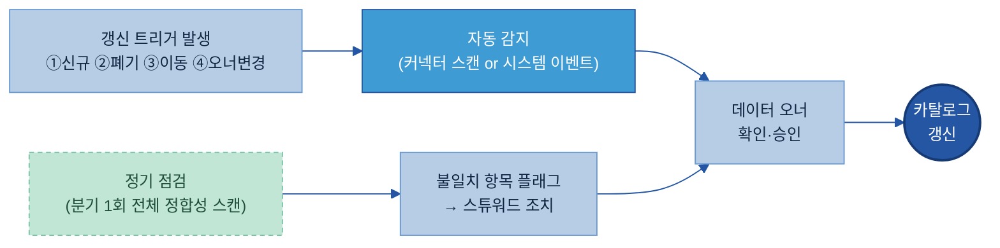

**자동 감지(Auto-Detection):** 커넥터가 주기적으로 원천을 스캔해 카탈로그 등록 정보와 대조한다. 신규 테이블 출현·기존 테이블 소멸·경로 변경을 감지하면 "갱신 후보" 알림을 생성한다.

**오너 확인(Owner Confirmation):** 자동 감지는 기술적 변경을 잡지만, 비즈니스 맥락은 오너만 안다. 알림을 받은 오너가 ① 변경 내용 확인 ② 카탈로그 항목 수정 또는 승인을 수행한다. 응답 없이 일정 기간(예: 5 영업일) 경과 시 스튜워드가 에스컬레이션한다.

**정기 점검(Periodic Audit):** 자동 감지가 놓친 변경(수동 등록 자산, 오너 퇴직 등)을 분기 1회 전체 정합성 스캔으로 보완한다. 점검 항목: ① 오너 재직 여부 ② 저장 위치 접근 가능 여부 ③ 갱신 주기 대비 실제 갱신 여부 ④ 미등록 신규 자산 존재 여부.

**🏭 최신성 유지 예시 — 오너 변경 케이스:** 두산전자 품질보증팀 김OO 책임이 타 부서로 이동했다. HR 시스템 연동(또는 스튜워드 수동 감지)으로 카탈로그에 "오너 미지정 위험" 알림이 발생한다. 팀장이 후임자 이OO 선임을 오너로 지정 → 카탈로그의 데이터 오너 항목이 즉시 갱신된다. 공백 기간 없이 접근 정책·승인 책임이 이어진다.

> ▸ 백업: [Backup 3-2] 데이터 유형(Type) 분류 기준표

---

## 4. 추진 역할 및 책임

**👉 한 줄 요약:** 카탈로그는 "전사 표준 1개 + 계열사 등록·오너 책임"의 분업으로 운영하며, 역할이 명확해야 항목이 채워지고 최신성이 유지된다.

역할 정의는 카탈로그 운영의 지속성을 결정한다. 등록 항목을 아무리 잘 설계해도 "누가 채우고 누가 확인하는지"가 불분명하면, 카탈로그는 처음에는 채워지다가 점차 방치된다.

### 4.1 주요 담당자 정의

- **카탈로그 관리자(Catalog Admin):** 전사 데이터 카탈로그 체계 전체를 설계·운영. 표준 항목 정의, 솔루션 운영, 커넥터 개발·유지, 전사 KPI 관리. (지주/전사 데이터 조직)
- **데이터 스튜워드(Data Steward):** 특정 도메인의 등록 품질·분류 일관성 유지. 수동 등록 검토·승인, 미채움 독촉, 자동 수집 후처리, 분기 점검 주관. (계열사 데이터 담당)
- **데이터 오너(Data Owner):** 특정 자산의 정보 정확성·접근 정책 책임. 갱신 확인·승인, 신규 등록 제출, 접근 신청 승인. 하나의 자산에 오너 1명(책임 희석 방지). 데이터를 가장 잘 아는 현업 실무 책임급으로 지정.
- **이용자(Data Consumer):** 탐색·활용, 접근 신청, 오류·미등록 제보, 활용 후기 피드백. (AI 과제자·분석가·현업)

### 4.2 역할별 책임 구분 (RACI)

> **RACI 기호:** R = Responsible(실행), A = Accountable(최종 책임·승인), C = Consulted(협의), I = Informed(통보)

| 활동 | 카탈로그 관리자 | 스튜워드 | 데이터 오너 | 이용자 |
|------|:---:|:---:|:---:|:---:|
| 등록 항목 표준·필드 정의 | **A/R** | C | C | I |
| 유형·분류 체계 기준 수립 | **A/R** | C | I | I |
| 커넥터·자동 수집 개발 | **A/R** | I | I | — |
| 신규 자산 등록 (수동) | I | **A** | **R** | — |
| 자동 수집 후처리(도메인·태그·오너 초안) | I | **A/R** | C | — |
| 분류·태그 품질 검토·수정 | C | **A/R** | R | — |
| 갱신 후보 확인·승인 | I | C | **A/R** | — |
| 정기 점검(분기 전체 정합성) | A | **R** | R | I |
| 오너 미응답 에스컬레이션 | I | **R** | — | — |
| 자산 폐기·이동 신고 | I | C | **A/R** | — |
| 이용자 접근 신청 승인 | I | I | **A/R** | — |
| 카탈로그 탐색·활용 | — | — | I | **R** |
| 오류·미등록 자산 제보 | I | **A** | C | **R** |
| KPI 모니터링·리포팅 | **A/R** | C | I | I |

### 4.3 계열사 상황에 따른 담당 조직 조정 기준

데이터 전담 조직 유무에 따라 역할을 겸임으로 시작하되, 명확한 이양 기준을 둔다.

| 구분 | 데이터 조직 미보유 (소규모) | 데이터 조직 신설 1~2년 (중규모) | 데이터 조직 정착 (대규모) |
|------|----------------------------|--------------------------------|--------------------------|
| 카탈로그 관리자 | 지주 데이터 조직 대행 | 계열사 IT팀+지주 지원 | 계열사 데이터 조직 자체 운영 |
| 데이터 스튜워드 | 현업 부서장·IT 담당 겸임 | 계열사 데이터 담당자 1~2명 | 도메인별 전담 스튜워드 |
| 데이터 오너 | 시스템 주관 팀장 겸임 | 실무 책임급 지정 | 자산별 실무 책임급 |
| 초기 등록 | 지주 대행 → 점진 이양 | 지주+계열사 협업 | 계열사 자율 |
| 적합 예시 | 직원 200명 이하 | 두산전자(신설 1년차) | 대형 계열사 |

**오너 공백 방지 원칙(공통):** 오너가 공석이 되면 즉시 후임 지정(부서장 임시 오너라도 공백보다 낫다). 분기 점검 시 오너 재직 여부 확인. HR 시스템 연계로 퇴직·이동 자동 알림 설정이 이상적이다.

#### [Backup 3-1] 전체 등록 항목 표준 — 필수·선택 그룹별 32개 필드

> 본문 3.1은 "찾기 위한 10개 필수 항목"만 다뤘다. 실제 구축 시 아래 전체 필드로 솔루션 스키마를 설계한다. 그룹(Business/Technical/Operational/Compliance/AI)은 화면 탭·필터로 활용한다.

| 그룹 | # | 항목명 | 필수/선택 | 두산전자 예시 |
|------|---|--------|-----------|---------------|
| Business | 1 | 데이터명 | 필수 | `일일 품질검사 결과 (INSP_RESULT)` |
| Business | 2 | 업무 도메인 | 필수 | `품질보증` |
| Business | 3 | 자산 설명(Description) | 선택 | `동박 라인 일일 외관·전기적 특성 검사 결과` |
| Business | 4 | 활용 목적 | 선택 | `품질 예측 모델 학습, 클레임 원인 분석` |
| Business | 5 | 관련 업무 프로세스 | 선택 | `생산 → 외관검사 → 판정 → MES 기록` |
| Technical | 6 | 보유 시스템 | 필수 | `MES` |
| Technical | 7 | 저장 위치 | 필수 | `QMS.dbo.INSP_RESULT` |
| Technical | 8 | 데이터 유형 | 필수 | `정형(Table)` |
| Technical | 9 | 파일 형식 | 선택 | `SQL Server Table` |
| Technical | 10 | 데이터 크기 | 선택 | `약 3,000행/일, 누적 500만 행` |
| Technical | 11 | 주요 컬럼 | 선택 | `LOT_ID, LINE_CD, INSP_DT, DEFECT_CD, JUDGE_RESULT` |
| Technical | 12 | 연계 시스템 | 선택 | `데이터레이크, 품질 대시보드, AI 품질 예측` |
| Technical | 13 | 인코딩·언어 | 선택 | `UTF-8` |
| Operational | 14 | 데이터 오너 | 필수 | `품질보증팀 김OO 책임` |
| Operational | 15 | 보유 부서 | 필수 | `품질보증팀` |
| Operational | 16 | 접근 경로 | 필수 | `인트라넷 → 데이터 신청 → QMS 조회 권한` |
| Operational | 17 | 갱신 주기 | 필수 | `일 1회 (00:30 자동)` |
| Operational | 18 | 최초 생성일 | 선택 | `2021-03-15` |
| Operational | 19 | 데이터 생성 시작일 | 선택 | `2019-01-01` |
| Operational | 20 | 태그 | 필수 | `#품질 #검사 #동박 #MES` |
| Operational | 21 | 카탈로그 등록일 | 자동 | `2026-06-10` |
| Operational | 22 | 최종 갱신일 | 자동 | `2026-06-17` |
| Operational | 23 | 등록 방식 | 자동 | `자동 수집 (MES 커넥터)` |
| Compliance | 24 | 보안 등급 | 필수 | `대외비` |
| Compliance | 25 | 개인정보 포함 여부 | 필수 | `미포함` |
| Compliance | 26 | 사용 목적 제한 | 선택 | `사내 분석 목적 한정` |
| Compliance | 27 | 법적 보존 기간 | 선택 | `5년 (품질 기록)` |
| Compliance | 28 | 관련 규제·표준 | 선택 | `ISO 9001, 고객 품질 협약` |
| AI | 29 | AI 활용 가능 등급 | 선택 | `원본 사용 가능 (내부 학습 한정)` |
| AI | 30 | 품질 점수 | 선택 | `94 / 100` |
| AI | 31 | 전처리 필요 여부 | 선택 | `필요 (결측치 처리, 코드 디코딩)` |
| AI | 32 | Lineage 연결 | 선택 | `연결됨 (dl/silver/quality/insp_result_daily)` |

> 필수 10개부터 채우고, AI 그룹(29~32)은 C-2·C-3 정비가 진행될수록 자동 연동으로 보강한다.

#### [Backup 3-2] 데이터 유형(Type) 분류 기준표

| 유형 | 설명 | 두산전자 예시 | AI 활용 시 특이사항 |
|------|------|---------------|---------------------|
| 정형(Structured) | DB 테이블·정형 CSV | INSP_RESULT, CLAIM_HIST, BOM | 컬럼 메타데이터(A-2) 연결 필수 |
| 문서(Document) | PDF·Word·PPT·Excel 보고서·절차서 | 결함 분석 보고서, SOP, FMEA | B-1 전처리(Chunking) 필요 |
| 이미지(Image) | 사진·스캔 이미지 | 외관 결함 사진, 단면 이미지 | 라벨링(B-2) 필요 |
| 시계열(Time-series) | 센서·PLC·MES 주기 수집 수치 | 동박 두께(1초), 설비 전류·진동 | 샘플링 주기·단위 정확성이 AI 성능에 직결 |
| 반정형(Semi-structured) | JSON·XML·로그·이메일 | API 응답 JSON, 설비 알람 로그 | 스키마 파싱·전처리 필요 |
| 동영상(Video) | 검사 영상 | 표면 검사 인라인 카메라 | 대용량·프레임 단위 처리 |
| 오디오(Audio) | 음성·소리 | 설비 이상음 녹음 | STT·신호 분석 필요 |

> 하나의 자산이 여러 유형을 포함하면 **주된 활용 방식** 기준으로 대표 유형 1개를 선택하고 나머지는 태그로 보완한다.

---

## 5. 데이터 현황 조사 및 등록 대상 선정

**👉 한 줄 요약:** 모든 데이터를 한 번에 등록하지 않는다 — **AI 활용 가능성 · 업무 중요도 · 재사용성** 세 축으로 우선순위를 정해, 핵심 자산부터 단계적으로 등록한다. *(Key Question 1 핵심 답변)*

### 5.1 등록 대상 기준 정의 — "모든 데이터"를 대상으로 삼지 않는 이유

데이터 카탈로그 구축에서 가장 흔한 실패는 **"일단 다 넣자"** 로 시작하는 것이다. 등록 부담이 폭증해 등록이 멈추고, 오래된·관리자 없는 항목이 쌓여 "검색해도 믿을 수 없다"는 인식이 생긴다. 원칙은 하나다 — **AI 과제와 핵심 업무에서 실제로 찾아야 할 데이터부터 시작한다.**

| 기준 축 | 판단 질문 | 두산전자 예시 |
|---|---|---|
| ① AI 활용 가능성 | AI 학습·추론·RAG·분석에 투입될 수 있는가 | MES 품질검사 결과, 고객 클레임 이력 |
| ② 업무 중요도 | 없으면 핵심 업무(생산·품질·원가)가 멈추는가 | SAP 원가 월마감, QMS 판정 이력 |
| ③ 재사용성 | 여러 팀·과제에서 반복 활용되는가 | LIMS 실험 결과, 동박 두께 시계열 |

> 세 축 중 **두 개 이상** 해당하면 등록 대상, 하나만 해당하면 Wave 2 후보, 없으면 후순위·제외 검토.

🏭 **두산전자 예시:** 동박 두께 측정 시계열은 AI 활용 가능성(예지보전)과 재사용성(품질·설비·개발팀)이 높아 Wave 1. 팀장 PC 임시 비교 엑셀은 세 기준 모두 낮아 제외.

### 5.2 데이터 유형별 등록 / 제외 기준

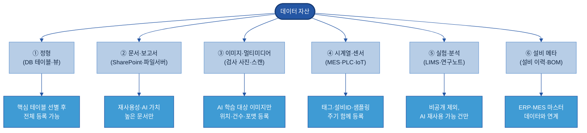

- **① 정형:** 커넥터 자동 수집 가능 → 핵심 테이블 선별 후 전체 등록. 임시 뷰·로그성·운영 내부 테이블은 제외.
- **② 문서·보고서:** 정기 배포 보고서·표준 절차서·품질 분석 자료 등 재사용성 입증 문서만 선별.
- **③ 이미지:** "어떤 이미지가 어디에 얼마나 어떤 포맷으로" 등록. 세부 라벨링은 B-2로 연결.
- **④ 시계열:** 설비 ID·공정 ID·샘플링 주기·단위·경로 함께 등록. 설비·공정 단위로 묶어 등록 권장.
- **⑤ 실험·분석:** 비공개·진행 중 실험은 오너 확인 필수. 완료·공개 동의 건만.
- **⑥ 설비 메타:** ERP·MES 마스터 데이터와 연계 등록.

**제외 기준:** 개인 PC 임시 백업 / 중복 복사본 / 폐기 예정·사용 중단 / 외부 반입 제한 / 테스트·더미 데이터.

### 5.3 정형 데이터 중요도 선별 기준

| 선별 지표 | 측정 방법 | 두산전자 예시 |
|---|---|---|
| 사용 빈도 | 쿼리 로그·ETL 참조 횟수(최근 6개월) | `INSP_RESULT` 월 평균 400회 조회 |
| 연계 시스템 수 | 참조 시스템·파이프라인 수 | 품질검사 결과가 MES·BI·AI 3개 참조 |
| 다운스트림 영향도 | 오류 시 영향받는 보고서·서비스·모델 수 | 월 품질 KPI 리포트·결함 예측 모델 |

> **선별 기준(예시):** 세 지표 합산 상위 20% → Wave 1, 21~50% → Wave 2, 나머지 → Wave 3/On-Demand.

### 5.4 데이터 수집(취합) 방식 — 자동 수집 vs 수동 등록 *(Key Question 3과 연결)*

- **자동 수집(커넥터):** SAP·MES·QMS·LIMS 등 DB 기반 시스템은 솔루션 커넥터/JDBC로 스키마·테이블·통계를 자동 크롤. 데이터레이크는 메타스토어 연동. 신규 테이블·컬럼 변경이 자동 감지된다.
- **수동 등록(양식+오너):** SharePoint·파일서버·개인 파일 등 비정형 자산은 오너가 표준 양식(웹 UI/엑셀 일괄)으로 직접 입력. 최소 항목: 자산명·위치·오너·유형·갱신 주기·보안 등급·태그.

> 💡 초기엔 자동 수집 자산부터 시작해 속도를 높이고, 수동 등록은 "오너 확인 이벤트"(신규 보고서 업로드 시 등록 링크 안내)에 연계해 누락을 줄인다.

### 5.5 보안 검토 기준 — 소재 노출 vs 접근 통제 분리

| 보안 등급 | 카탈로그 노출 범위 | 접근 통제 |
|---|---|---|
| 공개(Public) | 전체 항목 | 최소 인증 |
| 사내(Internal) | 전체 항목 | 임직원 인증 |
| 제한(Restricted) | 자산명·도메인·오너만 / 위치·경로 숨김 | RBAC 또는 오너 승인 |
| 대외비(Confidential) | 소재(자산명·부서)만 — "요청 시 오너 문의" | 오너 승인 + 보안 검토 |
| 극비(Highly Restricted) | 미등록 또는 별도 격리 카탈로그 | C-2 별도 통제 |

🏭 **예시:** `CS.CLAIM_HIST`(고객사명·단가 포함)는 대외비 → 카탈로그엔 "고객 클레임 이력(CS팀 박OO, 대외비)"만 표시, 접근은 오너 승인 후. `MES.PROD_LOG`는 사내 → 전 항목 공개·임직원 인증.

> ▸ 접근 차단의 상세 정책(RBAC·ABAC)은 **C-2 데이터 품질관리** 참고. 카탈로그는 "소재+등급" 표시까지.

### 5.6 최종 등록 대상 및 우선순위 — Wave 단계 확장

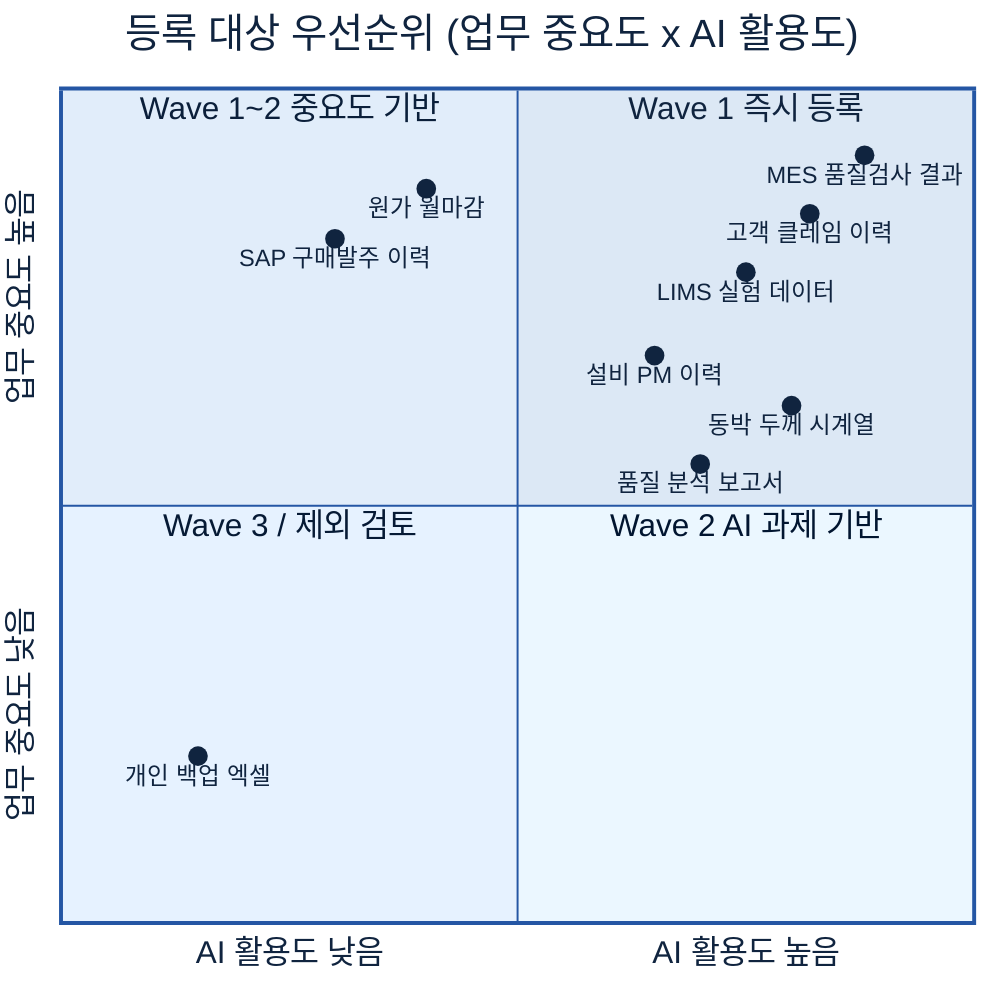

| Wave | 시기 | 대상 | 두산전자 예시 |
|---|---|---|---|
| Wave 1 | 1~3개월 | AI·업무 중요도 모두 높은 핵심 50~100건, 자동 수집 DB 중심 | MES 품질검사, 클레임, LIMS 실험, SAP 원가 |
| Wave 2 | 4~9개월 | 한쪽이 높은 자산 100~200건, 문서·시계열 포함 | 설비 PM, SharePoint 보고서, 동박 시계열 |
| Wave 3 | 10개월~ | 나머지 + On-Demand | 구매 발주 이력, 아카이빙 예정 레거시 |

🏭 **두산전자 Wave 1 목표:** 핵심 100건을 3개월 내 등록. 커넥터로 SAP·MES·QMS 80건 자동 + SharePoint 보고서 20건 수동.

### 5.7 ★ 자동화로 수작업 최소화 — "사람이 다 찾아 정리하지 않는다"

**👉 한 줄 요약:** 등록 대상이 수백 건이라고 사람이 일일이 다 찾아 입력하는 것이 아니다 — **메타데이터의 약 70~90%는 솔루션이 자동 수집**하고, 사람은 *비즈니스 의미·보안 등급·최종 검수*만 맡는다.

데이터 카탈로그 구축이 실패하거나 멈추는 가장 큰 오해가 "사람이 전사 데이터를 다 조사해 손으로 채운다"는 것이다. 그렇게 하면 등록이 끝나기 전에 지치고, 끝나도 곧 낡는다. 올바른 전제는 **작업의 무게중심을 "입력"에서 "검수"로 옮기는 것**이다.

**자동화 5대 메커니즘:**

| # | 메커니즘 | 자동으로 채워지는 것 | 사람이 하는 것 |
|---|---|---|---|
| 1 | **커넥터 자동 스캔** | 원천(Oracle·MS SQL·S3·BI)에서 스키마·컬럼·타입·건수·갱신일 추출 | 도메인·태그·오너 확정 |
| 2 | **로그 기반 중요도 산정** | 쿼리·ETL·BI·API 로그로 사용 빈도·중요도 Tier 자동 계산(5.3) | Tier 임계값 조정 |
| 3 | **Lineage 자동 추출** | ETL·SQL 파싱으로 데이터 흐름도 자동 생성 | (상세 추적은 [C-3](C-3%20데이터%20계통%20Lineage.md)) |
| 4 | **AI 메타 초안 생성** | LLM이 Description·태그·품질 코멘트 초안 제시 | 초안 승인·수정(12장 2단계) |
| 5 | **템플릿 배치 + 스케줄/이벤트 수집** | 비정형은 엑셀 템플릿 일괄 업로드, 이후 스케줄·이벤트로 자동 갱신 | 신규 자산 최초 1회 등록 |

> **핵심 재정의:** 카탈로그 운영은 "전수 입력"이 아니라 **"자동 수집 → 사람 검수·승인"**이다. 사람은 기계가 모르는 것(업무 맥락·보안 판단·최종 책임)에만 개입한다. 이 전제가 없으면 카탈로그는 항상 인력 부족으로 멈춘다.

> ▸ 백업: [Backup 5-1] 등록 대상 선정 체크리스트

#### [Backup 5-1] 등록 대상 선정 체크리스트

**[A] 기본 자격(하나라도 N이면 제외/보류):** 실재 여부 / 오너 지정 가능 / 오너 동의 / 보안 "극비" 이하 / 중복 아님(원본).
**[B] 우선순위 점수(1~3):** AI 과제 활용 예정 / 핵심 업무 직결 / 2개 이상 팀·시스템 참조 / 커넥터 지원 / 갱신 주기 명확.
> Wave 기준: B 합계 12~15 → Wave 1 / 8~11 → Wave 2 / 7 이하 → Wave 3·제외.
**[C] 보안 등록 형태:** 전체 공개 / 소재만 노출 / 요청 시 제공 / 격리 등록.

---

## 6. 데이터 카탈로그 솔루션 선정 검토

**👉 한 줄 요약:** 솔루션은 "현재 원천 시스템과의 커넥터 범위 · 자동 메타 수집 · 계열사 확장성" 기준으로 고르고, 반드시 두산 실제 원천 2~3종 연결 PoC(Proof of Concept = 사전 검증)로 검증한 뒤 도입한다.

### 6.1 솔루션 유형
- **상용:** [Collibra](https://www.collibra.com) · [Alation](https://www.alation.com) · [Informatica](https://www.informatica.com/products/data-catalog.html) · [Microsoft Purview](https://learn.microsoft.com/purview/) · [Atlan](https://atlan.com) — 기능 완성도·벤더 지원, 라이선스 비용.
- **오픈소스:** [DataHub](https://datahubproject.io) · [OpenMetadata](https://open-metadata.org) · [Apache Atlas](https://atlas.apache.org) — 무료·커스터마이징, 직접 운영 부담.
- **클라우드 내장:** [AWS Glue Data Catalog](https://docs.aws.amazon.com/glue/latest/dg/catalog-and-crawler.html) · [Google Dataplex](https://cloud.google.com/dataplex) — 클라우드 연동 간편, 멀티클라우드 제약.

> 출처는 각 제품 공식 페이지다(아래 [참고자료](#참고자료-references)에 재정리). 기능·지원 범위·가격은 변동되므로 본 표는 방향성 참고용이며, **구체 사양은 공식 문서·벤더 데모·PoC로 확인**한다.

### 6.2 주요 솔루션 후보군 검토

> 가격·버전은 시점에 따라 변하므로 공식 자료에서 확인할 것 — 아래는 기능 방향성 중심.

| 솔루션 (공식 페이지 링크) | 주요 특징 | 두산 관점 고려사항 |
|---|---|---|
| **[Collibra](https://www.collibra.com)** | 거버넌스·스튜워드십·용어집·정책·Lineage 통합 엔터프라이즈 | 거버넌스 성숙 조직에 적합, 초기 복잡도 |
| **[Alation](https://www.alation.com)** | 데이터 탐색 UX·행동 기반 인기 자산 추천 | 셀프서비스 자율 탐색 환경 구축에 강점 |
| **[Informatica CDGC](https://www.informatica.com/products/data-catalog.html)** | ETL+카탈로그 통합, Lineage·품질 통합 | Informatica ETL 사용 계열사에 효율적 |
| **[Microsoft Purview](https://learn.microsoft.com/purview/)** | M365·Azure 깊은 연동, SharePoint·SQL·Fabric 자동 스캔 | M365·SharePoint 환경에서 문서+정형 함께 관리 친화적 |
| **[Atlan](https://atlan.com)** | 협업 중심 모던 UX, Slack·Jira 연동, AI 메타 자동 생성 | 작은 팀 빠른 시작, 대규모 거버넌스는 확장 필요 |
| **[DataHub](https://datahubproject.io)** (오픈소스) | LinkedIn 오픈소스, REST/GraphQL·Kafka 기반 실시간 메타 | 혼합 환경 커스터마이징, Kafka·ES 운영 역량 필요 |
| **[OpenMetadata](https://open-metadata.org)** (오픈소스) | All-in-one 카탈로그·Lineage·품질, 70+ 커넥터, 가벼움 | 빠른 초기 구축·다양한 커넥터 필요 시 |
| **[Apache Atlas](https://atlas.apache.org)** (오픈소스) | Hadoop 생태계 거버넌스 표준, Lineage 내장 | 데이터레이크 중심, 현대적 UX는 제한적 |
| **[AWS Glue Data Catalog](https://docs.aws.amazon.com/glue/latest/dg/catalog-and-crawler.html)** | AWS 네이티브, Glue Crawler 자동 크롤 | AWS 데이터레이크 계열사에 저비용, 멀티클라우드는 수동 |
| **[Google Dataplex](https://cloud.google.com/dataplex)** | GCP BigQuery·GCS 통합, 품질 스캔·정책 태그 | GCP 환경 최적, 비구글 원천 별도 확인 |

### 6.3 솔루션 기능 비교 기준 (7개)
① 커넥터 범위 ② 자동 메타 수집 ③ 검색·탐색 UX ④ 권한·거버넌스(RBAC) ⑤ Lineage 연계(C-3) ⑥ AI 기능(자동 태깅·자연어 탐색) ⑦ 계열사 확장성(멀티 도메인).

### 6.4 솔루션 평가 및 PoC 기준

**평가 4단계:** 기능 비교(RFI·데모) → 후보 2~3개 압축(커넥터 범위·확장성으로 탈락 우선) → PoC(실제 원천 연결) → 최종 결정(PoC+TCO+지원+운영 역량).

🏭 **두산전자 PoC 검증 시나리오:**

| 검증 항목 | 방법 | 합격 기준(예시) |
|---|---|---|
| 원천 연결 | SAP+MES+SharePoint 커넥터 | 3개 연결 성공, 스키마 자동 수집 |
| 자동 수집률 | Wave 1 대상 50개 크롤 | 스키마·건수·갱신일 90%+ |
| 검색 정확도 | "품질검사"·"동박 두께"·"클레임" | 관련 자산 상위 3건 내 |
| 권한 연동 | 보안 등급별 노출 통제 | 대외비 위치·경로가 무권한자에 숨김 |
| 수동 등록 | SharePoint 문서 10건 | 건당 5분 이내 |

### 6.5 기능 단위(세부 영역별) 솔루션 제안 — Best-of-Breed

**👉 한 줄 요약:** 카탈로그는 하나의 통짜 제품이 아니라 **여러 기능 영역의 조합**이다. 기능별로 가장 강한 도구(Best-of-Breed)를 조합할 수도, 상용 번들 하나로 갈 수도 있다 — 엔지니어링 역량과 통합 부담 허용도로 결정한다.

| 기능 영역 | 역할 | 오픈소스 예 | 상용 예 |
|---|---|---|---|
| ① 수집/Ingestion | 원천 메타 추출 | [OpenMetadata](https://open-metadata.org) Ingestion | [Collibra](https://www.collibra.com) Edge, [Informatica](https://www.informatica.com/products/data-catalog.html) Scanner |
| ② Lineage | 흐름 추적 | [OpenLineage](https://openlineage.io)+Marquez | Manta, Collibra |
| ③ 메타 저장소 | 그래프 저장 | [DataHub](https://datahubproject.io), OpenMetadata | (상용 내장) |
| ④ 검색/인덱스 | 키워드+NLP 검색 | [Elasticsearch](https://www.elastic.co)+Nori(한국어 형태소) | (상용 내장) |
| ⑤ 거버넌스/권한/마스킹 | 정책·접근 통제 | [Apache Ranger](https://ranger.apache.org), [Unity Catalog](https://www.unitycatalog.io) | [Immuta](https://www.immuta.com), Privacera |
| ⑤-1 PII 탐지 | 민감정보 발견 | [Microsoft Presidio](https://microsoft.github.io/presidio/) | BigID, [AWS Macie](https://aws.amazon.com/macie/), Microsoft Purview |
| ⑥ 데이터 품질 | 룰 검증 | [Great Expectations](https://greatexpectations.io), [Soda](https://www.soda.io), [dbt](https://www.getdbt.com) tests | [Monte Carlo](https://www.montecarlodata.com), Anomalo |
| ⑦ AI 메타/Semantic | 자동 설명·의미 검색 | LLM+API, [Cube](https://cube.dev) Semantic Layer | Informatica CLAIRE, Atlan AI, Alation |
| ⑧ 비정형/벡터/피처 | AI 자산 관리 | [pgvector](https://github.com/pgvector/pgvector), [Milvus](https://milvus.io), [Feast](https://feast.dev) | [Pinecone](https://www.pinecone.io), [Tecton](https://www.tecton.ai), Databricks Feature Store |

> **설계 원칙:** ⑤ 거버넌스/권한·⑥ 품질·⑧ 벡터/피처는 카탈로그 본체가 아니라 [C-2 품질관리](C-2%20데이터%20품질%20관리.md)·[F-4 보안] 등 인접 주제 도구와 연계되는 영역이다. 카탈로그(A-1)는 ①~④(수집·Lineage·메타 저장·검색)가 본령이고, 나머지는 "연계해 표시"한다(10장 참조). 각 도구의 기능·지원 범위는 공식 페이지(아래 [참고자료](#참고자료-references))와 PoC로 확인한다.

> ▸ 백업: [Backup 6-1] 솔루션 기능 비교 매트릭스

#### [Backup 6-1] 솔루션 기능 비교 매트릭스

> PoC 전 초기 스크리닝용. (○ 지원 / △ 부분·커스텀 / × 미지원) — 버전·계약별로 다르므로 **반드시 데모·PoC로 직접 확인**, 가격은 단정하지 않는다.

| 기능 기준 | Collibra | Alation | Informatica | Purview | Atlan | DataHub | OpenMetadata | AWS Glue |
|---|:--:|:--:|:--:|:--:|:--:|:--:|:--:|:--:|
| SAP ERP 커넥터 | ○ | △ | ○ | △ | △ | △ | △ | × |
| MES/QMS DB 커넥터 | △ | △ | △ | △ | △ | ○ | ○ | △ |
| SharePoint 문서 연동 | △ | × | △ | ○ | △ | × | × | × |
| 데이터레이크 커넥터 | ○ | ○ | ○ | ○ | ○ | ○ | ○ | ○ |
| 스키마 자동 크롤 | ○ | ○ | ○ | ○ | ○ | ○ | ○ | ○ |
| AI 메타 자동 생성 | ○ | ○ | △ | ○ | ○ | △ | △ | × |
| 자연어 검색 | ○ | ○ | △ | ○ | ○ | △ | △ | × |
| RBAC 권한 통제 | ○ | ○ | ○ | ○ | ○ | ○ | ○ | △ |
| Lineage 내장 | ○ | ○ | ○ | ○ | △ | ○ | ○ | △ |
| 계열사 멀티 도메인 | ○ | ○ | ○ | △ | △ | ○ | △ | × |
| 오픈소스 | × | × | × | × | × | ○ | ○ | × |
| 온프레미스 설치 | △ | △ | ○ | × | × | ○ | ○ | × |

---

## 7. 계열사 적용 예시: 두산전자 데이터 카탈로그 구축 시나리오

**👉 한 줄 요약:** 두산전자(CCL·동박적층판 제조)를 가상 무대로, 데이터 환경 파악부터 등록·운영·기대 효과까지 실제값이 채워진 완성 예시를 보여준다.

> **이 섹션의 모든 값은 가상 시나리오다.** 시스템·테이블명·담당자 이름은 교육 목적으로 채웠으며 실제 두산전자 현황과 다를 수 있다.

### 7.1 데이터 환경 가정

두산전자는 PCB 원자재인 **CCL(Copper Clad Laminate = 동박적층판)**과 동박(Copper Foil)을 제조한다. CCL은 두께·박리 강도·표면 조도가 엄격히 관리돼야 한다. AI 최우선 주제는 **동박 결함률 예측**과 **CCL 박리 강도 이상 조기 탐지**다.

| 시스템 | 용도 | 기술 스택 | 데이터 형태 |
|---|---|---|---|
| SAP ERP | 구매·생산계획·원가·재고 | SAP S/4HANA | 정형 |
| MES | 공정 실행·작업지시·생산이력 | 자체 구축(Oracle) | 정형 |
| QMS | 검사 기준·결과·부적합 | 자체 구축(MS SQL) | 정형 |
| LIMS | 원자재·완제품 시험 성적 | LabWare LIMS | 정형+문서 |
| SharePoint | 품질보고서·SOP·분석 보고서 | SharePoint Online | 문서 |
| 파일서버 | 결함 이미지·도면 | Windows File Server | 이미지·CAD |
| 데이터레이크 | 센서 시계열·MES 로그 | Azure Data Lake Gen2 | 시계열·Parquet |

**데이터 규모 가정:** 검사·시험 결과 ~30개 테이블(일 ~15,000건), 생산 이력 ~50개 테이블, 문서 ~4,000건, 센서 ~120개 태그(초당 120포인트), 이미지 ~12,000건/월. **등록 가능 자산 약 600~800건, Wave 1에서 핵심 200건.**

🏭 **현재 Pain(AS-IS):** AI 과제팀이 "동박 결함률 예측" 착수 시, QMS 테이블 확인 3일 + MES 테이블 수소문 5일 + LIMS 추출 2일 + 결함 이미지 폴더 탐색 4일 → **총 14일 중 7~8일이 "어디 있지?" 해결에 소모.**

### 7.2 구축 목표

| 목표 | 세부 | 기준 시점 |
|---|---|---|
| 핵심 자산 등록 | 품질·생산·설비 200건+ | 6개월 내 |
| 탐색 가능화 | 데이터명·시스템·오너·접근 경로 검색 | 6개월 내 |
| 탐색 리드타임 | 평균 5일 → 1일 이하 | 운영 3개월 후 |
| 오너 공백 해소 | 미지정 0% | 등록 시 필수화 |
| 자동 수집 연동 | MES·QMS·LIMS 커넥터로 메타 자동 갱신 | 구축 완료 시 |

### 7.3 주요 데이터 Source 식별 예시

| 시스템 | 주요 데이터 | 자산 수 | 수집 방식 |
|---|---|---|---|
| SAP ERP | 구매오더·BOM·재고·원가마감·공급업체 | ~80 | 커넥터 자동 |
| MES | 작업지시·생산실적·설비가동·공정파라미터·로트 | ~50 | 커넥터 자동 |
| QMS | 검사기준·결과·부적합·클레임 | ~30 | 커넥터 자동 |
| LIMS | 원자재·완제품 시험성적·규격 | ~20+문서 | 커넥터(부분)+수동 |
| SharePoint | 품질보고서·FMEA·SOP·분석보고서 | ~4,000 | API 수동/반자동 |
| 파일서버 | 결함이미지·도면·CAD | ~15,000 | 수동 |
| 데이터레이크 | 센서 시계열(두께·장력·온도)·로그 | ~120 태그 | 메타 수동+경로 자동 |

### 7.4 등록 대상 데이터 선정 예시 (Wave 1 핵심 20건)

| # | 데이터명 | 시스템 | 저장 위치 | 오너 | 유형 | 갱신 | 보안 | 태그 | 우선순위 |
|---|---|---|---|---|---|---|---|---|---|
| 1 | 일일 품질검사 결과 | QMS | `QMS.dbo.INSP_RESULT` | 품질보증팀 김OO 책임 | 정형 | 일 1회 | 대외비 | #품질 #검사 #결함 | 1 |
| 2 | 고객 클레임 이력 | QMS/C/S | `QMS.dbo.CS_CLAIM_HIST` | CS팀 박OO 책임 | 정형 | 실시간 | 대외비 | #클레임 #고객 | 1 |
| 3 | 동박 두께 측정 시계열 | MES/PLC | `dl/raw/sensor/foil_thickness/` | 생산기술팀 조OO 선임 | 시계열 | 1초 | 사내 | #동박 #두께 #센서 | 1 |
| 4 | 결함 분석 보고서 | SharePoint | `/sites/quality/reports/defect/` | 품질보증팀 이OO 수석 | 문서 | 비정기 | 대외비 | #결함분석 #보고서 | 1 |
| 5 | 공정 파라미터 이력 | MES | `MES.dbo.PROC_PARAM_LOG` | 생산기술팀 | 정형 | 실시간 | 사내 | #공정 #파라미터 | 1 |
| 6 | CCL 완제품 시험성적 | LIMS | `LIMS.dbo.FG_TEST_RESULT` | 품질보증팀 최OO 책임 | 정형 | 배치 | 대외비 | #CCL #시험 | 1 |
| 7 | 원자재 입고 시험성적 | LIMS | `LIMS.dbo.RM_TEST_RESULT` | 구매팀 한OO 책임 | 정형 | 입고 시 | 사내 | #원자재 #시험 | 1 |
| 8 | 설비 알람 이력 | MES | `MES.dbo.EQUIP_ALARM_LOG` | 설비팀 강OO 선임 | 정형 | 실시간 | 사내 | #설비 #알람 | 1 |
| 9 | 생산 로트 이력 | MES | `MES.dbo.LOT_HIST` | 생산관리팀 | 정형 | 실시간 | 사내 | #로트 #추적성 | 1 |
| 10 | 부적합 처리 이력 | QMS | `QMS.dbo.NCR_HIST` | 품질보증팀 김OO 책임 | 정형 | 이벤트 | 대외비 | #부적합 #NCR | 1 |
| 11 | 결함 이미지(표면검사) | 파일서버 | `\\FS01\quality\defect_img\` | 품질보증팀 이OO 수석 | 이미지 | 일 1회 | 사내 | #이미지 #결함 #비전 | 1 |
| 12 | 공정 FMEA 문서 | SharePoint | `/sites/quality/fmea/` | 품질보증팀 | 문서 | 비정기 | 기밀 | #FMEA #리스크 | 2 |
| 13 | BOM(자재명세서) | SAP ERP | `SAP.MARA/STKO 뷰` | 생산기술팀 | 정형 | 설계변경 시 | 사내 | #BOM #설계 | 2 |
| 14 | 재고 현황 | SAP ERP | `SAP.MARD 뷰` | 구매팀 | 정형 | 일 1회 | 사내 | #재고 | 2 |
| 15 | 공급업체 품질 이력 | SAP ERP | `SAP.dbo.VENDOR_QUAL` | 구매팀 한OO 책임 | 정형 | 월 1회 | 대외비 | #공급업체 #품질 | 2 |
| 16 | 동박 장력 센서 시계열 | 데이터레이크 | `dl/raw/sensor/foil_tension/` | 생산기술팀 조OO 선임 | 시계열 | 1초 | 사내 | #동박 #장력 | 2 |
| 17 | 적층 온도 프로파일 | 데이터레이크 | `dl/raw/sensor/laminate_temp/` | 생산기술팀 | 시계열 | 1초 | 사내 | #적층 #온도 | 2 |
| 18 | 원가 월마감 실적 | SAP ERP | `SAP.dbo.CO_MONTH_CLOSE` | 원가팀 | 정형 | 월 1회 | 기밀 | #원가 #마감 | 3 |
| 19 | 고객사 요구사양서 | SharePoint | `/sites/sales/spec/` | 영업팀 | 문서 | 계약 시 | 기밀 | #고객 #요구사양 | 3 |
| 20 | SOP(표준작업절차서) | SharePoint | `/sites/production/sop/` | 생산관리팀 | 문서 | 비정기 | 사내 | #SOP #작업표준 | 3 |

> **우선순위 로직:** 1순위 = AI 활용+업무 중요도 모두 높음(Wave 1 필수) / 2순위 = 한쪽 높음(Wave 2) / 3순위 = AI 활용 낮음·보안 민감·갱신 드묾(Wave 3).

### 7.5 등록 제외 데이터 판단 예시

| 제외 유형 | 두산전자 예시 | 이유 | 처리 |
|---|---|---|---|
| 개인 임시 작업본 | 분석팀 PC `분석_최종_진짜최종.xlsx` | 재사용 불가 | 삭제/레이크 업로드 후 검토 |
| 중복 백업 | QMS 데이터 DBA 수동 백업본 | 원본 등록됨 | 원본만, 백업은 메모 |
| 폐기 예정 | 구 설비 라인(L3) 센서 이력 | 더 이상 생성 안 됨 | `폐기됨` 표시 후 F-2 이관 |
| 소재 노출 부적합 | 고객 전용 기술기밀 사양 | 노출 자체가 영업기밀 | 내부 관리 목록만 |
| 사용 불가 | QMS 테스트 DB 더미 | 실무 데이터 아님 | 등록 제외 |
| 구조 불명 | 파일명 규칙 없는 구폴더 이미지 | 메타 기록 불가 | 정리(F-3) 후 등록 |

> 제외는 "가치 없음"이 아니다. 카탈로그는 *현재 찾고 접근할 수 있는 자산*의 목록이므로, 정리가 필요한 자산은 정리 후 등록한다.

### 7.6 메타데이터 항목 작성 예시 — 자산 1건 전체 등록 카드

```
════════════════════════════════════════════════════
 자산 ID    : DSEL-QMS-001
 데이터명   : 일일 품질검사 결과 (Daily Quality Inspection Result)
── 소재·접근 ──────────────────────────────────────
 보유 시스템 : QMS (Quality Management System)
 저장 위치   : QMS.dbo.INSP_RESULT
 접근 경로   : IT Portal → DB 계정 신청 → DBA 승인 → 읽기전용 계정 (2영업일)
 데이터 형태 : 정형 테이블
── 오너·조직 ──────────────────────────────────────
 데이터 오너 : 품질보증팀 김OO 책임   ☎ 내선 3-2241
 보유 부서   : 품질보증팀
 스튜워드    : 데이터팀 정OO 선임
── 갱신·이력 ──────────────────────────────────────
 갱신 주기   : 일 1회 (MES → QMS 야간 배치, 02:00)
 데이터 기간 : 2018-01-01 ~ 현재   레코드 수: 약 1,200만 건
 마지막 갱신 : 2026-06-17 02:11
── 보안·권한 ──────────────────────────────────────
 보안 등급   : 대외비   개인정보: 없음
 AI 학습 가능: 가명화 후 가능 (고객 로트코드 마스킹 조건)
 열람 범위   : 품질팀·생산기술팀·AI 과제 승인자
── 탐색 ───────────────────────────────────────────
 태그        : #품질 #검사 #결함 #동박 #CCL #일별
 도메인      : 품질    유형: 정형 — 판정 결과
 관련 과제   : 동박 결함률 예측(2026Q1), 공정 이상 조기탐지(2026Q3)
── 주요 컬럼(상세 스키마는 A-2에서 관리) ──────────
 대표 5개    : LOT_NO, INSP_DT, INSP_ITEM_CD, RESULT_VAL, JUDGE_CD(P/F)
── 연계·계보 ──────────────────────────────────────
 원천        : MES.dbo.PROD_LOG → QMS 배치 ETL
 다운스트림  : 결함분석보고서(SharePoint), 클레임 대응(QMS)   Lineage: C-3 참고
════════════════════════════════════════════════════
```

> 카드의 "주요 컬럼"은 탐색용 요약이다. 컬럼별 상세 정의·단위·허용값은 **A-2 메타데이터**에서 관리한다.

### 7.7 데이터 중요도 분류 예시

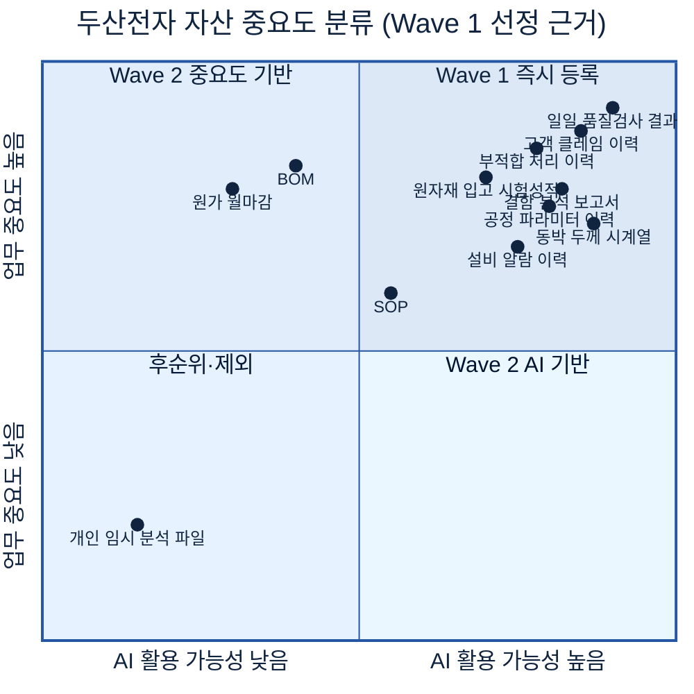

### 7.8 보안 검토 예시

| 자산명 | 보안 등급 | AI 학습 가능 | 조건 |
|---|---|---|---|
| 일일 품질검사 결과 | 대외비 | 가명화 후 가능 | 고객 로트코드 치환 |
| 고객 클레임 이력 | 대외비 | 가명화 후 가능 | 고객명·연락처 마스킹 |
| 결함 이미지 | 사내 | 원본 가능 | 고객 식별 정보 없음 |
| 고객 요구사양서 | 기밀 | 학습 금지 | 계약상 제3자 제공 불가 |
| 원가 월마감 실적 | 기밀 | 학습 금지 | 영업비밀 |

> 카탈로그는 "어디 있는지"와 "AI 학습 가능 여부 태그"까지 안내한다. 실제 접근 허용·차단·사용 판정은 **C-2**에서 통제한다.

### 7.9 솔루션 선정 검토 예시

두산전자 환경 특성(Azure Data Lake Gen2 + Oracle/MS SQL + SharePoint Online, 데이터 조직 1년차)에서 후보 3종을 비교한다(★ 다섯 단계).

| 평가 기준 | Microsoft Purview | DataHub(오픈소스) | Atlan(SaaS) |
|---|---|---|---|
| Azure·M365 연계 | ★★★★★ | ★★★ | ★★★★ |
| Oracle/MS SQL 커넥터 | ★★★★ | ★★★★ | ★★★★ |
| LabWare(LIMS) 연계 | ★★ (수동) | ★★ (커스텀) | ★★★ (API) |
| 검색·탐색 UX | ★★★★ | ★★★ | ★★★★★ |
| 운영 부담(SaaS) | ★★★★ | ★★ (자체 운영) | ★★★★★ |
| AI 자연어 탐색 | ★★★★ (Copilot) | ★★★ | ★★★★ |

> **선정 방향(예시):** 데이터 조직 1년차라 운영 부담 최소화가 중요 → Azure 환경이면 추가 인프라 없이 시작 가능한 **Microsoft Purview**가 유력 후보. 단 LabWare LIMS 연계는 Custom 수집 스크립트가 필요하므로 PoC에서 확인. (본 가이드의 다른 아키텍처 예시도 Purview를 기준으로 통일.)

### 7.10 To-Be 아키텍처 예시

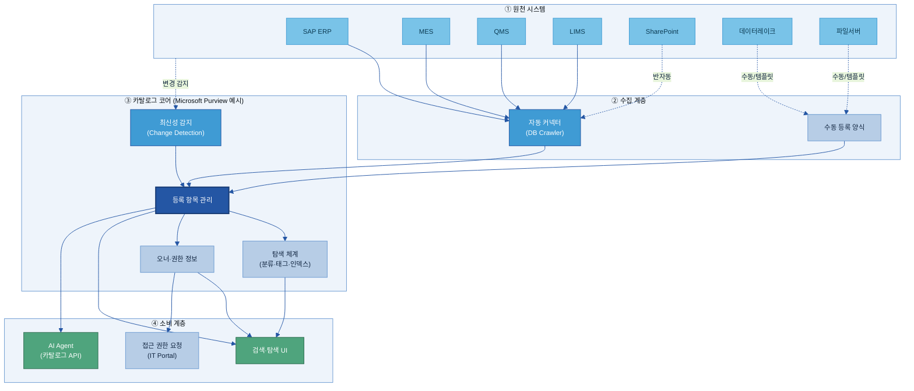

### 7.11 구축 단계 예시 (Wave별 일정)

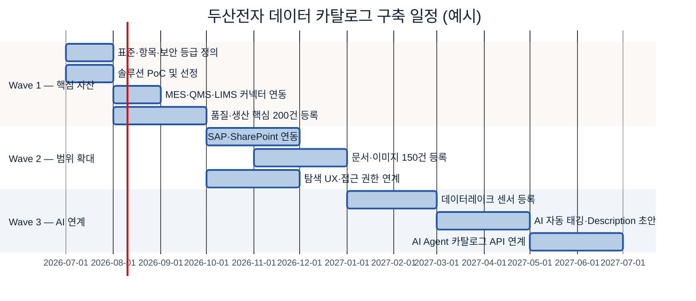

### 7.12 운영 시나리오 예시 — "동박 결함률 예측" 과제자의 1주 → 1일

**AS-IS(카탈로그 없음, ~7~8일):** QMS 담당자 전화 → IT 전달 → DB 계정 신청(3일) → 클레임 수동 추출(2일) → 센서 폴더 탐색(반나절) → 실제 분석은 착수 8일 후.

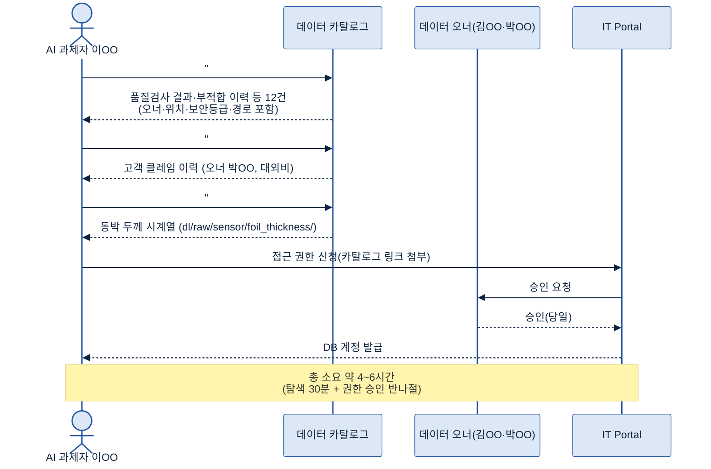

| 항목 | AS-IS | TO-BE |
|---|---|---|
| 데이터 존재 파악 | 구두 문의 2~3일 | 키워드 검색 3분 |
| 위치·테이블 확인 | IT 통해 1~3일 | 카드 즉시 조회 |
| 오너 파악 | 부서 전달·불확실 | 오너 필드 즉시 |
| 전체 탐색 리드타임 | **7~8일** | **4~6시간** |

> 카탈로그는 데이터 자체를 바꾸지 않는다. "어디서 찾고 누구에게 요청하며 어떻게 접근하는지"를 알게 해 착수 속도를 7~8배 높인다.

### 7.13 기대 효과 예시

| 효과 범주 | 기대 효과 | 측정 방식 | 6개월 목표 |
|---|---|---|---|
| 탐색 효율 | 핵심 데이터 탐색 리드타임 단축 | 평균 탐색 소요일 | 7일 → 1일 이하 |
| 재사용 | 중복 추출 요청 감소 | 수동 추출 요청 건수 | 월 30 → 10 이하 |
| AI 과제 착수 | 데이터 확보 기간 단축 | 착수~확보 기간 | 평균 8일 → 1~2일 |
| 오너 명확화 | 오너 미지정 비율 | 등록 자산 오너 공백 | 0% |
| 신규 과제 기여 | 카탈로그 활용 AI 과제 수 | 착수 시 탐색 이력 | Wave 1 후 3개+ |

> **AI-ready 의의:** "동박 결함률 예측" 과제 성공의 최대 위험은 모델 알고리즘이 아니라 *쓸 수 있는 데이터를 제때 확보하지 못하는 것*이다. 카탈로그는 AI 준비의 가장 기초 조건을 충족한다.

---

## 8. 데이터 카탈로그 구축

**👉 한 줄 요약:** "어디에 무엇이 있는지"를 기계가 읽을 수 있게 만드는 과정 — 원천 검토·정합성 보완·아키텍처 설계·파이프라인 구축·초기 적재 검증 순으로 완성한다.

### 8.1 취합 데이터 검토

5장에서 만든 초기 인벤토리를 등록 기준으로 다시 점검한다.

| 점검 항목 | 내용 | 두산전자 예시 |
|---|---|---|
| 필수 항목 충족 | 데이터명·위치·오너·경로·유형·갱신주기 | 품질검사 테이블 오너 "미정" |
| 위치 유효성 | 시스템·테이블·폴더 경로 현재 유효 | 구형 LIMS 이관 후 경로 변경 확인 |
| 분류·태그 일관성 | 탐색 축 태그 누락·중복 없음 | `#품질`과 `#QA` 혼재 → 통일 |
| 중복 등록 후보 | 동일 자산 시스템만 다르게 2회 | MES·QMS 동시 집계 |
| 보안 등급 공백 | 민감 자산 등급 누락 | 클레임 이력 등급 미설정 |

🏭 200건 초기 인벤토리 중 보통 20~30%에서 오너 공백·경로 오류·태그 혼용이 발견된다.

### 8.2 데이터 정합성 검토 및 보완 요청

정합성(Integrity)은 카탈로그 신뢰도의 기초 공사다.

1. **오너 공백:** 생성·관리 부서장을 임시 오너로 두고 30일 내 확정 요청. 등록은 하되 "오너 미확정" 플래그 표시.
2. **중복 등록:** 원천(Source of Truth)을 확인해 대표 자산 1개만 남기고 나머지는 "관련 자산"으로 연결/제외. (예: MES `INSP_RESULT`를 원천으로, QMS 집계본은 참조)
3. **누락 자산:** IT에서 DB 스키마·폴더 목록을 받아 교차 검증.

보완 프로세스: 스튜워드 보완 목록 작성 → 오너에 요청(마감일 명시) → 업데이트 → 미응답 시 부서장 에스컬레이션.

> ▸ 백업: [Backup 8-1] 정합성 보완 요청 양식

### 8.3 To-Be 아키텍처 설계

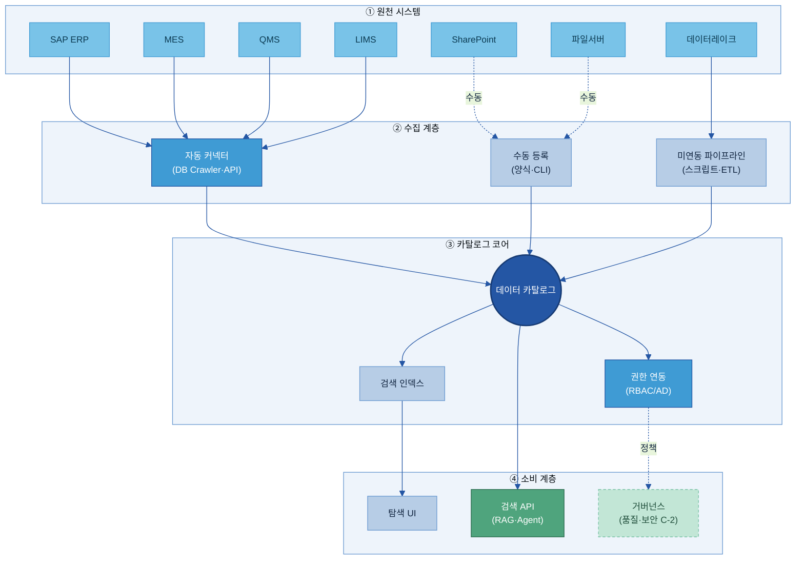

| 계층 | 역할 | 설계 포인트 |
|---|---|---|
| ① 원천 | 자산의 실제 저장소 | 원천별 연결 방식(커넥터·API·수동) 결정 |
| ② 수집 | 원천→카탈로그 파이프라인 | 자동/수동/미연동 3경로 병존으로 100% 커버 |
| ③ 코어 | 등록·검색·권한 | 모든 자산 정보 집약 |
| ④ 소비 | 사람(UI)·기계(API) 출구 | AI 과제자·RAG·거버넌스 연결 |

### 8.4 솔루션 기반 목표 아키텍처 반영

선정 솔루션(Microsoft Purview 가정)의 "기본 제공 / 추가 개발"을 구분한다.

| 구분 | 솔루션 기본 제공 | 추가 개발 필요 |
|---|---|---|
| 커넥터 | SAP·SQL·데이터레이크 내장 | LabWare LIMS 전용, 파일서버 크롤러 |
| 검색 UI | 기본 검색·필터 | 두산 업무 도메인 분류 트리 |
| 권한 | OIDC·LDAP 인증 | 사내 AD 그룹 매핑 |
| 변경 감지 | DB 스키마 변경 | SharePoint 신규 문서 알림 |

> 커버 못 하는 원천·기능은 8.5~8.7에서 별도 파이프라인으로 보완한다.

### 8.5 Legacy DB 연동 방안 검토

레거시 DB(구형·자체 구축 DB) 연동 순서: ① 목록 식별 → ② 연결 가능성 평가(JDBC/ODBC 지원·읽기전용 계정·망 분리 여부) → ③ 방안 결정(A. JDBC 직연동 / B. 메타 추출 스크립트→카탈로그 API / C. 데이터레이크 복제 후 레이크 커넥터) → ④ IT·보안 승인.

🏭 LIMS가 JDBC는 되나 커넥터가 없으면 → Python 메타 추출 스크립트로 테이블·컬럼·갱신주기를 카탈로그 REST API에 주입.

> ▸ 백업: [Backup 8-2] 레거시 DB 연동 방안 결정 매트릭스

### 8.6 미연동 데이터 파이프라인 개발 *(Key Question 3 — 통합)*

솔루션 커넥터 밖의 원천을 커버하는 맞춤 수집 자동화.

| 원천 유형 | 미연동 이유 | 파이프라인 방법 |
|---|---|---|
| 파일서버(SMB) | 커넥터 미지원 | 파일 크롤러: 폴더·파일명·크기·수정일 주기 수집 → API 전송 |
| 데이터레이크 파티션 | 파티션 구조 미인식 | 레이크 메타 크롤러로 파티션 추출 → 자산 단위 등록 |
| 외부 공급 API | 사외 원천 | 스케줄러가 제공 항목·갱신 시점·공급사 기록 |
| SharePoint 문서 | 비정형 매핑 필요 | Graph API로 파일·오너·수정일 수집 → 문서형 자산 등록 |

설계 원칙: 수집 주기(Daily/Weekly/Event)·실패 재시도·알림, 고유 식별자로 중복 방지, 파이프라인 자체도 카탈로그에 등록.

### 8.7 수동 업로드 파이프라인 개발

자동화 어려운 자산(개인 PC·현장·외부 수령)은 표준 양식 경로로 수렴시킨다. 흐름: 담당자 양식 작성 → 자동 검증(필수 항목 미입력 반송) → 스튜워드 1차 검토 → 등록 → 결과 알림. 양식 설계: 오너는 LDAP 자동 채움, 유형은 드롭다운, 태그는 표준 사전 자동완성, 보안 등급 선택 필수.

### 8.8 카탈로그 기능 정의 및 개발 착수

| 기능 | 솔루션 기본 | 커스텀 | 우선순위 |
|---|---|---|---|
| 키워드 검색 | ✅ | — | — |
| 업무 도메인 분류 탐색 | ✅ 기본 | 두산 도메인 트리 | P1 |
| 오너 공백 알림 | — | 공백→스튜워드 알림 | P1 |
| 태그 자동 추천 | ✅ 일부 | 두산 표준 태그 사전 연동 | P2 |
| 수동 등록 UI | — | 사내 양식 통합 | P1 |
| 접근 권한 신청 연동 | — | 사내 IAM 연동 | P2 |
| 파이프라인 상태 조회 | — | 상태 대시보드 | P3 |

### 8.9 솔루션 설정 및 초기 환경 구성

체크리스트: ① 등록 항목 스키마(필수 항목·커스텀 필드: 보안등급·계열사·계약만료일) ② 분류 트리(도메인/유형/시스템) ③ 표준 태그 사전 ④ 계정·역할(AD 연동, 관리자/스튜워드/오너/이용자) ⑤ 커넥터 연결·수집 스케줄(새벽 2시) ⑥ 알림·워크플로(오너 공백·변경 감지·에스컬레이션).

### 8.10 솔루션-계열사 시스템 연동 테스트

| 원천 | 테스트 항목 | 합격 기준 |
|---|---|---|
| SAP | 테이블·컬럼·타입 자동 수집 | 수집률 95%+, 오너 자동 매핑 |
| MES | 스키마 주기 갱신 | 신규 테이블 24시간 내 반영 |
| QMS | 권한 연동 | 권한 없는 테이블 숨김 정상 |
| SharePoint | 파일·소유자 수집 | 최근 30일 신규 누락 0 |
| 수동 양식 | 검증·반영 | 제출 후 5분 내 검색 노출 |

### 8.11 데이터 카탈로그 초기 적재 및 검증

단계: ① 벌크 적재(인벤토리 CSV/JSON 임포트 + 커넥터 초기 크롤) → ② 검증(등록 건수·필수 항목 공백·태그 정합·검색 동작) → ③ 현업 탐색 시연(과제자 2~3인). 합격 기준(Wave 1): 등록 완료율 90%+, 필수 항목 충족 95%+, 검색 정확도 기준 키워드 10개 중 8개+ 상위 5결과 노출, 권한 연동 정확.

> ▸ 백업: [Backup 8-3] 초기 적재 검증 체크리스트

---

## 9. 데이터 카탈로그 운영

**👉 한 줄 요약:** 카탈로그의 가치는 "처음 만든 순간"이 아니라 **현실과 일치하게 계속 살아 있는 동안** 발휘된다 — 변경 관리·갱신·점검 루프가 핵심이다. *(Key Question 5)*

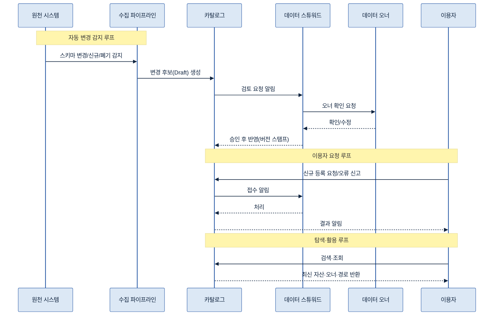

### 9.1 변경 요구사항 요청

| 변경 유형 | 트리거 | 처리 우선순위 |
|---|---|---|
| 신규 자산 생성 | 자동 감지/요청 | 보통(5영업일) |
| 자산 폐기·이관 | IT 통보/오너 요청 | 높음(1영업일) |
| 저장 위치 변경 | DB 이관/폴더 재구성 | 높음(1영업일) |
| 오너 변경 | HR 연동/요청 | 높음(3영업일) |
| 설명·태그 보완 | 이용자 피드백 | 낮음(10영업일) |
| 보안 등급 변경 | 정책/오너 요청 | 높음(1영업일) |

🏭 MES 업그레이드로 `INSP_RESULT`가 `MES_V2.dbo.INSP_LOG`로 이관 → IT가 3일 전 사전 통보 → 스튜워드 경로 변경 처리.

### 9.2 변경 검토 및 승인 (2단계)

**1단계 스튜워드:** 표준 적합성·연관 자산 파급·오너 확인 필요 여부. **2단계 오너:** 현황 일치·경로/보안 변경 확인 → 승인 또는 수정 후 재승인. 자동 승인 가능 범위: Description 자동 생성(스튜워드 단독), 스키마 정보만 갱신(오너 알림만). 보안 등급·오너 변경은 오너 확인 필수.

### 9.3 변경 요청 반영

승인 변경은 **버전 스탬프**와 함께 반영. 변경 이력: 일시·변경 항목·전/후 값·사유·처리자·승인자. 이는 감사 대응과 "지난달 경로 바뀐 게 맞나" 확인 근거가 된다. (이동·변환 상세 계보는 C-3)

### 9.4 데이터 및 메타데이터 생성·등록

| 자산 유형 | 등록 시점 | 주체 |
|---|---|---|
| DB 신규 테이블/뷰 | 배포 시 감지→다음 주기 자동 | 파이프라인+스튜워드 |
| 정기 리포트 | 최초 발행 시 수동 | 오너 |
| AI 과제 산출 데이터셋 | 레이크 적재 시 자동 | 파이프라인+과제 담당 |
| 외부 수령 데이터 | 수령 즉시 수동 | 수령 담당자 |

등록과 함께 기본 메타(설명·주요 컬럼·목적) 초안을 오너 확인. 상세 메타는 A-2.

### 9.5 카탈로그 검색 및 조회 *(Key Question 4)*

기능: 키워드 전문 검색(이름·오너·태그·설명), 분류·필터 탐색, 즐겨찾기·공유, 최근 조회 이력, 인기 자산 표시. 품질 유지: 월 1회 기준 키워드 10개로 검색 테스트, 미흡 시 태그·설명 보완, 신조어·약어는 A-3 동의어 사전과 연동 점검.

### 9.6 전처리·분석·대화식 질의(RAG) 서비스 연계

카탈로그는 **소재 제공자**다. 전처리 파이프라인은 카탈로그 API로 위치·경로·갱신 주기를 확인하고, BI 도구는 검색으로 테이블을 발견해 직접 연결하며, RAG/Agent는 "동박 불량 데이터 어디?" 질의 시 카탈로그 API로 자산 목록을 검색해 위치·경로를 받는다. **실제 데이터 처리·분석은 카탈로그 밖.** API 호출 시 인증 토큰 필수, 검색 결과에 보안 등급 기반 접근 제어 적용.

### 9.7 카탈로그 파이프라인 운영 (수집 갱신 주기)

| 원천 | 권장 주기 | 이유 |
|---|---|---|
| SAP | 주 1회 | 스키마 변경 드묾 |
| MES/QMS | 일 1회(새벽 2~4시) | 일 단위 집계 |
| LIMS | 일 1회 | 배치 완료 후 |
| 데이터레이크 | 일 1회/이벤트 | 대형 배치 완료 시 |
| SharePoint | 일 1회/실시간(Webhook) | 문서 이벤트 잦으면 Webhook |
| 파일서버 | 주 1회 | 갱신 낮음·크롤 부하 |

장애 대응: 실패 감지(알림) → 원인 분류(원천 장애=익일 재처리 / 네트워크·인증=즉시 알림·수동 재처리 / API 오류=솔루션 담당 에스컬레이션) → 재처리·건수 대조 → 이력 기록(F-1 포인터).

### 9.8 접근 권한 및 보안 관리

두 층: **소재 정보 열람**(존재·이름·분류 표시 여부) / **상세 정보 열람**(경로·오너 연락처·구조 표시 여부).

| 정보 유형 | 기본 공개 | 제한 |
|---|---|---|
| 존재·데이터명·도메인 | 전사 임직원 | 로그인 필수 |
| 경로·계정·오너 연락처 | 신청·승인 후 | 대외비↑는 소속 부서 한정 |
| "기밀" 자산 존재 | 관련 부서·관리자만 | 일반 이용자 검색 결과 비표시 |

> "열람은 되지만 접근은 불가" — 실제 데이터 접근 권한은 **C-2**에서 신청·승인 통제.

### 9.9 운영 역할별 기능

| 역할 | 일상 업무 | 주기 |
|---|---|---|
| 관리자 | 솔루션 업데이트·설정, 커넥터 모니터링, 표준·태그 사전 갱신 | 월간/수시 |
| 스튜워드 | 변경 후보 검토·승인, 오너 보완 요청, 미등록 점검, 검색 품질 테스트, 문의 처리 | 주간 |
| 오너 | 자산 정보 확인·승인, 변경 통보, 접근 신청 승인 | 수시/분기 |
| 이용자 | 검색·탐색, 접근 신청, 오류·미등록 신고, 태그 개선 제안 | 수시 |

### 9.10 솔루션 운영 관리 / 미등록 데이터 정기 점검

**솔루션 운영:** 버전 업데이트(반기), DB 백업(일 1회), 성능 모니터링(월간), 커넥터 점검(시스템 변경 시). **미등록 점검(분기):** ① 원천 자산 목록 추출 → ② 카탈로그와 교차 비교 → ③ 분류(신규 누락=즉시 등록 / 임시·중복·폐기=제외 / 모호=스튜워드 판단) → ④ 커버리지 KPI 업데이트.

🏭 분기 점검에서 MES 신규 `FOIL_DEFECT_LOG` 12개 미등록 발견 → 오너 확인 후 3일 내 등록 → 커버리지 92%→97%.

> ▸ 백업: [Backup 9-1] 분기 미등록 점검 체크리스트

#### [Backup 8-1] 정합성 보완 요청 양식
| 항목 | 내용 |
|---|---|
| 자산 ID / 자산명 | (자동/입력) |
| 문제 유형 | 오너 공백 / 경로 오류 / 중복 후보 / 누락 |
| 현재 값 / 요청 내용 / 마감일 | |
| 요청자(스튜워드) / 오너 응답 / 완료일 | |

#### [Backup 8-2] 레거시 DB 연동 방안 결정 매트릭스
| JDBC 가능 | 커넥터 존재 | 망 분리 | 권장 방안 |
|---|---|---|---|
| ✅ | ✅ | ✅ | 솔루션 커넥터 직연동 |
| ✅ | ❌ | ✅ | 메타 추출 스크립트 + 카탈로그 API |
| ✅ | — | ❌ | 브리지 서버 경유 / 레이크 복제 |
| ❌ | ❌ | — | 레이크 복제 후 레이크 커넥터 / 수동 등록 |

#### [Backup 8-3] 초기 적재 검증 체크리스트
총 등록 건수(목표 90%+) / 오너 충족률(95%+) / 경로 유효성(무작위 20건) / 태그 정합성(오탈자 0) / 검색 정확도(키워드 10개→8개+ TOP5) / 권한 연동(미권한 차단) / 현업 시연(과제자 3인 피드백).

#### [Backup 9-1] 분기 미등록 점검 체크리스트
원천 전체 목록 수령 / 미등록 목록 도출 / 분류(신규·임시·폐기) / 신규 등록 건수 / 폐기·제외 건수 / 커버리지(전·후 %) / 완료일 / 담당 스튜워드.

---

## 10. AI-ready 데이터 체계 내 연계 범위

**👉 한 줄 요약:** 카탈로그는 "어디에 무엇이 있는가"까지만 책임진다 — 의미는 A-2/A-3, 변환 이력은 C-3, 보존·폐기는 F-2, 사용 판정·차단은 C-2가 분담한다.

### 10.1 전체 조감도 — A-1의 위치

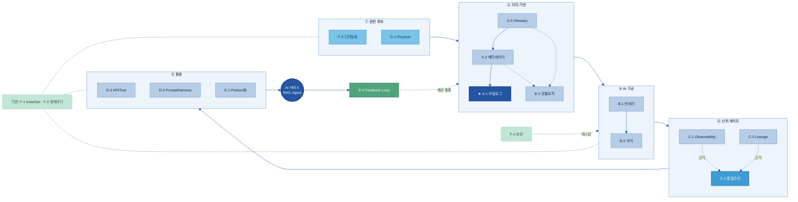

> A-1(★)은 "② 의미 기반"의 **끝점이자 나머지 모든 주제의 출발점**이다. S0 원천 자산이 카탈로그에 등록돼야 S2~S4 전 과정이 작동한다.

### 10.2 인접 주제별 역할 분담 (경계)

**A-2 메타데이터 — 카탈로그가 A-2를 담는다.** 카탈로그=자산 *등록*(위치·오너·경로), A-2=자산의 *구조·컬럼·단위·설명*. 도서관 비유로 카탈로그=목록 카드, A-2=책의 목차·세부정보. 카탈로그 항목에서 A-2 상세로 링크. 🏭 `INSP_RESULT`: A-1은 위치·오너·경로·갱신·등급, A-2는 컬럼(`DEFECT_CD` 등)·타입·단위·설명.

**A-3 Glossary — 탐색 용어 정렬.** A-1=탐색 태그·분류(`#품질`), A-3=용어 표준명·동의어·정의. A-3가 없으면 "불량"과 "결함"이 다른 태그로 갈려 탐색이 어긋난다. A-3는 카탈로그 탐색의 *언어 기반*.

**C-3 Lineage — 소재 vs 이동·변환 이력.** A-1="지금 어디에", C-3="어떤 경로로 만들어져 어디 쓰였나". 위치/오너 변경은 A-1 갱신, ETL 로직·파생·AI 답변 근거는 C-3.

**F-2 생애주기 — 현재 소재 vs 보존·폐기.** A-1=현재 활성 자산 소재, F-2=보존 기간·계층화·아카이빙·폐기. 폐기 집행 시 카탈로그가 "폐기됨(Deprecated)" 상태로 갱신(F-2→A-1 연계 자동화가 성숙형).

**C-2 품질관리 — 접근 경로 표시 vs 사용 판정·차단.** A-1=접근 경로·보안 등급 표시, C-2=품질 통과·Quality Gate·사용 제한·차단. 카탈로그에 품질 점수(94/100) 표시로 사전 판단 지원.

### 10.3 역할 분담 요약표

| 인접 주제 | A-1이 하는 것 | 인접 주제가 하는 것 | 연계 포인트 |
|---|---|---|---|
| [A-2 메타데이터](A-2%20메타데이터.md) | 소재·오너·경로 등록 | 구조·필드·단위·의미 기술 | 항목에서 A-2 링크 |
| [A-3 Glossary](A-3%20비즈니스%20Glossary.md) | 탐색 태그·분류 표시 | 표준 정의·동의어 제공 | 표준 용어를 태그에 반영 |
| [C-3 Lineage](C-3%20데이터%20계통%20Lineage.md) | 현재 위치 관리 | 변환·파생·활용 경로 추적 | Lineage에서 A-1 자산 ID 참조 |
| [F-2 생애주기](F-2%20데이터%20생애주기%20관리.md) | 활성 자산 소재 유지 | 보존·아카이빙·폐기 집행 | 폐기 시 카탈로그 상태 갱신 |
| [C-2 품질관리](C-2%20데이터%20품질%20관리.md) | 접근 경로·등급 표시 | AI 사용 가능 판정·차단 | 품질 점수 표시→게이트 연계 |

### 10.4 History(메타 변경 이력) vs Life Cycle(데이터 일생)

**👉 한 줄 요약:** **메타의 변천 = A-1, 데이터의 일생 = [F-2](F-2%20데이터%20생애주기%20관리.md)**.

- **메타데이터 변경 이력(A-1):** 카탈로그 등록 정보의 등록·수정·삭제 감사 추적(누가 언제 오너·위치·등급을 바꿨나). 9.3 변경 이력이 여기 해당.
- **데이터 실물 생애주기(F-2):** 데이터 자체의 생성 → 보존 → 아카이빙/폐기 집행. 둘은 다른 축이며, 카탈로그는 F-2가 폐기를 집행하면 자산 상태를 "폐기됨"으로 반영한다.

### 10.5 솔루션 기능 vs 과제 도메인 경계

**👉 한 줄 요약:** 솔루션이 Lineage·생애주기를 함께 제공해도, **책임은 도구 기능이 아니라 과제 도메인(A-1/C-3/F-2) 기준으로 정렬**한다.

상용 카탈로그 한 제품이 Lineage·품질·생애주기 기능을 모두 내장하더라도, "Lineage 책임=C-3, 생애주기 책임=F-2"라는 과제 경계는 그대로다. 도구가 겹친다고 역할까지 합치면 오너십이 혼란해진다. **기능 중복은 허용, 책임 중복은 금지.**

### 10.6 인접 데이터 관리 영역 내 카탈로그의 위치

**👉 한 줄 요약:** 카탈로그는 거버넌스(정책 상위) 아래, 메타데이터 관리 계층의 한 기능이다.

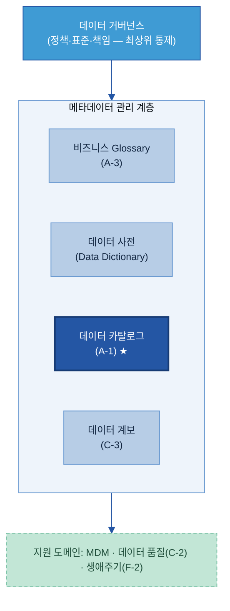

카탈로그는 Glossary·사전·Lineage와 **동급의 메타데이터 관리 기능**이며, 그 위에 거버넌스(정책), 옆/아래에 MDM·품질·생애주기 지원 도메인이 있다.

### 10.7 메타데이터 5종 분류와 카탈로그의 역할

카탈로그는 모든 메타데이터의 *생산자*가 아니라 **집약·표현 계층(Aggregation & Presentation)**이다.

| 메타데이터 종류 | 내용 | 출처 |
|---|---|---|
| 기술(Technical) | 스키마·타입·건수 | 커넥터 자동 수집 |
| 비즈니스(Business) | 의미·정의 | [A-3 Glossary](A-3%20비즈니스%20Glossary.md) 연계 |
| 운영(Operational) | 갱신·상태·오너 | 시스템·오너 |
| 협업(Social) | 즐겨찾기·평점·문의 | 이용자 신호 |
| 액티브(Active) | 실시간 사용·인기 | 로그 |

카탈로그는 이 5종을 **모아서 한 화면에 보여줄 뿐**, 의미(A-3)·이력(C-3)·품질(C-2)의 원본 소유자는 따로 있다.

### 10.8 Glossary vs Data Dictionary vs Catalog (3자 구분)

| 산출물 | 대상 독자 | 예시 |
|---|---|---|
| 비즈니스 Glossary([A-3](A-3%20비즈니스%20Glossary.md)) | 현업·경영(개념) | "활성고객 = 최근 90일 거래" |
| 데이터 사전(Data Dictionary, [A-2](A-2%20메타데이터.md)) | 개발자·DBA(기술 스펙) | "CUST_ID CHAR(10) PK NOT NULL" |
| 데이터 카탈로그(A-1) | 전 사용자(발견 허브) | "고객기본정보 — 어디·누가·신뢰도?" |

카탈로그는 Glossary 정의를 자산에 *링크*하고, 사전 스펙을 *수집*해 연결한다(소유는 각자).

### 10.9 거버넌스 · MDM · 데이터 품질 (역할 분담, SSOT)

**👉 한 줄 요약:** 각 산출물은 **단일 진실 원천(SSOT, Single Source of Truth)**을 하나씩 갖고, 카탈로그는 **소유하지 않고 연결**한다.

- **거버넌스:** 정책·표준·책임 정의(상위 통제).
- **MDM(Master Data Management = 마스터 데이터 관리):** 고객·제품 등 기준 엔티티의 골든 레코드(정본) 생성 — 별도 소유.
- **데이터 품질([C-2](C-2%20데이터%20품질%20관리.md)):** 룰 적합성 측정(별도 측정 엔진).
- **카탈로그(A-1):** 거버넌스 가시성 집행 + 품질 점수 *표시*(정책을 만드는 게 아니라 정책을 위한 도구).

### 10.10 데이터 메시 · 데이터 프로덕트 ([E-1](E-1%20데이터%20Product화.md))

데이터 메시(Data Mesh)의 4원칙에 카탈로그를 매핑하면:

| 데이터 메시 원칙 | 카탈로그 역할 |
|---|---|
| 도메인 오너십 | 도메인 스튜워드 표시 |
| 데이터 as 프로덕트 | **마켓플레이스 선반(shelf)** 역할 |
| 셀프서비스 플랫폼 | **핵심 발견 인프라** |
| 연합 거버넌스 | 표준 메타 강제 + 도메인 자율 |

데이터 프로덕트의 DATSIS 요건(Discoverable·Addressable·Trustworthy·Self-describing·Interoperable·Secure) 중 카탈로그는 운영 수준에서 대부분을 충족시킨다.

### 10.11 데이터 옵저버빌리티 ([C-1](C-1%20Observability.md))

**👉 한 줄 요약:** 옵저버빌리티가 **신뢰 신호를 공급**하고, 카탈로그는 그것을 **배지(badge)로 표시**한다 — 공급원 ↔ 표현 계층의 보완 관계(경쟁 아님).

C-1이 최신성·건수·스키마·분포·Lineage 이상을 모니터링해 신호를 만들면, 카탈로그는 자산 카드에 "최신성 정상 / 이상 감지" 같은 상태를 표시해 이용자가 신뢰 여부를 즉시 판단하게 한다.

---

## 11. KPI 및 성과 관리

**👉 한 줄 요약:** "찾기 쉬워졌는가(탐색 리드타임↓) · 잘 쓰이는가(활용도·AI 과제 수↑) · 최신인가(최신성·커버리지↑)" 5개 지표로 실효성을 측정한다. (2.3 기대효과와 직접 대응)

### 11.1 KPI 정의표

| KPI | 쉬운 의미 | 측정 목적 | 방향 | 연결 기대효과 |
|---|---|---|---|---|
| **데이터 탐색 리드타임** | 자산을 찾는 데 걸리는 시간 | 도입 전후 탐색 효율 | ↓ | 탐색 시간 단축 |
| **카탈로그 활용도** | 월간 탐색 세션·고유 이용자 수 | 정착·확산 | ↑ | AI 자동 탐색 토대 |
| **신규 AI 과제 활용 수** | 카탈로그로 착수한 AI/분석 과제 수 | 실효성 | ↑ | AI 자동 탐색·신뢰 활용 |
| **자산 최신성 비율** | 갱신 주기 내 갱신된 자산 비중 | 등록 정보-현실 일치도 | ↑ | 신뢰 가능한 활용 |
| **등록 커버리지** | 핵심 대상 중 등록 비중 | 목록 완성도·사각지대 | ↑ | 중복 제거·재사용 |

> "중복 제거율"은 인과 고리가 길어 제외, "오너 배정 비율"은 커버리지에 포함. 5개 이내로 절제.

### 11.2 성숙도 단계별 목표치 (참고 — 사내 As-Is 측정 후 조정)

| 단계 | 탐색 리드타임 | 활용도 | AI 과제 수 | 최신성 | 커버리지 |
|---|---|---|---|---|---|
| 0. 카탈로그 없음 | `[As-Is]` 일 단위 | — | 0 | — | — |
| 1. 기본 구축(6개월) | 반일 이하 | 월 50+ | 3+ | 80%+ | 60%+ |
| 2. 안정 운영(1년) | 1시간 이하 | 월 150+ | 10+ | 90%+ | 85%+ |
| 3. AI 보조 이후 | 분 단위 | 월 300+ | — | 95%+ | 95%+ |

> ▸ 백업: [Backup 11-1] KPI 산식·측정 방법 상세

#### [Backup 11-1] KPI 산식·측정 방법 상세
- **탐색 리드타임:** `(위치 확인 시각)-(탐색 요청 시각)` 건 평균. 검색 로그 자동 측정 또는 월간 샘플 설문. 미발견 건은 별도 집계(커버리지 개선 신호).
- **활용도:** 월간 세션 수 / 고유 이용자 수. "의미 있는 검색(결과 클릭·신청으로 이어진)" 비율이 더 유의미.
- **AI 과제 활용 수:** 분기 착수 과제 중 "카탈로그 탐색" 단계를 거친 수(착수 체크리스트로 수집). 미발견도 활용으로 집계.
- **최신성:** `(주기 내 갱신 자산)/(전체 등록) ×100`. 비정기 자산은 분기 오너 확인 대체. 85% 미만 시 오너 알림 트리거.
- **커버리지:** `(등록 자산)/(현황 조사 핵심 대상) ×100`. 분모는 Wave 1 핵심 대상 기준(전체 자산 아님).

---

## 12. 고도화 Roadmap

**👉 한 줄 요약:** 사람이 수기로 등록하는 단계에서 시작해, AI가 메타·태그 초안을 생성하고, 최종적으로 자연어 탐색과 AI Agent가 카탈로그를 직접 활용하는 세 단계로 발전한다.

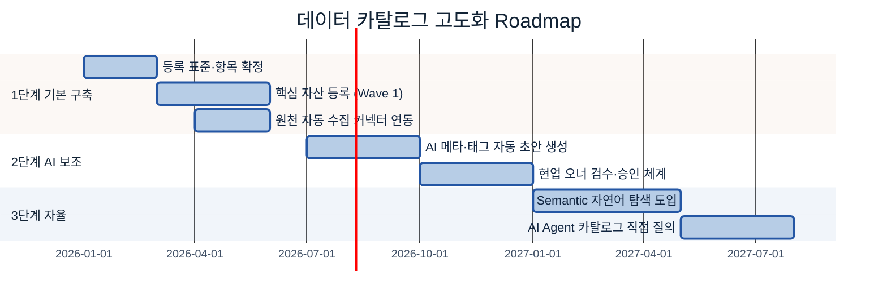

### 12.1 1단계: 기본 구축
*완성도보다 신뢰도* — 적게 등록해도 정확하고 오너가 확실해야 한다. 활동: 등록 표준 확정(3.1), Wave 1 핵심 자산 등록(5장 우선순위), 주요 시스템 커넥터 연동. 산출물: 등록 표준서, Wave 1 목록, 커넥터 연동, 탐색 UI 개시. 전제: 솔루션 도입(6장 PoC), 오너 지정 완료(4장), 현황 조사 완료(5장).

### 12.2 2단계: AI 보조
**AI가 대체가 아니라 사람 검수를 가속.** 활동: AI 메타 초안 자동 생성(스키마 분석→Description·태그·도메인 초안), 오너 검수 워크플로(승인/수정, 승인률 추적), 자동 갱신 감지 강화. 전제: 1단계 자산 축적, A-2·A-3 표준 확정. 🏭 신규 컬럼 추가 시 AI가 설명 초안 생성→오너 승인만, 등록 시간 70% 단축 목표.

### 12.3 3단계: 자율
카탈로그가 **AI Agent의 데이터 탐색 인프라**가 된다. 활동: Semantic Layer 자연어 탐색(의미 벡터 색인), AI Agent 카탈로그 직접 질의(카탈로그 API를 Tool로 등록). 전제: 2단계 메타·태그 품질 충분, D-2 API/Tool 협력(Tool Schema·Risk), A-3 Glossary 풍부. 🏭 결함 예측 Agent가 `#품질 #MES` 태그를 직접 질의→위치·경로 자동 취득→접근 요청 자동 생성, 착수 리드타임 수일→수 시간.

### 12.4 단계별 전제 요약

| 단계 | 핵심 산출물 | 다음 단계 전제 |
|---|---|---|
| 1. 기본 구축 | 표준·Wave 1 등록·커넥터 | 커버리지 60%+, 오너 지정, KPI 기준선 |
| 2. AI 보조 | AI 초안 생성·오너 검수 | 최신성 90%+, A-2·A-3 표준, 초안 승인률 80%+ |
| 3. 자율 | 자연어 탐색·Agent API | 태그·설명 충실, D-2 Tool 명세, 보안 정책 |

> **공통 원칙:** 각 단계는 이전 단계가 *안정화*된 후 시작한다. AI 기능을 먼저 올리고 등록을 나중에 채우는 역순은 신뢰도 없는 자동화로 이어진다.

---

## 별첨 (Appendix)

### [Appendix A] Key Question 대응 점검
| KQ# | Key Question | 답하는 위치 |
|---|---|---|
| 1 | 어떤 데이터 자산을 등록할 것인가 | 5장(대상 선정·우선순위), 7.4 |
| 2 | 위치·접근 경로를 어떻게 기록할 것인가 | 3.1 등록 항목, [Backup 3-1], 7.6 카드 |
| 3 | 흩어진 데이터를 어떻게 통합할 것인가 | 3.3 수집·연계, 5.4, 8.6 미연동 파이프라인 |
| 4 | AI·사용자가 어떻게 쉽게 찾게 할 것인가 | 3.2 탐색 체계, 9.5 |
| 5 | 어떻게 최신 상태로 유지할 것인가 | 3.4, 9장 운영 루프, 9.10 |

## 참고자료 (References)

> 아래는 6장 솔루션 후보의 **공식 제품 페이지**다. 기능·커넥터·가격·지원 범위는 변동되므로, 도입 검토 시 각 공식 문서와 벤더 데모·PoC로 직접 확인한다(본 가이드의 비교는 방향성 참고용).

**상용 솔루션**
- [Collibra — Data Intelligence Platform](https://www.collibra.com) (공식 제품 페이지)
- [Alation — Data Catalog](https://www.alation.com) (공식 제품 페이지)
- [Informatica — Cloud Data Governance and Catalog](https://www.informatica.com/products/data-catalog.html) (공식 제품 페이지)
- [Microsoft Purview — 공식 문서](https://learn.microsoft.com/purview/) (Microsoft Learn)
- [Atlan — Active Metadata Platform](https://atlan.com) (공식 제품 페이지)

**오픈소스 솔루션**
- [DataHub Project](https://datahubproject.io) (공식 사이트)
- [OpenMetadata](https://open-metadata.org) (공식 사이트)
- [Apache Atlas](https://atlas.apache.org) (Apache 공식 프로젝트)

**클라우드 내장 솔루션**
- [AWS Glue Data Catalog — 공식 문서](https://docs.aws.amazon.com/glue/latest/dg/catalog-and-crawler.html) (AWS Documentation)
- [Google Cloud Dataplex](https://cloud.google.com/dataplex) (Google Cloud 공식 제품 페이지)

**기능 단위 도구 (6.5 Best-of-Breed)** — 모두 공식 사이트
- Lineage: [OpenLineage](https://openlineage.io)
- 검색: [Elasticsearch](https://www.elastic.co)
- 거버넌스·권한: [Apache Ranger](https://ranger.apache.org) · [Unity Catalog](https://www.unitycatalog.io) · [Immuta](https://www.immuta.com)
- PII 탐지: [Microsoft Presidio](https://microsoft.github.io/presidio/) · [AWS Macie](https://aws.amazon.com/macie/)
- 데이터 품질: [Great Expectations](https://greatexpectations.io) · [Soda](https://www.soda.io) · [dbt](https://www.getdbt.com) · [Monte Carlo](https://www.montecarlodata.com)
- AI/Semantic: [Cube](https://cube.dev)
- 벡터·피처: [pgvector](https://github.com/pgvector/pgvector) · [Milvus](https://milvus.io) · [Feast](https://feast.dev) · [Pinecone](https://www.pinecone.io) · [Tecton](https://www.tecton.ai)

> 표준·일반 사실 출처가 추가되면 같은 형식 `[제목](URL) — 성격`으로 이 절에 누적한다.

---

## 변경 이력 / 피드백 반영

| 일자 | 버전 | 피드백 (누가/무엇) | 반영 내용 | 반영 위치 |
|------|------|--------------------|-----------|-----------|
| 2026-06-18 | 0.1 | 초안 작성 | 표준·템플릿 기반 초안 | 전체 |
| 2026-06-18 | 0.2 | "양이 적다" — Sonnet 멀티 에이전트 6개로 섹션별 심화 작성 후 Advisor 통합 | 12개 섹션 전면 확장, 다이어그램 16종, 백업·완성 예시 보강 | 전체 |
| 2026-06-18 | 0.3 | "목차·주제를 링크로, 솔루션은 출처 링크" | 상단 목차(앵커)·관련 가이드 링크, 1.1·10.3 인접 주제 파일 링크, 6장 솔루션 10종 공식 페이지 인라인 링크 + 참고자료 절 정리 | 상단 ToC, 1.1, 6.1·6.2, 10.3, References |
| 2026-06-18 | 0.4 | 참고본(data_catalog_manual.md) 대비 누락 검증 후 보강 | 5.7 자동화 강조(★사람이 다 찾지 않는다), 6.5 기능 단위(Best-of-Breed) 솔루션, 10.4~10.11 연계 확장(History/Lifecycle·솔루션vs도메인·위치 계층·메타5종·Glossary/Dictionary/Catalog·거버넌스·MDM·데이터 메시(E-1)·Observability(C-1)) | 5.7, 6.5, 10.4–10.11, References |
