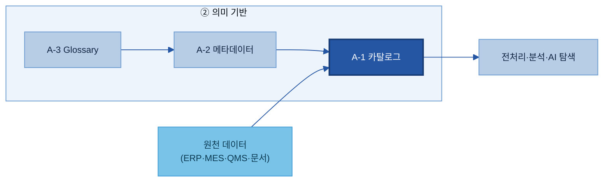
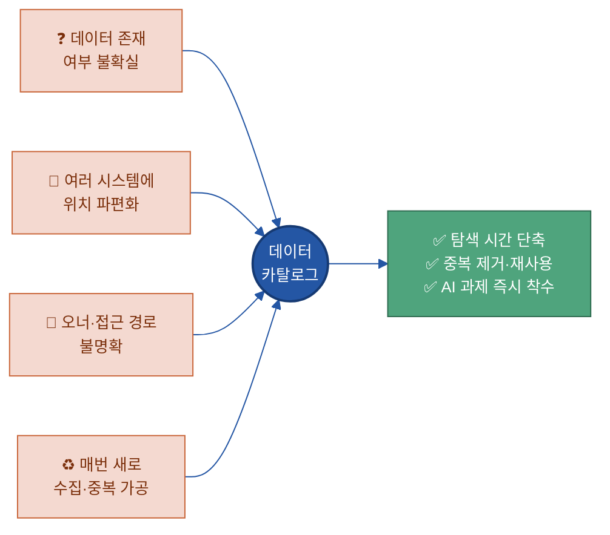
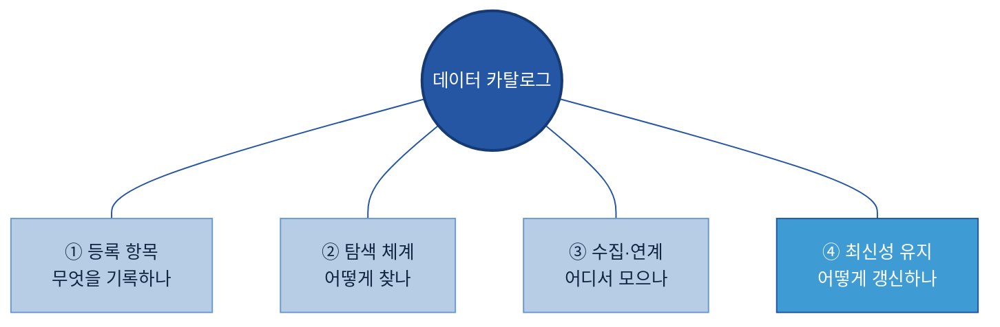
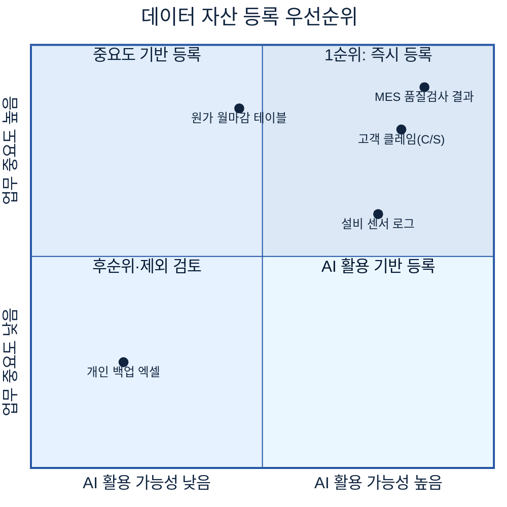
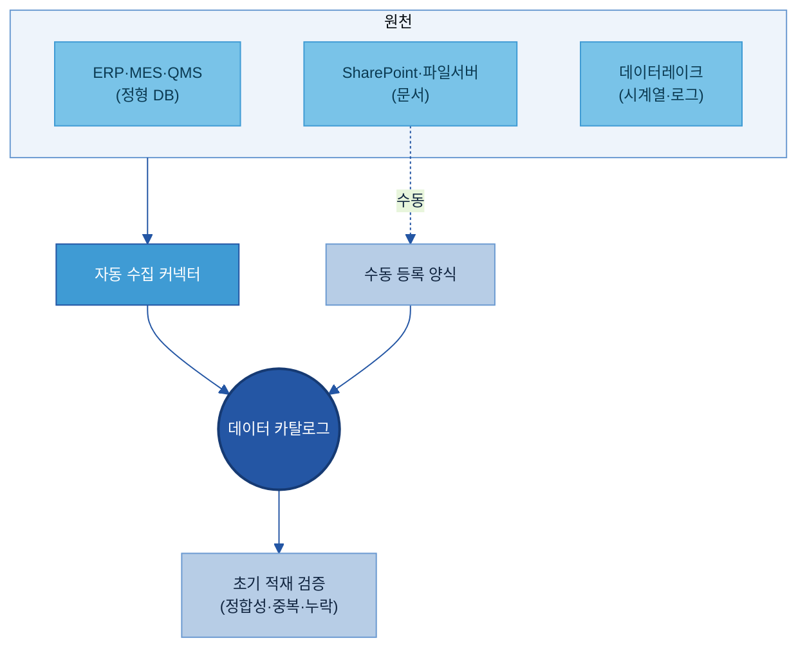
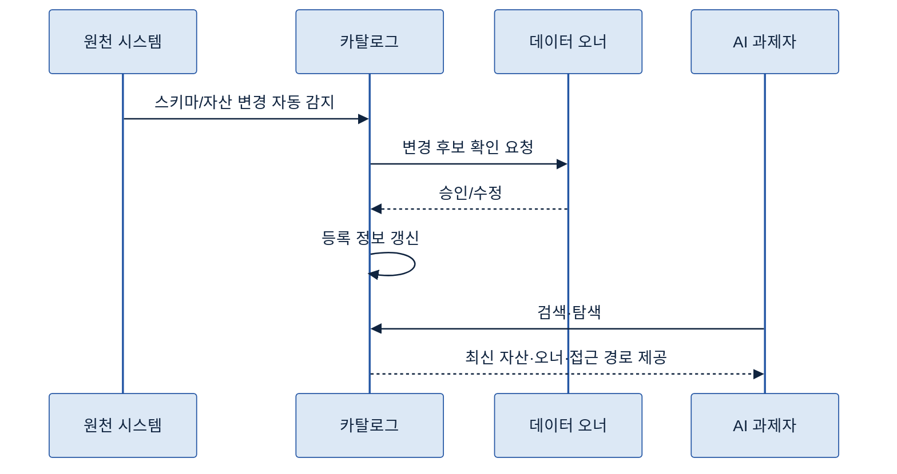
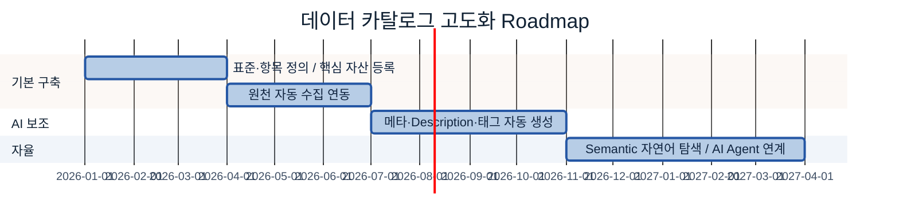

# A-1. 데이터 카탈로그 매뉴얼

> 한 줄 정의: 데이터 카탈로그(Data Catalog)는 **AI와 사람이 "어디에 무슨 데이터가 있는지" 찾을 수 있도록**, 데이터 자산의 존재·위치·오너·접근 경로를 등록해 둔 **자산 목록 체계**다.

---

## 1. 개요

**👉 한 줄 요약:** 데이터 카탈로그는 회사에 흩어진 데이터 자산의 "도서관 목록"으로, AI 과제의 가장 첫 출발점이다.

### 1.1 데이터 카탈로그의 정의
데이터 카탈로그(Data Catalog)는 조직이 보유한 데이터 자산을 **찾을 수 있게** 등록·정리한 목록 체계다. 도서관에 비유하면, 책(데이터) 자체가 아니라 **"어떤 책이 어느 서가 몇 번 칸에 있는지"를 알려주는 목록 카드**에 해당한다.

핵심은 **소재(所在) 중심**이라는 점이다. 카탈로그는 "어디에 무엇이 있는가"를 다루고, 데이터의 **의미 해석**(필드가 무슨 뜻인지)은 메타데이터(Metadata, A-2)와 비즈니스 용어집(Business Glossary, A-3)이 맡는다.

### 1.2 목적
- 데이터 자산을 **빠르게 발견**하게 한다 (사람·AI 모두).
- 중복 수집·중복 가공을 줄이고 **재사용**을 늘린다.
- AI 과제 착수 시 "데이터가 어디 있는지부터 찾는" 낭비를 없앤다.

### 1.3 적용 범위 (무엇이 아닌지 포함)
- ✅ **포함:** 데이터 자산의 등록·탐색·소재 식별 — 데이터명·위치·오너·접근 경로·갱신 주기 등.
- ❌ **포함하지 않음:** 필드의 의미 정의(→ 메타데이터 A-2), 용어 표준화(→ Glossary A-3), 품질 판정(→ 데이터 품질관리 C-2), 데이터의 이동·변환 이력(→ 데이터 계보 Lineage C-3). 카탈로그는 "찾기"까지다.

### 1.4 주요 대상 조직
- **지주/전사 데이터 조직:** 공통 카탈로그 표준·항목·거버넌스 정의.
- **계열사 데이터 담당:** 자사 데이터 자산 등록·갱신·오너 지정.
- **현업 데이터 오너:** 자신이 책임지는 데이터의 등록 정보 확인·승인.
- **AI 과제 수행자:** 카탈로그에서 활용 가능한 데이터를 탐색.

### 1.5 AI-ready 데이터 체계 내 데이터 카탈로그의 역할
**👉 한 줄 요약:** 카탈로그는 20개 주제 가치사슬의 "의미 기반" 단계에서 **자산의 소재를 책임지는 입구**다.

데이터가 AI까지 가는 흐름에서, 카탈로그는 **메타데이터(A-2)를 담아 자산을 등록**하고, 그 위에서 전처리·품질·활용이 이어진다. 아래 조감도에서 A-1을 강조했다.

---

## 2. 필요성 및 기대 효과

### 2.1 AI 과제 수행 시 주요 Pain Point
**👉 한 줄 요약:** 카탈로그가 없으면 AI 과제의 절반이 "데이터 찾기"에서 소모된다.

🏭 **현업 예시 — 두산전자 품질 AI 과제:** 결함 예측 모델을 만들려는데, 검사 데이터는 MES(Manufacturing Execution System = 생산 실행 시스템)에, 클레임은 별도 C/S 시스템에, 과거 분석 보고서는 담당자 PC와 SharePoint에 흩어져 있다. 담당자는 "그 데이터가 어디 있죠?"를 사람에게 물어 일주일을 쓴다.

> 정량적 As-Is(탐색에 걸리는 평균 시간, 중복 데이터 비중 등)는 발표 시 사내 데이터로 채운다. `[As-Is에서 채움]`

### 2.2 데이터 카탈로그 구축의 필요성 (개념·구조로)
데이터가 늘수록 **"있는데 못 찾는"** 문제가 커진다. 카탈로그는 자산마다 *어디에·누가·어떻게 접근*을 한 곳에 모아, 데이터 양이 늘어도 발견 비용이 폭증하지 않게 한다. 특히 AI는 사람처럼 "옆자리에 물어볼" 수 없으므로, **기계가 읽을 수 있는 목록**이 없으면 자동 탐색 자체가 불가능하다.

### 2.3 기대 효과
- **탐색 리드타임 단축:** "데이터 찾기"에 쓰던 시간을 분석·모델링에 쓴다.
- **중복 제거·재사용:** 이미 있는 자산을 재사용해 중복 수집·가공 비용을 줄인다.
- **신뢰 가능한 활용:** 오너·갱신 주기가 명확해 "이 데이터를 믿어도 되나"를 빠르게 판단한다.
- **AI 자동 탐색의 토대:** 카탈로그가 있어야 RAG·Agent가 데이터를 스스로 찾는다.

### 2.4 주요 기능
자산 등록 / 검색·탐색 / 원천 시스템 연계(수집) / 오너·권한 표시 / 갱신·미등록 점검. (각각 3장 구성 체계에서 정본 모델로 정리)

---

## 3. 구성 체계

**👉 한 줄 요약:** 데이터 카탈로그는 **4개 구성요소** — 등록 항목 · 탐색 체계 · 수집 연계 · 최신성 유지 — 로 이루어지며, 이 문서는 끝까지 이 4요소 모델로 설명한다.

### 3.1 ① 등록 항목 — 자산을 "찾기 위한" 최소 정보
자산을 식별·접근하는 데 필요한 항목만 둔다(의미 정의는 A-2 메타데이터). 필수 항목:

| 항목 | 설명 | 예시 |
|---|---|---|
| 데이터명 | 자산 이름 | 일일 품질검사 결과 |
| 보유 시스템 | 어느 시스템에 있나 | MES |
| 저장 위치 | 테이블/폴더/경로 | `QMS.dbo.INSP_RESULT` |
| 데이터 오너 | 책임자 | 품질보증팀, 김OO 책임 |
| 보유 부서 | 관리 조직 | 품질보증팀 |
| 접근 경로 | 어떻게 접근하나 | DB 계정 신청 → 조회 권한 |
| 데이터 유형(Type) | 정형/문서/이미지/시계열 등 | 정형(Table) |
| 갱신 주기 | 얼마나 자주 바뀌나 | 일 1회 |
| 보안 등급 | 민감도 | 대외비 |
| 태그 | 탐색용 분류 | #품질 #검사 #제조 |

> ▸ 백업: [Backup 3-1] 카탈로그 전체 등록 항목 표준(필수+선택 30+개 필드)

### 3.2 ② 탐색 체계 — AI·사람이 쉽게 찾는 분류
업무 도메인 · 데이터 유형 · 보유 조직 · 시스템 · 활용 목적의 5개 축으로 탐색·필터링한다. 여기서는 데이터의 *의미 해석*이 아니라 **자산을 찾기 위한 분류·탐색 구조**만 다룬다.

### 3.3 ③ 수집·연계 — 흩어진 자산을 하나의 목록으로
ERP·MES·QMS·LIMS·SharePoint·파일서버·데이터레이크 등 여러 원천의 자산 정보를 하나의 목록으로 모은다. **자동 수집 가능 자산**(DB·시스템 커넥터)과 **수동 등록 자산**(개인 문서·현장 파일)을 구분한다.

### 3.4 ④ 최신성 유지 — 목록이 현실과 일치하게
신규 생성·폐기·위치 변경·오너 변경이 생기면 카탈로그도 갱신돼야 한다는 원칙. 자동 감지 + 오너 확인 + 정기 점검을 조합한다.

> ▸ 백업: [Backup 3-2] 데이터 유형(Type) 분류 기준표

---

## 4. 추진 역할 및 책임

**👉 한 줄 요약:** 카탈로그는 "전사 표준 1개 + 계열사 등록·오너 책임"의 분업으로 운영한다.

### 4.1 주요 담당자 정의
- **카탈로그 관리자(Catalog Admin):** 전사 표준·항목·솔루션 운영.
- **데이터 스튜워드(Data Steward):** 도메인별 등록 품질·분류 관리.
- **데이터 오너(Data Owner):** 개별 자산의 등록 정보·접근 정책 책임.
- **이용자(AI 과제자·현업):** 탐색·활용, 개선 요청(Feedback).

### 4.2 역할별 책임 구분 (RACI)
| 활동 | 카탈로그 관리자 | 스튜워드 | 데이터 오너 | 이용자 |
|---|---|---|---|---|
| 표준·항목 정의 | A/R | C | C | I |
| 자산 등록 | C | R | A/R | I |
| 분류·태그 부여 | C | A/R | R | I |
| 갱신·점검 | A | R | R | I |
| 탐색·개선 요청 | I | C | I | R |

(R 실행 / A 승인책임 / C 협의 / I 통보)

### 4.3 계열사 상황에 따른 담당 조직 조정 기준
데이터 조직이 없는 계열사는 스튜워드 역할을 현업 부서장이 겸하거나, 지주 데이터 조직이 초기 등록을 대행하고 점진 이양한다.

---

## 5. 데이터 현황 조사 및 등록 대상 선정

**👉 한 줄 요약:** 모든 데이터를 한 번에 등록하지 않는다 — **AI 활용 가능성·업무 중요도·재사용성**이 높은 데이터부터 등록한다. *(Key Question 1)*

### 5.1 등록 대상 기준
시스템 데이터·문서·보고서·품질 데이터·실험 데이터·설비 데이터 등 보유 자산을 조사하고, 다음 우선순위 기준으로 등록 대상을 정한다.

### 5.2 데이터 유형별 등록 / 제외 기준
- **등록:** 반복 사용·다부서 활용·AI 과제 연관 자산.
- **제외:** 개인 임시본·중복 백업·폐기 예정·보안상 카탈로그 노출 부적합 자산(소재만 등록하고 접근은 차단하는 방식 검토).

### 5.3 정형 데이터 중요도 선별 기준
사용 빈도·연계 시스템 수·다운스트림 영향도로 핵심 테이블을 선별한다.

### 5.4 시스템별 수집(자동/수동) 방식
DB·주요 시스템은 커넥터로 자동 수집, 개인·현장 파일은 수동 등록 양식으로 수집한다. *(Key Question 3과 연결)*

### 5.5 보안 검토 기준
민감·대외비 자산은 보안 등급을 부여하고, 카탈로그에는 **소재만 노출/접근은 권한 통제**할지를 보안 검토로 정한다. (접근 차단 자체는 C-2 품질·권한에서 통제)

### 5.6 최종 등록 대상 및 우선순위
위 기준으로 1차 등록 목록(Wave 1)을 확정하고, 분기 단위로 확장한다.

> ▸ 백업: [Backup 5-1] 등록 대상 선정 체크리스트

---

## 6. 데이터 카탈로그 솔루션 선정 검토

**👉 한 줄 요약:** 솔루션은 "현재 스택과 자동 수집 범위"에 맞춰 고르고, 반드시 PoC(Proof of Concept = 사전 검증)로 검증한다.

### 6.1 솔루션 유형
- **상용:** Collibra, Alation, Informatica, Microsoft Purview, Atlan 등.
- **오픈소스:** DataHub, OpenMetadata, Apache Atlas 등.
- **클라우드 내장:** AWS Glue Data Catalog, Google Dataplex 등.

### 6.2 기능 비교 기준
원천 커넥터 범위 · 자동 메타 수집 · 검색/탐색 UX · 권한/거버넌스 · Lineage 연계 · AI(자연어 탐색·자동 태깅) · 계열사 확장성.

### 6.3 평가·PoC 기준
실제 두산 원천 2~3종을 연결해 자동 수집률·검색 정확도·권한 연동을 검증한다.

> ▸ 백업: [Backup 6-1] 솔루션 기능 비교표 (상용/오픈소스/클라우드)

---

## 7. 계열사 적용 예시: 두산전자 데이터 카탈로그 구축 시나리오

**👉 한 줄 요약:** 두산전자(CCL·동박적층판 제조)를 가정해, 등록 대상 선정부터 운영까지 실제값으로 채운 예시다.

### 7.1 데이터 환경 가정
ERP(SAP) · MES · QMS · LIMS(시험) · SharePoint(보고서) · 파일서버 · 데이터레이크 운영. 데이터 조직 신설 1년차.

### 7.2 구축 목표
품질·설비 AI 과제 착수를 위한 핵심 자산 200건을 6개월 내 등록·탐색 가능화.

### 7.3 등록 대상 완성 예시 (실제값)
| 데이터명 | 시스템 | 저장 위치 | 오너 | 유형 | 갱신 | 보안 | 태그 | 우선순위 |
|---|---|---|---|---|---|---|---|---|
| 일일 품질검사 결과 | MES | `QMS.dbo.INSP_RESULT` | 품질보증팀 김OO 책임 | 정형 | 일 1회 | 대외비 | #품질 #검사 | 1 |
| 고객 클레임 이력 | C/S | `CS.CLAIM_HIST` | CS팀 박OO | 정형 | 실시간 | 대외비 | #클레임 #품질 | 1 |
| 동박 두께 측정 시계열 | MES/PLC | `dl/sensor/foil_thk/` | 생산기술팀 | 시계열 | 1초 | 사내 | #설비 #센서 | 2 |
| 결함 분석 보고서 | SharePoint | `/quality/reports/` | 품질보증팀 | 문서 | 비정기 | 대외비 | #분석 #보고서 | 2 |

### 7.4 To-Be 운영 시나리오
"동박 결함률 예측" 과제자가 카탈로그에서 `#품질 #검사`로 검색 → 위 4개 자산을 즉시 발견 → 오너·접근 경로 확인 → 권한 신청 → 데이터 확보. 기존 1주 → 1일.

### 7.5 기대 효과 (예시)
핵심 자산 발견 리드타임 단축, 중복 추출 요청 감소, 신규 AI 과제 착수 가속.

---

## 8. 데이터 카탈로그 구축

**👉 한 줄 요약:** 원천 연동 → 자동/수동 수집 파이프라인 → 초기 적재·검증 순으로 구축한다.

### 8.1 To-Be 아키텍처 설계
솔루션을 중심에 두고 원천 커넥터·수동 등록·검색 API·권한 연동을 설계한다.

### 8.2 연동 / 파이프라인 개발
- 커넥터 지원 원천: 자동 수집(스키마·메타 크롤링).
- 미연동 원천: 수집 파이프라인 또는 수동 업로드 양식 개발. *(Key Question 3 — 통합)*

### 8.3 초기 적재 및 검증
1차 등록 목록을 적재하고 정합성(누락·중복·오너 공백)을 점검·보완 요청한다.

---

## 9. 데이터 카탈로그 운영

**👉 한 줄 요약:** 등록 정보가 현실과 어긋나지 않도록, 변경을 감지→오너 확인→반영하는 루프를 돌린다. *(Key Question 5)*

### 9.1 변경 요구 / 검토·승인 / 반영
신규·폐기·위치·오너 변경에 대한 변경 관리 절차를 둔다.

### 9.2 검색·조회 및 서비스 연계
검색·조회 UX와, 전처리·분석·대화식 질의(RAG) 서비스 연계를 제공한다.

### 9.3 접근 권한 및 보안 관리
오너 정책에 따른 조회/신청 권한을 통제(상세 정책은 C-2).

### 9.4 미등록 데이터 점검
정기적으로 원천 대비 미등록 자산을 스캔해 누락을 줄인다.

---

## 10. AI-ready 데이터 체계 내 연계 범위

**👉 한 줄 요약:** 카탈로그는 "찾기"까지 — 의미는 A-2/A-3, 이력은 C-3, 보존·폐기는 F-2가 맡는 분업이다.

| 인접 주제 | 카탈로그와의 경계 (역할 분담) |
|---|---|
| A-2 메타데이터 | 카탈로그는 자산을 *등록*, A-2는 그 자산의 *구조·속성*을 정의. 카탈로그가 A-2를 담는다. |
| A-3 Glossary | 탐색 태그·용어를 A-3 표준 용어와 정렬. |
| C-3 데이터 계보(Lineage) | 카탈로그=소재, C-3=이동·변환 이력. |
| F-2 생애주기 | 카탈로그=현재 소재, F-2=보존·아카이빙·폐기 시점. |
| C-2 품질·권한 | 카탈로그=접근 경로 표시, C-2=사용 가능 판정·접근 차단. |

---

## 11. KPI 및 성과 관리

**👉 한 줄 요약:** "찾기 쉬워졌는가 · 재사용되는가 · 최신인가"를 측정한다 (최대 5개).

| KPI | 쉬운 의미 | 측정 목적 | 방향 |
|---|---|---|---|
| 데이터 탐색 리드타임 | 자산 찾는 데 걸리는 시간 | 발견 효율 | ↓ |
| 카탈로그 활용도 | 검색·조회 사용량 | 정착 여부 | ↑ |
| 신규 AI 과제 활용 수 | 카탈로그로 착수한 과제 수 | 실효성 | ↑ |
| 자산 최신성 | 갱신 누락 없는 자산 비중 | 신뢰도 | ↑ |
| 등록 커버리지 | 핵심 자산 중 등록 비중 | 완성도 | ↑ |

(KPI는 2.3 기대효과와 직접 연결)

---

## 12. 고도화 Roadmap

**👉 한 줄 요약:** 수기 등록 → AI 보조(자동 메타·태그) → 자연어 탐색·Agent 연계로 발전시킨다.

- **기본 구축:** 표준·항목 확정, 핵심 자산 수기/커넥터 등록.
- **AI 보조:** AI가 메타데이터·Description·태그 초안을 생성, 현업이 검수·승인.
- **자율:** 자연어로 데이터를 찾는 Semantic Layer, AI Agent가 카탈로그를 직접 질의.

---

## 별첨 (Appendix)

### [Appendix A] Key Question 대응 점검
| KQ# | Key Question | 답하는 위치 |
|---|---|---|
| 1 | 어떤 데이터 자산을 등록할 것인가 | 5장 (대상 선정·우선순위) |
| 2 | 위치·접근 경로를 어떻게 기록할 것인가 | 3.1 등록 항목 / 7.3 완성 예시 |
| 3 | 흩어진 데이터를 어떻게 통합할 것인가 | 3.3 수집·연계 / 8.2 |
| 4 | AI·사용자가 어떻게 쉽게 찾게 할 것인가 | 3.2 탐색 체계 / 9.2 |
| 5 | 어떻게 최신 상태로 유지할 것인가 | 3.4 / 9장 운영 루프 |

### [Backup 3-1] 카탈로그 전체 등록 항목 표준
<!-- 필수+선택 30+개 필드 표 — 작성 예정 -->

### [Backup 6-1] 솔루션 기능 비교표
<!-- Collibra/Alation/Purview/Atlan/DataHub/OpenMetadata 기능 매트릭스 — PoC 후 사내 기준으로 확정 -->

## 참고자료 (References)
<!-- 솔루션·표준 출처는 PoC/리서치 단계에서 확정해 [제목](URL)로 정리 -->

---

## 변경 이력 / 피드백 반영

| 일자 | 버전 | 피드백 (누가/무엇) | 반영 내용 | 반영 위치 |
|------|------|--------------------|-----------|-----------|
| 2026-06-18 | 0.1 | 초안 작성 | 표준·템플릿 기반 초안 | 전체 |
