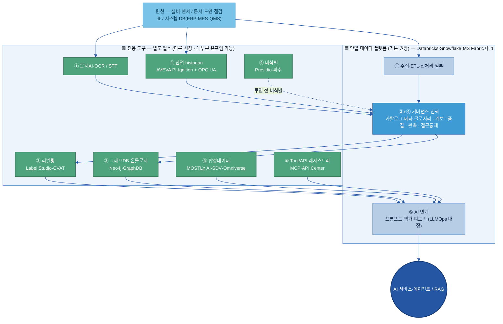

# AI-Ready Data — 제안 Tech Stack (RFP 5개 영역)

> ⚠️ **이 문서는 [03 제안 솔루션 구성](03%20제안%20솔루션%20구성%20(영역별%20솔루션%20단위).md)으로 통합됐습니다(deprecated).** 제안 솔루션 구성·솔루션 단위·데이터 주제별 기능 매핑·Player 평가 판은 **03**을 본다. 이 문서(02)는 아키텍처 다이어그램·온프렘 상세표 등 근거 자료로만 보존한다.

> **목적:** RFP가 요구하는 **5개 영역**에 한정해, AI-Ready Data 체계를 실제 구현하는 데 필요한 **핵심 기술셋(Tech Stack)**을 정의·제안한다. 20개 주제 중 5개 영역에 매핑되는 **17개 주제**만 다룬다.
> **관점 고정:** "AI/에이전트를 만드는 도구"가 아니라 **"그 AI가 쓸 데이터를 준비·정비하는 도구"**다(절대 원칙 — 데이터 준비 관점).
> **상세·전체 비교·출처:** 솔루션 기능 비교·플랫폼 모듈 묶음·시장 변동 주의는 [01 Tech Stack 비교(솔루션×주제)](01%20Tech%20Stack%20비교%20(솔루션×주제).md)가 정본이다. 이 문서는 그 정본을 RFP 5개 영역으로 재구성한 **제안 요약본**이다.
> **성격(중요):** 여기 적힌 제품은 **예시**다 — 정답 목록이 아니라, 각 계열사가 자기 상황(이미 쓰는 클라우드 · **온프렘/폐쇄망 제약** · 데이터 민감도)에 맞게 **고를 때 쓰는 선택 가이드**다. 기본 권장은 단일 통합 플랫폼이고, best-of-breed는 대안으로 함께 제시한다.

**표기:** ✓ 네이티브로 강함 · △ 부분/외부 보강 · ✗ 없음. 제품명은 시점에 따라 바뀐다(개명·인수·종료는 [01 정본 "시장 변동 주의"](01%20Tech%20Stack%20비교%20(솔루션×주제).md#시장-변동-주의-20252026-인용-전-확인)) — 카테고리·필요 기능을 먼저 보고 제품은 PoC로 검증한다.

---

## 범위 — RFP 5개 영역 → 주제 매핑

| RFP 영역 | 다루는 주제 |
|---|---|
| **① 데이터 수집·전처리** | B-1 전처리 · F-3 디지털화(OCR·STT) · D-1 Physical(센서·IoT) |
| **② 메타데이터·카탈로그·비즈니스 글로서리** | A-1 카탈로그 · A-2 메타데이터 · A-3 비즈니스 Glossary |
| **③ 어노테이션·온톨로지 관리** | B-2 해설·주석(어노테이션) · B-3 온톨로지 |
| **④ 데이터 품질·계보·감사 관리** | C-2 품질 · C-3 계보(Lineage) · C-1 Observability · F-4 권한·비식별·감사 |
| **⑤ AI 학습·RAG·Agent 연계 기타** | D-2 Tool/API 명세 · D-3 Prompt 자산화 · E-2 합성데이터 · E-3 평가 데이터 · E-4 Feedback Loop |

> **범위 외(제외):** E-1 데이터 Product화 · F-1 DataOps(오케스트레이션) · F-2 데이터 생애주기 관리 — RFP 5개 영역에 직접 매핑되지 않는다. 구현 시 필요하면 [01 정본](01%20Tech%20Stack%20비교%20(솔루션×주제).md)의 해당 주제를 참조한다.

## 제안 대전제 — 기본은 단일 플랫폼, 대안은 best-of-breed

이 문서는 **전체 계열사 공통 가이드**다. 기본 권장은 **단일 통합 데이터 플랫폼 1개로 최대한 묶는 것** — 영역 ②·④(거버넌스·신뢰)에 ⑤(LLMOps: 프롬프트·평가·피드백)까지 한 플랫폼이 흡수하므로 운영 부담·일관성·학습비용에서 유리하다. 그 플랫폼이 못 하는 전용 영역(문서AI·설비 historian·라벨링·그래프·비식별·합성)만 붙인다.

- **기본(권장) — 단일 데이터 플랫폼:** 계열사가 이미 쓰는 Databricks·Snowflake·MS Fabric(+Purview) 중 1개를 베이스로. 카탈로그·메타·글로서리·계보·품질·관측·접근통제 + 프롬프트·평가·피드백을 한 곳에서. 별도 도구 ~7~8개로 최소화.
- **대안 — best-of-breed:** 특정 영역 최고 도구가 꼭 필요하거나 **폐쇄망이라 클라우드 플랫폼을 못 쓸 때.** 영역별 전용/OSS 도구를 골라 조합(~11개). 선택지는 아래 '온프렘·폐쇄망' 표가 준다.
- **결정 축 3가지:** ① 이미 쓰는 클라우드/플랫폼 ② **온프렘·폐쇄망 제약**(아래 — 매우 중요) ③ 데이터 민감도·계열사 규모.
- 어느 쪽이든 **여기 제품은 예시**다 — 각 계열사가 위 3축으로 직접 고른다.

## 아키텍처 한 장 — 단일 플랫폼 기준 (권장)

원천 데이터가 수집·전처리를 거쳐 거버넌스 위에서 정비되고, 의미 부여(라벨·온톨로지)와 AI 연계를 거쳐 RAG·에이전트로 간다. 파랑 = **단일 플랫폼 1개가 흡수**, 초록 = **별도 전용 도구(다른 시장 · 대부분 온프렘 가능)**.

> **best-of-breed로 갈 때:** 파랑 박스(단일 플랫폼)를 쓰지 않고 그 안의 기능도 각각 전용/OSS로 바꾼다 — 거버넌스=OpenMetadata, 품질=Great Expectations·Soda, 관측=Monte Carlo, 접근통제=Ranger·Immuta, LLMOps=Langfuse. 즉 위 초록 도구 + 파랑 자리를 OSS로 채운 조합이다. **폐쇄망이면 사실상 이 길뿐**(아래 표).

---

## 영역 ① 데이터 수집·전처리

**다루는 주제:** B-1 전처리 · F-3 디지털화(OCR·STT) · D-1 Physical(센서·IoT)
**핵심 기능:** 문서 파싱·**표 구조 보존**·OCR/STT·청킹(RAG 적재) / 설비·센서 시계열 수집·표준화(OPC UA)

| 기능(주제) | 후보 솔루션 | 권장(제조 맥락) |
|---|---|---|
| 문서 파싱·표 보존 (B-1) | [Docling](https://github.com/docling-project/docling)·[Unstructured](https://unstructured.io/)·[LlamaParse](https://developers.llamaindex.ai/python/framework/llama_cloud/llama_parse/) / 클라우드 [Azure DI](https://azure.microsoft.com/ko-kr/products/ai-services/ai-document-intelligence)·[Google Document AI](https://cloud.google.com/document-ai)·[AWS Textract](https://aws.amazon.com/textract/) | 표 복잡·사외 전송 불가 → **Docling(로컬)** + 까다로운 표는 [Camelot/pdfplumber](https://camelot-py.readthedocs.io) 보완 |
| 디지털화 OCR·STT (F-3) | [Naver CLOVA OCR](https://www.ncloud.com/product/aiService/ocr)·[Upstage](https://www.upstage.ai/products/document-parse)(한글) / [ABBYY](https://cloud.google.com/document-ai) / STT [Whisper](https://github.com/openai/whisper)·CLOVA Speech | 한글 손글씨·도면 주석·점검표 → **국내 특화(CLOVA·Upstage)**, 음성은 STT 별도 |
| 설비·센서 수집 (D-1) | historian [AVEVA PI](https://www.aveva.com/en/products/aveva-pi-system/)·[Ignition](https://inductiveautomation.com/scada-software/) / 시계열 [InfluxDB](https://www.influxdata.com/products/influxdb-overview/)·TimescaleDB / 클라우드 IoT SiteWise·Fabric RTI·Snowpipe Streaming | ★ **표준화 계층(OPC UA·MQTT Sparkplug)이 핵심** — 안 맞추면 시계열만 쌓이고 AI가 해석 못 함. 장치산업 AVEVA PI, 이산제조 Ignition |
| RAG 적재 sink | pgvector·Milvus·Pinecone·Chroma·Elasticsearch/OpenSearch | 전처리 결과(청크)를 Vector DB에 적재 — 영역 ⑤ RAG와 연결 |

상세: [B-1 전처리 가이드](../가이드%20작성/B-1%20데이터%20전처리/B-1%20데이터%20전처리.md) · [01 Part A B-1/D-1/F-3](01%20Tech%20Stack%20비교%20(솔루션×주제).md#part-a-주제별-솔루션-주제--솔루션)

## 영역 ② 메타데이터·카탈로그·비즈니스 글로서리

**다루는 주제:** A-1 카탈로그 · A-2 메타데이터 · A-3 비즈니스 Glossary
**핵심 기능:** 자동 메타 수집(커넥터) · 검색·탐색 · **비즈니스 용어집+동의어 매핑** · 승인 워크플로
**핵심 메시지:** A-1·A-2·A-3은 **도구 3개를 따로 사는 게 아니라 거버넌스 플랫폼 1개**가 통째로 한다(세 가이드가 같은 벤더 집합으로 수렴).

| 유형 | 후보 솔루션 | 비고 |
|---|---|---|
| 전용 거버넌스(멀티소스·전사) | [Collibra](https://www.collibra.com/products/data-catalog)·[Alation](https://www.alation.com/product/data-catalog/)·[Atlan](https://atlan.com/data-discovery-catalog/) | A-1·A-2·A-3·계보까지 한 제품. Gartner MQ Leaders |
| 플랫폼 내장(단일 클라우드) | [Microsoft Purview](https://learn.microsoft.com/en-us/purview/unified-catalog)·[Databricks Unity Catalog](https://docs.databricks.com/aws/en/data-governance/unity-catalog/)·Snowflake Horizon | 이미 그 클라우드를 쓰면 1순위. **단 A-3 네이티브 용어집은 Databricks·Snowflake가 약함(△)** |
| 오픈소스(폐쇄망·무료 시작) | [OpenMetadata](https://open-metadata.org/)·[DataHub](https://docs.datahub.com/docs/introduction) | 운영 0.5~1 FTE. OpenMetadata는 용어집 네이티브 |

**권장:** 두산은 계열사 시스템이 흩어져 있으므로 **멀티소스 거버넌스(Collibra/Alation/Atlan) 또는 OSS OpenMetadata**를 베이스로. A-3 용어집·동의어가 중요하므로 그 기능이 강한 제품을 본다. **두산 실제 원천 2~3종(SAP·MES·QMS·LIMS·SharePoint) 연결 PoC로 검증**(커스텀 커넥터 난이도 높음).
상세: [A-1](../가이드%20작성/A-1%20데이터%20카탈로그/A-1%20데이터%20카탈로그.md) · [A-2](../가이드%20작성/A-2%20메타데이터/A-2%20메타데이터.md) · [A-3](../가이드%20작성/A-3%20비즈니스%20Glossary/A-3%20비즈니스%20Glossary.md)

## 영역 ③ 어노테이션·온톨로지 관리

**다루는 주제:** B-2 해설·주석(어노테이션) · B-3 온톨로지
**핵심 기능:** AI 1차 라벨(pre-label)·검수(HITL)·약지도 / 그래프 추론·다중 홉 탐색·온톨로지 저작

| 기능(주제) | 후보 솔루션 | 권장(제조 맥락) |
|---|---|---|
| 라벨링·어노테이션 (B-2) | OSS [Label Studio](https://labelstud.io/)·[CVAT](https://github.com/cvat-ai/cvat) / 약지도 [Snorkel](https://snorkel.ai/) / SaaS [Labelbox](https://labelbox.com/)·[Scale](https://scale.com/data-engine)·[Ground Truth](https://aws.amazon.com/sagemaker/ai/groundtruth/) / 보조 [SAM 2](https://ai.meta.com/research/sam2/)·[Cleanlab](https://cleanlab.ai/) | 공정·품질 데이터 외부 반출 불가 → **OSS 셀프호스트(Label Studio·CVAT)**. 데이터 유형으로 선택(비전 CVAT, 텍스트 Label Studio) |
| 온톨로지·지식그래프 (B-3) | LPG [Neo4j](https://neo4j.com/use-cases/knowledge-graph/)·[Amazon Neptune](https://aws.amazon.com/neptune/)(LPG+RDF) / RDF [GraphDB](https://graphdb.ontotext.com)·[Stardog](https://www.stardog.com/platform/) / 저작 [Protégé](https://protege.stanford.edu) | 제조 원인탐색 "불량→공정→설비→부품→로트→공급사" 6홉+ → **LPG(Neo4j)**. 의미 추론·표준 교환 필요 시 RDF. 참조 어휘 [IOF](https://github.com/iofoundry/ontology) |

> IAA(평가자 간 일치도)·합의·검수는 "제품 기능"이 아니라 **방법론**이다(Cohen's κ·HITL 라우팅) — 도구는 그릇일 뿐.

상세: [B-2 해설·주석](../가이드%20작성/B-2%20데이터%20해설·주석/B-2%20데이터%20해설·주석.md) · [B-3 온톨로지](../가이드%20작성/B-3%20온톨로지/B-3%20온톨로지.md)

## 영역 ④ 데이터 품질·계보·감사 관리

**다루는 주제:** C-2 품질 · C-3 계보(Lineage) · C-1 Observability · F-4 권한·비식별·감사
**핵심 기능:** 품질 합·불 게이트 / **컬럼단위 계보** / 실시간 이상 관측 / 접근통제·비식별·접근 감사 로그

| 기능(주제) | 후보 솔루션 | 권장(제조 맥락) |
|---|---|---|
| 품질 게이트 (C-2) | OSS [Great Expectations](https://greatexpectations.io/)·[Soda Core](https://github.com/sodadata/soda-core) / 엔터 Informatica·Collibra·[Ataccama](https://www.ataccama.com/platform/data-quality) | AI 투입 전 자동 합·불. OSS는 GX·Soda |
| 계보 Lineage (C-3) | **거버넌스 플랫폼 내장(영역 ② 제품과 동일)** / OSS [OpenLineage+Marquez](https://openlineage.io/) | 영역 ②와 **같은 제품으로 통합** — 계보는 카탈로그가 함께 제공 |
| 관측 Observability (C-1) | [Monte Carlo](https://www.montecarlodata.com/)·[Sifflet](https://www.siffletdata.com/)·[Anomalo](https://www.anomalo.com/) / [Soda](https://www.soda.io/) | 컬럼 계보 연계가 강하면 RCA 유리. "지금 정상으로 흐르나"(C-2와 구분) |
| 권한·비식별·감사 (F-4) | 접근통제 [Immuta](https://www.immuta.com/product/data-access-governance/)·Privacera / 내장 Unity Catalog·Snowflake Horizon·Lake Formation / 비식별 [Presidio](https://microsoft.github.io/presidio/)·DLP·[파수](https://www.fasoo.com)(국내) | 단일 클라우드면 내장, 멀티플랫폼이면 Immuta. 비식별은 **발견(Macie/BigID)+변환(Presidio/Tonic) 짝**. 접근·사용 감사 로그가 "감사 관리" 증빙 |

상세: [C-2 품질](../가이드%20작성/C-2%20데이터%20품질%20관리/C-2%20데이터%20품질%20관리.md) · C-1·C-3·F-4는 [01 Part A](01%20Tech%20Stack%20비교%20(솔루션×주제).md#part-a-주제별-솔루션-주제--솔루션) 참조(가이드 작성 시 갱신)

## 영역 ⑤ AI 학습·RAG·Agent 연계 기타

**다루는 주제:** D-2 Tool/API 명세 · D-3 Prompt 자산화 · E-2 합성데이터 · E-3 평가 데이터 · E-4 Feedback Loop
**핵심 기능:** Tool/API 명세·레지스트리(MCP) / 프롬프트 자산화 / 합성데이터 / 평가셋(Gold Set) / 운영 피드백 환류

| 기능(주제) | 후보 솔루션 | 권장(제조 맥락) |
|---|---|---|
| Tool/API 명세 (D-2) | 표준 [MCP](https://modelcontextprotocol.io)·[OpenAPI](https://www.openapis.org/) + 레지스트리 [MCP Registry](https://registry.modelcontextprotocol.io/)·SwaggerHub·Backstage·Azure API Center·Apigee API Hub | 본질은 description·입출력 스키마를 엄밀히 쓰는 **데이터 품질 문제**. 사내 OpenAPI 정비→MCP 변환 |
| Prompt 자산화 (D-3) | OSS [Langfuse](https://langfuse.com/docs/prompts)·[Agenta](https://agenta.ai/)·Helicone / 상용 LangSmith | ★ **셀프호스트 여부가 결정적** — 사내 프롬프트를 외부 SaaS에 못 두면 Langfuse(OSS) |
| 합성데이터 (E-2) | [MOSTLY AI](https://mostly.ai/)·Syntho·[Tonic](https://www.tonic.ai/) / OSS [SDV](https://docs.sdv.dev/sdv) / 비전 [Omniverse](https://docs.omniverse.nvidia.com/extensions/latest/ext_replicator.html) / Snowflake `GENERATE_SYNTHETIC_DATA`(네이티브) | 정형·시계열과 이미지/비전은 별도 시장. 검사 이미지 부족 → Omniverse, 비식별 동인 → Tonic |
| 평가 데이터 (E-3) | [Ragas](https://docs.ragas.io/)·[DeepEval](https://deepeval.com/) / Langfuse·LangSmith | ★ **정답셋(Gold Set) 관리가 본체** — 도구보다 데이터(질문·정답·합격기준) |
| Feedback Loop (E-4) | Langfuse·LangSmith·[Phoenix](https://arize.com/docs/phoenix) + Jira(웹훅) | 명시 피드백(👍👎)을 트레이스 점수로 + 원인 주제로 라우팅 |

상세: [01 Part A D-2·D-3·E-2·E-3·E-4](01%20Tech%20Stack%20비교%20(솔루션×주제).md#part-a-주제별-솔루션-주제--솔루션)(가이드 작성 시 갱신) · [E-2 합성데이터](../가이드%20작성/E-2%20합성데이터/E-2%20합성데이터.md)

---

## 통합 vs 별도 — 솔루션은 몇 개가 필요한가 (2026 검증)

각 영역을 "통합 솔루션 1개로 되나"로 검증한 결과는 **영역마다 다르다.** 메타·카탈로그·글로서리·계보는 1개로 묶이지만, 나머지는 통합 코어 + 별도 전용 도구가 필요하다.

| 영역 | 1개로? | 한 제품으로 묶이는 것 | 꼭 별도(다른 시장) |
|---|---|---|---|
| ① 수집·전처리 | ✗ 2~3개 | 문서 파싱+OCR 1개(Docling·Document AI) | STT(Whisper·CLOVA Speech) · 산업 historian(AVEVA PI·Ignition) |
| ② 메타·카탈로그·글로서리 | ✓ **1개** | A-1·A-2·A-3 **+ 계보 C-3까지** 거버넌스 플랫폼 1개 | — |
| ③ 어노테이션·온톨로지 | ✗ 2개 | — | 라벨링(Label Studio·CVAT) ≠ 그래프DB(Neo4j·GraphDB) |
| ④ 품질·계보·감사 | △ 코어+2 | 계보 C-3 (+엔터 스위트면 품질 C-2 · 단일 플랫폼이면 접근통제 F-4a) | 관측 C-1(Monte Carlo·Sifflet) · 비식별 F-4b(발견 Macie + 변환 Presidio/Tonic) |
| ⑤ AI·RAG·Agent | △ LLMOps+2 | 프롬프트·평가·피드백(D-3·E-3·E-4) = LLMOps 1개(Langfuse/LangSmith) | Tool 레지스트리 D-2(MCP·API Center) · 합성 E-2(MOSTLY AI·SDV; 비전 Omniverse 또 별도) |

**"메타·카탈로그·글로서리·리니지 = 1개" — 맞다.** 거버넌스 플랫폼 1개가 A-1·A-2·A-3 + C-3 계보를 통째로 한다(계보 C-3는 영역 ④에 분류돼 있으나 실제 제품은 영역 ②와 동일). 나아가 그 플랫폼이 ④의 품질(C-2)·접근통제(F-4a)까지 당겨오기도 한다(아래 조건).

### 권장 — 단일 플랫폼 기준 (별도 ~7~8개)

Databricks·Snowflake를 베이스로 깔면 한 플랫폼이 백본 2개(거버넌스+LLMOps) + 일부 전용까지 흡수한다([01 Part B+](01%20Tech%20Stack%20비교%20(솔루션×주제).md)):
- **Databricks**: 거버넌스(Unity Catalog)+품질·관측(Lakehouse Monitoring)+접근통제(UC)+**LLMOps(MLflow 3: D-3·E-3·E-4)**+Tool 레지스트리 일부(UC Functions MCP) 흡수 → 남는 별도 = 문서AI·STT·historian·라벨링·그래프·비식별·합성.
- **Snowflake**: 거버넌스(Horizon)+품질·관측+접근통제+평가·피드백(Cortex)+**합성(`GENERATE_SYNTHETIC_DATA`, 정형 한정)** 흡수 → 남는 별도 = 문서AI(Cortex Document AI로 일부)·STT·historian·라벨링·그래프·비식별·프롬프트 레지스트리.

### 대안 — best-of-breed (별도 ~11개 · 폐쇄망 시)

단일 플랫폼을 안 쓰면 백본도 각각 따로 세운다:
- **백본 1 — 거버넌스/데이터 플랫폼 1개**: A-1·A-2·A-3·C-3 (+조건부 C-2·F-4a)
- **백본 2 — LLMOps 플랫폼 1개**: D-3·E-3·E-4 (Langfuse 등)
- **전용 도구(각각 별도 시장) ~9개**: 문서AI(B-1+F-3 OCR) · STT(F-3 음성) · 산업 historian(D-1) · 라벨링(B-2) · 그래프DB(B-3) · 데이터 관측(C-1) · 비식별(F-4b) · Tool 레지스트리(D-2) · 합성데이터(E-2)
- **조건부**: OSS 카탈로그면 품질 GX/Soda 추가 · 멀티플랫폼이면 접근통제 Immuta 추가

→ **"5개 영역 = 솔루션 5개"가 아니다** — 단일 플랫폼이면 ~7~8개, best-of-breed면 ~11개로 수렴한다.

### PoC 확인
① OSS 카탈로그는 품질이 약해 GX/Soda 필요 ② 멀티플랫폼이면 접근통제 Immuta ③ C-1 관측+C-2 품질을 Soda·Sifflet로 1개로 합칠 수 있는지 ④ 국내 비식별(파수)의 SAP/MES 연동 ⑤ Databricks UC-MCP가 사내 외부 API(SAP·MES)까지 등록하는지.

---

## 온프렘·폐쇄망 가능 여부 (선택의 핵심 축)

제조 계열사는 공정·품질·설비 데이터를 **사외로 못 내보내는 경우가 많다.** 그래서 *온프렘·폐쇄망 배포 가능 여부*가 단일 플랫폼이냐 best-of-breed냐를 가르는 1순위 결정 축이다.

> **핵심:** 단일 클라우드 플랫폼(Databricks·Snowflake·Azure Purview)은 **클라우드 전용 — 완전 폐쇄망에선 못 쓴다.** 따라서 ① **클라우드 가능** 계열사 → 단일 플랫폼(권장) · ② **VPC/전용선만 허용** → 클라우드 플랫폼 + PrivateLink·전용 리전 · ③ **완전 폐쇄망** → 전 영역을 **OSS 온프렘**으로 조합(사실상 best-of-breed가 유일).

| 영역·기능 | 온프렘·폐쇄망 가능 (OSS·자체호스팅) | 클라우드 전용 (폐쇄망 불가) |
|---|---|---|
| ① 문서 파싱·OCR | Docling·Unstructured·Camelot · (국내) Upstage 온프렘 옵션 | Azure DI·Google Document AI·Textract·Bedrock BDA |
| ① STT 음성 | Whisper(로컬) | CLOVA Speech·클라우드 STT |
| ① 설비 historian | AVEVA PI·Ignition·InfluxDB·TimescaleDB (본래 온프렘/OT) | 클라우드 IoT(SiteWise·Fabric RTI) |
| ② 카탈로그·메타·글로서리 | **OpenMetadata·DataHub** (OSS 셀프호스트) | Purview·Unity Catalog·Snowflake Horizon · Collibra/Atlan(주로 SaaS) |
| ③ 라벨링 | **Label Studio·CVAT·Prodigy** (셀프호스트) | Scale·Labelbox·Ground Truth (SaaS) |
| ③ 그래프DB·온톨로지 | Neo4j(자체)·GraphDB·Stardog·Memgraph·Jena | Amazon Neptune |
| ④ 품질 게이트 | **Great Expectations·Soda Core** (OSS) | (클라우드 내장 품질) |
| ④ 관측 | Soda · OSS 일부 | Monte Carlo·Sifflet·Anomalo (SaaS 중심) |
| ④ 접근통제 | **Apache Ranger**(OSS) · Immuta/Privacera(자체배포 옵션) | Unity Catalog·Snowflake·Lake Formation 내장 |
| ④ 비식별 | **Presidio·ARX**(OSS) · **파수**(국내 온프렘) | Google DLP·Macie |
| ⑤ LLMOps(프롬프트·평가·피드백) | **Langfuse·Agenta·Helicone** (셀프호스트) | LangSmith(엔터 셀프호스트 옵션)·PromptLayer·Braintrust |
| ⑤ Tool/API 레지스트리 | MCP Registry·Backstage (OSS) | Azure API Center·Apigee API Hub |
| ⑤ 합성데이터 | **SDV**(OSS) · MOSTLY AI(온프렘 옵션) | Snowflake `GENERATE_SYNTHETIC_DATA` |
| ⑤ Vector DB(RAG) | pgvector·Milvus·Chroma·OpenSearch (OSS) | Pinecone |

- **모든 영역에 OSS 온프렘 선택지가 있다** — 폐쇄망 계열사도 전 영역을 자체호스팅으로 구성 가능하다(운영 인력은 더 든다).
- 제조 현장 데이터(설비·한글 점검표)는 어차피 온프렘 도구(historian·국내 OCR·OSS 라벨링)가 유리 — 폐쇄망 요구와 방향이 같다.
- 상용 제품의 온프렘 배포·라이선스 조건은 벤더마다 다르니 **계약 전 확인**(특히 Collibra·Immuta·MOSTLY AI·Upstage·LangSmith).

---

## 제안 스택 한눈에 — 5개 영역 × 권장 구성

| RFP 영역 | 주제 | 권장 베이스 | 처리계·전용/국내·온프렘 | 핵심 표준 |
|---|---|---|---|---|
| **① 수집·전처리** | B-1·F-3·D-1 | 문서 Docling / 클라우드 Document AI | 표 Camelot · 한글 CLOVA·Upstage · STT Whisper · 설비 AVEVA PI·Ignition | OPC UA·MQTT |
| **② 메타·카탈로그·글로서리** | A-1·A-2·A-3 | **거버넌스 플랫폼 1개** (Collibra/Atlan/Purview/Unity Catalog) | OSS OpenMetadata·DataHub | — |
| **③ 어노테이션·온톨로지** | B-2·B-3 | — | 라벨링 Label Studio/CVAT(OSS)·Snorkel · 그래프 Neo4j(LPG)·GraphDB(RDF) | IOF·OWL·SHACL |
| **④ 품질·계보·감사** | C-2·C-3·C-1·F-4 | **②와 동일 플랫폼**(계보·품질·권한 통합) | 품질 GX/Soda · 관측 Monte Carlo · 권한 Immuta · 비식별 Presidio/파수 | OpenLineage |
| **⑤ AI·RAG·Agent 연계** | D-2·D-3·E-2·E-3·E-4 | — | 명세 MCP/OpenAPI+레지스트리 · 프롬프트 Langfuse(OSS) · 합성 MOSTLY AI/SDV · 평가 Ragas/DeepEval · Vector DB pgvector/Milvus | MCP·OpenAPI |

> 한 줄: **거버넌스 플랫폼 1개(②·④)** + **처리계 전용 도구(①·③·⑤)** + **산업 historian(① 설비)**. 단일 클라우드로 수렴 가능한 신규 영역은 그 플랫폼 내장으로 묶어 운영 부담을 줄이고, 폐쇄망·민감 데이터·한글 문서는 OSS·국내 도구로 좁힌다.

---

## 변경 이력

| 버전 | 일자 | 내용 |
|---|---|---|
| v0.1 | 2026-06-24 | 신규 — RFP 5개 영역 구조로 제안 Tech Stack 정의(매핑 17개 주제: A·B·C군 + D-1·D-2·D-3 + E-2·E-3·E-4 + F-3·F-4). 제외 3개(E-1·F-1·F-2). 내용은 [01 정본](01%20Tech%20Stack%20비교%20(솔루션×주제).md)의 검증된 솔루션·출처를 영역별로 재구성. |
| v0.2 | 2026-06-24 | **"통합 vs 별도" 검증 섹션 추가** — 영역별로 통합 솔루션 1개로 되는지 공식 문서로 검증(④ 품질·계보·감사, ⑤ AI·RAG·Agent 연계 fresh 리서치 2건). 결론: ②(메타·카탈로그·글로서리+계보)만 1개로 완결, ④·⑤는 통합 코어+별도, ①·③은 다수 별도. best-of-breed ~11개 / 단일 플랫폼 베이스 ~7~8개로 수렴("5개 영역=5개 솔루션" 아님). |
| v0.3 | 2026-06-24 | **단일 플랫폼 기본 권장으로 재정렬 + 아키텍처 다이어그램 + 온프렘·폐쇄망 축 추가.** ① 대전제를 "best-of-breed 제안"→"전체 계열사 가이드이므로 단일 통합 플랫폼 기본, best-of-breed는 폐쇄망·특화용 대안"으로 재프레이밍 ② 단일 플랫폼 기준 아키텍처 다이어그램(파랑=플랫폼 흡수/초록=전용 도구) ③ "온프렘·폐쇄망 가능 여부" 표 신설(영역별 OSS 온프렘 vs 클라우드 전용) — 완전 폐쇄망이면 단일 클라우드 플랫폼 불가→OSS 조합이 사실상 유일 ④ 이 스택은 예시이며 각 계열사가 3축(기존 플랫폼·폐쇄망·민감도)으로 선택하는 가이드임을 명시. |
