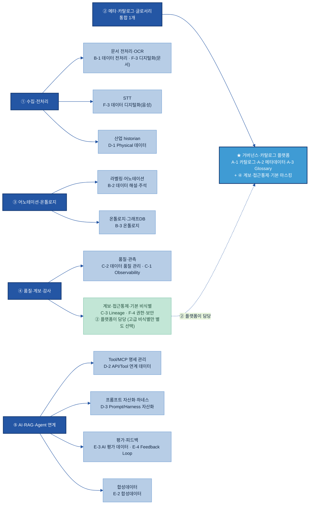

# AI-Ready Data — Tech Stack 제안 & 평가 판
### (RFP 5영역 → 솔루션 단위 → 기능 매핑 → Player 평가)

> **이 문서 하나로 본다.** **① RFP 5개 영역에 20개 주제 매핑**(안 맞는 주제는 제외) → **② 영역별로 솔루션을 통합(1개)하거나 나눔(2~N개)** → **③ 각 솔루션에 데이터 주제별로 어느 기능이 매핑되는지** → **④ 솔루션 단위별 Player 후보 + AXC(성능·비용·보안)·OSS/SaaS 평가 판.**
> **목적 = 실제 평가가 아니라 "평가할 수 있는 판"을 만드는 것.**
> **관점 고정:** "AI를 만드는 도구"가 아니라 **"AI가 쓸 데이터를 준비·정비하는 도구"**다. AI 운영 플랫폼을 'LLMOps' 한 덩어리로 보지 않고, Tool 명세·프롬프트·평가/피드백 같은 **데이터를 준비·관리하는 솔루션**으로 기능별로 나눠 본다.
> 후보 전체 비교·출처는 [01 Tech Stack 비교](01%20Tech%20Stack%20비교%20(솔루션×주제).md), AXC 평가 방법론(성능30+비용3=33점·보안 게이트·20점컷)은 [Tech 솔루션 평가 기획안](Tech%20솔루션%20평가%20기획안%20(AXC%20방법론%20준용).md). (이전 `02 제안 Tech Stack`은 이 문서로 통합.)

---

## 0. 임원 보고 요약 (Executive Summary)

**권고 — 통합 플랫폼 1개 + 필수 2종으로 시작하고, 나머지는 데이터·과제에 따라 선택한다.** 20개 데이터 주제를 솔루션별로 따로 도입하는 것이 아니라, **묶을 수 있는 것은 한 솔루션으로 묶어** 도입·운영 부담을 최소화한다.

**핵심 메시지**
1. **"20개 주제 = 20개 솔루션"이 아니다.** 묶으면 **필수 2종**으로 출발한다 — ① 거버넌스·카탈로그 플랫폼(메타데이터·글로서리·계보·접근통제·기본 마스킹까지 한 제품) ② 문서 전처리·OCR.
2. **나머지는 데이터·과제에 따라 선택.** 설비 데이터면 historian, AI 에이전트·RAG를 쓰면 ⑤(Tool/MCP 명세 관리·프롬프트 자산화·평가/피드백) 솔루션을 붙인다 — 각 시장에 플레이어가 많다.
3. **제품을 못 박지 않는 "선택 가이드"다.** 모든 솔루션에 사외 반출 없는 **온프렘(오픈소스) 선택지**가 있어 폐쇄망 계열사도 동일 구성이 가능하다.

| 구분 | 솔루션 단위 | 도입 시점 |
|---|---|---|
| **필수 코어 (2)** | 거버넌스·카탈로그 플랫폼 · 문서 전처리·OCR | AI-Ready 착수 시 |
| **제조 추가 (1)** | 산업 historian(설비·센서) | 설비 데이터 계열사 |
| **선택** | 품질·관측 · 라벨링 · 온톨로지·그래프DB · STT · 합성데이터 · **Tool/MCP 명세 관리 · 프롬프트 자산화·하네스 · 평가·피드백** | 데이터·AI 과제 성격별 |
| **② 플랫폼이 담당(별도 불필요)** | 계보(C-3) · 접근통제(F-4) · 기본 비식별·마스킹 | — |

---

## 1. RFP 5영역 ↔ 20주제 매핑 (제외 주제 명시)

| RFP 영역 | 매핑되는 주제 | 솔루션 구성 |
|---|---|---|
| **① 데이터 수집·전처리** | B-1 데이터 전처리 · F-3 데이터 디지털화(OCR·STT) · D-1 Physical 데이터 | **3개로 나뉨** (문서 전처리·OCR / STT / 산업 historian) |
| **② 메타·카탈로그·글로서리** | A-1 데이터 카탈로그 · A-2 메타데이터 · A-3 비즈니스 Glossary | **1개로 통합** (거버넌스·카탈로그 플랫폼) |
| **③ 어노테이션·온톨로지** | B-2 데이터 해설·주석 · B-3 온톨로지 | **2개로 나뉨** (라벨링 / 온톨로지·그래프DB) |
| **④ 품질·계보·감사** | C-1 Observability · C-2 데이터 품질 관리 · C-3 데이터 계통 Lineage · F-4 AI 데이터 권한·보안 | **품질·관측 1개** (계보·접근통제·기본 마스킹은 ② 플랫폼 / 고급 비식별만 선택) |
| **⑤ AI·RAG·Agent 연계** | D-2 API/Tool 연계 데이터 · D-3 Prompt/Harness 자산화 · E-2 합성데이터 · E-3 AI 평가 데이터 · E-4 데이터 Feedback Loop | **나뉨 4개** (Tool/MCP 명세 관리 / 프롬프트 자산화·하네스 / 평가·피드백 / 합성데이터) |

**제외 (억지로 매핑하지 않음):** **E-1 데이터 Product화 · F-1 데이터 운영관리(DataOps) · F-2 데이터 생애주기 관리** — RFP 5개 영역에 직접 대응되지 않는다. 필요 시 [01](01%20Tech%20Stack%20비교%20(솔루션×주제).md) 참조.

→ **매핑 17개 / 제외 3개.**

---

## 2. 솔루션 단위 + 데이터 주제별 기능 매핑

### 한 장 구조도

왼쪽 = RFP 5개 영역, 오른쪽 = 그 영역에서 도입하는 솔루션, 박스 안 = 묶이는 데이터 주제. **영역당 솔루션이 1개면 통합, 여러 개면 나뉜 것.**

> **색:** 진한 파랑 = RFP 영역 · 파랑 = 도입 솔루션 · 밝은 파랑(②) = 통합 플랫폼(★ ②+④ 함께) · 초록 = ② 플랫폼이 담당(도입 솔루션 아님). ④의 계보·접근통제·기본 마스킹은 ② 플랫폼이 함께 하고, 고급 비식별만 민감도 높을 때 별도 선택.

### ② 메타·카탈로그·글로서리 — **통합 1개** (거버넌스·카탈로그 플랫폼)

A-1·A-2·A-3은 보통 한 플랫폼이 함께 제공하고, ④의 계보·접근통제·기본 마스킹도 같은 플랫폼 기능이다.

| 데이터 주제 | 이 솔루션의 매핑 기능 |
|---|---|
| A-1 데이터 카탈로그 | 데이터 자산 등록·검색·탐색(커넥터 자동 수집) |
| A-2 메타데이터 | 기술·운영 메타데이터 수집·태깅·필드 설명 |
| A-3 비즈니스 Glossary | 비즈니스 용어집·동의어/약어 매핑·승인 워크플로 |
| *(C-3 데이터 계통 Lineage — ④)* | *컬럼 단위 데이터 계보* |
| *(F-4 권한·보안 접근통제 — ④)* | *역할/태그 기반 행·열 접근통제·동적 마스킹* |

### ① 수집·전처리 — **3개로 나뉨**

| 솔루션 단위 | 데이터 주제 → 매핑 기능 |
|---|---|
| **문서 전처리·OCR** | B-1 데이터 전처리 → 문서 파싱·표 구조 보존·청킹 / F-3 데이터 디지털화(문서) → OCR·레이아웃 인식 |
| **STT(음성)** | F-3 데이터 디지털화(음성) → 음성→텍스트 변환(회의록·현장 음성) |
| **산업 historian** | D-1 Physical 데이터 → 시계열 수집·설비ID/단위 표준화·OPC UA·실시간 적재 |

### ③ 어노테이션·온톨로지 — **2개로 나뉨**

| 솔루션 단위 | 데이터 주제 → 매핑 기능 |
|---|---|
| **라벨링·어노테이션** | B-2 데이터 해설·주석 → AI 1차 라벨(pre-label)·검수(HITL)·다중 유형 라벨링 |
| **온톨로지·그래프DB** | B-3 온톨로지 → 그래프 저장·다중 홉 탐색·관계 추론(OWL/SHACL) |

### ④ 품질·계보·감사 — **품질·관측 1개** (나머지는 ② 플랫폼)

계보(C-3)·접근통제·기본 마스킹(F-4)은 ② 플랫폼 기능이다. 새로 필요한 솔루션은 품질·관측뿐이고, 고급 비식별만 선택이다.

| 솔루션 단위 | 데이터 주제 → 매핑 기능 |
|---|---|
| **품질·관측** | C-2 데이터 품질 관리 → 품질 규칙·합불 게이트 / C-1 Observability → 이상·지연·결측 상시 모니터링·알림 |
| **고급 비식별** *(선택·드묾)* | F-4 권한·보안(비식별) → 가명화·k-익명성·토큰화. **기본 마스킹은 ② 플랫폼이 담당**하므로, 민감도 높은 경우만 별도 |

### ⑤ AI·RAG·Agent 연계 — **4개로 나뉨**

AI 운영 플랫폼(LLMOps)을 한 덩어리로 사는 게 아니라, AI가 쓸 **데이터·명세를 준비·관리**하는 솔루션을 기능별로 본다. 각 시장에 플레이어가 많다.

| 솔루션 단위 | 데이터 주제 → 매핑 기능 |
|---|---|
| **Tool/MCP 명세 관리** | D-2 API/Tool 연계 데이터 → Tool 명세(MCP·OpenAPI) 등록·검색·버전관리·게이트웨이·거버넌스 |
| **프롬프트 자산화·하네스** | D-3 Prompt/Harness 자산화 → 프롬프트 버전관리·레지스트리·하네스 패키징 |
| **평가·피드백** | E-3 AI 평가 데이터 → 정답셋(Gold)·평가 실행 / E-4 Feedback Loop → 트레이스·점수·검수큐 환류 |
| **합성데이터** *(선택)* | E-2 합성데이터 → 정형/시계열/비전 합성 생성·검증 |

---

## 3. 솔루션 단위별 Player 후보 + 평가 판 (AXC · OSS/SaaS)

각 솔루션 단위의 **Player 후보**를 뽑고, **AXC(보안 게이트 → 성능 30점 + 비용 3점 = 33점, 20점컷)**으로 평가하도록 빈 양식을 둔다. **`보안`·`성능`·`비용` 칸은 평가 단계에서 기입**한다. `OSS/SaaS`·`온프렘`은 사전 표기(✓ 자체호스팅 / △ 옵션·조건부 / ✗ 클라우드 전용).

> 평가 규칙 상세는 [Tech 솔루션 평가 기획안](Tech%20솔루션%20평가%20기획안%20(AXC%20방법론%20준용).md), 후보·출처 전체는 [01 Tech Stack 비교](01%20Tech%20Stack%20비교%20(솔루션×주제).md).
> **평가 대상이 아닌 것:** 계보(C-3)·접근통제·기본 마스킹은 ② 거버넌스·데이터 플랫폼이 담당. (Tool/MCP의 표준 MCP·OpenAPI 자체는 표준 채택이고, 그 명세를 관리하는 솔루션은 아래 8번으로 평가.)

### [필수] 1. 거버넌스·카탈로그 플랫폼 (② + ④ 계보·접근통제·기본 마스킹)

| Player(후보) | OSS/SaaS | 온프렘 | 보안 게이트 | 성능(/30) | 비용(/3) |
|---|---|:--:|:--:|:--:|:--:|
| Collibra | SaaS | △ | | | |
| Alation | SaaS·자체 | △ | | | |
| Atlan | SaaS | ✗ | | | |
| Microsoft Purview | SaaS | ✗ | | | |
| Databricks Unity Catalog | 클라우드 | ✗ | | | |
| Snowflake Horizon | 클라우드 | ✗ | | | |
| OpenMetadata | OSS | ✓ | | | |
| DataHub | OSS | ✓ | | | |

### [필수] 2. 문서 전처리·OCR (① B-1·F-3 문서)

| Player(후보) | OSS/SaaS | 온프렘 | 보안 게이트 | 성능(/30) | 비용(/3) |
|---|---|:--:|:--:|:--:|:--:|
| Docling | OSS | ✓ | | | |
| Unstructured | OSS+SaaS | ✓ | | | |
| Camelot / pdfplumber | OSS | ✓ | | | |
| LlamaParse | SaaS | ✗ | | | |
| Azure AI Document Intelligence | SaaS | ✗ | | | |
| Google Document AI | SaaS | ✗ | | | |
| AWS Textract / Bedrock Data Automation | SaaS | ✗ | | | |
| Upstage Document Parse (국내) | 상용 | △ | | | |

### [제조] 3. 산업 historian (① D-1 Physical 데이터)

| Player(후보) | OSS/SaaS | 온프렘 | 보안 게이트 | 성능(/30) | 비용(/3) |
|---|---|:--:|:--:|:--:|:--:|
| AVEVA PI System | 상용 | ✓ | | | |
| Ignition | 상용 | ✓ | | | |
| InfluxDB | OSS | ✓ | | | |
| TimescaleDB | OSS | ✓ | | | |
| AWS IoT SiteWise / MS Fabric RTI | 클라우드 | ✗ | | | |

### [선택] 4. 품질·관측 (④ C-2·C-1)

| Player(후보) | OSS/SaaS | 온프렘 | 보안 게이트 | 성능(/30) | 비용(/3) |
|---|---|:--:|:--:|:--:|:--:|
| Great Expectations | OSS | ✓ | | | |
| Soda (Core/Cloud) | OSS+SaaS | ✓ | | | |
| Monte Carlo | SaaS | ✗ | | | |
| Sifflet / Anomalo / Bigeye | SaaS | △ | | | |
| Informatica / Ataccama | 상용 | △ | | | |

### [선택] 5. 라벨링·어노테이션 (③ B-2)

| Player(후보) | OSS/SaaS | 온프렘 | 보안 게이트 | 성능(/30) | 비용(/3) |
|---|---|:--:|:--:|:--:|:--:|
| Label Studio | OSS | ✓ | | | |
| CVAT | OSS | ✓ | | | |
| Prodigy | 상용 | ✓ | | | |
| Snorkel Flow | 상용 | △ | | | |
| Labelbox / Scale AI | SaaS | △/✗ | | | |
| SageMaker Ground Truth | SaaS | ✗ | | | |

### [선택] 6. 온톨로지·그래프DB (③ B-3)

| Player(후보) | OSS/SaaS | 온프렘 | 보안 게이트 | 성능(/30) | 비용(/3) |
|---|---|:--:|:--:|:--:|:--:|
| Neo4j (Community/Ent) | OSS+상용 | ✓ | | | |
| Amazon Neptune | 클라우드 | ✗ | | | |
| Ontotext GraphDB | 상용 | ✓ | | | |
| Stardog | 상용 | ✓ | | | |
| Memgraph / TigerGraph | OSS·상용 | ✓ | | | |
| Apache Jena / Protégé | OSS | ✓ | | | |

### [선택] 7. STT 음성 (① F-3 음성)

| Player(후보) | OSS/SaaS | 온프렘 | 보안 게이트 | 성능(/30) | 비용(/3) |
|---|---|:--:|:--:|:--:|:--:|
| OpenAI Whisper | OSS | ✓ | | | |
| Naver CLOVA Speech (국내) | SaaS | ✗ | | | |
| Google Speech-to-Text | SaaS | ✗ | | | |
| Azure AI Speech | SaaS | ✗ | | | |
| AWS Transcribe | SaaS | ✗ | | | |

### [선택] 8. Tool/API·MCP 명세 관리 (⑤ D-2)

표준은 **MCP·OpenAPI** 채택이 기본이고, 그 명세를 등록·검색·버전관리·게이트웨이하는 솔루션을 평가한다. 2025~2026에 빠르게 형성된 시장이라 지속성·GA 여부 확인 필요.

| Player(후보) | 카테고리 | OSS/SaaS | 온프렘 | 보안 게이트 | 성능(/30) | 비용(/3) |
|---|---|---|:--:|:--:|:--:|:--:|
| 공식 MCP Registry | MCP 레지스트리 | OSS | ✓ | | | |
| Smithery | MCP 레지스트리 | SaaS | ✗ | | | |
| Docker MCP Catalog·Toolkit | 레지스트리·게이트웨이 | 상용 | ✓ | | | |
| IBM ContextForge (MCP Gateway) | MCP 게이트웨이 | OSS | ✓ | | | |
| TrueFoundry MCP Gateway | MCP 게이트웨이 | 상용 | ✓ | | | |
| Composio | 게이트웨이·통합 | SaaS | ✗ | | | |
| Azure API Center | API/MCP 레지스트리 | 상용 | △ | | | |
| Apigee API Hub | API 레지스트리 | 상용 | ✗ | | | |
| SwaggerHub / Postman | API 레지스트리 | 상용 | ✓/△ | | | |
| Backstage | 소프트웨어·API 카탈로그 | OSS | ✓ | | | |
| Kong / Gravitee | API 레지스트리·게이트웨이 | OSS+상용 | ✓ | | | |

### [선택] 9. 프롬프트 자산화·하네스 (⑤ D-3)

| Player(후보) | OSS/SaaS | 온프렘 | 보안 게이트 | 성능(/30) | 비용(/3) |
|---|---|:--:|:--:|:--:|:--:|
| Langfuse | OSS+SaaS | ✓ | | | |
| Agenta | OSS+SaaS | ✓ | | | |
| LangSmith | SaaS | △ | | | |
| PromptLayer | SaaS | ✗ | | | |
| Vellum | SaaS | ✗ | | | |
| Braintrust | SaaS(일부 OSS) | △ | | | |
| Opik (Comet) | OSS+SaaS | ✓ | | | |
| Mirascope | OSS | ✓ | | | |

### [선택] 10. 평가·피드백 (⑤ E-3·E-4)

| Player(후보) | 평가/피드백 | OSS/SaaS | 온프렘 | 보안 게이트 | 성능(/30) | 비용(/3) |
|---|---|---|:--:|:--:|:--:|:--:|
| Ragas | 평가(RAG) | OSS | ✓ | | | |
| DeepEval | 평가 | OSS | ✓ | | | |
| Promptfoo | 평가(레드팀) | OSS | ✓ | | | |
| Arize Phoenix | 평가+피드백 | OSS+상용 | ✓ | | | |
| Langfuse | 평가+피드백 | OSS+SaaS | ✓ | | | |
| Braintrust | 평가 | SaaS | △ | | | |
| Galileo | 평가+가드레일 | SaaS | △ | | | |
| Confident AI | 평가+피드백 | SaaS | △ | | | |

### [선택] 11. 합성데이터 (⑤ E-2)

| Player(후보) | OSS/SaaS | 온프렘 | 보안 게이트 | 성능(/30) | 비용(/3) |
|---|---|:--:|:--:|:--:|:--:|
| MOSTLY AI | 상용 | △ | | | |
| Syntho | 상용 | △ | | | |
| Tonic.ai | 상용 | △ | | | |
| SDV (Synthetic Data Vault) | OSS | ✓ | | | |
| NVIDIA Omniverse (비전) | 상용 | △ | | | |
| Gretel | 상용 | △ | | | |

### [선택·드묾] 12. 고급 비식별 (④ F-4 비식별)

기본 마스킹은 ② 플랫폼이 담당. 가명화·k-익명성·합성 기반 등 고급 비식별이 필요한 민감 데이터에만.

| Player(후보) | OSS/SaaS | 온프렘 | 보안 게이트 | 성능(/30) | 비용(/3) |
|---|---|:--:|:--:|:--:|:--:|
| Microsoft Presidio | OSS | ✓ | | | |
| ARX | OSS | ✓ | | | |
| 파수(Fasoo) (국내) | 상용 | ✓ | | | |
| Google Cloud DLP | SaaS | ✗ | | | |
| Tonic.ai / Protegrity | 상용 | △ | | | |
| Amazon Macie / BigID (발견 전용) | SaaS·상용 | ✗/△ | | | |

> **시장 주의(2025~2026):** Humanloop 종료(Anthropic 인수, 2025-09) · Helicone 기능 동결(Mintlify 인수, 2026-03) · MCP 관리 솔루션은 신생이라 M&A·단종 가능성 — 도입 전 지속성·GA 확인.

---

## 변경 이력

| 버전 | 일자 | 내용 |
|---|---|---|
| v0.1~0.4 | 2026-06-24 | 솔루션 단위 정리 → 임원 요약 → 02 통합 마스터화 → 한 장 구조도(Mermaid). |
| v0.5 | 2026-06-24 | LLMOps(AI 운영 플랫폼) 한 덩어리 명칭 제거. |
| v0.6 | 2026-06-24 | 한 장 구조도를 트리(영역→솔루션→주제)로, 워딩 통일(나뉨/통합/② 플랫폼이 담당). |
| v0.7 | 2026-06-24 | **주제 전체 이름 병기 · F-4 비식별 재분류 · ⑤ 재확장.** ① 모든 곳에 주제 코드+전체 이름. ② F-4 비식별: 기본 마스킹은 ② 플랫폼이 담당(별도 불필요), 고급 비식별만 선택. ③ ⑤를 **Tool/MCP 명세 관리·프롬프트 자산화·하네스·평가·피드백·합성** 4개 솔루션으로 펼치고 Player 표 신설(MCP 레지스트리·게이트웨이 시장 2025~2026 형성, 프롬프트·평가·피드백 플레이어 다수 — 웹 재조사 2건). 필수 코어 2종 유지. |
