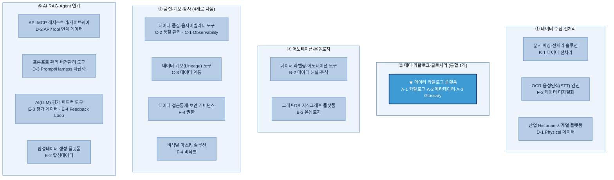
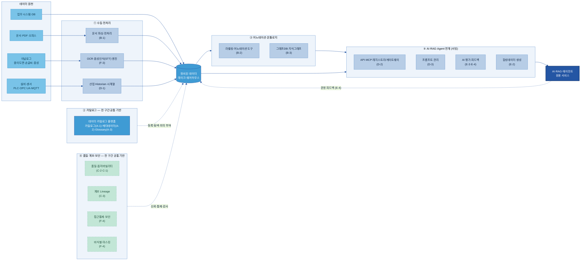

# AI-Ready Data — Tech Stack 제안 & 평가 판
### (RFP 5영역 → 솔루션 카테고리 → 데이터 주제 → Player 평가)

> **이 문서 하나로 본다.** **① RFP 5개 영역에 20개 주제 매핑**(안 맞는 주제는 제외) → **② 영역별로 솔루션 카테고리를 통합(1개)/분리(2~N개)** → **③ 각 카테고리에 데이터 주제별 기능 매핑** → **④ 카테고리별 Player 후보 + AXC 준용(보안·성능)·OSS/SaaS 평가 판.**
> **목적 = 실제 평가가 아니라 "평가할 수 있는 판"을 만드는 것.** 솔루션 구성·후보는 각 주제 가이드(B-1·D-1 등)의 Tech Stack 절을 따른다.
> **관점 고정:** "AI를 만드는 도구"가 아니라 **"AI가 쓸 데이터를 준비·정비하는 도구"**다.
> 후보 전체 비교·출처는 [01 Tech Stack 비교](01%20Tech%20Stack%20비교%20(솔루션×주제).md), AXC 방법론은 [Tech 솔루션 평가 기획안](Tech%20솔루션%20평가%20기획안%20(AXC%20방법론%20준용).md). (이전 `02 제안 Tech Stack`은 이 문서로 통합.)

---

## 0. 임원 보고 요약 (Executive Summary)

**권고 — 통합 플랫폼 1개 + 필수 2종으로 시작하고, 나머지는 데이터·과제에 따라 선택한다.** 묶을 수 있는 것은 한 솔루션으로 묶어 도입·운영 부담을 최소화한다.

**핵심 메시지**
1. **"20개 주제 = 20개 솔루션"이 아니다.** A군(카탈로그·메타·글로서리)은 한 플랫폼으로 묶이고, 묶으면 **필수 2종**으로 출발한다 — ① 데이터 카탈로그 플랫폼 ② 문서 파싱·전처리 솔루션.
2. **나머지는 데이터·과제에 따라 선택.** 한 카테고리가 여러 주제를 못 묶으면(예: ④ 품질·계보·감사) 솔루션 종류별로 나눠서 본다.
3. **제품을 못 박지 않는 "선택 가이드"다.** 모든 카테고리에 사외 반출 없는 **온프렘(오픈소스) 선택지**가 있어 폐쇄망 계열사도 동일 구성이 가능하다.

| 구분 | 솔루션 카테고리 | 도입 시점 |
|---|---|---|
| **필수 코어 (2)** | 데이터 카탈로그 플랫폼 · 문서 파싱·전처리 솔루션 | AI-Ready 착수 시 |
| **제조 추가 (1)** | 산업 Historian·시계열 플랫폼 | 설비 데이터 계열사 |
| **선택** | OCR·STT 엔진 · 데이터 품질·옵저버빌리티 · 라벨링·어노테이션 · 그래프DB·지식그래프 · 합성데이터 생성 · API·MCP 레지스트리/게이트웨이 · 프롬프트 관리 · 평가·피드백 · 접근통제 · 비식별 | 데이터·AI 과제 성격별 |
| **참고** | 데이터 계보·접근통제는 ② 카탈로그 플랫폼이 함께 제공하는 경우가 많음(별도 도입 전 중복 확인) | — |

---

## 1. RFP 5영역 ↔ 20주제 매핑 (제외 주제 명시)

| RFP 영역 | 매핑되는 주제 | 솔루션 카테고리 구성 |
|---|---|---|
| **① 데이터 수집·전처리** | B-1 데이터 전처리 · F-3 데이터 디지털화(OCR·STT) · D-1 Physical 데이터 | **3개** (문서 파싱·전처리 / OCR·STT 엔진 / 산업 Historian·시계열) |
| **② 메타·카탈로그·글로서리** | A-1 데이터 카탈로그 · A-2 메타데이터 · A-3 비즈니스 Glossary | **1개로 통합** (데이터 카탈로그 플랫폼) |
| **③ 어노테이션·온톨로지** | B-2 데이터 해설·주석 · B-3 온톨로지 | **2개** (라벨링·어노테이션 도구 / 그래프DB·지식그래프 플랫폼) |
| **④ 품질·계보·감사** | C-1 Observability · C-2 데이터 품질 관리 · C-3 데이터 계통 Lineage · F-4 AI 데이터 권한·보안 | **4개로 나뉨** (품질·옵저버빌리티 / 계보 / 접근통제 / 비식별) — 한 제품으로 다 안 됨 |
| **⑤ AI·RAG·Agent 연계** | D-2 API/Tool 연계 데이터 · D-3 Prompt/Harness 자산화 · E-2 합성데이터 · E-3 AI 평가 데이터 · E-4 데이터 Feedback Loop | **4개** (API·MCP 레지스트리/게이트웨이 / 프롬프트 관리 / 평가·피드백 / 합성데이터 생성) |

**제외 (억지로 매핑하지 않음):** **E-1 데이터 Product화 · F-1 데이터 운영관리(DataOps) · F-2 데이터 생애주기 관리.** 필요 시 [01](01%20Tech%20Stack%20비교%20(솔루션×주제).md) 참조.

→ **매핑 17개 / 제외 3개.**

---

## 2. 솔루션 카테고리 + 데이터 주제별 기능 매핑

### 한 장 구조도

**각 영역(상자) 안에 솔루션 카테고리와 거기 묶이는 데이터 주제를 표시.** 영역당 카테고리가 1개면 통합, 여러 개면 나뉜 것.

> **색:** 진한 파랑 테두리 = RFP 영역(상자) · 파랑 = 솔루션 카테고리 · 밝은 파랑(②) = 통합 플랫폼. **④의 계보·접근통제는 ② 카탈로그 플랫폼이 함께 제공하는 경우가 많다** — 별도 도입 전 ② 플랫폼 기능으로 충당되는지 확인.

### 영역별 데이터 주제 → 기능 매핑

**① 수집·전처리 (3개)** — 세 주제가 각각 다른 시장(B-1·D-1 가이드 §Tech Stack 따름).

| 카테고리 | 데이터 주제 → 기능 |
|---|---|
| 문서 파싱·전처리 솔루션 | B-1 데이터 전처리 → 규칙 라이브러리 / 문서 파싱 솔루션 / LLM 추출·청킹 |
| OCR·음성인식(STT) 엔진 | F-3 데이터 디지털화 → 대량 아날로그→디지털: OCR(인쇄·한글 손글씨·도면) + STT(음성) |
| 산업 Historian·시계열 플랫폼 | D-1 Physical 데이터 → 설비·센서 수집·연결(OPC UA·MQTT) + 시계열 저장 |

**② 메타·카탈로그·글로서리 (통합 1개)** — A-1·A-2·A-3을 한 플랫폼이 함께 제공. 계보·접근통제도 흔히 같은 플랫폼.

| 데이터 주제 | 기능 |
|---|---|
| A-1 데이터 카탈로그 | 데이터 자산 등록·검색·탐색 |
| A-2 메타데이터 | 기술·운영 메타데이터 수집·태깅·필드 설명 |
| A-3 비즈니스 Glossary | 용어집·동의어/약어 매핑·승인 워크플로 |

**③ 어노테이션·온톨로지 (2개)**

| 카테고리 | 데이터 주제 → 기능 |
|---|---|
| 데이터 라벨링·어노테이션 도구 | B-2 데이터 해설·주석 → AI 1차 라벨·검수(HITL)·다중 유형 라벨링 |
| 그래프DB·지식그래프 플랫폼 | B-3 온톨로지 → 그래프 저장·다중 홉 탐색·관계 추론(OWL/SHACL) |

**④ 품질·계보·감사 (4개로 나뉨)** — 한 제품이 다 못 하므로 분리. 계보·접근통제는 ②와 겹칠 수 있음.

| 카테고리 | 데이터 주제 → 기능 |
|---|---|
| 데이터 품질·옵저버빌리티 도구 | C-2 데이터 품질 관리 → 품질 규칙·합불 게이트 / C-1 Observability → 이상·결측 상시 모니터링 |
| 데이터 계보(Lineage) 도구 | C-3 데이터 계통 → 컬럼 단위 계보·영향도 추적 (②와 같은 제품인 경우 많음) |
| 데이터 접근통제·보안 거버넌스 | F-4 권한 → 역할/태그 기반 행·열 접근통제·마스킹 (②와 겹침) |
| 비식별·마스킹 솔루션 | F-4 비식별 → PII 발견·가명화·k-익명성·토큰화 |

**⑤ AI·RAG·Agent 연계 (4개)**

| 카테고리 | 데이터 주제 → 기능 |
|---|---|
| API·MCP 레지스트리/게이트웨이 | D-2 API/Tool 연계 데이터 → Tool 명세(MCP·OpenAPI) 등록·검색·버전관리·게이트웨이 |
| 프롬프트 관리·버전관리 도구 | D-3 Prompt/Harness 자산화 → 프롬프트 버전관리·레지스트리·하네스 패키징 |
| AI(LLM) 평가·피드백 도구 | E-3 AI 평가 데이터 → 정답셋·평가 실행 / E-4 Feedback Loop → 트레이스·점수·검수큐 |
| 합성데이터 생성 플랫폼 | E-2 합성데이터 → 정형/시계열/비전 합성 생성·검증 |

---

## 2-1. 기술 아키텍처 — 데이터가 흐르는 전체 구조

앞 §2가 **"어떤 솔루션 카테고리가 있는가"(분류 관점)**라면, 아래는 **"원천 데이터가 들어와 AI가 쓰기까지 어디를 거치며, 각 지점에서 어떤 솔루션 카테고리로 나뉘는가"(데이터 흐름 관점)**다. 좌→우가 데이터 여정이고, **② 카탈로그**와 **④ 품질·계보·보안**은 특정 단계가 아니라 **전 구간을 가로지르는 공통 기반 레이어**다(그래서 아래에 가로 띠로 둔다).

**읽는 법 (데이터 여정)**

| 단계 | 하는 일 | 나뉘는 솔루션 카테고리 (주제) |
|---|---|---|
| **원천** | 문서·아날로그·설비·업무DB에서 데이터 유입 | (솔루션 아님 — 입력) |
| **① 수집·전처리** | 사람·AI가 읽을 수 있는 형태로 변환·적재 | 문서 파싱·전처리(B-1) / OCR·STT(F-3) / 산업 Historian·시계열(D-1) |
| **저장** | 정비된 데이터를 레이크·웨어하우스에 축적 | (데이터 저장소) |
| **③ 어노테이션·온톨로지** | 라벨·관계를 입혀 의미를 더함 | 라벨링·어노테이션(B-2) / 그래프DB·지식그래프(B-3) |
| **⑤ AI·RAG·Agent 연계** | AI가 바로 쓰도록 서빙·평가·보강 | API·MCP 게이트웨이(D-2) / 프롬프트 관리(D-3) / 평가·피드백(E-3·E-4) / 합성데이터(E-2) |
| **응용** | RAG·에이전트가 데이터를 소비 → 운영 피드백이 다시 저장소로 환류 | AI·RAG·에이전트 서비스 |
| **② 공통 기반** | 모든 단계의 데이터를 등록·탐색·의미 부여 | 데이터 카탈로그 플랫폼(A-1·A-2·A-3) |
| **④ 공통 기반** | 모든 단계의 데이터를 신뢰·통제·감사 | 품질·옵저버빌리티(C-1·C-2) / 계보(C-3) / 접근통제(F-4) / 비식별(F-4) |

> **② 와 ④ 를 왜 띠로 두나:** 카탈로그·품질·계보·보안은 "① 다음, ③ 이전" 같은 특정 순번이 아니라 **모든 단계의 데이터에 동시에 걸린다.** 특히 ④의 **계보·접근통제는 ② 카탈로그 플랫폼이 함께 제공하는 경우가 많으므로**, 별도 도입 전 ② 플랫폼 기능으로 충당되는지 먼저 확인한다.

---

## 3. 카테고리별 Player 후보 + 평가 판 (AXC · OSS/SaaS)

각 카테고리의 **Player 후보 5개 내외**를 뽑고, **AXC 준용(보안 게이트 → 성능 30점, 20점컷 — 비용 축은 두지 않음)**으로 평가하도록 빈 양식을 둔다. **`보안`·`성능` 칸은 평가 단계에서 기입**한다. `온프렘`: ✓ 자체호스팅 / △ 옵션·조건부 / ✗ 클라우드 전용.

> 평가 규칙은 [Tech 솔루션 평가 기획안](Tech%20솔루션%20평가%20기획안%20(AXC%20방법론%20준용).md), 후보·출처 전체는 [01 Tech Stack 비교](01%20Tech%20Stack%20비교%20(솔루션×주제).md).

### [필수] 1. 데이터 카탈로그 플랫폼 (②)

| Player | OSS/SaaS | 온프렘 | 보안 게이트 | 성능(/30) |
|---|---|:--:|:--:|:--:|
| Collibra | SaaS | △ | | |
| Microsoft Purview | SaaS | ✗ | | |
| Atlan | SaaS | ✗ | | |
| Databricks Unity Catalog | 클라우드 | ✗ | | |
| OpenMetadata | OSS | ✓ | | |

### [필수] 2. 문서 파싱·전처리 솔루션 (① B-1 데이터 전처리)

| Player | OSS/SaaS | 온프렘 | 보안 게이트 | 성능(/30) |
|---|---|:--:|:--:|:--:|
| Docling | OSS | ✓ | | |
| Unstructured | OSS+SaaS | ✓ | | |
| LlamaParse | SaaS | ✗ | | |
| Azure Document Intelligence | SaaS | ✗ | | |
| Upstage Document Parse (국내) | 상용 | △ | | |

### [제조] 3. 산업 Historian·시계열 플랫폼 (① D-1 Physical 데이터)

| Player | OSS/SaaS | 온프렘 | 보안 게이트 | 성능(/30) |
|---|---|:--:|:--:|:--:|
| AVEVA PI System | 상용 | ✓ | | |
| GE Proficy Historian | 상용 | ✓ | | |
| InfluxDB | OSS | ✓ | | |
| Ignition | 상용 | ✓ | | |
| AWS IoT SiteWise | 클라우드 | ✗ | | |

### [선택] 4. OCR·음성인식(STT) 엔진 (① F-3 데이터 디지털화)

| Player | 유형 | OSS/SaaS | 온프렘 | 보안 게이트 | 성능(/30) |
|---|---|---|:--:|:--:|:--:|
| Naver CLOVA OCR (국내) | OCR | SaaS | ✗ | | |
| Upstage (국내) | OCR | 상용 | △ | | |
| Tesseract / PaddleOCR | OCR | OSS | ✓ | | |
| OpenAI Whisper | STT | OSS | ✓ | | |
| Naver CLOVA Speech (국내) | STT | SaaS | ✗ | | |

### [선택] 5. 데이터 라벨링·어노테이션 도구 (③ B-2 데이터 해설·주석)

| Player | OSS/SaaS | 온프렘 | 보안 게이트 | 성능(/30) |
|---|---|:--:|:--:|:--:|
| Label Studio | OSS | ✓ | | |
| CVAT | OSS | ✓ | | |
| Snorkel Flow | 상용 | △ | | |
| Labelbox | SaaS | △ | | |
| SageMaker Ground Truth | SaaS | ✗ | | |

### [선택] 6. 그래프DB·지식그래프 플랫폼 (③ B-3 온톨로지)

| Player | OSS/SaaS | 온프렘 | 보안 게이트 | 성능(/30) |
|---|---|:--:|:--:|:--:|
| Neo4j | OSS+상용 | ✓ | | |
| Amazon Neptune | 클라우드 | ✗ | | |
| Ontotext GraphDB | 상용 | ✓ | | |
| Stardog | 상용 | ✓ | | |
| Apache Jena | OSS | ✓ | | |

### [선택] 7. 데이터 품질·옵저버빌리티 도구 (④ C-2·C-1)

| Player | OSS/SaaS | 온프렘 | 보안 게이트 | 성능(/30) |
|---|---|:--:|:--:|:--:|
| Great Expectations | OSS | ✓ | | |
| Soda | OSS+SaaS | ✓ | | |
| Monte Carlo | SaaS | ✗ | | |
| Anomalo | SaaS | △ | | |
| Ataccama | 상용 | △ | | |

### [선택] 8. 데이터 계보(Lineage) 도구 (④ C-3) — ②와 겹칠 수 있음

| Player | OSS/SaaS | 온프렘 | 보안 게이트 | 성능(/30) |
|---|---|:--:|:--:|:--:|
| OpenLineage + Marquez | OSS | ✓ | | |
| Collibra | SaaS | △ | | |
| Atlan | SaaS | ✗ | | |
| Databricks Unity Catalog | 클라우드 | ✗ | | |
| Microsoft Purview | SaaS | ✗ | | |

### [선택] 9. 데이터 접근통제·보안 거버넌스 (④ F-4 권한) — ②와 겹칠 수 있음

| Player | OSS/SaaS | 온프렘 | 보안 게이트 | 성능(/30) |
|---|---|:--:|:--:|:--:|
| Immuta | 상용 | △ | | |
| Privacera | 상용 | △ | | |
| Apache Ranger | OSS | ✓ | | |
| Databricks Unity Catalog | 클라우드 | ✗ | | |
| Snowflake Horizon | 클라우드 | ✗ | | |

### [선택] 10. 비식별·마스킹 솔루션 (④ F-4 비식별)

| Player | OSS/SaaS | 온프렘 | 보안 게이트 | 성능(/30) |
|---|---|:--:|:--:|:--:|
| Microsoft Presidio | OSS | ✓ | | |
| 파수(Fasoo) (국내) | 상용 | ✓ | | |
| Google Cloud DLP | SaaS | ✗ | | |
| Tonic.ai | 상용 | △ | | |
| ARX | OSS | ✓ | | |

### [선택] 11. API·MCP 레지스트리/게이트웨이 (⑤ D-2)

표준은 MCP·OpenAPI 채택이 기본. 명세를 등록·검색·버전관리·게이트웨이하는 솔루션(2025~2026 신생 — 지속성 확인).

| Player | 카테고리 | OSS/SaaS | 온프렘 | 보안 게이트 | 성능(/30) |
|---|---|---|:--:|:--:|:--:|
| 공식 MCP Registry | MCP 레지스트리 | OSS | ✓ | | |
| Docker MCP Toolkit | 레지스트리·게이트웨이 | 상용 | ✓ | | |
| IBM ContextForge | MCP 게이트웨이 | OSS | ✓ | | |
| Azure API Center | API/MCP 레지스트리 | 상용 | △ | | |
| Apigee API Hub | API 레지스트리 | 상용 | ✗ | | |

### [선택] 12. 프롬프트 관리·버전관리 도구 (⑤ D-3)

| Player | OSS/SaaS | 온프렘 | 보안 게이트 | 성능(/30) |
|---|---|:--:|:--:|:--:|
| Langfuse | OSS+SaaS | ✓ | | |
| Agenta | OSS+SaaS | ✓ | | |
| LangSmith | SaaS | △ | | |
| PromptLayer | SaaS | ✗ | | |
| Braintrust | SaaS | △ | | |

### [선택] 13. AI(LLM) 평가·피드백 도구 (⑤ E-3·E-4)

| Player | OSS/SaaS | 온프렘 | 보안 게이트 | 성능(/30) |
|---|---|:--:|:--:|:--:|
| Ragas | OSS | ✓ | | |
| DeepEval | OSS | ✓ | | |
| Arize Phoenix | OSS+상용 | ✓ | | |
| Langfuse | OSS+SaaS | ✓ | | |
| Braintrust | SaaS | △ | | |

### [선택] 14. 합성데이터 생성 플랫폼 (⑤ E-2)

| Player | OSS/SaaS | 온프렘 | 보안 게이트 | 성능(/30) |
|---|---|:--:|:--:|:--:|
| MOSTLY AI | 상용 | △ | | |
| Tonic.ai | 상용 | △ | | |
| SDV (Synthetic Data Vault) | OSS | ✓ | | |
| Gretel | 상용 | △ | | |
| NVIDIA Omniverse (비전) | 상용 | △ | | |

> **시장 주의(2025~2026):** Humanloop 종료(2025-09) · Helicone 기능 동결(2026-03) · MCP 관리 솔루션 신생(지속성·GA 확인). 제품명·온프렘·가격은 변동되므로 PoC·공식 문서로 확인.

---

## 변경 이력

| 버전 | 일자 | 내용 |
|---|---|---|
| v0.1~0.8 | 2026-06-24 | 솔루션 단위 정리 → 02 통합 → LLMOps 명칭 제거 → 구조도(그룹 박스) → ⑤ 재확장 → ① 가이드 정렬. |
| v1.1 | 2026-07-01 | **비용 축 제거 — Player 평가 판을 보안·성능만으로.** §3의 14개 후보 표에서 `비용(/3)` 열 삭제, 평가 규칙 문구를 "보안 게이트 → 성능 30점, 20점컷(비용 없음)"으로 수정(기획안·04와 정합). |
| v1.0 | 2026-07-01 | **§2-1 기술 아키텍처(데이터 흐름 관점) 추가** — 원천→①수집·전처리→저장→③어노테이션·온톨로지→⑤서빙→AI 응용의 좌→우 데이터 여정으로, 각 단계에서 나뉘는 솔루션 카테고리를 표시. ②카탈로그·④품질·계보·보안은 전 구간 가로지르는 공통 기반 레이어(점선)로. E-4 운영 피드백 환류 반영. |
| v0.9 | 2026-06-24 | **Tech Player Group을 솔루션 카테고리명으로 통일 + ④ 분리 + Player 5개 내외로 정리.** "라벨링" 같은 기능명을 "데이터 라벨링·어노테이션 도구"식 제품 카테고리명으로. **통합이 안 되는 ④(품질·계보·감사)를 4개 카테고리(품질·옵저버빌리티 / 계보 / 접근통제 / 비식별)로 분리**(계보·접근통제는 ②와 겹칠 수 있음을 명시). 각 카테고리 Player를 대표 5개로 압축. 구조도·§1·§2·§3·임원 요약 일괄 반영. |
