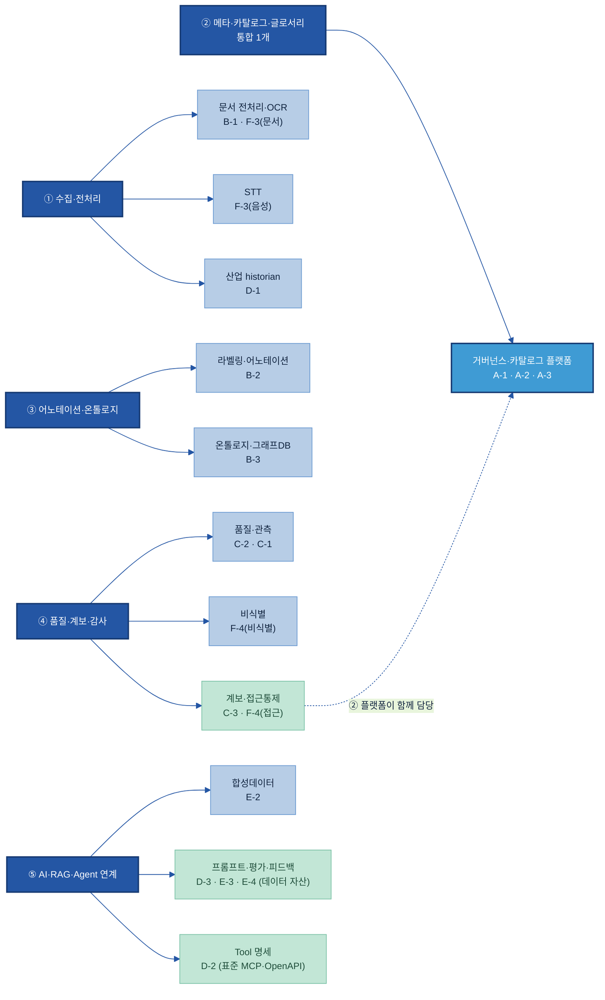

# AI-Ready Data — Tech Stack 제안 & 평가 판
### (RFP 5영역 → 솔루션 단위 → 기능 매핑 → Player 평가)

> **이 문서 하나로 본다.** 흩어져 있던 관점을 한 흐름으로 합쳤다:
> **① RFP 5개 영역에 20개 주제 매핑**(안 맞는 주제는 억지로 넣지 않고 제외) → **② 영역별로 솔루션을 통합(1개)하거나 분리(2~3개)** → **③ 각 솔루션에 데이터 주제별로 어느 기능이 매핑되는지** → **④ 솔루션 단위별 Player 후보 + AXC(성능·비용·보안)·OSS/SaaS 평가 판.**
> **목적 = 실제 평가가 아니라 "평가할 수 있는 판"을 만드는 것.** ③까지가 "무엇을 갖출지", ④가 "그 후보들을 어떻게 평가할지"의 빈 양식이다.
> **관점 고정:** 이 매뉴얼은 "AI를 만드는 도구"가 아니라 **"그 AI가 쓸 데이터를 준비·정비하는 도구"**를 다룬다. 그래서 AI 운영 플랫폼(LLMOps)은 솔루션 목록에서 빼고, 프롬프트·평가셋·피드백은 *데이터 자산*으로 다룬다.
> 제품은 **후보·예시**다 — 후보 전체 비교·기능·출처는 [01 Tech Stack 비교](01%20Tech%20Stack%20비교%20(솔루션×주제).md), AXC 평가 방법론(성능30+비용3=33점·보안 게이트·20점컷) 상세는 [Tech 솔루션 평가 기획안](Tech%20솔루션%20평가%20기획안%20(AXC%20방법론%20준용).md). (이전 `02 제안 Tech Stack`은 이 문서로 통합.)

---

## 0. 임원 보고 요약 (Executive Summary)

**권고 — 통합 플랫폼 1개 + 필수 2종으로 시작하고, 나머지는 선택한다.** 20개 데이터 주제를 솔루션별로 따로 도입하는 것이 아니라, **묶을 수 있는 것은 한 솔루션으로 묶어** 도입·운영 부담을 최소화한다.

**핵심 메시지**
1. **"20개 주제 = 20개 솔루션"이 아니다.** 묶고·나누고·빼면 **필수 2종**으로 출발한다 — ① 거버넌스·카탈로그 플랫폼(메타·글로서리·계보·접근통제까지 한 제품) ② 문서 전처리·OCR. 표준·데이터 자산으로 갈음되는 영역(Tool 명세 / 프롬프트·평가·피드백 데이터)은 솔루션을 따로 사지 않는다.
2. **제품을 못 박지 않는 "선택 가이드"다.** 계열사가 이미 쓰는 플랫폼·데이터 성격에 맞춰 직접 고른다 — 본 문서는 "무엇을 몇 개 갖추고, 후보를 어떻게 평가할지"의 그룹 표준 틀이다.
3. **폐쇄망 계열사도 동일 구성 가능.** 모든 솔루션 단위에 사외 반출 없는 **온프렘(오픈소스) 선택지**가 있다.

| 구분 | 솔루션 단위 | 도입 시점 |
|---|---|---|
| **필수 코어 (2)** | 거버넌스·카탈로그 플랫폼 · 문서 전처리·OCR | AI-Ready 착수 시 |
| **제조 추가 (1)** | 산업 historian(설비·센서) | 설비 데이터 계열사 |
| **선택 (5)** | 품질·관측 · 라벨링 · 비식별 · 온톨로지 · 합성데이터 | 데이터·과제 성격별 |
| **솔루션 불필요** | Tool 명세(MCP·OpenAPI 표준) · 프롬프트·평가·피드백(데이터 자산) · 계보·접근통제(② 플랫폼이 담당) | — |

---

## 1. RFP 5영역 ↔ 20주제 매핑 (제외 주제 명시)

| RFP 영역 | 매핑되는 주제 | 솔루션 구성 |
|---|---|---|
| **① 데이터 수집·전처리** | B-1 전처리 · F-3 디지털화(OCR·STT) · D-1 Physical | **3개로 나뉨** (문서AI / STT / historian) |
| **② 메타·카탈로그·글로서리** | A-1 카탈로그 · A-2 메타데이터 · A-3 글로서리 | **1개로 통합** (거버넌스·카탈로그 플랫폼) |
| **③ 어노테이션·온톨로지** | B-2 어노테이션 · B-3 온톨로지 | **2개로 나뉨** (라벨링 / 그래프DB) |
| **④ 품질·계보·감사** | C-2 품질 · C-3 계보 · C-1 관측 · F-4 권한·비식별 | **② 활용 + 따로 1~2개** (계보·접근통제는 ② 플랫폼 / 품질·관측 / 비식별) |
| **⑤ AI·RAG·Agent 연계** | D-2 Tool명세 · D-3 Prompt · E-2 합성 · E-3 평가 · E-4 피드백 | **합성 1(선택) + D-2 표준** · 프롬프트·평가·피드백(D-3·E-3·E-4)은 **데이터 자산**(별도 솔루션 X) |

**제외 (억지로 매핑하지 않음):** **E-1 데이터 Product화 · F-1 DataOps · F-2 데이터 생애주기 관리** — RFP 5개 영역에 직접 대응되지 않는다(구현 운영 단계 주제). 필요 시 [01](01%20Tech%20Stack%20비교%20(솔루션×주제).md)의 해당 주제 참조.

→ **매핑 17개 / 제외 3개.**

---

## 2. 솔루션 단위 + 데이터 주제별 기능 매핑

각 영역에서 솔루션을 통합/분리하고, **그 솔루션의 "어느 기능"에 데이터 주제가 매핑되는지**를 보인다.

### 한 장 구조도

왼쪽 = RFP 5개 영역, 오른쪽 = 그 영역에서 도입하는 솔루션, 박스 안 = 그 솔루션에 묶이는 데이터 주제. **영역마다 솔루션이 1개면 통합, 여러 개면 나뉜 것**이다.

> **색:** 진한 파랑 = RFP 영역 · 파랑 = 도입 솔루션 · 밝은 파랑(②) = 통합 플랫폼(②의 카탈로그·메타·글로서리에 ④의 계보·접근통제까지 한 제품) · 초록 = 표준·데이터 자산(도입 솔루션이 아닌 것). ④의 계보·접근통제는 ② 플랫폼이 함께 담당하므로 점선으로 연결했다.

### ② 메타·카탈로그·글로서리 — **통합 1개** (거버넌스·카탈로그 플랫폼)

A-1·A-2·A-3은 보통 한 플랫폼이 함께 제공한다. ④의 계보·접근통제도 같은 플랫폼 기능이다.

| 데이터 주제 | 이 솔루션의 매핑 기능 |
|---|---|
| A-1 카탈로그 | 데이터 자산 등록·검색·탐색(커넥터 자동 수집) |
| A-2 메타데이터 | 기술·운영 메타데이터 수집·태깅·필드 설명 |
| A-3 비즈니스 글로서리 | 비즈니스 용어집·동의어/약어 매핑·승인 워크플로 |
| *(C-3 계보 — ④)* | *컬럼 단위 데이터 계보(Lineage)* |
| *(F-4a 접근통제 — ④)* | *역할/태그 기반 행·열 접근통제·동적 마스킹* |

### ① 수집·전처리 — **3개로 나뉨**

성격이 다른 세 시장이라 묶이지 않는다.

| 솔루션 단위 | 데이터 주제 → 매핑 기능 |
|---|---|
| **문서 전처리·OCR** | B-1 전처리 → 문서 파싱·표 구조 보존·청킹 / F-3(문서) → OCR·레이아웃 인식 |
| **STT(음성)** | F-3(음성) → 음성→텍스트 변환(회의록·현장 음성) |
| **산업 historian** | D-1 → 시계열 수집·설비ID/단위 표준화·OPC UA·실시간 적재 |

### ③ 어노테이션·온톨로지 — **2개로 나뉨**

| 솔루션 단위 | 데이터 주제 → 매핑 기능 |
|---|---|
| **라벨링·어노테이션** | B-2 → AI 1차 라벨(pre-label)·검수(HITL)·다중 유형(이미지/텍스트) 라벨링 |
| **온톨로지·그래프DB** | B-3 → 그래프 저장·다중 홉 탐색·관계 추론(OWL/SHACL) |

### ④ 품질·계보·감사 — **② 플랫폼이 일부 담당 + 따로 1~2개**

계보(C-3)·접근통제(F-4a)는 ②플랫폼 기능(위 표). 새로 필요한 것:

| 솔루션 단위 | 데이터 주제 → 매핑 기능 |
|---|---|
| **품질·관측** | C-2 → 품질 규칙·합불 게이트(완전성·정확성 등) / C-1 → 이상·지연·결측 상시 모니터링·알림 |
| **비식별** *(선택)* | F-4b → PII 발견·마스킹·토큰화·가명화(투입 전 변환) |

### ⑤ AI·RAG·Agent 연계 — **합성 1개(선택) · 나머지는 표준·데이터 자산**

이 영역은 "AI를 운영하는 플랫폼(LLMOps)"을 도입하는 게 아니라, AI가 쓸 **데이터·표준을 준비**하는 관점으로 본다.

| 솔루션 단위 | 데이터 주제 → 매핑 기능 |
|---|---|
| **합성데이터** *(선택)* | E-2 → 정형/시계열/비전 합성 생성·검증 |
| **Tool 명세** *(표준)* | D-2 → MCP·OpenAPI 표준으로 Tool 명세·스키마 정의 — **별도 솔루션 아님** |
| **프롬프트·평가·피드백** *(데이터 자산)* | D-3 프롬프트·E-3 평가셋(Gold)·E-4 피드백 → 재사용 데이터로 작성·버전관리(경량 레지스트리·Git). **AI 운영 플랫폼(LLMOps) 도입 대상 아님** |

---

## 3. 솔루션 단위별 Player 후보 + 평가 판 (AXC · OSS/SaaS)

각 솔루션 단위의 **Player 후보**를 뽑고, **AXC 검증 방법론(보안 게이트 → 성능 30점 + 비용 3점 = 33점, 20점컷)**으로 평가할 수 있게 빈 양식을 둔다. **`보안`·`성능`·`비용` 칸은 비워 둔 평가 판** — 실제 점수는 PoC·평가 단계에서 기입한다. `OSS/SaaS`·`온프렘`은 사전 표기(온프렘: ✓ 자체호스팅 가능 · △ 옵션/조건부 · ✗ 클라우드 전용).

> 평가 규칙 상세(성능 3 Pillar×10·비용 시나리오·보안 게이트 항목)는 [Tech 솔루션 평가 기획안 (AXC 방법론 준용)](Tech%20솔루션%20평가%20기획안%20(AXC%20방법론%20준용).md). 후보·기능·출처 전체는 [01 Tech Stack 비교](01%20Tech%20Stack%20비교%20(솔루션×주제).md).
> **평가 대상이 아닌 것:** Tool 명세(D-2)는 표준 채택, 프롬프트·평가·피드백(D-3·E-3·E-4)은 데이터 자산이라 도입 솔루션 평가 대상이 아니다(아래 별도 표기).

### [필수] 1. 거버넌스·카탈로그 플랫폼 (②+④ 계보·접근통제)

| Player(후보) | OSS/SaaS | 온프렘 | 보안 게이트 | 성능(/30) | 비용(/3) |
|---|---|:--:|:--:|:--:|:--:|
| Collibra | SaaS | △ | | | |
| Alation | SaaS·자체 | △ | | | |
| Atlan | SaaS | ✗ | | | |
| Microsoft Purview | SaaS | ✗ | | | |
| Databricks Unity Catalog | 클라우드 | ✗ | | | |
| Snowflake Horizon | 클라우드 | ✗ | | | |
| OpenMetadata | OSS | ✓ | | | |
| DataHub | OSS | ✓ | | | |

### [필수] 2. 문서 전처리·OCR (①)

| Player(후보) | OSS/SaaS | 온프렘 | 보안 게이트 | 성능(/30) | 비용(/3) |
|---|---|:--:|:--:|:--:|:--:|
| Docling | OSS | ✓ | | | |
| Unstructured | OSS+SaaS | ✓ | | | |
| Camelot / pdfplumber | OSS | ✓ | | | |
| LlamaParse | SaaS | ✗ | | | |
| Azure AI Document Intelligence | SaaS | ✗ | | | |
| Google Document AI | SaaS | ✗ | | | |
| AWS Textract / Bedrock Data Automation | SaaS | ✗ | | | |
| Upstage Document Parse (국내) | 상용 | △ | | | |

### [제조] 3. 산업 historian (① D-1)

| Player(후보) | OSS/SaaS | 온프렘 | 보안 게이트 | 성능(/30) | 비용(/3) |
|---|---|:--:|:--:|:--:|:--:|
| AVEVA PI System | 상용 | ✓ | | | |
| Ignition | 상용 | ✓ | | | |
| InfluxDB | OSS | ✓ | | | |
| TimescaleDB | OSS | ✓ | | | |
| AWS IoT SiteWise / MS Fabric RTI | 클라우드 | ✗ | | | |

### [선택] 4. 품질·관측 (④ C-2·C-1)

| Player(후보) | OSS/SaaS | 온프렘 | 보안 게이트 | 성능(/30) | 비용(/3) |
|---|---|:--:|:--:|:--:|:--:|
| Great Expectations | OSS | ✓ | | | |
| Soda (Core/Cloud) | OSS+SaaS | ✓ | | | |
| Monte Carlo | SaaS | ✗ | | | |
| Sifflet / Anomalo / Bigeye | SaaS | △ | | | |
| Informatica / Ataccama | 상용 | △ | | | |

### [선택] 5. 라벨링·어노테이션 (③ B-2)

| Player(후보) | OSS/SaaS | 온프렘 | 보안 게이트 | 성능(/30) | 비용(/3) |
|---|---|:--:|:--:|:--:|:--:|
| Label Studio | OSS | ✓ | | | |
| CVAT | OSS | ✓ | | | |
| Prodigy | 상용 | ✓ | | | |
| Snorkel Flow | 상용 | △ | | | |
| Labelbox / Scale AI | SaaS | △/✗ | | | |
| SageMaker Ground Truth | SaaS | ✗ | | | |

### [선택] 6. 비식별 (④ F-4b)

| Player(후보) | OSS/SaaS | 온프렘 | 보안 게이트 | 성능(/30) | 비용(/3) |
|---|---|:--:|:--:|:--:|:--:|
| Microsoft Presidio | OSS | ✓ | | | |
| ARX | OSS | ✓ | | | |
| 파수(Fasoo) (국내) | 상용 | ✓ | | | |
| Google Cloud DLP | SaaS | ✗ | | | |
| Tonic.ai / Protegrity | 상용 | △ | | | |
| Amazon Macie / BigID (발견 전용) | SaaS·상용 | ✗/△ | | | |

### [선택] 7. 온톨로지·그래프DB (③ B-3)

| Player(후보) | OSS/SaaS | 온프렘 | 보안 게이트 | 성능(/30) | 비용(/3) |
|---|---|:--:|:--:|:--:|:--:|
| Neo4j (Community/Ent) | OSS+상용 | ✓ | | | |
| Amazon Neptune | 클라우드 | ✗ | | | |
| Ontotext GraphDB | 상용 | ✓ | | | |
| Stardog | 상용 | ✓ | | | |
| Memgraph / TigerGraph | OSS·상용 | ✓ | | | |
| Apache Jena / Protégé | OSS | ✓ | | | |

### [선택] 8. 합성데이터 (⑤ E-2)

| Player(후보) | OSS/SaaS | 온프렘 | 보안 게이트 | 성능(/30) | 비용(/3) |
|---|---|:--:|:--:|:--:|:--:|
| MOSTLY AI | 상용 | △ | | | |
| Syntho | 상용 | △ | | | |
| Tonic.ai | 상용 | △ | | | |
| SDV (Synthetic Data Vault) | OSS | ✓ | | | |
| NVIDIA Omniverse (비전) | 상용 | △ | | | |
| Gretel | 상용 | △ | | | |

### [표준·데이터 자산] 평가 대상 아님 (⑤ D-2·D-3·E-3·E-4)

도입 솔루션이 아니라 표준 채택·데이터 자산이라 33점 평가 대상이 아니다.
- **Tool 명세 (D-2)** — 표준 = **MCP**·**OpenAPI/JSON Schema**. 레지스트리(선택): MCP Registry(OSS,✓)·Backstage(OSS,✓)·SwaggerHub(SaaS,✗)·Azure API Center(SaaS,✗)·Apigee API Hub(SaaS,✗).
- **프롬프트·평가·피드백 (D-3·E-3·E-4)** — 재사용 **데이터 자산**으로 작성·버전관리한다(경량 레지스트리·Git). AI 운영 플랫폼(LLMOps) 도입 대상이 아니다.

---

## 변경 이력

| 버전 | 일자 | 내용 |
|---|---|---|
| v0.1 | 2026-06-24 | 신규 — RFP 5영역 안에서 솔루션 단위(묶기·나누기·빼기)로 정리. |
| v0.2 | 2026-06-24 | 임원 보고 요약 추가. |
| v0.3 | 2026-06-24 | **통합 마스터로 재구성(02 흡수·대체).** 단일 흐름: ①매핑(제외 3개)→②솔루션 단위(통합/분리)+기능 매핑→③Player 후보 + AXC·OSS/SaaS 평가 판(빈 양식). |
| v0.4 | 2026-06-24 | §2에 "한 장 구조도"(Mermaid) 추가 — 거버넌스 플랫폼이 ②·④에 걸치는 구조 시각화. |
| v0.5 | 2026-06-24 | **LLMOps(AI 운영 플랫폼) 제거 — 데이터 준비 관점 정합.** 필수 코어 3→2종(거버넌스·문서AI). 프롬프트·평가·피드백(D-3·E-3·E-4)을 "LLMOps 솔루션"에서 빼고 **데이터 자산(경량 버전관리, 평가 대상 아님)**으로 재분류. 요약·§1·구조도·§2 ⑤·§3(LLMOps Player 표 삭제·재번호)에 반영. |
| v0.6 | 2026-06-24 | **한 장 구조도를 트리(영역→솔루션→주제)로 재작성 + 워딩 통일.** "흡수/분리/별도 구매 X" 같은 표현을 빼고 "나뉨/통합/② 플랫폼이 담당"으로 정리. 다이어그램은 왼쪽 영역 → 오른쪽 솔루션(박스 안에 묶이는 주제), 영역당 박스 1개=통합·여러 개=나뉨으로 구조가 직접 보이게. §1·§2 헤딩도 동일 워딩으로 정합. |
