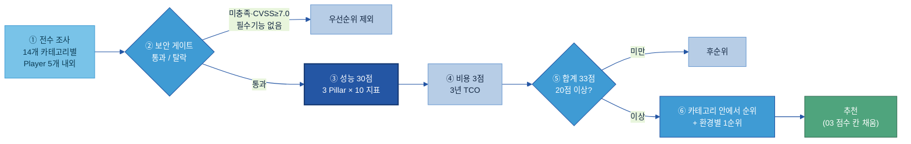
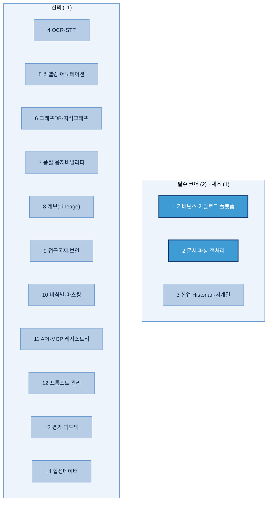
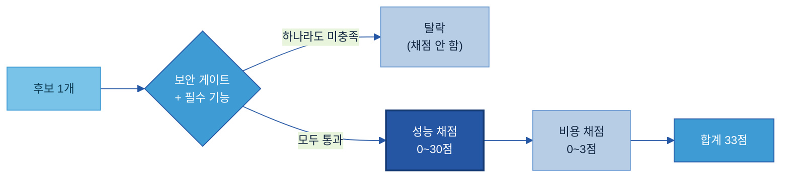
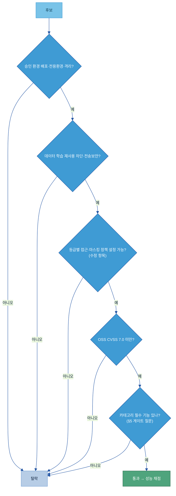
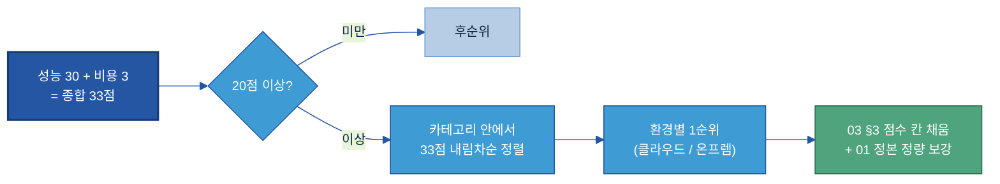

# AI-Ready Data — Player 평가 실행안

### (14개 카테고리 후보 전수 조사 → 보안·성능·비용 순 평가 → 추천, 그림으로 보기)

> **이 문서 = "어떻게 돌리나"를 그림으로 보여주는 실행안.** 평가의 *규칙·배점*은 [Tech 솔루션 평가 기획안](Tech%20솔루션%20평가%20기획안%20(AXC%20방법론%20준용).md)이, 평가할 *후보 목록·판*은 [03 제안 솔루션 구성](03%20제안%20솔루션%20구성%20(영역별%20솔루션%20단위).md)이 정한다. 이 04 문서는 그 둘을 **실제로 돌리는 흐름 — 후보를 전수 조사하고, 보안 → 성능 → 비용 순으로 걸러, 카테고리별로 추천하기까지 —** 를 그림 중심으로 정리한다. 특히 **성능을 어떻게 매기는지**를 자세히 그린다.
>
> **관점 고정:** "AI를 만드는 도구"가 아니라 **"AI가 쓸 데이터를 준비·정비하는 도구"**를 고른다.

---

## 목차

- [1. 한 장으로 보는 전체 흐름](#s1)
- [2. 1단계 — 카테고리로 나누고, 후보를 전수 조사](#s2)
  - [2.1 먼저 나눈다 — RFP 5영역 → 14개 카테고리 (통합 / 분리)](#s2)
  - [2.2 14개 카테고리별 후보 전수 조사](#s2)
- [3. 2단계 — 순서대로 평가: 보안 → 성능 → 비용](#s3)
- [4. 보안 게이트 — 통과 / 탈락](#s4)
- [5. 성능 평가 30점 — 어떻게 매기나 (핵심)](#s5)
- [6. 비용 평가 3점 — 3년 TCO](#s6)
- [7. 종합·추천 산출 — 33점 → 20점 컷 → 순위](#s7)
- [8. 적용 절차 요약](#s8)
- [참고자료](#refs)

---

<a id="s1"></a>
## 1. 한 장으로 보는 전체 흐름

후보를 모으고(조사), 위에서 아래로 걸러(보안 → 성능 → 비용), 남는 것을 카테고리 안에서 줄 세운다(추천). 순서·배점은 AXC와 동일하다.



같은 흐름을 "위에서 아래로 좁혀지는 깔때기"로 보면:


- **보안이 맨 앞이다.** 아무리 성능이 좋아도 보안 게이트를 못 넘으면 채점 자체를 안 한다(탈락). 헛수고를 줄이는 순서다.
- **성능(30)이 몸통, 비용(3)은 동점을 가르는 보조**다 — 10:1 비중.
- **순위는 카테고리 안에서만** 매긴다. 거버넌스 플랫폼끼리, 품질·관측 도구끼리 각각 줄 세운다(서로 다른 시장을 한 줄에 세우지 않는다).

---

<a id="s2"></a>
## 2. 1단계 — 카테고리로 나누고, 후보를 전수 조사

### 2.1 먼저 나눈다 — RFP 5영역 → 14개 카테고리 (통합 / 분리)

무엇을 조사할지 정하는 것이 맨 앞이다. RFP 5개 영역을 그대로 솔루션 카테고리로 쓰지 않고, **한 제품이 여러 주제를 함께 커버하면 하나로 묶고(통합), 한 제품으로 다 못 하면 여러 개로 나눈다(분리).** 이렇게 갈라져 나온 카테고리가 조사·채점의 단위다.


| RFP 영역 | 통합/분리 | 왜 | 나오는 카테고리 |
|---|:--:|---|---|
| ① 데이터 수집·전처리 | **3개로 분리** | 문서·아날로그·설비가 서로 다른 시장 | 문서 파싱·전처리 / OCR·STT / 산업 Historian·시계열 |
| ② 메타·카탈로그·글로서리 | **통합 1개** | 한 플랫폼이 카탈로그·메타·용어집을 함께 제공 | ★ 데이터 거버넌스·카탈로그 플랫폼 |
| ③ 어노테이션·온톨로지 | **2개로 분리** | 라벨링 도구와 그래프DB는 다른 제품군 | 라벨링·어노테이션 / 그래프DB·지식그래프 |
| ④ 품질·계보·감사 | **4개로 분리** | 한 제품이 품질·계보·접근통제·비식별을 다 못 함 | 품질·옵저버빌리티 / 계보 / 접근통제·보안 / 비식별·마스킹 |
| ⑤ AI·RAG·Agent 연계 | **4개로 분리** | 명세·프롬프트·평가·합성이 각각 다른 도구 | API·MCP 레지스트리 / 프롬프트 관리 / 평가·피드백 / 합성데이터 |

- **② 는 통합의 대표 사례다.** A-1·A-2·A-3(+ 계보·기본 접근통제)을 한 거버넌스·카탈로그 플랫폼이 함께 제공하므로 하나로 묶는다.
- **④ 는 분리의 대표 사례다.** 품질·계보·접근통제·비식별을 한 제품이 다 못 해 4개로 나눈다.
- **RFP에 억지로 안 맞는 E-1·F-1·F-2 3주제는 제외**했다(별도 Player 목록이 생기면 같은 루브릭으로 추가 평가).

> 나누는 로직·근거의 단일 정본은 [03 §1·§2](03%20제안%20솔루션%20구성%20(영역별%20솔루션%20단위).md)다. 04는 그 결과(14개 카테고리)를 조사·평가 단위로 받아 쓴다.

### 2.2 14개 카테고리별 후보 전수 조사

나뉜 **14개 카테고리**가 조사 단위다. 카테고리마다 대표 Player 5개 내외를 모은다(03 §3에 이미 후보 표가 있다 — 이 패스가 그 빈 점수 칸을 채운다).



조사할 때 카테고리별로 반드시 채우는 항목:

| 채우는 칸 | 무엇을 조사하나 |
|---|---|
| Player 이름 | 카테고리 대표 후보 5개 내외 (상용·SaaS·OSS·국내 고루) |
| OSS/SaaS | 오픈소스 / 클라우드 서비스 / 상용 구분 |
| 온프렘 | ✓ 자체호스팅 / △ 옵션·조건부 / ✗ 클라우드 전용 — 폐쇄망 계열사 필수 확인 |
| 보안·성능·비용 | (여기서는 빈칸 — 3~5단계에서 채운다) |

> **왜 주제(20개)가 아니라 카테고리(14개)로 조사하나:** 한 통합 플랫폼이 여러 주제를 함께 커버하기 때문이다(예: 거버넌스·카탈로그 플랫폼 하나가 A-1·A-2·A-3 + 계보 + 기본 접근통제). 주제별로 쪼개 채점하면 같은 제품을 여러 번 평가하게 된다. 그래서 03이 묶은 카테고리 축으로 한 번씩만 채점한다.

---

<a id="s3"></a>
## 3. 2단계 — 순서대로 평가: 보안 → 성능 → 비용

한 후보가 거치는 순서는 정해져 있다. **보안은 통과/탈락 관문**이고, 통과한 후보만 **성능·비용 점수**를 받는다.



| 순서 | 성격 | 결과 |
|---|---|---|
| **1) 보안 게이트** | 통과 / 탈락 (점수 아님) | 미충족 시 탈락 — 이후 채점 없음 |
| **2) 성능** | 30점 채점 | 후보 변별의 몸통 |
| **3) 비용** | 3점 채점 | 동점 조정용 보조 |

이 순서가 곧 §1 퍼널의 좁혀지는 단계다. 아래 4·5·6장에서 각 단계를 자세히 본다.

---

<a id="s4"></a>
## 4. 보안 게이트 — 통과 / 탈락

AXC의 보안 탈락 사유를 그대로 체크리스트로 쓴다. **하나라도 미충족이면 탈락.** 데이터 관점으로 치환한 항목은 2개뿐이다.



- **그대로 쓰는 항목:** 승인 클라우드/온프렘 배포, 학습·제3자 재사용 차단, 데이터 격리, 전용 환경, 권한 모델, 전송 보안·데이터 위치, OSS 취약점(CVSS 7.0 미만).
- **데이터 관점으로 바꾼 2개:** ① (LLM 응답 차단 → ) **데이터 등급별 접근·마스킹 정책 설정 가능?** ② (비정상 Tool 호출 탐지 → ) **비정상 데이터 접근·대량 반출 탐지?**(주로 접근통제·비식별 카테고리).
- **카테고리 필수 기능**은 게이트 질문으로 함께 본다(예: 거버넌스 플랫폼 = 우리 원천에 커넥터 있나 / 문서 전처리 = 표 구조 보존·한국어 OCR). 상세 질문은 기획안 §5.
- 최종 보안 판정은 지주 보안팀 소관 — 자가 점검 후 의뢰한다.

---

<a id="s5"></a>
## 5. 성능 평가 30점 — 어떻게 매기나 (핵심)

성능이 후보를 가르는 몸통이다. **3개 기둥(Pillar) × 10개 지표, 지표마다 최대 3점 = 30점.** AXC가 "컴포넌트 무관"으로 설계한 일반 품질 지표라, 데이터 준비 도구에도 그대로 성립한다(AI 색이 있던 곳은 이미 걸러냈다).

### 5.1 구조 — 3 Pillar × 10 지표


| Pillar | 무엇을 보나 | 지표 | 소계 |
|---|---|---|---|
| **P1 제품 검증성** | 믿고 쓸 만큼 검증됐나 | 성숙도·활성도 / 레퍼런스 / 가용성·장애대응 | 9 |
| **P2 개발 적합성** | 우리 환경에 붙일 수 있나 | 기술 표준 준수 / 멀티클라우드·하이브리드 / Plugin·SDK 연동 | 9 |
| **P3 운영 안정성** | 오래 안정적으로 굴러가나 | 확장성 / 백업·복구 / 자원 효율 / 버전 호환 | 12 |

### 5.2 채점 방식 — 없음(0) / 부분(2) / 완전(3)

지표마다 두 방식 중 하나로 매긴다. **애매하거나 확인이 안 되면 낮게(0점)** 준다 — 후하게 주지 않는 것이 원칙이다.


- **Binary(0/3):** 확인되면 3, 안 되면 0 (예: 성숙도).
- **Ternary(0/2/3):** 미지원 0 · 부분 2 · 완전 3 (대부분의 지표).
- **오픈소스(OSS)는 5개만 채점하고 ×2 환산:** 벤더가 없어 확인이 안 되는 5개 지표(◇)를 빼고 5개만 채점한다 → 최대 15점 → **×2 = 30점**. 상용 도구와 같은 30점 척도로 맞추기 위함이다.

> **데이터 준비용으로 바꾼 곳은 성능에서 딱 한 군데다** — P2 기술 표준 지표의 *프로토콜 목록*에 데이터 연계 표준(JDBC/ODBC·CDC·SFTP·CSV/JSON/Parquet)을 추가로 인정한다. 채점 로직·배점은 그대로. 나머지 9개 지표는 AXC 원안 그대로 쓴다.

### 5.3 점수가 나오는 모습 (설명용 예시)

두 후보를 성능+비용으로 채점하면 아래처럼 나온다. 20점 컷을 넘는 후보만 순위에 든다.


위 수치는 **읽는 법을 보여주는 가상 예시**다(실제 평가 결과 아님). 실제 점수는 Player 목록 확정 후 별도 패스에서 매긴다.

---

<a id="s6"></a>
## 6. 비용 평가 3점 — 3년 TCO

비용은 동점을 가르는 보조 축(3점)이다. 월별 6개 항목을 3년치로 누적한 뒤(인플레이션·할인 반영), 로그·정규화로 3점에 얹는다. 산식·정규화는 AXC 그대로이고, **③ API·사용량 항목의 파라미터만 "LLM 토큰 → 처리 데이터량"으로** 바꾼다.


- **데이터 준비 도구는 토큰을 안 쓴다** → ③ 축을 처리 데이터량(TB)·커넥터 수·파이프라인 실행 빈도로 잡는다(AXC ③ 정의에 이미 "데이터 처리량"이 포함돼 있다).
- **Medium 시나리오에 온프렘 케이스를 반드시 포함**한다(우리 망분리 비중).
- 싼 쪽이 높은 점수. 성능 30점의 동점을 가르는 용도(10:1 비중).

---

<a id="s7"></a>
## 7. 종합·추천 산출 — 33점 → 20점 컷 → 순위



- **종합 = 성능(30) + 비용(3) = 33점.** 20점 미만은 후순위.
- **순위는 카테고리 안에서** 33점 내림차순. 동률은 비용 → 성능 순.
- **환경별 1순위:** 클라우드는 자체 Managed 우선, 온프렘은 OSS 최고점. **온프렘 1순위는 반드시 채운다**(폐쇄망 계열사용).
- **Black/White-List는 발행하지 않는다**(지주 권한) — 우리 산출은 카테고리별 우선순위 + 환경별 1순위까지.

출력은 03 §3의 빈 점수 칸과 같은 행으로 채운다:

```
카테고리 | Player | OSS/SaaS·온프렘 | 게이트(보안+기능) | 성능(30) | 비용(3) | 종합(33) | 20점 컷 | 단위 내 순위 | 환경별 1순위
```

> **AXC 실제 점수는 상속하지 않고 대조(캘리브레이션)용으로만** 본다. 겹치는 Player가 있으면 나란히 놓고, 크게 어긋나면 채점 적용을 점검한다 — 우리는 온프렘·한글·데이터 기능 가중이 달라 순위가 달라질 수 있고, *이유를 설명할 수 있으면* 정상이다.

---

<a id="s8"></a>
## 8. 적용 절차 요약

Player 목록이 확정되면 아래 순서로 한 패스 돌린다.


주의: 이 문서는 **채점표를 그림으로 옮긴 실행 안내**다. 실제 점수는 후보 확정 후 별도 패스에서 매기며, 두산 원천 연결은 PoC로만 확증된다.

---

<a id="refs"></a>
## 참고자료 (References)

- **평가 규칙·배점(루브릭)** — [Tech 솔루션 평가 기획안 (AXC 방법론 준용)](Tech%20솔루션%20평가%20기획안%20(AXC%20방법론%20준용).md)
- **평가 대상·후보 표(평가 판)** — [03 제안 솔루션 구성 (영역별 솔루션 단위)](03%20제안%20솔루션%20구성%20(영역별%20솔루션%20단위).md)
- **후보 전체 비교·정성 정본** — [01 Tech Stack 비교 (솔루션×주제)](01%20Tech%20Stack%20비교%20(솔루션×주제).md)
- **AXC 평가결과서** — [01. 산출물_Player 평가결과서_v260602.xlsx](AXC%20참고자료/01.%20산출물_Player%20평가결과서_v260602.xlsx) (대조용)
- **다이어그램 표준** — [공통 규칙/02 다이어그램 표준.md](../공통%20규칙/02%20다이어그램%20표준.md)

---

## 변경 이력

| 버전 | 일자 | 내용 |
|---|---|---|
| v0.1 | 2026-07-01 | 신규 — 조사→보안·성능·비용→추천 실행 흐름을 그림 중심으로 정리. 퍼널·성능 스코어카드·채점방식·예시·TCO 5개 SVG + 흐름도 5개(mermaid). 규칙은 기획안, 후보 판은 03에 위임. |
| v0.2 | 2026-07-01 | §2에 "0단계 — 나누기" 추가. RFP 5영역 → 14개 카테고리 통합/분리 로직을 SVG(split-rfp-to-categories)로 시각화(②통합 1개·④4개 분리 강조), §2를 2.1 나누기 / 2.2 조사로 재구성. |
