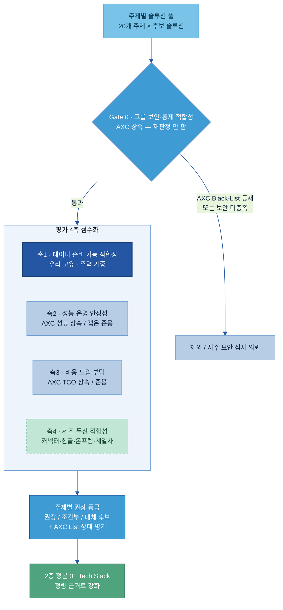

# AI-Ready Data — Tech 솔루션 평가 기획안

> **목적:** 20개 주제(A-1~F-4)의 데이터 준비용 Tech 솔루션을 **어떻게 평가할지**를 정의하는 방법론 기획안이다. 두산 지주가 만든 [AXC Player 평가결과서](AXC%20참고자료/01.%20산출물_Player%20평가결과서_v260602.xlsx)를 평가 골격의 레퍼런스로 삼되, 그 결과를 **상속**하고 그 위에 **데이터 준비 적합성 렌즈**를 덧씌우는 방식을 채택한다.
>
> **관점 고정:** AXC는 "AI 에이전트를 만드는 Player"를 평가했고, 우리는 **"그 AI가 쓸 데이터를 준비·정비하는 솔루션"**을 평가한다. 같은 제품이라도 평가하는 질문이 다르다 (절대 원칙 — CLAUDE.md).
>
> **산출 연계:** 이 방법론은 기존 정성 정본 [전체 목차/01 Tech Stack 비교 (솔루션×주제)](../전체%20목차/01%20Tech%20Stack%20비교%20(솔루션×주제).md)의 ✓/△/✗ 비교를 **정량 근거로 뒷받침**하기 위한 것이다. 정본을 대체하지 않고 강화한다.

---

## 목차

- [0. 한눈에 — 이 기획의 결론](#sec0)
- [1. AXC 평가결과서가 한 일 (레퍼런스 해부)](#sec1)
- [2. AXC ↔ 우리 20개 주제 매핑 — 3개 구간](#sec2)
- [3. 우리 평가 프레임 — 게이트 1 + 평가 4축](#sec3)
- [4. 축 1 상세 — 데이터 준비 적합성 렌즈 (주제별 변별 기능)](#sec4)
- [5. 갭 주제 평가 방안 — AXC 루브릭 준용](#sec5)
- [6. 산출물·등급 체계 — 우리가 내는 것 vs 지주 권한](#sec6)
- [7. 실행 절차·역할·정본 연계](#sec7)
- [8. 리스크·주의](#sec8)
- [참고자료](#refs)

---

<a id="sec0"></a>
## 0. 한눈에 — 이 기획의 결론

세 줄 요약.

1. **AXC가 이미 한 평가는 다시 하지 않는다.** AXC는 보안 게이트(Black-List)·성능 30점·비용 3점으로 33점 만점 Player 점수를 산출했다. 우리 주제와 겹치는 컴포넌트(파싱·평가·게이트웨이·거버넌스 등)는 그 **보안 판정과 점수를 상속**한다.
2. **AXC가 비운 곳이 우리가 가장 기여할 곳이다.** AXC는 Layer 3~10(Knowledge·Agent·Ops·Governance)의 Player만 평가했고, **Layer 2(Data)와 라벨링·데이터 품질/관측·IoT·합성데이터·온톨로지는 정의만 했거나 아예 없다.** 이 영역은 우리가 AXC 루브릭을 준용해 채운다.
3. **모든 주제에 데이터 준비 렌즈를 덧씌운다.** AXC의 일반 성능 10항목에는 *우리 원천 커넥터(SAP·MES·QMS·LIMS) 적합성·자동 메타수집률·컬럼 단위 계통·한글/도면 처리·온프렘 적합성* 같은 데이터 준비 변별축이 없다. 이 렌즈(축 1)가 우리 평가의 주력이다.

평가는 **그룹 보안·통제 게이트(통과/탈락) → 4축 점수화 → 주제별 권장 등급** 순서로 흐른다. 우리는 Black/White-List를 새로 발행하지 않는다(그건 지주·AXC 권한). 우리 산출물은 **데이터 준비 관점의 권장 등급**이며 AXC List 상태를 함께 표기한다.

---

<a id="sec1"></a>
## 1. AXC 평가결과서가 한 일 (레퍼런스 해부)

무엇을 상속하고 무엇을 준용할지 정하려면, 먼저 AXC가 어떤 구조로 평가했는지를 분해한다.

### 1.1 다섯 단계 평가 구조

AXC는 그룹 AI Tech Stack을 **10개 Layer · 약 30개 Component**로 정의한 뒤, 각 Component에 속하는 Player(솔루션/벤더)를 아래 순서로 걸렀다.

| 단계 | 무엇을 하나 | 산출 |
|---|---|---|
| ① 통제수준 지정 | Component마다 보안 영향도·표준화 필요성으로 High/Mid/Low 부여 | 어떤 List를 줄지 결정 |
| ② 보안 필터링 (게이트) | 보안 요건 미충족 Player를 탈락(PASS/FAIL) | **Black-List** |
| ③ 성능 평가 | 3 Pillar × 10 항목, 각 3점 = **30점 만점** | 성능 점수 |
| ④ 비용 평가 | 3년 TCO를 컴포넌트별 정규화 = **3점 만점** | 비용 점수 |
| ⑤ 종합·선정 | 성능+비용 = **33점 만점, 20점 컷** | **White-List**(High) / **Recommendation**(Mid) |

통제수준이 List 종류를 결정한다 — High는 White-List(이 안의 Player만 사용 가능)와 Black-List를 모두 제공, Mid는 Black-List + Recommendation(이 밖도 도입 가능), Low는 List 없이 정책 준수로 도입.

### 1.2 보안 게이트 (② Black-List)

보안은 점수가 아니라 **통과/탈락 게이트**다. 주요 탈락 사유:

- 두산 Landing Zone 위에 서비스를 명시적으로 제공하지 않음 (가장 빈번)
- 사용자 입력·파일이 모델 학습에 재사용되지 않음을 보장하지 못함
- 지식 데이터의 물리적/논리적 격리 불가, 전용 환경(SDN) 미제공
- 커스텀 정책(특정 주제 차단)·이상 탐지 미지원
- OSS의 경우 **CVSS 7.0 이상 취약점**(BlackDuck + Claude Code 소스 분석, 별첨 E)

> 비고: AXC 문서에 "보안 요건 수립이 진행 중이며 본 리스트는 향후 변경될 수 있음"이 명시돼 있다. 보안 판정은 지주 보안팀 소관으로, 우리는 그 결과를 인용하되 직접 재판정하지 않는다.

### 1.3 성능 평가 (③ 30점) — 3 Pillar × 10 항목

Component와 무관한 공통 항목으로, 각 항목 3점. OSS는 검토 불가 항목 5개를 점수 산정 후 2배 보정한다.

| Pillar | 검토 항목(CI) | 측정 방식 |
|---|---|---|
| **P1 제품 검증성** | 제품 성숙도·활성도 / 제품 레퍼런스(Gartner·도입사례) / 가용성·장애대응(SLA) | Binary·Ternary |
| **P2 개발 적합성** | 기술 표준 준수(API·프로토콜) / 멀티클라우드·하이브리드 / Plugin·SDK 연동성 | Ternary |
| **P3 운영 안정성** | 확장성·탄력성 / 백업·복구 / 자원 효율성 / 버전 호환성 | Ternary |

채점은 0/2/3 또는 0/3으로 정량화하고, 항목마다 평가 가이던스와 근거 링크를 둔다.

### 1.4 비용 평가 (④ 3점) — 3년 TCO

6개 비용 항목(라이선스·인프라·API/사용량·운영 FTE·초기도입·숨은비용)으로 3년 TCO를 산출하고, 규모 편향 제거를 위해 **Medium 표준 시나리오**(동시 사용자 200·월 100만 API·월 5천만 토큰·중형 클러스터)를 모든 제품에 동일 적용한다. 컴포넌트별로 log(TCO)를 Winsorized Min-Max 정규화 후 3점으로 환산한다.

> 설계 함의: 33점 중 성능이 30점, 비용이 3점이다. **AXC는 사실상 성능 주도 평가**이고 비용은 동점 조정자에 가깝다. 우리 평가에서도 이 무게를 참고하되, 데이터 준비 적합성(축 1)을 최상위에 둔다(3장).

### 1.5 별첨이 주는 추가 자산

| 별첨 | 내용 | 우리 활용 |
|---|---|---|
| C. 표준 프로토콜 프레임워크 | Legacy Connector는 제품을 통일하지 않고 **프로토콜·인터페이스 계약·인증만 표준화**(REST/OpenAPI·AD 인증·MCP/A2A). 외부 커넥터 4단계 보안 심사 | **D-2(Tool 연계 데이터)** 평가의 기준선 — 제품이 아니라 표준 준수로 본다 |
| D. 최종 권장 선정 기준 | AWS/Azure는 자체 Managed 우선, 없으면 연동되는 OSS 최고점. On-prem은 OSS 최고점(하드웨어 종속·국내 선도사례 예외) | 우리 환경별 권장(온프렘 비중 큼) 선정 규칙으로 차용 |
| E. OSS 소스코드 분석 | 60여 개 OSS의 CVSS·메인 프레임워크·CVE를 BlackDuck + Claude Code로 점검 | OSS 후보의 보안 게이트 근거를 그대로 인용 |

---

<a id="sec2"></a>
## 2. AXC ↔ 우리 20개 주제 매핑 — 3개 구간

AXC가 우리 주제를 **어디까지 평가했는가**로 20개 주제를 세 구간으로 나눈다. 이 구간이 평가 작업량과 우리 기여도를 결정한다.

> 핵심 발견: **AXC의 Player 평가는 Layer 3~10에만 존재한다. Layer 1(Infra)·Layer 2(Data)는 정의만 하고 Player를 평가하지 않았다.** 즉 우리의 카탈로그·메타데이터·계통(Layer 2.3)조차 AXC의 White/Black/Recommendation에는 없다. 데이터 영역은 대부분 우리가 주도한다.

| 구간 | 의미 | 해당 주제 | AXC 자산 | 우리가 할 일 |
|---|---|---|---|---|
| **구간 1 — 상속** | AXC가 Player까지 평가함(List 존재) | **B-1 전처리/파싱**(3.1) · **F-3 OCR/STT**(3.1) · **D-2 Tool 연계**(8.1 게이트웨이·8.2 프로토콜) · **D-3 Prompt 자산화**(9.1 Asset Registry) · **E-3 AI 평가데이터**(9.3 Evaluation) · **F-4 권한·보안**(10.x) | 보안 게이트 + 성능/비용 점수 + List | 점수를 **상속**하고 데이터 준비 렌즈(축 1)만 덧씌움 |
| **구간 2 — 정의만, 평가는 우리** | AXC가 Layer/Component로 정의했으나 Player 미평가 | **A-1 카탈로그 · A-2 메타데이터 · C-3 계통**(2.3) · **F-1 DataOps**(2.1, 일부 6.1 오케스트레이션 겹침) · **E-1 데이터 Product화**(2.4) · **F-2 생애주기**(정의 약함) | 보안 게이트 틀·통제 개념만 | 보안 게이트 틀은 상속, **점수는 우리가 데이터 준비 렌즈로 신규 산출** |
| **구간 3 — AXC에 없음** | Component 자체가 없거나 명시적으로 미룸 | **B-2 라벨링/주석** · **C-1 데이터 Observability** · **C-2 데이터 품질 게이트** · **D-1 Physical/IoT** · **E-2 합성데이터** · **E-4 Feedback Loop** · **B-3 온톨로지/GraphDB**(3.3로 정의했으나 "DEC 별도 PJT로 미룸") | 거의 없음 | **AXC 루브릭(3 Pillar + TCO)을 준용**해 보안 게이트부터 우리가 신규 평가 (5장) |

세 구간의 경계 주의:

- **C-1 데이터 Observability ≠ AXC 9.4 Observability.** AXC의 9.4는 AI 서비스 런타임 관측(latency·token·trace)이다. 우리 C-1은 **데이터 자체의 신선도·완전성·분포 이상**을 본다. 같은 단어지만 다른 대상 — 구간 3으로 둔다.
- **E-3 AI 평가데이터는 9.3을 상속하되 대상이 다르다.** AXC 9.3은 평가 플랫폼(Player)을 평가했고, 우리 E-3은 그 플랫폼이 쓸 **평가 데이터셋을 준비**하는 관점이다. 플랫폼 점수는 상속, 데이터 준비 변별 기능은 축 1로 추가.
- **D-2는 별첨 C가 핵심이다.** AXC는 8.2 Connector에 Player를 지정하지 않고 프로토콜만 표준화했다. 우리 D-2 평가는 "제품 비교"가 아니라 **표준(OpenAPI·MCP) 준수도**로 본다.

---

<a id="sec3"></a>
## 3. 우리 평가 프레임 — 게이트 1 + 평가 4축

AXC의 "게이트 먼저, 점수 다음" 구조를 그대로 따르되, 점수 축에 **데이터 준비 적합성을 최상위**로 넣는다.



### 3.1 Gate 0 — 그룹 보안·통제 적합성 (통과/탈락)

점수가 아니라 게이트다. 솔루션을 점수화하기 전에 먼저 거른다.

- **구간 1·2 솔루션:** AXC Black-List 등재 여부를 그대로 상속한다. 등재되면 우리도 제외(재판정하지 않음). AXC 통제수준(High/Mid/Low)도 표기 상속.
- **구간 3 신규 솔루션:** AXC 보안 항목(Landing Zone·학습 재사용·격리·전용환경·OSS CVSS)을 동일 적용해 1차 자가 점검하되, **최종 보안 판정은 지주 보안팀에 심사 의뢰**한다. 우리 산출물엔 "보안 심사 대기" 플래그로 표시한다.

### 3.2 평가 4축 — 무게와 출처

| 축 | 무엇을 보나 | 점수 출처 | 기본 가중 |
|---|---|---|---|
| **축 1 · 데이터 준비 기능 적합성** | 그 주제에서 솔루션을 가르는 데이터 준비 변별 기능 충족도 (4장) | **우리가 신규 평가** | **50%** |
| **축 2 · 성능·운영 안정성** | 제품 검증성·개발 적합성·운영 안정성 | 구간 1=AXC 30점 상속 / 구간 2·3=AXC 루브릭 준용 | 25% |
| **축 3 · 비용·도입 부담** | 3년 TCO·운영 FTE·초기도입 | 구간 1=AXC 비용점 상속 / 구간 2·3=AXC TCO 공식 준용 | 15% |
| **축 4 · 제조·두산 적합성** | 원천 커넥터(SAP·MES·QMS·LIMS)·한글/도면·온프렘/망분리·계열사 확장 | **우리가 신규 평가** | 10% (보정) |

가중은 기본값이며 **통제수준에 따라 조정**한다 — High 통제 주제(F-4 등)는 보안·운영(축 2)을, 데이터 준비가 핵심인 주제(A·B군)는 축 1을 더 높인다. 합산 점수를 0~100으로 환산해 등급 산정에 쓴다.

> 왜 축 1이 50%인가: AXC의 33점 점수를 그대로 쓰면 "데이터 준비에 좋은 솔루션"이 아니라 "범용으로 좋은 Player"가 1등이 된다. 카탈로그를 고를 때 우리에게 중요한 건 SLA 99.95%가 아니라 *우리 LIMS에 커넥터가 붙는가*다. 그 차이를 만드는 것이 축 1이고, 이것이 이 평가가 AXC를 단순 복제하지 않는 이유다.

---

<a id="sec4"></a>
## 4. 축 1 상세 — 데이터 준비 적합성 렌즈 (주제별 변별 기능)

축 1은 주제마다 다르다. 각 주제에서 "데이터 준비를 잘 되게 하는가"를 가르는 **변별 기능(capability) 3~5개**를 정의하고, 각 기능을 0(없음)/1(부분)/2(연동)/3(네이티브 강함)으로 채점한다. 정성 정본의 ✓/△/✗를 이 점수로 뒷받침한다.

아래는 변별 기능 카탈로그(초안)다. 이미 작성된 가이드(A군·B-1·B-2·B-3)는 그 가이드의 평가축을 그대로 가져왔다.

| 주제 | 데이터 준비 변별 기능 (축 1 채점 항목) |
|---|---|
| **A-1 카탈로그** | 우리 원천 커넥터 범위(SAP·MES·QMS·LIMS·SharePoint) · 자동 메타 수집률 · 검색 UX · 컬럼 단위 계통 연계 · 계열사 확장성 |
| **A-2 메타데이터** | 메타 스키마 유연성 · 자동 분류/태깅 · 거버넌스 워크플로 · 비즈니스/기술 메타 통합 |
| **A-3 용어집** | 네이티브 비즈니스 용어집 · 동의어/약어 매핑 · 질의 확장 연계 · 한국어 |
| **B-1 전처리/파싱** | **표 구조 보존** · 레이아웃 인식 · 온프렘/로컬 실행 · 한국어·OCR · RAG 적재 출력(MD/JSON·청킹) |
| **B-2 라벨링/주석** | **AI 1차 라벨(pre-label)** · 능동학습 · 프로그래매틱/약지도 · 라벨 합의·오류 탐지(IAA) · 온프렘 |
| **B-3 온톨로지/그래프** | 그래프 추론(OWL/SHACL) · 다중 홉 경로 · LPG↔RDF 적합성 · GraphRAG · 온톨로지 저작 |
| **C-1 데이터 Observability** | 신선도·완전성·분포 이상 자동 탐지 · 사고 알림·근본원인 · 계통 연계 |
| **C-2 데이터 품질 게이트** | 규칙/제약 정의 방식 · 파이프라인 차단(게이트) · 예외 승인 흐름 · 품질 지표 추적 |
| **C-3 계통(Lineage)** | 컬럼 단위 계통 · 자동 수집(OpenLineage) · 영향도 분석 · 교차 시스템 |
| **D-1 Physical/IoT** | OT 프로토콜(OPC UA·Modbus·MQTT) · 산업 historian 연계 · 시계열 정규화 · 엣지 수집 |
| **D-2 Tool 연계** | OpenAPI·MCP 표준 준수 · Tool 명세 레지스트리 · 버전·품질 스코어카드 (별첨 C 기준) |
| **D-3 Prompt 자산화** | 프롬프트 버전 관리·메타데이터 · 평가 연계 · 재사용 카탈로그 |
| **E-1 데이터 Product화** | 데이터 상품 정의·발행 · 복사 없는 공유 · 계약(SLA)·구독 |
| **E-2 합성데이터** | 분포·상관 보존 · 프라이버시(재식별 위험) · 제조 도메인 적합 · 검증 지표 |
| **E-3 AI 평가데이터** | 평가셋 구축·버전 · 골든셋 관리 · LLM-judge 데이터 · 회귀 평가 |
| **E-4 Feedback Loop** | 추론 로그·피드백 수집 · 라벨 환류 · 재학습 데이터화 |
| **F-1 DataOps** | 오케스트레이션·스케줄 · CI/CD·버전 · 계통 자동 연동 |
| **F-2 생애주기** | 티어링·아카이브 자동 · TTL·만료 · 보존정책 |
| **F-3 디지털화(OCR·STT)** | 한글 손글씨·도면 · 다국어 STT · 정확도·후처리 |
| **F-4 권한·비식별** | 행/열 접근통제 · PII 탐지·마스킹 · 재식별 점검 · 활용성 보존 |

> 작성 규칙: 변별 기능은 **각 주제 가이드(1층)의 '솔루션' 섹션 평가축에서 가져온다.** 가이드가 없는 주제는 가이드 작성 시 확정하고, 그때 이 표를 갱신한다. 변별 기능은 "제품명"이 아니라 "무슨 기능을 하느냐"로 둔다 — 제품은 PoC로 검증.

---

<a id="sec5"></a>
## 5. 갭 주제 평가 방안 — AXC 루브릭 준용 (구간 3)

AXC에 없는 7개 주제(B-2·C-1·C-2·D-1·E-2·E-4·B-3)는 우리가 처음부터 평가한다. 새 잣대를 만들지 않고 **AXC의 3 Pillar + TCO 루브릭을 준용**하되, 데이터 준비 대상에 맞게 조정한다.

| 갭 주제 | AXC 루브릭을 어떻게 준용·조정하나 |
|---|---|
| **B-2 라벨링** | 성능 3 Pillar 그대로 + 축 1에 라벨링 특유(AI pre-label·능동학습·합의 품질) 가중 ↑. 온프렘 라벨링은 보안 게이트(데이터 반출) 엄격 |
| **C-1 데이터 Observability** | AXC 9.4(AI 관측) 항목을 **데이터 관측**으로 치환 — latency 대신 신선도/완전성/분포 드리프트. 운영 안정성(P3) 항목은 그대로 |
| **C-2 데이터 품질 게이트** | 성능보다 **파이프라인 통합·게이트 차단 능력**을 축 1에서 무겁게. 비용은 TCO 공식 준용 |
| **D-1 Physical/IoT** | 별첨 C 프로토콜 표준(OPC UA 등) 준수를 P2(개발 적합성)에 강하게 반영. 산업 historian은 전용 시장이라 AXC식 범용 점수만으론 부족 — 축 1·축 4 비중 ↑ |
| **E-2 합성데이터** | 보안 게이트에 **재식별 위험**을 명시 추가. 축 1에 분포·상관 보존·프라이버시 지표. 시장 변동 큼(Gretel→NVIDIA 등) |
| **E-4 Feedback Loop** | 9.1·9.4와 인접하나 데이터 환류가 대상. 성능 루브릭 + 축 1(피드백→재학습 데이터화) |
| **B-3 온톨로지/그래프** | AXC가 통제수준 Low로 정의 후 **DEC 별도 PJT로 미룸** — 그 PJT 산출물이 나오면 상속, 그 전까지 우리가 LPG↔RDF 분기 중심으로 평가 |

준용 시 OSS 보안은 **별첨 E 방식(CVSS + 소스 분석)**을 동일 적용하고, 가능하면 AXC가 이미 점검한 OSS(LangFuse·MLflow·Milvus 등)의 CVSS 결과를 재사용한다.

---

<a id="sec6"></a>
## 6. 산출물·등급 체계 — 우리가 내는 것 vs 지주 권한

### 6.1 우리는 Black/White-List를 발행하지 않는다

Black-List(사용 금지)·White-List(이것만 사용)는 **그룹 전체에 강제력을 갖는 지주·AXC의 권한**이다. 우리가 같은 이름의 List를 새로 내면 권한·정합성 충돌이 난다. 따라서 우리 산출물은 **데이터 준비 관점의 권장 등급**이며, AXC의 공식 판정을 함께 표기한다.

| 우리 등급 | 의미 | 산정 기준 |
|---|---|---|
| **권장 (Recommended)** | 이 주제의 데이터 준비에 1순위로 검토 | 종합 점수 상위 + Gate 0 통과 + AXC White/Rec 등재(있으면) |
| **조건부 (Conditional)** | 특정 조건(클라우드·온프렘·한글)에서 적합 | 점수는 충분하나 환경/기능 제약 존재 |
| **대체 후보 (Alternative)** | 주력은 아니나 갭 보완·OSS 대안 | 점수 중위 또는 특정 변별 기능만 강함 |
| **제외 (Excluded)** | Gate 0 탈락 | AXC Black-List 또는 보안 미충족 |

### 6.2 산출 형태 — 정본의 ✓/△/✗를 점수로 뒷받침

최종 산출은 별도 List 문서가 아니라, **기존 2층 정본의 각 주제 표에 정량 컬럼을 더하는 것**이다.

```
주제 | 솔루션 | (기존) 기능 ✓/△/✗ | [신규] 데이터준비 점수(축1) | [신규] AXC 상태 | [신규] 종합·우리 등급 | 환경(AWS/Azure/GCP/온프렘)
```

- **AXC 상태 컬럼:** `White(33점 만점 중 X)` · `Rec(X)` · `Black(사유)` · `미평가(Layer 2)` · `보안심사대기`
- 환경별 권장은 별첨 D 규칙 준용 — 두산은 **온프렘/망분리 비중이 크므로 On-prem 권장(OSS 최고점)을 반드시 채운다.**

### 6.3 등급의 신뢰 표기

각 등급에 **근거와 시점**을 단다 — 점수의 출처(AXC 상속 / 우리 산출), 평가 시점(시장 변동 주의), PoC 필요 여부. 제품명은 변하므로 "카테고리·변별 기능 우선, 제품은 PoC 검증"을 원칙으로 유지한다.

---

<a id="sec7"></a>
## 7. 실행 절차·역할·정본 연계

### 7.1 절차 (주제 단위 반복)

1. **솔루션 풀 확정** — 그 주제의 후보 솔루션을 1층 가이드 '솔루션' 섹션 + 2층 정본 Part A에서 모은다.
2. **구간 판정** — 2장 매핑으로 구간 1/2/3 결정 → 상속할지, 준용할지 정한다.
3. **Gate 0** — AXC Black-List·통제수준 상속(구간 1·2) / 보안 자가점검·심사 의뢰(구간 3).
4. **축 1 채점** — 4장 변별 기능으로 데이터 준비 적합성 점수.
5. **축 2·3 확보** — 구간 1은 AXC 점수 상속, 구간 2·3은 AXC 루브릭으로 산출.
6. **축 4 보정** — 제조·두산 적합성 가감.
7. **등급·환경 산정** — 6장 등급 + 환경별 권장(별첨 D).
8. **정본 반영** — 2층 정본 표에 정량 컬럼 추가, 별도 커밋.

### 7.2 멀티 에이전트 공정과의 연계

주제 가이드는 [`ai-ready-manual-guide`](../가이드%20작성) 스킬로 생산한다. 이 평가는 그 공정에 **얹는 단계**다 — 가이드의 솔루션 섹션이 축 1 변별 기능의 원천이고, 평가 결과는 2층 정본으로 환류한다. 갭 주제(구간 3)는 리서치 팬아웃으로 후보·CVSS·TCO를 모으고 AXC 루브릭으로 채점하는 별도 평가 패스를 둔다.

### 7.3 정본 반영 게이트 (기존 규칙 유지)

2층 정본은 매 평가마다 자동 갱신하지 않는다. **사용자가 해당 주제를 최종 승인하며 "정본/Tech Stack에 반영"을 명시 요청할 때만** 정량 컬럼을 갱신하고 별도 커밋으로 남긴다(CLAUDE.md 솔루션 2층 구조·정본 반영 규칙과 동일).

---

<a id="sec8"></a>
## 8. 리스크·주의

- **AXC는 살아있는 문서다.** "보안 요건 수립 진행 중, 리스트 변경 가능" 명시. 상속한 보안 판정·점수는 **버전(v260602)과 시점**을 함께 기록하고, 갱신 시 재확인한다.
- **관점 혼입 주의.** AXC를 참고하다 보면 평가가 "AI 구축에 좋은 솔루션"으로 흐르기 쉽다. 모든 축은 **데이터 준비** 관점으로 고정한다(특히 D-2·D-3·E-3·F-4 — 에이전트/보안 구축이 아니라 데이터 준비).
- **같은 이름 다른 대상.** C-1 Observability(데이터 vs AI 런타임), E-3 평가(데이터셋 vs 플랫폼)처럼 AXC와 단어가 겹쳐도 대상이 다르면 상속하지 않는다.
- **권한 경계.** Black/White-List는 발행하지 않는다. 우리는 권장 등급 + AXC 상태 병기까지만.
- **점수의 과신 금지.** 33점·100점 환산은 의사결정 보조다. 제품은 변하고, 두산 원천 연결은 **PoC로만 확증**된다 — 점수가 PoC를 대체하지 않는다.

---

<a id="refs"></a>
## 참고자료 (References)

- **AXC 평가결과서** — [01. 산출물_Player 평가결과서_v260602.xlsx](AXC%20참고자료/01.%20산출물_Player%20평가결과서_v260602.xlsx) (통제수준·Black/White/Recommendation·별첨 A~E)
- **우리 2층 정본** — [전체 목차/01 Tech Stack 비교 (솔루션×주제)](../전체%20목차/01%20Tech%20Stack%20비교%20(솔루션×주제).md)
- **전체 주제 정의·Key Question** — [공통 규칙/최종 주제.md](../공통%20규칙/최종%20주제.md)
- **20개 주제 조감도** — [전체 목차/00 전체 목차 (20개 주제)](../전체%20목차/00%20전체%20목차%20(20개%20주제).md)
- **다이어그램 표준** — [공통 규칙/02 다이어그램 표준.md](../공통%20규칙/02%20다이어그램%20표준.md)

---

## 변경 이력

| 버전 | 일자 | 내용 |
|---|---|---|
| v0.1 | 2026-06-24 | 초안 — AXC Player 평가결과서(v260602) 해부 + 우리 20개 주제 3구간 매핑 + 평가 프레임(Gate 0 + 4축) + 데이터 준비 변별 기능 카탈로그 + 갭 주제 준용 방안 + 등급·정본 연계. 방향: **AXC 상속 + 데이터 준비 렌즈**(중복 평가 금지, Black/White 미발행). |
