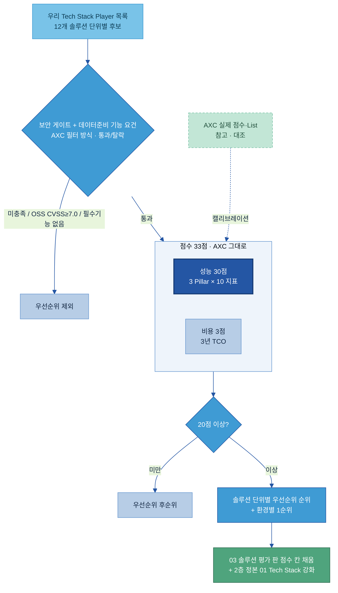

# AI-Ready Data — Tech 솔루션 평가 기획안

> **목적:** 우리 데이터 준비용 Tech Stack Player(솔루션)가 정해지면 **돌려서 우선순위를 매길 수 있는 재사용 채점 루브릭**을 만든다. [AXC Player 평가결과서](AXC%20참고자료/01.%20산출물_Player%20평가결과서_v260602.xlsx)의 평가 기준을 **최대한 그대로** 가져온다.
>
> **평가 단위 = 03의 솔루션 구분:** 채점 대상은 개별 20개 주제(A-1~F-4)가 아니라 [03 제안 솔루션 구성](03%20제안%20솔루션%20구성%20(영역별%20솔루션%20단위).md)이 묶은 **12개 솔루션 단위**(필수 코어 2 · 제조 1 · 선택 9)다. 03의 Player 후보 표와 이 루브릭은 **같은 솔루션 단위 축**을 공유한다 — 03이 후보·온프렘 여부를 채우고, 이 문서가 그 후보를 채점하는 기준을 준다. (한 플랫폼이 여러 주제를 함께 커버하므로 주제별로 따로 채점하지 않는다.)
>
> **기본 원칙 — AXC 동일, 필요한 것만 수정:** AXC의 33점 채점 체계(보안 게이트 + 성능 30 + 비용 3, 20점 컷)를 **구조·지표·배점 그대로** 쓴다. 다만 AXC는 *AI 에이전트·LLM* 평가 기준이므로, **데이터 준비 관점에서 안 맞는 항목만 외과적으로 바꾼다.** 무엇을 그대로 두고 무엇을 바꾸는지는 [§0](#sec0)에 한 표로 정리한다.
>
> **무엇을 가져오고 무엇을 안 가져오나:** 평가의 *기준(축·세부지표·배점)*은 가져온다. AXC가 매긴 *실제 점수·Black/White/Recommendation List*는 우리 판정으로 상속하지 않고 **대조(캘리브레이션)용**으로만 본다([§8](#sec8)).
>
> **산출 연계:** 이 루브릭으로 매긴 우선순위는 솔루션 단위 평가 판 [03 제안 솔루션 구성](03%20제안%20솔루션%20구성%20(영역별%20솔루션%20단위).md)의 빈 점수 칸을 채우고, 정성 정본 [01 Tech Stack 비교 (솔루션×주제)](01%20Tech%20Stack%20비교%20(솔루션×주제).md)의 ✓/△/✗ 비교를 정량 근거로 뒷받침한다.

---

## 목차

- [0. 무엇을 그대로 두고 무엇을 바꾸나 (한눈에)](#sec0)
- [1. 평가 구조 — AXC와 동일](#sec1)
- [2. 보안 게이트 (AXC 항목 · 일부 수정)](#sec2)
- [3. 성능 평가 30점 (AXC 3 Pillar × 10 지표 · 그대로)](#sec3)
- [4. 비용 평가 3점 (AXC TCO · 시나리오만 수정)](#sec4)
- [5. 데이터 준비 기능 요건 (솔루션 단위별 게이트 질문 · 신설)](#sec5)
- [6. 종합 점수·우선순위 — AXC와 동일](#sec6)
- [7. 적용 절차 — Player가 나오면 어떻게 돌리나](#sec7)
- [8. AXC 실제 결과는 참고만 (캘리브레이션)](#sec8)
- [9. 주의·리스크](#sec9)
- [참고자료](#refs)

---

<a id="sec0"></a>
## 0. 무엇을 그대로 두고 무엇을 바꾸나 (한눈에)

이 문서의 핵심 답이다. AXC 평가 기준 전체를 훑어 **「그대로」 / 「수정」 / 「신설」**로 판정했다.

| AXC 구성요소 | 판정 | 이유 / 데이터 준비용 변경 |
|---|---|---|
| **33점 체계**(보안 게이트 → 성능 30 + 비용 3, 20점 컷) | **그대로** | 구조·배점 그대로 유지 |
| **성능 30점 — 3 Pillar × 10 지표** | **거의 그대로** | AXC가 "컴포넌트 무관"으로 설계한 일반 품질 지표 — LLM 색채 없음. 단 P2 기술표준 지표의 *프로토콜 목록*만 데이터 연계용으로 확장(§3) |
| 성능 채점 방식(Binary 0/3·Ternary 0/2/3, OSS 5지표 ×2 환산) | **그대로** | §3 |
| **비용 6항목·TCO 3년 산식·정규화** | **그대로** | §4 |
| 비용 Medium 시나리오의 *LLM 토큰* 파라미터 | **수정** | 데이터 준비 도구는 토큰 대신 *처리 데이터량·커넥터 수·파이프라인 빈도*로 치환(AXC ③ 정의에 이미 "데이터 처리량" 포함) |
| 보안 게이트 — Landing Zone·학습 재사용 차단·데이터 격리·전용환경·권한·OSS CVSS | **그대로** | 데이터 준비에도 그대로 유효 |
| 보안 게이트 — *특정 주제 응답 차단 커스텀 정책* | **수정** | LLM Guardrail 전용 항목 → 데이터 관점 "데이터 등급별 접근·마스킹 정책 설정 가능?"으로 치환, 해당 없는 주제는 N/A |
| 보안 게이트 — *비정상 Tool 호출 패턴 이상 탐지* | **수정** | 에이전트 전용 항목 → "비정상 데이터 접근·대량 반출 탐지?"로 치환(주로 F-4), 해당 없으면 N/A |
| 별첨 C 표준 프로토콜(OpenAPI·MCP·AD 인증) | **그대로** | §3 P2·§5 D-2에 반영 |
| 별첨 D 환경별 선정 규칙(AWS/Azure/온프렘) | **그대로** | §6. 단 우리는 온프렘 1순위를 반드시 채움 |
| 별첨 E OSS 소스 CVSS(BlackDuck) | **그대로** | §2 OSS 게이트 |
| **컴포넌트별 기능 요건(게이트 질문)** | **신설** | AXC는 컴포넌트별 기능 요건을 보안 필터에 게이트 질문으로 넣었다(예: "커스텀 정책 설정 가능?"). 같은 방식으로 **데이터 준비 기능 요건**을 **03의 12개 솔루션 단위별** 게이트로 신설(§5) |
| **평가 단위(채점 대상)** | **수정** | AXC는 컴포넌트(Component) 단위로 평가. 우리는 03이 묶은 **솔루션 단위**(통합 플랫폼 1개가 여러 주제 커버)로 본다 — §5·§6·§7 |
| AXC 실제 Player 점수·Black/White List | **참고만** | 상속 안 함, 대조용(§8) |

요지: **점수 체계에서 바꾸는 건 딱 세 군데다 — ① 보안 게이트의 LLM/에이전트 전용 2개 항목 ② 비용 시나리오의 토큰 파라미터 ③ 성능 P2 프로토콜 목록 확장.** 나머지 33점 체계는 AXC 그대로다. 추가로 **평가를 도는 단위를 03의 12개 솔루션 단위로 맞췄다**(개별 주제가 아니라) — 데이터 준비 *기능* 적합성은 AXC가 쓰던 방식(게이트 질문)을 그대로 빌려 **솔루션 단위별로** §5에 신설한다.

---

<a id="sec1"></a>
## 1. 평가 구조 — AXC와 동일



- 순서·배점은 AXC와 같다 — **게이트(통과/탈락) → 성능 30 + 비용 3 = 33점 → 20점 컷 → 우선순위.**
- 평가는 **12개 솔루션 단위 각각 안에서** 후보를 줄 세운다(예: 카탈로그 플랫폼 후보 8종을 한 표에서). 통제수준(High/Mid/Low)은 AXC처럼 솔루션 단위별로 참고한다(민감 데이터를 다루는 단위는 게이트·기능 요건을 더 엄격히).

---

<a id="sec2"></a>
## 2. 보안 게이트 (AXC 항목 · 일부 수정)

AXC의 보안 탈락 사유를 그대로 체크리스트로 옮긴다. **하나라도 미충족이면 탈락.** 보안 판정은 지주 보안팀 소관이므로 자가 점검 후 최종 의뢰한다.

| 게이트 항목 | 판정 | 통과 조건 |
|---|---|---|
| 배포 환경 | 그대로 | 두산 Landing Zone(승인 클라우드/온프렘)에 배포 가능 |
| 데이터 재사용 차단 | 그대로 | 우리 데이터·파일이 벤더 모델 학습·제3자에 재사용되지 않음 보장 |
| 데이터 격리 | 그대로 | 데이터의 물리적/논리적 격리(계열사 간 분리 포함) |
| 전용 환경 | 그대로 | Public과 분리된 전용 환경·네트워크 제공 |
| 권한 모델 | 그대로 | 접근 권한 모델 확인 가능 |
| 전송 보안·데이터 위치 | 그대로 | TLS·Data Residency 정책 명시 |
| **데이터 정책 설정** | **수정** | (AXC: 특정 주제 응답 차단 커스텀 정책) → **데이터 등급별 접근·마스킹 정책 설정 가능?** 해당 없는 주제는 N/A |
| **비정상 접근 탐지** | **수정** | (AXC: 비정상 Tool 호출 패턴 이상 탐지) → **비정상 데이터 접근·대량 반출 탐지?** 주로 F-4, 해당 없으면 N/A |
| OSS 취약점 | 그대로 | **CVSS 7.0 미만**(BlackDuck 등 소스 점검, 별첨 E) |

> 수정한 2개 항목만 LLM Guardrail·에이전트 전용이라 데이터 관점으로 치환했다. 나머지는 AXC 그대로다.

---

<a id="sec3"></a>
## 3. 성능 평가 30점 (AXC 3 Pillar × 10 지표 · 그대로)

AXC 별첨 A를 그대로 옮긴다. **10개 지표 × 각 3점 = 30점.** AXC가 "Component 무관"으로 설계한 일반 품질 지표라 데이터 준비 도구에 그대로 적용된다.

**채점 방식(AXC 그대로):** Binary = 0(확인 불가)·3(확인 가능). Ternary = 0(미지원/확인 불가)·2(부분)·3(완전). **OSS는 검토 불가 5개 지표를 빼고 5개만 채점 후 ×2 환산**(아래 ◇ 표시가 OSS 미평가).

| Pillar | 지표 | 0점 | 2점 | 3점 | 방식 |
|---|---|---|---|---|---|
| **P1 제품 검증성** | CI1 성숙도·활성도 | Commercial: GA 아님·EOL·전담지원 없음 / OSS: stable 태그 없음·3개월 무커밋·메인테이너 PR 없음 | — | 검증 가능(GA·전담지원 / OSS: stable+활성) | Binary 0/3 |
| | CI2 레퍼런스 | 대형 레퍼런스 0 & 분석기관 미등재 / OSS: Star ≤5K & 도입 없음 | 레퍼런스 1건 또는 기관만 등재 / OSS: Star 5K~10K 또는 도입 1건 | 대형 ≥2건 또는 Gartner MQ 리더·Forrester·IDC 등재 / OSS: Star >10K + 도입 ≥2 | Ternary |
| | CI3 가용성·장애대응 ◇ | SLA <99.90% 또는 없음 또는 내결함성 확인불가 | SLA 99.90~99.95% 또는 (99.95%+ but 내결함성 미문서화) | SLA ≥99.95% + 내결함성 문서화 | Ternary |
| **P2 개발 적합성** | CI1 기술 표준 준수 | 둘 다 미충족/확인불가 | API 스타일 또는 표준 프로토콜 중 1 | (1)표준 API(OpenAPI/REST/gRPC/GraphQL) + (2)표준 프로토콜 둘 다 | Ternary |
| | CI2 멀티클라우드·하이브리드 ◇ | 단일 환경 | 2개+ 클라우드(통합 제어 없음) | 3대 클라우드+온프렘+통합 컨트롤 플레인 (CSP 네이티브 자동 3) | Ternary |
| | CI3 Plugin·SDK 연동성 | 셋 다 없음 | 1개 | SDK·Plugin·Hook/Webhook 중 2개+ | Ternary |
| **P3 운영 안정성** | CI1 확장성·탄력성 ◇ | 수직 확장만·수동 | (1)수평확장 또는 (2)오토스케일 중 하나·일부 제약 | (1)수평+선형+무중단 & (2)오토스케일+스케줄+scale-to-zero | Ternary |
| | CI2 백업·복구 ◇ | 없음 | 수동만 또는 PIT 없음 | 자동 정기 + 특정시점복구(PIT) + 교차리전 | Ternary |
| | CI3 자원 효율성 ◇ | 처리량 지표 미문서화 | TPS/QPS·IOPS·Throughput 중 1+ 문서화 | 지표 문서화 + 경쟁 대비 효율 우위 | Ternary |
| | CI4 버전 호환성 | 호환성 정책 없음 | SemVer 있으나 범위 불명확 | SemVer + 직전 2버전 하위호환 + 폐기 2회 사전고지 | Ternary |

◇ = OSS 미평가(5개). OSS는 CI1·CI2(P1)·CI1·CI3(P2)·CI4(P3) 5개만 채점(최대 15) ×2 = 30점 환산.

> **유일한 데이터 준비용 수정 — P2·CI1 프로토콜 목록 확장:** AXC는 표준 프로토콜로 HTTP·gRPC·WebSocket·MQTT(AI·스트리밍 지향)를 들었다. 데이터 연계 도구는 **JDBC/ODBC·CDC·SFTP·표준 파일 포맷(CSV/JSON/Parquet)**도 표준 프로토콜로 인정한다(별첨 C의 연계 표준과 일치). 채점 로직(2개 중 충족 수)은 그대로.
>
> 레퍼런스(P1·CI2)의 분석기관 등재는 데이터 준비 카테고리(Data Quality·Metadata Management·Data Integration 등 Gartner MQ)로 본다 — 기준 구조는 동일.

---

<a id="sec4"></a>
## 4. 비용 평가 3점 (AXC TCO · 시나리오만 수정)

AXC 별첨 B를 그대로 쓴다. 산식·정규화는 동일하고, **Medium 시나리오의 LLM 토큰 가정만** 데이터 준비용으로 바꾼다.

### 4.1 비용 6항목 (AXC 그대로)

| 항목 | 산출 |
|---|---|
| ① 라이선스(월) | 벤더 가격 × seat (OSS=0, CSP 관리형 대부분 0) |
| ② 인프라(월) | 사용량 시나리오 배율(2.5x) × 단가 |
| ③ API·사용량(월) | API 배율(3x) × 단가 — AXC 정의 = "API 호출·LLM 토큰·임베딩·**데이터 처리량**" |
| ④ 운영 FTE(월) | FTE × 월 인건비 (관리형 0.2 / OSS 0.3 / Model API 0.1) |
| ⑤ 초기도입(1회) | PoC·마이그레이션·교육 (CSP < Other < OSS) |
| ⑥ 숨은비용(월) | (인프라+API) × 15% |

### 4.2 TCO·점수 산식 (AXC 그대로)

- **3년 TCO** = 1년차(월소계×12) + 2년차(×1.03 인플레이션 ×0.95 할인) + 3년차(×1.03² ×0.90) + 초기도입.
- **점수** = 주제별로 log(TCO)를 Winsorized Min-Max 정규화(P10~P90 클리핑) 후 ×3 = **3점 만점.**

### 4.3 Medium 시나리오 (토큰 → 데이터량으로 수정)

| 파라미터 | AXC | 우리(데이터 준비용) |
|---|---|---|
| 동시 사용자 | 200 | 그대로(또는 계열사 규모로 확정) |
| API 호출/월 | 100만 (×3) | 그대로 |
| **LLM 토큰/월** | 5천만 | **수정 → 처리 데이터량/월(TB)·커넥터 수·파이프라인 실행 빈도** (AXC ③ 정의의 "데이터 처리량" 사용) |
| 인프라 | 중형 클러스터 (×2.5) | **온프렘 케이스 반드시 포함**(우리 망분리 비중) |
| 운영 FTE | 1.0 (OSS 0.3) | 그대로 |

> LLM을 호출하지 않는 데이터 준비 도구는 ③ 축이 토큰이 아니라 데이터 처리량으로 잡힌다. 이 한 파라미터만 바꾸면 비용 모델 전체가 데이터 준비용으로 작동한다.

---

<a id="sec5"></a>
## 5. 데이터 준비 기능 요건 (솔루션 단위별 게이트 질문 · 신설)

AXC는 컴포넌트별 *기능 요건*을 보안 필터에 **게이트 질문**으로 넣었다(예: AI Security엔 "커스텀 정책 설정 가능?", Observability엔 "이상 탐지 있는가?"). **같은 방식**으로, 데이터 준비 기능 요건을 게이트 질문으로 신설한다 — 단, 채점 단위가 03과 같으므로 질문을 **개별 주제가 아니라 [03](03%20제안%20솔루션%20구성%20(영역별%20솔루션%20단위).md)이 묶은 12개 솔루션 단위별로** 정리한다. 한 통합 플랫폼이 여러 주제를 함께 커버하므로(예: 카탈로그 플랫폼 = A-1·A-2·A-3 + C-3 + F-4 기본), 그 단위의 게이트 질문은 묶인 주제의 필수 기능을 합친 것이다. 필수 기능이 하나라도 없으면 그 솔루션 단위에서 후보 탈락.

이렇게 하면 **33점 점수는 AXC와 동일하게 유지**(성능은 컴포넌트 무관)하면서, 데이터 준비 적합성은 AXC가 쓰던 게이트 자리에서 03과 같은 솔루션 축으로 본다.

| # | 솔루션 단위 (03) | 묶인 주제 | 데이터 준비 필수 기능 (게이트 질문 — "예/아니오") |
|---|---|---|---|
| **1** | **카탈로그 플랫폼** [필수] | A-1·A-2·A-3 + C-3 + F-4 기본 | 우리 핵심 원천(SAP·MES·QMS·LIMS·SharePoint)에 커넥터를 제공하는가? · 기술·비즈니스 메타를 함께 관리하고 자동 분류/태깅이 되는가? · 비즈니스 용어집·동의어 매핑·한국어를 지원하는가? · 컬럼 단위 계통을 자동 수집하는가?(C-3) · 역할/태그 기반 행·열 접근통제·동적 마스킹이 되는가?(F-4 기본) |
| **2** | **문서 전처리·OCR** [필수] | B-1 · F-3(문서) | 복잡한 표 구조를 보존하는가? · 한국어 OCR·레이아웃 인식을 지원하는가? · 온프렘/로컬 실행이 가능한가? |
| **3** | **산업 historian** [제조] | D-1 | OT 프로토콜(OPC UA·Modbus·MQTT)을 수집하는가? · 설비ID·단위 표준화·실시간 시계열 적재가 되는가? |
| **4** | **품질·관측** [선택] | C-2 · C-1 | 신선도·완전성·분포 이상을 자동 탐지하는가?(C-1) · 품질 규칙으로 파이프라인을 차단(게이트)할 수 있는가?(C-2) · 계통과 연계되는가? |
| **5** | **라벨링·어노테이션** [선택] | B-2 | AI 1차 라벨(pre-label)을 지원하는가? · 라벨 합의·오류 탐지(HITL)가 되는가? · 온프렘이 가능한가? |
| **6** | **온톨로지·그래프DB** [선택] | B-3 | 우리 용처(LPG/RDF)에 맞는 그래프 모델인가? · 다중 홉 추론·GraphRAG를 지원하는가? |
| **7** | **STT(음성)** [선택] | F-3(음성) | 한국어 STT를 지원하는가?(현장 잡음·다국어) · 온프렘이 가능한가? |
| **8** | **Tool/API·MCP 명세 관리** [선택] | D-2 | OpenAPI·MCP 표준을 준수하는가?(별첨 C) · Tool 명세 레지스트리·버전관리·게이트웨이가 되는가? |
| **9** | **프롬프트 자산화·하네스** [선택] | D-3 | 프롬프트 버전·메타데이터 관리가 되는가? · 평가와 연계되는가? |
| **10** | **평가·피드백** [선택] | E-3 · E-4 | 평가셋·골든셋 구축·버전·회귀평가가 되는가?(E-3) · 추론 로그·피드백을 수집해 재학습 데이터로 환류하는가?(E-4) |
| **11** | **합성데이터** [선택] | E-2 | 분포·상관을 보존하는가? · 재식별 위험을 검증하는가? · 제조 도메인(정형/시계열/비전)에 적용 가능한가? |
| **12** | **고급 비식별** [선택·드묾] | F-4(비식별) | 가명화·k-익명성·토큰화를 지원하는가? · 재식별 점검을 지원하는가?(PII 탐지·기본 마스킹은 1번 플랫폼이 담당) |

> **묶이지 않은 주제:** 03은 RFP 5영역에 직접 대응하지 않는 **E-1 데이터 Product화·F-1 DataOps·F-2 생애주기**를 솔루션 단위에서 제외했다. 이 평가 판에도 해당 단위를 두지 않는다 — 나중에 이 주제에 별도 Player 목록이 생기면 같은 33점 루브릭으로 추가 평가한다.
>
> 기능의 *정도 차*(예: 커넥터 5종 중 3종 vs 5종)는 2층 정본의 정성 비교(✓/△/✗)로 남긴다 — AXC 33점 점수에는 섞지 않는다(성능 컴포넌트 무관 원칙 유지).
>
> 선택지: 기능 적합성을 *순위에 더 반영*하고 싶으면 이 게이트를 0~3 가점 축으로 바꿔 종합 점수에 더할 수 있다. **기본값은 AXC 동일(게이트)**이며, 가점 축 전환은 별도 결정 사항이다.

---

<a id="sec6"></a>
## 6. 종합 점수·우선순위 — AXC와 동일

AXC의 종합·선정 방식을 그대로 따른다.

- **종합 점수 = 성능(30) + 비용(3) = 33점.** (AXC 동일)
- **20점 컷.** 20점 미만은 우선순위 후순위.
- **우선순위 = 솔루션 단위 안에서 게이트 통과 + 33점 내림차순.** 동률은 비용 → 성능 순. 순위는 솔루션 단위별로 따로 매긴다(카탈로그 플랫폼 후보끼리, 품질·관측 후보끼리).
- **환경별 1순위(별첨 D 규칙):** 클라우드는 자체 Managed 우선, 없으면 연동되는 OSS 최고점. 온프렘은 OSS 최고점(하드웨어 종속·국내 선도사례는 예외). 우리는 **온프렘 1순위를 반드시 채운다.**
- 우리는 Black/White-List를 발행하지 않는다(지주 권한). 산출은 **솔루션 단위별 우선순위 순위 + 환경별 1순위**까지.

출력 형식 — [03](03%20제안%20솔루션%20구성%20(영역별%20솔루션%20단위).md) §3의 빈 점수 칸과 같은 행으로 채운다:

```
솔루션 단위 | Player | OSS/SaaS·온프렘 | 게이트(보안+기능) | 성능(30) | 비용(3) | 종합(33) | 20점 컷 | 단위 내 순위 | 환경별 1순위 | AXC 대조
```

---

<a id="sec7"></a>
## 7. 적용 절차 — Player가 나오면 어떻게 돌리나

1. **Player 목록 확정** — [03](03%20제안%20솔루션%20구성%20(영역별%20솔루션%20단위).md) §3에 이미 정리된 12개 솔루션 단위별 후보 표가 입력이다(빈 점수 칸을 이 패스로 채운다).
2. **게이트** — §2 보안 + §5 솔루션 단위별 데이터 준비 기능 요건. 하나라도 미충족이면 그 단위에서 탈락. OSS는 CVSS 점검.
3. **성능 채점** — §3 표로 10개 지표(OSS는 5개 ×2).
4. **비용 채점** — §4 Medium 시나리오(데이터량 파라미터) 적용 → TCO → 3점.
5. **종합·컷·정렬** — §6. 33점 합산, 20점 컷, 솔루션 단위 안에서 순위·환경별 1순위.
6. **AXC 대조** — §8. 겹치는 Player가 있으면 AXC 점수와 나란히 점검.
7. **판/정본 반영** — 사용자 승인 시 03 §3 점수 칸을 채우고, 2층 정본 01에 정량 컬럼 추가, 별도 커밋(CLAUDE.md 반영 게이트 준수).

> 이 절차는 주제 가이드 생산([`ai-ready-manual-guide`](../가이드%20작성) 스킬)과 별개로 돌리는 평가 패스다. 가이드의 솔루션 섹션이 §5 기능 요건의 원천이 되고, 03이 솔루션 단위·후보·온프렘 여부를 제공한다.

---

<a id="sec8"></a>
## 8. AXC 실제 결과는 참고만 (캘리브레이션)

AXC가 매긴 점수·List는 **우리 판정으로 상속하지 않고** 우리 채점이 합리적인지 대조하는 데만 쓴다.

- **겹치는 Player 대조:** AXC가 평가한 Player가 우리 목록에도 있으면 AXC 점수와 우리 점수를 나란히 본다. 크게 어긋나면 채점 적용을 점검한다.
- **어긋남은 정상일 수 있다:** 우리는 게이트(데이터 준비 기능)·온프렘·한글 가중이 다르므로 순위가 AXC와 달라질 수 있다 — *이유를 설명할 수 있는가*가 점검 포인트.
- **OSS CVSS는 재사용 가능:** AXC가 이미 점검한 OSS(별첨 E)의 CVSS는 게이트 근거로 인용(시점 확인 후).
- **Layer 2(Data)는 AXC 대조 자체가 없다:** AXC는 카탈로그·계통 등 데이터 계층 Player를 평가하지 않았다 — 이 솔루션 단위(특히 1·카탈로그 플랫폼, 4·품질·관측)는 대조 없이 우리 루브릭만으로 매긴다.

---

<a id="sec9"></a>
## 9. 주의·리스크

- **루브릭이지 결과가 아니다.** 이 문서는 채점표다. 실제 점수는 Player 목록 확정 후 별도 패스에서 매긴다.
- **AXC는 살아있는 문서다.** "보안 요건 수립 진행 중" 명시 — 게이트 항목은 버전(v260602)·시점 기록, 갱신 시 재확인.
- **관점 혼입 주의.** 준용하다 "AI 구축에 좋은 솔루션"으로 흐르기 쉽다. 모든 축은 데이터 준비 관점 고정(특히 D-2·D-3·E-3·F-4).
- **같은 이름 다른 대상.** C-1 Observability(데이터 vs AI 런타임), E-3 평가(데이터셋 vs 플랫폼)는 단어만 겹친다 — §5 게이트에서 대상 구분.
- **점수 과신 금지.** 우선순위는 의사결정 보조다. 두산 원천 연결은 PoC로만 확증된다.
- **권한 경계.** Black/White-List는 발행하지 않는다 — 우선순위·환경별 1순위까지.

---

<a id="refs"></a>
## 참고자료 (References)

- **AXC 평가결과서** — [01. 산출물_Player 평가결과서_v260602.xlsx](AXC%20참고자료/01.%20산출물_Player%20평가결과서_v260602.xlsx) (준용: 보안 항목·별첨 A 성능·별첨 B 비용·별첨 C 프로토콜·별첨 D 선정·별첨 E OSS)
- **솔루션 단위 평가 판(평가 대상·후보 표)** — [03 제안 솔루션 구성 (영역별 솔루션 단위)](03%20제안%20솔루션%20구성%20(영역별%20솔루션%20단위).md)
- **우리 2층 정본** — [01 Tech Stack 비교 (솔루션×주제)](01%20Tech%20Stack%20비교%20(솔루션×주제).md)
- **전체 주제 정의·Key Question** — [공통 규칙/최종 주제.md](../공통%20규칙/최종%20주제.md)
- **20개 주제 조감도** — [전체 목차/00 전체 목차 (20개 주제)](../전체%20목차/00%20전체%20목차%20(20개%20주제).md)
- **다이어그램 표준** — [공통 규칙/02 다이어그램 표준.md](../공통%20규칙/02%20다이어그램%20표준.md)

---

## 변경 이력

| 버전 | 일자 | 내용 |
|---|---|---|
| v0.1 | 2026-06-24 | 초안 — AXC 해부 + 20주제 3구간 매핑 + Gate+4축. 방향: AXC 결과 상속 + 데이터준비 렌즈. |
| v0.2 | 2026-06-24 | 방향 정정 — AXC 기준 준용·결과는 참고만. 재사용 루브릭(보안 게이트 + 성능30·비용3 + 데이터준비 적합성 별도 축)으로 재구성. |
| v0.4 | 2026-06-24 | **평가 단위를 03의 12개 솔루션 단위로 재설계.** §5를 20개 주제별 게이트 → **03이 묶은 12개 솔루션 단위별 게이트**로 재구성(묶인 주제·필수 기능 합산, 필수 코어 2·제조 1·선택 9 태그 일치). E-1·F-1·F-2는 03처럼 제외(별도 목록 생기면 추가). §0에 「평가 단위」 수정 행 추가, §1 다이어그램(솔루션 단위별 후보·03 점수 칸 채움), §6 출력 형식(솔루션 단위·단위 내 순위, 03 §3 행과 일치), §7 절차(03 §3 빈 칸을 입력·산출로) 정렬. 산출 연계에 03 추가. |
| v0.3 | 2026-06-24 | **AXC 최대한 동일·필요한 것만 수정으로 재정렬.** ① §0에 「그대로/수정/신설」 판정표 신설 — 바꾸는 곳은 딱 3군데(보안 게이트 LLM/에이전트 전용 2항목·비용 시나리오 토큰 파라미터·성능 P2 프로토콜 목록 확장). ② 성능 30점을 AXC 별첨 A 실제 채점 기준 그대로 재현(Binary/Ternary·OSS 5지표 ×2). ③ 비용 6항목·TCO·정규화 AXC 그대로, 토큰→데이터량 파라미터만 교체. ④ v0.2의 50% '데이터준비 적합성' 별도 축을 제거하고, AXC가 컴포넌트별 기능요건을 보안 필터 게이트 질문으로 넣은 방식을 그대로 빌려 **§5 주제별 기능 요건 게이트로 신설**(33점 점수는 AXC 동일 유지). ⑤ 종합·20점 컷·환경별 선정 AXC 동일. |
