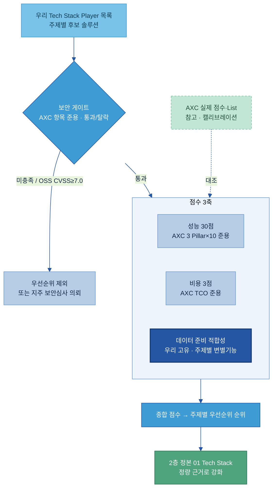

# AI-Ready Data — Tech 솔루션 평가 기획안

> **목적:** 우리 데이터 준비용 Tech Stack Player(솔루션)가 정해지면 **돌려서 우선순위를 매길 수 있는 재사용 평가 루브릭**을 만든다. 두산 지주가 만든 [AXC Player 평가결과서](AXC%20참고자료/01.%20산출물_Player%20평가결과서_v260602.xlsx)의 **평가 기준(보안·성능·비용 축과 그 안의 세부 지표)을 준용**하고, AXC가 실제로 매긴 점수·List는 **참고(캘리브레이션)만** 한다.
>
> **무엇을 가져오고 무엇을 안 가져오나:**
> - **준용(가져온다):** 평가의 *방법* — 보안 게이트 항목, 성능 3 Pillar × 10 세부 지표, 비용 TCO 산식.
> - **참고만(안 가져온다):** AXC가 매긴 *결과* — 특정 Player의 점수, Black/White/Recommendation List. 우리 루브릭이 잘 작동하는지 대조하는 캘리브레이션 용도로만 본다.
>
> **관점 고정:** AXC는 "AI 에이전트를 만드는 Player"를 평가했고, 우리는 **"그 AI가 쓸 데이터를 준비·정비하는 솔루션"**을 평가한다. 그래서 AXC 3축에 더해 **데이터 준비 적합성**을 우리 고유 축으로 둔다 (절대 원칙 — CLAUDE.md).
>
> **산출 연계:** 이 루브릭으로 매긴 우선순위는 기존 정성 정본 [전체 목차/01 Tech Stack 비교 (솔루션×주제)](../전체%20목차/01%20Tech%20Stack%20비교%20(솔루션×주제).md)의 ✓/△/✗ 비교를 정량 근거로 뒷받침한다. 정본을 대체하지 않고 강화한다.

---

## 목차

- [0. 한눈에 — 이 루브릭이 하는 일](#sec0)
- [1. AXC 평가결과서에서 가져오는 것 (준용 대상)](#sec1)
- [2. 우리 평가 루브릭 구조 — 게이트 1 + 점수 3축](#sec2)
- [3. 보안 게이트 (AXC 준용 · 통과/탈락)](#sec3)
- [4. 성능 평가표 (AXC 3 Pillar × 10 지표 준용)](#sec4)
- [5. 비용 평가표 (AXC TCO 산식 준용)](#sec5)
- [6. 데이터 준비 적합성 (우리 고유 축)](#sec6)
- [7. 종합 점수·우선순위 산식](#sec7)
- [8. 적용 절차 — Player가 나오면 어떻게 돌리나](#sec8)
- [9. AXC 실제 결과는 참고만 (캘리브레이션)](#sec9)
- [10. 주의·리스크](#sec10)
- [참고자료](#refs)

---

<a id="sec0"></a>
## 0. 한눈에 — 이 루브릭이 하는 일

이 문서는 **채점표**다. 아직 점수를 매기지 않는다 — 우리 Tech Stack Player 목록이 확정되면, 그때 이 표를 각 Player에 돌려 **주제별 우선순위**를 산출한다.

평가는 AXC와 같은 순서로 흐른다 — **보안 게이트(통과/탈락) 먼저, 그다음 점수**. 점수 축은 AXC의 세 축을 준용하고 우리 축 하나를 더한다.

| 단계 | 축 | 출처 | 산출 |
|---|---|---|---|
| 게이트 | **보안** | AXC 보안 항목 준용 | 통과 / 탈락 (탈락은 우선순위 제외) |
| 점수 1 | **성능** | AXC 3 Pillar × 10 지표 준용 | 30점 |
| 점수 2 | **비용** | AXC 3년 TCO 산식 준용 | 3점 |
| 점수 3 | **데이터 준비 적합성** | 우리 고유 (주제별 변별 기능) | 주제별 환산 |

세 줄 요약.

1. **AXC의 평가 기준을 그대로 채점표로 옮긴다.** 보안 게이트 항목·성능 10개 지표·비용 TCO 산식을 우리 루브릭으로 준용한다. 바퀴를 다시 발명하지 않는다.
2. **AXC가 매긴 점수는 정답이 아니라 대조용이다.** Milvus가 몇 점이었는지는 우리 채점이 합리적인지 비교하는 캘리브레이션으로만 쓰고, 우리 판정으로 상속하지 않는다.
3. **데이터 준비 적합성을 우리 축으로 더한다.** AXC 10개 지표에는 *우리 원천 커넥터(SAP·MES·QMS·LIMS) 적합성·자동 메타수집·컬럼 단위 계통·한글/도면·온프렘* 같은 변별축이 없다. 우선순위를 가르는 건 결국 이 축이다.

---

<a id="sec1"></a>
## 1. AXC 평가결과서에서 가져오는 것 (준용 대상)

AXC는 그룹 AI Tech Stack을 10개 Layer · 약 30개 Component로 정의하고, 각 Component의 Player를 **통제수준 → 보안 게이트 → 성능 30점 + 비용 3점(=33점, 20점 컷) → White/Recommendation** 순으로 걸렀다.

우리가 **준용하는 것은 가운데 두 단계의 채점 기준**이다.

| AXC 구성 | 준용 여부 | 우리 루브릭에서 |
|---|---|---|
| 통제수준(High/Mid/Low) | 참고 | 주제 무게(가중 조정)에 참고만 |
| **보안 필터링 항목** | **준용** | §3 보안 게이트 |
| **성능 3 Pillar × 10 지표** | **준용** | §4 성능 평가표 |
| **비용 6항목 TCO 산식** | **준용** | §5 비용 평가표 |
| 별첨 C 표준 프로토콜(OpenAPI·MCP·인증) | 준용 | §4 P2 기술표준 지표에 흡수 |
| 별첨 D 환경별 선정 규칙(AWS/Azure/온프렘) | 준용 | §7 환경별 우선순위 |
| 별첨 E OSS CVSS(BlackDuck) | 준용 | §3 OSS 보안 게이트 |
| **실제 Player 점수·Black/White/Rec List** | **참고만** | §9 캘리브레이션 대조용 |

> 즉 AXC 문서에서 우리가 베끼는 건 별첨 A·B(채점 기준)와 보안 항목이고, 본문 2~4(실제 List)는 보지 않거나 대조용으로만 본다.

---

<a id="sec2"></a>
## 2. 우리 평가 루브릭 구조 — 게이트 1 + 점수 3축



- **게이트가 먼저다.** 보안 미충족은 점수와 무관하게 우선순위에서 빠진다(AXC와 동일).
- **성능:비용 = 30:3 무게를 준용**한다 — AXC처럼 성능 주도, 비용은 동점 조정자.
- **데이터 준비 적합성은 별도 축**이다 — AXC 점수와 섞지 않고 따로 매겨, 우선순위 정렬의 1차 키로 쓴다(§7).

---

<a id="sec3"></a>
## 3. 보안 게이트 (AXC 준용 · 통과/탈락)

AXC의 보안 탈락 사유를 체크리스트로 준용한다. **하나라도 미충족이면 탈락**(게이트). 보안 판정은 지주 보안팀 소관이므로, 우리는 자가 점검 후 최종 판정을 의뢰한다.

| 게이트 항목 (AXC 준용) | 통과 조건 | 데이터 준비 준용 메모 |
|---|---|---|
| 배포 환경 | 두산 Landing Zone(승인된 클라우드/온프렘)에 배포 가능 | 망분리 환경 배포 가능 여부를 동등 비중으로 |
| 학습 재사용 차단 | 입력 데이터·파일이 벤더 모델 학습에 재사용되지 않음 보장 | 데이터 준비 솔루션은 원본 데이터를 다루므로 필수 |
| 데이터 격리 | 지식·원천 데이터의 물리적/논리적 격리 | 계열사 간 데이터 분리 포함 |
| 전용 환경 | Public과 분리된 전용 환경·네트워크 제공 | — |
| 접근·정책 통제 | 커스텀 접근 정책·권한 설정 가능 | F-4 권한 주제와 직결 |
| 이상 탐지·감사 | 비정상 동작 탐지·감사 로그 | — |
| **OSS 취약점** | **CVSS 7.0 미만** (BlackDuck 등 소스 점검, 별첨 E 방식) | OSS는 이 항목으로 게이트 |

> 비고: AXC 문서에 "보안 요건 수립 진행 중, 리스트 변경 가능" 명시. 게이트 항목은 지주 보안 기준 갱신 시 함께 갱신한다.

---

<a id="sec4"></a>
## 4. 성능 평가표 (AXC 3 Pillar × 10 지표 준용)

AXC 별첨 A를 그대로 채점표로 옮긴다. **10개 지표 × 각 3점 = 30점 만점.** 채점은 0/2/3(Ternary) 또는 0/3(Binary). OSS는 검토 불가 5개 지표를 빼고 채점 후 **2배 환산**(AXC 방식 준용).

| Pillar | 지표 (AXC 준용) | 0점 | 2점 | 3점 | 방식 | 데이터 준비 준용 메모 |
|---|---|---|---|---|---|---|
| **P1 제품 검증성** | 성숙도·활성도 | 시험단계·EOL·전담지원 없음 / OSS: stable 태그 없음·3개월 무커밋 | — | GA·전담지원 / OSS: stable+활성 커밋 | 0/3 | 그대로 |
| | 레퍼런스 | 대형 0건 & 분석기관 미등재 / OSS: Star ≤5K | 1건 또는 MQ만 / OSS: >5K 또는 1건 | ≥2건 또는 MQ 리더 / OSS: >10K + 2건 | 0/2/3 | 제조·국내 도입사례에 가점 |
| | 가용성·장애대응 | SLA <99.90% / 없음 | 99.90~99.95% | ≥99.95% + 내결함성 | 0/2/3 (OSS 미평가) | 온프렘은 자체 HA 구성 가능성으로 대체 평가 |
| **P2 개발 적합성** | 기술 표준 준수 | 둘 다 미충족 | API 스타일 또는 표준 프로토콜 중 1 | OpenAPI/REST/gRPC + 표준 프로토콜 | 0/2/3 | 별첨 C 표준(OpenAPI·MCP) 준수 = D-2 직결 |
| | 멀티클라우드·하이브리드 | 단일 환경 | 2개 이상 클라우드 | 3대 클라우드 + 온프렘 + 통합 제어 | 0/2/3 (CSP 네이티브 자동 3) | 우리는 **온프렘·망분리 지원**을 멀티클라우드와 동등 이상 가중 |
| | Plugin·SDK 연동성 | 없음 | 1개 충족 | SDK·Plugin·Hook 중 2개 이상 | 0/2/3 | 그대로 |
| **P3 운영 안정성** | 확장성·탄력성 | 수직 확장만·수동 | 일부 충족 | 수평확장 + 선형성 + 오토스케일 | 0/2/3 (OSS 미평가) | 데이터량 증가 대응 관점 |
| | 백업·복구 | 없음 | 수동만 / PIT 없음 | 자동 + 특정시점복구 + 교차리전 | 0/2/3 (OSS 미평가) | 데이터 자산 보존과 직결 |
| | 자원 효율성 | 지표 미문서화 | 처리량 지표 문서화 | 지표 + 경쟁 우위 | 0/2/3 (OSS 미평가) | 대용량 처리량(throughput) 관점 |
| | 버전 호환성 | 정책 없음 | SemVer 불명확 | SemVer + 2버전 하위호환 + 폐기 고지 | 0/2/3 | 파이프라인 안정성과 직결 |

> OSS 미평가 5개 지표 = 가용성·장애대응 / 멀티클라우드 / 확장성 / 백업·복구 / 자원 효율성. OSS는 나머지 5개(최대 15점) 채점 후 ×2 → 30점 환산. (AXC 별첨 A 주석 준용)

---

<a id="sec5"></a>
## 5. 비용 평가표 (AXC TCO 산식 준용)

AXC 별첨 B의 3년 TCO 산식을 준용한다. 핵심은 **모든 Player에 동일한 Medium 표준 시나리오를 적용**해 규모 편향을 제거하는 것이다.

### 5.1 비용 6항목

| 항목 | 산출 | OSS/CSP 특이 |
|---|---|---|
| ① 라이선스(월) | 벤더 가격 × seat 수 | OSS=0, CSP 관리형=대부분 0 |
| ② 인프라(월) | 사용량 시나리오 배율(2.5x) × 단가 | OSS 자체호스팅 시 높음 |
| ③ API·사용량(월) | API 배율(3x) × 단가 | LLM 기반 컴포넌트에서 큼 |
| ④ 운영 FTE(월) | FTE × 월 인건비 | 관리형 0.2 / OSS 0.3 / Model API 0.1 FTE |
| ⑤ 초기도입(1회) | PoC·마이그레이션·교육 | CSP < Other < OSS |
| ⑥ 숨은비용(월) | (인프라+API) × 15% | 데이터 전송·초과·프리미엄 지원 |

### 5.2 TCO·점수 산식

- **3년 TCO** = 1년차(월소계×12) + 2년차(×인플레이션×할인) + 3년차 + 초기도입.
- **점수** = 컴포넌트(주제)별로 log(TCO)를 Winsorized Min-Max 정규화(P10~P90 클리핑) 후 ×3 → **3점 만점**.

### 5.3 Medium 표준 시나리오 — 우리 환경 기준값 (확정 필요)

AXC 기본값을 출발점으로 두되, **우리 실제 규모로 한 번 고정**해 모든 Player에 동일 적용한다.

| 파라미터 | AXC 기본 | 우리 기준 |
|---|---|---|
| 동시 사용자 | 200 | (계열사 규모 반영해 확정) |
| API 호출/월 | 100만 (×3) | 확정 |
| 토큰/월 | 5천만 | 확정 |
| 인프라 | 중형 클러스터 (×2.5) | **온프렘 비중 반영** |
| 운영 FTE | 1.0 (OSS 0.3) | 확정 |

> 데이터 준비 준용: 우리는 **온프렘/망분리 비중이 크다** → OSS 자체호스팅의 인프라·FTE 비용이 실제 부담의 핵심. 시나리오에 온프렘 케이스를 반드시 포함한다.

---

<a id="sec6"></a>
## 6. 데이터 준비 적합성 (우리 고유 축)

AXC 10개 지표에 없는, 그 주제에서 **데이터 준비를 잘 되게 하는가**를 가르는 변별 기능이다. 주제별로 3~5개를 정해 각 0(없음)/1(부분)/2(연동)/3(네이티브) 채점 후 주제별로 환산한다.

| 주제 | 데이터 준비 변별 기능 (채점 항목) |
|---|---|
| **A-1 카탈로그** | 우리 원천 커넥터(SAP·MES·QMS·LIMS·SharePoint) · 자동 메타수집률 · 검색 UX · 컬럼단위 계통 연계 · 계열사 확장 |
| **A-2 메타데이터** | 메타 스키마 유연성 · 자동 분류/태깅 · 거버넌스 워크플로 · 기술/비즈니스 메타 통합 |
| **A-3 용어집** | 네이티브 비즈니스 용어집 · 동의어/약어 매핑 · 질의 확장 연계 · 한국어 |
| **B-1 전처리/파싱** | 표 구조 보존 · 레이아웃 인식 · 온프렘/로컬 · 한국어·OCR · RAG 적재 출력(MD/JSON·청킹) |
| **B-2 라벨링/주석** | AI 1차 라벨 · 능동학습 · 프로그래매틱/약지도 · 라벨 합의·오류탐지(IAA) · 온프렘 |
| **B-3 온톨로지/그래프** | 그래프 추론(OWL/SHACL) · 다중 홉 경로 · LPG↔RDF 적합성 · GraphRAG · 온톨로지 저작 |
| **C-1 데이터 Observability** | 신선도·완전성·분포 이상 자동 탐지 · 사고 알림·근본원인 · 계통 연계 |
| **C-2 데이터 품질 게이트** | 규칙/제약 정의 · 파이프라인 차단(게이트) · 예외 승인 흐름 · 품질 지표 추적 |
| **C-3 계통(Lineage)** | 컬럼단위 계통 · 자동 수집(OpenLineage) · 영향도 분석 · 교차 시스템 |
| **D-1 Physical/IoT** | OT 프로토콜(OPC UA·Modbus·MQTT) · 산업 historian 연계 · 시계열 정규화 · 엣지 수집 |
| **D-2 Tool 연계** | OpenAPI·MCP 표준 준수 · Tool 명세 레지스트리 · 버전·품질 스코어카드 (별첨 C 기준) |
| **D-3 Prompt 자산화** | 프롬프트 버전·메타데이터 · 평가 연계 · 재사용 카탈로그 |
| **E-1 데이터 Product화** | 데이터 상품 정의·발행 · 복사 없는 공유 · 계약(SLA)·구독 |
| **E-2 합성데이터** | 분포·상관 보존 · 프라이버시(재식별 위험) · 제조 도메인 적합 · 검증 지표 |
| **E-3 AI 평가데이터** | 평가셋 구축·버전 · 골든셋 관리 · LLM-judge 데이터 · 회귀 평가 |
| **E-4 Feedback Loop** | 추론 로그·피드백 수집 · 라벨 환류 · 재학습 데이터화 |
| **F-1 DataOps** | 오케스트레이션·스케줄 · CI/CD·버전 · 계통 자동 연동 |
| **F-2 생애주기** | 티어링·아카이브 자동 · TTL·만료 · 보존정책 |
| **F-3 디지털화(OCR·STT)** | 한글 손글씨·도면 · 다국어 STT · 정확도·후처리 |
| **F-4 권한·비식별** | 행/열 접근통제 · PII 탐지·마스킹 · 재식별 점검 · 활용성 보존 |

> 변별 기능은 각 주제 가이드(1층)의 '솔루션' 섹션 평가축에서 가져온다. 미작성 주제는 가이드 작성 시 확정하고 이 표를 갱신한다. **제품명이 아니라 "무슨 기능을 하느냐"로 채점** — 제품은 PoC로 검증.

---

<a id="sec7"></a>
## 7. 종합 점수·우선순위 산식

보안 게이트를 통과한 Player만 점수화하고, 아래로 우선순위를 매긴다.

### 7.1 점수 구성

| 블록 | 만점 | 출처 |
|---|---|---|
| AXC 준용 기본점수 = 성능(30) + 비용(3) | 33 | §4·§5 (AXC와 비교 가능하게 그대로 유지) |
| 데이터 준비 적합성 | 주제별 환산(100 기준) | §6 |

### 7.2 우선순위 산식 (기본값 — 조정 가능)

```
[게이트] 보안 통과 = 우선순위 후보,  탈락 = 제외
[정렬]   우선순위 점수 = 0.5 × 데이터준비적합성(100환산)
                       + 0.5 × AXC기본점수(33→100환산)
[동률]   데이터 준비 적합성 → 비용 → 성능 순으로 정렬
```

- **데이터 준비 적합성을 1차 키**로 두는 이유: 보안·성능·비용을 통과한 Player끼리는 결국 "우리 데이터 작업에 얼마나 맞나"로 갈린다. 우리가 AXC 점수를 그대로 안 쓰는 이유이기도 하다.
- **가중(5:5)은 기본값**이다 — 주제 무게(통제수준)에 따라 조정한다. 보안 민감 주제(F-4 등)는 AXC 기본점수 비중을, 데이터 작업이 핵심인 주제(A·B군)는 적합성 비중을 높인다.

### 7.3 출력 — 주제별 우선순위 순위표

```
주제 | Player | 보안 | 성능(30) | 비용(3) | 데이터준비 적합성 | 우선순위 점수 | 순위 | 환경(AWS/Azure/GCP/온프렘) | AXC 대조
```

- 환경별 권장은 별첨 D 규칙 준용 — 두산은 **온프렘/망분리 비중이 크므로 On-prem 1순위를 반드시 채운다**.
- 우리는 Black/White-List를 발행하지 않는다(지주 권한). 산출은 **우선순위 순위 + 환경별 1순위**까지.

---

<a id="sec8"></a>
## 8. 적용 절차 — Player가 나오면 어떻게 돌리나

1. **Player 목록 확정** — 평가할 우리 Tech Stack Player를 주제별로 모은다(이 루브릭의 입력).
2. **보안 게이트** — §3 체크리스트로 통과/탈락. OSS는 CVSS 점검. 탈락·미확정은 보안심사 의뢰 플래그.
3. **성능 채점** — §4 표로 10개 지표 채점(OSS는 5개 ×2 환산).
4. **비용 채점** — §5 Medium 시나리오(우리 기준값) 적용해 TCO → 3점 환산.
5. **데이터 준비 적합성 채점** — §6 주제별 변별 기능 채점.
6. **우선순위 산출** — §7 산식으로 정렬, 환경별 1순위 표기.
7. **AXC 대조** — §9. 겹치는 Player가 있으면 AXC 점수와 우리 점수를 나란히 놓고 채점 합리성 점검.
8. **정본 반영** — 사용자 승인 시 2층 정본에 정량 컬럼 추가, 별도 커밋(CLAUDE.md 반영 게이트 준수).

> 이 절차는 주제 가이드 생산([`ai-ready-manual-guide`](../가이드%20작성) 스킬)과 별개로 돌리는 **평가 패스**다. 가이드의 솔루션 섹션이 §6 변별 기능의 원천이 된다.

---

<a id="sec9"></a>
## 9. AXC 실제 결과는 참고만 (캘리브레이션)

AXC가 매긴 점수·List는 **우리 판정으로 상속하지 않는다.** 다만 우리 채점이 합리적인지 대조하는 캘리브레이션으로 쓴다.

- **겹치는 Player 대조:** AXC가 평가한 Player가 우리 목록에도 있으면(예: 문서 파싱·평가·게이트웨이·거버넌스 계열), AXC 점수와 우리 점수를 나란히 본다. 크게 어긋나면 우리 채점 기준 적용을 점검한다.
- **무엇이 다를 수 있나:** 우리는 데이터 준비 적합성 축이 추가되고, 온프렘·한글 가중이 다르므로 **순위가 AXC와 달라지는 게 정상**이다. 어긋남 자체가 문제가 아니라, *이유를 설명할 수 있는가*가 점검 포인트다.
- **OSS CVSS는 재사용 가능:** AXC가 이미 소스 점검한 OSS(별첨 E)의 CVSS 결과는 보안 게이트 근거로 그대로 인용해도 된다(시점 확인 후).
- **Layer 2(Data)는 AXC 참고 자체가 없다:** AXC는 카탈로그·계통 등 데이터 계층 Player를 평가하지 않았다 — 이 주제는 대조 기준 없이 우리 루브릭만으로 매긴다.

---

<a id="sec10"></a>
## 10. 주의·리스크

- **루브릭이지 결과가 아니다.** 이 문서는 채점표다. 실제 점수는 Player 목록이 확정된 뒤 별도 평가 패스에서 매긴다.
- **AXC는 살아있는 문서다.** "보안 요건 수립 진행 중" 명시 — 보안 게이트 항목은 버전(v260602)·시점을 기록하고 갱신 시 재확인한다.
- **관점 혼입 주의.** 준용하다 보면 "AI 구축에 좋은 솔루션"으로 흐르기 쉽다. 모든 축은 **데이터 준비** 관점으로 고정(특히 D-2·D-3·E-3·F-4).
- **같은 이름 다른 대상.** C-1 Observability(데이터 vs AI 런타임), E-3 평가(데이터셋 vs 플랫폼)는 AXC와 단어만 겹친다 — 적합성 채점에서 대상을 구분한다.
- **점수의 과신 금지.** 우선순위는 의사결정 보조다. 두산 원천 연결은 **PoC로만 확증**된다 — 점수가 PoC를 대체하지 않는다.
- **권한 경계.** Black/White-List는 발행하지 않는다. 우리는 우선순위 순위 + 환경별 1순위까지.

---

<a id="refs"></a>
## 참고자료 (References)

- **AXC 평가결과서** — [01. 산출물_Player 평가결과서_v260602.xlsx](AXC%20참고자료/01.%20산출물_Player%20평가결과서_v260602.xlsx) (준용: 보안 항목·별첨 A 성능·별첨 B 비용·별첨 C 프로토콜·별첨 D 선정·별첨 E OSS)
- **우리 2층 정본** — [전체 목차/01 Tech Stack 비교 (솔루션×주제)](../전체%20목차/01%20Tech%20Stack%20비교%20(솔루션×주제).md)
- **전체 주제 정의·Key Question** — [공통 규칙/최종 주제.md](../공통%20규칙/최종%20주제.md)
- **20개 주제 조감도** — [전체 목차/00 전체 목차 (20개 주제)](../전체%20목차/00%20전체%20목차%20(20개%20주제).md)
- **다이어그램 표준** — [공통 규칙/02 다이어그램 표준.md](../공통%20규칙/02%20다이어그램%20표준.md)

---

## 변경 이력

| 버전 | 일자 | 내용 |
|---|---|---|
| v0.1 | 2026-06-24 | 초안 — AXC 해부 + 20주제 3구간 매핑 + 평가 프레임(Gate+4축). 방향: AXC 결과 상속 + 데이터준비 렌즈. |
| v0.2 | 2026-06-24 | **방향 정정 — AXC의 평가 기준(축+세부지표) 준용, 실제 결과는 참고만.** 재사용 채점 루브릭으로 재구성: ① §3 보안 게이트 체크리스트 ② §4 성능 3 Pillar×10 지표 채점표(0/2/3·OSS ×2) ③ §5 비용 TCO 산식·Medium 시나리오 ④ §6 데이터준비 적합성(우리 고유 축) ⑤ §7 우선순위 산식(보안 게이트 + 적합성:AXC기본 = 5:5, 조정 가능) ⑥ §8 적용 절차 ⑦ §9 AXC 실제결과는 캘리브레이션 대조용. 목적 = 우리 Player 확정 시 돌려서 우선순위 산출. (v0.1의 '결과 상속'·3구간 매핑 틀 제거.) |
