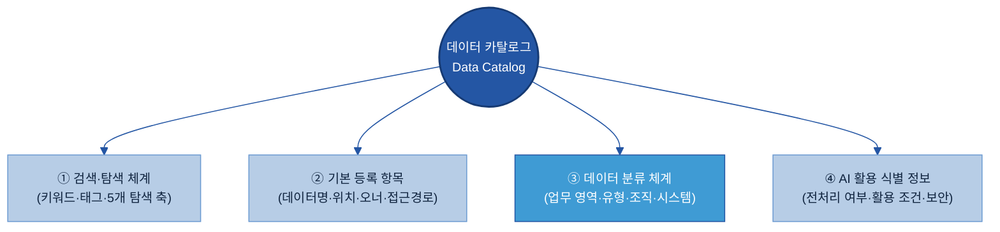
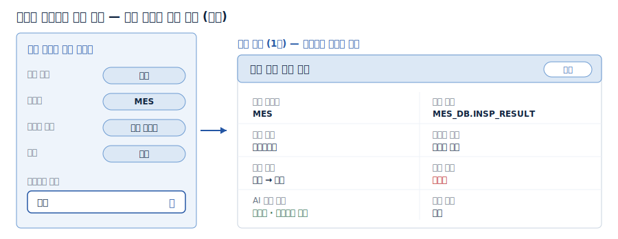
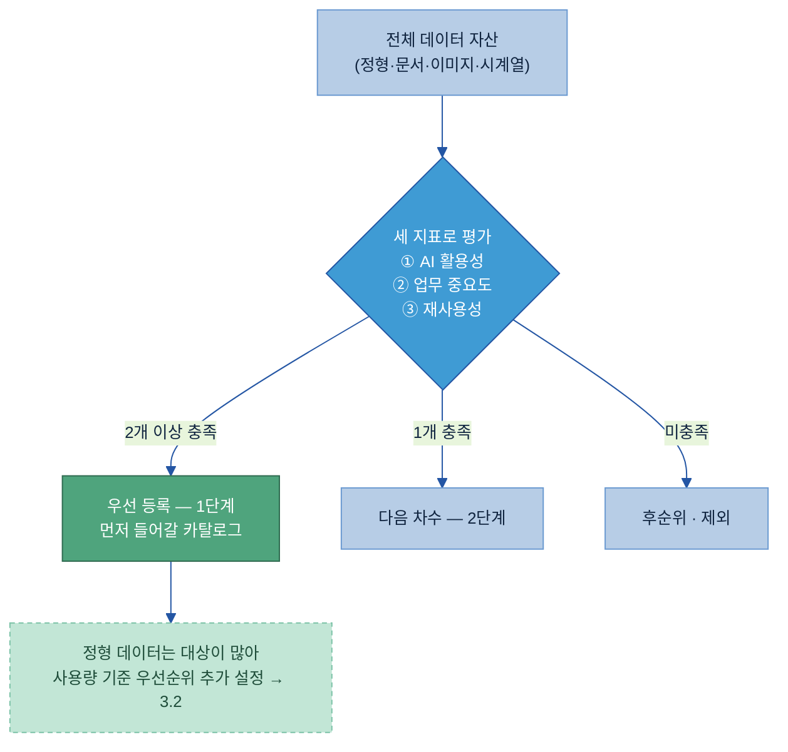
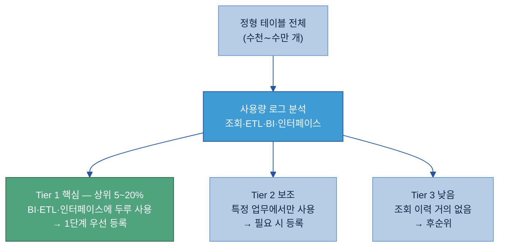
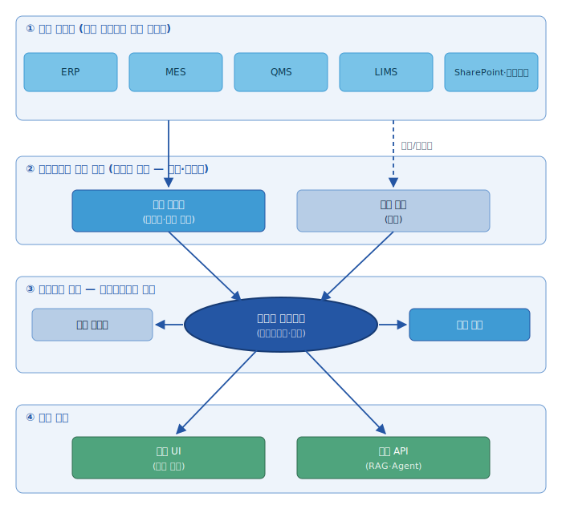
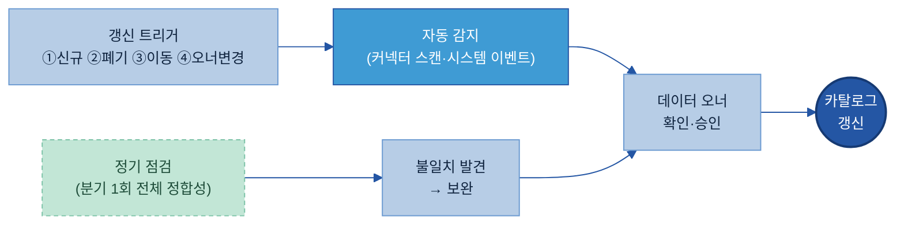
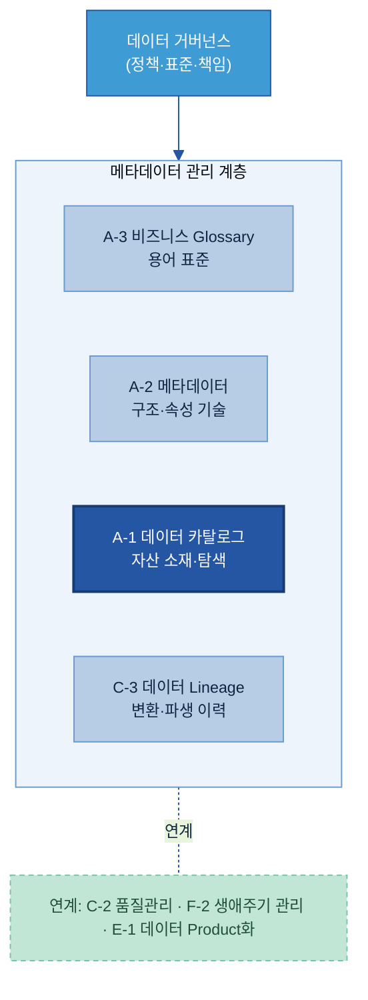

# A-1. 데이터 카탈로그

## 목차

- [이 가이드가 답하는 5가지 질문](#key-questions)

1. [Why — 왜 필요한가](#why)
   - [1.1 현업 Pain Point](#s11)
   - [1.2 기대 효과](#s12)

2. [What — 무엇을 갖추나 (등록 항목·구성)](#what)
   - [2.1 데이터 카탈로그란 + 체계 내 위치](#s21)
   - [2.2 카탈로그 조회 방식](#s22)
   - [2.3 등록 항목](#s23)
   - [2.4 분류·태그 체계](#s25)
   - [2.5 AI 활용 식별 정보](#s26)

3. [When — 어디부터 등록하나 (우선순위)](#when)
   - [3.1 등록 대상 선정 기준](#s31)
   - [3.2 등록 우선순위](#s32)
   - [3.3 유형별 등록 대상과 제외](#s33)

4. [How — 어떻게 구축·운영하나](#how)
   - [4.1 등록 기준 정의](#s51)
   - [4.2 데이터 현황 조사 및 등록 대상 선정](#s52)
   - [4.3 To-Be 아키텍처](#s53)
   - [4.4 Legacy 연동 및 Pipeline 구축](#s54)
   - [4.5 초기 적재 및 검증](#s55)
   - [4.6 담당자 역할](#s56)
   - [4.7 항목별 작성 주체 — 플랫폼 매핑](#s58)
   - [4.8 운영 및 유지관리](#s57)

5. [Tech Stack — 솔루션 검토](#tech)
   - [5.1 솔루션 유형·적용 범위](#s41)
   - [5.2 후보 검토·기능 비교](#s42)
   - [5.3 평가·선정·PoC 기준](#s43)

6. [Where — 다른 주제와의 관계](#where)
   - [6.1 인접 주제와의 역할 분담](#s61)
   - [6.2 전체 조감도](#s62)

- [참고자료 (References)](#참고자료-references)
- [변경 이력 / 피드백 반영](#변경-이력--피드백-반영)

---
> 데이터 카탈로그(Data Catalog)는 AI와 사람이 "어디에 무슨 데이터가 있는지" 찾을 수 있도록, 데이터 자산의 **존재·위치·오너·접근 경로**를 등록해 둔 **자산 목록 체계**다. 소재를 찾는 "주소록"이지, 데이터 자체를 이동하거나 분석하는 도구가 아니다.

> 관련 가이드: [A-2 메타데이터](../A-2%20메타데이터/A-2%20메타데이터.md) · [A-3 비즈니스 Glossary](../A-3%20비즈니스%20Glossary/A-3%20비즈니스%20Glossary.md) · [C-3 데이터 계통 Lineage](../C-3%20데이터%20계통%20Lineage/C-3%20데이터%20계통%20Lineage.md) · [F-2 데이터 생애주기 관리](../F-2%20데이터%20생애주기%20관리/F-2%20데이터%20생애주기%20관리.md) · [E-1 데이터 Product화](../E-1%20데이터%20Product화/E-1%20데이터%20Product화.md)

---

## 이 가이드가 답하는 5가지 질문

| 질문 | 한 줄 답 | 본문 |
|---|---|---|
| 어떤 데이터를 카탈로그에 등록하나 | 모든 데이터를 한 번에 등록하지 않고, AI 활용·업무 중요도·재사용성이 높은 자산부터 우선 등록한다 | [3.1](#s31) |
| 자산의 위치·접근 경로를 무엇으로 기록하나 | 데이터명·보유 시스템·저장 위치·오너·접근 방법·갱신 주기 등 찾는 데 필요한 최소 항목을 등록한다 | [2.3](#s23) |
| 여러 시스템에 흩어진 데이터를 어떻게 모으나 | ERP·MES·QMS 등 원천을 원천→수집→코어→소비 네 계층으로 잇고, 실제 데이터가 아니라 위치·소재(메타데이터)만 모은다 | [4.3](#s53) |
| AI와 현업이 필요한 데이터를 어떻게 찾나 | 업무 영역·데이터 유형·시스템·태그로 분류해 검색·탐색하고, 결과에서 위치·오너·접근을 함께 확인한다 | [2.2](#s22) |
| 카탈로그를 어떻게 최신으로 유지하나 | 신규·폐기·위치 변경·오너 변경을 트리거로 자동 감지 → 오너 승인 → 정기 점검으로 갱신한다 | [4.8](#s57) |

---

## 1. Why — 왜 필요한가

AI 프로젝트에서는 필요한 데이터를 찾고 준비하는 과정이 반복된다. 데이터는 이미 존재하지만 위치와 관리 기준이 분산되어 있어 프로젝트마다 다시 찾고, 다시 수집하고, 다시 전처리하는 일이 반복된다.

데이터 카탈로그는 데이터 자산의 위치와 관리 정보를 표준화하여 사람과 AI가 동일한 기준으로 데이터를 탐색하고 재활용할 수 있도록 하는 체계이다.

궁극적으로 AI 과제를 수행할수록 데이터 자산이 축적되고 다음 과제에서 자연스럽게 재사용되는 구조를 만드는 것이 목적이다.

---

### 1.1 현업 Pain Point

AI 프로젝트에서 반복적으로 발생하는 데이터 관련 문제는 다음과 같다.

| 현업 Pain Point | 현장에서 발생하는 문제 |
| --- | --- |
| 필요한 데이터의 존재 여부를 확인하기 어렵다. | 필요한 데이터가 있는지 확인하기 위해 여러 조직과 담당자에게 문의해야 한다. |
| 데이터가 여러 시스템에 분산되어 있다. | MES, ERP, QMS, SharePoint, 파일 서버, 개인 PC 등을 각각 확인해야 한다. |
| 데이터 관리 주체가 명확하지 않다. | 데이터를 찾더라도 누구에게 요청해야 하는지 다시 확인해야 한다. |
| 동일한 데이터를 반복적으로 준비한다. | 기존 프로젝트에서 구축한 데이터를 재사용하지 못하고 다시 수집하고 전처리한다. |
| AI 활용 이력을 확인하기 어렵다. | 전처리 여부나 기존 AI 프로젝트 활용 여부를 확인하기 어렵다. |

예를 들어 품질 이상 원인을 분석하는 AI 프로젝트를 수행하는 경우 MES 공정 데이터, 품질 검사 결과, 시험 결과, 품질 보고서 등 여러 데이터를 확보해야 한다.

그러나 데이터는 서로 다른 조직과 시스템에서 관리되기 때문에 필요한 데이터를 찾고 접근 권한을 확보하는 데 많은 시간이 소요된다. 프로젝트가 달라져도 동일한 과정이 반복되며, 이전 프로젝트에서 구축한 데이터가 있어도 이를 확인하기 어렵다.

---

### 1.2 기대 효과

데이터 카탈로그를 구축하면 데이터 탐색과 활용 방식이 표준화된다.

필요한 데이터의 위치와 관리 정보를 검색을 통해 확인할 수 있으며, 기존 프로젝트에서 구축한 데이터를 재활용할 수 있다. AI 역시 동일한 카탈로그를 활용하여 필요한 데이터를 탐색할 수 있다.

- **데이터 탐색 시간 단축**  
  데이터의 위치와 관리 조직, 접근 방법을 빠르게 확인하여 프로젝트 착수 시간을 줄일 수 있다.

- **데이터 재사용 확대**  
  기존 AI 프로젝트에서 구축한 데이터를 재활용하여 중복 수집과 전처리 작업을 줄일 수 있다.

- **부서 간 데이터 사일로 해소**  
  데이터의 출처와 산출 기준을 함께 기록하여, 부서마다 같은 데이터를 따로 복사·가공해 수치가 어긋나는 문제를 줄이고 전사가 동일한 기준의 데이터를 참조하게 한다.

- **AI 활용 기반 확보**  
  AI Agent와 RAG가 동일한 데이터 자산을 활용할 수 있는 공통 탐색 체계를 구축할 수 있다.

- **데이터 관리 기준 표준화**  
  계열사별 데이터 관리 기준을 일관되게 적용하여 데이터 활용 수준을 높일 수 있다.

- **데이터 자산의 지속적인 축적**  
  AI 프로젝트를 수행할수록 데이터 자산이 계속 축적되고, 이후 프로젝트에서는 기존 자산을 우선 활용하는 구조를 구축할 수 있다.

데이터 카탈로그는 일회성 구축 과제가 아닌, AI 프로젝트에서 축적되는 데이터를 조직의 공통 자산으로 관리하고, 이후 프로젝트에서 반복 활용할 수 있도록 하는 기반 체계이다.

---

## 2. What — 무엇을 갖추나 (등록 항목·구성)

데이터 카탈로그는 카탈로그 코어를 중심으로 네 가지 요소로 구성된다. 검색·탐색 체계(데이터를 찾는 방법), 등록 항목(기록하는 정보), 분류 체계(분류 기준), AI 활용 식별 정보(활용 가능 조건)이다. 등록 항목은 데이터를 설명하는 정보, 즉 메타데이터를 의미한다.

---

### 2.1 데이터 카탈로그란 + 체계 내 위치

데이터 카탈로그는 조직이 보유한 데이터 자산의 위치와 관리 정보를 등록하는 목록 체계이다.

데이터 카탈로그에서 관리하는 대상은 데이터 자체가 아닌, 데이터를 설명하는 정보이다. 데이터는 기존 시스템에 그대로 두고, 데이터명, 저장 위치, 관리 조직, 데이터 오너, 접근 방법 등을 등록하여 필요한 데이터를 찾을 수 있도록 지원한다.

데이터 카탈로그는 데이터의 존재 여부·저장 위치·보유 시스템·관리 조직·데이터 오너·접근 방법·갱신 정보·보안 등급을 관리한다. 각 항목의 구체 정의와 예시는 2.3~2.4에서 다룬다.

개념적으로는 표준 용어(A-3)와 자산의 속성(A-2)이 데이터의 의미를 채우고, 카탈로그(A-1)는 그렇게 의미가 정의된 자산이 어디에 있는지를 담는다(본 매뉴얼도 A-3 → A-2 → A-1 순으로 읽도록 구성). 다만 실제 구축은 이와 반대로, 먼저 무엇이 어디에 있는지 목록(카탈로그)을 구축한 뒤, 그 위에 메타데이터와 표준 용어를 연결해 의미를 단계적으로 채우는 경우가 많다. 이런 점에서 카탈로그는 AI-ready Data 체계 정비의 출발점이자 기반이 된다.

> 데이터 카탈로그는 **"어디에 무엇이 있는가"**를 관리한다. 메타데이터·Glossary·Lineage 등 인접 주제와의 경계는 [6장](#where)에서 다룬다.

---

### 2.2 카탈로그 조회 방식

데이터 카탈로그 내에서 데이터 조회 방식은 검색과 탐색으로 가능하며, 실제 운영에서는 두 방식을 함께 사용한다.

검색은 데이터명이나 태그를 이용하여 필요한 데이터를 직접 찾는 방식이며, 탐색은 업무 영역과 시스템, 데이터 유형 등을 기준으로 범위를 좁혀가는 방식이다.

예를 들어 품질 데이터를 조회할 때는 탐색 필터로 범위를 좁히고, 검색 결과 카드에서 위치·오너·접근·보안·AI 활용 여부를 한 번에 확인한다.

---

### 2.3 등록 항목

데이터 카탈로그에는 데이터를 찾고 활용하는 데 필요한 최소 정보를 등록한다. 등록 항목은 성격에 따라 다섯 영역으로 나뉘며, 각 영역은 데이터를 찾고 활용할 때 확인하는 서로 다른 정보를 담는다.

| 구분(영역) | 설명 | 주요 등록 정보 |
| --- | --- | --- |
| Business (업무) | 데이터의 내용과 용도 | 데이터명, 설명, 업무 영역, 활용 목적 |
| Technical (기술) | 보관 시스템과 형태 | 보유 시스템, 저장 위치, 데이터 유형 |
| Operational (운영) | 관리 주체와 갱신 주기 | 데이터 오너, 관리 조직, 갱신 주기 |
| Compliance (보안) | 열람 범위와 민감정보 여부 | 보안 등급, 개인정보 포함 여부 |
| AI (활용) | AI 활용 가능 상태 | AI 활용 여부, 전처리 여부 |

Business·Technical·Operational은 데이터를 "찾고 이해하는" 데 필요한 정보이고, Compliance·AI는 그 데이터를 "AI 과제에 안전하게 쓸 수 있는지"를 판단하는 정보다(AI 영역의 식별 항목은 [2.5 AI 활용 식별 정보](#s26)에서 따로 다룬다).

아래는 자산 1건을 등록할 때 채우는 대표 항목이다. '필수'는 없으면 자산을 찾을 수 없는 최소 항목, '선택'은 있으면 탐색·활용이 편해지는 항목이다. '작성 주체'는 그 항목을 누가 채우는지로 — 시스템이 원천에서 자동 수집하면 자동, 데이터 담당자가 직접 입력하면 오너, 보안 담당이 지정하면 보안이다(대부분 자동이고 사람은 의미·보안 항목만 보완한다 → [§4.7](#s58)).

| 항목 | 의미 | 필수/선택 | 작성 주체 |
| --- | --- | :---: | :---: |
| 데이터명 | 자산을 부르는 공식 이름(약어만 쓰지 않음) | 필수 | 오너 |
| 보유 시스템 | 자산이 존재하는 시스템(솔루션명+용도) | 필수 | 자동 |
| 저장 위치 | 테이블·폴더 경로·DB 스키마 등 실제 위치 | 필수 | 자동 |
| 관리 조직 | 데이터를 관리하는 조직 | 필수 | 자동 |
| 데이터 오너 | 자산의 정확성·접근 정책을 책임지는 사람 | 필수 | 오너 |
| 접근 방법 | 자산에 접근하는 절차·방법 | 필수 | 오너 |
| 데이터 유형 | 정형·문서·이미지·시계열 등 | 필수 | 자동 |
| 갱신 주기 | 얼마나 자주 업데이트되는가 | 선택 | 자동 |
| 품질 상태 | 데이터 검증·신뢰 수준(검증 완료/참고용/미검증). 상세 측정은 [C-2 품질](../C-2%20데이터%20품질%20관리/C-2%20데이터%20품질%20관리.md) | 선택 | 자동 |
| 생성·변경 일시 | 자산이 처음 등록된 시점과 마지막으로 바뀐 시점 | 선택 | 자동 |
| 보안 등급 | 민감도·공개 수준(공개/사내/대외비/기밀) | 필수 | 보안 |
| 태그 | 검색·필터에 쓰이는 키워드(표준값에서 선택 → §2.4) | 선택 | 오너 |

---

### 2.4 분류·태그 체계

데이터는 동일한 기준으로 분류되어야 검색과 재사용이 가능하며, 분류 기준은 검색 조건과 태그 체계의 기준으로 함께 활용한다.

데이터 카탈로그에서는 다음 기준으로 데이터를 분류한다.

| 분류 기준 | 예시 |
| --- | --- |
| 업무 영역 | 생산, 품질, 구매, 영업 |
| 데이터 유형 | 정형, 문서, 이미지, 시계열 |
| 관리 조직 | 생산기술팀, 품질보증팀 |
| 시스템 | MES, ERP, QMS, LIMS |
| 활용 목적 | AI 학습, 분석, RAG, 보고서 |

데이터 유형은 검색 필터의 한 축이면서, 유형에 따라 이어지는 준비 작업이 달라진다. 데이터 카탈로그는 위치만 등록하고, 실제 구조·전처리·주석은 인접 주제에서 담당한다.

| 데이터 유형 | 두산전자 예시 | AI 활용 시 고려 사항 |
| --- | --- | --- |
| 정형(Table) | INSP_RESULT, CLAIM_HIST | 컬럼 구조·단위는 [A-2 메타데이터](../A-2%20메타데이터/A-2%20메타데이터.md) 연결 |
| 문서(Document) | 결함 분석 보고서, SOP, FMEA | [B-1 데이터 전처리](../B-1%20데이터%20전처리/B-1%20데이터%20전처리.md) 필요 |
| 이미지(Image) | 외관 결함 사진, 단면 이미지 | [B-2 데이터 해설·주석](../B-2%20데이터%20해설·주석/B-2%20데이터%20해설·주석.md) 필요 |
| 시계열(Time-series) | 동박 두께(1초), 설비 전류·진동 | 샘플링 주기·단위 관리 중요 |

분류와 검색의 기준값은 태그로 통일한다. 태그는 검색 품질의 하락을 방지하기 위해 동일한 데이터에 대해 자유 입력보다 표준값 사용을 원칙으로 하며, 이를 통해 계열사 전체에서 같은 기준으로 데이터를 검색·활용할 수 있다.

| 태그 | 표준값 예시 |
| --- | --- |
| 업무 영역 | 품질, 생산, 구매 |
| 데이터 유형 | 정형, 문서, 이미지 |
| 보안 등급 | 공개, 사내, 대외비, 기밀 |
| AI 활용 | 가능, 제한, 불가 |
| 원천 시스템 | MES, ERP, QMS, LIMS |

---

### 2.5 AI 활용 식별 정보

AI 프로젝트에서는 데이터의 위치뿐 아니라 "그 데이터를 AI에 바로 쓸 수 있는 상태인가"를 함께 확인해야 한다. 위치만 알고 활용 조건을 모르면, 이미 전처리해 둔 데이터를 못 알아보고 같은 준비 작업을 처음부터 다시 하게 된다. 그래서 카탈로그는 자산마다 다음 정보를 함께 관리한다.

| 항목 | 의미 | 예시값 |
| --- | --- | --- |
| AI 활용 여부 | AI 프로젝트에 활용 가능한가 | `가능 / 제한 / 불가` |
| 전처리 여부 | AI 활용을 위한 전처리가 끝났나 | `완료 (구조화·청킹까지)` |
| 원천 데이터 | 가공본이면 원본은 어디인가 | `MES.PROD_LOG` |
| 활용 목적 | 어떤 용도로 준비됐나 | `AI 학습 / 추론 / RAG` |
| 보안 조건 | AI 활용 시 적용할 보안 정책 | `가명화 후 학습 가능` |

예를 들어 결함 예측 과제가 이미 전처리·구조화한 검사 데이터에 "전처리 완료·RAG 활용 가능" 표시가 있으면, 다음 과제는 같은 데이터를 다시 준비하지 않고 그대로 재사용한다. 이 식별 정보가 데이터 자산이 과제를 거치며 축적·재사용되는 출발점이 된다.

---

## 3. When — 어디부터 등록하나 (우선순위)

데이터 카탈로그는 모든 데이터를 한 번에 등록하기보다 우선순위를 정해 단계적으로 구축하는 것이 효과적이다. 대상을 너무 넓게 잡으면 등록·갱신 부담이 커지고, 오너 없는 자산이나 최신이 아닌 정보가 쌓인다.

등록 우선순위는 세 가지 지표로 결정한다. 지표로 자산을 평가해 우선 등록할 대상을 정의하고, 나머지는 다음 차수로 미룬다. 전체 판단 흐름은 아래와 같다 — 세 지표로 우선 대상을 선별하고(3.1), 대상이 많은 정형 데이터는 사용량 기준으로 우선순위를 추가 설정하며(3.2), 유형별 등록·제외 기준을 적용한다(3.3).

---

### 3.1 등록 대상 선정 기준

데이터 카탈로그 구축에서 가장 흔한 실패는 등록 대상을 지나치게 넓게 잡는 것이다. 대상이 과도하게 많아지면 등록·갱신 부담이 커지고, 시간이 지나면 오너 없는 자산이나 최신이 아닌 정보가 쌓인다. 따라서 모든 데이터를 한 번에 등록하지 않고, 다음 세 기준으로 가치가 높은 자산부터 선정한다.

| 선정 기준 | 판단 질문 | 두산전자 예시 |
| --- | --- | --- |
| AI 활용 가능성 | AI 학습·추론·RAG·분석에 쓰이는가 | MES 품질검사 결과, 고객 클레임 이력 |
| 업무 중요도 | 생산·품질·원가 등 핵심 업무에 필요한가 | SAP 원가 월마감, QMS 판정 이력 |
| 재사용성 | 여러 조직·과제에서 반복 활용되는가 | LIMS 실험 결과, 동박 두께 시계열 |

세 기준 가운데 두 개 이상에 해당하면 우선 등록 대상, 하나만 해당하면 다음 차수 후보, 하나도 해당하지 않으면 후순위로 둔다. 대표적인 우선 등록 대상은 ERP 업무 데이터, MES 생산 데이터, 품질 검사·설비 운전·시험 결과 데이터, 표준 문서, AI 프로젝트 데이터셋 등이다.

---

### 3.2 등록 우선순위

3.1의 세 지표 중 업무 중요도·재사용성은 정형 데이터에서 직접 판단하기 어렵다. 테이블이 수천∼수만 개에 이르러 개별 중요도를 일일이 판단할 수 없기 때문이다. 따라서 정형 데이터는 실제 사용량 로그로 활용도를 정량화해 우선순위를 정한다. 자주·널리 사용되는 테이블일수록 중요도·재사용성이 높은 자산이다.

조회 쿼리 로그, ETL 적재 로그, BI 리포트 연결, 시스템 간 인터페이스 로그를 보면 어떤 테이블이 자주·널리 쓰이는지 드러난다. 이를 바탕으로 테이블을 세 등급으로 나누고, 핵심 등급부터 등록한다.

| 등급 | 판단 기준 | 처리 |
| --- | --- | --- |
| Tier 1 (핵심) | 조회 빈도 상위 + BI·ETL·인터페이스에서 두루 사용 | AI 과제 우선 검토·등록 대상 |
| Tier 2 (보조) | 가끔 조회되거나 특정 업무에서만 사용 | 필요 시 등록 |
| Tier 3 (낮음) | 조회 이력이 거의 없거나 0 | 후순위 |

대개 전체 테이블의 상위 5~20%(Tier 1)가 AI 과제에서 실제로 쓰이는 핵심이다. 예를 들어 약 1.3만 개 테이블을 분석하면 Tier 1이 10%대(1천여 개)로 추려진다. 이 묶음부터 1단계로 등록하고, 이후 Tier 2·3으로 범위를 넓힌다 — 날짜로 끊지 않고 앞 단계가 안정적으로 운영되면 확대한다.

---

### 3.3 유형별 등록 대상과 제외

유형별로 등록 대상과 제외 기준이 다르다. 공통 원칙은 여러 사람이 반복 참조하고 재사용 가치가 있으며 오너·위치가 분명한 자산만 등록하는 것이다.

| 데이터 유형 | 등록 대상 | 제외 |
| --- | --- | --- |
| 정형(테이블) | MES·ERP 등 주요 의사결정에 쓰이는 원천·Master 테이블 | 오너십이 없거나 활용이 없어 비활성인 테이블 |
| 비정형 — 사내 저장소(OneDrive·SharePoint) | 업무·절차·품질·설계 기준 등 반복 참조되는 업무 지식 문서, 승인·표준·보고서 등 공식 산출물 | 임시·캐시·중복본, 최신본이 불명확한 사본, 일회성 중간 산출물 |
| 비정형 — 로컬·격리 시스템 | 사내 저장소엔 없지만 반복 참조·재사용 가치가 있어 존재를 알려야 하는 문서 | 개인 임시·초안, 백업·자동 저장본, 빈 템플릿 |
| AI 데이터 | RAG용 Parse/Chunk 테이블, 온톨로지(지식 그래프), 모델 학습 데이터셋 | 원천 정비는 [B-1 데이터 전처리](../B-1%20데이터%20전처리/B-1%20데이터%20전처리.md)·[B-2 데이터 해설·주석](../B-2%20데이터%20해설·주석/B-2%20데이터%20해설·주석.md)과 연계 |

공통 제외 원칙 — 소유자·보관 위치·업무 설명을 확인할 수 없는 자산은 등록하지 않는다. 등록된 자산의 보안 등급별 접근 통제·비식별은 [F-4 AI 데이터 권한 보안](../F-4%20AI%20데이터%20권한%20보안/F-4%20AI%20데이터%20권한%20보안.md)에서 다룬다.

---

## 4. How — 어떻게 구축·운영하나

데이터 카탈로그 구축은 데이터를 한곳으로 모으는 작업이 아니라, 조직에 분산된 데이터 자산의 위치와 관리 정보를 표준화하고 지속적으로 관리할 수 있는 체계를 만드는 과정이다.

초기 구축뿐 아니라 신규 데이터와 변경 사항을 지속적으로 반영할 수 있도록 구축과 운영을 하나의 프로세스로 설계해야 한다.

---

### 4.1 등록 기준 정의

구축을 시작하기 전에 어떤 데이터를 어떤 기준으로 등록할 것인지 먼저 정의한다.

등록 기준이 계열사나 조직마다 다르면 동일한 데이터도 서로 다른 방식으로 관리되어 검색과 재사용이 어려워진다. 따라서 구축 초기에는 등록 항목과 데이터 분류 기준, 태그 체계, 보안 등급 등을 먼저 표준화해야 한다.

우선 기본 등록 항목·데이터 분류 기준·태그 표준값·AI 활용 식별 항목·보안 등급 기준을 정의한다(각 기준은 2장 참조).

등록 기준은 이후 자동 수집과 검색, 운영까지 모두 동일한 기준으로 적용된다.

등록 기준에는 항목별 작성 규칙도 포함한다. 같은 자산도 사람마다 다른 방식으로 입력하면 검색·이해가 어려워지므로, 약어만 쓰기·모호어·자유 태그를 피하는 기준을 정해 둔다.

| 항목 | 변경 전 | 변경 후 | 변경 사유 |
| --- | --- | --- | --- |
| 데이터명 | `INSP_RESULT` | `일일 품질검사 결과 (INSP_RESULT)` | 약어만 두면 검색·이해 불가 → 현업 용어 병기 |
| 설명 | `품질 관련 데이터` | `동박 라인 일일 외관·전기적 특성 검사 판정 결과 (로트 단위)` | "관련·주요" 같은 모호어 금지 → 무엇을·어느 단위로 명시 |
| 갱신 주기 | `수시` | `일 1회 (전일 생산 마감 후 02:00 야간 배치)` | "수시·최근"은 신뢰 불가 → 시점·주기를 수치로 |
| 태그 | `#중요 #품질데이터` | `#품질 #검사 #정형` | 자유 단어 금지 → 표준값에서 선택(§2.4) |

---

### 4.2 데이터 현황 조사 및 등록 대상 선정

등록 기준이 마련되면 실제 업무에서 사용하는 데이터를 조사하여 등록 대상을 선정한다.

모든 데이터를 한 번에 등록하기보다 AI 활용도와 업무 중요도, 재사용 가능성을 기준으로 우선순위를 결정하는 것이 효과적이다.

예를 들어 품질 이상 원인 분석 AI 프로젝트라면 MES 공정 데이터·품질 검사 결과·시험 결과·품질 보고서·고객 불량 이력이 우선 등록 대상이 된다. 선정할 때는 데이터의 존재 여부·저장 시스템·관리 주체·재사용성·자동 수집 가능성을 함께 검토한다(선정 기준은 3장 참조).

이러한 검토 결과를 바탕으로 초기 구축 범위와 등록 우선순위를 결정한다.

---

### 4.3 To-Be 아키텍처

등록 대상이 확정되면 기존 시스템과 데이터 카탈로그의 연계 구조를 설계한다. 구조는 원천 시스템, 메타데이터 수집 계층, 카탈로그 코어, 소비 계층의 네 계층으로 구성한다.

| 계층 | 역할 | 설계 포인트 |
| --- | --- | --- |
| ① 원천 | 실제 데이터가 존재하는 곳 | 원천별 연결 방식 결정 |
| ② 수집 | 원천에서 메타데이터를 수집 | 자동·수동 경로 병행 |
| ③ 코어 | 메타데이터 등록·검색·권한 관리 | 자산 위치·관리 정보 통합 |
| ④ 소비 | 사람(UI)·기계(API) 활용 | AI 과제 및 거버넌스 연계 |

> 위 구조에서 이동하는 것은 실제 데이터가 아니라 메타데이터(위치·소재 정보)이다. 실제 데이터는 원천 시스템에 그대로 있고, 이용자는 카탈로그에서 위치를 확인한 뒤 원천 시스템에 접근한다.

사용자는 하나의 검색 창에서 여러 시스템의 데이터를 탐색할 수 있으며, AI 역시 동일한 카탈로그를 활용하여 필요한 데이터를 검색할 수 있다.

---

### 4.4 Legacy 연동 및 Pipeline 구축

원천 시스템의 특성에 따라 자동·수동 수집 경로를 구분해 실제 수집 파이프라인을 구축한다. 스키마를 API로 노출하는 시스템은 자동 수집하고, 그렇지 못한 자산만 수동 등록한다.

- **자동 수집 파이프라인** — ERP·MES·QMS·LIMS처럼 스키마를 API·JDBC로 노출하는 시스템은 커넥터를 연결해 정기·증분 방식으로 메타데이터를 수집한다. 최초 연결 시 전체 스캔, 이후에는 변경분만 증분 수집해 부하를 줄이며, 한 번 연결하면 신규 테이블·컬럼과 갱신 정보가 사람의 개입 없이 자동으로 반영된다.
- **수동 등록 경로** — SharePoint·파일 서버·개인 관리 문서와 같이 자동 수집이 어려운 자산은 표준화된 등록 양식(데이터명·위치·오너·보안 등급)으로 받아 카탈로그에 등록하며, 이를 통해 수동 등록도 일관된 품질로 유지한다.

자동 수집을 기본 원칙으로 두면 신규 데이터와 변경 사항이 지속적으로 반영되고, 사람은 자동으로 잡히지 않는 항목만 보완하므로 운영 부담이 크게 줄어든다.

---

### 4.5 초기 적재 및 검증

메타데이터를 카탈로그에 적재한 이후에는 실제 업무에서 원하는 데이터를 정상적으로 찾을 수 있는지 검증한다.

대표적인 활용 흐름은 다음과 같다.

초기 구축에서는 등록 대상 누락 여부·검색 정확도·저장 위치 정확성·관리 조직 및 데이터 오너 정보·접근 권한 적용 여부·AI 활용 정보 등록 여부를 함께 확인한다. 사용자가 필요한 데이터를 별도의 문의 없이 검색만으로 찾고, 접근 절차까지 확인할 수 있는지가 가장 중요한 검증 기준이다.

---

### 4.6 담당자 역할

데이터 카탈로그는 특정 조직만으로 운영할 수 없으므로 데이터 오너가 전체 운영을 총괄하며, 데이터 오너를 중심으로 여러 조직이 등록, 검토, 운영을 수행하는 역할을 분담한다.

| 역할 | 주요 업무 |
| --- | --- |
| 데이터 오너 | 등록 기준 수립, 등록 승인, 최신성 관리 |
| 현업 | 데이터 내용 검토, 신규 데이터 등록 요청 |
| IT | 시스템 연계, Pipeline 구축 및 운영 |
| AI 조직 | AI 활용 기준 관리, AI 활용 정보 검토 |
| 보안 | 접근 권한 및 보안 정책 관리 |

---

### 4.7 항목별 작성 주체 — 플랫폼 매핑

등록 항목의 작성 위치는 솔루션마다 다르지만 원리는 같다. 기술·운영 항목은 솔루션의 자동 수집 기능이 원천 시스템에서 직접 수집하고, 사람은 데이터의 의미·보안 등급처럼 판단이 필요한 항목만 보완한다. 사람이 직접 입력하는 항목은 전체의 10% 안팎이며, 나머지는 자동 수집과 AI 초안이 채운다.

| 등록 항목 | 등록 방법 (예) | 등록 주체 |
| --- | --- | --- |
| 보유 시스템·저장 위치·데이터 유형·갱신 주기 | 솔루션 커넥터가 원천에서 자동 수집 (Databricks `information_schema`, Microsoft Purview 스캔, DataHub Ingestion) | 자동 |
| 데이터명·설명·활용 목적 | 카탈로그 자산 편집 화면에서 데이터 오너가 입력 (Collibra Asset 페이지·Purview 자산 상세·Atlan 자산 화면) | 오너 |
| 보안 등급·개인정보 포함 여부 | 보안 정책 연동 또는 보안 담당이 지정 | 보안 |
| 태그 | 표준값 목록에서 선택([§2.4](#s27)) | 오너 |

최신 카탈로그 솔루션은 자동 수집을 넘어 AI가 항목 초안까지 생성한다. 예를 들어 Databricks Unity Catalog는 테이블·컬럼 설명을 AI가 생성하고 사람이 검토·저장하며, 사용량 로그로 중요도(Tier)도 자동 계산한다. 따라서 사람의 역할은 빈 항목을 처음부터 입력하는 것이 아니라, 자동·AI가 생성한 초안을 검토·승인하고 의미·보안 항목을 확정하는 데 집중된다.

| 자동화 메커니즘 | 자동·AI가 채우는 것 | 사람이 하는 것 |
| --- | --- | --- |
| 커넥터 자동 스캔 | 스키마·컬럼·타입·건수·갱신일 | 도메인·태그·오너 확정 |
| 사용량 로그 분석 | 사용 빈도·Tier 자동 계산 | Tier 기준 조정 |
| Lineage 자동 추출 | 데이터 흐름·원본 추적 기록 | 활용 목적 정의 |
| AI 초안 생성 | 컬럼·테이블 설명, 태그, 품질 코멘트 초안 | 검토·승인·수정 |
| 스키마 변경 감지 | 신규 컬럼·타입 변경 자동 반영 | 변경 영향 확인 |

플랫폼이 달라도 본 가이드의 등록 항목을 각 솔루션의 화면·필드에 한 번 매핑해 두면 동일한 방식으로 운영된다. 자동 수집·AI 초안이 대부분을 채우고 사람이 의미·보안·승인만 맡는 이 분담은 [§4.4](#s54)·[§4.6](#s56)에서 다룬 원칙과 같다 — 사람이 데이터를 다 찾아 등록하지 않는다.

---

### 4.8 운영 및 유지관리

데이터 카탈로그는 구축 이후에도 지속적으로 최신 상태를 유지해야 한다.

운영 과정에서는 신규 데이터 생성과 시스템 변경, 조직 변경 등이 지속적으로 발생하므로 변경 사항을 정기적으로 반영한다. 변경 유형마다 발생을 알리는 신호(트리거)와 처리 속도를 정해 둔다.

| 변경 유형 | 트리거 | 처리 |
| --- | --- | --- |
| 신규 자산 생성 | 자동 감지 / 등록 요청 | 보통 (5영업일) |
| 자산 폐기·이관 | IT 통보 / 오너 요청 | 높음 (1영업일) |
| 저장 위치 변경 | DB 이관 / 폴더 재구성 | 높음 (1영업일) |
| 데이터 오너 변경 | 조직 개편 / 인사 이동 | 높음 (3영업일) |
| 보안 등급 변경 | 정책 / 오너 요청 | 높음 (1영업일) |
| 설명·태그 보완 | 이용자 피드백 | 낮음 (10영업일) |

변경 사항은 가능한 한 자동으로 감지하고, 데이터 오너가 확인·승인한 뒤 반영한다. 자동 감지로 잡히지 않는 부분은 분기 1회 전체 정합성 점검에서 불일치를 찾아 보완한다.

가능한 변경 사항은 Pipeline을 통해 자동으로 반영하고, 자동화가 어려운 정보만 데이터 오너가 검토·보완하는 운영 방식을 권장한다.

이를 통해 AI 프로젝트를 수행할수록 데이터 자산이 지속적으로 축적되고, 이후 프로젝트에서는 기존 데이터를 우선 활용하는 데이터 탐색 기반을 구축할 수 있다.

---

## 5. Tech Stack — 솔루션 검토

> **2층 연결:** 솔루션을 묶어서 평가·선정하려면 → [Tech Stack 비교 정본](../../Tech%20Player/01%20Tech%20Stack%20비교%20(솔루션×주제).md). 아래는 *데이터 카탈로그 관점*의 기능 비교(1층)다.

데이터 카탈로그는 기능이 많은 솔루션보다 현재 운영 환경에 적합한 솔루션을 선택하는 것이 중요하다.

ERP, MES, QMS 등 기존 시스템과 연계할 수 있어야 하며, 메타데이터 자동 수집, 검색, 권한 관리 기능을 지원해야 한다. 솔루션 선정 전에는 반드시 실제 운영 환경을 대상으로 PoC를 수행하여 적용 가능성을 검증한다.

단일 데이터 플랫폼(특히 Databricks)을 이미 쓰는 환경이라면 **Databricks Unity Catalog**[\[5\]](#ref5)가 1순위 후보다. 카탈로그뿐 아니라 [메타데이터(A-2)](../A-2%20메타데이터/A-2%20메타데이터.md)·[용어집(A-3)](../A-3%20비즈니스%20Glossary/A-3%20비즈니스%20Glossary.md)·데이터 계통([C-3](../C-3%20데이터%20계통%20Lineage/C-3%20데이터%20계통%20Lineage.md))까지 별도 도구 없이 한 제품으로 묶기 때문이다([2층 정본의 통합 거버넌스 묶음](../../Tech%20Player/01%20Tech%20Stack%20비교%20(솔루션×주제).md) 참조). 멀티 플랫폼·전사 거버넌스가 우선이면 전용 카탈로그(Collibra·Atlan)를 함께 본다.

---

### 5.1 솔루션 유형·적용 범위

데이터 카탈로그 솔루션은 구축 방식에 따라 다음과 같이 구분할 수 있다.

| 유형 | 특징 | 대표 솔루션 |
| --- | --- | --- |
| Enterprise Data Catalog | 데이터 거버넌스 중심 | Collibra[\[1\]](#ref1), Atlan[\[2\]](#ref2) |
| Cloud 기반 | Cloud 플랫폼과 통합 | Microsoft Purview[\[3\]](#ref3), AWS Glue Data Catalog[\[4\]](#ref4), Databricks Unity Catalog[\[5\]](#ref5) |
| Open Source | 직접 구축 및 운영 | DataHub[\[6\]](#ref6), OpenMetadata[\[7\]](#ref7) |

계열사의 IT 환경과 운영 방식에 따라 적합한 유형을 선택한다.

---

### 5.2 후보 검토·기능 비교

솔루션은 다음 항목을 중심으로 비교한다.

| 검토 항목 | 주요 내용 |
| --- | --- |
| 시스템 연계 | ERP, MES, QMS 등 연계 가능 여부 |
| 자동 수집 | 메타데이터 자동 수집 기능 |
| 검색 | 데이터 검색 및 탐색 기능 |
| 권한 관리 | 사용자 및 접근 권한 관리 |
| 확장성 | 계열사 확대 적용 가능 여부 |
| 운영성 | 구축 및 유지보수 편의성 |

두산전자 환경(클라우드 데이터 레이크 + Oracle/MS SQL + SharePoint, 데이터 조직 1년차)을 가정한 주요 후보 비교 예시는 다음과 같다. 데이터 플랫폼을 Databricks로 이미 운영 중이라면 **Unity Catalog가 1순위 후보**이고, 그렇지 않으면 전용 카탈로그·오픈소스를 함께 검토한다.

| 평가 기준 | Databricks Unity Catalog[\[5\]](#ref5) | Microsoft Purview[\[3\]](#ref3) | DataHub(오픈소스)[\[6\]](#ref6) | Atlan(SaaS)[\[2\]](#ref2) |
| --- | :---: | :---: | :---: | :---: |
| 플랫폼 데이터 자동 수집 | 연계 가능(내장) | 연계 가능 | 확인 필요 | 연계 가능 |
| Oracle/MS SQL 커넥터 | 연계 가능(Federation) | 연계 가능 | 연계 가능 | 연계 가능 |
| 문서 협업(SharePoint) 연계 | 확인 필요 | 연계 가능 | 확인 필요 | 연계 가능 |
| LIMS 연계 | 확인 필요(커스텀) | 확인 필요 | 확인 필요(커스텀) | 확인 필요(API) |
| 검색·탐색 편의 | 연계 가능 | 연계 가능 | 확인 필요 | 연계 가능 |
| 운영 부담 | 낮음(플랫폼 내장) | 낮음 | 높음(자체 운영) | 낮음 |

표의 값은 일반적 경향에 대한 예시이며, 특정 환경에서의 연계 가능 여부는 제품별 공식 문서와 PoC 결과로 확정한다. 제품 기능보다 현재 운영 환경에 얼마나 적합한지가 중요하다.

---

### 5.3 평가·선정·PoC 기준

솔루션은 실제 운영 환경에서 PoC를 수행하여 연계성과 운영성을 함께 검증하며, PoC 결과를 바탕으로 기능/운영성/확작성을 종합적으로 검토 및 선정한다.

| 검증 항목 | 확인 내용 |
| --- | --- |
| 시스템 연계 | 주요 시스템 정상 연동 |
| 자동 수집 | 메타데이터 자동 등록 |
| 검색 성능 | 검색 결과 정확도 |
| 권한 관리 | 접근 권한 정상 적용 |
| 운영성 | 구축 및 운영 편의성 |

---

## 6. Where — 다른 주제와의 관계

데이터 카탈로그는 AI-ready Data 체계에서 데이터의 의미 정의나 품질 관리를 담당하는 것이 아닌, 필요한 데이터를 찾고 활용하도록 연결하는 역할을 수행한다.

---

### 6.1 인접 주제와의 역할 분담

| 주제 | 데이터 카탈로그에서 담당하는 범위 | 인접 주제에서 담당하는 범위 | 연계 포인트 |
| --- | --- | --- | --- |
| [A-2 메타데이터](../A-2%20메타데이터/A-2%20메타데이터.md) | 자산 위치·오너·접근 정보 | 데이터 구조·속성·컬럼 정보 | 카탈로그 항목에서 A-2 링크 |
| [A-3 비즈니스 Glossary](../A-3%20비즈니스%20Glossary/A-3%20비즈니스%20Glossary.md) | 탐색 태그·분류 표시 | 업무 용어·표준 정의·동의어 | 표준 용어를 태그에 반영 |
| [B-1 데이터 전처리](../B-1%20데이터%20전처리/B-1%20데이터%20전처리.md) | 원천 데이터 위치 안내 | AI 활용을 위한 데이터 변환 | 전처리가 카탈로그로 위치 조회 |
| [B-2 데이터 해설·주석](../B-2%20데이터%20해설·주석/B-2%20데이터%20해설·주석.md) | 원천 데이터 위치 안내 | 데이터 의미·학습 정보 | 이미지·문서 자산을 B-2로 연결 |
| [C-2 데이터 품질 관리](../C-2%20데이터%20품질%20관리/C-2%20데이터%20품질%20관리.md) | 자산 위치 안내 | 활용 가능 여부·품질 기준 | 품질 상태를 카탈로그에 표시 |
| [C-3 데이터 Lineage](../C-3%20데이터%20계통%20Lineage/C-3%20데이터%20계통%20Lineage.md) | 현재 위치 관리 | 데이터 이동·변환 이력 | Lineage가 카탈로그 자산 ID 참조 |
| [E-1 데이터 Product화](../E-1%20데이터%20Product화/E-1%20데이터%20Product화.md) | 자산 목록·위치·오너 안내 | 데이터 서비스·재사용 체계 | 카탈로그 = 데이터 Product 탐색 창구 |

데이터 카탈로그는 데이터를 찾는 역할에 집중하며, 다른 주제와 기능이 중복되지 않도록 역할을 구분한다. 카탈로그는 데이터를 직접 공급하지 않고, 탐색 창구로서 인접 주제와 연계 지점을 통해 연결된다.

---

### 6.2 전체 조감도

데이터 카탈로그는 데이터를 한 방향으로 흘려보내는 허브가 아니라, 메타데이터 관리 계층에서 인접 주제와 나란히 자리하며 탐색 창구 역할을 한다.

데이터 카탈로그는 AI-ready Data 체계에서 데이터를 찾는 출발점이다. A-2 메타데이터, A-3 비즈니스 Glossary, C-3 데이터 Lineage와 함께 메타데이터 관리 체계를 구성하며, 각 주제는 역할을 분담하되 함께 운영될 때 가장 큰 효과를 낸다.

---

## 참고자료 (References)

본문 곳곳의 **[N]** 표시를 누르면 아래 해당 항목으로 이동한다. 접속일 2026-06. 버전·기능 범위 등 변동 정보는 각 공식 문서·PoC로 확인한다.

**Enterprise Data Catalog**
- **[1]** Collibra — <https://www.collibra.com>
- **[2]** Atlan — <https://atlan.com>

**Cloud 기반**
- **[3]** Microsoft Purview — <https://learn.microsoft.com/purview/>
- **[4]** AWS Glue Data Catalog — <https://docs.aws.amazon.com/glue/latest/dg/catalog-and-crawler.html>
- **[5]** Databricks Unity Catalog — <https://www.databricks.com/product/unity-catalog>

**Open Source**
- **[6]** DataHub — <https://datahubproject.io>
- **[7]** OpenMetadata — <https://open-metadata.org>

**조사·표준 참고**
- Gartner Data Catalog Market Guide
- DAMA-DMBOK

---

## 변경 이력 / 피드백 반영

| 일자 | 버전 | 변경 내용 |
| --- | --- | --- |
| 2026-06-26 | v4.0 | 문서 전면 개편. 문체, 구조, 사례, 구축 절차를 수정하고 AI-ready Data 운영 관점으로 재작성. |
| 2026-06-26 | v4.1 | 예시 시나리오 섹션 해체(고객 요청). 「적용 전/후」 효과 표를 §1.3(Why 마무리)으로 흡수, 활용 흐름 다이어그램은 §5.5 초기 적재·검증에 이미 흡수됨. 누락돼 있던 Tech Stack 섹션 제목(§4)을 복원하고 Tech Stack §5→§4, How §6→§5, Where §7→§6 번호 정리(목차·앵커 동기화). |
| 2026-06-26 | v4.2 | 형식 표준(B-1·B-3) 정렬 — 헤딩 레벨(H1→H2, H2→H3)·명시 앵커 목차·참고자료 각주식(공식 URL). |
| 2026-06-26 | v4.3 | 콘텐츠 보강 — 아카이브 디테일·다이어그램·표 복원: 항목사전 5열·Before→After·변경관리·To-Be 4계층·우선순위 quadrant·구성요소 구조도·갱신 트리거·분류 AI열·Where 방향·솔루션 비교·중복 트림. |
| 2026-06-26 | v4.4 | A-3·A-2·A-1 연계 정합 — §2.1에서 '카탈로그가 가장 먼저 구축' 단정을 '의미 순서(A-3→A-2→A-1) vs 구축 순서(카탈로그 먼저)' 두 축으로 구분해 A-2·A-3과의 모순 해소. |
| 2026-06-26 | v4.5 | 관계 서술 중복 정리 — §2.1 callout에서 인접 주제(A-2·A-3·C-3) 역할을 재나열하던 부분을 §6 Where 포인터로 축약. |
| 2026-06-26 | v4.6 | 나열식 정리 — §2.2 카탈로그 검색 예시(탐색 필터·결과 카드 8개 항목)를 불릿 나열에서 검색 화면 SVG 모형(`이미지/카탈로그-검색-화면-모형.svg`, B-1 방식)으로 시각화. §2.1 관리 항목·§3 등록/제외 대상·§5.1/§5.2/§5.5 라벨 나열 불릿을 인라인 문장으로 정리(실질 설명이 있는 개조식 불릿은 유지). |
| 2026-06-26 | v4.7 | **00 전체 목차 재정렬 반영 — How를 Tech Stack 앞으로(Why→What→When→How→Tech Stack→Where).** §4 Tech Stack ↔ §5 How 순서 교체(앵커 id는 안정 유지, 목차·번호·교차참조 동기화), Tech Stack에 2층 정본 연결 콜아웃 추가. 개조식이던 부분 보완 — §2.3 항목 구성에 '무엇에 답하나' 열+설명, §2.6 AI 활용 식별에 예시값 열+재사용 예시, §4.4 Legacy 연동의 자동/수동 표(§3.4와 중복)를 제거하고 파이프라인 구축 디테일(커넥터·증분 수집·수동 양식)로 대체. ㉤ 플랫폼 매핑(§4.7) 신설(어디서 채우나 — 자동/오너/보안), Appendix A를 전체 항목 사전(그룹·필수/주체 18항목)으로·Appendix B를 빈 템플릿+완성 예시로 보강. | 목차·§2.3·§2.6·§4·§5·별첨 |
| 2026-06-29 | v4.8 | 0629 작업지시 반영 — 문장 다듬기(§1.2·1.3·2.1·2.2·2.5·2.7·3.1·3.4·3.5·3.6·4.4·4.6·5.2·5.3·6·Appendix A), 제목 정리(§2.4 기본→대표 등록 항목, §3.6 꼬리 제거), 표 머리글 정비(§3.4 수집·등록 방식/자동·수동, §3.6 담당자→수동 등록, §4.1 변경 전/후/사유, §4.7 등록 방법·등록 주체), §3.6 우선순위 사분면 그래프·Wave 표 삭제. |
| 2026-06-29 | v4.9 | 별첨(Appendix A 전체 항목 사전·Appendix B 빈 템플릿+완성 예시) 삭제(고객 요청 — 의미 낮음). 본문 내 Appendix 참조도 제거: 목차 별첨 항목, §2.3·§2.4의 "전체 항목 사전은 Appendix A에서" 포인터. 대표 등록 항목 표(§2.4)는 본문 핵심이라 유지. |
| 2026-06-29 | v5.6 | §1.3 적용 전·후 간결화(고객 — 적용 후 4행이 전부 "등록 정보 조회"로 중복). 5행 표 → 의미 있는 대비 1줄(적용 전/후 2칸)로 압축, 중복 설명 2문단 → 1문장. |
| 2026-06-29 | v6.0 | 문체 격식화(고객 — B-1·B-3 말투로 통일). 대화형·비격식 표현 제거: '요확인'→'확인 필요'(§5.2), '줄 세우다/줄을 세우다'→'우선순위 설정/정한다'(§3 도입·3.2·다이어그램), '핵심은 하나다/핵심은'·'무엇을 넣고 뺄지'·'이건 중요한가' 등 구어 삭제, 표 머리글 '무엇에 답하나'→'설명'·'쉬운 의미'→'의미', What 도입 괄호 '어떻게 찾나/무엇을 기록하나' 등 명사형으로, '가져다 쓴다'→'재사용한다'·'끌어오고'→'수집하고'·'따라 들어온다'→'자동으로 반영된다'·'만들어 준다'→'생성한다'. §4.7 제목 '실제로 어디서 채우나'→'항목별 작성 주체'. KQ 질문열의 '~하나'는 B-1 형식이라 유지. |
| 2026-06-29 | v5.9 | §4.3 To-Be 아키텍처 다이어그램을 mermaid → 커밋 SVG로 교체(고객 — mermaid가 `direction LR` 무시로 세로로 길게 깨져 렌더링됨). `이미지/카탈로그-아키텍처-4계층.svg` 신설(4계층 가로 밴드, B-1·§2.2식 이미지 링크). 색상·구조는 기존 그대로. |
| 2026-06-29 | v5.8 | §2.3 대표 항목 표 정리(고객). 두산전자 예시값 열 삭제, 작성 주체의 '자동→오너' 화살표 제거(Appendix 삭제로 범례가 사라져 의미 불명 → 자동/오너/보안 단일 값으로), 표 위에 '필수/선택'·'작성 주체' 뜻을 한 줄 정의 + §4.7 포인터. |
| 2026-06-29 | v5.7 | §1.3 적용 전·후 섹션 삭제(고객 — §1.1 Pain·§1.2 효과와 중복, 효과 박약). 목차 항목·앵커(#s13) 제거. Why는 1.1 Pain Point + 1.2 기대 효과로 정리. |
| 2026-06-29 | v5.5 | §4.7에 "대부분 자동·AI 초안, 사람은 ~10%만" 보강(고객 요청). 사람 직접 입력 10% 안팎·나머지 자동 명시, AI 초안 생성(Databricks Unity Catalog 설명 자동 생성→사람 검토, 사용량 기반 Tier 자동 계산) 설명, 자동화 메커니즘 표(커넥터 스캔·사용량 분석·Lineage·AI 초안·스키마 변경 감지 → 자동/사람 분담) 신설. PPT S20·S29 기반. |
| 2026-06-29 | v5.4 | §3 다이어그램 보강·보안 제외(고객 요청). 다이어그램 2개 신설 — §3 도입에 「전체 자산 → 세 지표 평가 → 우선/다음/후순위」 의사결정 흐름, §3.2에 「전체 테이블 → 사용량 로그 → Tier 1/2/3」 깔때기. 3지표→우선 등록 정의가 핵심 메시지임을 도입에서 명시하고 3.2를 그 지표의 정량화(정형 사용량)로 연결. §3.3 보안 등급 표·CS.CLAIM_HIST 예시 삭제(고객 — §3에 불필요), 접근 통제·비식별은 F-4 포인터로. §3.3 제목 '등록 범위와 제외'→'유형별 등록 대상과 제외'. |
| 2026-06-29 | v5.3 | §3 우선순위 출처를 기존 PPT 가이드(A-1.데이터 카탈로그.pptx)로 교체·보강(고객 지정). 3.2: 정형 선별을 PPT S17의 사용량 로그(조회·ETL·BI·인터페이스) → Tier 1/2/3 분류 로직으로 교체, "상위 5~20%=Tier 1" 규칙·1.3만 테이블 분포 예시. 3.3: 유형별 등록 대상/제외를 PPT S16·S18 기준으로 재구성(정형 원천·Master / 비정형 사내저장소 / 비정형 로컬·격리 / AI 데이터 RAG·온톨로지·모델셋) + 공통 제외 원칙(오너·위치·설명 불명 제외). 보안 등급 표·3.1 선정 기준은 유지. |
| 2026-06-29 | v5.2 | §3 When(우선순위) 디테일 보강(고객 요청 — 중요 섹션, 기존 작성본 기반). 3.1 선정 기준에 판단 질문·두산전자 예시 열 + 과대 등록 경고 + 2개 이상/1개/0개 차등 룰. 3.2 우선순위에 정형 선별 3지표(사용 빈도·연계 시스템 수·다운스트림 영향도)의 측정 방법·예시(쿼리 로그 월 400회 등). 3.3 범위에 유형별 제외·연계 열(임시뷰 제외·B-1/B-2 연계)과 보안 등급별 노출 범위·접근 통제 열 + 대외비 예시(CS.CLAIM_HIST). 삭제됐던 사분면·Wave 타임라인은 되살리지 않음. |
| 2026-06-29 | v5.1 | 상단 네비게이션 추가(고객 요청 — B-1 형식) — 도입부 다음에 「이 가이드가 답하는 5가지 질문」 평문 표(질문·한 줄 답·본문 링크) 신설, 상단 목차 맨 위에 `#key-questions` 링크. 최종 주제.md A-1 Key Question 5개를 새 섹션 구조 앵커(3.1·2.3·4.3·2.2·4.8)에 매핑. |
| 2026-06-29 | v5.3 | Databricks Unity Catalog를 대표(1순위) 후보로 부각(고객 요청) — §5 도입에 단일 플랫폼(Databricks) 환경 1순위 후보 프레이밍(A-2·A-3·C-3 묶음, 2층 정본 연결), §5.2 후보 비교표에 Unity Catalog를 선두 열로 추가(6개 평가축). | §5·§5.2 |
| 2026-06-29 | v5.2 | 기존 매뉴얼(「Meta Tag 운영 가이드」) 커버리지 점검 반영 — ① §1.2에 '부서 간 데이터 사일로 해소'(출처·산출 기준 기록→수치 불일치 감소·전사 동일 기준 참조) 효과 추가, ② §2.3 등록 항목 표에 '품질 상태'(검증 수준, 상세는 C-2)·'생성·변경 일시'(이력) 행 추가(원본 카탈로그 항목 예시 흡수). | §1.2·§2.3 |
| 2026-06-29 | v5.0 | §2·§3 소절 레벨 정합(고객 지적 — 같은 층위에 상위·세부가 섞임). **§2(7→5):** 2.3 항목 구성 기준+2.4 대표 등록 항목 → 「2.3 등록 항목」으로 통합(5영역은 표 머리말), 2.5 분류+2.7 태그 → 「2.4 분류·태그 체계」로 통합, 2.6 AI 식별 → 「2.5 AI 활용 식별 정보」. 구성요소 4개 그림과 정렬. **§3(6→3):** 「3.1 등록 대상 선정 기준 → 3.2 등록 우선순위(현 3.3) → 3.3 등록 범위와 제외(현 3.2 유형+3.5 보안)」. 방식(자동/수동)인 현 3.4와 자동화 원칙인 현 3.6은 우선순위가 아니라 How라 삭제(§4.4·§4.7이 이미 커버, 4곳 중복 해소). 앵커·교차참조 동기화(#s27 유지, §4.4·§4.7의 §3.4·§3.6 참조 갱신). |
