# A-1. 데이터 카탈로그

> **한 줄 정의:** 데이터 카탈로그(Data Catalog)는 AI와 사람이 "어디에 무슨 데이터가 있는지" 찾을 수 있도록, 데이터 자산의 **존재·위치·오너·접근 경로**를 등록해 둔 **자산 목록 체계**다. — 소재를 찾는 "주소록"이지, 데이터 자체를 이동하거나 분석하는 도구가 아니다.

## 목차

1. [개요](#1-개요)
2. [왜 필요한가 (Why)](#2-왜-필요한가-why)
3. [무엇을 갖추나 (What — 등록 항목·구성)](#3-무엇을-갖추나-what--등록-항목구성)
4. [어디부터 등록하나 (When/우선순위)](#4-어디부터-등록하나-when우선순위)
5. [예시 시나리오 — 두산전자 적용 흐름](#5-예시-시나리오--두산전자-적용-흐름)
6. [솔루션 선정](#6-솔루션-선정)
7. [구축](#7-구축)
8. [운영](#8-운영)
9. [다른 주제와의 관계](#9-다른-주제와의-관계)
10. [성과 지표·고도화](#10-성과-지표고도화)

- [별첨 — 등록 항목 사전(전체)·빈 템플릿](#별첨-appendix)
- [참고자료(References)](#참고자료-references)
- [변경 이력 / 피드백 반영](#변경-이력--피드백-반영)

> 관련 가이드: [A-2 메타데이터](../A-2%20메타데이터/A-2%20메타데이터.md) · [A-3 비즈니스 Glossary](../A-3%20비즈니스%20Glossary/A-3%20비즈니스%20Glossary.md) · [C-3 데이터 계통 Lineage](../C-3%20데이터%20계통%20Lineage/C-3%20데이터%20계통%20Lineage.md) · [F-2 데이터 생애주기 관리](../F-2%20데이터%20생애주기%20관리/F-2%20데이터%20생애주기%20관리.md) · [E-1 데이터 Product화](../E-1%20데이터%20Product화/E-1%20데이터%20Product화.md)

---

## 1. 개요

**👉 한 줄 요약:** 데이터 카탈로그는 조직 데이터 자산의 "도서관 목록"이다 — 어디에 무엇이 있는지를 등록해 AI와 사람 모두 데이터를 찾을 수 있게 하는 자산 소재(所在) 체계다.

### 1.1 데이터 카탈로그란 (자산의 주소록)

도서관에서 책을 찾으려면 두 가지가 필요하다. 하나는 책 자체, 다른 하나는 "어떤 책이 어느 서가 몇 번 칸에 있는지"를 알려주는 **목록 카드**다. 데이터 카탈로그는 후자에 해당한다.

데이터(책) 자체를 한곳에 저장하거나 모으는(취합) 것이 아니다. "이 데이터는 MES 시스템 `QMS.dbo.INSP_RESULT` 테이블에 있고, 오너는 품질보증팀 김OO 책임이며, 매일 갱신된다"는 **설명 정보**만 모아, 데이터를 **찾고(탐색)·관리**하게 해 주는 목록 체계다.

이때 카탈로그에 등록되는 이 설명 정보를 **메타데이터(Metadata = 데이터를 설명하는 데이터)**라고 한다. 즉 카탈로그는 *데이터 창고*가 아니라, *데이터를 설명하는 메타데이터를 모아 탐색·관리하는 목록 체계*다. (메타데이터를 자세히 정의·관리하는 방법은 별도 주제 [A-2 메타데이터](../A-2%20메타데이터/A-2%20메타데이터.md)에서 다룬다 — 1.3 참조.)

카탈로그가 다루는 질문은 하나다: **"어디에 무엇이 있는가?"** (데이터를 직접 옮기거나 분석하지 않는다.)

> **용어 풀이**
> - **데이터 자산(Data Asset):** 조직이 업무에 활용하거나 활용 가능한 모든 데이터 — 정형 DB 테이블, 보고서 파일, 센서 로그, 이미지 등.
> - **데이터 오너(Data Owner):** 특정 데이터 자산의 등록·갱신·접근 정책에 책임을 지는 담당자 또는 팀.

### 1.2 목적과 적용 범위 (무엇을 다루고/안 다루는가)

**카탈로그가 다루는 것 (IN)**

- 데이터 자산의 **존재 여부** 확인·등록
- 자산의 **소재(所在 = 어디에 있는지)** 기록 (어느 시스템, 어느 테이블/폴더/경로)
- 자산의 **오너·보유 부서** 명시
- 자산의 **접근 경로** 안내
- 자산의 **탐색·분류** 체계
- 등록 정보의 **최신성 유지**

**카탈로그가 다루지 않는 것 (OUT)**

- 필드 수준 구조·단위·형식 정의 → **[A-2 메타데이터](../A-2%20메타데이터/A-2%20메타데이터.md)**
- 용어 표준화·동의어 관리 → **[A-3 비즈니스 Glossary](../A-3%20비즈니스%20Glossary/A-3%20비즈니스%20Glossary.md)**
- 데이터 품질 판정 및 사용 가능 여부 → **C-2 데이터 품질 관리**
- 데이터 이동·변환 이력 추적 → **[C-3 데이터 계통 Lineage](../C-3%20데이터%20계통%20Lineage/C-3%20데이터%20계통%20Lineage.md)**
- 데이터 보존·폐기 일정 → **[F-2 데이터 생애주기 관리](../F-2%20데이터%20생애주기%20관리/F-2%20데이터%20생애주기%20관리.md)**

> **중요 — 카탈로그에 등록하는 것은 "데이터"가 아니라 "메타데이터"다.** 데이터명·소재·오너·접근경로·갱신주기 같은 *데이터를 설명하는 정보*만 등록한다. 그 메타데이터의 상세 정의·구조 표준(필드 단위 의미·단위·형식 등)은 [A-2 메타데이터](../A-2%20메타데이터/A-2%20메타데이터.md)가 깊이 다루고, 카탈로그(A-1)는 그중 **"찾기 위한"** 항목만 골라 쓴다.
>
> 카탈로그는 "찾기"까지다. 찾은 뒤의 "이해·판정·추적"은 각 인접 주제가 맡는다.

### 1.3 대상 조직과 AI-ready 체계 내 위치

**👉 한 줄 요약:** 카탈로그는 20개 주제 가치사슬의 "② 의미 기반" 단계에서 **자산 소재를 책임지는 첫 번째 입구**다 — 카탈로그가 없으면 어떤 후속 작업도 시작할 수 없다.

데이터 자산이 카탈로그에 등록돼야 전처리·분석·AI 탐색으로 넘어갈 수 있다. A-3(Glossary)가 업무 용어의 표준 의미를 정의하고, A-2(메타데이터)가 자산의 구조·속성을 기술하며, A-1(카탈로그)이 이 메타데이터를 품고 자산을 목록화해 탐색 가능하게 만든다.

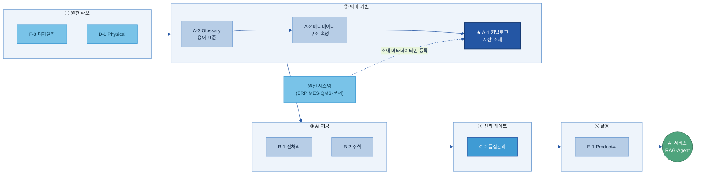

| 조직 | 역할 |
|---|---|
| **지주/전사 데이터 조직** | 카탈로그 공통 표준·항목·거버넌스 정의. 계열사 간 일관성 확보 |
| **계열사 데이터 담당** | 자사 데이터 자산 등록·분류·갱신 운영. 오너 지정 지원 |
| **현업 데이터 오너** | 자신이 책임지는 자산의 등록 정보 확인·승인·갱신 요청 |
| **AI 과제 수행자 / 분석가** | 카탈로그로 활용 가능한 데이터 탐색. 미등록 자산 발견 시 등록 요청 |
| **데이터 스튜워드(Data Steward)** | 도메인별 등록 품질·분류 체계 관리 |

**관련 개념과 카탈로그의 관계 (한눈에)** — 카탈로그는 첫 주제이므로, 자주 함께 쓰이는 두 개념을 간단히 짚고 간다(상세는 각 주제 가이드에서).

| 개념 | 한 줄 정의 | 카탈로그와의 관계 |
|---|---|---|
| **A-1 데이터 카탈로그** *(이 주제)* | 데이터 자산의 **소재·오너·접근경로**를 모아 찾게 하는 목록 체계 ("어디에 무엇이 있나") | — |
| **[A-2 메타데이터](../A-2%20메타데이터/A-2%20메타데이터.md)** | 자산의 **구조·형식·단위·의미** 등 속성을 설명하는 정보 ("이 데이터가 어떻게 생겼나") | 카탈로그가 모으는 등록 항목이 곧 메타데이터다. 카탈로그는 그중 *찾기용* 항목을, A-2는 *상세 속성·표준*을 담당 |
| **[A-3 비즈니스 Glossary](../A-3%20비즈니스%20Glossary/A-3%20비즈니스%20Glossary.md)** | 업무 **용어의 표준 정의·동의어**를 통일한 사전 ("'결함'='불량'='NG'") | 카탈로그의 검색어·태그를 표준 용어로 연결해, 현장 용어로 검색해도 같은 자산을 찾게 함 |

> 한 문장 요약: **Glossary(용어 뜻) → 메타데이터(자산 속성) → 카탈로그(자산 소재·탐색)** 순으로 쌓이며, 카탈로그는 이 정보들을 모아 "찾을 수 있게" 만드는 입구다.

---

## 2. 왜 필요한가 (Why)

**👉 한 줄 요약:** 카탈로그가 없으면 AI 과제의 절반이 "데이터 찾기"에서 소모된다 — 이 낭비를 없애고, AI가 스스로 데이터를 찾을 수 있는 토대를 만드는 것이 카탈로그의 핵심 가치다.

### 2.1 현업 Pain Point

AI 과제 **초기 단계의 가장 큰 병목은 "데이터의 존재 여부와 위치를 모르는 것"**이다. 두산전자는 CCL(Copper Clad Laminate = 동박적층판)을 제조한다. AI 과제팀이 "동박 두께 불균일 결함 예측 모델"을 착수했다. 필요한 데이터는 MES 공정 조건, QMS 검사 결과, LIMS 재료 시험, SharePoint 품질 보고서 — 모두 다른 시스템에 흩어져 있다.

**카탈로그가 없으면 다음 네 가지 문제가 반복된다:**

**Pain 1 — 존재 여부 불확실:** "그런 데이터가 있나요?"라는 질문에 답할 수 있는 사람이 없다. 있을 것 같아서 찾아보면 없고, 없을 것 같아 포기했는데 나중에 발견된다.

**Pain 2 — 위치 파편화·탐색 불가:** 데이터가 MES·QMS·LIMS·SharePoint·파일서버·담당자 PC에 흩어져 있다. 목록이 없으므로 사람을 통해 물어보는 것이 유일한 탐색 방법이다.

**Pain 3 — 오너·접근 경로 불명확:** 데이터가 어디 있는지 알아도, 누구에게 어떻게 신청하는지가 불명확하다.

**Pain 4 — 중복 수집·가공 반복:** 두 번째 AI 과제팀이 같은 MES 데이터를 필요로 한다. 첫 번째 팀이 이미 정제한 데이터가 있지만 공유 목록이 없어 모른다. 다시 수집·정제하는 중복 작업이 발생한다.

> **정량 지표:** 데이터 전문가들은 프로젝트 시간의 약 **20%를 데이터 찾기에 낭비**한다 — 주간 기준 약 1일 (Atlan Modern Data Survey) [[src-KPI-005](https://atlan.com/modern-data-catalog/)]. 대규모 조직일수록 수많은 데이터 자산이 여러 시스템에 흩어져 있지만, 전체를 아우르는 목록이 없어 "있는지조차 모르는" 경우가 많다.

### 2.2 기대 효과

**① 탐색 리드타임(Lead Time) 단축**

> **용어 풀이:** 리드타임(Lead Time) = 어떤 작업을 시작하고 완료하기까지 걸리는 총 시간.

카탈로그가 갖춰지면 AI 과제 착수 첫날 태그 검색 한 번으로 자산 목록과 오너·접근 경로를 확인할 수 있다. 데이터 **검색 시간이 60% 단축**(주당 5시간 → 2시간)된 사례 [[src-KPI-004](https://www.decube.io/post/data-catalog-roi)], 자동 수집을 도입해 **초기 카탈로깅 시간을 65% 줄인** 사례 [[src-KPI-005](https://atlan.com/modern-data-catalog/)]가 보고된다.

🏭 **두산전자 예시:** 동박 결함 예측 AI 과제 착수 시 데이터 소재 파악에 소요되는 시간이 7~8일 → **1일 이하**로 단축된다.

**② 데이터 중복 제거 및 재사용**

기존 AI 과제에서 이미 전처리한 데이터를 **카탈로그에서 식별·재활용**할 수 있게 해, 같은 데이터를 다시 수집·전처리하는 중복 작업을 막는다. 품질보증팀이 정제한 "월별 수율 집계 테이블"이 카탈로그에 등록되면, 신규 원가분석 과제팀이 ERP에서 다시 추출·정제하지 않고 바로 쓸 수 있다.

**③ AI 자동 탐색의 토대**

AI(RAG 검색, Agent)는 사람처럼 "옆자리에 물어볼" 수 없다. **기계가 읽을 수 있는(machine-readable) 목록**이 없으면 자동 탐색이 원천적으로 불가능하다. 카탈로그가 AI Agent의 데이터 탐색 인프라가 된다.

> **용어 풀이:** RAG(Retrieval-Augmented Generation = 검색 증강 생성) — AI가 답변을 생성하기 전에 관련 데이터·문서를 먼저 검색해서 참조하는 방식.

**④ 신뢰 가능한 데이터 활용**

갱신 주기·업데이트 시점·데이터 소유자 등의 정보를 통해 **데이터 관리 현황을 확인**하고 **데이터 신뢰도를 확보**한다. "이 데이터를 믿어도 되나?"(최신인가? 오너가 있는가? 접근이 허가된 데이터인가?)를 빠르게 판단할 수 있다.

> **🏢 자회사 입장에서 — 이 가이드를 적용하면:** ① AI·분석 과제 착수가 *주 단위에서 일 단위로* 빨라지고, ② 이미 만든 데이터를 재활용해 *중복 작업·비용*을 줄이며, ③ "데이터가 어디 있는지 아는 사람에게만 의존"하던 구조에서 벗어나 *담당자가 바뀌어도* 데이터를 찾을 수 있다. → 카탈로그는 **자회사가 가장 먼저, 가장 적은 비용으로 체감 효과를 얻는** 출발점이다.

---

## 3. 무엇을 갖추나 (What — 등록 항목·구성)

**👉 한 줄 요약:** 카탈로그는 4가지를 갖춘다 — ① 탐색 체계(어떻게 찾나) ② 등록 항목(무엇을 기록하나) ③ 분류 기준(어떻게 나누나) ④ AI 활용 식별 항목(AI가 재사용해도 되나). 이 문서 전체가 이 4요소 모델을 일관되게 재사용한다. (여기서 "등록 항목"은 데이터를 설명하는 정보, 즉 1.3에서 정리한 메타데이터다.)

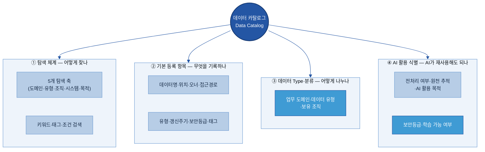

### 3.1 카탈로그 조회 방식 (검색·탐색 화면 구성)

**👉 한 줄 요약:** 탐색은 두 경로로 이루어진다 — "키워드/태그로 바로 검색"과 "분류 축을 따라 좁혀가는 브라우징". 실제 사용 시에는 두 경로가 혼합된다.

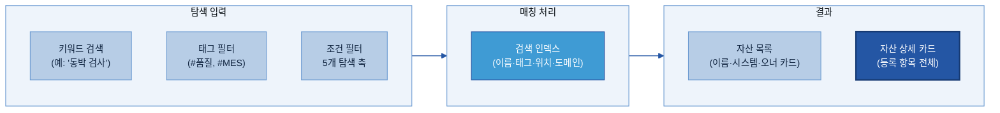

🏭 **두산전자 탐색 시나리오:** AI 과제자 이OO 선임이 동박 결함 예측 모델을 개발하려 한다. 카탈로그 탐색 화면에서 ① 업무 도메인 = "품질보증" 필터 → ② 시스템 = "MES" 필터 → ③ 태그 `#검사` 입력 → 3개 자산(`INSP_RESULT`, `DEFECT_HIST`, `LOT_JUDGE`)이 즉시 표시 → 각 자산의 오너·접근 경로 확인 → 권한 신청 착수. **총 소요 15분** (이전: 담당자 수소문 3일).

> 탐색 체계는 데이터의 의미 해석("이 필드가 무슨 뜻인지")을 제공하지 않는다. 그것은 [A-2 메타데이터](../A-2%20메타데이터/A-2%20메타데이터.md)와 [A-3 Glossary](../A-3%20비즈니스%20Glossary/A-3%20비즈니스%20Glossary.md)의 역할이다.

### 3.2 항목 구성 기준 (찾기 위한 최소 정보 — 5갈래)

**👉 한 줄 요약:** 카탈로그에 등록하는 정보는 성격에 따라 5갈래로 나뉜다 — 업무·기술·운영·보안·AI. 카탈로그는 이 중 *자산을 찾고 관리하는 데* 필요한 항목을 골라 등록한다.

업계 표준(DCAT-US v1.1 [[src-구성-002](https://resources.data.gov/resources/dcat-us/)], ISO/IEC 11179 [[src-구성-006](https://en.wikipedia.org/wiki/ISO/IEC_11179)])과 AI-Ready 5대 차원 [[src-구성-008](https://www.dawiso.com/glossary/ai-ready-data)]을 토대로 5갈래로 정리하면:

| 항목 갈래 | 포함하는 항목 | 필수/선택 |
|------|------|-----------|
| **업무(Business)** | 자산명·도메인·설명·활용 목적 | 필수(일부) |
| **기술(Technical)** | 보유 시스템·저장 위치·데이터 유형·주요 컬럼 | 필수(일부) |
| **운영(Operational)** | 오너·보유 부서·접근 경로·갱신 주기·태그 | 필수 |
| **보안/컴플라이언스(Compliance)** | 보안 등급·개인정보 포함 여부·사용 목적 제한 | 필수 |
| **AI 활용(AI)** | AI 활용 가능 등급·전처리 필요 여부·Lineage 연결 | 선택 → 고도화 시 보강 |

> 항목의 *상세 정의·표준 스키마*(필드 단위 의미·단위·형식)는 [A-2 메타데이터](../A-2%20메타데이터/A-2%20메타데이터.md)가 더 깊이 다룬다 — 카탈로그는 "찾기에 필요한 만큼"만 담는다.
>
> 핵심 원칙: 항목 수가 너무 많으면 등록 부담으로 공백이 늘고, 너무 적으면 탐색에 쓸 정보가 없다. **필수 항목 10개를 공백 없이 채우는 것이, 항목 30개 중 절반이 빈 것보다 낫다.**

### 3.3 기본 등록 항목 (데이터명·시스템·위치·오너·접근경로·갱신주기)

**👉 한 줄 요약:** 자산 1건을 등록할 때 채우는 최소 정보 집합 — "이 데이터가 어디에 누구 책임으로 있으며 어떻게 접근하는가"를 기록한다. *(Key Question 2)*

> **이 표 보는 법(현업 실행 키트 ㉠ 항목 사전):** `필수`는 안 채우면 등록 거부되는 최소 항목, `선택`은 있으면 탐색이 좋아지는 항목이다. **작성 주체**는 *누가 채우는가* — 🤖 **자동**(플랫폼이 수집, 사람은 확인만) / 👤 **오너**(현업이 직접 입력) / 🔐 **보안**(보안·거버넌스 조직)으로 나눈다. 핵심은 §4.6과 같다 — **사람이 다 채우는 게 아니라, 자동으로 채워진 것 위에 사람은 의미·책임·보안만 보탠다.**

| # | 항목 | 쉬운 의미 | 필수/선택 | 작성 주체 | 두산전자 완성 예시 |
|---|------|------|:---:|:---:|-------------------|
| 1 | **데이터명** | 자산을 부르는 공식 이름. 약어만 쓰지 않는다 | 필수 | 🤖→👤 | `일일 품질검사 결과 (INSP_RESULT)` |
| 2 | **보유 시스템** | 자산이 존재하는 시스템 (솔루션명+용도) | 필수 | 🤖 | `MES (생산 실행 시스템)` |
| 3 | **저장 위치** | 테이블명·폴더 경로·DB 스키마 등 실제 위치 | 필수 | 🤖 | `QMS.dbo.INSP_RESULT` |
| 4 | **데이터 오너** | 이 자산의 정확성·접근 정책을 책임지는 사람 | 필수 | 👤 | `품질보증팀 김OO 책임` |
| 5 | **보유 부서** | 오너가 속한 관리 조직 | 필수 | 🤖→👤 | `품질보증팀` |
| 6 | **접근 경로** | 이 자산에 접근하는 절차·방법 | 필수 | 👤 | `인트라넷 → 데이터 신청 → QMS 조회 권한 신청 (1일 이내 승인)` |
| 7 | **데이터 유형** | 정형/문서/이미지/시계열/반정형 등 | 필수 | 🤖 | `정형(Table)` |
| 8 | **갱신 주기** | 얼마나 자주 업데이트되는가 | 선택 | 🤖 | `일 1회 (전일 생산 마감 후 00:30 반영)` |
| 9 | **보안 등급** | 민감도·공개 수준 (공개/사내/대외비/기밀) | 필수 | 🔐 | `대외비` |
| 10 | **태그** | 탐색·필터에 쓰이는 키워드 (표준값에서 선택 → §3.6) | 선택 | 👤 | `#품질 #검사 #동박 #MES #제조` |

> ▸ 전체 등록 항목 사전(기술·비즈·운영 + 비정형 자산까지 30여 항목)은 [[Appendix A] 등록 항목 사전 (전체)](#appendix-a)에. 본문은 현업이 가장 먼저 채우는 핵심 10개만 둔다.

**🏭 두산전자 완성 카드 예시:**

```
════════════════════════════════════════════════════
 자산 ID    : DSEL-QMS-001
 데이터명   : 일일 품질검사 결과 (INSP_RESULT)
── 소재·접근 ──────────────────────────────────────
 보유 시스템 : QMS (Quality Management System)
 저장 위치   : QMS.dbo.INSP_RESULT
 접근 경로   : IT Portal → DB 계정 신청 → DBA 승인 → 읽기전용 계정 (2영업일)
── 오너·조직 ──────────────────────────────────────
 데이터 오너 : 품질보증팀 김OO 책임   ☎ 내선 3-2241
 보유 부서   : 품질보증팀
── 갱신·이력 ──────────────────────────────────────
 갱신 주기   : 일 1회 (MES → QMS 야간 배치, 02:00)
 데이터 기간 : 2018-01-01 ~ 현재
── 보안·권한 ──────────────────────────────────────
 보안 등급   : 대외비   개인정보: 없음
 AI 학습 가능: 가명화 후 가능 (고객 로트코드 마스킹 조건)
── 탐색 ───────────────────────────────────────────
 태그        : #품질 #검사 #결함 #동박 #CCL
 도메인      : 품질   유형: 정형 — 판정 결과
════════════════════════════════════════════════════
```

### 3.4 데이터 분류 기준 (업무 도메인·데이터 유형·보유 조직)

**👉 한 줄 요약:** 분류 기준은 탐색을 좁혀가는 "필터 축"이 된다 — 잘 설계된 분류 체계가 있어야 "품질 도메인 > 정형 > MES"처럼 단계적으로 좁혀가는 탐색이 작동한다. *(Key Question 4)*

> 정형/문서/이미지 같은 **데이터 유형**은 그 자체가 탐색 필터 축의 하나로 쓰인다. 유형별 내부 구조·스키마까지 깊이 들어가는 것은 [A-2 메타데이터](../A-2%20메타데이터/A-2%20메타데이터.md)의 영역이다.

| 탐색 축 | 의미 | 두산전자 예시 값 |
|---------|------|-----------------|
| **업무 도메인** | 어떤 업무 영역인가 | 품질보증 / 생산 / 설비관리 / 원가 / 구매 / 영업 |
| **데이터 유형** | 어떤 형태인가 | 정형 / 문서 / 이미지 / 시계열 / 반정형 |
| **보유 조직** | 어느 부서가 관리하는가 | 품질보증팀 / 생산기술팀 / IT팀 / 구매팀 |
| **시스템** | 어느 시스템에서 나온 데이터인가 | SAP / MES / QMS / LIMS / SharePoint / 데이터레이크 |
| **활용 목적** | 어떤 AI·업무 과제에 쓰이는가 | 품질 예측 / 설비 예지보전 / 원가 분석 / 클레임 분석 |

이 5개 탐색 축은 등록 항목(3.3)의 도메인 태그·데이터 유형·보유 부서·보유 시스템 필드에서 자동으로 채워진다. 등록 항목이 잘 채워져 있어야 탐색 체계가 작동한다.

| 유형 | 두산전자 예시 | AI 활용 시 특이사항 |
|------|---------------|---------------------|
| 정형(Structured) | INSP_RESULT, CLAIM_HIST | 컬럼 메타데이터(A-2) 연결 필수 |
| 문서(Document) | 결함 분석 보고서, SOP, FMEA | B-1 전처리 필요 |
| 이미지(Image) | 외관 결함 사진, 단면 이미지 | 라벨링(B-2) 필요 |
| 시계열(Time-series) | 동박 두께(1초), 설비 전류·진동 | 샘플링 주기·단위 정확성이 AI 성능에 직결 |
| 반정형(Semi-structured) | API 응답 JSON, 설비 알람 로그 | 스키마 파싱·전처리 필요 |

### 3.5 ★ AI 활용 식별 항목 (전처리 여부·원천 추적·AI 활용 목적)

**👉 한 줄 요약:** AI가 데이터를 재사용할 때 "이 데이터를 그대로 써도 되는지"를 빠르게 판단하도록 돕는 정보 항목이다 — 카탈로그의 AI-Ready 차별점.

기존 카탈로그가 "어디에 있는가"만 답한다면, AI-Ready 카탈로그는 추가로 "AI가 재사용해도 되는가"에 대한 **간단한 신호(flag)**를 함께 담는다. AI-Ready 데이터 5대 차원 [[src-구성-008](https://www.dawiso.com/glossary/ai-ready-data)]을 카탈로그가 담는 항목으로 표현하면:

| AI-Ready 차원 | 카탈로그 등록 항목 | 두산전자 예시 |
|---|---|---|
| **발견 가능성** | 비즈니스 설명·오너 기록·최신성 신호 | Description: "동박 라인 일일 외관·전기적 특성 검사 결과" |
| **데이터 리니지** | 원천 시스템·수집 방법·변환 이력 | 원천: MES.dbo.PROD_LOG → QMS 야간 배치 ETL(데이터 추출·변환·적재) |
| **전처리 여부** | AI 활용 가능 등급·전처리 필요 여부 | "전처리 필요 (결측치 처리, 코드 디코딩)" |
| **보안·접근 거버넌스** | 보안 등급·AI 학습 가능 여부·개인정보 포함 | "가명화 후 가능 (고객 로트코드 마스킹)" |
| **의미론·컨텍스트** | Glossary 링크·도메인 태그·스키마 문서 포인터 | A-2 메타데이터 링크, A-3 용어 표준 연결 |

> **⚠️ 범위 구분 (메타데이터·라벨링 주제와 중복 방지):** 카탈로그는 "AI가 이 자산을 *찾고 재사용 판단*하는 데 필요한 **요약 신호**"만 담는다 — 예: *전처리 필요 여부 O/X, AI 학습 가능 등급, 원천 시스템*. 학습/검증 분할·라벨 정의·필드 단위 변환 규칙 같은 **상세 AI/ML 메타데이터**는 카탈로그가 아니라 [A-2 메타데이터](../A-2%20메타데이터/A-2%20메타데이터.md)·B-2(데이터 해설/주석)가 담당한다. 카탈로그는 "있다·여기서 가져가라·이런 조건이다"까지, 상세 스펙은 인접 주제로 넘긴다.
>
> **Croissant 형식(MLCommons, 2024):** ML-Ready 데이터셋 전용 메타데이터 형식으로, 학습/검증/테스트 분할·Responsible AI 문서·인용 정보 등을 포함한다 [[src-구성-005](https://arxiv.org/html/2403.19546v1)]. 이런 상세 형식은 A-2 메타데이터의 영역이며, 카탈로그는 그 존재와 위치를 가리키는 포인터만 둔다.

🏭 **두산전자 예시:** `고객 클레임 이력(CLAIM_HIST)` — "AI 활용 가능 등급: 가명화 후 가능, 고객명·연락처 마스킹 조건". 이 신호 하나만 있어도 AI 과제팀이 별도 보안 협의 없이 전처리 조건을 미리 파악할 수 있다.

<a id="sec36"></a>
### 3.6 태그 표준값 목록 (자유입력 금지 — 고르는 값)

**👉 한 줄 요약:** 태그는 사람마다 다르게 쓰면 검색이 깨진다 — 그래서 **자유입력이 아니라 합의된 표준 목록(Key:Value)에서 고른다.** 현업은 "새 단어 만들기"가 아니라 "맞는 값 고르기"만 하면 된다.

> **왜 고르게 하나:** `대외비`/`기밀`/`confidential`을 사람마다 다르게 적으면 AI·검색이 같은 자산을 놓친다. 표준값으로 묶으면 검색 정확도와 보안 필터가 함께 작동한다. 목록에 없는 값이 필요하면 **만들지 말고** 데이터 관리조직에 추가를 요청한다(승인 후 등록).

| 태그 Key | 무엇을 구분 | 고르는 값(Value) 예 | 필수/선택 | 고르는 주체 |
|---|---|---|:---:|:---:|
| `sensitivity` | 보안 민감도 | `공개 / 사내 / 대외비 / 기밀` | 필수 | 🔐 보안 |
| `pii` | 개인정보 포함 여부 | `있음 / 없음` | 필수 | 🔐 보안 |
| `domain` | 업무 도메인 | `품질 / 생산 / 설비 / 원가 / 구매 / 영업` | 필수 | 👤 오너 |
| `data_type` | 데이터 형태 | `정형 / 문서 / 이미지 / 시계열 / 반정형` | 필수 | 🤖 자동 |
| `ai_usable` | AI 활용 가능 등급 | `그대로 가능 / 가명화 후 가능 / 불가` | 필수 | 🔐 보안 |
| `security_context` | 제조 특화 민감도 | `영업비밀(공정 레시피) / 협력사 민감 / 사내 공개` | 선택 | 🔐 보안·👤 오너 |
| `source_system` | 원천 시스템 | `SAP / MES / QMS / LIMS / SharePoint` | 선택 | 🤖 자동 |

> ▸ 이 목록은 카탈로그 탐색·보안 필터에 쓰는 **대표 7종**이다. 전사 표준 태그 사전(부여 주체·허용값 전체)은 [A-2 메타데이터](../A-2%20메타데이터/A-2%20메타데이터.md)·거버넌스 주제에서 묶어 관리하고, 카탈로그는 그중 *탐색·재사용 판단*에 필요한 값만 가져다 쓴다.

---

## 4. 어디부터 등록하나 (When/우선순위)

**👉 한 줄 요약:** 모든 데이터를 한 번에 등록하지 않는다 — "AI 활용 가능성·업무 중요도·재사용성" 세 축으로 우선순위를 정해, 핵심 자산부터 단계적으로 등록한다. *(Key Question 1)*

### 4.1 등록 대상 범위

카탈로그 구축에서 가장 흔한 실패는 "일단 다 넣자"로 시작하는 것이다. 등록 부담이 폭증해 등록이 멈추고, 오래된·오너 없는 항목이 쌓여 "검색해도 믿을 수 없다"는 인식이 생긴다.

**등록 대상 판단 기준:**

| 기준 축 | 판단 질문 | 두산전자 예시 |
|---|---|---|
| ① AI 활용 가능성 | AI 학습·추론·RAG·분석에 투입될 수 있는가 | MES 품질검사 결과, 고객 클레임 이력 |
| ② 업무 중요도 | 없으면 핵심 업무(생산·품질·원가)가 멈추는가 | SAP 원가 월마감, QMS 판정 이력 |
| ③ 재사용성 | 여러 팀·과제에서 반복 활용되는가 | LIMS 실험 결과, 동박 두께 시계열 |

> 세 축 중 **두 개 이상** 해당하면 등록 대상, 하나만 해당하면 Wave 2 후보, 없으면 후순위.

### 4.2 유형별 등록/제외

- **정형 DB 테이블:** 커넥터 자동 수집 가능 → 핵심 테이블 선별 후 전체 등록. 임시 뷰·로그성·운영 내부 테이블은 제외.
- **문서·보고서:** 정기 배포 보고서·표준 절차서·품질 분석 자료 등 재사용성 입증 문서만.
- **이미지:** "어떤 이미지가 어디에 얼마나 어떤 포맷으로" 등록. 세부 라벨링은 B-2 연결.
- **시계열:** 설비 ID·공정 ID·샘플링 주기·단위·경로 함께 등록. 설비·공정 단위로 묶어 등록.
- **제외 기준:** 개인 PC 임시 백업 / 중복 복사본 / 폐기 예정·사용 중단 / 테스트·더미 데이터.

### 4.3 정형 데이터 중요도 선별

| 선별 지표 | 측정 방법 | 두산전자 예시 |
|---|---|---|
| 사용 빈도 | 쿼리 로그·ETL 참조 횟수(최근 6개월) | `INSP_RESULT` 월 평균 400회 조회 |
| 연계 시스템 수 | 참조 시스템·파이프라인 수 | 품질검사 결과가 MES·BI·AI 3개 참조 |
| 다운스트림 영향도 | 오류 시 영향받는 보고서·서비스·모델 수 | 월 품질 KPI 리포트·결함 예측 모델 |

> **선별 기준(예시):** 세 지표 합산 상위 20% → Wave 1, 21~50% → Wave 2, 나머지 → Wave 3.

### 4.4 수집·등록 방식 (자동 vs 수동) *(Key Question 3)*

- **자동 수집(커넥터):** SAP·MES·QMS·LIMS 등 DB 기반 시스템은 솔루션 커넥터/JDBC(시스템 DB에 표준 방식으로 접속하는 연결 통로)로 스키마·테이블·통계를 자동으로 긁어온다(크롤). 신규 테이블·컬럼 변경이 자동 감지된다.
- **수동 등록(양식+오너):** SharePoint·파일서버·개인 파일 등 비정형 자산은 오너가 표준 양식으로 직접 입력.

### 4.5 보안 검토 (내부 학습 vs 외부 LLM 노출)

| 보안 등급 | 카탈로그 노출 범위 | 접근 통제 |
|---|---|---|
| 공개(Public) | 전체 항목 | 최소 인증 |
| 사내(Internal) | 전체 항목 | 임직원 인증 |
| 대외비(Confidential) | 소재(자산명·부서)만 — "요청 시 오너 문의" | 오너 승인 + 보안 검토 |
| 기밀(Highly Restricted) | 미등록 또는 별도 격리 카탈로그 | 별도 통제 |

🏭 **예시:** `CS.CLAIM_HIST`(고객사명·단가 포함)는 대외비 → 카탈로그엔 "고객 클레임 이력(CS팀 박OO, 대외비)"만 표시, 접근은 오너 승인 후.

### 4.6 최종 우선순위 — ★사람이 다 찾아 등록하지 않는다 (자동 수집 우선)

**👉 한 줄 요약:** 등록 대상이 수백 건이라고 사람이 일일이 다 찾아 입력하는 것이 아니다 — **메타데이터의 약 70~90%는 솔루션이 자동 수집**하고, 사람은 *비즈니스 의미·보안 등급·최종 검수*만 맡는다.

| 자동화 메커니즘 | 자동으로 채워지는 것 | 사람이 하는 것 |
|---|---|---|
| 커넥터 자동 스캔 | 원천에서 스키마·컬럼·타입·건수·갱신일 추출 | 도메인·태그·오너 확정 |
| 로그 기반 중요도 | 쿼리·ETL·BI 로그로 사용 빈도·Tier 자동 계산 | Tier 임계값 조정 |
| Lineage 자동 추출 | ETL·SQL 파싱으로 데이터 흐름도 자동 생성 | (상세 추적은 C-3) |
| AI 메타 초안 생성 | LLM이 Description·태그·품질 코멘트 초안 제시 | 초안 승인·수정 |
| 템플릿 배치 수집 | 비정형은 엑셀 템플릿 일괄 업로드, 이후 스케줄 자동 갱신 | 신규 자산 최초 1회 등록 |

> **핵심 재정의:** 카탈로그 운영은 "전수 입력"이 아니라 **"자동 수집 → 사람 검수·승인"**이다. 사람은 기계가 모르는 것(업무 맥락·보안 판단·최종 책임)에만 개입한다. 수동 문서화 기반(passive) 메타데이터의 정확도는 **60~70% 수준**에 그치고 생성 직후부터 빠르게 노후화되는 반면, 자동 수집·갱신(active) 방식은 90% 이상까지 높아진다 [[src-KPI-005](https://atlan.com/modern-data-catalog/)].

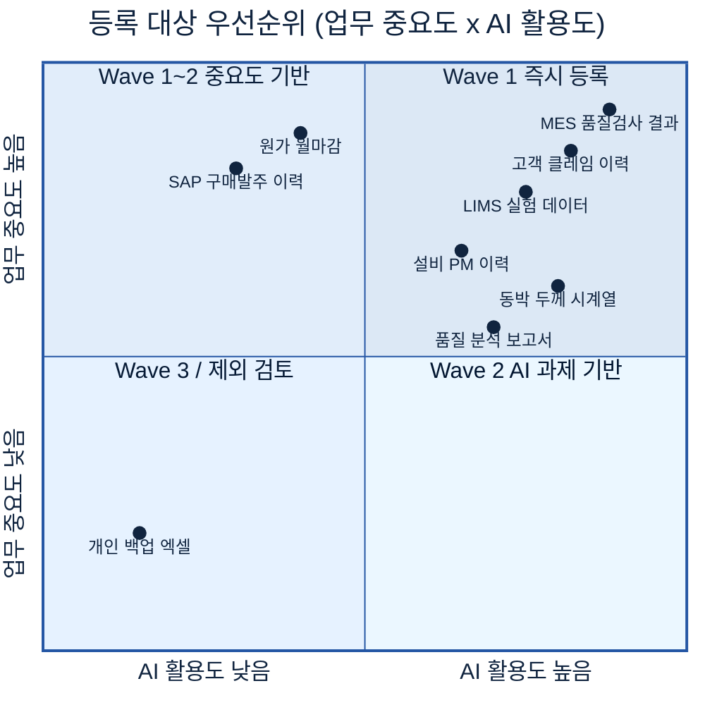

| Wave | 시기 | 대상 | 두산전자 예시 |
|---|---|---|---|
| Wave 1 | 1~3개월 | AI·업무 중요도 모두 높은 핵심 50~100건, 자동 수집 DB 중심 | MES 품질검사, 클레임, LIMS 실험, SAP 원가 |
| Wave 2 | 4~9개월 | 한쪽이 높은 자산 100~200건, 문서·시계열 포함 | 설비 PM, SharePoint 보고서, 동박 시계열 |
| Wave 3 | 10개월~ | 나머지 + On-Demand | 구매 발주 이력, 아카이빙 예정 레거시 |

🏭 **두산전자 Wave 1 목표:** 핵심 100건을 3개월 내 등록. 커넥터로 SAP·MES·QMS 80건 자동 + SharePoint 보고서 20건 수동.

---

## 5. 예시 시나리오 — 두산전자 적용 흐름

**👉 한 줄 요약:** 카탈로그 도입 전/후를 두산전자 AI 과제 착수 상황으로 보여준다 — 효과 확인 후 6~8절의 구체적 구축·운영 방법으로 넘어간다.

### 5.1 적용 전/후 대비

**AS-IS (카탈로그 없음 — 7~8일):**

두산전자 AI 과제팀이 "동박 결함률 예측" 착수 시, 데이터 소재 파악에만 7~8일이 소모된다.

| 필요 데이터 | 있을 것으로 예상 | 실제 상황 |
|---|---|---|
| 공정 조건(온도·압력·속도) | MES | "MES에 있을 텐데 담당자 바뀌어 테이블명 모름" |
| 두께 검사 결과 | QMS | "QMS에 있는데 어느 테이블인지 개발팀에 물어봐야" |
| 재료 시험 데이터 | LIMS | "R&D팀 별도 관리, 공유 경로 불명" |
| 결함 분석 보고서 | SharePoint·파일서버 | "담당자 PC에도 있고 SP에도 일부, 최신본 불명" |
| 고객 클레임 이력 | C/S 시스템 | "존재는 알지만 접근 권한 신청 방법 아무도 모름" |

**TO-BE (카탈로그 있음 — 4~6시간):**

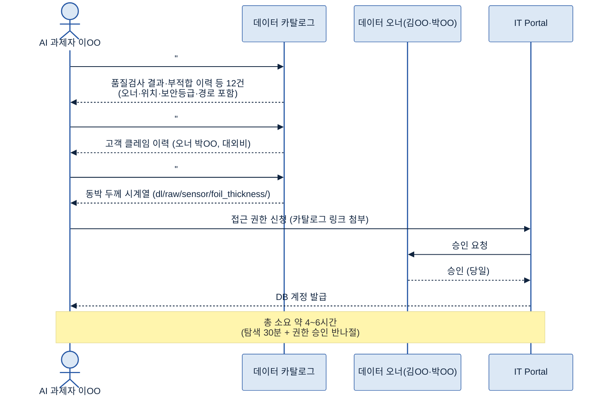

| 항목 | AS-IS | TO-BE |
|---|---|---|
| 데이터 존재 파악 | 구두 문의 2~3일 | 키워드 검색 3분 |
| 위치·테이블 확인 | IT 통해 1~3일 | 카드 즉시 조회 |
| 오너 파악 | 부서 전달·불확실 | 오너 필드 즉시 |
| 전체 탐색 리드타임 | **7~8일** | **4~6시간** |

### 5.2 흐름 미리보기 (원천 자동 수집 → 오너 채우기 → 분류 → AI·현업 탐색)

카탈로그 구축과 운영의 전체 흐름을 한 장으로 정리하면:

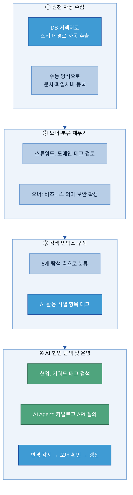

> 이 흐름의 세부 구현이 6절(솔루션 선정)·7절(구축)·8절(운영)에서 다뤄진다.

---

## 6. 솔루션 선정

**👉 한 줄 요약:** 솔루션은 "현재 원천 시스템과의 커넥터 범위 · 자동 메타 수집 · 계열사 확장성" 기준으로 고르고, 반드시 두산 실제 원천 2~3종 연결 PoC(Proof of Concept = 사전 검증)로 검증한 뒤 도입한다.

> 🔗 **2층 연결:** 이 절은 *카탈로그 주제 관점의 기능 비교*(1층)다. 같은 솔루션을 메타데이터·용어집·계통 등 다른 주제와 **묶어서 솔루션 자체로 평가·선정**하려면 → [Tech Stack 비교 정본](../../전체%20목차/01%20Tech%20Stack%20비교%20(솔루션×주제).md) (Part B 매트릭스·Part C 묶음 비교). 이 절에서 새로 조사된 솔루션은 정본 Part A에도 반영한다.

### 6.1 솔루션 유형·적용 범위

| 유형 | 특징 | 대표 솔루션 | 두산 관점 |
|---|---|---|---|
| **전용 카탈로그** | 거버넌스·용어집·승인 워크플로 완성도. 구축 3~6개월 [[src-솔루션-007](https://atlan.com/data-catalog-tools/)] | [Collibra](https://www.collibra.com), [Alation](https://www.alation.com), [Informatica CDGC](https://www.informatica.com/products/data-governance/cloud-data-governance-and-catalog.html), [Atlan](https://atlan.com), [IBM Knowledge Catalog](https://www.ibm.com/products/watsonx-data-intelligence/governance-catalog) | 거버넌스 성숙 조직, 대규모 계열사 |
| **클라우드 네이티브** | 해당 클라우드 서비스와 강력히 통합. 타 클라우드 제한 [[src-솔루션-007](https://atlan.com/data-catalog-tools/)] | [Microsoft Purview](https://learn.microsoft.com/en-us/purview/unified-catalog), [AWS Glue Data Catalog](https://aws.amazon.com/glue/features/), [Google Knowledge Catalog](https://docs.cloud.google.com/dataplex/docs/catalog-overview), [Databricks Unity Catalog](https://www.databricks.com/product/unity-catalog) | 단일 클라우드 환경, Azure 활용 계열사 |
| **오픈소스** | 라이선스 무료. 직접 운영에 전담 인력 0.5~1명(FTE = 한 사람 풀타임 환산) 필요 [[src-솔루션-001](https://thedataguy.pro/blog/2025/08/open-source-data-governance-frameworks/)] | [DataHub](https://datahub.com), [OpenMetadata](https://open-metadata.org) | 엔지니어링 역량 있는 IT팀 |

> 구축·기능·가격은 버전마다 변동되므로 **반드시 공식 문서·벤더 데모·PoC로 직접 확인**한다.

### 6.2 후보 검토·기능 비교

**핵심 비교 기준 7가지:**

① **커넥터 범위** (SAP·MES·QMS·LIMS·SharePoint 지원 여부)
② **자동 메타 수집** (스키마 자동 크롤·갱신)
③ **검색·탐색 UX** (자연어 검색·다중조건 필터)
④ **권한·거버넌스** (RBAC — 역할 기반 접근 제어)
⑤ **Lineage 연계** (C-3와의 연동)
⑥ **AI 기능** (자동 태깅·자연어 탐색·메타 초안 생성)
⑦ **계열사 확장성** (멀티 도메인)

**두산전자 환경 기준 후보 3종 비교** (Azure Data Lake Gen2 + Oracle/MS SQL + SharePoint Online, 데이터 조직 1년차):

| 평가 기준 | [Microsoft Purview](https://learn.microsoft.com/en-us/purview/unified-catalog) | [DataHub](https://datahub.com)(오픈소스) | [Atlan](https://atlan.com)(SaaS) |
|---|:---:|:---:|:---:|
| Azure·M365 연계 | ★★★★★ | ★★★ | ★★★★ |
| Oracle/MS SQL 커넥터 | ★★★★ | ★★★★ | ★★★★ |
| LabWare LIMS 연계 | ★★(수동) | ★★(커스텀) | ★★★(API) |
| 검색·탐색 UX | ★★★★ | ★★★ | ★★★★★ |
| 운영 부담 | ★★★★ | ★★(자체 운영) | ★★★★★ |
| AI 자연어 탐색 | ★★★★(Copilot) | ★★★ | ★★★★ |

> Purview: 데이터 조직 1년차라 운영 부담 최소화가 중요 → Azure 환경이면 추가 인프라 없이 시작 가능. 단 LabWare LIMS 연계는 Custom 수집 스크립트가 필요하므로 PoC에서 확인 필요.

Gartner Magic Quadrant for Data and Analytics Governance Platforms 2025~2026 Leaders: Collibra, Alation, Informatica, IBM(2026), Atlan(2026 신규 편입) [[src-솔루션-008](https://www.informatica.com/about-us/news/news-releases/2025/01/20250113-informatica-named-a-leader-in-2025-gartner-magic-quadrant-for-data-and-analytics-governance-platforms.html)].

### 6.3 평가·선정·PoC 기준

**평가 4단계:** 기능 비교(RFI·데모) → 후보 2~3개 압축 → PoC(실제 원천 연결) → 최종 결정(PoC 결과 + TCO[총소유비용: 도입·운영 전체 비용] + 벤더 지원 + 운영 역량 종합)

🏭 **두산전자 PoC 검증 시나리오:**

| 검증 항목 | 방법 | 합격 기준 |
|---|---|---|
| 원천 연결 | SAP+MES+SharePoint 커넥터 | 3개 연결 성공, 스키마 자동 수집 |
| 자동 수집률 | Wave 1 대상 50개 크롤 | 스키마·건수·갱신일 90%+ |
| 검색 정확도 | "품질검사"·"동박 두께"·"클레임" | 관련 자산 상위 3건 내 |
| 권한 연동 | 보안 등급별 노출 통제 | 대외비 위치·경로가 무권한자에 숨김 |
| 수동 등록 | SharePoint 문서 10건 | 건당 5분 이내 |

---

## 7. 구축

**👉 한 줄 요약:** "어디에 무엇이 있는지"를 기계가 읽을 수 있게 만드는 과정 — ⓪ 등록할 메타데이터 항목 정의 → ① 수집한 메타데이터 검토·정합성 보완 → ② 아키텍처 설계 → ③ 파이프라인 구축 → ④ 초기 적재·검증 순으로 완성한다.

> **구축 대상은 데이터가 아니라 "메타데이터"다.** 카탈로그 구축은 원천 데이터를 옮겨 담는 작업이 아니라, *각 자산을 설명하는 메타데이터를 모아 탐색 가능하게 만드는* 작업이다. 따라서 첫 단계는 "**어떤 메타데이터 항목을 등록할지**"를 정하는 것이다.

#### 7.0 등록할 메타데이터 항목(스키마) 정의·작성

본격 수집에 앞서, 3.2~3.3에서 정한 **메타데이터 항목(필드)**을 자산 유형별로 확정한다 — 어떤 항목을 필수/선택으로 둘지, 입력 양식과 작성 기준(예: 데이터명 표기 규칙, 보안 등급 정의)을 정한다. 이 단계가 빠지면 사람마다 다른 형식으로 입력해 탐색이 깨진다.

- **누가 (7.5 역할과 연결):** 항목 표준·필드 정의는 **카탈로그 관리자(A/R)**, 자산별 실제 작성은 **데이터 오너(R)**, 도메인·태그 보완은 **스튜워드(A/R)**.
- 🏭 두산전자: "정형 DB는 10개 필수 항목, 문서는 7개 필수 항목" 식으로 유형별 양식을 먼저 확정한 뒤 등록에 착수.

### 7.1 수집한 메타데이터 검토·정합성 보완

4장에서 만든 초기 인벤토리를 등록 기준으로 다시 점검한다.

| 점검 항목 | 내용 | 두산전자 예시 |
|---|---|---|
| 필수 항목 충족 | 데이터명·위치·오너·경로·유형·갱신주기 | 품질검사 테이블 오너 "미정" 발견 |
| 위치 유효성 | 시스템·테이블·폴더 경로 현재 유효 | 구형 LIMS 이관 후 경로 변경 확인 필요 |
| 분류·태그 일관성 | 탐색 축 태그 누락·중복 없음 | `#품질`과 `#QA` 혼재 → 통일 필요 |
| 중복 등록 후보 | 동일 자산 시스템만 다르게 2회 | MES·QMS 동시 집계 자산 확인 |
| 보안 등급 공백 | 민감 자산 등급 누락 | 클레임 이력 등급 미설정 발견 |

🏭 200건 초기 인벤토리 중 보통 20~30%에서 오너 공백·경로 오류·태그 혼용이 발견된다. 보완 프로세스: 스튜워드 보완 목록 작성 → 오너에 요청(마감일 명시) → 업데이트 → 미응답 시 부서장 에스컬레이션.

### 7.2 To-Be 아키텍처 (솔루션 기반)

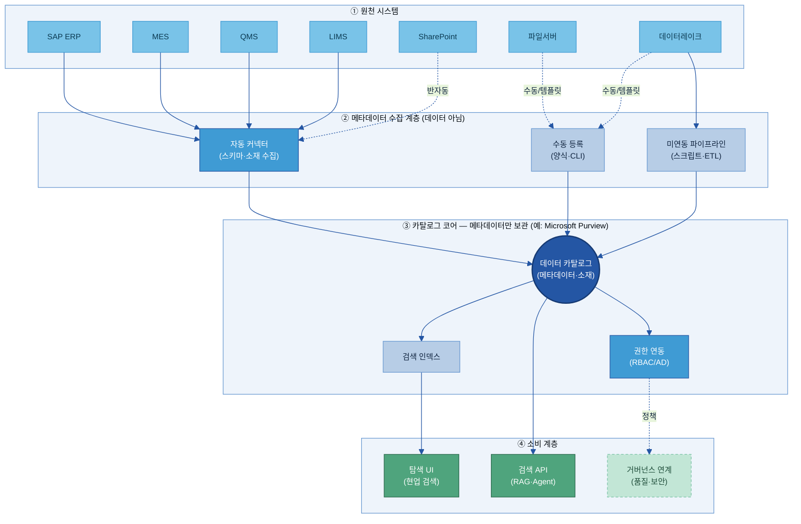

| 계층 | 역할 | 설계 포인트 |
|---|---|---|
| ① 원천 | 자산(실제 데이터)이 머무는 곳 — **데이터는 여기 그대로 둔다** | 원천별 연결 방식(커넥터·API·수동) 결정 |
| ② 수집 | 원천에서 **메타데이터만** 카탈로그로 보내는 파이프라인 | 자동/수동/미연동 3경로 병존으로 100% 커버 |
| ③ 코어 | 메타데이터 등록·검색·권한 | 자산의 **소재 정보**를 집약(데이터 원본 아님) |
| ④ 소비 | 사람(UI)·기계(API) 출구 | AI 과제자·RAG·거버넌스 연결 |

> 위 그림에서 ②→③ 화살표가 나르는 것은 **데이터가 아니라 메타데이터(소재·스키마·오너 등)**다. 실제 데이터는 ① 원천에 그대로 있고, 이용자는 카탈로그에서 위치를 확인한 뒤 원천에 직접 접근한다.

### 7.3 Legacy 연동·미연동/수동 업로드 Pipeline *(Key Question 3)*

**레거시 DB 연동 순서:** ① 목록 식별 → ② 연결 가능성 평가(JDBC/ODBC 지원·읽기전용 계정·망 분리 여부) → ③ 방안 결정 → ④ IT·보안 승인

| 연동 방안 | 조건 | 두산전자 적용 |
|---|---|---|
| A. JDBC 직연동 | JDBC 지원 + 커넥터 존재 + 망 분리 없음 | SAP·MES·QMS |
| B. 메타 추출 스크립트 → API | JDBC 지원, 커넥터 없음 | LIMS(LabWare — Python 스크립트로 테이블·컬럼·갱신주기를 카탈로그 REST API에 주입) |
| C. 레이크 복제 후 레이크 커넥터 | JDBC 불가 또는 망 분리 | 구형 설비 시스템 |
| D. 수동 등록 | 비정형·개인 파일 | SharePoint 보고서, 파일서버 이미지 |

**미연동 파이프라인 설계 원칙:** 수집 주기(Daily/Weekly/Event)·실패 재시도·알림, 고유 식별자로 중복 방지, 파이프라인 자체도 카탈로그에 등록.

### 7.4 초기 적재·검증

단계: ① 벌크 적재(인벤토리 CSV/JSON 임포트 + 커넥터 초기 크롤) → ② 검증(등록 건수·필수 항목 공백·태그 정합·검색 동작) → ③ 현업 탐색 시연(과제자 2~3인).

**합격 기준(Wave 1):**
- 등록 완료율 90%+
- 필수 항목 충족 95%+
- 검색 정확도: 기준 키워드 10개 중 8개+ 상위 5결과 노출
- 권한 연동: 미권한 차단 정상

**두산전자 구축 Wave 일정:**

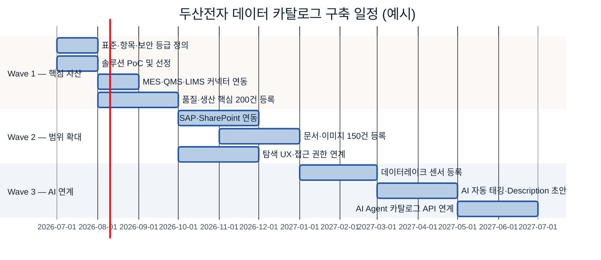

### 7.5 담당자 역할 (오너·현업·IT·보안·AI 조직 RACI)

> **RACI 기호:** R = Responsible(실행), A = Accountable(최종 책임·승인), C = Consulted(협의), I = Informed(통보)

| 활동 | 카탈로그 관리자 | 스튜워드 | 데이터 오너 | 이용자 |
|------|:---:|:---:|:---:|:---:|
| 등록 항목 표준·필드 정의 | **A/R** | C | C | I |
| 커넥터·자동 수집 개발 | **A/R** | I | I | — |
| 신규 자산 등록 (수동) | I | **A** | **R** | — |
| 자동 수집 후처리(도메인·태그·오너 초안) | I | **A/R** | C | — |
| 갱신 후보 확인·승인 | I | C | **A/R** | — |
| 정기 점검(분기 전체 정합성) | A | **R** | R | I |
| 이용자 접근 신청 승인 | I | I | **A/R** | — |
| 카탈로그 탐색·활용 | — | — | I | **R** |
| KPI 모니터링·리포팅 | **A/R** | C | I | I |

**역할별 핵심 업무 (실제 수행 작업 기준):**

| 역할 | 핵심 수행 업무 | 두산전자 배치(데이터 조직 1~2년차) |
|------|------|------|
| **카탈로그 관리자** | 등록 항목 표준·필드 정의, 커넥터·자동 수집 구축, 검색/권한 운영, KPI 관리 | 계열사 IT팀 + 지주 지원 |
| **데이터 스튜워드** | 자동 수집 결과 후처리(도메인·태그 정리), 정합성 점검, 메타데이터 품질 관리 | 계열사 데이터 담당자 1~2명 |
| **데이터 오너** | 담당 자산의 메타데이터(설명·보안등급) 작성·확인, 갱신 승인, 접근 신청 승인 | 자산별 실무 책임급 지정 |
| **이용자(AI 과제자·현업)** | 카탈로그 탐색·활용, 미등록 자산 발견 시 등록 요청, 설명 오류 피드백 | 과제팀·현업 부서 |

> 역할 간 책임은 7.5 RACI 표(위)에서 활동 단위로 명확히 나뉜다 — "누가 실행(R)하고 누가 최종 승인(A)하는가"를 활동별로 못박아, 등록·작성·품질·승인이 공백 없이 연결되게 한다.

### 7.6 잘 쓴 등록 vs 못 쓴 등록 (Before → After)

**👉 한 줄 요약:** 항목을 *채우기만* 하면 검색이 안 된다 — **무엇을·어떤 기준으로**가 드러나게 써야 사람도 AI도 찾는다. 아래 교정 예를 그대로 따라 쓰면 된다.

| 항목 | ❌ 이렇게 쓰면 (Before) | ✅ 이렇게 (After) | 왜 |
|---|---|---|---|
| 데이터명 | `INSP_RESULT` | `일일 품질검사 결과 (INSP_RESULT)` | 약어만 두면 검색·이해 불가 → 현업 용어 병기 |
| 설명 | `품질 관련 데이터` | `동박 라인 일일 외관·전기적 특성 검사 판정 결과 (로트 단위)` | "관련/주요/일부" 같은 모호어 금지, **무엇을·어느 단위로** 명시 |
| 갱신 주기 | `수시` | `일 1회 (전일 생산 마감 후 02:00 야간 배치)` | "수시·최근"은 신뢰 불가 → 시점·주기를 수치로 |
| 태그 | `#중요 #품질데이터` | `domain:품질 / sensitivity:대외비 / data_type:정형` | 자유 단어 금지 → 표준값에서 선택(§3.6) |

> **금지 표현:** `일부 · 대략 · 주요 · 관련 · 상세 · 최근` — 해석이 사람마다 갈린다. 측정 기준이 분명한 정량 표현으로 바꾼다.

### 7.7 실제로 어디서 채우나 — 플랫폼 매핑

**👉 한 줄 요약:** 위 항목 중 🤖 자동 항목은 **데이터 플랫폼이 이미 보관하는 시스템 메타데이터**에서 끌어온다 — 사람이 새로 적는 게 아니다.

- **Databricks(Unity Catalog):** `information_schema`(카탈로그→스키마→테이블→컬럼 계층의 이름·타입·소유자·생성/변경 시각)에서 🤖 항목을 자동 수집한다.
- **Snowflake·BigQuery·SAP** 등도 동일 성격의 시스템 카탈로그(`INFORMATION_SCHEMA` 등)를 제공하므로, 본 가이드의 항목을 각 플랫폼 필드에 **매핑만** 하면 같은 방식으로 적용된다.
- **카탈로그 솔루션(예: [Microsoft Purview](https://learn.microsoft.com/azure/purview/)·[Collibra](https://www.collibra.com))** 의 자동 커넥터가 이 시스템 메타데이터를 스캔해 등록 항목 🤖 칸을 채우고, 사람은 👤·🔐 칸(설명·오너·보안)만 보탠다.

---

## 8. 운영

**👉 한 줄 요약:** 카탈로그의 가치는 "처음 만든 순간"이 아니라 **현실과 일치하게 계속 살아 있는 동안** 발휘된다 — 변경 관리·갱신·점검 루프가 핵심이다. *(Key Question 5)*

### 8.1 변경 관리 (요청 → 검토·승인 → 반영)

| 변경 유형 | 트리거 | 처리 우선순위 |
|---|---|---|
| 신규 자산 생성 | 자동 감지/요청 | 보통(5영업일) |
| 자산 폐기·이관 | IT 통보/오너 요청 | 높음(1영업일) |
| 저장 위치 변경 | DB 이관/폴더 재구성 | 높음(1영업일) |
| 오너 변경 | HR 연동/요청 | 높음(3영업일) |
| 설명·태그 보완 | 이용자 피드백 | 낮음(10영업일) |
| 보안 등급 변경 | 정책/오너 요청 | 높음(1영업일) |

🏭 MES 업그레이드로 `INSP_RESULT`가 `MES_V2.dbo.INSP_LOG`로 이관 → IT가 3일 전 사전 통보 → 스튜워드 경로 변경 처리.

### 8.2 등록·검색·조회 운영 *(Key Question 4)*

**검색 품질 유지:** 월 1회 기준 키워드 10개로 검색 테스트. 미흡 시 태그·설명 보완. 신조어·약어는 [A-3 Glossary](../A-3%20비즈니스%20Glossary/A-3%20비즈니스%20Glossary.md) 동의어 사전과 연동 점검.

| 기능 | 운영 방식 |
|---|---|
| 키워드 전문 검색 | 이름·오너·태그·설명 대상 |
| 분류·필터 탐색 | 5개 탐색 축으로 좁히는 조건 필터 |
| 즐겨찾기·공유 | 자주 쓰는 자산 저장 |
| 인기 자산 표시 | 조회 로그 기반 자동 순위 |

### 8.3 전처리·분석·질의(RAG) 서비스 연계

카탈로그는 **소재 제공자**다. 전처리 파이프라인은 카탈로그 API로 위치·경로·갱신 주기를 확인하고, RAG/Agent는 "동박 불량 데이터 어디?" 질의 시 카탈로그 API로 자산 목록을 검색해 위치·경로를 받는다. **실제 데이터 처리·분석은 카탈로그 밖.** API 호출 시 인증 토큰 필수, 검색 결과에 보안 등급 기반 접근 제어 적용.

### 8.4 접근 권한·보안/운영 역할별 기능

두 층: **소재 정보 열람**(존재·이름·분류 표시 여부) / **상세 정보 열람**(경로·오너 연락처 표시 여부).

| 정보 유형 | 기본 공개 | 제한 |
|---|---|---|
| 존재·데이터명·도메인 | 전사 임직원 | 로그인 필수 |
| 경로·계정·오너 연락처 | 신청·승인 후 | 대외비↑는 소속 부서 한정 |
| "기밀" 자산 존재 | 관련 부서·관리자만 | 일반 이용자 검색 결과 비표시 |

> "열람은 되지만 접근은 불가" — 실제 데이터 접근 권한은 **C-2 데이터 품질관리**에서 신청·승인 통제.

### 8.5 최신화 (주기 갱신 vs 변경시점 자동 갱신·미등록 정기 점검) *(Key Question 5)*

**갱신 트리거 — 4가지 사건:**

| 트리거 | 발생 상황 | 카탈로그 갱신 내용 |
|--------|-----------|-------------------|
| **① 신규 생성** | 새 테이블/폴더/보고서 생성 | 신규 자산 항목 추가 (자동 수집 후 오너 지정) |
| **② 자산 폐기** | 시스템에서 삭제 | "폐기(Deprecated)" 상태로 변경. 이력 보존 |
| **③ 저장 위치 변경** | 테이블명·경로·시스템 변경 | 저장 위치 항목 갱신. 이전 경로 "이전됨" 상태 유지 |
| **④ 오너 변경** | 담당자 이동·퇴직·조직 개편 | 데이터 오너·보유 부서 항목 갱신. 공백 없이 후임 지정 |

**갱신 메커니즘:**

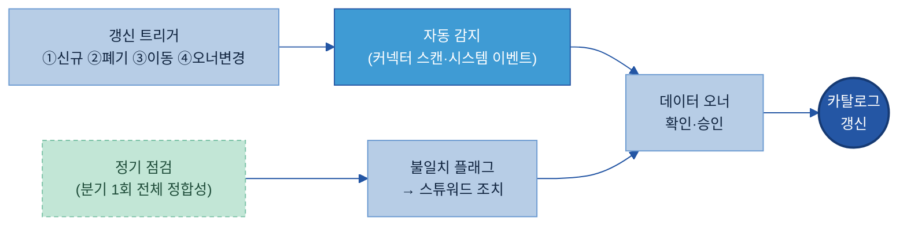

**수집 갱신 주기:**

| 원천 | 권장 주기 | 이유 |
|---|---|---|
| SAP | 주 1회 | 스키마 변경 드묾 |
| MES/QMS | 일 1회(새벽 2~4시) | 일 단위 집계 |
| LIMS | 일 1회 | 배치 완료 후 |
| SharePoint | 일 1회/Webhook | 문서 이벤트 잦으면 Webhook |
| 파일서버 | 주 1회 | 갱신 낮음·크롤 부하 |

**정기 점검(분기 1회):** ① 오너 재직 여부 ② 저장 위치 접근 가능 여부 ③ 갱신 주기 대비 실제 갱신 여부 ④ 미등록 신규 자산 존재 여부.

🏭 **최신성 유지 예시 — 오너 변경:** 두산전자 품질보증팀 김OO 책임이 타 부서로 이동. HR 시스템 연동으로 "오너 미지정 위험" 알림 발생 → 팀장이 후임자 이OO 선임 지정 → 카탈로그 데이터 오너 항목 즉시 갱신. 공백 기간 없이 접근 정책·승인 책임 유지.

> "오래된 오너 필드·비즈니스 설명이 있는 자산은 사람들을 적극적으로 오도한다." [[src-구축-010](https://blog.satoricyber.com/how-stale-metadata-causes-data-projects-to-fail/)]

---

## 9. 다른 주제와의 관계

**👉 한 줄 요약:** 카탈로그는 "어디에 무엇이 있는가"까지만 책임진다 — 의미는 A-2/A-3, 변환 이력은 C-3, 보존·폐기는 F-2, 사용 판정·차단은 C-2가 분담한다.

### 9.1 인접 주제와의 역할 분담

| 인접 주제 | A-1이 하는 것 | 인접 주제가 하는 것 | 연계 포인트 |
|---|---|---|---|
| [A-2 메타데이터](../A-2%20메타데이터/A-2%20메타데이터.md) | 소재·오너·경로 등록 | 구조·필드·단위·의미 기술 | 카탈로그 항목에서 A-2 링크 |
| [A-3 Glossary](../A-3%20비즈니스%20Glossary/A-3%20비즈니스%20Glossary.md) | 탐색 태그·분류 표시 | 표준 정의·동의어 제공 | 표준 용어를 태그에 반영 |
| [C-3 Lineage](../C-3%20데이터%20계통%20Lineage/C-3%20데이터%20계통%20Lineage.md) | 현재 위치 관리 | 변환·파생·활용 경로 추적 | Lineage에서 A-1 자산 ID 참조 |
| [F-2 생애주기](../F-2%20데이터%20생애주기%20관리/F-2%20데이터%20생애주기%20관리.md) | 활성 자산 소재 유지 | 보존·아카이빙·폐기 집행 | 폐기 시 카탈로그 상태 갱신 |
| [E-1 데이터 Product화](../E-1%20데이터%20Product화/E-1%20데이터%20Product화.md) | 자산 목록·소재·오너 표시 | 데이터 프로덕트 품질·계약 관리 | 카탈로그 = 프로덕트 마켓플레이스 선반 |

🏭 **경계 예시:** `INSP_RESULT` — A-1은 위치(`QMS.dbo.INSP_RESULT`)·오너(김OO)·접근 경로·갱신 주기·보안 등급. A-2는 컬럼(`DEFECT_CD`가 무슨 뜻인지, 단위, 허용값). A-3는 "결함" "불량" "NG"가 같은 용어인지 표준화. C-3는 MES에서 QMS로 어떻게 변환됐는지 계보.

### 9.2 전체 조감도 (경계 시각화)

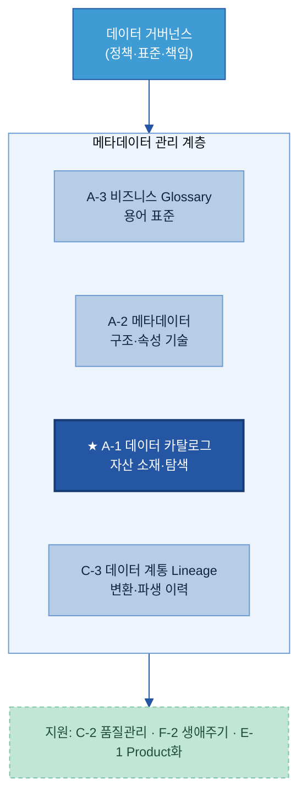

> 카탈로그는 Glossary·사전·Lineage와 **동급의 메타데이터 관리 기능**이며, 그 위에 거버넌스(정책), 옆/아래에 MDM·품질·생애주기 지원 도메인이 있다. **기능 중복은 허용, 책임 중복은 금지.**

---

## 10. 성과 지표·고도화

**👉 한 줄 요약:** "찾기 쉬워졌는가(탐색 리드타임↓) · 잘 쓰이는가(활용도↑) · 최신인가(최신성·커버리지↑)" 5개 지표로 실효성을 측정하고, 수동→자동→AI 보조→에이전트 연계 4단계로 발전한다.

### 10.1 성과 지표 (KPI)

Collibra는 데이터 카탈로그 성공 지표를 Enablement·Adoption·Business Value 3유형으로 분류한다 [[src-KPI-001](https://www.collibra.com/blog/evaluating-your-data-catalogs-success)]. 이를 두산전자 맥락에 맞게 5개로 압축한다.

| KPI | 쉬운 의미 | 측정 방법 | 방향 | 성숙 단계별 목표 |
|---|---|---|---|---|
| **데이터 탐색 리드타임** | 자산을 찾는 데 걸리는 시간 | 검색 로그 또는 월간 샘플 설문 | ↓ | 7일 → 반일(6개월) → 1시간(1년) |
| **카탈로그 활용도** | 월간 탐색 세션·고유 이용자 수 | 플랫폼 로그 | ↑ | 월 50+(6개월) → 월 150+(1년) |
| **신규 AI 과제 활용 수** | 카탈로그로 착수한 AI/분석 과제 수 | 착수 체크리스트 수집 | ↑ | 3+(6개월) → 10+(1년) |
| **자산 최신성 비율** | 갱신 주기 내 갱신된 자산 비중 | `(주기 내 갱신 자산)/(전체 등록) ×100` | ↑ | 80%(6개월) → 90%(1년) → 95%(AI 보조) |
| **등록 커버리지** | 핵심 대상 중 등록 비중 | `(등록 자산)/(Wave 1 핵심 대상) ×100` | ↑ | 60%(3개월) → 80%(6개월) → 95%(1년+) |

> 커버리지(등록률) 80% 이상 = 우수; 60~79% = 개선 필요; 60% 미만 = 즉시 조치 필요 [[src-KPI-003](https://kpidepot.com/kpi/data-catalog-coverage)].

### 10.2 고도화 로드맵 (수동 → 자동 수집 → 메타 초안 자동생성 → 시맨틱 탐색 → AI 에이전트 연계)

**👉 한 줄 요약:** 카탈로그는 "사람이 등록 → 시스템이 자동 수집 → AI가 초안 작성 → AI 에이전트가 직접 활용"의 **4단계로, 자동화 수준이 한 단계씩 올라가며** 발전한다. 아래 단계 흐름을 먼저 보고(무엇이 가능해지나), 그 다음 시간 일정(언제)을 본다.

4단계 성숙도 모델(Acceldata·Atlan·Gartner 종합 [[src-KPI-008](https://www.acceldata.io/blog/ai-data-catalog-next-gen-automated-data-classification-tool)]). **하나의 기준 — "메타데이터를 누가/얼마나 자동으로 채우는가"**로 단계를 나눈다:

아래 간트차트는 이 4단계를 *시간축(언제)*에 펼친 것이고, 이어지는 표는 단계별 핵심 활동·메타데이터 정확도·산출물을 정리한 것이다.

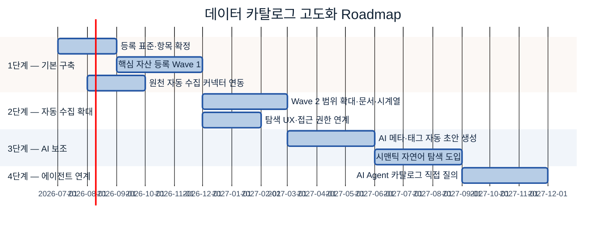

| 단계 | 핵심 활동 | 메타데이터 정확도 | 두산전자 산출물 |
|---|---|---|---|
| **1단계 — 기본 구축** | 등록 표준 확정·Wave 1 핵심 자산 등록·커넥터 연동 | 60~70% | 표준서·Wave 1 목록·커넥터 연동 완료 |
| **2단계 — 자동 수집** | 자동 커넥터 확대·수동 등록 체계화·정기 점검 확립 | 70~80% | 커버리지 80%+·최신성 85%+ |
| **3단계 — AI 보조** | AI 메타 초안 자동 생성·오너 검수 워크플로·시맨틱 검색 | 90%+ | 등록 시간 70% 단축·자연어 탐색 개시 |
| **4단계 — 에이전트 연계** | AI Agent가 카탈로그 API를 Tool로 직접 질의 | 90%+ 실시간 | 착수 리드타임 수일 → 수 시간 |

🏭 **3단계 예시:** 신규 컬럼 추가 시 AI가 설명 초안을 생성하면 오너는 검수·승인만 한다. 수작업으로 일일이 문서화하던 메타데이터 등록 시간을 대폭 단축할 수 있다(업계 사례 보고 기준).

🏭 **4단계 예시:** 결함 예측 Agent가 `#품질 #MES` 태그를 직접 질의 → 위치·경로 자동 취득 → 접근 요청 자동 생성. 착수 리드타임 수일 → 수 시간.

> **공통 원칙:** 각 단계는 이전 단계가 안정화된 후 시작한다. AI 기능을 먼저 올리고 등록을 나중에 채우는 역순은 신뢰도 없는 자동화로 이어진다. Level 1→3 달성에 통상 12~18개월 소요 [[src-KPI-007](https://atlan.com/know/gartner/data-governance-maturity-model/)].

---

## 별첨 (Appendix)

<a id="appendix-a"></a>
### [Appendix A] 등록 항목 사전 (전체)

본문 §3.3은 현업이 가장 먼저 채우는 **핵심 10개**만 담았다. 아래는 카탈로그에 자산 1건을 등록할 때 쓰는 **전체 항목 사전**이다. `작성 주체`는 🤖 자동(플랫폼 수집) / 👤 오너(현업 입력) / 🔐 보안(보안·거버넌스)로 구분한다. *(상세 스키마·컬럼 단위 메타데이터는 카탈로그가 아니라 [A-2 메타데이터](../A-2%20메타데이터/A-2%20메타데이터.md)가 담는다 — 여기서는 자산 단위 등록 항목만.)*

**가. 식별·소재 (자산이 무엇이고 어디 있나)**

| 항목 | 쉬운 의미 | 예시값 | 필수/선택 | 작성 주체 |
|---|---|---|:---:|:---:|
| 자산 ID | 카탈로그 내부 고유 식별자 | `DSEL-QMS-001` | 필수 | 🤖 |
| 데이터명 | 공식 이름(현업 용어+약어 병기) | `일일 품질검사 결과 (INSP_RESULT)` | 필수 | 🤖→👤 |
| 보유 시스템 | 자산이 존재하는 시스템 | `QMS (Quality Management System)` | 필수 | 🤖 |
| 저장 위치 | 테이블·경로·스키마 | `QMS.dbo.INSP_RESULT` | 필수 | 🤖 |
| 데이터 유형 | 정형/문서/이미지/시계열/반정형 | `정형(Table)` | 필수 | 🤖 |
| 데이터 기간 | 보유 데이터의 시작~현재 | `2018-01-01 ~ 현재` | 선택 | 🤖 |

**나. 의미·비즈 (사람·AI가 이해하도록)**

| 항목 | 쉬운 의미 | 예시값 | 필수/선택 | 작성 주체 |
|---|---|---|:---:|:---:|
| 설명(Description) | 무엇을·어느 단위로 담는지 1~2문장 | `동박 라인 일일 외관·전기적 특성 검사 판정 결과(로트 단위)` | 필수 | 👤 |
| 업무 도메인 | 표준값에서 선택(§3.6) | `품질` | 필수 | 👤 |
| 태그 | 표준 Key:Value에서 선택(§3.6) | `domain:품질 / data_type:정형` | 선택 | 👤 |
| 활용 목적 | 어떤 AI·업무 과제에 쓰나 | `품질 예측 / 클레임 분석` | 선택 | 👤 |
| Glossary 링크 | 표준 용어·지표 정의 연결 | → [A-3 Glossary](../A-3%20비즈니스%20Glossary/A-3%20비즈니스%20Glossary.md) | 선택 | 👤 |

**다. 책임·접근 (누가 책임지고 어떻게 받나)**

| 항목 | 쉬운 의미 | 예시값 | 필수/선택 | 작성 주체 |
|---|---|---|:---:|:---:|
| 데이터 오너 | 정확성·접근 정책 책임자 | `품질보증팀 김OO 책임` | 필수 | 👤 |
| 보유 부서 | 오너 소속 관리 조직 | `품질보증팀` | 필수 | 🤖→👤 |
| 접근 경로 | 접근 신청·승인 절차 | `IT Portal → DB 계정 신청 → DBA 승인(2영업일)` | 필수 | 👤 |

**라. 운영·신뢰 (믿고 써도 되나 — 운영 메타)**

| 항목 | 쉬운 의미 | 예시값 | 필수/선택 | 작성 주체 |
|---|---|---|:---:|:---:|
| 갱신 주기 | 얼마나 자주 갱신되나 | `일 1회 (야간 배치 02:00)` | 선택 | 🤖 |
| 최종 변경일시 | 마지막으로 바뀐 시각 | `2025-01-20 14:22` | 선택 | 🤖 |
| 품질 점수 | 완전성·정확성 요약 신호 | `94/100` (→ [C-2 데이터 품질관리](../C-2%20데이터%20품질%20관리/C-2%20데이터%20품질%20관리.md)) | 선택 | 🤖 |
| 원천·리니지 포인터 | 어디서 흘러왔나 | `MES.dbo.PROD_LOG → QMS ETL` (→ [C-3 데이터 계통](../C-3%20데이터%20계통%20Lineage/C-3%20데이터%20계통%20Lineage.md)) | 선택 | 🤖 |

**마. 보안·AI 재사용 (그대로 써도 되나)**

| 항목 | 쉬운 의미 | 예시값 | 필수/선택 | 작성 주체 |
|---|---|---|:---:|:---:|
| 보안 등급 | 공개/사내/대외비/기밀 | `대외비` | 필수 | 🔐 |
| 개인정보 포함 | PII 포함 여부 | `없음` | 필수 | 🔐 |
| AI 활용 가능 등급 | 그대로/가명화 후/불가 | `가명화 후 가능 (고객 로트코드 마스킹)` | 필수 | 🔐 |
| 전처리 필요 여부 | 그대로 학습 가능한가 | `필요 (결측치·코드 디코딩)` | 선택 | 👤 |

> **비정형 자산(문서·이미지·로그)** 도 동일 사전을 쓰되 `저장 위치`는 폴더/볼륨 경로, `데이터 유형`은 문서/이미지로 적는다. 컬럼이 없으므로 라벨·주석 관련 항목은 [B-2 데이터 해설·주석](../B-2%20데이터%20해설·주석/B-2%20데이터%20해설·주석.md)으로 넘긴다.

<a id="appendix-b"></a>
### [Appendix B] 빈 등록 템플릿 (복사해서 채우기)

> 아래를 복사해 자산 1건씩 채운다. 🤖 표시 칸은 보통 플랫폼/커넥터가 미리 채워 주므로 **👤·🔐 칸만 확인·보완**하면 된다. 채운 예시는 §3.3의 두산전자 완성 카드 참조.

```
════════════════════════════════════════════════════
 자산 ID    : __________            🤖
 데이터명   : __________ (약어 병기)  🤖→👤
── 소재·접근 ──────────────────────────────────────
 보유 시스템 : __________            🤖
 저장 위치   : __________            🤖
 데이터 유형 : 정형/문서/이미지/시계열/반정형  🤖
 접근 경로   : __________            👤
── 의미 ───────────────────────────────────────────
 설명        : __________ (무엇을·어느 단위로, 1~2문장)  👤
 업무 도메인 : 품질/생산/설비/원가/구매/영업  👤
 태그        : domain:__ / data_type:__ / sensitivity:__  👤 (§3.6 표준값에서 선택)
── 책임 ───────────────────────────────────────────
 데이터 오너 : __________            👤
 보유 부서   : __________            🤖→👤
── 운영 ───────────────────────────────────────────
 갱신 주기   : __________            🤖
 품질 점수   : ___ /100              🤖
── 보안·AI ────────────────────────────────────────
 보안 등급   : 공개/사내/대외비/기밀   🔐
 개인정보    : 있음/없음              🔐
 AI 활용     : 그대로/가명화 후/불가   🔐
 전처리 필요 : __________            👤
════════════════════════════════════════════════════
```

---

## 참고자료 (References)

> 솔루션·도구·표준의 기능·지원 범위·가격은 변동되므로, 도입 검토 시 각 공식 문서와 벤더 데모·PoC로 직접 확인한다. 아래는 본 가이드 작성에 사용된 출처다.

**상용 솔루션 (공식 페이지)**
- [Collibra Data Catalog](https://www.collibra.com/products/data-catalog) — 공식 제품 페이지
- [Alation Data Catalog](https://www.alation.com/product/data-catalog/) — 공식 제품 페이지
- [Informatica Cloud Data Governance and Catalog (CDGC)](https://www.informatica.com/products/data-governance/cloud-data-governance-and-catalog.html) — 공식 제품 페이지
- [Microsoft Purview Unified Catalog](https://learn.microsoft.com/en-us/purview/unified-catalog) — Microsoft Learn 공식 문서
- [Atlan Data Discovery & Catalog](https://atlan.com/data-discovery-catalog/) — 공식 제품 페이지
- [IBM Watson Knowledge Catalog (watsonx.data Intelligence)](https://www.ibm.com/products/watsonx-data-intelligence/governance-catalog) — 공식 제품 페이지
- [data.world](https://data.world/product/) — 공식 제품 페이지

**클라우드 네이티브 솔루션**
- [AWS Glue Data Catalog](https://aws.amazon.com/glue/features/) — AWS 공식 문서
- [Google Knowledge Catalog (구 Dataplex)](https://docs.cloud.google.com/dataplex/docs/catalog-overview) — Google Cloud 공식 문서
- [Databricks Unity Catalog](https://www.databricks.com/product/unity-catalog) — 공식 제품 페이지

**오픈소스 솔루션**
- [DataHub (Acryl Data)](https://datahub.com/) — 공식 사이트
- [OpenMetadata](https://open-metadata.org/) — 공식 사이트

**리서치 출처 (구성·등록 항목·표준)**
- [DCAT-US Schema v1.1 (Project Open Data Metadata Schema)](https://resources.data.gov/resources/dcat-us/) — data.gov, 2026-06-18
- [ISO/IEC 11179 — Wikipedia](https://en.wikipedia.org/wiki/ISO/IEC_11179) — Wikipedia, 2026-06-18
- [Croissant: A Metadata Format for ML-Ready Datasets (MLCommons 2024)](https://arxiv.org/html/2403.19546v1) — arXiv, 2026-06-18
- [AI-Ready Data: Complete Guide — Dawiso](https://www.dawiso.com/glossary/ai-ready-data) — Dawiso, 2026-06-18
- [Data Catalog for AI: Capabilities, Uses & Tooling 2026 — Atlan](https://atlan.com/know/data-catalog-for-ai/) — Atlan, 2026-06-18
- [Active Metadata: The Complete 2026 Guide — Atlan](https://atlan.com/active-metadata-101/) — Atlan, 2026-06-18
- [Best Practices for Data Cataloging — Secoda](https://www.secoda.co/learn/best-practices-for-data-cataloging) — Secoda, 2026-06-18

**리서치 출처 (구축·운영)**
- [Data Catalog Implementation: A 10-Step Guide — OvalEdge](https://www.ovaledge.com/blog/data-catalog-implementation) — OvalEdge, 2026-06-18
- [Data catalog implementation plan — Murdio](https://murdio.com/insights/data-catalog-implementation-plan/) — Murdio, 2026-06-18
- [Why Most Data Catalogs Fail — CastorDoc](https://www.castordoc.com/blog/why-most-data-catalogs-fail--and-how-to-get-yours-right) — CastorDoc, 2026-06-18
- [Key Challenges in Implementing an Enterprise Data Catalog — Orion Governance](https://www.oriongovernance.com/key-challenges-in-implementing-an-enterprise-data-catalog/) — Orion Governance, 2026-06-18
- [Stale Metadata / Data Freshness 종합](https://blog.satoricyber.com/how-stale-metadata-causes-data-projects-to-fail/) — Satori Cyber, 2026-06-18

**리서치 출처 (KPI·고도화 로드맵)**
- [Evaluating your data catalog's success with KPIs — Collibra](https://www.collibra.com/blog/evaluating-your-data-catalogs-success) — Collibra, 2026-06-18
- [Data Catalog Coverage — KPI Depot](https://kpidepot.com/kpi/data-catalog-coverage) — KPI Depot, 2026-06-18
- [Data Catalog ROI Explained — Decube](https://www.decube.io/post/data-catalog-roi) — Decube, 2026-06-18
- [Modern Data Catalog: Features, Benefits & 2026 Guide — Atlan](https://atlan.com/modern-data-catalog/) — Atlan, 2026-06-18
- [Gartner Data Governance Maturity Model: A 2026 Guide — Atlan](https://atlan.com/know/gartner/data-governance-maturity-model/) — Atlan, 2026-06-18
- [AI-Driven Data Catalogs — Acceldata](https://www.acceldata.io/blog/ai-data-catalog-next-gen-automated-data-classification-tool) — Acceldata, 2026-06-18
- [Informatica Named a Leader in 2025 Gartner Magic Quadrant](https://www.informatica.com/about-us/news/news-releases/2025/01/20250113-informatica-named-a-leader-in-2025-gartner-magic-quadrant-for-data-and-analytics-governance-platforms.html) — Informatica, 2026-06-18
- [Open-Source Data Governance Frameworks: A Strategic Analysis — TheDataGuy](https://thedataguy.pro/blog/2025/08/open-source-data-governance-frameworks/) — TheDataGuy, 2026-06-18
- [16 Best Data Catalog Tools in 2026: Buyer's Guide — Atlan](https://atlan.com/data-catalog-tools/) — Atlan, 2026-06-18

---

## 변경 이력 / 피드백 반영

| 일자 | 버전 | 변경 내용 | 반영 위치 |
|------|------|-----------|-----------|
| 2026-06-18 | v0.1 | 초안 작성 — 표준·템플릿 기반 초안 | 전체 |
| 2026-06-18 | v0.2 | 12개 섹션 전면 확장, 다이어그램 16종, 백업·완성 예시 보강 | 전체 |
| 2026-06-18 | v0.3 | 상단 목차(앵커)·관련 가이드 링크, 솔루션 10종 공식 페이지 인라인 링크 + References 절 정리 | 상단 ToC, 6장, References |
| 2026-06-18 | v0.4 | 5.7 자동화 강조, 6.5 Best-of-Breed, 10.4~10.11 연계 확장 | 5.7, 6.5, 10.4–10.11 |
| 2026-06-18 | v2.0 | 현업판 10섹션 재구조 + 웹 리서치(솔루션·표준·KPI) 보강 — 목차: 개요→Why→What→When/우선순위→예시 시나리오→솔루션→구축→운영→관계→KPI/로드맵 | 전체 |
| 2026-06-18 | v2.1 | **고객 1차 피드백 반영** — ① 카탈로그≠저장·취합/등록 항목=메타데이터 개념 정합성(§1.1·1.2·3.0~3.5·7), ② 메타데이터·Glossary 간단 정의+관계 추가(§1.3), ③ 자회사 적용 기대효과 강조(§2.2), ④ 제안 문장 반영(§2.1·2.2), ⑤ 다이어그램 라벨 보정-데이터 아닌 메타데이터 흐름(§1.3·7.2), ⑥ 역할 업무 기준 구체화(§7.5), ⑦ 메타데이터 항목 정의 단계 신설(§7.0), ⑧ 로드맵 단계 흐름 다이어그램(§10.2), ⑨ 용어 통일·쉬운 표현('표식'·'패싯'·FTE·TCO·JDBC·ETL 풀이) | §1~3·7·10 |
| 2026-06-18 | v2.2 | **다이어그램 취사 기준 적용**(02 표준 §4-1) — 나열형 2개 제거: §2.1 Pain Point flowchart(본문 Pain1~4·기대효과와 중복), §10.2 4단계 선형 flowchart(아래 gantt+표가 4단계를 이미 담음). 구조·분기·루프·관계·시간축·좌표형 11개 유지 | §2.1·§10.2 |
| 2026-06-19 | v2.3 | **「현업 실행 키트」 흡수**(두산 Meta·Tag 엑셀 벤치마킹, 01 표준 §2-A) — ㉠ §3.3 등록 항목 사전에 `필수/선택`·`작성 주체(🤖자동/👤오너/🔐보안)` 열 추가, ㉢ §3.6 태그 표준값 목록(고르는 값) 신설, ㉡ §7.6 Before→After 작성 규칙+금지 표현, ㉤ §7.7 플랫폼 매핑(Databricks `information_schema` 등), ㉠·㉣ [Appendix A] 전체 항목 사전(가~마 그룹)+[Appendix B] 빈 등록 템플릿 신설 | §3.3·§3.6·§7.6·§7.7·별첨 |
