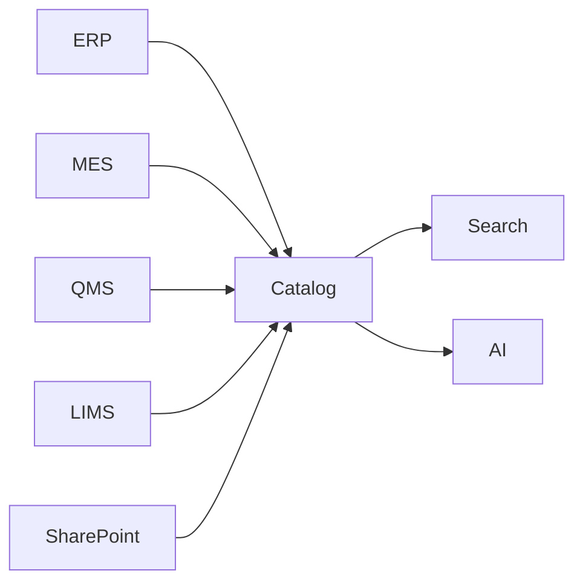
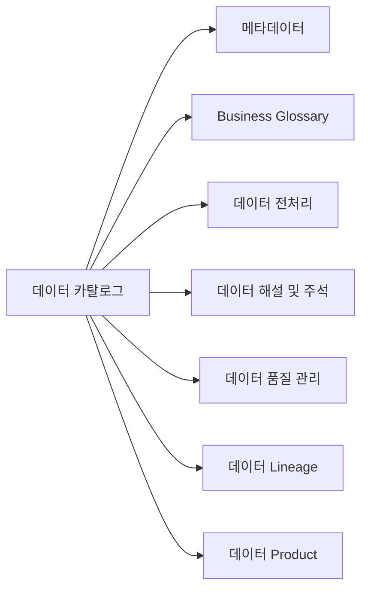

# A-1. 데이터 카탈로그

> 데이터 카탈로그(Data Catalog)는 AI와 사람이 "어디에 무슨 데이터가 있는지" 찾을 수 있도록, 데이터 자산의 **존재·위치·오너·접근 경로**를 등록해 둔 **자산 목록 체계**다. 소재를 찾는 "주소록"이지, 데이터 자체를 이동하거나 분석하는 도구가 아니다.

## 목차

1. [Why — 왜 필요한가](#1-why--왜-필요한가)
   - [1.1 현업 Pain Point](#11-현업-pain-point)
   - [1.2 기대 효과](#12-기대-효과)

2. [What — 무엇을 갖추나 (등록 항목·구성)](#2-what--무엇을-갖추나-등록-항목구성)
   - [2.1 데이터 카탈로그란 + 체계 내 위치](#21-데이터-카탈로그란--체계-내-위치)
   - [2.2 카탈로그 조회 방식](#22-카탈로그-조회-방식)
   - [2.3 항목 구성 기준](#23-항목-구성-기준)
   - [2.4 기본 등록 항목](#24-기본-등록-항목)
   - [2.5 데이터 분류 기준](#25-데이터-분류-기준)
   - [2.6 AI 활용 식별 항목](#26-ai-활용-식별-항목)
   - [2.7 태그 표준값 목록](#27-태그-표준값-목록)

3. [When — 어디부터 등록하나 (우선순위)](#3-when--어디부터-등록하나-우선순위)
   - [3.1 등록 대상 범위](#31-등록-대상-범위)
   - [3.2 유형별 등록/제외](#32-유형별-등록제외)
   - [3.3 정형 데이터 중요도 선별](#33-정형-데이터-중요도-선별)
   - [3.4 수집·등록 방식](#34-수집등록-방식-자동-vs-수동)
   - [3.5 보안 검토](#35-보안-검토-내부-학습-vs-외부-llm-노출)
   - [3.6 최종 우선순위 — 사람이 다 찾아 등록하지 않는다](#36-최종-우선순위--사람이-다-찾아-등록하지-않는다-자동-수집-우선)

4. [예시 시나리오 — 두산전자 적용 흐름](#4-예시-시나리오--두산전자-적용-흐름)
   - [4.1 적용 전/후 대비](#41-적용-전후-대비)
   - [4.2 흐름 미리보기](#42-흐름-미리보기-원천-자동-수집--오너-채우기--분류--ai현업-탐색)

5. [Tech Stack — 솔루션 검토](#5-tech-stack--솔루션-검토)
   - [5.1 솔루션 유형·적용 범위](#51-솔루션-유형적용-범위)
   - [5.2 후보 검토·기능 비교](#52-후보-검토기능-비교)
   - [5.3 평가·선정·PoC 기준](#53-평가선정poc-기준)

6. [How — 어떻게 구축·운영하나](#6-how--어떻게-구축운영하나)
   - [6.0 등록할 메타데이터 항목 정의](#60-등록할-메타데이터-항목스키마-정의작성)
   - [6.1 메타데이터 검토·정합성 보완](#61-수집한-메타데이터-검토정합성-보완)
   - [6.2 To-Be 아키텍처](#62-to-be-아키텍처-솔루션-기반)
   - [6.3 Legacy 연동·Pipeline](#63-legacy-연동미연동수동-업로드-pipeline)
   - [6.4 초기 적재·검증](#64-초기-적재검증)
   - [6.5 담당자 역할](#65-담당자-역할-오너현업it보안ai-조직-raci)
   - [6.6 잘 쓴 등록 vs 못 쓴 등록](#66-잘-쓴-등록-vs-못-쓴-등록-before--after)
   - [6.7 플랫폼 매핑](#67-실제로-어디서-채우나--플랫폼-매핑)
   - [6.8 변경 관리](#68-변경-관리-요청--검토승인--반영)
   - [6.9 등록·검색·조회 운영](#69-등록검색조회-운영)
   - [6.10 전처리·분석·RAG 서비스 연계](#610-전처리분석질의rag-서비스-연계)
   - [6.11 접근 권한·보안](#611-접근-권한보안운영-역할별-기능)
   - [6.12 최신화](#612-최신화-주기-갱신-vs-변경시점-자동-갱신미등록-정기-점검)

7. [Where — 다른 주제와의 관계](#7-where--다른-주제와의-관계)
   - [7.1 인접 주제와의 역할 분담](#71-인접-주제와의-역할-분담)
   - [7.2 전체 조감도](#72-전체-조감도-경계-시각화)

- [별첨 (Appendix)](#별첨-appendix)
  - [Appendix A. 등록 항목 사전](#appendix-a)
  - [Appendix B. 빈 등록 템플릿](#appendix-b)

- [참고자료 (References)](#참고자료-references)
- [변경 이력 / 피드백 반영](#변경-이력--피드백-반영)

> 관련 가이드: [A-2 메타데이터](../A-2%20메타데이터/A-2%20메타데이터.md) · [A-3 비즈니스 Glossary](../A-3%20비즈니스%20Glossary/A-3%20비즈니스%20Glossary.md) · [C-3 데이터 계통 Lineage](../C-3%20데이터%20계통%20Lineage/C-3%20데이터%20계통%20Lineage.md) · [F-2 데이터 생애주기 관리](../F-2%20데이터%20생애주기%20관리/F-2%20데이터%20생애주기%20관리.md) · [E-1 데이터 Product화](../E-1%20데이터%20Product화/E-1%20데이터%20Product화.md)

---

# 1. Why — 왜 필요한가

AI 프로젝트에서는 필요한 데이터를 찾고 준비하는 과정이 반복된다. 데이터는 이미 존재하지만 위치와 관리 기준이 분산되어 있어 프로젝트마다 다시 찾고, 다시 수집하고, 다시 전처리하는 일이 반복된다.

데이터 카탈로그는 데이터 자산의 위치와 관리 정보를 표준화하여 사람과 AI가 동일한 기준으로 데이터를 탐색하고 재활용할 수 있도록 하는 체계이다.

궁극적으로 AI 과제를 수행할수록 데이터 자산이 축적되고 다음 과제에서 자연스럽게 재사용되는 구조를 만드는 것이 목적이다.

---

## 1.1 현업 Pain Point

AI 프로젝트에서 반복적으로 발생하는 데이터 관련 문제는 다음과 같다.

| 현업 Pain Point | 현장에서 발생하는 문제 |
| --- | --- |
| 필요한 데이터의 존재 여부를 확인하기 어렵다. | 필요한 데이터가 있는지 확인하기 위해 여러 조직과 담당자에게 문의해야 한다. |
| 데이터가 여러 시스템에 분산되어 있다. | MES, ERP, QMS, SharePoint, 파일 서버, 개인 PC 등을 각각 확인해야 한다. |
| 데이터 관리 주체가 명확하지 않다. | 데이터를 찾더라도 누구에게 요청해야 하는지 다시 확인해야 한다. |
| 동일한 데이터를 반복적으로 준비한다. | 기존 프로젝트에서 구축한 데이터를 재사용하지 못하고 다시 수집하고 전처리한다. |
| AI 활용 이력을 확인하기 어렵다. | 전처리 여부나 기존 AI 프로젝트 활용 여부를 확인하기 어렵다. |

예를 들어 품질 이상 원인을 분석하는 AI 프로젝트를 수행하는 경우 MES 공정 데이터, 품질 검사 결과, 시험 결과, 품질 보고서 등 여러 데이터를 확보해야 한다.

그러나 데이터는 서로 다른 조직과 시스템에서 관리되기 때문에 필요한 데이터를 찾고 접근 권한을 확보하는 데 많은 시간이 소요된다. 프로젝트가 달라져도 동일한 과정이 반복되며, 이전 프로젝트에서 구축한 데이터가 있어도 이를 확인하기 어렵다.

---

## 1.2 기대 효과

데이터 카탈로그를 구축하면 데이터 탐색과 활용 방식이 표준화된다.

필요한 데이터의 위치와 관리 정보를 검색을 통해 확인할 수 있으며, 기존 프로젝트에서 구축한 데이터를 재활용할 수 있다. AI 역시 동일한 카탈로그를 활용하여 필요한 데이터를 탐색할 수 있다.

- **데이터 탐색 시간 단축**  
  데이터의 위치와 관리 조직, 접근 방법을 빠르게 확인하여 프로젝트 착수 시간을 줄일 수 있다.

- **데이터 재사용 확대**  
  기존 AI 프로젝트에서 구축한 데이터를 재활용하여 중복 수집과 전처리 작업을 줄일 수 있다.

- **AI 활용 기반 확보**  
  AI Agent와 RAG가 동일한 데이터 자산을 활용할 수 있는 공통 탐색 체계를 구축할 수 있다.

- **데이터 관리 기준 표준화**  
  계열사별 데이터 관리 기준을 일관되게 적용하여 데이터 활용 수준을 높일 수 있다.

- **데이터 자산의 지속적인 축적**  
  AI 프로젝트를 수행할수록 데이터 자산이 계속 축적되고, 이후 프로젝트에서는 기존 자산을 우선 활용하는 구조를 구축할 수 있다.

데이터 카탈로그는 일회성 구축 과제가 아니다. AI 프로젝트에서 축적되는 데이터를 조직의 공통 자산으로 관리하고, 이후 프로젝트에서 반복 활용할 수 있도록 하는 기반 체계이다.

---

# 2. What — 무엇을 갖추나 (등록 항목·구성)

데이터 카탈로그는 데이터를 저장하는 시스템이 아니라 데이터를 찾기 위한 관리 체계이다.

데이터 자체를 한곳으로 모으는 것이 아니라, 데이터 자산의 위치와 관리 정보를 등록하여 필요한 데이터를 빠르게 찾고 활용할 수 있도록 한다.

데이터 카탈로그를 구축하기 위해서는 다음 요소를 함께 갖추어야 한다.

- 데이터 자산 등록 기준
- 표준 등록 항목
- 데이터 분류 체계
- AI 활용 정보
- 검색 및 탐색 체계

---

## 2.1 데이터 카탈로그란 + 체계 내 위치

데이터 카탈로그는 조직이 보유한 데이터 자산의 위치와 관리 정보를 등록하는 목록 체계이다.

관리 대상은 데이터 자체가 아니라 데이터를 설명하는 정보이다. 데이터는 기존 시스템에 그대로 두고, 데이터명, 저장 위치, 관리 조직, 데이터 오너, 접근 방법 등을 등록하여 필요한 데이터를 찾을 수 있도록 지원한다.

데이터 카탈로그는 다음 정보를 관리한다.

- 데이터 존재 여부
- 저장 위치
- 보유 시스템
- 관리 조직
- 데이터 오너
- 접근 방법
- 갱신 정보
- 보안 등급

AI-ready Data에서는 데이터 카탈로그가 가장 먼저 구축되는 기반이다.

데이터를 찾을 수 있어야 메타데이터를 연결하고, 전처리와 데이터 해설, AI 활용까지 이어질 수 있다.

> 데이터 카탈로그는 **"어디에 무엇이 있는가"**를 관리한다.
>
> 데이터의 구조와 속성은 **A-2 메타데이터**, 업무 용어는 **A-3 비즈니스 Glossary**, 데이터 이동과 변환 과정은 **C-3 데이터 Lineage**에서 관리한다.

---

## 2.2 카탈로그 조회 방식

데이터는 검색과 탐색 두 가지 방식으로 조회한다.

검색은 데이터명이나 태그를 이용하여 필요한 데이터를 직접 찾는 방식이며, 탐색은 업무 영역과 시스템, 데이터 유형 등을 기준으로 범위를 좁혀가는 방식이다.

실제 운영에서는 두 방식을 함께 사용한다.

예를 들어 품질 데이터를 조회하는 경우 다음과 같은 순서로 탐색할 수 있다.

- 업무 영역 : 품질
- 시스템 : MES
- 데이터 유형 : 정형 데이터
- 태그 : 검사
- 데이터명 : 동박

검색 결과에서는 최소한 다음 정보를 확인할 수 있어야 한다.

- 데이터명
- 보유 시스템
- 저장 위치
- 관리 조직
- 데이터 오너
- 접근 방법
- 보안 등급
- AI 활용 여부

---

## 2.3 항목 구성 기준

데이터 카탈로그에는 데이터를 찾고 활용하는 데 필요한 최소 정보를 등록한다.

등록 항목은 목적에 따라 다섯 개 영역으로 구분한다. 이때, 필요한 데이터를 찾고 활용하는 데 필요한 정보를 동일한 기준으로 관리하는 것이 중요하다.

| 구분 | 주요 등록 정보 |
| --- | --- |
| Business | 데이터명, 설명, 업무 영역, 활용 목적 |
| Technical | 보유 시스템, 저장 위치, 데이터 유형 |
| Operational | 데이터 오너, 관리 조직, 갱신 주기 |
| Compliance | 보안 등급, 개인정보 포함 여부 |
| AI | AI 활용 여부, 전처리 여부 |

---

## 2.4 기본 등록 항목

데이터 자산은 다음 정보를 기본으로 등록한다.

| 등록 항목 | 설명 |
| --- | --- |
| 데이터명 | 데이터 자산의 공식 명칭 |
| 보유 시스템 | 데이터가 존재하는 시스템 |
| 저장 위치 | DB, 테이블, 폴더 등 실제 위치 |
| 관리 조직 | 데이터를 관리하는 조직 |
| 데이터 오너 | 데이터 관리 책임자 |
| 접근 방법 | 데이터 접근 절차 |
| 데이터 유형 | 정형, 문서, 이미지 등 |
| 갱신 주기 | 데이터 갱신 주기 |
| 보안 등급 | 데이터 보안 수준 |
| 태그 | 검색을 위한 분류 정보 |

기본 등록 항목만으로도 필요한 데이터의 위치와 관리 정보를 확인할 수 있어야 한다.

---

## 2.5 데이터 분류 기준

데이터는 동일한 기준으로 분류되어야 검색과 재사용이 가능하다.

데이터 카탈로그에서는 다음 기준으로 데이터를 분류한다.

| 분류 기준 | 예시 |
| --- | --- |
| 업무 영역 | 생산, 품질, 구매, 영업 |
| 데이터 유형 | 정형, 문서, 이미지, 시계열 |
| 관리 조직 | 생산기술팀, 품질보증팀 |
| 시스템 | MES, ERP, QMS, LIMS |
| 활용 목적 | AI 학습, 분석, RAG, 보고서 |

이 분류 기준은 검색 조건과 태그 체계의 기준으로 함께 활용한다.

---

## 2.6 AI 활용 식별 항목

AI 프로젝트에서는 데이터 위치뿐 아니라 활용 가능 여부도 함께 확인해야 한다.

데이터 카탈로그에서는 다음 정보를 함께 관리한다.

| 항목 | 설명 |
| --- | --- |
| AI 활용 여부 | AI 프로젝트 활용 가능 여부 |
| 전처리 여부 | AI 활용을 위한 전처리 완료 여부 |
| 원천 데이터 | 원본 데이터 위치 |
| 활용 목적 | AI 학습, 추론, RAG 등 |
| 보안 조건 | AI 활용 시 적용해야 하는 보안 정책 |

이를 통해 기존 프로젝트에서 구축한 데이터를 재활용하고, 동일한 데이터를 반복적으로 준비하는 작업을 줄일 수 있다.

---

## 2.7 태그 표준값 목록

태그는 데이터 검색과 분류 기준을 통일하기 위한 표준값이다.

동일한 데이터를 사람마다 다른 표현으로 등록하면 검색 품질이 낮아질 수 있다. 따라서 자유 입력보다 표준값 사용을 원칙으로 한다.

| 태그 | 예시 |
| --- | --- |
| 업무 영역 | 품질, 생산, 구매 |
| 데이터 유형 | 정형, 문서, 이미지 |
| 보안 등급 | 공개, 사내, 대외비, 기밀 |
| AI 활용 | 가능, 제한, 불가 |
| 원천 시스템 | MES, ERP, QMS, LIMS |

표준 태그를 적용하면 계열사 전체에서 동일한 기준으로 데이터를 검색하고 활용할 수 있다.

---

# 3. When — 어디부터 등록하나 (우선순위)

데이터 카탈로그는 모든 데이터를 한 번에 구축하는 방식보다 우선순위를 정해 단계적으로 구축하는 것이 효과적이다.

AI 활용도가 높고 여러 조직에서 반복적으로 사용하는 데이터를 먼저 등록하고, 이후 등록 범위를 확대한다. 구축 초기부터 모든 데이터를 등록하려고 하면 구축 기간이 길어지고 운영 부담도 함께 증가한다.

---

## 3.1 등록 대상 범위

등록 대상은 AI 활용 가능성과 업무 중요도를 기준으로 선정한다.

다음 조건 가운데 두 가지 이상에 해당하는 데이터는 우선 등록 대상으로 선정한다.

| 선정 기준 | 내용 |
| --- | --- |
| AI 활용 | AI 학습, 추론, RAG 등에 활용되는 데이터 |
| 업무 중요도 | 핵심 업무 수행에 필요한 데이터 |
| 재사용성 | 여러 조직이나 프로젝트에서 반복 활용되는 데이터 |

대표적인 등록 대상은 다음과 같다.

- ERP 업무 데이터
- MES 생산 데이터
- 품질 검사 데이터
- 설비 운전 데이터
- 시험 결과 데이터
- 표준 문서
- AI 프로젝트 데이터셋

---

## 3.2 유형별 등록/제외

데이터 유형에 따라 등록 기준을 달리 적용한다.

| 데이터 유형 | 등록 기준 |
| --- | --- |
| 정형 데이터 | 주요 테이블과 View 중심으로 등록 |
| 문서 | 표준 문서와 반복 활용되는 보고서 등록 |
| 이미지 | 이미지 위치와 관리 정보 등록 |
| 시계열 데이터 | 설비와 센서 단위로 등록 |
| AI 데이터 | 전처리 데이터와 학습 데이터 등록 |

다음 데이터는 우선 등록 대상에서 제외하거나 후순위로 관리한다.

- 개인 임시 파일
- 테스트 데이터
- 중복 데이터
- 폐기 예정 데이터

---

## 3.3 정형 데이터 중요도 선별

정형 데이터는 등록 대상이 가장 많기 때문에 활용도를 기준으로 우선순위를 결정한다.

| 평가 항목 | 판단 기준 |
| --- | --- |
| 활용 빈도 | 조회 및 사용 빈도가 높은 데이터 |
| 영향도 | 여러 시스템과 프로젝트에서 활용되는 데이터 |
| AI 활용 | AI 프로젝트에서 반복 활용되는 데이터 |

평가 결과를 바탕으로 등록 범위를 단계적으로 확대한다.

| 단계 | 등록 대상 |
| --- | --- |
| 1단계 | 핵심 업무 데이터 |
| 2단계 | 반복 활용 데이터 |
| 3단계 | 기타 데이터 |

---

## 3.4 수집·등록 방식 (자동 vs 수동)

데이터는 가능한 자동으로 등록한다.

시스템에서 메타데이터를 수집할 수 있는 경우에는 자동 등록을 적용하고, 자동 수집이 어려운 데이터만 수동으로 등록한다.

| 등록 방식 | 적용 대상 |
| --- | --- |
| 자동 등록 | ERP, MES, QMS, LIMS 등 시스템 데이터 |
| 수동 등록 | 문서, 파일 서버, 개인 관리 데이터 |

자동 등록을 우선 적용하면 구축 기간을 줄일 수 있고, 이후 변경 사항도 자동으로 반영할 수 있다.

---

## 3.5 보안 검토 (내부 학습 vs 외부 LLM 활용)

등록 대상은 활용 목적에 따라 보안 기준을 함께 검토한다.

| 보안 등급 | 등록 기준 |
| --- | --- |
| 공개 | 전체 등록 |
| 사내 | 내부 사용자 조회 |
| 대외비 | 관리 정보만 등록 |
| 기밀 | 별도 관리 |

데이터 카탈로그는 데이터 자체를 저장하지 않는다.

필요한 경우 데이터 위치와 관리 정보만 등록하고, 실제 데이터 접근은 별도의 승인 절차를 적용한다.

---

## 3.6 최종 우선순위 — 사람이 다 찾아 등록하지 않는다

데이터 카탈로그 구축은 사람이 모든 데이터를 직접 등록하는 작업이 아니다.

자동 수집이 가능한 데이터는 시스템에서 등록하고, 사람이 판단해야 하는 정보만 보완하는 방식으로 운영한다.

| 자동 등록 | 담당자 등록 |
| --- | --- |
| 시스템 정보 | 데이터 설명 |
| 저장 위치 | 활용 목적 |
| 데이터 유형 | 관리 조직 |
| 갱신 정보 | 보안 등급 |
| 변경 사항 | 태그 |

데이터가 증가할수록 사람이 직접 등록하는 방식은 유지하기 어렵다.

자동 수집을 기본으로 하고, 데이터 오너가 필요한 정보만 검토·보완하는 구조를 구축해야 지속적으로 운영할 수 있다.

---

# 4. 예시 시나리오 — 두산전자 적용 흐름

데이터 카탈로그는 실제 AI 프로젝트에서 가장 먼저 활용되는 체계이다.

필요한 데이터를 찾기 위해 여러 조직에 문의하는 방식에서, 데이터 카탈로그를 검색하여 필요한 데이터를 확인하는 방식으로 업무가 변경된다.

---

## 4.1 적용 전/후 대비

품질 이상 원인 분석 AI 프로젝트를 수행한다고 가정하면 다음과 같은 데이터를 확보해야 한다.

- MES 공정 데이터
- 품질 검사 결과
- 시험 결과
- 품질 보고서
- 고객 불량 이력

### 적용 전

| 확인 항목 | 수행 방법 |
| --- | --- |
| 데이터 존재 여부 | 담당자 문의 |
| 데이터 위치 | 시스템별 확인 |
| 관리 조직 | 조직별 문의 |
| 접근 방법 | 개별 확인 |
| AI 활용 여부 | 프로젝트별 검토 |

데이터를 확보하기 위해 여러 조직과 시스템을 확인해야 하며, 프로젝트가 바뀌면 동일한 과정을 반복한다.

### 적용 후

데이터 카탈로그에서 필요한 데이터를 검색한 후 관리 조직과 접근 방법을 확인한다.

필요한 데이터와 접근 절차를 한 번에 확인할 수 있기 때문에 데이터 탐색 시간이 크게 줄어든다.

| 확인 항목 | 수행 방법 |
| --- | --- |
| 데이터 검색 | 카탈로그 검색 |
| 위치 확인 | 등록 정보 조회 |
| 관리 조직 확인 | 등록 정보 조회 |
| 접근 방법 확인 | 등록 정보 조회 |
| AI 활용 여부 확인 | 등록 정보 조회 |

---

## 4.2 흐름 미리보기

데이터 카탈로그 구축 이후 데이터 활용 흐름은 다음과 같다.

검색 결과에서는 다음 정보를 함께 제공한다.

- 데이터명
- 보유 시스템
- 저장 위치
- 관리 조직
- 데이터 오너
- 접근 방법
- 보안 등급
- AI 활용 여부

필요한 데이터를 찾는 과정이 표준화되면서 프로젝트마다 반복되던 데이터 탐색과 확인 절차를 줄일 수 있다.

---

# 5. Tech Stack — 솔루션 검토

데이터 카탈로그는 기능이 많은 솔루션보다 현재 운영 환경에 적합한 솔루션을 선택하는 것이 중요하다.

ERP, MES, QMS 등 기존 시스템과 연계할 수 있어야 하며, 메타데이터 자동 수집, 검색, 권한 관리 기능을 지원해야 한다. 솔루션 선정 전에는 반드시 실제 운영 환경을 대상으로 PoC를 수행하여 적용 가능성을 검증한다.

---

## 5.1 솔루션 유형·적용 범위

데이터 카탈로그 솔루션은 구축 방식에 따라 다음과 같이 구분할 수 있다.

| 유형 | 특징 | 대표 솔루션 |
| --- | --- | --- |
| Enterprise Data Catalog | 데이터 거버넌스 중심 | Collibra, Alation, Atlan |
| Cloud 기반 | Cloud 플랫폼과 통합 | Microsoft Purview, AWS Glue, Databricks Unity Catalog |
| Open Source | 직접 구축 및 운영 | DataHub, OpenMetadata |

계열사의 IT 환경과 운영 방식에 따라 적합한 유형을 선택한다.

---

## 5.2 후보 검토·기능 비교

솔루션은 다음 항목을 중심으로 비교한다.

| 검토 항목 | 주요 내용 |
| --- | --- |
| 시스템 연계 | ERP, MES, QMS 등 연계 가능 여부 |
| 자동 수집 | 메타데이터 자동 수집 기능 |
| 검색 | 데이터 검색 및 탐색 기능 |
| 권한 관리 | 사용자 및 접근 권한 관리 |
| 확장성 | 계열사 확대 적용 가능 여부 |
| 운영성 | 구축 및 유지보수 편의성 |

제품 기능보다 현재 운영 환경에 얼마나 적합한지가 중요하다.

---

## 5.3 평가·선정·PoC 기준

솔루션은 기능만으로 선정하지 않는다.

실제 운영 환경에서 PoC를 수행하여 연계성과 운영성을 함께 검증한다.

| 검증 항목 | 확인 내용 |
| --- | --- |
| 시스템 연계 | 주요 시스템 정상 연동 |
| 자동 수집 | 메타데이터 자동 등록 |
| 검색 성능 | 검색 결과 정확도 |
| 권한 관리 | 접근 권한 정상 적용 |
| 운영성 | 구축 및 운영 편의성 |

PoC 결과를 바탕으로 기능, 운영성, 확장성을 종합적으로 검토하여 최종 솔루션을 선정한다.

---

# 6. How — 어떻게 구축·운영하나

데이터 카탈로그 구축은 데이터를 이동하는 작업이 아니라 메타데이터를 구축하고 운영 체계를 마련하는 과정이다.

등록 기준을 정의하고, 메타데이터를 수집하며, 시스템과 연계하여 지속적으로 최신 상태를 유지할 수 있도록 운영한다.

---

## 6.0 등록할 메타데이터 항목 정의

구축에 앞서 등록 대상과 등록 항목을 정의한다.

표준 등록 항목, 데이터 분류 기준, 태그 체계, 보안 등급을 먼저 확정해야 이후 등록 기준을 일관되게 유지할 수 있다.

---

## 6.1 메타데이터 검토·정합성 보완

등록 대상 데이터를 검토하여 메타데이터를 보완한다.

주요 검토 항목은 다음과 같다.

- 필수 등록 항목 누락 여부
- 저장 위치 정확성
- 데이터 오너 지정 여부
- 태그 적용 여부
- 보안 등급 적정성

---

## 6.2 To-Be 아키텍처

데이터 카탈로그는 주요 시스템과 연계하여 메타데이터를 수집한다.

데이터는 기존 시스템에서 관리하고 데이터 카탈로그는 메타데이터만 관리한다.

---

## 6.3 Legacy 연동·Pipeline

자동 연계가 가능한 시스템은 메타데이터를 주기적으로 수집한다.

자동 수집이 어려운 데이터는 표준 양식을 이용하여 등록한다.

| 등록 방식 | 적용 대상 |
| --- | --- |
| 자동 수집 | ERP, MES, QMS, LIMS |
| 수동 등록 | 문서, 파일 서버, 기타 비정형 데이터 |

자동 수집을 기본으로 적용하고 필요한 경우만 수동 등록을 수행한다.

---

## 6.4 초기 적재·검증

초기 구축에서는 등록 대상 데이터를 일괄 등록한 후 다음 항목을 검증한다.

- 등록 대상 누락 여부
- 필수 항목 등록 여부
- 검색 정확도
- 시스템 연계 상태
- 접근 권한 적용 여부

---

## 6.5 담당자 역할

| 역할 | 주요 업무 |
| --- | --- |
| 데이터 오너 | 등록 및 최신화 |
| 현업 | 데이터 내용 검토 |
| IT | 시스템 연계 및 운영 |
| AI 조직 | AI 활용 기준 관리 |
| 보안 | 접근 권한 및 보안 정책 관리 |

데이터 카탈로그는 데이터 오너를 중심으로 운영하며 각 조직이 역할을 분담한다.

---

## 6.6 등록 작성 예시

| 등록 전 | 등록 후 |
| --- | --- |
| 검사 | 품질 검사 결과 |
| 품질 데이터 | 일일 품질 검사 결과 |
| 수시 | 일 1회 |
| 품질 | 품질, 검사, MES |

검색이 가능하도록 구체적인 명칭과 표준 태그를 사용하는 것이 중요하다.

---

## 6.7 플랫폼 매핑

대표적인 데이터 카탈로그 플랫폼은 Microsoft Purview, Databricks Unity Catalog, Collibra, Atlan, DataHub 등이 있다.

플랫폼은 다르더라도 등록 기준과 운영 방식은 동일하게 적용한다.

---

## 6.8 변경 관리

운영 과정에서는 다음 변경 사항을 지속적으로 반영한다.

- 신규 데이터 등록
- 저장 위치 변경
- 관리 조직 변경
- 보안 등급 변경

변경 사항은 검토와 승인 절차를 거쳐 반영한다.

---

## 6.9 등록·검색·조회 운영

운영 단계에서는 등록보다 최신 상태 유지가 중요하다.

정기적으로 등록 정보와 검색 품질을 점검하고, 신규 데이터와 변경 사항을 지속적으로 반영한다.

---

## 6.10 전처리·분석·RAG 서비스 연계

데이터 카탈로그는 전처리, 분석, RAG 서비스가 필요한 데이터를 탐색하기 위한 공통 기준으로 활용한다.

필요한 데이터는 카탈로그에서 조회하고, 실제 데이터 처리와 분석은 각 서비스에서 수행한다.

---

## 6.11 접근 권한·보안

데이터 카탈로그는 데이터 자체가 아니라 관리 정보를 제공한다.

실제 데이터 접근은 기존 권한 관리 체계를 따르며, 데이터 카탈로그는 접근 절차와 관리 정보를 제공한다.

---

## 6.12 최신화

데이터 카탈로그는 구축 이후에도 지속적으로 관리해야 한다.

신규 데이터 등록, 변경 사항 반영, 정기 점검을 반복하여 최신 상태를 유지하고, AI 프로젝트에서 축적되는 데이터를 지속적으로 자산화한다.

---

# 7. Where — 다른 주제와의 관계

데이터 카탈로그는 AI-ready Data 체계에서 데이터를 찾는 역할을 담당한다.

데이터의 의미를 정의하거나 품질을 관리하는 것이 아니라, 필요한 데이터를 찾고 활용할 수 있도록 연결하는 역할을 수행한다.

---

## 7.1 인접 주제와의 역할 분담

| 주제 | 데이터 카탈로그에서 담당하는 범위 | 인접 주제에서 담당하는 범위 |
| --- | --- | --- |
| A-2 메타데이터 | 데이터 위치와 관리 정보 | 데이터 구조, 속성, 컬럼 정보 |
| A-3 비즈니스 Glossary | 데이터 탐색 | 업무 용어와 표준 정의 |
| B-1 데이터 전처리 | 원천 데이터 위치 제공 | AI 활용을 위한 데이터 변환 |
| B-2 데이터 해설 및 주석 | 원천 데이터 위치 제공 | 데이터 의미와 학습 정보 |
| C-2 데이터 품질 관리 | 데이터 위치 제공 | 활용 가능 여부와 품질 기준 |
| C-3 데이터 Lineage | 원천 데이터 위치 제공 | 데이터 이동 및 변환 이력 |
| E-1 데이터 Product화 | 데이터 자산 검색 | 데이터 서비스 및 재사용 체계 |

데이터 카탈로그는 데이터를 찾는 역할에 집중하며, 다른 주제와 기능이 중복되지 않도록 역할을 구분한다.

---

## 7.2 전체 조감도

데이터 카탈로그는 AI-ready Data 체계의 시작점이다.

필요한 데이터를 찾은 이후 메타데이터, 전처리, 데이터 해설, 품질 관리 등 다른 주제로 연결되며, 데이터 활용의 기준 정보를 제공한다.

---

# 별첨 (Appendix)

## Appendix A. 기본 등록 항목

데이터 카탈로그에는 다음 정보를 기본적으로 등록한다.

| 구분 | 등록 항목 |
| --- | --- |
| 기본 정보 | 데이터명, 설명 |
| 위치 정보 | 보유 시스템, 저장 위치 |
| 관리 정보 | 관리 조직, 데이터 오너 |
| 운영 정보 | 데이터 유형, 갱신 주기 |
| 활용 정보 | AI 활용 여부, 전처리 여부 |
| 보안 정보 | 보안 등급, 접근 방법 |
| 검색 정보 | 태그 |

---

## Appendix B. 등록 예시

| 항목 | 예시 |
| --- | --- |
| 데이터명 | 품질 검사 결과 |
| 보유 시스템 | MES |
| 저장 위치 | MES_QA_RESULT |
| 관리 조직 | 품질보증팀 |
| 데이터 오너 | 홍길동 |
| 데이터 유형 | 정형 데이터 |
| 갱신 주기 | 일 1회 |
| AI 활용 | 가능 |
| 보안 등급 | 사내 |
| 태그 | 품질, 검사, MES |

---

# 참고자료 (References)

- Microsoft Purview
- Collibra
- Atlan
- DataHub
- OpenMetadata
- Databricks Unity Catalog
- AWS Glue Data Catalog
- Gartner Data Catalog Market Guide
- DAMA-DMBOK

---

# 변경 이력 / 피드백 반영

| 일자 | 버전 | 변경 내용 |
| --- | --- | --- |
| 2026-06-26 | v4.0 | 문서 전면 개편. 문체, 구조, 사례, 구축 절차를 수정하고 AI-ready Data 운영 관점으로 재작성. |
