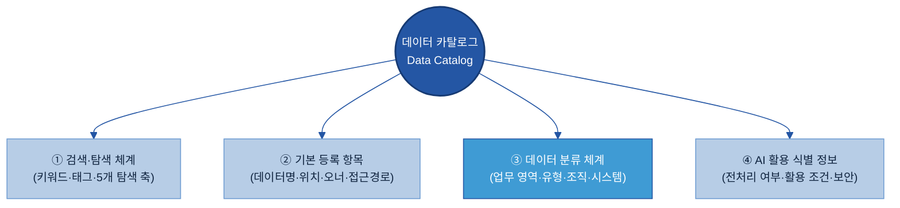
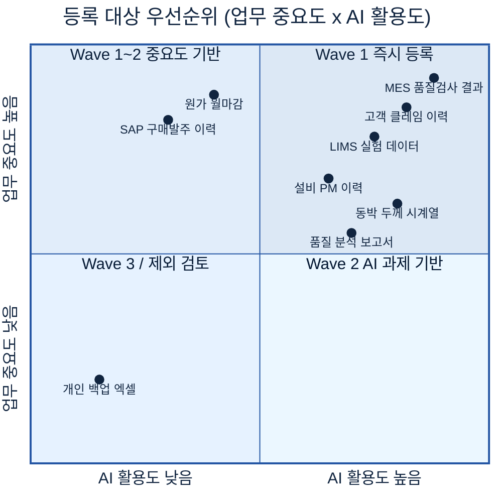
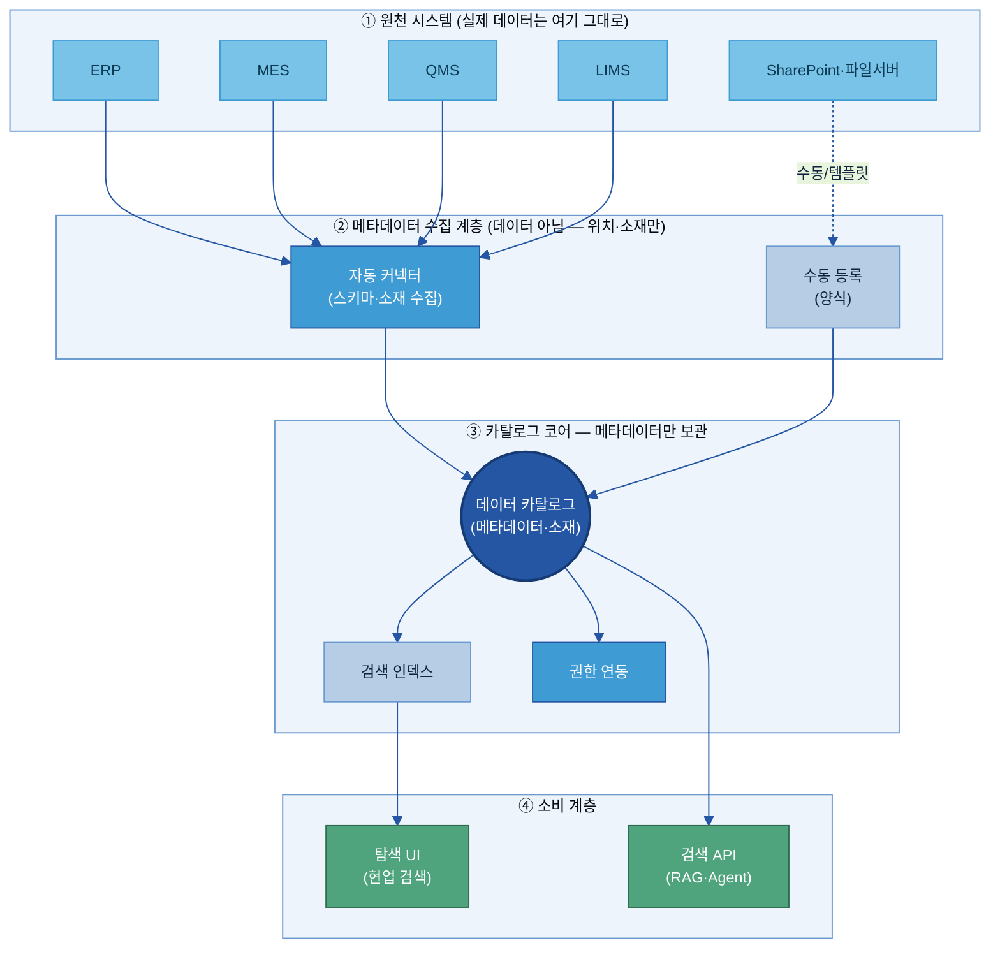
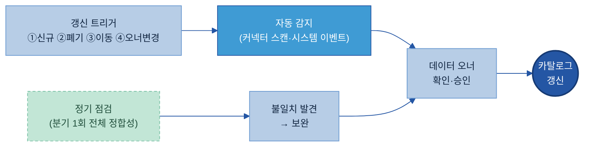
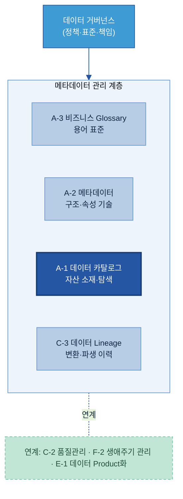

# A-1. 데이터 카탈로그

> 데이터 카탈로그(Data Catalog)는 AI와 사람이 "어디에 무슨 데이터가 있는지" 찾을 수 있도록, 데이터 자산의 **존재·위치·오너·접근 경로**를 등록해 둔 **자산 목록 체계**다. 소재를 찾는 "주소록"이지, 데이터 자체를 이동하거나 분석하는 도구가 아니다.

## 목차

1. [Why — 왜 필요한가](#why)
   - [1.1 현업 Pain Point](#s11)
   - [1.2 기대 효과](#s12)
   - [1.3 적용 전·후](#s13)

2. [What — 무엇을 갖추나 (등록 항목·구성)](#what)
   - [2.1 데이터 카탈로그란 + 체계 내 위치](#s21)
   - [2.2 카탈로그 조회 방식](#s22)
   - [2.3 항목 구성 기준](#s23)
   - [2.4 기본 등록 항목](#s24)
   - [2.5 데이터 분류 기준](#s25)
   - [2.6 AI 활용 식별 항목](#s26)
   - [2.7 태그 표준값 목록](#s27)

3. [When — 어디부터 등록하나 (우선순위)](#when)
   - [3.1 등록 대상 범위](#s31)
   - [3.2 유형별 등록/제외](#s32)
   - [3.3 정형 데이터 중요도 선별](#s33)
   - [3.4 수집·등록 방식 (자동 vs 수동)](#s34)
   - [3.5 보안 검토](#s35)
   - [3.6 최종 우선순위 — 사람이 다 찾아 등록하지 않는다](#s36)

4. [Tech Stack — 솔루션 검토](#tech)
   - [4.1 솔루션 유형·적용 범위](#s41)
   - [4.2 후보 검토·기능 비교](#s42)
   - [4.3 평가·선정·PoC 기준](#s43)

5. [How — 어떻게 구축·운영하나](#how)
   - [5.1 등록 기준 정의](#s51)
   - [5.2 데이터 현황 조사 및 등록 대상 선정](#s52)
   - [5.3 To-Be 아키텍처](#s53)
   - [5.4 Legacy 연동 및 Pipeline 구축](#s54)
   - [5.5 초기 적재 및 검증](#s55)
   - [5.6 담당자 역할](#s56)
   - [5.7 운영 및 유지관리](#s57)

6. [Where — 다른 주제와의 관계](#where)
   - [6.1 인접 주제와의 역할 분담](#s61)
   - [6.2 전체 조감도](#s62)

- [별첨 (Appendix)](#appendix)
  - [Appendix A. 기본 등록 항목](#appendix-a)
  - [Appendix B. 등록 예시](#appendix-b)

- [참고자료 (References)](#참고자료-references)
- [변경 이력 / 피드백 반영](#변경-이력--피드백-반영)

> 관련 가이드: [A-2 메타데이터](../A-2%20메타데이터/A-2%20메타데이터.md) · [A-3 비즈니스 Glossary](../A-3%20비즈니스%20Glossary/A-3%20비즈니스%20Glossary.md) · [C-3 데이터 계통 Lineage](../C-3%20데이터%20계통%20Lineage/C-3%20데이터%20계통%20Lineage.md) · [F-2 데이터 생애주기 관리](../F-2%20데이터%20생애주기%20관리/F-2%20데이터%20생애주기%20관리.md) · [E-1 데이터 Product화](../E-1%20데이터%20Product화/E-1%20데이터%20Product화.md)

---

## 1. Why — 왜 필요한가

AI 프로젝트에서는 필요한 데이터를 찾고 준비하는 과정이 반복된다. 데이터는 이미 존재하지만 위치와 관리 기준이 분산되어 있어 프로젝트마다 다시 찾고, 다시 수집하고, 다시 전처리하는 일이 반복된다.

데이터 카탈로그는 데이터 자산의 위치와 관리 정보를 표준화하여 사람과 AI가 동일한 기준으로 데이터를 탐색하고 재활용할 수 있도록 하는 체계이다.

궁극적으로 AI 과제를 수행할수록 데이터 자산이 축적되고 다음 과제에서 자연스럽게 재사용되는 구조를 만드는 것이 목적이다.

---

### 1.1 현업 Pain Point

AI 프로젝트에서 반복적으로 발생하는 데이터 관련 문제는 다음과 같다.

| 현업 Pain Point | 현장에서 발생하는 문제 |
| --- | --- |
| 필요한 데이터의 존재 여부를 확인하기 어렵다. | 필요한 데이터가 있는지 확인하기 위해 여러 조직과 담당자에게 문의해야 한다. |
| 데이터가 여러 시스템에 분산되어 있다. | MES, ERP, QMS, SharePoint, 파일 서버, 개인 PC 등을 각각 확인해야 한다. |
| 데이터 관리 주체가 명확하지 않다. | 데이터를 찾더라도 누구에게 요청해야 하는지 다시 확인해야 한다. |
| 동일한 데이터를 반복적으로 준비한다. | 기존 프로젝트에서 구축한 데이터를 재사용하지 못하고 다시 수집하고 전처리한다. |
| AI 활용 이력을 확인하기 어렵다. | 전처리 여부나 기존 AI 프로젝트 활용 여부를 확인하기 어렵다. |

예를 들어 품질 이상 원인을 분석하는 AI 프로젝트를 수행하는 경우 MES 공정 데이터, 품질 검사 결과, 시험 결과, 품질 보고서 등 여러 데이터를 확보해야 한다.

그러나 데이터는 서로 다른 조직과 시스템에서 관리되기 때문에 필요한 데이터를 찾고 접근 권한을 확보하는 데 많은 시간이 소요된다. 프로젝트가 달라져도 동일한 과정이 반복되며, 이전 프로젝트에서 구축한 데이터가 있어도 이를 확인하기 어렵다.

---

### 1.2 기대 효과

데이터 카탈로그를 구축하면 데이터 탐색과 활용 방식이 표준화된다.

필요한 데이터의 위치와 관리 정보를 검색을 통해 확인할 수 있으며, 기존 프로젝트에서 구축한 데이터를 재활용할 수 있다. AI 역시 동일한 카탈로그를 활용하여 필요한 데이터를 탐색할 수 있다.

- **데이터 탐색 시간 단축**  
  데이터의 위치와 관리 조직, 접근 방법을 빠르게 확인하여 프로젝트 착수 시간을 줄일 수 있다.

- **데이터 재사용 확대**  
  기존 AI 프로젝트에서 구축한 데이터를 재활용하여 중복 수집과 전처리 작업을 줄일 수 있다.

- **AI 활용 기반 확보**  
  AI Agent와 RAG가 동일한 데이터 자산을 활용할 수 있는 공통 탐색 체계를 구축할 수 있다.

- **데이터 관리 기준 표준화**  
  계열사별 데이터 관리 기준을 일관되게 적용하여 데이터 활용 수준을 높일 수 있다.

- **데이터 자산의 지속적인 축적**  
  AI 프로젝트를 수행할수록 데이터 자산이 계속 축적되고, 이후 프로젝트에서는 기존 자산을 우선 활용하는 구조를 구축할 수 있다.

데이터 카탈로그는 일회성 구축 과제가 아니다. AI 프로젝트에서 축적되는 데이터를 조직의 공통 자산으로 관리하고, 이후 프로젝트에서 반복 활용할 수 있도록 하는 기반 체계이다.

---

### 1.3 적용 전·후

품질 이상 원인 분석 AI 프로젝트를 수행한다고 가정하면 MES 공정 데이터, 품질 검사 결과, 시험 결과, 품질 보고서, 고객 불량 이력 등 여러 데이터를 확보해야 한다. 데이터 카탈로그가 있기 전과 후의 업무 방식은 다음과 같이 달라진다.

| 확인 항목 | 적용 전 | 적용 후 |
| --- | --- | --- |
| 데이터 존재 여부 | 담당자 문의 | 카탈로그 검색 |
| 데이터 위치 | 시스템별 확인 | 등록 정보 조회 |
| 관리 조직 | 조직별 문의 | 등록 정보 조회 |
| 접근 방법 | 개별 확인 | 등록 정보 조회 |
| AI 활용 여부 | 프로젝트별 검토 | 등록 정보 조회 |

적용 전에는 데이터를 확보하기 위해 여러 조직과 시스템을 확인해야 하며, 프로젝트가 바뀌면 동일한 과정을 반복한다. 적용 후에는 필요한 데이터와 접근 절차를 카탈로그에서 한 번에 확인할 수 있어 데이터 탐색 시간이 크게 줄어든다. 검색 이후 실제 활용까지 이어지는 흐름은 [§5.5 초기 적재 및 검증](#s55)에서 다룬다.

---

## 2. What — 무엇을 갖추나 (등록 항목·구성)

데이터 카탈로그는 카탈로그 코어를 중심으로 네 가지 요소로 구성된다. 검색·탐색 체계(어떻게 찾나), 등록 항목(무엇을 기록하나), 분류 체계(어떻게 나누나), AI 활용 식별 정보(어떤 조건에서 활용 가능한가)이다. 등록 항목은 데이터를 설명하는 정보, 즉 메타데이터를 의미한다.

---

### 2.1 데이터 카탈로그란 + 체계 내 위치

데이터 카탈로그는 조직이 보유한 데이터 자산의 위치와 관리 정보를 등록하는 목록 체계이다.

관리 대상은 데이터 자체가 아니라 데이터를 설명하는 정보이다. 데이터는 기존 시스템에 그대로 두고, 데이터명, 저장 위치, 관리 조직, 데이터 오너, 접근 방법 등을 등록하여 필요한 데이터를 찾을 수 있도록 지원한다.

데이터 카탈로그는 다음 정보를 관리한다.

- 데이터 존재 여부
- 저장 위치
- 보유 시스템
- 관리 조직
- 데이터 오너
- 접근 방법
- 갱신 정보
- 보안 등급

의미의 순서와 구축의 순서는 다르다. 개념적으로는 표준 용어(A-3)와 자산의 속성(A-2)이 데이터의 의미를 채우고, 카탈로그(A-1)는 그렇게 의미가 채워진 자산이 "어디에 있는지"를 담는다(그래서 본 매뉴얼도 A-3 → A-2 → A-1 순으로 읽는다). 다만 실제 구축은 순서가 반대인 경우가 많다 — 무엇이 어디 있는지 목록(카탈로그)을 먼저 세운 뒤, 그 위에 메타데이터와 표준 용어를 연결해 의미를 채워 간다. 이런 의미에서 카탈로그는 정비의 출발점이자 기반이 된다.

> 데이터 카탈로그는 **"어디에 무엇이 있는가"**를 관리한다.
>
> 데이터의 구조와 속성은 **A-2 메타데이터**, 업무 용어는 **A-3 비즈니스 Glossary**, 데이터 이동과 변환 과정은 **C-3 데이터 Lineage**에서 관리한다.

---

### 2.2 카탈로그 조회 방식

데이터는 검색과 탐색 두 가지 방식으로 조회한다.

검색은 데이터명이나 태그를 이용하여 필요한 데이터를 직접 찾는 방식이며, 탐색은 업무 영역과 시스템, 데이터 유형 등을 기준으로 범위를 좁혀가는 방식이다.

실제 운영에서는 두 방식을 함께 사용한다.

예를 들어 품질 데이터를 조회하는 경우 다음과 같은 순서로 탐색할 수 있다.

- 업무 영역 : 품질
- 시스템 : MES
- 데이터 유형 : 정형 데이터
- 태그 : 검사
- 데이터명 : 동박

검색 결과에서는 최소한 다음 정보를 확인할 수 있어야 한다.

- 데이터명
- 보유 시스템
- 저장 위치
- 관리 조직
- 데이터 오너
- 접근 방법
- 보안 등급
- AI 활용 여부

---

### 2.3 항목 구성 기준

데이터 카탈로그에는 데이터를 찾고 활용하는 데 필요한 최소 정보를 등록한다.

등록 항목은 목적에 따라 다섯 개 영역으로 구분한다. 이때, 필요한 데이터를 찾고 활용하는 데 필요한 정보를 동일한 기준으로 관리하는 것이 중요하다.

| 구분 | 주요 등록 정보 |
| --- | --- |
| Business | 데이터명, 설명, 업무 영역, 활용 목적 |
| Technical | 보유 시스템, 저장 위치, 데이터 유형 |
| Operational | 데이터 오너, 관리 조직, 갱신 주기 |
| Compliance | 보안 등급, 개인정보 포함 여부 |
| AI | AI 활용 여부, 전처리 여부 |

---

### 2.4 기본 등록 항목

자산 1건을 등록할 때 필요한 최소 정보 집합이다. 데이터가 어디에 존재하며, 누가 관리하고, 어떤 절차로 접근하는지를 기록한다. 필수는 등록을 위해 반드시 필요한 정보이고, 선택은 탐색·활용 편의를 높이는 정보이다. 작성 주체는 자동 수집 항목과 사람이 보완하는 항목으로 나뉜다.

| 항목 | 쉬운 의미 | 필수/선택 | 작성 주체 | 두산전자 예시값 |
| --- | --- | :---: | :---: | --- |
| 데이터명 | 자산을 부르는 공식 이름. 약어만 쓰지 않는다 | 필수 | 자동→오너 | `일일 품질검사 결과 (INSP_RESULT)` |
| 보유 시스템 | 자산이 존재하는 시스템(솔루션명+용도) | 필수 | 자동 | `MES (생산 실행 시스템)` |
| 저장 위치 | 테이블명·폴더 경로·DB 스키마 등 실제 위치 | 필수 | 자동 | `QMS.dbo.INSP_RESULT` |
| 관리 조직 | 데이터를 관리하는 조직 | 필수 | 자동→오너 | `품질보증팀` |
| 데이터 오너 | 이 자산의 정확성·접근 정책을 책임지는 사람 | 필수 | 오너 | `품질보증팀 김OO 책임` |
| 접근 방법 | 이 자산에 접근하는 절차·방법 | 필수 | 오너 | `데이터 신청 → QMS 조회 권한 신청 (1일 내 승인)` |
| 데이터 유형 | 정형·문서·이미지·시계열 등 | 필수 | 자동 | `정형(Table)` |
| 갱신 주기 | 얼마나 자주 업데이트되는가 | 선택 | 자동 | `일 1회 (전일 생산 마감 후 00:30 반영)` |
| 보안 등급 | 민감도·공개 수준(공개/사내/대외비/기밀) | 필수 | 보안 | `대외비` |
| 태그 | 검색·필터에 쓰이는 키워드(표준값에서 선택 → §2.7) | 선택 | 오너 | `#품질 #검사 #동박 #MES` |

기본 등록 항목만으로도 필요한 데이터의 위치와 관리 정보를 확인할 수 있어야 한다. 전체 등록 항목 사전은 [Appendix A](#appendix-a)에서 확인할 수 있다.

---

### 2.5 데이터 분류 기준

데이터는 동일한 기준으로 분류되어야 검색과 재사용이 가능하다.

데이터 카탈로그에서는 다음 기준으로 데이터를 분류한다.

| 분류 기준 | 예시 |
| --- | --- |
| 업무 영역 | 생산, 품질, 구매, 영업 |
| 데이터 유형 | 정형, 문서, 이미지, 시계열 |
| 관리 조직 | 생산기술팀, 품질보증팀 |
| 시스템 | MES, ERP, QMS, LIMS |
| 활용 목적 | AI 학습, 분석, RAG, 보고서 |

이 분류 기준은 검색 조건과 태그 체계의 기준으로 함께 활용한다.

데이터 유형은 검색 필터의 한 축이면서, 유형에 따라 이어지는 준비 작업이 달라진다. 데이터 카탈로그는 위치만 등록하고, 실제 구조·전처리·주석은 인접 주제에서 담당한다.

| 데이터 유형 | 두산전자 예시 | AI 활용 시 고려 사항 |
| --- | --- | --- |
| 정형(Table) | INSP_RESULT, CLAIM_HIST | 컬럼 구조·단위는 [A-2 메타데이터](../A-2%20메타데이터/A-2%20메타데이터.md) 연결 |
| 문서(Document) | 결함 분석 보고서, SOP, FMEA | [B-1 데이터 전처리](../B-1%20데이터%20전처리/B-1%20데이터%20전처리.md) 필요 |
| 이미지(Image) | 외관 결함 사진, 단면 이미지 | [B-2 데이터 해설·주석](../B-2%20데이터%20해설·주석/B-2%20데이터%20해설·주석.md) 필요 |
| 시계열(Time-series) | 동박 두께(1초), 설비 전류·진동 | 샘플링 주기·단위 관리 중요 |

---

### 2.6 AI 활용 식별 항목

AI 프로젝트에서는 데이터 위치뿐 아니라 활용 가능 여부도 함께 확인해야 한다.

데이터 카탈로그에서는 다음 정보를 함께 관리한다.

| 항목 | 설명 |
| --- | --- |
| AI 활용 여부 | AI 프로젝트 활용 가능 여부 |
| 전처리 여부 | AI 활용을 위한 전처리 완료 여부 |
| 원천 데이터 | 원본 데이터 위치 |
| 활용 목적 | AI 학습, 추론, RAG 등 |
| 보안 조건 | AI 활용 시 적용해야 하는 보안 정책 |

이를 통해 기존 프로젝트에서 구축한 데이터를 재활용하고, 동일한 데이터를 반복적으로 준비하는 작업을 줄일 수 있다.

---

### 2.7 태그 표준값 목록

태그는 데이터 검색과 분류 기준을 통일하기 위한 표준값이다.

동일한 데이터를 사람마다 다른 표현으로 등록하면 검색 품질이 낮아질 수 있다. 따라서 자유 입력보다 표준값 사용을 원칙으로 한다.

| 태그 | 예시 |
| --- | --- |
| 업무 영역 | 품질, 생산, 구매 |
| 데이터 유형 | 정형, 문서, 이미지 |
| 보안 등급 | 공개, 사내, 대외비, 기밀 |
| AI 활용 | 가능, 제한, 불가 |
| 원천 시스템 | MES, ERP, QMS, LIMS |

표준 태그를 적용하면 계열사 전체에서 동일한 기준으로 데이터를 검색하고 활용할 수 있다.

---

## 3. When — 어디부터 등록하나 (우선순위)

데이터 카탈로그는 모든 데이터를 한 번에 구축하는 방식보다 우선순위를 정해 단계적으로 구축하는 것이 효과적이다.

AI 활용도가 높고 여러 조직에서 반복적으로 사용하는 데이터를 먼저 등록하고, 이후 등록 범위를 확대한다. 구축 초기부터 모든 데이터를 등록하려고 하면 구축 기간이 길어지고 운영 부담도 함께 증가한다.

---

### 3.1 등록 대상 범위

등록 대상은 AI 활용 가능성과 업무 중요도를 기준으로 선정한다.

다음 조건 가운데 두 가지 이상에 해당하는 데이터는 우선 등록 대상으로 선정한다.

| 선정 기준 | 내용 |
| --- | --- |
| AI 활용 | AI 학습, 추론, RAG 등에 활용되는 데이터 |
| 업무 중요도 | 핵심 업무 수행에 필요한 데이터 |
| 재사용성 | 여러 조직이나 프로젝트에서 반복 활용되는 데이터 |

대표적인 등록 대상은 다음과 같다.

- ERP 업무 데이터
- MES 생산 데이터
- 품질 검사 데이터
- 설비 운전 데이터
- 시험 결과 데이터
- 표준 문서
- AI 프로젝트 데이터셋

---

### 3.2 유형별 등록/제외

데이터 유형에 따라 등록 기준을 달리 적용한다.

| 데이터 유형 | 등록 기준 |
| --- | --- |
| 정형 데이터 | 주요 테이블과 View 중심으로 등록 |
| 문서 | 표준 문서와 반복 활용되는 보고서 등록 |
| 이미지 | 이미지 위치와 관리 정보 등록 |
| 시계열 데이터 | 설비와 센서 단위로 등록 |
| AI 데이터 | 전처리 데이터와 학습 데이터 등록 |

다음 데이터는 우선 등록 대상에서 제외하거나 후순위로 관리한다.

- 개인 임시 파일
- 테스트 데이터
- 중복 데이터
- 폐기 예정 데이터

---

### 3.3 정형 데이터 중요도 선별

정형 데이터는 등록 대상이 가장 많기 때문에 활용도를 기준으로 우선순위를 결정한다.

| 평가 항목 | 판단 기준 |
| --- | --- |
| 활용 빈도 | 조회 및 사용 빈도가 높은 데이터 |
| 영향도 | 여러 시스템과 프로젝트에서 활용되는 데이터 |
| AI 활용 | AI 프로젝트에서 반복 활용되는 데이터 |

평가 결과를 바탕으로 등록 범위를 단계적으로 확대한다.

| 단계 | 등록 대상 |
| --- | --- |
| 1단계 | 핵심 업무 데이터 |
| 2단계 | 반복 활용 데이터 |
| 3단계 | 기타 데이터 |

---

### 3.4 수집·등록 방식 (자동 vs 수동)

데이터는 가능한 자동으로 등록한다.

시스템에서 메타데이터를 수집할 수 있는 경우에는 자동 등록을 적용하고, 자동 수집이 어려운 데이터만 수동으로 등록한다.

| 등록 방식 | 적용 대상 |
| --- | --- |
| 자동 등록 | ERP, MES, QMS, LIMS 등 시스템 데이터 |
| 수동 등록 | 문서, 파일 서버, 개인 관리 데이터 |

자동 등록을 우선 적용하면 구축 기간을 줄일 수 있고, 이후 변경 사항도 자동으로 반영할 수 있다.

---

### 3.5 보안 검토 (내부 학습 vs 외부 LLM 활용)

등록 대상은 활용 목적에 따라 보안 기준을 함께 검토한다.

| 보안 등급 | 등록 기준 |
| --- | --- |
| 공개 | 전체 등록 |
| 사내 | 내부 사용자 조회 |
| 대외비 | 관리 정보만 등록 |
| 기밀 | 별도 관리 |

데이터 카탈로그는 데이터 자체를 저장하지 않는다.

필요한 경우 데이터 위치와 관리 정보만 등록하고, 실제 데이터 접근은 별도의 승인 절차를 적용한다.

---

### 3.6 최종 우선순위 — 사람이 다 찾아 등록하지 않는다

데이터 카탈로그 구축은 사람이 모든 데이터를 직접 등록하는 작업이 아니다.

자동 수집이 가능한 데이터는 시스템에서 등록하고, 사람이 판단해야 하는 정보만 보완하는 방식으로 운영한다.

| 자동 등록 | 담당자 등록 |
| --- | --- |
| 시스템 정보 | 데이터 설명 |
| 저장 위치 | 활용 목적 |
| 데이터 유형 | 관리 조직 |
| 갱신 정보 | 보안 등급 |
| 변경 사항 | 태그 |

데이터가 증가할수록 사람이 직접 등록하는 방식은 유지하기 어렵다.

자동 수집을 기본으로 하고, 데이터 오너가 필요한 정보만 검토·보완하는 구조를 구축해야 지속적으로 운영할 수 있다.

등록 대상은 AI 활용도와 업무 중요도 두 축으로 배치해 등록 순서(Wave)를 정한다. 두 축이 모두 높은 자산을 먼저 등록하고, 한쪽만 높은 자산은 다음 차수로, 둘 다 낮은 자산은 후순위로 둔다.

| Wave | 대상 | 두산전자 예시 |
| --- | --- | --- |
| Wave 1 | AI 활용도·업무 중요도가 모두 높은 핵심 자산. 자동 수집 DB 중심 | MES 품질검사, 클레임, LIMS 실험, SAP 원가 |
| Wave 2 | 한쪽 기준이 높은 자산. 문서·시계열 포함 | 설비 PM, SharePoint 보고서, 동박 시계열 |
| Wave 3 | 나머지 + 요청 시 등록 | 구매 발주 이력, 아카이빙 예정 레거시 |

---

## 4. Tech Stack — 솔루션 검토

데이터 카탈로그는 기능이 많은 솔루션보다 현재 운영 환경에 적합한 솔루션을 선택하는 것이 중요하다.

ERP, MES, QMS 등 기존 시스템과 연계할 수 있어야 하며, 메타데이터 자동 수집, 검색, 권한 관리 기능을 지원해야 한다. 솔루션 선정 전에는 반드시 실제 운영 환경을 대상으로 PoC를 수행하여 적용 가능성을 검증한다.

---

### 4.1 솔루션 유형·적용 범위

데이터 카탈로그 솔루션은 구축 방식에 따라 다음과 같이 구분할 수 있다.

| 유형 | 특징 | 대표 솔루션 |
| --- | --- | --- |
| Enterprise Data Catalog | 데이터 거버넌스 중심 | Collibra[\[1\]](#ref1), Atlan[\[2\]](#ref2) |
| Cloud 기반 | Cloud 플랫폼과 통합 | Microsoft Purview[\[3\]](#ref3), AWS Glue Data Catalog[\[4\]](#ref4), Databricks Unity Catalog[\[5\]](#ref5) |
| Open Source | 직접 구축 및 운영 | DataHub[\[6\]](#ref6), OpenMetadata[\[7\]](#ref7) |

계열사의 IT 환경과 운영 방식에 따라 적합한 유형을 선택한다.

---

### 4.2 후보 검토·기능 비교

솔루션은 다음 항목을 중심으로 비교한다.

| 검토 항목 | 주요 내용 |
| --- | --- |
| 시스템 연계 | ERP, MES, QMS 등 연계 가능 여부 |
| 자동 수집 | 메타데이터 자동 수집 기능 |
| 검색 | 데이터 검색 및 탐색 기능 |
| 권한 관리 | 사용자 및 접근 권한 관리 |
| 확장성 | 계열사 확대 적용 가능 여부 |
| 운영성 | 구축 및 유지보수 편의성 |

두산전자 환경(클라우드 데이터 레이크 + Oracle/MS SQL + SharePoint, 데이터 조직 1년차)을 가정한 후보 3종 비교 예시는 다음과 같다. 별점 단정 대신 연계 가능 여부를 세 단계(연계 가능 / 요확인 / 불가)로 표기한다. 실제 연계 여부와 버전별 기능 범위는 반드시 공식 문서와 PoC로 확인한다.

| 평가 기준 | Microsoft Purview[\[3\]](#ref3) | DataHub(오픈소스)[\[6\]](#ref6) | Atlan(SaaS)[\[2\]](#ref2) |
| --- | :---: | :---: | :---: |
| 클라우드·문서 협업 연계 | 연계 가능 | 요확인 | 연계 가능 |
| Oracle/MS SQL 커넥터 | 연계 가능 | 연계 가능 | 연계 가능 |
| LIMS 연계 | 요확인 | 요확인(커스텀) | 요확인(API) |
| 검색·탐색 편의 | 연계 가능 | 요확인 | 연계 가능 |
| 운영 부담 | 낮음 | 높음(자체 운영) | 낮음 |

표의 값은 일반적 경향에 대한 예시이며, 특정 환경에서의 연계 가능 여부는 제품별 공식 문서와 PoC 결과로 확정한다. 제품 기능보다 현재 운영 환경에 얼마나 적합한지가 중요하다.

---

### 4.3 평가·선정·PoC 기준

솔루션은 기능만으로 선정하지 않는다.

실제 운영 환경에서 PoC를 수행하여 연계성과 운영성을 함께 검증한다.

| 검증 항목 | 확인 내용 |
| --- | --- |
| 시스템 연계 | 주요 시스템 정상 연동 |
| 자동 수집 | 메타데이터 자동 등록 |
| 검색 성능 | 검색 결과 정확도 |
| 권한 관리 | 접근 권한 정상 적용 |
| 운영성 | 구축 및 운영 편의성 |

PoC 결과를 바탕으로 기능, 운영성, 확장성을 종합적으로 검토하여 최종 솔루션을 선정한다.

---

## 5. How — 어떻게 구축·운영하나

데이터 카탈로그 구축은 데이터를 한곳으로 모으는 작업이 아니라, 조직에 분산된 데이터 자산의 위치와 관리 정보를 표준화하고 지속적으로 관리할 수 있는 체계를 만드는 과정이다.

초기 구축뿐 아니라 신규 데이터와 변경 사항을 지속적으로 반영할 수 있도록 구축과 운영을 하나의 프로세스로 설계해야 한다.

---

### 5.1 등록 기준 정의

구축을 시작하기 전에 어떤 데이터를 어떤 기준으로 등록할 것인지 먼저 정의한다.

등록 기준이 계열사나 조직마다 다르면 동일한 데이터도 서로 다른 방식으로 관리되어 검색과 재사용이 어려워진다. 따라서 구축 초기에는 등록 항목과 데이터 분류 기준, 태그 체계, 보안 등급 등을 먼저 표준화해야 한다.

우선 정의해야 하는 항목은 다음과 같다.

- 기본 등록 항목
- 데이터 분류 기준
- 태그 표준값
- AI 활용 식별 항목
- 보안 등급 기준

등록 기준은 이후 자동 수집과 검색, 운영까지 모두 동일한 기준으로 적용된다.

등록 기준에는 항목별 작성 규칙도 포함한다. 같은 자산도 사람마다 다른 방식으로 입력하면 검색·이해가 어려워지므로, 약어만 쓰기·모호어·자유 태그를 피하는 기준을 정해 둔다.

| 항목 | Before (이렇게 쓰면) | After (이렇게) | 왜 |
| --- | --- | --- | --- |
| 데이터명 | `INSP_RESULT` | `일일 품질검사 결과 (INSP_RESULT)` | 약어만 두면 검색·이해 불가 → 현업 용어 병기 |
| 설명 | `품질 관련 데이터` | `동박 라인 일일 외관·전기적 특성 검사 판정 결과 (로트 단위)` | "관련·주요" 같은 모호어 금지 → 무엇을·어느 단위로 명시 |
| 갱신 주기 | `수시` | `일 1회 (전일 생산 마감 후 02:00 야간 배치)` | "수시·최근"은 신뢰 불가 → 시점·주기를 수치로 |
| 태그 | `#중요 #품질데이터` | `#품질 #검사 #정형` | 자유 단어 금지 → 표준값에서 선택(§2.7) |

---

### 5.2 데이터 현황 조사 및 등록 대상 선정

등록 기준이 마련되면 실제 업무에서 사용하는 데이터를 조사하여 등록 대상을 선정한다.

모든 데이터를 한 번에 등록하기보다 AI 활용도와 업무 중요도, 재사용 가능성을 기준으로 우선순위를 결정하는 것이 효과적이다.

예를 들어 품질 이상 원인 분석 AI 프로젝트를 수행하는 경우에는 다음과 같은 데이터가 우선 등록 대상이 된다.

- MES 공정 데이터
- 품질 검사 결과
- 시험 결과
- 품질 보고서
- 고객 불량 이력

등록 대상을 선정할 때는 다음 사항을 함께 검토한다.

- 데이터가 실제 존재하는가
- 어느 시스템에 저장되어 있는가
- 누가 관리하는가
- 여러 프로젝트에서 반복 활용되는가
- 자동 수집이 가능한가

이러한 검토 결과를 바탕으로 초기 구축 범위와 등록 우선순위를 결정한다.

---

### 5.3 To-Be 아키텍처

등록 대상이 확정되면 기존 시스템과 데이터 카탈로그의 연계 구조를 설계한다. 구조는 원천 시스템, 메타데이터 수집 계층, 카탈로그 코어, 소비 계층의 네 계층으로 구성한다.

| 계층 | 역할 | 설계 포인트 |
| --- | --- | --- |
| ① 원천 | 실제 데이터가 존재하는 곳 | 원천별 연결 방식 결정 |
| ② 수집 | 원천에서 메타데이터를 수집 | 자동·수동 경로 병행 |
| ③ 코어 | 메타데이터 등록·검색·권한 관리 | 자산 위치·관리 정보 통합 |
| ④ 소비 | 사람(UI)·기계(API) 활용 | AI 과제 및 거버넌스 연계 |

> 위 구조에서 이동하는 것은 실제 데이터가 아니라 메타데이터(위치·소재 정보)이다. 실제 데이터는 원천 시스템에 그대로 있고, 이용자는 카탈로그에서 위치를 확인한 뒤 원천 시스템에 접근한다.

사용자는 하나의 검색 창에서 여러 시스템의 데이터를 탐색할 수 있으며, AI 역시 동일한 카탈로그를 활용하여 필요한 데이터를 검색할 수 있다.

---

### 5.4 Legacy 연동 및 Pipeline 구축

시스템별 특성에 따라 메타데이터 수집 방식을 결정한다.

자동으로 메타데이터를 수집할 수 있는 시스템은 Pipeline을 구축하고, 자동화가 어려운 데이터만 수동 등록 대상으로 관리한다.

| 등록 방식 | 적용 대상 |
| --- | --- |
| 자동 수집 | ERP, MES, QMS, LIMS 등 주요 업무 시스템 |
| 수동 등록 | 문서, 파일 서버, 일부 비정형 데이터 |

자동 수집을 기본 원칙으로 적용하면 신규 데이터와 변경 사항도 지속적으로 반영할 수 있으며 운영 부담을 줄일 수 있다.

---

### 5.5 초기 적재 및 검증

메타데이터를 카탈로그에 적재한 이후에는 실제 업무에서 원하는 데이터를 정상적으로 찾을 수 있는지 검증한다.

대표적인 활용 흐름은 다음과 같다.

초기 구축에서는 다음 항목을 함께 확인한다.

- 등록 대상 누락 여부
- 검색 정확도
- 저장 위치 정확성
- 관리 조직 및 데이터 오너 정보
- 접근 권한 적용 여부
- AI 활용 정보 등록 여부

사용자가 필요한 데이터를 별도의 문의 없이 검색만으로 찾고, 접근 절차까지 확인할 수 있는지가 가장 중요한 검증 기준이다.

---

### 5.6 담당자 역할

데이터 카탈로그는 특정 조직만으로 운영할 수 없으며 데이터 오너를 중심으로 여러 조직이 역할을 분담한다.

| 역할 | 주요 업무 |
| --- | --- |
| 데이터 오너 | 등록 기준 수립, 등록 승인, 최신성 관리 |
| 현업 | 데이터 내용 검토, 신규 데이터 등록 요청 |
| IT | 시스템 연계, Pipeline 구축 및 운영 |
| AI 조직 | AI 활용 기준 관리, AI 활용 정보 검토 |
| 보안 | 접근 권한 및 보안 정책 관리 |

각 조직은 자신의 역할에 따라 등록, 검토, 운영을 수행하며 데이터 오너가 전체 운영을 총괄한다.

---

### 5.7 운영 및 유지관리

데이터 카탈로그는 구축 이후에도 지속적으로 최신 상태를 유지해야 한다.

운영 과정에서는 신규 데이터 생성과 시스템 변경, 조직 변경 등이 지속적으로 발생하므로 변경 사항을 정기적으로 반영한다. 변경 유형마다 발생을 알리는 신호(트리거)와 처리 속도를 정해 둔다.

| 변경 유형 | 트리거 | 처리 |
| --- | --- | --- |
| 신규 자산 생성 | 자동 감지 / 등록 요청 | 보통 (5영업일) |
| 자산 폐기·이관 | IT 통보 / 오너 요청 | 높음 (1영업일) |
| 저장 위치 변경 | DB 이관 / 폴더 재구성 | 높음 (1영업일) |
| 데이터 오너 변경 | 조직 개편 / 인사 이동 | 높음 (3영업일) |
| 보안 등급 변경 | 정책 / 오너 요청 | 높음 (1영업일) |
| 설명·태그 보완 | 이용자 피드백 | 낮음 (10영업일) |

변경 사항은 가능한 한 자동으로 감지하고, 데이터 오너가 확인·승인한 뒤 반영한다. 자동 감지로 잡히지 않는 부분은 분기 1회 전체 정합성 점검에서 불일치를 찾아 보완한다.

가능한 변경 사항은 Pipeline을 통해 자동으로 반영하고, 자동화가 어려운 정보만 데이터 오너가 검토·보완하는 운영 방식을 권장한다.

이를 통해 AI 프로젝트를 수행할수록 데이터 자산이 지속적으로 축적되고, 이후 프로젝트에서는 기존 데이터를 우선 활용하는 데이터 탐색 기반을 구축할 수 있다.

---

## 6. Where — 다른 주제와의 관계

데이터 카탈로그는 AI-ready Data 체계에서 데이터를 찾는 역할을 담당한다.

데이터의 의미를 정의하거나 품질을 관리하는 것이 아니라, 필요한 데이터를 찾고 활용할 수 있도록 연결하는 역할을 수행한다.

---

### 6.1 인접 주제와의 역할 분담

| 주제 | 데이터 카탈로그에서 담당하는 범위 | 인접 주제에서 담당하는 범위 | 연계 포인트 |
| --- | --- | --- | --- |
| [A-2 메타데이터](../A-2%20메타데이터/A-2%20메타데이터.md) | 자산 위치·오너·접근 정보 | 데이터 구조·속성·컬럼 정보 | 카탈로그 항목에서 A-2 링크 |
| [A-3 비즈니스 Glossary](../A-3%20비즈니스%20Glossary/A-3%20비즈니스%20Glossary.md) | 탐색 태그·분류 표시 | 업무 용어·표준 정의·동의어 | 표준 용어를 태그에 반영 |
| [B-1 데이터 전처리](../B-1%20데이터%20전처리/B-1%20데이터%20전처리.md) | 원천 데이터 위치 안내 | AI 활용을 위한 데이터 변환 | 전처리가 카탈로그로 위치 조회 |
| [B-2 데이터 해설·주석](../B-2%20데이터%20해설·주석/B-2%20데이터%20해설·주석.md) | 원천 데이터 위치 안내 | 데이터 의미·학습 정보 | 이미지·문서 자산을 B-2로 연결 |
| [C-2 데이터 품질 관리](../C-2%20데이터%20품질%20관리/C-2%20데이터%20품질%20관리.md) | 자산 위치 안내 | 활용 가능 여부·품질 기준 | 품질 상태를 카탈로그에 표시 |
| [C-3 데이터 Lineage](../C-3%20데이터%20계통%20Lineage/C-3%20데이터%20계통%20Lineage.md) | 현재 위치 관리 | 데이터 이동·변환 이력 | Lineage가 카탈로그 자산 ID 참조 |
| [E-1 데이터 Product화](../E-1%20데이터%20Product화/E-1%20데이터%20Product화.md) | 자산 목록·위치·오너 안내 | 데이터 서비스·재사용 체계 | 카탈로그 = 데이터 Product 탐색 창구 |

데이터 카탈로그는 데이터를 찾는 역할에 집중하며, 다른 주제와 기능이 중복되지 않도록 역할을 구분한다. 카탈로그는 데이터를 직접 공급하지 않고, 탐색 창구로서 인접 주제와 연계 지점을 통해 연결된다.

---

### 6.2 전체 조감도

데이터 카탈로그는 데이터를 한 방향으로 흘려보내는 허브가 아니라, 메타데이터 관리 계층에서 인접 주제와 나란히 자리하며 탐색 창구 역할을 한다.

데이터 카탈로그는 AI-ready Data 체계에서 데이터를 찾는 출발점이다. A-2 메타데이터, A-3 비즈니스 Glossary, C-3 데이터 Lineage와 함께 메타데이터 관리 체계를 구성하며, 각 주제는 역할을 분담하되 함께 운영될 때 가장 큰 효과를 낸다.

---

## 별첨 (Appendix)

### Appendix A. 기본 등록 항목

데이터 카탈로그에는 다음 정보를 기본적으로 등록한다.

| 구분 | 등록 항목 |
| --- | --- |
| 기본 정보 | 데이터명, 설명 |
| 위치 정보 | 보유 시스템, 저장 위치 |
| 관리 정보 | 관리 조직, 데이터 오너 |
| 운영 정보 | 데이터 유형, 갱신 주기 |
| 활용 정보 | AI 활용 여부, 전처리 여부 |
| 보안 정보 | 보안 등급, 접근 방법 |
| 검색 정보 | 태그 |

---

### Appendix B. 등록 예시

| 항목 | 예시 |
| --- | --- |
| 데이터명 | 품질 검사 결과 |
| 보유 시스템 | MES |
| 저장 위치 | MES_QA_RESULT |
| 관리 조직 | 품질보증팀 |
| 데이터 오너 | 홍길동 |
| 데이터 유형 | 정형 데이터 |
| 갱신 주기 | 일 1회 |
| AI 활용 | 가능 |
| 보안 등급 | 사내 |
| 태그 | 품질, 검사, MES |

---

## 참고자료 (References)

본문 곳곳의 **[N]** 표시를 누르면 아래 해당 항목으로 이동한다. 접속일 2026-06. 버전·기능 범위 등 변동 정보는 각 공식 문서·PoC로 확인한다.

**Enterprise Data Catalog**
- **[1]** Collibra — <https://www.collibra.com>
- **[2]** Atlan — <https://atlan.com>

**Cloud 기반**
- **[3]** Microsoft Purview — <https://learn.microsoft.com/purview/>
- **[4]** AWS Glue Data Catalog — <https://docs.aws.amazon.com/glue/latest/dg/catalog-and-crawler.html>
- **[5]** Databricks Unity Catalog — <https://www.databricks.com/product/unity-catalog>

**Open Source**
- **[6]** DataHub — <https://datahubproject.io>
- **[7]** OpenMetadata — <https://open-metadata.org>

**조사·표준 참고**
- Gartner Data Catalog Market Guide
- DAMA-DMBOK

---

## 변경 이력 / 피드백 반영

| 일자 | 버전 | 변경 내용 |
| --- | --- | --- |
| 2026-06-26 | v4.0 | 문서 전면 개편. 문체, 구조, 사례, 구축 절차를 수정하고 AI-ready Data 운영 관점으로 재작성. |
| 2026-06-26 | v4.1 | 예시 시나리오 섹션 해체(고객 요청). 「적용 전/후」 효과 표를 §1.3(Why 마무리)으로 흡수, 활용 흐름 다이어그램은 §5.5 초기 적재·검증에 이미 흡수됨. 누락돼 있던 Tech Stack 섹션 제목(§4)을 복원하고 Tech Stack §5→§4, How §6→§5, Where §7→§6 번호 정리(목차·앵커 동기화). |
| 2026-06-26 | v4.2 | 형식 표준(B-1·B-3) 정렬 — 헤딩 레벨(H1→H2, H2→H3)·명시 앵커 목차·참고자료 각주식(공식 URL). |
| 2026-06-26 | v4.3 | 콘텐츠 보강 — 아카이브 디테일·다이어그램·표 복원: 항목사전 5열·Before→After·변경관리·To-Be 4계층·우선순위 quadrant·구성요소 구조도·갱신 트리거·분류 AI열·Where 방향·솔루션 비교·중복 트림. |
| 2026-06-26 | v4.4 | A-3·A-2·A-1 연계 정합 — §2.1에서 '카탈로그가 가장 먼저 구축' 단정을 '의미 순서(A-3→A-2→A-1) vs 구축 순서(카탈로그 먼저)' 두 축으로 구분해 A-2·A-3과의 모순 해소. |
