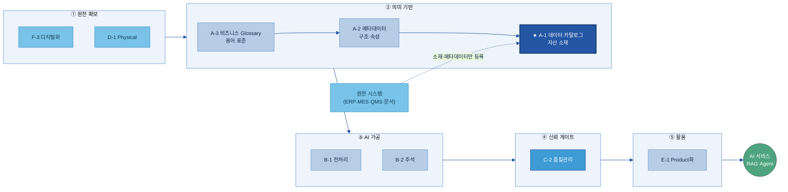
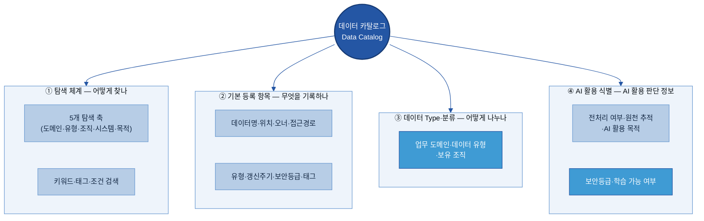
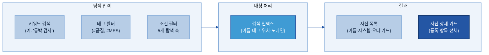
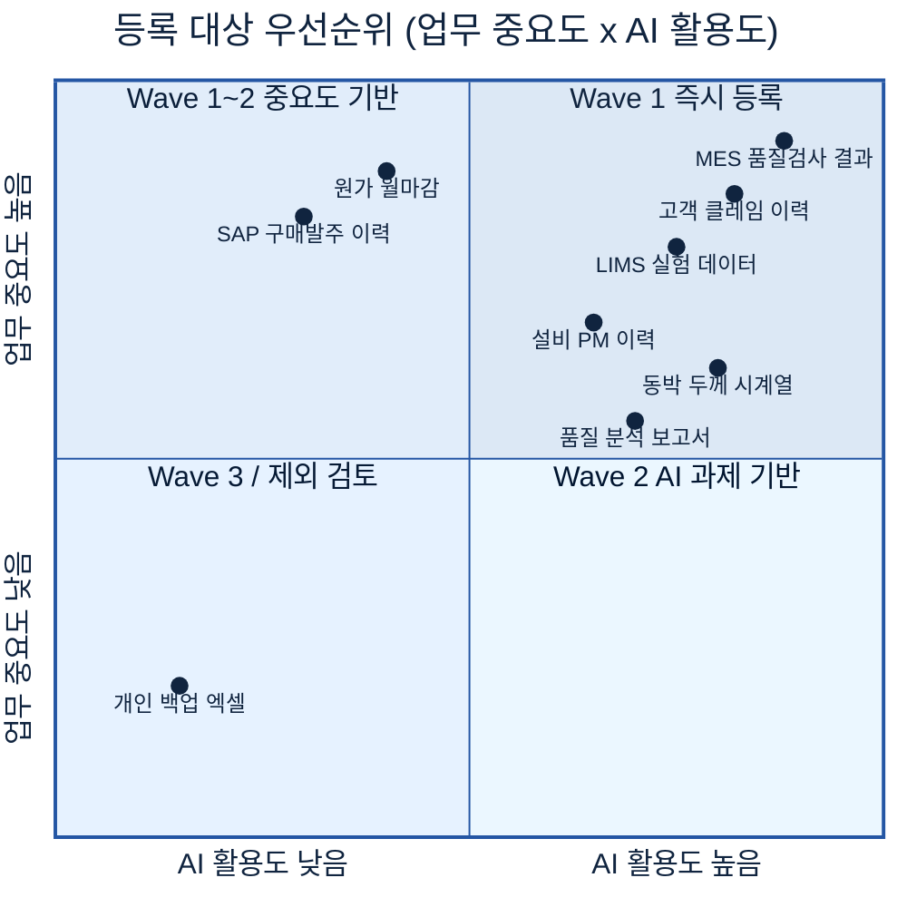
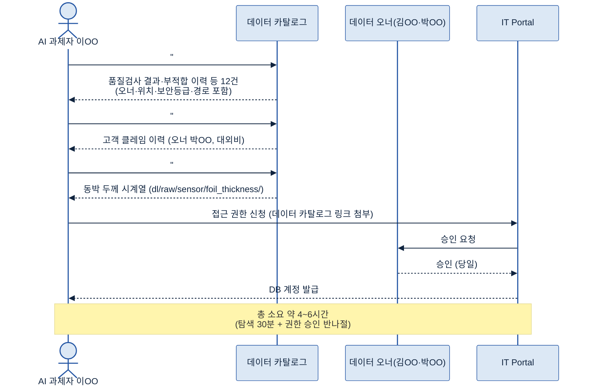
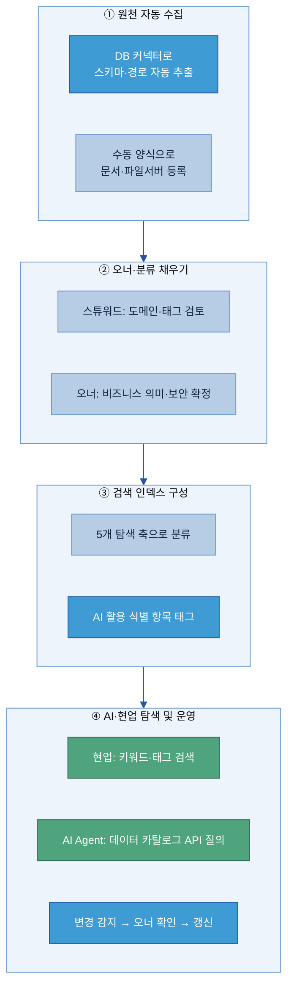
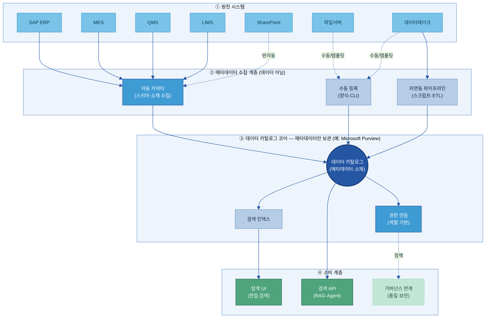
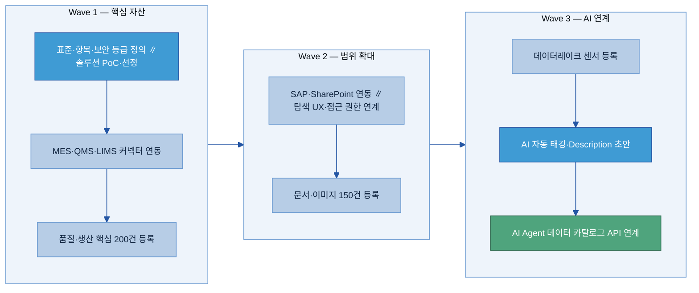
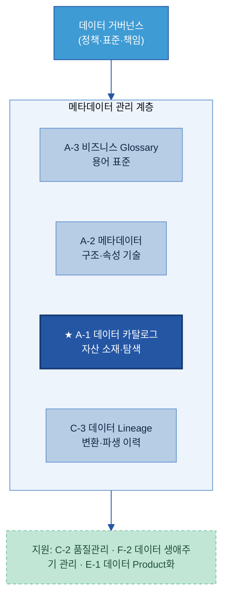
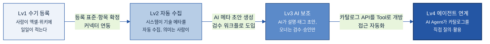

# A-1. 데이터 카탈로그

> 데이터 카탈로그(Data Catalog)는 AI와 사람이 "어디에 무슨 데이터가 있는지" 찾을 수 있도록, 데이터 자산의 **존재·위치·오너·접근 경로**를 등록해 둔 **자산 목록 체계**다. 소재를 찾는 "주소록"이지, 데이터 자체를 이동하거나 분석하는 도구가 아니다.

## 목차

1. [개요](#1-개요)
2. [왜 필요한가 (Why)](#2-왜-필요한가-why)
3. [무엇을 갖추나 (What — 등록 항목·구성)](#3-무엇을-갖추나-what--등록-항목구성)
4. [어디부터 등록하나 (When/우선순위)](#4-어디부터-등록하나-when우선순위)
5. [예시 시나리오 — 두산전자 적용 흐름](#5-예시-시나리오--두산전자-적용-흐름)
6. [솔루션 선정](#6-솔루션-선정)
7. [구축](#7-구축)
8. [운영](#8-운영)
9. [다른 주제와의 관계](#9-다른-주제와의-관계)
10. [성과 지표·고도화 로드맵](#10-성과-지표고도화-로드맵)

- [별첨 — 등록 항목 사전(전체)·빈 템플릿](#별첨-appendix)
- [참고자료(References)](#참고자료-references)
- [변경 이력 / 피드백 반영](#변경-이력--피드백-반영)

> 관련 가이드: [A-2 메타데이터](../A-2%20메타데이터/A-2%20메타데이터.md) · [A-3 비즈니스 Glossary](../A-3%20비즈니스%20Glossary/A-3%20비즈니스%20Glossary.md) · [C-3 데이터 Lineage](../C-3%20데이터%20계통%20Lineage/C-3%20데이터%20계통%20Lineage.md) · [F-2 데이터 생애주기 관리](../F-2%20데이터%20생애주기%20관리/F-2%20데이터%20생애주기%20관리.md) · [E-1 데이터 Product화](../E-1%20데이터%20Product화/E-1%20데이터%20Product화.md)

---

# A-1. 데이터 카탈로그

> 데이터 카탈로그(Data Catalog)는 AI와 사람이 필요한 데이터를 찾을 수 있도록 데이터 자산의 존재, 위치, 오너, 접근 경로를 등록·관리하는 자산 목록 체계이다. 데이터 자체를 이동하거나 분석하는 것이 아니라, 데이터 자산의 위치와 활용 정보를 관리하는 역할을 수행한다.

---

## 1. 개요

데이터 카탈로그는 조직이 보유한 데이터 자산의 위치, 관리 주체, 접근 정보를 체계적으로 관리하는 목록 체계이다. 데이터 자산이 어디에 존재하는지, 누가 관리하는지, 어떻게 접근할 수 있는지를 한곳에서 확인할 수 있도록 지원한다.

### 1.1 데이터 란 (자산의 위치 정보 관리 체계)

데이터를 활용하기 위해서는 데이터 자체뿐 아니라 해당 데이터가 어디에 존재하는지, 누가 관리하는지, 어떤 절차를 통해 접근할 수 있는지를 알아야 한다.

데이터 카탈로그는 이러한 정보를 체계적으로 관리하는 목록 체계이다.

예를 들어 특정 품질 데이터가 MES 시스템의 `QMS.dbo.INSP_RESULT` 테이블에 존재하고, 데이터 오너는 품질보증팀 김OO 책임이며, 매일 갱신된다는 정보를 등록·관리한다.

데이터 자체를 한곳에 저장하거나 이동하는 것이 아니라, 데이터 자산을 설명하는 정보를 수집하고 관리하는 것이 데이터 의 역할이다.

이때 데이터 카탈로그에 등록되는 설명 정보를 메타데이터(Metadata)라고 한다. 데이터 카탈로그는 메타데이터를 기반으로 데이터 자산을 탐색하고 관리할 수 있도록 지원한다.

데이터 카탈로그가 제공하는 핵심 기능은 다음과 같다.

- 어떤 데이터가 존재하는가
- 데이터가 어디에 있는가
- 누가 관리하는가
- 어떻게 접근하는가
- 어떤 목적으로 활용되는가

> 용어 풀이
>
> - 데이터 자산(Data Asset): 조직이 업무에 활용하거나 활용 가능한 모든 데이터
> - 데이터 오너(Data Owner): 특정 데이터 자산의 등록·갱신·접근 정책에 책임을 지는 담당자 또는 조직

### 1.2 목적과 적용 범위 (무엇을 다루고/안 다루는가)

데이터 카탈로그는 데이터 자산의 위치와 활용 정보를 관리하는 체계이며, 데이터 자체가 아니라 데이터를 설명하는 메타데이터를 관리한다.

#### 데이터 가 다루는 것 (IN)

- 데이터 자산 존재 여부 확인·등록
- 자산의 위치 기록
- 자산의 오너·보유 부서 관리
- 자산의 접근 경로 안내
- 자산의 탐색·분류 체계 관리
- 등록 정보 최신성 유지

#### 데이터 카탈로그가 다루지 않는 것 (OUT)

- 필드 수준 구조·단위·형식 정의 → A-2 메타데이터
- 용어 표준화·동의어 관리 → A-3 비즈니스 Glossary
- 데이터 품질 판정 및 사용 가능 여부 → C-2 데이터 품질 관리
- 데이터 이동·변환 이력 추적 → C-3 데이터 Lineage
- 데이터 보존·폐기 일정 → F-2 데이터 생애주기 관리

> 데이터 에 등록하는 대상은 데이터가 아니라 메타데이터이다. 데이터명, 위치, 오너, 접근 경로, 갱신 주기와 같은 정보를 등록하며, 메타데이터의 상세 구조와 표준은 A-2 메타데이터에서 관리한다.
>
> 데이터 는 데이터를 찾는 역할을 수행하며, 데이터의 의미 해석, 품질 판정, 변환 이력 관리는 인접 주제에서 담당한다.

### 1.3 대상 조직과 AI-ready 체계 내 위치

데이터 는 AI-ready Data 체계에서 데이터 자산을 발견하고 활용하기 위한 출발점 역할을 수행한다.

데이터 자산이 데이터 카탈로그에 등록되어 있어야 전처리, 분석, AI 활용 과정에서 필요한 데이터를 탐색할 수 있다.

A-3 비즈니스 Glossary는 업무 용어의 의미를 표준화하고, A-2 메타데이터는 데이터 구조와 속성을 설명하며, 데이터 는 이 정보를 기반으로 데이터 자산을 탐색할 수 있도록 지원한다.

| 조직 | 역할 |
|---|---|
| **지주/전사 데이터 조직** | 데이터 카탈로그 공통 표준·항목·거버넌스 정의. 계열사 간 일관성 확보 |
| **계열사 데이터 담당** | 자사 데이터 자산 등록·분류·갱신 운영. 오너 지정 지원 |
| **현업 데이터 오너** | 자신이 책임지는 자산의 등록 정보 확인·승인·갱신 요청 |
| **AI 과제 수행자 / 분석가** | 데이터 카탈로그로 활용 가능한 데이터 탐색. 미등록 자산 발견 시 등록 요청 |
| **데이터 스튜워드(Data Steward)** | 도메인별 등록 품질·분류 체계 관리 |

---

## 2. 왜 필요한가 (Why)

데이터 카탈로그는 단순히 데이터 목록을 관리하기 위한 체계가 아니다. 조직이 보유한 데이터 자산을 빠르게 찾고 활용할 수 있도록 지원함으로써 데이터 탐색에 소요되는 시간을 줄이고 AI 과제와 데이터 활용의 생산성을 높이는 역할을 수행한다.

### 2.1 현업 Pain Point

AI 과제 초기 단계에서 가장 자주 발생하는 문제 중 하나는 필요한 데이터의 존재 여부와 위치를 파악하기 어렵다는 점이다.

두산전자는 CCL(Copper Clad Laminate)을 제조한다. AI 과제팀이 동박 두께 불균일 결함 예측 모델을 구축하려고 할 때 필요한 데이터는 MES 공정 조건, QMS 검사 결과, LIMS 재료 시험 데이터, SharePoint 품질 보고서 등 여러 시스템에 분산되어 있다.

데이터 카탈로그가 없는 경우 다음과 같은 문제가 반복적으로 발생한다.

**Pain 1 — 존재 여부 불확실:** 필요한 데이터가 존재하는지 확인하기 어렵다. 데이터가 있을 것으로 예상했지만 실제로는 없거나, 특정 조직이 별도로 관리하고 있어 존재 여부를 파악하는 데 시간이 소요되는 경우가 발생한다.

**Pain 2 — 위치 파편화·탐색 어려움:** 데이터가 MES, QMS, LIMS, SharePoint, 파일 서버, 담당자 PC 등에 분산되어 있다. 통합 목록이 없기 때문에 담당자 문의에 의존하는 경우가 많다.

**Pain 3 — 오너·접근 경로 불명확:** 데이터 위치를 확인하더라도 데이터 오너가 누구인지, 어떤 절차를 통해 접근해야 하는지 확인하기 어려운 경우가 있다.

**Pain 4 — 중복 수집·가공 반복:** 기존 프로젝트에서 이미 확보하고 정제한 데이터가 존재함에도 이를 확인할 수 없어 동일한 데이터를 반복 수집·가공하는 경우가 발생한다.

> 정량 지표: 데이터 전문가들은 프로젝트 시간의 약 **20%를 데이터 탐색에 사용**한다는 조사 결과가 보고되고 있다(Atlan Modern Data Survey). 대규모 조직일수록 데이터 자산이 여러 시스템에 분산되어 있어 이러한 문제가 더욱 크게 나타난다.

### 2.2 기대 효과

**① 탐색 리드타임(Lead Time) 단축**

> **용어 풀이:** 리드타임(Lead Time) = 어떤 작업을 시작하고 완료하기까지 걸리는 총 시간

데이터 카탈로그를 구축하면 AI 과제 착수 시 자산 목록과 오너, 접근 경로를 빠르게 확인할 수 있다. 데이터 **검색 시간이 60% 단축**된 사례와 자동 수집을 통해 **초기 데이터 카탈로그 구축 시간을 65% 단축**한 사례가 보고되고 있다.

**두산전자 예시:** 동박 결함 예측 AI 과제 착수 시 데이터 위치 파악에 소요되는 시간을 7~8일 수준에서 1일 이하 수준으로 줄일 수 있다.

**② 데이터 중복 제거 및 재사용**

기존 AI 과제에서 구축한 데이터 자산을 데이터 카탈로그에서 식별하고 재활용할 수 있기 때문에 동일한 데이터를 반복 수집하거나 재가공하는 작업을 줄일 수 있다.

예를 들어 품질보증팀이 구축한 월별 수율 집계 테이블이 데이터 카탈로그에 등록되어 있다면 신규 원가 분석 과제에서도 해당 자산을 재활용할 수 있다.

**③ AI 활용 기반 확보**

AI 서비스와 Agent는 데이터 위치와 활용 가능 여부를 기계적으로 탐색할 수 있어야 한다.

데이터 카탈로그는 AI 서비스가 활용 가능한 데이터 자산을 탐색하고 식별하기 위한 기반 체계 역할을 수행한다.

> **용어 풀이:** RAG(Retrieval-Augmented Generation) = AI가 답변 생성 전에 관련 데이터와 문서를 검색하여 함께 활용하는 방식

**④ 신뢰 가능한 데이터 활용**

갱신 주기, 업데이트 시점, 데이터 오너 등의 정보를 함께 관리함으로써 데이터 관리 상태를 확인할 수 있다.

이를 통해 활용 가능한 데이터를 보다 빠르게 식별하고 검토할 수 있다.

> 자회사 관점에서 데이터 카탈로그는 데이터 탐색 시간을 줄이고, 데이터 재사용을 확대하며, AI 활용을 위한 데이터 기반을 구축하는 출발점 역할을 수행한다.

---

## 3. 무엇을 갖추나 (What — 등록 항목·구성)

데이터 카탈로그는 크게 네 가지 요소로 구성된다. 첫째는 탐색 체계, 둘째는 등록 항목, 셋째는 분류 기준, 넷째는 AI 활용 관련 식별 정보이다.

본 문서에서는 이 네 가지 요소를 기준으로 데이터 카탈로그 구성 방식을 설명한다. 여기서 등록 항목은 데이터를 설명하는 정보, 즉 메타데이터를 의미한다.

### 3.1 데이터 카탈로그 조회 방식 (검색·탐색 화면 구성)

데이터 탐색은 크게 두 가지 방식으로 이루어진다. 하나는 키워드와 태그를 활용하여 직접 검색하는 방식이고, 다른 하나는 분류 체계를 따라 탐색 범위를 단계적으로 좁혀가는 방식이다.

실제 운영 환경에서는 두 방식을 함께 활용하는 경우가 일반적이다.

> 핵심 질문 4 — "AI나 사용자가 필요한 데이터를 어떻게 쉽게 찾게 하나?"에 답하는 절이다. (분류 축은 §3.4, 검색 운영은 §8.2 참조)

**두산전자 탐색 시나리오:** AI 과제 수행자가 동박 결함 예측 모델을 개발하려고 할 때, 데이터 카탈로그에서 업무 도메인 = 품질보증, 시스템 = MES, 태그 `#검사` 조건으로 검색하면 관련 자산 목록을 확인할 수 있다. 각 자산의 오너, 접근 경로, 보안 등급을 함께 확인한 뒤 데이터 확보 절차를 진행할 수 있다.

> 탐색 체계는 데이터 의미를 정의하는 역할을 수행하지 않는다. 데이터 의미와 구조는 A-2 메타데이터와 A-3 비즈니스 Glossary에서 관리한다.

### 3.2 항목 구성 기준 (찾기 위한 최소 정보)

데이터 카탈로그에 등록되는 정보는 성격에 따라 업무, 기술, 운영, 보안, AI 활용 관점으로 구분할 수 있다.

데이터 카탈로그는 데이터 자산을 찾고 활용하는 데 필요한 정보를 중심으로 관리하며, 상세 기술 정의와 표준은 인접 주제에서 담당한다.

업계 표준과 AI-ready Data 관점을 기준으로 정리하면 다음과 같다.

| 항목 갈래 | 포함하는 항목 | 필수/선택 |
|------|------|-----------|
| 업무(Business) | 자산명·도메인·설명·활용 목적 | 필수(일부) |
| 기술(Technical) | 보유 시스템·저장 위치·데이터 유형·주요 컬럼 | 필수(일부) |
| 운영(Operational) | 오너·보유 부서·접근 경로·갱신 주기·태그 | 필수 |
| 보안/컴플라이언스(Compliance) | 보안 등급·개인정보 포함 여부·사용 목적 제한 | 필수 |
| AI 활용(AI) | AI 활용 가능 등급·전처리 필요 여부·데이터 Lineage 연결 | 선택 → 고도화 시 보강 |

> 항목의 상세 정의와 표준 스키마는 A-2 메타데이터에서 관리한다. 데이터 카탈로그는 데이터 탐색과 활용에 필요한 수준의 정보만 관리한다.
>
> 운영 관점에서는 항목 수를 늘리는 것보다 핵심 항목을 빠짐없이 유지하는 것이 중요하다.

### 3.3 기본 등록 항목 (데이터명·시스템·위치·오너·접근경로·갱신주기)

자산 1건을 등록할 때 필요한 최소 정보 집합이다. 데이터가 어디에 존재하며, 누가 관리하고, 어떤 절차를 통해 접근할 수 있는지를 기록한다.

> 핵심 질문 2 — "데이터 자산의 위치와 접근 경로를 어떻게 기록하나?"에 답하는 절이다.

> `필수`는 등록을 위해 반드시 필요한 정보이며, `선택`은 탐색과 활용 편의성을 높이기 위한 정보이다.
>
> 작성 주체는 자동, 오너, 보안으로 구분한다. 자동 항목은 플랫폼이 수집하고, 오너와 보안 조직은 의미·책임·보안 정보를 보완한다.

| # | 항목 | 쉬운 의미 | 필수/선택 | 작성 주체 | 두산전자 완성 예시 |
|---|------|------|:---:|:---:|-------------------|
| 1 | **데이터명** | 자산을 부르는 공식 이름. 약어만 쓰지 않는다 | 필수 | 자동→오너 | `일일 품질검사 결과 (INSP_RESULT)` |
| 2 | **보유 시스템** | 자산이 존재하는 시스템 (솔루션명+용도) | 필수 | 자동 | `MES (생산 실행 시스템)` |
| 3 | **저장 위치** | 테이블명·폴더 경로·DB 스키마 등 실제 위치 | 필수 | 자동 | `QMS.dbo.INSP_RESULT` |
| 4 | **데이터 오너** | 이 자산의 정확성·접근 정책을 책임지는 사람 | 필수 | 오너 | `품질보증팀 김OO 책임` |
| 5 | **보유 부서** | 오너가 속한 관리 조직 | 필수 | 자동→오너 | `품질보증팀` |
| 6 | **접근 경로** | 이 자산에 접근하는 절차·방법 | 필수 | 오너 | `인트라넷 → 데이터 신청 → QMS 조회 권한 신청 (1일 이내 승인)` |
| 7 | **데이터 유형** | 정형/문서/이미지/시계열/반정형 등 | 필수 | 자동 | `정형(Table)` |
| 8 | **갱신 주기** | 얼마나 자주 업데이트되는가 | 선택 | 자동 | `일 1회 (전일 생산 마감 후 00:30 반영)` |
| 9 | **보안 등급** | 민감도·공개 수준 (공개/사내/대외비/기밀) | 필수 | 보안 | `대외비` |
| 10 | **태그** | 탐색·필터에 쓰이는 키워드 (표준값에서 선택 → §3.6) | 선택 | 오너 | `#품질 #검사 #동박 #MES #제조` |

> 전체 등록 항목 사전(기술·업무·운영 및 비정형 자산 포함)은 Appendix A에서 확인할 수 있다. 본문에서는 운영에 필요한 핵심 10개 항목을 중심으로 설명한다.

---

### 3.4 데이터 분류 기준 (업무 도메인·데이터 유형·보유 조직)

분류 기준은 탐색을 위한 핵심 축이다. 적절한 분류 체계가 있어야 "품질 도메인 → 정형 데이터 → MES"와 같이 탐색 범위를 단계적으로 좁혀갈 수 있다.

> 핵심 질문 4 — "AI나 사용자가 필요한 데이터를 어떻게 쉽게 찾게 하나?"에 답하는 절이다. (검색·조회 운영은 §8.2 참조)

> 정형, 문서, 이미지와 같은 데이터 유형은 탐색 필터의 한 축으로 활용된다. 유형별 구조와 스키마에 대한 상세 내용은 A-2 메타데이터에서 다룬다.

| 탐색 축 | 의미 | 두산전자 예시 값 |
|---------|------|-----------------|
| **업무 도메인** | 어떤 업무 영역인가 | 품질보증 / 생산 / 설비관리 / 원가 / 구매 / 영업 |
| **데이터 유형** | 어떤 형태인가 | 정형 / 문서 / 이미지 / 시계열 / 반정형 |
| **보유 조직** | 어느 부서가 관리하는가 | 품질보증팀 / 생산기술팀 / IT팀 / 구매팀 |
| **시스템** | 어느 시스템에서 생성·관리되는가 | SAP / MES / QMS / LIMS / SharePoint / 데이터레이크 |
| **활용 목적** | 어떤 AI·업무 과제에 활용되는가 | 품질 예측 / 설비 예지보전 / 원가 분석 / 클레임 분석 |

이 다섯 가지 탐색 축은 등록 항목의 도메인 태그, 데이터 유형, 보유 부서, 보유 시스템 정보와 연결되어 탐색 체계를 구성한다.

| 유형 | 두산전자 예시 | AI 활용 시 고려 사항 |
|------|---------------|---------------------|
| 정형(Structured) | INSP_RESULT, CLAIM_HIST | 컬럼 메타데이터(A-2) 연결 필요 |
| 문서(Document) | 결함 분석 보고서, SOP, FMEA | B-1 전처리 필요 |
| 이미지(Image) | 외관 결함 사진, 단면 이미지 | B-2 데이터 해설·주석 필요 |
| 시계열(Time-series) | 동박 두께(1초), 설비 전류·진동 | 샘플링 주기·단위 관리 중요 |
| 반정형(Semi-structured) | API 응답 JSON, 설비 알람 로그 | 구조화 및 전처리 필요 |

### 3.5 AI 활용 식별 항목 (전처리 여부·원천 추적·AI 활용 목적)

AI 과제를 수행할 때는 데이터 위치뿐 아니라 해당 데이터를 AI 활용에 사용할 수 있는지도 함께 판단해야 한다.

데이터 카탈로그는 데이터 위치 정보와 함께 전처리 여부, 보안 조건, 활용 가능 여부를 확인할 수 있는 식별 정보를 제공한다.

기존 데이터 카탈로그가 "어디에 있는가"에 초점을 두었다면, AI-ready Data 관점의 데이터 카탈로그는 "어떤 조건에서 활용 가능한가"에 대한 정보도 함께 제공한다.

| AI-ready 차원 | 데이터 카탈로그 등록 항목 | 두산전자 예시 |
|---|---|---|
| **발견 가능성** | 비즈니스 설명·오너 기록·최신성 정보 | Description: "동박 라인 일일 외관·전기적 특성 검사 결과" |
| **데이터 Lineage** | 원천 시스템·수집 방법·변환 이력 | 원천: MES.dbo.PROD_LOG → QMS 야간 배치 ETL |
| **전처리 여부** | AI 활용 가능 등급·전처리 필요 여부 | "전처리 필요 (결측치 처리, 코드 디코딩)" |
| **보안·접근 거버넌스** | 보안 등급·AI 학습 가능 여부·개인정보 포함 여부 | "가명화 후 가능 (고객 로트코드 마스킹)" |
| **의미 정보** | 비즈니스 Glossary 링크·도메인 태그·스키마 문서 연결 | A-2 메타데이터 링크, A-3 비즈니스 Glossary 연결 |

> 범위 구분:
>
> 데이터 카탈로그는 AI가 자산을 탐색하고 활용 가능 여부를 판단하는 데 필요한 요약 정보를 제공한다.
>
> 학습·검증 데이터 분할, 라벨 정의, 필드 단위 변환 규칙과 같은 상세 AI/ML 메타데이터는 A-2 메타데이터와 B-2 데이터 해설·주석에서 관리한다.
>
> 데이터 카탈로그는 자산의 존재 여부, 위치, 활용 조건을 안내하고 상세 정보는 인접 주제로 연결한다.

> Croissant 형식(MLCommons, 2024)은 ML 데이터셋을 위한 상세 메타데이터 형식으로 학습·검증·테스트 분할, Responsible AI 문서, 인용 정보 등을 포함한다. 이러한 상세 형식은 A-2 메타데이터 영역에서 관리하며, 데이터 카탈로그는 해당 정보의 위치만 연결한다.

**두산전자 예시:** `고객 클레임 이력(CLAIM_HIST)`은 "AI 활용 가능 등급: 가명화 후 가능, 고객명·연락처 마스킹 조건"으로 등록할 수 있다. 이를 통해 AI 과제 수행자는 데이터 확보 이전에 활용 조건을 확인할 수 있다.

### 3.6 태그 표준값 목록 (자유입력 금지 — 표준값 선택)

태그는 탐색과 분류 체계를 구성하는 핵심 요소이다.

동일한 의미를 가진 태그가 여러 방식으로 입력되면 검색 품질이 저하될 수 있으므로, 데이터 카탈로그에서는 자유 입력보다 표준값 목록을 활용하는 방식을 권장한다.

> 예를 들어 `대외비`, `기밀`, `confidential`과 같이 동일한 의미가 여러 방식으로 입력되면 검색과 보안 필터링 결과가 달라질 수 있다.
>
> 표준값을 사용하면 검색 정확도와 보안 정책 적용의 일관성을 유지할 수 있다.

| 태그 Key | 무엇을 구분 | 값(Value) 예 | 필수/선택 | 작성 주체 |
|---|---|---|:---:|:---:|
| `sensitivity` | 보안 민감도 | `공개 / 사내 / 대외비 / 기밀` | 필수 | 보안 |
| `pii` | 개인정보 포함 여부 | `있음 / 없음` | 필수 | 보안 |
| `domain` | 업무 도메인 | `품질 / 생산 / 설비 / 원가 / 구매 / 영업` | 필수 | 오너 |
| `data_type` | 데이터 형태 | `정형 / 문서 / 이미지 / 시계열 / 반정형` | 필수 | 자동 |
| `ai_usable` | AI 활용 가능 등급 | `그대로 가능 / 가명화 후 가능 / 불가` | 필수 | 보안 |
| `security_context` | 제조업 특화 민감도 | `영업비밀(공정 레시피) / 협력사 민감 / 사내 공개` | 선택 | 보안·오너 |
| `source_system` | 원천 시스템 | `SAP / MES / QMS / LIMS / SharePoint` | 선택 | 자동 |

> 이 목록은 데이터 카탈로그 탐색과 보안 필터에 사용하는 대표 태그이다.
>
> 전사 표준 태그 사전은 A-2 메타데이터 및 거버넌스 체계에서 관리하며, 데이터 카탈로그는 탐색과 활용 판단에 필요한 항목을 활용한다.

---

## 4. 어디부터 등록하나 (When/우선순위)

모든 데이터를 동시에 등록하는 방식은 현실적으로 운영하기 어렵다. 등록 대상이 지나치게 많아지면 관리 부담이 증가하고, 등록 정보의 최신성을 유지하기 어려워진다.

따라서 AI 활용 가치와 업무 중요도가 높은 자산부터 우선 등록하고, 이후 단계적으로 범위를 확대하는 접근이 필요하다.

> 핵심 질문 1 — "어떤 데이터 자산을 데이터 카탈로그에 등록해야 하나?"에 답하는 절이다.

### 4.1 등록 대상 범위

데이터 카탈로그 구축 과정에서 가장 흔한 실패 사례 중 하나는 등록 대상을 지나치게 넓게 설정하는 것이다.

등록 대상이 과도하게 많아지면 등록과 갱신에 필요한 부담이 증가하고, 시간이 지나면서 오너가 없거나 최신 상태가 아닌 자산이 누적될 수 있다.

등록 대상은 다음 세 가지 기준을 중심으로 선정한다.

| 기준 축 | 판단 질문 | 두산전자 예시 |
|---|---|---|
| ① AI 활용 가능성 | AI 학습·추론·RAG·분석에 활용될 수 있는가 | MES 품질검사 결과, 고객 클레임 이력 |
| ② 업무 중요도 | 생산·품질·원가 등 핵심 업무에 필요한가 | SAP 원가 월마감, QMS 판정 이력 |
| ③ 재사용성 | 여러 조직과 과제에서 반복 활용되는가 | LIMS 실험 결과, 동박 두께 시계열 |

> 세 가지 기준 가운데 두 개 이상에 해당하면 우선 등록 대상, 하나만 해당하면 Wave 2 후보, 해당하지 않으면 후순위 대상으로 검토한다.

### 4.2 유형별 등록/제외

- **정형 DB 테이블:** 커넥터를 통한 자동 수집이 가능하므로 핵심 테이블 중심으로 등록한다. 임시 뷰, 로그성 테이블, 운영 내부 관리용 테이블은 제외한다.
- **문서·보고서:** 정기 보고서, 표준 절차서, 품질 분석 자료 등 재사용 가치가 확인된 문서를 우선 등록한다.
- **이미지:** 이미지 위치, 저장 구조, 포맷 정보를 등록한다. 상세 주석 정보는 B-2 데이터 해설·주석과 연계한다.
- **시계열 데이터:** 설비 ID, 공정 ID, 샘플링 주기, 단위 정보를 함께 등록한다.
- **제외 기준:** 개인 PC 임시 파일, 중복 복사본, 폐기 예정 자산, 테스트 및 더미 데이터

### 4.3 정형 데이터 중요도 선별

정형 데이터는 등록 대상 수가 가장 많기 때문에 활용도와 영향도를 기준으로 우선순위를 결정한다.

| 선별 지표 | 측정 방법 | 두산전자 예시 |
|---|---|---|
| 사용 빈도 | 쿼리 로그·ETL 참조 횟수(최근 6개월) | `INSP_RESULT` 월 평균 400회 조회 |
| 연계 시스템 수 | 참조 시스템·파이프라인 수 | 품질검사 결과가 MES·BI·AI 3개 참조 |
| 다운스트림 영향도 | 오류 시 영향받는 보고서·서비스·모델 수 | 월 품질 KPI 리포트·결함 예측 모델 |

> 예시 기준: 세 지표 합산 상위 20% → Wave 1, 21~50% → Wave 2, 나머지 → Wave 3

### 4.4 수집·등록 방식 (자동 vs 수동)

> 핵심 질문 3 — "여러 시스템에 흩어진 데이터를 하나의 데이터 카탈로그로 어떻게 통합하나?"에 답하는 절이다. (레거시·미연동 연동 방안은 §7.3 참조)

- **자동 수집(커넥터):** SAP·MES·QMS·LIMS 등 DB 기반 시스템은 솔루션 커넥터 또는 JDBC를 활용하여 스키마, 테이블, 통계 정보를 자동 수집한다. 신규 테이블이나 컬럼 변경도 자동으로 감지할 수 있다.
- **수동 등록(양식+오너):** SharePoint, 파일 서버, 개인 파일 등 비정형 자산은 표준 양식을 활용하여 등록한다.

### 4.5 보안 검토 (내부 학습 vs 외부 LLM 노출)

| 보안 등급 | 데이터 카탈로그 노출 범위 | 접근 통제 |
|---|---|---|
| 공개(Public) | 전체 항목 | 최소 인증 |
| 사내(Internal) | 전체 항목 | 임직원 인증 |
| 대외비(Confidential) | 자산명·부서 정보만 노출 | 오너 승인 + 보안 검토 |
| 기밀(Highly Restricted) | 미등록 또는 별도 격리 데이터 카탈로그 | 별도 통제 |

**예시:** `CS.CLAIM_HIST`(고객사명·단가 포함)는 대외비 등급으로 관리한다. 데이터 카탈로그에는 "고객 클레임 이력(CS팀 박OO, 대외비)"만 표시하고, 실제 접근은 오너 승인 이후 허용한다.

### 4.6 최종 우선순위 — 자동 수집 우선

등록 대상이 수백 건에 이르더라도 모든 항목을 사람이 직접 입력하는 방식은 운영 효율성이 낮다.

실무에서는 메타데이터의 상당 부분을 자동 수집하고, 데이터 오너와 데이터 스튜워드가 의미 정보와 보안 정보를 보완하는 방식으로 운영한다.

| 자동화 메커니즘 | 자동으로 채워지는 것 | 사람이 수행하는 것 |
|---|---|---|
| 커넥터 자동 스캔 | 스키마·컬럼·타입·건수·갱신일 | 도메인·태그·오너 확정 |
| 로그 기반 중요도 분석 | 사용 빈도·Tier 자동 계산 | Tier 기준 조정 |
| Lineage 자동 추출 | 데이터 흐름도 자동 생성 | 상세 검토 및 활용 목적 정의 |
| AI 메타 초안 생성 | Description·태그·품질 코멘트 초안 | 검토 및 승인 |
| 템플릿 일괄 수집 | 비정형 자산 등록 | 신규 자산 최초 등록 |

> 데이터 카탈로그 운영은 "전수 입력"보다 "자동 수집 → 검토 및 승인" 구조를 지향한다.
>
> 자동화는 반복적인 등록 작업을 줄이고, 사람은 업무 맥락, 보안 판단, 최종 승인과 같은 역할에 집중할 수 있다.

| Wave | 시기 | 대상 | 두산전자 예시 |
|---|---|---|---|
| Wave 1 | 1~3개월 | AI 활용도와 업무 중요도가 모두 높은 핵심 50~100건, 자동 수집 DB 중심 | MES 품질검사, 클레임, LIMS 실험, SAP 원가 |
| Wave 2 | 4~9개월 | 한쪽 기준이 높은 자산 100~200건, 문서·시계열 포함 | 설비 PM, SharePoint 보고서, 동박 시계열 |
| Wave 3 | 10개월~ | 나머지 + On-Demand | 구매 발주 이력, 아카이빙 예정 레거시 |

**두산전자 Wave 1 목표:** 핵심 100건을 3개월 내 등록한다. SAP·MES·QMS는 커넥터를 통해 자동 수집하고, SharePoint 보고서는 수동 등록 방식으로 관리한다.

---

## 5. 예시 시나리오 — 두산전자 적용 흐름

데이터 카탈로그 도입 전후의 차이를 두산전자 AI 과제 사례를 통해 살펴본다. 본 장은 데이터 탐색 과정에서 데이터 카탈로그가 어떤 역할을 수행하는지 설명하고, 이후 6~8장의 구축·운영 방법과 연결된다.

### 5.1 적용 전/후 대비

**AS-IS (데이터 카탈로그 없음 — 7~8일)**

두산전자 AI 과제팀이 "동박 결함률 예측" 과제를 착수할 경우, 데이터 위치와 담당자를 파악하는 데 상당한 시간이 소요된다.

| 필요 데이터 | 있을 것으로 예상 | 실제 상황 |
|---|---|---|
| 공정 조건(온도·압력·속도) | MES | "MES에 있을 것으로 보이나 담당자 변경으로 테이블 정보 확인 필요" |
| 두께 검사 결과 | QMS | "QMS에 존재하나 정확한 위치 확인 필요" |
| 재료 시험 데이터 | LIMS | "R&D 조직 별도 관리, 공유 경로 불명확" |
| 결함 분석 보고서 | SharePoint·파일서버 | "여러 저장소에 분산, 최신 버전 확인 필요" |
| 고객 클레임 이력 | C/S 시스템 | "데이터 존재는 확인되나 접근 절차 확인 필요" |

**TO-BE (데이터 카탈로그 구축 후 — 4~6시간)**

| 항목 | AS-IS | TO-BE |
|---|---|---|
| 데이터 존재 파악 | 구두 문의 2~3일 | 키워드 검색 수분 내 |
| 위치·테이블 확인 | IT 문의 1~3일 | 카드 즉시 조회 |
| 오너 파악 | 부서 전달·확인 필요 | 오너 정보 즉시 확인 |
| 전체 탐색 리드타임 | 7~8일 | 4~6시간 |

### 5.2 흐름 미리보기 (원천 자동 수집 → 오너 채우기 → 분류 → AI·현업 탐색)

데이터 카탈로그 구축과 운영 흐름은 크게 네 단계로 구성된다.

> 이 흐름의 세부 구현 방법은 6장(솔루션 선정), 7장(구축), 8장(운영)에서 설명한다.

---

## 6. 솔루션 선정

데이터 카탈로그 솔루션은 원천 시스템 연계 범위, 자동 메타데이터 수집 기능, 계열사 확장성을 중심으로 검토해야 한다.

또한 반드시 실제 원천 시스템을 연결하는 PoC를 수행하여 운영 가능성을 검증한 뒤 도입 여부를 결정한다.

> 이 절은 데이터 카탈로그 관점의 기능 비교를 다룬다. 솔루션을 여러 주제와 함께 통합적으로 평가하려면 Tech Stack 비교 정본을 함께 참고한다.

### 6.1 솔루션 유형·적용 범위

| 유형 | 특징 | 대표 솔루션 | 두산 관점 |
|---|---|---|---|
| **전용 데이터 카탈로그** | 거버넌스·용어집·승인 워크플로 완성도. 구축 3~6개월 | Collibra, Alation, Informatica CDGC, Atlan, IBM Knowledge Catalog | 거버넌스 성숙 조직, 대규모 계열사 |
| **클라우드 네이티브** | 해당 클라우드 서비스와 강력히 통합. 타 클라우드 제한 | Microsoft Purview, AWS Glue Data Catalog, Google Knowledge Catalog, Databricks Unity Catalog | 단일 클라우드 환경, Azure 활용 계열사 |
| **오픈소스** | 라이선스 비용 없음. 자체 운영 역량 필요 | DataHub, OpenMetadata | 엔지니어링 역량 있는 IT 조직 |

> 구축 방식, 기능 범위, 가격은 버전에 따라 변동될 수 있으므로 공식 문서, 벤더 데모, PoC를 통해 확인한다.

### 6.2 후보 검토·기능 비교

**핵심 비교 기준 7가지**

① 커넥터 범위 (SAP·MES·QMS·LIMS·SharePoint 지원 여부)

② 자동 메타데이터 수집 (스키마 자동 수집·갱신)

③ 검색·탐색 UX (자연어 검색·다중 조건 필터)

④ 권한·거버넌스 (역할 기반 접근 제어)

⑤ 데이터 Lineage 연계 (C-3 데이터 Lineage 연동)

⑥ AI 기능 (자동 태깅·자연어 탐색·메타데이터 초안 생성)

⑦ 계열사 확장성 (멀티 도메인 지원)

**두산전자 환경 기준 후보 3종 비교**  
(Azure Data Lake Gen2 + Oracle/MS SQL + SharePoint Online, 데이터 조직 1년차)

| 평가 기준 | Microsoft Purview | DataHub(오픈소스) | Atlan(SaaS) |
|---|:---:|:---:|:---:|
| Azure·M365 연계 | ★★★★★ | ★★★ | ★★★★ |
| Oracle/MS SQL 커넥터 | ★★★★ | ★★★★ | ★★★★ |
| LabWare LIMS 연계 | ★★(수동) | ★★(커스텀) | ★★★(API) |
| 검색·탐색 UX | ★★★★ | ★★★ | ★★★★★ |
| 운영 부담 | ★★★★ | ★★(자체 운영) | ★★★★★ |
| AI 자연어 탐색 | ★★★★(Copilot) | ★★★ | ★★★★ |

> Purview는 Azure 환경과의 연계성이 높고 운영 부담이 낮다는 장점이 있다. 반면 LabWare LIMS 연계는 별도 검증이 필요하므로 PoC에서 확인해야 한다.

Gartner Magic Quadrant for Data and Analytics Governance Platforms 2025~2026 Leaders: Collibra, Alation, Informatica, IBM, Atlan.

### 6.3 평가·선정·PoC 기준

평가는 기능 비교 → 후보 압축 → PoC → 최종 선정 순으로 진행한다.

최종 선정 시에는 PoC 결과뿐 아니라 운영 비용(TCO), 벤더 지원 체계, 내부 운영 역량도 함께 고려한다.

**두산전자 PoC 검증 시나리오**

| 검증 항목 | 방법 | 합격 기준 |
|---|---|---|
| 원천 연결 | SAP+MES+SharePoint 커넥터 | 3개 연결 성공, 스키마 자동 수집 |
| 자동 수집률 | Wave 1 대상 50개 수집 | 스키마·건수·갱신일 90% 이상 |
| 검색 정확도 | "품질검사"·"동박 두께"·"클레임" 검색 | 관련 자산 상위 3건 내 |
| 권한 연동 | 보안 등급별 노출 통제 | 대외비 정보 비권한자 차단 |
| 수동 등록 | SharePoint 문서 10건 등록 | 건당 5분 이내 |

---

# 7. 구축

"어디에 무엇이 있는지"를 기계가 읽을 수 있도록 만드는 과정이다. 등록할 메타데이터 항목 정의 → 메타데이터 검토 및 보완 → 아키텍처 설계 → 파이프라인 구축 → 초기 적재 및 검증 순으로 진행한다.

> 구축 대상은 데이터가 아니라 메타데이터이다.
>
> 데이터 카탈로그 구축은 원천 데이터를 이동하거나 복제하는 작업이 아니라, 데이터 자산을 설명하는 메타데이터를 수집하고 탐색 가능하게 만드는 작업이다. 따라서 첫 단계는 어떤 메타데이터 항목을 등록할지 정의하는 것이다.

#### 7.0 등록할 메타데이터 항목(스키마) 정의·작성

본격적인 수집에 앞서 3.2~3.3에서 정의한 메타데이터 항목을 자산 유형별로 확정한다.

어떤 항목을 필수와 선택으로 구분할 것인지, 입력 양식과 작성 기준은 무엇인지 정의해야 한다. 이 단계가 생략되면 동일한 자산도 사람마다 다른 형식으로 입력하게 되어 탐색 품질이 저하될 수 있다.

- **누가:** 항목 표준과 필드 정의는 **데이터 카탈로그 관리자(A/R)**, 자산별 실제 작성은 **데이터 오너(R)**, 도메인·태그 검토는 **데이터 스튜워드(A/R)**가 수행한다.
- 두산전자 예시: "정형 DB는 10개 필수 항목", "문서는 7개 필수 항목"과 같이 유형별 입력 기준을 먼저 확정한 뒤 등록을 진행한다.

### 7.1 수집한 메타데이터 검토·정합성 보완

4장에서 구축한 초기 인벤토리를 기준으로 등록 대상 자산을 점검한다.

| 점검 항목 | 내용 | 두산전자 예시 |
|---|---|---|
| 필수 항목 충족 | 데이터명·위치·오너·경로·유형·갱신주기 | 품질검사 테이블 오너 "미정" 발견 |
| 위치 유효성 | 시스템·테이블·폴더 경로 현재 유효 | 구형 LIMS 이관 후 경로 변경 확인 필요 |
| 분류·태그 일관성 | 탐색 축 태그 누락·중복 없음 | `#품질`과 `#QA` 혼재 → 통일 필요 |
| 중복 등록 후보 | 동일 자산 시스템만 다르게 2회 | MES·QMS 동시 집계 자산 확인 |
| 보안 등급 공백 | 민감 자산 등급 누락 | 클레임 이력 등급 미설정 발견 |

초기 인벤토리에서는 오너 공백, 경로 오류, 태그 혼용과 같은 문제가 자주 발견된다.

보완 절차는 스튜워드 검토 → 데이터 오너 확인 → 수정 반영 → 미응답 시 에스컬레이션 순으로 진행한다.

### 7.2 To-Be 아키텍처 (솔루션 기반)

| 계층 | 역할 | 설계 포인트 |
|---|---|---|
| ① 원천 | 자산(실제 데이터)이 존재하는 곳 | 원천별 연결 방식 결정 |
| ② 수집 | 원천에서 메타데이터를 수집 | 자동·수동·미연동 경로 병행 |
| ③ 코어 | 메타데이터 등록·검색·권한 관리 | 자산 위치 및 관리 정보 통합 |
| ④ 소비 | 사람(UI)·기계(API) 활용 | AI 과제 및 거버넌스 연계 |

> 위 구조에서 이동하는 것은 데이터가 아니라 메타데이터이다.
>
> 실제 데이터는 원천 시스템에 그대로 존재하며, 이용자는 데이터 카탈로그를 통해 위치를 확인한 뒤 원천 시스템에 접근한다.

### 7.3 Legacy 연동·미연동/수동 업로드 Pipeline

> 핵심 질문 3 — "여러 시스템에 흩어진 데이터를 하나의 데이터 카탈로그로 어떻게 통합하나?"에 답하는 절이다.

**레거시 DB 연동 순서**

① 목록 식별 → ② 연결 가능성 평가 → ③ 연동 방식 결정 → ④ IT·보안 승인

| 연동 방안 | 조건 | 두산전자 적용 |
|---|---|---|
| A. JDBC 직연동 | JDBC 지원 + 커넥터 존재 + 망 분리 없음 | SAP·MES·QMS |
| B. 메타 추출 스크립트 → API | JDBC 지원, 커넥터 없음 | LIMS |
| C. 레이크 복제 후 레이크 커넥터 | JDBC 불가 또는 망 분리 | 구형 설비 시스템 |
| D. 수동 등록 | 비정형·개인 파일 | SharePoint 보고서, 파일서버 이미지 |

**미연동 파이프라인 설계 원칙**

- 수집 주기 정의
- 실패 시 재시도 체계 구축
- 중복 등록 방지
- 파이프라인 자체도 데이터 카탈로그에 등록

### 7.4 초기 적재·검증

① 벌크 적재 → ② 검증 → ③ 현업 탐색 시연 순으로 진행한다.

**합격 기준(Wave 1)**

- 등록 완료율 90% 이상
- 필수 항목 충족률 95% 이상
- 검색 정확도: 기준 키워드 10개 중 8개 이상 상위 5개 결과 노출
- 권한 연동 정상 동작

**두산전자 구축 Wave 순서**

### 7.5 담당자 역할 (오너·현업·IT·보안·AI 조직 RACI)

> RACI 기호: R = 실행, A = 최종 책임·승인, C = 협의, I = 통보

(표는 원본 유지)

### 7.6 잘 쓴 등록 vs 못 쓴 등록 (Before → After)

(표는 원본 유지)

### 7.7 실제로 어디서 채우나 — 플랫폼 매핑

위 항목 가운데 자동 수집 항목은 데이터 플랫폼이 이미 보유한 시스템 메타데이터를 활용한다.

사람이 모든 정보를 새로 입력하는 것이 아니라, 자동 수집 정보를 기반으로 의미 정보와 책임 정보를 보완하는 방식으로 운영한다.

- Databricks(Unity Catalog): `information_schema` 기반 자동 수집
- Snowflake·BigQuery·SAP: 시스템 메타데이터 활용
- Microsoft Purview·Collibra: 커넥터 기반 자동 수집 지원

---

## 8. 운영

데이터 카탈로그의 가치는 구축 시점보다 운영 과정에서 결정된다.

등록 정보가 실제 환경과 일치하도록 유지하고, 신규 자산과 변경 사항을 지속적으로 반영해야 한다.

### 8.1 변경 관리 (요청 → 검토·승인 → 반영)

(표 원본 유지)

MES 업그레이드로 `INSP_RESULT`가 `MES_V2.dbo.INSP_LOG`로 변경된 경우, IT 조직의 사전 통보를 기반으로 스튜워드가 경로 정보를 수정하고 데이터 오너가 최종 확인한다.

### 8.2 등록·검색·조회 운영

검색 품질을 유지하기 위해 월 1회 기준 키워드에 대한 검색 테스트를 수행한다.

검색 결과가 부적절한 경우 태그와 설명 정보를 보완하며, 신조어와 약어는 A-3 비즈니스 Glossary와 연계하여 관리한다.

(표 원본 유지)

### 8.3 전처리·분석·질의(RAG) 서비스 연계

데이터 카탈로그는 데이터 위치와 접근 정보를 제공하는 역할을 수행한다.

전처리 파이프라인은 데이터 카탈로그 API를 통해 위치와 갱신 정보를 확인할 수 있으며, RAG 및 Agent 서비스는 자산 검색에 활용할 수 있다.

실제 데이터 처리와 분석은 데이터 카탈로그 외부 시스템에서 수행한다.

### 8.4 접근 권한·보안/운영 역할별 기능

(표 원본 유지)

### 8.5 최신화 (주기 갱신 vs 변경시점 자동 갱신·미등록 정기 점검)

(트리거 표 원본 유지)

(mermaid 원본 유지)

정기 점검 시에는 다음 항목을 확인한다.

- 오너 재직 여부
- 저장 위치 접근 가능 여부
- 갱신 주기 준수 여부
- 신규 자산 등록 여부

최신성이 유지되지 않는 데이터 카탈로그는 탐색 품질과 활용도를 동시에 저하시킬 수 있으므로 정기적인 점검 체계가 필요하다.

---

## 9. 다른 주제와의 관계

데이터 카탈로그는 데이터 자산의 위치와 활용 정보를 제공하는 역할을 수행한다. 데이터 의미, 품질, 변환 이력, 보존 정책과 같은 영역은 다른 주제와 역할을 분담하여 관리한다.

### 9.1 인접 주제와의 역할 분담

| 인접 주제 | A-1이 하는 것 | 인접 주제가 하는 것 | 연계 포인트 |
|---|---|---|---|
| [A-2 메타데이터](../A-2%20메타데이터/A-2%20메타데이터.md) | 소재·오너·경로 등록 | 구조·필드·단위·의미 기술 | 데이터 카탈로그 항목에서 A-2 링크 |
| [A-3 비즈니스 Glossary](../A-3%20비즈니스%20Glossary/A-3%20비즈니스%20Glossary.md) | 탐색 태그·분류 표시 | 표준 정의·동의어 제공 | 표준 용어를 태그에 반영 |
| [C-3 데이터 Lineage](../C-3%20데이터%20계통%20Lineage/C-3%20데이터%20계통%20Lineage.md) | 현재 위치 관리 | 변환·파생·활용 경로 추적 | Lineage에서 A-1 자산 ID 참조 |
| [F-2 데이터 생애주기 관리](../F-2%20데이터%20생애주기%20관리/F-2%20데이터%20생애주기%20관리.md) | 활성 자산 위치 유지 | 보존·아카이빙·폐기 집행 | 폐기 시 데이터 카탈로그 상태 갱신 |
| [E-1 데이터 Product화](../E-1%20데이터%20Product화/E-1%20데이터%20Product화.md) | 자산 목록·위치·오너 제공 | 데이터 Product 품질·계약 관리 | 데이터 카탈로그 = 데이터 Product 탐색 창구 |

**경계 예시:** `INSP_RESULT`

- A-1 데이터 카탈로그: 위치, 오너, 접근 경로, 갱신 주기, 보안 등급
- A-2 메타데이터: 컬럼 정의, 단위, 허용값
- A-3 비즈니스 Glossary: 결함·불량·NG 등 용어 표준화
- C-3 데이터 Lineage: MES에서 QMS로 전달되는 변환 이력

### 9.2 전체 조감도 (경계 시각화)

> 데이터 카탈로그는 A-2 메타데이터, A-3 비즈니스 Glossary, C-3 데이터 Lineage와 함께 메타데이터 관리 체계를 구성한다. 각 주제는 역할을 분담하지만 함께 운영될 때 가장 큰 효과를 얻을 수 있다.

---

## 10. 성과 지표·고도화 로드맵

데이터 카탈로그의 성과는 단순 등록 건수보다 실제 활용 수준을 기준으로 평가해야 한다.

데이터 탐색 시간이 얼마나 줄었는지, 실제 AI 과제에서 얼마나 활용되고 있는지, 등록 정보가 최신 상태로 유지되고 있는지를 함께 측정해야 한다.

### 10.1 성과 지표 (KPI)

Collibra는 데이터 카탈로그 성공 지표를 Enablement, Adoption, Business Value 세 영역으로 구분한다. 본 가이드에서는 이를 제조업 환경에 맞게 다섯 가지 지표로 정리하였다.

| KPI | 쉬운 의미 | 측정 방법 | 방향 | 성숙 단계별 목표 |
|---|---|---|---|---|
| **데이터 탐색 리드타임** | 자산을 찾는 데 걸리는 시간 | 검색 로그 또는 월간 샘플 설문 | ↓ | 7일 → 반일(6개월) → 1시간(1년) |
| **데이터 카탈로그 활용도** | 월간 탐색 세션·고유 이용자 수 | 플랫폼 로그 | ↑ | 월 50+(6개월) → 월 150+(1년) |
| **신규 AI 과제 활용 수** | 데이터 카탈로그를 활용한 AI·분석 과제 수 | 착수 체크리스트 | ↑ | 3+(6개월) → 10+(1년) |
| **자산 최신성 비율** | 갱신 주기 내 갱신된 자산 비율 | `(주기 내 갱신 자산)/(전체 등록 자산)` | ↑ | 80%(6개월) → 90%(1년) → 95%(AI 보조) |
| **등록 커버리지** | 핵심 자산 등록 비율 | `(등록 자산)/(Wave 1 대상)` | ↑ | 60%(3개월) → 80%(6개월) → 95%(1년+) |

> 커버리지 80% 이상은 우수 수준으로 볼 수 있으며, 60% 미만은 등록 대상 및 운영 체계 점검이 필요하다.

### 10.2 고도화 로드맵 — 우리 수준과 다음 한 걸음 (성숙도 단계)

로드맵은 일정이 아니라 성숙도 수준을 기준으로 정의한다.

메타데이터를 누가, 어떤 방식으로 관리하는지를 기준으로 현재 수준을 진단하고 다음 단계로 발전하는 방향을 제시한다.

| 단계 | 이런 모습이면 = 이 수준 (진단 신호) | 다음 단계로 가려면 |
|---|---|---|
| **Lv1 수기 등록** | 자산 목록이 개인 엑셀·부서 위키에 분산 | 등록 표준 정의 및 자동 수집 도입 |
| **Lv2 자동 수집** | 기술 메타데이터 자동 수집 | AI 기반 초안 생성 도입 |
| **Lv3 AI 보조** | AI가 설명·태그 초안 생성 | Agent 연계 및 접근 자동화 |
| **Lv4 에이전트 연계** | AI Agent가 데이터 카탈로그 직접 활용 | 계열사 통합 및 실시간 동기화 |

> 각 단계는 이전 단계가 안정적으로 운영된 이후에 추진하는 것이 바람직하다.

### 10.3 미래 AI 자동화 전망 — 어디는 AI가, 어디는 사람이

데이터 카탈로그 운영 과정에서 반복적이고 정형화된 작업은 점차 자동화될 수 있다.

반면 데이터 의미 정의, 보안 정책 결정, 최종 승인과 같은 영역은 지속적으로 사람의 역할이 필요하다.

| 자동화 가능 영역 | 사람 중심 의사결정 영역 |
|---|---|
| 기술 메타데이터 자동 수집 | 비즈니스 의미 정의 |
| 설명·태그 초안 생성 | 데이터 오너 지정 |
| 중복 자산 탐지 | 보안 등급 결정 |
| 변경 사항 감지 | 등록 우선순위 결정 |
| 자연어 기반 자산 추천 | 최종 검수 및 승인 |

> AI는 반복적인 수집과 정리 작업을 지원하고, 사람은 의미·책임·승인을 담당하는 방향으로 역할이 구분될 가능성이 높다.

---

