# A-1. 데이터 카탈로그

> 데이터 카탈로그(Data Catalog)는 AI와 사람이 "어디에 무슨 데이터가 있는지" 찾을 수 있도록, 데이터 자산의 **존재·위치·오너·접근 경로**를 등록해 둔 **자산 목록 체계**다. 소재를 찾는 "주소록"이지, 데이터 자체를 이동하거나 분석하는 도구가 아니다.

## 목차

1. [개요](#1-개요)
2. [왜 필요한가 (Why)](#2-왜-필요한가-why)
3. [무엇을 갖추나 (What — 등록 항목·구성)](#3-무엇을-갖추나-what--등록-항목구성)
4. [어디부터 등록하나 (When/우선순위)](#4-어디부터-등록하나-when우선순위)
5. [예시 시나리오 — 두산전자 적용 흐름](#5-예시-시나리오--두산전자-적용-흐름)
6. [솔루션 선정](#6-솔루션-선정)
7. [구축](#7-구축)
8. [운영](#8-운영)
9. [다른 주제와의 관계](#9-다른-주제와의-관계)
10. [성과 지표·고도화 로드맵](#10-성과-지표고도화-로드맵)

- [별첨 — 등록 항목 사전(전체)·빈 템플릿](#별첨-appendix)
- [참고자료(References)](#참고자료-references)
- [변경 이력 / 피드백 반영](#변경-이력--피드백-반영)

> 관련 가이드: [A-2 메타데이터](../A-2%20메타데이터/A-2%20메타데이터.md) · [A-3 비즈니스 Glossary](../A-3%20비즈니스%20Glossary/A-3%20비즈니스%20Glossary.md) · [C-3 데이터 계통 Lineage](../C-3%20데이터%20계통%20Lineage/C-3%20데이터%20계통%20Lineage.md) · [F-2 데이터 생애주기 관리](../F-2%20데이터%20생애주기%20관리/F-2%20데이터%20생애주기%20관리.md) · [E-1 데이터 Product화](../E-1%20데이터%20Product화/E-1%20데이터%20Product화.md)

# 1. 개요

데이터 카탈로그는 조직이 보유한 데이터 자산의 위치, 관리 주체, 접근 방법을 체계적으로 관리하기 위한 목록 체계이다. 데이터 자체를 저장하거나 이동하는 것이 아니라, 데이터 자산이 어디에 존재하고 누가 관리하며 어떻게 접근할 수 있는지를 관리함으로써 사람과 AI가 필요한 데이터를 찾을 수 있도록 지원한다.

## 1.1 데이터 카탈로그란

데이터를 활용하기 위해서는 데이터 자체뿐 아니라 해당 데이터가 어디에 존재하는지, 누가 관리하는지, 어떤 절차를 통해 접근할 수 있는지를 알아야 한다.

데이터 카탈로그는 이러한 정보를 체계적으로 관리하는 목록 체계이다. 예를 들어 특정 품질 데이터가 MES 시스템의 어느 테이블에 존재하는지, 데이터 오너는 누구인지, 데이터는 얼마나 자주 갱신되는지와 같은 정보를 관리한다.

데이터 카탈로그는 데이터를 한곳으로 모으는 저장소가 아니다. 데이터는 원래 시스템에 그대로 존재하며, 데이터 카탈로그는 데이터 자산을 설명하는 정보를 관리한다.

이때 데이터 자산을 설명하는 정보를 메타데이터(Metadata)라고 한다. 데이터 카탈로그는 이러한 메타데이터를 수집하고 관리하여 데이터 탐색과 활용을 지원한다.

데이터 카탈로그가 제공하는 핵심 가치는 다음과 같다.

- 어떤 데이터가 존재하는지 확인
- 데이터 위치와 보유 시스템 확인
- 데이터 오너 및 관리 조직 확인
- 데이터 접근 방법 확인
- AI 및 분석 과제에 필요한 데이터 탐색

> 용어 풀이
>
> - 데이터 자산(Data Asset): 조직이 업무에 활용하거나 활용 가능한 모든 데이터
> - 데이터 오너(Data Owner): 특정 데이터 자산의 등록, 관리, 접근 정책에 책임을 가지는 담당자 또는 조직

## 1.2 목적과 적용 범위

데이터 카탈로그는 조직 내 데이터 자산을 찾고 활용할 수 있도록 지원하는 것을 목적으로 한다.

데이터 카탈로그는 데이터 자체가 아니라 데이터 자산을 설명하는 메타데이터를 관리하며, 특히 데이터 탐색과 접근에 필요한 정보를 제공하는 역할을 수행한다.

### 데이터 카탈로그가 관리하는 영역

- 데이터 자산 존재 여부 확인
- 데이터 위치 및 보유 시스템 관리
- 데이터 오너 및 책임 조직 관리
- 데이터 접근 경로 관리
- 데이터 탐색 및 분류 체계 관리
- 등록 정보 최신성 관리

### 데이터 카탈로그가 관리하지 않는 영역

- 필드 수준 구조, 단위, 형식 정의 → A-2 메타데이터
- 용어 표준화 및 동의어 관리 → A-3 비즈니스 Glossary
- 데이터 품질 평가 및 품질 기준 관리 → C-2 데이터 품질 관리
- 데이터 이동 및 변환 이력 관리 → C-3 데이터 Lineage
- 데이터 보존 및 폐기 정책 관리 → F-2 데이터 생애주기 관리

데이터 카탈로그에는 데이터가 아니라 메타데이터가 등록된다. 데이터명, 위치, 오너, 접근 경로, 갱신 주기와 같은 정보가 등록 대상이며, 상세한 메타데이터 정의와 표준화는 A-2 메타데이터에서 수행한다.

데이터 카탈로그는 데이터를 찾기 위한 체계이며, 데이터를 이해하고 평가하고 추적하는 역할은 인접 주제와 분담한다.

## 1.3 대상 조직과 AI-ready Data 체계 내 위치

데이터 카탈로그는 AI-ready Data 체계에서 데이터 자산을 발견하고 활용하기 위한 출발점 역할을 수행한다.

데이터 자산이 데이터 카탈로그에 등록되어 있어야 전처리, 분석, AI 활용 과정에서 필요한 데이터를 신속하게 찾을 수 있다.

A-3 비즈니스 Glossary는 업무 용어를 표준화하고, A-2 메타데이터는 데이터 구조와 속성을 설명하며, 데이터 카탈로그는 이러한 정보를 기반으로 데이터 자산을 탐색할 수 있도록 지원한다.

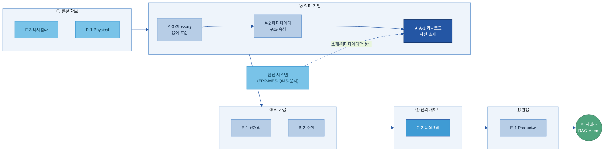

| 조직 | 역할 |
|---|---|
| 지주·전사 데이터 조직 | 데이터 카탈로그 표준 및 운영 체계 수립 |
| 계열사 데이터 담당 | 자산 등록 및 운영 관리 |
| 현업 데이터 오너 | 등록 정보 확인 및 갱신 |
| AI 과제 수행자 및 분석가 | 데이터 탐색 및 활용 |
| 데이터 스튜워드 | 등록 품질 및 분류 체계 관리 |

데이터 카탈로그는 데이터 자산을 찾기 위한 기반 체계이며, A-2 메타데이터, A-3 비즈니스 Glossary, C-3 데이터 Lineage와 함께 데이터 활용 체계를 구성한다.

---

# 2. 왜 필요한가 (Why)

데이터를 활용하지 못하는 가장 큰 이유 중 하나는 데이터가 존재하지 않아서가 아니라, 필요한 데이터가 어디에 있는지 알 수 없기 때문이다.

특히 제조업 환경에서는 MES, ERP, QMS, LIMS, SharePoint, 파일 서버 등 다양한 시스템에 데이터가 분산되어 있으며, 데이터 위치와 관리 주체를 파악하는 데 많은 시간이 소요된다.

데이터 카탈로그는 이러한 탐색 비용을 줄이고 데이터 활용 속도를 높이기 위해 구축한다.

## 2.1 현업 Pain Point

AI 과제와 데이터 분석 과제에서 가장 자주 발생하는 문제는 데이터 탐색 단계에서 발생한다.

두산전자에서 동박 결함 예측 모델을 구축한다고 가정하면, 필요한 데이터는 MES 공정 데이터, QMS 검사 결과, LIMS 시험 결과, 품질 보고서 등 여러 시스템에 분산되어 존재한다.

이 과정에서 다음과 같은 문제가 반복적으로 발생한다.

### Pain 1. 데이터 존재 여부 확인의 어려움

필요한 데이터가 존재하는지조차 확인하기 어려운 경우가 많다.

데이터가 존재한다고 생각했지만 실제로는 없거나, 반대로 없는 것으로 알고 있었지만 특정 부서에서 관리하고 있는 경우도 발생한다.

### Pain 2. 데이터 위치 파악의 어려움

데이터가 존재하더라도 어느 시스템, 어느 테이블, 어느 폴더에 저장되어 있는지 알기 어렵다.

결국 담당자에게 직접 문의하거나 과거 프로젝트 자료를 찾아야 하는 경우가 발생한다.

### Pain 3. 데이터 오너 및 접근 절차 불명확

데이터 위치를 확인하더라도 누구에게 접근 권한을 요청해야 하는지 모르는 경우가 많다.

승인 절차가 명확하지 않으면 데이터 확보에 추가 시간이 소요된다.

### Pain 4. 중복 수집 및 중복 가공

이전 프로젝트에서 이미 확보하고 정제한 데이터가 존재함에도 불구하고 해당 사실을 알 수 없어 동일한 작업을 반복 수행하는 경우가 발생한다.

결과적으로 데이터 확보 비용과 시간이 불필요하게 증가한다.

## 2.2 기대 효과

### 데이터 탐색 시간 단축

데이터 카탈로그를 구축하면 데이터 위치, 오너, 접근 경로를 즉시 확인할 수 있어 데이터 탐색 시간을 크게 줄일 수 있다.

두산전자의 경우 품질 관련 AI 과제 착수 시 데이터 위치를 확인하는 데 소요되는 시간을 수일에서 수시간 수준으로 단축할 수 있다.

### 데이터 재사용 확대

기존 프로젝트에서 구축한 데이터 자산을 쉽게 찾을 수 있기 때문에 동일 데이터를 반복 수집하거나 재가공하는 작업을 줄일 수 있다.

### AI 활용 기반 확보

AI Agent와 RAG 기반 서비스는 사람이 직접 데이터를 찾는 방식에 의존할 수 없다.

데이터 카탈로그는 AI가 활용 가능한 데이터 자산을 탐색하고 식별하기 위한 기반 체계 역할을 수행한다.

### 데이터 신뢰성 향상

갱신 주기, 오너, 보안 등급, 접근 정책과 같은 정보를 함께 관리함으로써 데이터 활용 과정에서 신뢰할 수 있는 데이터를 보다 쉽게 식별할 수 있다.

> 자회사 관점에서 데이터 카탈로그는 데이터 탐색 시간을 줄이고, 데이터 재사용을 확대하며, AI 활용을 위한 데이터 기반을 구축하는 가장 효과적인 출발점 중 하나이다.

---

# 3. 무엇을 갖추나 (What — 등록 항목·구성)

데이터 카탈로그는 크게 네 가지 요소로 구성된다.

첫째, 사용자가 데이터를 찾을 수 있도록 지원하는 탐색 체계가 필요하다. 둘째, 데이터 자산을 설명하기 위한 등록 항목이 정의되어야 한다. 셋째, 다양한 데이터 자산을 일관된 기준으로 분류할 수 있는 체계가 필요하다. 넷째, AI 활용 여부와 재사용 가능성을 판단하기 위한 관리 항목이 필요하다.

본 장에서는 데이터 카탈로그를 구성하는 네 가지 요소를 설명한다.

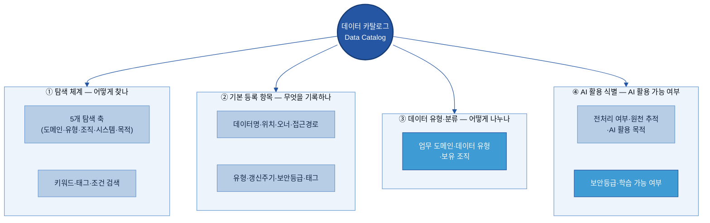

---

<a id="sec31"></a>

### 3.1 데이터 카탈로그 조회 방식

데이터 카탈로그 탐색은 크게 두 가지 방식으로 이루어진다.

하나는 키워드와 태그를 활용하여 필요한 데이터를 직접 검색하는 방식이고, 다른 하나는 업무 도메인, 데이터 유형, 조직, 시스템 등 분류 체계를 활용하여 단계적으로 탐색하는 방식이다.

실제 운영 환경에서는 두 방식을 함께 활용하는 경우가 일반적이다.

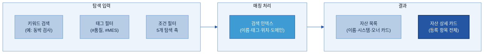

두산전자에서 동박 결함 예측 AI 과제를 수행한다고 가정하면, 사용자는 품질 도메인, MES 시스템, 검사 데이터와 같은 조건을 조합하여 필요한 데이터 자산을 찾을 수 있다.

탐색 결과에는 데이터명, 보유 시스템, 데이터 오너, 접근 방법 등의 정보가 함께 제공된다.

---

### 3.2 항목 구성 기준

데이터 카탈로그에 등록되는 정보는 성격에 따라 다섯 개 영역으로 구분할 수 있다.

업무 관점의 정보, 기술 관점의 정보, 운영 관점의 정보, 보안 관점의 정보, AI 활용 관점의 정보가 함께 관리되어야 데이터 탐색과 활용이 가능하다.

| 항목 영역 | 포함 항목 | 필수 여부 |
|------|------|-----------|
| 업무(Business) | 데이터명, 도메인, 설명, 활용 목적 | 일부 필수 |
| 기술(Technical) | 시스템, 저장 위치, 데이터 유형 | 일부 필수 |
| 운영(Operational) | 오너, 접근 경로, 갱신 주기 | 필수 |
| 보안(Compliance) | 보안 등급, 개인정보 포함 여부 | 필수 |
| AI 활용(AI) | AI 활용 가능 여부, 전처리 여부, 데이터 Lineage 연결 | 선택 |

데이터 카탈로그는 데이터를 찾고 활용하기 위한 정보를 제공하는 것을 목적으로 하므로, 등록 항목은 과도하게 많기보다 실제 활용에 필요한 수준으로 구성하는 것이 중요하다.

---

### 3.3 기본 등록 항목

데이터 자산을 등록할 때는 최소한 다음 정보를 관리해야 한다.

이 정보는 데이터의 위치, 관리 주체, 접근 방법을 확인하기 위한 기본 정보이며, 데이터 카탈로그의 핵심 구성 요소이다.

---

### 3.4 데이터 분류 기준

데이터 카탈로그는 단순 검색 기능만으로 운영되지 않는다.

사용자가 필요한 데이터를 빠르게 찾을 수 있도록 업무 도메인, 데이터 유형, 조직, 시스템, 활용 목적과 같은 분류 체계를 함께 관리해야 한다.

이러한 분류 체계는 데이터 탐색 과정에서 검색 범위를 단계적으로 좁히는 기준으로 활용된다.

| 탐색 축 | 의미 | 두산전자 예시 |
|---------|------|-----------------|
| 업무 도메인 | 어떤 업무 영역인가 | 품질보증 / 생산 / 설비관리 / 원가 / 구매 / 영업 |
| 데이터 유형 | 어떤 형태인가 | 정형 / 문서 / 이미지 / 시계열 / 반정형 |
| 보유 조직 | 어느 부서가 관리하는가 | 품질보증팀 / 생산기술팀 / IT팀 / 구매팀 |
| 시스템 | 어느 시스템에서 생성·관리되는가 | SAP / MES / QMS / LIMS / SharePoint / 데이터레이크 |
| 활용 목적 | 어떤 업무나 AI 과제에 활용되는가 | 품질 예측 / 설비 예지보전 / 원가 분석 / 클레임 분석 |

이 다섯 가지 탐색 축은 등록 항목과 연계되어 자동으로 검색 조건과 분류 체계를 구성한다.

| 데이터 유형 | 두산전자 예시 | 활용 시 고려 사항 |
|------|------|------|
| 정형 데이터 | INSP_RESULT, CLAIM_HIST | 컬럼 메타데이터 연결 필요 |
| 문서 | 결함 분석 보고서, SOP, FMEA | 전처리 필요 |
| 이미지 | 외관 검사 이미지, 단면 이미지 | 주석 정보 필요 |
| 시계열 | 동박 두께, 설비 전류, 진동 | 단위 및 샘플링 주기 중요 |
| 반정형 | JSON 로그, 설비 알람 로그 | 구조화 작업 필요 |

---

### 3.5 AI 활용 식별 항목

데이터 카탈로그는 데이터 위치만 제공하는 체계를 넘어, AI 활용 가능 여부를 판단할 수 있는 정보도 함께 제공해야 한다.

AI 과제를 수행하는 담당자는 데이터가 존재하는지뿐 아니라, AI 학습이나 분석에 활용 가능한 상태인지도 함께 확인해야 하기 때문이다.

이를 위해 데이터 카탈로그는 다음과 같은 AI 활용 관련 정보를 함께 관리한다.

| AI-ready 관점 | 데이터 카탈로그 등록 항목 | 두산전자 예시 |
|---|---|---|
| 발견 가능성 | 설명, 오너, 최신성 정보 | 동박 라인 일일 품질 검사 결과 |
| 데이터 Lineage | 원천 시스템, 수집 방식, 변환 이력 | MES → QMS 배치 적재 |
| 전처리 상태 | AI 활용 가능 여부, 전처리 필요 여부 | 결측치 처리 필요 |
| 보안 및 접근 정책 | 보안 등급, 개인정보 포함 여부 | 고객 정보 마스킹 필요 |
| 의미 정보 | 메타데이터, 비즈니스 Glossary 연결 | 표준 용어 연결 |

예를 들어 고객 클레임 데이터가 등록되어 있더라도 개인정보가 포함되어 있다면 AI 활용 가능 여부는 "가명화 후 활용 가능"으로 표시할 수 있다.

이러한 정보는 데이터 확보 단계에서 불필요한 검토 시간을 줄이고 데이터 활용 가능성을 빠르게 판단할 수 있도록 지원한다.

데이터 카탈로그는 AI 학습용 상세 스펙을 관리하지 않는다. 학습 데이터 구조, 주석 기준, 데이터 분할 정책과 같은 상세 정보는 A-2 메타데이터 또는 B-2 데이터 해설·주석에서 관리한다.

데이터 카탈로그는 해당 정보의 존재 여부와 위치를 안내하는 역할을 수행한다.

---

### 3.6 태그 표준값 목록

태그는 데이터 탐색과 분류 체계를 구성하는 핵심 요소이다.

그러나 사용자가 자유롭게 태그를 입력하면 동일한 의미를 가진 여러 표현이 혼재될 수 있으며, 검색 정확도가 저하될 수 있다.

따라서 데이터 카탈로그에서는 태그를 자유 입력 방식으로 운영하기보다 사전에 정의된 표준값 목록에서 선택하는 방식을 권장한다.

| 태그 Key | 구분 대상 | 값 예시 | 필수 여부 | 관리 주체 |
|---|---|---|:---:|:---:|
| sensitivity | 보안 민감도 | 공개 / 사내 / 대외비 / 기밀 | 필수 | 보안 |
| pii | 개인정보 포함 여부 | 있음 / 없음 | 필수 | 보안 |
| domain | 업무 도메인 | 품질 / 생산 / 설비 / 원가 / 구매 / 영업 | 필수 | 데이터 오너 |
| data_type | 데이터 유형 | 정형 / 문서 / 이미지 / 시계열 / 반정형 | 필수 | 자동 |
| ai_usable | AI 활용 가능 여부 | 가능 / 가명화 후 가능 / 불가 | 필수 | 보안 |
| security_context | 제조업 특화 민감도 | 공정 레시피 / 협력사 민감 / 사내 공개 | 선택 | 보안 |
| source_system | 원천 시스템 | SAP / MES / QMS / LIMS | 선택 | 자동 |

표준 태그 체계를 적용하면 동일한 의미를 가진 데이터 자산을 일관된 기준으로 검색하고 분류할 수 있다.

예를 들어 품질 관련 데이터를 찾을 때 `domain:품질` 조건만으로 다양한 시스템에 분산된 자산을 함께 조회할 수 있다.

태그 표준은 데이터 카탈로그의 탐색 품질과 활용성을 유지하기 위한 기본 운영 기준이다.

---


# 4. 어디부터 등록하나 (When/우선순위)

데이터 카탈로그 구축 시 모든 데이터를 동시에 등록하는 방식은 현실적으로 운영하기 어렵다.

등록 대상이 지나치게 많아지면 관리 부담이 증가하고, 등록 정보의 최신성을 유지하기 어려워진다. 따라서 데이터 활용 가치가 높은 자산부터 우선 등록하고, 이후 단계적으로 범위를 확대하는 접근이 필요하다.

본 장에서는 데이터 카탈로그 등록 대상 선정 기준과 우선순위 결정 방법을 설명한다.

---

## 4.1 등록 대상 범위

데이터 카탈로그 구축 초기에는 모든 자산을 등록하는 것보다 우선 관리가 필요한 자산을 식별하는 것이 중요하다.

특히 AI 활용 가능성, 업무 중요도, 재사용 가능성이 높은 자산을 우선 등록 대상으로 선정하는 것이 효과적이다.

| 판단 기준 | 주요 질문 | 두산전자 예시 |
|---|---|---|
| AI 활용 가능성 | AI 학습, 분석, 검색에 활용 가능한가 | MES 품질 검사 결과, 고객 클레임 이력 |
| 업무 중요도 | 핵심 업무 수행에 필요한가 | SAP 원가 데이터, QMS 판정 이력 |
| 재사용 가능성 | 여러 조직과 과제에서 활용 가능한가 | LIMS 시험 결과, 동박 두께 시계열 |

세 가지 기준 가운데 두 개 이상에 해당하는 자산은 우선 등록 대상으로 관리하는 것이 바람직하다.

---

## 4.2 유형별 등록 및 제외 기준

데이터 유형에 따라 등록 방식과 우선순위는 달라질 수 있다.

### 등록 대상

- 정형 데이터: ERP, MES, QMS, LIMS 등 주요 업무 시스템 데이터
- 문서: 표준 절차서, 품질 보고서, 시험 결과 보고서
- 이미지: 검사 이미지, 설비 점검 이미지
- 시계열 데이터: 센서 데이터, 생산 설비 데이터
- 반정형 데이터: 설비 로그, API 응답 데이터

### 우선 제외 대상

- 개인 PC 임시 파일
- 중복 저장 데이터
- 폐기 예정 자산
- 테스트 및 더미 데이터

등록 여부는 단순한 데이터 존재 여부보다 실제 활용 가능성과 관리 필요성을 기준으로 판단한다.

---

## 4.3 정형 데이터 중요도 선별

정형 데이터는 일반적으로 등록 대상 수가 가장 많기 때문에 중요도 기준을 활용하여 우선순위를 결정한다.

| 선별 기준 | 측정 방법 | 두산전자 예시 |
|---|---|---|
| 사용 빈도 | 조회 횟수, ETL 사용 빈도 | INSP_RESULT 월 400회 조회 |
| 연계 시스템 수 | 참조 시스템 수 | MES, BI, AI 모델 연계 |
| 영향도 | 데이터 오류 발생 시 영향 범위 | 품질 KPI, AI 모델 활용 |

이러한 기준을 활용하면 실제 활용도가 높은 자산을 우선 등록할 수 있다.

---

<a id="sec44"></a>

## 4.4 수집 및 등록 방식

여러 시스템에 분산된 데이터를 하나의 데이터 카탈로그로 관리하기 위해서는 자동 수집과 수동 등록을 병행해야 한다.

### 자동 수집

SAP, MES, QMS, LIMS와 같은 시스템은 커넥터를 활용하여 메타데이터를 자동 수집할 수 있다.

자동 수집 대상

- 데이터명
- 테이블 정보
- 컬럼 정보
- 데이터 건수
- 갱신 정보

### 수동 등록

문서, 이미지, 파일 서버 데이터와 같이 자동 수집이 어려운 자산은 표준 양식을 활용하여 등록한다.

대표 사례

- SharePoint 문서
- 품질 분석 보고서
- 검사 이미지
- 파일 서버 데이터

자동 수집과 수동 등록을 병행함으로써 다양한 데이터 유형을 하나의 데이터 카탈로그 체계에서 관리할 수 있다.

---

## 4.5 보안 검토

데이터 카탈로그는 데이터 자체를 저장하지 않지만, 데이터 위치와 접근 정보를 관리하므로 보안 등급을 함께 관리해야 한다.

| 보안 등급 | 노출 범위 | 접근 정책 |
|---|---|---|
| 공개 | 전체 공개 | 기본 인증 |
| 사내 | 임직원 공개 | 로그인 필요 |
| 대외비 | 제한 공개 | 오너 승인 |
| 기밀 | 제한 관리 | 별도 통제 |

예를 들어 고객 클레임 데이터는 대외비 등급으로 관리하고, 데이터 존재 여부와 오너 정보만 공개할 수 있다.

---

## 4.6 등록 우선순위 결정

데이터 카탈로그 구축 과정에서 사람이 모든 자산을 직접 찾아 등록하는 방식은 장기적으로 유지하기 어렵다.

실무에서는 자동 수집을 통해 기술 정보를 확보하고, 데이터 오너와 데이터 스튜워드가 의미 정보와 운영 정보를 보완하는 방식으로 운영한다.

| 자동화 방식 | 자동 수집 정보 | 사람의 역할 |
|---|---|---|
| 커넥터 수집 | 스키마, 컬럼, 건수, 갱신일 | 도메인 및 태그 검토 |
| 로그 분석 | 사용 빈도, 중요도 | 우선순위 검토 |
| 데이터 Lineage 수집 | 원천 및 흐름 정보 | 활용 목적 검토 |
| AI 기반 초안 생성 | 설명 및 태그 후보 | 검수 및 승인 |
| 템플릿 등록 | 비정형 자산 등록 | 최초 작성 및 승인 |

데이터 카탈로그 운영의 핵심은 수작업 등록을 늘리는 것이 아니라 자동 수집 범위를 확대하고 사람은 검수와 승인에 집중하는 것이다.

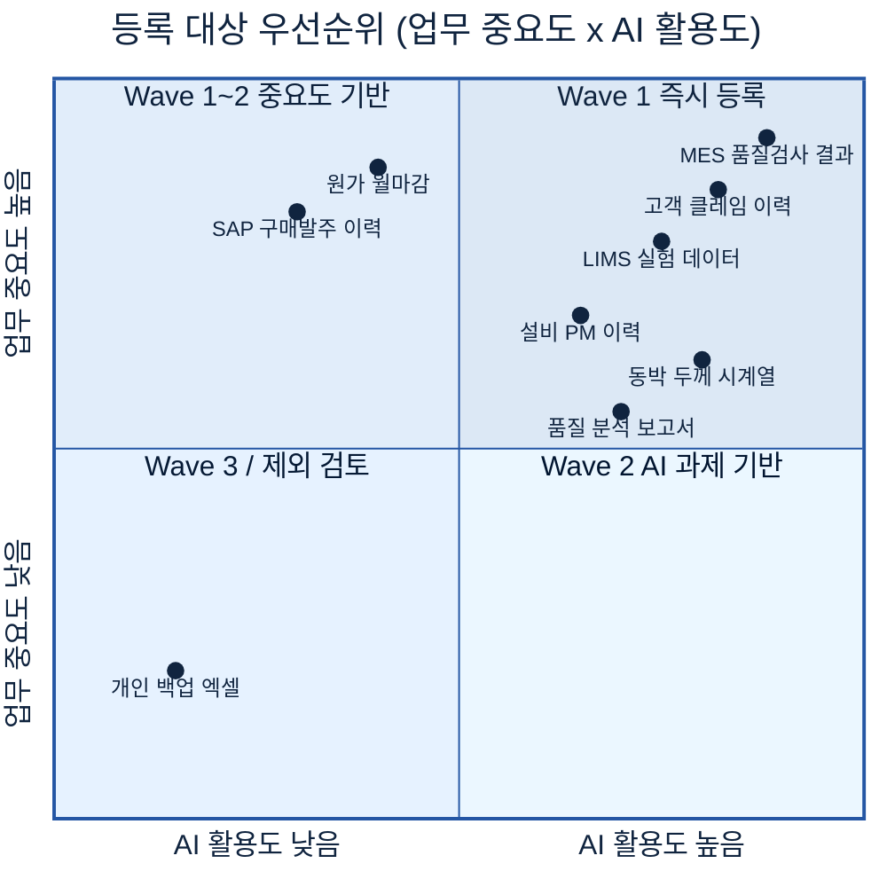

| Wave | 대상 | 두산전자 예시 |
|---|---|---|
| Wave 1 | AI 활용도와 업무 중요도가 모두 높은 자산 | MES 품질 검사, 고객 클레임, LIMS 시험 데이터 |
| Wave 2 | 활용도 또는 중요도가 높은 자산 | 설비 이력, 품질 보고서 |
| Wave 3 | 활용도가 낮거나 제한적인 자산 | 레거시 데이터, 보관용 데이터 |

초기에는 핵심 자산 중심으로 데이터 카탈로그를 구축하고, 운영 경험을 바탕으로 등록 범위를 확대하는 것이 바람직하다.

---

# 5. 예시 시나리오 — 두산전자 적용 흐름

데이터 카탈로그 구축 효과는 실제 데이터 탐색 과정에서 가장 명확하게 확인할 수 있다.

본 장에서는 두산전자가 동박 결함 예측 AI 과제를 수행하는 상황을 가정하여 데이터 카탈로그 도입 전후의 차이를 설명한다.

## 5.1 적용 전후 비교

### AS-IS (데이터 카탈로그 부재)

동박 결함 예측 모델 구축을 위해 필요한 데이터를 찾는 과정에서 MES, QMS, LIMS, SharePoint 등 여러 시스템을 확인해야 하며, 데이터 위치와 담당자를 파악하는 데 상당한 시간이 소요된다.

| 필요 데이터 | 예상 위치 | 실제 상황 |
|---|---|---|
| 공정 조건 데이터 | MES | 담당자 변경으로 테이블 정보 확인 필요 |
| 검사 결과 데이터 | QMS | 저장 위치 확인 필요 |
| 재료 시험 데이터 | LIMS | 별도 조직 관리 |
| 품질 분석 보고서 | SharePoint, 파일 서버 | 최신 버전 확인 필요 |
| 고객 클레임 이력 | C/S 시스템 | 접근 절차 확인 필요 |

### TO-BE (데이터 카탈로그 구축 이후)

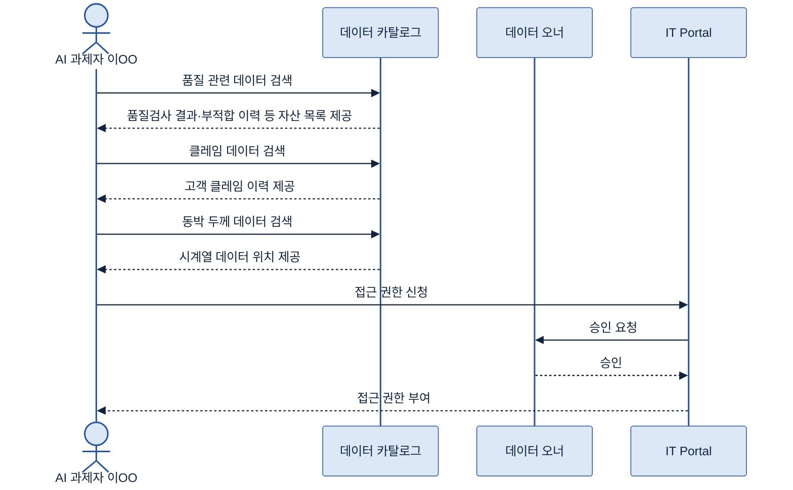

| 항목 | 구축 전 | 구축 후 |
|---|---|---|
| 데이터 존재 여부 확인 | 담당자 문의 | 검색 |
| 저장 위치 확인 | 시스템별 확인 | 즉시 조회 |
| 오너 확인 | 별도 문의 | 즉시 조회 |
| 접근 절차 확인 | 개별 확인 | 등록 정보 활용 |
| 데이터 확보 기간 | 수일 | 수시간 |

---

## 5.2 전체 흐름

데이터 카탈로그 구축은 원천 시스템의 메타데이터를 수집하고, 이를 분류·관리하여 사람과 AI가 활용할 수 있도록 제공하는 과정으로 구성된다.

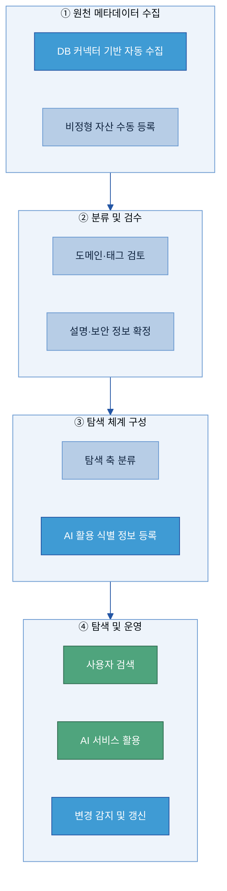

---

# 6. 솔루션 선정

데이터 카탈로그 솔루션은 단순히 데이터를 검색하는 도구가 아니라 데이터 탐색, 메타데이터 관리, 권한 관리, AI 활용을 지원하는 기반 플랫폼 역할을 수행한다.

따라서 현재 운영 환경과 연계 가능성, 자동 수집 범위, 운영 편의성을 기준으로 선정해야 한다.

## 6.1 솔루션 유형

| 유형 | 특징 | 대표 솔루션 | 적용 환경 |
|---|---|---|---|
| 전용 데이터 카탈로그 | 거버넌스 기능 포함 | Collibra, Alation, Informatica, Atlan | 대규모 조직 |
| 클라우드 기반 | 클라우드 서비스와 통합 | Microsoft Purview, AWS Glue, Unity Catalog | 클라우드 중심 |
| 오픈소스 | 라이선스 비용 없음 | DataHub, OpenMetadata | 자체 운영 가능 조직 |

솔루션 유형은 기술 수준보다 운영 체계와 조직 역량을 기준으로 선택하는 것이 중요하다.

---

## 6.2 기능 비교

데이터 카탈로그 솔루션을 평가할 때는 다음 항목을 우선적으로 검토한다.

| 평가 항목 | 검토 내용 |
|---|---|
| 원천 시스템 연계 | SAP, MES, QMS, LIMS 연결 가능 여부 |
| 자동 수집 | 메타데이터 자동 수집 및 갱신 |
| 검색 기능 | 키워드 검색, 필터 탐색 |
| 권한 관리 | 역할 기반 접근 제어 |
| 데이터 Lineage 연계 | 데이터 흐름 추적 기능 |
| AI 지원 기능 | 자동 태깅, 설명 생성, 자연어 탐색 |
| 확장성 | 계열사 및 다수 시스템 지원 여부 |

두산전자 환경에서는 SAP, MES, QMS, SharePoint 등 주요 시스템과의 연계 가능 여부가 핵심 검토 항목이 된다.

## 6.3 평가 및 PoC

솔루션 선정은 기능 비교만으로 결정하지 않는다.

후보 솔루션을 대상으로 실제 환경에서 PoC를 수행하고, 원천 시스템 연결과 검색 기능, 권한 체계를 검증한 후 최종 선정한다.

| 검증 항목 | 검증 방법 | 기준 |
|---|---|---|
| 원천 시스템 연계 | 주요 시스템 연결 | 연결 성공 |
| 자동 수집 | 메타데이터 수집 | 목표 자산 등록 |
| 검색 정확도 | 대표 검색어 테스트 | 관련 자산 검색 |
| 권한 관리 | 접근 통제 테스트 | 정책 적용 |
| 수동 등록 | 비정형 자산 등록 | 운영 가능 수준 |

PoC는 실제 운영 환경에서 데이터 카탈로그를 적용할 수 있는지를 검증하는 단계이며, 기능 비교 결과보다 우선적으로 고려해야 한다.

---

# 7. 구축

데이터 카탈로그 구축은 데이터를 이동하는 작업이 아니라 데이터 자산을 설명하는 메타데이터를 수집하고 관리 체계에 등록하는 과정이다.

구축 과정은 등록 항목 정의, 메타데이터 수집, 아키텍처 구성, 초기 적재 및 검증 단계로 구성된다.

## 7.1 메타데이터 검토 및 정합성 점검

초기 인벤토리를 기반으로 등록 대상 자산을 점검하고 메타데이터 품질을 확인한다.

| 점검 항목 | 내용 | 두산전자 예시 |
|---|---|---|
| 필수 항목 충족 여부 | 데이터명, 위치, 오너 등 | 오너 미지정 자산 확인 |
| 저장 위치 유효성 | 시스템 및 경로 확인 | 시스템 이관 여부 확인 |
| 태그 및 분류 일관성 | 분류 체계 일치 여부 | 품질 / QA 혼용 확인 |
| 중복 자산 여부 | 중복 등록 여부 | 동일 데이터 중복 등록 확인 |
| 보안 등급 적정성 | 보안 정보 존재 여부 | 고객 데이터 등급 검토 |

정합성 검토 결과는 데이터 오너와 데이터 스튜워드가 함께 확인한다.

---

## 7.2 To-Be 아키텍처

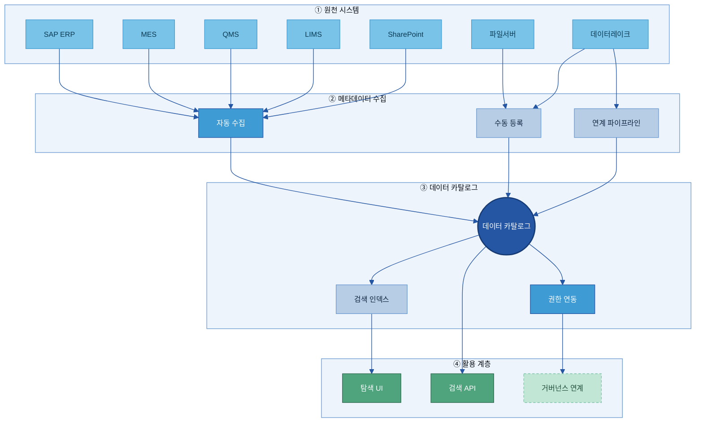

데이터 카탈로그는 다양한 원천 시스템의 메타데이터를 수집하고 이를 통합 관리하는 역할을 수행한다.

실제 데이터는 원천 시스템에 그대로 존재하며 데이터 카탈로그에는 메타데이터만 등록된다.

---

## 7.3 Legacy 연동 및 미연동 자산 등록

원천 시스템의 특성에 따라 적절한 연동 방식을 선택한다.

| 방식 | 적용 조건 | 예시 |
|---|---|---|
| 직접 연동 | 표준 연결 지원 | SAP, MES, QMS |
| API 연동 | 별도 인터페이스 제공 | LIMS |
| 데이터레이크 연계 | 직접 연동 어려움 | 레거시 시스템 |
| 수동 등록 | 문서 및 파일 | SharePoint, 파일 서버 |

모든 자산이 자동으로 수집되는 것은 아니므로 비정형 자산은 별도 등록 체계를 함께 운영한다.

---

## 7.4 초기 적재 및 검증

초기 구축 단계에서는 대상 자산을 일괄 등록하고 검색, 분류, 권한 체계를 함께 검증한다.

검증 항목은 다음과 같다.

| 검증 항목 | 기준 |
|---|---|
| 등록 완료율 | 목표 자산 등록 여부 |
| 필수 항목 충족률 | 필수 정보 입력 여부 |
| 검색 정확도 | 검색 결과 적합성 |
| 권한 적용 여부 | 보안 정책 반영 여부 |

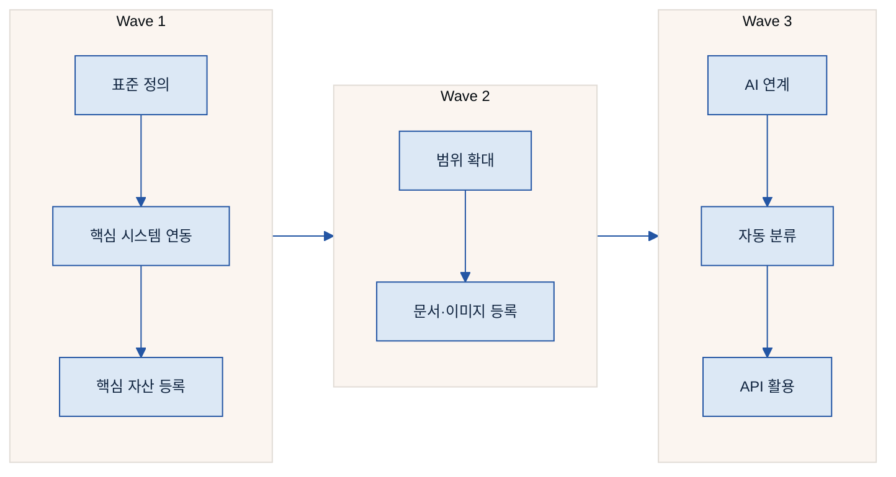

---

## 7.5 역할 및 책임

| 활동 | 데이터 카탈로그 관리자 | 데이터 스튜워드 | 데이터 오너 | 이용자 |
|------|:---:|:---:|:---:|:---:|
| 등록 표준 정의 | A/R | C | C | I |
| 자동 수집 구축 | A/R | I | I | - |
| 신규 등록 | I | A | R | - |
| 분류 및 태그 관리 | I | A/R | C | - |
| 갱신 승인 | I | C | A/R | - |
| 정기 점검 | A | R | R | I |
| 탐색 및 활용 | - | - | I | R |

---

# 8. 운영

데이터 카탈로그는 구축 이후 지속적인 갱신과 품질 관리가 이루어져야 한다.

운영의 목적은 등록 정보가 실제 환경과 일치하도록 유지하는 것이다.

---

## 8.1 변경 관리

등록 정보는 신규 생성, 폐기, 위치 변경, 오너 변경과 같은 이벤트에 따라 지속적으로 갱신해야 한다.

| 변경 유형 | 예시 |
|---|---|
| 신규 자산 | 신규 시스템 구축 |
| 자산 폐기 | 시스템 종료 |
| 위치 변경 | DB 이관 |
| 오너 변경 | 조직 개편 |

변경 사항은 데이터 오너 승인 절차를 거쳐 데이터 카탈로그에 반영한다.

---

## 8.2 등록 및 검색 운영

데이터 카탈로그는 검색 품질을 지속적으로 유지해야 한다.

운영 과정에서는 다음 항목을 정기적으로 점검한다.

- 검색 결과 적합성
- 태그 일관성
- 분류 체계 적정성
- 설명 정보 최신성

또한 A-3 비즈니스 Glossary와 연계하여 용어 검색 품질을 유지한다.

---

## 8.3 AI 서비스 연계

데이터 카탈로그는 AI 서비스가 활용할 수 있는 데이터 자산 정보를 제공한다.

AI Agent 또는 RAG 서비스는 데이터 카탈로그를 통해 데이터 위치, 접근 경로, 오너 정보를 조회할 수 있다.

데이터 카탈로그는 데이터 처리 시스템이 아니라 데이터 탐색 시스템으로 활용된다.

---

## 8.4 접근 권한 관리

데이터 카탈로그는 데이터 자체가 아닌 메타데이터를 관리하지만, 보안 정책에 따라 노출 범위를 제어해야 한다.

| 정보 유형 | 공개 범위 |
|---|---|
| 자산명, 도메인 | 임직원 |
| 위치, 접근 경로 | 승인 사용자 |
| 기밀 자산 정보 | 제한 공개 |

실제 데이터 접근 권한은 별도 보안 체계에서 관리한다.

---

## 8.5 최신성 유지

데이터 카탈로그 품질은 최신성 유지 수준에 의해 결정된다.

대표적인 갱신 트리거는 다음과 같다.

| 트리거 | 갱신 대상 |
|---|---|
| 신규 생성 | 신규 자산 등록 |
| 폐기 | 상태 변경 |
| 위치 변경 | 저장 위치 수정 |
| 오너 변경 | 책임자 변경 |

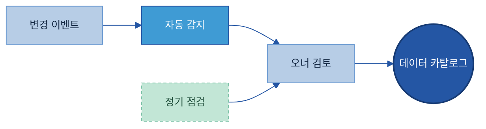

---

# 9. 다른 주제와의 관계

데이터 카탈로그는 데이터 자산의 위치와 관리 정보를 제공하는 역할을 수행하며, 다른 데이터 관리 주제와 함께 운영된다.

## 9.1 역할 분담

| 주제 | 데이터 카탈로그 역할 | 연계 주제 역할 |
|---|---|---|
| A-2 메타데이터 | 위치·오너·접근 정보 | 구조·속성 정의 |
| A-3 비즈니스 Glossary | 탐색 및 검색 | 용어 표준화 |
| C-3 데이터 Lineage | 자산 위치 관리 | 데이터 흐름 추적 |
| F-2 데이터 생애주기 관리 | 활성 자산 관리 | 보존·폐기 정책 |
| E-1 데이터 Product화 | 자산 검색 및 제공 | 데이터 Product 운영 |

---

## 9.2 전체 구조

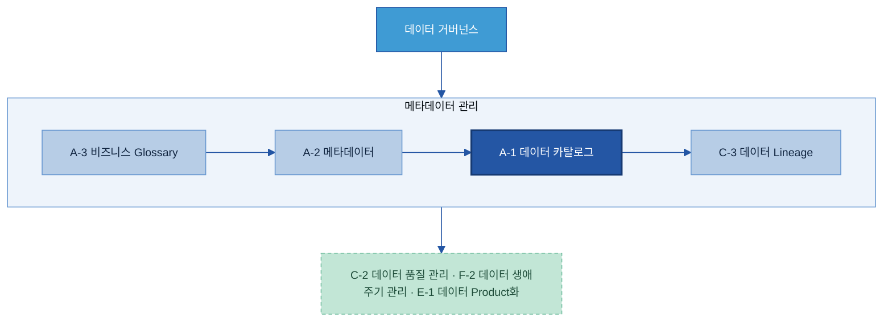

---

# 10. 성과 지표 및 고도화 로드맵

데이터 카탈로그의 성과는 등록 건수보다 실제 활용 수준을 기준으로 평가해야 한다.

---

## 10.1 KPI

| KPI | 의미 | 방향 |
|---|---|---|
| 데이터 탐색 시간 | 데이터 탐색 소요 시간 | ↓ |
| 데이터 카탈로그 활용도 | 월간 사용자 수 | ↑ |
| AI 과제 활용 수 | 데이터 카탈로그 활용 과제 수 | ↑ |
| 등록 최신성 | 최신 상태 유지 비율 | ↑ |
| 등록 커버리지 | 대상 자산 등록 비율 | ↑ |

---

## 10.2 고도화 로드맵

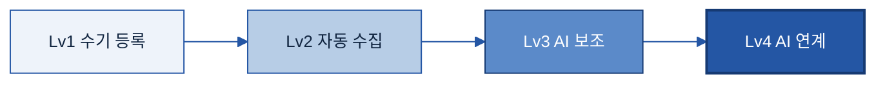

| 단계 | 상태 | 다음 단계 |
|---|---|---|
| Lv1 | 수기 등록 중심 | 자동 수집 도입 |
| Lv2 | 자동 수집 운영 | AI 기반 보조 |
| Lv3 | AI 초안 생성 | Agent 연계 |
| Lv4 | AI 활용 확장 | 전사 확산 |

---

## 10.3 미래 AI 자동화 전망

데이터 카탈로그 운영 과정에서 반복적인 수집, 분류, 설명 생성 작업은 점차 자동화될 수 있다.

반면 데이터 의미 정의, 보안 정책 결정, 데이터 오너 지정과 같은 업무 판단 영역은 지속적으로 사람의 검토가 필요하다.

| 자동화 가능 영역 | 사람 중심 의사결정 영역 |
|---|---|
| 메타데이터 수집 | 데이터 의미 정의 |
| 설명 초안 생성 | 보안 등급 결정 |
| 태그 추천 | 데이터 오너 지정 |
| 검색 추천 | 정책 승인 |
| 변경 감지 | 최종 검수 |

---

## 별첨 (Appendix)

<a id="appendix-a"></a>

### Appendix A. 등록 항목 사전

본문 3.3에서는 데이터 자산 등록에 필요한 핵심 항목을 설명하였다.

본 절은 실제 운영 과정에서 활용할 수 있는 전체 등록 항목 사전을 제공한다.

등록 항목은 식별 및 위치 정보, 의미 정보, 책임 및 접근 정보, 운영 정보, 보안 및 AI 활용 정보로 구분한다.

### 가. 식별 및 위치 정보

| 항목 | 의미 | 예시 | 필수 여부 | 작성 주체 |
|---|---|---|:---:|:---:|
| 자산 ID | 고유 식별자 | DSEL-QMS-001 | 필수 | 자동 |
| 데이터명 | 공식 명칭 | 일일 품질검사 결과 | 필수 | 자동 / 오너 |
| 보유 시스템 | 데이터 저장 시스템 | QMS | 필수 | 자동 |
| 저장 위치 | 테이블 또는 경로 | QMS.dbo.INSP_RESULT | 필수 | 자동 |
| 데이터 유형 | 데이터 형태 | 정형 데이터 | 필수 | 자동 |
| 데이터 기간 | 보유 기간 | 2018~현재 | 선택 | 자동 |

---

### 나. 의미 정보

| 항목 | 의미 | 예시 | 필수 여부 | 작성 주체 |
|---|---|---|:---:|:---:|
| 설명 | 데이터 설명 | 동박 외관 검사 결과 | 필수 | 오너 |
| 업무 도메인 | 업무 영역 | 품질 | 필수 | 오너 |
| 태그 | 탐색 태그 | domain:품질 | 선택 | 오너 |
| 활용 목적 | 활용 분야 | 품질 예측 | 선택 | 오너 |
| 비즈니스 Glossary 연결 | 표준 용어 연결 | A-3 비즈니스 Glossary | 선택 | 오너 |

---

### 다. 책임 및 접근 정보

| 항목 | 의미 | 예시 | 필수 여부 | 작성 주체 |
|---|---|---|:---:|:---:|
| 데이터 오너 | 책임자 | 품질보증팀 김OO | 필수 | 오너 |
| 보유 부서 | 관리 조직 | 품질보증팀 | 필수 | 자동 / 오너 |
| 접근 경로 | 접근 절차 | 포털 신청 후 승인 | 필수 | 오너 |

---

### 라. 운영 정보

| 항목 | 의미 | 예시 | 필수 여부 | 작성 주체 |
|---|---|---|:---:|:---:|
| 갱신 주기 | 업데이트 주기 | 일 1회 | 선택 | 자동 |
| 최종 변경 일시 | 마지막 변경 시점 | 2026-01-20 | 선택 | 자동 |
| 품질 점수 | 품질 평가 결과 | 94점 | 선택 | 자동 |
| 데이터 Lineage 연결 | 원천 및 흐름 정보 | MES → QMS | 선택 | 자동 |

---

### 마. 보안 및 AI 활용 정보

| 항목 | 의미 | 예시 | 필수 여부 | 작성 주체 |
|---|---|---|:---:|:---:|
| 보안 등급 | 공개 범위 | 대외비 | 필수 | 보안 |
| 개인정보 포함 여부 | 개인정보 존재 여부 | 없음 | 필수 | 보안 |
| AI 활용 가능 여부 | 활용 제한 여부 | 가명화 후 가능 | 필수 | 보안 |
| 전처리 필요 여부 | 사전 처리 필요성 | 결측치 처리 필요 | 선택 | 오너 |

---

<a id="appendix-b"></a>

### Appendix B. 등록 템플릿

데이터 자산 등록 시 아래 양식을 활용할 수 있다.

```text
════════════════════════════════════════════

자산 ID      :
데이터명     :

[위치 정보]
보유 시스템 :
저장 위치   :
데이터 유형 :

[의미 정보]
설명         :
업무 도메인 :
태그         :

[책임 정보]
데이터 오너 :
보유 부서   :
접근 경로   :

[운영 정보]
갱신 주기   :
품질 점수   :

[보안 및 AI 활용]
보안 등급         :
개인정보 포함 여부 :
AI 활용 가능 여부 :
전처리 필요 여부   :

════════════════════════════════════════════
```
