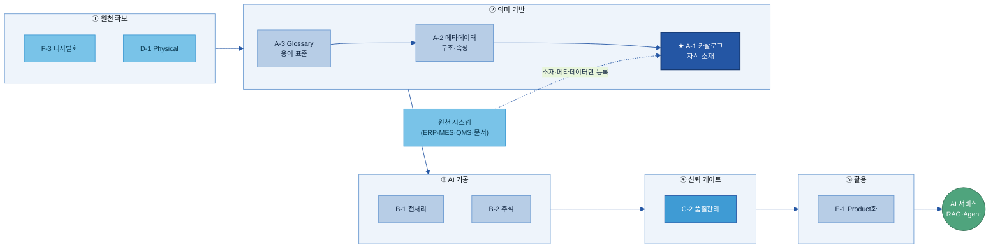

# A-1. 데이터 카탈로그

> 데이터 카탈로그(Data Catalog)는 AI와 사람이 "어디에 무슨 데이터가 있는지" 찾을 수 있도록, 데이터 자산의 **존재·위치·오너·접근 경로**를 등록해 둔 **자산 목록 체계**다. 소재를 찾는 "주소록"이지, 데이터 자체를 이동하거나 분석하는 도구가 아니다.

## 목차

1. [개요](#1-개요)
2. [왜 필요한가 (Why)](#2-왜-필요한가-why)
3. [무엇을 갖추나 (What — 등록 항목·구성)](#3-무엇을-갖추나-what--등록-항목구성)
4. [어디부터 등록하나 (When/우선순위)](#4-어디부터-등록하나-when우선순위)
5. [예시 시나리오 — 두산전자 적용 흐름](#5-예시-시나리오--두산전자-적용-흐름)
6. [솔루션 선정](#6-솔루션-선정)
7. [구축](#7-구축)
8. [운영](#8-운영)
9. [다른 주제와의 관계](#9-다른-주제와의-관계)
10. [성과 지표·고도화 로드맵](#10-성과-지표고도화-로드맵)

- [별첨 — 등록 항목 사전(전체)·빈 템플릿](#별첨-appendix)
- [참고자료(References)](#참고자료-references)
- [변경 이력 / 피드백 반영](#변경-이력--피드백-반영)

> 관련 가이드: [A-2 메타데이터](../A-2%20메타데이터/A-2%20메타데이터.md) · [A-3 비즈니스 Glossary](../A-3%20비즈니스%20Glossary/A-3%20비즈니스%20Glossary.md) · [C-3 데이터 계통 Lineage](../C-3%20데이터%20계통%20Lineage/C-3%20데이터%20계통%20Lineage.md) · [F-2 데이터 생애주기 관리](../F-2%20데이터%20생애주기%20관리/F-2%20데이터%20생애주기%20관리.md) · [E-1 데이터 Product화](../E-1%20데이터%20Product화/E-1%20데이터%20Product화.md)

# 1. 개요

데이터 카탈로그는 조직이 보유한 데이터 자산의 위치, 관리 주체, 접근 방법을 체계적으로 관리하기 위한 목록 체계이다. 데이터 자체를 저장하거나 이동하는 것이 아니라, 데이터 자산이 어디에 존재하고 누가 관리하며 어떻게 접근할 수 있는지를 관리함으로써 사람과 AI가 필요한 데이터를 찾을 수 있도록 지원한다.

## 1.1 데이터 카탈로그란

데이터를 활용하기 위해서는 데이터 자체뿐 아니라 해당 데이터가 어디에 존재하는지, 누가 관리하는지, 어떤 절차를 통해 접근할 수 있는지를 알아야 한다.

데이터 카탈로그는 이러한 정보를 체계적으로 관리하는 목록 체계이다. 예를 들어 특정 품질 데이터가 MES 시스템의 어느 테이블에 존재하는지, 데이터 오너는 누구인지, 데이터는 얼마나 자주 갱신되는지와 같은 정보를 관리한다.

데이터 카탈로그는 데이터를 한곳으로 모으는 저장소가 아니다. 데이터는 원래 시스템에 그대로 존재하며, 데이터 카탈로그는 데이터 자산을 설명하는 정보를 관리한다.

이때 데이터 자산을 설명하는 정보를 메타데이터(Metadata)라고 한다. 데이터 카탈로그는 이러한 메타데이터를 수집하고 관리하여 데이터 탐색과 활용을 지원한다.

데이터 카탈로그가 제공하는 핵심 가치는 다음과 같다.

- 어떤 데이터가 존재하는지 확인
- 데이터 위치와 보유 시스템 확인
- 데이터 오너 및 관리 조직 확인
- 데이터 접근 방법 확인
- AI 및 분석 과제에 필요한 데이터 탐색

> 용어 풀이
>
> - 데이터 자산(Data Asset): 조직이 업무에 활용하거나 활용 가능한 모든 데이터
> - 데이터 오너(Data Owner): 특정 데이터 자산의 등록, 관리, 접근 정책에 책임을 가지는 담당자 또는 조직

## 1.2 목적과 적용 범위

데이터 카탈로그는 조직 내 데이터 자산을 찾고 활용할 수 있도록 지원하는 것을 목적으로 한다.

데이터 카탈로그는 데이터 자체가 아니라 데이터 자산을 설명하는 메타데이터를 관리하며, 특히 데이터 탐색과 접근에 필요한 정보를 제공하는 역할을 수행한다.

### 데이터 카탈로그가 관리하는 영역

- 데이터 자산 존재 여부 확인
- 데이터 위치 및 보유 시스템 관리
- 데이터 오너 및 책임 조직 관리
- 데이터 접근 경로 관리
- 데이터 탐색 및 분류 체계 관리
- 등록 정보 최신성 관리

### 데이터 카탈로그가 관리하지 않는 영역

- 필드 수준 구조, 단위, 형식 정의 → A-2 메타데이터
- 용어 표준화 및 동의어 관리 → A-3 비즈니스 Glossary
- 데이터 품질 평가 및 품질 기준 관리 → C-2 데이터 품질 관리
- 데이터 이동 및 변환 이력 관리 → C-3 데이터 Lineage
- 데이터 보존 및 폐기 정책 관리 → F-2 데이터 생애주기 관리

데이터 카탈로그에는 데이터가 아니라 메타데이터가 등록된다. 데이터명, 위치, 오너, 접근 경로, 갱신 주기와 같은 정보가 등록 대상이며, 상세한 메타데이터 정의와 표준화는 A-2 메타데이터에서 수행한다.

데이터 카탈로그는 데이터를 찾기 위한 체계이며, 데이터를 이해하고 평가하고 추적하는 역할은 인접 주제와 분담한다.

## 1.3 대상 조직과 AI-ready Data 체계 내 위치

데이터 카탈로그는 AI-ready Data 체계에서 데이터 자산을 발견하고 활용하기 위한 출발점 역할을 수행한다.

데이터 자산이 데이터 카탈로그에 등록되어 있어야 전처리, 분석, AI 활용 과정에서 필요한 데이터를 신속하게 찾을 수 있다.

A-3 비즈니스 Glossary는 업무 용어를 표준화하고, A-2 메타데이터는 데이터 구조와 속성을 설명하며, 데이터 카탈로그는 이러한 정보를 기반으로 데이터 자산을 탐색할 수 있도록 지원한다.

| 조직 | 역할 |
|---|---|
| 지주·전사 데이터 조직 | 데이터 카탈로그 표준 및 운영 체계 수립 |
| 계열사 데이터 담당 | 자산 등록 및 운영 관리 |
| 현업 데이터 오너 | 등록 정보 확인 및 갱신 |
| AI 과제 수행자 및 분석가 | 데이터 탐색 및 활용 |
| 데이터 스튜워드 | 등록 품질 및 분류 체계 관리 |

데이터 카탈로그는 데이터 자산을 찾기 위한 기반 체계이며, A-2 메타데이터, A-3 비즈니스 Glossary, C-3 데이터 Lineage와 함께 데이터 활용 체계를 구성한다.

---

# 2. 왜 필요한가 (Why)

데이터를 활용하지 못하는 가장 큰 이유 중 하나는 데이터가 존재하지 않아서가 아니라, 필요한 데이터가 어디에 있는지 알 수 없기 때문이다.

특히 제조업 환경에서는 MES, ERP, QMS, LIMS, SharePoint, 파일 서버 등 다양한 시스템에 데이터가 분산되어 있으며, 데이터 위치와 관리 주체를 파악하는 데 많은 시간이 소요된다.

데이터 카탈로그는 이러한 탐색 비용을 줄이고 데이터 활용 속도를 높이기 위해 구축한다.

## 2.1 현업 Pain Point

AI 과제와 데이터 분석 과제에서 가장 자주 발생하는 문제는 데이터 탐색 단계에서 발생한다.

두산전자에서 동박 결함 예측 모델을 구축한다고 가정하면, 필요한 데이터는 MES 공정 데이터, QMS 검사 결과, LIMS 시험 결과, 품질 보고서 등 여러 시스템에 분산되어 존재한다.

이 과정에서 다음과 같은 문제가 반복적으로 발생한다.

### Pain 1. 데이터 존재 여부 확인의 어려움

필요한 데이터가 존재하는지조차 확인하기 어려운 경우가 많다.

데이터가 존재한다고 생각했지만 실제로는 없거나, 반대로 없는 것으로 알고 있었지만 특정 부서에서 관리하고 있는 경우도 발생한다.

### Pain 2. 데이터 위치 파악의 어려움

데이터가 존재하더라도 어느 시스템, 어느 테이블, 어느 폴더에 저장되어 있는지 알기 어렵다.

결국 담당자에게 직접 문의하거나 과거 프로젝트 자료를 찾아야 하는 경우가 발생한다.

### Pain 3. 데이터 오너 및 접근 절차 불명확

데이터 위치를 확인하더라도 누구에게 접근 권한을 요청해야 하는지 모르는 경우가 많다.

승인 절차가 명확하지 않으면 데이터 확보에 추가 시간이 소요된다.

### Pain 4. 중복 수집 및 중복 가공

이전 프로젝트에서 이미 확보하고 정제한 데이터가 존재함에도 불구하고 해당 사실을 알 수 없어 동일한 작업을 반복 수행하는 경우가 발생한다.

결과적으로 데이터 확보 비용과 시간이 불필요하게 증가한다.

## 2.2 기대 효과

### 데이터 탐색 시간 단축

데이터 카탈로그를 구축하면 데이터 위치, 오너, 접근 경로를 즉시 확인할 수 있어 데이터 탐색 시간을 크게 줄일 수 있다.

두산전자의 경우 품질 관련 AI 과제 착수 시 데이터 위치를 확인하는 데 소요되는 시간을 수일에서 수시간 수준으로 단축할 수 있다.

### 데이터 재사용 확대

기존 프로젝트에서 구축한 데이터 자산을 쉽게 찾을 수 있기 때문에 동일 데이터를 반복 수집하거나 재가공하는 작업을 줄일 수 있다.

### AI 활용 기반 확보

AI Agent와 RAG 기반 서비스는 사람이 직접 데이터를 찾는 방식에 의존할 수 없다.

데이터 카탈로그는 AI가 활용 가능한 데이터 자산을 탐색하고 식별하기 위한 기반 체계 역할을 수행한다.

### 데이터 신뢰성 향상

갱신 주기, 오너, 보안 등급, 접근 정책과 같은 정보를 함께 관리함으로써 데이터 활용 과정에서 신뢰할 수 있는 데이터를 보다 쉽게 식별할 수 있다.

> 자회사 관점에서 데이터 카탈로그는 데이터 탐색 시간을 줄이고, 데이터 재사용을 확대하며, AI 활용을 위한 데이터 기반을 구축하는 가장 효과적인 출발점 중 하나이다.
