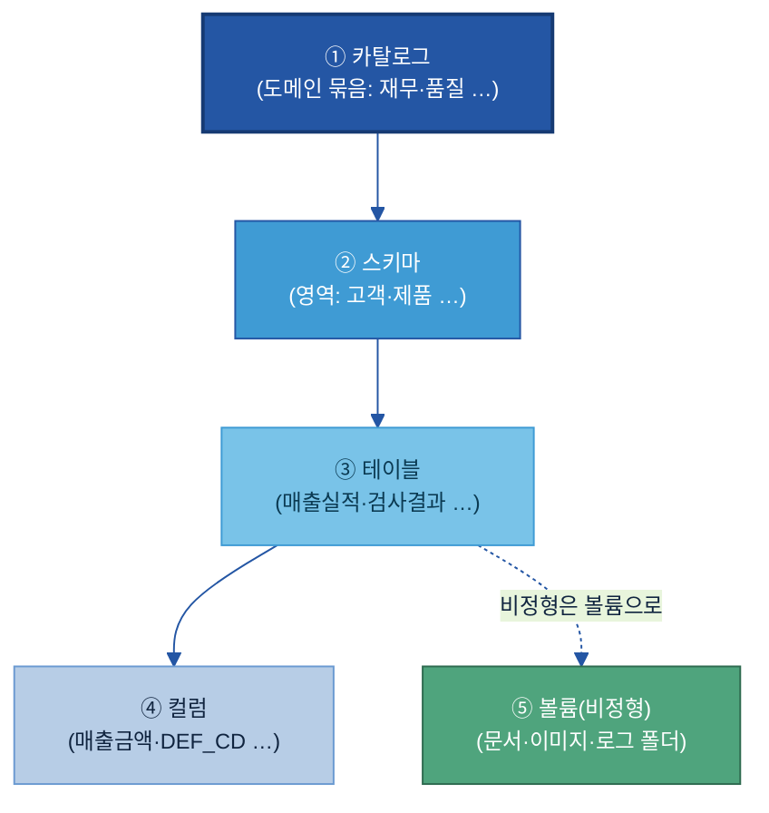

# A-2. 메타데이터

> **한 줄 정의:** 메타데이터(Metadata)는 데이터 자산이 **무엇을·어떤 구조와 단위로·어떤 기준으로 만들어졌는지**를 설명하는 "데이터의 설명서"다. — 자산이 *어디 있는지*를 가리키는 [A-1 카탈로그](../A-1%20데이터%20카탈로그/A-1%20데이터%20카탈로그.md)와 달리, 메타데이터는 그 자산의 **테이블·컬럼·코드값 수준 속성**을 채워, 사람과 AI가 데이터를 *오해 없이 해석*하게 한다.

## 목차

1. [개요](#1-개요)
2. [왜 필요한가 (Why)](#2-왜-필요한가-why)
3. [무엇을 갖추나 (What — 세 종류·다섯 계층)](#3-무엇을-갖추나-what--세-종류다섯-계층)
4. [데이터 유형별 메타데이터 차이](#4-데이터-유형별-메타데이터-차이)
5. [어디부터 하나 (정비 우선순위)](#5-어디부터-하나-정비-우선순위)
6. [예시 시나리오 — 두산전자 적용 흐름](#6-예시-시나리오--두산전자-적용-흐름)
7. [어떻게 준비·운영하나 (How)](#7-어떻게-준비운영하나-how)
8. [다른 주제와의 관계](#8-다른-주제와의-관계)
9. [성과 지표·로드맵·고도화](#9-성과-지표로드맵고도화)

- [별첨 — 항목 사전(전체)·작성 양식·표준값](#별첨-appendix)
- [참고자료(References)](#참고자료-references)
- [변경 이력 / 피드백 반영](#변경-이력--피드백-반영)

> 관련 가이드: [A-1 데이터 카탈로그](../A-1%20데이터%20카탈로그/A-1%20데이터%20카탈로그.md) · [A-3 비즈니스 Glossary](../A-3%20비즈니스%20Glossary/A-3%20비즈니스%20Glossary.md) · [B-2 데이터 해설·주석](../B-2%20데이터%20해설·주석/B-2%20데이터%20해설·주석.md) · [C-2 데이터 품질 관리](../C-2%20데이터%20품질%20관리/C-2%20데이터%20품질%20관리.md) · [C-3 데이터 계통 Lineage](../C-3%20데이터%20계통%20Lineage/C-3%20데이터%20계통%20Lineage.md)

---

### 이 가이드가 답하는 핵심 질문

| # | 질문(현업의 말로) | 한 줄 답 | 다루는 곳 |
|---|---|---|---|
| 1 | AI가 데이터 구조를 이해하려면 **무슨 메타데이터**가 필요한가? | 데이터 타입·단위·허용값·생성 시스템·갱신 주기·오너 등을 **기술/비즈/운영 세 종류**로 정의한다 | [§3](#3-무엇을-갖추나-what--세-종류다섯-계층) |
| 2 | 메타데이터의 **틀(메타-메타데이터)을 어떻게 정의·버전 관리**하나? | "어떤 항목을 어떤 형식으로 채울지"를 표준 스키마로 고정하고, 항목이 늘면 버전을 올린다 | [§3.6](#sec36) |
| 3 | **이름만으론 뜻을 모르는** 약어·코드를 어떻게 설명하나? | 컬럼·코드값에 자연어 설명(필드 설명서)을 붙인다 — `DEF_CD = 품질 결함 유형 코드` | [§3.4](#sec34) |
| 4 | **단위·기준일·집계 기준**을 어떻게 명확히 하나? | 숫자에 단위·기준 시점·계산 기준을 메타데이터로 못박아 AI가 잘못 비교하지 않게 한다 | [§3.5](#sec35) |
| 5 | 메타데이터를 어떻게 **자동 수집·갱신**하나? | 기술·운영 메타는 플랫폼이 자동 수집, 비즈·AI 메타만 사람이 보완하고 오너가 승인한다 | [§5.2](#sec52) · [§7](#7-어떻게-준비운영하나-how) |

---

## 1. 개요

### 1.1 메타데이터란 (데이터의 설명서)

**👉 한 줄 요약:** 메타데이터는 "데이터에 대한 데이터" — 데이터가 무엇을 뜻하고, 어떤 단위·기준으로 쌓였으며, 어떻게 써야 하는지를 적은 **설명서**다.

데이터 자체(예: 숫자 `94.2`)는 그것만 봐선 무슨 뜻인지 알 수 없다. 메타데이터는 그 옆에 *"동박 두께, 단위 ㎛, 2025-01-20 측정, QMS 시스템 생성, 결측 시 NULL"* 같은 설명을 붙인다. 이 설명이 있어야 사람도 AI도 데이터를 **같은 의미로** 읽는다.

> **🏭 두산전자 예시:** 컬럼명 `DEF_CD` 하나만 보면 AI는 이게 무슨 코드인지 모른다. 메타데이터로 *"품질 결함 유형 코드 (예: S01=스크래치, P03=핀홀)"* 를 붙이면, AI가 "스크래치 불량 추이 보여줘"라는 질문에 이 컬럼을 정확히 연결한다.

메타데이터는 데이터 자산의 **계층 전반**(카탈로그→스키마→테이블→컬럼→볼륨)에 붙으며, 본 가이드는 이를 **기술·비즈·운영 세 종류**로 나눠 관리한다(§3).

### 1.2 적용 범위와 체계 내 위치 (자산의 "속성")

**👉 한 줄 요약:** 메타데이터는 "찾을 수 있게(Findable)" 묶음(A-1~A-3)에서 **자산의 속성**을 담당한다 — 용어의 뜻(A-3)과 자산의 소재(A-1) 사이에서, 자산 안의 구조·단위·의미를 채운다.

| 주제 | 무엇을 담나 | 비유 |
|---|---|---|
| [A-3 Glossary](../A-3%20비즈니스%20Glossary/A-3%20비즈니스%20Glossary.md) | 용어의 **표준 뜻** (단어 단위) | 국어사전 |
| **A-2 메타데이터 (이 가이드)** | 자산의 **속성** (테이블·컬럼·단위·기준) | 제품 사양서 |
| [A-1 카탈로그](../A-1%20데이터%20카탈로그/A-1%20데이터%20카탈로그.md) | 자산의 **소재·존재** (어디에·누구 책임) | 도서관 목록 |

세 주제는 **A-3 → A-2 → A-1** 순으로 의미를 쌓는다: 표준 용어로(A-3) 자산의 속성을 기술하면(A-2), 그것이 카탈로그 등록 항목으로 노출된다(A-1).

> **⚠️ 카탈로그와의 경계 (중복 방지):** 카탈로그는 자산을 *찾고 재사용 판단*하는 **요약 신호**(존재·위치·오너·"AI 활용 가능 등급")만 담는다. 컬럼 단위 데이터 타입·코드값 풀이·단위·집계 기준 같은 **상세 속성**은 메타데이터(A-2)가 담는다. 카탈로그가 "여기 있다·이런 조건이다"까지면, 메타데이터는 "이 컬럼은 무엇이고 어떻게 해석하라"까지다.

### 1.3 주요 대상 조직

**👉 한 줄 요약:** 기술·운영 메타는 **플랫폼·IT가 자동**으로, 비즈·AI 메타는 **현업 데이터 담당자(오너)** 가 채우고, **데이터 스튜워드/관리 조직**이 표준·검수를 맡는다.

| 역할 | 메타데이터에서 하는 일 |
|---|---|
| **데이터 오너 / 현업 담당자** | 담당 자산의 **비즈 메타**(컬럼 의미·단위·집계 기준) 작성, 변경 시 갱신 |
| **데이터 스튜워드 / 관리 조직** | 메타데이터 **표준 스키마** 정의, 작성 검수(표준 용어·중복·보안), 등록 승인 |
| **데이터 플랫폼 / IT** | **기술·운영 메타** 자동 수집 파이프라인 구축·운영(information_schema 등) |
| **AI/Data 거버넌스** | 메타데이터 정책·필수 항목·버전 관리 기준 수립 |

---

## 2. 왜 필요한가 (Why)

### 2.1 현업 Pain Point

**👉 한 줄 요약:** 항목 이름·단위만으론 뜻을 알 수 없어 **AI가 잘못 해석**하고, 같은 숫자를 부서마다 다른 기준으로 비교해 **틀린 답**이 나온다.

| Pain Point | 현장 상황 | 메타데이터가 없을 때의 결과 |
|---|---|---|
| **약어·코드를 못 읽음** | `DEF_CD`·`WIP_QTY` 같은 현장식 컬럼명 | AI가 어떤 컬럼이 "결함"인지 몰라 엉뚱한 데이터 인용 |
| **단위·기준이 제각각** | 한 테이블은 ㎛, 다른 테이블은 mm / "매출"이 부서마다 다른 기준 | AI가 단위 다른 값을 그대로 비교 → 틀린 집계 |
| **최신본을 모름** | 문서·테이블이 여러 버전 | AI가 옛 버전을 학습·인용 |
| **누가 책임지는지 불명** | 컬럼 의미를 아는 사람이 흩어짐 | 해석 문의가 사람을 거쳐야만 풀림 |

> **🏭 두산에너빌리티 예시:** 발전 설비 센서 테이블에 `TEMP`라는 컬럼이 섭씨인지 화씨인지, 어느 측정점인지 설명이 없어, 이상 탐지 AI가 정상 범위를 잘못 잡았다. 단위·측정점 메타데이터를 붙이고 나서야 오탐이 줄었다.

### 2.2 기대 효과

**👉 한 줄 요약:** 메타데이터를 채우면 **재사용이 쉬워지고**(찾아서 바로 해석), **오해석이 줄며**(단위·기준 명확), AI가 **사람 도움 없이** 데이터를 정확히 골라 쓴다.

- **AI 응답 정확도↑:** 컬럼 의미·단위·코드값을 알아 올바른 데이터를 선택·해석한다.
- **재사용·셀프서비스↑:** 현업이 데이터 담당자에게 물어보지 않고 설명서만 읽고 활용한다.
- **오류·재작업↓:** 단위·집계 기준 불일치로 인한 잘못된 비교·집계가 사라진다.
- **거버넌스 실행:** 보안 등급·개인정보 여부가 컬럼 단위로 붙어 접근·마스킹 정책이 작동한다.

---

## 3. 무엇을 갖추나 (What — 세 종류·다섯 계층)

> ★ **이 절의 정본 모델:** 메타데이터 = **세 종류(기술·비즈·운영)** × **다섯 계층(카탈로그·스키마·테이블·컬럼·볼륨)**. 가이드 전체에서 이 분류를 일관되게 쓴다.

### 3.1 세 종류의 메타데이터 (기술 · 비즈 · 운영)

**👉 한 줄 요약:** 메타데이터는 *시스템 관점(기술)*, *업무 관점(비즈)*, *상태 관점(운영)* 세 종류로 나뉜다 — 채우는 주체와 방식이 다르다.

| 종류 | 무엇을 설명 | 대표 항목 | 누가·어떻게 |
|---|---|---|---|
| **기술 메타데이터**<br/>(Technical) | 데이터의 저장 구조·형식·생성 방식 | 컬럼 타입, NULL 여부, 저장 위치, 생성/변경 시각 | 🤖 시스템 **자동 수집** |
| **비즈 메타데이터**<br/>(Business) | 데이터가 업무적으로 **무엇을 뜻하고** 어떻게 쓰이나 | 컬럼 의미 설명, 단위·집계 기준, 관련 도메인, 담당 부서 | 👤 현업이 **작성** |
| **운영 메타데이터**<br/>(Operational) | 데이터의 **상태·품질**(시간에 따라 변함) | 갱신 주기, 적재 시점, 데이터 건수, 품질 지표, 접근 로그 | 🤖 시스템 **자동 계산** |

> **용어 풀이 — NULL:** 값이 비어 있음을 뜻하는 표시. "NULL 허용 여부"는 그 컬럼이 빈 값을 가질 수 있는지를 말한다.

### 3.2 다섯 계층 (어디에 붙나)

**👉 한 줄 요약:** 메타데이터는 데이터 자산의 계층마다 붙는다 — 위에서 아래로 좁아지며, 컬럼이 가장 촘촘하다.



> **🏭 예시:** 매출 금액·수량(④ 컬럼)이 모여 매출실적(③ 테이블)이 되고, 매출·고객 테이블이 모여 영업(② 스키마), 그것이 재무(① 카탈로그)로 묶인다. 문서·이미지처럼 표가 아닌 자산은 ⑤ **볼륨** 단위로 관리한다.

### 3.3 항목 사전 — 대표 항목 (현업 실행 키트 ㉠)

**👉 한 줄 요약:** 자산 1건에 붙이는 메타데이터 항목을 **세 종류로 묶어** 정리한 표다. `필수/선택`은 최소 채울 항목, **작성 주체**는 🤖 자동(플랫폼) / 👤 오너(현업) / 🔐 보안으로 나뉜다.

> **이 표 보는 법:** 🤖 항목은 플랫폼이 자동으로 채우니 사람은 *확인만* 한다. 사람이 실제로 손대는 건 👤·🔐 칸뿐이다 — 그래서 "메타데이터 작성"의 부담은 비즈 메타에 몰려 있다.

**기술 메타데이터 (대표)**

| 항목 | 쉬운 의미 | 예시값 | 필수/선택 | 작성 주체 |
|---|---|---|:---:|:---:|
| 데이터 타입 | 컬럼의 형식 | `STRING / INT / DECIMAL` | 필수 | 🤖 |
| NULL 허용 여부 | 빈 값 가능 여부 | `NO` | 필수 | 🤖 |
| 컬럼 순서 | 테이블 내 위치 | `3` | 선택 | 🤖 |
| 저장 위치 | 실제 경로 | `QMS.dbo.INSP_RESULT` | 필수 | 🤖 |
| 생성/변경 시각 | 언제 만들어/바뀌었나 | `2025-01-20 14:22` | 선택 | 🤖 |

**비즈 메타데이터 (대표 — 사람이 채우는 핵심)**

| 항목 | 쉬운 의미 | 예시값 | 필수/선택 | 작성 주체 |
|---|---|---|:---:|:---:|
| 컬럼 의미 설명(Comment) | 이 컬럼이 무엇인지 한 문장 | `계약 단가 기준 확정 매출 (납품·세금계산서 발행 건)` | 필수 | 👤 |
| 단위 | 측정 단위 | `㎛ / 원 / EA` | 필수 | 👤 |
| 집계 기준 | 대상·기간·포함조건 | `주문일 기준, 배송 완료 건만` | 선택 | 👤 |
| 관련 도메인 | 업무 영역 | `품질` | 필수 | 👤 |
| 담당 부서 | 의미를 책임지는 조직 | `품질보증팀` | 필수 | 👤 |

**운영 메타데이터 (대표)**

| 항목 | 쉬운 의미 | 예시값 | 필수/선택 | 작성 주체 |
|---|---|---|:---:|:---:|
| 갱신 주기 | 얼마나 자주 갱신 | `일 1회 (야간 배치 02:00)` | 필수 | 🤖 |
| 적재 시점 | 마지막 적재 시각 | `2025-01-21 02:14` | 선택 | 🤖 |
| 데이터 건수 | 행 수(변화 추적) | `1,284,553` | 선택 | 🤖 |
| 품질 지표 | 완전성·정확성 | `94/100` (→ [C-2](../C-2%20데이터%20품질%20관리/C-2%20데이터%20품질%20관리.md)) | 선택 | 🤖 |
| 보안 등급 | 민감도 | `대외비` | 필수 | 🔐 |

> ▸ 컬럼 단위 기술 메타데이터 30여 항목 전체(`information_schema` 기준)는 [[Appendix A] 기술 메타데이터 항목 사전(전체)](#appendix-a)에. 본문은 현업이 먼저 보는 대표만 둔다.

<a id="sec34"></a>
### 3.4 ★ 필드 설명서 — 이름만으론 모르는 데이터 풀이

> ❓ **핵심 질문 3 — "테이블명·필드명만으로 의미를 알 수 없는 데이터를 어떻게 설명하나?"** 에 답하는 절.

**👉 한 줄 요약:** 약어·코드·현장식 이름에는 **자연어 설명(Comment)** 과 **코드값 풀이**를 붙인다 — AI와 사람이 똑같이 해석하도록.

- **컬럼 설명(Comment):** 컬럼이 담는 내용을 한 문장으로. 용어는 [A-3 Glossary](../A-3%20비즈니스%20Glossary/A-3%20비즈니스%20Glossary.md) 표준 용어를 우선 사용한다.
- **코드값 풀이(Dictionary):** 코드 컬럼은 값마다 뜻을 단다.

> **🏭 두산전자 — 코드값 풀이 예시 (`DEF_CD`):**
>
> | 코드값 | 뜻 |
> |---|---|
> | `S01` | 스크래치 (표면 긁힘) |
> | `P03` | 핀홀 (미세 구멍) |
> | `C02` | 컬(Curl, 휨) |
>
> 컬럼 설명: *"품질 결함 유형 코드 — 외관검사에서 판정된 결함 종류. 값 정의는 코드값 풀이 참조."*

필수 작성 대상(엑셀 가이드 기준): ① 컬럼명이 약어·모호한 경우, ② 같은 의미 컬럼이 여러 곳에 있는 경우(용어 통일), ③ 비슷한 이름이 여러 개라 구분이 필요한 경우(집계 기준 차이 명시).

<a id="sec35"></a>
### 3.5 ★ 단위·기준일·집계 기준

> ❓ **핵심 질문 4 — "단위·기준일·집계 기준을 어떻게 명확히 하나?"** 에 답하는 절.

**👉 한 줄 요약:** 숫자 컬럼에는 **단위·기준 시점·집계 방식**을 메타데이터로 못박아, AI가 단위·기준이 다른 값을 잘못 비교하지 않게 한다.

| 무엇을 | 왜 | 예시 |
|---|---|---|
| **단위** | 단위 다른 값 혼동 방지 | 두께 `㎛`, 금액 `원(KRW)`, 수량 `EA` |
| **기준 시점(기준일)** | "언제 기준" 숫자인지 | `주문일 기준` vs `배송완료일 기준` |
| **집계 방식·계산 로직** | 같은 이름 다른 계산 방지 | `노무비 = 초과근무 포함, 최근 1년 평균` |
| **기준 시스템** | 어느 시스템 값이 원본인가 | `매출액 (SAP 기준)` |

> **🏭 예시:** `원가` 컬럼이 "재료비만"인지 "재료비+노무비+경비"인지 메타데이터에 집계 기준이 없으면, AI가 두 라인의 원가를 단순 비교해 틀린 결론을 낸다. → `제조원가 = 직접재료비+노무비+제조경비, 월 마감 기준`으로 명시.

<a id="sec36"></a>
### 3.6 ★ 메타데이터 스키마(메타-메타데이터)와 버전 관리

> ❓ **핵심 질문 2 — "메타데이터의 틀을 어떻게 정의·진화·버전 관리하나?"** 에 답하는 절.

**👉 한 줄 요약:** "어떤 항목을 어떤 형식으로 채울지"를 정한 **표준 스키마**가 메타-메타데이터다 — 이걸 고정해야 자산마다 제멋대로 채워지지 않는다.

- **표준 스키마 정의:** 종류별(기술/비즈/운영)·계층별로 *필수/선택 항목, 형식, 허용값*을 표로 못박는다([Appendix A]가 그 예).
- **버전 관리:** 항목이 늘거나(예: "AI 활용 가능 등급" 신설) 형식이 바뀌면 스키마 버전을 올린다(`v1.2`). 기존 정의를 덮어쓰지 않고 **이력을 보존**한다.
- **변경 기록:** 비즈 메타 변경 시 *변경 담당자·변경일·변경 사유*를 함께 남긴다.

---

## 4. 데이터 유형별 메타데이터 차이

**👉 한 줄 요약:** 정형·시계열·문서·이미지·영상은 **챙겨야 할 메타데이터 항목이 다르다** — 유형을 먼저 가르고, 그 유형에 맞는 항목을 채운다.

### 4.1 유형을 가르는 3가지 기준

| 기준 | 갈래 | 예 |
|---|---|---|
| 구조 | 정형 / 비정형 | 테이블 vs 문서·이미지 |
| 내용 | 텍스트 / 멀티미디어 | 보고서 vs 사진·도면 |
| 시간 | 시계열 / 비시계열 | 센서 측정 vs 마스터 정보 |

### 4.2 유형별 챙길 메타데이터

| 유형 | 핵심 메타데이터 (이 유형만의 것) | 🏭 두산 예시 |
|---|---|---|
| **정형(테이블)** | 컬럼·데이터 타입·코드값·**키 관계**(어느 컬럼이 어느 테이블과 이어지나) | 검사결과 테이블의 `LOT_NO`가 생산 테이블과 연결 |
| **시계열(센서)** | **기준 시각(Timestamp)**·측정 단위·**측정 주기**·결측 구간·이상치 기준 | 동박 두께 1초 측정, ㎛, 결측 시 NULL |
| **문서** | 문서 유형·**버전·최신본 식별**(옛 버전 학습 방지)·작성일 | FMEA 보고서 v3가 최신본임을 표시 |
| **이미지·도면** | 해상도·**촬영/생성 맥락**·연관 문서(도면이 단독 해석되게) | 결함 사진 + 촬영 라인·로트·연관 검사기록 |
| **영상·음성** | 길이·프레임(FPS)·**구간 표시**(정상/이상) | 설비 가동 영상의 이상 발생 구간 태그 |

> **용어 풀이 — FPS:** Frames Per Second, 영상 1초당 프레임 수. 구간을 시각으로 가리키려면 FPS가 필요하다.
>
> 라벨·주석을 *어떻게 다는가*(분류 체계·작업자 합의 등)는 [B-2 데이터 해설·주석](../B-2%20데이터%20해설·주석/B-2%20데이터%20해설·주석.md)의 영역이다. A-2는 "이 자산에 어떤 속성 항목을 둘지"까지 다룬다.

---

## 5. 어디부터 하나 (정비 우선순위)

### 5.1 정비 우선 대상

**👉 한 줄 요약:** 전 자산을 한 번에 하지 않는다 — **설명이 비었거나 단위가 뒤죽박죽인 데이터, AI 과제가 당장 쓸 데이터**부터.

| 우선순위 | 대상 | 이유 |
|---|---|---|
| 1순위 | AI/분석 과제가 **당장 쓰는** 테이블·컬럼 | 효과가 바로 보임 |
| 2순위 | 약어·코드 컬럼, 단위 불명 수치 컬럼 | 오해석 위험이 큼 |
| 3순위 | 여러 부서가 공유하는 핵심 마스터·실적 | 파급 효과 큼 |
| 후순위 | 사용 빈도 낮은 임시·백업 자산 | 비용 대비 효과 낮음 |

<a id="sec52"></a>
### 5.2 자동으로 모으고, 사람은 검수만

> ❓ **핵심 질문 5 — "메타데이터를 어떻게 자동 수집·갱신하나?"** 에 답하는 절(이어서 [§7](#7-어떻게-준비운영하나-how)).

**👉 한 줄 요약:** 기술·운영·보안 메타는 **시스템이 자동**으로 채우고, 사람은 **비즈·AI 메타(의미·단위·집계)만 보완**한다 — "다 적는다"가 아니라 "빈 칸만 메운다".


---

## 6. 예시 시나리오 — 두산전자 적용 흐름

### 6.1 적용 전 / 후

**👉 한 줄 요약:** 설명서를 붙이기 전엔 AI가 `DEF_CD`를 못 알아봤지만, 붙인 뒤엔 "결함 유형 코드"로 바로 해석한다.

| | 적용 전 | 적용 후 |
|---|---|---|
| 컬럼 `DEF_CD` | AI가 무슨 코드인지 모름 → 무시·오인용 | "품질 결함 유형 코드(S01=스크래치…)"로 해석 |
| 두께 `THK` | 단위 불명 → mm 데이터와 섞어 비교 | "단위 ㎛, 1초 측정"으로 정확 비교 |
| 검사 보고서 | 옛 버전·최신본 구분 안 됨 | 최신본 식별 → 옛 버전 학습 방지 |
| 활용 리드타임 | 의미 물어보느라 며칠 | 설명서 읽고 즉시 활용 |

### 6.2 흐름 미리보기

`자동 수집(기술·운영 메타)` → `빈 설명·단위 채우기(현업)` → `담당자 검수(표준 용어·중복·보안)` → `AI가 바로 활용`. 구축 절차의 상세는 [§7](#7-어떻게-준비운영하나-how).

---

## 7. 어떻게 준비·운영하나 (How)

### 7.1 수집·관리 도구 검토

> 🔗 **2층 연결:** 솔루션을 묶어서 평가·선정하려면 → [Tech Stack 비교 정본](../../전체%20목차/01%20Tech%20Stack%20비교%20(솔루션×주제).md). 아래는 *메타데이터 관점*의 기능 비교(1층)다.

**👉 한 줄 요약:** 메타데이터는 카탈로그 솔루션이 함께 관리하는 경우가 많다 — 자동 수집(커넥터)·필드 설명 작성 UI·버전 관리 기능을 본다.

| 도구 유형 | 메타데이터 기능 초점 | 예 (공식 페이지) |
|---|---|---|
| 통합 카탈로그·거버넌스 | 자동 수집 + 비즈 메타 작성·승인 워크플로 | [Collibra](https://www.collibra.com), [Microsoft Purview](https://learn.microsoft.com/azure/purview/), [Atlan](https://atlan.com) |
| 플랫폼 내장 메타스토어 | `information_schema` 자동 제공 | [Databricks Unity Catalog](https://www.databricks.com/product/unity-catalog) |
| 오픈소스 | 수집·계보·필드 설명 | [DataHub](https://datahub.com/), [OpenMetadata](https://open-metadata.org/) |

> 기능·지원 범위·가격은 변동되므로 도입 검토 시 공식 문서·PoC로 확인한다.

### 7.2 구축 절차

**👉 한 줄 요약:** 자동 수집을 먼저 연결하고, 유형별로 설명·단위를 보완한 뒤, 규칙으로 정합성을 검증한다.

1. **자동 수집 연결** — 플랫폼 `information_schema`·ETL 로그·프로파일링에서 기술·운영 메타를 수집.
2. **유형별 설명·단위 보완** — 정비 우선 대상(§5.1)부터 비즈 메타(의미·단위·집계) 작성.
3. **검증·등록** — 정합성 자동 점검(§7.5) 통과분을 등록, 카탈로그에 노출.

### 7.3 비즈 메타 작성 — 잘 쓴 예 vs 못 쓴 예 (현업 실행 키트 ㉡)

**👉 한 줄 요약:** 비즈 메타는 *무엇을·어떤 기준으로 집계했는지*가 드러나게 써야 한다 — 아래 교정 예를 그대로 따라 쓴다.

| 항목 | ❌ 이렇게 쓰면 (Before) | ✅ 이렇게 (After) | 왜 |
|---|---|---|---|
| 매출 컬럼 | `기준일 기준 매출액` | `주문일 기준 확정 매출액 (배송 완료 건만 포함)` | "무엇을·어떤 조건" 명시 |
| 긴 서술 | `여러 매출 관련 데이터 중 하나로, 계약 조건을 바탕으로 실제 납품이…` | `계약 단가 기준 확정 매출 (납품 완료·세금계산서 발행 건)` | 핵심 키워드 중심, 1~2문장 |
| 원가 변동 | `최근 원가 변동` | `최근 3개월 기준 제품별 제조원가 변동 금액` | 모호어를 정량 기준으로 |

> **금지 표현:** `일부 · 대략 · 주요 · 관련 · 상세 · 최근` — 해석이 사람마다 갈린다. 측정 기준이 분명한 정량 표현으로 바꾼다.
>
> **Comment 작성 규칙:** ① 한 문장으로, ② 표준 용어(Glossary) 우선, ③ 부가정보(시스템/기준/단위)는 괄호로 — `매출액 (SAP 기준)`, ④ 날짜는 형식 병기 — `YYYY-MM-DD`.

**비즈 메타를 빠짐없이 뽑는 법 — 인자도출 프레임워크(별첨 참조):** 과제(Goal)를 관점(Perspective)→구성요소(Component)→핵심동인(Driver)→계산기준(Metric)→관리항목(Element)으로 쪼개면, 어떤 컬럼에 어떤 비즈 메타를 붙일지 중복·누락 없이 도출된다. 상세는 [[Appendix B] 비즈 메타 작성 양식·도출 프레임워크](#appendix-b).

<a id="sec74"></a>
### 7.4 실제로 어디서 채우나 — 플랫폼 매핑 (현업 실행 키트 ㉤)

**👉 한 줄 요약:** 🤖 기술·운영 메타는 **플랫폼이 이미 보관하는 시스템 메타데이터**에서 끌어온다 — 사람이 새로 적는 게 아니다.

- **Databricks(Unity Catalog):** `information_schema`(카탈로그→스키마→테이블→컬럼 계층의 이름·타입·소유자·생성/변경 시각)에서 기술·운영 메타 자동 수집.
- **Snowflake·BigQuery·SAP** 등도 동일 성격의 시스템 카탈로그(`INFORMATION_SCHEMA` 등)를 제공하므로, 본 가이드 항목을 각 플랫폼 필드에 **매핑만** 하면 동일 적용된다.
- **비정형(볼륨):** 플랫폼의 파일 메타데이터 조회 인터페이스로 파일 수·용량·형식·수집/파싱 상태를 정형화해 운영 메타로 관리한다.

### 7.5 정합성 자동 점검

**👉 한 줄 요약:** 사람이 일일이 보지 않고 **규칙으로** 필수 항목 누락·형식 오류·코드값 유효성·중복을 자동 점검한다.

| 점검 규칙 | 잡아내는 것 |
|---|---|
| 필수 항목 누락 | 의미·단위·오너 빈 컬럼 |
| 형식 오류 | 날짜·단위 형식 불일치 |
| 코드값 유효성 | 코드 Dictionary에 없는 값 |
| 중복·충돌 | 같은 의미 다른 용어 / 같은 용어 다른 의미 |

### 7.6 운영 — 갱신·승인과 역할

**👉 한 줄 요약:** 구조·정책·조직이 바뀌면 메타데이터를 갱신하고, 비즈 메타는 **오너 작성 → 관리 담당자 검수 → 등록** 흐름을 거친다.

- **즉시 갱신 트리거:** ① 구조 변경(컬럼 추가/삭제/타입 변경), ② 업무 정책 변경(집계·계산 방식), ③ 조직 변경(담당 부서·책임자).
- **비즈 메타 등록 흐름:** 현업 작성 → 1차 자체 점검(모호어 제거·용어 통일) → 관리 담당자 2차 검토(표준 용어·중복·보안) → 등록/반려 → 등록 공지. (양식은 [Appendix B])
- **역할(RACI 요약):** 기술·운영 메타 = IT/플랫폼 **R**, 비즈 메타 = 현업 오너 **R**·스튜워드 **A**, 표준 스키마 = 거버넌스 **A**.

---

## 8. 다른 주제와의 관계

**👉 한 줄 요약:** 메타데이터는 *자산의 속성*만 담는다 — 소재(A-1)·용어 뜻(A-3)·개념 관계(B-3)·흐름(C-3)·품질 측정(C-2)은 인접 주제가 맡는다.

| 인접 주제 | 경계 (메타데이터는 어디까지) |
|---|---|
| [A-1 카탈로그](../A-1%20데이터%20카탈로그/A-1%20데이터%20카탈로그.md) | 카탈로그=소재·재사용 요약 신호 / A-2=컬럼·코드값 상세 속성 |
| [A-3 Glossary](../A-3%20비즈니스%20Glossary/A-3%20비즈니스%20Glossary.md) | Glossary=용어의 표준 뜻(단어) / A-2=그 용어로 자산 속성 기술. 비즈 메타는 Glossary 용어를 **가져다 쓴다** |
| [B-2 데이터 해설·주석](../B-2%20데이터%20해설·주석/B-2%20데이터%20해설·주석.md) | A-2=어떤 속성 항목을 둘지 / B-2=라벨·주석을 *어떻게* 다는지(분류체계·합의) |
| [B-3 온톨로지](../B-3%20온톨로지/B-3%20온톨로지.md) | A-2=자산 단위 속성 / B-3=개념 간 관계 |
| [C-2 품질](../C-2%20데이터%20품질%20관리/C-2%20데이터%20품질%20관리.md) · [C-3 Lineage](../C-3%20데이터%20계통%20Lineage/C-3%20데이터%20계통%20Lineage.md) | A-2=품질 점수·계보를 **포인터로 참조** / 측정·추적 자체는 C-2·C-3 |

---

## 9. 성과 지표·로드맵·고도화

### 9.1 성과 지표 (KPI)

| 지표 | 쉬운 의미 | 방향 |
|---|---|---|
| 메타데이터 작성 완성률 | 필수 항목이 채워진 자산 비율 | ↑ |
| 자동 수집률 | 기술·운영 메타가 자동으로 채워진 비율 | ↑ |
| 설명 충실도 | 약어·코드 컬럼 중 설명이 달린 비율 | ↑ |
| 정합성 위반 건수 | 필수 누락·형식 오류·코드 무효 건 | ↓ |

### 9.2 단계별 도입 로드맵

| 단계 | 핵심 활동 | 목표 |
|---|---|---|
| **1단계 — 자동 수집** | 기술·운영 메타 자동 수집 연결(information_schema 등) | 기술 메타 커버리지 확보 |
| **2단계 — 현업 보완·점검** | 우선 대상 비즈·AI 메타 작성, 정합성 자동 점검 | 핵심 자산 설명 충실도↑ |
| **3단계 — 유형 확대·AI 보조** | 유형별 메타 확대, AI가 설명 초안 작성 → 사람 검수 | 작성 시간↓·범위↑ |

### 9.3 고도화

AI가 컬럼 설명·코드값 풀이의 **초안을 생성**하고 오너는 검수·승인만 하는 방향으로 발전한다. 각 단계는 이전 단계가 안정화된 후 시작한다(자동 수집 없이 AI 초안부터 올리면 신뢰도가 낮다).

---

## 별첨 (Appendix)

<a id="appendix-a"></a>
### [Appendix A] 기술 메타데이터 항목 사전 (전체 — `information_schema` 기준)

본문 §3.3은 대표 항목만 담았다. 아래는 컬럼 단위 기술 메타데이터 전체 사전(Databricks Unity Catalog `information_schema` 컬럼 기준 발췌)이다. 타 플랫폼도 동일 성격 필드에 매핑된다.

| 정보종류 | 국문 의미 | 타입 | 예시값 | 필수/선택 |
|---|---|---|---|:---:|
| `table_catalog` | 소속 카탈로그 | string | `sales_hub` | 필수 |
| `table_schema` | 소속 스키마 | string | `information_schema` | 필수 |
| `table_name` | 소속 테이블 | string | `inspection` | 필수 |
| `column_name` | 컬럼 이름 | string | `def_cd` | 필수 |
| `ordinal_position` | 컬럼 순서 | int | `3` | 필수 |
| `is_nullable` | NULL 허용 여부 | string | `NO` | 필수 |
| `full_data_type` | 전체 데이터 타입 | string | `string` | 필수 |
| `data_type` | 기본 데이터 타입 | string | `STRING` | 필수 |
| `column_default` | 기본값 | string | `null` | 선택 |
| `character_maximum_length` | 문자 최대 길이 | long | `255` | 선택 |
| `numeric_precision` | 숫자 전체 자릿수 | int | `18` | 선택 |
| `numeric_scale` | 소수점 이하 자릿수 | int | `2` | 선택 |
| `datetime_precision` | 날짜/시간 정밀도 | int | `6` | 선택 |
| `is_identity` | Identity 컬럼 여부 | string | `NO` | 선택 |
| `is_generated` | 생성된 컬럼 여부 | string | `NO` | 선택 |
| `comment` | 컬럼 설명(비즈 메타와 연결) | string | `품질 결함 유형 코드` | 필수 |

> 위 외 `interval_*`, `identity_*`, `is_system_time_period_*` 등은 대부분 향후 예약 항목(보통 NULL/NO)이라 운영상 점검 비중이 낮다. 플랫폼 원본 스펙은 각 벤더 `information_schema` 공식 문서 참조.

<a id="appendix-b"></a>
### [Appendix B] 비즈 메타 작성 양식·도출 프레임워크 (현업 실행 키트 ㉣)

**가. 비즈 메타 등록 요청 — 빈 컬럼 Dictionary 템플릿 (복사해서 채우기)**

```
════════════════════════════════════════════════════
 테이블명   : __________
 컬럼명     : __________ (약어면 정식 의미 병기)
── 의미 ───────────────────────────────────────────
 컬럼 설명  : __________ (한 문장, 표준 용어 우선)  👤
 단위       : __________ (㎛/원/EA…)               👤
 집계 기준  : __________ (대상·기간·포함조건)        👤
 부가정보   : (시스템/기준/수식) 괄호 표기            👤
── 코드값 풀이 (코드 컬럼인 경우) ──────────────────
 값 → 뜻    : S01=스크래치 / P03=핀홀 / …           👤
── 책임·표준 ──────────────────────────────────────
 관련 도메인: __________   담당 부서: __________     👤
 Glossary   : 사용 표준 용어 / 추가 요청 용어         👤
════════════════════════════════════════════════════
```

**완성 예시 (두산전자):** 테이블 `INSP_RESULT` / 컬럼 `DEF_CD` / 설명 `품질 결함 유형 코드(외관검사 판정)` / 코드값 `S01=스크래치, P03=핀홀, C02=컬` / 도메인 `품질` / 부서 `품질보증팀`.

**나. 비즈 메타 도출 프레임워크 (Goal → … → Element)**

과제에서 관리할 데이터·비즈 메타를 중복·누락 없이 뽑는 6단계. 엑셀 「비즈 인자도출 프레임워크」를 흡수.

| 단계 | 뜻 | 예 (제품원가 조회 과제) |
|---|---|---|
| **Goal** (목표) | 해결할 과제 | 제품 원가 정보 조회 |
| **Perspective** (관점) | 과제를 가르는 그룹(2~5개, 중복·누락 점검) | 제품 정보 / 원가 정보 |
| **Component** (구성요소) | 관점의 세부 | 원가 = 재료비+노무비+경비 |
| **Driver** (핵심동인) | 상위 항목을 움직이는 원인 | 자재 원가, 부대 비용 |
| **Metric** (계산 기준) | 판단에 쓰는 수치 기준 | 환율 변동률(%)·원가 영향액 |
| **Element** (관리항목) | 최종 관리할 컬럼 | 주원재료 단가 등 |

→ Element(컬럼)에 Driver·Perspective·Goal을 거슬러 붙이면 그 컬럼의 비즈 메타(소속·맥락·용도)가 자동으로 도출된다.

**다. 등록·검토 양식 필수 항목**

- *등록 요청(현업→관리자):* 테이블·컬럼·설명·단위·집계기준·도메인·부서·(Glossary 추가요청).
- *검토 회신(관리자→현업):* 등록/반려 구분·반려 시 수정 항목과 사유.

<a id="appendix-c"></a>
### [Appendix C] 표준 태그 값 목록 (현업 실행 키트 ㉢)

메타데이터에 함께 붙는 분류 태그는 자유입력이 아니라 표준값에서 고른다(상세·전사 표준은 거버넌스 주제에서 관리). 카탈로그와 공유하는 대표값은 [A-1 §3.6](../A-1%20데이터%20카탈로그/A-1%20데이터%20카탈로그.md#sec36) 참조.

| 태그 Key | 고르는 값 예 | 작성 주체 |
|---|---|:---:|
| `value_type`(값 의미) | `amount(금액) / count(수량) / ratio(비율) / code(코드)` | 👤·스튜워드 |
| `calculation_involved`(계산 포함) | `true / false` | 👤 |
| `data_layer`(데이터 계층) | `raw(원천) / mart(가공) / master(마스터)` | 🤖·아키텍트 |
| `sensitivity`(민감도) | `공개 / 사내 / 대외비 / 기밀` | 🔐 |

> **용어 풀이 — `value_type`:** 컬럼 값이 "더하면 되는 금액·수량"인지 "더하면 안 되는 비율·코드"인지 알려줘, AI의 집계 실수를 막는다.

---

## 참고자료 (References)

> 표준·도구의 기능·지원 범위·가격은 변동되므로 도입 검토 시 공식 문서·PoC로 확인한다.

**표준·형식**
- [Croissant: A Metadata Format for ML-Ready Datasets (MLCommons 2024)](https://arxiv.org/html/2403.19546v1) — arXiv
- [ISO/IEC 11179 (Metadata registries)](https://en.wikipedia.org/wiki/ISO/IEC_11179) — 개요
- [DCAT-US Schema](https://resources.data.gov/resources/dcat-us/) — data.gov

**도구·플랫폼 (공식 페이지)**
- [Databricks Unity Catalog](https://www.databricks.com/product/unity-catalog) · [information_schema 문서](https://docs.databricks.com/aws/en/sql/language-manual/sql-ref-information-schema)
- [Microsoft Purview](https://learn.microsoft.com/azure/purview/) · [Collibra](https://www.collibra.com) · [Atlan](https://atlan.com)
- [DataHub](https://datahub.com/) · [OpenMetadata](https://open-metadata.org/)

**입력 자료**
- 두산 「Meta Tag 운영 가이드(Template)」 — 기술/비즈/운영 메타 작성 가이드·비즈 인자도출 프레임워크 (사내 자료, `기존 매뉴얼 작성본/`)

---

## 변경 이력 / 피드백 반영

| 일자 | 버전 | 변경 내용 | 반영 위치 |
|------|------|-----------|-----------|
| 2026-06-19 | v0.1 | 초안 작성 — 전체 목차 A-2 9섹션 골격 위에 두산 Meta·Tag 엑셀 흡수(기술/비즈/운영 3분류·5계층·필드 설명서·단위/집계·비즈 인자도출 프레임워크·Before→After·플랫폼 매핑). 「현업 실행 키트」 5장치 적용(㉠ §3.3+[Appendix A], ㉡ §7.3, ㉢ [Appendix C], ㉣ [Appendix B], ㉤ §7.4). A-1 카탈로그와 경계 명시. **웹 리서치 없이** 기존 가이드 스토리라인 기반 + 엑셀 보완으로 작성 | 전체 |
