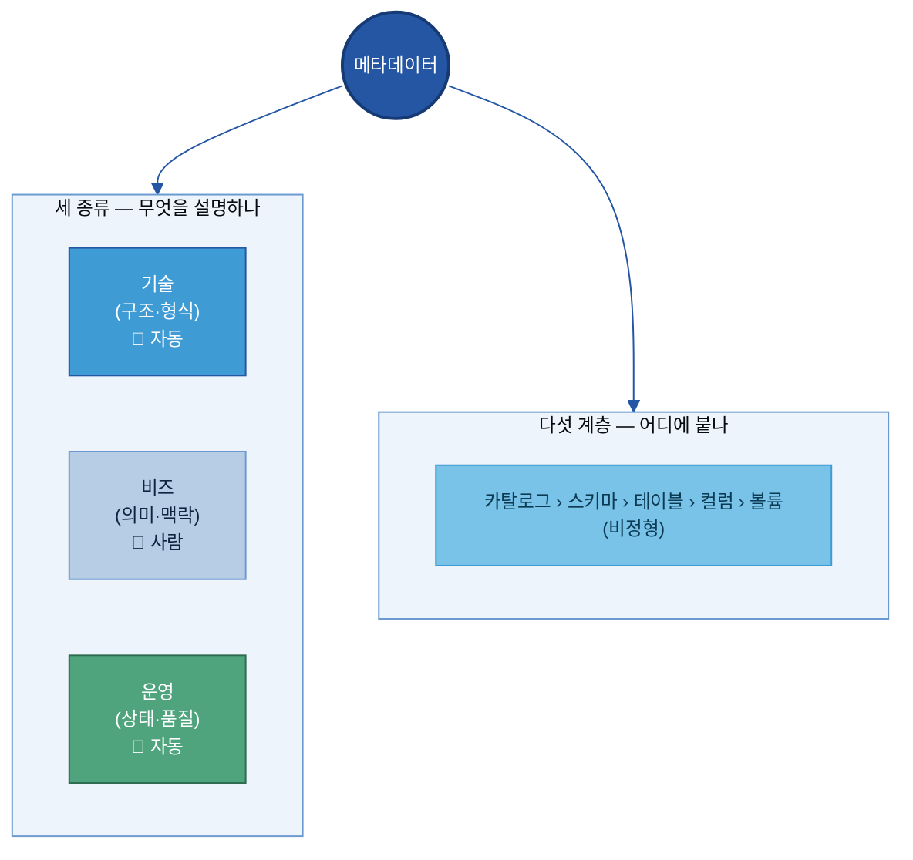
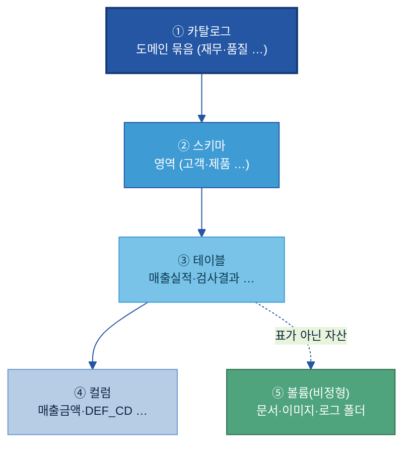
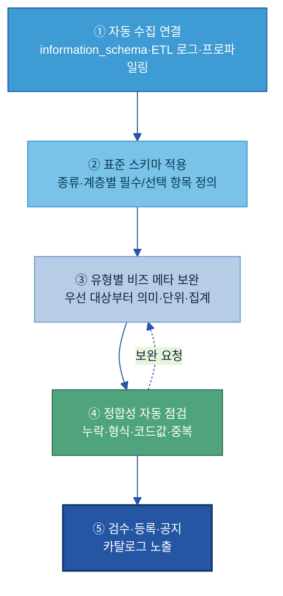

# A-2. 메타데이터

> **한 줄 정의:** 메타데이터(Metadata)는 데이터 자산이 **무엇을·어떤 구조와 단위로·어떤 기준으로 만들어졌는지**를 설명하는 "데이터의 설명서"다. — 자산이 *어디 있는지*를 가리키는 [A-1 카탈로그](../A-1%20데이터%20카탈로그/A-1%20데이터%20카탈로그.md)와 달리, 메타데이터는 그 자산의 **테이블·컬럼·코드값 수준 속성**을 채워, 사람과 AI가 데이터를 *오해 없이 해석*하게 한다.

## 목차

1. [개요](#1-개요)
2. [왜 필요한가 (Why)](#2-왜-필요한가-why)
3. [무엇을 갖추나 (What — 세 종류·다섯 계층)](#3-무엇을-갖추나-what--세-종류다섯-계층)
4. [데이터 유형별 메타데이터 차이](#4-데이터-유형별-메타데이터-차이)
5. [어디부터 하나 (정비 우선순위)](#5-어디부터-하나-정비-우선순위)
6. [예시 시나리오 — 두산전자 적용 흐름](#6-예시-시나리오--두산전자-적용-흐름)
7. [어떻게 준비·운영하나 (How)](#7-어떻게-준비운영하나-how)
8. [다른 주제와의 관계](#8-다른-주제와의-관계)
9. [성과 지표·로드맵·고도화](#9-성과-지표로드맵고도화)

- [별첨 — 항목 사전(전체)·작성 양식·표준값·계층별 예시](#별첨-appendix)
- [참고자료(References)](#참고자료-references)
- [변경 이력 / 피드백 반영](#변경-이력--피드백-반영)

> 관련 가이드: [A-1 데이터 카탈로그](../A-1%20데이터%20카탈로그/A-1%20데이터%20카탈로그.md) · [A-3 비즈니스 Glossary](../A-3%20비즈니스%20Glossary/A-3%20비즈니스%20Glossary.md) · [B-2 데이터 해설·주석](../B-2%20데이터%20해설·주석/B-2%20데이터%20해설·주석.md) · [C-2 데이터 품질 관리](../C-2%20데이터%20품질%20관리/C-2%20데이터%20품질%20관리.md) · [C-3 데이터 계통 Lineage](../C-3%20데이터%20계통%20Lineage/C-3%20데이터%20계통%20Lineage.md)

---

### 이 가이드가 답하는 핵심 질문

| # | 질문(현업의 말로) | 한 줄 답 | 다루는 곳 |
|---|---|---|---|
| 1 | AI가 데이터 구조를 이해하려면 **무슨 메타데이터**가 필요한가? | 데이터 타입·단위·허용값·생성 시스템·갱신 주기·오너 등을 **기술/비즈/운영 세 종류**로 정의한다 | [§3](#3-무엇을-갖추나-what--세-종류다섯-계층) |
| 2 | 메타데이터의 **틀(메타-메타데이터)을 어떻게 정의·진화·버전 관리**하나? | "어떤 항목을 어떤 형식으로 채울지"를 표준 스키마로 고정하고, 항목이 늘면 버전을 올린다 | [§3.6](#sec36) |
| 3 | **이름만으론 뜻을 모르는** 약어·코드를 어떻게 설명하나? | 컬럼·코드값에 자연어 설명(필드 설명서)을 붙인다 — `DEF_CD = 품질 결함 유형 코드` | [§3.4](#sec34) |
| 4 | **단위·기준일·집계 기준**을 어떻게 명확히 하나? | 숫자에 단위·기준 시점·계산 기준을 메타데이터로 못박아 AI가 잘못 비교하지 않게 한다 | [§3.5](#sec35) |
| 5 | 메타데이터를 어떻게 **자동 수집·갱신**하나? | 기술·운영 메타는 플랫폼이 자동 수집, 비즈·AI 메타만 사람이 보완하고 오너가 승인한다 | [§5.2](#sec52) · [§7](#7-어떻게-준비운영하나-how) |

---

## 1. 개요

### 1.1 메타데이터란 (데이터의 설명서)

**👉 한 줄 요약:** 메타데이터는 "데이터에 대한 데이터" — 데이터가 무엇을 뜻하고, 어떤 단위·기준으로 쌓였으며, 어떻게 써야 하는지를 적은 **설명서**다.

데이터 값 자체는 그것만 봐서는 의미가 불완전하다. 예를 들어 어떤 셀에 `94.2`라는 숫자가 들어 있다고 하자. 이것이 동박 두께인지 수율인지, 단위가 ㎛인지 %인지, 언제 측정된 값인지, 결측이면 무엇으로 채우는지 — 값만으로는 알 수 없다. 메타데이터는 그 값 **옆에 붙는 설명**이다.

| 데이터(값) | 메타데이터(설명) |
|---|---|
| `94.2` | 컬럼명: `THK_AVG` / 의미: **동박 두께 평균** / 단위: **㎛** / 측정 주기: **1초** / 생성 시스템: **MES** / 결측 처리: **NULL** |
| `S01` | 컬럼명: `DEF_CD` / 의미: **품질 결함 유형 코드** / 코드값: `S01=스크래치, P03=핀홀` / 도메인: **품질** |

이 설명이 있어야 사람도 AI도 데이터를 **같은 의미로** 읽는다. 메타데이터가 비면, 데이터는 "그 데이터를 만든 사람의 머릿속"에만 의미가 있는 반쪽짜리 자산이 된다.

> **🏭 두산전자 예시:** 컬럼명 `DEF_CD` 하나만 보면 AI는 이게 무슨 코드인지 모른다. 메타데이터로 *"품질 결함 유형 코드 (예: S01=스크래치, P03=핀홀)"* 를 붙이면, AI가 "스크래치 불량 추이 보여줘"라는 질문에 이 컬럼을 정확히 연결한다. 설명서 한 줄이 데이터를 "사람만 아는 자산"에서 "AI도 쓰는 자산"으로 바꾼다.

메타데이터는 데이터 자산의 **계층 전반**(카탈로그→스키마→테이블→컬럼→볼륨)에 붙으며, 본 가이드는 이를 **기술·비즈·운영 세 종류**로 나눠 관리한다(§3).

### 1.2 적용 범위와 체계 내 위치 (자산의 "속성")

**👉 한 줄 요약:** 메타데이터는 "찾을 수 있게(Findable)" 묶음(A-1~A-3)에서 **자산의 속성**을 담당한다 — 용어의 뜻(A-3)과 자산의 소재(A-1) 사이에서, 자산 안의 구조·단위·의미를 채운다.

A-1~A-3은 "AI와 사람이 데이터를 찾을 수 있게" 만드는 세 주제다. 각자 다른 질문에 답한다.

| 주제 | 답하는 질문 | 무엇을 담나 | 비유 |
|---|---|---|---|
| [A-3 Glossary](../A-3%20비즈니스%20Glossary/A-3%20비즈니스%20Glossary.md) | "이 **단어**가 무슨 뜻이지?" | 용어의 **표준 뜻** (단어 단위) | 국어사전 |
| **A-2 메타데이터 (이 가이드)** | "이 **자산**은 어떤 속성이지?" | 테이블·컬럼·단위·기준 등 **자산의 속성** | 제품 사양서 |
| [A-1 카탈로그](../A-1%20데이터%20카탈로그/A-1%20데이터%20카탈로그.md) | "그 **데이터가 어디** 있지?" | 자산의 **소재·존재** (어디·누구 책임) | 도서관 목록 |

세 주제는 **A-3 → A-2 → A-1** 순으로 의미를 쌓는다. 표준 용어로(A-3) 자산의 속성을 기술하면(A-2), 그 속성이 카탈로그 등록 항목으로 노출된다(A-1).


> **⚠️ 카탈로그와의 경계 (중복 방지):** 카탈로그는 자산을 *찾고 재사용 판단*하는 **요약 신호**(존재·위치·오너·"AI 활용 가능 등급")만 담는다. 컬럼 단위 데이터 타입·코드값 풀이·단위·집계 기준 같은 **상세 속성**은 메타데이터(A-2)가 담는다. 한 문장으로: **카탈로그가 "여기 있다·이런 조건이다"까지면, 메타데이터는 "이 컬럼은 무엇이고 어떻게 해석하라"까지다.**

**무엇을 다루고/안 다루는가:**

| 다룬다 (A-2) | 안 다룬다 (다른 주제) |
|---|---|
| 테이블·컬럼·코드값의 기술·비즈·운영 속성 | 자산 소재·오너·접근 경로 → [A-1](../A-1%20데이터%20카탈로그/A-1%20데이터%20카탈로그.md) |
| 단위·기준일·집계 기준 정의 | 업무 용어 자체의 표준 정의 → [A-3](../A-3%20비즈니스%20Glossary/A-3%20비즈니스%20Glossary.md) |
| 메타데이터 표준 스키마·버전 관리 | 라벨·주석 작업 방법(분류체계·합의) → [B-2](../B-2%20데이터%20해설·주석/B-2%20데이터%20해설·주석.md) |
| 품질·계보 메타는 **포인터로 참조** | 품질 측정·계보 추적 자체 → [C-2](../C-2%20데이터%20품질%20관리/C-2%20데이터%20품질%20관리.md)·[C-3](../C-3%20데이터%20계통%20Lineage/C-3%20데이터%20계통%20Lineage.md) |

### 1.3 주요 대상 조직

**👉 한 줄 요약:** 기술·운영 메타는 **플랫폼·IT가 자동**으로, 비즈·AI 메타는 **현업 데이터 담당자(오너)** 가 채우고, **데이터 스튜워드/관리 조직**이 표준·검수를 맡는다.

메타데이터는 "한 조직이 다 만드는 것"이 아니라, **자동으로 채워지는 부분과 사람이 채우는 부분이 나뉜다.** 누가 무엇을 하는지가 명확해야 작성 부담이 엉뚱한 곳에 쏠리지 않는다.

| 역할 | 메타데이터에서 하는 일 | 주로 다루는 종류 |
|---|---|---|
| **데이터 오너 / 현업 담당자** | 담당 자산의 컬럼 의미·단위·집계 기준 작성, 변경 시 갱신 | 👤 비즈 메타 |
| **데이터 스튜워드 / 관리 조직** | 메타데이터 표준 스키마 정의, 작성 검수(표준 용어·중복·보안), 등록 승인 | 검수·표준 |
| **데이터 플랫폼 / IT** | 기술·운영 메타 자동 수집 파이프라인 구축·운영(`information_schema` 등) | 🤖 기술·운영 메타 |
| **AI/Data 거버넌스** | 메타데이터 정책·필수 항목·버전 관리 기준 수립 | 정책 |

> **용어 풀이 — 데이터 스튜워드(Data Steward):** 데이터의 *품질과 의미*를 책임지고 관리하는 담당자. 오너가 "내 데이터"를 책임진다면, 스튜워드는 "여러 데이터가 표준에 맞게 기술됐는지"를 가로질러 점검한다.

---

## 2. 왜 필요한가 (Why)

**👉 한 줄 요약:** 이름·단위만으론 뜻을 알 수 없어 **AI가 잘못 해석**하고, 같은 숫자를 부서마다 다른 기준으로 비교해 **틀린 답**이 나온다 — 메타데이터는 이 오해석을 원천에서 막는다.

### 2.1 현업 Pain Point

[A-1 카탈로그](../A-1%20데이터%20카탈로그/A-1%20데이터%20카탈로그.md)가 "데이터를 **찾는**" 문제를 푼다면, 메타데이터는 그다음 문제 — "찾았는데 **무슨 뜻인지 모른다**"를 푼다. 두산전자 AI 과제팀이 동박 결함 예측 모델을 위해 검사결과 테이블 `INSP_RESULT`를 찾았다고 하자. 카탈로그 덕분에 위치·오너는 알았다. 그런데 테이블을 열어 보니:

**Pain 1 — 약어·코드를 못 읽는다:** 컬럼이 `DEF_CD`, `WIP_QTY`, `THK`처럼 현장식 약어다. 이게 결함 코드인지, 재공 수량인지, 두께인지 — 만든 사람 외에는 모른다. AI는 더더욱 모른다. 결국 "이 컬럼 뭐예요?"를 사람에게 물어봐야 하고, 그 사람이 자리를 비우면 과제가 멈춘다.

**Pain 2 — 단위·기준이 제각각이다:** 한 테이블은 두께를 ㎛로, 다른 테이블은 mm로 쌓는다. "매출"이라는 컬럼도 어떤 팀은 주문일 기준, 어떤 팀은 배송완료일 기준이다. 메타데이터에 단위·기준이 없으면, AI는 단위 다른 값을 그대로 더하거나 비교해 **틀린 집계**를 낸다.

**Pain 3 — 코드값의 뜻을 모른다:** `DEF_CD`가 결함 코드인 건 알아도, `S01`·`P03`이 각각 무슨 결함인지 풀이가 없다. AI가 "핀홀 불량률"을 물어도 어느 코드가 핀홀인지 연결하지 못한다.

**Pain 4 — 최신본·계산 로직을 모른다:** 같은 보고서·테이블이 여러 버전 존재하는데 어느 것이 최신본인지, `원가` 컬럼이 재료비만인지 전부 합산인지가 적혀 있지 않다. AI가 옛 버전이나 다른 계산 기준의 값을 인용해 **그럴듯하지만 틀린 답**을 만든다.

> **🏭 두산에너빌리티 예시:** 발전 설비 센서 테이블에 `TEMP`라는 컬럼이 섭씨인지 화씨인지, 어느 측정점(베어링/배기/냉각수)인지 설명이 없어, 이상 탐지 AI가 정상 범위를 잘못 잡아 오탐이 잦았다. 단위·측정점 메타데이터를 붙이고 나서야 오탐이 줄었다.

이 네 가지 Pain의 공통점은 **"데이터는 있는데 해석을 사람 머릿속에 의존한다"**는 것이다. 메타데이터는 그 해석을 데이터 옆에 명시해, 사람도 AI도 같은 의미로 읽게 한다.

### 2.2 기대 효과

**① AI 응답 정확도 향상**

컬럼 의미·단위·코드값이 메타데이터로 붙으면, AI는 질문에 맞는 컬럼을 정확히 고르고 올바르게 해석한다. "핀홀 불량 추이"라는 질문에 `DEF_CD='P03'`을 정확히 연결하고, 단위가 다른 값을 섞지 않는다. 메타데이터는 AI가 데이터를 "추측"하지 않고 "근거를 갖고" 쓰게 하는 토대다.

**② 재사용·셀프서비스 확대**

설명서가 있으면 현업이 데이터 담당자에게 일일이 묻지 않고 **스스로** 데이터를 이해·활용한다. "이 컬럼 뭐예요?" 문의가 줄고, 데이터 담당자는 반복 응대에서 벗어난다.

🏭 **두산전자 예시:** 신규 분석 담당자가 `INSP_RESULT`를 처음 봐도, 컬럼 설명·코드값 풀이만 읽고 바로 결함 분석을 시작한다 — 기존엔 선임에게 컬럼 의미를 묻느라 며칠이 걸렸다.

**③ 오류·재작업 감소**

단위·집계 기준 불일치로 생기는 잘못된 비교·집계가 사라진다. `제조원가 = 직접재료비+노무비+제조경비, 월 마감 기준`처럼 계산 기준이 명시되면, 서로 다른 기준의 원가를 단순 비교하는 실수가 원천 차단된다.

**④ 거버넌스의 실행 기반**

보안 등급·개인정보 포함 여부·값 의미 유형이 **컬럼 단위**로 붙으면, 접근 통제·마스킹·집계 규칙이 자동으로 작동한다. 메타데이터는 거버넌스 정책을 실제 데이터에 연결하는 고리다.

> **🏢 자회사 입장에서 — 이 가이드를 적용하면:** ① AI·분석 과제가 "컬럼 의미 물어보기"에서 해방돼 *착수가 빨라지고*, ② 단위·기준 불일치로 인한 *재작업·오답*이 줄며, ③ 담당자가 바뀌어도 *데이터 해석이 조직에 남는다.* 카탈로그가 "데이터를 찾게" 했다면, 메타데이터는 "찾은 데이터를 **믿고 쓰게**" 만든다.

---

## 3. 무엇을 갖추나 (What — 세 종류·다섯 계층)

> ★ **이 절의 정본 모델:** 메타데이터 = **세 종류(기술·비즈·운영)** × **다섯 계층(카탈로그·스키마·테이블·컬럼·볼륨)**. 가이드 전체에서 이 분류·용어를 일관되게 쓴다.

**👉 한 줄 요약:** 메타데이터를 "세 종류로 무엇을 설명하나" × "다섯 계층 중 어디에 붙나"의 격자로 보면, 무엇을 어디에 채울지가 한눈에 정리된다.



### 3.1 세 종류의 메타데이터 (기술 · 비즈 · 운영)

**👉 한 줄 요약:** 메타데이터는 *시스템 관점(기술)*, *업무 관점(비즈)*, *상태 관점(운영)* 세 종류로 나뉜다 — **채우는 주체와 방식이 다르므로** 종류를 가르는 것이 작성 전략의 출발점이다.

**i) 기술 메타데이터(Technical Metadata) — "어떻게 저장돼 있나"**

데이터의 저장 구조·형식·생성 방식 등 **시스템 관점**의 속성이다. 컬럼 타입, NULL 허용 여부, 컬럼 순서, 저장 위치, 생성/변경 시각 등. **시스템에 의해 자동 생성·갱신**되며 별도 수기 작성이 필요 없다 — 운영 관점에서는 "작성"이 아니라 *"자동 수집이 정상으로 들어오는지"* 를 관리한다.

> 🏭 예시: `THK_AVG` 컬럼의 타입 `DECIMAL(5,2)`, NULL 불가, MES에서 생성, 2025-01-20 변경 — 모두 플랫폼이 자동 기록.

**ii) 비즈 메타데이터(Business Metadata) — "업무적으로 무슨 뜻인가"**

데이터가 비즈니스적으로 **무엇을 의미하고** 어떤 업무 맥락에서 쓰이는지를 설명한다. 컬럼 의미 설명(Comment), 단위, 집계 기준, 관련 도메인, 담당 부서 등. **업무 의미를 가장 잘 아는 현업 담당자가 직접 작성**한다 — 자동화가 가장 어렵고, 그래서 메타데이터 작성 부담이 여기에 몰린다(§7.3에서 작성법을 깊게 다룬다).

> 🏭 예시: `THK_AVG` = "동박 두께 1초 측정의 30초 이동평균, 단위 ㎛, 목표 12±0.5".

**iii) 운영 메타데이터(Operational Metadata) — "지금 상태가 어떤가"**

데이터의 **생성·변경·활용 과정의 상태와 품질**을 관리하는 정보다. 갱신 주기, 적재 시점, 데이터 건수 변화, 품질 지표, 접근 로그 등. **단일 시점이 아니라 시간에 따라 변하는 상태 정보**이며, 파이프라인 로그·저장소 메타에서 **자동 수집·계산**한다. AI가 최신 데이터를 참조하는지, 파이프라인이 끊기지 않았는지 판단하는 근거가 된다.

> 🏭 예시: `INSP_RESULT` 마지막 적재 02:14, 어제 대비 건수 +1,240, 파싱 성공률 100%.

| 종류 | 무엇을 설명 | 대표 항목 | 누가·어떻게 |
|---|---|---|---|
| **기술**(Technical) | 저장 구조·형식·생성 방식 | 컬럼 타입, NULL 여부, 저장 위치, 생성/변경 시각 | 🤖 시스템 **자동 수집** |
| **비즈**(Business) | 업무적 의미·활용 맥락 | 컬럼 의미, 단위·집계 기준, 도메인, 담당 부서 | 👤 현업 **작성** |
| **운영**(Operational) | 상태·품질(시간에 따라 변함) | 갱신 주기, 적재 시점, 건수, 품질 지표, 접근 로그 | 🤖 시스템 **자동 계산** |

> **용어 풀이 — NULL:** 값이 비어 있음을 뜻하는 표시. "NULL 허용 여부"는 그 컬럼이 빈 값을 가질 수 있는지를 말한다.
>
> ▸ 백업: [Backup 3-A] 종류별 상세 속성 목록

#### [Backup 3-A] 종류별 상세 속성 (상세)

| 종류 | 세부 관리 항목(예) |
|---|---|
| 기술 | 데이터 타입, 전체 타입 정의, NULL 여부, 컬럼 순서, 기본값, 문자 길이, 숫자 정밀도/소수 자릿수, 저장 포맷/경로, 생성자/변경자, 생성/변경 시각 |
| 비즈 | 컬럼 의미(Comment), 단위, 집계 대상·기간·포함조건, 계산 로직, 기준 시스템, 관련 도메인, 활용 시나리오, 담당 부서, 표준 용어 링크(Glossary) |
| 운영 | 갱신 주기, 마지막 적재 시각, 데이터 건수·증감, 파티션 상태, 의존 관계, 품질 점수, 파싱 성공률(비정형), 접근/사용 로그, 권한 변경 이력 |

### 3.2 다섯 계층 (어디에 붙나)

**👉 한 줄 요약:** 메타데이터는 데이터 자산의 계층마다 붙는다 — 위에서 아래로 좁아지며, **컬럼이 가장 촘촘하고**, 표가 아닌 자산(문서·이미지)은 **볼륨** 단위로 관리한다.



> **🏭 예시로 읽기:** 매출 금액·수량(④ 컬럼)이 모여 매출실적(③ 테이블)이 되고, 매출·고객 테이블이 모여 영업(② 스키마), 그것이 재무(① 카탈로그)로 묶인다. 문서·이미지처럼 표가 아닌 자산은 ⑤ **볼륨** 단위로 관리한다.

각 계층에서 관리하는 메타데이터의 초점이 다르다:

| 계층 | 이 계층 메타의 초점 | 대표 항목 |
|---|---|---|
| ① 카탈로그 | 도메인 묶음의 정체성·관리 상태 | 카탈로그명, 설명, 소유자, 포함 도메인 |
| ② 스키마 | 영역의 범위·권한 | 스키마명, 설명, 객체 수, 권한 |
| ③ 테이블 | 무엇을 담은 표인가 | 테이블명/유형, 설명, 키, 적재 시점, 건수 |
| ④ 컬럼 | **가장 촘촘** — 의미·타입·단위·코드 | 컬럼명, 타입, NULL, 의미(Comment), 단위, 코드값 |
| ⑤ 볼륨(비정형) | 파일 단위 상태 | 볼륨명/유형, 저장 위치, 파일 수·용량, 수집·파싱 상태 |

> ▸ 백업: [Backup 3-B] 계층별 운영 메타 초점

#### [Backup 3-B] 계층별 운영 메타 초점 (상세)

- **카탈로그:** 전체 설명 작성 상태, 활용 현황, 파이프라인 상태
- **스키마:** 객체 수, 저장 용량, 권한 변경, 접근 이상 여부
- **테이블:** 적재 시점, 데이터 건수 변화, 의존 관계, 파티션 상태
- **볼륨:** 파일 수, 저장 용량, 수집 상태, 파싱 성공률
- 정형은 적재·집계·조회 성능 중심, 비정형은 수집·파싱·저장 규모·AI 활용 가능성 중심으로 초점을 분리한다.

### 3.3 항목 사전 — 대표 항목 (현업 실행 키트 ㉠)

**👉 한 줄 요약:** 자산에 붙이는 메타데이터 항목을 **세 종류로 묶어** 정리한 표다. `필수/선택`은 최소 채울 항목, **작성 주체**는 🤖 자동(플랫폼) / 👤 오너(현업) / 🔐 보안으로 나뉜다.

> **이 표 보는 법:** 🤖 항목은 플랫폼이 자동으로 채우니 사람은 *확인만* 한다. 사람이 실제로 손대는 건 👤·🔐 칸뿐이다 — 그래서 "메타데이터 작성"의 부담은 **비즈 메타에 몰려 있다.** 본문은 현업이 먼저 보는 대표 항목만, 컬럼 단위 30여 항목 전체는 [[Appendix A]](#appendix-a)에.

**기술 메타데이터 (대표)**

| 항목 | 쉬운 의미 | 예시값 | 필수/선택 | 작성 주체 |
|---|---|---|:---:|:---:|
| 데이터 타입 | 컬럼의 형식 | `STRING / INT / DECIMAL(5,2)` | 필수 | 🤖 |
| NULL 허용 여부 | 빈 값 가능 여부 | `NO` | 필수 | 🤖 |
| 컬럼 순서 | 테이블 내 위치 | `3` | 선택 | 🤖 |
| 저장 위치 | 실제 경로 | `QMS.dbo.INSP_RESULT` | 필수 | 🤖 |
| 생성/변경 시각 | 언제 만들어/바뀌었나 | `2025-01-20 14:22` | 선택 | 🤖 |

**비즈 메타데이터 (대표 — 사람이 채우는 핵심)**

| 항목 | 쉬운 의미 | 예시값 | 필수/선택 | 작성 주체 |
|---|---|---|:---:|:---:|
| 컬럼 의미 설명(Comment) | 이 컬럼이 무엇인지 한 문장 | `계약 단가 기준 확정 매출 (납품·세금계산서 발행 건)` | 필수 | 👤 |
| 단위 | 측정 단위 | `㎛ / 원 / EA` | 필수 | 👤 |
| 집계 기준 | 대상·기간·포함조건 | `주문일 기준, 배송 완료 건만` | 선택 | 👤 |
| 관련 도메인 | 업무 영역 | `품질` | 필수 | 👤 |
| 담당 부서 | 의미를 책임지는 조직 | `품질보증팀` | 필수 | 👤 |

**운영 메타데이터 (대표)**

| 항목 | 쉬운 의미 | 예시값 | 필수/선택 | 작성 주체 |
|---|---|---|:---:|:---:|
| 갱신 주기 | 얼마나 자주 갱신 | `일 1회 (야간 배치 02:00)` | 필수 | 🤖 |
| 적재 시점 | 마지막 적재 시각 | `2025-01-21 02:14` | 선택 | 🤖 |
| 데이터 건수 | 행 수(변화 추적) | `1,284,553` | 선택 | 🤖 |
| 품질 지표 | 완전성·정확성 | `94/100` (→ [C-2](../C-2%20데이터%20품질%20관리/C-2%20데이터%20품질%20관리.md)) | 선택 | 🤖 |
| 보안 등급 | 민감도 | `대외비` | 필수 | 🔐 |

**🏭 두산전자 완성 메타 카드 예시 (`INSP_RESULT` 테이블 + `DEF_CD` 컬럼):**

세 종류 메타가 한 자산에 함께 붙은 모습. 🤖는 자동, 👤·🔐는 사람이 채운 칸이다.

```
════════════════════════════════════════════════════
 [테이블]  QMS.quality.INSP_RESULT
── 기술(🤖 자동) ──────────────────────────────────
 유형        : MANAGED          저장 포맷 : DELTA
 소유자      : 품질보증팀(svc)   생성/변경 : 2025-01-20 14:22
── 비즈(👤 현업) ──────────────────────────────────
 설명        : 동박 라인 일일 외관·전기검사 판정 결과(로트 단위)
 활용 목적   : 결함 예측·클레임 분석
 해석 유의   : 재검사 로트는 최종 판정만 적재(중간 판정 제외)
── 운영(🤖 자동) ──────────────────────────────────
 갱신 주기   : 일 1회(야간 배치 02:00)   최신성 기대 : D+1
 적재 시점   : 2025-01-21 02:14   건수 : 1,284,553 (+1,240)
── 보안(🔐) ───────────────────────────────────────
 보안 등급   : 대외비   개인정보 : 없음   AI 활용 : 가명화 후 가능
══════════════════════════════════════════════════════
 [컬럼]  DEF_CD
── 기술(🤖) ──  타입: STRING   NULL: NO   순서: 3
── 비즈(👤) ──  설명: 품질 결함 유형 코드(외관검사 판정)
                코드값: S01=스크래치 / P03=핀홀 / C02=컬
                도메인: 품질   값 의미: code(집계 금지)
════════════════════════════════════════════════════
```

> ▸ 계층(카탈로그·스키마·테이블·볼륨)별 메타 항목 예시 전체는 [[Appendix D] 계층별 메타데이터 예시](#appendix-d)에.

<a id="sec34"></a>
### 3.4 ★ 필드 설명서 — 이름만으론 모르는 데이터 풀이

> ❓ **핵심 질문 3 — "테이블명·필드명만으로 의미를 알 수 없는 데이터를 어떻게 설명하나?"** 에 답하는 절.

**👉 한 줄 요약:** 약어·코드·현장식 이름에는 **자연어 설명(Comment)** 과 **코드값 풀이(Dictionary)** 를 붙인다 — AI와 사람이 똑같이 해석하도록.

**i) 컬럼 설명(Comment)** — 컬럼이 담는 내용을 한 문장으로 적는다. 용어는 [A-3 Glossary](../A-3%20비즈니스%20Glossary/A-3%20비즈니스%20Glossary.md) 표준 용어를 우선 사용하고, 없으면 Glossary에 먼저 등록 후 반영한다.

**ii) 코드값 풀이(Dictionary)** — 코드 컬럼은 값마다 뜻을 단다. 코드만 있고 풀이가 없으면 AI는 코드를 "의미 없는 문자열"로 본다.

> **🏭 두산전자 — 코드값 풀이 예시 (`DEF_CD`):**
>
> | 코드값 | 뜻 |
> |---|---|
> | `S01` | 스크래치 (표면 긁힘) |
> | `P03` | 핀홀 (미세 구멍) |
> | `C02` | 컬(Curl, 휨) |
>
> 컬럼 설명: *"품질 결함 유형 코드 — 외관검사에서 판정된 결함 종류. 값 정의는 코드값 풀이 참조."*

**iii) 좋은 설명 vs 나쁜 설명 (컬럼 Comment)**

| ❌ Before | ✅ After |
|---|---|
| `DEF_CD` (설명 없음) | "품질 결함 유형 코드 (외관검사 판정, S01=스크래치…)" |
| "결함 관련 값" | "최종 검사에서 판정된 대표 결함 1건의 유형 코드" |
| "코드" | "결함 유형 코드 (코드값 풀이 별첨 참조)" |

**필수 작성 대상(엑셀 가이드 기준):** ① 컬럼명이 약어·모호한 경우(의미 중심으로 풀이 + 검색 키워드 포함), ② 같은 의미 컬럼이 여러 곳에 있는 경우(동일 용어로 통일), ③ 비슷한 이름이 여러 개라 구분이 필요한 경우(산식·기준 시점·포함/제외 조건 차이를 명시).

**iv) 테이블 수준 해석 기준 — 컬럼 설명만으론 안 풀리는 것**

컬럼 하나하나는 설명해도, 그 테이블을 *어떤 업무 규칙으로 읽어야 하는지*·*어떤 함정이 있는지*는 따로 적어야 한다. 두 가지를 둔다.

| 항목 | 무엇을 | 🏭 예시 |
|---|---|---|
| **업무 규칙 해석 기준**(business rule) | 값·지표를 해석할 때 적용할 업무 규칙 | "주문 기준 매출 = 주문일/주문상태 기준 집계 / 회계 기준 매출 = 매출인식일/전표 기준 집계" |
| **해석 유의사항**(caveat) | 규칙만으론 설명 안 되는 예외·한계·주의 | "내부 거래 포함 여부로 추정 매출이 공식 실적과 다를 수 있음 / 일부 법인 미연계로 공백 존재" |

> 이 두 항목이 없으면 AI와 사용자가 같은 테이블을 보고도 다른 숫자를 답한다 — "왜 대시보드와 다르지?"의 대부분이 여기서 갈린다.

<a id="sec35"></a>
### 3.5 ★ 단위·기준일·집계 기준

> ❓ **핵심 질문 4 — "단위·기준일·집계 기준을 어떻게 명확히 하나?"** 에 답하는 절.

**👉 한 줄 요약:** 숫자 컬럼에는 **단위·기준 시점·집계 방식·기준 시스템**을 메타데이터로 못박아, AI가 단위·기준이 다른 값을 잘못 비교하지 않게 한다.

| 무엇을 | 왜 필요 | 예시 |
|---|---|---|
| **단위** | 단위 다른 값 혼동 방지 | 두께 `㎛`, 금액 `원(KRW)`, 수량 `EA`, 비율 `%` |
| **기준 시점(기준일)** | "언제 기준" 숫자인지 | `주문일 기준` vs `배송완료일 기준` |
| **집계 방식·계산 로직** | 같은 이름 다른 계산 방지 | `노무비 = 초과근무 포함, 최근 1년 평균` |
| **기준 시스템** | 어느 시스템 값이 원본인가 | `매출액 (SAP 기준)` |

> **🏭 예시 — 집계 기준이 없으면 생기는 오류:** `원가` 컬럼이 "재료비만"인지 "재료비+노무비+경비"인지 메타데이터에 없으면, AI가 A라인 원가(재료비만)와 B라인 원가(전부 합산)를 단순 비교해 "A라인이 훨씬 싸다"는 틀린 결론을 낸다. → `제조원가 = 직접재료비+노무비+제조경비, 월 마감 기준`으로 명시하면 사라진다.

값의 "성격"을 표시하는 것도 중요하다. 더하면 되는 **금액·수량**과 더하면 안 되는 **비율·코드**를 구분하지 않으면 AI가 비율을 합산하는 실수를 한다(→ [Appendix C] `value_type` 태그).

<a id="sec36"></a>
### 3.6 ★ 메타데이터 스키마(메타-메타데이터)와 버전 관리

> ❓ **핵심 질문 2 — "메타데이터의 틀을 어떻게 정의·진화·버전 관리하나?"** 에 답하는 절.

**👉 한 줄 요약:** "어떤 항목을 어떤 형식으로 채울지"를 정한 **표준 스키마**가 메타-메타데이터다 — 이걸 고정해야 자산마다 제멋대로 채워지지 않는다.

> **용어 풀이 — 메타-메타데이터:** "메타데이터에 대한 메타데이터". 즉 *메타데이터를 적는 양식 그 자체*. 예: "컬럼 설명은 필수, 한 문장, 표준 용어 사용"이라는 규칙이 메타-메타데이터다.

> **참고 — 정립된 표준:** 메타데이터를 표준 레지스트리로 관리하는 개념은 ISO/IEC 11179[^iso11179], AI 학습용(ML-ready) 데이터셋 메타데이터 형식은 Croissant(MLCommons)[^croissant], 공공 데이터 메타데이터 교환은 DCAT[^dcat] 등으로 정립돼 있다 — 우리 표준 스키마도 이들을 참고한다.

- **표준 스키마 정의:** 종류별(기술/비즈/운영)·계층별로 *필수/선택 항목, 형식, 허용값*을 표로 못박는다([Appendix A]가 그 예). 이 표가 곧 "모든 자산이 따르는 양식"이 된다.
- **진화(항목 추가):** 새 요구가 생기면(예: "AI 활용 가능 등급" 신설) 표준 스키마에 항목을 더한다. 이때 기존 자산은 새 항목이 비어 있으므로 *마이그레이션 계획*(언제까지 채울지)을 함께 둔다.
- **버전 관리:** 항목·형식이 바뀌면 스키마 버전을 올린다(`v1.2`). **기존 정의를 덮어쓰지 않고 이력을 보존**한다.
- **변경 기록:** 비즈 메타 변경 시 *변경 담당자·변경일·변경 사유*를 함께 남겨, 무엇이 왜 바뀌었는지 추적 가능하게 한다.

---

## 4. 데이터 유형별 메타데이터 차이

**👉 한 줄 요약:** 정형·시계열·문서·이미지·영상은 **챙겨야 할 메타데이터 항목이 다르다** — 유형을 먼저 가르고, 그 유형에 맞는 항목을 채운다.

메타데이터를 "모든 데이터에 같은 항목"으로 채우려 하면, 시계열엔 불필요한 항목을 묻고 정작 중요한 측정 주기는 빠진다. 그래서 **유형부터 가른다.**

### 4.1 유형을 가르는 3가지 기준

| 기준 | 갈래 | 예 |
|---|---|---|
| 구조 | 정형 / 비정형 | 테이블 vs 문서·이미지 |
| 내용 | 텍스트 / 멀티미디어 | 보고서 vs 사진·도면 |
| 시간 | 시계열 / 비시계열 | 센서 측정 vs 마스터 정보 |

### 4.2 유형별 챙길 메타데이터

| 유형 | 핵심 메타데이터 (이 유형만의 것) | 🏭 두산 예시 |
|---|---|---|
| **정형(테이블)** | 컬럼·데이터 타입·코드값·**키 관계**(어느 컬럼이 어느 테이블과 이어지나) | 검사결과의 `LOT_NO`가 생산 테이블과 연결 |
| **시계열(센서)** | **기준 시각(Timestamp)**·측정 단위·**측정 주기**·결측 구간·이상치 기준 | 동박 두께 1초 측정, ㎛, 결측 시 NULL |
| **문서** | 문서 유형·**버전·최신본 식별**(옛 버전 학습 방지)·작성일·작성자 | FMEA 보고서 v3가 최신본임을 표시 |
| **이미지·도면** | 해상도·**촬영/생성 맥락**·연관 문서(도면이 단독 해석되게) | 결함 사진 + 촬영 라인·로트·연관 검사기록 |
| **영상·음성** | 길이·프레임(FPS)·**구간 표시**(정상/이상) | 설비 가동 영상의 이상 발생 구간 태그 |

> **용어 풀이 — FPS:** Frames Per Second, 영상 1초당 프레임 수. 구간을 시각으로 가리키려면 FPS가 필요하다.
> **용어 풀이 — 키 관계:** 한 테이블의 컬럼이 다른 테이블의 행과 연결되는 고리(예: `LOT_NO`로 검사결과와 생산이력을 잇는다). AI가 데이터를 조인(결합)하려면 이 관계 정보가 필요하다.

> **🏭 비정형(볼륨) 비즈 메타 예시 — 이메일 첨부 데이터:** 표가 아닌 자산도 "파일 단위 속성"을 비즈 메타로 붙인다. 예: 제목·송수신자·수신일(필수) + AI가 채우는 `content_summary`(본문 요약), `entities`(언급된 고객사·제품: "삼성전자, Isola, CCL"), `urgency`(High/Med/Low), `biz_category`(고객사 관련/경쟁사 실적…). → AI가 "경쟁사 CCL 동향 메일 찾아줘"에 답할 수 있게 된다. (요약·엔티티 추출 자체는 [B-1 전처리](../B-1%20데이터%20전처리/B-1%20데이터%20전처리.md)·[B-2](../B-2%20데이터%20해설·주석/B-2%20데이터%20해설·주석.md)가 맡고, A-2는 그 결과를 어떤 메타 항목으로 둘지를 정한다.)

> **경계:** 라벨·주석을 *어떻게 다는가*(분류 체계 설계·작업자 합의·품질관리)는 [B-2 데이터 해설·주석](../B-2%20데이터%20해설·주석/B-2%20데이터%20해설·주석.md)의 영역이다. A-2는 "이 자산에 어떤 속성 항목을 둘지"까지 다룬다.

---

## 5. 어디부터 하나 (정비 우선순위)

### 5.1 정비 우선 대상

**👉 한 줄 요약:** 전 자산을 한 번에 하지 않는다 — **AI 과제가 당장 쓸 데이터, 설명이 비었거나 단위가 뒤죽박죽인 데이터**부터. (메타데이터는 *기본적으로 다 필요*하지만, 채우는 **순서**를 정한다.)

| 우선순위 | 대상 | 이유 |
|---|---|---|
| 1순위 | AI/분석 과제가 **당장 쓰는** 테이블·컬럼 | 효과가 바로 보임 |
| 2순위 | 약어·코드 컬럼, 단위 불명 수치 컬럼 | 오해석 위험이 큼 |
| 3순위 | 여러 부서가 공유하는 핵심 마스터·실적 | 파급 효과 큼 |
| 후순위 | 사용 빈도 낮은 임시·백업 자산 | 비용 대비 효과 낮음 |

🏭 **두산전자 예시:** 동박 결함 예측 과제가 쓰는 `INSP_RESULT`·`PROD_LOG`의 컬럼부터 비즈 메타를 채우고, 잘 안 쓰는 레거시 백업 테이블은 뒤로 미룬다. "전부 다"가 아니라 "쓰는 것부터".

<a id="sec52"></a>
### 5.2 자동으로 모으고, 사람은 검수만

> ❓ **핵심 질문 5 — "메타데이터를 어떻게 자동 수집·갱신하나?"** 에 답하는 절(이어서 [§7](#7-어떻게-준비운영하나-how)).

**👉 한 줄 요약:** 기술·운영·보안 메타는 **시스템이 자동**으로 채우고, 사람은 **비즈·AI 메타(의미·단위·집계)만 보완**한다 — "다 적는다"가 아니라 "빈 칸만 메운다".


이 분담이 메타데이터 운영의 핵심이다. 만약 모든 항목을 사람이 적게 하면 작성은 시작도 못 하고 멈춘다. 자동으로 채울 수 있는 80%(기술·운영)는 플랫폼에 맡기고, 사람은 자동화가 어려운 20%(의미·단위·집계)에만 집중한다.

---

## 6. 예시 시나리오 — 두산전자 적용 흐름

### 6.1 적용 전 / 후

**👉 한 줄 요약:** 설명서를 붙이기 전엔 AI가 `DEF_CD`를 못 알아봤지만, 붙인 뒤엔 "결함 유형 코드"로 바로 해석한다.

| | 적용 전 | 적용 후 |
|---|---|---|
| 컬럼 `DEF_CD` | AI가 무슨 코드인지 모름 → 무시·오인용 | "품질 결함 유형 코드(S01=스크래치…)"로 해석 |
| 두께 `THK` | 단위 불명 → mm 데이터와 섞어 비교 | "단위 ㎛, 1초 측정"으로 정확 비교 |
| 원가 컬럼 | 계산 기준 불명 → 라인 간 잘못 비교 | "직접재료비+노무비+경비, 월 마감"으로 동일 기준 비교 |
| 검사 보고서 | 옛 버전·최신본 구분 안 됨 | 최신본 식별 → 옛 버전 학습 방지 |
| 활용 리드타임 | 컬럼 의미 물어보느라 며칠 | 설명서 읽고 즉시 활용 |

### 6.2 흐름 미리보기

**👉 한 줄 요약:** `DEF_CD` 컬럼 하나가 AI가 쓸 수 있는 자산이 되기까지의 흐름.

1. **자동 수집** — 플랫폼이 `INSP_RESULT.DEF_CD`의 타입(STRING)·NULL 여부·생성 시각 등 기술/운영 메타를 자동 기록.
2. **빈 칸 식별** — 정합성 점검이 "이 컬럼은 약어인데 의미 설명·코드값 풀이가 비었음"을 표시.
3. **현업 보완** — 품질보증팀 오너가 컬럼 설명("품질 결함 유형 코드")과 코드값 풀이(S01=스크래치…)를 작성, 표준 용어는 Glossary 확인.
4. **검수·등록** — 스튜워드가 표준 용어·중복·보안을 검토 후 등록, 카탈로그에 노출.
5. **AI 활용** — 결함 예측 Agent가 "핀홀 불량 추이"를 물으면 `DEF_CD='P03'`을 정확히 연결.

구축 절차의 상세는 [§7](#7-어떻게-준비운영하나-how)에서 다룬다.

---

## 7. 어떻게 준비·운영하나 (How)

### 7.1 수집·관리 도구 검토

> 🔗 **2층 연결:** 솔루션을 묶어서 평가·선정하려면 → [Tech Stack 비교 정본](../../전체%20목차/01%20Tech%20Stack%20비교%20(솔루션×주제).md). 아래는 *메타데이터 관점*의 기능 비교(1층)다.

**👉 한 줄 요약:** 메타데이터는 카탈로그 솔루션이 함께 관리하는 경우가 많다 — **자동 수집(커넥터)·비즈 메타 작성 UI·검수 워크플로·버전 관리** 기능을 본다.

| 도구 유형 | 메타데이터 관점 기능 초점 | 예 (공식 페이지) |
|---|---|---|
| 통합 카탈로그·거버넌스 | 자동 수집 + 비즈 메타 작성·승인 워크플로 + Glossary 연계 | [Collibra](https://www.collibra.com), [Microsoft Purview](https://learn.microsoft.com/azure/purview/), [Atlan](https://atlan.com) |
| 플랫폼 내장 메타스토어 | `information_schema` 자동 제공, 태그·Comment | [Databricks Unity Catalog](https://www.databricks.com/product/unity-catalog) |
| 오픈소스 | 수집·계보·필드 설명·프로파일링 | [DataHub](https://datahub.com/), [OpenMetadata](https://open-metadata.org/) |

> 기능·지원 범위·가격은 변동되므로 도입 검토 시 공식 문서·PoC로 확인한다(단정 금지).

**선정 시 메타데이터 관점 평가 기준 (가중 평가):**

| 평가 축 | 무엇을 보나 | 왜 중요 |
|---|---|---|
| 자동 수집 커버리지 | 우리 원천(SAP·MES·QMS·SharePoint) 커넥터 보유 | 🤖 자동화 비율이 작성 부담을 좌우 |
| 비즈 메타 작성 UX | 현업이 쉽게 Comment·단위·코드값 입력·검수 | 👤 작성이 실제로 돌아가는가 |
| Glossary·태그 연동 | 표준 용어·표준값 목록 연계 | 용어 표류·자유입력 방지 |
| 버전·이력 관리 | 스키마 변경 시 버전·변경 이력 보존 | §3.6 메타스키마 진화 지원 |
| 계보·품질 연계 | C-2·C-3 포인터 연동 | 인접 주제와 단절 방지 |
| 운영 형태·비용 | SaaS/온프렘, 폐쇄망 지원 | 제조 보안 환경 적합성 |

> ▸ 백업: [Backup 7-B] 도구 유형별 장단점

#### [Backup 7-B] 도구 유형별 장단점 (상세)

| 유형 | 강점 | 유의점 |
|---|---|---|
| 통합 카탈로그·거버넌스 (Collibra·Purview·Atlan) | 비즈 메타 작성·승인 워크플로·Glossary 통합이 강함 | 도입·운영 비용, 우리 원천 커넥터 적합성 PoC 필요 |
| 플랫폼 내장 (Databricks Unity Catalog) | `information_schema` 자동·태그·Comment 즉시 사용 | 플랫폼 종속, 멀티 플랫폼 환경은 통합 카탈로그 보완 필요 |
| 오픈소스 (DataHub·OpenMetadata) | 커스터마이즈·비용 이점, 활발한 커넥터 | 자체 운영·유지보수 역량 필요 |

### 7.2 구축 절차

**👉 한 줄 요약:** 자동 수집을 먼저 연결하고, 우선 대상부터 유형별 설명·단위를 보완한 뒤, 규칙으로 정합성을 검증해 등록한다.



1. **자동 수집 연결** — 플랫폼 `information_schema`·ETL 로그·데이터 프로파일링에서 기술·운영 메타를 수집한다.
2. **표준 스키마 적용** — §3.6의 표준 양식(필수/선택·형식·허용값)을 전 자산에 적용한다.
3. **유형별 비즈 메타 보완** — 정비 우선 대상(§5.1)부터 컬럼 의미·단위·집계·코드값을 현업이 작성한다.
4. **정합성 자동 점검** — §7.5 규칙으로 누락·형식·코드값·중복을 자동 점검한다.
5. **검수·등록·공지** — 스튜워드 검수 통과분을 등록하고 카탈로그에 노출, 관련자에게 공지한다.

> **용어 풀이 — 데이터 프로파일링(Data Profiling):** 데이터를 자동 분석해 값 분포·결측률·고유값 등을 파악하는 작업. 여기서 나온 결과가 운영 메타(품질·건수 등)의 재료가 된다.

### 7.3 비즈 메타 작성 — 잘 쓴 예 vs 못 쓴 예 (현업 실행 키트 ㉡)

**👉 한 줄 요약:** 비즈 메타는 *무엇을·어떤 기준으로 집계했는지*가 드러나게, **핵심 키워드 중심으로 1~2문장** 안에 쓴다 — 아래 교정 예를 그대로 따라 쓴다.

**작성 기본 원칙 3가지:**
1. **무엇을·어떤 기준으로** 집계했는지 드러나게 — 명확한 핵심 정보 중심.
2. **핵심 키워드 중심, 1~2문장 이내** — 길게 서술하지 않는다.
3. **모호어 금지** — 해석이 갈리는 정성 표현 대신 정량 기준.

| 항목 | ❌ 이렇게 쓰면 (Before) | ✅ 이렇게 (After) | 왜 |
|---|---|---|---|
| 매출 컬럼 | `기준일 기준 매출액` | `주문일 기준 확정 매출액 (배송 완료 건만 포함)` | "무엇을·어떤 조건" 명시 |
| 긴 서술 | `여러 매출 관련 데이터 중 하나로, 계약 조건을 바탕으로 실제 납품이…` | `계약 단가 기준 확정 매출 (납품 완료·세금계산서 발행 건)` | 핵심 키워드 중심, 1~2문장 |
| 원가 변동 | `최근 원가 변동` | `최근 3개월 기준 제품별 제조원가 변동 금액` | 모호어를 정량 기준으로 |

> **금지 표현:** `일부 · 대략 · 주요 · 관련 · 상세 · 최근` — 해석이 사람마다 갈린다. 측정 기준이 분명한 정량 표현으로 바꾼다.
>
> **Comment 작성 규칙:** ① 한 문장으로, ② 표준 용어(Glossary) 우선·없으면 Glossary에 먼저 등록, ③ 부가정보(시스템/기준/단위)는 괄호로 — `매출액 (SAP 기준)`, ④ 날짜는 형식 병기 — `YYYY-MM-DD`, ⑤ 한 테이블 안에서 같은 개념은 같은 용어로(예: "COGS/매출원가/제품원가" 혼용 금지).

**유사 데이터 참조 원칙 (작성 전 필수):** 새로 쓰기 전에 **카탈로그에서 유사 컬럼·테이블을 먼저 검색**한다(키워드 예: "매출손익", "미출고 잔량", "거래처별 단가"). 유사 비즈 메타가 있으면 **같은 용어·설명 구조를 참고**해 표류를 막는다. 반대로 *같은 테이블 안에 이름이 비슷하지만 의미가 다른 컬럼*이 있으면 **산식·기준 시점·포함/제외 조건의 차이를 명확히 써서** 혼동을 막는다.

**비즈 메타 작성·등록 6단계(엑셀 흡수):** ① 사전 조사(카탈로그에서 유사 컬럼·Glossary 용어 확인) → ② 초안 작성(의미·집계 기준·단위) → ③ 1차 자체 점검(모호어 제거·용어 통일) → ④ 등록 요청(현업→관리자) → ⑤ 2차 검토(표준 용어·형식·중복·보안 → 등록/반려) → ⑥ 등록·공지. 양식은 [[Appendix B]](#appendix-b).

> ▸ 백업: [Backup 7-A] 비즈 인자도출 프레임워크 (Goal→…→Element)

#### [Backup 7-A] 비즈 메타를 빠짐없이 뽑는 법 — 인자도출 프레임워크

과제(Goal)를 관점→구성요소→핵심동인→계산기준→관리항목으로 쪼개면, 어떤 컬럼에 어떤 비즈 메타를 붙일지 **중복·누락 없이** 도출된다. 상세 표·예시는 [[Appendix B] 나](#appendix-b).

<a id="sec74"></a>
### 7.4 실제로 어디서 채우나 — 플랫폼 매핑 (현업 실행 키트 ㉤)

**👉 한 줄 요약:** 🤖 기술·운영 메타는 **플랫폼이 이미 보관하는 시스템 메타데이터**에서 끌어온다 — 사람이 새로 적는 게 아니다.

- **Databricks(Unity Catalog):** `information_schema`(카탈로그→스키마→테이블→컬럼 계층의 이름·타입·소유자·생성/변경 시각)에서 기술·운영 메타를 자동 수집한다[^infoschema]. 컬럼 의미는 `comment`, 분류는 태그로 보탠다.
- **타 플랫폼 매핑:** Snowflake·BigQuery·SAP 등도 동일 성격의 시스템 카탈로그(`INFORMATION_SCHEMA` 등)를 제공한다. 본 가이드 항목을 각 플랫폼 필드에 **매핑만** 하면 동일하게 적용된다.

| 본 가이드 항목 | Databricks | Snowflake/BigQuery |
|---|---|---|
| 데이터 타입 | `information_schema.columns.data_type` | `INFORMATION_SCHEMA.COLUMNS` |
| NULL 여부 | `is_nullable` | `IS_NULLABLE` |
| 컬럼 설명 | `comment` | `COMMENT` / description |
| 소유자·생성시각 | `information_schema.tables` | 동일 성격 뷰 |

- **비정형(볼륨):** 플랫폼의 파일 메타데이터 조회 인터페이스로 파일 수·용량·형식·수집/파싱 상태를 정형화해 운영 메타로 관리한다(초기 전체 스캔 → 이후 정기·증분 스캔).

### 7.5 정합성 자동 점검

**👉 한 줄 요약:** 사람이 일일이 보지 않고 **규칙으로** 필수 항목 누락·형식 오류·코드값 유효성·중복을 자동 점검한다.

| 점검 규칙 | 잡아내는 것 | 조치 |
|---|---|---|
| 필수 항목 누락 | 의미·단위·오너가 빈 컬럼 | 작성 요청 알림 |
| 형식 오류 | 날짜·단위 형식 불일치 | 표준 형식으로 교정 |
| 코드값 유효성 | 코드 Dictionary에 없는 값 | 코드 추가 또는 데이터 오류 확인 |
| 중복·충돌 | 같은 의미 다른 용어 / 같은 용어 다른 의미 | 용어 통일·구분 서술 |

**운영 메타 모니터링 점검 (담당자 정기 확인):** 위가 *메타데이터 자체*의 정합성이라면, 운영 메타는 *데이터의 상태*를 지켜본다. 담당자는 운영 메타를 근거로 다음을 정기 점검한다.

| 점검 | 신호 | 조치 |
|---|---|---|
| 갱신 정상 여부 | 수집·적재 실패·지연 | 파이프라인 원인 추적 |
| 이상 징후 | 급격한 건수 감소, 저장 용량 급증, 파싱 실패율 증가 | 데이터 오류·중단 확인 |
| 미활용 자산 식별 | 최근 N일 조회 0, 활용도 대비 비용 과다 | 정리·아카이브 후보 |
| AI 활용 경고 | 최신성 미달·품질 저하 자산을 AI가 참조 | 활용 제한·경고 플래그 |

> 운영 메타가 "이 데이터를 지금 믿고 써도 되는지"의 근거가 된다 — AI가 끊긴 파이프라인의 옛 데이터를 참조하지 않도록 막는다.

### 7.6 운영 — 갱신·승인과 역할

**👉 한 줄 요약:** 구조·정책·조직이 바뀌면 메타데이터를 갱신하고, 비즈 메타는 **오너 작성 → 관리 담당자 검수 → 등록** 흐름을 거친다.

**즉시 갱신 트리거:**

| 트리거 | 예 | 영향받는 메타 |
|---|---|---|
| 구조 변경 | 컬럼 추가/삭제/타입 변경 | 기술(자동) + 비즈(의미 재확인) |
| 업무 정책 변경 | 집계·계산 방식 변경 | 비즈(집계 기준) |
| 조직 변경 | 담당 부서·책임자 변경 | 비즈(담당 부서) |

기술 메타는 구조 변경 시 자동 반영되지만, **비즈 메타는 자동으로 안 바뀐다** — 그래서 구조 변경 시 "의미 재확인" 알림이 오너에게 가야 한다. 변경은 기존 정의를 덮어쓰지 않고 *변경 담당자·변경일·변경 사유*와 함께 이력으로 남긴다.

**역할별 책임 (RACI 요약):**

| 활동 | 현업 오너 | 스튜워드 | IT/플랫폼 | 거버넌스 |
|---|:---:|:---:|:---:|:---:|
| 기술·운영 메타 자동 수집 | I | C | **R** | I |
| 비즈 메타 작성 | **R** | C | I | I |
| 작성 검수·등록 승인 | C | **R/A** | I | I |
| 표준 스키마·정책 정의 | I | C | C | **R/A** |

> **용어 풀이 — RACI:** R(실행)·A(최종책임)·C(협의)·I(통보). "누가 실제로 하고, 누가 최종 승인하나"를 활동별로 못박는 표.

---

## 8. 다른 주제와의 관계

**👉 한 줄 요약:** 메타데이터는 *자산의 속성*만 담는다 — 소재(A-1)·용어 뜻(A-3)·개념 관계(B-3)·흐름(C-3)·품질 측정(C-2)은 인접 주제가 맡고, 메타데이터는 그것들과 **연결**된다.

| 인접 주제 | 경계 (메타데이터는 어디까지) |
|---|---|
| [A-1 카탈로그](../A-1%20데이터%20카탈로그/A-1%20데이터%20카탈로그.md) | 카탈로그=소재·재사용 요약 신호 / A-2=컬럼·코드값 상세 속성. 메타데이터가 카탈로그 등록 항목의 *내용*을 채운다 |
| [A-3 Glossary](../A-3%20비즈니스%20Glossary/A-3%20비즈니스%20Glossary.md) | Glossary=용어의 표준 뜻(단어) / A-2=그 용어로 자산 속성 기술. 비즈 메타는 Glossary 용어를 **가져다 쓴다** |
| [B-2 데이터 해설·주석](../B-2%20데이터%20해설·주석/B-2%20데이터%20해설·주석.md) | A-2=어떤 속성 항목을 둘지 / B-2=라벨·주석을 *어떻게* 다는지(분류체계·합의) |
| [B-3 온톨로지](../B-3%20온톨로지/B-3%20온톨로지.md) | A-2=자산 단위 속성(이 컬럼은 무엇) / B-3=개념 간 관계(결함과 공정의 관계) |
| [C-2 품질](../C-2%20데이터%20품질%20관리/C-2%20데이터%20품질%20관리.md) · [C-3 Lineage](../C-3%20데이터%20계통%20Lineage/C-3%20데이터%20계통%20Lineage.md) | A-2=품질 점수·계보를 **포인터로 참조** / 측정·추적 자체는 C-2·C-3 |

---

## 9. 성과 지표·로드맵·고도화

### 9.1 성과 지표 (KPI)

**👉 한 줄 요약:** 메타데이터는 "얼마나 채워졌나(완성률)·얼마나 자동인가(자동 수집률)·얼마나 쓸모 있나(설명 충실도)"로 관리한다.

| 지표 | 쉬운 의미 | 측정 | 방향 |
|---|---|---|---|
| 메타데이터 작성 완성률 | 필수 항목이 채워진 자산 비율 | 채워진 필수 항목 / 전체 필수 항목 | ↑ |
| 자동 수집률 | 기술·운영 메타가 자동으로 채워진 비율 | 자동 항목 / 전체 항목 | ↑ |
| 설명 충실도 | 약어·코드 컬럼 중 설명이 달린 비율 | 설명 있는 약어 컬럼 / 전체 약어 컬럼 | ↑ |
| 정합성 위반 건수 | 필수 누락·형식 오류·코드 무효 건 | 점검 규칙 위반 수 | ↓ |

### 9.2 단계별 도입 로드맵

| 단계 | 핵심 활동 | 목표 |
|---|---|---|
| **1단계 — 자동 수집** | 기술·운영 메타 자동 수집 연결(`information_schema` 등), 표준 스키마 정의 | 기술 메타 커버리지 확보 |
| **2단계 — 현업 보완·점검** | 우선 대상 비즈·AI 메타 작성, 정합성 자동 점검 가동 | 핵심 자산 설명 충실도↑ |
| **3단계 — 유형 확대·AI 보조** | 유형별 메타 확대, AI가 설명 초안 작성 → 사람 검수 | 작성 시간↓·범위↑ |

### 9.3 고도화

AI가 컬럼 설명·코드값 풀이의 **초안을 생성**하고 오너는 검수·승인만 하는 방향으로 발전한다. 단, 각 단계는 이전 단계가 안정화된 후 시작한다 — 자동 수집(1단계) 없이 AI 초안(3단계)부터 올리면 근거 없는 설명이 양산돼 신뢰도가 떨어진다.

---

## 별첨 (Appendix)

<a id="appendix-a"></a>
### [Appendix A] 기술 메타데이터 항목 사전 (전체 — `information_schema` 기준)

본문 §3.3은 대표 항목만 담았다. 아래는 컬럼 단위 기술 메타데이터 전체 사전(Databricks Unity Catalog `information_schema` 컬럼 기준 발췌)이다. 타 플랫폼도 동일 성격 필드에 매핑된다.

| 정보종류 | 국문 의미 | 타입 | 예시값 | 필수/선택 |
|---|---|---|---|:---:|
| `table_catalog` | 소속 카탈로그 | string | `sales_hub` | 필수 |
| `table_schema` | 소속 스키마 | string | `information_schema` | 필수 |
| `table_name` | 소속 테이블 | string | `inspection` | 필수 |
| `column_name` | 컬럼 이름 | string | `def_cd` | 필수 |
| `ordinal_position` | 컬럼 순서 | int | `3` | 필수 |
| `is_nullable` | NULL 허용 여부 | string | `NO` | 필수 |
| `full_data_type` | 전체 데이터 타입 | string | `string` | 필수 |
| `data_type` | 기본 데이터 타입 | string | `STRING` | 필수 |
| `column_default` | 기본값 | string | `null` | 선택 |
| `character_maximum_length` | 문자 최대 길이 | long | `255` | 선택 |
| `numeric_precision` | 숫자 전체 자릿수 | int | `18` | 선택 |
| `numeric_scale` | 소수점 이하 자릿수 | int | `2` | 선택 |
| `datetime_precision` | 날짜/시간 정밀도 | int | `6` | 선택 |
| `is_identity` | Identity 컬럼 여부 | string | `NO` | 선택 |
| `is_generated` | 생성된 컬럼 여부 | string | `NO` | 선택 |
| `comment` | 컬럼 설명(비즈 메타와 연결) | string | `품질 결함 유형 코드` | 필수 |

> 위 외 `interval_*`, `identity_*`, `is_system_time_period_*` 등은 대부분 향후 예약 항목(보통 NULL/NO)이라 운영상 점검 비중이 낮다. 플랫폼 원본 스펙은 각 벤더 `information_schema` 공식 문서 참조.

<a id="appendix-b"></a>
### [Appendix B] 비즈 메타 작성 양식·도출 프레임워크 (현업 실행 키트 ㉣)

**가. 비즈 메타 등록 요청 — 빈 컬럼 Dictionary 템플릿 (복사해서 채우기)**

```
════════════════════════════════════════════════════
 테이블명   : __________
 컬럼명     : __________ (약어면 정식 의미 병기)
── 의미 ───────────────────────────────────────────
 컬럼 설명  : __________ (한 문장, 표준 용어 우선)  👤
 단위       : __________ (㎛/원/EA…)               👤
 집계 기준  : __________ (대상·기간·포함조건)        👤
 부가정보   : (시스템/기준/수식) 괄호 표기            👤
── 코드값 풀이 (코드 컬럼인 경우) ──────────────────
 값 → 뜻    : S01=스크래치 / P03=핀홀 / …           👤
── 책임·표준 ──────────────────────────────────────
 관련 도메인: __________   담당 부서: __________     👤
 Glossary   : 사용 표준 용어 / 추가 요청 용어         👤
════════════════════════════════════════════════════
```

**완성 예시 (두산전자):** 테이블 `INSP_RESULT` / 컬럼 `DEF_CD` / 설명 `품질 결함 유형 코드(외관검사 판정)` / 코드값 `S01=스크래치, P03=핀홀, C02=컬` / 도메인 `품질` / 부서 `품질보증팀`.

**나. 비즈 메타 도출 프레임워크 (Goal → … → Element)**

과제에서 관리할 데이터·비즈 메타를 중복·누락 없이 뽑는 6단계. 엑셀 「비즈 인자도출 프레임워크」를 흡수.

| 단계 | 뜻 | 예 (제품원가 조회 과제) |
|---|---|---|
| **Goal** (목표) | 해결할 과제 | 제품 원가 정보 조회 |
| **Perspective** (관점) | 과제를 가르는 그룹(2~5개, 중복·누락 점검) | 제품 정보 / 원가 정보 |
| **Component** (구성요소) | 관점의 세부 | 원가 = 재료비+노무비+경비 |
| **Driver** (핵심동인) | 상위 항목을 움직이는 원인 | 자재 원가, 부대 비용 |
| **Metric** (계산 기준) | 판단에 쓰는 수치 기준 | 환율 변동률(%)·원가 영향액 |
| **Element** (관리항목) | 최종 관리할 컬럼 | 주원재료 단가 등 |

→ Element(컬럼)에서 Driver·Perspective·Goal을 거슬러 붙이면 그 컬럼의 비즈 메타(소속·맥락·용도)가 자동으로 도출된다. 예: `주원재료 단가`(Element) → 자재 원가(Driver) → 원가 정보(Perspective) → 제품원가 조회(Goal).

**다. 등록·검토 양식 필수 항목**

- *등록 요청(현업→관리자):* 테이블·컬럼·설명·단위·집계기준·도메인·부서·(Glossary 추가요청).
- *검토 회신(관리자→현업):* 등록/반려 구분·반려 시 수정 항목과 사유.

<a id="appendix-c"></a>
### [Appendix C] 표준 태그 값 목록 (현업 실행 키트 ㉢)

메타데이터에 함께 붙는 분류 태그는 자유입력이 아니라 표준값에서 고른다(상세·전사 표준은 거버넌스 주제에서 관리). 카탈로그와 공유하는 대표값은 [A-1 §3.6](../A-1%20데이터%20카탈로그/A-1%20데이터%20카탈로그.md#sec36) 참조.

| 태그 Key | 고르는 값 예 | 작성 주체 |
|---|---|:---:|
| `value_type`(값 의미) | `amount(금액) / count(수량) / ratio(비율) / code(코드)` | 👤·스튜워드 |
| `calculation_involved`(계산 포함) | `true / false` | 👤 |
| `data_layer`(데이터 계층) | `raw(원천) / mart(가공) / master(마스터)` | 🤖·아키텍트 |
| `aggregation_grain`(집계 단위) | `day / month / sku / customer` | 👤·스튜워드 |
| `sensitivity`(민감도) | `공개 / 사내 / 대외비 / 기밀` | 🔐 |

> **용어 풀이 — `value_type`:** 컬럼 값이 "더하면 되는 금액·수량"인지 "더하면 안 되는 비율·코드"인지 알려줘, AI의 집계 실수를 막는다.

<a id="appendix-d"></a>
### [Appendix D] 계층별 메타데이터 예시 (카탈로그·스키마·테이블·볼륨)

본문 §3.2가 "어느 계층에 붙나"를 설명했다면, 아래는 **각 계층에서 실제로 채우는 항목·예시값**이다(Databricks `information_schema` 기준, 두산 맥락 값). 컬럼 단위 기술 메타는 [Appendix A] 참조.

**가. 카탈로그 단위**

| 종류 | 대표 항목 | 예시값 | 필수/선택 |
|---|---|---|:---:|
| 기술 | `catalog_name` / `catalog_owner` / `comment` / `created` | `sales_hub` / 영업1팀 / "영업 대시보드·골드 데이터" / 2026-01-21 | 필수 |
| 비즈 | `business_group` / `company` / `data_owner_org` / `catalog_scope` / `decision_context` | Doosan / Electronics / 영업1팀 / "국내 영업 실적" / "영업 성과 관리" | 필수~선택 |
| 운영 | `last_refresh_timestamp` / `total_record_volume` / `pipeline_execution_status` / `upstream_system_source` | 2024-01-22 / 15,000,000 rows / Success / `SRC_MES_PROD_01` | 필수 |

**나. 스키마 단위**

| 종류 | 대표 항목 | 예시값 | 필수/선택 |
|---|---|---|:---:|
| 기술 | `schema_name` / `schema_owner` / `comment` / `created` | `performance` / 영업1팀 / "집계 제품원가정보" / 2026-01-21 | 필수 |
| 비즈 | `domain` / `key_usage` / `business_process` / `analysis_scope` | 원가 / "집계 제품원가정보" / "영업관리→고객커뮤니케이션" / 제품·기간 | 필수~선택 |
| 운영 | `object_count` / `total_storage_size_gb` / `access_violation_count` / `privilege_change_log` | 50 / 500GB / 12회 / "User A Granted Select" | 필수 |

**다. 테이블 단위**

| 종류 | 대표 항목 | 예시값 | 필수/선택 |
|---|---|---|:---:|
| 기술 | `table_name` / `table_type` / `table_owner` / `comment` / `data_source_format` / `storage_path` | `cur_product_cost` / MANAGED / 원가팀 / "SAP 기반 제품별 제조원가(노무·경비 포함)" / DELTA / s3:… | 필수 |
| 비즈 | `key_usage` / `decision_usage` / `refresh_expectation` / `business_rule_context` / `data_interpretation_note` | "제품 원가 산출" / "고객 응대 우선순위" / "D+1, Cut-Off 18:00" / "주문 기준 vs 회계 기준 매출 구분" / "내부거래 포함 시 공식 실적과 차이" | 선택 |
| 운영 | 적재 시점 / 건수 변화 / 의존 관계 / 파티션 상태 | 02:14 / +1,240 / `PROD_LOG` 의존 / 월 파티션 | 필수~선택 |

**라. 볼륨(비정형) 단위 — 예: 이메일 첨부**

| 종류 | 대표 항목 | 예시값 | 필수/선택 |
|---|---|---|:---:|
| 기술 | `volume_name` / `volume_type` / `volume_owner` / `storage_location` / `created` | `email_attachment_volume` / EXTERNAL / data_platform_admin / `s3://doosan-ebg-raw/email/…` / 2025-11-03 | 필수 |
| 비즈 | `subject` / `sender_receiver` / `received_date` / `content_summary` / `entities` / `urgency` / `biz_category` | "[공지] 하반기 실적" / sender@doosan.com / 2026-01-15 / "경쟁사 신제품 동향" / "삼성전자, Isola, CCL" / High / "고객사 관련" | 필수~선택 |
| 운영 | 파일 수 / 저장 용량 / 수집 상태 / 파싱 성공률 | 12,400개 / 38GB / 수집완료 / 99.2% | 필수 |

> **타 플랫폼 적용:** 위 예시는 Databricks `information_schema` 기준이다. Snowflake·BigQuery·SAP 등은 동일 성격 필드로 매핑해 같은 방식으로 적용한다(§7.4).

---

## 참고자료 (References)

> 표준·도구의 기능·지원 범위·가격은 변동되므로 도입 검토 시 공식 문서·PoC로 확인한다.

**표준·형식**
- [Croissant: A Metadata Format for ML-Ready Datasets (MLCommons 2024)](https://arxiv.org/html/2403.19546v1) — arXiv
- [ISO/IEC 11179 (Metadata registries)](https://en.wikipedia.org/wiki/ISO/IEC_11179) — 개요
- [DCAT-US Schema](https://resources.data.gov/resources/dcat-us/) — data.gov

**도구·플랫폼 (공식 페이지)**
- [Databricks Unity Catalog](https://www.databricks.com/product/unity-catalog) · [information_schema 문서](https://docs.databricks.com/aws/en/sql/language-manual/sql-ref-information-schema)
- [Microsoft Purview](https://learn.microsoft.com/azure/purview/) · [Collibra](https://www.collibra.com) · [Atlan](https://atlan.com)
- [DataHub](https://datahub.com/) · [OpenMetadata](https://open-metadata.org/)

**입력 자료**
- 두산 「Meta Tag 운영 가이드(Template)」 — 기술/비즈/운영 메타 작성 가이드·비즈 인자도출 프레임워크 (사내 자료, `기존 매뉴얼 작성본/`)

### 각주 (출처)

[^croissant]: MLCommons, *Croissant: A Metadata Format for ML-Ready Datasets* (2024) — train/test split·Responsible AI 문서를 포함하는 ML 데이터셋 메타데이터 형식. <https://arxiv.org/html/2403.19546v1> (검증 2026-06-19, 라이브).
[^iso11179]: *ISO/IEC 11179 — Metadata registries* — 조직의 메타데이터를 레지스트리로 표준 표현하는 국제 표준. <https://en.wikipedia.org/wiki/ISO/IEC_11179> (검증 2026-06-19).
[^dcat]: *DCAT-US Schema* (data.gov) — 데이터셋·API 목록을 위한 공공 메타데이터 스키마. <https://resources.data.gov/resources/dcat-us/> (검증 2026-06-19).
[^infoschema]: Databricks, *Information schema* (SQL reference) — "privilege-aware, self-describing API for accessing catalog metadata"; 카탈로그·스키마·테이블·컬럼 메타데이터 제공. <https://docs.databricks.com/aws/en/sql/language-manual/sql-ref-information-schema> (검증 2026-06-19, 라이브).

---

## 변경 이력 / 피드백 반영

| 일자 | 버전 | 변경 내용 | 반영 위치 |
|------|------|-----------|-----------|
| 2026-06-19 | v0.1 | 초안 작성 — 전체 목차 A-2 9섹션 골격 위에 두산 Meta·Tag 엑셀 흡수. 「현업 실행 키트」 5장치 적용. 웹 리서치 없이 기존 스토리라인 기반 + 엑셀 보완 | 전체 |
| 2026-06-19 | v0.2 | **고객 피드백 — "기존 가이드 디테일 유지하며 더 깊게"** 반영. A-1/B-2/B-3 깊이에 맞춰 전면 확장: 서사형 Pain Point 4종(§2.1), 기대효과 ①~④ 서술+🏢 자회사 콜아웃(§2.2), 세 종류 각 정의 심화+[Backup 3-A](§3.1), 다섯 계층 계층별 초점 표+[Backup 3-B](§3.2), 필드 설명서 Before→After(§3.4), 메타스키마 진화·마이그레이션(§3.6), 구축 절차 다이어그램+단계 서술(§7.2), 비즈메타 6단계 등록흐름·작성 원칙(§7.3), 플랫폼 매핑 표(§7.4), 운영 RACI 표·갱신 트리거(§7.6), 용어 풀이 박스 다수 추가. 정본 모델(3종×5계층)·KQ 커버리지 유지 | 전체 |
| 2026-06-19 | v0.3 | **추가 디테일 보완** — 엑셀 계층별 Meta 예시 시트(카탈로그·스키마·테이블·볼륨) 흡수: §3.3 완성 메타 카드(`INSP_RESULT`+`DEF_CD`, 3종 동시), §3.4 iv) 테이블 수준 해석 기준(업무 규칙·유의사항), §4.2 비정형 이메일 볼륨 비즈 메타 예시, §7.1 솔루션 평가 기준 표+[Backup 7-B] 유형별 장단점, [Appendix D] 계층별 메타데이터 예시(실값) 신설 | §3.3·§3.4·§4.2·§7.1·별첨 |
| 2026-06-19 | v0.5 | **출처 검증 패스 + 각주 추가** — 인용 URL을 web_fetch로 실검증(Croissant·ISO/IEC 11179·DCAT·Databricks information_schema 모두 라이브·주장 일치). §3.6에 정립된 표준(ISO 11179·Croissant·DCAT) 참고 문장 + 각주, §7.4 information_schema 문장에 각주, 문서 끝 「각주(출처)」 절 신설(검증일 명기) | §3.6·§7.4·각주 |
| 2026-06-19 | v0.4 | **엑셀 메타데이터 작성 부분 커버리지 점검 후 공백 보강** — ① §7.5 운영 메타 모니터링 점검 표(갱신 실패·이상 징후·미활용 자산 식별·AI 활용 경고) 추가(엑셀 3.3.3 §4 흡수), ② §7.3 유사 데이터 참조 원칙(작성 전 카탈로그 검색·동일 테이블 유사명 구분) 추가(엑셀 3.3.2 §1.4 흡수). Tag(3.4)는 거버넌스 주제 경계로 두되 대표 태그값만 [Appendix C] 유지 | §7.3·§7.5 |
