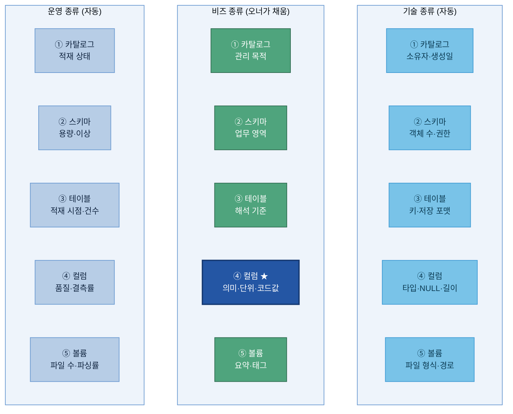
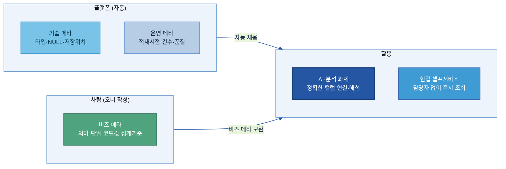
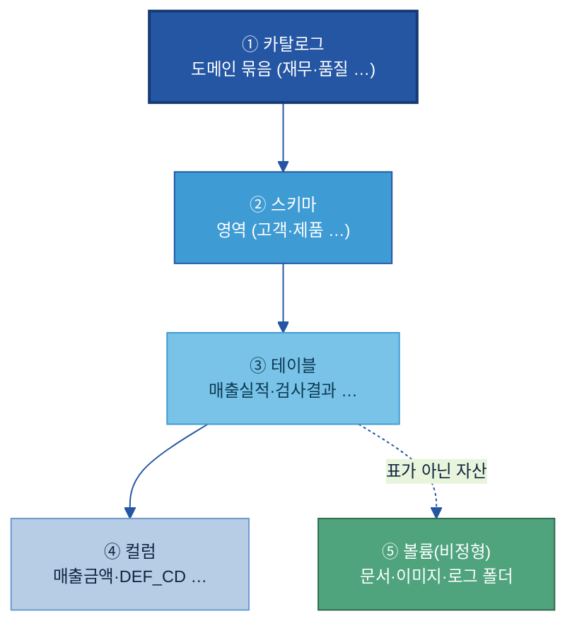
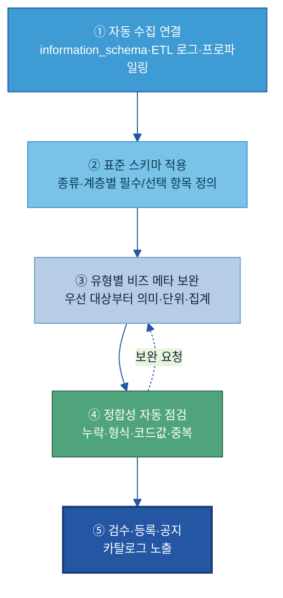

# A-2 메타데이터

## 목차

- [이 가이드가 답하는 5가지 질문](#kq)
1. [Why — 왜 필요한가](#s1)
   - [1.1 현업 Pain Point](#s11)
   - [1.2 기대 효과](#s12)
   - [1.3 적용 전 / 후](#s13)
2. [What — 메타데이터의 구성 요소](#s2)
   - [2.1 메타데이터의 정의와 위치](#s21)
   - [2.2 세 종류의 메타데이터 (기술 · 비즈 · 운영)](#s22)
   - [2.3 다섯 계층 (어디에 붙나)](#s23)
   - [2.4 항목 사전 — 대표 항목](#s24)
   - [2.5 필드 설명서 — 이름만으론 모르는 데이터 풀이](#sec34)
   - [2.6 단위·기준일·집계 기준](#sec35)
   - [2.7 메타데이터 표준 양식과 버전 관리](#sec36)
   - [2.8 데이터 유형별 메타데이터 차이](#s28)
3. [When — 어디부터 하나 (정비 우선순위)](#s4)
   - [3.1 정비 우선 대상](#s41)
   - [3.2 자동으로 모으고, 사람은 검수만](#sec52)
   - [3.3 AI가 비즈 메타 초안을 채운다](#s43)
4. [How — 어떻게 준비·운영하나](#s5)
   - [4.1 구축 절차](#s52)
   - [4.2 비즈 메타 작성 — 좋은 예 vs 나쁜 예](#s53)
   - [4.3 실제로 어디서 채우나 — 플랫폼 매핑](#sec74)
   - [4.4 정합성 자동 점검](#s55)
   - [4.5 운영 — 갱신·승인과 역할](#s56)
5. [Tech Stack — 솔루션 검토](#tech)
   - [5.1 도구 유형](#s61)
   - [5.2 선정 기준](#s62)
6. [Where — 다른 주제와의 관계](#s6)

- [참고자료(References)](#참고자료-references)
- [변경 이력 / 피드백 반영](#변경-이력--피드백-반영)

> 관련 가이드: [A-1 데이터 카탈로그](../A-1%20데이터%20카탈로그/A-1%20데이터%20카탈로그.md) · [A-3 비즈니스 Glossary](../A-3%20비즈니스%20Glossary/A-3%20비즈니스%20Glossary.md) · [B-2 데이터 해설·주석](../B-2%20데이터%20해설·주석/B-2%20데이터%20해설·주석.md) · [C-2 데이터 품질 관리](../C-2%20데이터%20품질%20관리/C-2%20데이터%20품질%20관리.md) · [C-3 데이터 계통 Lineage](../C-3%20데이터%20계통%20Lineage/C-3%20데이터%20계통%20Lineage.md)

> **예시 표기 안내:** 본 가이드의 표·예시에 나오는 구체 값(테이블·컬럼명, 코드값, 수치, 날짜 등)은 이해를 돕기 위한 가상 예시이며 실제 데이터가 아니다. 실제 값은 PoC·프로젝트에서 확정한다. 계열사명도 적용 맥락 설명용이다.

메타데이터(Metadata)는 데이터 자산이 **무엇을·어떤 구조와 단위로·어떤 기준으로 만들어졌는지**를 설명하는 "데이터의 설명서"다. 자산이 *어디 있는지*를 가리키는 [A-1 카탈로그](../A-1%20데이터%20카탈로그/A-1%20데이터%20카탈로그.md)와 달리, 메타데이터는 그 자산의 **테이블·컬럼·코드값 수준 속성**을 채워, 사람과 AI가 데이터를 *오해 없이 해석*하게 한다. 이 가이드는 메타데이터가 왜 필요한지(1장), 무엇을 세 종류·다섯 계층으로 갖추는지(2장), 어디부터 정비할지(3장), 실제로 어떻게 준비·운영하는지(4장)를 다룬다. 끝까지 강조하는 메시지는 하나다. 데이터의 해석을 사람 머릿속이 아니라 데이터 옆에 명시해, 사람도 AI도 같은 의미로 읽게 만드는 것이 메타데이터다.

---

<a id="kq"></a>
## 이 가이드가 답하는 5가지 질문

| # | 질문 | 한 줄 답 | 본문 |
|---|---|---|---|
| 1 | AI가 데이터 구조를 이해하려면 **무슨 메타데이터**가 필요한가? | 데이터 타입·단위·허용값·생성 시스템·갱신 주기·오너 등을 **기술/비즈/운영 세 종류**로 정의한다 | [§2](#s2) |
| 2 | 메타데이터의 **표준 양식을 어떻게 정의·진화·버전 관리**하나? | "어떤 항목을 어떤 형식으로 채울지"를 표준 양식으로 고정하고, 항목이 늘면 버전을 올린다 | [§2.7](#sec36) |
| 3 | **이름만으론 뜻을 모르는** 약어·코드를 어떻게 설명하나? | 컬럼·코드값에 자연어 설명(필드 설명서)을 붙인다 — `DEF_CD = 품질 결함 유형 코드` | [§2.5](#sec34) |
| 4 | **단위·기준일·집계 기준**을 어떻게 명확히 하나? | 숫자에 단위·기준 시점·계산 기준을 메타데이터로 못박아 AI가 잘못 비교하지 않게 한다 | [§2.6](#sec35) |
| 5 | 메타데이터를 어떻게 **자동 수집·갱신**하나? | 기술·운영 메타는 플랫폼이 자동 수집, 비즈·AI 메타만 사람이 보완하고 오너가 승인한다 | [§3.2](#sec52) · [§4](#s5) |

---

<a id="s1"></a>
## 1. Why — 왜 필요한가

이름·단위만으론 뜻을 알 수 없어 **AI가 잘못 해석**하고, 같은 숫자를 부서마다 다른 기준으로 비교해 **틀린 답**이 나온다 — 메타데이터는 이 오해석을 원천에서 막는다.

<a id="s11"></a>
### 1.1 현업 Pain Point

두산전자 AI 과제팀이 동박 결함 예측 모델을 위해 검사결과 테이블 `INSP_RESULT`를 확보했다고 하자. 위치·오너까지는 확인했지만, 테이블을 열어 보니:

**Pain 1 — 약어·코드를 못 읽는다:** 컬럼이 `DEF_CD`, `WIP_QTY`, `THK`처럼 현장식 약어다. 이게 결함 코드인지, 재공 수량인지, 두께인지 — 만든 사람 외에는 모른다. AI는 더더욱 모른다. 결국 "이 컬럼 뭐예요?"를 사람에게 물어봐야 하고, 그 사람이 자리를 비우면 과제가 멈춘다.

**Pain 2 — 단위·기준이 제각각이다:** 한 테이블은 두께를 ㎛로, 다른 테이블은 mm로 쌓는다. "매출"이라는 컬럼도 어떤 팀은 주문일 기준, 어떤 팀은 배송완료일 기준이다. 메타데이터에 단위·기준이 없으면, AI는 단위 다른 값을 그대로 더하거나 비교해 **틀린 집계**를 낸다.

**Pain 3 — 코드값의 뜻을 모른다:** `DEF_CD`가 결함 코드인 건 알아도, `S01`·`P03`이 각각 무슨 결함인지 풀이가 없다. AI가 "핀홀 불량률"을 물어도 어느 코드가 핀홀인지 연결하지 못한다.

**Pain 4 — 최신본·계산 로직을 모른다:** 같은 보고서·테이블이 여러 버전 존재하는데 어느 것이 최신본인지, `원가` 컬럼이 재료비만인지 전부 합산인지가 적혀 있지 않다. AI가 옛 버전이나 다른 계산 기준의 값을 인용해 **그럴듯하지만 틀린 답**을 만든다.

> **두산에너빌리티 예시:** 발전 설비 센서 테이블에 `TEMP`라는 컬럼이 섭씨인지 화씨인지, 어느 측정점(베어링/배기/냉각수)인지 설명이 없어, 이상 탐지 AI가 정상 범위를 잘못 잡아 오탐이 잦았다. 단위·측정점 메타데이터를 붙이고 나서야 오탐이 줄었다.

이 네 가지의 공통점은 "데이터는 있는데 해석을 사람 머릿속에 의존한다"는 것이다. 메타데이터는 그 해석을 데이터 옆에 명시해, 사람도 AI도 같은 의미로 읽게 한다.

<a id="s12"></a>
### 1.2 기대 효과

**① AI 응답 정확도 향상**

컬럼 의미·단위·코드값이 메타데이터로 붙으면, AI는 질문에 맞는 컬럼을 정확히 고르고 올바르게 해석한다. "핀홀 불량 추이"라는 질문에 `DEF_CD='P03'`을 정확히 연결하고, 단위가 다른 값을 섞지 않는다. 메타데이터는 AI가 데이터를 "추측"하지 않고 "근거를 갖고" 쓰게 하는 토대다.

**② 재사용·셀프서비스 확대**

설명서가 있으면 현업이 데이터 담당자에게 일일이 묻지 않고 **스스로** 데이터를 이해·활용한다. "이 컬럼 뭐예요?" 문의가 줄고, 데이터 담당자는 반복 응대에서 벗어난다.

**두산전자 예시:** 신규 분석 담당자가 `INSP_RESULT`를 처음 봐도, 컬럼 설명·코드값 풀이만 읽고 바로 결함 분석을 시작한다 — 기존엔 선임에게 컬럼 의미를 묻느라 며칠이 걸렸다.

**③ 오류·재작업 감소**

단위·집계 기준 불일치로 생기는 잘못된 비교·집계가 사라진다. `제조원가 = 직접재료비+노무비+제조경비, 월 마감 기준`처럼 계산 기준이 명시되면, 서로 다른 기준의 원가를 단순 비교하는 실수가 원천 차단된다.

**④ 거버넌스의 실행 기반**

보안 등급·개인정보 포함 여부·값 의미 유형이 **컬럼 단위**로 붙으면, 접근 통제·마스킹·집계 규칙이 자동으로 작동한다. 메타데이터는 거버넌스 정책을 실제 데이터에 연결하는 고리다.

> **자회사 입장에서 — 이 가이드를 적용하면:** ① AI·분석 과제가 "컬럼 의미 물어보기"에서 해방돼 착수가 빨라지고, ② 단위·기준 불일치로 인한 재작업·오답이 줄며, ③ 담당자가 바뀌어도 데이터 해석이 조직에 남는다. 카탈로그가 "데이터를 찾게" 했다면, 메타데이터는 "찾은 데이터를 믿고 쓰게" 만든다.

<a id="s13"></a>
### 1.3 적용 전 / 후

같은 데이터가 메타데이터 설명서를 붙이기 전과 후에 AI에게 어떻게 달리 읽히는지 보여 준다. 앞의 네 가지 Pain이 그대로 해소되는 모습이다.

| | 적용 전 | 적용 후 |
|---|---|---|
| 컬럼 `DEF_CD` | AI가 무슨 코드인지 모름 → 무시·오인용 | "품질 결함 유형 코드(S01=스크래치…)"로 해석 |
| 두께 `THK` | 단위 불명 → mm 데이터와 섞어 비교 | "단위 ㎛, 1초 측정"으로 정확 비교 |
| 원가 컬럼 | 계산 기준 불명 → 라인 간 잘못 비교 | "직접재료비+노무비+경비, 월 마감"으로 동일 기준 비교 |
| 검사 보고서 | 옛 버전·최신본 구분 안 됨 | 최신본 식별 → 옛 버전 학습 방지 |
| 활용 리드타임 | 컬럼 의미 물어보느라 며칠 | 설명서 읽고 즉시 활용 |

---
<a id="s2"></a>
## 2. What — 메타데이터의 구성 요소

이 장은 메타데이터가 무엇이고 무엇으로 이루어지는지를 정의한다. 메타데이터는 채우는 주체와 방식에 따라 기술·비즈·운영 세 종류로 나뉘고(2.2), 카탈로그부터 컬럼·볼륨까지 다섯 계층에 붙는다(2.3). 이 "세 종류 × 다섯 계층"이 가이드 전체를 관통하는 정본 모델이다.

<a id="s21"></a>
### 2.1 메타데이터의 정의와 위치

#### 메타데이터란 (데이터의 설명서)

메타데이터는 "데이터에 대한 데이터"로, 데이터가 무엇을 뜻하고, 어떤 단위·기준으로 쌓였으며, 어떻게 써야 하는지를 적은 **설명서**다.

데이터 값 자체만 봐서는 완전한 의미를 알 수 없다. 예를 들어 어떤 셀에 `94.2`라는 숫자가 들어 있다고 했을 때, 이것이 동박 두께인지 수율인지, 단위가 ㎛인지 %인지, 언제 측정된 값인지, 결측이면 무엇으로 채우는지 등을 값만으로는 알 수 없다. 이를 해결하기 위해 그 값 옆에 붙는 설명인 메타데이터가 필요하다.

| 데이터(값) | 메타데이터(설명) |
|---|---|
| `94.2` | 컬럼명: `THK_AVG` / 의미: **동박 두께 평균** / 단위: **㎛** / 측정 주기: **1초** / 생성 시스템: **MES** / 결측 처리: **NULL** |
| `S01` | 컬럼명: `DEF_CD` / 의미: **품질 결함 유형 코드** / 코드값: `S01=스크래치, P03=핀홀` / 도메인: **품질** |

이 설명이 있어야 사람도 AI도 데이터를 **같은 의미로** 읽는다. 메타데이터가 비면, 데이터는 "그 데이터를 만든 사람의 머릿속"에만 의미가 있는 반쪽짜리 자산이 된다.

> **두산전자 예시:** 컬럼명 `DEF_CD` 하나만 보면 AI는 이게 무슨 코드인지 모른다. 메타데이터로 *"품질 결함 유형 코드 (예: S01=스크래치, P03=핀홀)"* 를 붙이면, AI가 "스크래치 불량 추이 보여줘"라는 질문에 이 컬럼을 정확히 연결한다. 설명서 한 줄이 데이터를 "사람만 아는 자산"에서 "AI도 쓰는 자산"으로 바꾼다.

메타데이터는 데이터 자산의 **계층 전반**(카탈로그→스키마→테이블→컬럼→볼륨)에 붙으며, 본 가이드는 이를 **기술·비즈·운영 세 종류**로 나눠 관리한다(§2).

#### 어디에 자리하나 — 자산의 속성

메타데이터는 "찾을 수 있게(Findable)" 묶음(A-1~A-3)에서 **자산의 속성**을 담당한다 — 용어의 뜻(A-3)과 자산의 소재(A-1) 사이에서, 자산 안의 구조·단위·의미를 채운다. 세 주제의 역할 구분(뜻·속성·소재)과 연결 그림은 [A-3 §2.1](../A-3%20비즈니스%20Glossary/A-3%20비즈니스%20Glossary.md#s21)에, 카탈로그 등 인접 주제와의 상세 경계는 [6장](#s6)에 있다.

> **용어 풀이 — 데이터 스튜워드(Data Steward):** 데이터의 *품질과 의미*를 책임지고 관리하는 담당자. 오너가 "내 데이터"를 책임진다면, 스튜워드는 "여러 데이터가 표준에 맞게 기술됐는지"를 가로질러 점검한다.

> **이 절의 정본 모델:** 메타데이터 = **세 종류(기술·비즈·운영)** × **다섯 계층(카탈로그·스키마·테이블·컬럼·볼륨)**. 가이드 전체에서 이 분류·용어를 일관되게 쓴다. A-2의 경계·인접 주제와의 역할 분담은 [§6 Where](#s6)를 참조한다.

메타데이터를 "세 종류로 무엇을 설명하나"(열) × "다섯 계층 중 어디에 붙나"(행)의 **격자**로 보면, 어느 칸을 누가 채울지가 한눈에 정리할 수 있다. 

| 계층 ↓ \ 종류 → | 기술 (구조·형식) | 비즈 (의미·맥락) | 운영 (상태·품질) |
|---|---|---|---|
| ① 카탈로그 | 소유자·생성일 | 도메인 묶음·관리 목적 | 적재 상태·활용 현황 |
| ② 스키마 | 객체 수·권한 | 업무 영역·범위 | 용량·접근 이상 |
| ③ 테이블 | 키·저장 포맷 | 무엇을 담은 표·해석 기준 | 적재 시점·건수 |
| ④ 컬럼 **(가장 상세)** | 타입·NULL·길이 | **의미·단위·코드값 풀이** | 품질 점수·결측률 |
| ⑤ 볼륨(비정형) | 파일 형식·경로 | 요약·태그·활용 맥락 | 파일 수·파싱 성공률 |

> **읽는 법:** 자동으로 채워지는 칸(기술·운영)은 플랫폼이 자동으로 채우고, 사람이 실제로 손대는 건 비즈 열, 특히 ④ 컬럼 × 비즈 칸(의미·단위·코드값)이다 — 메타데이터 작성의 무게가 어느 한 칸에 몰려 있는지를 격자가 보여준다. 종류는 §2.2, 계층은 §2.3에서 각각 자세히 본다.

아래 다이어그램은 이 격자를 시각화한 것이다 — **파란 칸(기술·운영)** 은 플랫폼이 자동으로 채우고, **초록 칸(비즈)** 은 사람(오너)이 채운다. ④컬럼×비즈 칸이 작성 부담의 핵심이다.



<a id="s22"></a>
### 2.2 세 종류의 메타데이터 (기술 · 비즈 · 운영)

메타데이터는 시스템 관점(기술), 업무 관점(비즈), 상태 관점(운영) 세 종류로 나뉜다 — 채우는 주체와 방식이 다르므로, 종류를 구분하는 것이 작성 전략의 출발점이다.

**i) 기술 메타데이터(Technical Metadata) — "어떻게 저장돼 있나"**

데이터의 저장 구조·형식·생성 방식 등 **시스템 관점**의 속성이다. 컬럼 타입, NULL 허용 여부, 컬럼 순서, 저장 위치, 생성/변경 시각 등. **시스템에 의해 자동 생성·갱신**되며 별도 수기 작성이 필요 없다 — 운영 관점에서는 "작성"이 아니라 *"자동 수집이 정상으로 들어오는지"* 를 관리한다.

> 예시: `THK_AVG` 컬럼의 타입 `DECIMAL(5,2)`, NULL 불가, MES에서 생성, 2025-01-20 변경 — 모두 플랫폼이 자동 기록.

**ii) 비즈 메타데이터(Business Metadata) — "업무적으로 무슨 뜻인가"**

데이터가 비즈니스적으로 **무엇을 의미하고** 어떤 업무 맥락에서 쓰이는지를 설명한다. 컬럼 의미 설명(Comment), 단위, 집계 기준, 관련 도메인, 담당 부서 등. **업무 의미를 가장 잘 아는 현업 담당자가 직접 작성**한다. 그렇기에 자동화가 가장 어렵고 메타데이터 작성 부담이 여기에 몰린다(§4.2에서 작성법을 깊게 다룬다).

> 예시: `THK_AVG` = "동박 두께 1초 측정의 30초 이동평균, 단위 ㎛, 목표 12±0.5".

**iii) 운영 메타데이터(Operational Metadata) — "지금 상태가 어떤가"**

데이터의 **생성·변경·활용 과정의 상태와 품질**을 관리하는 정보다. 갱신 주기, 적재 시점, 데이터 건수 변화, 품질 지표, 접근 로그 등. **단일 시점이 아니라 시간에 따라 변하는 상태 정보**이며, 파이프라인 로그·저장소 메타에서 **자동 수집·계산**한다. AI가 최신 데이터를 참조하는지, 파이프라인이 끊기지 않았는지 판단하는 근거가 된다.

> 예시: `INSP_RESULT` 마지막 적재 02:14, 어제 대비 건수 +1,240, 파싱 성공률 100%.

| 종류 | 설명 대상 | 대표 항목 | 작성 주체·방법 | 상세 예시 항목 |
|---|---|---|---|---|
| **기술**(Technical) | 저장 구조·형식·생성 방식 | 컬럼 타입, NULL 여부, 저장 위치, 생성/변경 시각 | 자동 — 시스템 **자동 수집** | 데이터 타입, NULL 여부, 컬럼 순서, 기본값, 문자 길이, 숫자 정밀도, 저장 포맷/경로, 생성자/변경자 |
| **비즈**(Business) | 업무적 의미·활용 맥락 | 컬럼 의미, 단위·집계 기준, 도메인, 담당 부서 | 오너 — 현업 **작성** | 컬럼 의미(Comment), 단위, 집계 대상·기간·포함조건, 계산 로직, 기준 시스템, 관련 도메인, 활용 시나리오, 담당 부서, Glossary 링크 |
| **운영**(Operational) | 상태·품질(시간에 따라 변함) | 갱신 주기, 적재 시점, 건수, 품질 지표, 접근 로그 | 자동 — 시스템 **자동 계산** | 갱신 주기, 마지막 적재 시각, 건수·증감, 파티션 상태, 의존 관계, 품질 점수, 파싱 성공률, 접근/사용 로그, 권한 변경 이력 |

> **용어 풀이 — NULL:** 값이 비어 있음을 뜻하는 표시. "NULL 허용 여부"는 그 컬럼이 빈 값을 가질 수 있는지를 말한다.

세 종류의 작성 분담을 한눈에 보면 아래와 같다 — 플랫폼이 기술·운영을 자동으로 채우고, 사람(오너)은 비즈 메타만 작성하며, 그 결과물을 AI와 현업이 활용한다.



<a id="s23"></a>
### 2.3 다섯 계층 (어디에 붙나)

메타데이터는 데이터 자산의 계층마다 붙는다 — 위에서 아래로 좁아지며, **컬럼 계층에 가장 상세하게 붙고**, 표가 아닌 자산(문서·이미지)은 **볼륨** 단위로 관리한다.



> **예시로 읽기:** 매출 금액·수량(④ 컬럼)이 모여 매출실적(③ 테이블)이 되고, 매출·고객 테이블이 모여 영업(② 스키마), 그것이 재무(① 카탈로그)로 묶인다. 문서·이미지처럼 표가 아닌 자산은 ⑤ **볼륨** 단위로 관리한다.

각 계층에서 관리하는 메타데이터의 초점이 다르다:

| 계층 | 메타데이터 초점 | 대표 항목 | 운영 메타 중점 |
|---|---|---|---|
| ① 카탈로그 | 도메인 묶음의 정체성·관리 상태 | 카탈로그명, 설명, 소유자, 포함 도메인 | 전체 설명 작성 상태, 활용 현황, 파이프라인 상태 |
| ② 스키마 | 영역의 범위·권한 | 스키마명, 설명, 객체 수, 권한 | 저장 용량, 권한 변경, 접근 이상 여부 |
| ③ 테이블 | 무엇을 담은 표인가 | 테이블명/유형, 설명, 키, 적재 시점, 건수 | 적재 시점, 건수 변화, 의존 관계, 파티션 상태 |
| ④ 컬럼 | **가장 상세** — 의미·타입·단위·코드 | 컬럼명, 타입, NULL, 의미(Comment), 단위, 코드값 | 품질 점수, 결측률 |
| ⑤ 볼륨(비정형) | 파일 단위 상태 | 볼륨명/유형, 저장 위치, 파일 수·용량, 수집·파싱 상태 | 파일 수, 저장 용량, 수집 상태, 파싱 성공률 |

> **정형 vs 비정형 운영 메타 초점:** 정형은 적재·집계·조회 성능 중심, 비정형(볼륨)은 수집·파싱·저장 규모·AI 활용 가능성 중심으로 초점이 다르다.

<a id="s24"></a>
### 2.4 항목 사전 — 대표 항목

자산에 붙이는 메타데이터 항목을 **세 종류로 묶어** 정리한 표다. `필수/선택`은 최소 채울 항목, **작성 주체**는 자동(플랫폼) / 오너(현업) / 보안으로 나뉜다.

> **이 표 보는 법:** 자동 항목은 플랫폼이 자동으로 채우므로 사람은 *확인만* 한다. 실제로 사람이 직접 입력하는 항목은 오너와 보안 칸에 한정되며, 메타데이터 작성의 부담은 주로 **비즈 메타에 집중된다.**

**기술 메타데이터 (대표 항목)**

| 항목 | 쉬운 의미 | 예시값 | 필수/선택 | 작성 주체 |
|---|---|---|:---:|:---:|
| 데이터 타입 | 컬럼의 형식 | `STRING / INT / DECIMAL(5,2)` | 필수 | 자동 |
| NULL 허용 여부 | 빈 값 가능 여부 | `NO` | 필수 | 자동 |
| 컬럼 순서 | 테이블 내 위치 | `3` | 선택 | 자동 |
| 저장 위치 | 실제 경로 | `QMS.dbo.INSP_RESULT` | 필수 | 자동 |
| 생성/변경 시각 | 언제 만들어/바뀌었나 | `2025-01-20 14:22` | 선택 | 자동 |

**비즈 메타데이터 (대표 항목 — 사람이 채우는 핵심)**

| 항목 | 쉬운 의미 | 예시값 | 필수/선택 | 작성 주체 |
|---|---|---|:---:|:---:|
| 컬럼 의미 설명(Comment) | 이 컬럼이 무엇인지 한 문장 | `계약 단가 기준 확정 매출 (납품·세금계산서 발행 건)` | 필수 | 오너 |
| 단위 | 측정 단위 | `㎛ / 원 / EA` | 필수 | 오너 |
| 집계 기준 | 대상·기간·포함조건 | `주문일 기준, 배송 완료 건만` | 선택 | 오너 |
| 관련 도메인 | 업무 영역 | `품질` | 필수 | 오너 |
| 담당 부서 | 의미를 책임지는 조직 | `품질보증팀` | 필수 | 오너 |

**운영 메타데이터 (대표 항목)**

| 항목 | 쉬운 의미 | 예시값 | 필수/선택 | 작성 주체 |
|---|---|---|:---:|:---:|
| 갱신 주기 | 얼마나 자주 갱신 | `일 1회 (야간 배치 02:00)` | 필수 | 자동 |
| 적재 시점 | 마지막 적재 시각 | `2025-01-21 02:14` | 선택 | 자동 |
| 데이터 건수 | 행 수(변화 추적) | `1,284,553` | 선택 | 자동 |
| 품질 지표 | 완전성·정확성 | `94/100` (→ [C-2](../C-2%20데이터%20품질%20관리/C-2%20데이터%20품질%20관리.md)) | 선택 | 자동 |
| 보안 등급 | 민감도 | `대외비` | 필수 | 보안 |

**두산전자 완성 메타 카드 예시 (`INSP_RESULT` 테이블 + `DEF_CD` 컬럼):**

세 종류 메타가 한 자산에 함께 붙은 모습. 자동은 플랫폼이, 오너·보안은 사람이 채운 칸이다.

```
════════════════════════════════════════════════════
 [테이블]  QMS.quality.INSP_RESULT
── 기술(자동) ─────────────────────────────────────
 유형        : MANAGED          저장 포맷 : DELTA
 소유자      : 품질보증팀(svc)   생성/변경 : 2025-01-20 14:22
── 비즈(오너) ─────────────────────────────────────
 설명        : 동박 라인 일일 외관·전기검사 판정 결과(로트 단위)
 활용 목적   : 결함 예측·클레임 분석
 해석 유의   : 재검사 로트는 최종 판정만 적재(중간 판정 제외)
── 운영(자동) ─────────────────────────────────────
 갱신 주기   : 일 1회(야간 배치 02:00)   최신성 기대 : D+1
 적재 시점   : 2025-01-21 02:14   건수 : 1,284,553 (+1,240)
── 보안 ────────────────────────────────────────────
 보안 등급   : 대외비   개인정보 : 없음   AI 활용 : 가명화 후 가능
══════════════════════════════════════════════════════
 [컬럼]  DEF_CD
── 기술(자동) ──  타입: STRING   NULL: NO   순서: 3
── 비즈(오너) ──  설명: 품질 결함 유형 코드(외관검사 판정)
                코드값: S01=스크래치 / P03=핀홀 / C02=컬
                도메인: 품질   값 의미: code(집계 금지)
════════════════════════════════════════════════════
```

<a id="sec34"></a>
### 2.5 필드 설명서 — 이름만으론 모르는 데이터 풀이

AI와 사람이 똑같이 해석하도록 약어·코드·현장식 이름에는 **자연어 설명(Comment)** 과 **코드값 풀이(Dictionary)** 를 붙인다.

**i) 컬럼 설명(Comment)** — 컬럼이 담는 내용을 한 문장으로 적는다. 용어는 [A-3 Glossary](../A-3%20비즈니스%20Glossary/A-3%20비즈니스%20Glossary.md) 표준 용어를 우선 사용하고, 없으면 Glossary에 먼저 등록 후 반영한다.

**ii) 코드값 풀이(Dictionary)** — 코드 컬럼은 값마다 뜻을 단다. 코드만 있고 풀이가 없으면 AI는 코드를 "의미 없는 문자열"로 본다.

> **두산전자 — 코드값 풀이 예시 (`DEF_CD`):**
>
> | 코드값 | 뜻 |
> |---|---|
> | `S01` | 스크래치 (표면 긁힘) |
> | `P03` | 핀홀 (미세 구멍) |
> | `C02` | 컬(Curl, 휨) |
>
> 컬럼 설명: *"품질 결함 유형 코드 — 외관검사에서 판정된 결함 종류. 값 정의는 코드값 풀이 참조."*

**iii) 우수 예시 vs 미흡 예시**

| Before | After |
|---|---|
| `DEF_CD` (설명 없음) | "품질 결함 유형 코드 (외관검사 판정, S01=스크래치…)" |
| "결함 관련 값" | "최종 검사에서 판정된 대표 결함 1건의 유형 코드" |
| "코드" | "결함 유형 코드 (값별 풀이 명시)" |

**필수 작성 대상(엑셀 가이드 기준):** ① 컬럼명이 약어·모호한 경우(의미 중심으로 풀이 + 검색 키워드 포함), ② 같은 의미 컬럼이 여러 곳에 있는 경우(동일 용어로 통일), ③ 비슷한 이름이 여러 개라 구분이 필요한 경우(산식·기준 시점·포함/제외 조건 차이를 명시).

**iv) 테이블 수준 해석 기준 — 컬럼 설명만으론 안 풀리는 것**

컬럼 단위의 설명만으로는 해당 테이블을 어떤 업무 규칙으로 해석해야 하는지와 어떤 함정이 있는지를 충분히 전달하기 어려우므로, 이를 별도로 기록하기 위해 두 가지 항목을 둔다.

| 항목 | 상세 | 예시 |
|---|---|---|
| **업무 규칙 해석 기준**(business rule) | 값·지표를 해석할 때 적용할 업무 규칙 | "주문 기준 매출 = 주문일/주문상태 기준 집계 / 회계 기준 매출 = 매출인식일/전표 기준 집계" |
| **해석 유의사항**(caveat) | 규칙만으론 설명 안 되는 예외·한계·주의 | "내부 거래 포함 여부로 추정 매출이 공식 실적과 다를 수 있음 / 일부 법인 미연계로 공백 존재" |

> 이 두 항목이 없으면 AI와 사용자가 같은 테이블을 보고도 다른 숫자를 답한다 — "왜 대시보드와 다르지?"의 대부분이 여기서 갈린다.

<a id="sec35"></a>
### 2.6 단위·기준일·집계 기준

숫자 컬럼에는 **단위·기준 시점·집계 방식·기준 시스템**을 메타데이터로 명시하여 AI가 단위·기준이 다른 값을 잘못 비교하지 않게 한다.

| 항목 | 필요 이유 | 예시 |
|---|---|---|
| **단위** | 단위 다른 값 혼동 방지 | 두께 `㎛`, 금액 `원(KRW)`, 수량 `EA`, 비율 `%` |
| **기준 시점(기준일)** | "언제 기준" 숫자인지 | `주문일 기준` vs `배송완료일 기준` |
| **집계 방식·계산 로직** | 같은 이름 다른 계산 방지 | `노무비 = 초과근무 포함, 최근 1년 평균` |
| **기준 시스템** | 어느 시스템 값이 원본인가 | `매출액 (SAP 기준)` |

> **예시 — 집계 기준이 없으면 생기는 오류:** `원가` 컬럼이 "재료비만"인지 "재료비+노무비+경비"인지 메타데이터에 없으면, AI가 A라인 원가(재료비만)와 B라인 원가(전부 합산)를 단순 비교해 "A라인이 훨씬 싸다"는 틀린 결론을 낸다. → `제조원가 = 직접재료비+노무비+제조경비, 월 마감 기준`으로 명시하면 사라진다.

값의 "성격"을 표시하는 것도 중요하다. 더하면 되는 **금액·수량**과 더하면 안 되는 **비율·코드**를 구분하지 않으면 AI가 비율을 합산하는 실수를 한다(→ `value_type` 태그로 표시).

<a id="sec36"></a>
### 2.7 메타데이터 표준 양식과 버전 관리

"어떤 항목을 어떤 형식으로 채울지"를 정한 **표준 스키마**가 메타-메타데이터다 — 이것을 고정함으로써 자산마다 제각각 입력되는 것을 방지할 수 있다.

> **참고 — 정립된 표준:** 메타데이터를 표준 레지스트리로 관리하는 개념은 ISO/IEC 11179[\[9\]](#ref9), AI 학습용(ML-ready) 데이터셋 메타데이터 형식은 Croissant(MLCommons)[\[8\]](#ref8), 공공 데이터 메타데이터 교환은 DCAT[\[10\]](#ref10) 등으로 정립돼 있다. 본 가이드의 표준 스키마는 이들을 참고한다.
> 
- **표준 스키마 정의:** 종류별(기술/비즈/운영)·계층별로 *필수/선택 항목, 형식, 허용값*을 표로 정의한다. 이 표가 곧 "모든 자산이 따르는 양식"이 된다.
- **진화(항목 추가):** 새 요구가 생기면(예: "AI 활용 가능 등급" 신설) 표준 스키마에 항목을 더한다. **기존 자산은 새 항목이 비어 있으므로 마이그레이션 계획이 필요하다** — ① 오너가 언제까지 채울지 기한을 정하고, ② 기한까지 미채운 자산은 카탈로그에 "미완성" 경고 표시를 붙여 AI·분석 과제가 미완성 메타를 그대로 인용하지 않게 한다. 예: `AI 활용 가능 등급` 항목 신설 → 3개월 내 오너 작성 목표 → 미작성 자산은 "AI 활용 등급 미정" 배지 표시.
- **버전 관리:** 항목·형식이 바뀌면 스키마 버전을 올린다(`v1.0 → v1.1`). **기존 정의를 덮어쓰지 않고 이력을 보존**한다 — 이전 버전에서 정의한 항목값은 그대로 유지하며, 변경 전 값을 별도 이력 테이블에 보관해 "언제, 무엇이, 왜 바뀌었는지" 추적할 수 있게 한다. 항목 삭제 시에도 실제 데이터에서 즉시 제거하지 않고 `deprecated` 상태로 표시한 뒤, 의존 과제가 없음을 확인 후 아카이브한다.
- **변경 기록:** 비즈 메타 변경 시 *변경 담당자·변경일·변경 사유*를 함께 남겨, 무엇이 왜 바뀌었는지 추적 가능하게 한다. 예: `DEF_CD` 코드값 `P03`의 뜻이 "핀홀"에서 "미세핀홀(지름 0.1mm 미만)"으로 세분화된 경우 — 변경 전 정의를 이력으로 보존하고, 이전 데이터는 기존 정의 기준으로 읽어야 함을 메타데이터에 명시한다.

스키마 버전이 변경될 때의 흐름은 아래와 같다:

```mermaid
%%{init: {'theme':'base','themeVariables':{'primaryColor':'#DCE8F5','primaryBorderColor':'#2456A4','primaryTextColor':'#10243f','lineColor':'#2456A4','clusterBkg':'#EEF4FB','clusterBorder':'#6B9AD1','fontSize':'12px'}}}%%
flowchart LR
    V1["스키마 v1.0<br/>(현행 필수 항목)"]:::src
    REQ["신규 항목 요청<br/>예: AI 활용 등급"]:::n
    REV["거버넌스 검토·승인<br/>항목 정의·형식·허용값 확정"]:::gate
    V2["스키마 v1.1 배포<br/>신규 항목 추가"]:::loop
    MIG["마이그레이션 공지<br/>오너에게 기한 안내<br/>미채운 자산 경고 표시"]:::cat
    V1 --> REQ --> REV --> V2 --> MIG
    MIG -.기한 내 미채움.-> MIG
    classDef n fill:#B7CDE6,stroke:#6B9AD1,color:#10243f;
    classDef src fill:#79C3E8,stroke:#3F9BD4,color:#0b3a52;
    classDef cat fill:#2456A4,color:#fff,stroke:#163a73,stroke-width:2px;
    classDef gate fill:#3F9BD4,stroke:#2456A4,color:#fff;
    classDef loop fill:#4FA47D,stroke:#2f6b50,color:#fff;
```



<a id="s28"></a>
### 2.8 데이터 유형별 메타데이터 차이

정형·시계열·문서·이미지·영상은 **챙겨야 할 메타데이터 항목이 다르다** — 유형을 먼저 가르고, 그 유형에 맞는 항목을 채운다.

메타데이터를 "모든 데이터에 동일한 항목"으로 채우려 하면, 시계열 데이터에는 정작 중요한 측정 주기가 누락되고 불필요한 항목이 대신 포함될 수 있으므로, 데이터 유형을 우선적으로 구분한다.

**유형 구분 기준**

| 기준 | 유형 | 예 |
|---|---|---|
| 구조 | 정형 / 비정형 | 테이블 vs 문서·이미지 |
| 내용 | 텍스트 / 멀티미디어 | 보고서 vs 사진·도면 |
| 시간 | 시계열 / 비시계열 | 센서 측정 vs 마스터 정보 |

**유형별 핵심 메타데이터**

| 유형 | 핵심 메타데이터 (이 유형만의 것) | 두산 예시 | 자동 수집 가능 여부 |
|---|---|---|---|
| **정형(테이블)** | 컬럼·데이터 타입·코드값·**키 관계**(어느 컬럼이 어느 테이블과 이어지나) | 검사결과의 `LOT_NO`가 생산 테이블과 연결 | 기술·운영 자동 / 비즈(의미·코드값) 오너 작성 |
| **시계열(센서)** | **기준 시각(Timestamp)**·측정 단위·**측정 주기**·결측 구간·이상치 기준 | 동박 두께 1초 측정, ㎛, 결측 시 NULL | 기술(타입·주기) 자동 / 이상치 기준 오너 작성 |
| **문서** | 문서 유형·**버전·최신본 식별**(옛 버전 학습 방지)·작성일·작성자 | FMEA 보고서 v3가 최신본임을 표시 | 파일 속성 자동 / 최신본 여부·용도 오너 작성 |
| **이미지·도면** | 해상도·**촬영/생성 맥락**·연관 문서(도면이 단독 해석되게) | 결함 사진 + 촬영 라인·로트·연관 검사기록 | 해상도·형식 자동 / 맥락·연관 문서 오너 작성 |
| **영상·음성** | 길이·프레임(FPS)·**구간 표시**(정상/이상) | 설비 가동 영상의 이상 발생 구간 태그 | 길이·FPS 자동 / 구간 태그(정상/이상) 오너 작성 |
| **볼륨(이메일 첨부)** | 제목·송수신자·수신일·**요약·태그·분류**(AI 자동 추출 후 메타로 등록) | 경쟁사 CCL 동향 메일: `entities=삼성전자,Isola`, `urgency=High` | 수신일·발신자 자동 / 요약·엔티티는 B-1 전처리 후 메타 등록 |

> **용어 풀이 — FPS:** Frames Per Second, 영상 1초당 프레임 수. 구간을 시각으로 가리키려면 FPS가 필요하다.
> **용어 풀이 — 키 관계:** 한 테이블의 컬럼이 다른 테이블의 행과 연결되는 고리(예: `LOT_NO`로 검사결과와 생산이력을 잇는다). AI가 데이터를 조인(결합)하려면 이 관계 정보가 필요하다.

> **볼륨(이메일 첨부) 비즈 메타 상세:** 제목·송수신자·수신일(필수 — 시스템 자동)에 더해, [B-1 전처리](../B-1%20데이터%20전처리/B-1%20데이터%20전처리.md)·[B-2](../B-2%20데이터%20해설·주석/B-2%20데이터%20해설·주석.md)가 추출한 `content_summary`(본문 요약), `entities`(언급된 고객사·제품), `urgency`(High/Med/Low), `biz_category`(고객사 관련/경쟁사 실적…)를 메타 항목으로 등록한다. → AI가 "경쟁사 CCL 동향 메일 찾아줘"에 답할 수 있게 된다. A-2는 그 결과를 *어떤 메타 항목으로 둘지*를 정한다.

> **경계:** 라벨·주석을 *어떻게 다는가*(분류 체계 설계·작업자 합의·품질관리)는 [B-2 데이터 해설·주석](../B-2%20데이터%20해설·주석/B-2%20데이터%20해설·주석.md)의 영역이다. A-2는 "이 자산에 어떤 속성 항목을 둘지"까지 다룬다.

---

<a id="s4"></a>
## 3. When — 어디부터 하나 (정비 우선순위)

메타데이터는 기본적으로 모든 자산에 필요하지만, 한 번에 다 채우지 않는다. 이 장은 무엇부터 정비할지 우선순위를 정하고(3.1), 그중 사람이 직접 채울 부분과 시스템이 자동으로 채울 부분을 나눈다(3.2). 나아가 그 사람 몫의 비즈 메타조차 AI가 초안을 채우는 방향을 본다(3.3).

<a id="s41"></a>
### 3.1 정비 우선 대상

메타데이터는 모든 데이터 자산을 대상으로 구축하는 것이 원칙이다. 다만 전 자산을 한 번에 정비하기보다, AI 과제에서 우선 활용하는 데이터와 설명이 누락되었거나 단위·기준이 일관되지 않은 데이터부터 우선적으로 정비해 점진적으로 확대한다.

| 우선순위 | 대상 | 이유 |
|---|---|---|
| 1순위 | AI/분석 과제가 **당장 쓰는** 테이블·컬럼 | 효과가 바로 보임 |
| 2순위 | 약어·코드 컬럼, 단위 불명 수치 컬럼 | 오해석 위험이 큼 |
| 3순위 | 여러 부서가 공유하는 핵심 마스터·실적 | 파급 효과 큼 |
| 후순위 | 사용 빈도 낮은 임시·백업 자산 | 비용 대비 효과 낮음 |

**두산전자 예시:** 동박 결함 예측 과제가 쓰는 `INSP_RESULT`·`PROD_LOG`의 컬럼부터 비즈 메타를 채우고, 잘 안 쓰는 레거시 백업 테이블은 뒤로 미룬다.

<a id="sec52"></a>
### 3.2 자동으로 모으고, 사람은 검수만

기술·운영·보안 메타는 **시스템이 자동**으로 채우고, 사람은 **비즈·AI 메타(의미·단위·집계)만 보완**하므로, "모두 작성한다" 보다는 "빈 칸을 보완한다" 라는 원칙으로 운영한다. 


이 분담이 메타데이터 운영의 핵심이다. 만약 모든 항목을 사람이 직접 작성하면 운영이 정체될 수 있다. 자동으로 채울 수 있는 80%(기술·운영)는 플랫폼에 맡기고, 사람은 자동화가 어려운 20%(의미·단위·집계)에만 집중한다.

<a id="s43"></a>
### 3.3 AI가 비즈 메타 초안을 채운다

자동화가 어렵다던 비즈 메타(설명·태그)마저, 이제 AI가 데이터의 맥락을 읽어 *초안*을 만들어 준다. 사람이 하는 일이 "백지에서 쓰기"에서 "AI 초안을 검수·승인하기"로 줄어든다 — 일부만 사람이 손대면 나머지는 AI가 채운다.

AI 기반 메타데이터 자동 생성은 다음 흐름으로 돈다.

입력 컨텍스트 수집(스키마·샘플값·파일명·업무 용어·활용 이력) → 메타데이터 초안 생성(컬럼 설명·태그·활용 예시·용어 매핑) → 품질 규칙 검증(필수값·최소 길이·중복 문구·표준 용어·허용값) → 현업 검수·승인(오너 검토·수정·승인) → 카탈로그 반영(검색 인덱스·의미 기반 검색 개선).

> **예시 (`DEF_CD` 설명 자동 생성):** AI가 컬럼명·코드 분포·연관 테이블을 보고 "품질 결함 유형 코드(외관검사 판정) — S01=스크래치…"라는 초안을 제시 → 품질보증팀 오너는 표현만 다듬어 승인한다. 백지에서 쓰는 대신 맞는지 확인만 하면 된다.

> **사람이 끝까지 쥐는 것:** AI가 초안을 채워도 의미가 맞는지·기준이 옳은지·책임은 누구인지의 최종 판단은 사람이 한다. AI는 초안 작성자, 사람은 검수·승인자다.

---

<a id="s5"></a>
## 4. How — 어떻게 준비·운영하나

이 장은 메타데이터를 실제로 어떻게 수집·작성·검수하고 운영하는지를 다룬다. 자동 수집을 연결한 뒤 우선 대상부터 비즈 메타를 채우고(4.1 ~ 4.3), 정합성을 점검해 등록하며 갱신·역할을 정한다(4.4 ~ 4.5). 솔루션 상세 내용은 [5장 Tech Stack](#tech)에서 비교한다.

<a id="s52"></a>
### 4.1 구축 절차

자동 수집을 먼저 연결하고, 우선 대상부터 유형별 설명·단위를 보완한 뒤, 규칙으로 정합성을 검증해 등록한다.



1. **자동 수집 연결** — 플랫폼 `information_schema`·ETL 로그·데이터 프로파일링에서 기술·운영 메타를 수집한다.
2. **표준 스키마 적용** — §2.7의 표준 양식(필수/선택·형식·허용값)을 전 자산에 적용한다.
3. **유형별 비즈 메타 보완** — 정비 우선 대상(§3.1)부터 컬럼 의미·단위·집계·코드값을 채운다. AI가 맥락을 읽어 설명·태그 초안을 만들고, 현업은 이를 검수·승인·보완한다([§3.3](#s43)).
4. **정합성 자동 점검** — §4.4 규칙으로 누락·형식·코드값·중복을 자동 점검한다.
5. **검수·등록·공지** — 스튜워드 검수 통과분을 등록하고 카탈로그에 노출, 관련자에게 공지한다.

> **예시로 따라가기 (`DEF_CD` 컬럼):** ① 플랫폼이 `INSP_RESULT.DEF_CD`의 타입(STRING)·NULL·생성 시각을 자동 기록 → ② 정합성 점검이 "약어인데 의미 설명·코드값 풀이가 비었음"을 표시 → ③ 품질보증팀 오너가 컬럼 설명("품질 결함 유형 코드")과 코드값 풀이(S01=스크래치…)를 작성(표준 용어는 Glossary 확인) → ④ 스튜워드가 표준 용어·중복·보안을 검토 후 등록·카탈로그 노출 → ⑤ 결함 예측 Agent가 "핀홀 불량 추이"를 물으면 `DEF_CD='P03'`을 정확히 연결. 컬럼 하나가 AI가 쓰는 자산이 되기까지의 흐름이다.

> **용어 풀이 — 데이터 프로파일링(Data Profiling):** 데이터를 자동 분석해 값 분포·결측률·고유값 등을 파악하는 작업. 여기서 나온 결과가 운영 메타(품질·건수 등)의 재료가 된다.

<a id="s53"></a>
### 4.2 비즈 메타 작성 — 좋은 예 vs 나쁜 예

비즈 메타는 *무엇을·어떤 기준으로 집계했는지*가 드러나도록, **핵심 키워드 중심으로 1~2문장** 내로 작성한다. 

**작성 기본 원칙 3가지:**
1. **무엇을·어떤 기준으로** 집계했는지 드러나게 — 명확한 핵심 정보 중심.
2. **핵심 키워드 중심, 1~2문장 이내** — 길게 서술하지 않는다.
3. **모호어 금지** — 해석이 불분명한 정성 표현 대신 정량 기준.

| 항목 | Before | After | 교정 사유 |
|---|---|---|---|
| 매출 컬럼 | `기준일 기준 매출액` | `주문일 기준 확정 매출액 (배송 완료 건만 포함)` | "무엇을·어떤 조건" 명시 |
| 긴 서술 | `여러 매출 관련 데이터 중 하나로, 계약 조건을 바탕으로 실제 납품이…` | `계약 단가 기준 확정 매출 (납품 완료·세금계산서 발행 건)` | 핵심 키워드 중심, 1~2문장 |
| 원가 변동 | `최근 원가 변동` | `최근 3개월 기준 제품별 제조원가 변동 금액` | 모호어를 정량 기준으로 |

> **금지 표현:** `일부 · 대략 · 주요 · 관련 · 상세 · 최근` — 사람마다 다르게 해석할 수 있으므로 측정 기준이 분명한 정량 표현으로 바꾼다.
>
> **Comment 작성 규칙:** ① 한 문장으로, ② 표준 용어(Glossary) 우선·없으면 Glossary에 먼저 등록, ③ 부가정보(시스템/기준/단위)는 괄호로 — `매출액 (SAP 기준)`, ④ 날짜는 형식 병기 — `YYYY-MM-DD`, ⑤ 한 테이블 안에서 같은 개념은 같은 용어로(예: "COGS/매출원가/제품원가" 혼용 금지).

**유사 데이터 참조 원칙 (작성 전 필수):** 새로 쓰기 전에 **카탈로그에서 유사 컬럼·테이블을 먼저 검색**한다(키워드 예: "매출손익", "미출고 잔량", "거래처별 단가"). 유사 비즈 메타가 있으면 **같은 용어·설명 구조를 참고**해 표류를 막는다. 반대로 *같은 테이블 안에 이름이 비슷하지만 의미가 다른 컬럼*이 있으면 **산식·기준 시점·포함/제외 조건의 차이를 명확히 써서** 혼동을 막는다.

**비즈 메타 작성·등록 6단계(엑셀 흡수):** ① 사전 조사(카탈로그에서 유사 컬럼·Glossary 용어 확인) → ② 초안 작성(의미·집계 기준·단위) → ③ 1차 자체 점검(모호어 제거·용어 통일) → ④ 등록 요청(현업→관리자) → ⑤ 2차 검토(표준 용어·형식·중복·보안 → 등록/반려) → ⑥ 등록·공지.

> **비즈 메타를 빠짐없이 뽑으려면:** 과제(Goal)를 관점→구성요소→핵심동인→계산기준→관리항목으로 쪼개면 어떤 컬럼에 어떤 비즈 메타를 붙일지 중복·누락 없이 도출된다.

<a id="sec74"></a>
### 4.3 실제로 어디서 채우나 — 플랫폼 매핑

기술·운영 메타는 **플랫폼이 이미 보관하는 시스템 메타데이터**에서 끌어온다 — 사람이 새로 작성하는 것이 아니다.

- **Databricks(Unity Catalog):** `information_schema`(카탈로그→스키마→테이블→컬럼 계층의 이름·타입·소유자·생성/변경 시각)에서 기술·운영 메타를 자동 수집한다[\[7\]](#ref7). 컬럼 의미는 `comment`, 분류는 태그로 보탠다.
- **타 플랫폼 매핑:** Snowflake·BigQuery·SAP 등도 동일 성격의 시스템 카탈로그(`INFORMATION_SCHEMA` 등)를 제공한다. 본 가이드 항목을 각 플랫폼 필드에 **매핑만** 하면 동일하게 적용된다.

| 본 가이드 항목 | Databricks | Snowflake/BigQuery |
|---|---|---|
| 데이터 타입 | `information_schema.columns.data_type` | `INFORMATION_SCHEMA.COLUMNS` |
| NULL 여부 | `is_nullable` | `IS_NULLABLE` |
| 컬럼 설명 | `comment` | `COMMENT` / description |
| 소유자·생성시각 | `information_schema.tables` | 동일 성격 뷰 |

- **비정형(볼륨):** 플랫폼의 파일 메타데이터 조회 인터페이스로 파일 수·용량·형식·수집/파싱 상태를 정형화해 운영 메타로 관리한다(초기 전체 스캔 → 이후 정기·증분 스캔).

<a id="s55"></a>
### 4.4 정합성 자동 점검

사람이 일일이 보지 않고 **규칙으로** 필수 항목 누락·형식 오류·코드값 유효성·중복을 자동 점검한다.

| 점검 항목 | 상제 | 조치 |
|---|---|---|
| 필수 항목 누락 | 의미·단위·오너가 빈 컬럼 | 작성 요청 알림 |
| 형식 오류 | 날짜·단위 형식 불일치 | 표준 형식으로 교정 |
| 코드값 유효성 | 코드 Dictionary에 없는 값 | 코드 추가 또는 데이터 오류 확인 |
| 중복·충돌 | 같은 의미 다른 용어 / 같은 용어 다른 의미 | 용어 통일·구분 서술 |

**운영 메타 모니터링 점검 (담당자 정기 확인):** 위가 *메타데이터 자체*의 정합성이라면, 운영 메타는 *데이터의 상태*를 지켜본다. 담당자는 운영 메타를 근거로 다음을 정기 점검한다.

| 점검 항목 | 상세 | 조치 |
|---|---|---|
| 갱신 정상 여부 | 수집·적재 실패·지연 | 파이프라인 원인 추적 |
| 이상 징후 | 급격한 건수 감소, 저장 용량 급증, 파싱 실패율 증가 | 데이터 오류·중단 확인 |
| 미활용 자산 식별 | 최근 N일 조회 0, 활용도 대비 비용 과다 | 정리·아카이브 후보 |
| AI 활용 경고 | 최신성 미달·품질 저하 자산을 AI가 참조 | 활용 제한·경고 플래그 |

> 운영 메타가 "이 데이터를 지금 믿고 써도 되는지"의 근거가 된다 — AI가 끊긴 파이프라인의 옛 데이터를 참조하지 않도록 막는다.

<a id="s56"></a>
### 4.5 운영 — 갱신·승인과 역할

구조·정책·조직이 바뀌면 메타데이터를 갱신하고, 비즈 메타는 **오너 작성 → 관리 담당자 검수 → 등록** 흐름을 거친다.

**즉시 갱신 트리거:**

| 트리거 | 예 | 영향받는 메타 | 알림 방식 | 오너 확인 기한 | 미확인 시 조치 |
|---|---|---|---|---|---|
| 구조 변경 | 컬럼 추가/삭제/타입 변경 | 기술(자동) + 비즈(의미 재확인) | 플랫폼 자동 알림 → 오너 이메일/슬랙 | 5영업일 이내 | 카탈로그에 "의미 미확인" 경고 배지 표시 |
| 업무 정책 변경 | 집계·계산 방식 변경 | 비즈(집계 기준) | 정책 담당자가 오너에게 직접 공지 | 10영업일 이내 | 스튜워드가 임시 "검토 중" 상태로 변경 |
| 조직 변경 | 담당 부서·책임자 변경 | 비즈(담당 부서) | HR 시스템 연동 또는 수동 공지 | 인수인계 완료 시 | 신규 오너 미지정 자산 리스트 거버넌스 보고 |

기술 메타는 구조 변경 시 자동 반영되지만, **비즈 메타는 자동으로 바뀌지 않는다** — 그래서 구조 변경 시 "의미 재확인" 알림이 오너에게 가야 한다. 변경은 기존 정의를 덮어쓰지 않고 *변경 담당자·변경일·변경 사유*와 함께 이력으로 남긴다.

**역할별 책임:**

| 역할 | 메타데이터에서 하는 일 | 주로 다루는 종류 |
|---|---|---|
| **데이터 오너 / 현업 담당자** | 담당 자산의 컬럼 의미·단위·집계 기준 작성, 변경 시 갱신 | 비즈 메타 |
| **데이터 스튜워드 / 관리 조직** | 메타데이터 표준 스키마 정의, 작성 검수(표준 용어·중복·보안), 등록 승인 | 검수·표준 |
| **데이터 플랫폼 / IT** | 기술·운영 메타 자동 수집 파이프라인 구축·운영(`information_schema` 등) | 자동 기술·운영 메타 |
| **AI/Data 거버넌스** | 메타데이터 정책·필수 항목·버전 관리 기준 수립 | 정책 |

---

<a id="tech"></a>
## 5. Tech Stack — 솔루션 검토

> **2층 연결:** 솔루션을 묶어서 평가·선정하려면 → [Tech Stack 비교 정본](../../Tech%20Player/01%20Tech%20Stack%20비교%20(솔루션×주제).md). 아래는 *메타데이터 관점*의 기능 비교(1층)다.

메타데이터는 별도 솔루션을 새로 들이기보다 카탈로그·거버넌스 솔루션이 함께 관리하는 경우가 많다([A-1 카탈로그](../A-1%20데이터%20카탈로그/A-1%20데이터%20카탈로그.md)와 같은 플랫폼인 경우가 흔하다). 그래서 메타데이터 관점에서는 **자동 수집(커넥터)·비즈 메타 작성 UI·검수 워크플로·버전 관리** 기능이 충분한지를 본다.

이미 단일 데이터 플랫폼(예: Databricks)을 쓰고 있다면, 그 플랫폼에 내장된 메타스토어(예: **Databricks Unity Catalog**[\[4\]](#ref4))를 먼저 검토할 만하다. `information_schema` 기반 기술·운영 메타 자동 수집에 태그·Comment·용어집 연계까지 더해, 카탈로그([A-1](../A-1%20데이터%20카탈로그/A-1%20데이터%20카탈로그.md))·용어집([A-3](../A-3%20비즈니스%20Glossary/A-3%20비즈니스%20Glossary.md))과 동일 제품으로 메타데이터를 한 곳에서 관리할 수 있기 때문이다([2층 정본의 통합 거버넌스 묶음](../../Tech%20Player/01%20Tech%20Stack%20비교%20(솔루션×주제).md) 참조). 반대로 멀티 플랫폼이거나 비즈 메타 작성·승인 워크플로가 핵심이면 전용 카탈로그·거버넌스(Collibra·Purview·Atlan)가 더 맞을 수 있다. 특정 제품을 단정적 1순위로 두기보다, 우리 환경(원천·운영 형태·보안)에 맞는지를 PoC로 확인해 고른다.

<a id="s61"></a>
### 5.1 도구 유형

| 도구 유형 | 메타데이터 관점 기능 초점 | 예 (공식 페이지) | 강점 | 유의점 |
|---|---|---|---|---|
| 통합 카탈로그·거버넌스 | 자동 수집 + 비즈 메타 작성·승인 워크플로 + Glossary 연계 | Collibra[\[1\]](#ref1), Microsoft Purview[\[2\]](#ref2), Atlan[\[3\]](#ref3) | 비즈 메타 작성·승인 워크플로·Glossary 통합이 강함 | 도입·운영 비용, 우리 원천 커넥터 적합성 PoC 필요 |
| 플랫폼 내장 메타스토어 | `information_schema` 자동 제공, 태그·Comment | Databricks Unity Catalog[\[4\]](#ref4) | `information_schema` 자동·태그·Comment 즉시 사용 | 플랫폼 종속, 멀티 플랫폼 환경은 통합 카탈로그 보완 필요 |
| 오픈소스 | 수집·계보·필드 설명·프로파일링 | DataHub[\[5\]](#ref5), OpenMetadata[\[6\]](#ref6) | 커스터마이즈·비용 이점, 활발한 커넥터 | 자체 운영·유지보수 역량 필요 |

> 기능·지원 범위·가격은 변동되므로 도입 검토 시 공식 문서·PoC로 확인한다(단정 금지).

<a id="s62"></a>
### 5.2 선정 기준

솔루션을 고를 때는 메타데이터 관점에서 다음 여섯 축을 가중 평가한다 — 핵심은 "자동 수집이 얼마나 되고, 사람이 비즈 메타를 실제로 쉽게 쓸 수 있는가"다.

| 평가 축 | 평가 항목 | 중요한 이유 |
|---|---|---|
| 자동 수집 커버리지 | 우리 원천(SAP·MES·QMS·SharePoint) 커넥터 보유 | 자동화 비율이 작성 부담을 좌우 |
| 비즈 메타 작성 UX | 현업이 쉽게 Comment·단위·코드값 입력·검수 | 작성이 실제로 돌아가는가 |
| Glossary·태그 연동 | 표준 용어·표준값 목록 연계 | 용어 표류·자유입력 방지 |
| 버전·이력 관리 | 스키마 변경 시 버전·변경 이력 보존 | §2.7 메타스키마 진화 지원 |
| 계보·품질 연계 | C-2·C-3 포인터 연동 | 인접 주제와 단절 방지 |
| 운영 형태·비용 | SaaS/온프렘, 폐쇄망 지원 | 제조 보안 환경 적합성 |

---

<a id="s6"></a>
## 6. Where — 다른 주제와의 관계

메타데이터는 *자산의 속성*만 담는다 — 소재(A-1)·용어 뜻(A-3)·개념 관계(B-3)·흐름(C-3)·품질 측정(C-2)은 인접 주제가 맡고, 메타데이터는 그것들과 **연결**된다.

| 인접 주제 | A-2와의 경계 |
|---|---|
| [A-1 카탈로그](../A-1%20데이터%20카탈로그/A-1%20데이터%20카탈로그.md) | 카탈로그=소재·재사용 요약 신호 / A-2=컬럼·코드값 상세 속성. 메타데이터가 카탈로그 등록 항목의 *내용*을 채운다 |
| [A-3 Glossary](../A-3%20비즈니스%20Glossary/A-3%20비즈니스%20Glossary.md) | Glossary=용어의 표준 뜻(단어) / A-2=그 용어로 자산 속성 기술. 비즈 메타는 Glossary 용어를 **가져다 쓴다** |
| [B-2 데이터 해설·주석](../B-2%20데이터%20해설·주석/B-2%20데이터%20해설·주석.md) | A-2=어떤 속성 항목을 둘지 / B-2=라벨·주석을 *어떻게* 다는지(분류체계·합의) |
| [B-3 온톨로지](../B-3%20온톨로지/B-3%20온톨로지.md) | A-2=자산 단위 속성(이 컬럼은 무엇) / B-3=개념 간 관계(결함과 공정의 관계) |
| [C-2 품질](../C-2%20데이터%20품질%20관리/C-2%20데이터%20품질%20관리.md) · [C-3 Lineage](../C-3%20데이터%20계통%20Lineage/C-3%20데이터%20계통%20Lineage.md) | A-2=품질 점수·계보를 **포인터로 참조** / 측정·추적 자체는 C-2·C-3 |

---

## 참고자료 (References)

> 표준·도구의 기능·지원 범위·가격은 변동되므로 도입 검토 시 공식 문서·PoC로 확인한다.

**도구·플랫폼**

<a id="ref1"></a>**[1]** Collibra — <https://www.collibra.com>

<a id="ref2"></a>**[2]** Microsoft Purview — <https://learn.microsoft.com/azure/purview/>

<a id="ref3"></a>**[3]** Atlan — <https://atlan.com>

<a id="ref4"></a>**[4]** Databricks Unity Catalog — <https://www.databricks.com/product/unity-catalog>

<a id="ref5"></a>**[5]** DataHub — <https://datahub.com/>

<a id="ref6"></a>**[6]** OpenMetadata — <https://open-metadata.org/>

<a id="ref7"></a>**[7]** Databricks, *Information schema* (SQL reference) — "privilege-aware, self-describing API for accessing catalog metadata"; 카탈로그·스키마·테이블·컬럼 메타데이터 제공. <https://docs.databricks.com/aws/en/sql/language-manual/sql-ref-information-schema> (검증 2026-06-19, 라이브).

**표준·형식**

<a id="ref8"></a>**[8]** MLCommons, *Croissant: A Metadata Format for ML-Ready Datasets* (2024) — train/test split·Responsible AI 문서를 포함하는 ML 데이터셋 메타데이터 형식. <https://arxiv.org/html/2403.19546v1> (검증 2026-06-19, 라이브).

<a id="ref9"></a>**[9]** *ISO/IEC 11179 — Metadata registries* — 조직의 메타데이터를 레지스트리로 표준 표현하는 국제 표준. <https://en.wikipedia.org/wiki/ISO/IEC_11179> (검증 2026-06-19).

<a id="ref10"></a>**[10]** *DCAT-US Schema* (data.gov) — 데이터셋·API 목록을 위한 공공 메타데이터 스키마. <https://resources.data.gov/resources/dcat-us/> (검증 2026-06-19).

**입력 자료**

두산 「Meta Tag 운영 가이드(Template)」 — 기술/비즈/운영 메타 작성 가이드·비즈 인자도출 프레임워크 (사내 자료, `기존 매뉴얼 작성본/`)

---

## 변경 이력 / 피드백 반영

| 일자 | 버전 | 변경 내용 | 반영 위치 |
|------|------|-----------|-----------|
| 2026-06-24 | v0.9 | KQ 가시화 위치 변경(공통 규칙 개정) — 핵심 질문 박스를 문서 맨 마지막으로 이동, 절 첫머리 안내 blockquote 4개 삭제, 목차에 점검 링크 추가 | 맨 끝·목차 |
| 2026-06-19 | v0.1 | 초안 작성 — 전체 목차 A-2 9섹션 골격 위에 두산 Meta·Tag 엑셀 흡수. 「현업 실행 키트」 5장치 적용. 웹 리서치 없이 기존 스토리라인 기반 + 엑셀 보완 | 전체 |
| 2026-06-19 | v0.2 | **고객 피드백 — "기존 가이드 디테일 유지하며 더 깊게"** 반영. A-1/B-2/B-3 깊이에 맞춰 전면 확장: 서사형 Pain Point 4종(§2.1), 기대효과 ①~④ 서술+자회사 콜아웃(§2.2), 세 종류 각 정의 심화+[Backup 3-A](§3.1), 다섯 계층 계층별 초점 표+[Backup 3-B](§3.2), 필드 설명서 Before→After(§3.4), 메타스키마 진화·마이그레이션(§3.6), 구축 절차 다이어그램+단계 서술(§7.2), 비즈메타 6단계 등록흐름·작성 원칙(§7.3), 플랫폼 매핑 표(§7.4), 운영 RACI 표·갱신 트리거(§7.6), 용어 풀이 박스 다수 추가. 정본 모델(3종×5계층)·KQ 커버리지 유지 | 전체 |
| 2026-06-19 | v0.3 | **추가 디테일 보완** — 엑셀 계층별 Meta 예시 시트(카탈로그·스키마·테이블·볼륨) 흡수: §3.3 완성 메타 카드(`INSP_RESULT`+`DEF_CD`, 3종 동시), §3.4 iv) 테이블 수준 해석 기준(업무 규칙·유의사항), §4.2 비정형 이메일 볼륨 비즈 메타 예시, §7.1 솔루션 평가 기준 표+[Backup 7-B] 유형별 장단점, [Appendix D] 계층별 메타데이터 예시(실값) 신설 | §3.3·§3.4·§4.2·§7.1·별첨 |
| 2026-06-19 | v0.4 | **엑셀 메타데이터 작성 부분 커버리지 점검 후 공백 보강** — ① §7.5 운영 메타 모니터링 점검 표(갱신 실패·이상 징후·미활용 자산 식별·AI 활용 경고) 추가(엑셀 3.3.3 §4 흡수), ② §7.3 유사 데이터 참조 원칙(작성 전 카탈로그 검색·동일 테이블 유사명 구분) 추가(엑셀 3.3.2 §1.4 흡수). Tag(3.4)는 거버넌스 주제 경계로 두되 대표 태그값만 [Appendix C] 유지 | §7.3·§7.5 |
| 2026-06-19 | v0.5 | **출처 검증 패스 + 각주 추가** — 인용 URL을 web_fetch로 실검증(Croissant·ISO/IEC 11179·DCAT·Databricks information_schema 모두 라이브·주장 일치). §3.6에 정립된 표준(ISO 11179·Croissant·DCAT) 참고 문장 + 각주, §7.4 information_schema 문장에 각주, 문서 끝 「각주(출처)」 절 신설(검증일 명기) | §3.6·§7.4·각주 |
| 2026-06-19 | v0.6 | **고도화 로드맵 새 표준 반영**(공통 규칙 개정) — §9 제목 `성과 지표·고도화 로드맵`, §9.2 `단계별 도입 로드맵`+`고도화`를 **성숙도 단계 사다리**(Lv1~Lv4: 진단 신호+다음 한 걸음 표)로 통합, §9.3 **미래 AI 자동화 전망** 신설. ToC 앵커 동기화 | §9 |
| 2026-06-19 | v0.7 | **스토리·다이어그램 점검 패스** — ① "AI 메타"가 정의 없이 5회 등장(네 번째 종류처럼 읽혀 정본 "세 종류"와 충돌)해 §3.1에 *비즈 메타의 한 갈래*라는 용어 풀이 신설, ② §3 도입 다이어그램이 종류·계층을 두 갈래로만 보여 "격자(종류×계층)"라는 정본 핵심이 안 살아 → **3×5 격자 표**로 교체("사람은 ④컬럼×비즈 칸만 채운다"를 한눈에), ③ 변경 이력 표 버전 순서 정렬(v0.4↔v0.5) | §3.1·§3 도입·변경이력 |
| 2026-06-22 | v0.8 | 문체 표준화(0622 작업지시) — 이모지 전량 제거·요약/정의 박스를 본문 문단으로 흡수·표 작성주체 아이콘을 자동/오너/보안 텍스트로 교체·핵심질문 안내의 물음표 아이콘 제거. 내용·구조·예시·링크 불변. | 전체 |
| 2026-06-24 | v0.9 | 신형식 개정 — 개요 섹션을 What 2.1로 흡수, 성과 지표·고도화 로드맵 섹션 삭제(비-C 주제), 영문 축 제목 적용 | 전체 |
| 2026-06-25 | v0.10 | 작업노트(0625_Baul) 반영 — 표 머리글·소제목을 개조식·선언형으로 통일(포함 항목/다루는 것/설명 대상·작성 주체·방법/메타데이터 초점/대표 항목/좋은 예 vs 나쁜 예/컬럼 설명/유형 구분 기준/유형/평가 항목·중요한 이유/나쁜 예·좋은 예·교정 사유/A-2와의 경계), 정본 모델 ★ 기호 제거, "AI 메타" 용어 풀이 blockquote 삭제 | §2~§7 |
| 2026-06-25 | v0.11 | 가독성 패스(B-1·B-3 문체 참조) — ① 상단에 「예시 표기 안내」 콜아웃 + 가이드 전체 로드맵 한 문단 신설, ② 장 머리(§2·§4·§5·§6)에 "이 장은 …" 프레이밍 문단 추가, ③ 콜아웃·본문의 과한 이탤릭/굵게 강조 정리(자회사 콜아웃·격자 읽는 법·§2.2 도입·Pain 마무리). 내용·구조·예시·수치 불변 | 상단·§1·§2·§4·§5·§6 |
| 2026-06-25 | v0.12 | 예시 시나리오 섹션 해체(고객 요청) — 독립 섹션을 빼고 내용은 살려 이전: 「적용 전/후」 표 → §1.3(Why 마무리, Pain→효과→전/후 대조), 「흐름 미리보기(`DEF_CD`)」 → §5.2 구축 절차의 "예시로 따라가기" 콜아웃으로 흡수. 이후 섹션 번호 정리(How §6→§5, Where §7→§6)와 목차·상호참조·앵커 동기화 | §1.3·§5.2·목차·번호 |
| 2026-06-26 | v0.13 | 형식 표준(B-1·B-3) 정렬 — KQ 박스 상단 이동(도입 문단 다음·§1 앞, `<a id="kq">` 앵커, 제목 '5가지 질문'), 참고자료 각주식 변환(`[^…]` → `[\[N\]](#refN)` + `<a id="refN"></a>` 10개), 목차에 KQ 링크 추가·'핵심 질문 점검' 항목 제거, §5.1 도구 표 인라인 URL 각주 처리, 문서 맨 아래 기존 KQ 박스 제거 | 상단·목차·§2.7·§5.1·§5.4·참고자료 |
| 2026-06-26 | v0.14 | 콘텐츠 보강 — 다이어그램 3개 추가(§2.1 3×5격자 구조도·§2.2 자동/사람 분담 LR·§2.7 스키마버전 진화 흐름), §2.7 버전관리 심화(마이그레이션 계획·미채운 자산 경고·항목 삭제 시 deprecated 처리·코드값 변경 이력 예시), §5.6 갱신트리거 표 3열 추가(알림 방식·오너 확인 기한·미확인 시 조치), §3.2 볼륨(이메일 첨부) 행 + 자동수집 열 추가, Backup 3-A→종류표 상세예시 열 흡수·Backup 3-B→계층표 운영메타 열 흡수·Backup 7-A→Appendix B 포인터·Backup 7-B→도구표 장단점 열 흡수(중복 트림), §2.1 역할표→§5.6 RACI 통합·§2.1 경계표→§6 Where 이동 | §2.1~§2.7·§3.2·§5.1·§5.3·§5.6·§6 |
| 2026-06-26 | v0.15 | A-3·A-2·A-1 연계 정합·중복 제거 — §2.1의 A-3→A-2→A-1 흐름도(=A-3 §2.1과 중복)를 제거하고 A-3 §2.1 그림으로 링크(비교 표는 유지), §6 Where의 중복 표 2개 중 '다루는것/안다루는것' 표 제거(경계 표로 일원화, A-1·A-3 Where와 구조 통일) | §2.1·§6 |
| 2026-06-26 | v0.16 | 관계 서술 추가 정리 — §2.1의 트리오 비교 표·'카탈로그와의 경계' callout 제거(관계는 §6 Where·A-3 §2.1 그림으로 일원화, §2.1은 한 줄 위치+포인터만), §1.1 도입의 A-1 카탈로그 대비 문장 삭제 | §1.1·§2.1 |
| 2026-06-29 | v0.19 | Databricks Unity Catalog를 대표(1순위) 후보로 부각(고객 요청) — §6 도입에 단일 플랫폼(Databricks) 환경 1순위 후보 프레이밍 추가(`information_schema` 자동 수집+태그·Comment·용어집, A-1·A-3 동일 제품 묶음, 2층 정본 연결). | §6 |
| 2026-06-29 | v0.18 | 기존 매뉴얼(「Meta Tag 운영 가이드」) 커버리지 점검 반영 — [Appendix C] 머리말에 Tag 개념(데이터에 붙이는 `이름:값` 라벨, 메타데이터의 한 형식)과 표준값·승인 등록 절차(정의→검수→중복 확인→승인→전사 적용) 포인터 추가. 절차 자체는 거버넌스 주제(F-1) 경계로 둠. | Appendix C |
| 2026-06-29 | v0.17 | **Tech Stack 독립 섹션 분리(고객 요청).** How에 흡수돼 있던 §5.1 수집·관리 도구 검토를 끌어내 §6 Tech Stack — 솔루션 검토(6.1 도구 유형·6.2 선정 기준)로 신설(How 다음·Where 앞, B-1·B-3 위치). How 소절 재번호(5.2~5.6→5.1~5.5)·How 도입·교차참조(§5.2/§5.4·§7 Where) 동기화, 목차·앵커(#tech·#s61·#s62) 갱신. 00 전체 목차 A-2 블록·통합형 흡수 예시에서 메타데이터 제외 반영. | §5·§6·§7·목차·00 목차 |
| 2026-06-29 | v0.19 | 별첨(Appendix A~D) 전량 삭제(고객 요청) — 기술 메타 전체 사전(A)·비즈 메타 작성 양식/도출 프레임워크(B)·표준 태그값 목록(C)·계층별 메타 예시(D) 제거. 본문 별첨 포인터(§2.4·§2.5·§2.6·§2.7·§5.3) 정리, 목차 별첨 항목 제거. 본문 대표 항목·Before→After·플랫폼 매핑은 유지 | 별첨·본문 포인터·목차 |
| 2026-06-29 | v0.20 | 원본 PPT(슬라이드 36 로드맵·27) "AI 기반 메타데이터 자동 생성" 반영 — §4.2에 "비즈 메타 초안도 AI가 채운다"(컨텍스트 수집→초안 생성→품질 규칙 검증→현업 검수·승인) 단락·`DEF_CD` 예시·"사람이 끝까지 쥐는 것" 콜아웃 추가, 분담 다이어그램 노드(현업 보완→AI 초안 생성/검수·승인) 갱신, §5.1 구축 절차 3단계에 AI 초안→현업 검수 반영 | §4.2·§5.1 |
| 2026-06-29 | v0.21 | ① Databricks "1순위 후보" 표현 완화(고객 지적) — 특정 제품 단정 대신 "플랫폼 내장 메타스토어 먼저 검토, PoC로 확인" 조건부 서술로. ② AI 자동 생성 내용을 §4.2에서 빼 독립 소주제 §4.3 「AI가 비즈 메타 초안을 채운다」로 분리(흐름·예시·사람 판단 콜아웃 이전), §4.2 다이어그램은 기본 분담으로 복원, §5.1 포인터·목차 갱신 | §4.3·§4.2·§6 |
| 2026-06-29 | v0.22 | What 2개 정리(고객 요청) — §3 What(데이터 유형별 차이)을 §2 하위 소절 §2.8로 합쳐 What을 하나로. 이후 섹션 번호 한 칸씩 당김(When §4→§3, How §5→§4, Tech Stack §6→§5, Where §7→§6). 목차·장 도입·교차참조 번호 동기화(앵커 id는 유지해 링크 보존) | 전체 번호·목차 |
| 2026-06-29 | v0.23 | 제목 평이화(고객 지적 "무엇을 갖추나(세 종류·다섯 계층)가 무슨 말이냐") — §2 제목 → "메타데이터의 구성 요소", §2.1 "메타데이터란 + 체계 내 위치" → "메타데이터의 정의와 위치", §2.7 "메타데이터 스키마(메타-메타데이터)…" → "메타데이터 표준 양식과 버전 관리". 제목 속 내부 기호 "(현업 실행 키트 ㉠/㉡/㉤)" 제거(§2.4·§4.2·§4.3), KQ박스·소제목 용어 정합 | 제목·목차·KQ |
| 2026-06-29 | v0.24 | 비격식 표현 정리(고객 지적) — "가장 촘촘" → "가장 상세"로 통일(§2.1 격자·§2.3 도입·표 3곳) | §2.1·§2.3 |
