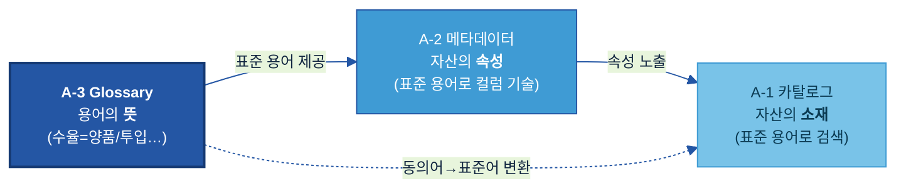
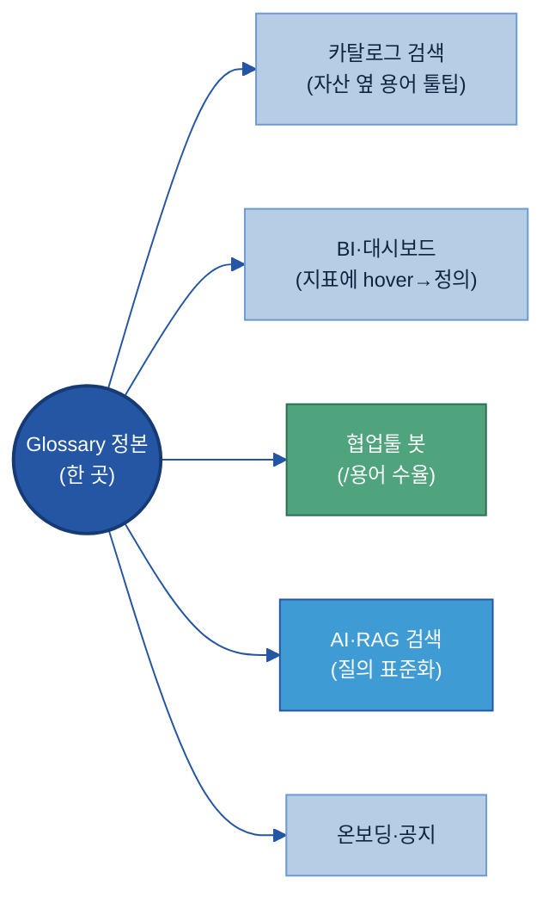

# A-3. 비즈니스 Glossary

> **한 줄 정의:** 비즈니스 Glossary(Business Glossary)는 조직에서 쓰는 **업무 용어·약어·동의어를 하나의 표준 뜻으로 통일한 사전**이다. — 자산의 *속성*을 적는 [A-2 메타데이터](../A-2%20메타데이터/A-2%20메타데이터.md)와 달리, Glossary는 **단어 자체의 뜻**을 고정해, 부서·계열사가 같은 말을 같은 의미로 쓰고 AI가 현장 용어를 표준 용어로 해석하게 한다.

## 목차

1. [개요](#1-개요)
2. [왜 필요한가 (Why)](#2-왜-필요한가-why)
3. [무엇을 갖추나 (What — 용어 카드·동의어·유형)](#3-무엇을-갖추나-what--용어-카드동의어유형)
4. [어디부터 표준화하나 (우선순위)](#4-어디부터-표준화하나-우선순위)
5. [예시 시나리오 — '결함명' 표준화 한 바퀴](#5-예시-시나리오--결함명-표준화-한-바퀴-두산전자-품질)
6. [솔루션·도구 검토](#6-솔루션도구-검토)
7. [어떻게 준비·운영하나 (How)](#7-어떻게-준비운영하나-how)
8. [다른 주제와의 관계](#8-다른-주제와의-관계)
9. [성과 지표·고도화](#9-성과-지표고도화)

- [별첨 — 용어 카드 템플릿·도메인 용어 예시집·표준값](#별첨-appendix)
- [참고자료(References)](#참고자료-references)
- [변경 이력 / 피드백 반영](#변경-이력--피드백-반영)

> 관련 가이드: [A-1 데이터 카탈로그](../A-1%20데이터%20카탈로그/A-1%20데이터%20카탈로그.md) · [A-2 메타데이터](../A-2%20메타데이터/A-2%20메타데이터.md) · [B-3 온톨로지](../B-3%20온톨로지/B-3%20온톨로지.md) · [C-2 데이터 품질 관리](../C-2%20데이터%20품질%20관리/C-2%20데이터%20품질%20관리.md)

---

### 이 가이드가 답하는 핵심 질문

| # | 질문(현업의 말로) | 한 줄 답 | 다루는 곳 |
|---|---|---|---|
| 1 | **어떤 용어**부터 표준화하나? | AI 검색·집계에 영향이 크고 부서·계열사마다 다르게 쓰는 용어(결함명·공정명·지표명)부터 | [§4](#4-어디부터-표준화하나-우선순위) |
| 2 | 표준 용어는 **어떤 항목**으로 정의하나? | 표준명·영문명·약어·동의어·금지어·정의·사용 예시·관련 필드·책임 부서 | [§3.1](#sec31) |
| 3 | 부서·계열사 간 **용어 충돌**을 어떻게 조정하나? | "같은 말 다른 뜻 / 다른 말 같은 뜻"을 SME·오너·중앙조직이 조정·승인 | [§7.2](#sec72) |
| 4 | 현장 용어·약어를 **그대로 써도** 표준어로 변환되게 하려면? | 동의어·약어 매핑을 갖춰 검색·AI가 자동 변환(질의 확장) — 사람은 안 바꿔도 됨 | [§7.4](#sec73) |
| 5 | **용어 변경**을 어떻게 관리하나? | 신규·변경·폐기·동의어 추가를 버전·승인으로 관리하고 변경 영향을 점검 | [§7.5](#sec74) |

---

## 1. 개요

### 1.1 비즈니스 Glossary란 (용어를 하나의 뜻으로)

**👉 한 줄 요약:** Glossary는 조직이 쓰는 용어·약어·동의어를 **표준 뜻 하나로 묶은 사전**이다 — "이 회사에서 '수율'은 정확히 이것을 뜻한다"를 못박는다.

같은 회사 안에서도 같은 단어가 부서마다 다른 의미로 쓰인다. 영업의 "리드타임"은 *주문~납품*이고, 생산의 "리드타임"은 *투입~완성*이다. 반대로 "긁힘·스크래치·기스"는 다른 단어지만 같은 결함을 가리킨다. Glossary는 이 혼선을 표준명으로 정리한다.

| 현장의 혼선 | Glossary가 정리한 결과 |
|---|---|
| "긁힘", "스크래치", "기스" (다른 말, 같은 뜻) | 표준명 **스크래치(Scratch)** · 동의어로 묶음 · 금지어 "기스" |
| "리드타임"을 부서마다 다르게 (같은 말, 다른 뜻) | **영업 리드타임**(주문~납품) / **생산 리드타임**(투입~완성)으로 구분 정의 |

> **🏭 두산전자 예시:** 글로벌 현장(국내·중국·베트남)에서 같은 결함을 한국어·영어·중국어로 다르게 부른다. Glossary에 표준 결함명과 각국 동의어를 묶어 두면, 어느 표현으로 검색해도 AI가 같은 결함 데이터를 찾아낸다.

> **용어 풀이 — Glossary(글로서리):** "용어 사전"을 뜻하는 영어. 본 가이드에서는 *업무 용어의 표준 정의집*을 가리킨다.

### 1.2 적용 범위와 체계 내 위치 (용어의 "뜻")

**👉 한 줄 요약:** Glossary는 "찾을 수 있게(Findable)" 묶음(A-1~A-3)에서 **용어의 뜻**을 담당한다 — 메타데이터·카탈로그가 이 표준 용어를 가져다 쓴다.



| 주제 | 답하는 질문 | 비유 |
|---|---|---|
| **A-3 Glossary (이 가이드)** | "이 **단어**가 무슨 뜻이지?" | 국어사전 |
| [A-2 메타데이터](../A-2%20메타데이터/A-2%20메타데이터.md) | "이 **자산**은 어떤 속성이지?" | 제품 사양서 |
| [A-1 카탈로그](../A-1%20데이터%20카탈로그/A-1%20데이터%20카탈로그.md) | "그 **데이터가 어디** 있지?" | 도서관 목록 |

> **⚠️ 경계 (중복 방지):** Glossary는 **단어 단위의 표준 뜻**만 담는다. 개념과 개념의 *관계*(결함이 어느 공정에서 생기나)는 [B-3 온톨로지](../B-3%20온톨로지/B-3%20온톨로지.md), 특정 컬럼의 속성 설명은 [A-2 메타데이터](../A-2%20메타데이터/A-2%20메타데이터.md)가 맡는다. 한 문장으로: **Glossary는 "단어의 뜻"까지, 관계·속성은 인접 주제로.**

### 1.3 주요 대상 조직

**👉 한 줄 요약:** 용어 정의는 **현업 SME(업무 전문가)** 가 제안하고, **중앙 데이터 조직/거버넌스**가 표준으로 확정·관리한다.

| 역할 | Glossary에서 하는 일 |
|---|---|
| **현업 SME / 데이터 오너** | 현장 용어·동의어 제안, 정의 초안 작성, 충돌 시 의견 제시 |
| **데이터 스튜워드 / 중앙 데이터 조직** | 표준 용어 확정, 충돌 조정, 버전·승인 관리 |
| **AI/Data 거버넌스 위원회** | 계열사 간 표준 정책·충돌 조정 최종 승인 |
| **데이터 플랫폼 / IT** | Glossary를 카탈로그·메타·검색에 연동 |

> **용어 풀이 — SME(Subject Matter Expert):** 그 업무를 가장 잘 아는 현업 전문가. 용어의 *실제 뜻*은 SME만 정확히 안다.

---

## 2. 왜 필요한가 (Why)

**👉 한 줄 요약:** 같은 것을 현장마다 다르게 불러 **AI 검색·집계가 따로 놀고**, 같은 지표가 팀마다 다른 숫자로 나와 **보고가 어긋난다** — Glossary는 이 분열을 표준어로 봉합한다.

### 2.1 현업 Pain Point

[A-2 메타데이터](../A-2%20메타데이터/A-2%20메타데이터.md)가 "이 컬럼이 무슨 뜻인지"를 풀었다면, Glossary는 그보다 앞선 문제 — "애초에 같은 단어를 다르게 쓴다"를 푼다.

**Pain 1 — 같은 것을 다르게 부른다(동의어 분열):** 현장에서 "긁힘·스크래치·기스"를 섞어 쓴다. AI에게 "스크래치 불량 보여줘"라고 물으면, "기스"로 기록된 데이터는 검색에서 빠진다. 데이터는 있는데 *용어가 달라 못 찾는다.*

**Pain 2 — 같은 단어가 다른 뜻(동음이의 충돌):** "리드타임"을 영업은 주문~납품, 생산은 투입~완성으로 쓴다. AI가 둘을 섞으면 "리드타임 평균"이 무의미해진다.

**Pain 3 — 같은 지표, 다른 숫자(집계 기준 분열):** "수율"을 어떤 팀은 재작업 포함, 어떤 팀은 제외로 계산한다. 같은 KPI인데 보고서마다 숫자가 달라 "어느 게 맞냐"는 논쟁이 반복된다.

**Pain 4 — 글로벌·계열사 간 분열:** 국내·중국·베트남 현장이 같은 결함·공정을 각국 언어·약어로 다르게 부른다. 계열사를 가로지르는 분석이 용어 장벽에 막힌다.

> **🏭 두산전자 예시:** 약어 `SOI`가 어떤 문서엔 "Sales of Income(내부 매출 분류)", 다른 곳엔 무관한 의미로 쓰여, AI가 실적 표를 잘못 해석했다. Glossary에 `SOI = Sales of Income(주간 실적/계획 표 기준)`을 못박고 나서야 해석이 통일됐다.

이 Pain들의 공통점은 **"데이터가 아니라 말이 분열돼 있다"**는 것이다. Glossary는 말의 표준을 세워, 데이터·AI가 한 언어로 작동하게 한다.

### 2.2 기대 효과

**① 어느 표현으로 물어도 검색된다**

동의어를 표준명에 묶으면, "기스"로 검색해도 "스크래치" 데이터가 나온다. 현장 용어 그대로 질문해도 AI가 표준 용어로 변환해 한 번에 찾는다.

**② 지표 숫자가 일치한다**

"수율"의 계산식·포함 조건이 표준으로 고정되면, 어느 팀·어느 보고서든 같은 정의로 집계해 숫자가 어긋나지 않는다. 보고·의사결정의 신뢰가 올라간다.

**③ AI 응답의 해석 일관성**

AI Agent가 질의·답변에서 동일 용어를 동일 의미로 쓴다. Glossary가 AI가 참조하는 "판단의 기준어"가 된다.

**④ 계열사·글로벌을 가로지르는 분석**

각국·각 계열사 용어를 표준명에 매핑하면, 용어 장벽 없이 전사 데이터를 한 기준으로 비교·분석할 수 있다.

> **🏢 자회사 입장에서:** Glossary는 ① *용어 때문에 못 찾던 데이터*를 찾게 하고, ② *보고서마다 다르던 지표 숫자*를 통일하며, ③ 글로벌 현장을 *한 언어로* 잇는다. 메타데이터가 "자산을 해석"하게 했다면, Glossary는 "조직 전체가 같은 말로 소통"하게 한다.

---

## 3. 무엇을 갖추나 (What — 용어 카드·동의어·유형)

> ★ **이 절의 정본 모델:** Glossary = **용어 카드(표준 정의 항목)** + **동의어·금지어(현장 표현 연결)** + **연계 정보(데이터 필드·책임 부서)**. 용어는 **비즈니스 용어**와 **지표 기준** 두 유형으로 나뉜다.

<a id="sec31"></a>
### 3.1 표준 용어 카드 — 항목 사전 (현업 실행 키트 ㉠)

> ❓ **핵심 질문 2 — "표준 용어는 어떤 항목으로 정의하나?"** 에 답하는 절.

**👉 한 줄 요약:** 용어 하나를 정의할 때 채우는 **표준 항목 표**다. `필수/선택`은 최소 항목, **작성 주체**는 👤 현업 SME / 🛡 스튜워드(중앙)로 나뉜다.

| 항목 | 쉬운 의미 | 예시값 | 필수/선택 | 작성 주체 |
|---|---|---|:---:|:---:|
| 표준명 | 회사 공식 용어 | `확정 매출` | 필수 | 🛡 |
| 영문명 | 영어 표기 | `Confirmed Sales` | 필수 | 🛡 |
| 약어 | 줄임말 | `-` (있으면 `COGS` 등) | 선택 | 👤 |
| 정의 | 한 문장 표준 뜻 | `세금계산서 발행 완료된 납품 건의 매출` | 필수 | 👤 |
| 동의어 | 같은 뜻 현장 표현 | `실적, Sales(영업)` | 필수 | 👤 |
| 금지어 | 쓰지 말 표현 | `매출액(모호)` | 선택 | 🛡 |
| 사용 예시 | 문장 속 쓰임 | `"확정 매출 기준 월 마감"` | 선택 | 👤 |
| 관련 데이터 필드 | 이 용어가 붙는 컬럼 | `SALES.CONFIRMED_AMT` (→ [A-2](../A-2%20메타데이터/A-2%20메타데이터.md)) | 선택 | 🛡 |
| 책임 부서 | 정의를 책임지는 조직 | `영업기획팀` | 필수 | 👤 |
| 상태 | 승인 단계 | `승인` (검토중/승인/폐기) | 필수 | 🛡 |

> ▸ 빈 용어 카드 템플릿 + 완성 예시(CCL·수율)는 [[Appendix A]](#appendix-a), 두산 도메인 용어 예시집은 [[Appendix B]](#appendix-b)에.

### 3.2 동의어·금지어 (현장 표현을 표준어로 잇기)

**👉 한 줄 요약:** Glossary의 힘은 표준명보다 **동의어·금지어**에서 나온다 — 현장이 실제로 쓰는 말을 표준어에 연결해야 검색·변환이 작동한다.

- **동의어(Synonym):** 같은 뜻의 다른 표현. 표준명에 묶어 "어느 말로 물어도" 찾게 한다. 예: `스크래치` ← {긁힘, 기스, scratch, 划痕}.
- **금지어(Deprecated):** 혼동을 일으켜 *쓰지 말아야 할* 표현. 예: "매출액"(주문/확정/회계 기준이 섞여 모호) → "확정 매출" 사용.

> **🏭 예시:** 표준명 `스크래치(Scratch)` / 동의어 `긁힘·기스·划痕` / 금지어 `흠집(범위 모호)`. → 작업자가 "기스"로 입력해도 AI는 스크래치 결함으로 인식한다.

### 3.3 연계 정보 (데이터 필드·책임 부서)

**👉 한 줄 요약:** 용어가 *어느 데이터 필드에 쓰이고 누가 책임지는지*를 연결해야, Glossary가 사전을 넘어 데이터와 이어진다.

- **관련 데이터 필드:** 그 용어가 실제로 붙는 컬럼·테이블(→ [A-2 메타데이터](../A-2%20메타데이터/A-2%20메타데이터.md)의 비즈 메타가 이 표준 용어를 인용).
- **책임 부서:** 정의의 정확성을 책임지는 조직. 충돌·변경 시 의사결정 주체.

### 3.4 두 가지 유형 — 비즈니스 용어 / 지표 기준

**👉 한 줄 요약:** Glossary 항목은 **'단어의 뜻'(비즈니스 용어)** 과 **'숫자의 계산법'(지표 기준)** 두 종류다 — 지표는 계산식·조건까지 적어야 숫자가 일치한다.

| 유형 | 무엇을 표준화 | 핵심 추가 항목 | 🏭 예시 |
|---|---|---|---|
| **비즈니스 용어** | 부서마다 다르게 해석되는 핵심 용어의 뜻 | 정의·동의어·금지어 | 수주, 납기, 부진재고, SOP |
| **지표 기준(Metric)** | KPI가 어떻게 계산·집계되는지 | **계산식·기준 시점·포함/제외 조건** | 수율 = 양품/투입(재작업 제외), 리드타임 = 주문확정~납품완료 |

> **🏭 지표 기준 예시 — 수율:** `수율 = 양품 수량 ÷ 투입 수량`, *기준 시점:* 월 마감, *포함/제외:* 재작업 양품 제외. 이 세 가지가 없으면 같은 "수율"도 팀마다 다른 숫자가 된다(§2.1 Pain 3).

---

## 4. 어디부터 표준화하나 (우선순위)

> ❓ **핵심 질문 1 — "어떤 용어부터 표준화하나?"** 에 답하는 절.

### 4.1 표준화 대상 용어

**👉 한 줄 요약:** 모든 용어를 한 번에 하지 않는다 — **AI 검색·해석에 영향이 크고, 부서·계열사마다 다르게 쓰는 용어**부터.

| 분류 | 대상 용어 예 |
|---|---|
| 품질 | 결함명, 검사항목, 원인 유형, 조치 유형 |
| 생산 | 공정명, 제품군, 수율·리드타임 등 지표 |
| 영업·고객 | 수주·납품·납기, 고객 불만 유형, 매출 관련 지표 |
| 원가 | 표준원가·실제원가·원가율 등 |

### 4.2 우선순위

**👉 한 줄 요약:** "AI 검색 영향 × 용어 혼선 정도"가 둘 다 높은 용어가 1순위다.

| 우선순위 | 기준 | 예 |
|---|---|---|
| 1순위 | AI 검색·집계에 자주 쓰이고 + 부서마다 다르게 씀 | 결함명, 수율, 매출 |
| 2순위 | 약어·현장식 표현이 많아 해석이 갈림 | SOI, L/T, CCL |
| 3순위 | 계열사·글로벌 간 표현이 다름 | 다국어 결함명·공정명 |
| 후순위 | 한 부서만 쓰고 혼선이 없는 용어 | 부서 내부 약속어 |

> **🏭 두산전자 예시:** 결함명·수율부터 표준화(검사·분석 AI가 매일 쓰는 용어) → 다음으로 약어(SOI·L/T) → 글로벌 현장 다국어 매핑 순으로 확대한다.

---

## 5. 예시 시나리오 — '결함명' 표준화 한 바퀴 (두산전자 품질)

> 이 한 사례를 **처음부터 끝까지** 따라가며 Glossary를 어떻게 구성하는지 본다. 각 단계의 *방법 상세*는 §7 해당 절로 링크한다 — 여기서는 "한 줄기로 흐르는 모습"을 본다.

### 5.1 상황 — 왜 시작했나

두산전자 품질보증팀이 **AI 결함 분석**을 도입했다. 그런데 "스크래치 불량 추이"를 물으면 데이터의 절반만 나온다. 원인은 현장이 같은 결함을 제각각 부른 것 — `긁힘·기스·scratch`, `빵꾸·홀·핀홀`, `휨·컬`. **데이터가 아니라 말이 흩어져** 검색이 새고 있었다.

### 5.2 적용 전 / 후

| | 적용 전 | 적용 후 |
|---|---|---|
| "스크래치 불량" 검색 | "기스"로 기록된 건 누락(절반만) | 동의어 묶여 전부 검색 |
| 반장이 "빵꾸" 입력 | AI가 못 알아들음 | `핀홀(P03)`으로 자동 변환 |
| 글로벌(중국) 현장 | "划痕"은 따로 놂 | 표준명에 매핑돼 통합 |
| 신규 분석자 | 결함 코드 의미 물어봐야 | 검색 툴팁으로 즉시 이해 |

### 5.3 처음부터 끝까지 — 8단계 한 흐름


| 단계 | 무엇을 했나 (이 사례의 실제 모습) | 산출물 | 방법 상세 |
|---|---|---|---|
| **①수집** | QMS 결함 드롭다운·작업일지에서 실제 표현을 긁어모음 → `긁힘·기스·scratch·빵꾸·홀·핀홀·휨·컬·划痕` | 현장 표현 목록(40여 개) | [§7.1](#7-어떻게-준비운영하나-how) |
| **②합의(워크숍)** | 품질 SME가 모여 같은 뜻끼리 묶음: {긁힘,기스,scratch,划痕}=**스크래치**, {빵꾸,홀,핀홀}=**핀홀**, {휨,컬}=**컬** | 표준명 후보 + 동의어 그룹 | [§7.1](#7-어떻게-준비운영하나-how) |
| **③용어카드 작성** | 표준명마다 카드 작성 — 정의·동의어·금지어·관련 필드(`DEF_CD`)·책임부서 | 용어 카드 (예시 아래) | [§3.1](#sec31)·[Appendix A](#appendix-a) |
| **④충돌 조정** | "홀"이 *핀홀*인지 *관통홀*인지 이견 → 수식어로 분리 정의, 거버넌스 승인 | 충돌 해소 결정 | [§7.2](#sec72) |
| **⑤업로드** | 결함명 30개를 엑셀로 작성 → Glossary에 일괄 import → 검수 → 게시(상태: 승인) | 정본 저장소 등록 | [§7.3](#7-어떻게-준비운영하나-how) |
| **⑥전사 배포** | 카탈로그 검색 툴팁·QMS 입력화면 도움말·Slack 봇에 자동 노출 | 전 채널 노출 | [§7.3](#7-어떻게-준비운영하나-how) |
| **⑦약어 자동변환** | 반장이 "빵꾸 난 로트" 입력 → 동의어 사전이 `핀홀(P03)`로 변환해 검색 | 현장어→표준어 변환 작동 | [§7.4](#sec73) |
| **⑧운영** | 신규 결함 "딤플" 발견 → 추가 요청 → 검토·승인 → 동의어 반영 | 버전 갱신 | [§7.5](#sec74) |

> **③단계 산출물 — 실제 용어 카드 한 장:**
> ```
> 표준명 : 스크래치 (Scratch)        상태: 승인
> 정의   : 동박 표면이 외부 접촉으로 긁힌 선형 결함
> 동의어 : 긁힘, 기스, scratch, 划痕   금지어 : 흠집(범위 모호)
> 관련 필드 : QMS.INSP_RESULT.DEF_CD = 'S01'   책임 부서 : 품질보증팀
> ```
> 이 카드 한 장이 ⑦단계에서 "기스로 쳐도 스크래치가 검색되는" 변환의 재료가 된다.

> **이 사례가 곧 worked example이다.** §7의 각 절은 이 8단계의 *방법*을 자세히 설명한다 — 막히면 §5로 돌아와 "지금 몇 단계인지"를 확인하면 된다.

---

## 6. 솔루션·도구 검토

> 🔗 **2층 연결:** 솔루션을 묶어서 평가·선정하려면 → [Tech Stack 비교 정본](../../전체%20목차/01%20Tech%20Stack%20비교%20(솔루션×주제).md). 아래는 *Glossary 관점*의 기능 비교(1층)다.

### 6.1 도구 유형

**👉 한 줄 요약:** 전용 Glossary 기능(카탈로그·거버넌스 솔루션 내장)으로 갈지, 위키·스프레드시트로 가볍게 시작할지 — 규모와 성숙도로 정한다.

| 유형 | 강점 | 유의점 | 예 |
|---|---|---|---|
| 카탈로그·거버넌스 내장 Glossary | 메타·검색 자동 연계, 승인 워크플로 | 도입 비용 | [Collibra](https://www.collibra.com), [Microsoft Purview](https://learn.microsoft.com/azure/purview/), [Atlan](https://atlan.com) |
| 플랫폼 내장 | 플랫폼 데이터와 즉시 연결 | 플랫폼 종속 | [Databricks Unity Catalog](https://www.databricks.com/product/unity-catalog) |
| 경량 시작 | 빠르고 저비용 | 검색 자동연계·버전관리 약함 | 위키·스프레드시트 |

### 6.2 선정 기준

| 평가 축 | 무엇을 보나 |
|---|---|
| 동의어·금지어 매핑 | 표준명↔현장어 연결을 지원하나 |
| 검색 연계 | 카탈로그·RAG 검색에 표준 용어가 연결되나 |
| 현업 편집성 | SME가 직접 제안·편집하기 쉬운가 |
| 승인 워크플로 | 제안→검토→승인→버전 관리가 되나 |

> 기능·가격은 변동되므로 도입 검토 시 공식 문서·PoC로 확인한다.

---

## 7. 어떻게 준비·운영하나 (How)

### 7.1 용어를 어떻게 정하나 — 수집·합의·정의

**👉 한 줄 요약:** 용어는 책상에서 만드는 게 아니라 **현장이 실제 쓰는 말을 모아 → SME가 합의 → 표준명·동의어·정의로 확정**한다.

**i) 어디서 용어를 모으나 (현장 표현 수집)** — 표준을 새로 발명하지 않는다. 이미 쓰이는 말을 긁어모은다.

| 수집처 | 무엇을 건진다 |
|---|---|
| MES/QMS 코드값·드롭다운 목록 | 결함명·공정명·검사항목의 현장 표기 |
| 현장 작업일지·검사 보고서 | 비공식 약어·현장식 표현("기스", "빵꾸") |
| 기존 사내 약어표·위키·용어집 | 흩어진 정의들(통합 대상) |
| BI 대시보드·보고서 라벨 | 지표명과 팀별 다른 계산 |
| 이메일·회의록 | 영업·고객 용어(수주·납기·PO) |
| SME 인터뷰·용어 워크숍 | 위에서 안 잡히는 암묵 용어·진짜 뜻 |

**ii) 합의 — 용어 워크숍.** 도메인별(품질·생산·영업·원가)로 SME를 모아, 수집한 표현들을 놓고 *"이건 같은 뜻 / 이건 다른 뜻"* 을 가른다(동의어 묶기·충돌 분리는 §7.2). 한자리에서 표준명 후보와 정의 초안을 만든다.

**iii) 정의 — 잘 쓴 정의 vs 못 쓴 정의 (현업 실행 키트 ㉡).** 정의는 **측정 가능·명확하게**. 초안→검토→승인 흐름과 양식은 [[Appendix A]](#appendix-a).

| 항목 | ❌ Before | ✅ After | 왜 |
|---|---|---|---|
| 수율 정의 | "생산 잘된 정도" | "양품 수량 ÷ 투입 수량 (재작업 제외, 월 마감 기준)" | 계산식·조건 명시 |
| 리드타임 | "걸리는 시간" | "주문 확정일 ~ 납품 완료일 (영업 기준)" | 시작·끝 시점 명시 |
| 부진재고 | "오래된 재고" | "최근 12개월 출고 0인 재고" | 정량 기준 |

> **금지 표현:** `대략·주요·관련·오래된·최근` 등 해석이 갈리는 정성어. 측정 기준이 분명한 표현으로 바꾼다([A-2 §7.3](../A-2%20메타데이터/A-2%20메타데이터.md#sec74)과 동일 원칙).

<a id="sec72"></a>
### 7.2 용어 충돌 조정

> ❓ **핵심 질문 3 — "부서·계열사 간 용어 충돌을 어떻게 조정하나?"** 에 답하는 절.

**👉 한 줄 요약:** 충돌은 두 가지다 — **같은 말 다른 뜻** / **다른 말 같은 뜻**. SME·오너·중앙조직이 함께 조정·승인한다.

| 충돌 유형 | 처리 방식 | 🏭 예 |
|---|---|---|
| 같은 말 다른 뜻 (동음이의) | 수식어를 붙여 **구분 정의** 또는 하나로 표준 확정 | "리드타임" → 영업/생산 리드타임으로 분리 |
| 다른 말 같은 뜻 (동의어) | 표준명 하나로 **통합**, 나머지는 동의어로 | "긁힘·기스" → 스크래치로 통합 |

조정 절차: ① SME가 충돌 제기 → ② 관련 부서·오너 의견 수렴 → ③ 중앙 데이터 조직이 표준안 결정 → ④ 거버넌스 승인 → ⑤ Glossary 반영·공지. 계열사를 가로지르는 충돌은 거버넌스 위원회가 최종 조정한다.

### 7.3 어디에 두고, 어떻게 모두가 보게 하나 (단일 저장소·배포)

**👉 한 줄 요약:** 용어집이 여러 군데 흩어지면 또 분열된다 — **반드시 한 곳(정본)에 올리고**, 그 한 곳을 **모든 화면(검색·BI·챗봇·AI)에 비춘다.** 한 번 정의하면 모든 채널에 자동 반영되는 게 핵심.

**i) 어디에 두나 — 단일 정본 저장소(Single Source of Truth).** 용어는 *딱 한 곳*에만 정본을 둔다. 부서마다 엑셀을 따로 두면 표준화의 의미가 없다.

| 저장 위치 | 적합 상황 | 비고 |
|---|---|---|
| 카탈로그·거버넌스 솔루션의 **Glossary 모듈** ([Collibra](https://www.collibra.com)·[Purview](https://learn.microsoft.com/azure/purview/)·[Atlan](https://atlan.com)) | 본격 운영 | 검색·메타·승인과 자동 연계[^glossary-tools] |
| **플랫폼 내장** ([Databricks Unity Catalog](https://www.databricks.com/product/unity-catalog)) | 데이터플랫폼 중심 | 데이터와 같은 곳에서 관리 |
| **위키·공유 시트** | 파일럿·소규모 시작 | 단, *한 곳만*. 나중에 솔루션으로 이관 |

**ii) 어떻게 올리나 — 등록·업로드.** ① 소량은 UI에서 직접 입력, ② **대량은 엑셀/CSV로 모아 일괄 import**(현업이 익숙한 방식 — 엑셀로 작성 → 검수 → 업로드), ③ 자동화는 API로 등록. 업로드 후 검수·승인(§7.1 iii)을 거쳐 "게시"된다.

**iii) 어떻게 모두가 보게 하나 — 한 곳을 여러 화면에 비춘다.** 정본 하나를 등록하면 아래 채널에 자동 노출되게 연결한다.



- **전사 읽기 권한:** 임직원 누구나 검색·열람(편집은 SME/스튜워드만).
- **카탈로그·메타 통합:** 자산·컬럼 옆에 표준 용어 정의가 툴팁으로 뜬다([A-2](../A-2%20메타데이터/A-2%20메타데이터.md) 비즈 메타가 용어를 인용).
- **BI·대시보드:** 지표 위에 마우스를 올리면 표준 정의·계산식이 보인다("이 수율은 재작업 제외").
- **협업툴(Teams/Slack) 봇:** "/용어 SOI" 하면 정의를 즉시 반환.
- **온보딩·정기 공지:** 신규 입사자 교육 자료에 포함, 용어 추가·변경 시 공지.

> **🏭 두산전자 예시:** 신입 분석 담당자가 대시보드의 "원가율"에 hover하면 `매출 대비 원가 비율(표준원가 기준)` 정의가 바로 뜬다 — 선임에게 묻지 않아도 같은 기준으로 해석한다.

<a id="sec73"></a>
### 7.4 현장 용어·약어를 그대로 써도 변환되게 (동의어 자동 변환)

> ❓ **핵심 질문 4 — "Glossary를 AI 활용 체계와 어떻게 잇나?"** 에 답하는 절.

**👉 한 줄 요약:** 현업에게 "표준어를 외워서 쓰라"고 강요하지 않는다 — **쓰던 약어·현장어 그대로 입력해도 시스템이 표준어로 변환**해 데이터를 찾아준다. 이게 Glossary가 "사전"을 넘어 검색·AI 인프라가 되는 지점이다.

**작동 원리 — 4단계:**


1. **동의어·약어 매핑을 데이터로 갖춘다** — Glossary에 `표준명 ↔ 동의어/약어`를 등록(예: 스크래치 ← {긁힘, 기스, scratch}, `L/T` ← 리드타임). *우리가 준비하는 것은 이 매핑 데이터다.*
2. **질의 확장(Query Expansion)** — 검색·카탈로그가 입력어를 동의어 사전에 비춰 표준어로 바꿔 검색한다. "기스"로 쳐도 "스크래치(S01)" 데이터가 나온다.
3. **자동완성·"이거 찾으셨나요"** — 입력 중 표준어를 제안하고, 폐기어·오타엔 대체 표준어를 안내한다.
4. **AI·RAG 질의 정규화** — AI Agent가 Glossary를 참조해 현장어를 표준어로 정규화한 뒤 검색·답변한다(같은 용어를 같은 의미로).

> **🏭 와닿는 예시:** 30년 경력 검사반장이 늘 쓰던 "빵꾸(핀홀)"로 "빵꾸 많이 난 로트 보여줘"라고 물어도, 동의어 사전이 `빵꾸 → 핀홀(P03)`로 변환해 정확한 데이터를 찾는다. **반장은 표준 용어를 몰라도 되고, 데이터는 표준으로 정리된다.** 사람을 바꾸는 대신 사전이 다리를 놓는다.

> **🛠 어디서 되나:** 이 변환은 별도 엔진을 *만드는* 게 아니라, **카탈로그·거버넌스 솔루션의 동의어(Synonym) 매핑 기능**과 검색엔진의 동의어 처리, RAG의 용어 정규화가 *Glossary 데이터를 소비*해 작동한다[^synonym]. 우리 일은 그 매핑 데이터(동의어·약어)를 정확히 채워 두는 것이다(데이터 준비 관점).

> **용어 풀이 — 질의 확장(Query Expansion):** 사용자가 입력한 검색어에 동의어·관련어를 더해 검색 범위를 넓히는 기법. Glossary 동의어가 그 재료가 된다.

<a id="sec74"></a>
### 7.5 운영 — 용어 변경 관리와 역할

> ❓ **핵심 질문 5 — "용어 변경을 어떻게 관리하나?"** 에 답하는 절.

**👉 한 줄 요약:** 신규·변경·폐기·동의어 추가를 **버전·승인**으로 관리하고, 변경이 데이터·문서·Prompt에 미치는 **영향을 점검**한다.

| 변경 유형 | 처리 | 영향 점검 |
|---|---|---|
| 신규 용어 등록 | 제안→검토→승인 | 기존 동의어와 중복 여부 |
| 기존 용어 변경 | 버전 올림, 이력 보존 | 관련 데이터 필드·메타·Prompt 영향 |
| 폐기 용어 지정 | 금지어로 전환·대체어 안내 | 폐기어를 쓰는 데이터·문서 식별 |
| 동의어 추가 | 표준명에 연결 | 검색 변환(§7.4)에 즉시 반영 |

**역할(RACI 요약):** 용어 제안·정의 = 현업 SME **R**, 표준 확정·충돌 조정 = 중앙 스튜워드 **R/A**, 계열사 정책 = 거버넌스 **A**, 검색·배포 연계 = IT **R**.

> 용어 변경은 **데이터를 바꾸지 않아도 해석을 바꾼다** — "확정 매출"의 정의가 바뀌면 그 용어를 인용한 모든 메타·Prompt가 영향받으므로, 변경 영향 점검이 필수다.

---

## 8. 다른 주제와의 관계

**👉 한 줄 요약:** Glossary는 *단어의 뜻*만 담고, 속성·관계·소재는 인접 주제가 맡되 모두 Glossary 표준 용어를 **가져다 쓴다.**

| 인접 주제 | 경계 (Glossary는 어디까지) |
|---|---|
| [A-2 메타데이터](../A-2%20메타데이터/A-2%20메타데이터.md) | Glossary=용어의 표준 뜻 / A-2=그 용어로 컬럼 속성 기술. 비즈 메타가 Glossary 용어를 인용 |
| [A-1 카탈로그](../A-1%20데이터%20카탈로그/A-1%20데이터%20카탈로그.md) | Glossary=검색어 표준화 / A-1=자산 검색. 동의어가 카탈로그 검색을 넓힘 |
| [B-3 온톨로지](../B-3%20온톨로지/B-3%20온톨로지.md) | Glossary=단어의 뜻(결함=…) / B-3=개념 간 관계(결함↔공정↔원인) |
| [C-2 품질](../C-2%20데이터%20품질%20관리/C-2%20데이터%20품질%20관리.md) | Glossary=지표 정의(수율=…) / C-2=그 지표로 품질 측정 |

---

## 9. 성과 지표·고도화

### 9.1 성과 지표 (KPI)

| 지표 | 쉬운 의미 | 방향 |
|---|---|---|
| 표준화 용어 수 | 표준으로 확정된 용어 개수 | ↑ |
| 동의어 매핑률 | 표준명에 현장 동의어가 연결된 비율 | ↑ |
| 현장 용어 변환 성공률 | 현장어 질의가 표준어로 변환돼 검색된 비율 | ↑ |
| 지표 정의 일치율 | 표준 계산식을 따르는 보고서 비율 | ↑ |

### 9.2 고도화

문서·현장 기록에서 **후보 용어·동의어를 AI가 초안 추출**하고 SME가 검수·승인하는 방향으로 발전한다. 초기엔 사람이 핵심 용어를 정의하고, 성숙해지면 AI가 동의어·신조어를 자동 제안한다(사람 검수 전제).

---

## 별첨 (Appendix)

<a id="appendix-a"></a>
### [Appendix A] 용어 카드 빈 템플릿 + 완성 예시 (현업 실행 키트 ㉣)

**가. 빈 용어 카드 (복사해서 채우기)**

```
════════════════════════════════════════════════════
 표준명     : __________            🛡
 영문명     : __________            🛡
 약어       : __________            👤
 정의       : __________ (한 문장, 측정 가능하게)  👤
 동의어     : __________ (현장 표현 모두)  👤
 금지어     : __________ (쓰지 말 표현)   🛡
 사용 예시  : __________            👤
 유형       : 비즈니스 용어 / 지표 기준
 (지표면) 계산식·기준시점·포함제외 : __________   👤
 관련 필드  : __________ (→ A-2 메타)   🛡
 책임 부서  : __________            👤
 상태       : 검토중 / 승인 / 폐기    🛡
════════════════════════════════════════════════════
```

**나. 완성 예시 2건 (두산전자)**

```
[비즈니스 용어]
 표준명 : CCL (동박적층판)   영문 : Copper Clad Laminate
 정의   : PCB 핵심 소재로, 동박(Copper Foil)을 절연층에 적층한 판형 소재
 동의어 : 동박적층판, 적층판        금지어 : (없음)
 관련 필드: PROD.PRODUCT_TYPE='CCL'   책임 부서: 제품기획팀   상태: 승인
────────────────────────────────────────────────────
[지표 기준]
 표준명 : 수율   영문 : Yield Rate
 정의   : 투입 대비 양품 비율
 계산식 : 양품 수량 ÷ 투입 수량   기준시점: 월 마감   포함/제외: 재작업 양품 제외
 동의어 : Yield, 양품률          금지어 : 가동률(다른 개념)
 관련 필드: PROD.YIELD_RATE   책임 부서: 생산기술팀   상태: 승인
```

<a id="appendix-b"></a>
### [Appendix B] 두산 도메인 용어 예시집 (엑셀 「Glossary 작성 가이드」 흡수)

표준화 착수 시 참고할 제조·영업·원가 도메인 실제 용어. (전체 표준 사전은 솔루션/외부 시트로 관리)

| 구분 | 용어 | 표준 뜻 |
|---|---|---|
| 소재 | CCL | Copper Clad Laminate, 동박적층판. PCB 핵심 소재 |
| 소재 | Copper Foil | 동박. CCL·PCB 제조에 쓰는 구리 필름 |
| 소재 | Substrate | 기판. 반도체·전자 소재의 기반 판형 소재 |
| 소재 | HVLP | Very Low Profile, 동박 표면 프로파일 등급(예: HVLP4) |
| 영업 | PO / PO No. | Purchase Order(공식 발주 문서) / 발주 식별 번호 |
| 영업 | 수주 / 납품 / 납기 | 주문 수령(Order intake) / 인도 완료(Delivery) / 납품 기한 |
| 영업 | L/T | Lead Time, 주문 후 납품까지 소요 시간 |
| 영업 | MOQ / RFQ | 최소 발주 수량 / 견적 요청 |
| 계약 | LTSA / MPA | 장기 공급 계약 / 구매 기본 계약 |
| 품질 | FQC / 수율 | 최종 품질 검사 / 투입 대비 양품 비율 |
| 생산 | SOP / BOM | 양산 개시(Start of Production) / 제품 구성 자재 목록 |
| 검증 | EVT / DVT | Engineering / Design Validation Test |
| 원가 | 표준원가 / 실제원가 / 원가율 | 계획 기준 원가 / 실제 발생 원가 / 매출 대비 원가 비율 |
| 가격 | 단가 / ASP | Unit Price / Average Selling Price(평균 판매가) |
| 계획 | FCST / AOP / VS Plan | 수요·매출 예측 / 연간 사업 계획 / 계획 대비 실적 차이 |
| 분류 | SOI | Sales of Income, 내부 매출/사업 분류 기준(주간 보고 등) |

<a id="appendix-c"></a>
### [Appendix C] 표준값 목록 (현업 실행 키트 ㉢)

| 항목 | 고르는 값 |
|---|---|
| 용어 상태 | `검토중 / 승인 / 폐기` |
| 용어 유형 | `비즈니스 용어 / 지표 기준` |
| 도메인 | `품질 / 생산 / 영업 / 원가 / 구매 / 소재` |

---

## 참고자료 (References)

> 도구의 기능·지원 범위·가격은 변동되므로 도입 검토 시 공식 문서·PoC로 확인한다.

**도구·플랫폼 (공식 페이지)**
- [Collibra Business Glossary](https://www.collibra.com) · [Microsoft Purview](https://learn.microsoft.com/azure/purview/) · [Atlan](https://atlan.com)
- [Databricks Unity Catalog](https://www.databricks.com/product/unity-catalog)
- [DataHub Glossary](https://datahub.com/) · [OpenMetadata Glossary](https://open-metadata.org/)

**입력 자료**
- 두산 「Meta Tag 운영 가이드(Template)」 — Glossary 개념·유형, 도메인 용어 예시(`기존 매뉴얼 작성본/`)

### 각주 (출처)

[^glossary-tools]: 비즈니스 Glossary 모듈은 주요 데이터 거버넌스·카탈로그 솔루션이 내장한다 — [Collibra](https://www.collibra.com)·[Microsoft Purview](https://learn.microsoft.com/azure/purview/)(Unified Catalog)·[Atlan](https://atlan.com)·[Databricks Unity Catalog](https://www.databricks.com/product/unity-catalog). (공식 페이지, 검증 2026-06-19 라이브. 세부 기능·명칭·범위는 공식 문서·PoC로 확인.)
[^synonym]: 동의어(Synonym) 매핑·용어 기반 검색 보강(질의 확장)은 위 카탈로그·거버넌스 솔루션과 검색엔진이 제공하는 일반 기능이다. 제품별 지원 범위·명칭은 상이하므로 공식 문서·PoC로 확인한다(가격·버전 단정 금지).

---

## 변경 이력 / 피드백 반영

| 일자 | 버전 | 변경 내용 | 반영 위치 |
|------|------|-----------|-----------|
| 2026-06-19 | v0.1 | 초안 작성 — 전체 목차 A-3 9섹션 골격 위에 두산 엑셀 Glossary(3.5.1 개념·2유형, 도메인 용어 예시집) 흡수. 「현업 실행 키트」 5장치 적용(㉠ §3.1 용어 카드, ㉡ §7.1 Before→After, ㉢ [Appendix C], ㉣ [Appendix A] 빈템플릿+완성예시, [Appendix B] 도메인 용어집). A-2 메타데이터·B-3 온톨로지와 경계 명시. 웹 리서치 없이 기존 스토리라인 기반 + 엑셀 보완. KQ 5개 전부 커버 | 전체 |
| 2026-06-19 | v0.2 | **고객 피드백 — "와닿는 실무 이야기 보강"** 반영. §7 전면 심화: ① §7.1 용어 수집처(MES 코드값·작업일지·BI 라벨·SME 워크숍)·합의 과정, ② §7.3 신설 — **어디에 두고 모두가 보게 하나**(단일 정본 저장소·엑셀 일괄 업로드·전사 권한·검색/BI/챗봇/온보딩 배포 + 다이어그램), ③ §7.4 심화 — **현장 약어 그대로 써도 자동 변환**(동의어 매핑→질의 확장 4단계 + 다이어그램, "빵꾸→핀홀" 예시, 솔루션 Synonym 기능으로 작동/데이터 준비 관점). §7.4→7.5로 운영 이동, KQ4/KQ5 박스·앵커 갱신 | §7 |
| 2026-06-19 | v0.4 | **출처 검증 패스 + 각주 추가** — 도구 공식 페이지(Collibra·Purview·Atlan·Databricks Unity Catalog)·표준을 web_fetch로 실검증(모두 라이브). §6.1 Glossary 모듈·§7.4 동의어 변환 문장에 각주, 문서 끝 「각주(출처)」 절 신설(검증일·"세부 기능은 PoC 확인" 명기) | §6.1·§7.4·각주 |
| 2026-06-19 | v0.3 | **고객 피드백 — "단일 시나리오로 구성 설명이 더 실천적"** 반영(하이브리드 채택). §5를 '결함명 표준화' **end-to-end 8단계 시나리오**로 전면 교체 — 상황→적용전후→8단계 표(각 단계 산출물 + §7.x 링크)+흐름 다이어그램+실제 용어 카드 1장. 흩어진 예시를 한 사례(기스/빵꾸→스크래치/핀홀)로 수렴, worked example 역할 강화. 주제형 §7 절은 레퍼런스로 유지 | §5 |
