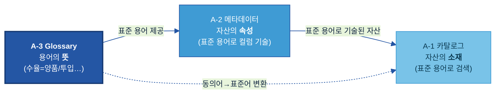
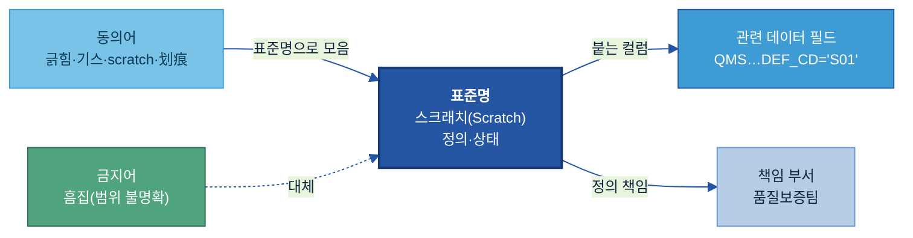
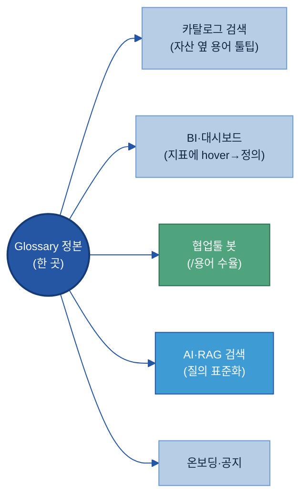

# A-3. 비즈니스 Glossary

## 목차

- [이 가이드가 답하는 5가지 질문](#key-questions)

1. [Why — 왜 필요한가](#why)
   - [1.1 현업 Pain Point](#s11)
   - [1.2 기대 효과](#s12)

2. [What — 무엇을 갖추나 (용어 카드·동의어·유형)](#what)
   - [2.1 비즈니스 Glossary란 + AI-ready Data 체계 내 위치](#s21)
   - [2.2 표준 용어 카드 — 표준 정의 항목](#s22)
   - [2.3 동의어·금지어](#s23)
   - [2.4 연계 정보](#s24)
   - [2.5 주요 관리 유형 (비즈니스 용어 / 지표 기준)](#s25)

3. [When — 어디부터 표준화하나 (우선순위)](#when)
   - [3.1 표준화 대상 선정 기준](#s31)
   - [3.2 우선순위](#s32)

4. [How — 어떻게 준비·운영하나](#how)
   - [4.1 표준 용어 정의 절차](#s41)
   - [4.2 용어 충돌 조정](#s42)
   - [4.3 표준 용어 저장소와 활용 체계](#s43)
   - [4.4 동의어 및 약어 관리](#s44)
   - [4.5 용어 변경 관리](#s45)

5. [Tech Stack — 솔루션 검토](#tech-stack)
   - [5.1 도구 유형](#s51)
   - [5.2 선정 기준](#s52)

6. [Where — 다른 주제와의 관계](#where)

7. [별첨 (Appendix)](#별첨-appendix)
   - [Appendix A. 용어 카드 템플릿 및 예시](#appendix-a)
   - [Appendix B. 두산 도메인 용어 예시집](#appendix-b)
   - [Appendix C. 표준값 목록](#appendix-c)

- [참고자료 (References)](#참고자료-references) · [변경 이력 / 피드백 반영](#변경-이력--피드백-반영)

---

> **예시 표기 안내:** 본 가이드의 표·예시에 나오는 구체 값(용어·수치·코드·부서명 등)은 이해를 돕기 위한 가상 예시이며 실제 데이터가 아니다. 실제 값은 PoC·프로젝트에서 확정한다. 계열사명도 적용 맥락 설명용이다.

> **관련 가이드:** [A-1 데이터 카탈로그](../A-1%20데이터%20카탈로그/A-1%20데이터%20카탈로그.md) · [A-2 메타데이터](../A-2%20메타데이터/A-2%20메타데이터.md) · [B-3 온톨로지](../B-3%20온톨로지/B-3%20온톨로지.md) · [C-2 데이터 품질 관리](../C-2%20데이터%20품질%20관리/C-2%20데이터%20품질%20관리.md)

비즈니스 Glossary는 업무에서 쓰는 용어·약어·동의어를 하나의 표준 정의로 통일해, 사람과 AI가 같은 데이터를 같은 의미로 해석하게 하는 용어 사전이다. 이 가이드는 Glossary가 왜 필요한지(1장), 무엇을 갖추는지(2장), 어디부터 표준화할지(3장), 어떻게 준비·운영하는지(4장)를 설명한다. How(4장)에는 두산전자 결함명 표준화 사례를 함께 실어 전체 흐름을 보여주며, 이어 솔루션 선택(5장)과 인접 주제와의 경계(6장)를 다룬다.

<a id="key-questions"></a>

## 이 가이드가 답하는 5가지 질문

| 질문 | 한 줄 답 | 본문 |
|---|---|---|
| 어떤 용어부터 표준화하나 | AI 검색·해석에 영향이 크고 부서·계열사마다 다르게 쓰는 용어(결함명·수율·공정명 등)부터 표준화한다 | [3장](#when) |
| 표준 용어는 무엇을 적어 정의하나 | 표준명·정의·동의어·금지어·책임 부서·관련 데이터 필드를 용어 카드 한 장에 담는다 | [2.2](#s22) |
| 부서·계열사 간 용어 충돌은 어떻게 푸나 | 같은 말 다른 뜻·다른 말 같은 뜻을 SME·데이터 오너·중앙 조직이 함께 조정·승인한다 | [4.2](#s42) |
| 현장 용어로 물어도 AI가 찾게 하려면 | 동의어를 표준명에 묶어, 입력한 현장 표현을 표준 용어로 바꿔 검색·RAG에 연결한다 | [4.4](#s44) |
| 용어가 바뀌면 어떻게 관리하나 | 등록·변경·폐기·동의어 추가를 버전·승인으로 관리하고 데이터·문서·Prompt 영향을 점검한다 | [4.5](#s45) |

---

<a id="why"></a>

## 1. Why — 왜 필요한가

동일한 데이터를 사용하더라도 조직마다 용어를 다르게 쓰거나, 같은 용어를 서로 다른 의미로 해석하는 경우가 많다. 이러한 차이는 검색·분석·보고 과정에서 혼선을 일으키고 조직 간 데이터 활용의 일관성을 떨어뜨린다. 비즈니스 Glossary는 용어의 정의와 사용 기준을 표준화하여, 동일한 데이터를 동일한 의미로 해석할 수 있는 기반을 제공한다.

<a id="s11"></a>

### 1.1 현업 Pain Point

동일한 데이터를 쓰더라도 용어의 정의와 사용 방식이 조직마다 다르면 검색·분석·보고 과정에서 해석 차이가 생긴다. 제조 현장에서 자주 나타나는 어려움은 다음과 같다.

- **Pain 1 — 같은 개념을 서로 다른 용어로 사용한다**

  현장에서는 동일한 결함을 `긁힘`, `기스`, `스크래치` 등 여러 표현으로 기록하는 경우가 있다. 이 경우 특정 용어만 기준으로 검색하거나 분석하면 관련 데이터가 일부 누락될 수 있다.

- **Pain 2 — 같은 용어가 조직마다 다른 의미로 사용된다**

  예를 들어 `리드타임`은 영업 조직에서는 주문부터 납품까지의 기간을 의미할 수 있지만, 생산 조직에서는 원자재 투입부터 제품 완성까지의 기간을 의미할 수 있다. 동일한 용어를 사용하더라도 정의가 다르면 비교와 분석 결과를 신뢰하기 어렵다.

- **Pain 3 — 같은 지표를 서로 다른 기준으로 계산한다**

  `수율`을 계산할 때 어떤 조직은 재작업 물량을 포함하고, 어떤 조직은 제외할 수 있다. 동일한 KPI를 보고하더라도 계산 기준이 다르면 조직 간 수치 비교가 어려워진다.

- **Pain 4 — 계열사와 글로벌 사업장 간 용어 체계가 다르다**

  국내, 중국, 베트남 사업장이 동일한 공정과 결함을 서로 다른 언어와 약어로 표현하는 경우가 많다. 이러한 차이는 전사 단위 분석과 비교를 어렵게 만드는 요인이 된다.

두산전자의 경우 약어 `SOI`가 문서와 조직에 따라 서로 다른 의미로 사용되면서 실적 데이터 해석에 혼선이 발생한 사례가 있었다. 이후 Glossary에 `SOI = Sales of Income(주간 실적·계획 관리 기준)`을 표준 정의로 등록하고 관련 문서에 동일 기준을 적용하면서 용어 해석을 일관되게 유지할 수 있었다.

이러한 문제의 공통 원인은 데이터 자체가 아니라 용어의 정의와 사용 기준이 일관되지 않다는 점이다. 비즈니스 Glossary는 조직이 사용하는 용어의 의미를 표준화하여 검색, 분석, 보고, AI 활용 과정에서 동일한 기준으로 데이터를 해석할 수 있도록 지원한다.

---

<a id="s12"></a>

### 1.2 기대 효과

용어의 정의와 사용 기준을 표준화하면 검색·보고·AI 활용 전반에서 다음과 같은 효과를 기대할 수 있다.

| 기대 효과 | 내용 |
|---|---|
| 현장 용어 차이로 인한 검색 누락 감소 | 동의어를 표준명에 묶으면 "기스"로 검색해도 "스크래치" 데이터가 함께 나온다. 현장 용어 그대로 질문해도 AI가 표준 용어로 변환해 한 번에 찾는다. |
| 지표 정의 불일치 해소 | "수율"의 계산식·포함 조건이 표준으로 고정되면 어느 팀, 어느 보고서든 같은 정의로 집계해 숫자가 어긋나지 않는다. 보고와 의사결정의 신뢰가 높아진다. |
| AI 응답 기준 통일 | AI Agent가 질의와 답변에서 같은 용어를 같은 의미로 사용한다. AI와 사용자가 동일한 기준으로 용어를 해석한다. |
| 계열사·글로벌 데이터 비교 기반 확보 | 각국·각 계열사 용어를 표준명에 매핑하면 용어 장벽 없이 전사 데이터를 한 기준으로 비교·분석할 수 있다. |

비즈니스 Glossary는 용어 때문에 못 찾던 데이터를 찾게 하고, 보고서마다 다르던 지표 숫자를 통일하며, 글로벌 현장을 하나의 기준으로 잇는다.

---

<a id="what"></a>

## 2. What — 무엇을 갖추나 (용어 카드·동의어·유형)

<a id="s21"></a>

### 2.1 비즈니스 Glossary란 + AI-ready Data 체계 내 위치

비즈니스 Glossary는 조직에서 사용하는 업무 용어, 약어, 동의어를 하나의 표준 의미로 정리한 사전이다. 단어의 뜻을 단순히 설명하는 수준이 아니라, 조직 안에서 해당 용어를 어떤 의미로 사용해야 하는지 공식 기준을 정하는 역할을 수행한다.

같은 회사 안에서도 동일한 용어가 부서마다 다르게 해석되는 경우가 많다. 예를 들어 영업 조직의 "리드타임"은 주문 확정부터 납품 완료까지의 기간을 의미할 수 있지만, 생산 조직의 "리드타임"은 원자재 투입부터 제품 완성까지의 기간을 의미할 수 있다. 또한 `SOI`, `L/T`, `FCST`와 같은 약어는 문서나 조직에 따라 서로 다른 의미로 사용될 수 있다.

비즈니스 Glossary는 이러한 용어 혼선을 줄이기 위해 표준명, 정의, 약어, 동의어, 금지어, 관련 데이터 필드, 책임 부서를 함께 관리한다. 이를 통해 사람은 같은 용어를 같은 의미로 이해하고, AI와 데이터 시스템은 현장 표현을 표준 용어로 해석할 수 있다.

| 현장의 혼선 | Glossary가 정리한 결과 |
|---|---|
| "리드타임"을 영업과 생산이 다르게 사용 | 영업 리드타임 / 생산 리드타임으로 구분 정의 |
| `SOI`가 문서마다 다른 의미로 사용 | `SOI = Sales of Income` 등 적용 범위와 기준 명시 |
| "수율" 계산 기준이 팀마다 다름 | 계산식, 기준 시점, 포함·제외 조건을 표준화 |
| 현장 약어와 공식 용어가 따로 존재 | 약어·동의어를 표준명에 연결 |

예를 들어 `수율`이라는 용어를 Glossary에 등록할 때는 단순히 "생산이 잘된 비율"이라고 쓰는 것이 아니라, `양품 수량 ÷ 투입 수량`, 기준 시점, 재작업 포함 여부, 책임 부서까지 함께 정의해야 한다. 그래야 어느 조직에서 조회하더라도 동일한 기준으로 숫자를 해석할 수 있다.

> **용어 풀이 — Glossary(글로서리):** "용어 사전"을 뜻하는 영어이며, 본 가이드에서는 업무 용어의 표준 정의집을 의미한다.

AI-ready Data 체계에서 Glossary는 "용어의 뜻"을 담당하고, 메타데이터는 "자산의 속성"을 설명하며, 카탈로그는 "데이터의 위치와 활용 정보"를 제공한다. 세 주제는 서로 다른 역할을 수행하지만 동일한 표준 용어 체계를 공유함으로써 일관된 데이터 활용 환경을 만든다.



용어 정의는 **현업 SME(업무 전문가)** 가 제안하고, **중앙 데이터 조직/거버넌스**가 표준으로 확정·관리한다.

| 역할 | Glossary에서 하는 일 |
|---|---|
| **현업 SME / 데이터 오너** | 현장 용어·동의어 제안, 정의 초안 작성, 충돌 시 의견 제시 |
| **데이터 스튜워드 / 중앙 데이터 조직** | 표준 용어 확정, 충돌 조정, 버전·승인 관리 |
| **AI/Data 거버넌스 위원회** | 계열사 간 표준 정책·충돌 조정 최종 승인 |
| **데이터 플랫폼 / IT** | Glossary를 카탈로그·메타·검색에 연동 |

> **용어 풀이 — SME(Subject Matter Expert):** 그 업무를 가장 잘 아는 현업 전문가. 용어의 *실제 뜻*은 SME만 정확히 안다.

<a id="s22"></a>

### 2.2 표준 용어 카드 — 표준 정의 항목

비즈니스 Glossary의 기본 단위는 용어 카드(Term Card)다. 용어 카드에는 표준명과 정의뿐 아니라 동의어, 책임 부서, 관련 데이터 필드 같은 운영 정보를 함께 기록한다. 이러한 정보를 일관된 형식으로 관리해야 조직 전체가 같은 기준으로 용어를 해석하고 활용할 수 있다. 실무에서는 먼저 필수 항목을 정의한 뒤, 필요에 따라 사용 예시나 관련 데이터 필드 같은 보조 정보를 더하는 방식을 권장한다.

| 항목 | 쉬운 의미 | 예시값 | 구분 | 작성 주체 |
|---|---|---|:---:|:---:|
| 표준명 | 회사 공식 용어 | `확정 매출` | 필수 | 스튜워드 |
| 정의 | 한 문장 표준 뜻 | `세금계산서 발행 완료된 납품 건의 매출` | 필수 | 오너 |
| 동의어 | 같은 뜻 현장 표현 | `실적, Sales(영업)` | 필수 | 오너 |
| 책임 부서 | 정의를 책임지는 조직 | `영업기획팀` | 필수 | 오너 |
| 상태 | 승인 단계 | `승인` (검토중/승인/폐기) | 필수 | 스튜워드 |
| 영문명 | 영어 표기 | `Confirmed Sales` | 선택 | 스튜워드 |
| 약어 | 줄임말 | `COGS` | 선택 | 오너 |
| 금지어 | 사용을 지양하는 표현 | `매출액(모호)` | 선택 | 스튜워드 |
| 사용 예시 | 실제 업무에서의 사용 방식 | `"확정 매출 기준 월 마감"` | 선택 | 오너 |
| 관련 데이터 필드 | 이 용어가 사용되는 컬럼 | `SALES.CONFIRMED_AMT` | 선택 | 스튜워드 |

필수 항목(표준명·정의·동의어·책임 부서·상태)만 채워도 용어 카드를 등록할 수 있다. 선택 항목(약어·금지어·관련 데이터 필드 등)은 검색·AI 연계 단계에서 필요해질 때 덧붙인다.

용어 카드는 표준명을 중심에 두고 왼쪽에는 그 용어를 가리키는 현장 표현(동의어)과 쓰지 말 표현(금지어)을, 오른쪽에는 그 용어가 실제로 닿는 데이터 필드와 책임 부서를 연결한 구조다. 왼쪽은 검색·변환을, 오른쪽은 데이터·책임 연계를 담당한다.



> 빈 용어 카드 템플릿과 완성 예시(CCL, 수율)는 Appendix A, 제조업 도메인 용어 예시집은 Appendix B에서 확인할 수 있다.

<a id="s23"></a>

### 2.3 동의어·금지어 (현장 표현과 표준어 연결)

비즈니스 Glossary의 활용 가치는 표준명 자체보다 동의어와 금지어를 체계적으로 관리하여 현장에서 실제 사용하는 용어를 표준명과 연결함으로써 검색과 변환의 정확성을 높이는 데 있다. 동의어는 같은 뜻의 다른 표현을 표준명에 묶어 어떤 말로 물어도 찾을 수 있게 하고, 금지어는 혼동을 일으켜 쓰지 말아야 할 표현을 표시한다.

현장에서 같은 개념을 가리키는 다른 표현은 크게 네 유형으로 나타난다. 어느 유형이든 표준명 하나로 모으고 나머지를 동의어로 등록하는 방식은 동일하다.

| 동의어 유형 | 예 | Glossary 처리 방식 |
|---|---|---|
| 현장 이칭 | 기스·긁힘 → 스크래치 | 현장 표현을 동의어로 등록, 표준명으로 검색 |
| 영문 약어 | L/T → 리드타임 | 약어를 표준명으로 치환하되, **약어도 동의어로 함께 등재**(현장이 약어를 그대로 쓰므로) |
| 다국어 표현 | 划痕(중)·Scratch(영) → 스크래치 | 각국 표현을 표준명에 매핑, 전사 비교 기반 확보 |
| 전·현 표준 | (구)불량코드명 → (신)표준 결함명 | 폐기어는 금지어로 전환하고 신 표준명으로 안내 |

금지어는 모든 옛 표현에 다 붙이는 것이 아니라, 다음 경우에만 지정한다.

- 적용 범위가 불명확한 표현(예: "흠집" — 결함의 종류·범위가 특정되지 않음).
- 한 단어가 여러 뜻으로 섞여 쓰이는 표현(예: "매출액" — 주문·확정·회계 기준이 혼용됨 → "확정 매출"을 쓴다).
- 표준에서 폐기된 옛 용어(대체어를 함께 안내).

<a id="s24"></a>

### 2.4 연계 정보 (데이터 필드·책임 부서)

용어가 어느 데이터 필드에 쓰이고 누가 책임지는지를 연결해야, Glossary가 단순한 사전을 넘어 실제 데이터와 이어진다. 이 두 정보는 표준 용어를 "검색되는 데이터"와 "정의를 고칠 수 있는 사람"에 각각 연결한다.

- **관련 데이터 필드** — 그 용어가 실제로 붙는 컬럼·테이블. [A-2 메타데이터](../A-2%20메타데이터/A-2%20메타데이터.md)의 비즈니스 메타데이터가 이 표준 용어를 인용한다. 예를 들어 표준 용어 `수율`을 `PROD.YIELD_RATE` 컬럼에 연결해 두면, 그 컬럼을 조회할 때 "양품 수량 ÷ 투입 수량(재작업 제외)"이라는 표준 정의가 함께 따라온다.
- **책임 부서** — 정의의 정확성을 책임지는 조직으로, 충돌이나 변경이 생길 때 의사결정 주체가 된다. 예를 들어 `수율`의 정의 변경은 생산기술팀이 승인하며, 정의가 바뀌면 그 용어를 인용한 컬럼·보고서로 변경이 전파된다.

연계 정보가 비면 Glossary는 "읽고 끝나는 사전"에 머문다. 관련 필드와 책임 부서까지 채워야 용어 변경이 데이터·보고서로 이어지고, 정의를 둘러싼 책임 소재가 분명해진다.

<a id="s25"></a>

### 2.5 주요 관리 유형 (비즈니스 용어 / 지표 기준)

Glossary에서 관리하는 항목은 크게 비즈니스 용어와 지표 기준 두 유형으로 구분할 수 있다 — 지표는 계산식·조건까지 적어야 숫자가 일치한다.

| 유형 | 표준화 항목 | 핵심 추가 항목 | 예시 |
|---|---|---|---|
| **비즈니스 용어** | 부서마다 다르게 해석되는 핵심 용어의 뜻 | 정의·동의어·금지어 | 수주, 납기, 부진재고, SOP |
| **지표 기준** | KPI가 어떻게 계산·집계되는지 | **계산식·기준 시점·포함/제외 조건** | 수율 = 양품/투입(재작업 제외), 리드타임 = 주문확정~납품완료 |

> **지표 기준 예시 — 수율:** `수율 = 양품 수량 ÷ 투입 수량`, *기준 시점:* 월 마감, *포함/제외:* 재작업 양품 제외. 이 세 가지가 없으면 같은 "수율"도 팀마다 다른 숫자가 된다(§1.1 Pain 3).

---

<a id="when"></a>

## 3. When — 어디부터 표준화하나 (우선순위)

<a id="s31"></a>

### 3.1 표준화 대상 선정 기준

모든 용어를 동시에 표준화하기는 현실적으로 어렵다. 따라서 업무 영향도, AI 활용도, 용어 혼선 정도를 기준으로 우선순위를 정한다.

| 평가 항목 | 판단 질문 | 우선 적용 예시 |
|------------|------------|------------|
| 업무 영향도 | KPI, 보고서, 의사결정에 직접 사용되는가 | 수율, 원가율, 리드타임 |
| AI 활용도 | 검색, Agent, 분석 모델에서 자주 사용되는가 | 결함명, 공정명, 고객 불만 유형 |
| 혼선 정도 | 조직별 정의가 다른가 | 수율, SOI, 리드타임 |
| 활용 범위 | 여러 조직이 공통으로 사용하는가 | 매출, 품질, 생산 관련 용어 |
| 변경 영향도 | 변경 시 시스템과 보고서 영향이 큰가 | KPI 용어, 품질 판정 기준 |

일반적으로 KPI, 품질 지표, 결함명과 같이 조직 전체에서 활용되는 용어를 우선 표준화한다.

---

<a id="s32"></a>

### 3.2 우선순위

AI 검색 영향과 용어 혼선 정도가 높은 용어를 우선순위로 표준화한다.

| 우선순위 | 기준 | 예 |
|---|---|---|
| 1순위 | AI 검색·집계에 자주 쓰이고 + 부서마다 다르게 씀 | 결함명, 수율, 매출 |
| 2순위 | 약어·현장식 표현이 많아 해석이 갈림 | SOI, L/T, CCL |
| 3순위 | 계열사·글로벌 간 표현이 다름 | 다국어 결함명·공정명 |
| 후순위 | 한 부서만 쓰고 혼선이 없는 용어 | 부서 내부 약속어 |

> **두산전자 예시:** "결함명·수율(검사·분석 AI가 매일 사용하는 용어) → SOI·L/T(약어) → 글로벌 현장 다국어" 순으로 표준화 범위를 확대한다.

---

<a id="how"></a>

## 4. How — 어떻게 준비·운영하나

비즈니스 Glossary 구축은 현장에서 쓰는 표현을 모아 표준으로 확정하고, 한 곳에 등록해 전사로 퍼뜨린 뒤 변화에 맞춰 계속 갱신하는 흐름으로 이뤄진다. 본 장에서는 두산전자 품질 조직의 결함명 표준화를 예로 들어 이 과정을 따라간다. 같은 결함이 `긁힘`·`기스`·`scratch`로 흩어져 기록되어 검색이 누락되고 집계 기준이 흔들리던 상황을, 하나의 표준 용어로 묶어 가는 과정이다.

표준화는 용어 수집부터 운영까지 다음 여덟 단계로 진행하며, 각 단계는 아래 절에서 자세히 다룬다.


| 단계 | 핵심 | 산출물 | 관련 절 |
|---|---|---|---|
| ① 용어 수집 | 현장 표현 모으기 | 현장 용어 목록 | §4.1 |
| ② 용어 정리 및 합의 | 동의어·표준명 합의 | 표준명 후보·동의어 그룹 | §4.1 |
| ③ 용어 카드 작성 | 정의·동의어·필드 등록 | 용어 카드 | §4.1, Appendix A |
| ④ 충돌 조정 | 중복·모호 용어 정리 | 승인된 표준 정의 | §4.2 |
| ⑤ 등록 및 게시 | 저장소 등록·검수 | 표준 용어집 | §4.3 |
| ⑥ 전사 공유 | 카탈로그·QMS·검색 반영 | 공통 용어 체계 적용 | §4.3 |
| ⑦ 검색 연계 | 동의어·약어 연결 | 검색·AI 활용 반영 | §4.4 |
| ⑧ 운영 및 유지보수 | 신규·변경 관리 | 최신 Glossary 유지 | §4.5 |

#### 용어 카드 예시

```text
표준명 : 스크래치 (Scratch)
상태 : 승인

정의 : 동박 표면이 외부 접촉으로 인해 발생한 선형 결함

동의어 : 긁힘, 기스, scratch, 划痕
금지어 : 흠집(범위 불명확)

관련 필드 : QMS.INSP_RESULT.DEF_CD = 'S01'
책임 부서 : 품질보증팀
```

이와 같이 정의된 용어 카드는 검색, 데이터 분석, AI 서비스가 동일한 결함을 동일한 의미로 해석하기 위한 기준으로 활용된다.

표준화를 마치면 데이터 활용이 다음과 같이 달라진다.

| 적용 전 | 적용 후 |
|---|---|
| "스크래치 불량" 검색 시 "기스"로 기록된 데이터 누락 | 동의어가 표준 용어에 연결되어 전체 검색 가능 |
| 현장 표현마다 별도 집계 | 표준 결함 기준으로 통합 집계 |
| 글로벌 사업장별 다른 표현 사용 | 표준 용어에 매핑하여 통합 관리 |
| 신규 분석자가 결함 코드 의미를 별도 확인 | 용어 정의를 통해 즉시 확인 가능 |

<a id="s41"></a>

### 4.1 표준 용어 정의 절차

비즈니스 Glossary는 새로운 용어를 만드는 작업이 아니라, 현업에서 이미 쓰고 있는 용어를 수집해 표준 기준으로 정리하는 과정이다. 따라서 용어 표준화는 현장 표현을 수집하고, 업무 전문가가 의미를 검토한 뒤, 조직 차원의 표준 용어로 확정하는 순서로 진행한다.

#### i) 용어 수집

표준 용어는 현업에서 실제 사용하는 표현을 기반으로 정의한다. MES·QMS와 같은 업무 시스템의 코드값뿐 아니라 작업일지, 품질 보고서, 대시보드, 회의 자료에서 쓰이는 용어를 함께 수집한다.

| 수집처 | 수집 대상 |
|---|---|
| MES/QMS 코드값·드롭다운 목록 | 결함명, 공정명, 검사항목 |
| 현장 작업일지·검사 보고서 | 현장 약어, 비공식 표현 |
| 기존 용어집·위키 | 기존 정의 및 용어 표준 |
| BI 대시보드·보고서 | KPI 명칭 및 집계 기준 |
| 이메일·회의록 | 영업·고객 관련 업무 용어 |
| SME 인터뷰 | 현업에서 사용하는 실제 의미 |

#### ii) 용어 검토 및 합의

수집된 용어는 도메인별 SME와 함께 검토한다. 이 과정에서 같은 의미를 가진 용어는 하나의 표준명으로 통합하고, 같은 용어가 여러 의미로 쓰이는 경우에는 구분 기준을 정한다. 합의 결과는 표준명·동의어·정의 초안 형태로 정리한다.

같은 단어가 두 가지 의미로 쓰일 때는 다음 순서로 판단한다. ① 두 의미가 업무상 모두 자주 쓰이면 수식어를 붙여 둘로 분리한다(예: "리드타임" → 영업 리드타임 / 생산 리드타임). ② 한쪽만 표준으로 충분하면 그 의미를 표준으로 확정하고 다른 쪽 표현은 폐기하거나 별도 용어로 떼어 낸다. 분리할지 하나로 확정할지는 책임 부서와 거버넌스가 함께 정한다(상세는 §4.2).

#### iii) 표준 정의 확정

합의된 용어는 용어 카드 형식으로 정리하고 검토·승인 절차를 거쳐 표준 용어로 확정한다. 정의는 가능한 한 구체적으로 작성한다. 아래 Before 열과 같은 정의는 사람마다 다르게 읽혀 검색·집계 기준이 흔들리므로 피한다 — 흔한 나쁜 패턴은 ① 적용 범위가 불명확("걸리는 시간" — 무엇부터 무엇까지인지 없음), ② 주관적 표현("생산이 잘된 정도" — 측정할 수 없음), ③ 지표인데 계산식이 없음(어떻게 집계하는지 없음)이다. KPI·지표는 계산식과 적용 기준(기준 시점·포함/제외)을 반드시 함께 적는다.

| 항목 | Before (나쁜 정의 패턴) | After | 개선 이유 |
|---|---|---|---|
| 수율 | 생산이 잘된 정도 *(주관적·계산식 없음)* | 양품 수량 ÷ 투입 수량 (재작업 제외, 월 마감 기준) | 계산 기준 명확화 |
| 리드타임 | 걸리는 시간 *(범위 불명확)* | 주문 확정일 ~ 납품 완료일 (영업 기준) | 적용 범위 명확화 |
| 부진재고 | 오래된 재고 *(기준 없음)* | 최근 12개월 출고 이력이 없는 재고 | 판단 기준 명확화 |

해석이 달라질 수 있는 표현보다는 측정 기준과 적용 범위를 명확히 기술하는 것이 중요하다.

---

<a id="s42"></a>

### 4.2 용어 충돌 조정

용어 충돌은 크게 두 가지 유형으로 구분된다. 같은 말을 다른 의미로 사용하는 동음이의어와, 다른 표현을 같은 의미로 사용하는 동의어이다. 충돌 발생 시 SME, 데이터 오너, 중앙 데이터 조직이 함께 검토하고 표준 용어를 확정한다.

| 충돌 유형 | 처리 방식 | 예 |
|---|---|---|
| 동음이의어 | 수식어를 붙여 **구분 정의** 또는 하나로 표준 확정 | "리드타임" → 영업/생산 리드타임으로 분리 |
| 동의어 | 표준명 하나로 **통합**, 나머지는 동의어로 | "긁힘·기스" → 스크래치로 통합 |

조정 절차: ① SME가 충돌 제기 → ② 관련 부서·오너 의견 수렴 → ③ 중앙 데이터 조직이 표준안 결정 → ④ 거버넌스 승인 → ⑤ Glossary 반영·공지. 계열사를 가로지르는 충돌은 거버넌스 위원회가 최종 조정한다.

조정 예시 — "리드타임" 충돌. 영업은 "리드타임"을 주문~납품으로, 생산은 투입~완성으로 쓰고 있었다. 두 의미가 모두 KPI·보고서에서 활발히 쓰여 어느 한쪽을 폐기할 수 없었으므로, 하나로 합치지 않고 수식어를 붙여 두 표준 용어로 분리했다. 산출된 두 용어 카드는 다음과 같다.

| 표준명 | 정의 | 책임 부서 |
|---|---|---|
| 영업 리드타임 | 주문 확정일 ~ 납품 완료일 | 영업기획팀 |
| 생산 리드타임 | 원자재 투입일 ~ 제품 완성일 | 생산기술팀 |

기존에 "리드타임"만 쓰던 데이터·보고서는 어느 쪽을 가리키는지 책임 부서가 확인해 둘 중 하나로 재연결하고, 맨 단어 "리드타임"은 어느 뜻인지 모호하므로 금지어로 둔다.

<a id="s43"></a>

### 4.3 표준 용어 저장소와 활용 체계

비즈니스 Glossary는 단일 저장소를 기준으로 운영해야 한다.
동일한 용어가 여러 파일과 시스템에 분산되어 관리되면 서로 다른 정의가 사용될 수 있으며, 시간이 지나면서 용어 기준이 불일치할 가능성이 높아진다.
따라서 표준 용어는 하나의 저장소에서 관리하고, 카탈로그, 메타데이터, BI, AI 서비스가 동일한 용어 체계를 참조하도록 구성하는 것이 바람직하다.

**i) 표준 용어 저장소** 표준 용어는 단일 저장소를 기준으로 관리한다.

| 저장 위치 | 적합 상황 | 비고 |
|---|---|---|
| 카탈로그·거버넌스 솔루션의 **Glossary 모듈** (Collibra[\[1\]](#ref1)·Purview[\[2\]](#ref2)·Atlan[\[3\]](#ref3)) | 본격 운영 | 검색·메타·승인과 자동 연계 |
| **플랫폼 내장** (Databricks Unity Catalog[\[4\]](#ref4)) | 데이터플랫폼 중심 | 데이터와 같은 곳에서 관리 |
| **위키·공유 시트** | 파일럿·소규모 시작 | 단, *한 곳만*. 나중에 솔루션으로 이관 |

**ii) 등록 및 게시** ① 소량은 UI에서 직접 입력, ② **대량은 엑셀/CSV로 모아 일괄 import**(엑셀로 작성 → 검수 → 업로드), ③ 자동화는 API로 등록. 업로드 후 검수·승인(§4.1 iii)을 거쳐 "게시"된다. 게시 검수에서는 표준명·정의·책임 부서·동의어가 채워진 용어 카드만 통과시킨다 — 이 네 항목이 비면 검색·책임 연계가 작동하지 않으므로 게시하지 않는다.

**iii) 활용 채널 연계** 하나의 비즈니스 Glossary 정본을 등록하면 아래 채널에 자동 노출되도록 연결한다.



- **전사 읽기 권한:** 임직원 누구나 검색·열람(편집은 SME/스튜워드만).
- **카탈로그·메타 통합:** 자산·컬럼 옆에 표준 용어 정의가 툴팁으로 뜬다([A-2](../A-2%20메타데이터/A-2%20메타데이터.md) 비즈 메타가 용어를 인용).
- **BI·대시보드:** 지표 위에 마우스를 올리면 표준 정의·계산식이 보인다("이 수율은 재작업 제외").
- **협업툴(Teams/Slack) 봇:** "/용어 SOI" 하면 정의를 즉시 반환.
- **온보딩·정기 공지:** 신규 입사자 교육 자료에 포함, 용어 추가·변경 시 공지.

> **두산전자 예시:** 신입 분석 담당자는 선임에게 묻지 않아도 대시보드의 "원가율"에 hover하면 같은 기준으로 해석한 매출 대비 원가 비율(표준원가 기준) 정의를 확인할 수 있다.

---

<a id="s44"></a>

### 4.4 동의어 및 약어 관리

현업에서는 같은 개념을 다양한 표현으로 쓰는 경우가 많다. 비즈니스 Glossary는 이러한 표현을 표준 용어와 연결하여, 검색·분석·AI 활용 과정에서 동일한 의미로 해석할 수 있도록 한다.

**동의어 활용 과정:**


| 단계 | 설명 |
|---|---|
| 사용자 입력 | 현장 표현 그대로 검색 (예: "기스 불량률") |
| ① 동의어 사전 조회 | 현장 표현을 표준 용어에 매핑 (기스 → 스크래치, S01) |
| ② 질의 확장 | 입력한 표현을 표준 용어 기준으로 치환 |
| ③ 데이터 검색 | 표준 용어를 기준으로 관련 데이터 조회 |

같은 동의어 매핑 데이터는 카탈로그 검색뿐 아니라 AI 활용 전반에서 쓰인다. RAG 검색에서는 사용자가 현장 표현으로 물어도 표준 용어로 바꿔 관련 문서를 찾고, Prompt에서는 표준 정의를 함께 넣어 AI가 같은 기준으로 답하게 하며, Agent는 현장 질의를 표준 용어로 변환해 데이터·도구를 호출한다. 여기서 준비하는 것은 변환 엔진이 아니라 그 엔진들이 공통으로 참조하는 동의어·표준어 매핑 데이터다.

<a id="s45"></a>

### 4.5 용어 변경 관리

신규·변경·폐기·동의어 추가를 **버전·승인**으로 관리하고, 변경이 데이터·문서·Prompt에 미치는 **영향을 점검**한다.

| 변경 유형 | 처리 | 영향 점검 |
|---|---|---|
| 신규 용어 등록 | 제안→검토→승인 | 기존 동의어와 중복 여부 |
| 기존 용어 변경 | 버전 올림, 이력 보존 | 관련 데이터 필드·메타·Prompt 영향 |
| 폐기 용어 지정 | 금지어로 전환·대체어 안내 | 폐기어를 쓰는 데이터·문서 식별 |
| 동의어 추가 | 표준명에 연결 | 검색 변환(§4.4)에 즉시 반영 |

버전은 변경의 무게로 나눈다. 동의어 추가나 설명 보완처럼 뜻이 바뀌지 않는 변경은 마이너 버전으로 올리고, 정의·계산식·적용 범위가 바뀌어 기존 집계·검색 결과가 달라지는 변경은 메이저 버전으로 올린다. 공지 범위도 같은 기준으로 나눈다 — 마이너 변경은 그 용어가 쓰이는 시스템·보고서의 오너에게만 알리고, 숫자나 의미가 바뀌는 메이저 변경은 영향을 받는 전사 사용자에게 공지한다.

---

<a id="tech-stack"></a>

## 5. Tech Stack — 솔루션 검토

> **2층 연결:** 솔루션을 묶어서 평가·선정하려면 → [Tech Stack 비교 정본](../../Tech%20Player/01%20Tech%20Stack%20비교%20(솔루션×주제).md). 아래는 *Glossary 관점*의 기능 비교(1층)다.

<a id="s51"></a>

### 5.1 도구 유형

단일 데이터 플랫폼(특히 Databricks) 환경이면 **Databricks Unity Catalog**[\[4\]](#ref4)가 1순위 후보다. 카탈로그([A-1](../A-1%20데이터%20카탈로그/A-1%20데이터%20카탈로그.md))·메타데이터([A-2](../A-2%20메타데이터/A-2%20메타데이터.md))와 같은 곳에서 용어집을 함께 관리해 한 제품으로 묶이기 때문이다([2층 정본의 통합 거버넌스 묶음](../../Tech%20Player/01%20Tech%20Stack%20비교%20(솔루션×주제).md) 참조). 다만 Unity Catalog의 네이티브 용어집(Glossary)·동의어 기능은 아직 Preview 단계이므로, 용어집·동의어 매핑이 핵심이면 전용 거버넌스(Collibra·Purview·Atlan)를 함께 검토하고 PoC로 확인한다.

규모와 성숙도를 고려하여 카탈로그·거버넌스 내장 Glossary, 플랫폼 내장, 경량 시작(위키·스프레드시트) 중 적합한 방식을 선택한다.

| 유형 | 강점 | 유의점 | 예 |
|---|---|---|---|
| 카탈로그·거버넌스 내장 Glossary | 메타·검색 자동 연계, 승인 워크플로 | 도입 비용 | Collibra[\[1\]](#ref1), Microsoft Purview[\[2\]](#ref2), Atlan[\[3\]](#ref3) |
| 플랫폼 내장 | 플랫폼 데이터와 즉시 연결 | 플랫폼 종속 | Databricks Unity Catalog[\[4\]](#ref4) |
| 오픈소스 | 라이선스 비용 없음, 자체 운영 가능 | 직접 구축·운영 부담 | DataHub[\[5\]](#ref5), OpenMetadata[\[6\]](#ref6) |
| 경량 시작 | 빠르고 저비용 | 검색 자동연계·버전관리 약함 | 위키·스프레드시트 |

<a id="s52"></a>

### 5.2 선정 기준

솔루션을 고를 때는 다음 네 가지를 본다.

| 평가 축 | 평가 항목 |
|---|---|
| 동의어·금지어 매핑 | 표준명↔현장어 연결을 지원하나 |
| 검색 연계 | 카탈로그·RAG 검색에 표준 용어가 연결되나 |
| 현업 편집성 | SME가 직접 제안·편집하기 쉬운가 |
| 승인 워크플로 | 제안→검토→승인→버전 관리가 되나 |

> 기능·가격은 변동되므로 도입 검토 시 공식 문서·PoC로 확인한다.

---

<a id="where"></a>

## 6. Where — 다른 주제와의 관계

비즈니스 Glossary는 용어의 표준 뜻을 정하는 데 집중하고, 인접 주제와는 다음과 같이 역할을 나눈다.

| 인접 주제 | A-3와의 경계 |
|---|---|
| [A-2 메타데이터](../A-2%20메타데이터/A-2%20메타데이터.md) | Glossary=용어의 표준 뜻 / A-2=그 용어로 컬럼 속성 기술. 비즈 메타가 Glossary 용어를 인용 |
| [A-1 카탈로그](../A-1%20데이터%20카탈로그/A-1%20데이터%20카탈로그.md) | Glossary=검색어 표준화 / A-1=자산 검색. 동의어가 카탈로그 검색을 넓힘 |
| [B-3 온톨로지](../B-3%20온톨로지/B-3%20온톨로지.md) | Glossary=단어의 뜻(결함=…) / B-3=개념 간 관계(결함↔공정↔원인) |
| [C-2 품질](../C-2%20데이터%20품질%20관리/C-2%20데이터%20품질%20관리.md) | Glossary=지표 정의(수율=…) / C-2=그 지표로 품질 측정 |

---

## 별첨 (Appendix)

<a id="appendix-a"></a>

### [Appendix A] 용어 카드 템플릿 및 예시

**가. 빈 용어 카드 (복사해서 채우기)**

```
════════════════════════════════════════════════════
 표준명     : __________            (스튜워드)
 영문명     : __________            (스튜워드)
 약어       : __________            (오너)
 정의       : __________ (한 문장, 측정 가능하게)  (오너)
 동의어     : __________ (현장 표현 모두)  (오너)
 금지어     : __________ (쓰지 말 표현)   (스튜워드)
 사용 예시  : __________            (오너)
 유형       : 비즈니스 용어 / 지표 기준
 (지표면) 계산식·기준시점·포함제외 : __________   (오너)
 관련 필드  : __________ (→ A-2 메타)   (스튜워드)
 책임 부서  : __________            (오너)
 상태       : 검토중 / 승인 / 폐기    (스튜워드)
════════════════════════════════════════════════════
```

**나. 완성 예시 2건 (두산전자)**

```
[비즈니스 용어]
 표준명 : CCL (동박적층판)   영문 : Copper Clad Laminate
 정의   : PCB 핵심 소재로, 동박(Copper Foil)을 절연층에 적층한 판형 소재
 동의어 : 동박적층판, 적층판        금지어 : (없음)
 관련 필드: PROD.PRODUCT_TYPE='CCL'   책임 부서: 제품기획팀   상태: 승인
────────────────────────────────────────────────────
[지표 기준]
 표준명 : 수율   영문 : Yield Rate
 정의   : 투입 대비 양품 비율
 계산식 : 양품 수량 ÷ 투입 수량   기준시점: 월 마감   포함/제외: 재작업 양품 제외
 동의어 : Yield, 양품률          금지어 : 가동률(다른 개념)
 관련 필드: PROD.YIELD_RATE   책임 부서: 생산기술팀   상태: 승인
```

<a id="appendix-b"></a>

### [Appendix B] 두산 도메인 용어 예시집 (엑셀 「Glossary 작성 가이드」 흡수)

표준화 착수 시 참고할 제조·영업·원가 도메인 실제 용어. (전체 표준 사전은 솔루션/외부 시트로 관리)

| 구분 | 용어 | 표준 뜻 |
|---|---|---|
| 소재 | CCL | Copper Clad Laminate, 동박적층판. PCB 핵심 소재 |
| 소재 | Copper Foil | 동박. CCL·PCB 제조에 쓰는 구리 필름 |
| 소재 | Substrate | 기판. 반도체·전자 소재의 기반 판형 소재 |
| 소재 | Glass Fabric | 유리섬유. CCL 절연층 보강재 |
| 소재 | HVLP | Very Low Profile, 동박 표면 프로파일 등급(예: HVLP4) |
| 소재 | Wafer / PCB | 반도체 제조 기반 원형 실리콘 기판 / 인쇄회로기판(Printed Circuit Board) |
| 소재 | PCIe / HBM | 고속 인터페이스 규격(PCI Express) / 고대역폭 메모리(High Bandwidth Memory) |
| 영업 | PO / PO No. / 발주일 | Purchase Order(공식 발주 문서) / 발주 식별 번호 / 고객이 주문(PO)을 확정한 날짜 |
| 영업 | 수주 / 납품 / 납기 | 주문 수령(Order intake) / 인도 완료(Delivery) / 납품 기한 |
| 영업 | L/T | Lead Time, 주문 후 납품까지 소요 시간 |
| 영업 | MOQ / RFQ | 최소 발주 수량 / 견적 요청 |
| 계약 | LTSA / MPA | 장기 공급 계약 / 구매 기본 계약 |
| 품질 | FQC / 수율 | 최종 품질 검사 / 투입 대비 양품 비율 |
| 문서 | TDS | Technical Data Sheet, 제품 기술 사양 문서 |
| 생산 | SOP / BOM | 양산 개시(Start of Production) / 제품 구성 자재 목록 |
| 검증 | EVT / DVT | Engineering / Design Validation Test |
| 원가 | 표준원가 / 실제원가 / 원가율 | 계획 기준 원가 / 실제 발생 원가 / 매출 대비 원가 비율 |
| 가격 | 단가 / ASP | Unit Price / Average Selling Price(평균 판매가) |
| 계획 | FCST / AOP / VS Plan | 수요·매출 예측 / 연간 사업 계획 / 계획 대비 실적 차이 |
| 분류 | SOI | Sales of Income, 내부 매출/사업 분류 기준(주간 보고 등) |

<a id="appendix-c"></a>

### [Appendix C] 표준값 목록

| 항목 | 고르는 값 |
|---|---|
| 용어 상태 | `검토중 / 승인 / 폐기` |
| 용어 유형 | `비즈니스 용어 / 지표 기준` |
| 도메인 | `품질 / 생산 / 영업 / 원가 / 구매 / 소재` |

---

<a id="참고자료-references"></a>

## 참고자료 (References)

> 도구의 기능·지원 범위·가격은 변동되므로 도입 검토 시 공식 문서·PoC로 확인한다.

**도구·플랫폼**

<a id="ref1"></a>**[1]** Collibra — Business Glossary & Data Governance Platform — <https://www.collibra.com>

<a id="ref2"></a>**[2]** Microsoft Purview — Unified Data Governance (Azure) — <https://learn.microsoft.com/azure/purview/>

<a id="ref3"></a>**[3]** Atlan — Modern Data Catalog & Glossary — <https://atlan.com>

<a id="ref4"></a>**[4]** Databricks Unity Catalog — Data & AI Governance — <https://www.databricks.com/product/unity-catalog>

<a id="ref5"></a>**[5]** DataHub — Open-Source Metadata Platform & Glossary — <https://datahub.io>

<a id="ref6"></a>**[6]** OpenMetadata — Open Standard for Metadata & Glossary — <https://open-metadata.org>

**입력 자료**

- 두산 「Meta Tag 운영 가이드(Template)」 — Glossary 개념·유형, 도메인 용어 예시(`기존 매뉴얼 작성본/`)

---

## 변경 이력 / 피드백 반영

| 일자 | 버전 | 변경 내용 | 반영 위치 |
|------|------|-----------|-----------|
| 2026-06-19 | v0.1 | 초안 작성 — 전체 목차 A-3 9섹션 골격 위에 두산 엑셀 Glossary(3.5.1 개념·2유형, 도메인 용어 예시집) 흡수. 「현업 실행 키트」 5장치 적용(㉠ §3.1 용어 카드, ㉡ §7.1 Before→After, ㉢ [Appendix C], ㉣ [Appendix A] 빈템플릿+완성예시, [Appendix B] 도메인 용어집). A-2 메타데이터·B-3 온톨로지와 경계 명시. 웹 리서치 없이 기존 스토리라인 기반 + 엑셀 보완. KQ 5개 전부 커버 | 전체 |
| 2026-06-19 | v0.2 | **고객 피드백 — "와닿는 실무 이야기 보강"** 반영. §7 전면 심화: ① §7.1 용어 수집처(MES 코드값·작업일지·BI 라벨·SME 워크숍)·합의 과정, ② §7.3 신설 — **어디에 두고 모두가 보게 하나**(단일 정본 저장소·엑셀 일괄 업로드·전사 권한·검색/BI/챗봇/온보딩 배포 + 다이어그램), ③ §7.4 심화 — **현장 약어 그대로 써도 자동 변환**(동의어 매핑→질의 확장 4단계 + 다이어그램, "빵꾸→핀홀" 예시, 솔루션 Synonym 기능으로 작동/데이터 준비 관점). §7.4→7.5로 운영 이동, KQ4/KQ5 박스·앵커 갱신 | §7 |
| 2026-06-19 | v0.4 | **출처 검증 패스 + 각주 추가** — 도구 공식 페이지(Collibra·Purview·Atlan·Databricks Unity Catalog)·표준을 web_fetch로 실검증(모두 라이브). §6.1 Glossary 모듈·§7.4 동의어 변환 문장에 각주, 문서 끝 「각주(출처)」 절 신설(검증일·"세부 기능은 PoC 확인" 명기) | §6.1·§7.4·각주 |
| 2026-06-19 | v0.3 | **고객 피드백 — "단일 시나리오로 구성 설명이 더 실천적"** 반영(하이브리드 채택). §5를 '결함명 표준화' **end-to-end 8단계 시나리오**로 전면 교체 — 상황→적용전후→8단계 표(각 단계 산출물 + §7.x 링크)+흐름 다이어그램+실제 용어 카드 1장. 흩어진 예시를 한 사례(기스/빵꾸→스크래치/핀홀)로 수렴, worked example 역할 강화. 주제형 §7 절은 레퍼런스로 유지 | §5 |
| 2026-06-19 | v0.5 | **고도화 로드맵 새 표준 반영**(공통 규칙 개정) — §9 제목 `성과 지표·고도화 로드맵`, §9.2 산문 「고도화」를 **성숙도 단계 사다리**(Lv1~Lv4: 진단 신호+다음 한 걸음 표)로 교체, §9.3 **미래 AI 자동화 전망** 신설. ToC 앵커 동기화 | §9 |
| 2026-06-19 | v0.5 | **점검·보강 패스(외과적)** — ① §7.4 핵심 질문 박스 문구가 옛 KQ4("AI 활용 체계와 어떻게 잇나")로 남아 상단 질문표("현장 용어 그대로 써도 변환되게")와 어긋난 것 수정, ② §7.1 금지표현 주석의 A-2 링크가 잘못된 앵커(`#sec74`=A-2 플랫폼매핑)로 가던 것 → A-2 "잘 쓴 예 vs 못 쓴 예"로 정정, ③ §5 8단계 표의 방법상세 링크 4개(①②⑤⑥)가 모두 §7 최상단으로 떨어지던 것 → §7.1·§7.3 앵커(`sec71`·`sec73store`) 신설해 해당 소절로 연결, ④ §1.2 체계도 중간 화살표 라벨("속성 노출"→"표준 용어로 기술된 자산")을 의미 또렷하게 | §1.2·§5·§7.1·§7.4 |
| 2026-06-22 | v0.6 | 문체 표준화(0622 작업지시) — 이모지 전량 제거·요약/정의 박스를 본문 문단으로 흡수·표 작성주체 아이콘을 자동/오너/보안 텍스트로 교체·핵심질문 안내의 물음표 이모지 제거. 내용·구조·예시·링크 불변. | 전체 |
| 2026-06-24 | v0.7 | 신형식 개정 — 개요 섹션을 What 2.1로 흡수, 솔루션을 Tech Stack으로, 성과 지표·고도화 로드맵 섹션 삭제(비-C 주제), 영문 축 제목 적용. | 전체 |
| 2026-06-25 | v0.9 | **고객 피드백(A-3 작업노트 0625, Baul) 반영** — 용어 표현 통일("Glossary"→"비즈니스 Glossary"), 소제목·표머리글 명사형 정리(2.1·2.3·2.5·5.2·7), §3 구조 정리(중복된 '표준화 대상 용어' 삭제, 선정 기준을 우선순위 앞으로 이동), §4.3 다이어그램 단계명을 표와 일치, §6.2 동음이의어/동의어 표현 정리, §6.3·§6.4 문장 다듬기 및 동의어 흐름 다이어그램↔표 단계명 일치. (작업노트의 §9.2·§9.3 항목은 해당 섹션이 v0.7에서 이미 삭제되어 미해당) | §2~§7 |
| 2026-06-26 | v0.11 | **예시 시나리오 독립 섹션 제거 — How로 흡수(B-1·B-3 구조 정렬)** — 별도 §4 예시 시나리오를 없애고 그 내용(결함명 표준화 8단계 흐름·다이어그램·적용 전후·용어 카드 예시)을 How 도입부로 흡수. How를 Tech Stack 앞으로 이동해 1 Why·2 What·3 When·4 How·5 Tech Stack·6 Where로 재배열(B-1과 동일). ToC·앵커·교차참조(§6.x→§4.x) 동기화. | 전체 |
| 2026-06-25 | v0.10 | **가독성 다듬기(B-1·B-3 문체 정렬)** — 상단에 문서 개요 문단·「예시 표기 안내」 추가(정의 블록인용은 개요로 흡수), 끊긴 한 문장 문단들을 흐르는 문단으로 합침(§1·§2.2·§3.1·§4.1·§6.1), §1.2 기대효과를 굵은 번호 소제목+"자회사 입장에서" 요약박스 → 도입문장+표+평문 마무리로 교체, §2.3·§2.4 단편 불릿을 선언형으로, §4.2·§4.3·§5.2·§7 표·다이어그램 앞 도입 문장 추가. 내용·구조·수치·링크 불변. | 전체 |
| 2026-06-26 | v0.12 | 형식 표준(B-1·B-3) 정렬 — 참고자료 각주식 변환(`[^footnote]`→`[\[N\]](#refN)` + `## 참고자료` 정리), 목차 앵커를 B-3식 깔끔한 id(`#why·#what·#when·#how·#tech-stack·#where`)로 정비, 각 섹션 헤더 위 `<a id="…"></a>` 명시 앵커 삽입. frontmatter version 0.12로 갱신. | 전체 |
| 2026-06-26 | v0.13 | **콘텐츠 보강** — 동의어/금지어 심화(§2.3 4유형 소형 표·금지어 지정 기준), How 절차 밀도(§4.1 ii·iii 판단 흐름·Before 나쁜 패턴 강화), 용어 카드 구조도 다이어그램(§2.2), 용어 충돌 조정 계열사 케이스(§4.2 영업/생산 리드타임), KQ4 AI연계 보강(§4.4 RAG·Prompt·Agent), 변경 관리 버전 기준(§4.5 마이너/메이저·공지 범위), 중복 트림(§2.1 정의 반복·§4 8단계 표 키워드화), 표 보완(§2.2 필수만 등록·§4.3 게시 검수·§5.1 오픈소스 행 DataHub/OpenMetadata). | §2·§4·§5 |
| 2026-06-26 | v0.14 | 관계 서술 중복 제거 — Why(§1.1·§1.2)에서 A-2 메타데이터와 비교하던 문장 삭제(관계는 §2.1 그림·§6 Where로 일원화). | §1.1·§1.2 |
| 2026-06-26 | v0.15 | 00 전체 목차 재정렬 정합 — 구조는 이미 Why→What→When→How→Tech Stack→Where와 일치(섹션 재배치 불필요). 개조식 보완: §2.4 연계 정보에 구체 예시(`수율`→`PROD.YIELD_RATE`/생산기술팀)와 "비면 읽고 끝나는 사전" 마무리 추가. 00 목차 A-3 When 블록을 실제 가이드(선정 기준·우선순위 2소절)와 동기화. | §2.4·00 목차 |
| 2026-06-26 | v0.16 | 상단 네비게이션 추가 — B-1 방식의 `이 가이드가 답하는 5가지 질문` 평문 표(질문·한 줄 답·본문 링크)를 도입 문단 다음에 두고 상단 목차 맨 위에서 링크. KQ 내부 코드는 노출하지 않고 평문 질문으로, 본문 앵커(#when·#s22·#s42·#s44·#s45) 연결. | 목차·도입부 |
| 2026-06-29 | v0.18 | Databricks Unity Catalog를 대표(1순위) 후보로 부각(고객 요청) — §5.1 도입에 단일 플랫폼(Databricks) 환경 1순위 후보 프레이밍 추가(A-1·A-2 동일 제품 묶음, 2층 정본 연결). 단 네이티브 용어집·동의어는 Preview 단계라 전용 거버넌스 병행·PoC 확인 caveat 명시. | §5.1 |
| 2026-06-29 | v0.17 | 기존 매뉴얼(「Glossary 작성 가이드」) 커버리지 점검 반영 — Appendix B 도메인 용어 예시집에 누락 용어 보강: 소재(Glass Fabric·Wafer·PCB·PCIe·HBM), 문서(TDS), 영업(발주일). 원본 작성 가이드 시트 용어 흡수 완결. | Appendix B |
