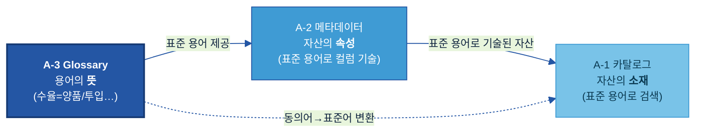
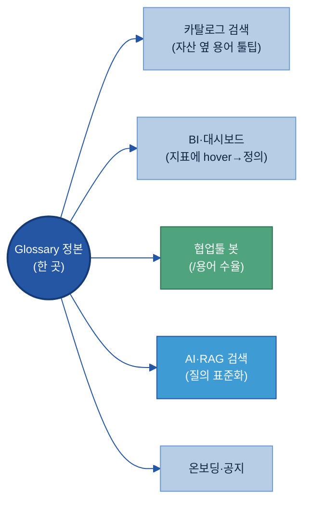
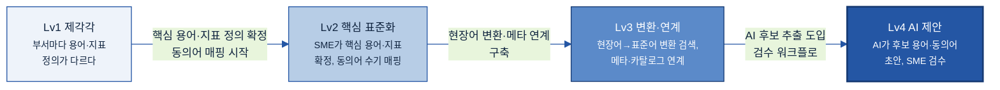

# A-3. 비즈니스 Glossary

> 비즈니스 Glossary(Business Glossary)는 조직에서 쓰는 **업무 용어·약어·동의어를 하나의 표준 뜻으로 통일한 사전**이다. 자산의 *속성*을 적는 [A-2 메타데이터](../A-2%20메타데이터/A-2%20메타데이터.md)와 달리, Glossary는 **단어 자체의 뜻**을 고정해, 부서·계열사가 같은 말을 같은 의미로 쓰고 AI가 현장 용어를 표준 용어로 해석하게 한다.

## 목차

1. [개요](#1-개요)
2. [왜 필요한가 (Why)](#2-왜-필요한가-why)
3. [무엇을 갖추나 (What — 용어 카드·동의어·유형)](#3-무엇을-갖추나-what--용어-카드동의어유형)
4. [어디부터 표준화하나 (우선순위)](#4-어디부터-표준화하나-우선순위)
5. [예시 시나리오 — '결함명' 표준화 한 바퀴](#5-예시-시나리오--결함명-표준화-한-바퀴-두산전자-품질)
6. [솔루션·도구 검토](#6-솔루션도구-검토)
7. [어떻게 준비·운영하나 (How)](#7-어떻게-준비운영하나-how)
8. [다른 주제와의 관계](#8-다른-주제와의-관계)
9. [성과 지표·고도화 로드맵](#9-성과-지표고도화-로드맵)

- [별첨 — 용어 카드 템플릿·도메인 용어 예시집·표준값](#별첨-appendix)
- [참고자료(References)](#참고자료-references)
- [변경 이력 / 피드백 반영](#변경-이력--피드백-반영)

> 관련 가이드: [A-1 데이터 카탈로그](../A-1%20데이터%20카탈로그/A-1%20데이터%20카탈로그.md) · [A-2 메타데이터](../A-2%20메타데이터/A-2%20메타데이터.md) · [B-3 온톨로지](../B-3%20온톨로지/B-3%20온톨로지.md) · [C-2 데이터 품질 관리](../C-2%20데이터%20품질%20관리/C-2%20데이터%20품질%20관리.md)

---

## 1. 개요

### 1.1 비즈니스 Glossary란

비즈니스 Glossary는 조직에서 사용하는 업무 용어, 약어, 동의어를 하나의 표준 의미로 정리한 사전이다. 단어의 뜻을 단순히 설명하는 수준이 아니라, 조직 안에서 해당 용어를 어떤 의미로 사용해야 하는지 공식 기준을 정하는 역할을 수행한다.

같은 회사 안에서도 동일한 용어가 부서마다 다르게 해석되는 경우가 많다. 예를 들어 영업 조직의 "리드타임"은 주문 확정부터 납품 완료까지의 기간을 의미할 수 있지만, 생산 조직의 "리드타임"은 원자재 투입부터 제품 완성까지의 기간을 의미할 수 있다. 또한 `SOI`, `L/T`, `FCST`와 같은 약어는 문서나 조직에 따라 서로 다른 의미로 사용될 수 있다.

Glossary는 이러한 용어 혼선을 줄이기 위해 표준명, 정의, 약어, 동의어, 금지어, 관련 데이터 필드, 책임 부서를 함께 관리한다. 이를 통해 사람은 같은 용어를 같은 의미로 이해하고, AI와 데이터 시스템은 현장 표현을 표준 용어로 해석할 수 있다.

| 현장의 혼선 | Glossary가 정리한 결과 |
|---|---|
| "리드타임"을 영업과 생산이 다르게 사용 | 영업 리드타임 / 생산 리드타임으로 구분 정의 |
| `SOI`가 문서마다 다른 의미로 사용 | `SOI = Sales of Income` 등 적용 범위와 기준 명시 |
| "수율" 계산 기준이 팀마다 다름 | 계산식, 기준 시점, 포함·제외 조건을 표준화 |
| 현장 약어와 공식 용어가 따로 존재 | 약어·동의어를 표준명에 연결 |

예를 들어 `수율`이라는 용어를 Glossary에 등록할 때는 단순히 "생산이 잘된 비율"이라고 쓰는 것이 아니라, `양품 수량 ÷ 투입 수량`, 기준 시점, 재작업 포함 여부, 책임 부서까지 함께 정의해야 한다. 그래야 어느 조직에서 조회하더라도 동일한 기준으로 숫자를 해석할 수 있다.

> **용어 풀이 — Glossary(글로서리):** "용어 사전"을 뜻하는 영어이며, 본 가이드에서는 업무 용어의 표준 정의집을 의미한다.

---

### 1.2 적용 범위와 체계 내 위치 (용어의 "뜻")

비즈니스 Glossary는 AI-ready Data 체계에서 조직이 사용하는 용어의 의미를 표준화하는 역할을 수행하며, 메타데이터와 카탈로그는 이러한 표준 용어를 기반으로 데이터 자산을 설명하고 검색하는 역할을 수행한다.

즉 Glossary는 "용어의 뜻"을 담당하고, 메타데이터는 "자산의 속성"을 설명하며, 카탈로그는 "데이터의 위치와 활용 정보"를 제공한다. 세 주제는 서로 다른 역할을 수행하지만 동일한 표준 용어 체계를 공유함으로써 일관된 데이터 활용 환경을 제공한다.



### 1.3 주요 대상 조직

용어 정의는 **현업 SME(업무 전문가)** 가 제안하고, **중앙 데이터 조직/거버넌스**가 표준으로 확정·관리한다.

| 역할 | Glossary에서 하는 일 |
|---|---|
| **현업 SME / 데이터 오너** | 현장 용어·동의어 제안, 정의 초안 작성, 충돌 시 의견 제시 |
| **데이터 스튜워드 / 중앙 데이터 조직** | 표준 용어 확정, 충돌 조정, 버전·승인 관리 |
| **AI/Data 거버넌스 위원회** | 계열사 간 표준 정책·충돌 조정 최종 승인 |
| **데이터 플랫폼 / IT** | Glossary를 카탈로그·메타·검색에 연동 |

> **용어 풀이 — SME(Subject Matter Expert):** 그 업무를 가장 잘 아는 현업 전문가. 용어의 *실제 뜻*은 SME만 정확히 안다.

---

## 2. 왜 필요한가 (Why)

동일한 데이터를 사용하더라도 조직마다 용어를 다르게 사용하거나, 같은 용어를 서로 다른 의미로 해석하는 경우가 발생한다.

이러한 차이는 검색, 분석, 보고 과정에서 혼선을 유발하며 조직 간 데이터 활용의 일관성을 저하시킨다. 비즈니스 Glossary는 용어의 정의와 사용 기준을 표준화하여 동일한 데이터를 동일한 의미로 해석할 수 있는 기반을 제공한다.

### 2.1 현업 Pain Point

[A-2 메타데이터](../A-2%20메타데이터/A-2%20메타데이터.md)가 데이터 필드와 컬럼의 의미를 설명한다면, 비즈니스 Glossary는 그보다 앞선 단계인 조직이 사용하는 용어의 의미를 표준화하는 역할을 수행한다.

동일한 데이터를 사용하더라도 용어의 정의와 사용 방식이 조직마다 다르면 검색, 분석, 보고 과정에서 해석 차이가 발생할 수 있다.

- **Pain 1 — 같은 개념을 서로 다른 용어로 사용한다**

  현장에서는 동일한 결함을 `긁힘`, `기스`, `스크래치` 등 여러 표현으로 기록하는 경우가 있다. 이 경우 특정 용어만 기준으로 검색하거나 분석하면 관련 데이터가 일부 누락될 수 있다.

- **Pain 2 — 같은 용어가 조직마다 다른 의미로 사용된다**

  예를 들어 `리드타임`은 영업 조직에서는 주문부터 납품까지의 기간을 의미할 수 있지만, 생산 조직에서는 원자재 투입부터 제품 완성까지의 기간을 의미할 수 있다. 동일한 용어를 사용하더라도 정의가 다르면 비교와 분석 결과를 신뢰하기 어렵다.

- **Pain 3 — 같은 지표를 서로 다른 기준으로 계산한다**

  `수율`을 계산할 때 어떤 조직은 재작업 물량을 포함하고, 어떤 조직은 제외할 수 있다. 동일한 KPI를 보고하더라도 계산 기준이 다르면 조직 간 수치 비교가 어려워진다.

- **Pain 4 — 계열사와 글로벌 사업장 간 용어 체계가 다르다**

  국내, 중국, 베트남 사업장이 동일한 공정과 결함을 서로 다른 언어와 약어로 표현하는 경우가 많다. 이러한 차이는 전사 단위 분석과 비교를 어렵게 만드는 요인이 된다.

두산전자의 경우 약어 `SOI`가 문서와 조직에 따라 서로 다른 의미로 사용되면서 실적 데이터 해석에 혼선이 발생한 사례가 있었다. 이후 Glossary에 `SOI = Sales of Income(주간 실적·계획 관리 기준)`을 표준 정의로 등록하고 관련 문서에 동일 기준을 적용하면서 용어 해석을 일관되게 유지할 수 있었다.

이러한 문제의 공통 원인은 데이터 자체가 아니라 용어의 정의와 사용 기준이 일관되지 않다는 점이다. 비즈니스 Glossary는 조직이 사용하는 용어의 의미를 표준화하여 검색, 분석, 보고, AI 활용 과정에서 동일한 기준으로 데이터를 해석할 수 있도록 지원한다.

---

### 2.2 기대 효과

**① 현장 용어 차이로 인한 검색 누락 감소**

동의어를 표준명에 묶으면, "기스"로 검색해도 "스크래치" 데이터가 나온다. 현장 용어 그대로 질문해도 AI가 표준 용어로 변환해 한 번에 찾는다.

**② 지표 정의 불일치 해소**

"수율"의 계산식·포함 조건이 표준으로 고정되면, 어느 팀·어느 보고서든 같은 정의로 집계해 숫자가 어긋나지 않는다. 보고·의사결정의 신뢰가 올라간다.

**③ AI 응답 기준 통일**

AI Agent가 질의·답변에서 동일 용어를 동일 의미로 쓴다. Glossary가 AI가 참조하는 "판단의 기준어"가 된다.

**④ 계열사·글로벌 데이터 비교 기반 확보**

각국·각 계열사 용어를 표준명에 매핑하면, 용어 장벽 없이 전사 데이터를 한 기준으로 비교·분석할 수 있다.

> **자회사 입장에서:** Glossary는 ① *용어 때문에 못 찾던 데이터*를 찾게 하고, ② *보고서마다 다르던 지표 숫자*를 통일하며, ③ 글로벌 현장을 *한 언어로* 잇는다. 메타데이터가 "자산을 해석"하게 했다면, Glossary는 "조직 전체가 같은 말로 소통"하게 한다.

---

## 3. 무엇을 갖추나 (What — 용어 카드·동의어·유형)

### 3.1 표준 용어 카드 — 표준 정의 항목

비즈니스 Glossary의 기본 단위는 용어 카드(Term Card)이다.

용어 카드에는 표준명과 정의뿐 아니라 동의어, 책임 부서, 관련 데이터 필드와 같은 운영 정보를 함께 기록한다. 이러한 정보를 일관된 형식으로 관리해야 조직 전체가 동일한 기준으로 용어를 해석하고 활용할 수 있다.

실무에서는 먼저 필수 항목을 정의한 뒤, 필요에 따라 사용 예시나 관련 데이터 필드와 같은 보조 정보를 추가하는 방식을 권장한다.

| 항목 | 쉬운 의미 | 예시값 | 구분 | 작성 주체 |
|---|---|---|:---:|:---:|
| 표준명 | 회사 공식 용어 | `확정 매출` | 필수 | 스튜워드 |
| 정의 | 한 문장 표준 뜻 | `세금계산서 발행 완료된 납품 건의 매출` | 필수 | 오너 |
| 동의어 | 같은 뜻 현장 표현 | `실적, Sales(영업)` | 필수 | 오너 |
| 책임 부서 | 정의를 책임지는 조직 | `영업기획팀` | 필수 | 오너 |
| 상태 | 승인 단계 | `승인` (검토중/승인/폐기) | 필수 | 스튜워드 |
| 영문명 | 영어 표기 | `Confirmed Sales` | 선택 | 스튜워드 |
| 약어 | 줄임말 | `COGS` | 선택 | 오너 |
| 금지어 | 사용을 지양하는 표현 | `매출액(모호)` | 선택 | 스튜워드 |
| 사용 예시 | 실제 업무에서의 사용 방식 | `"확정 매출 기준 월 마감"` | 선택 | 오너 |
| 관련 데이터 필드 | 이 용어가 사용되는 컬럼 | `SALES.CONFIRMED_AMT` | 선택 | 스튜워드 |

> 빈 용어 카드 템플릿과 완성 예시(CCL, 수율)는 Appendix A, 제조업 도메인 용어 예시집은 Appendix B에서 확인할 수 있다.

### 3.2 동의어·금지어 (현장 표현을 표준어로 잇기)

Glossary의 활용 가치는 표준명 자체보다 동의어와 금지어를 체계적으로 관리하는 데서 발생한다 — 현장이 실제로 쓰는 말을 표준어에 연결해야 검색·변환이 작동한다.

- **동의어:** 같은 뜻의 다른 표현. 표준명에 묶어 "어느 말로 물어도" 찾게 한다. 예: `스크래치` ← {긁힘, 기스, scratch}.
- **금지어:** 혼동을 일으켜 *쓰지 말아야 할* 표현. 예: "매출액"(주문/확정/회계 기준이 섞여 모호) → "확정 매출" 사용.

### 3.3 연계 정보 (데이터 필드·책임 부서)

용어가 *어느 데이터 필드에 쓰이고 누가 책임지는지*를 연결해야, Glossary가 사전을 넘어 데이터와 이어진다.

- **관련 데이터 필드:** 그 용어가 실제로 붙는 컬럼·테이블(→ [A-2 메타데이터](../A-2%20메타데이터/A-2%20메타데이터.md)의 비즈 메타가 이 표준 용어를 인용).
- **책임 부서:** 정의의 정확성을 책임지는 조직. 충돌·변경 시 의사결정 주체.

### 3.4 두 가지 유형 — 비즈니스 용어 / 지표 기준

Glossary에서 관리하는 항목은 크게 비즈니스 용어와 지표 기준 두 유형으로 구분할 수 있다 — 지표는 계산식·조건까지 적어야 숫자가 일치한다.

| 유형 | 무엇을 표준화 | 핵심 추가 항목 | 예시 |
|---|---|---|---|
| **비즈니스 용어** | 부서마다 다르게 해석되는 핵심 용어의 뜻 | 정의·동의어·금지어 | 수주, 납기, 부진재고, SOP |
| **지표 기준** | KPI가 어떻게 계산·집계되는지 | **계산식·기준 시점·포함/제외 조건** | 수율 = 양품/투입(재작업 제외), 리드타임 = 주문확정~납품완료 |

> **지표 기준 예시 — 수율:** `수율 = 양품 수량 ÷ 투입 수량`, *기준 시점:* 월 마감, *포함/제외:* 재작업 양품 제외. 이 세 가지가 없으면 같은 "수율"도 팀마다 다른 숫자가 된다(§2.1 Pain 3).

---

## 4. 어디부터 표준화하나 (우선순위)

### 4.1 표준화 대상 용어

용어 표준화는 모든 용어를 동시에 추진하기보다 업무 영향도가 높은 영역부터 단계적으로 적용하는 것이 바람직하다 — **AI 검색·해석에 영향이 크고, 부서·계열사마다 다르게 쓰는 용어**부터.

| 분류 | 대상 용어 예 |
|---|---|
| 품질 | 결함명, 검사항목, 원인 유형, 조치 유형 |
| 생산 | 공정명, 제품군, 수율·리드타임 등 지표 |
| 영업·고객 | 수주·납품·납기, 고객 불만 유형, 매출 관련 지표 |
| 원가 | 표준원가·실제원가·원가율 등 |

### 4.2 우선순위

"AI 검색 영향 × 용어 혼선 정도"가 둘 다 높은 용어가 1순위다.

| 우선순위 | 기준 | 예 |
|---|---|---|
| 1순위 | AI 검색·집계에 자주 쓰이고 + 부서마다 다르게 씀 | 결함명, 수율, 매출 |
| 2순위 | 약어·현장식 표현이 많아 해석이 갈림 | SOI, L/T, CCL |
| 3순위 | 계열사·글로벌 간 표현이 다름 | 다국어 결함명·공정명 |
| 후순위 | 한 부서만 쓰고 혼선이 없는 용어 | 부서 내부 약속어 |

> **두산전자 예시:** 결함명·수율부터 표준화(검사·분석 AI가 매일 쓰는 용어) → 다음으로 약어(SOI·L/T) → 글로벌 현장 다국어 매핑 순으로 확대한다.

---

### 4.3 표준화 대상 선정 기준

모든 용어를 동시에 표준화하는 것은 현실적으로 어렵다.

따라서 업무 영향도, AI 활용도, 용어 혼선 정도를 기준으로 우선순위를 결정한다.

| 평가 항목 | 판단 질문 | 우선 적용 예시 |
|------------|------------|------------|
| 업무 영향도 | KPI, 보고서, 의사결정에 직접 사용되는가 | 수율, 원가율, 리드타임 |
| AI 활용도 | 검색, Agent, 분석 모델에서 자주 사용되는가 | 결함명, 공정명, 고객 불만 유형 |
| 혼선 정도 | 조직별 정의가 다른가 | 수율, SOI, 리드타임 |
| 활용 범위 | 여러 조직이 공통으로 사용하는가 | 매출, 품질, 생산 관련 용어 |
| 변경 영향도 | 변경 시 시스템과 보고서 영향이 큰가 | KPI 용어, 품질 판정 기준 |

일반적으로 KPI, 품질 지표, 결함명과 같이 조직 전체에서 활용되는 용어를 우선 표준화한다.

---

## 5. 예시 시나리오 — 결함명 표준화 (두산전자 품질)

본 장에서는 두산전자 품질 조직의 결함명 표준화 사례를 통해 비즈니스 Glossary를 구축하고 운영하는 과정을 설명한다.

동일한 결함이 현장과 시스템마다 서로 다른 명칭으로 기록되는 상황을 가정하고, 용어 수집부터 표준화, 운영까지의 전체 흐름을 살펴본다.

### 5.1 적용 배경

두산전자 품질보증팀은 AI 기반 결함 분석 체계를 도입하는 과정에서 동일한 결함이 여러 명칭으로 기록되고 있음을 확인하였다.

예를 들어 `긁힘`, `기스`, `scratch`는 모두 동일한 결함을 의미하지만 서로 다른 표현으로 저장되어 있었으며, `빵꾸`, `홀`, `핀홀`, `휨`, `컬`과 같은 표현도 혼재되어 있었다.

이로 인해 검색 결과가 누락되거나 분석 기준이 달라지는 문제가 발생하였고, 결함명을 표준화하는 작업이 필요해졌다.

### 5.2 적용 전 / 후

| 적용 전 | 적용 후 |
|---|---|
| "스크래치 불량" 검색 시 "기스"로 기록된 데이터 누락 | 동의어가 표준 용어에 연결되어 전체 검색 가능 |
| 현장 표현마다 별도 집계 | 표준 결함 기준으로 통합 집계 |
| 글로벌 사업장별 다른 표현 사용 | 표준 용어에 매핑하여 통합 관리 |
| 신규 분석자가 결함 코드 의미를 별도 확인 | 용어 정의를 통해 즉시 확인 가능 |

### 5.3 표준화 수행 과정


| 단계 | 주요 활동 | 산출물 | 관련 절 |
|---|---|---|---|
| ① 용어 수집 | QMS 결함 코드, 작업일지, 품질 보고서에서 실제 사용 표현 수집 | 현장 용어 목록 | §7.1 |
| ② 용어 정리 및 합의 | 품질 SME가 동의어와 표준명 정의 | 표준명 후보 및 동의어 그룹 | §7.1 |
| ③ 용어 카드 작성 | 정의, 동의어, 금지어, 책임 부서, 관련 필드 등록 | 용어 카드 | §3.1, Appendix A |
| ④ 충돌 조정 | 의미가 중복되거나 불명확한 용어 정리 | 승인된 표준 정의 | §7.2 |
| ⑤ 등록 및 게시 | 표준 용어를 Glossary에 등록하고 검수 | 표준 용어집 | §7.3 |
| ⑥ 전사 공유 | 카탈로그, QMS, 검색 서비스에 반영 | 공통 용어 체계 적용 | §7.3 |
| ⑦ 검색 연계 | 동의어와 약어를 표준 용어에 연결 | 검색·AI 활용 체계 반영 | §7.4 |
| ⑧ 운영 및 유지보수 | 신규 용어 등록 및 변경 관리 | 최신 Glossary 유지 | §7.5 |

#### 용어 카드 예시

```text
표준명 : 스크래치 (Scratch)
상태 : 승인

정의 : 동박 표면이 외부 접촉으로 인해 발생한 선형 결함

동의어 : 긁힘, 기스, scratch, 划痕
금지어 : 흠집(범위 불명확)

관련 필드 : QMS.INSP_RESULT.DEF_CD = 'S01'
책임 부서 : 품질보증팀
```

이와 같이 정의된 용어 카드는 검색, 데이터 분석, AI 서비스가 동일한 결함을 동일한 의미로 해석하기 위한 기준으로 활용된다.
---

## 6. 솔루션·도구 검토

> **2층 연결:** 솔루션을 묶어서 평가·선정하려면 → [Tech Stack 비교 정본](../../전체%20목차/01%20Tech%20Stack%20비교%20(솔루션×주제).md). 아래는 *Glossary 관점*의 기능 비교(1층)다.

### 6.1 도구 유형

전용 Glossary 기능(카탈로그·거버넌스 솔루션 내장)으로 갈지, 위키·스프레드시트로 가볍게 시작할지 — 규모와 성숙도로 정한다.

| 유형 | 강점 | 유의점 | 예 |
|---|---|---|---|
| 카탈로그·거버넌스 내장 Glossary | 메타·검색 자동 연계, 승인 워크플로 | 도입 비용 | [Collibra](https://www.collibra.com), [Microsoft Purview](https://learn.microsoft.com/azure/purview/), [Atlan](https://atlan.com) |
| 플랫폼 내장 | 플랫폼 데이터와 즉시 연결 | 플랫폼 종속 | [Databricks Unity Catalog](https://www.databricks.com/product/unity-catalog) |
| 경량 시작 | 빠르고 저비용 | 검색 자동연계·버전관리 약함 | 위키·스프레드시트 |

### 6.2 선정 기준

| 평가 축 | 무엇을 보나 |
|---|---|
| 동의어·금지어 매핑 | 표준명↔현장어 연결을 지원하나 |
| 검색 연계 | 카탈로그·RAG 검색에 표준 용어가 연결되나 |
| 현업 편집성 | SME가 직접 제안·편집하기 쉬운가 |
| 승인 워크플로 | 제안→검토→승인→버전 관리가 되나 |

> 기능·가격은 변동되므로 도입 검토 시 공식 문서·PoC로 확인한다.

---

## 7. 어떻게 준비·운영하나 (How)

### 7.1 용어를 어떻게 정하나 — 수집·합의·정의

용어는 책상에서 만드는 게 아니라 **현장이 실제 쓰는 말을 모아 → SME가 합의 → 표준명·동의어·정의로 확정**한다.

**i) 어디서 용어를 모으나 (현장 표현 수집)** — 표준을 새로 발명하지 않는다. 이미 쓰이는 말을 긁어모은다.

| 수집처 | 무엇을 건진다 |
|---|---|
| MES/QMS 코드값·드롭다운 목록 | 결함명·공정명·검사항목의 현장 표기 |
| 현장 작업일지·검사 보고서 | 비공식 약어·현장식 표현("기스", "빵꾸") |
| 기존 사내 약어표·위키·용어집 | 흩어진 정의들(통합 대상) |
| BI 대시보드·보고서 라벨 | 지표명과 팀별 다른 계산 |
| 이메일·회의록 | 영업·고객 용어(수주·납기·PO) |
| SME 인터뷰·용어 워크숍 | 위에서 안 잡히는 암묵 용어·진짜 뜻 |

**ii) 합의 — 용어 워크숍.** 도메인별(품질·생산·영업·원가)로 SME를 모아, 수집한 표현들을 놓고 *"이건 같은 뜻 / 이건 다른 뜻"* 을 가른다(동의어 묶기·충돌 분리는 §7.2). 한자리에서 표준명 후보와 정의 초안을 만든다.

**iii) 정의 — 잘 쓴 정의 vs 못 쓴 정의 (현업 실행 키트 ㉡).** 정의는 **측정 가능·명확하게**. 초안→검토→승인 흐름과 양식은 [[Appendix A]](#appendix-a).

| 항목 | Before | After | 왜 |
|---|---|---|---|
| 수율 정의 | "생산 잘된 정도" | "양품 수량 ÷ 투입 수량 (재작업 제외, 월 마감 기준)" | 계산식·조건 명시 |
| 리드타임 | "걸리는 시간" | "주문 확정일 ~ 납품 완료일 (영업 기준)" | 시작·끝 시점 명시 |
| 부진재고 | "오래된 재고" | "최근 12개월 출고 0인 재고" | 정량 기준 |

> **금지 표현:** `대략·주요·관련·오래된·최근` 등 해석이 갈리는 정성어. 측정 기준이 분명한 표현으로 바꾼다([A-2 메타데이터](../A-2%20메타데이터/A-2%20메타데이터.md)의 "잘 쓴 예 vs 못 쓴 예"와 동일 원칙).

---

### 7.2 용어 충돌 조정

충돌은 두 가지다 — **같은 말 다른 뜻** / **다른 말 같은 뜻**. SME·오너·중앙조직이 함께 조정·승인한다.

| 충돌 유형 | 처리 방식 | 예 |
|---|---|---|
| 같은 말 다른 뜻 (동음이의) | 수식어를 붙여 **구분 정의** 또는 하나로 표준 확정 | "리드타임" → 영업/생산 리드타임으로 분리 |
| 다른 말 같은 뜻 (동의어) | 표준명 하나로 **통합**, 나머지는 동의어로 | "긁힘·기스" → 스크래치로 통합 |

조정 절차: ① SME가 충돌 제기 → ② 관련 부서·오너 의견 수렴 → ③ 중앙 데이터 조직이 표준안 결정 → ④ 거버넌스 승인 → ⑤ Glossary 반영·공지. 계열사를 가로지르는 충돌은 거버넌스 위원회가 최종 조정한다.

<a id="sec73store"></a>
### 7.3 어디에 두고, 어떻게 모두가 보게 하나 (단일 저장소·배포)

용어 정의가 여러 저장소에 분산되면 동일 용어에 대해 서로 다른 기준이 사용될 수 있다 — **반드시 한 곳(정본)에 올리고**, 그 한 곳을 **모든 화면(검색·BI·챗봇·AI)에 비춘다.** 한 번 정의하면 모든 채널에 자동 반영되는 게 핵심.

**i) 어디에 두나 — 단일 정본 저장소(Single Source of Truth).** 용어는 *딱 한 곳*에만 정본을 둔다. 부서마다 엑셀을 따로 두면 표준화의 의미가 없다.

| 저장 위치 | 적합 상황 | 비고 |
|---|---|---|
| 카탈로그·거버넌스 솔루션의 **Glossary 모듈** ([Collibra](https://www.collibra.com)·[Purview](https://learn.microsoft.com/azure/purview/)·[Atlan](https://atlan.com)) | 본격 운영 | 검색·메타·승인과 자동 연계[^glossary-tools] |
| **플랫폼 내장** ([Databricks Unity Catalog](https://www.databricks.com/product/unity-catalog)) | 데이터플랫폼 중심 | 데이터와 같은 곳에서 관리 |
| **위키·공유 시트** | 파일럿·소규모 시작 | 단, *한 곳만*. 나중에 솔루션으로 이관 |

**ii) 어떻게 올리나 — 등록·업로드.** ① 소량은 UI에서 직접 입력, ② **대량은 엑셀/CSV로 모아 일괄 import**(현업이 익숙한 방식 — 엑셀로 작성 → 검수 → 업로드), ③ 자동화는 API로 등록. 업로드 후 검수·승인(§7.1 iii)을 거쳐 "게시"된다.

**iii) 어떻게 모두가 보게 하나 — 한 곳을 여러 화면에 비춘다.** 정본 하나를 등록하면 아래 채널에 자동 노출되게 연결한다.



- **전사 읽기 권한:** 임직원 누구나 검색·열람(편집은 SME/스튜워드만).
- **카탈로그·메타 통합:** 자산·컬럼 옆에 표준 용어 정의가 툴팁으로 뜬다([A-2](../A-2%20메타데이터/A-2%20메타데이터.md) 비즈 메타가 용어를 인용).
- **BI·대시보드:** 지표 위에 마우스를 올리면 표준 정의·계산식이 보인다("이 수율은 재작업 제외").
- **협업툴(Teams/Slack) 봇:** "/용어 SOI" 하면 정의를 즉시 반환.
- **온보딩·정기 공지:** 신규 입사자 교육 자료에 포함, 용어 추가·변경 시 공지.

> **두산전자 예시:** 신입 분석 담당자가 대시보드의 "원가율"에 hover하면 `매출 대비 원가 비율(표준원가 기준)` 정의가 바로 뜬다 — 선임에게 묻지 않아도 같은 기준으로 해석한다.

---

### 7.4 현장 용어·약어를 그대로 써도 변환되게 (동의어 자동 변환)

용어 표준화의 목적은 현업 사용자가 표준 용어만 사용하도록 강제하는 것이 아니다 — **쓰던 약어·현장어 그대로 입력해도 시스템이 표준어로 변환**해 데이터를 찾아준다. 이게 Glossary가 "사전"을 넘어 검색·AI 인프라가 되는 지점이다.

**작동 원리 — 4단계:**


1. **동의어·약어 매핑을 데이터로 갖춘다** — Glossary에 `표준명 ↔ 동의어/약어`를 등록(예: 스크래치 ← {긁힘, 기스, scratch}, `L/T` ← 리드타임). *우리가 준비하는 것은 이 매핑 데이터다.*
2. **질의 확장(Query Expansion)** — 검색·카탈로그가 입력어를 동의어 사전에 비춰 표준어로 바꿔 검색한다. "기스"로 쳐도 "스크래치(S01)" 데이터가 나온다.
3. **자동완성·"이거 찾으셨나요"** — 입력 중 표준어를 제안하고, 폐기어·오타엔 대체 표준어를 안내한다.
4. **AI·RAG 질의 정규화** — AI Agent가 Glossary를 참조해 현장어를 표준어로 정규화한 뒤 검색·답변한다(같은 용어를 같은 의미로).

> **와닿는 예시:** 30년 경력 검사반장이 늘 쓰던 "빵꾸(핀홀)"로 "빵꾸 많이 난 로트 보여줘"라고 물어도, 동의어 사전이 `빵꾸 → 핀홀(P03)`로 변환해 정확한 데이터를 찾는다. **반장은 표준 용어를 몰라도 되고, 데이터는 표준으로 정리된다.** 사용자는 기존 표현을 그대로 사용하고, 시스템은 이를 표준 용어 체계와 연결하여 검색과 분석에 활용한다.

> **어디서 되나:** 이 변환은 별도 엔진을 *만드는* 게 아니라, **카탈로그·거버넌스 솔루션의 동의어(Synonym) 매핑 기능**과 검색엔진의 동의어 처리, RAG의 용어 정규화가 *Glossary 데이터를 소비*해 작동한다[^synonym]. 우리 일은 그 매핑 데이터(동의어·약어)를 정확히 채워 두는 것이다(데이터 준비 관점).

> **용어 풀이 — 질의 확장(Query Expansion):** 사용자가 입력한 검색어에 동의어·관련어를 더해 검색 범위를 넓히는 기법. Glossary 동의어가 그 재료가 된다.

<a id="sec74"></a>
### 7.5 운영 — 용어 변경 관리와 역할

신규·변경·폐기·동의어 추가를 **버전·승인**으로 관리하고, 변경이 데이터·문서·Prompt에 미치는 **영향을 점검**한다.

| 변경 유형 | 처리 | 영향 점검 |
|---|---|---|
| 신규 용어 등록 | 제안→검토→승인 | 기존 동의어와 중복 여부 |
| 기존 용어 변경 | 버전 올림, 이력 보존 | 관련 데이터 필드·메타·Prompt 영향 |
| 폐기 용어 지정 | 금지어로 전환·대체어 안내 | 폐기어를 쓰는 데이터·문서 식별 |
| 동의어 추가 | 표준명에 연결 | 검색 변환(§7.4)에 즉시 반영 |

**역할(RACI 요약):** 용어 제안·정의 = 현업 SME **R**, 표준 확정·충돌 조정 = 중앙 스튜워드 **R/A**, 계열사 정책 = 거버넌스 **A**, 검색·배포 연계 = IT **R**.

> 용어 변경은 **데이터를 바꾸지 않아도 해석을 바꾼다** — "확정 매출"의 정의가 바뀌면 그 용어를 인용한 모든 메타·Prompt가 영향받으므로, 변경 영향 점검이 필수다.

---

## 8. 다른 주제와의 관계

| 인접 주제 | 경계 (Glossary는 어디까지) |
|---|---|
| [A-2 메타데이터](../A-2%20메타데이터/A-2%20메타데이터.md) | Glossary=용어의 표준 뜻 / A-2=그 용어로 컬럼 속성 기술. 비즈 메타가 Glossary 용어를 인용 |
| [A-1 카탈로그](../A-1%20데이터%20카탈로그/A-1%20데이터%20카탈로그.md) | Glossary=검색어 표준화 / A-1=자산 검색. 동의어가 카탈로그 검색을 넓힘 |
| [B-3 온톨로지](../B-3%20온톨로지/B-3%20온톨로지.md) | Glossary=단어의 뜻(결함=…) / B-3=개념 간 관계(결함↔공정↔원인) |
| [C-2 품질](../C-2%20데이터%20품질%20관리/C-2%20데이터%20품질%20관리.md) | Glossary=지표 정의(수율=…) / C-2=그 지표로 품질 측정 |

---

## 9. 성과 지표·고도화 로드맵

### 9.1 성과 지표 (KPI)

| 지표 | 쉬운 의미 | 방향 |
|---|---|---|
| 표준화 용어 수 | 표준으로 확정된 용어 개수 | ↑ |
| 동의어 매핑률 | 표준명에 현장 동의어가 연결된 비율 | ↑ |
| 현장 용어 변환 성공률 | 현장어 질의가 표준어로 변환돼 검색된 비율 | ↑ |
| 지표 정의 일치율 | 표준 계산식을 따르는 보고서 비율 | ↑ |

### 9.2 고도화 로드맵 — 우리 수준과 다음 한 걸음 (성숙도 단계)

날짜표가 아니라 **수준**으로 본다. **"용어가 얼마나 표준화·연계되고, 후보 발굴을 AI가 얼마나 돕는가"** 기준으로, 「지금 우리가 이런 모습이면 = 이 수준」을 짚고 → 「다음 단계로 가려면 무엇을」 정한다.



| 단계 | 이런 모습이면 = 이 수준 (진단 신호) | 다음 단계로 가려면 (다음 한 걸음) |
|---|---|---|
| **Lv1 제각각** | 같은 지표를 부서마다 다르게 부르고 다르게 계산한다. "수율"이 팀마다 다른 뜻 | SME가 핵심 용어·지표의 표준명·정의(계산식·기준시점)를 확정하고 동의어 매핑을 시작 |
| **Lv2 핵심 표준화** | 핵심 용어·지표가 표준으로 확정되고 현장 동의어가 일부 연결됨 | 현장어→표준어 변환 검색을 붙이고 메타데이터·카탈로그와 용어를 연계 |
| **Lv3 변환·연계** | 현장 표현으로 검색해도 표준어로 변환돼 찾아지고, 컬럼·자산과 용어가 연결됨 | AI가 문서·현장 기록에서 후보 용어·동의어를 초안 추출하고 SME가 검수 |
| **Lv4 AI 제안** | AI가 신조어·동의어를 자동 제안하고 SME는 검수·승인만. 표준화 속도↑ | 제안 정확도를 모니터링하고 계열사 간 용어 표준을 연합 |

> **공통 원칙(순서가 핵심):** 초기엔 사람이 핵심 용어를 정의하고, 성숙해지면 AI가 동의어·신조어를 제안한다(**사람 검수 전제**). 표준 정의 없이 AI 제안부터 켜면 충돌하는 용어가 양산된다.

### 9.3 미래 AI 자동화 전망 — 어디는 AI가, 어디는 사람이

용어 준비 중 *후보를 찾고 매핑하는 일*은 갈수록 AI가 대신하고, *정의를 확정하고 합의·승인하는 판단*은 사람이 끝까지 쥔다.

| AI 활용 가능 영역 | 사람 중심 의사결정 영역 |
|---|---|
| 문서·로그에서 후보 용어·동의어·신조어 자동 추출 | 표준명·**정의 최종 확정**(특히 지표 계산식·기준시점·포함제외) |
| 현장어 → 표준어 매핑 **제안** | **금지어**·표준 채택/폐기 결정 |
| 정의 초안 작성, 중복·충돌 용어 자동 탐지 | 용어의 **책임 부서**·소유 지정 |
| 지표 정의 불일치(보고서 간) 자동 탐지 | AI 제안의 **검수·승인**과 비즈니스 합의 |

---

## 별첨 (Appendix)

<a id="appendix-a"></a>
### [Appendix A] 용어 카드 빈 템플릿 + 완성 예시 (현업 실행 키트 ㉣)

**가. 빈 용어 카드 (복사해서 채우기)**

```
════════════════════════════════════════════════════
 표준명     : __________            (스튜워드)
 영문명     : __________            (스튜워드)
 약어       : __________            (오너)
 정의       : __________ (한 문장, 측정 가능하게)  (오너)
 동의어     : __________ (현장 표현 모두)  (오너)
 금지어     : __________ (쓰지 말 표현)   (스튜워드)
 사용 예시  : __________            (오너)
 유형       : 비즈니스 용어 / 지표 기준
 (지표면) 계산식·기준시점·포함제외 : __________   (오너)
 관련 필드  : __________ (→ A-2 메타)   (스튜워드)
 책임 부서  : __________            (오너)
 상태       : 검토중 / 승인 / 폐기    (스튜워드)
════════════════════════════════════════════════════
```

**나. 완성 예시 2건 (두산전자)**

```
[비즈니스 용어]
 표준명 : CCL (동박적층판)   영문 : Copper Clad Laminate
 정의   : PCB 핵심 소재로, 동박(Copper Foil)을 절연층에 적층한 판형 소재
 동의어 : 동박적층판, 적층판        금지어 : (없음)
 관련 필드: PROD.PRODUCT_TYPE='CCL'   책임 부서: 제품기획팀   상태: 승인
────────────────────────────────────────────────────
[지표 기준]
 표준명 : 수율   영문 : Yield Rate
 정의   : 투입 대비 양품 비율
 계산식 : 양품 수량 ÷ 투입 수량   기준시점: 월 마감   포함/제외: 재작업 양품 제외
 동의어 : Yield, 양품률          금지어 : 가동률(다른 개념)
 관련 필드: PROD.YIELD_RATE   책임 부서: 생산기술팀   상태: 승인
```

<a id="appendix-b"></a>
### [Appendix B] 두산 도메인 용어 예시집 (엑셀 「Glossary 작성 가이드」 흡수)

표준화 착수 시 참고할 제조·영업·원가 도메인 실제 용어. (전체 표준 사전은 솔루션/외부 시트로 관리)

| 구분 | 용어 | 표준 뜻 |
|---|---|---|
| 소재 | CCL | Copper Clad Laminate, 동박적층판. PCB 핵심 소재 |
| 소재 | Copper Foil | 동박. CCL·PCB 제조에 쓰는 구리 필름 |
| 소재 | Substrate | 기판. 반도체·전자 소재의 기반 판형 소재 |
| 소재 | HVLP | Very Low Profile, 동박 표면 프로파일 등급(예: HVLP4) |
| 영업 | PO / PO No. | Purchase Order(공식 발주 문서) / 발주 식별 번호 |
| 영업 | 수주 / 납품 / 납기 | 주문 수령(Order intake) / 인도 완료(Delivery) / 납품 기한 |
| 영업 | L/T | Lead Time, 주문 후 납품까지 소요 시간 |
| 영업 | MOQ / RFQ | 최소 발주 수량 / 견적 요청 |
| 계약 | LTSA / MPA | 장기 공급 계약 / 구매 기본 계약 |
| 품질 | FQC / 수율 | 최종 품질 검사 / 투입 대비 양품 비율 |
| 생산 | SOP / BOM | 양산 개시(Start of Production) / 제품 구성 자재 목록 |
| 검증 | EVT / DVT | Engineering / Design Validation Test |
| 원가 | 표준원가 / 실제원가 / 원가율 | 계획 기준 원가 / 실제 발생 원가 / 매출 대비 원가 비율 |
| 가격 | 단가 / ASP | Unit Price / Average Selling Price(평균 판매가) |
| 계획 | FCST / AOP / VS Plan | 수요·매출 예측 / 연간 사업 계획 / 계획 대비 실적 차이 |
| 분류 | SOI | Sales of Income, 내부 매출/사업 분류 기준(주간 보고 등) |

<a id="appendix-c"></a>
### [Appendix C] 표준값 목록 (현업 실행 키트 ㉢)

| 항목 | 고르는 값 |
|---|---|
| 용어 상태 | `검토중 / 승인 / 폐기` |
| 용어 유형 | `비즈니스 용어 / 지표 기준` |
| 도메인 | `품질 / 생산 / 영업 / 원가 / 구매 / 소재` |

---

## 참고자료 (References)

> 도구의 기능·지원 범위·가격은 변동되므로 도입 검토 시 공식 문서·PoC로 확인한다.

**도구·플랫폼 (공식 페이지)**
- [Collibra Business Glossary](https://www.collibra.com) · [Microsoft Purview](https://learn.microsoft.com/azure/purview/) · [Atlan](https://atlan.com)
- [Databricks Unity Catalog](https://www.databricks.com/product/unity-catalog)
- [DataHub Glossary](https://datahub.com/) · [OpenMetadata Glossary](https://open-metadata.org/)

**입력 자료**
- 두산 「Meta Tag 운영 가이드(Template)」 — Glossary 개념·유형, 도메인 용어 예시(`기존 매뉴얼 작성본/`)

### 각주 (출처)

[^glossary-tools]: 비즈니스 Glossary 모듈은 주요 데이터 거버넌스·카탈로그 솔루션이 내장한다 — [Collibra](https://www.collibra.com)·[Microsoft Purview](https://learn.microsoft.com/azure/purview/)(Unified Catalog)·[Atlan](https://atlan.com)·[Databricks Unity Catalog](https://www.databricks.com/product/unity-catalog). (공식 페이지, 검증 2026-06-19 라이브. 세부 기능·명칭·범위는 공식 문서·PoC로 확인.)
[^synonym]: 동의어(Synonym) 매핑·용어 기반 검색 보강(질의 확장)은 위 카탈로그·거버넌스 솔루션과 검색엔진이 제공하는 일반 기능이다. 제품별 지원 범위·명칭은 상이하므로 공식 문서·PoC로 확인한다(가격·버전 단정 금지).

---

## 변경 이력 / 피드백 반영

| 일자 | 버전 | 변경 내용 | 반영 위치 |
|------|------|-----------|-----------|
| 2026-06-19 | v0.1 | 초안 작성 — 전체 목차 A-3 9섹션 골격 위에 두산 엑셀 Glossary(3.5.1 개념·2유형, 도메인 용어 예시집) 흡수. 「현업 실행 키트」 5장치 적용(㉠ §3.1 용어 카드, ㉡ §7.1 Before→After, ㉢ [Appendix C], ㉣ [Appendix A] 빈템플릿+완성예시, [Appendix B] 도메인 용어집). A-2 메타데이터·B-3 온톨로지와 경계 명시. 웹 리서치 없이 기존 스토리라인 기반 + 엑셀 보완. KQ 5개 전부 커버 | 전체 |
| 2026-06-19 | v0.2 | **고객 피드백 — "와닿는 실무 이야기 보강"** 반영. §7 전면 심화: ① §7.1 용어 수집처(MES 코드값·작업일지·BI 라벨·SME 워크숍)·합의 과정, ② §7.3 신설 — **어디에 두고 모두가 보게 하나**(단일 정본 저장소·엑셀 일괄 업로드·전사 권한·검색/BI/챗봇/온보딩 배포 + 다이어그램), ③ §7.4 심화 — **현장 약어 그대로 써도 자동 변환**(동의어 매핑→질의 확장 4단계 + 다이어그램, "빵꾸→핀홀" 예시, 솔루션 Synonym 기능으로 작동/데이터 준비 관점). §7.4→7.5로 운영 이동, KQ4/KQ5 박스·앵커 갱신 | §7 |
| 2026-06-19 | v0.4 | **출처 검증 패스 + 각주 추가** — 도구 공식 페이지(Collibra·Purview·Atlan·Databricks Unity Catalog)·표준을 web_fetch로 실검증(모두 라이브). §6.1 Glossary 모듈·§7.4 동의어 변환 문장에 각주, 문서 끝 「각주(출처)」 절 신설(검증일·"세부 기능은 PoC 확인" 명기) | §6.1·§7.4·각주 |
| 2026-06-19 | v0.3 | **고객 피드백 — "단일 시나리오로 구성 설명이 더 실천적"** 반영(하이브리드 채택). §5를 '결함명 표준화' **end-to-end 8단계 시나리오**로 전면 교체 — 상황→적용전후→8단계 표(각 단계 산출물 + §7.x 링크)+흐름 다이어그램+실제 용어 카드 1장. 흩어진 예시를 한 사례(기스/빵꾸→스크래치/핀홀)로 수렴, worked example 역할 강화. 주제형 §7 절은 레퍼런스로 유지 | §5 |
| 2026-06-19 | v0.5 | **고도화 로드맵 새 표준 반영**(공통 규칙 개정) — §9 제목 `성과 지표·고도화 로드맵`, §9.2 산문 「고도화」를 **성숙도 단계 사다리**(Lv1~Lv4: 진단 신호+다음 한 걸음 표)로 교체, §9.3 **미래 AI 자동화 전망** 신설. ToC 앵커 동기화 | §9 |
| 2026-06-19 | v0.5 | **점검·보강 패스(외과적)** — ① §7.4 핵심 질문 박스 문구가 옛 KQ4("AI 활용 체계와 어떻게 잇나")로 남아 상단 질문표("현장 용어 그대로 써도 변환되게")와 어긋난 것 수정, ② §7.1 금지표현 주석의 A-2 링크가 잘못된 앵커(`#sec74`=A-2 플랫폼매핑)로 가던 것 → A-2 "잘 쓴 예 vs 못 쓴 예"로 정정, ③ §5 8단계 표의 방법상세 링크 4개(①②⑤⑥)가 모두 §7 최상단으로 떨어지던 것 → §7.1·§7.3 앵커(`sec71`·`sec73store`) 신설해 해당 소절로 연결, ④ §1.2 체계도 중간 화살표 라벨("속성 노출"→"표준 용어로 기술된 자산")을 의미 또렷하게 | §1.2·§5·§7.1·§7.4 |
| 2026-06-22 | v0.6 | 문체 표준화(0622 작업지시) — 이모지 전량 제거·요약/정의 박스를 본문 문단으로 흡수·표 작성주체 아이콘을 자동/오너/보안 텍스트로 교체·핵심질문 안내의 물음표 이모지 제거. 내용·구조·예시·링크 불변. | 전체 |
