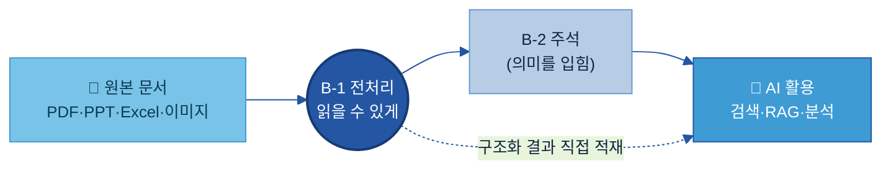
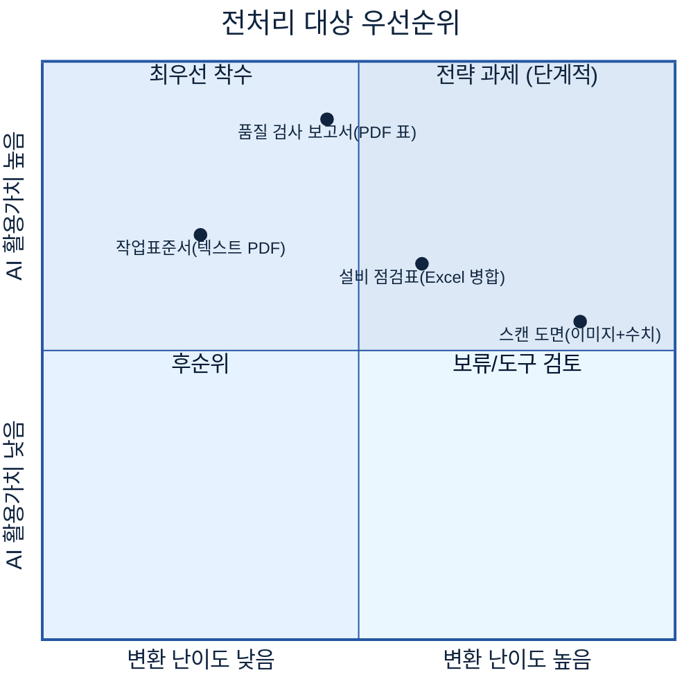
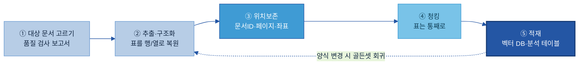
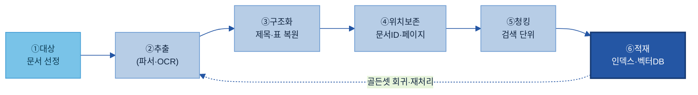
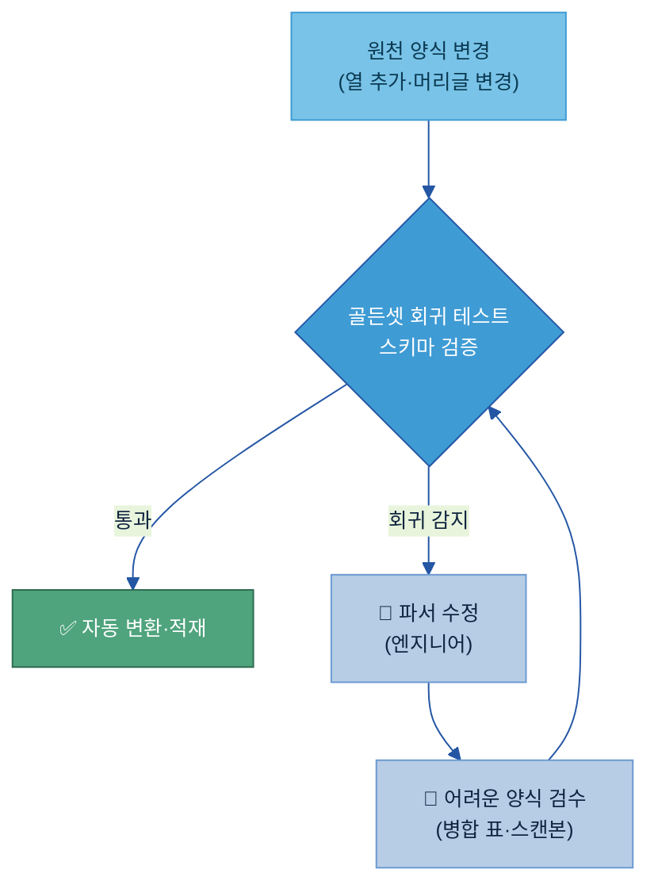
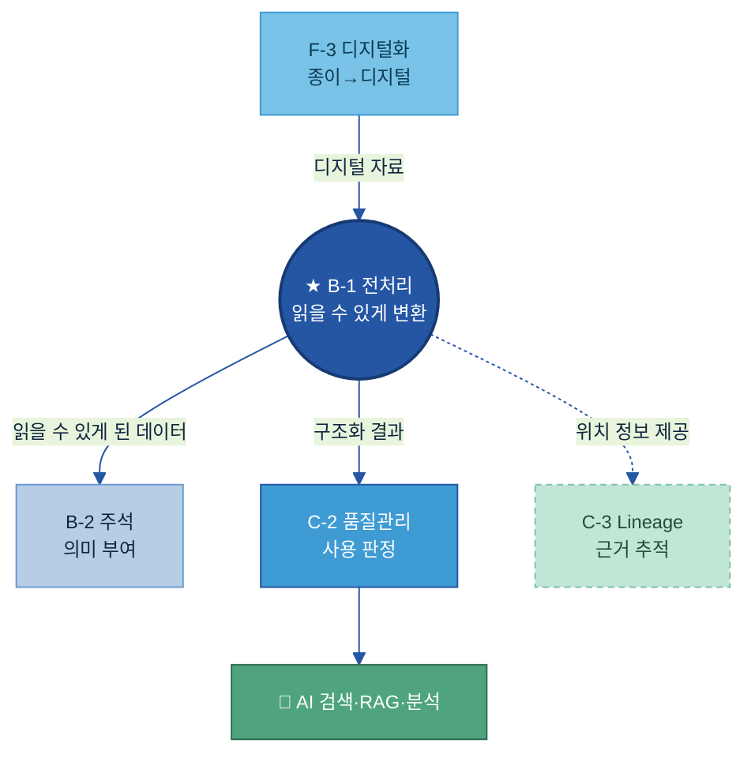
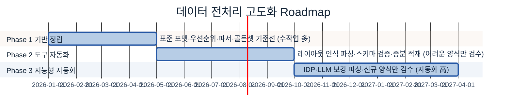

# B-1. 데이터 전처리 매뉴얼

> 한 줄 정의: 데이터 전처리(Data Preprocessing)는 **사람 눈에만 읽히던 문서·표·이미지(PDF·PPT·Excel·스캔본)를, AI가 읽고 검색·분석할 수 있는 구조화된 데이터로 변환하는 작업**이다 — 예: 품질 검사 보고서 PDF 속 표를 행/열 구조와 원본 위치 정보까지 살려 AI가 바로 집계·검색할 수 있게 만드는 것.

## 목차

1. [개요](#1-개요)
2. [왜 필요한가 (Why)](#2-왜-필요한가-why)
3. [무엇을 갖추나 (What)](#3-무엇을-갖추나-what)
4. [어디부터 하나 — 전처리 대상·우선순위](#4-어디부터-하나--전처리-대상우선순위)
5. [예시 시나리오: 두산에너빌리티 품질 검사 보고서 전처리](#5-예시-시나리오-두산에너빌리티-품질-검사-보고서-전처리)
6. [어떻게 준비·운영하나 (How)](#6-어떻게-준비운영하나-how)
7. [다른 주제와의 관계](#7-다른-주제와의-관계)
8. [성과 지표·고도화](#8-성과-지표고도화)
- [별첨(Appendix)](#별첨-appendix) · [참고자료(References)](#참고자료-references)

> 관련 가이드: [A-1 데이터 카탈로그](../A-1%20데이터%20카탈로그/A-1%20데이터%20카탈로그.md) · [B-2 데이터 해설·주석](../B-2%20데이터%20해설·주석/B-2%20데이터%20해설·주석.md) · [B-3 온톨로지](../B-3%20온톨로지/B-3%20온톨로지.md) · [C-2 데이터 품질 관리](../C-2%20데이터%20품질%20관리/C-2%20데이터%20품질%20관리.md) · [C-3 데이터 계통 Lineage](../C-3%20데이터%20계통%20Lineage/C-3%20데이터%20계통%20Lineage.md) · [F-3 데이터 디지털화](../F-3%20데이터%20디지털화/F-3%20데이터%20디지털화.md)

> [!question] 이 가이드가 답하는 5가지 핵심 질문 (Key Question)
> 데이터 전처리를 도입할 때 현업이 반드시 부딪히는 5가지 질문이다. 각 질문의 **한 줄 답**과 **자세히 다루는 위치**를 함께 적었다 — 본문을 읽다가 "이건 어느 질문에 대한 답이지?"가 헷갈리면 이 표로 돌아오면 된다.
>
> | # | 핵심 질문 | 한 줄 답 | 다루는 곳 |
> |---|---|---|---|
> | 1 | **어떤 데이터가** 전처리 대상인가? | 이미 디지털이지만 AI가 바로 읽기 어려운 자료(PDF·PPT·Excel·표·이미지)부터 | [§4.1](#kq1) |
> | 2 | **문서 유형별로** 무엇을 추출하나? | PDF=문단·표·페이지 / PPT=제목·본문·표 / Excel=시트·셀·병합 — 유형마다 추출 기준이 다름 | [§3.2](#kq2) |
> | 3 | 추출한 내용을 **어떤 구조로** 변환하나? | 텍스트·표·수치 + 원본 위치 정보를 보존한 JSON·Markdown·청크로 | [§3.3](#kq3) |
> | 4 | 원천 양식이 **바뀌어도** 어떻게 안정적으로 유지하나? | 파서 버전·골든 문서셋·스키마 검증으로 깨짐을 자동 감지 | [§3.4](#kq4) · [§6.4](#sec64) |
> | 5 | 전처리 결과를 **AI 활용 환경에** 어떻게 제공하나? | 용도에 맞게 검색 인덱스·벡터 DB·데이터레이크·분석 테이블로 적재 | [§6.3](#sec63) |

---

## 1. 개요

**👉 한 줄 요약:** 데이터 전처리는 "사람 눈에는 읽히지만 AI는 못 읽는" 문서를, AI가 읽고 검색·분석할 수 있는 **구조화된 형태로 번역**해 주는 작업이다.

### 1.1 데이터 전처리란

데이터 전처리(Data Preprocessing)는 문서·표·이미지처럼 **비정형·반정형(半定型)** 형태로 존재하는 데이터를, AI가 읽을 수 있는 **구조화(Structured)** 형태로 변환하는 작업이다. PDF 보고서, PPT 기술자료, Excel 점검표는 사람에게는 자연스럽게 읽히지만, AI 입장에서는 "글자가 어디서부터 어디까지 한 문단인지", "이 숫자가 표의 어느 행·열 값인지"가 파일 안에 명시돼 있지 않다. 전처리는 이 숨은 구조를 복원해 AI에게 넘겨준다.

**번역 비유로 이해하기.** 외국어로 된 계약서를 그대로 한국인 직원에게 주면 내용을 못 쓴다. 번역가가 문단·조항·표를 우리말 구조로 옮겨 줘야 비로소 업무에 쓸 수 있다. 전처리는 바로 이 "번역가" 역할을 — 사람의 문서 언어를 **기계가 읽는 데이터 구조**로 옮기는 일이다.

> **용어 풀이**
> - **비정형/반정형 데이터(Unstructured/Semi-structured Data):** 표 형태의 깔끔한 행·열(정형)이 아닌, 문서·이미지처럼 구조가 묻혀 있는 데이터. PDF·PPT·스캔 이미지가 비정형, 표 섞인 Excel·보고서가 반정형.
> - **구조화(Structuring):** 묻혀 있던 제목·문단·표·수치를 AI가 식별할 수 있게 분류·정리하는 것.
> - **파싱(Parsing):** 문서 파일을 읽어 그 안의 요소(텍스트·표·이미지)를 뽑아내는 것. "파서(Parser)"가 그 일을 하는 프로그램.

### 1.2 적용 범위 (무엇이 아닌지 경계 포함)

전처리는 "**이미 디지털로 존재하는** 자료를 AI가 읽을 구조로 바꾸는" 자리다. 경계를 분명히 해 두면 인접 주제와 헷갈리지 않는다.

| 구분 | 전처리(B-1)가 하는 것 | B-1이 하지 않는 것 (담당 주제) |
|---|---|---|
| 다루는 데이터 | 이미 디지털인 문서·표·이미지 | 종이 문서를 대량으로 디지털화·OCR ([F-3](../F-3%20데이터%20디지털화/F-3%20데이터%20디지털화.md)) |
| 하는 일 | 형식 변환 (읽을 수 있게) | 의미(정답) 라벨 부여 ([B-2](../B-2%20데이터%20해설·주석/B-2%20데이터%20해설·주석.md)) |
| 책임 범위 | 구조화 산출물 생성·적재 | 그 결과를 AI에 써도 되는지 품질 판정 ([C-2](../C-2%20데이터%20품질%20관리/C-2%20데이터%20품질%20관리.md)) |

> 한 줄로: **B-1은 "형식 변환"까지만** 책임진다. 대량 디지털화·OCR은 F-3, 의미 부여는 B-2, 사용 가능 판정은 C-2가 맡는다. (자세한 경계는 [7장](#7-다른-주제와의-관계).)

### 1.3 AI-ready 데이터 체계 내 위치

**👉 한 줄 요약:** 전처리는 "③ 이해할 수 있게(Understandable)" 그룹의 **첫 관문**으로, 원본 문서를 AI가 **읽을 수 있는 형태**로 만들어 그다음 단계(주석·품질·검색)에 넘긴다.



전처리(B-1)가 데이터를 AI가 **읽을 수 있는 형태**로 바꾸면, 그 위에 주석([B-2](../B-2%20데이터%20해설·주석/B-2%20데이터%20해설·주석.md))이 **의미(정답)**를 입히고, 품질([C-2](../C-2%20데이터%20품질%20관리/C-2%20데이터%20품질%20관리.md))이 **사용 가능 여부**를 판정한다. 다만 학습용 라벨이 필요 없는 검색·RAG용 자료는 전처리 결과가 곧바로 활용 환경으로 가기도 한다(위 점선). (20개 주제 전체 조감도는 [전체 목차](../../전체%20목차/00%20전체%20목차%20(20개%20주제).md) 참조.)

### 1.4 주요 대상 조직

전처리는 한 사람이 하는 일이 아니라, 어떤 문서를 먼저 할지 정하는 현업·실제 변환 로직을 만드는 엔지니어·결과를 검수하는 담당자가 역할을 나눠 만든다.

| 조직/역할 | 역할 |
|---|---|
| **지주/전사 데이터 조직** | 전처리 표준·출력 포맷·도구 표준 정의, 계열사 간 일관성 확보 |
| **데이터 오너 / 현업 SME** | 전처리 대상·우선순위 선정, 표·수치가 올바로 추출됐는지 최종 확인 (SME = Subject Matter Expert, 현업 전문가) |
| **데이터/AI 엔지니어** | 파서·변환 파이프라인 개발, 청킹·적재, 파서 버전·골든셋 관리 |
| **검수자(Reviewer)** | 어려운 양식(병합 표·스캔본) 추출 결과 점검·보정 |

🏭 **두산에너빌리티 예시.** 품질 검사 보고서 전처리를 시작할 때, 지주 데이터 조직이 출력 포맷(JSON+Markdown)·도구를 정하고, 품질팀 SME가 "어느 표·수치가 중요한지"를 짚어 준다. AI 엔지니어가 파서와 청킹·적재 파이프라인을 만들고, 검수자가 병합 표 추출 결과를 표본 점검한다.

---

## 2. 왜 필요한가 (Why)

**👉 한 줄 요약:** 데이터가 아무리 많아도 AI가 **읽지 못하는 형식**이면 한 글자도 못 쓴다 — 전처리는 "쌓여 있지만 못 쓰는 문서"를 "AI가 바로 쓰는 데이터"로 바꾸는, AI 활용의 가장 앞단 관문이다.

데이터 전처리가 지향하는 **핵심 목표(Key Objectives)**는 세 가지다 — ① **기계 가독성(機械可讀) 확보**(사람만 읽던 문서를 AI가 읽게), ② **구조·근거 보존**(표·수치·원본 위치를 잃지 않게), ③ **안정적·반복 가능한 변환**(양식이 바뀌어도 깨지지 않게).

### 2.1 현업 Pain Point

AI 과제에서 **모델보다 먼저 막히는 곳이 "문서를 데이터로 못 읽는 것"**이다. 두산에너빌리티 품질팀이 "검사 보고서 기반 불량 원인 질의응답 AI"를 착수했다. 보고서 PDF가 수천 건 쌓여 있지만, 학습·검색에 넣으려는 순간 세 가지 벽에 부딪힌다.

**Pain 1 — 사람 눈엔 읽혀도 AI는 표를 못 읽는다.** 보고서의 "공정별 검사 결과 표"를 그대로 텍스트로 뽑으면 `합격기준 0.05 실측 0.03 합격 0.05 0.06 불합격…`처럼 숫자가 한 줄로 뒤섞인다. 어느 수치가 어느 공정·어느 항목 값인지 AI가 분간하지 못한다.

**Pain 2 — 원본 위치를 잃어 근거를 못 댄다.** 운 좋게 텍스트를 뽑아도 "이 수치가 어느 보고서 몇 페이지에서 왔는지"가 사라진다. AI가 답을 만들어도 **근거 문서를 제시하지 못해** 현업이 믿고 쓰기 어렵다.

**Pain 3 — 양식이 바뀌면 그동안 만든 변환이 깨진다.** 분기마다 보고서 양식이 조금씩 바뀌고(열 추가, 머리글 변경), 사업부·설비마다 점검표 양식이 다르다. "A열=불량률"로 고정해 둔 변환 로직은 다음 분기에 전체 수치를 뒤섞어 놓는다. 그런데 깨진 사실조차 **AI 답이 이상해진 뒤에야** 뒤늦게 발견된다.

### 2.2 기대 효과

**① 문서 속 정보가 "검색·분석 가능한 데이터"로 살아난다.** 사람만 해석하던 표·수치·문단이 구조화되어, AI가 바로 검색·집계·분석한다. 데이터의 흐름이 **읽을 수 없는 문서 → 전처리 → AI-Ready 데이터**로 한 단계 올라선다.

🏭 폴더에 잠자던 검사 보고서 PDF 수천 건은 그대로는 못 쓰지만, 표를 행/열 구조로 살리고 페이지 위치를 붙이는 순간 "불량 원인 질의응답"의 검색 자료로 살아난다.

**② 근거를 추적할 수 있는 신뢰 가능한 활용.** 원본 위치 정보(페이지·표·좌표)를 보존하면, AI가 답과 함께 **"근거: 보고서 QR-2024-0123 45페이지"**를 제시한다. 현업이 원본을 클릭해 확인할 수 있어 신뢰가 올라가고, 감사·추적([C-3](../C-3%20데이터%20계통%20Lineage/C-3%20데이터%20계통%20Lineage.md))의 출발점이 된다.

**③ 한 번 만든 변환 자산의 반복 재사용.** 표준 포맷과 안정장치(파서 버전·골든셋)를 갖추면, 같은 양식의 문서는 사람 손 없이 자동으로 변환된다. 전처리가 일회성 수작업이 아니라 **반복 가동되는 파이프라인 자산**이 된다.

> **🏢 자회사 입장에서 — 이 가이드를 적용하면:** ① 사람이 보고서를 보고 일일이 옮겨 적던 *수작업이 사라지고*, ② AI 답에 *원본 근거가 따라붙어 믿고 쓸 수 있으며*, ③ 양식이 바뀌어도 *깨짐을 자동으로 감지*해 뒤늦게 터지는 사고를 막는다.

---

## 3. 무엇을 갖추나 (What)

**👉 한 줄 요약:** 전처리는 4가지를 갖춘다 — ① **변환 사슬(추출→구조화→위치보존→청킹, 정본 모델)** ② **문서 유형별 추출 기준**(PDF/PPT/Excel/이미지) ③ **구조화 결과물·청킹 기준** ④ **변환 안정장치**(양식이 바뀌어도 안 깨지게). 이 문서 전체가 이 모델을 일관되게 재사용한다.

### 3.1 ★ 정본 모델 — 전처리 변환 사슬 (추출 → 구조화 → 위치보존 → 청킹)

**👉 한 줄 요약:** 전처리는 한 번에 일어나는 일이 아니라, 원본 문서가 AI-Ready 데이터가 되기까지 거치는 **4단계 변환 사슬**이다. 가이드 전체가 이 4단계를 정본(canonical) 모델로 쓴다.

네 단계는 별개가 아니라 **같은 문서 한 건이 차례로 정제되는** 흐름이다 — 먼저 요소를 뽑고(추출), 요소를 분류해 구조를 살리고(구조화), 어디서 왔는지 꼬리표를 달고(위치보존), 검색 단위로 나눈다(청킹).


> 왼쪽 → 오른쪽으로 갈수록 **AI가 쓰기 좋은 형태**가 된다. 단순 검색용은 ①~③까지로 충분할 때도 있고, RAG용은 ④ 청킹까지 간다.

| 단계 | 이름 | 무엇을 하나 | 왜 필요한가 |
|---|---|---|---|
| ① | **추출(Extract)** | 문서 파일에서 텍스트·표·이미지·수치를 뽑아냄 | 파일 안에 묻힌 내용을 꺼내야 시작됨 |
| ② | **구조화(Structure)** | 뽑은 요소를 제목·문단·표·목록으로 분류, 표는 행/열 구조 복원 | 구조가 살아야 "어느 수치가 어느 칸"인지 AI가 앎 |
| ③ | **위치보존(Provenance)** | 각 요소에 문서ID·페이지·좌표를 꼬리표로 부착 | AI 답의 근거를 원본으로 역추적 가능 |
| ④ | **청킹(Chunking)** | 검색에 알맞은 크기 단위로 텍스트를 분할 | 너무 크면 부정확, 너무 작으면 문맥 손실 |

> **용어 풀이 — 단순 텍스트 추출 vs 레이아웃 인식 파싱.** 단순 추출은 글자만 순서대로 이어 붙여 **표 구조와 읽기 순서를 잃는다.** 레이아웃 인식 파싱(Layout-aware Parsing)은 페이지를 제목·문단·표·그림 블록으로 먼저 분류한 뒤 각각을 살려 뽑는다 — ①추출과 ②구조화를 함께 해낸다. 제대로 된 전처리는 후자를 쓴다. ([Unstructured PDF 파싱](https://unstructured.io/blog/how-to-parse-a-pdf-part-1))

<a id="kq2"></a>
### 3.2 문서 유형별 추출 기준

> ❓ **핵심 질문 2 — "문서 유형별로 무엇을 추출하나?"에 답하는 절.**

**👉 한 줄 요약:** PDF·PPT·Excel·이미지는 내부 구조가 전혀 다르므로 **유형마다 무엇을 어떻게 뽑을지가 다르다** — 아래에 유형별로 "무엇을 뽑고, 어떻게 전처리하는 게 좋은지"를 권장 순서·함정·예시까지 정리한다.

먼저 한눈에 본 뒤, 이어서 유형별로 자세히 본다.

| 유형 | 무엇을 추출하나 | 핵심 난점 (왜 어렵나) | 권장 처리 한 줄 |
|---|---|---|---|
| **PDF** | 문단·표·이미지·페이지 구조 | 인쇄 레이아웃 기반이라 읽기 순서·표 구조가 파일에 없음 | 레이아웃 인식 파싱 + 표 격자 복원 |
| **PPT(X)** | 슬라이드 제목·본문·도형 텍스트·표·노트 | 텍스트박스 순서(Z-order)가 뒤죽박죽, 차트는 내장 데이터 | 슬라이드 1장을 의미 단위로 묶기 |
| **Excel(XLSX)** | 시트·셀·수식·병합셀 구조 | 병합셀 빈칸, 색에 담긴 의미, 가로로 펼친 교차표 | 병합 풀고 → 교차표를 레코드로 펴기 |
| **이미지/스캔본** | 이미지 속 텍스트·표 | OCR + 표 구조 인식 필요, 기울기·저해상도 | 보정 → OCR → 저신뢰 셀 검수 |

> **용어 풀이**
> - **OCR(Optical Character Recognition, 광학 문자 인식):** 이미지·스캔본 속 글자를 텍스트로 바꾸는 기술.
> - **TSR(Table Structure Recognition, 표 구조 인식):** 이미지 속 표의 선·셀을 인식해 행/열 구조로 복원하는 기술.
> - **병합셀(Merged Cell):** Excel에서 여러 칸을 하나로 합친 셀. 추출 시 합쳐진 칸은 빈 값(None)으로 나와 별도 채움 처리가 필요하다.

#### 3.2.1 PDF — 레이아웃을 먼저 인식하고, 표는 격자로 복원한다

PDF는 인쇄 레이아웃 기반이라 "제목·문단·표"라는 논리 구조가 파일에 없다. 그래서 **글자만 순서대로 잇는 단순 추출은 표를 뭉개고 다단을 뒤섞는다.** 권장 순서는 이렇다.

1. **텍스트 PDF vs 스캔 PDF 판별.** 텍스트 레이어가 있으면 바로 파싱, 없으면(스캔본) OCR 경로로 보낸다.
2. **레이아웃 인식 파싱**으로 페이지를 제목·문단·표·그림 블록으로 분류한다(단순 추출 금지).
3. **표는 테두리 유형에 맞춰 복원** — 테두리 있는 표는 선(격자, Lattice) 방식, 테두리 없는 표는 공백 정렬(Stream) 방식으로 행/열을 잡는다.
4. **다단(2열) 레이아웃은 읽기 순서 복원** — 좌단 전체를 먼저 읽고 우단으로. 좌→우 줄바꿈으로 읽으면 두 단이 섞인다.
5. **반복 헤더·푸터·쪽번호 제거** — 매 페이지 반복되는 머리글이 본문 검색을 오염시키지 않게 걸러낸다.

> 함정: 다단 혼합 레이아웃, 테두리 없는 표, 수식·특수문자 인코딩 손실. → 까다로운 표가 많으면 PDF 표 전용 도구([Camelot](https://camelot-py.readthedocs.io)·[pdfplumber](https://github.com/jsvine/pdfplumber))로 보완한다.

**🏭 두산에너빌리티 — PDF 검사 표 추출, 전/후 완성 예시:**

```
[추출 전 — 단순 텍스트] (표가 한 줄로 뭉개짐)
  용접부 외관 0.05mm 0.03mm 합격 도장 두께 80㎛ 76㎛ 합격 …

[추출 후 — 레이아웃 인식 파싱] (행/열 구조 복원)
  | 공정     | 검사항목   | 합격기준 | 실측값 | 판정 |
  |----------|-----------|---------|--------|------|
  | 용접부   | 외관       | 0.05mm  | 0.03mm | 합격 |
  | 도장     | 두께       | 80㎛    | 76㎛   | 합격 |
```

#### 3.2.2 PPT — 슬라이드 한 장을 의미 단위로 묶는다

PPT는 한 슬라이드 안에 제목·본문·도형·표·차트가 흩어져 있고, 텍스트박스가 화면 위치가 아니라 **만든 순서(Z-order)**로 저장돼 있어 그냥 뽑으면 순서가 뒤죽박죽이다. 권장 순서는 이렇다.

1. **슬라이드 단위로 순회**하며 제목 → 본문(불릿, 들여쓰기 깊이 보존) → 표(행/열) → 도형·텍스트박스 → 발표자 노트를 차례로 뽑는다.
2. **읽기 순서 재정렬** — 텍스트박스를 좌표(위→아래, 좌→우) 기준으로 다시 정렬해 사람이 보는 순서로 맞춘다.
3. **슬라이드 1장 = 자연스러운 청크 단위.** 슬라이드 번호·제목을 맥락(위치 정보)으로 붙여 둔다.
4. **차트·이미지 슬라이드 처리** — 차트는 글자가 아니라 내장 데이터이므로 데이터값을 표로 뽑거나 캡션으로 요약하고, 그림만 있는 슬라이드는 OCR한다.

> 함정: 도형 안 텍스트 누락, 차트 축·범례 라벨, 애니메이션으로 겹친 중복 텍스트. 구형 `.ppt`(바이너리)는 `.pptx`로 먼저 변환한다.

**🏭 두산에너빌리티 — PPT 기술자료 슬라이드 1장, 구조화 완성 예시:**

```json
{
  "chunk_id": "TECH-2026-블레이드_p7",
  "type": "slide",
  "title": "터빈 블레이드 용접 결함 유형",
  "body": ["1. 크랙 — 표면 선형 균열", "2. 기공 — 내부 공동", "3. 언더컷 — 모재 패임"],
  "table": "| 결함 | 허용기준 | 검출법 |\n| 크랙 | 불허 | PT |\n| 기공 | Ø0.5↓ | RT |",
  "notes": "고온부는 PT 우선, 두께 10mm↑는 RT 병행",
  "provenance": { "doc_id": "TECH-2026-블레이드", "slide": 7 }
}
```

#### 3.2.3 Excel — 병합을 풀고, 가로로 펼친 교차표를 레코드로 편다

Excel은 사람이 보기 좋게 만든 탓에 AI에겐 가장 까다롭다. **병합셀은 빈칸**으로 나오고, **색에 담긴 의미**(빨강=이상)는 기계가 못 읽으며, **가로로 월·항목을 펼친 교차표(wide)**는 "한 행 = 한 관측"이 아니라 AI가 다루기 어렵다. 권장 순서는 이렇다.

1. **표 영역(머리글 행) 식별** — 한 시트에 제목 행·요약 행·여러 표가 섞일 수 있으니 실제 데이터 표의 머리글 위치를 먼저 잡는다.
2. **병합셀 풀기** — 병합 범위를 찾아 값을 아래·옆으로 채워(forward-fill) 모든 칸에 값이 있게 한다.
3. **수식은 계산값 사용** — 수식 문자열(`=SUM(...)`)이 아니라 결과값을 쓴다.
4. **색·서식의 의미를 명시화** — "빨강=이상" 같은 시각 규칙은 별도 컬럼(`이상여부`)으로 데이터화한다.
5. **교차표(wide) → 레코드(long) 정규화(unpivot)** — 가로로 펼친 월·항목을 세로 레코드로 펴서 "한 행 = 한 관측"으로 만든다. AI 검색·집계가 쉬워진다.
6. **레코드(행) 단위 또는 표 단위로 청킹**하고, 시트·설비명을 위치 정보로 붙인다.

> 함정: 병합셀 None, 다중 시트 간 관계(요약↔상세), 색·아이콘에만 담긴 판정, 설비마다 다른 열 구성. → 설비별 양식이 다르면 양식별 파서 + 골든셋([§3.4](#kq4))으로 관리한다.

**🏭 두산밥캣 — 설비 점검표 Excel, 정규화 완성 예시:**

```
[원본 — 가로 교차표(wide) + 색으로 이상 표시]
  설비       | 1주차 | 2주차 | 3주차      ← '윤활' 카테고리는 병합셀로 묶임
  CNC-01    | 정상  | 정상  | [빨강]이상

[전처리 후 — 레코드(long) + 색을 컬럼으로]
  | 설비    | 카테고리 | 점검주차 | 결과 | 이상여부 |
  |---------|---------|---------|------|---------|
  | CNC-01  | 윤활     | 3주차    | 이상 | true    |   ← 병합 풀림·색→이상여부
```

#### 3.2.4 이미지·스캔본 — 보정 → OCR → 저신뢰 셀 검수

스캔 문서·사진·도면은 글자가 픽셀로만 있어 OCR이 필수다. 권장 순서는 이렇다.

1. **이미지 보정** — 기울기 보정(deskew)·해상도/대비 개선으로 OCR 정확도를 먼저 올린다.
2. **OCR로 텍스트화**, 표는 **TSR로 행/열을 복원**한다.
3. **셀별 신뢰도(confidence)를 함께 받아** 낮은 셀은 플래그를 달아 사람 검수로 보낸다(전수 검수 아님).
4. **도면 속 치수·손글씨**는 정확도가 낮으므로 별도 특수 처리·검수 대상으로 둔다.

> 함정: 손글씨, 저해상도, 도면 치수선. 종이 문서를 **대량으로** 스캔·디지털화하는 일 자체는 [F-3 디지털화](../F-3%20데이터%20디지털화/F-3%20데이터%20디지털화.md)의 몫이고, B-1은 그 결과(이미지)를 구조화한다.

(유형별 추출 기법·라이브러리 상세 → [Backup 3-A](#backup-3-a-문서-유형별-추출-기법-상세))

<a id="kq3"></a>
### 3.3 구조화 결과물과 청킹 기준

> ❓ **핵심 질문 3 — "추출한 내용을 어떤 구조로 변환하나?"에 답하는 절.**

**👉 한 줄 요약:** 추출 결과는 **원본 위치 정보를 붙인 JSON·Markdown·청크**로 변환한다 — 표는 통째로 한 덩어리로 유지하고, 텍스트는 검색에 알맞은 크기로 나눈다.

**(1) 출력 포맷.** 용도에 따라 형태를 고른다.

| 포맷 | 용도 | 특징 |
|---|---|---|
| **JSON** | 프로그램 처리·벡터 DB 입력 | 요소별 타입·텍스트·좌표·메타데이터를 구조적으로 담음 |
| **Markdown** | AI/RAG 입력·사람 확인 | 제목(`#`)·표(`\|`)로 계층을 표현, 읽기 편함 |
| **HTML 표** | 표 구조 보존 | `<table>` 태그로 병합셀 포함 행/열을 정확히 보존 |

**(2) 원본 위치 정보(Provenance) 보존.** 전처리의 핵심 부가가치다. 각 요소에 **문서ID·페이지·좌표·요소유형·청크ID**를 붙여 두면, AI 답의 근거를 원본으로 역추적할 수 있다([C-3 Lineage](../C-3%20데이터%20계통%20Lineage/C-3%20데이터%20계통%20Lineage.md)의 출발점).

**🏭 두산에너빌리티 — 구조화된 청크 1건, 완성 예시:**

```json
{
  "chunk_id": "QR-2024-0123_p45_tbl2_r07",
  "type": "table_row",
  "content": "용접부 / 외관 / 합격기준 0.05mm / 실측 0.03mm / 판정 합격",
  "provenance": {
    "doc_id": "QR-2024-0123",          // 어느 보고서
    "page": 45,                          // 몇 페이지
    "table_no": 2, "row": 7,             // 어느 표 몇 행
    "bbox": [412, 880, 1190, 928]        // 페이지 내 좌표(근거 하이라이트용)
  }
}
```

**(3) 청킹(Chunking) 기준.** 청킹은 구조화된 텍스트를 **검색 단위로 나누는** 일이다. 너무 크면 여러 주제가 섞여 검색이 부정확해지고, 너무 작으면 문맥이 잘린다.

- **표는 반드시 통째로 한 청크.** 행 단위로 자르면 머리글(헤더)과 데이터가 분리되어 "어느 열 값인지"를 잃는다. → 표는 Markdown/HTML로 직렬화해 한 청크로.
- **제목·섹션 경계를 지켜 나눈다.** 구조가 뚜렷한 문서는 제목 단위로 나누면 검색 정확도가 높다.
- **시작 기준값(권장).** 대략 250토큰(~1,000자) + 20~50토큰 겹침(overlap)에서 출발해 PoC로 조정. (전략별 장단점 → [Backup 3-B](#backup-3-b-청킹-전략-비교))

> **용어 풀이 — 청크(Chunk)·겹침(Overlap):** 청크는 검색을 위해 나눈 텍스트 한 조각. 겹침은 앞 청크의 끝 일부를 다음 청크 앞에 겹쳐 둬, 경계에서 문맥이 끊기지 않게 하는 장치. *(청킹은 "데이터를 검색 가능한 단위로 준비"하는 일이며, RAG 앱을 만드는 일은 아니다.)*

<a id="kq4"></a>
### 3.4 변환 안정장치 (양식이 바뀌어도 안 깨지게)

> ❓ **핵심 질문 4 — "원천 양식이 바뀌어도 어떻게 안정적으로 유지하나?"에 답하는 절** (운영 절차는 [§6.4](#sec64)).

**👉 한 줄 요약:** 원천 양식은 반드시 바뀐다 — 깨짐을 **사람이 뒤늦게 발견하지 않도록**, 파서 버전·골든 문서셋·스키마 검증으로 변경을 자동 감지하는 안전장치를 둔다.

규칙 기반 파서는 열 순서·머리글·여백이 조금만 바뀌어도 조용히 잘못된 값을 뱉는다. 이를 막는 세 가지 장치를 갖춘다.

- **파서 버전 관리(Parser Versioning):** 어떤 파서·설정으로 언제 변환했는지를 결과에 기록한다. 결과가 이상하면 "파서 변경 탓인지"를 되짚을 수 있다.
- **골든 문서셋(Golden Test Set):** 대표 양식·까다로운 사례·과거 양식을 모은 **고정 테스트 문서**와 그 "정답 출력"을 보관한다. 파서를 고치거나 양식이 바뀌면 이 골든셋을 다시 돌려, 출력이 정답과 어긋나면(=회귀) 파이프라인을 멈춘다. ([골든 테스트 개념](https://www.shaped.ai/blog/golden-tests-in-ai))
- **스키마 검증(Schema Validation):** 파싱 결과가 정해진 구조(필드명·타입·필수값)를 지키는지 매번 확인한다. 어긋난 입력을 초기에 격리한다. ([JSON Schema 검증](https://www.datahen.com/blog/ensuring-data-quality-with-json-schema-validation-in-data-processing-pipelines/))

**🏭 두산에너빌리티 — 골든셋 회귀 감지, 완성 예시:**

```
────────────────────────────────────────────
 골든셋     : qc-report-templates  (대표 양식 12종)
 파서 버전  : qc-parser v2.3  (2026-05-02)
 회귀 테스트: 2026-06-15 양식 변경(검사항목 열 추가) 후 자동 실행
 결과       : 표 2번 "판정" 열이 한 칸씩 밀림 → ❌ 회귀 감지, 파이프라인 중단
 조치       : 파서 v2.4로 열 매핑 수정 → 골든셋 통과 후 재가동
────────────────────────────────────────────
```

이 장치가 없었다면 밀린 판정 값이 그대로 적재돼, **AI 답이 틀어진 뒤에야** 문제를 알았을 것이다. (안정장치 구성·베스트 프랙티스 → [Backup 3-C](#backup-3-c-변환-안정장치-상세))

---

## 4. 어디부터 하나 — 전처리 대상·우선순위

**👉 한 줄 요약:** 모든 문서를 한 번에 전처리하지 않는다 — **AI가 바로 읽기 어렵고, AI 활용 가치가 크며, 반복 사용이 많은 문서부터** 골라서 한다.

<a id="kq1"></a>
### 4.1 전처리 대상

> ❓ **핵심 질문 1 — "어떤 데이터가 전처리 대상인가?"에 답하는 절.**

전처리 대상은 "이미 디지털이지만 AI가 **바로 읽기 어려운**" 자료다.

| 대상 | 왜 전처리가 필요한가 |
|---|---|
| **PDF 보고서·매뉴얼** | 표·다단 레이아웃·페이지 구조가 묻혀 있어 그대로는 못 읽음 |
| **PPT 기술자료** | 슬라이드·도형·표에 정보가 흩어져 있음 |
| **Excel 점검표·집계표** | 병합셀·다중 시트·색 의미로 구조가 복잡 |
| **스캔된 디지털 문서·이미지** | 글자가 픽셀로만 존재 → OCR 필요 |
| **반정형 보고서(폼 양식)** | 항목명·값 쌍이 자유 레이아웃에 흩어져 있음 |

> 반대로, 이미 깔끔한 정형 테이블(예: MES·ERP의 DB 테이블)은 구조가 살아 있어 전처리 대상이 아니다. 그런 자산의 등록·탐색은 [A-1 카탈로그](../A-1%20데이터%20카탈로그/A-1%20데이터%20카탈로그.md)가 맡는다. 또 **종이 문서를 대량으로 디지털화**하는 일은 [F-3 디지털화](../F-3%20데이터%20디지털화/F-3%20데이터%20디지털화.md)의 몫이다.

### 4.2 우선순위

대상을 정했으면 **AI 활용 가치(많이·자주 쓰일까)** × **변환 난이도(파싱이 쉬운가)**로 우선순위를 매긴다. 가치가 높고 난이도가 낮은 것부터 착수한다.



🏭 **두산에너빌리티.** 불량 원인 질의응답 가치가 가장 큰 **품질 검사 보고서(PDF 표)를 1순위**로, 텍스트 위주라 변환이 쉬운 작업표준서를 함께 착수한다. 병합 표가 많은 설비 점검표는 골든셋을 갖춘 뒤, 스캔 도면 속 치수(고난도)는 도구 검토 후로 미룬다.

---

## 5. 예시 시나리오: 두산에너빌리티 품질 검사 보고서 전처리

**👉 한 줄 요약:** 품질팀이 보고서를 일일이 눈으로 보고 옮겨 적던 일을, 전처리 파이프라인으로 바꿔 AI가 표·수치를 바로 검색하고 원본 페이지까지 근거로 제시하는 모습을 보여준다 — 효과 확인 후 6장의 구체적 방법으로 넘어간다.

### 5.1 적용 전 / 후

**AS-IS (전처리 없음):** 불량 원인을 찾으려면 담당자가 수천 건 보고서 PDF를 열어 표를 눈으로 훑고, 필요한 수치를 Excel로 옮겨 적는다. 표가 텍스트로 뭉개져 검색도 안 되고, 분기마다 양식이 바뀌어 누적 비교도 어렵다.

**TO-BE (전처리 도입):**

| 항목 | AS-IS | TO-BE |
|---|---|---|
| 표·수치 활용 | 사람이 PDF 열어 눈으로 찾고 옮겨 적음 | 행/열 구조로 추출 → AI가 바로 검색·집계 |
| 근거 제시 | 출처를 따로 기억·메모 | 답에 "보고서 QR-2024-0123 45p" 자동 첨부 |
| 양식 변경 | 바뀐 줄 모르고 잘못 집계 | 골든셋이 회귀 자동 감지·중단 |
| 재사용 | 매번 수작업 반복 | 같은 양식은 파이프라인이 자동 변환 |

### 5.2 흐름 미리보기



> **효과 미리보기.** 보고서를 전처리하면 검색·집계 시간이 크게 줄고(↓), AI 답에 원본 근거가 따라붙어 신뢰가 오른다(↑). 핵심은 **양식이 바뀌어도 골든셋이 자동으로 잡아낸다**는 점 — 사람이 사고 난 뒤 수습하지 않는다. 이 흐름의 세부 방법이 6장에서 다뤄진다.

---

## 6. 어떻게 준비·운영하나 (How)

**👉 한 줄 요약:** 전처리는 "대상 선정 → 추출 → 구조화 → 위치보존 → 청킹 → 적재"의 **6단계 파이프라인**으로 구축하고, 운영 단계에서는 양식 변경을 골든셋으로 감지하며 어려운 양식만 사람이 검수한다.

### 6.1 6단계 구축 파이프라인



①(대상)·③~⑤(구조화·위치보존·청킹)는 [3장](#3-무엇을-갖추나-what)·[4장](#4-어디부터-하나--전처리-대상우선순위)에서 갖춘 것을 실행에 옮기는 단계다. 이 장에서는 도구 선택(6.2)·적재(6.3)·운영(6.4)을 다룬다.

### 6.2 ② 변환 도구 검토

**👉 한 줄 요약:** 문서 유형·표 복잡도·데이터 민감도(외부 전송 가능 여부)에 따라 도구를 고른다 — 복잡한 표는 전용 파서, 민감 데이터는 로컬 실행 도구, 다국어 OCR은 클라우드를 본다.

도구는 크게 **오픈소스 라이브러리**와 **클라우드 상용 서비스**로 나뉜다. 가격·버전·한국어 지원 범위는 변동되므로 단정하지 말고 PoC·공식 문서로 확인한다.

| 도구 | 유형 | 잘하는 것 | 표 / 레이아웃 |
|---|---|---|---|
| [Docling](https://github.com/docling-project/docling) (IBM) | 오픈소스 | 복잡한 표 구조 보존, **로컬 실행**(민감 데이터) | ★★★ / ★★★ |
| [Unstructured](https://unstructured.io) | 오픈소스+SaaS | 다양한 포맷 통합, OCR | ★★ / ★★ |
| [LlamaParse](https://developers.llamaindex.ai/python/framework/llama_cloud/llama_parse/) | 클라우드 API | 빠른 처리, LLM-ready Markdown | ★★ / ★★★ |
| [Camelot](https://camelot-py.readthedocs.io) · [pdfplumber](https://github.com/jsvine/pdfplumber) | 오픈소스 | PDF 표 전용 세밀 추출 | ★★★(표) / △ |
| [Azure AI Document Intelligence](https://azure.microsoft.com/ko-kr/products/ai-services/ai-document-intelligence) | 클라우드 | 커스텀 모델, 한국어 | ★★★ / ★★★ |
| [Google Document AI](https://cloud.google.com/document-ai) | 클라우드 | 폭넓은 다국어(한국어 포함, 범위는 공식 문서 확인) | ★★★ / ★★★ |

★★★ 우수 / ★★ 양호 / △ 제한적. (도구별 입출력·한계·OCR 지원 상세 → [Backup 6-A](#backup-6-a-전처리-도구-비교-상세))

> **🏭 두산에너빌리티 도구 선택 — 완성 예시.** 검사 보고서에 **복잡한 표가 많고 사외 전송이 제한**되므로, 로컬 실행되는 [Docling](https://github.com/docling-project/docling)을 1차 파서로 두고, 표가 까다로운 양식은 [Camelot](https://camelot-py.readthedocs.io)으로 보완한다. 스캔본·다국어가 섞인 문서는 OCR이 강한 클라우드를 PoC로 검토한다.

<a id="sec63"></a>
### 6.3 ⑥ 적재 — AI 활용 환경에 제공

> ❓ **핵심 질문 5 — "전처리 결과를 AI 활용 환경에 어떻게 제공하나?"에 답하는 절.**

**👉 한 줄 요약:** 같은 전처리 결과라도 **쓰임에 따라** 적재처가 다르다 — 의미 검색은 벡터 DB, 키워드 검색은 검색 인덱스, 장기 보관·재처리는 데이터레이크, 집계·BI는 분석 테이블.

| 적재 대상 | 언제 쓰나 | 대표 제품(예) |
|---|---|---|
| **벡터 DB(Vector DB)** | AI가 의미 유사도로 문서를 찾을 때(RAG) | [pgvector](https://github.com/pgvector/pgvector) · [Milvus](https://milvus.io/docs) · [Pinecone](https://www.pinecone.io/) · [Chroma](https://www.trychroma.com/) |
| **검색 인덱스(Search Index)** | 키워드·하이브리드 검색이 필요할 때 | [Elasticsearch](https://www.elastic.co/docs/solutions/search/vector) · [OpenSearch](https://docs.opensearch.org/latest/vector-search/) |
| **데이터레이크(Data Lake)** | 원시 변환 결과를 장기 보관·재처리할 때 | 사내 데이터레이크/레이크하우스 |
| **분석 테이블(Analytics Table)** | BI·대시보드·집계 쿼리에 수치를 바로 쓸 때 | DW/레이크하우스의 정형 테이블 |

> **용어 풀이 — 벡터 DB·임베딩(Embedding).** 임베딩은 텍스트를 "의미 좌표(숫자 벡터)"로 바꾼 것. 벡터 DB는 이 좌표를 저장해 **단어가 달라도 의미가 가까우면 찾아 주는** 검색을 가능하게 한다. *(전처리는 임베딩할 깨끗한 청크를 "준비"하는 데까지가 책임이며, 임베딩 모델을 만드는 것은 아니다.)*

🏭 **두산에너빌리티.** "최근 분기 용접 불량 추세"처럼 수치 집계는 **분석 테이블**로, "유사 불량 원인 사례 찾아줘"처럼 의미 검색은 **벡터 DB**로 동시에 적재한다. (배치 vs 증분 적재 → [Backup 6-B](#backup-6-b-배치-vs-증분-처리).) 단, 적재 후 그 데이터를 AI에 **써도 되는지 품질 판정**은 [C-2](../C-2%20데이터%20품질%20관리/C-2%20데이터%20품질%20관리.md)가 맡는다.

<a id="sec64"></a>
### 6.4 운영 — 양식 변경 대응·사람 검수·역할

**👉 한 줄 요약:** 운영의 핵심은 "양식이 바뀌면 골든셋이 잡아내고, 어려운 것만 사람이 보고, 결과를 다시 적재"하는 루프다.



- **양식 변경 대응:** 스키마 검증·골든셋([§3.4](#kq4))이 회귀를 잡으면 파서를 고치고, 골든셋을 갱신한 뒤 재가동한다. 과거 양식도 하위 호환 테스트용으로 보관한다.
- **사람 검수 지점:** 전수 검수가 아니라 **병합 표·저품질 스캔본·도면 속 수치·내부 약어**처럼 자동 추출이 약한 곳만 검수한다.
- **역할 분담:** **오너/SME**(대상·중요 표 확인) · **엔지니어**(파서·청킹·적재·골든셋) · **검수자**(어려운 양식 보정). 사내 약어·설비코드 후처리는 [A-3 Glossary](../A-3%20비즈니스%20Glossary/A-3%20비즈니스%20Glossary.md)의 표준 용어를 활용한다.

---

## 7. 다른 주제와의 관계

**👉 한 줄 요약:** 전처리는 "형식 변환(읽을 수 있게)"까지만 책임진다 — 대량 디지털화는 F-3, 의미 부여는 B-2, 사용 판정은 C-2, 근거 추적은 C-3가 분담한다.

### 7.1 인접 주제와의 역할 분담

| 인접 주제 | B-1이 하는 것 | 인접 주제가 하는 것 | 연계 포인트 |
|---|---|---|---|
| [F-3 데이터 디지털화](../F-3%20데이터%20디지털화/F-3%20데이터%20디지털화.md) | 이미 디지털인 자료 형식 변환 | 종이 문서를 대량 스캔·OCR로 디지털화 | 디지털화된 산출물이 전처리 입력 |
| [B-2 데이터 해설·주석](../B-2%20데이터%20해설·주석/B-2%20데이터%20해설·주석.md) | 형식 변환(읽을 수 있게) | 의미(정답) 라벨 부여(배울 수 있게) | 전처리된 데이터에 주석 |
| [C-2 데이터 품질 관리](../C-2%20데이터%20품질%20관리/C-2%20데이터%20품질%20관리.md) | 구조화 산출물 생성·적재 | 그 데이터를 AI에 써도 되는지 판정 | 적재 결과를 Quality Gate에 |
| [C-3 데이터 계통 Lineage](../C-3%20데이터%20계통%20Lineage/C-3%20데이터%20계통%20Lineage.md) | 원본 위치 정보(provenance) 부착 | 그 이력을 이어 답변 근거를 추적 | 위치 정보가 Lineage 출발점 |
| [A-1 데이터 카탈로그](../A-1%20데이터%20카탈로그/A-1%20데이터%20카탈로그.md) | 비정형 문서를 구조화 | 자산의 소재·등록·탐색 | 전처리 산출물도 자산으로 등록 |

🏭 **경계 예시 — 검사 보고서 1건:** B-1은 표를 행/열 구조와 페이지 좌표까지 살려 **읽을 수 있게** 만든다. 이 표에 "불량 유형=용접결함" 같은 학습 라벨을 붙이는 일은 [B-2](../B-2%20데이터%20해설·주석/B-2%20데이터%20해설·주석.md), 이 데이터를 AI에 써도 되는지 판정은 [C-2](../C-2%20데이터%20품질%20관리/C-2%20데이터%20품질%20관리.md), 답변이 이 표에서 나왔음을 역추적하는 일은 [C-3](../C-3%20데이터%20계통%20Lineage/C-3%20데이터%20계통%20Lineage.md)가 맡는다.

> **★ 가장 헷갈리는 경계 — B-1 vs [F-3](../F-3%20데이터%20디지털화/F-3%20데이터%20디지털화.md).** 둘 다 "문서를 데이터로 바꾼다"는 점은 같지만, **F-3는 종이·아날로그를 대량으로 디지털화(스캔·OCR)**하는 일이고, **B-1은 이미 디지털인 자료를 AI가 읽을 구조로 변환**하는 일이다. F-3가 "디지털로 만들기", B-1이 "구조화하기"다.

### 7.2 전체 조감도 — 경계 한눈에

B-1을 가운데 두고 인접 주제가 무엇을 분담하는지를 한 장으로 본다. 화살표 위 글자가 **B-1과 주고받는 것**이다.


> 점선 `B-1 ┈ C-3`는 "전처리가 붙인 **위치 정보가 근거 추적의 출발점**이 된다"는 뜻이다.

---

## 8. 성과 지표·고도화

### 8.1 성과 지표 (KPI)

**👉 한 줄 요약:** 전처리 성과는 "얼마나 정확히 뽑는가" + "양식이 바뀌어도 안 깨지는가" + "사람 손 없이 자동으로 도는가"로 측정한다.

| KPI | 쉬운 의미 | 산식(개념) | 방향 | 주기 |
|---|---|---|---|---|
| **전처리 완료율** | 대상 중 오류 없이 변환된 비율 | 완료 건수 ÷ 전체 대상 | ↑ | 월 |
| **표·수치 추출 정확도** | 추출된 표 셀이 원문과 일치하는 정도 | F1 / TEDS / GriTS | ↑ | 배치별 |
| **양식 변경 무중단율** | 양식 변경 후 깨짐 없이 처리한 비율 | 정상 처리 ÷ 양식 변경 이벤트 | ↑ | 분기 |
| **직통 처리율(STP)** | 사람 개입 없이 자동 완료된 비율 | 자동 완료 ÷ 전체 처리 | ↑ | 월 |
| **다운스트림 검색 기여** | 전처리 품질이 AI 검색 정확도에 준 기여 | Retrieval Precision@K 변화 | ↑ | 과제별 |

> 이 지표들은 [2.2 기대 효과](#22-기대-효과)와 직접 연결된다 — 추출 정확도↑는 "정보가 살아남", 무중단율↑·STP↑는 "안정·자동화"의 측정값이다. (지표 해석·표 추출 평가지표 상세 → [Backup 8-A](#backup-8-a-kpi-해석과-표-추출-평가지표).)

### 8.2 고도화 Roadmap

**👉 한 줄 요약:** 처음엔 사람이 손으로 옮겨 적다가, 표준 파서로 자동 추출을 보조하고, 점차 지능형 처리로 어려운 양식만 사람이 보며, 최종적으로 신규 양식만 검수하는 자동화로 나아간다.



| 단계 | 핵심 | 사람 개입 |
|---|---|---|
| **Phase 1 — 기반 정립** | 표준 출력 포맷·우선순위·1차 파서·골든셋 기준선 수립 | 대부분 수작업 |
| **Phase 2 — 도구 자동화** | 레이아웃 인식 파싱·스키마 검증·증분 적재로 안정화 | 어려운 양식만 검수 |
| **Phase 3 — 지능형 자동화** | 지능형 문서 처리(IDP)·LLM 보강 파싱으로 양식 내성↑ | 신규·예외 양식만 검수 |

> **용어 풀이 — IDP(Intelligent Document Processing, 지능형 문서 처리):** 규칙 기반을 넘어 머신러닝·NLP로 다양한 양식을 학습해 처리하는 방식. 양식이 조금 바뀌어도 잘 견딘다. (단계별 도입 기술·제조 성숙도 경로 → [Backup 8-B](#backup-8-b-고도화-단계-상세).)

---

## 별첨 (Appendix)

### [Backup 3-A] 문서 유형별 추출 기법 상세

| 유형 | 대표 라이브러리/기법 | 핵심 처리 |
|---|---|---|
| PDF(텍스트) | [PyMuPDF](https://pymupdf.readthedocs.io)·[pdfplumber](https://github.com/jsvine/pdfplumber) | 블록 좌표·폰트로 읽기 순서 복원, 텍스트 추출 |
| PDF(표) | [Camelot](https://camelot-py.readthedocs.io)(Lattice/Stream)·[Tabula](https://tabula-py.readthedocs.io) | 선·공백 기반 표 격자 인식 → DataFrame |
| PDF(스캔) | OCR + TSR (클라우드 또는 Docling) | 픽셀→텍스트, 표 선 인식 |
| PPTX | [python-pptx](https://python-pptx.readthedocs.io) | 슬라이드 계층(제목·본문·도형·표·노트) 순회 |
| XLSX | [openpyxl](https://openpyxl.readthedocs.io)·pandas | 병합셀 값 전파(forward-fill), 수식·캐시값 구분 |
| 다포맷 일괄 | [Apache Tika](https://tika.apache.org)·[Unstructured](https://unstructured.io) | 1,000+ 포맷 텍스트·메타데이터 추출 |

> 병합셀 처리: 병합 영역은 첫 칸에만 값이 있고 나머지는 `None` → 병합 범위를 탐지해 값을 아래·옆으로 채운(fill) 뒤 구조화한다.

### [Backup 3-B] 청킹 전략 비교

| 전략 | 방법 | 장점 | 단점·주의 |
|---|---|---|---|
| 고정 크기(Fixed-size) | N토큰마다 분할 + 겹침 | 단순·빠름 | 문장·논리 중간 절단 위험 |
| 구조 기반(Recursive) | 단락→줄→문장 순 우선 분할 | 자연 경계 존중 | 표·다단 레이아웃 취약 |
| 제목 기반(By-title) | H1·H2 섹션 단위 분할 | 섹션 경계 유지, 검색 정확 | 제목 불규칙 문서엔 제한 |
| 의미 단위(Semantic) | 임베딩 유사도로 주제 전환 탐지 | 주제 일관성 최고 | 계산 비용↑, 단순 문서엔 과함 |
| **표(Table)** | 표 전체를 직렬화해 1청크 | 헤더-데이터 결합 유지 | 초대형 표는 논리 그룹으로 분할 |

출처: [Chunking Strategies (Weaviate)](https://weaviate.io/blog/chunking-strategies-for-rag) · [Unstructured 청킹 가이드](https://unstructured.io/blog/chunking-for-rag-best-practices) · [RAG 청킹 단계 (Microsoft Learn)](https://learn.microsoft.com/en-us/azure/architecture/ai-ml/guide/rag/rag-chunking-phase)

### [Backup 3-C] 변환 안정장치 상세

골든 문서셋 구성: ① 대표 양식 샘플 ② 까다로운 엣지케이스 ③ 과거 버전 양식. 각각에 "정답 출력(golden output)"을 짝지어 보관하고, 파서 코드/설정·타임스탬프를 함께 기록한다. 허용 오차는 "핵심 필드 100% 일치 / 부가 필드 90%↑"처럼 정한다. 양식이 공식 변경되면 골든 파일을 갱신하되 이전 버전도 하위 호환 테스트용으로 남긴다. 출력 차이(diff)가 개선인지 회귀인지는 담당자가 검토한다.

출처: [Golden Tests in AI (Shaped)](https://www.shaped.ai/blog/golden-tests-in-ai) · [Golden Dataset (DAC.digital)](https://dac.digital/what-is-a-golden-dataset/) · [JSON Schema 검증 (DataHen)](https://www.datahen.com/blog/ensuring-data-quality-with-json-schema-validation-in-data-processing-pipelines/)

### [Backup 6-A] 전처리 도구 비교 상세

| 도구 | 입력 | 출력 | 한계 |
|---|---|---|---|
| [Docling](https://github.com/docling-project/docling) | PDF·DOCX·PPTX·XLSX·이미지 | JSON(좌표)·Markdown·HTML | 처리 속도 느린 편, 고밀도 수치표 간헐 오인 |
| [Unstructured](https://unstructured.io) | PDF·DOCX·PPTX·HTML·이미지 등 | JSON(요소·좌표) | 복잡한 다중행 표 컬럼 이동 오류 |
| [LlamaParse](https://developers.llamaindex.ai/python/framework/llama_cloud/llama_parse/) | 주로 PDF | Markdown·JSON | 인터넷 필수(클라우드), 크레딧 과금 |
| [Azure AI Document Intelligence](https://azure.microsoft.com/ko-kr/products/ai-services/ai-document-intelligence) | PDF·이미지 등 | JSON(좌표·신뢰도) | Azure 의존, 가격 PoC 확인 |
| [AWS Textract](https://aws.amazon.com/textract/) | PDF·이미지 | JSON(블록·좌표) | 한국어 지원 범위 확인 필요 |
| [Google Document AI](https://cloud.google.com/document-ai) | PDF·이미지 | JSON(좌표·신뢰도) | GCP 의존, 가격 PoC 확인 |

> 선택 축: **표 복잡도**(전용 파서 필요?) · **데이터 민감도**(사외 전송 가능?→로컬 Docling) · **언어/스캔**(OCR 강한 클라우드) · **기존 인프라**(MS=Azure, AWS=Textract). 가격·버전·한국어 범위는 변동되므로 단정하지 말고 PoC로 확인한다. 벤치마크: [Docling vs LlamaParse vs Unstructured (Procycons)](https://procycons.com/en/blogs/pdf-data-extraction-benchmark/).

### [Backup 6-B] 배치 vs 증분 처리

| 방식 | 설명 | 언제 적합 |
|---|---|---|
| 배치(Batch) | 주기적으로 전체·대량을 한꺼번에 처리 | 지연 허용, 원천 부하 회피 |
| 증분(Incremental) | 마지막 처리 이후 변경분만 처리 | 최신성 중요, 비용 절감 |
| 마이크로 배치 | 짧은 주기로 소량씩 | 준실시간 + 안정성 병행 |

증분 감지: 타임스탬프 / CDC(Change Data Capture, 변경 로그 캡처) / 내용 해시 비교. 출처: [증분 수집 전략 (Unstructured)](https://unstructured.io/insights/incremental-data-ingestion-strategies-for-continuous-pipelines) · [ETL 증분 로딩 (Airbyte)](https://airbyte.com/data-engineering-resources/etl-incremental-loading)

### [Backup 8-A] KPI 해석과 표 추출 평가지표

- **F1 Score:** 정밀도(Precision)와 재현율(Recall)의 조화평균. F1 = 2PR/(P+R).
- **TEDS(Tree Edit Distance-based Similarity):** 표를 HTML 트리로 보고 편집 거리로 유사도 평가 — 구조·내용 동시 평가.
- **GriTS(Grid Table Similarity):** 표를 2D 격자로 보고 내용·구조·위치를 균등 평가.
- **Retrieval Precision@K:** 검색 상위 K개 중 실제로 관련 있는 비율 — 전처리 품질이 검색에 준 기여를 본다.

출처: [표 추출 평가 가이드 (Nanonets)](https://nanonets.com/blog/the-ultimate-guide-to-assessing-table-extraction/) · [데이터 파이프라인 모니터링 (Atlan)](https://atlan.com/data-pipeline-monitoring/)

### [Backup 8-B] 고도화 단계 상세

1단계 수작업 → 2단계 규칙 기반 파서(+골든셋·스키마 검증으로 안정화) → 3단계 IDP 반자동(ML+NLP, 어려운 양식만 검수) → 4단계 LLM 보강 완전 자동화(예외·신규 양식만 검수). 제조 현실 경로: 대부분 1~2단계에 있으므로, 반복 빈도 높은 품질 보고서·설비 점검표부터 골든셋으로 안정화하고 STP 목표를 세워 단계적으로 이행한다. 출처: [문서 처리 자동화 (Nanonets)](https://nanonets.com/blog/document-processing/) · [IDP 가이드 (BizData360)](https://www.bizdata360.com/intelligent-document-processing-idp-ultimate-guide-2025/) · [제조 데이터 성숙도 (Ansoim)](https://www.ansoim.com/data-maturity-manufacturing-strategic-roadmap-for-transformation)

---

## 참고자료 (References)

> 접속일: 2026-06-18. 가격·버전·언어 지원 범위 등 변동 정보는 각 공식 문서·PoC로 재확인한다.

**파싱 도구·라이브러리 (공식)**
- [Unstructured](https://unstructured.io) — 다포맷 파싱 (오픈소스+SaaS)
- [Docling (IBM, GitHub)](https://github.com/docling-project/docling) — 레이아웃·표 인식 (로컬 실행)
- [LlamaParse 공식 문서](https://developers.llamaindex.ai/python/framework/llama_cloud/llama_parse/) — 클라우드 파싱
- [PyMuPDF](https://pymupdf.readthedocs.io) · [pdfplumber](https://github.com/jsvine/pdfplumber) — PDF 텍스트·표
- [Camelot](https://camelot-py.readthedocs.io) · [Tabula-py](https://tabula-py.readthedocs.io) — PDF 표 전용
- [python-pptx](https://python-pptx.readthedocs.io) · [openpyxl](https://openpyxl.readthedocs.io) — PPT·Excel
- [Apache Tika](https://tika.apache.org) — 1,000+ 포맷 텍스트·메타데이터

**클라우드 문서 지능 (공식)**
- [Azure AI Document Intelligence](https://azure.microsoft.com/ko-kr/products/ai-services/ai-document-intelligence)
- [AWS Textract](https://aws.amazon.com/textract/)
- [Google Document AI](https://cloud.google.com/document-ai)

**적재 — 벡터 DB·검색 (공식)**
- [pgvector](https://github.com/pgvector/pgvector) · [Milvus](https://milvus.io/docs) · [Pinecone](https://www.pinecone.io/) · [Chroma](https://www.trychroma.com/)
- [Elasticsearch 벡터 검색](https://www.elastic.co/docs/solutions/search/vector) · [OpenSearch 벡터 검색](https://docs.opensearch.org/latest/vector-search/)

**기법·평가·로드맵 (참고)**
- [Unstructured — PDF 파싱](https://unstructured.io/blog/how-to-parse-a-pdf-part-1) · [청킹 가이드](https://unstructured.io/blog/chunking-for-rag-best-practices)
- [Chunking Strategies (Weaviate)](https://weaviate.io/blog/chunking-strategies-for-rag) · [RAG 청킹 단계 (Microsoft Learn)](https://learn.microsoft.com/en-us/azure/architecture/ai-ml/guide/rag/rag-chunking-phase)
- [Golden Tests in AI (Shaped)](https://www.shaped.ai/blog/golden-tests-in-ai) · [JSON Schema 검증 (DataHen)](https://www.datahen.com/blog/ensuring-data-quality-with-json-schema-validation-in-data-processing-pipelines/)
- [표 추출 평가 (Nanonets)](https://nanonets.com/blog/the-ultimate-guide-to-assessing-table-extraction/) · [데이터 파이프라인 모니터링 (Atlan)](https://atlan.com/data-pipeline-monitoring/)
- [RAG 전처리 역할 (deepset)](https://www.deepset.ai/blog/preprocessing-rag) · [문서 처리 자동화 (Nanonets)](https://nanonets.com/blog/document-processing/)
- [PDF 데이터 추출 벤치마크 (Procycons)](https://procycons.com/en/blogs/pdf-data-extraction-benchmark/)

---

## 변경 이력 / 피드백 반영

| 일자 | 버전 | 피드백 (누가/무엇) | 반영 내용 | 반영 위치 |
|------|------|--------------------|-----------|-----------|
| 2026-06-18 | 0.1 | 초안 작성 (00 전체 목차 B-1 8섹션 + B-2 가이드 스타일 참고) | 전처리 변환 사슬 정본 모델·KQ 5문항·도구/적재 출처 링크 포함 작성 | 전체 |
| 2026-06-19 | 0.2 | 고객: "PPT·Excel 등 유형별로 어떻게 전처리하는지 디테일하게" | §3.2를 유형별(PDF·PPT·Excel·이미지) 권장 처리 순서·함정·완성 예시로 확장 (PPT 슬라이드 구조화·Excel 병합 풀기·교차표 정규화 예시 추가) | §3.2 |
