# B-1. 데이터 전처리(Data Preprocessing) 매뉴얼

---

## 목차

- [이 가이드가 답하는 5가지 질문](#key-questions)

1. [Why — 왜 필요한가](#s2)
    - [1.1 전처리 없이 AI 활용이 어려운 이유](#s21)
2. [What — 데이터 전처리란 무엇인가](#s3)
    - [2.1 데이터 전처리의 의미](#s11)
    - [2.2 전처리 4단계](#sec31)
    - [2.3 구조화 산출물](#kq3)
3. [When — 어디부터 하나](#s4)
    - [3.1 전처리 대상](#kq1)
4. [How — 어떻게 구축·운영하나](#s5)
    - [4.1 구축 흐름과 두 가지 실행 방식](#s51)
    - [4.2 문서 유형별 전처리](#kq2)
    - [4.3 복잡한 문서의 LLM 기반 구조화](#sec62)
    - [4.4 적재 — AI 활용 환경에 제공](#sec63)
    - [4.5 운영과 역할](#sec64)
5. [Tech Stack — 전처리 솔루션 비교](#tech)
6. [Where — 다른 주제와의 관계](#s6)

- [별첨 (Appendix)](#별첨-appendix)
    - [주요 용어](#s81)

- [참고자료 (References)](#참고자료-references) · [변경 이력 / 피드백 반영](#변경-이력--피드백-반영)

---

> **예시 표기 안내:** 본 가이드의 표·예시에 나오는 구체 값(보고서 번호·수치·설비/라인 번호·날짜 등)은 이해를 돕기 위한 가상 예시이며 실제 데이터가 아니다. 실제 값은 PoC·프로젝트에서 확정한다. 계열사명도 적용 맥락 설명용이다.

> **관련 가이드:** [A-1 데이터 카탈로그](../A-1%20데이터%20카탈로그/A-1%20데이터%20카탈로그.md) · [B-2 데이터 해설·주석](../B-2%20데이터%20해설·주석/B-2%20데이터%20해설·주석.md) · [B-3 온톨로지](../B-3%20온톨로지/B-3%20온톨로지.md) · [C-2 데이터 품질 관리](../C-2%20데이터%20품질%20관리/C-2%20데이터%20품질%20관리.md) · [C-3 데이터 계통 Lineage](../C-3%20데이터%20계통%20Lineage/C-3%20데이터%20계통%20Lineage.md) · [F-3 데이터 디지털화](../F-3%20데이터%20디지털화/F-3%20데이터%20디지털화.md)

이 가이드는 전처리가 왜 필요한지(1장), 무엇이고 무엇을 만들어 내는지(2장), 어떤 문서부터 할지(3장), 실제로 어떻게 하고 운영하는지(4장)를 다룬다. 끝까지 강조하는 메시지는 하나다. 문서를 읽어 내는 AI 기술은 빠르게 좋아졌지만, 그 기술을 제대로 쓰려면 사람이 “이 문서를 어떻게 읽고 정리할지” 단계를 먼저 잘 나눠 두고 AI에 시켜야 한다.

<a id="key-questions"></a>

## 이 가이드가 답하는 5가지 질문

| 질문 | 한 줄 답 | 본문 |
|---|---|---|
| 데이터 전처리란 무엇인가 | 문서에 묻힌 텍스트·표·수치를 AI가 읽을 데이터로 바꾸는 일 — 추출 → 정제 → 구조화 → 청킹의 네 단계 | [2장](#s3) |
| 언제, 어떤 문서부터 해야 하나 | 모든 문서를 한 번에 하지 않고, AI가 읽기 어렵고 활용 가치·반복이 큰 문서부터 착수 | [3장](#s4) |
| 문서 유형별 전처리 방법은 | PDF·PPT·Excel·스캔본·이메일·Word/HWP·CSV·회의록마다 어려운 점과 쓰는 도구가 다르다 | [4.2](#kq2) |
| 파서(규칙·도구)와 LLM 중 무엇을 쓰나 | 양식이 일정하면 파서, 까다롭거나 제각각이면 LLM — 흔히 섞어 쓴다 | [4.1](#s51) |
| 만든 데이터는 어디에 넣고 어떻게 유지하나 | 용도에 따라 벡터 DB·검색 인덱스·분석 테이블에 적재하고, 양식이 바뀌면 골든셋 대조로 잡아낸다 | [4.4](#sec63) · [4.5](#sec64) |

---

<a id="s2"></a>

## 1. Why — 왜 필요한가

데이터가 아무리 많아도 AI가 읽지 못하는 형식이면 활용으로 이어지지 않는다. 계열사 인터뷰에서도 AI 과제의 초기 부담 상당수가 모델이 아니라 문서를 데이터로 바꾸는 단계에 몰려 있었다. 전처리는 이 부담을 표준화해, 쌓여 있지만 못 쓰던 문서를 AI가 바로 쓰는 데이터로 전환한다.

<a id="s21"></a>

### 1.1 전처리 없이 AI 활용이 어려운 이유

제조 현장에는 이미 많은 데이터가 존재한다. 그러나 상당수 데이터는 AI가 바로 활용할 수 있는 형태로 정리되어 있지 않아, 실제 AI 과제를 추진하는 과정에서 반복적인 정제와 구조화 작업이 필요하다.

특히 제조업에서는 데이터가 여러 시스템과 문서 형식에 분산되어 있거나, 동일한 정보가 서로 다른 기준으로 저장되는 경우가 많아 데이터 준비에 상당한 시간이 소요된다.

대표적인 사례는 다음과 같다.

| 상황 | 실제 문제 |
|---|---|
| 데이터가 많고 여러 파일에 분산되어 있음 | 호기별 성능 테스트 데이터는 제품 한 대당 수십 개 파일과 수백 개 태그로 구성되어 있어 분석 이전에 병합·정제 작업이 선행되어야 한다. |
| 기술 문서가 PDF·이미지 형태로만 존재함 | 시험성적서, 정비 매뉴얼, 기술 문서가 스캔본이나 PDF 형태로 보관되어 있어 OCR과 문서 파싱 없이는 검색이나 AI 활용이 어렵다. |
| 도면 정보를 구조적으로 활용하기 어려움 | Wiring Diagram, CAD 도면은 부품명, 부품번호, 객체 정보가 분리되어 있어 부품과 절차를 연결한 검색이나 추론이 어렵다. |
| 핵심 데이터가 수기 Excel로 관리됨 | 생산계획, 품질 이력, 시험 결과 등이 수기 Excel에 저장되어 있어 갱신 주기와 관리 기준이 불명확하고 AI 활용에 적합한 구조로 정리되어 있지 않다. |

이들의 공통점은 데이터가 없는 것이 아니라, 이미 존재하는 데이터를 AI가 읽고 활용할 수 있는 형태로 정리하는 과정이 부족하다는 점이다.

데이터 전처리는 이러한 문제를 해결하기 위해 원본 데이터를 추출·정리·구조화하여 AI가 활용 가능한 형태로 변환하는 역할을 수행한다.

<a id="s3"></a>

## 2. What — 데이터 전처리란 무엇인가

이 장은 전처리가 무엇이고 무엇으로 이루어지는지를 설명한다. 구축 절차와 유형별 처리 방법은 [4장](#s5)에서 다루고, 여기서는 전처리의 정의와 구성 요소, 그 산출물의 형태를 정의한다.

<a id="s11"></a>

### 2.1 데이터 전처리의 의미

데이터 전처리는 문서·표·이미지처럼 비정형·반정형으로 쌓인 데이터를 AI가 읽고 검색·분석할 수 있는 구조화된 형태로 바꾸는 활동이다. 품질 성적서·설비 점검표·작업표준서·운전 로그는 사람에게는 자연스럽게 읽히지만, AI에게는 어디까지가 한 문단인지, 어떤 숫자가 표의 어느 칸 값인지가 파일에 드러나 있지 않다. 전처리는 문서 내 구조 정보를 추출하여 AI가 활용 가능한 형태로 변환한다.

이는 파서를 만드는 기술 과제가 아니라 AI-ready Data 관점의 데이터 준비 활동이다. 가이드도 추출 알고리즘이 아니라, 어떤 문서를 어떤 순서로 전처리해 재사용 가능한 데이터 자산으로 만들지를 다룬다.

전처리는 데이터를 이해할 수 있게(Understandable) 만드는 그룹의 첫 관문이다. 원본 문서를 AI가 읽을 수 있는 형태로 바꾼 뒤, 그 위에서 주석이 의미를 입히고 품질 관리가 사용 가능 여부를 판정한다.

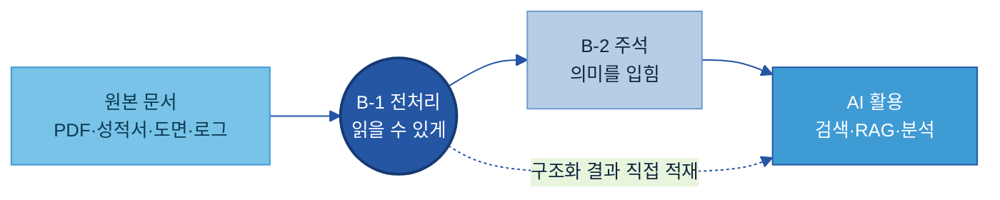

학습용 라벨이 필요 없는 검색·RAG(Retrieval-Augmented Generation, AI가 답할 때 근거 문서를 검색해 함께 활용하는 방식)용 자료는 전처리 결과가 곧바로 활용 환경으로 가기도 한다(위 점선).

<a id="sec31"></a>

### 2.2 전처리 4단계

전처리는 한 번에 끝나는 작업이 아니라, 원본 문서 한 건이 AI-ready 데이터가 되기까지 거치는 네 단계의 연속이다. 본 가이드는 이 네 단계를 전처리의 표준 흐름으로 사용한다.

```text
원본 문서 1건
→ ① 추출(Extract)    텍스트·표·이미지·수치를 뽑아냄 (각 요소가 어느 페이지·좌표에서 왔는지도 함께 기록)
→ ② 정제(Clean)      머리글·쪽번호·잡음 제거, 인코딩·단위·날짜 정규화, 중복 제거
→ ③ 구조화(Structure) 제목·문단·표로 분류하고 표는 행·열을 복원
→ ④ 청킹(Chunk)      검색에 알맞은 단위로 분할
```

정제·구조화를 거쳐야 AI가 특정 수치가 어느 항목 값인지 알 수 있고, 추출할 때 어느 문서·페이지에서 나왔는지를 함께 적어 두면 답의 근거를 원본에서 찾을 수 있다. 청킹 크기는 너무 크면 검색이 부정확하고 너무 작으면 문맥이 끊긴다. 활용 목적에 따라 어디까지 하는지는 달라진다 — 단순 검색은 구조화까지로 충분한 경우도 있고, RAG는 보통 청킹까지 한다.

<a id="kq3"></a>

### 2.3 구조화 산출물

JSON, Markdown, 표는 구조화 결과를 표현하는 형식일 뿐이다. 전처리의 목적은 특정 형식을 만드는 것이 아니라 AI 활용에 필요한 구조와 출처 정보를 확보하는 것이다. 그래서 산출 형식은 정해져 있지 않고, 그 데이터를 어디에 쓸지에 따라 고른다.

- RAG·의미 검색에 넣을 때는 사람이 읽듯 자연스러운 Markdown 청크로 내보낸다.
- 집계·BI·대시보드에는 한 행이 한 관측인 레코드(표)로 만든다.
- 벡터 DB 입력이나 프로그램 처리에는 요소별 타입·좌표를 담은 JSON으로 만든다.
- 병합셀이 있는 표는 구조를 정확히 보존하는 HTML·Markdown 표로 둔다.

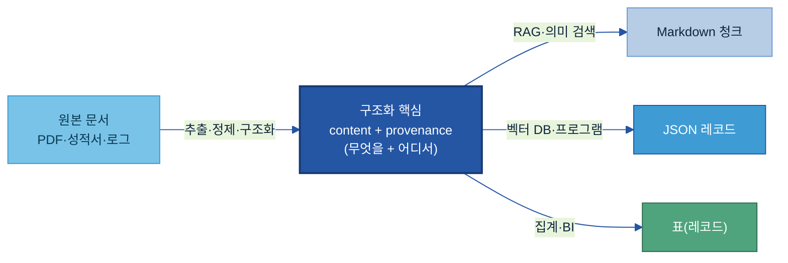

형식이 무엇이든 가운데의 두 가지는 변하지 않는다. 산출물의 한 조각인 청크는 무엇을 담았는지(content)와 어디서 왔는지(provenance)를 함께 갖춰야 한다. **바로 이 두 가지가 사람만 읽던 문서를 AI가 읽는 데이터로 바꾸는 지점이다** — content가 행·열 구조로 살아 있어야 AI가 값의 의미와 위치를 해석할 수 있고, provenance가 있어야 답변과 함께 "어느 보고서 몇 페이지"인지를 근거로 제시할 수 있다. (이 가이드의 예시 결과가 JSON이 많은 까닭은 구조와 출처를 한눈에 드러내기 위해서이며, 같은 청크라도 RAG에 넣을 때는 Markdown으로 내보내는 경우가 많다.)

청킹 단위는 문서 유형에 따라 다르다. PDF·Word 보고서는 제목(섹션) 단위로 나누되 표는 통째로 별도 청크로 두고, PPT는 슬라이드 한 장, Excel·CSV는 표 또는 레코드(행) 단위, 이메일은 정리된 본문 한 통, 회의록은 한 화제(연속 발화) 단위로 묶는다. 표를 행 단위로 쪼개면 머리글과 데이터가 분리되어 어느 열 값인지를 잃으므로, 표는 Markdown이나 HTML로 직렬화해 한 청크로 둔다.

> **권장 — 청크 크기 시작값.** 대략 250토큰에 20~50토큰의 겹침(overlap)으로 시작해 조정한다. 검색이 엉뚱한 조각을 물어오면 청크를 줄이고, 답에 문맥이 잘려 보이면 늘린다. 250토큰은 한글로 짧은 한두 문단 분량이다.

<a id="s82"></a>

**청킹 전략.** 문서를 어떤 기준으로 자르느냐에 따라 검색 품질이 달라진다. 대표적인 방식은 다음과 같다.

| 전략 | 어떻게 나누나 | 잘 맞는 문서 | 주의·팁 |
|---|---|---|---|
| 고정 크기 | 정해진 토큰 수(예: 250)로 끊고 앞뒤 청크를 조금 겹침 | 구조가 약한 자유 텍스트(메모·서술형 설명) | 문장·표 한가운데서 잘릴 수 있어, 문장 경계에 맞춰 끊는 게 안전 |
| 구조 기반 | 제목·문단·표 같은 문서 구조의 경계로 나눔 | 제목 계층이 뚜렷한 보고서·작업표준서(SOP) | 제목을 청크 앞에 함께 넣어 두면 무슨 절 내용인지 검색에 유리 |
| 표 단위 | 표는 행으로 쪼개지 않고 머리글까지 통째로 한 청크 | 표가 핵심인 성적서·점검표 | 행으로 쪼개면 머리글이 떨어져 "어느 열 값"인지 잃음 |
| 의미 단위 | 내용·주제가 바뀌는 지점에서 끊음 | 화제가 이어지는 회의록·긴 설명문 | 길이가 들쭉날쭉해지므로 최대 길이 상한을 같이 둠 |
| 계층(부모–자식) | 검색은 작은 청크로 하되, 답변에는 그 청크가 속한 상위 섹션을 함께 제공 | 정확한 검색과 충분한 문맥이 둘 다 필요할 때 | 작은 청크에도 출처·상위 제목을 같이 달아 둠 |

구조가 뚜렷한 제조 문서는 **구조 기반 + 표 단위**를 기본으로 쓴다 — 제목 단위로 나누되 표는 통째로 둔다. 구조가 약한 메모·로그 설명문에만 고정 크기를 보조로 쓰고, 화제가 흐르는 회의록은 의미 단위가 잘 맞는다. 어느 전략이든 인접 청크를 조금 겹쳐(overlap) 경계에서 문맥이 끊기지 않게 한다.

<a id="s4"></a>

## 3. When — 어디부터 하나

모든 문서를 한 번에 전처리하지 않는다. AI가 바로 읽기 어렵고, 활용 가치가 크며, 반복 사용이 많은 문서부터 골라서 착수한다.

<a id="kq1"></a>

### 3.1 전처리 대상

전처리 대상은 이미 디지털 형태로 존재하지만 AI가 직접 활용하기 어려운 자료이다. 제조 현장에서 가장 자주 만나는 유형은 다음과 같다.

- 품질 성적서·기술문서(PDF): 표·다단 레이아웃·페이지 구조로 되어 있어 텍스트만 뽑으면 구조가 사라진다.
- 기술 제안서·교육자료(PPT): 정보가 슬라이드·도형·표로 나뉘어 담긴다.
- 설비 점검표·집계표(Excel): 병합셀과 다중 시트가 있고, 색으로 의미를 구분하는 경우도 있어 구조가 복잡하다.
- 스캔 문서·도면·이미지: 글자가 픽셀로만 있어 OCR과 객체 인식이 필요하다.
- 운전·설비 로그(CSV): 인코딩·구분자·단위 행이 섞여 그대로는 깨진다.

이메일·작업일지·회의록도 구조가 그대로 드러나 있지 않아 전처리 대상이며, 유형별 처리는 [4.2](#kq2)에서 다룬다.

> **주의 — DB 테이블과 내보낸 CSV의 경계.** 이미 깔끔한 정형 테이블(MES·ERP의 DB 테이블)은 구조가 살아 있어 전처리 대상이 아니다. 등록·탐색은 [A-1 카탈로그](../A-1%20데이터%20카탈로그/A-1%20데이터%20카탈로그.md)가 맡는다. 반면 그 테이블을 파일로 내보낸 CSV·설비 로그는 인코딩·구분자·단위 행이 섞여 깨지므로 전처리 대상에 해당한다.

<a id="s5"></a>

## 4. How — 어떻게 구축·운영하나

전처리는 다음 순서로 한다 — 구축 흐름과 두 가지 실행 방식을 잡고([4.1](#s51)), 문서 유형별로 처리하며([4.2](#kq2)), 까다로운 양식은 사람이 단계를 나눠 LLM에 시키고([4.3](#sec62)), 그 결과를 AI가 쓸 곳에 적재해([4.4](#sec63)) 양식이 바뀌어도 계속 돌아가게 운영한다([4.5](#sec64)). 어떤 솔루션을 쓸지는 [5장 Tech Stack](#tech)에서 비교한다.

<a id="s51"></a>

### 4.1 구축 흐름과 두 가지 실행 방식

전처리의 핵심은 [2.2](#sec31)의 네 단계(①추출 → ②정제 → ③구조화 → ④청킹)다. 구축할 때는 그 앞에 무엇부터 할지 고르는 대상 선정을, 뒤에 AI가 쓸 곳에 넣는 적재를 붙여 하나의 파이프라인으로 돌린다.

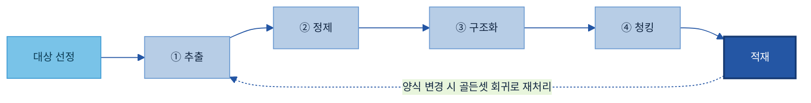

추출과 구조화를 실제로 해내는 방법은 크게 두 갈래다 — 양식이 일정한지, 문서마다 제각각인지로 갈린다.

| 구분 | 규칙·도구 기반 | LLM 기반 |
|---|---|---|
| 적용 상황 | 양식이 일정하고 대량일 때 | 양식이 까다롭거나 문서마다 제각각일 때 |
| 처리 방식 | 정해진 규칙·파서로 뽑아냄 | 사람이 정리 절차를 단계로 쪼개 LLM에 시킴 |
| 강점 | 빠르고 저렴, 같은 입력에 늘 같은 결과 | 양식이 달라도 단계 정의만 바꾸면 됨 |
| 한계 | 병합·계층·조건부처럼 규칙이 복잡해지면 코드가 조용히 깨짐 | 느리고 비싸며 없는 값을 지어낼 위험 → 검증 필요 |
| 대표 도구 | 코드 파서·전용 라이브러리(PDF 표 Camelot·Excel openpyxl)·OCR·파싱 솔루션(Docling·Azure) | 비전(이미지·표 인식)을 지원하는 범용 LLM |

이 두 갈래가 4장에서 나뉜다 — [4.2](#kq2) 문서 유형별 전처리는 주로 도구·파서 길로 유형마다 처리하고, [4.3](#sec62)은 LLM 길을 깊이 다룬다. 둘은 배타적이지 않아 흔히 섞어 쓴다 — 쉽고 정형인 문서는 도구로 대량 처리하고, 같은 문서 안에서도 까다로운 표·항목만 LLM에 맡긴다(예: 이메일 본문은 규칙으로, 깨끗이 안 떨어지는 인용·서명은 LLM으로). 솔루션을 규칙 기반 라이브러리·파싱 솔루션·LLM 세 갈래로 더 나눠 비교한 것은 [5장 Tech Stack](#tech)에 있다.

어려운 문서일수록 LLM에 맡기는 방식이 주력이며, 그 방법은 [4.3](#sec62)에서 다룬다.

[2.2](#sec31)의 네 단계가 이 장에서 이렇게 나뉘어 다뤄진다 — ①추출·②정제·③구조화는 문서 유형마다 방식이 달라 [4.2](#kq2)(유형별)와 [4.3](#sec62)(LLM)에서 다루고, ④청킹은 유형과 무관하게 공통이라 [2.3](#kq3)의 단위·전략을 따른다. 출처(어느 문서·페이지)는 ①추출 때 함께 적어 두며, 유형별 예시 결과에 붙은 `provenance`가 그것이다.

<a id="kq2"></a>

### 4.2 문서 유형별 전처리

문서 유형마다 내부 구조가 달라 무엇을 어떻게 뽑을지도 다르다. 여기서 다루는 유형별 처리는 양식이 일정한 문서를 규칙 기반 파서·솔루션으로 다루는 경우다. 병합·계층·조건부 기준처럼 코드로 짜기 어려운 까다로운 문서는 LLM에 맡긴다([4.3](#sec62)). 아래는 자주 만나는 여덟 유형을 무엇이 어렵고 어떤 도구로 처리하며 결과가 어떻게 달라지는지 가상 예시로 보여준다. 예시는 구조·출처를 드러내려 JSON으로 적었지만, RAG에 넣을 땐 Markdown으로 내보내기도 한다([2.3](#kq3)).

| 유형 | 핵심 난점 | 권장 처리 | 대표 도구 |
|---|---|---|---|
| PDF | 읽기 순서·표 구조가 파일에 없음 | 레이아웃 인식 파싱 + 표 격자 복원 | Docling·Unstructured / Camelot·pdfplumber |
| PPT | 텍스트박스 순서가 뒤섞임, 차트는 내장 데이터 | 슬라이드 1장을 의미 단위로 묶기 | python-pptx |
| Excel | 병합셀 빈칸, 색에 담긴 의미, 가로 교차표 | 병합 풀고 교차표를 레코드로 펴기 | openpyxl·pandas |
| 이미지·스캔본 | 글자가 픽셀, OCR·객체 인식 필요 | 보정 → OCR → 저신뢰 셀 검수 | Tesseract / Azure·Google·AWS OCR |
| 이메일 | 인용·서명이 본문에 섞임, 표·이미지·첨부가 분리 | 메타데이터 분리 → 최신 본문만 → 표·이미지·첨부 라우팅 | extract-msg·readpst / Graph API / talon·html2text |
| Word·HWP | 제목이 스타일로만 표현됨, HWP 파서 빈약 | 스타일을 제목 계층으로 복원 | python-docx·Mammoth / hwp5·LibreOffice |
| CSV | 인코딩·구분자 혼재, 단위 행, 대용량 | 인코딩 감지 → 정규화 → 레코드로 펴기 | pandas·charset-normalizer |
| 채팅·회의록 | 발화자 표기 제각각, 한 줄에 여러 발화 | 발화자·시각 분리 → 발화 단위 정렬 | 정규식 / webvtt-py |

<a id="t-pdf"></a>

#### 4.2.1 PDF

PDF는 인쇄 레이아웃 기반이라 제목·문단·표라는 논리 구조가 파일에 없다. 그래서 글자만 순서대로 잇는 단순 추출은 표를 뭉개고 다단을 뒤섞는다. PDF가 글자를 텍스트 데이터로 담고 있는지(텍스트 PDF — 복사·검색이 되는 PDF), 아니면 종이를 촬영·스캔해 이미지로만 되어 있는지(스캔 PDF — 글자가 픽셀이라 OCR이 필요)를 먼저 구분하고, 레이아웃 인식 파싱으로 페이지를 제목·문단·표·그림 블록으로 분류한 뒤, 표는 테두리 유형에 맞춰 행·열을 복원한다. 반복되는 머리글·쪽번호는 걸러낸다.

**권장 도구.** 레이아웃과 표를 함께 인식하는 Docling[\[1\]](#ref1)이나 Unstructured[\[2\]](#ref2)를 1차 파서로 쓰고, 표가 까다로우면 표 전용인 Camelot[\[3\]](#ref3)·pdfplumber[\[4\]](#ref4)로 보완한다. 스캔 PDF는 OCR이 강한 클라우드(Azure Document Intelligence[\[14\]](#ref14)·Google Document AI[\[15\]](#ref15))로 보낸다. 출력은 본문은 Markdown, 표는 좌표를 보존한 JSON으로 받는다.

예를 들어 CCL 외관 검사 성적서(가상 QR-2026-0481)를 검색 자료로 만드는 경우를 살펴본다.

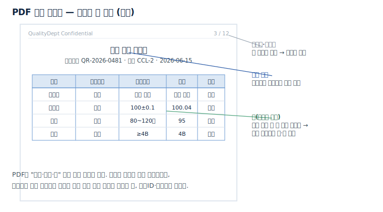

```
[전처리 전] 단순 추출 — 어느 수치가 어느 칸인지 알 수 없다
  용접부 외관 균열 없음 합격 용접부 치수 100±0.1 100.04 합격 도장 두께 80~120㎛ 95 합격

[전처리 후] 레이아웃 인식 파싱으로 행·열을 복원하고 문서ID·페이지를 부착
  [
   {"chunk_id":"QR-2026-0481_p3_r1","공정":"용접부","검사항목":"외관","기준":"균열 없음","실측":"균열 없음","판정":"합격",
    "provenance":{"doc_id":"QR-2026-0481","page":3}},
   {"chunk_id":"QR-2026-0481_p3_r2","공정":"용접부","검사항목":"치수","기준":"100±0.1","실측":"100.04","판정":"합격",
    "provenance":{"doc_id":"QR-2026-0481","page":3}}
  ]
```

각각의 수치가 어느 공정·항목에 해당하는지 명확해져, AI가 치수 불합격 사례를 바로 검색·집계하고 3페이지를 근거로 제시한다.

#### 4.2.2 PPT

PPT는 한 슬라이드 안에 제목·본문·도형·표·차트가 여러 텍스트박스로 나뉘어 있다. 이 텍스트박스는 화면에 보이는 위치 순서가 아니라 만들어 넣은 순서로 저장돼 있어, 그대로 뽑으면 읽는 순서와 어긋난다. 슬라이드를 한 장씩 보며 제목·본문·표·발표자 노트를 차례로 뽑고, 각 텍스트박스의 좌표를 보고 위→아래·좌→우 순서로 다시 정렬한다. 슬라이드 한 장을 청크 단위로 삼고 슬라이드 번호를 위치 정보로 붙인다. 차트는 글자가 아니라 그래프를 그리는 수치(원본 데이터)가 안에 들어 있으므로, 그 데이터값을 표로 뽑는다.

**권장 도구.** python-pptx[\[5\]](#ref5)로 슬라이드를 한 장씩 읽으며 제목·본문·표·발표자 노트와 도형 좌표(읽기 순서 재정렬용)를 가져온다. 차트는 슬라이드에 함께 저장된 수치 데이터에서 값을 뽑고, 그림만 있는 슬라이드는 OCR로 보낸다.

예를 들어 기술 교육자료(가상)의 한 슬라이드를 살펴본다.

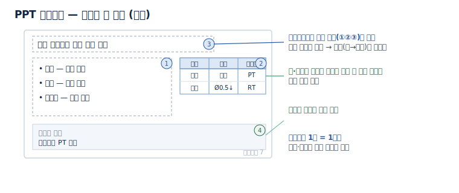

```
[전처리 전] 제목·불릿·작은 표·발표자 노트가 한 화면에 따로 놓여 있다

[전처리 후] 슬라이드 1장을 한 청크로 묶고 제목·본문·표·노트를 분류
  {"chunk_id":"TECH-블레이드_p7","type":"slide","title":"터빈 블레이드 용접 결함 유형",
   "body":["크랙 — 표면 균열","기공 — 내부 공동","언더컷 — 모재 패임"],
   "table":"| 결함 | 허용 | 검출법 |\n| 크랙 | 불허 | PT |\n| 기공 | Ø0.5↓ | RT |",
   "notes":"고온부는 PT 우선","provenance":{"doc_id":"TECH-블레이드","slide":7}}
```

흩어진 정보가 의미 단위로 묶여, 언더컷 검출법을 묻는 질문에 슬라이드 7을 근거로 답한다.

#### 4.2.3 Excel

Excel은 사람이 활용하기 편하도록 설계되어 있어 AI가 구조를 해석하기에는 상대적으로 복잡하다. 병합셀은 빈칸으로 나오고, 색으로만 표시한 의미는 기계가 읽지 못하며, 월·주차 같은 항목을 가로로 펼쳐 놓은 표(교차표)는 한 줄에 여러 시점의 값이 섞여 있어 집계·검색이 어렵다. 먼저 한 시트에 제목 줄·빈 줄·여러 표가 섞일 수 있으므로 실제 데이터 표의 머리글(열 이름) 행이 어디인지 찾고, 병합셀은 값을 아래·옆으로 채우며, 색·서식의 의미는 별도 열로 데이터화한다. 가로로 펼친 표는 '한 줄 = 한 건의 기록'이 되도록 세로로 편다(주차별로 한 줄씩).

**권장 도구.** openpyxl[\[6\]](#ref6)로 병합 범위·셀 색·수식 결과값을 직접 읽고(색은 채움 색을 값으로 변환), pandas[\[7\]](#ref7)로 가로 교차표를 세로로 펴(`melt`) 한 줄에 한 건의 기록이 되게 한다. 설비마다 열 구성이 다르면 양식별 파서를 두고 골든셋으로 관리한다.

예를 들어 설비 점검표(가상)에서는 윤활 카테고리가 병합되고, 주차가 가로로 펼쳐지며, 이상이 색으로만 표시된다.

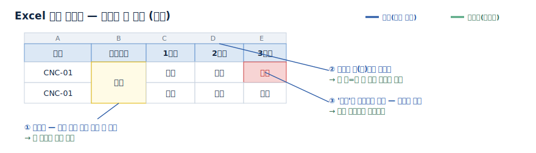

```
[전처리 전] 병합 + 가로 교차표 + 색으로만 표시된 이상
  설비    | 카테고리   | 1주차 | 2주차 | 3주차
  CNC-01 | 윤활(병합) | 정상  | 정상  | [빨강]이상

[전처리 후] 병합 풀어 카테고리 전파, 가로를 세로로, 색을 이상여부 값으로
  [
   {"설비":"CNC-01","카테고리":"윤활","점검주차":"1주차","결과":"정상","이상여부":false},
   {"설비":"CNC-01","카테고리":"윤활","점검주차":"3주차","결과":"이상","이상여부":true}
  ]
```

한 행이 한 점검이 되어 이상 발생 설비·주차를 바로 집계하고, 색상으로만 표현되던 판정 정보가 데이터 항목으로 변환된다.

<a id="t-img"></a>

#### 4.2.4 이미지·스캔본

스캔 문서·사진·도면은 글자가 픽셀로만 있어 OCR이 필수다. 기울기·대비를 보정해 인식 정확도를 올리고, OCR로 텍스트화하며 표는 표 구조 인식(TSR)으로 행·열을 복원한다. 셀별 신뢰도를 함께 받아 낮은 셀은 사람 검수로 보낸다. 도면은 텍스트와 함께 부품·기호 같은 객체가 섞여 있어, 객체 사이의 관계까지 구조화하는 일은 [B-3 온톨로지](../B-3%20온톨로지/B-3%20온톨로지.md)와 연계한다.

**권장 도구.** 로컬은 Tesseract[\[13\]](#ref13)(pytesseract)·PaddleOCR, 정확도나 표 인식이 중요하면 클라우드 OCR(Azure Document Intelligence[\[14\]](#ref14)·Google Document AI[\[15\]](#ref15)·AWS Textract[\[16\]](#ref16))을 쓴다. 표 구조는 클라우드 OCR이나 표 인식 모델로 행·열을 복원하고, 단어별 신뢰도를 받아 낮은 값에 검수 플래그를 단다.

예를 들어 손글씨가 섞인 검사 일지(가상)를 스캔한 경우를 살펴본다.

![스캔 검사 일지 모형 — 인쇄 항목명(OCR 쉬움), 손글씨 측정값(저신뢰→검수), 흐려서 판독 불가한 셀([?]로 두고 사람 검수로)](이미지/스캔-검사일지-모형.svg)

```
[전처리 전] 스캔 이미지 — 인쇄 항목명 + 손글씨 측정값, 일부 흐림
  설비점검일지 (PRESS-07)   점검자:(손글씨) 김O수
  유압      12.4MPa  양호      ← '12.4'는 손글씨, 흐릿
  윤활유량  (흐림)   ___       ← OCR 저신뢰

[전처리 후] 보정 → OCR → 단어별 신뢰도를 받아 낮은 셀은 검수 플래그 → 표 복원
  [
   {"항목":"유압","측정":"12.4MPa","판정":"양호","provenance":{"doc_id":"점검일지_PRESS-07_20260615"},"_review":false},
   {"항목":"윤활유량","측정":"[?]","판정":null,"_review":true}    ← 저신뢰 → 사람 검수로
  ]
```

스캔 일지가 검색 가능한 레코드가 되되, 흐린·손글씨 셀 등 신뢰도가 낮은 데이터는 별도 검수 대상으로 분류하여 오인식 데이터가 적재되지 않도록 한다. 종이 문서를 대량으로 스캔·디지털화하는 일 자체는 [F-3 디지털화](../F-3%20데이터%20디지털화/F-3%20데이터%20디지털화.md)가 맡는다.

#### 4.2.5 이메일

이메일은 협력사 품질 이슈, 변경 통지, 클레임 회신이 오가는 주요 기록이며, 본문·첨부파일·이미지·메타데이터가 혼재되어 있어 전처리 과정이 상대적으로 복잡한 유형이다. 핵심 정보가 헤더·본문·첨부에 나뉘어 있고, 본문에는 답장 인용·서명·면책 문구가 섞이며, 검사 결과는 표나 이미지로 본문에 박혀 있기 때문이다. 그래서 "본문 텍스트만" 뽑으면 출처도, 표도, 첨부 성적서도 사라진다. 처리 흐름은 데이터 구조 파악 → 추출 → 메타데이터 분리 → 본문 정리 → 표·이미지·첨부 라우팅 순이다.

**데이터가 어떻게 들어있나.** Outlook 메일은 보통 세 형태로 존재한다.

- `.msg` — 메일 한 통을 Outlook이 저장한 파일. 헤더·본문(평문/HTML)·첨부·내장 이미지가 한 파일에 담긴다.
- `.pst`/`.ost` — 메일함 전체(여러 폴더·수천 통)를 담은 보관 파일.
- `.eml`(MIME) — 표준 형식. 한 메일이 여러 부분(part)으로 나뉜다: 헤더, `text/plain`(평문 본문), `text/html`(표·서식이 든 본문), 그리고 첨부·내장 이미지가 각각 별도 part로 붙는다.

공통점은 한 메일이 헤더 + 평문/HTML 본문 + 첨부 + 내장 이미지의 여러 조각으로 이루어진다는 점이다.

**어떻게 추출하나(도구).** `.msg`는 extract-msg[\[17\]](#ref17), `.pst`는 readpst(libpst)[\[18\]](#ref18)로 개별 메일로 풀고, `.eml`은 파이썬 표준 email[\[19\]](#ref19) 라이브러리로 part를 분해한다. 메일함에 직접 접근할 수 있으면 Microsoft Graph API[\[20\]](#ref20)로 메일·첨부·대화 ID를 구조화된 형태로 받는 편이 안정적이다(파일 변환 단계를 건너뛴다).

**메타데이터를 어떻게 가져오나.** 헤더에서 검색·추적에 쓸 필드를 그대로 뽑아 메타데이터로 둔다.

- 보낸이·받는이·참조(From·To·Cc)·날짜(Date)·제목(Subject) → 검색 필터로 쓴다.
- Message-ID·In-Reply-To·References·Conversation-ID → 같은 사안의 메일을 한 스레드로 묶는다.

이 메타데이터가 있어야 "협력사 OO가 보낸 로트 L-2026-0312 관련 메일"처럼 사람이 묻는 방식으로 검색되고, 주고받은 메일이 한 건으로 이어진다.

**본문을 AI가 이해하게.** HTML 본문은 태그를 걷어 평문화하되 구조는 살리고(html2text[\[23\]](#ref23)), 인용된 과거 메일(`>`·"On … wrote:")과 서명과 면책 문구(메일 하단의 "본 메일은 …" 법적 고지)를 잘라 이번 메일의 새 내용만 남긴다(talon[\[21\]](#ref21)·email-reply-parser[\[22\]](#ref22)). 규칙으로 깨끗이 안 떨어지면 LLM에 "최신 본문·인용·서명"을 나누게 한다([4.3](#sec62)).

**본문 속 표·이미지는 이렇게 한다.**

- 표: 검사 결과 표는 HTML 본문 안 `<table>`로 들어 있다. 평문화할 때 버리지 말고 Markdown 표로 변환해 본문 청크에 함께 유지한다.
- 이미지: 본문에 박힌 내장 이미지(HTML이 `cid:`로 참조하는 그림)와 진짜 첨부를 구분한다. 내장 이미지는 본문 흐름에 자리표시자로 남기되, 표·스캔·그래프가 찍힌 이미지면 [이미지 경로](#t-img)(OCR)로 보낸다.
- 첨부: 진짜 첨부(PDF·Excel)는 떼어 각 유형 전처리로 보내고, 본문과는 첨부 ID로 연결해 "이 메일이 이 성적서를 가리킨다"가 유지되게 한다.

한 통의 메일은 다섯 갈래로 나뉘어 각기 다른 경로로 처리된다.

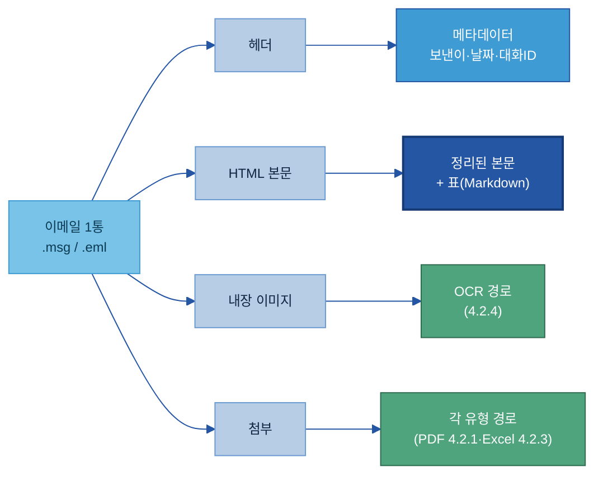

예를 들어 협력사 품질 이슈 스레드(가상)에서는 본문에 결과 표와 추세 그래프(내장 이미지)가 있고, 측정 성적서 PDF가 첨부돼 있다.

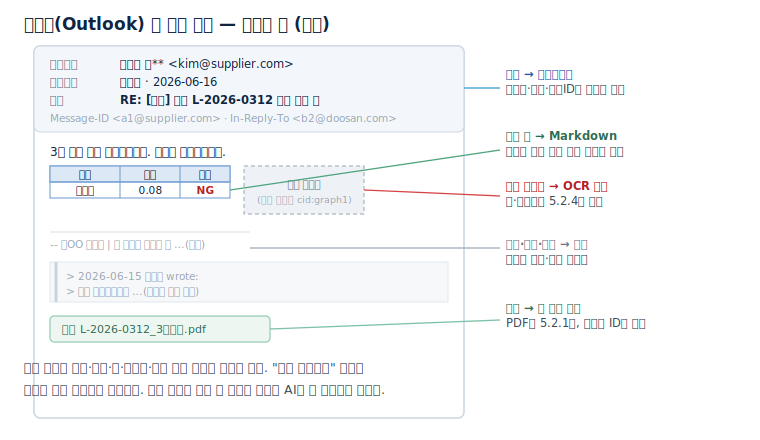

```
[전처리 전 — Outlook .msg를 푼 모습] 헤더 + HTML 본문(표·내장 이미지) + 인용·서명 + 첨부
  From: 협력사 김** <kim@supplier.com>   To: 품질팀   Date: 2026-06-16
  Subject: RE: [긴급] 로트 L-2026-0312 표면 결함 건
  Message-ID: <a1@supplier.com>   In-Reply-To: <b2@doosan.com>
  [HTML 본문] 3차 측정 결과 회신드립니다. 재현됨 확인했습니다.
     <table> 위치 | 실측 | 판정 // 모서리 | 0.08 | NG </table>
                   ← 본문 내장 이미지(추세 그래프)
  -- ㈜OO 품질팀 | 본 메일은 …(면책)       ← 서명·면책
  > 2026-06-15 품질팀 wrote: 측정 부탁드립니다 …  ← 인용된 과거 메일
  [첨부] L-2026-0312_3차측정.pdf

[전처리 후] 메타데이터·본문·표·이미지·첨부를 분리해 AI가 읽을 한 레코드로
  {
   "type":"email",
   "content":"3차 측정 결과 회신드립니다. 재현됨 확인했습니다.",
   "table":"| 위치 | 실측 | 판정 |\n| 모서리 | 0.08 | NG |",
   "inline_images":[{"cid":"graph1","route":"OCR(4.2.4)"}],
   "attachments":[{"file":"L-2026-0312_3차측정.pdf","route":"PDF(4.2.1)"}],
   "provenance":{"doc_id":"<a1@supplier.com>","conversation":"<b2@doosan.com>",
     "from":"협력사 김**","to":"품질팀","date":"2026-06-16",
     "subject":"RE: [긴급] 로트 L-2026-0312 표면 결함 건"}
  }
```

인용·서명·면책은 사라지고, 본문 표는 Markdown으로 남고, 내장 그래프는 OCR 경로로, 첨부 성적서는 PDF 경로로 라우팅된다. 보낸이·날짜·대화 ID가 메타데이터로 붙어 "로트 L-2026-0312 협력사 회신"으로 바로 검색되고, 한 스레드의 메일들이 한 사안으로 묶인다.

#### 4.2.6 Word·HWP

작업표준서(SOP)와 기술문서는 제목이 큰 글씨가 아니라 스타일(제목1·제목2)로만 구분되는 경우가 많아, 단순 추출하면 제목과 본문이 평평하게 뭉개진다. 문단 스타일을 읽어 제목 계층으로 옮기면 제목 단위 청킹이 쉬워진다. 표는 행·열로, 반복 머리말·쪽번호는 걸러낸다. HWP는 파서가 빈약해 텍스트·XML로 1차 추출하거나 PDF로 변환해 PDF 경로로 처리한다.

**권장 도구.** docx는 python-docx[\[8\]](#ref8)로 문단 스타일을 읽거나 Mammoth[\[9\]](#ref9)로 Markdown으로 변환한다. HWP는 hwp5(pyhwp)[\[10\]](#ref10)나 HWPX(압축 해제)로 텍스트를 뽑고, 깨지면 LibreOffice로 PDF로 변환해 PDF 경로([4.2.1](#t-pdf))로 보낸다.

예를 들어 용접 작업표준서(가상)를 살펴본다.

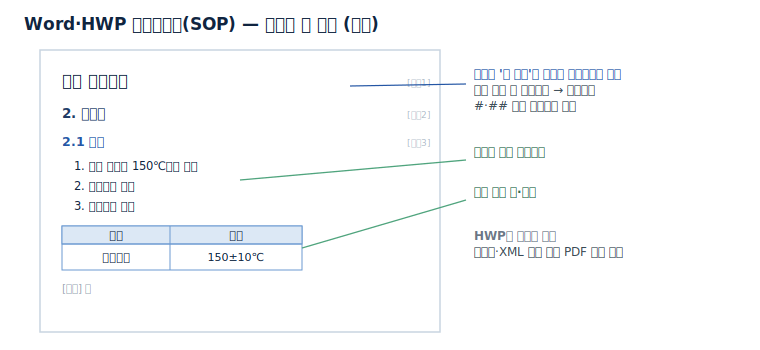

```
[전처리 전] 제목이 스타일로만 구분되고, 절차가 번호 목록, 중간에 주의 표가 끼임

[전처리 후] 스타일을 제목 계층으로, 절차는 단계 리스트로, 표는 행·열로
  {"chunk_id":"SOP-용접-03_2.1","heading":["용접 작업표준","2. 본작업","2.1 예열"],
   "steps":["1. 예열 토치로 150℃까지","2. 온도계로 확인","3. 기록지에 기입"],
   "caution_table":"| 항목 | 기준 |\n| 예열온도 | 150±10℃ |","provenance":{"doc_id":"SOP-용접-03"}}
```

평평하게 뭉개졌던 SOP가 어느 작업의 몇 단계인지 계층으로 살아나, 예열 온도 기준을 절·표 근거와 함께 찾는다.

#### 4.2.7 CSV

설비 로그·운전 시계열 CSV는 정형처럼 보이지만 인코딩 깨짐, 구분자 혼재, 단위 표기 행, 가로로 펼친 교차표 때문에 그대로는 쓰지 못한다. 인코딩과 구분자를 먼저 확정하고(한글 깨짐의 주원인), 머리글 위치와 단위 행을 정리한 뒤, 타임스탬프를 표준 형식으로 맞추고 결측·단위를 정규화한다. 센서별로 가로로 펼친 값은 한 행이 한 관측이 되게 세로로 편다. 발전소 운전 데이터처럼 동일 신호의 태그명·타임스탬프가 제각각인 경우, 이 정규화가 분석의 전제가 된다.

**권장 도구.** charset-normalizer[\[11\]](#ref11)로 인코딩을 감지하고 pandas[\[7\]](#ref7)로 읽되, 머리말·단위 행을 건너뛰고 전부 문자열로 받은 뒤 숫자를 정제한다. 가로 교차표는 `melt`로 세로로 펴고, 초당 수백 태그 같은 초대용량은 청크 단위(`chunksize`)로 나눠 처리한다.

설비 진동 시계열(가상)을 보자.

```
[전처리 전] cp949 인코딩, 머리글 위 장비정보 2줄, 단위 행, 값에 콤마·단위
  # 설비: PRESS-07   추출: 2026-06-15
  timestamp,vibration,temp
  [-],[mm/s],[℃]
  2026-06-15 09:00:01,"1,024",47.5℃
  2026-06-15 09:00:01,"1,024",47.5℃     ← 중복

[전처리 후] 인코딩 감지 → 단위 행 제거 → 숫자 정제 → 타임스탬프 표준화·중복 제거 → 1분 평균
  [{"ts":"2026-06-15T09:00:00Z","설비":"PRESS-07","vibration":1024.0,"temp":47.5}]
```

깨진 한글·중복·단위 섞인 값이 깔끔한 수치 시계열이 되어, PRESS-07 진동 이상 추세를 바로 분석한다.

#### 4.2.8 채팅·회의록

메신저 로그·회의록은 발화자 표기가 제각각이고, 잡담·중복이 섞이며, 한 줄에 여러 발화가 붙는다. 전처리는 발화자·시각을 분리해 발화 단위로 정렬·정돈하는 형식 변환까지를 책임진다. 패턴에서 시각·발화자·내용을 뽑고, 끊긴 연속 발화를 합치며, 시스템 줄과 잡담을 걸러낸다. 결정사항·요약 같은 의미 추출은 주석([B-2](../B-2%20데이터%20해설·주석/B-2%20데이터%20해설·주석.md))이 맡는다.

**권장 도구.** 메신저 로그는 발화 패턴(`[시각] 발화자: 내용`) 정규식으로 분해하고, 회의 자막은 webvtt-py[\[12\]](#ref12)로 `.vtt`를 파싱한다. 별칭·사번이 섞이면 정규화 후 표준 용어로 맞춘다.

예를 들어 품질 회의 로그(가상)를 살펴본다.

```
[전처리 전] 발화자 표기 제각각, 연속 발화 줄바꿈, 시스템 줄
  [10:03] 김검사: 로트 0312 표면 결함이요
  재현됩니다
  [10:04] 이엔지(eng.lee): RT 다시 돌려보죠
  홍길동님이 입장했습니다

[전처리 후] 발화자·시각 분리, 별칭 정규화, 연속 발화 병합, 시스템 줄 제거
  [{"time":"10:03","speaker":"김검사","text":"로트 0312 표면 결함이요 재현됩니다"},
   {"time":"10:04","speaker":"이엔지","text":"RT 다시 돌려보죠"}]
```

잡음 없는 발화 단위가 되어 검색·인용이 쉽다. 발화자 표기 불일치(이름·사번·별칭)는 [A-3 비즈니스 Glossary](../A-3%20비즈니스%20Glossary/A-3%20비즈니스%20Glossary.md)의 표준 용어로 맞춘다.

<a id="sec62"></a>

### 4.3 복잡한 문서의 LLM 기반 구조화

복잡한 문서는 사람이 수행하는 정리 절차를 먼저 정의한 뒤, 이를 LLM이 반복 수행하도록 구성한다. 병합·계층·제각각인 양식은 규칙 코드로 짜기 어렵지만, 사람의 정리 절차를 단계로 나눠 LLM에 맡기면 안정적으로 처리된다. 이 작업은 두 단계로 나눈다. 먼저 추출할 항목(스키마)을 정의해 고정하고, 그다음 그 스키마에 따라 값을 채우게 한다. 한 번에 전체 정리를 요청하면 문서마다 출력 구조가 달라져 재사용이 어렵다.

사람은 단계를 쪼개고 스키마를 검수·확정하며 애매한 셀·예외를 판단하고, LLM은 스키마 초안을 제안하고 값을 추출해 문서 수천 건에 반복 적용한다. 여기서 LLM은 답변 생성 모델이 아니라 문서를 구조화하는 자동화 엔진으로 활용된다.

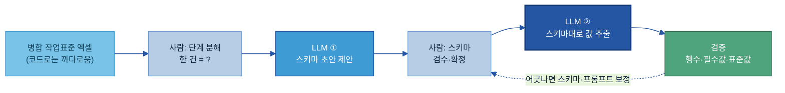

첫 단계에서는 문서 일부를 주고 한 레코드를 이루는 항목(이름·의미·예시값·타입·필수여부)을 제안하게 한다. 사람이 항목명·필수·표준값을 검수해 스키마를 확정하면, 이 확정 스키마가 곧 골든 기준이 된다. 다음 단계에서는 확정 스키마를 주고 값만 채우게 하되, 원문에 없으면 null로 두고 지어내지 말 것, 병합된 상위 값은 하위 행에 전파할 것, 숫자·단위·판정은 원문 그대로 둘 것을 명시한다.

<a id="sec623"></a>

다음은 작업표준 검사기준표를 이 방법으로 처리한 예다. 사람은 한 건을 공정·검사항목·기준 상한·하한·단위·주기로 정의하고, 좌측 공정명이 병합되어 여러 항목을 묶으므로 하위 행에 전파하며, ≤0.05나 100±0.1 같은 표기를 상·하한으로 푼다고 단계를 적는다.

```
[입력] 병합 검사기준표 — 사람 눈엔 자연스럽지만 코드로는 까다롭다
 공정    | 검사항목 | 기준      | 단위 | 주기
 용접부  | 외관     | ≤0.05    | mm   | 매 로트   ← '용접부'가 외관·치수 2행에 병합
 (병합)  | 치수     | 100±0.1  | mm   | 매 로트
 도장    | 두께     | 80~120   | ㎛   | 일 1회

[확정 스키마] {공정, 검사항목, 기준_하한, 기준_상한, 단위, 검사주기}

[값 추출 결과]
 [
  {"공정":"용접부","검사항목":"외관","기준_하한":null,"기준_상한":0.05,"단위":"mm","검사주기":"매 로트"},
  {"공정":"용접부","검사항목":"치수","기준_하한":99.9,"기준_상한":100.1,"단위":"mm","검사주기":"매 로트"},
  {"공정":"도장","검사항목":"두께","기준_하한":80,"기준_상한":120,"단위":"㎛","검사주기":"일 1회"}
 ]
```

병합된 용접부가 두 행에 전파됐고, ≤0.05·100±0.1·80~120이 상·하한으로 풀렸다. 규칙 코드로는 양식마다 새로 작성해야 하지만, 단계 정의만 바꾸면 양식이 달라도 동일한 방식으로 처리할 수 있다.

LLM에 맡기더라도 결과는 반드시 검증한다. 추출 행 수가 원문과 같은지, 필수값 누락이 없는지, 표준값·범위를 벗어나지 않았는지 확인하고 어긋나면 사람 검수로 보낸다. 핵심 수치는 원문과 대조한다. 전체를 LLM에 돌리면 느리고 비싸므로 어려운 양식만 LLM에 맡기고 쉽고 정형인 문서는 코드로 처리하며, 사외 반출이 막힌 데이터는 사내·로컬 LLM으로 처리한다. 양식이 고정되면 확정 스키마와 추출 프롬프트를 파이프라인으로 묶어 자동 반복한다.

<a id="sec63"></a>

### 4.4 적재 — AI 활용 환경에 제공

유형별 전처리로 구조화 데이터를 확보했으면, 다음 단계는 이를 AI가 활용하는 환경에 적재하는 것이다. 동일한 결과라도 활용 목적에 따라 적재처가 달라진다.

| 적재처 | 용도 | 대표 제품(예) |
|---|---|---|
| 벡터 DB | 의미 유사도로 문서를 찾는 RAG | pgvector[\[24\]](#ref24) · Milvus[\[25\]](#ref25) · Pinecone[\[26\]](#ref26) · Chroma[\[27\]](#ref27) |
| 검색 인덱스 | 키워드·하이브리드 검색 | Elasticsearch[\[28\]](#ref28) · OpenSearch[\[29\]](#ref29) |
| 데이터레이크 | 원시 변환 결과 장기 보관·재처리 | 사내 데이터레이크/레이크하우스 |
| 분석 테이블 | 집계·BI·대시보드 | DW/레이크하우스의 정형 테이블 |

예를 들어 최근 분기 용접 불량 추세 같은 수치 집계는 분석 테이블로, 유사 불량 원인 사례를 찾는 의미 검색은 벡터 DB로 동시에 적재한다. 적재 후 그 데이터를 AI에 써도 되는지 품질 판정은 [C-2](../C-2%20데이터%20품질%20관리/C-2%20데이터%20품질%20관리.md)가 맡는다.

<a id="backup-6-b-배치-vs-증분-처리"></a>

**배치와 증분 처리.** 전체를 주기적으로 한꺼번에 처리하는 배치는 지연이 허용되고 원천 부하를 피해야 할 때 쓰고, 마지막 처리 이후 변경분만 처리하는 증분은 최신성이 중요하고 비용을 줄여야 할 때 쓴다. 변경 감지는 타임스탬프, 변경 로그(CDC), 내용 해시 비교로 한다.

<a id="sec64"></a>

### 4.5 운영과 역할

원천 문서 양식은 운영 과정에서 지속적으로 변경될 수 있다. 열 하나가 추가되거나 머리글이 달라지면 규칙 기반 파서는 조용히 잘못된 값을 내고, 이 값이 그대로 적재되면 AI 답에 반영된다. 변환 오류를 조기에 탐지하고 안정적으로 운영하기 위해서는 운영 체계가 필요하다.

운영 체계는 같은 양식의 문서를 사람 손 없이 자동 변환하고, 양식이 변경되면 이를 감지해 대응하는 세 가지 장치로 구성된다.

<a id="kq4"></a>

- 정답 표본(골든셋): 대표 양식과 과거 양식, 그 "정답 출력"을 보관해 두고, 파서를 고치거나 새 양식이 들어올 때마다 대조한다. 어긋나면 파이프라인을 멈춘다.
- 스키마 검증: 결과가 정해진 항목·타입·필수값을 지키는지 매번 확인한다.
- 파서 버전 기록: 어떤 파서로 언제 변환했는지 남겨, 결과가 이상할 때 되짚는다.

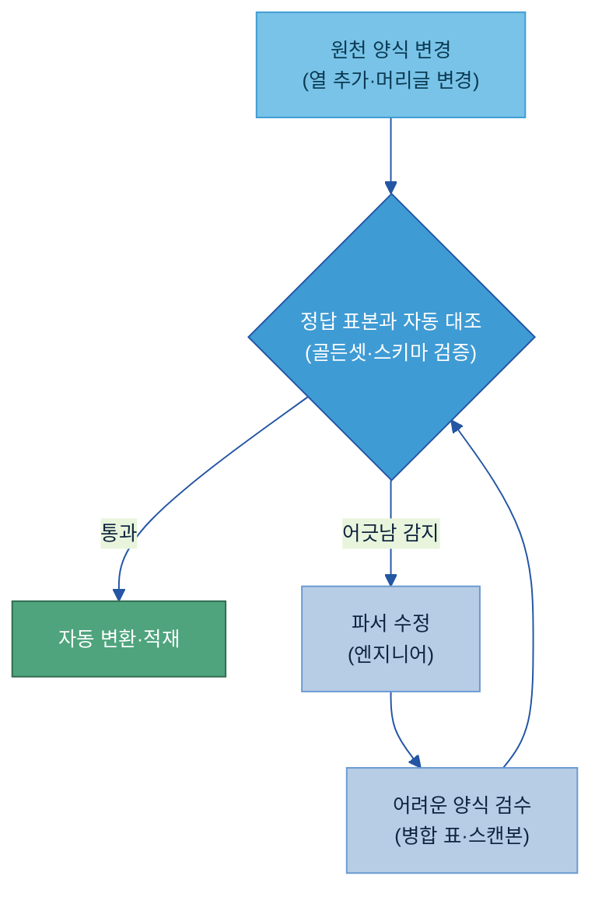

검수는 전수가 아니라 병합 표·저품질 스캔본·도면 속 수치·내부 약어처럼 자동 추출이 약한 곳에 집중한다. 이 검수와 보정은 현업 담당자와 데이터 담당자가 나눠 맡고, 사내 약어·설비코드는 [A-3 비즈니스 Glossary](../A-3%20비즈니스%20Glossary/A-3%20비즈니스%20Glossary.md)의 표준 용어로 맞춘다.

<a id="s84"></a>

**운영 체크리스트.**

- 표준 출력 포맷(JSON·Markdown)과 청크 항목(content·provenance)을 정의했는가
- 대표 양식·과거 양식·까다로운 사례를 골든셋으로 보관하는가
- 파서 버전과 스키마 검증을 파이프라인에 붙였는가
- 어려운 양식의 검수 지점과 검수자를 정했는가
- 적재처(벡터 DB·검색 인덱스·분석 테이블)를 용도별로 정했는가

<a id="tech"></a>

## 5. Tech Stack — 전처리 솔루션 비교

전처리 솔루션은 한 가지로 정해지지 않는다. [4장](#s5)의 실행 방식에 맞춰 아래 기준으로 고른다 — 표 복잡도(병합·다중 머리글이 많으면 표 전용 파서나 표 인식이 강한 클라우드), 데이터 민감도(사외 반출이 막히면 로컬 실행이나 사내·로컬 LLM), 언어·스캔(스캔본·다국어 OCR은 클라우드 문서 지능), 기존 인프라(MS면 Azure, AWS면 Textract).

솔루션은 세 갈래다 — ① 양식이 일정할 때 빠르고 결정적인 **규칙 기반 라이브러리**, ② 레이아웃·표를 인식하는 **문서 파싱 솔루션**, ③ 까다로운 양식을 사람이 단계를 나눠 시키는 **AI(LLM) 기반 추출**이다.

**(1) 규칙 기반 라이브러리 — 유형별 전용, 빠르고 저렴(결정적).** 양식이 일정하고 대량인 문서에 쓴다. How의 유형별 처리가 여기에 해당한다.

| 유형 | 라이브러리 |
|---|---|
| PDF 표 | Camelot·pdfplumber[\[3\]](#ref3)[\[4\]](#ref4) |
| PPT | python-pptx[\[5\]](#ref5) |
| Excel | openpyxl[\[6\]](#ref6)·pandas[\[7\]](#ref7) |
| Word·HWP | python-docx[\[8\]](#ref8)·Mammoth[\[9\]](#ref9) / hwp5[\[10\]](#ref10) |
| CSV·인코딩 | pandas[\[7\]](#ref7)·charset-normalizer[\[11\]](#ref11) |
| 이메일 | extract-msg[\[17\]](#ref17)·readpst[\[18\]](#ref18)·talon[\[21\]](#ref21)·html2text[\[23\]](#ref23) |
| 회의 자막 | webvtt-py[\[12\]](#ref12) |
| 이미지·스캔 OCR | Tesseract[\[13\]](#ref13) |

**(2) 문서 파싱 솔루션 — 레이아웃·표를 ML로 인식.** 한 솔루션으로 여러 포맷의 레이아웃·표를 인식한다. 최근 제품일수록 내부에 머신러닝·LLM 모델을 탑재해 레이아웃·표를 인식한다.

| 솔루션 | 유형 | 배포 | 잘하는 것 | 표 복원 | 적합 상황 |
|---|---|---|---|---|---|
| Docling[\[1\]](#ref1) (IBM) | 오픈소스 | 로컬 | 레이아웃·복잡한 표 인식, 로컬 실행 | 우수 | 민감 데이터·온프레미스, 복잡한 표 |
| Unstructured[\[2\]](#ref2) | 오픈소스+SaaS | 로컬/클라우드 | 다포맷 통합, OCR | 양호 | 여러 포맷을 한 파이프라인으로 |
| LlamaParse[\[30\]](#ref30) | 클라우드 API | 클라우드 | LLM 기반 파싱, LLM-ready Markdown | 양호 | 빠른 PoC·RAG 입력 |
| Azure AI Document Intelligence[\[14\]](#ref14) | 클라우드 | 클라우드 | 커스텀 모델, 한국어 | 우수 | MS 인프라·스캔·다국어 |
| Google Document AI[\[15\]](#ref15) | 클라우드 | 클라우드 | 폭넓은 다국어 | 우수 | GCP 인프라·다국어 스캔 |
| AWS Textract[\[16\]](#ref16) | 클라우드 | 클라우드 | OCR·양식 추출 | 우수 | AWS 인프라 |

**(3) AI(LLM) 기반 추출 — 까다로운 양식을 사람이 단계 분해 후 시킴.** 병합·계층·제각각인 양식처럼 코드 파서·파싱 솔루션이 깨지는 곳을, 비전(이미지·표 인식)을 지원하는 범용 LLM에 "스키마 먼저 → 값 추출"로 시킨다([4.3](#sec62)). 이 방식이 어려운 문서의 주력이다.

| 솔루션 | 형태 | 잘하는 것 | 적합 상황 |
|---|---|---|---|
| 비전 지원 범용 LLM (Claude · GPT-4o · Gemini 등) | API/모델 | 병합·계층·조건부 양식을 사람처럼 읽어 스키마대로 추출 | 양식이 제각각이라 규칙 코드가 안 되는 문서 |
| LLM 기반 파싱 서비스 (LlamaParse[\[30\]](#ref30) 등) | 클라우드 | 문서를 LLM이 읽어 Markdown/JSON으로 | 빠른 PoC·RAG 입력 |
| 사내·로컬 LLM | 온프레미스 | 사외 반출이 막힌 데이터를 내부에서 처리 | 민감·보안 데이터 |

AI 기반 추출은 환각 위험이 있으므로 "원문에 없으면 null"을 명시하고 행 수·필수값·표준값으로 검증한다([4.3](#sec62)). 전체를 LLM에 돌리면 느리고 비싸므로 쉬운 정형 문서는 (1)로, 어려운 양식만 (3)으로 처리한다.

> **권장 — How와 맞춰 고르기.** 양식이 일정하고 대량이면 (1) 규칙 기반 라이브러리나 (2) 파싱 솔루션으로 빠르게, 병합·계층처럼 까다로우면 (3) AI(LLM) 기반 추출로 처리한다. 복잡한 표가 많고 사외 전송이 제한되면 로컬 Docling을 1차로 두고 까다로운 표는 Camelot으로 보완하며, 스캔본·다국어는 OCR이 강한 클라우드를 PoC로 검토한다. 가격·버전·한국어 지원 범위는 변동되므로 단정하지 말고 PoC·공식 문서로 확인한다.

솔루션을 주제 전반에 걸쳐 묶어 비교·선정하는 일은 2층 정본 [Tech Stack 비교 (솔루션×주제)](../../Tech%20Player/01%20Tech%20Stack%20비교%20(솔루션×주제).md)가 전담한다.

---

<a id="s6"></a>

## 6. Where — 다른 주제와의 관계

전처리는 형식 변환까지를 책임지고, 인접 주제가 그 앞뒤를 분담한다.

| 데이터 전처리(B-1)가 하는 것 | 인접 주제 | 인접 주제가 하는 것 | 연계 포인트 |
|---|---|---|---|
| 이미 디지털인 자료 형식 변환 | [F-3 데이터 디지털화](../F-3%20데이터%20디지털화/F-3%20데이터%20디지털화.md) | 종이 문서를 대량 스캔·OCR로 디지털화 | 디지털화된 산출물이 전처리 입력 |
| 형식 변환(읽을 수 있게) | [B-2 데이터 해설·주석](../B-2%20데이터%20해설·주석/B-2%20데이터%20해설·주석.md) | 의미(정답) 라벨 부여(배울 수 있게) | 전처리된 데이터에 주석 |
| 구조화 산출물 생성·적재 | [C-2 데이터 품질 관리](../C-2%20데이터%20품질%20관리/C-2%20데이터%20품질%20관리.md) | 그 데이터를 AI에 써도 되는지 판정 | 적재 결과를 Quality Gate에 |
| 원본 위치 정보(provenance) 부착 | [C-3 데이터 계통 Lineage](../C-3%20데이터%20계통%20Lineage/C-3%20데이터%20계통%20Lineage.md) | 그 이력을 이어 답변 근거를 추적 | 위치 정보가 Lineage 출발점 |
| 비정형 문서를 구조화 | [A-1 데이터 카탈로그](../A-1%20데이터%20카탈로그/A-1%20데이터%20카탈로그.md) | 자산의 소재·등록·탐색 | 전처리 산출물도 자산으로 등록 |
| 도면·문서에서 텍스트·표 추출 | [B-3 온톨로지](../B-3%20온톨로지/B-3%20온톨로지.md) | 개념·객체 사이 관계 구조화 | 도면 객체가 온톨로지 연결 대상 |

가장 헷갈리는 경계는 B-1과 F-3다. 둘 다 문서를 데이터로 바꾸지만, F-3는 종이·아날로그를 대량으로 디지털화(스캔·OCR)하는 일이고, B-1은 이미 디지털인 자료를 AI가 읽을 구조로 변환하는 일이다. F-3가 디지털로 만들기라면 B-1은 구조화하기다.

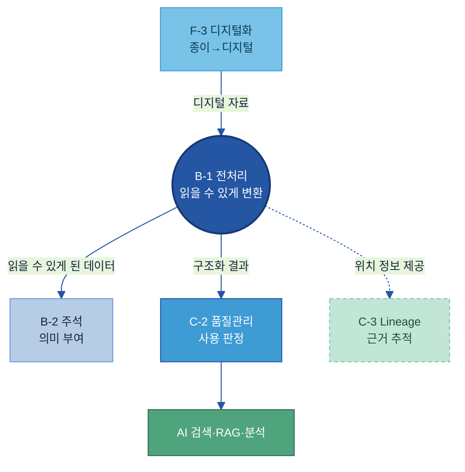

---

<a id="s8"></a>

## 별첨 (Appendix)

<a id="s81"></a>

### 주요 용어

- 비정형/반정형 데이터: 표 형태의 깔끔한 행·열(정형)이 아닌, 문서·이미지처럼 구조가 묻혀 있는 데이터. PDF·스캔 이미지가 비정형, 표 섞인 Excel·보고서가 반정형이다.
- 파싱(Parsing): 문서 파일을 읽어 그 안의 텍스트·표·이미지를 뽑아내는 것. 그 일을 하는 프로그램이 파서다.
- OCR(Optical Character Recognition): 이미지·스캔본 속 글자를 텍스트로 바꾸는 기술. TSR(Table Structure Recognition)은 이미지 속 표의 선·셀을 인식해 행·열로 복원하는 기술이다.
- 청크(Chunk)·겹침(Overlap): 청크는 검색을 위해 나눈 텍스트 한 조각. 겹침은 앞 청크의 끝 일부를 다음 청크 앞에 겹쳐, 경계에서 문맥이 끊기지 않게 하는 장치다.
- provenance(원본 위치 정보): 각 요소가 어느 문서·페이지·표·좌표에서 왔는지 기록한 꼬리표. 답변 근거 추적의 출발점이다.

---

## 참고자료 (References)

본문 곳곳의 **[N]** 표시를 누르면 아래 해당 항목으로 이동한다. 접속일 2026-06. 가격·버전·언어 지원 범위 등 변동 정보는 각 공식 문서·PoC로 확인한다.

**파싱·구조화 도구**
- <a id="ref1"></a>**[1]** Docling (IBM) — <https://github.com/docling-project/docling>
- <a id="ref2"></a>**[2]** Unstructured — <https://unstructured.io>
- <a id="ref3"></a>**[3]** Camelot — <https://camelot-py.readthedocs.io>
- <a id="ref4"></a>**[4]** pdfplumber — <https://github.com/jsvine/pdfplumber>
- <a id="ref5"></a>**[5]** python-pptx — <https://python-pptx.readthedocs.io>
- <a id="ref6"></a>**[6]** openpyxl — <https://openpyxl.readthedocs.io>
- <a id="ref7"></a>**[7]** pandas read_csv — <https://pandas.pydata.org/docs/reference/api/pandas.read_csv.html>
- <a id="ref8"></a>**[8]** python-docx — <https://python-docx.readthedocs.io>
- <a id="ref9"></a>**[9]** Mammoth (docx→md) — <https://github.com/mwilliamson/python-mammoth>
- <a id="ref10"></a>**[10]** hwp5 (pyhwp) — <https://github.com/mete0r/pyhwp>
- <a id="ref11"></a>**[11]** charset-normalizer — <https://github.com/jawah/charset_normalizer>
- <a id="ref12"></a>**[12]** webvtt-py — <https://github.com/glut23/webvtt-py>
- <a id="ref30"></a>**[30]** LlamaParse — <https://developers.llamaindex.ai/python/framework/llama_cloud/llama_parse/>

**OCR·클라우드 문서 지능**
- <a id="ref13"></a>**[13]** Tesseract OCR — <https://github.com/tesseract-ocr/tesseract>
- <a id="ref14"></a>**[14]** Azure AI Document Intelligence — <https://azure.microsoft.com/ko-kr/products/ai-services/ai-document-intelligence>
- <a id="ref15"></a>**[15]** Google Document AI — <https://cloud.google.com/document-ai>
- <a id="ref16"></a>**[16]** AWS Textract — <https://aws.amazon.com/textract/>

**이메일 처리**
- <a id="ref17"></a>**[17]** extract-msg (.msg) — <https://github.com/mattgwwalker/msg-extractor>
- <a id="ref18"></a>**[18]** libpst / readpst (.pst) — <https://www.five-ten-sg.com/libpst/>
- <a id="ref19"></a>**[19]** Python email (.eml) — <https://docs.python.org/3/library/email.html>
- <a id="ref20"></a>**[20]** Microsoft Graph API (메일함) — <https://learn.microsoft.com/en-us/graph/api/resources/mail-api-overview>
- <a id="ref21"></a>**[21]** Talon (Mailgun) — <https://github.com/mailgun/talon>
- <a id="ref22"></a>**[22]** email-reply-parser — <https://github.com/zapier/email-reply-parser>
- <a id="ref23"></a>**[23]** html2text — <https://github.com/Alir3z4/html2text>

**적재 — 벡터 DB·검색**
- <a id="ref24"></a>**[24]** pgvector — <https://github.com/pgvector/pgvector>
- <a id="ref25"></a>**[25]** Milvus — <https://milvus.io/docs>
- <a id="ref26"></a>**[26]** Pinecone — <https://www.pinecone.io/>
- <a id="ref27"></a>**[27]** Chroma — <https://www.trychroma.com/>
- <a id="ref28"></a>**[28]** Elasticsearch 벡터 검색 — <https://www.elastic.co/docs/solutions/search/vector>
- <a id="ref29"></a>**[29]** OpenSearch 벡터 검색 — <https://docs.opensearch.org/latest/vector-search/>

---

## 변경 이력 / 피드백 반영

| 일자 | 버전 | 피드백 (누가/무엇) | 반영 내용 | 반영 위치 |
|------|------|--------------------|-----------|-----------|
| 2026-06-25 | 0.34 | **고객 — 앞에 '5가지 질문' 박스 + 질문형 표현 제거** | ① 문서 앞(인트로 다음·§1 앞)에 독자 관심 질문 5개 박스 신설 — 질문·한 줄 답·본문 링크 표(전처리란/언제·무엇부터/유형별 방법/파서 vs LLM/적재·운영). 상단 목차에도 링크. ② 질문형 표 라벨 제거: §4.1 '언제 쓰나'→'적용 상황', §4.4 적재 '언제 쓰나'→'용도'. | 상단·§4.1·§4.4·TOC |
| 2026-06-25 | 0.33 | **고객 — '유형별 실행 레시피' 별첨 링크 본문에서 모두 제거** | 본문 3곳(§4.2 도입부·§4.3 완성 사례·별첨 끝 포인터)의 [별첨 — 유형별 실행 레시피] 링크 삭제. 레시피 파일 자체는 사용 여부 미정이라 보존(링크만 끊음). | §4.2·§4.3·별첨 |
| 2026-06-25 | 0.32 | **고객 — §4.1 두 가지 실행 방식을 비교 표로** | 줄글 불릿 2개(규칙·도구 기반 / LLM 기반)를 비교 표(언제 쓰나·처리 방식·강점·한계·대표 도구)로 전환. | §4.1 |
| 2026-06-25 | 0.31 | **고객 — 청킹 전략 보강 + §2.2·§4.1 단계 번호 일치** | ① **청킹 전략 표 확장**: 3행→5행(의미 단위·계층(부모–자식) 추가), 열을 '어떻게 나누나·잘 맞는 문서·주의·팁' 3열로 늘려 디테일 보강. 마무리 문단도 권장 조합(구조 기반+표 단위 기본/메모는 고정 크기/회의록은 의미 단위/공통 겹침)으로 확장. ② **§2.2와 §4.1 단계 번호 불일치 해소**: §2.2 4단계(①추출~④청킹)를 정본 번호로 고정하고, §4.1 파이프라인을 '대상 선정(앞)+①추출~④청킹+적재(뒤)'로 바꿔 추출=① 일치(기존 §4.1은 추출=②였음). 다이어그램·4단계 매핑 문구 동기화. | §2.3·§4.1 |
| 2026-06-25 | 0.30 | **고객 — 전처리 표준 단계 모델 정확화(정제 추가·위치보존은 교차 정보로)** | 4단계를 **추출→정제→구조화→청킹**으로 정정. ① **정제(Clean) 단계 신설**(머리글·잡음 제거, 인코딩·단위·날짜 정규화, 중복 제거) — 기존엔 유형별 처리에만 녹아 있어 표준 단계로 명시. ② **위치보존(provenance)을 독립 단계에서 제외** — '추출할 때 어느 문서·페이지에서 나왔는지를 함께 적어 둔다'로 평이하게 서술(메타데이터·꼬리표 같은 용어는 쓰지 않음 — A-2 메타데이터가 다룸). §2.3 content+provenance 핵심 가치는 유지. §2.2 블록·본문, §2.3 핵심 다이어그램 라벨('추출·정제·구조화'), §4.1 파이프라인 문구·다이어그램(③정제·④구조화)·4단계 매핑까지 일괄 반영. | §2.2·§2.3·§4.1 |
| 2026-06-24 | 0.29 | **고객 — How에서 파서(4.2)·LLM(4.3) 구분을 앞에서 설명 + 별첨에 둘 필요 없는 내용은 본문으로** | ① §4.2 도입부에 실행 방식 구분 명시: "유형별 처리(4.2)는 양식이 일정한 문서를 규칙 기반 파서·솔루션으로, 코드로 짜기 어려운 까다로운 문서는 LLM에 맡긴다([4.3])". ② 별첨에 있던 **청킹 전략 비교→§2.3 본문**, **배치와 증분 처리→§4.4 적재 본문**, **운영 체크리스트→§4.5 운영 본문**으로 이동(굵은 리드+표/불릿). 별첨엔 '주요 용어'만 남김(+레시피 별첨 파일 포인터). §2.3 '청킹 전략 비교는 별첨' 포인터 제거, TOC 별첨 하위목록 정리. | §2.3·§4.2·§4.4·§4.5·별첨·TOC |
| 2026-06-24 | 0.27 | **고객 — 0624 3차 검토(용어 정의·번역투·미설명 개념 삭제·표 열 순서)** | ① §4.2.1 텍스트 PDF/스캔 PDF 정의 추가(텍스트=복사·검색 되는 PDF / 스캔=이미지라 OCR 필요). ② §4.2.2 PPT: '화면 위치가 아니라 만든 순서로 저장' 명확화(좌표로 재정렬)·'순회하며'(번역투)→'한 장씩 보며'·'내장 데이터'→'그래프를 그리는 수치(원본 데이터)가 안에 들어 있어'. ③ §4.2.3 Excel: '월'→'월·주차 같은 항목'·'한 행이 한 관측'→'한 줄=한 건의 기록'·'머리글 위치를 먼저 잡고'→'머리글(열 이름) 행이 어디인지 찾고'. ④ §4.2.5 면책 풀이('메일 하단의 본 메일은… 법적 고지'). ⑤ §4.3 '역할은 나뉜다.' 문장 삭제. ⑥ §4.4 '용어 풀이 — 벡터 DB·임베딩' 콜아웃 삭제(임베딩 미등장). ⑦ §4.5 '예시 — 양식 12종…' 콜아웃 삭제(12종 미설명)·역할 문장에서 미설명 SME/오너/검수자 제거('현업 담당자와 데이터 담당자가 나눠 맡고'). ⑧ §5 '머신러닝·LLM을 안에 쓴다'→'내부에 머신러닝·LLM 모델을 탑재해'. ⑨ **§6 표 열 순서**를 '데이터 전처리가 하는 것 → 인접 주제 → 인접 주제가 하는 것 → 연계 포인트'로. SVG(PPT 내장데이터·Excel 세로 펴는 이유·스캔 사람 검수) 주석도 동기화. | §4.2·§4.3·§4.4·§4.5·§5·§6·SVG |
| 2026-06-24 | 0.28 | 고객 — SVG 마이너 수정 | 스캔 모형 '검수 플래그(_review)'(코드 토큰 노출)→'검수 대상으로 분류'. Excel 모형 ② 가로 교차표 주석이 viewBox 폭(760)을 넘어 잘려, 폭을 880으로(배경 포함) 넓혀 다 보이게. | SVG(스캔·Excel) |
| 2026-06-24 | 0.26 | **고객 — 0624 2차 검토(번역투·맥락·중복·유형명)** | ① **§3.2 우선순위 절 전체 삭제**(평가표·사분면 포함) → §3은 '전처리 대상'만, 제목 'When — 어디부터 하나'(우선순위 부제 제거). ② §3.1 불릿: 'PDF…구조가 묻혀 있다'(번역투)→'구조로 되어 있어 텍스트만 뽑으면 구조가 사라진다', 'Excel…색 의미로 구조가 복잡'→'색으로 의미를 구분하는 경우도 있어 구조가 복잡', '같은 이유로'(모호)→'구조가 그대로 드러나 있지 않아'. ③ §4 도입부 사족 문장(도구가 좋아져도…) 삭제. ④ **§4.2 소제목·표 유형명을 파일 형식만으로**: PDF 성적서·보고서→PDF, PPT 기술자료→PPT, Excel 점검표→Excel, 이미지·스캔본·도면→이미지·스캔본, 이메일(Outlook)→이메일, Word·HWP 작업표준서→Word·HWP, CSV·운전 로그→CSV(채팅·회의록 유지). TOC 동기화. | §3 삭제·§3.1·§4·§4.2·TOC |
| 2026-06-24 | 0.25 | **고객 — 0624 추가 검토(제목 자연화·맥락 안 맞는 표 행·중복 정리)** | ① 제목: §2 'What — 무엇인가·무엇을 갖추나'→'**What — 데이터 전처리란 무엇인가**', §2.1 '데이터 전처리란 + 범위·경계'→'**데이터 전처리의 의미**', §2.2 '전처리 변환 사슬'(번역투)→'**전처리 4단계**', §4.5 '운영 — 양식이 바뀌어도 계속 돌아가게'→'**운영과 역할**'(대시 부제 제거). ② **§1.2 「전처리로 얻는 것」 절 삭제**(성적서 사례 맥락 어긋남·3번째 항목 중복). ③ §1.1 표: '동일 신호 다른 기준'(전처리로 해결 어려운 맥락) 행 삭제, '분석보다 준비에 시간 더 소요'(결과 층위)→'**데이터가 많고 여러 파일에 분산되어 있음**'(상황 층위). ④ §2.1 범위·경계 문장 삭제(§6과 중복)·'20개 주제 조감도' 문장 삭제(Word 부적합)·RAG 풀이 '우리 문서를 찾아'→'근거 문서를 검색해 함께 활용'. 본문 '변환 사슬' 표현 일괄 '4단계'로. TOC 동기화. | §1.1·§1.2삭제·§2·§4.5·TOC |
| 2026-06-24 | 0.24 | **고객 — 작업노트(0624작업노트.md) 문장 수정안 반영** | 노트의 '현재→수정' 15건을 보고서체로 적용: §1.2 세 효과 불릿 재서술(전환된다/신뢰성을 높일 수 있다/한 번 구축한 결과를 반복 활용), §2.1 '숨은 구조를 복원해 넘긴다'→'문서 내 구조 정보를 추출하여 AI가 활용 가능한 형태로 변환', §2.2 '구조화까지 살려야…칸 값'→'구조화 과정이 수행되어야…항목에 해당하는지 해석'·'단순 검색은…RAG는 청킹까지 간다'→'활용 목적에 따라 단계가 달라진다…', §2.3 '그릇일 뿐…목적은 아니다'→'형식일 뿐이다…구조와 출처 정보를 확보' + '어느 칸 값인지 알고'→'값의 의미와 위치를 해석'·근거 제시 문구, §3.1 '대상이 맞다'→'대상에 해당한다', §4.2.1 '뭉개진 숫자가…살아나'→'각각의 수치가…명확해져', §4.2.3 Excel 도입·'색에만 있던 판정'→'색상으로만 표현되던 판정 정보가…변환', §4.2.4 저신뢰 셀 검수 문장, §4.2.5 이메일 도입 재서술, §4.3 '챗봇을 만드는 게 아니라…'→'LLM은 답변 생성 모델이 아니라 문서를 구조화하는 자동화 엔진'. | §1.2·§2.1~2.3·§3.1·§4.2·§4.3 |
| 2026-06-23 | 0.23 | **고객 — 작업노트(0623작업노트.md)의 문장 수정안 반영 + "다른 문장도 검토·수정"** | 노트 수정안 적용(컨설팅 보고서체로): ① **§1.1 제목·내용 전면 교체** '현업에서 막히는 지점'→'**전처리 없이 AI 활용이 어려운 이유**'(도입 2문단·표 머리글 '상황/실제 문제'·전처리 역할 마무리문). ② §1.2 '세 가지가 달라진다'→'데이터 활용 방식이 달라진다… 효과를 기대할 수 있다'. ③ §2.2 '일반론으로 삼아 일관되게'→'표준 흐름으로'. ④ §3.1·§3.2 평이화. ⑤ **§4.3 제목** '어려운 문서 — 사람의 수작업 단계 분해 후 LLM에 맡기기'→'**복잡한 문서의 LLM 기반 구조화**', 첫 문장 '사람이 수행하는 정리 절차를 먼저 정의한 뒤 LLM이 반복 수행하도록 구성'. ⑥ §4.5 운영 도입부에 '원천 문서 양식은 운영 과정에서 지속적으로 변경'·'변환 오류를 조기에 탐지·안정적으로 운영하는 체계' 반영(노트 옛 §4.4·§4.6). + 검토로 구어체('…넘는다/쓸 수 없다/넣는 일이다') 4곳을 선언형으로. TOC 라벨 동기화. | §1.1·§1.2·§2.2·§3·§4.3·§4.4·§4.5·TOC |
| 2026-06-23 | 0.22 | **고객 — "§4.4 안정장치~4.6 운영이 안 와닿는다(골든셋이고 뭐고). 문서 유형별로 전처리한 그다음에 뭘 하는 건지가 안 보인다"** | How 뒷부분을 **'전처리 → 적재 → 운영' 흐름으로 직관화.** ① **적재를 앞으로**(옛 4.5→4.4): "유형별로 전처리해 구조화 데이터를 얻었으면 다음은 AI가 쓸 곳에 넣는 일"이라는 연결문 추가. ② **안정장치(옛 4.4)를 운영(4.5)에 흡수**: 독립 절·3행 표를 없애고, '양식이 바뀌면 파서가 조용히 틀린다 → AI 답 틀어진 뒤에야 안다 → 그래서 변경을 자동으로 잡는다'는 why 먼저, 골든셋을 '정답 표본 대조'로 풀어 3불릿으로. 운영 절 제목도 '양식이 바뀌어도 계속 돌아가게'로. ③ 4.4 안정장치 절 삭제로 §4 소절 6→5개, TOC·§4 도입부 흐름문·다이어그램 라벨 갱신(앵커 sec63·sec64·kq4 보존). | §4.4·§4.5·TOC |
| 2026-06-23 | 0.21 | **고객 — "How에서 다루는 솔루션이나 AI를 활용해 전처리하는 툴들도 같이 정리해 소개"** | §5 Tech Stack을 **세 갈래로 재구성**: (1) **규칙 기반 라이브러리**(How의 유형별 전용 — PDF=Camelot/pdfplumber·PPT=python-pptx·Excel=openpyxl/pandas·Word/HWP=python-docx/Mammoth/hwp5·CSV=pandas/charset-normalizer·이메일=extract-msg/readpst/talon/html2text·자막=webvtt-py·OCR=Tesseract 표로 정리), (2) **문서 파싱 솔루션**(Docling·Unstructured·LlamaParse·Azure DI·Google Doc AI·AWS Textract), (3) **AI(LLM) 기반 추출 신설**(비전 지원 범용 LLM=Claude·GPT-4o·Gemini / LLM 파싱 서비스=LlamaParse / 사내·로컬 LLM — "스키마 먼저→값 추출" §4.3과 연결, 환각 차단·검증 명시). 전 솔루션 각주[N] 정합. | §5 |
| 2026-06-23 | 0.20 | **고객 — "Tech Stack(솔루션 비교) 섹션이 빠졌다 → 6번에 새로. How에 따른 전처리 솔루션을 비교해 무엇을 고를지 알 수 있게"** | **새 「Tech Stack — 전처리 솔루션 비교」 섹션 신설**(B-3 방식대로 How 다음·Where 앞 → §5, Where는 §6으로). 선택 기준 4축(표 복잡도·데이터 민감도·언어/스캔·기존 인프라) + 솔루션 비교표(Docling·Unstructured·Camelot/pdfplumber·LlamaParse·Azure DI·Google Doc AI·AWS Textract: 유형·배포·표복원·적합 상황) + How와 맞춰 고르는 권장 + 2층 정본([01 Tech Stack 비교](../../Tech%20Player/01%20Tech%20Stack%20비교%20(솔루션×주제).md)) 링크. **§4.4를 '변환 안정장치'로 되돌리고**(솔루션 비교를 §5로 이관, 중복 제거) §2.1 경계 포인터 6장으로, References에 LlamaParse[30] 추가. | §5 신설·§4.4·TOC·참고자료 |
| 2026-06-23 | 0.19 | **고객 — 목표 목차 제시(Why·What·When·How·Where 5장) + "개요는 없애고"** | 제시된 목차에 맞춰 **전면 재배치.** ① **개요(§1) 삭제** — 정의·범위·경계·체계 위치를 **§2.1 「데이터 전처리란 + 범위·경계」**로 흡수, 핵심 메시지·흐름은 상단 리드인 한 문단으로. ② **Why를 §1로** 승격(막히는 지점·얻는 것). ③ **What(§2)** = 2.1 전처리란+경계 / 2.2 변환 사슬 / 2.3 구조화 산출물. ④ **When(§3)** = 대상·우선순위(옛 'Where' 라벨 → 'When'으로 교정). ⑤ **How(§4)** = **4.1 구축 흐름과 두 가지 실행 방식 재추가**(v0.18에서 뺐던 것을 목표 목차가 명시) + 4.2 유형별 / 4.3 LLM / **4.4 안정장치와 솔루션**(도구→솔루션) / 4.5 적재 / 4.6 운영. ⑥ **Where(§5)** = 다른 주제와의 관계. TOC·전 교차참조·하위번호(4.2.x) 일괄 갱신, 콘텐츠 앵커(s2·s3·s11·sec31·kq3·s4·kq1·s42·s5·s51·kq2·sec62·kq4·sec63·sec64·s6·ref·t-pdf/img) 보존, 링크·각주·펜스 무결 검증. | 전면 재배치 |
| 2026-06-23 | 0.18 | **고객 — "§5.1 구축 흐름·두 가지 실행 방식이 아래 내용과 안 맞고 안 와닿는다 → 없애자" + "'…만든다고 하자'식 종결은 가이드답지 않다"** | ① **§5.1 「구축 흐름과 두 가지 실행 방식」 절 삭제**(대상선정→적재 6단계 다이어그램·골든셋 재처리 루프 포함) — §3.1 변환 사슬과 중복되고 아래 5장 구성(유형별→LLM→안정장치→적재→운영)과 어긋나서. 코드 vs LLM 선택은 §5 도입부 한 문장으로 흡수. **5.2~5.6 → 5.1~5.5 재번호**(유형별 5.1·LLM 5.2·안정장치 5.3·적재 5.4·운영 5.5, 하위 5.2.x→5.1.x), TOC·교차참조·§3.1 포인터 갱신(앵커 kq2·sec62·kq4·sec63·sec64 보존). ② 예시 도입부의 '…만든다고 하자/본다고 하자' 종결을 가이드체 선언형('…경우를 살펴본다'·'…표시된다')으로 교체. | §5 전반·예시 도입부 |
| 2026-06-23 | 0.17 | **고객 — "사례가 갑자기 나온다(예: '그래서 두산에너빌리티라면') → '예를 들어 ~한 경우라면'식으로" + "레퍼런스도 온톨로지(B-3) 가이드처럼 각주로 찾아갈 수 있게"** | ① **사례 도입 자연화**: §4.2·§5.2.1~5.2.8의 계열사명 단정형 도입을 **'예를 들어 …(가상)…라고 하자/본다고 하자'** 가정형으로 교체(문서 유형 다양성 유지, 계열사명 단정 제거). ② **참고자료 각주화(B-3 방식)**: 본문 인라인 링크 29종을 `이름[N]`(→`#refN`) 각주 마커로 바꾸고, 참고자료를 번호·앵커 목록 [1]~[29](파싱·구조화 / OCR·클라우드 / 이메일 / 적재)로 재작성. 모든 마커-앵커 1:1 정합(고아 0). | §4.2·§5.2·참고자료 |
| 2026-06-23 | 0.16 | **고객 — "KPI·Roadmap은 지우라고 했다. 00 전체 목차에 맞춰 다시 확인"** | 정본 목차([00 전체 목차](../../전체%20목차/00%20전체%20목차%20(20개%20주제).md)) 기준 정합화 — KPI는 신뢰성(C-1·C-2·C-3) 주제에만, 로드맵·미래 전망은 20개 주제 전부 제거가 정본 결정. 따라서 **§7 「KPI 및 Roadmap」 절 전체 삭제**(성과 지표 표·Phase 1~4 로드맵·미래 AI 자동화 전망). 마지막 본문 절이 **6. 다른 주제와의 관계**가 됨(00 목차 B-1 = 7섹션, 관계가 마지막과 일치). Appendix를 번호 없는 **별첨 (Appendix)**으로 전환(8.x→무번호, 앵커 s81·s82·s84·backup-6-b 보존), TOC·교차참조('8장 Appendix'→'별첨') 갱신, 참고자료 '기법·평가·로드맵'→'기법·평가'. | §7 삭제·별첨·TOC |
| 2026-06-23 | 0.15 | **고객 — 마스터 프롬프트(작업지시_0623) 기준 재정렬.** "What엔 전처리가 무엇인지만, 유형별로 실제 어떻게 하는가는 (How에) / CCL 말고 다양한 계열사·유형 예시로 / 코드 별첨은 별도 파일로" | **작업지시 8장 구조로 재편 + 유형별을 How로 이동.** ① 구조: 1 개요 / 2 Why / 3 What(구성요소만) / 4 Where(대상·우선순위) / 5 How / 6 관계 / 7 KPI·Roadmap / 8 Appendix. Example 장 분리 금지·사례는 How에 반영. ② **유형별 전처리를 §5.2 How로 이동**(독립 3장에서) — What(3)은 변환 사슬·산출물 등 구성요소만. ③ **예시 다양화**(현업인터뷰 분석.xlsx 근거): 전자 CCL 성적서, 에너빌 도면·운전 시계열·SOP, 퓨얼셀 Raw Data, 밥캣 점검표·Service Manual, 협력사 메일 등 계열사·유형별로. Why를 인터뷰 실제 정황(태그 혼재·추출 3주·성적서 OCR·도면 분리·수기 Excel)으로 보강. ④ **코드 레시피(3-D/3-E/3-F)를 별도 파일 `별첨/B-1 별첨 — 유형별 실행 레시피.md`로 분리**(Appendix는 본문보다 짧게 — 규칙13), 본문 Appendix는 용어·청킹비교·배치증분·체크리스트로 경량화. ⑤ **로드맵 Level→Phase 1~4**(Preparation/AI Ready/Automation/Assetization). ⑥ 문체: 비유(번역가) 삭제·첫문장 한줄정의 지양·부정문/요약박스/이모티콘/장식기호 점검·핵심질문 박스 제거·현업 영문용어 유지. 앵커(sec31·kq1~4·sec62·sec623·sec63·sec64·backup-6-b) 보존. | 전면 재편 |
| 2026-06-23 | 0.14 | **고객 — "B-3 온톨로지 가이드의 내용·양식·문장 형태를 참고해 현업 공유용으로 재작성. 문서 유형별 방식을 소개하고 예시를 그려서 보여주는 방식으로"** | **본문 전면 재작성(B-3 스타일).** ① 구조 재편: Why(1)→What 변환사슬(2)→**유형별 전처리(3, 신설 독립 장)**→When 대상·우선순위(4)→How(5)→Where(6)→지표·로드맵(7). ② **유형별 전처리를 독립 장으로 격상** — 8개 유형(PDF·PPT·Excel·이미지·이메일·Word/HWP·CSV·채팅) 각각 "무엇이 어렵나 → 권장 처리 → 전/후 예시(그림)"로, 별첨 3-E의 가상 예시를 본문으로 끌어올려 보여줌. ③ **문체 B-3화**: 선언형·"X란 …다" 정의형, `[!question]`/`[!info]` Obsidian 콜아웃·★·🏭·요약박스 제거, `>` 콜아웃을 예시·용어풀이·권장·주의 4용도로 한정, 핵심질문 박스를 평이한 표로. ④ 본문 코드 제거(별첨으로), 현업 눈높이로 평이화. ⑤ 앵커(sec31·kq1~4·sec62·sec623·sec63·sec64) 보존 → 별첨 3-A~8-B 백링크 무결, 별첨 내 옛 §6.2 등 표시 라벨만 새 번호로 갱신. 별첨·참고자료·변경이력은 유지. | 본문 전체 |
| 2026-06-22 | 0.13 | 문체 표준화(0622 작업지시) | 이모지 전량 제거·요약/정의 박스를 본문 문단으로 흡수·표 작성주체 아이콘을 자동/오너/보안 텍스트로 교체·핵심질문 안내의 물음표 아이콘 제거. 내용·구조·예시·링크 불변. | 전체 |
| 2026-06-19 | 0.12 | 점검 에이전트: 스토리 가독성·일관성 점검(현업 독자 관점) | ① **4/5/6단계 혼선 해소** — §3.1에 "4단계=변환 핵심, 6단계=대상선정·적재를 더한 실행 절차" 예고 박스 + §6 요약에 §3.1 연결. ② **약어 풀이 보강** — §8.1 KPI 표에 STP·F1/TEDS/GriTS·Precision@K 한 줄 풀이, §8.2 IDP 첫 등장 펼침, §1.3 RAG 풀이, §3.2.3 골든셋 첫 등장 풀이, 다운스트림 KPI행 풀이. ③ **유형 경계 정리** — §4.1에 "대표 유형, 8종은 §3.2" 안내 + DB 테이블 vs 내보낸 CSV 경계 한 줄. ④ §3.3 청킹 "PoC로 조정"을 판단 신호(검색 엉뚱↓·문맥 잘림↑)로 구체화. ⑤ 레시피 6 **중복 출력 줄 삭제**(버그) + A-3 링크 라벨 통일 + §3.1 안정 앵커(`sec31`) | §3.1·§3.3·§4.1·§8.1·§8.2, Backup 3-D |
| 2026-06-19 | 0.11 | **고도화 로드맵 새 표준 반영**(공통 규칙 개정) — §8 제목 `성과 지표·고도화 로드맵`, §8.2 **가짜 날짜 gantt 폐기** 후 성숙도 단계 사다리(Lv1 수작업~Lv4 지능형 자동화: 진단 신호+다음 한 걸음 표)로 교체, §8.3 **미래 AI 자동화 전망** 신설. ToC 앵커 동기화 | §8 |
| 2026-06-19 | 0.10 | 고객: "PPT 추가 + 따라 할 수 있게 프롬프트 예시" | **Backup 3-D 레시피 8(PPT) 신설** — python-pptx 코드(Z-order→좌표 재정렬, 제목·본문·표·노트, 슬라이드=1청크) + **따라 할 LLM 프롬프트(슬라이드 조각→구조 JSON)** + 입력→출력. **레시피 6(채팅)**에 비어 있던 LLM 프롬프트 예시 채움(대화→발화 JSON). → 8개 유형 모두 코드 레시피 보유 | Backup 3-D(레시피6·8) |
| 2026-06-19 | 0.9 | 고객: "이미지 유형 보완 + 전반 가독성·스토리 검증·수정" | ① **이미지·스캔본 추가**: Backup 3-D 레시피 7(보정→OCR→저신뢰 셀 검수, pytesseract + LLM 교정 프롬프트), Backup 3-E ㉧(손글씨 검사일지 가상 예시), References에 Tesseract/pytesseract/Pillow. ② **가독성 검증(현업 독자 관점 검토 에이전트) 후 수정**: §6.2.3 앵커 깨짐(`#sec62`→`#sec623`) 교정, "코드론"→"코드로는" 오타, 청킹 250토큰 비유 추가, §5.2(5단계)↔§6.1(6단계) 안내 한 줄, "10↑은 RT"→"10mm↑는 RT" 표기 통일, 전각공백 제거, KQ 박스 "번호=주제순(등장순서와 다름)" 안내, §8.2 Gantt 라벨 단축 | Backup 3-D·3-E, §3.3·§5·§6.1·§6.2.3·§8.2, KQ박스 |
| 2026-06-19 | 0.8 | 고객: "가이드 본문도 디테일들을 보완" | 본문(별첨 아닌) 4곳 보강(코드 없이, 현업 눈높이): ① §3.3 구조화 산출물 **항목 사전**(필수/작성주체) + **문서 유형별 청크 단위** 표 ② §4.2 **대상 선정 체크리스트**(예/아니오 5문항) ③ §5 예시에 "코드 파서 vs LLM 스키마→값" 추출 방식 반영(§6.2 정합) ④ §8.2 로드맵에서 LLM 추출을 Phase 2(어려운 양식)로 끌어올려 §6.2와 정합 | §3.3, §4.2, §5, §8.2 |
| 2026-06-19 | 0.7 | 고객: "실제 파일은 없고 예시적으로 해도 됨" (양식 맞춤 완성 샘플 승인) | **[Backup 3-F] 한 양식 완성 사례(가상) 신설** — 가상 「용접 공정 검사 기준표」(다중행 머리글·병합·조건 섞임·색·소계 등 함정 6종)를 0단계 원본 → 1단계 사람 단계분해 → 2단계 Phase1 프롬프트·LLM 스키마 응답 → 3단계 검수·확정 → 4단계 Phase2 프롬프트·추출 결과 → 5단계 검증(합계 행 오포함을 행수 대조로 잡는 사례 포함) → 6단계 적재까지 튜토리얼급으로 완주. §6.2.3에서 링크 | Backup 3-F(신설), §6.2.3 |
| 2026-06-19 | 0.6 | 고객: "각 문서 종류별로 가상 예시로 어떻게 전처리하고 어떤 결과가 나오는지 설명" | **[Backup 3-E] 유형별 worked example 신설** — 7개 유형(PDF·PPT·Excel·이메일·Word/HWP·CSV/센서·채팅) 각각 `가상 원본(지저분) → 전처리(단계·스키마) → 결과(JSON) → 무엇이 좋아졌나`. §6.2 스키마-먼저 방법과 Backup 3-D 코드의 적용 예시로 연결. §6.2.3·§3.2 따라하기 콜아웃에서 3-E 링크 | Backup 3-E(신설), §6.2.3, §3.2 |
| 2026-06-19 | 0.5 | 고객: "내가 쓰고 싶은 메인 꼭지 = 사람이 전처리 스텝 분해 → LLM에 ①스키마 먼저(조건1,2…) ②값 추출. 모델 좋아져서 잘함" | **§6.2 신설(핵심 실행법으로 부각)** "어려운 문서는 사람 단계→LLM, 스키마 먼저·값은 그다음". 사람 vs LLM 분업표, 2단계 프롬프트(Phase1 스키마/Phase2 값)와 "왜 나누나", SOP 병합 검사기준표 worked example(입력→스키마→JSON), LLM 검증·환각·비용 안전장치. §3.1에 "두 가지 실행 방식(코드 vs LLM)" 박스 추가·(B)를 핵심 실행법으로. 기존 6.2~6.4→6.3~6.5 renumber·참조 정리 | §3.1, §6.2(신설), §6.1, 6.3~6.5, Backup 3-D |
| 2026-06-19 | 0.4 | 고객: "내용적으로 더 디테일해야 — 그냥 병합 풀기는 너무 간단" | Backup 3-D 6개 레시피를 **happy-path → 실전 함정 표 + 그걸 처리하는 더 완성된 코드 + 검증**으로 전면 심화. Excel=머리글 탐지·다중행 머리글 평탄화·머리글/데이터 병합 방향·색/조건부서식·소계·단위 정제·행 수 검증. PDF=스캔 판별·테두리없는 표·셀 줄바꿈·페이지 넘김·열 수 검증. 이메일=HTML평문화·top/bottom/inline 인용·서명 분리·스레드·inline vs 첨부. Word=문서순서 순회·병합셀 중복·변경추적, HWP 3경로. CSV=머리글 탐지·단위 행·숫자 정제·중복/역순·청크. 채팅=다포맷 패턴·별칭 정규화·연속 병합·VTT | Backup 3-D, References |
| 2026-06-19 | 0.3 | 고객: "실질적으로 따라할 수 있게, 문서 유형별로(이메일 등) LLM·코드 예시 많이" | ① §3.2에 4개 유형(이메일·Word/HWP·CSV·로그·센서·채팅/회의록) 추가 — 본문은 권장 순서·함정만 간결히. ② **[Backup 3-D] 유형별 실행 레시피** 신설 — 6개 레시피에 실제 Python 코드 + LLM 프롬프트 템플릿 + 입력→출력 예시 (PDF표·Excel정규화·이메일·Word/HWP·CSV/센서·채팅). "본문 간결 + 별첨 레시피" 설계. 데이터 준비 관점 유지(LLM=정돈 도구), 채팅 의미추출은 B-2 경계 명시 | §3.2, Backup 3-D, References |
| 2026-06-19 | 0.2 | 고객: "PPT·Excel 등 유형별로 어떻게 전처리하는지 디테일하게" | §3.2를 유형별(PDF·PPT·Excel·이미지) 권장 처리 순서·함정·완성 예시로 확장 (PPT 슬라이드 구조화·Excel 병합 풀기·교차표 정규화 예시 추가) | §3.2 |
| 2026-06-18 | 0.1 | 초안 작성 (00 전체 목차 B-1 8섹션 + B-2 가이드 스타일 참고) | 전처리 변환 사슬 정본 모델·KQ 5문항·도구/적재 출처 링크 포함 작성 | 전체 |
