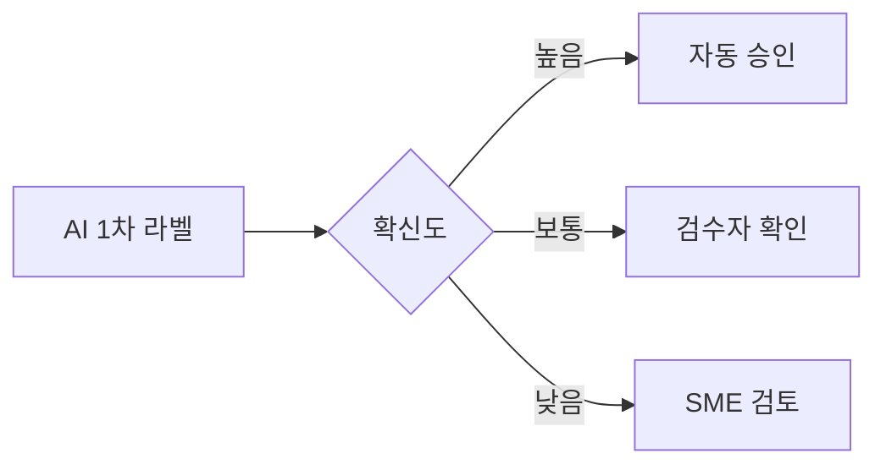
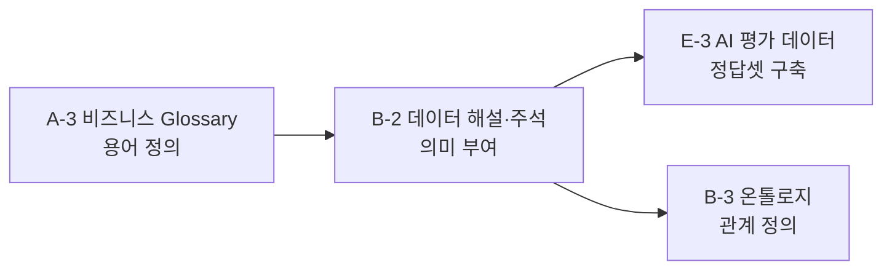

# B-2 데이터 해설·주석 가이드

1. [개요](#1-개요)
   - [1.1 데이터 해설·주석이란](#11-데이터-해설주석이란)
   - [1.2 주요 대상 조직](#12-주요-대상-조직)
   - [1.3 AI-ready 데이터 체계 내 위치](#13-ai-ready-데이터-체계-내-위치)

2. [왜 필요한가](#2-왜-필요한가)
   - [2.1 현업 Pain Point](#21-현업-pain-point)
   - [2.2 기대 효과](#22-기대-효과)

3. [무엇을 갖추나](#3-무엇을-갖추나)
   - [3.1 정본 모델 — 세 층의 의미 부여](#31-정본-모델--세-층의-의미-부여)
   - [3.2 분류 체계(Taxonomy)와 라벨 정의서](#32-분류-체계taxonomy와-라벨-정의서)
   - [3.3 데이터 유형별 주석 방식](#33-데이터-유형별-주석-방식)
   - [3.4 주석 1건의 입력 항목 사전](#34-주석-1건의-입력-항목-사전)
   - [3.5 주석 가이드라인·사례집](#35-주석-가이드라인사례집)
   - [3.6 라벨 이력(버전) 관리](#36-라벨-이력버전-관리)

4. [어디부터 하나 — 주석 대상 선정](#4-어디부터-하나--주석-대상-선정)
   - [4.1 주석 대상](#41-주석-대상)
   - [4.2 우선순위·규모](#42-우선순위규모)

5. [예시 시나리오: 결함 이미지 주석](#5-예시-시나리오-결함-이미지-주석)
   - [5.1 적용 전 / 후](#51-적용-전--후)
   - [5.2 흐름 미리보기](#52-흐름-미리보기)

6. [어떻게 준비·운영하나](#6-어떻게-준비운영하나)
   - [6.1 8단계 표준 구축 프로세스](#61-8단계-표준-구축-프로세스)
   - [6.2 Pilot — 작게 먼저 해보고 기준을 잡는다](#62-pilot--작게-먼저-해보고-기준을-잡는다)
   - [6.3 작업자 간 일치도(IAA)와 합의](#63-작업자-간-일치도iaa와-합의)
   - [6.4 본 라벨링 — AI 1차 라벨 + 사람 검수](#64-본-라벨링--ai-1차-라벨--사람-검수)
   - [6.5 검수 분기 — 확신도 기반 라우팅](#65-검수-분기--확신도-기반-라우팅)
   - [6.6 운영 — 변경·버전 관리와 역할](#66-운영--변경버전-관리와-역할)
   - [6.7 현업 실행 키트 — 라벨러 작업 지시서](#67-현업-실행-키트--라벨러-작업-지시서)

7. [다른 주제와의 관계](#7-다른-주제와의-관계)
   - [7.1 인접 주제와의 역할 분담](#71-인접-주제와의-역할-분담)
   - [7.2 전체 조감도](#72-전체-조감도--경계-한눈에)

# 1. 개요

## 1.1 데이터 해설·주석이란

데이터 해설·주석(Data Annotation)은 원본 데이터에 사람이 의미 정보를 부여하여 AI가 학습하고 활용할 수 있는 형태로 전환하는 활동이다.

AI는 이미지, 문장, 로그와 같은 원본 데이터를 그대로 입력받을 수는 있지만, 해당 데이터가 무엇을 의미하는지 스스로 판단할 수는 없다. 예를 들어 외관 검사 이미지가 존재하더라도 어떤 결함인지, 어느 위치에 존재하는지, 품질에 어떤 영향을 미치는지에 대한 판단 기준이 없다면 AI는 이를 학습할 수 없다. 또한 고객 클레임 문장이 존재하더라도 어떤 원인에 대한 이야기인지, 어떤 조치가 필요한 상황인지를 이해할 수 없다.

따라서 데이터 해설·주석은 사람의 판단 기준과 업무 지식을 구조화된 형태로 기록하여 AI가 활용 가능한 학습 데이터로 전환하는 과정이며, 동시에 현업 전문가의 판단 기준을 조직의 데이터 자산으로 축적하는 활동이다.

---

## 1.2 주요 참여 조직

데이터 해설·주석은 특정 조직이 단독으로 수행하는 업무가 아니라 현업 조직, 데이터 조직, AI 조직이 함께 참여하여 공통의 판단 기준을 정의하고 이를 데이터 자산으로 구축하는 협업 활동이다.

| 조직 | 역할 |
|--------|--------|
| 전사 데이터 조직 | 표준 체계 수립 및 운영 정책 관리 |
| 현업 SME | 분류 체계 정의 및 최종 승인 |
| 데이터 조직 | Taxonomy, Guideline, 품질 체계 구축 |
| 라벨러 | 실제 Annotation 수행 |
| 검수자 | 품질 검증 및 재작업 관리 |
| AI 조직 | 자동화 및 AI 활용 체계 구축 |

특히 현업 SME는 실제 업무에서 사용되는 판단 기준을 정의하는 핵심 역할을 수행한다. 데이터 해설·주석의 목적은 단순히 데이터를 분류하는 것이 아니라 현업의 판단 기준을 데이터로 전환하는 것이므로, SME의 참여 없이 일관된 품질의 주석 데이터를 구축하기는 어렵다.

---

## 1.3 AI-ready Data 체계 내 위치

데이터 해설·주석은 AI-ready Data 체계에서 전처리 이후 단계에 위치하며, 전처리를 통해 AI가 읽을 수 있는 형태로 변환된 데이터에 의미와 맥락을 부여하여 실제 학습이 가능한 데이터로 완성하는 역할을 수행한다.


주석 결과물은 특정 프로젝트의 일회성 산출물로 사용되는 것이 아니라 Registry를 통해 관리되는 데이터 자산으로 운영되어야 하며, 향후 다양한 AI 과제에서 반복적으로 활용될 수 있는 재사용 가능한 자산으로 축적되어야 한다.

---

# 2. 왜 필요한가 (Why)

AI 프로젝트에서 가장 자주 발생하는 실패 원인은 알고리즘이나 모델 성능의 부족이 아니라 학습에 활용할 수 있는 데이터의 품질과 일관성 부족이다. 많은 조직은 충분한 양의 데이터를 보유하고 있다고 생각하지만, 실제로는 AI가 학습할 수 있는 형태로 의미와 맥락이 정리된 데이터가 준비되어 있지 않은 경우가 많다. 데이터 해설·주석 체계는 이러한 문제를 해결하고 현업의 판단 기준을 AI가 활용 가능한 형태로 전환하기 위해 필요하다.

---

## 2.1 현업 Pain Point

예를 들어 두산전자가 동판 외관검사 자동화를 추진하면서 약 5만 장 규모의 결함 이미지를 확보한 사례를 가정해보자. 데이터 자체는 충분히 존재하였지만 실제 AI 모델 학습을 준비하는 과정에서는 다음과 같은 문제가 확인되었다.

- **정답 데이터의 부재:** 이미지는 존재하지만 결함 유형이 표준화되어 있지 않아 AI 학습 데이터로 직접 활용하기 어렵다.
- **판단 기준의 불일치:** 동일한 결함이라도 작업자마다 서로 다른 명칭과 기준을 사용하여 일관된 학습 데이터 구축이 어렵다.
- **운영 이력 및 품질 관리 부재:** 누가 어떤 기준으로 주석을 수행했는지 추적하기 어렵고 오류 데이터에 대한 관리 체계가 존재하지 않는다.
- **재사용 체계의 부재:** 프로젝트 종료 이후 데이터가 방치되어 다른 AI 과제에서 재활용되지 못한다.

결과적으로 데이터는 존재하지만 AI가 학습할 수 있는 정답 데이터는 부족한 상태가 되며, 동일한 데이터 정비 작업이 프로젝트마다 반복적으로 수행되는 비효율이 발생한다.

---

## 2.2 기대 효과

### 데이터 의미의 표준화

데이터 해설·주석 체계를 구축하면 사람마다 다르게 해석하던 데이터를 공통 기준으로 관리할 수 있으며, 동일한 현상에 대해 누구나 동일한 기준으로 판단할 수 있는 환경을 구축할 수 있다.

### AI 학습 품질 향상

명확하게 정의된 Taxonomy와 Guideline을 기반으로 구축된 주석 데이터는 AI 모델이 일관된 기준을 학습할 수 있도록 지원하며, 결과적으로 모델의 정확도와 신뢰도를 향상시키는 기반이 된다.

### 운영 효율 향상

AI 기반 Pre-labeling, Human-in-the-Loop, 자동 품질 검증 체계를 적용하면 반복적인 주석 작업을 줄이고 사람은 검수와 예외 처리 중심으로 참여할 수 있어 운영 효율을 높일 수 있다.

### 데이터 자산화

한 번 구축된 주석 데이터셋은 특정 프로젝트에서만 사용하는 산출물이 아니라 향후 품질 예측, 이상 탐지, Agent 구축 등 다양한 AI 과제에서 재사용 가능한 데이터 자산으로 활용될 수 있으며, 데이터 구축 비용을 장기적인 투자 자산으로 전환할 수 있다.

---

# 3. 무엇을 갖추나

데이터 해설·주석 체계는 단순히 데이터를 분류하는 작업이 아니다.

AI가 데이터를 정확하게 이해하고 활용하기 위해서는 분류 체계, 주석 기준, 입력 항목, 운영 이력까지 함께 관리해야 한다. 특히 동일한 데이터를 여러 사람이 일관되게 해석할 수 있어야 하며, 향후 다양한 AI 과제에서 재사용 가능한 형태로 구축하는 것이 중요하다.

---

## 3.1 정본 모델 — 세 층의 의미 부여

데이터 해설·주석은 데이터에 의미를 부여하는 활동이며, 일반적으로 라벨(Label), 주석(Annotation), 해설(Commentary)의 세 층으로 구성된다.

각 층은 서로 다른 역할을 수행하며 함께 활용될 때 AI가 데이터를 보다 정확하게 이해할 수 있다.

```text
데이터

→ 라벨(Label)

→ 주석(Annotation)

→ 해설(Commentary)
```

| 구분 | 역할 | 예시 |
|--------|--------|--------|
| 라벨(Label) | 데이터를 대표하는 분류값 | 균열, 긁힘, 오염 |
| 주석(Annotation) | 세부 정보를 구조화하여 기록 | 위치, 원인, 조치 유형 |
| 해설(Commentary) | 판단 근거와 맥락 설명 | 발생 배경, 특이사항, 전문가 의견 |

### 라벨(Label)

라벨은 데이터를 대표하는 가장 상위 분류 정보이다.

예를 들어 외관 검사 이미지가 존재할 경우 해당 이미지가 어떤 결함 유형에 해당하는지를 정의하는 값이 라벨이다.

```text
이미지

→ 균열

→ 긁힘

→ 오염
```

라벨은 AI 분류 모델이 학습하는 가장 기본적인 정답 정보가 된다.

### 주석(Annotation)

주석은 라벨만으로 설명하기 어려운 세부 정보를 구조화하여 기록하는 정보이다.

예를 들어 동일한 균열 결함이라도 위치, 크기, 원인, 조치 결과를 함께 기록할 수 있다.

```text
라벨 : 균열

위치 : 우측 상단

원인 : 압력 불균형

조치 : 재작업
```

### 해설(Commentary)

해설은 구조화된 라벨과 주석으로 표현하기 어려운 현업의 판단 근거와 맥락 정보를 기록하는 영역이다.

예를 들어 품질 전문가가 특정 결함을 균열로 판단한 이유나 반복적으로 발생하는 원인에 대한 설명을 자유롭게 기록할 수 있다.

```text
해당 균열은 압력 불균형보다
원재료 편차의 영향이 큰 것으로 판단됨
```

세 층의 정보는 독립적으로 존재하는 것이 아니라 함께 활용된다.

라벨은 분류 기준을 제공하고, 주석은 세부 정보를 구조화하며, 해설은 현업의 판단 맥락을 전달한다.

---

## 3.2 분류 체계(Taxonomy)와 라벨 정의서

데이터 해설·주석의 품질은 결국 어떤 분류 체계를 정의하느냐에 의해 결정된다.

Taxonomy는 데이터를 어떤 기준으로 구분하고 분류할 것인지 정의하는 체계이며, 향후 주석 작업, 품질 검증, AI 모델 학습, 자동화 체계의 공통 기준으로 활용된다.

좋은 Taxonomy는 다음 세 가지 조건을 충족해야 한다.

- 상호배타성
- 포괄성
- 일관성

예를 들어 동판 외관검사 데이터를 대상으로 주석 체계를 설계한다면 아래와 같은 구조를 사용할 수 있다.

```text
결함
├─ 균열
├─ 눌림
├─ 오염
└─ 긁힘
```

각 라벨은 정의서를 통해 관리하며, 동일한 의미에 대해 여러 표현이 사용되지 않도록 표준 기준을 함께 정의해야 한다.

| 코드 | 라벨 | 정의 |
|--------|--------|--------|
| DEF-01 | 균열 | 표면이 선형으로 갈라진 결함 |
| DEF-02 | 눌림 | 외부 압력에 의해 함몰된 결함 |
| DEF-03 | 오염 | 이물질 부착 |
| DEF-04 | 긁힘 | 표면 긁힘 흔적 |

### Flat vs Hierarchical Taxonomy

Taxonomy는 데이터 복잡도와 활용 목적에 따라 Flat 구조 또는 Hierarchical 구조로 설계할 수 있으며, 향후 확장 가능성까지 고려하여 선택해야 한다.

| 구분 | Flat Taxonomy | Hierarchical Taxonomy |
|--------|--------|--------|
| 구조 | 단일 레벨 | 다단계 구조 |
| 장점 | 단순, 구축·운영 용이 | 확장성 우수 |
| 단점 | 분류 수 증가 시 관리 어려움 | 설계 복잡 |
| 적용 예 | 단순 결함 분류 | 대규모 품질 체계 |

예를 들어 외관 검사 결함이 5개 이하 수준이라면 Flat 구조만으로도 충분하다.

```text
결함
├─ 균열
├─ 눌림
├─ 오염
└─ 긁힘
```

반면 결함 유형이 지속적으로 증가하거나 상위 분류 체계가 필요한 경우에는 Hierarchical 구조를 적용할 수 있다.

```text
결함
├─ 표면결함
│ ├─ 균열
│ ├─ 긁힘
│ └─ 오염
│
└─ 형상결함
  ├─ 눌림
  └─ 변형
```

초기 구축 단계에서는 관리 복잡도를 최소화하기 위해 Flat 구조를 우선 적용하고, 활용 범위가 확대되면서 분류 체계가 복잡해질 경우 Hierarchical 구조로 확장하는 방식을 권장한다.

---

## 3.3 데이터 유형별 주석 방식

데이터 해설·주석은 모든 데이터에 동일한 방식으로 적용되지 않으며, 데이터 유형과 AI 활용 목적에 따라 적절한 주석 방식을 선택해야 한다. 동일한 이미지 데이터라 하더라도 단순 분류가 필요한 경우와 위치 정보를 학습해야 하는 경우의 방식이 다르며, 텍스트·영상·음성 역시 활용 목적에 따라 다른 접근이 필요하다.

| 데이터 유형 | 대표 주석 방식 | 제조업 활용 예 |
|--------|--------|--------|
| 텍스트 | 문서 분류, 개체 추출, 구간 태깅 | 고객 클레임 분석 |
| 이미지 | 분류, 위치 표시, 영역 표시 | 결함 이미지 분석 |
| 영상 | 객체 추적, 이벤트 구간 표시 | 조립 공정 분석 |
| 음성 | 이벤트 탐지, 음성 전사 | 설비 이상음 분석 |

제조업에서는 이미지 데이터가 가장 대표적인 주석 대상이며, 외관 검사, 품질 검사, 설비 점검 영역을 중심으로 활용 범위가 빠르게 확대되고 있다. 따라서 단순히 주석을 수행하는 것이 아니라 과제 목적에 맞는 주석 방식을 선택하고, 향후 재사용 가능한 형태로 관리하는 것이 중요하다.

---

## 3.4 주석 1건의 입력 항목 사전

주석 데이터는 단순히 라벨 하나만 기록하는 것이 아니다.

데이터 유형과 활용 목적에 따라 다양한 정보를 함께 기록하며, 이러한 정보는 AI 학습과 품질 검증의 기준으로 활용된다.

| 항목 | 설명 | 작성 주체 |
|--------|--------|--------|
| 원본 데이터 ID | 원본 데이터 식별자 | 자동 |
| 라벨 | 대표 분류값 | 작업자 |
| 위치 정보 | Bounding Box, 영역 정보 등 | 작업자 |
| 원인 유형 | 결함 발생 원인 | 현업 |
| 조치 유형 | 처리 결과 | 현업 |
| 해설 | 판단 근거 및 특이사항 | 현업 |
| 작성자 | 주석 수행자 | 자동 |
| 작성일 | 생성 시점 | 자동 |

---

## 3.5 Guideline 및 사례집

동일한 Taxonomy를 사용하더라도 작업자마다 해석 기준이 다르면 주석 품질은 크게 달라질 수 있다. 따라서 데이터 해설·주석 체계에서는 분류 기준을 문서화한 Guideline과 실제 사례를 정리한 사례집(Casebook)을 함께 구축해야 한다.

Guideline은 작업자가 어떤 기준으로 데이터를 분류해야 하는지를 정의하는 공식 기준서이며, 사례집은 해당 기준을 실제 사례를 통해 설명하는 실무 참고 자료이다.

Guideline은 일반적으로 다음 요소를 포함한다.

- 정의
- 포함 사례
- 제외 사례
- 경계 사례
- 결정 규칙

예를 들어 균열과 긁힘을 구분해야 하는 경우에는 아래와 같은 결정 규칙을 정의할 수 있다.

```text
IF 선형 갈라짐 존재
→ 균열

IF 표면 긁힘 흔적 존재
→ 긁힘

IF 판단 불가
→ SME 검토
```

사례집에는 대표 사례뿐 아니라 제외 사례와 경계 사례도 함께 포함해야 하며, 특히 작업자 간 해석 차이가 자주 발생하는 사례를 지속적으로 추가하여 품질 개선에 활용하는 것이 중요하다.

Guideline과 사례집은 일회성 교육 자료가 아니라 조직의 판단 기준을 축적하는 핵심 자산으로 관리되어야 하며, 향후 AI 자동화 체계와 계열사 확산 과정에서도 동일한 기준으로 활용될 수 있어야 한다.

---

## 3.6 라벨 이력(버전) 관리

주석 데이터는 구축 이후에도 새로운 결함 유형의 등장, Taxonomy 변경, Guideline 보완, 품질 개선 활동 등에 따라 지속적으로 수정된다.

특히 동일한 데이터라도 어떤 라벨 정의와 주석 기준을 적용했는지에 따라 AI 모델의 학습 결과와 해석이 달라질 수 있으므로, 변경 이력을 체계적으로 관리하고 추적 가능한 형태로 유지해야 한다.

대표적으로 다음과 같은 변경 이력을 관리한다.

| 항목 | 설명 |
|--------|--------|
| 라벨 버전 | 라벨 체계 버전 |
| 변경 사유 | 변경 또는 추가 이유 |
| 변경 내용 | 추가·수정·삭제된 라벨 또는 기준 |
| 작업자 | 변경 수행자 |
| 검수자 | 승인자 |
| 변경 일시 | 변경 시점 |
| 활용 이력 | 적용 데이터셋 및 AI 과제 |

예를 들어 기존에는 `긁힘`과 `균열`만 존재하던 분류 체계에 새로운 결함 유형인 `오염`이 추가될 수 있으며, Guideline 변경에 따라 기존 데이터 일부를 다시 주석해야 하는 경우도 발생할 수 있다.

따라서 데이터 해설·주석 체계에서는 단순히 데이터셋 버전만 관리하는 것이 아니라, Taxonomy, 라벨 정의서, Guideline, 사례집의 변경 이력까지 함께 관리해야 한다.

이를 통해 특정 AI 모델이 어떤 기준의 주석 데이터를 사용했는지 추적할 수 있으며, 과거 결과를 재현하거나 변경에 따른 영향을 분석할 수 있다.

주석 데이터뿐 아니라 Taxonomy, Guideline, 사례집, Gold Dataset까지 포함한 통합 버전 관리 체계를 운영하는 것을 권장한다.

---

# 4. 어디부터 하나 — 주석 대상 선정

데이터 해설·주석은 모든 데이터를 대상으로 수행해야 하는 활동이 아니다. 주석 작업은 상당한 시간과 비용이 투입되는 만큼, 사람의 판단이 중요하고 향후 AI 활용 및 재사용 가능성이 높은 데이터부터 우선적으로 적용해야 한다.

특히 AI-ready Data 관점에서는 단순히 현재 과제에 필요한 데이터를 만드는 것이 아니라 향후 다양한 AI 과제에서 반복적으로 활용할 수 있는 데이터 자산을 구축하는 것이 중요하므로, 데이터의 활용 가치와 확장성을 함께 고려하여 우선순위를 결정해야 한다.

---

## 4.1 주석 대상

주석 대상을 선정할 때에는 사람의 판단과 해석이 필요하며, 향후 AI 활용 가능성이 높은 데이터를 우선 대상으로 선정한다.

제조업 환경에서는 다음과 같은 데이터가 대표적인 주석 대상에 해당한다.

| 데이터 유형 | 주석 목적 | 활용 예시 |
|--------|--------|--------|
| 결함 이미지 | 결함 유형·위치 식별 | 외관 검사 자동화 |
| 고객 클레임 | 원인·조치 유형 분류 | VOC 분석 |
| 설비 이상 이력 | 이상 유형 및 원인 분류 | 설비 진단 |
| 시험 결과 보고서 | 판정 결과 구조화 | 품질 분석 |
| 작업일지 | 현장 지식 구조화 | Agent 구축 |

특히 결함 이미지와 고객 클레임 데이터는 품질 예측, 이상 탐지, Agent 구축 등 다양한 AI 과제로 확장될 수 있기 때문에 우선적인 주석 대상으로 고려할 수 있다.

---

## 4.2 우선순위·규모

주석 작업은 상당한 시간과 비용이 소요되므로, 활용 가치가 높은 영역부터 단계적으로 추진하는 것이 바람직하다.

일반적으로 다음 기준을 활용하여 우선순위를 결정한다.

| 평가 항목 | 판단 기준 |
|--------|--------|
| AI 활용 가능성 | 실제 AI 과제에 활용되는가 |
| 사람의 판단 필요성 | 사람의 해석이 필요한 데이터인가 |
| 업무 영향도 | 품질, 생산, 고객 대응에 영향을 주는가 |
| 데이터 확보 수준 | 충분한 데이터가 존재하는가 |
| 재사용 가능성 | 다른 AI 과제에서도 활용 가능한가 |

예를 들어 외관 검사 이미지는 사람의 판단이 필요하고, 품질 업무에 직접 영향을 미치며, 다양한 AI 과제로 확장될 수 있기 때문에 일반적으로 가장 우선적인 주석 대상이 된다.

반면 이미 코드값으로 구조화되어 있거나 사람의 해석이 필요하지 않은 데이터는 우선순위가 낮을 수 있다.

주석 범위는 한 번에 전체 데이터를 구축하기보다 대표 데이터셋을 대상으로 시작한 후 점진적으로 확대하는 방식을 권장한다.

---

# 5. 예시 시나리오: 결함 이미지 주석

본 장에서는 외관 검사 이미지를 대상으로 데이터 해설·주석 체계를 구축하는 과정을 간략히 살펴본다.

동일한 결함 이미지를 작업자마다 다르게 판단하던 상황에서 표준 분류 체계와 주석 기준을 적용하여 AI 학습용 데이터셋을 구축하는 과정을 예시로 설명한다.

---

## 5.1 적용 전 / 후

| 적용 전 | 적용 후 |
|---|---|
| 작업자마다 결함 명칭이 다름 | 동일 기준으로 결함 분류 |
| 이미지를 사람이 일일이 판정 | AI가 1차 분류 수행 |
| 작업자별 품질 편차 발생 | 공통 Guideline 기반 작업 |
| 신규 작업자 교육에 장시간 소요 | 사례집 기반 빠른 학습 |
| 검사 결과 일관성 부족 | 동일 기준으로 판정 |

예를 들어 동일한 이미지를 두고 어떤 작업자는 `균열`, 어떤 작업자는 `긁힘`으로 판단하는 경우가 발생할 수 있다.

표준 Taxonomy와 Guideline을 구축하면 동일한 기준으로 데이터를 분류할 수 있으며, 이후 AI는 해당 기준을 학습하여 반복 업무를 자동화할 수 있다.

---

## 5.2 흐름 미리보기

결함 이미지 주석 체계 구축은 일반적으로 다음 순서로 진행한다.


초기에는 사람이 기준을 정의하고 주석을 수행하지만, 일정 수준 이상의 데이터가 확보되면 AI가 1차 라벨을 생성하고 사람은 검수 중심으로 참여할 수 있다.

이를 통해 품질을 유지하면서도 구축 생산성을 높일 수 있다.

---

# 6. 어떻게 준비·운영하나

## 6.1 8단계 표준 구축 프로세스

데이터 해설·주석 체계는 단순히 데이터를 분류하는 작업으로 끝나지 않는다.

분류 체계 설계부터 품질 검증, 운영 체계 구축까지 포함한 전주기 관리가 필요하며, 본 가이드는 다음 8단계 프로세스를 기준으로 작성한다.

```text
① 주석 대상 선정
→ ② Taxonomy 설계
→ ③ Guideline 작성
→ ④ Pilot
→ ⑤ IAA 및 기준 개선
→ ⑥ 본 라벨링
→ ⑦ QA
→ ⑧ 운영
```


| 단계 | 주요 목적 | 대표 산출물 |
|---|---|---|
| ① 주석 대상 선정 | 대상 데이터 결정 | 대상 데이터 목록 |
| ② Taxonomy 설계 | 분류 체계 정의 | Taxonomy |
| ③ Guideline 작성 | 판단 기준 정의 | Guideline |
| ④ Pilot | 기준 검증 | Pilot Dataset |
| ⑤ IAA | 일관성 검증 | IAA 결과 |
| ⑥ 본 라벨링 | 데이터 구축 | Annotation Dataset |
| ⑦ QA | 품질 검증 | QA 결과 |
| ⑧ 운영 | 변경·버전 관리 | Registry, 운영 이력 |

---

## 6.2 Pilot — 작게 먼저 해보고 기준을 잡는다

Pilot은 본격적인 데이터 구축 이전에 Taxonomy와 Guideline이 실제 현장에서 일관되게 적용 가능한지 검증하는 단계이다.

일반적으로 전체 데이터 중 일부를 선정하여 여러 작업자가 독립적으로 주석을 수행한다.

Pilot의 목적은 데이터를 구축하는 것이 아니라 기준의 문제점을 발견하는 것이다.

대표 확인 항목은 다음과 같다.

- 작업자 간 해석 차이
- 경계 사례 존재 여부
- Guideline 누락 여부
- 라벨 정의의 명확성

Pilot 결과는 이후 Guideline 보완과 IAA 측정의 기준으로 활용한다.

---

## 6.3 작업자 간 일치도(IAA)와 합의

동일한 데이터를 여러 작업자가 주석했을 때 결과가 얼마나 일치하는지를 측정하는 지표를 IAA(Inter-Annotator Agreement)라고 한다.

IAA는 데이터 품질을 평가하는 대표적인 기준 중 하나이다.

| 결함 유형 | IAA |
|---|---|
| 균열 | 0.83 |
| 눌림 | 0.86 |
| 오염 | 0.88 |
| 긁힘 | 0.61 |

IAA가 낮게 나타난 경우 단순히 작업자 숙련도 문제로 판단하지 않는다.

대부분의 경우 Taxonomy 정의가 불명확하거나 Guideline이 충분하지 않은 경우가 많기 때문이다.

따라서 IAA 측정 이후에는 불일치 사례를 분석하고 작업자 간 합의를 통해 기준을 개선한다.

---

## 6.4 본 라벨링 — AI 1차 라벨 + 사람 검수

Pilot과 IAA 검증이 완료되면 본격적인 주석 구축을 수행한다.

초기에는 사람이 직접 모든 데이터를 주석할 수 있지만, 일정 규모 이상의 데이터가 확보되면 AI 기반 Pre-labeling을 적용할 수 있다.

```text
AI 1차 라벨 생성

→ 작업자 검토

→ 검수자 승인

→ 데이터셋 반영
```

이 방식의 목적은 사람을 제거하는 것이 아니라 반복 작업을 줄이는 것이다.

사람은 최종 판단과 예외 사례 검토를 담당하고, AI는 반복적인 분류 작업을 지원한다.

---

## 6.5 검수 분기 — 확신도 기반 라우팅

모든 데이터를 동일한 수준으로 검수하는 것은 비효율적일 수 있다.

따라서 AI의 예측 확신도와 데이터 특성에 따라 검수 수준을 다르게 적용할 수 있다.



| 구간 | 처리 방식 |
|---|---|
| 높음 | 자동 승인 |
| 보통 | 검수자 확인 |
| 낮음 | SME 검토 |

이러한 방식은 품질을 유지하면서도 검수 비용을 줄이는 데 도움이 된다.

특히 데이터 규모가 커질수록 모든 데이터를 전수 검수하기보다 위험도가 높은 데이터에 집중하는 것이 효과적이다.

---

## 6.6 운영 — 변경·버전 관리와 역할

주석 데이터는 구축 이후에도 새로운 결함 유형의 등장, Taxonomy 변경, Guideline 보완 등에 따라 지속적으로 수정된다.

따라서 데이터셋뿐 아니라 Taxonomy, Guideline, 사례집까지 포함하여 변경 이력을 관리해야 한다.

대표적인 변경 유형은 다음과 같다.

| 변경 유형 | 예시 |
|---|---|
| 신규 라벨 추가 | 신규 결함 유형 추가 |
| 라벨 정의 변경 | 기존 기준 수정 |
| Guideline 보완 | 경계 사례 추가 |
| 사례집 업데이트 | 신규 사례 반영 |
| 데이터 수정 | 오주석 정정 |

### 주요 역할

| 역할 | 주요 책임 |
|---|---|
| 현업 SME | 기준 정의, 경계 사례 판단 |
| 작업자 | 주석 수행 |
| 검수자 | 품질 검증 |
| 데이터 조직 | 운영 정책 및 버전 관리 |
| AI 조직 | 자동화 체계 운영 |

주석 체계는 특정 프로젝트 종료와 함께 폐기되는 것이 아니라 지속적으로 관리되고 개선되는 데이터 자산으로 운영되어야 한다.

---

## 6.7 현업 실행 키트 — 라벨러 작업 지시서

주석 품질은 작업자의 숙련도보다도 명확한 작업 기준에 더 큰 영향을 받는다.

따라서 실제 주석 작업 시에는 표준 작업 지시서를 활용하는 것이 바람직하다.

### 라벨러 작업 지시서 예시

| 항목 | 내용 |
|---|---|
| 데이터셋 | 외관 검사 이미지 |
| 적용 Taxonomy | 품질 결함 분류 체계 |
| 적용 Guideline | Guideline v1.2 |
| 작업 범위 | 이미지 5,000건 |
| 주석 방식 | Bounding Box |
| 검수 방식 | 검수자 승인 |
| 예외 처리 | SME 문의 |

### 작업 절차

```text
이미지 확인

→ Guideline 확인

→ 주석 수행

→ 검수 요청

→ 승인 후 데이터셋 반영
```

### 작업 시 유의사항

- Guideline에 없는 사례는 임의 판단하지 않는다.
- 경계 사례는 별도 표시 후 검수자에게 전달한다.
- 라벨 수정 시 변경 사유를 기록한다.
- 동일 기준을 모든 데이터에 적용한다.

작업 지시서는 주석 품질을 유지하기 위한 운영 기준이며, Taxonomy와 Guideline 변경 시 함께 갱신해야 한다.

---

# 7. 다른 주제와의 관계

데이터 해설·주석은 데이터를 AI가 학습할 수 있는 형태로 만드는 역할을 수행한다.

그러나 데이터의 의미를 정의하거나, 데이터 간 관계를 설명하거나, AI 성능을 평가하는 역할까지 수행하지는 않는다. 따라서 다른 AI-ready Data 주제와의 경계를 명확히 이해할 필요가 있다.

---

## 7.1 인접 주제와의 역할 분담

| 주제 | 역할 |
|---|---|
| A-3 비즈니스 Glossary | 용어와 정의 표준화 |
| B-3 온톨로지 | 개념 간 관계 정의 |
| E-3 AI 평가 데이터 | AI 성능 평가용 정답셋 구축 |
| B-2 데이터 해설·주석 | 학습용 의미 정보 부여 |

예를 들어 `균열`이라는 용어를 정의하는 것은 Glossary의 역할이다.

`균열 → 공정 → 설비 → 원인` 관계를 정의하는 것은 온톨로지의 역할이다.

실제 이미지를 `균열`로 분류하는 것은 데이터 해설·주석의 역할이다.

또한 AI 모델의 성능을 검증하기 위한 별도 정답셋은 AI 평가 데이터(E-3)의 역할이다.

---

## 7.2 전체 조감도 — 경계 한눈에



| 주제 | 핵심 질문 |
|---|---|
| A-3 비즈니스 Glossary | 이 용어는 무슨 뜻인가? |
| B-2 데이터 해설·주석 | 이 데이터는 무엇을 의미하는가? |
| B-3 온톨로지 | 이것은 무엇과 연결되는가? |
| E-3 AI 평가 데이터 | AI가 제대로 판단했는가? |

데이터 해설·주석은 현업의 판단 기준을 데이터 형태로 구조화하여 AI가 학습할 수 있도록 만드는 역할에 집중한다.

---

# Appendix

## Appendix A. 주요 용어

### 데이터 해설·주석 (Data Annotation)

원본 데이터에 사람의 판단 기준과 의미 정보를 부여하여 AI가 학습하고 활용할 수 있는 형태로 전환하는 활동이다.

---

### 라벨 (Label)

데이터를 대표하는 분류값이다.

예를 들어 결함 이미지를 `균열`, `긁힘`, `오염`으로 분류하는 것이 라벨링에 해당한다.

---

### 주석 (Annotation)

라벨 외에 위치, 원인, 조치 유형과 같은 세부 정보를 기록하는 활동이다.

---

### 해설 (Commentary)

구조화된 정보만으로 표현하기 어려운 판단 근거와 맥락 정보를 자유 서술 형태로 기록하는 정보이다.

---

### Taxonomy

데이터를 어떤 기준으로 분류할 것인지 정의한 체계이다.

주석 품질은 Taxonomy 품질에 크게 영향을 받으며, 이후 AI 학습과 품질 검증의 기준으로 활용된다.

---

### Guideline

작업자가 동일한 기준으로 데이터를 분류할 수 있도록 정의한 규칙 문서이다.

포함 사례, 제외 사례, 경계 사례, 결정 규칙 등을 포함한다.

---

### Casebook

대표 사례, 제외 사례, 경계 사례를 정리한 자료이다.

Guideline을 실제 사례로 설명하고 작업자 교육과 품질 검증에 활용한다.

---

### SME

현업 전문가를 의미한다.

Taxonomy 정의, Guideline 검증, 경계 사례 판단, 최종 승인 역할을 수행한다.

---

### IAA (Inter-Annotator Agreement)

동일한 데이터를 여러 작업자가 주석했을 때 얼마나 동일한 결과가 나오는지를 측정하는 지표이다.

작업자 간 판단 기준의 일관성을 검증하는 데 활용한다.

---

### Gold Dataset

전문가 검증이 완료된 고품질 기준 데이터셋이다.

작업자 교육, 품질 검증, AI 평가의 기준 데이터로 활용한다.

---

### Human-in-the-Loop (HITL)

AI가 생성한 결과를 사람이 검토하고 수정하는 운영 방식이다.

주석 자동화 과정에서 품질을 유지하기 위한 핵심 운영 방식이다.

---

### Pre-labeling

AI가 먼저 라벨을 생성하고 사람이 검토하는 방식이다.

반복적인 주석 작업을 줄이고 생산성을 높이기 위해 활용한다.

---

### Active Learning

AI가 가장 판단하기 어려운 데이터를 우선 선별하여 사람의 검토를 요청하는 방식이다.

동일한 비용으로 더 높은 품질의 데이터셋을 구축하기 위해 활용한다.

---

## Appendix B. 라벨러 작업 예시

### 결함 이미지 주석 예시

```text
이미지 ID : IMG_001

라벨 : 균열

위치 : 좌측 상단

원인 : 압력 불균형

조치 : 재작업

해설 :
압력 편차에 의해 발생한 균열로 판단
```

### 고객 클레임 주석 예시

```text
문서 ID : VOC_001

라벨 : 납기 지연

원인 : 생산 일정 지연

조치 : 긴급 생산 투입

해설 :
특정 고객사 긴급 요청으로 일정 조정 필요
```

---

## Appendix C. 주석 품질 점검 체크리스트

| 점검 항목 | 확인 여부 |
|---|---|
| Taxonomy 승인 완료 | □ |
| Guideline 승인 완료 | □ |
| 사례집 구축 완료 | □ |
| Pilot 완료 | □ |
| IAA 목표 달성 | □ |
| QA 완료 | □ |
| 버전 관리 적용 | □ |
| 운영 책임자 지정 | □ |

---
