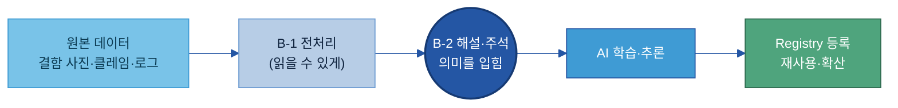
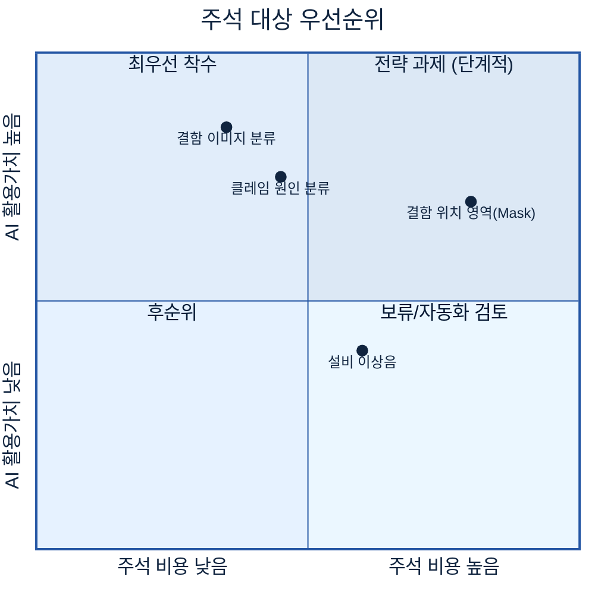
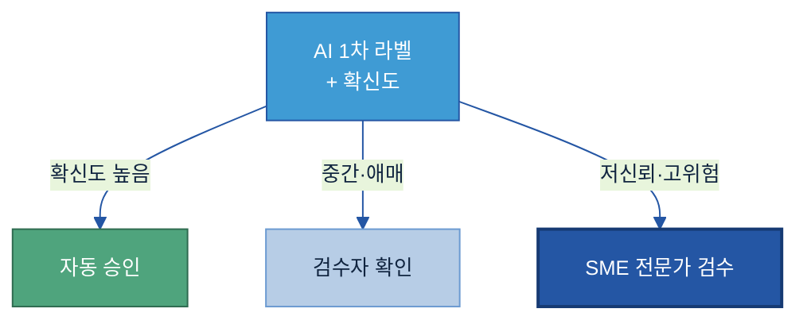
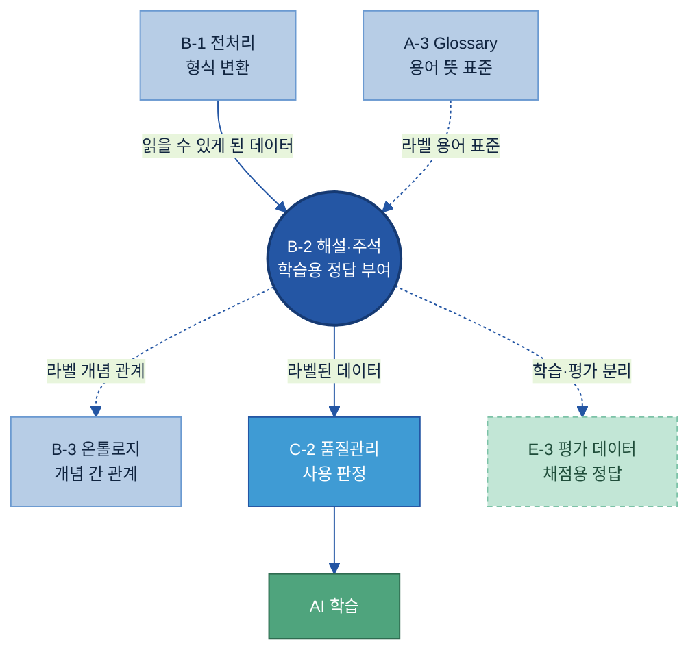

# B-2 데이터 해설·주석(Data Annotation) 매뉴얼

---

## 목차

- [이 가이드가 답하는 5가지 질문](#key-questions)

1. [Why — 왜 필요한가](#why)
    - [1.1 현업 Pain Point](#s11)
    - [1.2 기대 효과](#s12)
    - [1.3 적용 전 / 후](#s13)
2. [What — 무엇을 갖추나](#what)
    - [2.1 정의 — 데이터 해설·주석이란 + 체계 내 위치](#s21)
    - [2.2 정본 모델 — 세 층의 의미 부여](#s22)
    - [2.3 분류 체계(Taxonomy)와 라벨 정의서](#s23)
    - [2.4 데이터 유형별 주석 방식](#s24)
    - [2.5 주석 데이터 구성 항목](#s25)
    - [2.6 주석 가이드라인·사례집](#s26)
    - [2.7 라벨 이력(버전) 관리](#s27)
3. [When — 어디부터 하나](#when)
    - [3.1 주석 대상](#s31)
    - [3.2 우선순위·규모](#s32)
4. [How — 어떻게 준비·운영하나](#how)
    - [4.1 8단계 표준 구축 프로세스](#s41)
    - [4.2 Pilot — 작게 먼저 해보고 기준을 잡는다](#s42)
    - [4.3 작업자 간 일치도(IAA)와 합의](#s43)
    - [4.4 본 라벨링 — AI 1차 라벨 + 사람 검수](#s44)
    - [4.5 검수 분기 — 확신도 기반 라우팅](#s45)
    - [4.6 운영 — 변경·버전 관리와 역할](#s46)
    - [4.7 현업 실행 키트 — 라벨러 작업 지시서](#s47)
5. [Tech Stack — 주석 솔루션 비교](#tech)
6. [Where — 다른 주제와의 관계](#where)
    - [6.1 인접 주제와의 역할 분담](#s61)
    - [6.2 전체 조감도](#s62)

- [별첨 (Appendix)](#appendix)
- [참고자료 (References)](#참고자료-references) · [변경 이력 / 피드백 반영](#변경-이력--피드백-반영)

---

> **예시 표기 안내:** 본 가이드의 표·예시에 나오는 구체 값(이미지 ID·수치·설비/라인 번호·날짜 등)은 이해를 돕기 위한 가상 예시이며 실제 데이터가 아니다. 실제 값은 PoC·프로젝트에서 확정한다.

> **관련 가이드:** [A-3 비즈니스 Glossary](../A-3%20비즈니스%20Glossary/A-3%20비즈니스%20Glossary.md) · [B-1 데이터 전처리](../B-1%20데이터%20전처리/B-1%20데이터%20전처리.md) · [B-3 온톨로지](../B-3%20온톨로지/B-3%20온톨로지.md) · [C-2 데이터 품질 관리](../C-2%20데이터%20품질%20관리/C-2%20데이터%20품질%20관리.md) · E-3 AI 평가 데이터 · E-4 데이터 Feedback Loop

데이터 해설·주석(Data Annotation)은 원본 데이터에 사람이 의미 정보를 부여하여, 사람만 해석하던 결함 사진·클레임·시험 결과를 AI가 보고 배울 수 있는 학습 자산으로 바꾸는 활동이다. 이 가이드는 왜 필요한지(1장), 무엇을 갖추는지(2장), 어떤 데이터부터 할지(3장), 실제로 어떻게 만들고 운영하는지(4장)와 어떤 솔루션을 쓰는지(5장)를 다룬다. 개념 설명에 그치지 않고, 현업이 무엇을·어떤 순서로·누가 수행해 재사용 가능한 라벨 자산을 만드는지를 다룬다.

<a id="key-questions"></a>

## 이 가이드가 답하는 5가지 질문

데이터 해설·주석을 도입할 때 현업이 반드시 부딪히는 다섯 가지 질문이다.

| 질문 | 한 줄 답 | 본문 |
|---|---|---|
| 어떤 데이터에 라벨·주석이 필요한가 | 사람의 해석이 있어야 AI가 배울 수 있는 데이터(결함 이미지·클레임 등)부터 한다 | [3.1](#s31) |
| 라벨 체계(분류)는 어떻게 설계하나 | 겹치지 않고 빠짐없고 일관된 분류 체계(Taxonomy)와 라벨 정의서로 못 박는다 | [2.3](#s23) |
| 사람마다 다른 해석을 어떻게 일관되게 다나 | 가이드라인·사례집과 작업자 간 일치도(IAA) 측정으로 기준을 맞춘다 | [2.6](#s26) · [4.3](#s43) |
| AI가 단 주석을 사람은 어디까지 검토하나 | 전수 검수가 아니라 AI 1차 라벨 후 저신뢰·고위험 건만 사람이 검수한다 | [4.4](#s44) · [4.5](#s45) |
| 주석 데이터를 어떻게 버전 관리하나 | 라벨 버전·작업자·사유·학습 사용 시점을 기록해 추적한다 | [2.7](#s27) · [4.6](#s46) |

---

<a id="why"></a>

## 1. Why — 왜 필요한가

AI 과제에서 모델보다 먼저 무너지는 곳이 학습 데이터의 정답이다. 라벨이 없거나 사람마다 기준이 달라 들쭉날쭉하면, 데이터가 아무리 많아도 AI는 일관된 패턴을 배우지 못한다. 따라서 주석은 AI 성능을 좌우하는 가장 앞단의 품질 관문이다.

데이터 해설·주석 체계가 지향하는 핵심 목표는 세 가지다. 첫째, 데이터 의미·판단 기준의 표준화로 같은 현상을 누구나 같은 라벨로 기록한다. 둘째, 정답이 정확한 데이터로 가르치는 신뢰 가능한 AI 학습 환경을 만든다. 셋째, 누가·언제·왜 붙였는지 관리하는 라벨링 품질·추적 체계를 갖춘다.

<a id="s11"></a>

### 1.1 현업 Pain Point

많은 제조 기업은 AI 활용에 필요한 데이터를 이미 상당량 보유하고 있다. 그러나 실제 AI 모델 학습이나 자동화 과제를 추진해보면 데이터의 의미와 판단 기준이 정리되어 있지 않아 학습 데이터 구축 단계에서 반복적으로 어려움을 겪는다. 대표적으로 다음과 같은 문제가 발생한다.

- 정답 데이터의 부재: 이미지는 존재하지만 결함 유형이 표준화되어 있지 않아 AI 학습 데이터로 직접 활용하기 어렵다. AI에게 줄 정답이 없으니 학습 자체를 시작할 수 없다.
- 판단 기준의 불일치: 동일한 결함이라도 작업자마다 서로 다른 명칭과 기준을 사용한다. 같은 긁힘을 누구는 긁힘, 누구는 표면 결함, 누구는 외관 불량으로 적어 일관된 학습 데이터를 만들 수 없다.
- 운영 이력 및 품질 관리 부재: 누가·언제·왜 주석을 수행했는지 추적하기 어렵고, 잘못 달린 라벨이 섞여 들어가도 걸러낼 방법이 없다. 결과적으로 성능이 떨어져도 원인이 데이터인지 모델인지 가릴 수 없다.
- 재사용 체계의 부재: 프로젝트 종료 이후 데이터가 방치되어 다른 AI 과제에서 재활용되지 못한다.

결과적으로 데이터는 존재하지만 AI가 학습할 수 있는 정답 데이터는 부족한 상태가 되며, 동일한 데이터 정비 작업이 프로젝트마다 반복적으로 수행되는 비효율이 발생한다.

<a id="s12"></a>

### 1.2 기대 효과

**데이터 의미의 표준화.** 데이터 해설·주석 체계를 구축하면 사람마다 다르게 해석하던 데이터를 공통 기준으로 관리할 수 있으며, 동일한 현상에 대해 누구나 동일한 기준으로 판단할 수 있는 환경을 구축할 수 있다. 검사원의 암묵적 판단이 표준 라벨로 형식지화되어 담당자가 바뀌어도 기준이 유지된다.

**AI 학습 품질 향상.** 명확하게 정의된 Taxonomy와 Guideline을 기반으로 구축된 주석 데이터는 AI 모델이 일관된 기준을 학습할 수 있도록 지원하며, 결과적으로 모델의 정확도와 신뢰도를 향상시키는 기반이 된다. 라벨 없는 결함 사진은 학습에 쓸 수 없지만, 표준 라벨과 위치를 붙이는 순간 분류 모델의 학습 데이터로 살아난다.

**운영 효율 향상.** AI 기반 Pre-labeling, Human-in-the-Loop, 자동 품질 검증 체계를 적용하면 반복적인 주석 작업을 줄이고 사람은 검수와 예외 처리 중심으로 참여할 수 있어 운영 효율을 높일 수 있다. 정제된 라벨은 전처리 비용을 낮추고 재학습 횟수를 줄인다.

**데이터 자산화.** 한 번 표준 스키마로 잘 라벨링한 데이터셋은 한 과제에 그치지 않는다. 같은 결함 라벨셋이 외관 분류 모델뿐 아니라 이후 결함 원인 추천·재발 분석·이상 탐지 등 다양한 AI 과제에 재사용된다. 결과적으로 라벨링 데이터가 일회성 비용이 아니라 누적되는 투자 자산이 된다.

<a id="s13"></a>

### 1.3 적용 전 / 후

검사원이 일일이 눈으로 분류하던 외관 검사 결함 사진에 표준 라벨을 달면, AI가 1차 분류하고 사람은 헷갈리는 것만 검수하는 체계로 바뀐다. 적용 전(주석 체계 없음)에는 외관 검사원이 사진을 한 장씩 육안으로 분류한다. 교대조·검사원마다 용어와 기준이 달라 같은 결함이 다르게 기록되고, 누적분에는 라벨조차 없다. 신규 검사원 교육에도 감으로 배우는 시간이 길다. 적용 후(주석 체계 도입)에는 다음과 같이 바뀐다.

| 항목 | 적용 전 | 적용 후 |
|---|---|---|
| 분류 방식 | 검사원이 사진마다 육안 분류 | 표준 4종 라벨로 AI가 1차 분류 |
| 기준 일관성 | 검사원·교대조마다 다름 (κ ≈ 0.5) | 가이드라인 통일, 일치도 측정 (κ ≈ 0.8) |
| 사람 작업량 | 전수 육안 확인 | AI 자동 + 저신뢰·고위험 건만 검수 |
| 신규자 교육 | 감으로 배우는 시간 길다 | 사례집 기반 빠른 학습 |
| 자산화 | 사진이 폴더에 방치 | 버전 관리되는 재사용 학습 데이터셋 |

> 용어 풀이 — κ(카파): 여러 사람이 같은 데이터를 얼마나 같게 분류하는지를 우연 일치를 빼고 잰 값(0~1). 0.8 이상이면 거의 완벽한 일치로 본다.

라벨을 달면 검사 시간이 줄고 판정 기준이 일관된다. 핵심은 사람이 전수 검수하지 않는다는 점이다. 무엇을 갖춰야 이 모습이 되는지는 [2장](#what)에서, 실제 구축·운영 방법은 [4장](#how)에서 다룬다.

---

<a id="what"></a>

## 2. What — 무엇을 갖추나

데이터 해설·주석 체계는 단순히 데이터를 분류하는 작업이 아니다. AI가 데이터를 정확하게 이해하고 활용하기 위해서는 네 가지를 함께 갖춘다. 첫째, 라벨·주석·해설 세 층의 의미 부여(정본 모델)다. 둘째, 어떤 보기로 나누는지를 정하는 분류 체계와 라벨 정의서다. 셋째, 텍스트·이미지·영상·음성 등 데이터 유형별 주석 방식이다. 넷째, 가이드라인과 버전으로 기준·이력을 관리하는 체계다. 이 문서 전체가 이 모델을 일관되게 재사용한다. 네 가지를 라벨러가 실제 채우는 칸으로 정리한 것이 [§2.5 주석 데이터 구성 항목](#s25)이다.

<a id="s21"></a>

### 2.1 정의 — 데이터 해설·주석이란 + 체계 내 위치

데이터 해설·주석(Data Annotation)은 원본 데이터에 사람이 의미 정보를 부여하여 AI가 학습하고 활용할 수 있는 형태로 전환하는 활동이다.

AI는 이미지, 문장, 로그와 같은 원본 데이터(Raw Data)를 그대로 입력받을 수는 있지만, 해당 데이터가 무엇을 의미하는지 스스로 판단할 수는 없다. 외관 검사 이미지가 존재하더라도 어떤 결함인지, 어느 위치에 있는지, 품질에 어떤 영향을 미치는지에 대한 판단 기준이 없다면 AI는 이를 학습할 수 없다. 고객 클레임 문장이 존재하더라도 어떤 원인에 대한 이야기인지, 어떤 조치가 필요한 상황인지를 이해할 수 없다.

따라서 데이터 해설·주석은 단순한 표시 작업이 아니라, 검사원의 머릿속에만 있던 판단 기준을 데이터에 형식지로 옮기는 활동이다. 사람만 해석하던 결함 사진·클레임·시험 결과가 주석을 거쳐 AI가 읽고 배울 수 있는 학습 자산으로 바뀐다.

여기서 한 가지를 구분해야 한다. 결함 사진 한 장에는 이미 파일명·촬영일시·설비·자재 같은 일반 메타데이터가 자동으로 딸려 있다. 그러나 이것은 데이터에 대한 사실일 뿐, 이 사진이 무슨 결함인가라는 사람의 해석은 아니다. 주석이 새로 더하는 것은 그 위에 얹는 의미 정보다.

| 구분 | 내용 | 예 (결함 사진 1장) |
|---|---|---|
| 원본 + 일반 메타데이터 | 데이터 자체 + 자동 기록되는 사실 | 사진 파일, 촬영일시, 설비ID, 자재 LOT |
| 주석이 더하는 의미 정보 | 사람이 부여한 라벨·주석·해설 | 결함유형=균열, 위치=좌상단 박스, 추정원인=소재 |

> 용어 풀이
> - 원본 데이터(Raw Data): 가공·해석 전의 날것 데이터. 결함 사진, 고객 클레임 원문, 설비 알람 로그 등.
> - 라벨(Label): 데이터에 붙이는 의미 표시. 가장 단순하게는 양품/불량 같은 한 단어 분류.
> - 학습 데이터(Training Data): AI 모델을 훈련시키기 위해 정답(라벨)이 붙은 데이터셋.

**체계 내 위치.** 데이터 해설·주석은 데이터를 이해할 수 있게(Understandable) 만드는 단계에 속한다. 전처리로 읽을 수 있게 된 데이터에 의미(정답)를 입혀 AI 학습 재료로 완성하는 활동이다.



전처리([B-1](../B-1%20데이터%20전처리/B-1%20데이터%20전처리.md))가 데이터를 AI가 읽을 수 있는 형태로 바꾼다면, 주석(B-2)은 그 데이터에 의미(정답)를 입혀 AI가 배울 수 있는 형태로 완성한다. 주석 결과물은 특정 프로젝트의 일회성 산출물이 아니라 Registry를 통해 관리되는 데이터 자산으로 운영되어야 하며, 향후 다양한 AI 과제에서 반복적으로 활용될 수 있는 재사용 가능한 자산으로 축적되어야 한다. 인접 주제와의 경계는 [6장](#where)에서 한 번에 정리한다.

데이터 해설·주석은 특정 조직이 단독으로 수행하는 업무가 아니라, 표준을 정하는 조직, 기준을 아는 현업, 실제로 라벨을 다는 작업자, 품질을 보는 검수자가 역할을 나누어 함께 만드는 협업 활동이다. 누가 무엇을 맡는지는 [§4.6 운영 — 변경·버전 관리와 역할](#s46)에서 정리한다. 그중에서도 현업 SME(Subject Matter Expert, 현업 전문가)는 실제 업무에서 사용되는 판단 기준을 정의하는 핵심 역할을 한다. 데이터 해설·주석의 목적이 데이터를 분류하는 것이 아니라 현업의 판단 기준을 데이터로 전환하는 것이므로, SME의 참여 없이 일관된 품질의 주석 데이터를 구축하기는 어렵다.

---

<a id="s22"></a>

### 2.2 정본 모델 — 세 층의 의미 부여

데이터에 붙이는 의미 정보는 깊이에 따라 라벨(Label), 주석(Annotation), 해설(Commentary)의 세 층으로 나뉜다. 큰 분류인 라벨, 세부 정보인 주석, 자유 서술인 해설이며, 가이드 전체가 이 세 층을 정본(canonical) 모델로 쓴다.

세 층은 별개가 아니라 같은 데이터 한 건 위에 의미가 차례로 쌓이는 구조다. 라벨이 깔리고, 그 위에 주석이 세부를 더하고, 다시 해설이 사람의 맥락을 얹는다.


> 왼쪽에서 오른쪽으로 갈수록 의미의 깊이가 더해진다. ①만으로도 분류 학습은 가능하고, ②·③은 필요에 따라 쌓는다.

| 층 | 이름 | 무엇 | 성격 |
|---|---|---|---|
| ① | 라벨(Labeling, Macro) | 표준 범주(큰 분류) 부여 | 정답(Ground Truth) 기반·정해진 보기 중 선택 |
| ② | 주석(Annotation, Micro) | 라벨의 세부 정보 부여 | 위치·심각도·원인·조치·부품·시간 등 구조화 |
| ③ | 해설(Commentary, Free Form) | 사람의 판단·경험·배경 자유 서술 | 비정형·맥락 보존 |

세 층이 실제 데이터 한 건에 어떻게 함께 붙는지를 보면 한눈에 이해된다. 결함 이미지 1건에 세 층이 다 붙은 완성 예시는 다음과 같다.

```text
════════════════════════════════════════════════════
 이미지   : IMG_2406_0473.jpg
 (자동 메타) 촬영 2026-06-12 14:03 · 설비 LAM-03 · 자재 ROLL-2406-118
──────────────────────────────────────────────────
 ① 라벨(Macro)  결함유형 = 균열                    ← 정해진 4종 중 선택
 ② 주석(Micro)  위치 = [x412 y88 w64 h120]
                 심각도 = 中(0~10 중 6) · 추정원인 = 소재
 ③ 해설(Free)   "동절기 입고 ROLL-2406 계열에서 반복 관찰.
                 보관 습도 의심 — 입고검사 기록 재확인 요망"
════════════════════════════════════════════════════
```

①은 AI가 분류를 배우는 정답이고, ②는 위치 검출·심각도 예측을 배우는 구조화 정보이며, ③은 사람 전문가의 맥락 지식이다. 셋은 깊이가 다를 뿐 모두 사람이 부여한 의미라는 점에서 같다.

> 용어 풀이 — Ground Truth(정답 기준): AI가 학습·검증의 기준으로 삼는 확실한 참값. 사람이 합의해 확정한 라벨이 Ground Truth가 된다.

라벨이 갖는 형태(값)도 한 가지가 아니다. 같은 라벨링이라도 AI가 풀 문제(분류·검출·회귀)에 따라 값의 형태를 골라 쓴다.

| 라벨 형태 | 값의 성격 | 예 |
|---|---|---|
| 분류 라벨(단일) | 보기 중 하나 선택 | 양품 / 불량 |
| 다중클래스 라벨 | 여러 보기 중 하나 또는 여럿 | 균열 / 눌림 / 오염 / 긁힘 |
| 수치 라벨 | 연속값·정도 | 심각도 점수 0~10, 결함 면적 ㎟ |
| 조치 라벨 | 후속 행동 | 재작업 / 폐기 / 특채 / 재검사 |

---

<a id="s23"></a>

### 2.3 분류 체계(Taxonomy)와 라벨 정의서

라벨을 붙이려면 먼저 어떤 보기들이 있는지 분류 체계를 정하고, 각 라벨이 무엇인지 정의서로 못 박아야 한다. 보기들이 서로 겹치거나 비어 있으면 라벨이 흔들린다.

분류 체계(Taxonomy)는 라벨로 쓸 표준 범주의 목록과 구조다. 좋은 Taxonomy는 세 원칙을 지킨다.

- 상호배타성(Mutually Exclusive): 한 데이터가 두 범주에 동시에 들어가 헷갈리지 않게 한다. 예를 들어 균열과 표면결함이 겹치지 않게 정의한다.
- 포괄성(Collectively Exhaustive): 실제 나타나는 모든 경우가 어딘가에 들어가게 한다. 그렇지 않으면 기타가 비대해진다.
- 일관성(Consistent): 같은 기준(예: 결함의 외형)으로 나누고, 기준을 섞지 않는다.

분류 체계가 없으면 라벨이 자유 서술로 흩어진다. 정비는 이 흩어진 표현을 표준 범주로 묶는 일이다.

| Before (정비 전, 현장 표현) | After (표준 라벨) |
|---|---|
| 긁힘, 표면 긁힘, 흠집 | `긁힘` |
| 찍힘, 눌린 자국, 패임 | `눌림` |
| 갈라짐, 크랙 발생, 금감 | `균열` |
| 이물, 오염됨, 얼룩 | `오염` |

예를 들어 외관검사 결함을 대상으로 주석 체계를 설계한다면 아래와 같은 구조를 사용할 수 있다.

```text
결함
├─ 균열
├─ 눌림
├─ 오염
└─ 긁힘
```

라벨은 이름만으로는 부족하다. 각 라벨이 무엇을 포함하고 무엇을 제외하는지를 라벨 정의서로 못 박아야 라벨러가 같게 판단한다. 동일한 의미에 대해 여러 표현이 사용되지 않도록 표준 기준을 함께 정의한다.

| 코드 | 라벨 | 정의 |
|--------|--------|--------|
| DEF-01 | 균열 | 표면이 선형으로 갈라진 결함 |
| DEF-02 | 눌림 | 외부 압력에 의해 함몰된 결함 |
| DEF-03 | 오염 | 이물질 부착 |
| DEF-04 | 긁힘 | 표면 긁힘 흔적 |

라벨 정의서 한 건을 항목까지 채운 완성 예시는 다음과 같다.

```text
────────────────────────────────────────────
 라벨 코드  : 결함-균열
 표준명     : 균열(Crack)
 정의       : 소재 표면이 선형으로 갈라진 결함 (길이 0.5mm 이상)
 포함       : 미세 선형 균열, 모서리부 갈라짐
 제외       : 표면 눌림(→ 결함-눌림), 이물 부착(→ 결함-오염)
 라벨 형태  : 다중클래스(4종 중 1) + 심각도 수치(0~10)
 대표 이미지: gold/crack_01.jpg ~ crack_12.jpg
 책임 SME   : 품질 SME
────────────────────────────────────────────
```

### Flat vs Hierarchical Taxonomy

Taxonomy는 데이터 복잡도와 활용 목적에 따라 Flat 구조 또는 Hierarchical 구조로 설계할 수 있으며, 향후 확장 가능성까지 고려하여 선택한다. 구조 유형별 장단점은 [Backup 3-A](#backup-3-a-taxonomy-구조-유형)를 참조한다.

| 구분 | Flat Taxonomy | Hierarchical Taxonomy |
|--------|--------|--------|
| 구조 | 단일 레벨 | 다단계 구조 |
| 장점 | 단순, 구축·운영 용이 | 확장성 우수 |
| 단점 | 분류 수 증가 시 관리 어려움 | 설계 복잡 |
| 적용 예 | 단순 결함 분류 | 대규모 품질 체계 |

초기 구축 단계에서는 관리 복잡도를 최소화하기 위해 Flat 구조를 우선 적용하고, 활용 범위가 확대되면서 분류 체계가 복잡해질 경우 Hierarchical 구조로 확장하는 방식을 권장한다.

---

<a id="s24"></a>

### 2.4 데이터 유형별 주석 방식

데이터 해설·주석은 모든 데이터에 동일한 방식으로 적용되지 않으며, 데이터 유형과 AI 활용 목적에 따라 적절한 주석 방식을 선택한다. 특히 제조 결함 이미지는 무슨 결함인가뿐 아니라 어디에 있는가를 박스·영역으로 표시한다.

| 데이터 유형 | 대표 주석 방식 | 제조업 활용 예 |
|--------|--------|--------|
| 텍스트(Text) | 개체 인식·구간 태깅·감성·문서 분류 | 고객 클레임 원인 유형 분류, 부품명 추출 |
| 이미지(Image) | 분류 태그·박스(Bounding Box)·영역(Mask)·키포인트 | 결함 유형 + 결함 위치 표시 |
| 영상(Video) | 프레임 분류·객체 추적·행동/이벤트 구간 | 조립 작업 영상의 이상 동작 구간 표시 |
| 음성(Audio) | 소리 이벤트·음성→텍스트·화자 구분 | 설비 이상음 구간 라벨링 |

제조에서 가장 많이 쓰는 이미지 주석은 정밀도가 올라갈수록 비용도 오른다. 같은 결함이라도 어디까지 표시하느냐에 따라 단계가 다르다.

```text
분류 태그        박스(Box)         다각형/영역(Mask)
"불량"     →   "균열, 이 위치"  →  "균열, 이 픽셀 영역까지"
가장 쌈·거침      중간             가장 비쌈·정밀
```

대부분의 외관 분류는 박스로 충분하고, 결함 면적을 정밀히 재야 할 때만 영역 마스크로 올린다. 이미지·텍스트·영상·음성 유형 상세는 [Backup 3-B](#backup-3-b-어노테이션-유형-상세)·주석 유형 정리 자료[\[11\]](#ref11)를 참조한다.

---

<a id="s25"></a>

### 2.5 주석 데이터 구성 항목

주석 데이터는 단순히 라벨 하나만 기록하는 것이 아니다. 라벨러가 결함 이미지 한 건에 실제로 채워 넣는 칸은 정해져 있으며, 각 칸이 무엇이고 필수인지, 누가(사람·AI) 채우는지를 사전으로 못 박아야 최소 무엇을 입력해야 하는가가 분명해진다.

[§2.2](#s22)의 3계층 카드가 어떤 의미가 쌓이는가를 보여줬다면, 아래 항목 사전은 라벨러가 한 건마다 실제로 채우는 칸을 정리한 것이다. 대표 항목만 적었으며, 프로젝트별 전체 사전은 마스터시트로 관리한다.

| 항목 | 의미 | 예시값 | 필수/선택 | 작성 주체 |
|---|---|---|---|---|
| 원본 데이터 ID | 원본 데이터 식별자 | `IMG_2406_0473` | 필수 | 시스템 자동 |
| 결함 여부 | 결함이 있나/없나 | 결함 있음 | 필수 | AI 1차 → 사람 확인 |
| 결함 유형(라벨) | 4종 중 무엇인가 | `균열` | 필수 | AI 1차 → 사람 확인 |
| 결함 위치(박스) | 어디인가 | `[x412 y88 w64 h120]` | 필수(검출 시) | AI 1차 → 사람 보정 |
| 심각도 | 얼마나 심한가(0~10) | 6 | 선택 | 사람(SME 기준) |
| 추정 원인 | 무엇 때문으로 보이나 | 소재 | 선택 | 사람(현업) |
| 조치 | 후속 행동 | 재작업 | 선택 | 사람(현업) |
| 판단 불가 사유 | 왜 못 정했나 | "이미지 흐림" | 조건부(불가 시 필수) | 사람(라벨러) |
| 작업자 ID·가이드 버전 | 누가·어느 기준으로 | `라벨러2 / v1.2` | 필수 | 시스템 자동 |

필수 항목만 채우면 분류 학습은 가능하다. 결함 여부·유형·위치와 추적용 작업자·버전이 그것이다. 심각도·원인·조치는 [§2.2](#s22)의 ②주석·③해설 층으로, 그 과제에 필요할 때 더한다. 애매하면 임의 추정 대신 판단 불가와 사유를 남기는 것이 핵심 규칙이며, 이는 [§2.6](#s26) 가이드라인과 직접 연결된다.

---

<a id="s26"></a>

### 2.6 주석 가이드라인·사례집

동일한 Taxonomy를 사용하더라도 작업자마다 해석 기준이 다르면 주석 품질은 크게 달라진다. 사람마다 다르게 볼 수 있는 데이터를 같게 라벨링하려면, 헷갈릴 때 이렇게 판정하라는 기준 문서(Guideline)와 실제 사례를 정리한 사례집(Casebook)을 함께 구축한다.

Guideline은 작업자의 주관을 줄여 품질 편차를 막는 공식 기준서다. 핵심은 애매한 경계 사례(Boundary Case)를 미리 정해 두는 것이다. 명확한 경우는 누구나 맞히고, 품질을 가르는 것은 경계 사례다. 따라서 거의 다 채웠다는 착각에 빠지지 말고, 헷갈리는 사례부터 채운다. Guideline은 일반적으로 다음 요소를 포함한다.

- 정의
- 포함 사례
- 제외 사례
- 경계 사례
- 결정 규칙(If-Then)

특히 결정 규칙이 일관성을 만든다. 균열과 눌림을 구분해야 하는 경우의 결정 규칙 발췌는 다음과 같다.

```text
[결정 규칙] 균열(결함-균열) vs 눌림(결함-눌림)
  IF  갈라진 선이 보이고 깊이감(음영)이 있다       → 균열
  IF  눌린 자국만 있고 갈라짐이 없다                → 눌림
  IF  둘 다 의심되어 판단 불가                      → '미상'으로 두고 SME 큐로 보냄
                                                    (임의 추정 금지)
 [Positive] crack_01.jpg  — 전형적 선형 균열
 [Negative] dimple_07.jpg — 눌림이며 균열 아님(혼동 주의)
```

이렇게 애매하면 미상으로 두고 SME 검토로 보내는 규칙을 두면, 라벨러가 추측으로 잘못된 정답을 만드는 것을 막는다. 사례집에는 대표 사례뿐 아니라 제외 사례와 경계 사례도 함께 포함하며, 특히 작업자 간 해석 차이가 자주 발생하는 사례를 지속적으로 추가하여 품질 개선에 활용한다.

Guideline과 사례집은 일회성 교육 자료가 아니라 조직의 판단 기준을 축적하는 핵심 자산으로 관리하며, 향후 AI 자동화 체계와 계열사 확산 과정에서도 동일한 기준으로 활용될 수 있어야 한다. 좋은 Guideline의 조건은 [Backup 3-C](#backup-3-c-좋은-guideline의-조건)를 참조한다.

---

<a id="s27"></a>

### 2.7 라벨 이력(버전) 관리

주석 데이터는 구축 이후에도 새로운 결함 유형의 등장, Taxonomy 변경, Guideline 보완, 품질 개선 활동 등에 따라 지속적으로 수정된다. 같은 데이터라도 어떤 라벨 정의와 주석 기준을 적용했는지에 따라 AI 모델의 학습 결과가 달라지므로, 변경 이력을 체계적으로 관리하고 추적 가능한 형태로 유지한다.

라벨 버전·작업자·검수자·변경 사유를 기록하고, 그 데이터셋이 학습에 사용된 시점도 남긴다. 이것이 있어야 모델 성능이 떨어졌을 때 라벨 변경 탓인지를 되짚을 수 있다(재현성·추적성). 버전은 보통 Major(Taxonomy·스키마 변경) / Minor(라벨 추가·대량 보정) / Patch(개별 오류 수정)로 나눈다.

| 항목 | 설명 |
|--------|--------|
| 라벨 버전 | 라벨 체계 버전 |
| 변경 사유 | 변경 또는 추가 이유 |
| 변경 내용 | 추가·수정·삭제된 라벨 또는 기준 |
| 작업자 | 변경 수행자 |
| 검수자 | 승인자 |
| 변경 일시 | 변경 시점 |
| 활용 이력 | 적용 데이터셋 및 AI 과제 |

데이터셋 버전 이력 한 건을 채운 완성 예시는 다음과 같다.

```text
────────────────────────────────────────────
 데이터셋   : surface-defect-img
 버전       : v1.2.0   (2026-05-20)
 변경 구분  : Minor — '긁힘' 정의 명확화로 1,204건 재라벨
 변경 사유  : v1.1에서 긁힘-균열 일치도 미달(κ 0.58) → 가이드 보정 후 재작업
 작업자     : 라벨러 3인 / 검수 책임자
 학습 사용  : 외관분류모델 v3 (2026-05-25 학습에 사용)
────────────────────────────────────────────
```

주석 데이터뿐 아니라 Taxonomy, 라벨 정의서, Guideline, 사례집, Gold Dataset까지 포함한 통합 버전 관리 체계를 운영하는 것을 권장한다. 이를 통해 특정 AI 모델이 어떤 기준의 주석 데이터를 사용했는지 추적하고, 과거 결과를 재현하거나 변경에 따른 영향을 분석할 수 있다. 버전 규칙·이력 항목 상세는 [Backup 3-D](#backup-3-d-데이터셋-버전-관리-규칙)를 참조한다.

---

<a id="when"></a>

## 3. When — 어디부터 하나

데이터 해설·주석은 모든 데이터를 대상으로 수행하는 활동이 아니다. 주석 작업은 상당한 시간과 비용이 투입되는 만큼, AI 활용 가치가 크고 사람의 해석이 꼭 필요하며 향후 재사용 가능성이 높은 데이터부터 골라서 한다. 단순히 현재 과제에 필요한 데이터를 만드는 것이 아니라 향후 다양한 AI 과제에서 반복 활용할 수 있는 데이터 자산을 구축하는 것이 목적이므로, 데이터의 활용 가치와 확장성을 함께 고려하여 우선순위를 결정한다.

---

<a id="s31"></a>

### 3.1 주석 대상

주석이 필요한 데이터는 AI가 학습하려면 사람의 해석이 있어야 하는 데이터다. 제조업 환경에서는 다음과 같은 데이터가 대표적인 주석 대상에 해당한다.

| 대상 | 왜 주석이 필요한가 | 붙이는 라벨(예) |
|---|---|---|
| 결함/검사 이미지 | 무슨 결함인지·어디인지 사람이 표시해야 학습 가능 | 결함유형 + 위치 박스 |
| 고객 클레임 문장 | 원인·유형이 자연어 속에 묻혀 있음 | 클레임 원인 유형 |
| C/S Report 원인 분석 | 원인-조치가 서술형 (C/S = Customer Service) | 원인 유형 + 조치 유형 |
| 실험·시험 결과, 조치 이력 | 판정·조치가 사람 판단 | 판정 결과 + 조치 라벨 |
| 작업일지 | 현장 지식이 자유 서술로 묻혀 있음 | 현장 지식 구조화 |

특히 결함 이미지와 고객 클레임 데이터는 품질 예측, 이상 탐지, Agent 구축 등 다양한 AI 과제로 확장될 수 있어 우선적인 주석 대상으로 고려한다. 반대로, 이미 시스템이 코드값으로 정답을 자동 기록하는 데이터(예: 자동 합/부 판정값)는 사람의 해석이 필요 없어 주석 대상이 아니다.

---

<a id="s32"></a>

### 3.2 우선순위·규모

대상을 다 정했으면 우선순위를 매긴다. 기준은 AI 활용 가치(많이 쓰일까)와 주석 비용(난이도)이다. 활용 가치가 높고 비용이 낮은 것부터 착수한다.



외관 검사 자동화는 활용 가치가 가장 크고 박스 주석은 비용이 낮은 편이라, 결함 이미지 분류·박스 주석을 1순위로 둔다. 반면 픽셀 단위 영역 마스크는 고비용·고정밀이므로 모델 정밀도 요구가 확정된 뒤 2순위로 둔다. 우선순위 판단 시 함께 보는 기준은 다음과 같다.

| 평가 항목 | 판단 기준 |
|--------|--------|
| AI 활용 가능성 | 실제 AI 과제에 활용되는가 |
| 사람의 판단 필요성 | 사람의 해석이 필요한 데이터인가 |
| 업무 영향도 | 품질·생산·고객 대응에 영향을 주는가 |
| 데이터 확보 수준 | 충분한 데이터가 존재하는가 |
| 재사용 가능성 | 다른 AI 과제에서도 활용 가능한가 |

주석 범위는 한 번에 전체 데이터를 구축하기보다 대표 데이터셋을 대상으로 시작한 후 점진적으로 확대하는 방식을 권장한다.

---

<a id="how"></a>

## 4. How — 어떻게 준비·운영하나

주석은 대상 선정에서 시작해 분류 체계·가이드라인·시범 라벨링·일치도 보정·본 라벨링·검수·버전 관리로 이어지는 8단계 표준 프로세스로 구축한다. 운영 단계에서는 AI가 1차 라벨을 달고 사람은 선별 검수하는 구조로 돌린다.

<a id="s41"></a>

### 4.1 8단계 표준 구축 프로세스

분류 체계 설계부터 품질 검증, 운영 체계 구축까지 포함한 전주기 관리가 필요하며, 본 가이드는 다음 8단계 프로세스를 기준으로 작성한다.

```text
① 주석 대상 선정
→ ② Taxonomy 설계
→ ③ Guideline 작성
→ ④ Pilot
→ ⑤ IAA 및 기준 개선
→ ⑥ 본 라벨링
→ ⑦ QA 및 품질 개선
→ ⑧ 운영 및 버전 관리
```


| 단계 | 주요 목적 | 대표 산출물 |
|---|---|---|
| ① 주석 대상 선정 | 대상 데이터 결정 | 대상 데이터 목록 |
| ② Taxonomy 설계 | 분류 체계 정의 | Taxonomy |
| ③ Guideline 작성 | 판단 기준 정의 | Guideline |
| ④ Pilot | 기준 검증 | Pilot Dataset |
| ⑤ IAA 및 기준 개선 | 작업자 간 일관성 검증 및 기준 보완 | IAA 결과, 개선 Guideline |
| ⑥ 본 라벨링 | 데이터 구축 | Annotation Dataset |
| ⑦ QA 및 품질 개선 | 품질 검증 및 오류 수정 | QA 결과, 수정 이력 |
| ⑧ 운영 및 버전 관리 | 변경·버전 관리 및 지속 운영 | Registry, 운영 이력 |

①에서 ③까지(대상·분류 체계·가이드라인)는 [2장](#what)·[3장](#when)에서 갖춘 것을 실행에 옮기는 단계다. 따라서 이 절에서는 품질을 가르는 ④에서 ⑧까지를 다룬다.

> **예시로 따라가기 — 결함 이미지 주석 흐름.** 8단계를 외관 결함 이미지 한 과제에 얹으면 다음 흐름이 된다. 핵심은 사람이 전수 검수하지 않는다는 점이다. 초기에는 사람이 기준을 정의하고 주석을 수행하지만, 일정 수준 이상의 데이터가 확보되면 AI가 1차로 라벨링하고 사람은 신뢰도가 낮거나 리스크가 높은 건만 본다.
>
> ```mermaid
> %%{init: {'theme':'base','themeVariables':{'primaryColor':'#DCE8F5','primaryBorderColor':'#2456A4','primaryTextColor':'#10243f','lineColor':'#2456A4','fontSize':'13px'}}}%%
> flowchart LR
>     S1["① 분류 체계 정하기<br/>균열·눌림·오염·긁힘"]:::n
>     S2["② 가이드라인·사례집<br/>경계 사례 기준"]:::n
>     S3["③ AI 1차 라벨<br/>(Pre-labeling)"]:::gate
>     S4["④ 사람은 헷갈리는 것만 검수<br/>(저신뢰·고위험)"]:::src
>     S5["⑤ 학습 데이터셋 완성<br/>버전 관리"]:::cat
>     S1 --> S2 --> S3 --> S4 --> S5
>     S5 -.재학습.-> S3
>     classDef n fill:#B7CDE6,stroke:#6B9AD1,color:#10243f;
>     classDef src fill:#79C3E8,stroke:#3F9BD4,color:#0b3a52;
>     classDef cat fill:#2456A4,color:#fff,stroke:#163a73,stroke-width:2px;
>     classDef gate fill:#3F9BD4,stroke:#2456A4,color:#fff;
> ```

---

<a id="s42"></a>

### 4.2 Pilot — 작게 먼저 해보고 기준을 잡는다

본 라벨링에 바로 들어가지 않는다. 소규모 시범으로 가이드라인이 현장에서 작동하는지, 사람마다 같게 라벨하는지를 먼저 확인한다. Pilot의 목적은 데이터를 구축하는 것이 아니라 기준의 문제점을 발견하는 것이다.

- 데이터 분할: 라벨링한 데이터를 학습용(Train)·검증용(Test)·보류용(Hold-out)으로 나눈다. 보류용은 끝까지 건드리지 않고, 나중에 품질을 객관적으로 점검하는 데 쓴다.
- 정답 기준(Ground Truth) 구축: 전문가가 합의한 정답을 먼저 만들고, 라벨러 결과를 그와 비교한다.
- 성능 점검: 정확도(Accuracy)·F1·일치도(Cohen's κ)로 시범 결과를 본다. 낮게 나오면 가이드라인이 모호하다는 신호다. 따라서 가이드라인을 고치고 다시 시범한다(④와 ⑤의 반복).

대표 확인 항목은 작업자 간 해석 차이, 경계 사례 존재 여부, Guideline 누락 여부, 라벨 정의의 명확성이다. 시범 설계·지표 상세는 [Backup 6-C](#backup-6-c-pilot-설계와-성능-지표)를 참조한다.

---

<a id="s43"></a>

### 4.3 작업자 간 일치도(IAA)와 합의

동일한 데이터를 여러 작업자가 주석했을 때 결과가 얼마나 일치하는지를 측정하는 지표를 IAA(Inter-Annotator Agreement)라고 한다. 여러 사람이 같은 데이터를 얼마나 같게 라벨하는지를 재고, 낮으면 가이드라인을 고쳐 기준을 맞춘다. 이것이 [§2.6](#s26) 가이드라인을 측정으로 보완하는 단계다.

IAA는 단순 일치율이 아니라 우연히 맞을 확률을 빼고 본다(Cohen's κ[\[12\]](#ref12)·Fleiss' κ[\[13\]](#ref13)·Krippendorff's α[\[14\]](#ref14)). 해석은 보통 Landis & Koch 기준을 쓴다(0.61~0.80=상당, 0.81 이상=거의 완벽).

| 결함 유형 | IAA(κ) |
|---|---|
| 균열 | 0.83 |
| 눌림 | 0.86 |
| 오염 | 0.88 |
| 긁힘 | 0.61 |

IAA가 낮게 나타난 경우 단순히 작업자 숙련도 문제로 판단하지 않는다. 대부분 Taxonomy 정의가 불명확하거나 Guideline이 충분하지 않은 경우가 많기 때문이다. 따라서 측정 이후에는 불일치 사례를 분석하고 작업자 간 합의를 통해 기준을 개선한다.

일치도 보정 사이클을 실제값 예로 보면 다음과 같다. 라벨러 3인이 긁힘과 균열을 시범 라벨한 결과 κ는 0.58(보통)이었다. 불일치 사례를 보니 얕은 긁힘을 두고 판단이 갈렸다. 따라서 가이드라인에 깊이감이 있으면 균열, 없으면 긁힘이라는 결정 규칙을 추가했고, 재시범 결과 κ가 0.79(상당)로 올라 본 라벨링에 착수했다.

합의 규칙은 다수결·가중 투표·순차 검토·다중 QC 중 데이터 위험도에 맞게 고른다. 합의 규칙 상세는 [Backup 6-D](#backup-6-d-라벨러-합의-규칙)를 참조한다.

> 정답 기준셋(Gold Standard) — 품질의 자(尺). 전문가가 합의해 확정한 소량의 모범 정답 데이터다. 작업자 결과를 이와 비교해 정확도를 재고, 새 라벨러 교육·AI 자동 라벨 검증에도 재사용한다. 구축 프로세스는 [Backup 6-E](#backup-6-e-gold-standard-dataset)를 참조한다.

---

<a id="s44"></a>

### 4.4 본 라벨링 — AI 1차 라벨 + 사람 검수

Pilot과 IAA 검증이 완료되면 본격적인 주석 구축을 수행한다. 핵심은 사람이 전수 검수하지 않는다는 점이다. AI가 1차로 라벨을 붙이고(Pre-labeling), 사람은 신뢰도가 낮거나 리스크가 큰 건만 검수하는 사람 검수 개입(HITL, Human-in-the-Loop) 구조로 돌린다.

```text
AI 1차 라벨 생성
→ 작업자 검토
→ 검수자 승인
→ 데이터셋 반영
```

AI가 라벨링을 돕는 방식은 세 가지다.

- AI 1차 라벨(Pre-labeling): 사전학습 모델이나 SAM 2[\[10\]](#ref10)(이미지 자동 분할) 같은 도구로 초안 라벨을 자동 생성하면, 사람은 0에서 시작하지 않고 고치는 일만 한다.
- 능동학습(Active Learning): AI가 헷갈리는 데이터를 골라 사람에게 우선 보낸다. 따라서 적은 검수로 모델이 가장 빨리 좋아진다.
- 약지도(Weak Supervision): 정밀 라벨 대신 규칙·휴리스틱(라벨링 함수)으로 대량의 거친 라벨을 자동 생성한다(Snorkel[\[5\]](#ref5)). 라벨 오류 자동 탐지(Cleanlab[\[8\]](#ref8))를 함께 쓰면 품질을 보정한다.

이 방식의 목적은 사람을 제거하는 것이 아니라 반복 작업을 줄이는 것이다. 사람은 최종 판단과 예외 사례 검토를 담당하고, AI는 반복적인 분류 작업을 지원한다. 전체 자동 라벨링 루프 예시는 [Backup 6-F](#backup-6-f-자동-라벨링-워크플로우)를 참조한다.

---

<a id="s45"></a>

### 4.5 검수 분기 — 확신도 기반 라우팅

모든 데이터를 동일한 수준으로 검수하는 것은 비효율적이다. AI 1차 라벨의 확신도(confidence)에 따라 검수 경로를 자동으로 나눈다. 확신도가 높으면 자동 승인하고, 애매하면 검수자가, 저신뢰·고위험이면 SME가 본다.



분기 기준은 확신도 임계값으로 정한다. 임계값은 업무 위험도에 따라 조정하되, 출발점 예시는 다음과 같다.

| AI 1차 라벨 확신도 | 검수 경로 | 운영 예 |
|---|---|---|
| 0.90 이상 | 자동 승인(일부만 샘플 점검) | 오염 0.94 → 자동 승인 |
| 0.70 ~ 0.90 | 검수자 확인 | 균열 0.76 → 검수자 확인 |
| 0.70 미만 | SME 전문가 검수 | 오염 0.52 → SME 검수 |
| 판단 불가(파싱 실패) | 별도 큐로 보류 | 박스 미생성 → 보류 큐 |

다만 위험도가 우선한다. 균열처럼 안전·품질 리스크가 큰 결함은 확신도가 0.90을 넘어도 SME 검수로 보내고, 단순 오염은 0.90 이상이면 자동 승인한다. 결과적으로 임계값은 결함 종류(위험도)별로 따로 잡는다. 이러한 방식은 품질을 유지하면서도 검수 비용을 줄이는 데 도움이 되며, 데이터 규모가 커질수록 전수 검수보다 위험도가 높은 데이터에 집중하는 것이 효과적이다.

---

<a id="s46"></a>

### 4.6 운영 — 변경·버전 관리와 역할

운영 단계에서는 기준이 바뀌면 라벨을 갱신하고, 버전을 기록하며, 역할을 나눠 돌린다. 결함 기준·Taxonomy가 바뀌면 영향 받는 라벨을 재작업하고 [§2.7](#s27) 버전 이력에 남긴다. 대표적인 변경 유형은 다음과 같다.

| 변경 유형 | 예시 |
|---|---|
| 신규 라벨 추가 | 신규 결함 유형 추가 |
| 라벨 정의 변경 | 기존 기준 수정 |
| Guideline 보완 | 경계 사례 추가 |
| 사례집 업데이트 | 신규 사례 반영 |
| 데이터 수정 | 오주석 정정 |

변경된 라벨 데이터셋은 등록 카드로 한 줄에 식별되게 남긴다. 어떤 Taxonomy·가이드라인 버전으로, 어느 모델 학습에 쓰였는지를 함께 기록해야 나중에 되짚을 수 있다.

| 항목 | 예시값 |
|---|---|
| 데이터셋 ID·버전 | `DS-DEFECT-IMG-202606` / v1.2 |
| Taxonomy·가이드라인 버전 | Taxonomy v1.1 / Guideline v1.2 |
| 검수 상태 | QA 승인 |
| 사용 목적·사용 모델 | 외관 불량 분류 학습 / `DefectClassifier-v0.3` |
| 주요 변경 내용 | 균열/긁힘 기준 보완 |

**주요 역할.** 표준을 정하는 조직, 기준을 아는 현업, 라벨을 다는 작업자, 품질을 보는 검수자가 역할을 나눠 함께 만든다.

| 역할 | 주요 책임 |
|---|---|
| 전사 데이터 조직 | 주석 표준·분류 체계 가이드·도구 표준 정의, 계열사 간 일관성 확보 |
| 현업 SME | 기준 정의, 경계 사례 판단, 최종 판정 |
| 라벨러(Labeler) | 가이드라인에 따라 실제 라벨·주석 수행 |
| 검수자(Reviewer)·QA | 품질·일치도 검증 |
| 데이터 조직 | Taxonomy·Guideline·품질 체계 구축, 운영 정책 및 버전 관리 |
| AI 조직 | AI 1차 라벨·자동화 체계 운영, 데이터셋 버전 관리 |

주석 체계는 특정 프로젝트 종료와 함께 폐기되는 것이 아니라 지속적으로 관리되고 개선되는 데이터 자산으로 운영한다. 라벨링 도구·플랫폼은 데이터 유형과 자동화 수준에 따라 고른다. 도구 비교는 [5장 Tech Stack](#tech)에서 다룬다.

---

<a id="s47"></a>

### 4.7 현업 실행 키트 — 라벨러 작업 지시서

위 8단계를 현업이 실제로 굴릴 때 라벨러에게 내려보내는 단 하나의 산출물이 작업 지시서다. 주석 품질은 작업자의 숙련도보다도 명확한 작업 기준에 더 큰 영향을 받으므로, 아래 골격을 그대로 복사해 프로젝트 값만 채우면 된다. ★ 표시는 [§2.5 주석 데이터 구성 항목](#s25)의 필수 입력 항목과 직접 연결된다.

```text
[Annotation 작업 지시서]                          ← 빈 양식은 〈  〉만 바꿔 쓴다

1. 작업명        〈외관 결함 이미지 Annotation〉
2. 작업 목적     〈외관 불량 자동 분류 AI 모델 학습용 데이터셋 구축〉
3. 작업 대상     〈2026.1~3 Line 1 외관 검사 이미지 50,000건〉
4. 제외 대상     〈흐린·중복·제품 미노출·손상 이미지〉
5. 사용 Taxonomy 〈균열 / 눌림 / 오염 / 긁힘 / 판단 불가〉   (§2.3 라벨 정의서 기준)
6. ★필수 입력    〈결함 여부 · 유형 · 위치(Box) · (불가 시)판단 불가 사유〉
   선택 입력     〈심각도 · 추정 원인 · 조치〉                  (§2.5 항목 사전)
7. 적용 Guideline 〈Annotation Guideline v1.2〉
8. 작업 규칙     - Bounding Box는 결함 전체를 포함한다
                 - 복수 결함은 각각 별도 Box로 표시한다
                 - 애매하면 '판단 불가' + Comment (임의 추정 금지)
                 - 임의로 Label을 추가하지 않는다
9. 문의(에스컬레이션) 〈균열/긁힘 구분 곤란 · 신규 결함 의심 · 이미지 품질 불량〉 → SME 큐
10. 제출 형식    Dataset ID · Image ID · Label Code · Box 좌표 ·
                 Severity · Action · Comment · Annotator ID · Guideline Version
```

이 한 장이 [§2.6](#s26) 가이드라인·[§2.7](#s27) 버전·[§4.5](#s45) 검수 분기를 라벨러 한 사람의 실행 지시로 묶어 준다. 작업 지시서는 주석 품질을 유지하기 위한 운영 기준이며, Taxonomy와 Guideline 변경 시 함께 갱신한다. 프로젝트가 바뀌면 〈 〉 안만 갈아 끼운다.

---

<a id="tech"></a>

## 5. Tech Stack — 주석 솔루션 비교

주석 도구는 한 가지로 정해지지 않는다. 데이터 유형(이미지·텍스트·영상·음성), 자동화 수준(사람 수작업 vs AI 1차 라벨), 배포 형태(사외 반출 가능 여부)에 맞춰 고른다. 라벨링 도구는 다중 유형 라벨링 플랫폼, 비전 특화 도구, 데이터 엔진(인력+AI), AI 보조 도구로 나뉘며, 흔히 한 라벨링 플랫폼에 AI 1차 라벨·오류 탐지를 붙여 함께 쓴다.

| 도구 | 성격 | 강점 | 구분 |
|---|---|---|---|
| Label Studio[\[3\]](#ref3) | 다중 유형 라벨링 | 텍스트·이미지·음성·시계열 폭넓음 | 오픈소스(+기업판) |
| CVAT[\[9\]](#ref9) | 비전(이미지·영상) | AI 보조 라벨링·QA | 오픈소스(+클라우드) |
| Labelbox[\[1\]](#ref1) | 멀티모달 플랫폼 | 대규모 협업·모델 평가 | 상용 |
| Scale AI[\[2\]](#ref2) | 데이터 엔진 | 대규모 인력+AI 큐레이션 | 상용 |
| Roboflow[\[4\]](#ref4) | 컴퓨터 비전 올인원 | 포맷 변환·증강 | 상용(코어) |
| SageMaker Ground Truth[\[6\]](#ref6) | AWS 매니지드 | 인력+ML 라벨링·3D | 상용(AWS) |
| Prodigy[\[7\]](#ref7) | 스크립트형 NLP | spaCy 통합·로컬 실행 | 상용 |
| Cleanlab[\[8\]](#ref8) | 라벨 오류 탐지 | 잘못된 라벨 자동 검출 | OSS+Studio |
| Snorkel Flow[\[5\]](#ref5) | 약지도/프로그래매틱 | 라벨링 함수로 대량 생성 | 상용 |
| SAM 2[\[10\]](#ref10) | 자동 분할 모델 | 이미지·영상 프리라벨링 | 오픈소스 |

라벨 데이터셋의 버전 관리는 별도 도구(DVC[\[15\]](#ref15)·lakeFS[\[16\]](#ref16))로 [§2.7](#s27)의 버전 이력을 코드처럼 관리한다.

> **권장 — 작게 시작해 자동화로 확장.** 초기에는 데이터 유형에 맞는 라벨링 플랫폼 하나(이미지·영상은 CVAT, 다중 유형은 Label Studio)로 가이드라인·Gold Set·IAA 기반을 세우고, 데이터가 쌓이면 AI 1차 라벨·라벨 오류 자동 탐지(Cleanlab)·약지도(Snorkel)로 자동화를 넓힌다. 솔루션·에디션·가격은 변동되므로 도입 시 공식 문서·PoC로 확인한다.

솔루션을 주제 전반에 걸쳐 묶어 비교·선정하는 일은 2층 정본 [Tech Stack 비교 (솔루션×주제)](../../Tech%20Player/01%20Tech%20Stack%20비교%20(솔루션×주제).md)가 전담한다.

---

<a id="where"></a>

## 6. Where — 다른 주제와의 관계

주석은 학습용 정답 붙이기까지만 책임진다. 데이터의 의미를 정의하거나, 데이터 간 관계를 설명하거나, AI 성능을 평가하는 역할까지는 수행하지 않는다. 형식 변환은 B-1, 용어 뜻은 A-3, 개념 관계는 B-3, 사용 판정은 C-2, 채점용 정답은 E-3가 분담한다.

---

<a id="s61"></a>

### 6.1 인접 주제와의 역할 분담

| 인접 주제 | B-2가 하는 것 | 인접 주제가 하는 것 | 연계 포인트 |
|---|---|---|---|
| [B-1 데이터 전처리](../B-1%20데이터%20전처리/B-1%20데이터%20전처리.md) | 의미(정답) 부여 | 형식 변환(PDF→텍스트·표 추출) | 전처리된 데이터에 주석 |
| [A-3 비즈니스 Glossary](../A-3%20비즈니스%20Glossary/A-3%20비즈니스%20Glossary.md) | 라벨 부여 | 라벨에 쓰는 용어의 표준 뜻 정의 | 표준 용어를 라벨명에 사용 |
| [B-3 온톨로지](../B-3%20온톨로지/B-3%20온톨로지.md) | 라벨(개별 분류) | 라벨 개념 사이의 관계(결함↔원인↔조치) | 라벨을 온톨로지 개념에 연결 |
| [C-2 데이터 품질 관리](../C-2%20데이터%20품질%20관리/C-2%20데이터%20품질%20관리.md) | 라벨 생성 | 라벨된 데이터를 AI에 써도 되는지 판정 | 라벨 품질을 Quality Gate에 |
| E-3 AI 평가 데이터 | 가르치는 정답(학습용) | 채점하는 정답(평가용) | 학습/평가 데이터 분리 |
| E-4 데이터 Feedback Loop | 라벨 보강 | 운영 오류를 개선 과제로 환류 | "라벨 부족" 피드백 → B-2 |

경계 예시로 결함 사진 1장을 보면, B-2는 균열이라는 학습용 라벨과 위치를 붙인다. 같은 결함의 균열↔소재불량↔재작업 관계 지도는 [B-3](../B-3%20온톨로지/B-3%20온톨로지.md)가, 균열=금감=NG가 같은 말인지 표준화는 [A-3](../A-3%20비즈니스%20Glossary/A-3%20비즈니스%20Glossary.md)가, 이 라벨 데이터를 학습에 써도 되는지 판정은 [C-2](../C-2%20데이터%20품질%20관리/C-2%20데이터%20품질%20관리.md)가 맡는다.

가장 헷갈리는 경계는 B-2와 E-3다. 둘 다 정답을 붙인다는 점은 같지만, B-2는 AI를 가르치는 학습용 라벨(많은 양)이고 E-3는 AI를 채점하는 시험지 정답(소량·고품질, 학습 중엔 보면 안 됨)이다. 따라서 학습 데이터와 평가 데이터는 반드시 분리한다.

---

<a id="s62"></a>

### 6.2 전체 조감도 — 경계 한눈에

B-2를 가운데 두고 인접 주제가 무엇을 분담하는지를 한 장으로 본다. 화살표 위 글자가 B-2와 주고받는 것이다.



> 점선으로 이은 B-2와 E-3는 둘 다 정답이지만 학습용·평가용으로 반드시 나눠 둔다는 뜻이다. 기능은 비슷해도 책임은 분리한다.

| 주제 | 핵심 질문 |
|---|---|
| A-3 비즈니스 Glossary | 이 용어는 무슨 뜻인가? |
| B-2 데이터 해설·주석 | 이 데이터는 무엇을 의미하는가? |
| B-3 온톨로지 | 이것은 무엇과 연결되는가? |
| E-3 AI 평가 데이터 | AI가 제대로 판단했는가? |

---

<a id="appendix"></a>

## 별첨 (Appendix)

### Backup 3-A. Taxonomy 구조 유형

| 구조 | 정의 | 장점 | 단점·고려 | 적용 예 |
|---|---|---|---|---|
| Flat(평면) | 계층 없이 같은 레벨의 범주 목록 | 단순·빠름 | 범주 많아지면 관리 난해 | 결함 4종 단순 분류 |
| Hierarchical(계층) | 대분류→중분류→소분류 트리 | 정밀·확장 용이 | 설계 비용·경계 정의 필요 | 외관결함→균열/눌림… |
| Multi-label(다중) | 한 데이터에 여러 라벨 동시 허용 | 복합 현상 표현 | 라벨 조합 폭증·평가 복잡 | 한 사진에 균열+오염 동시 |

계층 구조의 예시는 다음과 같다.

```text
결함
├─ 표면결함
│ ├─ 균열
│ ├─ 긁힘
│ └─ 오염
│
└─ 형상결함
  ├─ 눌림
  └─ 변형
```

---

### Backup 3-B. 어노테이션 유형 상세

이미지(Image)는 정밀도 순으로 다음과 같다.

| 유형 | 정의 | 특징 |
|---|---|---|
| Classification Tag | 이미지/프레임 전체에 라벨 | 가장 단순(양품/불량) |
| Bounding Box | 객체를 감싸는 직사각형 위치 표시 | 빠른 객체 검출 |
| Polygon / Instance Mask | 객체 외곽 다각형, 개별 객체별 픽셀 영역 | 정밀, 개체 구분 |
| Semantic Mask | 모든 픽셀에 클래스 부여(개체 구분 없음) | 영역 단위 정밀 |
| Keypoint / Skeleton | 핵심 점을 찍고 연결(자세·정렬) | 포즈 추정 |
| Polyline | 닫지 않은 선(차선·균열·전선) | 선형 피처 |

- 텍스트(Text): 개체 인식(NER)·구간 태깅·관계 추출·감성·문서 분류
- 영상(Video): 프레임 분류·객체 추적·행동/이벤트·시간 구간
- 음성(Audio): 소리 이벤트·음성→텍스트·화자 구분·의도/감정

---

### Backup 3-C. 좋은 Guideline의 조건

- 완전성 착각 경계: 명확한 예시만 채우고 경계 사례를 빠뜨리면 현장에서 무너진다. 따라서 경계 사례(Boundary Case)를 우선한다.
- 결정 규칙(If-Then): "X면 A, 애매하면 보류" 식의 분기 규칙을 명문화한다.
- 긍정/부정 예시: 라벨에 해당하는 사례와 아닌 사례를 쌍으로 둔다.
- Gold Standard 연계·버전 관리: 모범 정답과 함께 두고, 가이드 변경 이력을 남긴다.

---

### Backup 3-D. 데이터셋 버전 관리 규칙

- 필요성: 재현성·추적성·신뢰성·리스크 대응(잘못된 라벨이 학습에 들어갔을 때 롤백).
- 대상: 라벨 데이터·Taxonomy·가이드라인 버전.
- 버전 규칙(예): Major(Taxonomy·스키마 변경) / Minor(라벨 추가·대량 보정) / Patch(개별 오류 수정).
- 이력 항목: 버전·변경 사유·작업자·검수자·학습 사용 시점.

---

### Backup 6-A. IAA 측정 지표와 해석 기준

| 지표 | 적용 조건 |
|---|---|
| Cohen's κ[\[12\]](#ref12) | 두 명·범주형. 우연 일치 보정 |
| Fleiss' κ[\[13\]](#ref13) | 3명 이상(항목마다 평가자 달라도 가능) |
| Krippendorff's α[\[14\]](#ref14) | 평가자 수·척도 무관, 결측 처리 가능 (관행상 α≥0.80 권장) |

Landis & Koch(1977) κ 해석 기준은 다음과 같다.

| κ 범위 | 해석(원문) | 한글 |
|---|---|---|
| < 0 | No agreement | 일치 없음 |
| 0.00–0.20 | Slight | 미미 |
| 0.21–0.40 | Fair | 보통 이하 |
| 0.41–0.60 | Moderate | 보통 |
| 0.61–0.80 | Substantial | 상당 |
| 0.81–1.00 | Almost perfect | 거의 완벽 |

---

### Backup 6-C. Pilot 설계와 성능 지표

- 데이터 분할: Train(학습) / Test(검증) / Hold-out(보류). Hold-out은 끝까지 사용하지 않다가 최종 품질을 객관적으로 점검할 때만 연다.
- Ground Truth 구축: 전문가가 합의해 만든 정답을 먼저 두고, 라벨러 결과를 그에 비교한다.
- 성능 지표: 정확도(Accuracy = 맞춘 라벨 ÷ 전체, 클래스 쏠림 주의)·F1(정밀도·재현율 조화평균, 드문 클래스에 적합)·Cohen's κ(작업자 간 일치도).
- 결과 분석·개선: 어떤 라벨에서 불일치가 큰지 찾아 가이드라인의 정의·경계 사례를 보강하고 다시 시범한다.

---

### Backup 6-D. 라벨러 합의 규칙

```text
랜덤 배정 → 합의 규칙 결정 → 검증 → 일관성 모니터링 → 고품질 데이터셋
```

| 합의 규칙 | 방식 | 적합 상황 |
|---|---|---|
| 다수결(Majority) | 가장 많이 나온 라벨 채택 | 일반·저위험 |
| 가중 투표(Weighted) | 숙련도 높은 라벨러에 가중치 | 숙련 편차 큼 |
| 순차 검토(Review chain) | 1차 라벨 → 상위 검토자 확정 | 난도 높음 |
| 다중 QC | 복수 검수자 교차 점검 | 고위험·고정밀 |

> 불일치가 반복되는 항목은 합의 규칙으로 덮지 말고 가이드라인 결함 신호로 보고 정의를 고친다.

---

### Backup 6-E. Gold Standard Dataset

- 개념·역할: 전문가가 합의해 확정한 정답의 표준. 라벨 품질의 자(尺)이자, 새 라벨러 교육 교재이며, AI 자동 라벨 검증 기준이다.
- 구축 프로세스: 대표 샘플 선정 → 복수 전문가 독립 라벨 → 불일치 조정·합의 → 확정·버전 고정.
- 핵심 요건: 대표성(현장 분포 반영)·정확성(전문가 합의)·충분한 경계 사례 포함.
- 필요 시점: 본 라벨링 수행 전(기준 제공)과 수행 중(샘플 점검) 모두.

---

### Backup 6-F. 자동 라벨링 워크플로우

AI 1차 라벨과 사람 검수를 자동 루프로 돌리는 구조의 한 예다(SageMaker Ground Truth[\[6\]](#ref6)).

```text
① 데이터 입력 → ② 일부 사람 라벨(시드) → ③ 모델 학습 →
④ 모델 자동 라벨(+확신도) → ⑤ 확신도 낮은 건만 사람에게 →
⑥ 사람 라벨 추가 → ⑦ 모델 재학습 → ⑧ 정확도 목표 도달까지 반복
```

- 핵심 체크포인트: 확신도 임계값 설정·사람 검수 비율·라벨 드리프트 점검.
- 목표 지표: 분류 정확도, 세그멘테이션은 mIoU(평균 영역 일치도, mean Intersection over Union).

---

### Backup B. 라벨러 작업 예시

결함 이미지 주석 예시는 다음과 같다.

```text
이미지 ID : IMG_001
라벨      : 균열
위치      : 좌측 상단
원인      : 압력 불균형
조치      : 재작업
해설      : 압력 편차에 의해 발생한 균열로 판단
```

고객 클레임 주석 예시는 다음과 같다.

```text
문서 ID : VOC_001
라벨    : 납기 지연
원인    : 생산 일정 지연
조치    : 긴급 생산 투입
해설    : 특정 고객사 긴급 요청으로 일정 조정 필요
```

---

### Backup C. 주석 품질 점검 체크리스트

| 점검 항목 | 확인 여부 |
|---|---|
| Taxonomy 승인 완료 | □ |
| Guideline 승인 완료 | □ |
| 사례집 구축 완료 | □ |
| Pilot 완료 | □ |
| IAA 목표 달성 | □ |
| QA 완료 | □ |
| 버전 관리 적용 | □ |
| 운영 책임자 지정 | □ |

---

### Backup D. 주요 용어

| 용어 | 뜻 |
|---|---|
| 데이터 해설·주석(Data Annotation) | 원본 데이터에 사람의 판단 기준·의미 정보를 부여해 AI 학습 가능한 형태로 전환하는 활동 |
| 라벨(Label) | 데이터를 대표하는 분류값 (예: 균열·긁힘·오염) |
| 주석(Annotation) | 라벨 외 위치·원인·조치 등 세부 정보 기록 |
| 해설(Commentary) | 구조화로 표현하기 어려운 판단 근거·맥락을 자유 서술로 기록 |
| Taxonomy | 데이터를 어떤 기준으로 분류할지 정의한 체계 |
| Guideline | 작업자가 같은 기준으로 분류하도록 정의한 규칙 문서 |
| Casebook | 대표·제외·경계 사례를 정리한 자료 |
| SME | 현업 전문가. Taxonomy 정의·경계 사례 판단·최종 승인 |
| IAA | 여러 작업자가 같은 데이터를 얼마나 같게 라벨하는지 측정하는 지표 |
| Gold Dataset | 전문가 검증이 완료된 고품질 기준 데이터셋 |
| Human-in-the-Loop(HITL) | AI 결과를 사람이 검토·수정하는 운영 방식 |
| Pre-labeling | AI가 먼저 라벨을 생성하고 사람이 검토하는 방식 |
| Active Learning | AI가 가장 판단하기 어려운 데이터를 우선 선별해 사람 검토를 요청하는 방식 |

---

## 참고자료 (References)

> 접속 확인일: 2026-06-18. 가격·버전·에디션은 단정하지 않으며 공식 문서·PoC로 확인한다.

라벨링 도구·플랫폼

- <a id="ref1"></a>**[1]** Labelbox — <https://labelbox.com/>
- <a id="ref2"></a>**[2]** Scale AI — Data Engine — <https://scale.com/data-engine>
- <a id="ref3"></a>**[3]** Label Studio (HumanSignal) — <https://labelstud.io/>
- <a id="ref4"></a>**[4]** Roboflow — <https://roboflow.com/>
- <a id="ref5"></a>**[5]** Snorkel Flow / Weak Supervision — <https://snorkel.ai/>
- <a id="ref6"></a>**[6]** Amazon SageMaker Ground Truth — <https://aws.amazon.com/sagemaker/ai/groundtruth/>
- <a id="ref7"></a>**[7]** Prodigy (Explosion) — <https://prodi.gy/>
- <a id="ref8"></a>**[8]** Cleanlab — <https://cleanlab.ai/>
- <a id="ref9"></a>**[9]** CVAT — <https://www.cvat.ai/>
- <a id="ref10"></a>**[10]** SAM 2 / Segment Anything (Meta) — <https://ai.meta.com/research/sam2/>
- <a id="ref15"></a>**[15]** DVC — <https://dvc.org/>
- <a id="ref16"></a>**[16]** lakeFS — <https://lakefs.io/>

작업자 간 일치도(IAA) 통계

- <a id="ref12"></a>**[12]** Cohen's kappa (Landis & Koch 1977 해석 기준 포함) — <https://en.wikipedia.org/wiki/Cohen's_kappa>
- <a id="ref13"></a>**[13]** Fleiss' kappa — <https://en.wikipedia.org/wiki/Fleiss'_kappa>
- <a id="ref14"></a>**[14]** Krippendorff's alpha — <https://en.wikipedia.org/wiki/Krippendorff's_alpha>

어노테이션 유형 참고

- <a id="ref11"></a>**[11]** Sama — Image Annotation Guide — <https://www.sama.com/blog/image-annotation-guide> · Humans in the Loop — <https://humansintheloop.org/types-of-image-annotation/> · Roboflow Annotation Formats — <https://roboflow.com/formats> · Label Your Data — Text Annotation — <https://labelyourdata.com/articles/data-annotation/text-annotation>

---

## 변경 이력 / 피드백 반영

| 일자 | 버전 | 피드백 (누가/무엇) | 반영 내용 | 반영 위치 |
|------|------|--------------------|-----------|-----------|
| 2026-06-23 | 1.1 | 기존 작업본 정리 | 현업 눈높이 8섹션 구조로 정리 | 전체 |
| 2026-06-25 | 1.2 | 작업노트_0624 | §2.1 Pain Point 도입부 일반화, §3.4 '주석 데이터 구성 항목' 개명, 8단계 ⑤/⑦/⑧ 명칭 정합 | §2.1·§3.4·§6.1 |
| 2026-06-26 | 1.3 | 아카이브(v0.9) 디테일 보강 | 워크드 예시(3계층 카드·라벨 정의서·버전 이력·결정 규칙)·테마 다이어그램(02 표준)·§8 성과 지표·고도화 로드맵 신설·핵심 질문 박스(문서 말미)·Backup 3-A~D/6-A~F/8-A·참고자료 추가. §2.1 일반화 등 1.2 피드백은 유지 | 전체 |
| 2026-06-26 | 1.4 | 형식 표준(B-1·B-3) 전면 정렬 | 개요 해체(정의→What §2.1·참여조직→§4.6/§2.1)·영문 축 라벨(Why/What/When/How/Tech Stack/Where)·예시 시나리오 흡수(전·후→§1.3·흐름→§4.1 worked example)·KPI/로드맵 제거(Backup 8-A 포함)·Tech Stack(§5) 신설·KQ 박스 상단 이동·헤딩 레벨 정리(H2/H3)·참고자료 각주식 변환 | 전체 |
