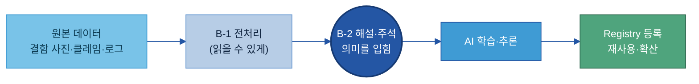
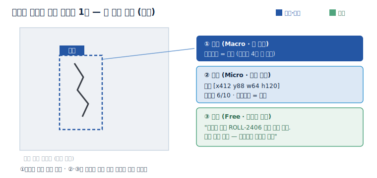
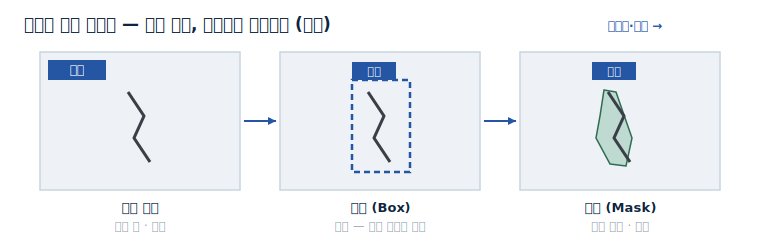
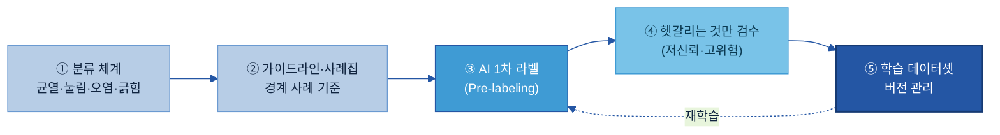
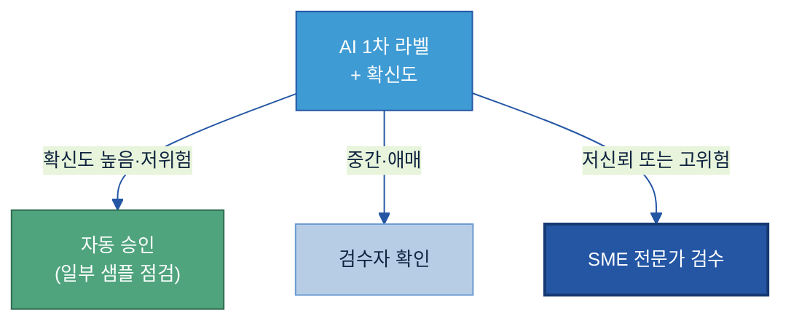
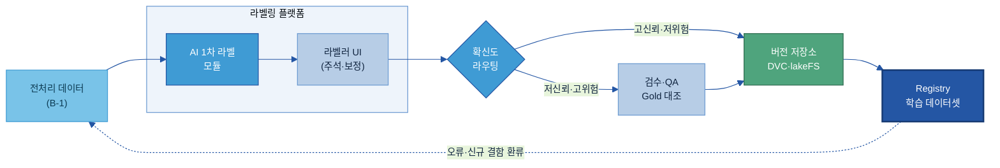
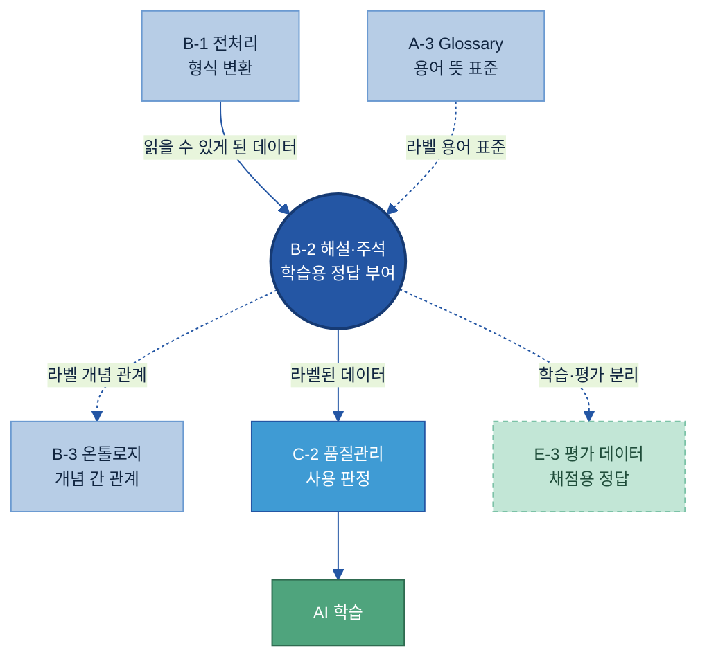

# B-2 데이터 해설·주석(Data Annotation) 매뉴얼

---

## 목차

- [이 가이드가 답하는 5가지 질문](#key-questions)

1. [Why — 왜 필요한가](#why)
    - [1.1 현업 Pain Point](#s11)
    - [1.2 기대 효과](#s12)
    - [1.3 적용 전 / 후](#s13)
2. [What — 무엇을 갖추나](#what)
    - [2.1 데이터 해설·주석이란 + 체계 내 위치](#s21)
    - [2.2 정본 모델 — 세 층의 의미 부여](#s22)
    - [2.3 분류 체계(Taxonomy)와 라벨 정의서](#s23)
    - [2.4 데이터 유형별 주석 방식](#s24)
    - [2.5 주석 데이터 구성 항목](#s25)
    - [2.6 주석 가이드라인·사례집](#s26)
    - [2.7 라벨 이력(버전) 관리](#s27)
3. [How — 어떻게 준비·운영하나 (8단계)](#how)
    - [3.1 8단계 표준 구축 프로세스와 완료 기준](#s31)
    - [3.2 ① 대상 선정 — 어떤 데이터부터 하나](#s32)
    - [3.3 ④ Pilot — 작게 먼저 해보고 기준을 잡는다](#s33)
    - [3.4 ⑤ 작업자 간 일치도(IAA)와 합의](#s34)
    - [3.5 ⑥·⑦ 본 라벨링과 검수 분기](#s35)
    - [3.6 ⑧ 운영 — 변경·버전 관리](#s36)
4. [Tech Stack — 구축 아키텍처와 솔루션 비교](#tech)
    - [4.1 구축 아키텍처](#s41)
    - [4.2 솔루션 비교](#s42)
5. [AI 활용 방법](#ai)
    - [5.1 여러 라벨러 운영과 합의](#s51)
    - [5.2 AI 자동 라벨링과 자동화 루프](#s52)
    - [5.3 라벨러 작업 지시서](#s53)
6. [Where — 다른 주제와의 관계](#where)
    - [6.1 인접 주제와의 역할 분담](#s61)
    - [6.2 전체 조감도](#s62)

- [별첨 (Appendix)](#appendix)
- [참고자료 (References)](#참고자료-references) · [변경 이력 / 피드백 반영](#변경-이력--피드백-반영)

---

> 예시 표기 안내: 본 가이드의 표·예시에 나오는 구체 값(이미지 ID·κ 수치·설비/라인 번호·날짜 등)은 이해를 돕기 위한 가상 예시이며 실제 데이터가 아니다. 실제 값은 PoC·프로젝트에서 확정한다.

> 관련 가이드: [A-3 비즈니스 Glossary](../A-3%20비즈니스%20Glossary/A-3%20비즈니스%20Glossary.md) · [B-1 데이터 전처리](../B-1%20데이터%20전처리/B-1%20데이터%20전처리.md) · [B-3 온톨로지](../B-3%20온톨로지/B-3%20온톨로지.md) · [C-2 데이터 품질 관리](../C-2%20데이터%20품질%20관리/C-2%20데이터%20품질%20관리.md) · E-3 AI 평가 데이터 · E-4 데이터 Feedback Loop

데이터 해설·주석(Data Annotation)은 원본 데이터에 사람이 의미 정보를 부여하여, 사람만 해석하던 결함 사진·클레임·시험 결과를 AI가 보고 배울 수 있는 학습 자산으로 바꾸는 활동이다. 이 가이드는 왜 필요한지(1장)와 무엇을 갖추는지(2장)를 짧게 짚고, 실제로 어떻게 만들고 운영하는지(3장)·어떤 기술로 구축하는지(4장)·사람과 AI를 어떻게 배치하는지(5장)에 무게를 둔다.

<a id="key-questions"></a>

## 이 가이드가 답하는 5가지 질문

| 질문 | 한 줄 답 | 본문 |
|---|---|---|
| 어떤 데이터에 라벨·주석이 필요한가 | 사람의 해석이 있어야 AI가 배울 수 있는 데이터(결함 이미지·클레임 등)부터 한다 | [3.2](#s32) |
| 라벨 체계(분류)는 어떻게 설계하나 | 겹치지 않고 빠짐없고 일관된 분류 체계(Taxonomy)와 라벨 정의서로 못 박는다 | [2.3](#s23) |
| 사람마다 다른 해석을 어떻게 일관되게 다나 | 가이드라인·사례집과 작업자 간 일치도(IAA) 측정으로 기준을 맞춘다 | [2.6](#s26) · [3.4](#s34) |
| AI가 단 주석을 사람은 어디까지 검토하나 | 전수 검수가 아니라 AI 1차 라벨 후 저신뢰·고위험 건만 사람이 검수한다 | [3.5](#s35) · [5.2](#s52) |
| 주석 데이터를 어떻게 버전 관리하나 | 라벨 버전·작업자·사유·학습 사용 시점을 기록해 추적한다 | [2.7](#s27) · [3.6](#s36) |

---

<a id="why"></a>

## 1. Why — 왜 필요한가

AI 과제에서 모델보다 먼저 무너지는 곳이 학습 데이터의 정답이다. 라벨이 없거나 사람마다 기준이 달라 들쭉날쭉하면, 데이터가 아무리 많아도 AI는 일관된 패턴을 배우지 못한다. 따라서 주석은 AI 성능을 좌우하는 가장 앞단의 품질 관문이며, 그 목표는 세 가지다. 데이터 의미·판단 기준의 표준화, 정답이 정확한 신뢰 가능한 학습 환경, 누가·언제·왜 붙였는지 남기는 품질·추적 체계다.

<a id="s11"></a>

### 1.1 현업 Pain Point

많은 제조 기업은 AI 활용에 필요한 데이터를 이미 상당량 보유하고 있다. 그러나 실제 AI 모델 학습이나 자동화 과제를 추진해보면 데이터의 의미와 판단 기준이 정리되어 있지 않아 학습 데이터 구축 단계에서 반복적으로 어려움을 겪는다.

- 정답 데이터의 부재: 이미지는 존재하지만 결함 유형이 표준화되어 있지 않아 AI에게 줄 정답이 없으니 학습 자체를 시작할 수 없다.
- 판단 기준의 불일치: 같은 긁힘을 누구는 긁힘, 누구는 표면 결함, 누구는 외관 불량으로 적어 일관된 학습 데이터를 만들 수 없다.
- 운영 이력 및 품질 관리 부재: 누가·언제·왜 주석했는지 추적이 안 되고, 잘못 달린 라벨이 섞여도 걸러낼 방법이 없어 성능이 떨어져도 원인이 데이터인지 모델인지 가릴 수 없다.
- 재사용 체계의 부재: 프로젝트 종료 이후 데이터가 방치되어 다른 AI 과제에서 재활용되지 못하고, 동일한 정비 작업이 과제마다 반복된다.

<a id="s12"></a>

### 1.2 기대 효과

데이터 해설·주석 체계를 갖추면 네 가지가 달라진다.

| 기대 효과 | 무엇이 달라지나 |
|---|---|
| 데이터 의미의 표준화 | 사람마다 다르던 해석을 공통 기준으로 관리. 검사원의 암묵적 판단이 표준 라벨로 형식지화되어 담당자가 바뀌어도 기준이 유지된다 |
| AI 학습 품질 향상 | 라벨 없는 결함 사진은 학습에 못 쓰지만, 표준 라벨·위치를 붙이는 순간 분류 모델의 학습 데이터로 살아난다 |
| 운영 효율 향상 | AI 1차 라벨·검수 분기로 반복 작업을 줄이고 사람은 검수·예외 처리에 집중 |
| 데이터 자산화 | 한 번 잘 라벨링한 데이터셋이 외관 분류뿐 아니라 원인 추천·재발 분석·이상 탐지에 재사용되어 누적 자산이 된다 |

<a id="s13"></a>

### 1.3 적용 전 / 후

검사원이 사진을 한 장씩 육안으로 분류하던 외관 검사는, 표준 라벨을 달면 AI가 1차 분류하고 사람은 헷갈리는 것만 검수하는 체계로 바뀐다. 핵심은 사람이 전수 검수하지 않는다는 점이다.

| 항목 | 적용 전 | 적용 후 |
|---|---|---|
| 분류 방식 | 검사원이 사진마다 육안 분류 | 표준 4종 라벨로 AI가 1차 분류 |
| 기준 일관성 | 검사원·교대조마다 다름 (κ ≈ 0.5) | 가이드라인 통일, 일치도 측정 (κ ≈ 0.8) |
| 사람 작업량 | 전수 육안 확인 | AI 자동 + 저신뢰·고위험 건만 검수 |
| 신규자 교육 | 감으로 배우는 시간 길다 | 사례집 기반 빠른 학습 |
| 자산화 | 사진이 폴더에 방치 | 버전 관리되는 재사용 학습 데이터셋 |

> 용어 풀이 — κ(카파): 여러 사람이 같은 데이터를 얼마나 같게 분류하는지를 우연 일치를 빼고 잰 값(0~1). 0.8 이상이면 거의 완벽한 일치로 본다.

무엇을 갖춰야 이 모습이 되는지는 [2장](#what)에서, 실제 구축·운영 방법은 [3장](#how)에서 다룬다.

---

<a id="what"></a>

## 2. What — 무엇을 갖추나

데이터 해설·주석 체계는 네 가지를 함께 갖춘다. 라벨·주석·해설 세 층의 의미 부여(정본 모델), 어떤 보기로 나누는지를 정하는 분류 체계와 라벨 정의서, 데이터 유형별 주석 방식, 가이드라인과 버전으로 기준·이력을 관리하는 체계다. 이 문서 전체가 이 모델을 일관되게 재사용하며, 네 가지를 라벨러가 실제 채우는 칸으로 정리한 것이 [§2.5](#s25)다.

<a id="s21"></a>

### 2.1 데이터 해설·주석이란 + 체계 내 위치

데이터 해설·주석은 원본 데이터(Raw Data)에 사람이 의미 정보를 부여하여 AI가 학습·활용할 수 있는 형태로 전환하는 활동이다. AI는 이미지·문장·로그를 그대로 입력받을 수는 있어도 그것이 무슨 결함인지, 어떤 원인을 말하는지 스스로 판단하지 못한다. 주석은 검사원의 머릿속에만 있던 판단 기준을 데이터에 형식지로 옮겨, 사람만 해석하던 결함 사진·클레임·시험 결과를 AI가 읽고 배울 수 있는 학습 자산으로 바꾼다.

여기서 주석이 일반 메타데이터와 다른 점을 구분해야 한다. 결함 사진 한 장에는 이미 파일명·촬영일시·설비·자재 같은 사실이 자동으로 딸려 있지만, 이는 데이터에 대한 사실일 뿐 무슨 결함인가라는 해석은 아니다. 주석이 더하는 것은 그 위에 얹는 의미 정보다.

| 구분 | 내용 | 예 (결함 사진 1장) |
|---|---|---|
| 원본 + 일반 메타데이터 | 데이터 자체 + 자동 기록되는 사실 | 사진 파일, 촬영일시, 설비ID, 자재 LOT |
| 주석이 더하는 의미 정보 | 사람이 부여한 라벨·주석·해설 | 결함유형=균열, 위치=좌상단 박스, 추정원인=소재 |

데이터 해설·주석은 데이터를 이해할 수 있게(Understandable) 만드는 단계에 속한다. 전처리([B-1](../B-1%20데이터%20전처리/B-1%20데이터%20전처리.md))가 데이터를 AI가 읽을 수 있는 형태로 바꾼다면, 주석(B-2)은 그 위에 의미(정답)를 입혀 AI가 배울 수 있는 형태로 완성하고, 결과물은 일회성 산출물이 아니라 Registry로 관리되는 재사용 자산으로 축적된다.



주석은 한 조직이 단독으로 하는 일이 아니라 표준을 정하는 조직, 기준을 아는 현업 SME, 라벨을 다는 작업자, 품질을 보는 검수자가 역할을 나눠 만드는 협업 활동이다. 특히 현업 SME(Subject Matter Expert)는 판단 기준을 정의하는 핵심 역할로, SME 참여 없이는 일관된 품질을 내기 어렵다. 누가 무엇을 맡는지는 [§3.6](#s36)에서 정리한다. 인접 주제와의 경계는 [6장](#where)에서 다룬다.

---

<a id="s22"></a>

### 2.2 정본 모델 — 세 층의 의미 부여

이 가이드가 문서 전체에서 재사용하는 정본(canonical) 모델은 라벨·주석·해설 세 층이다. 같은 데이터 한 건 위에 의미가 차례로 쌓이는 구조로, 라벨이 깔리고 그 위에 주석이 세부를 더하고 해설이 사람의 맥락을 얹는다.

| 층 | 이름 | 역할 | 성격 |
|---|---|---|---|
| ① | 라벨(Label, Macro) | 표준 범주(큰 분류) 부여 | 정답(Ground Truth) 기반·정해진 보기 중 선택 |
| ② | 주석(Annotation, Micro) | 라벨의 세부 정보 부여 | 위치·심각도·원인·조치 등 구조화 |
| ③ | 해설(Commentary, Free Form) | 사람의 판단·경험·배경 자유 서술 | 비정형·맥락 보존 |

결함 이미지 1건에 균열을 박스로 표시하고 그 위에 세 층의 의미를 얹은 모습은 다음과 같다. ①만으로도 분류 학습이 가능하고, ②·③은 필요에 따라 같은 이미지 위에 쌓는다.



같은 1건을 시스템에 입력하는 칸(필드)으로 적으면 ①은 AI가 분류를 배우는 정답, ②는 위치·심각도를 배우는 구조화 정보, ③은 사람 전문가의 맥락 지식이 된다.

```text
════════════════════════════════════════════════════
 이미지   : IMG_2406_0473.jpg
 (자동 메타) 촬영 2026-06-12 14:03 · 설비 LAM-03 · 자재 ROLL-2406-118
──────────────────────────────────────────────────
 ① 라벨(Macro)  결함유형 = 균열                    ← 정해진 4종 중 선택
 ② 주석(Micro)  위치 = [x412 y88 w64 h120]
                 심각도 = 中(0~10 중 6) · 추정원인 = 소재
 ③ 해설(Free)   "동절기 입고 ROLL-2406 계열에서 반복 관찰.
                 보관 습도 의심 — 입고검사 기록 재확인 요망"
════════════════════════════════════════════════════
```

> 용어 풀이 — Ground Truth(정답 기준): AI가 학습·검증의 기준으로 삼는 확실한 참값. 사람이 합의해 확정한 라벨이 Ground Truth가 된다.

라벨의 형태(값)는 AI가 풀 문제에 따라 분류 라벨(양품/불량), 다중클래스(균열/눌림/오염/긁힘), 수치(심각도 0~10·면적 ㎟), 조치(재작업/폐기/특채) 중에서 고른다.

---

<a id="s23"></a>

### 2.3 분류 체계(Taxonomy)와 라벨 정의서

라벨을 붙이려면 먼저 어떤 보기들이 있는지 분류 체계(Taxonomy)를 정하고, 각 라벨이 무엇인지 정의서로 명확히 정해야 한다. 좋은 Taxonomy는 상호배타성(한 데이터가 두 범주에 동시에 안 들어감)·포괄성(모든 경우가 어딘가에 들어감)·일관성(같은 기준으로 나눔) 세 원칙을 지킨다. 분류 체계가 없으면 라벨이 자유 서술로 흩어지므로, 정비는 흩어진 현장 표현을 표준 범주로 묶는 일이다.

| 현장 표현 (정비 전) | 표준 라벨 (정비 후) |
|---|---|
| 긁힘, 표면 긁힘, 흠집 | `긁힘` |
| 찍힘, 눌린 자국, 패임 | `눌림` |
| 갈라짐, 크랙 발생, 금감 | `균열` |
| 이물, 오염됨, 얼룩 | `오염` |

라벨은 이름 뿐만 아니라 각 라벨이 무엇을 포함·제외하는지 라벨 정의서로 명확히 정해야 라벨러가 같게 판단한다.

```text
────────────────────────────────────────────
 라벨 코드  : 결함-균열   (표준명 균열 / Crack)
 정의       : 소재 표면이 선형으로 갈라진 결함 (길이 0.5mm 이상)
 포함       : 미세 선형 균열, 모서리부 갈라짐
 제외       : 표면 눌림(→ 결함-눌림), 이물 부착(→ 결함-오염)
 라벨 형태  : 다중클래스(4종 중 1) + 심각도 수치(0~10)
 대표 이미지: gold/crack_01.jpg ~ crack_12.jpg   ·   책임 SME: 품질 SME
────────────────────────────────────────────
```

분류 체계의 구조는 세 가지이며, **언제 무엇을 쓰는지**가 선택의 핵심이다. 결함이 5종 이하·단층이면 Flat, 상위 분류가 필요하거나 종류가 계속 늘면 Hierarchical, 한 데이터에 결함이 동시에 여러 개 나타나면 Multi-label을 쓴다. 초기에는 관리가 쉬운 Flat으로 시작해 분류가 복잡해지면 Hierarchical로 확장하는 것을 권장한다.

| 구조 | 적용 상황 | 장점 | 단점 |
|---|---|---|---|
| Flat(평면) | 결함 5종 이하·단층 분류 | 단순·빠름 | 범주 늘면 관리 난해 |
| Hierarchical(계층) | 상위 분류 필요·종류 증가 | 정밀·확장 용이 | 설계 비용·경계 정의 필요 |
| Multi-label(다중) | 한 데이터에 결함 동시 다수 | 복합 현상 표현 | 라벨 조합 폭증·평가 복잡 |

```text
[Flat]              [Hierarchical]
결함                 결함
├─ 균열              ├─ 표면결함 ─ 균열·긁힘·오염
├─ 눌림              └─ 형상결함 ─ 눌림·변형
├─ 오염
└─ 긁힘
```

---

<a id="s24"></a>

### 2.4 데이터 유형별 주석 방식

주석 방식은 데이터 유형과 AI 활용 목적에 따라 다르다. 텍스트는 개체 인식·구간 태깅·문서 분류, 이미지는 분류 태그·박스·영역(Mask)·키포인트, 영상은 객체 추적·이벤트 구간, 음성은 소리 이벤트·전사로 단다. 제조에서 가장 많이 쓰는 이미지 주석은 정밀도가 올라갈수록 비용도 오르므로, **언제 어디까지 표시할지** 결정 규칙이 필요하다. 위치만 알면 되는 외관 분류·검출은 박스로 충분하고, 결함 면적·형상을 정밀히 재거나 인접 결함을 픽셀 단위로 구분해야 할 때만 Polygon/Mask로 올린다.



이미지 주석을 정밀도 순으로 정리하면 분류 태그(전체에 라벨) → Bounding Box(직사각형 위치) → Polygon/Instance Mask(객체별 픽셀 영역) → Semantic Mask(전 픽셀 클래스) → Keypoint(자세·정렬점) 순이다.

| 데이터 유형 | 대표 주석 방식 | 제조업 활용 예 |
|---|---|---|
| 텍스트(Text) | 개체 인식·구간 태깅·감성·문서 분류 | 고객 클레임 원인 유형 분류, 부품명 추출 |
| 이미지(Image) | 분류 태그·박스·영역(Mask)·키포인트 | 결함 유형 + 결함 위치 표시 |
| 영상(Video) | 프레임 분류·객체 추적·이벤트 구간 | 조립 작업 영상의 이상 동작 구간 |
| 음성(Audio) | 소리 이벤트·음성 전사·화자 구분 | 설비 이상음 구간 라벨링 |

---

<a id="s25"></a>

### 2.5 주석 데이터 구성 항목

결함 이미지 한 건에 채워야 하는 각 칸이 무엇이고 필수인지, 누가(사람·AI) 채우는지를 사전으로 명확히 정해야 한다. 필수 항목(결함 여부·유형·위치 + 추적용 작업자·버전)만 채우면 분류 학습이 가능하고, 심각도·원인·조치는 [§2.2](#s22)의 ②주석·③해설 층으로 과제에 필요할 때 더한다. 불분명한 경우 임의 추정 대신 판단 불가와 사유를 남기는 것이 핵심 규칙이며 이는 [§2.6](#s26) 가이드라인과 직접 연결된다.

| 항목 | 의미 | 예시값 | 필수/선택 | 작성 주체 |
|---|---|---|---|---|
| 원본 데이터 ID | 원본 식별자 | `IMG_2406_0473` | 필수 | 시스템 자동 |
| 결함 여부 | 결함 유무 | 결함 있음 | 필수 | AI 1차 → 사람 확인 |
| 결함 유형(라벨) | 4종 중 무엇 | `균열` | 필수 | AI 1차 → 사람 확인 |
| 결함 위치(박스) | 어디인가 | `[x412 y88 w64 h120]` | 필수(검출 시) | AI 1차 → 사람 보정 |
| 심각도 | 정도(0~10) | 6 | 선택 | 사람(SME 기준) |
| 추정 원인 | 무엇 때문 | 소재 | 선택 | 사람(현업) |
| 조치 | 후속 행동 | 재작업 | 선택 | 사람(현업) |
| 판단 불가 사유 | 왜 못 정했나 | "이미지 흐림" | 조건부(불가 시 필수) | 사람(라벨러) |
| 작업자 ID·가이드 버전 | 누가·어느 기준으로 | `라벨러2 / v1.2` | 필수 | 시스템 자동 |

---

<a id="s26"></a>

### 2.6 주석 가이드라인·사례집

같은 Taxonomy를 사용하더라도 작업자마다 해석이 다르면 품질이 일정하지 않을 수 있다. 이를 방지하기 위해, 불분명한 요소에 대한 판단 기준을 담은 문서(Guideline)와 사례집(Casebook)이 필요하다. Guideline의 핵심은 불분명한 경계 사례(Boundary Case)를 미리 정해 두는 데 있다. 명확한 사례는 누구나 동일하게 판단할 수 있지만, 실제 품질을 좌우하는 것은 경계 사례이므로, 경계 사례를 우선적으로 작성해야 한다. Guideline에는 정의, 포함 사례, 제외 사례, 경계 사례, 결정 규칙(If-Then)을 담으며, 특히 결정 규칙은 판단의 일관성을 만드는 핵심 요소이다.

```text
[결정 규칙] 균열(결함-균열) vs 눌림(결함-눌림)
  IF  갈라진 선이 보이고 깊이감(음영)이 있다       → 균열
  IF  눌린 자국만 있고 갈라짐이 없다                → 눌림
  IF  둘 다 의심되어 판단 불가                      → '미상'으로 두고 SME 큐로 보냄 (임의 추정 금지)
 [해당 사례]   crack_01.jpg  — 전형적 선형 균열
 [비해당 사례] dimple_07.jpg — 눌림이며 균열 아님(혼동 주의)
```

라벨러의 잘못된 추측을 방지하기 위해서는 불분명한 것들은 미상으로 남겨 SME가 검토할 수 있도록 하는 규칙이 필요하다. 사례집에는 작업자 간 해석 차이가 잦은 사례를 지속적으로 추가해 품질을 개선해야 한다. Guideline과 사례집은 일회성 교육 자료가 아니라 조직의 판단 기준을 축적하는 자산으로, AI 자동화와 계열사 확산에서도 같은 기준으로 쓰인다.

---

<a id="s27"></a>

### 2.7 라벨 이력(버전) 관리

주석 데이터는 새 결함 유형 등장·Taxonomy 변경·Guideline 보완에 따라 지속적으로 수정된다. 같은 데이터라도 어떤 라벨 정의를 적용했는지에 따라 AI 학습 결과가 달라지므로, 라벨 버전·작업자·검수자·변경 사유와 그 데이터셋이 학습에 쓰인 시점까지 기록해 추적성을 확보한다. 이를 통해 모델 성능이 떨어졌을 때 라벨 변경이 문제인지를 되짚을 수 있다. 버전은 Major(Taxonomy·스키마 변경)/Minor(라벨 추가·대량 보정)/Patch(개별 오류 수정)로 나눈다.

```text
────────────────────────────────────────────
 데이터셋   : surface-defect-img      버전: v1.2.0 (2026-05-20)
 변경 구분  : Minor — '긁힘' 정의 명확화로 1,204건 재라벨
 변경 사유  : v1.1에서 긁힘-균열 일치도 미달(κ 0.58) → 가이드 보정 후 재작업
 작업자     : 라벨러 3인 / 검수 책임자
 학습 사용  : 외관분류모델 v3 (2026-05-25 학습에 사용)
────────────────────────────────────────────
```

주석 데이터뿐 아니라 Taxonomy·라벨 정의서·Guideline·사례집·Gold Dataset까지 묶은 통합 버전 관리를 권장한다. 버전 도구는 [§4.1](#s41)에서 다룬다.

---

<a id="how"></a>

## 3. How — 어떻게 준비·운영하나 (8단계)

주석은 대상 선정에서 시작해 분류 체계·가이드라인·시범 라벨링·일치도 보정·본 라벨링·검수·버전 관리로 이어지는 8단계 표준 프로세스로 구축한다. 운영 단계에서는 AI가 1차 라벨을 달고 사람은 선별 검수하는 구조로 운영한다.

<a id="s31"></a>

### 3.1 8단계 표준 구축 프로세스와 완료 기준

분류 체계 설계부터 품질 검증·운영까지 전주기를 8단계로 묶는다. 각 단계는 다음 단계로 넘어가기 전 **완료 기준**을 충족해야 하며, 이 기준을 통과하지 못하면 앞 단계로 되돌린다(특히 ④Pilot↔⑤IAA는 기준이 설 때까지 반복).


| 단계 | 대표 산출물 | 완료 기준 (다음 단계로 넘어가는 조건) |
|---|---|---|
| ① 대상 선정 | 대상 데이터 목록 | AI 활용 과제 정의 + SME가 기준 설명 가능 + 충분 샘플·검증 기준 확보 |
| ② Taxonomy 설계 | 분류 체계·라벨 정의서 | 상호배타·포괄·일관 점검 통과, 포함/제외 정의 작성, SME 승인 |
| ③ Guideline 작성 | Guideline·사례집 | 결정 규칙(If-Then)·경계 사례·해당/비해당 예시 포함, SME 승인 |
| ④ Pilot | Pilot Dataset | 대표 샘플 시범 완료, 불일치 사례 분석·보정안 도출 |
| ⑤ IAA·기준 개선 | IAA 결과·개선 Guideline | κ가 합의 임계(예: 0.80) 도달, 합의 규칙 확정 |
| ⑥ 본 라벨링 | Annotation Dataset | 대상 전량 라벨 부여(AI 1차+사람 검수), 보류·미상 큐 처리 |
| ⑦ QA·품질 개선 | QA 결과·수정 이력 | Hold-out·Gold 대비 오류율 목표 이하, 재작업 반영 완료 |
| ⑧ 운영·버전 관리 | Registry·운영 이력 | 데이터셋 등록 카드 발급, 버전·학습 사용 시점 기록, 책임자 지정 |

① ~ ③ (대상·분류 체계·가이드라인)은 [2장](#what)·[§3.2](#s32)에서 갖춘 것을 실행에 옮기는 단계이므로, 이 장에서는 품질을 가르는 ④ ~ ⑧을 다룬다. 8단계를 외관 결함 이미지 과제에 얹으면 다음 흐름이 된다. 초기에는 사람이 기준을 정의·주석하지만, 데이터가 쌓이면 AI가 1차로 라벨링하고 사람은 저신뢰·고위험 건만 본다.



---

<a id="s32"></a>

### 3.2 ① 대상 선정 — 어떤 데이터부터 하나

데이터에 주석을 다는 것은 사람의 해석이 있어야 AI가 배울 수 있고, 활용 가치가 크며, 재사용 가능성이 높은 데이터부터 한다. 반대로 이미 시스템이 코드값으로 정답을 자동 기록하는 데이터(예: 자동 합/부 판정값)는 주석 대상이 아니다.

| 대상 | 주석 필요 이유 | 붙이는 라벨(예) | 우선순위 |
|---|---|---|---|
| 결함/검사 이미지 | 무슨 결함인지·어디인지 사람이 표시해야 학습 가능 | 결함유형 + 위치 박스 | 높음 |
| 고객 클레임 문장 | 원인·유형이 자연어 속에 묻혀 있음 | 클레임 원인 유형 | 높음 |
| C/S Report 원인 분석 | 원인-조치가 서술형 (C/S = Customer Service) | 원인 유형 + 조치 유형 | 높음 |
| 설비 이상 이력 | 이상 유형·원인 해석이 필요 | 이상 유형 + 원인 유형 | 중간 |
| 작업일지 | 현장 지식이 자유 서술로 묻혀 있음 | 현장 지식 구조화 | 중간 |

우선순위는 AI 활용 가치(사용 빈도)와 주석 비용(난이도)으로 정해, 가치가 높고 비용이 낮은 것부터 착수한다. 외관 검사 이미지의 박스 주석은 가치가 크고 비용이 낮아 1순위, 픽셀 단위 영역 마스크는 고비용·고정밀이라 모델 정밀도 요구가 확정된 뒤 2순위로 둔다. 우선순위를 정했어도 아래 다섯 가지가 준비되지 않으면 대량으로 만들고도 쓰지 못하므로, 데이터가 있다고 일단 시작하는 실수를 막는 최소 점검을 거친다(① 대상 선정 완료 기준).

| 확인 항목 | 확인 질문 |
|---|---|
| AI 활용 목적 | 이 데이터를 활용할 AI 과제가 정의되어 있는가 |
| 현업 기준 | SME가 판단 기준을 설명할 수 있는가 |
| 데이터 확보 | 충분한 샘플이 확보되어 있는가 |
| 품질 기준 | 주석 결과를 검증할 기준이 있는가 |
| 재사용 가능성 | 다른 과제에서도 활용 가능한가 |

---

<a id="s33"></a>

### 3.3 ④ Pilot — 작게 먼저 해보고 기준을 잡는다

본 라벨링에 도입하기 전, 소규모 Pilot으로 가이드라인이 현장에서 작동하는지, 사람마다 같게 라벨하는지를 먼저 확인한다. Pilot의 목적은 데이터 구축이 아니라 기준의 문제점 발견이다. 라벨링한 데이터를 학습용(Train)·검증용(Test)·보류용(Hold-out)으로 나누고(보류용은 끝까지 건드리지 않고 최종 품질 점검에만 사용), 전문가가 합의한 정답(Ground Truth)을 먼저 만든 뒤 라벨러 결과를 비교한다. 정확도(Accuracy)·F1(드문 클래스에 적합)·일치도(Cohen's κ)가 낮으면 가이드라인이 모호하다는 신호이므로 가이드라인을 고쳐 다시 시범한다(④↔⑤ 반복).

완료 기준: 작업자 간 해석 차이·경계 사례·Guideline 누락·라벨 정의 모호가 어디서 큰지 분석되고, 그 보정안이 Guideline에 반영되어야 ⑤로 넘어간다.

---

<a id="s34"></a>

### 3.4 ⑤ 작업자 간 일치도(IAA)와 합의

IAA(Inter-Annotator Agreement)는 여러 작업자가 같은 데이터를 얼마나 같게 라벨하는지를 측정하는 지표로, IAA가 낮으면 가이드라인을 고쳐 기준을 맞춰야 한다([§2.6](#s26)을 측정으로 보완하는 단계). IAA는 단순 일치율이 아니라 우연 일치를 빼고 보며(Cohen's κ[\[12\]](#ref12)·Fleiss' κ[\[13\]](#ref13)·Krippendorff's α[\[14\]](#ref14)), Landis & Koch 기준으로 0.61~0.80을 상당, 0.81 이상을 거의 완벽으로 해석한다.

| 결함 유형 | IAA(κ) | 판정 |
|---|---|---|
| 균열 | 0.83 | 거의 완벽 |
| 눌림 | 0.86 | 거의 완벽 |
| 오염 | 0.88 | 거의 완벽 |
| 긁힘 | 0.61 | 상당(경계 보완 필요) |

IAA가 낮다면 작업자 숙련도 문제가 아닌, 대개 Taxonomy 정의가 불명확하거나 Guideline이 부족한 경우다. 실제 보정 사이클을 보면, 라벨러 3인이 긁힘·균열을 시범한 결과 κ가 0.58(보통)이었고 얕은 긁힘에서 판단이 갈렸다. 깊이감이 있으면 균열, 없으면 긁힘이라는 결정 규칙을 추가하자 재시범 κ가 0.79로 올라 본 라벨링에 착수했다.

여러 라벨러의 결과를 최종 라벨로 합치는 합의 규칙(다수결·가중 투표·순차 검토·다중 QC)은 [§5.1](#s51)에서 다룬다. 완료 기준: κ가 합의 임계(예: 0.80)에 도달하고 합의 규칙이 확정되어야 ⑥으로 넘어간다.

> 정답 기준셋(Gold Standard) — 품질의 자(尺). 전문가가 합의해 확정한 소량의 모범 정답으로, 대표 샘플 선정 → 복수 전문가 독립 라벨 → 불일치 조정·합의 → 확정·버전 고정 순으로 만든다. 작업자 교육·품질 검증·AI 자동 라벨 검증의 기준으로 재사용한다.

---

<a id="s35"></a>

### 3.5 ⑥·⑦ 본 라벨링과 검수 분기

Pilot 및 IAA가 통과되면 본 라벨링을 수행한다. 본 라벨링에서는 사람이 전수 검수하는 것이 아닌, AI가 1차로 붙인 라벨(Pre-labeling)에 대해 신뢰도가 낮거나 리스크가 큰 건만 검수하는 사람 검수 개입(HITL) 구조로 운영한다(AI 보조 라벨링 방식은 [§5.2](#s52)).

모든 데이터를 같은 수준으로 검수하는 것은 비효율이므로, AI 1차 라벨의 확신도(confidence)에 따라 검수 경로를 자동으로 나눈다. **언제 AI가 자동 승인하고 언제 사람이 검수하나**가 검수 분기의 결정 규칙이다.



확신도 임계는 업무 위험도에 맞춰 결함 종류별로 따로 잡는다. 균열처럼 안전·품질 리스크가 큰 결함은 확신도가 0.90을 넘어도 SME가 보고, 단순 오염은 0.90 이상이면 자동 승인한다. 데이터 규모가 커질수록 전수 검수보다 위험도 높은 데이터에 집중하는 편이 효과적이다.

| AI 1차 라벨 확신도 | 검수 경로 (저위험 결함 기준) | 예 |
|---|---|---|
| 0.90 이상 | 자동 승인(일부 샘플 점검) | 오염 0.94 → 자동 승인 |
| 0.70 ~ 0.90 | 검수자 확인 | 균열 0.76 → 검수자 확인 |
| 0.70 미만 | SME 전문가 검수 | 오염 0.52 → SME 검수 |
| 판단 불가(파싱 실패) | 별도 큐로 보류 | 박스 미생성 → 보류 큐 |

완료 기준: 대상 전량에 라벨이 부여되고 보류·미상 큐가 처리되며(⑥), Hold-out·Gold 대비 오류율이 목표 이하로 떨어지고 재작업이 반영되어야(⑦) ⑧로 넘어간다.

---

<a id="s36"></a>

### 3.6 ⑧ 운영 — 변경·버전 관리

운영 단계에서는 기준이 바뀌면 라벨을 갱신하고, 버전을 기록하며, 역할을 나눠 돌린다. **언제 새 Label을 추가하고 언제 기존 Label을 수정하나**가 변경의 결정 규칙이다. 기존 분류에 들어가지 않는 결함이 반복 출현하면 새 Label을 추가하고, 정의가 모호해 IAA가 미달하거나 경계 혼동이 잦으면 기존 Label 정의를 수정한다. 어느 쪽이든 버전을 올리고([§2.7](#s27)) 영향 받는 라벨을 재작업한다.

| 변경 유형 | 조건 | 예시 |
|---|---|---|
| 신규 라벨 추가 | 기존 분류 밖 결함이 반복 출현 | 신규 결함 유형 추가 |
| 라벨 정의 변경 | 정의 모호로 IAA 미달·경계 혼동 | 균열/긁힘 기준 보완 |
| Guideline 보완 | 경계 사례가 새로 발견 | 경계 사례·결정 규칙 추가 |
| 데이터 수정 | 오주석 발견 | 오주석 정정·재라벨 |

변경된 데이터셋은 등록 카드로 한 줄에 식별되게 남긴다. 어떤 Taxonomy·Guideline 버전으로 어느 모델 학습에 쓰였는지 함께 기록해야 나중에 되짚을 수 있다(⑧ 완료 기준 = 등록 카드 발급·책임자 지정).

| 항목 | 예시값 |
|---|---|
| 데이터셋 ID·버전 | `DS-DEFECT-IMG-202606` / v1.2 |
| Taxonomy·Guideline 버전 | Taxonomy v1.1 / Guideline v1.2 |
| 검수 상태 | QA 승인 |
| 사용 목적·모델 | 외관 불량 분류 학습 / `DefectClassifier-v0.3` |
| 주요 변경 내용 | 균열/긁힘 기준 보완 |

역할은 전사 데이터 조직(표준·도구 정의), 현업 SME(기준 정의·최종 판정), 라벨러(주석 수행), 검수자·QA(품질·일치도 검증), 데이터 조직(Taxonomy·버전 관리), AI 조직(AI 1차 라벨·자동화 운영)으로 나눈다. 주석 체계는 프로젝트 종료와 함께 폐기되지 않고 지속 관리·개선되는 데이터 자산으로 운영한다.

---

<a id="tech"></a>

## 4. Tech Stack — 구축 아키텍처와 솔루션 비교

<a id="s41"></a>

### 4.1 구축 아키텍처

주석 체계는 단일 제품이 아니라 라벨링 플랫폼을 중심으로 AI 1차 라벨 모듈, 확신도 기반 검수 큐, Gold·QA 검증, 데이터셋 버전 저장소가 맞물린 파이프라인으로 구축한다. 전처리(B-1)에서 넘어온 데이터가 이 파이프라인을 거쳐 버전이 찍힌 학습 데이터셋으로 Registry에 등록되고, 운영 중 발견된 오류·신규 결함은 다시 입력으로 돌아온다.



도입 시 고려할 축은 데이터 유형(이미지·텍스트·영상·음성), 자동화 수준(사람 수작업 vs AI 1차 라벨), 배포 형태(사외 반출 가능 여부·온프렘 필요 여부)다. 초기에는 데이터 유형에 맞는 라벨링 플랫폼 하나로 가이드라인·Gold·IAA 기반을 세우고, 데이터가 쌓이면 AI 1차 라벨·라벨 오류 자동 탐지·약지도를 붙여 자동화를 넓힌다.

<a id="s42"></a>

### 4.2 솔루션 비교

라벨링 도구는 다중 유형 플랫폼, 비전 특화, 데이터 엔진(인력+AI), AI 보조 도구로 나뉘며, 흔히 한 플랫폼에 AI 1차 라벨·오류 탐지를 붙여 함께 쓴다. 라벨 데이터셋의 버전은 별도 도구(DVC[\[15\]](#ref15)·lakeFS[\[16\]](#ref16))로 [§2.7](#s27)의 이력을 코드처럼 관리한다. 솔루션·에디션·가격은 변동되므로 도입 시 공식 문서·PoC로 확인하고, 주제 전반을 묶은 비교·선정은 2층 정본 [Tech Stack 비교 (솔루션×주제)](../../Tech%20Player/01%20Tech%20Stack%20비교%20(솔루션×주제).md)가 전담한다.

| 도구 | 성격 | 강점 | 구분 |
|---|---|---|---|
| Label Studio[\[3\]](#ref3) | 다중 유형 라벨링 | 텍스트·이미지·음성·시계열 폭넓음 | 오픈소스(+기업판) |
| CVAT[\[9\]](#ref9) | 비전(이미지·영상) | AI 보조 라벨링·QA | 오픈소스(+클라우드) |
| Labelbox[\[1\]](#ref1) | 멀티모달 플랫폼 | 대규모 협업·모델 평가 | 상용 |
| Scale AI[\[2\]](#ref2) | 데이터 엔진 | 대규모 인력+AI 큐레이션 | 상용 |
| Roboflow[\[4\]](#ref4) | 컴퓨터 비전 올인원 | 포맷 변환·증강 | 상용(코어) |
| SageMaker Ground Truth[\[6\]](#ref6) | AWS 매니지드 | 인력+ML 라벨링·3D | 상용(AWS) |
| Prodigy[\[7\]](#ref7) | 스크립트형 NLP | spaCy 통합·로컬 실행 | 상용 |
| Cleanlab[\[8\]](#ref8) | 라벨 오류 탐지 | 잘못된 라벨 자동 검출 | OSS+Studio |
| Snorkel Flow[\[5\]](#ref5) | 약지도/프로그래매틱 | 라벨링 함수로 대량 생성 | 상용 |
| SAM 2[\[10\]](#ref10) | 자동 분할 모델 | 이미지·영상 프리라벨링 | 오픈소스 |

---

<a id="ai"></a>

## 5. AI 활용 방법

3장이 주석을 만드는 8단계 프로세스라면, 이 장은 그 프로세스를 사람과 AI로 어떻게 굴려 규모를 키우는가를 다룬다. 여러 라벨러를 어떻게 합치는지(5.1), AI를 어떻게 보조로 쓰고 자동화 루프를 돌리는지(5.2), 라벨러에게 무엇을 내려보내는지(5.3)다.

<a id="s51"></a>

### 5.1 여러 라벨러 운영과 합의

품질을 가르는 데이터는 한 명이 아니라 여러 라벨러가 독립적으로 단 뒤 합쳐야 신뢰할 수 있다. 같은 데이터를 여러 명에게 랜덤 배정하고, 데이터 위험도에 맞는 합의 규칙으로 최종 라벨을 정한 뒤 일관성을 모니터링한다([§3.4](#s34) IAA가 이 합의의 품질을 측정한다).

| 합의 규칙 | 방식 | 적합한 상황 |
|---|---|---|
| 다수결(Majority) | 가장 많이 나온 라벨 채택 | 일반·저위험 |
| 가중 투표(Weighted) | 숙련도 높은 라벨러에 가중치 | 숙련 편차 큼 |
| 순차 검토(Review chain) | 1차 라벨 → 상위 검토자 확정 | 난이도 높음 |
| 다중 QC | 복수 검수자 교차 점검 | 고위험·고정밀 |

불일치가 반복되는 항목은 합의 규칙으로 덮지 말고 가이드라인 결함 신호로 보고 정의를 고친다.

<a id="s52"></a>

### 5.2 AI 자동 라벨링과 자동화 루프

데이터가 일정 규모를 넘으면 사람이 0에서 다 달지 않는다. AI가 1차 라벨을 만들고 사람은 고치는 일만 하도록 세 방식을 쓴다.

- AI 1차 라벨(Pre-labeling): 사전학습 모델이나 SAM 2[\[10\]](#ref10)(이미지 자동 분할)로 초안 라벨을 자동 생성한다.
- 능동학습(Active Learning): AI가 헷갈리는 데이터를 골라 사람에게 우선 보내, 적은 검수로 모델이 가장 빨리 좋아진다.
- 약지도(Weak Supervision): 규칙·휴리스틱(라벨링 함수)으로 대량의 거친 라벨을 자동 생성하고(Snorkel[\[5\]](#ref5)), 라벨 오류 자동 탐지(Cleanlab[\[8\]](#ref8))로 보정한다.

이 셋을 하나의 자동화 루프로 묶으면 사람 검수가 점점 줄어든다. AWS SageMaker Ground Truth[\[6\]](#ref6)의 자동 라벨링이 대표 사례로, 다음과 같이 돈다.

```text
① 데이터 입력 → ② 일부 사람 라벨(시드) → ③ 모델 학습 →
④ 모델 자동 라벨(+확신도) → ⑤ 확신도 낮은 건만 사람에게 →
⑥ 사람 라벨 추가 → ⑦ 모델 재학습 → ⑧ 정확도 목표 도달까지 반복
```

이 루프의 체크포인트는 확신도 임계 설정·사람 검수 비율·라벨 드리프트 점검이고, 목표 지표는 분류 정확도(세그멘테이션은 mIoU, 평균 영역 일치도)다. 목적은 사람을 없애는 것이 아니라 반복 작업을 줄여 사람이 최종 판단과 예외 검토에 집중하게 하는 것이다.

<a id="s53"></a>

### 5.3 라벨러 작업 지시서

8단계와 위 운영 방식을 현업이 실제로 굴릴 때 라벨러에게 내려보내는 단 하나의 산출물이 작업 지시서다. 아래 골격을 복사해 〈 〉 안의 프로젝트 값만 바꿔 쓰며, ★ 표시는 [§2.5](#s25)의 필수 입력 항목과 직접 연결된다.

```text
[Annotation 작업 지시서]                          ← 빈 양식은 〈  〉만 바꿔 쓴다

1. 작업명        〈외관 결함 이미지 Annotation〉
2. 작업 목적     〈외관 불량 자동 분류 AI 모델 학습용 데이터셋 구축〉
3. 작업 대상     〈2026.1~3 Line 1 외관 검사 이미지 50,000건〉
4. 제외 대상     〈흐린·중복·제품 미노출·손상 이미지〉
5. 사용 Taxonomy 〈균열 / 눌림 / 오염 / 긁힘 / 판단 불가〉   (§2.3 라벨 정의서 기준)
6. ★필수 입력    〈결함 여부 · 유형 · 위치(Box) · (불가 시)판단 불가 사유〉
   선택 입력     〈심각도 · 추정 원인 · 조치〉                  (§2.5 항목 사전)
7. 적용 Guideline 〈Annotation Guideline v1.2〉
8. 작업 규칙     - Bounding Box는 결함 전체를 포함한다
                 - 복수 결함은 각각 별도 Box로 표시한다
                 - 애매하면 '판단 불가' + Comment (임의 추정 금지)
                 - 임의로 Label을 추가하지 않는다
9. 문의(에스컬레이션) 〈균열/긁힘 구분 곤란 · 신규 결함 의심 · 이미지 품질 불량〉 → SME 큐
10. 제출 형식    Dataset ID · Image ID · Label Code · Box 좌표 ·
                 Severity · Action · Comment · Annotator ID · Guideline Version
```

이 한 장이 [§2.6](#s26) 가이드라인·[§2.7](#s27) 버전·[§3.5](#s35) 검수 분기를 라벨러 한 사람의 실행 지시로 묶어 준다. Taxonomy·Guideline이 바뀌면 함께 갱신하고, 프로젝트가 바뀌면 〈 〉 안만 갈아 끼운다. 이미지가 아닌 클레임처럼 자연어 원문을 구조화할 때도 같은 3계층으로 채운다.

```text
[고객 클레임 주석]
문서 ID : VOC_001   원문: "납기가 늦어 고객사 라인이 멈췄습니다"
라벨    : 납기 지연                          ← ①라벨(Macro)
원인    : 생산 일정 지연 · 조치: 긴급 생산 투입  ← ②주석(Micro)
해설    : 특정 고객사 긴급 요청으로 일정 조정 필요  ← ③해설(Free)
```

---

<a id="where"></a>

## 6. Where — 다른 주제와의 관계

주석은 학습용 정답 붙이기까지만 책임진다. 데이터의 의미를 정의하거나, 데이터 간 관계를 설명하거나, AI 성능을 평가하는 역할까지는 하지 않는다. 형식 변환은 B-1, 용어 뜻은 A-3, 개념 관계는 B-3, 사용 판정은 C-2, 채점용 정답은 E-3가 분담한다.

<a id="s61"></a>

### 6.1 인접 주제와의 역할 분담

| 인접 주제 | B-2가 하는 것 | 인접 주제가 하는 것 | 연계 포인트 |
|---|---|---|---|
| [B-1 데이터 전처리](../B-1%20데이터%20전처리/B-1%20데이터%20전처리.md) | 의미(정답) 부여 | 형식 변환(PDF→텍스트·표 추출) | 전처리된 데이터에 주석 |
| [A-3 비즈니스 Glossary](../A-3%20비즈니스%20Glossary/A-3%20비즈니스%20Glossary.md) | 라벨 부여 | 라벨에 쓰는 용어의 표준 뜻 정의 | 표준 용어를 라벨명에 사용 |
| [B-3 온톨로지](../B-3%20온톨로지/B-3%20온톨로지.md) | 라벨(개별 분류) | 라벨 개념 사이의 관계(결함↔원인↔조치) | 라벨을 온톨로지 개념에 연결 |
| [C-2 데이터 품질 관리](../C-2%20데이터%20품질%20관리/C-2%20데이터%20품질%20관리.md) | 라벨 생성 | 라벨된 데이터를 AI에 써도 되는지 판정 | 라벨 품질을 Quality Gate에 |
| E-3 AI 평가 데이터 | 가르치는 정답(학습용) | 채점하는 정답(평가용) | 학습/평가 데이터 분리 |
| E-4 데이터 Feedback Loop | 라벨 보강 | 운영 오류를 개선 과제로 환류 | "라벨 부족" 피드백 → B-2 |

같은 결함 사진 1장을 두면, B-2는 균열이라는 학습용 라벨과 위치를 붙이고, 균열↔소재불량↔재작업 관계 지도는 [B-3](../B-3%20온톨로지/B-3%20온톨로지.md)가, 균열=금감=NG가 같은 말인지 표준화는 [A-3](../A-3%20비즈니스%20Glossary/A-3%20비즈니스%20Glossary.md)가, 이 라벨을 학습에 써도 되는지 판정은 [C-2](../C-2%20데이터%20품질%20관리/C-2%20데이터%20품질%20관리.md)가 맡는다. 가장 헷갈리는 경계는 B-2와 E-3로, 둘 다 정답이지만 B-2는 가르치는 학습용 라벨(다량)이고 E-3는 채점하는 시험지 정답(소량·고품질, 학습 중 비공개)이므로 반드시 분리한다.

<a id="s62"></a>

### 6.2 전체 조감도 — 경계 정리

B-2를 가운데 두고 인접 주제가 무엇을 주고받는지 한 장으로 정리하면 다음과 같다. 점선으로 이은 B-2와 E-3는 둘 다 정답이지만 학습용·평가용으로 반드시 나눠 둔다.



---

<a id="appendix"></a>

## 별첨 (Appendix)

### 주요 용어

| 용어 | 뜻 |
|---|---|
| 데이터 해설·주석(Data Annotation) | 원본 데이터에 사람의 판단 기준·의미 정보를 부여해 AI 학습 가능한 형태로 전환하는 활동 |
| 라벨(Label) | 데이터를 대표하는 분류값 (예: 균열·긁힘·오염) |
| 주석(Annotation) | 라벨 외 위치·원인·조치 등 세부 정보 기록 |
| 해설(Commentary) | 구조화로 표현하기 어려운 판단 근거·맥락을 자유 서술로 기록 |
| Taxonomy | 데이터를 어떤 기준으로 분류할지 정의한 체계 |
| Guideline | 작업자가 같은 기준으로 분류하도록 정의한 규칙 문서 |
| Casebook | 대표·제외·경계 사례를 정리한 자료 |
| SME | 현업 전문가. Taxonomy 정의·경계 사례 판단·최종 승인 |
| IAA | 여러 작업자가 같은 데이터를 얼마나 같게 라벨하는지 측정하는 지표(Cohen's κ 등) |
| Gold Dataset | 전문가 검증이 완료된 고품질 기준 데이터셋 |
| Human-in-the-Loop(HITL) | AI 결과를 사람이 검토·수정하는 운영 방식 |
| Pre-labeling | AI가 먼저 라벨을 생성하고 사람이 검토하는 방식 |
| Active Learning | AI가 가장 판단하기 어려운 데이터를 우선 선별해 사람 검토를 요청하는 방식 |
| Weak Supervision | 규칙·휴리스틱으로 대량의 거친 라벨을 자동 생성하는 방식 |

---

## 참고자료 (References)

라벨링 도구·플랫폼

- <a id="ref1"></a>**[1]** Labelbox — <https://labelbox.com/>
- <a id="ref2"></a>**[2]** Scale AI — Data Engine — <https://scale.com/data-engine>
- <a id="ref3"></a>**[3]** Label Studio (HumanSignal) — <https://labelstud.io/>
- <a id="ref4"></a>**[4]** Roboflow — <https://roboflow.com/>
- <a id="ref5"></a>**[5]** Snorkel Flow / Weak Supervision — <https://snorkel.ai/>
- <a id="ref6"></a>**[6]** Amazon SageMaker Ground Truth — <https://aws.amazon.com/sagemaker/ai/groundtruth/>
- <a id="ref7"></a>**[7]** Prodigy (Explosion) — <https://prodi.gy/>
- <a id="ref8"></a>**[8]** Cleanlab — <https://cleanlab.ai/>
- <a id="ref9"></a>**[9]** CVAT — <https://www.cvat.ai/>
- <a id="ref10"></a>**[10]** SAM 2 / Segment Anything (Meta) — <https://ai.meta.com/research/sam2/>
- <a id="ref15"></a>**[15]** DVC — <https://dvc.org/>
- <a id="ref16"></a>**[16]** lakeFS — <https://lakefs.io/>

작업자 간 일치도(IAA) 통계

- <a id="ref12"></a>**[12]** Cohen's kappa (Landis & Koch 1977 해석 기준 포함) — <https://en.wikipedia.org/wiki/Cohen's_kappa>
- <a id="ref13"></a>**[13]** Fleiss' kappa — <https://en.wikipedia.org/wiki/Fleiss'_kappa>
- <a id="ref14"></a>**[14]** Krippendorff's alpha — <https://en.wikipedia.org/wiki/Krippendorff's_alpha>

어노테이션 유형 참고

- <a id="ref11"></a>**[11]** Sama — Image Annotation Guide — <https://www.sama.com/blog/image-annotation-guide> · Humans in the Loop — <https://humansintheloop.org/types-of-image-annotation/> · Roboflow Annotation Formats — <https://roboflow.com/formats>

---

## 변경 이력 / 피드백 반영

| 일자 | 버전 | 피드백 (누가/무엇) | 반영 내용 | 반영 위치 |
|------|------|--------------------|-----------|-----------|
| 2026-06-25 | 1.2 | 작업노트_0624 | Pain Point 일반화, '주석 데이터 구성 항목' 개명, 8단계 명칭 정합 | §2.1·§3.4·§6.1 |
| 2026-06-26 | 1.4 | 형식 표준(B-1·B-3) 정렬 | 개요 해체·영문 축 라벨·KPI/로드맵 제거·Tech Stack 신설·KQ 상단·참고자료 각주식 | 전체 |
| 2026-06-26 | 2.0 | B-2 작업_0626.md 전면 재작성 | 6장 구성(Why/What/How 8단계/Tech Stack 아키텍처+솔루션/AI 활용/Where)·사분면 등 의미없는 그래프 삭제·단계별 완료 기준 명시·Decision Rule 중심(Flat/Hier·Box/Polygon·사람/AI 검수·Label 추가/수정)·사례 본문 흡수(Backup 폐지, 별첨=용어만)·SVG 그림 2개 유지·"좋은/나쁜 예"·RACI·표 패딩 제거 | 전체 |
| 2026-06-29 | 2.1 | 0629 작업지시.md 문구 수정 | 문체 다듬기(현재→수정안 16건): "못 박아야"→"명확히 정해야", "돌린다"→"운영한다", §2.2 표머리 무엇→역할·§2.3 언제 쓰나/단점·고려→적용 상황/단점·§3.2 왜 주석이 필요한가→주석 필요 이유, §2.5·§2.6·§2.7·§3.3·§3.4·§3.5 서술 정돈 | §2.2·§2.3·§2.5·§2.6·§2.7·§3.2~3.5 |
