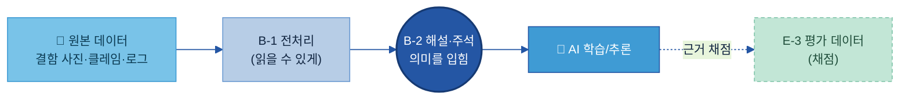
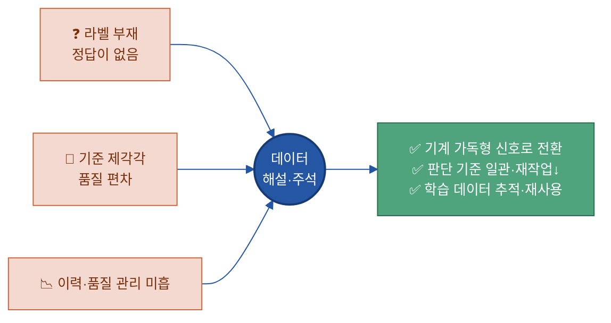
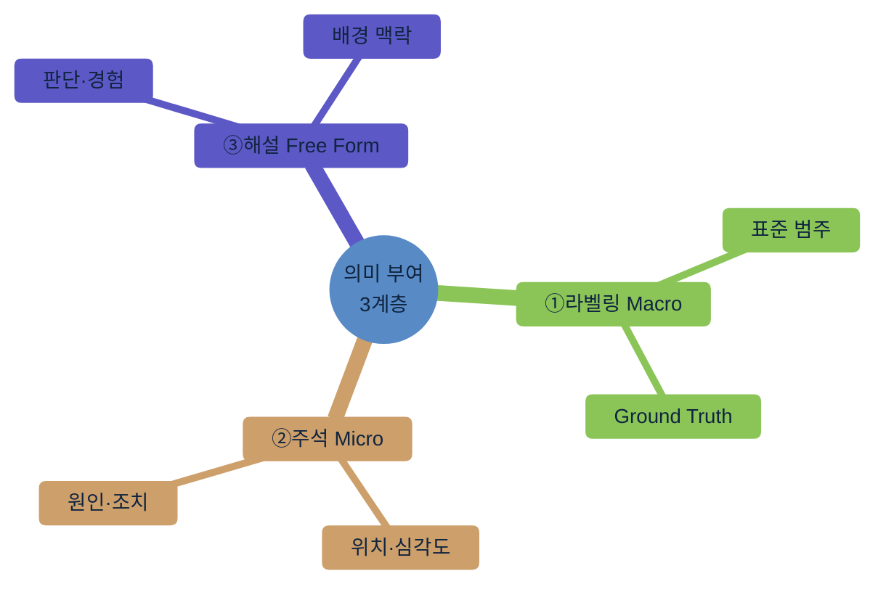
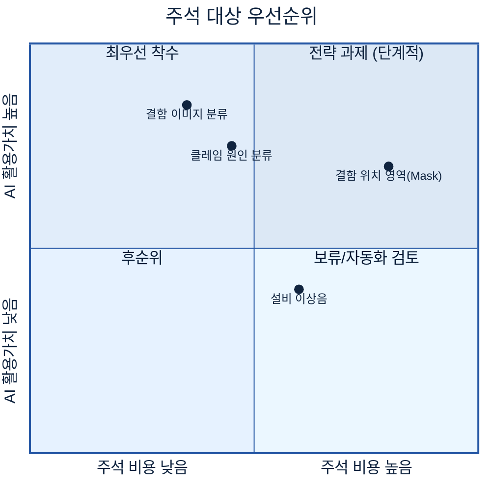
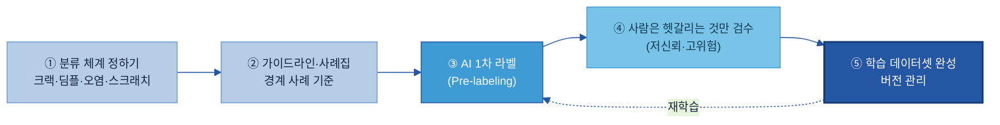
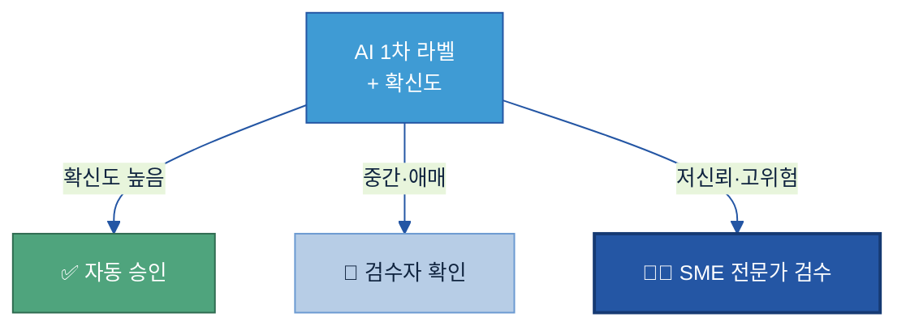
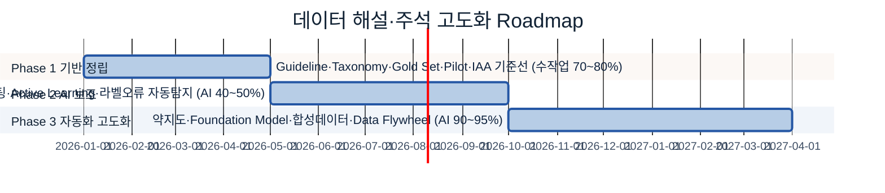

# B-2. 데이터 해설·주석 매뉴얼

> 한 줄 정의: 데이터 해설·주석(Data Annotation/Labeling)은 **AI가 학습할 수 있도록 데이터에 "이건 무엇이다"라는 의미 정보(라벨·주석·해설)를 사람이 붙여 주는 작업**이다 — 예: 결함 이미지에 "크랙"이라는 결함 유형과 그 위치를 표시해 주는 것.

## 목차

1. [개요](#1-개요)
2. [왜 필요한가 (Why)](#2-왜-필요한가-why)
3. [무엇을 갖추나 (What)](#3-무엇을-갖추나-what)
4. [어디부터 하나 — 주석 대상 선정 (When/Where)](#4-어디부터-하나--주석-대상-선정-whenwhere)
5. [예시 시나리오: 두산전자 결함 이미지 주석](#5-예시-시나리오-두산전자-결함-이미지-주석)
6. [어떻게 준비·운영하나 (How)](#6-어떻게-준비운영하나-how)
7. [다른 주제와의 관계](#7-다른-주제와의-관계)
8. [성과 지표·고도화](#8-성과-지표고도화)
- [별첨(Appendix)](#별첨-appendix) · [참고자료(References)](#참고자료-references)

> 관련 가이드: [A-3 비즈니스 Glossary](../A-3%20비즈니스%20Glossary/A-3%20비즈니스%20Glossary.md) · [B-1 데이터 전처리](../B-1%20데이터%20전처리/B-1%20데이터%20전처리.md) · [B-3 온톨로지](../B-3%20온톨로지/B-3%20온톨로지.md) · [C-2 데이터 품질 관리](../C-2%20데이터%20품질%20관리/C-2%20데이터%20품질%20관리.md) · [E-3 AI 평가 데이터](../E-3%20AI%20평가%20데이터/E-3%20AI%20평가%20데이터.md) · [E-4 데이터 Feedback Loop](../E-4%20데이터%20Feedback%20Loop/E-4%20데이터%20Feedback%20Loop.md)

<!-- Key Question 커버리지 맵 (작성용)
| KQ# | Key Question | 답하는 섹션 |
|-----|--------------|-------------|
| 1 | 어떤 데이터에 라벨/주석이 필요한가 | 4.1 / 4.2 |
| 2 | 라벨 체계(Taxonomy)는 어떻게 설계 | 3.2 / 6.1 |
| 3 | 사람마다 다른 해석을 일관되게 (Guideline) | 3.4 / 6.3 |
| 4 | AI 생성 주석을 사람은 어디까지 검토 (HITL) | 6.2 / 6.4 |
| 5 | 주석 데이터 버전 관리 | 3.5 / 6.5 |
-->

---

## 1. 개요

**👉 한 줄 요약:** 데이터 해설·주석은 AI에게 "정답"을 가르치기 위해, 원본 데이터(이미지·문장·로그)에 사람이 의미 라벨을 붙여 **AI가 읽을 수 있는 학습 데이터**로 바꾸는 작업이다.

### 1.1 데이터 해설·주석이란

데이터 해설·주석(Data Annotation/Labeling)은 원본 데이터에 **사람이 부여한 의미 정보**를 붙이는 작업이다. AI는 라벨이 붙지 않은 날것의 데이터(Raw Data)만으로는 "이 이미지가 정상인지 불량인지", "이 클레임이 어떤 원인인지"를 스스로 알 수 없다. 사람이 "이건 크랙(crack) 결함이다", "이 문장은 소재 불량을 호소한다"라고 표시해 주어야, AI가 그 패턴을 학습한다.

**사진 분류 비유로 이해하기.** 스마트폰 갤러리가 "강아지 사진"을 자동으로 모아 주려면, 처음에는 누군가 수많은 사진에 "이건 강아지", "이건 고양이"라고 표시해 둔 학습 데이터가 있어야 한다. 데이터 주석은 바로 이 "사람이 붙이는 정답 표시"를 제조 현장 데이터에 하는 일이다.

> **용어 풀이**
> - **원본 데이터(Raw Data):** 가공·해석 전의 날것 데이터. 결함 사진 파일, 고객 클레임 원문, 설비 알람 로그 등.
> - **라벨(Label):** 데이터에 붙이는 의미 표시. 가장 단순하게는 "양품/불량" 같은 한 단어 분류.
> - **학습 데이터(Training Data):** AI 모델을 훈련시키기 위해 정답(라벨)이 붙은 데이터셋.

### 1.2 적용 범위 — 무엇을 다루고, 무엇을 다루지 않는가

주석의 경계를 분명히 해야 인접 주제와 작업이 겹치지 않는다.

| 다루는 것 (IN) | 다루지 않는 것 (OUT) → 담당 주제 |
|---|---|
| **학습용** 라벨·주석·해설 부여 | 형식 변환(PDF→텍스트, 표 추출) → [B-1 데이터 전처리](../B-1%20데이터%20전처리/B-1%20데이터%20전처리.md) |
| 분류 체계(Taxonomy) 설계 | 단어의 표준 뜻 정의 → [A-3 비즈니스 Glossary](../A-3%20비즈니스%20Glossary/A-3%20비즈니스%20Glossary.md) |
| 주석 일관성·품질 확보 | 개념 간 관계(결함↔원인↔조치) → [B-3 온톨로지](../B-3%20온톨로지/B-3%20온톨로지.md) |
| 라벨 버전·이력 관리 | **성능 채점용 정답셋** → [E-3 AI 평가 데이터](../E-3%20AI%20평가%20데이터/E-3%20AI%20평가%20데이터.md) |

> **★ 가장 헷갈리는 경계 — 주석(B-2) vs 평가 정답(E-3).** 둘 다 "정답을 붙인다"는 점이 같지만 목적이 다르다. **B-2는 AI를 가르치기 위한 학습용 라벨**(많은 양, AI가 보고 배운다)이고, **E-3는 AI가 잘하는지 채점하기 위한 시험지 정답**(소량·고품질, AI가 학습 중에는 보면 안 된다)이다. 학습 데이터와 평가 데이터는 반드시 분리한다.

### 1.3 주요 대상 조직

주석은 한 팀이 다 하는 일이 아니라 역할을 나눠 만든다.

| 조직/역할 | 역할 |
|---|---|
| **지주/전사 데이터 조직** | 주석 표준·Taxonomy 가이드·도구 표준 정의, 계열사 간 일관성 |
| **데이터 오너 / 현업 SME** | 분류 체계·주석 기준 정의, 애매한 케이스 최종 판정 (SME = Subject Matter Expert, 현업 전문가) |
| **라벨러(Labeler)** | 가이드라인에 따라 실제 라벨·주석 부여 |
| **검수자(Reviewer)·QA** | 라벨 품질 점검, 작업자 간 일치도 모니터링 |
| **AI/데이터 엔지니어** | AI 1차 라벨(Pre-labeling)·자동화 파이프라인·데이터셋 버전 관리 |

### 1.4 AI-ready 데이터 체계 내 위치

**👉 한 줄 요약:** 주석은 "③ 이해할 수 있게(Understandable)" 그룹에서, 전처리로 읽을 수 있게 된 데이터에 **의미(정답)를 입혀 AI 학습 재료로 완성**하는 단계다.



전처리([B-1](../B-1%20데이터%20전처리/B-1%20데이터%20전처리.md))가 데이터를 AI가 **읽을 수 있는 형태**로 바꾼다면, 주석(B-2)은 그 데이터에 **의미(정답)를 입혀** AI가 **배울 수 있는 형태**로 완성한다. (20개 주제 전체 조감도는 [전체 목차](../../전체%20목차/00%20전체%20목차%20(20개%20주제).md) 참조.)

---

## 2. 왜 필요한가 (Why)

**👉 한 줄 요약:** 라벨이 없거나 사람마다 기준이 달라 들쭉날쭉하면, 아무리 데이터가 많아도 AI는 "쓰레기를 넣으면 쓰레기가 나온다(Garbage In, Garbage Out)" — 주석은 AI 성능을 좌우하는 가장 앞단의 품질 관문이다.

데이터 해설·주석 체계가 지향하는 **핵심 목표(Key Objectives)**는 세 가지다.

1. **데이터 의미·판단 기준 표준화** — 같은 현상을 누구나 같은 라벨로 부르게.
2. **신뢰 가능한 AI 학습 환경 구축** — 정답이 정확한 데이터로 AI를 가르치게.
3. **라벨링 품질·추적 관리 체계 구축** — 누가·언제·왜 붙였는지 관리되게.

### 2.1 현업 Pain Point

현장에서 주석 없이 AI를 시도하면 세 가지 벽에 부딪힌다.

- **① 라벨이 아예 없다.** 결함 사진 수만 장이 폴더에 쌓여 있지만 "어느 게 무슨 결함인지"가 표시돼 있지 않다. AI에게 줄 정답이 없으니 학습을 시작할 수 없다.
- **② 기준이 제각각이다.** 같은 스크래치를 A검사원은 "긁힘", B검사원은 "표면 결함", C검사원은 "외관 불량"으로 적는다. 표준 정의가 없어 AI가 일관된 패턴을 못 배운다.
- **③ 이력·품질이 관리되지 않는다.** 누가·언제·왜 라벨을 바꿨는지 추적이 안 되고, 잘못 달린 라벨이 섞여 들어가도 걸러내지 못한다.



### 2.2 기대 효과

주석 체계를 갖추면 세 가지 효과가 생긴다.

- **① 기계 가독형(機械可讀) 신호로의 전환.** 사람만 해석하던 결함 사진·클레임이 "라벨이 붙은 학습 신호"가 되어, 분류·예측 자동화가 가능해진다. 데이터의 흐름은 **Raw Data → 라벨링·해설 → AI-Ready Data**로 한 단계 올라선다.
- **② 모델 훈련 최적화와 비용 절감.** 표준 분류 체계와 가이드라인으로 누가 작업해도 같은 결과가 나온다. 정제된 라벨은 **전처리 비용↓·재학습 횟수↓·모델 신뢰도↑**로 이어져, 깨끗하지 않은 데이터로 모델을 반복 재학습하는 낭비를 막는다.
- **③ 지능형 자산화 및 재사용성 보장.** 한 번 **표준 스키마**로 잘 라벨링한 데이터셋은 한 과제에 그치지 않고 여러 AI 과제(불량 예측·자동 분류·원인 추천)에서 재사용된다 — 라벨링 데이터가 일회성 비용이 아니라 누적되는 자산이 된다.

> 🏭 **두산전자 예시.** 동박적층판(CCL) 외관 검사에서, 라벨 없는 결함 사진 5만 장은 그 자체로는 AI 학습에 쓸 수 없다. "크랙/딤플/오염/스크래치" 4종 표준 라벨과 결함 위치(박스)를 붙이는 순간, 동일 데이터가 외관 불량 자동 분류 모델의 학습 데이터로 살아나고, 같은 라벨셋이 이후 결함 원인 추천·재발 분석 과제에도 재사용된다.

---

## 3. 무엇을 갖추나 (What)

**👉 한 줄 요약:** 주석은 깊이가 다른 **세 층의 의미 부여**(라벨→주석→해설)와, 그것을 일관되게 붙이기 위한 **분류 체계·가이드라인·이력 관리**로 구성된다.

### 3.1 ★ 정본 모델 — 세 층의 의미 부여 (라벨 / 주석 / 해설)

먼저 **원본 데이터 자체와, 거기에 붙이는 의미 정보**를 구분해야 한다. 결함 사진 한 장에는 이미 파일명·촬영일시·설비·공정·자재 같은 **일반 메타데이터**가 딸려 있지만, 이것은 "데이터에 대한 사실"일 뿐 "사람의 해석"은 아니다. 주석이 더하는 것은 그 위에 얹는 **사람이 부여한 의미 정보**다.

| 구분 | 내용 | 예 (결함 사진) |
|---|---|---|
| 원본 + 일반 메타데이터 | 데이터 자체와 자동 기록되는 사실 | 사진 파일, 촬영일시, 설비ID, 공정, 자재 |
| **← 주석이 더하는 의미 정보** | 사람이 부여한 라벨·주석·해설 | 결함 유형=크랙, 위치=박스, 추정원인=소재 |

데이터에 붙이는 이 의미 정보는 깊이에 따라 세 층으로 나뉜다. 이 세 층이 이 가이드 전체에서 쓰는 정본(canonical) 모델이다.

| 층 | 이름 | 무엇 | 성격 | 두산전자 예시 |
|---|---|---|---|---|
| ① | **데이터 라벨링(Labeling, Macro)** | 표준 범주(큰 분류) 부여 | 정답(Ground Truth) 기반·정해진 보기 중 선택 | 결함 유형 = `크랙` |
| ② | **데이터 주석(Annotation, Micro)** | 라벨의 세부 정보 부여 | 위치·원인·조치·부품·심각도·시간 등 구조화 | 위치=좌상단 박스, 심각도=`중`, 추정원인=`소재` |
| ③ | **데이터 해설(Explanation, Free Form)** | 사람의 판단·경험·배경 자유 서술 | 비정형·맥락 보존 | "동절기 입고 자재에서 반복 발생, 보관 습도 의심" |



> **용어 풀이 — Ground Truth(정답 기준):** AI가 학습/검증의 기준으로 삼는 "확실한 참값". 사람이 합의해 확정한 라벨이 Ground Truth가 된다.

**라벨이 갖는 형태(값)도 한 가지가 아니다.** 같은 "라벨링"이라도 다음처럼 값의 형태가 다르며, AI가 풀 문제(분류·검출·회귀)에 따라 골라 쓴다.

| 라벨 형태 | 값의 성격 | 예 |
|---|---|---|
| 분류 라벨(단일) | 보기 중 하나 선택 | 양품 / 불량 |
| 다중클래스 라벨 | 여러 보기 중 하나 또는 여럿 | 크랙 / 딤플 / 오염 / 스크래치 |
| 수치 라벨 | 연속값·정도 | 심각도 점수 0~10, 결함 면적 ㎟ |
| 조치 라벨 | 후속 행동 | 재작업 / 폐기 / 특채 / 재검사 |

### 3.2 분류 체계(Taxonomy)와 라벨 정의 — KQ2

**👉 한 줄 요약:** 라벨을 붙이려면 먼저 "어떤 보기들이 있는지" 분류 체계를 정해야 한다 — 보기들이 서로 겹치거나 비어 있으면 라벨이 흔들린다.

분류 체계(Taxonomy)는 라벨로 쓸 표준 범주의 목록과 구조다. 좋은 Taxonomy는 세 원칙을 지킨다.

- **상호배타성(Mutually Exclusive):** 한 데이터가 두 범주에 동시에 들어가 헷갈리지 않게. (예: "크랙"과 "표면결함"이 겹치지 않게 정의)
- **포괄성(Collectively Exhaustive):** 실제 나타나는 모든 경우가 어딘가에 들어가게. (없으면 "기타"가 비대해진다)
- **일관성(Consistent):** 같은 기준(예: 결함의 외형)으로 나누고, 기준을 섞지 않게.

구조 유형은 세 가지가 있다 — **Flat**(평면 목록), **Hierarchical**(상위→하위 계층), **Multi-label**(한 데이터에 여러 라벨 허용). 어떤 구조를 쓸지는 데이터 특성에 따라 고른다. (유형별 장단점·예시 → [Backup 3-A](#backup-3-a-taxonomy-구조-유형-flat--hierarchical--multi-label))

**Taxonomy 정비 전/후 (Before & After).** 분류 체계가 없으면 라벨이 자유 서술로 흩어진다 — 정비는 이 자유 서술을 표준 범주로 묶는 일이다.

| Before (정비 전) | After (정비 후 표준 라벨) |
|---|---|
| "긁힘", "표면 긁힘", "스크래치 자국", "흠집" | `스크래치` |
| "찍힘", "눌린 자국", "패임" | `딤플` |
| "갈라짐", "크랙 발생", "균열" | `크랙` |
| "이물", "오염됨", "얼룩" | `오염` |

> 🏭 **두산전자 라벨 정의서 예시(Hierarchical).** 대분류 `외관결함` → 중분류 `크랙/딤플/오염/스크래치`. 각 라벨마다 정의·포함 기준·제외 기준·대표 이미지를 함께 적는다. 예: **크랙** = "소재 표면이 선형으로 갈라진 것. 길이 0.5mm 이상. 단, 표면 눌림(딤플)은 제외."

### 3.3 데이터 유형별 주석 방식

**👉 한 줄 요약:** 텍스트·이미지·영상·음성마다 붙이는 방식이 다르다 — 특히 제조 결함 이미지는 "무슨 결함인가"뿐 아니라 "어디에 있는가"를 박스·영역으로 표시한다.

주석 대상 데이터는 크게 네 유형이며, 유형마다 주석 방식이 다르다.

| 데이터 유형 | 대표 주석 방식 | 두산전자 활용 예 |
|---|---|---|
| **텍스트(Text)** | 개체 인식(NER)·구간 태깅·감성·문서 분류 | 고객 클레임 원인 유형 분류, 부품명 추출 |
| **이미지(Image)** | 분류 태그·**박스(Bounding Box)·영역(Mask)**·키포인트 | 결함 유형 + 결함 위치 표시 |
| **영상(Video)** | 프레임 분류·객체 추적·행동/이벤트 구간 | 조립 작업 영상의 이상 동작 구간 표시 |
| **음성(Audio)** | 소리 이벤트·음성→텍스트·화자 구분 | 설비 이상음 구간 라벨링 |

제조에서 가장 많이 쓰는 **이미지 주석**은 정밀도에 따라 박스(빠르고 거침) → 영역 마스크(픽셀 단위, 정밀)로 나뉜다. (이미지 6유형·텍스트 5유형 상세 → [Backup 3-B](#backup-3-b-어노테이션-유형-상세-이미지--텍스트--영상--음성))

### 3.4 주석 기준·사례집 (Annotation Guideline) — KQ3

**👉 한 줄 요약:** 사람마다 다르게 볼 수 있는 데이터를 같게 라벨링하려면, "헷갈릴 때 이렇게 판정하라"는 기준 문서와 사례집이 필요하다.

주석 가이드라인(Annotation Guideline)은 라벨러의 주관을 줄여 품질 편차를 막는 기준 문서다. 핵심은 **애매한 경계 사례(Boundary Case)를 미리 정해 두는 것** — 명확한 경우는 누구나 맞히고, 품질을 가르는 것은 경계 사례다.

가이드라인의 필수 구성: 목적·라벨 정의·범위·판정 규칙(If-Then)·**긍정 예시/부정 예시·경계 사례·결정 규칙**. (좋은 가이드라인 조건 상세 → [Backup 3-C](#backup-3-c-좋은-annotation-guideline의-조건))

> 🏭 **두산전자 결정 규칙 예시.** "결함 원인이 소재인지 공정인지 애매하면 → 소재 입고 검사 기록을 우선 확인하고, 기록이 없으면 `미상`으로 두고 SME 검토로 보낸다. 임의로 추정해 라벨하지 않는다."

### 3.5 라벨 이력(버전) 관리 — KQ5

**👉 한 줄 요약:** 같은 데이터의 라벨이 시간이 지나며 바뀔 수 있으므로, "어떤 라벨 데이터가 어느 AI 학습에 쓰였는지" 추적할 수 있게 버전을 관리한다.

동일 데이터라도 기준이 바뀌면 라벨이 변경된다. 따라서 **라벨 버전·작업자·검수자·변경 사유**를 기록하고, 그 데이터셋이 **학습에 사용된 시점**도 남긴다. 이것이 있어야 모델 성능이 떨어졌을 때 "라벨 변경 탓인지"를 되짚을 수 있다(재현성·추적성).

버전 규칙은 보통 Major/Minor/Patch로 나눈다(예: Taxonomy 변경=Major, 라벨 추가=Minor, 오류 수정=Patch). (상세 → [Backup 3-D](#backup-3-d-데이터셋-버전-관리-규칙))

---

## 4. 어디부터 하나 — 주석 대상 선정 (When/Where)

**👉 한 줄 요약:** 모든 데이터에 라벨을 다는 게 아니라, **AI 활용 가치가 크고 사람의 해석이 꼭 필요한 데이터부터** 골라서 한다.

### 4.1 주석 대상 — KQ1

주석이 필요한 데이터는 "AI가 학습하려면 사람의 해석이 있어야 하는" 데이터다.

- **결함/검사 이미지** — 무슨 결함인지·어디인지 사람이 표시해야 학습 가능
- **고객 클레임 문장** — 원인·유형이 자연어 속에 묻혀 있어 분류 라벨이 필요
- **C/S Report 원인 분석** — 원인-조치가 서술형이라 구조화 라벨 필요 (C/S = Customer Service, 고객 서비스)
- **실험·시험 결과, 조치 이력** — 판정 결과·조치 유형 라벨 필요

> 반대로, 이미 시스템이 코드값으로 정답을 기록하는 데이터(예: 자동 합/부 판정값)는 주석이 불필요하다.

### 4.2 우선순위·규모

대상을 다 정했으면 우선순위를 매긴다 — **AI 활용 가치(많이 쓰일까)** × **주석 난이도/비용**.



> 🏭 **두산전자.** 외관 검사 자동화 가치가 가장 크고 박스 주석은 비용이 낮은 편이라 **결함 이미지 분류·박스 주석을 1순위**로, 픽셀 단위 영역 마스크(고비용·고정밀)는 모델 정밀도 요구가 확정된 뒤 2순위로 둔다.

---

## 5. 예시 시나리오: 두산전자 결함 이미지 주석

**👉 한 줄 요약:** 검사원이 일일이 눈으로 분류하던 CCL 결함 사진에 표준 라벨을 달아, AI가 1차 분류하고 사람은 헷갈리는 것만 검수하는 체계로 바꾼 모습을 미리 그려본다.

### 5.1 적용 전 / 후

| 구분 | As-Is (주석 체계 없음) | To-Be (주석 체계) |
|---|---|---|
| 분류 방식 | 검사원이 사진마다 육안 분류, 용어 제각각 | 표준 4종 라벨로 AI가 1차 분류 |
| 일관성 | 검사원·교대조마다 판정 다름 | 가이드라인 기준 통일, 일치도 측정 |
| 속도 | 사람이 전수 확인 | AI 자동 + 사람은 저신뢰 건만 검수 |
| 자산화 | 사진이 폴더에 방치 | 버전 관리되는 재사용 학습 데이터셋 |

### 5.2 흐름 미리보기



> **효과 미리보기.** 라벨을 달면 검사 시간이 줄고(↓) 판정 기준이 일관(↑)된다. 핵심은 **사람이 전수 검수하지 않는다**는 점 — AI가 1차로 다 라벨링하고, 사람은 신뢰도가 낮거나 리스크가 높은 건만 본다.

---

## 6. 어떻게 준비·운영하나 (How)

**👉 한 줄 요약:** 주석은 "대상 선정 → 분류 체계 → 가이드라인 → 시범 라벨링 → 일치도 보정 → 본 라벨링 → 검수 → 버전 관리"의 **8단계 표준 프로세스**로 구축하고, 운영 단계에서는 AI가 1차 라벨, 사람은 선별 검수하는 구조로 돌린다.

### 6.1 8단계 표준 구축 프로세스


①~③(대상·분류 체계·가이드라인)은 [3장](#3-무엇을-갖추나-what)·[4장](#4-어디부터-하나--주석-대상-선정-whenwhere)에서 갖춘 것을 실행에 옮기는 단계다. 이 장에서는 품질을 가르는 ④~⑧을 다룬다.

### 6.2 ④ Pilot — 작게 먼저 해보고 기준을 잡는다

본 라벨링에 바로 들어가지 않는다. 먼저 소규모 **시범(Pilot)**으로 가이드라인이 현장에서 작동하는지, 사람마다 같게 라벨하는지를 확인한다.

- **데이터 분할:** 라벨링한 데이터는 **학습용(Train) / 검증용(Test) / 보류용(Hold-out)**으로 나눠 둔다. 보류용은 끝까지 건드리지 않아, 나중에 모델·라벨 품질을 객관적으로 점검하는 데 쓴다.
- **정답 기준(Ground Truth) 구축:** 전문가가 합의한 정답을 먼저 만들고, 라벨러 결과를 이 정답과 비교한다.
- **성능 점검:** 정확도(Accuracy)·F1·일치도(Cohen's κ)로 시범 결과를 본다. (지표 의미 → [Backup 6-A](#backup-6-a-iaa-측정-지표와-해석-기준))

낮게 나오면 가이드라인이 모호하다는 신호다 → **가이드라인을 고치고 다시 시범**한다(④↔⑤ 반복). (시범 설계 상세 → [Backup 6-C](#backup-6-c-pilot-설계와-성능-지표))

### 6.3 ⑤ 사람마다 같게 달게 — 작업자 간 일치도(IAA)와 합의 (KQ3)

여러 사람이 같은 데이터를 얼마나 같게 라벨하는지를 재는 값이 **작업자 간 일치도(IAA, Inter-Annotator Agreement)**다. 단순 일치율이 아니라 "우연히 맞을 확률"을 빼고 본다([Cohen's κ](https://en.wikipedia.org/wiki/Cohen's_kappa)·[Fleiss' κ](https://en.wikipedia.org/wiki/Fleiss'_kappa)·[Krippendorff's α](https://en.wikipedia.org/wiki/Krippendorff's_alpha)). 해석 기준은 보통 Landis & Koch 표를 쓴다(0.61~0.80=상당, 0.81↑=거의 완벽). 상세 → [Backup 6-A](#backup-6-a-iaa-측정-지표와-해석-기준).

일치도를 끌어올리려면 **라벨러 합의 시스템**을 둔다 — 같은 데이터를 여러 명에게 **랜덤 배정 → 합의 규칙으로 최종 라벨 결정 → 검증 → 일관성 모니터링**. 합의 규칙은 다수결·가중 투표·순차 검토·다중 QC 중 데이터 위험도에 맞게 고른다. (상세 → [Backup 6-D](#backup-6-d-라벨러-합의-시스템과-규칙))

> **정답 기준셋(Gold Standard) — 품질의 자(尺).** 시범·검수의 기준이 되도록, 전문가가 합의해 확정한 소량의 모범 정답 데이터를 만들어 둔다. 작업자 결과를 이 Gold Standard와 비교해 정확도를 재고, 새 라벨러 교육·자동 라벨 검증에도 재사용한다. (구축 프로세스·요건 → [Backup 6-E](#backup-6-e-gold-standard-dataset))

### 6.4 ⑥ 본 라벨링 — AI 1차 라벨 + 사람 검수 (KQ4)

**핵심 원칙: 사람이 전수 검수하지 않는다.** 본 라벨링은 데이터를 배치(Batch)로 나눠 돌리되, AI가 1차로 라벨을 붙이고(Pre-labeling) 사람은 **신뢰도가 낮거나 업무 리스크가 큰 건만** 검수하는 사람 검수 개입(HITL, Human-in-the-Loop) 구조로 한다. AI가 라벨링을 돕는 방식은 세 가지다.

- **AI 1차 라벨(Pre-labeling):** 사전학습 모델이나 [SAM 2](https://ai.meta.com/research/sam2/)(이미지 자동 분할) 같은 도구로 초안 라벨을 자동 생성하면, 사람은 0에서 시작하지 않고 "고치는" 일만 한다.
- **능동학습(Active Learning):** AI가 "이건 헷갈린다"는 데이터를 골라 사람에게 우선 보낸다 — 적은 검수로 모델이 가장 빨리 좋아진다.
- **약지도(Weak Supervision):** 정밀 라벨 대신 규칙·휴리스틱(라벨링 함수)으로 대량의 거친 라벨을 자동 생성한다([Snorkel](https://snorkel.ai/)). 라벨 오류 자동 탐지([Cleanlab](https://cleanlab.ai/))를 함께 쓰면 품질을 보정한다.

운영 관리 포인트는 생산성·품질·예외(어려운 케이스) 관리다. (전체 자동 라벨링 루프 예시 → [Backup 6-F](#backup-6-f-자동-라벨링-워크플로우-aws-ground-truth-예))

### 6.5 ⑦ 검수 분기 — 확신도 기반 라우팅 (QA)

AI 1차 라벨의 확신도(confidence)에 따라 검수 경로를 자동으로 나눈다.



> 🏭 **두산전자.** 크랙처럼 안전·품질 리스크가 큰 결함은 확신도가 높아도 SME 검수로 보내고, 단순 오염은 확신도 높으면 자동 승인한다. 위험도에 따라 분기 기준을 다르게 둔다.

### 6.6 ⑧ 운영 — 변경·버전 관리와 역할 (KQ5)

운영 단계에서는 ① 기준이 바뀌면 라벨을 갱신하고(변경 관리), ② 라벨 버전·작업자·사유를 기록하며([3.5](#35-라벨-이력버전-관리--kq5)), ③ 역할을 나눠 돌린다 — **오너/SME**(기준·최종 판정) · **라벨러**(부여) · **검수자**(품질) · **엔지니어**(자동화·버전).

> ▸ 도구 선택: 라벨링 도구·플랫폼은 데이터 유형(이미지/텍스트/음성)과 자동화 수준에 따라 고른다 → [Backup 6-B](#backup-6-b-주석-도구솔루션-비교).

---

## 7. 다른 주제와의 관계

**👉 한 줄 요약:** 주석은 "학습용 정답 붙이기"만 맡고, 형식 변환·용어 뜻·개념 관계·채점용 정답은 인접 주제가 맡는다.

| 경계 질문 | 담당 주제 |
|---|---|
| 데이터를 AI가 **읽을 수 있게** 변환(PDF→텍스트, 표 추출) | [B-1 데이터 전처리](../B-1%20데이터%20전처리/B-1%20데이터%20전처리.md) |
| 라벨에 쓰는 **용어의 표준 뜻** 정의 | [A-3 비즈니스 Glossary](../A-3%20비즈니스%20Glossary/A-3%20비즈니스%20Glossary.md) |
| 라벨 **개념들 사이의 관계**(결함↔원인↔조치) | [B-3 온톨로지](../B-3%20온톨로지/B-3%20온톨로지.md) |
| 라벨된 데이터를 **AI에 써도 되는지** 판정 | [C-2 데이터 품질 관리](../C-2%20데이터%20품질%20관리/C-2%20데이터%20품질%20관리.md) |
| AI 성능 **채점용 정답셋**(시험지) | [E-3 AI 평가 데이터](../E-3%20AI%20평가%20데이터/E-3%20AI%20평가%20데이터.md) |
| 운영 중 나온 오류를 **개선으로 환류** | [E-4 데이터 Feedback Loop](../E-4%20데이터%20Feedback%20Loop/E-4%20데이터%20Feedback%20Loop.md) |

> 특히 [E-3](../E-3%20AI%20평가%20데이터/E-3%20AI%20평가%20데이터.md)와 헷갈리지 않게 — **B-2 = 가르치는 라벨(학습용·다량)**, **E-3 = 채점하는 정답(평가용·소량 고품질)**. 둘은 반드시 분리한다([1.2](#12-적용-범위--무엇을-다루고-무엇을-다루지-않는가) 참조).

---

## 8. 성과 지표·고도화

### 8.1 성과 지표 (KPI)

**👉 한 줄 요약:** 주석의 성과는 "라벨이 일관되고 정확한가" + "얼마나 효율적으로 만드는가" + "AI 자동 라벨을 얼마나 믿고 쓰는가"로 측정한다.

| KPI | 쉬운 의미 | 산식(개념) | 방향 | 주기 |
|---|---|---|---|---|
| **작업자 간 일치도(IAA)** | 여러 사람이 같게 라벨하는 정도 | Cohen's κ / Fleiss' κ / Krippendorff's α | ↑ | Pilot·정기 |
| **라벨 오류율(LER, Label Error Rate)** | 잘못 달린 라벨 비율 | 오류 라벨 수 ÷ 전체 라벨 수 | ↓ | 배치별 |
| **처리량·건당 비용** | 단위 시간당 라벨 수 / 1건당 비용 | 라벨 수 ÷ 작업 시간 · 총비용 ÷ 라벨 수 | 처리량↑·비용↓ | 배치별·월 |
| **QA 통과율·재작업률** | 검수 합격 비율 / 다시 한 비율 | 합격 건 ÷ 검수 건 · 재작업 건 ÷ 전체 | 통과율↑·재작업↓ | 배치별 |
| **AI Pre-label 채택률(ALAR)** | AI 1차 라벨이 수정 없이 채택된 비율 | 수정 없이 승인된 AI 라벨 ÷ AI 라벨 전체 | ↑ | 배치별·월 |

> 이 지표들은 [2.2 기대 효과](#22-기대-효과)(일관·효율·자산화)와 직접 연결된다. IAA↑·LER↓는 "기준 일관", 처리량↑·ALAR↑는 "효율·자동화"의 측정값이다. (각 지표의 해석·임계값 예 → [Backup 8-A](#backup-8-a-kpi-해석과-임계값-예))

### 8.2 고도화 Roadmap

**👉 한 줄 요약:** 처음엔 사람이 대부분 손으로(70~80%) 라벨하고, 점차 AI가 1차 라벨을 보조(40~50%)하다가, 최종적으로 사람은 어려운 것만 보고 AI가 대부분 자동화(90~95%)하는 단계로 나아간다.



| 단계 | 핵심 | 도입 기술(예) |
|---|---|---|
| **Phase 1 — 기반 정립** | 가이드라인 v0.1·Taxonomy·Gold Set·Pilot·IAA 기준선 수립. 수작업 70~80% | [Label Studio](https://labelstud.io/)·[CVAT](https://www.cvat.ai/)·[Labelbox](https://labelbox.com/) |
| **Phase 2 — AI 보조** | AI 1차 라벨·확신도 라우팅·능동학습·라벨 오류 자동 탐지. AI 40~50% | [Cleanlab](https://cleanlab.ai/)·데이터셋 버전관리([DVC](https://dvc.org/)·[lakeFS](https://lakefs.io/)) |
| **Phase 3 — 자동화 고도화** | 약지도(Weak Supervision)·기반 모델·합성데이터·데이터 선순환(Data Flywheel). AI 90~95% | [Snorkel Flow](https://snorkel.ai/)·[SAM 2](https://ai.meta.com/research/sam2/)·LLM |

> **용어 풀이**
> - **능동학습(Active Learning):** AI가 "이건 헷갈린다"는 데이터를 골라 사람에게 우선 질문하는 방식 — 적은 검수로 큰 효과.
> - **약지도(Weak Supervision):** 정밀 라벨 대신 규칙·휴리스틱(라벨링 함수)으로 대량의 거친 라벨을 자동 생성하는 방식([Snorkel](https://snorkel.ai/)).
> - **합성데이터(Synthetic):** 부족한 결함 사례 등을 인공적으로 생성 → [E-2 합성데이터](../E-2%20합성데이터%20(Synthetic)/E-2%20합성데이터%20(Synthetic).md).

---

## 별첨 (Appendix)

### [Backup 3-A] Taxonomy 구조 유형 (Flat / Hierarchical / Multi-label)

| 구조 | 정의 | 장점 | 단점·고려 | 적용 예 |
|---|---|---|---|---|
| **Flat(평면)** | 계층 없이 같은 레벨의 범주 목록 | 단순·빠름 | 범주 많아지면 관리 난해 | 결함 4종 단순 분류 |
| **Hierarchical(계층)** | 대분류→중분류→소분류 트리 | 정밀·확장 용이 | 설계 비용·경계 정의 필요 | 외관결함→크랙/딤플… |
| **Multi-label(다중)** | 한 데이터에 여러 라벨 동시 허용 | 복합 현상 표현 | 라벨 조합 폭증·평가 복잡 | 한 사진에 크랙+오염 동시 |

### [Backup 3-B] 어노테이션 유형 상세 (이미지 / 텍스트 / 영상 / 음성)

**이미지(Image) — 정밀도 순.**

| 유형 | 정의 | 특징 |
|---|---|---|
| Classification Tag | 이미지/프레임 **전체에 라벨** | 가장 단순(양품/불량) |
| Bounding Box | 객체를 감싸는 **직사각형** 위치 표시 | 빠른 객체 검출 |
| Polygon / Instance Mask | 객체 외곽 다각형, **개별 객체별** 픽셀 영역 | 정밀, 개체 구분 |
| Semantic Mask | **모든 픽셀**에 클래스 부여(개체 구분 없음) | 영역 단위 정밀 |
| Keypoint / Skeleton | 핵심 점을 찍고 연결(자세·정렬) | 포즈 추정 |
| Polyline | 닫지 않은 선(차선·균열·전선) | 선형 피처 |

**텍스트(Text).** NER(개체 인식)·Span(구간 태깅)·Relation Extraction(관계 추출)·Sentiment(감성)·Document Classification(문서 분류).

**영상(Video).** Frame Classification·Object Tracking(객체 추적)·Action/Event(행동·이벤트)·Temporal Segment(시간 구간).

**음성(Audio).** Sound Event(소리 이벤트)·Speech-to-Text(전사)·Speaker(화자)·Intent/Emotion(의도·감정).

> 출처: 라벨링 플랫폼 docs 다수에서 일치 확인(업계 표준 명칭). [참고자료](#참고자료-references) §이미지/텍스트 유형.

### [Backup 3-C] 좋은 Annotation Guideline의 조건

- **완전성 착각(Completeness Illusion) 경계** — 명확한 예시만 채우고 경계 사례를 빠뜨리면 현장에서 무너진다. **Boundary Case 우선**.
- **결정 규칙(If-Then)** — "X면 A, 애매하면 B로 보류" 식의 분기 규칙 명문화.
- **긍정/부정 예시(Positive/Negative Example)** — 라벨에 해당하는/안 하는 대표 사례를 쌍으로.
- **Gold Standard 연계·버전 관리** — 모범 정답과 함께 두고, 가이드 변경 이력을 남긴다.

### [Backup 3-D] 데이터셋 버전 관리 규칙

- **필요성:** 재현성·추적성·신뢰성·리스크 대응(잘못된 라벨이 학습에 들어갔을 때 롤백).
- **대상:** 라벨 데이터·Taxonomy·가이드라인 버전.
- **버전 규칙(예):** Major(Taxonomy·스키마 변경) / Minor(라벨 추가·대량 보정) / Patch(개별 오류 수정).
- **이력 항목:** 버전·변경 사유·작업자·검수자·학습 사용 시점.

### [Backup 6-A] IAA 측정 지표와 해석 기준

| 지표 | 적용 조건 |
|---|---|
| [Cohen's κ](https://en.wikipedia.org/wiki/Cohen's_kappa) | **두 명**·범주형. 우연 일치 보정 |
| [Fleiss' κ](https://en.wikipedia.org/wiki/Fleiss'_kappa) | **3명 이상**(항목마다 평가자 달라도 가능) |
| [Krippendorff's α](https://en.wikipedia.org/wiki/Krippendorff's_alpha) | 평가자 수·척도 무관, **결측 처리** 가능 (관행상 α≥0.80 권장) |

**Landis & Koch(1977) κ 해석 기준** (출처: Cohen's kappa Wikipedia, 원문 확인):

| κ 범위 | 해석(원문) | 한글 |
|---|---|---|
| < 0 | No agreement | 일치 없음 |
| 0.00–0.20 | Slight | 미미 |
| 0.21–0.40 | Fair | 보통 이하 |
| 0.41–0.60 | Moderate | 보통 |
| 0.61–0.80 | Substantial | 상당 |
| 0.81–1.00 | Almost perfect | 거의 완벽 |

### [Backup 6-B] 주석 도구·솔루션 비교

> 솔루션·에디션·가격은 변동되므로 **도입 시 공식 문서/PoC로 확인**한다(아래는 성격 안내).

| 도구 | 성격 | 강점 | 구분 |
|---|---|---|---|
| [Label Studio](https://labelstud.io/) | 다중 유형 라벨링 | 텍스트·이미지·음성·시계열 폭넓음 | 오픈소스(+기업판) |
| [CVAT](https://www.cvat.ai/) | 비전(이미지·영상) | AI 보조 라벨링·QA | 오픈소스(+클라우드) |
| [Labelbox](https://labelbox.com/) | 멀티모달 플랫폼 | 대규모 협업·모델 평가 | 상용 |
| [Scale AI](https://scale.com/data-engine) | 데이터 엔진 | 대규모 인력+AI 큐레이션 | 상용 |
| [Roboflow](https://roboflow.com/) | 컴퓨터 비전 올인원 | 포맷 변환·증강 | 상용(코어) |
| [SageMaker Ground Truth](https://aws.amazon.com/sagemaker/ai/groundtruth/) | AWS 매니지드 | 인력+ML 라벨링·3D | 상용(AWS) |
| [Prodigy](https://prodi.gy/) | 스크립트형 NLP | spaCy 통합·로컬 실행 | 상용 |
| [Cleanlab](https://cleanlab.ai/) | 라벨 오류 탐지 | 잘못된 라벨 자동 검출 | OSS+Studio |
| [Snorkel Flow](https://snorkel.ai/) | 약지도/프로그래매틱 | 라벨링 함수로 대량 생성 | 상용 |
| [SAM 2](https://ai.meta.com/research/sam2/) | 자동 분할 모델 | 이미지·영상 프리라벨링 | 오픈소스 |

### [Backup 6-C] Pilot 설계와 성능 지표

- **데이터 분할:** Train(학습) / Test(검증) / **Hold-out(보류)** 로 나눈다. Hold-out은 끝까지 사용하지 않다가 최종 품질을 객관적으로 점검할 때만 연다.
- **Ground Truth 구축:** 전문가가 합의해 만든 정답을 먼저 두고, 라벨러 결과를 그에 비교한다.
- **성능 지표:**
  - **정확도(Accuracy)** = 맞춘 라벨 ÷ 전체 — 클래스가 한쪽으로 쏠리면 과대평가될 수 있어 주의.
  - **F1** = 정밀도(Precision)·재현율(Recall)의 조화평균 — 불량처럼 드문 클래스에 적합.
  - **Cohen's κ** = 작업자 간 일치도(우연 보정).
- **결과 분석·개선:** 어떤 라벨에서 불일치가 큰지 찾아 가이드라인의 해당 정의·경계 사례를 보강하고, 시범을 다시 돈다.

### [Backup 6-D] 라벨러 합의 시스템과 규칙

같은 데이터를 여러 명이 라벨할 때 최종 라벨을 정하는 방식.

```
랜덤 배정 → 합의 규칙 결정 → 검증 → 일관성 모니터링 → 고품질 데이터셋
```

| 합의 규칙 | 방식 | 적합 상황 |
|---|---|---|
| 다수결(Majority) | 가장 많이 나온 라벨 채택 | 일반·저위험 |
| 가중 투표(Weighted) | 숙련도 높은 라벨러에 가중치 | 숙련 편차 큼 |
| 순차 검토(Review chain) | 1차 라벨 → 상위 검토자 확정 | 난도 높음 |
| 다중 QC | 복수 검수자 교차 점검 | 고위험·고정밀 |

> 불일치가 반복되는 항목은 합의 규칙으로 덮지 말고 **가이드라인 결함 신호**로 보고 정의를 고친다.

### [Backup 6-E] Gold Standard Dataset

- **개념·역할:** 전문가가 합의해 확정한 "정답의 표준". 라벨 품질을 재는 자(尺)이자, 새 라벨러 교육 교재이며, AI 자동 라벨 검증 기준.
- **구축 프로세스:** 대표 샘플 선정 → 복수 전문가 독립 라벨 → 불일치 조정·합의 → 확정·버전 고정.
- **핵심 요건:** 대표성(현장 분포 반영)·정확성(전문가 합의)·충분한 경계 사례 포함.
- **필요 시점:** 본 라벨링 **수행 전**(기준 제공)과 **수행 중**(샘플 점검) 모두.

### [Backup 6-F] 자동 라벨링 워크플로우 (AWS Ground Truth 예)

AI 1차 라벨 + 사람 검수를 자동 루프로 돌리는 구조의 한 예([SageMaker Ground Truth](https://aws.amazon.com/sagemaker/ai/groundtruth/)).

```
① 데이터 입력 → ② 일부 사람 라벨(시드) → ③ 모델 학습 →
④ 모델 자동 라벨(+확신도) → ⑤ 확신도 낮은 건만 사람에게 →
⑥ 사람 라벨 추가 → ⑦ 모델 재학습 → ⑧ 정확도 목표 도달까지 반복
```

- **핵심 체크포인트:** 확신도 임계값 설정·사람 검수 비율·라벨 드리프트 점검.
- **목표 지표:** 분류 정확도, 세그멘테이션은 mIoU(평균 영역 일치도, mean Intersection over Union).

### [Backup 8-A] KPI 해석과 임계값 예

> 임계값은 업무 위험도에 따라 다르게 잡는다. 아래는 출발점 예시일 뿐 단정이 아니다.

| KPI | 출발점 예(해석) |
|---|---|
| IAA(κ/α) | 0.61↑(상당)에서 본 라벨링 시작, 0.80↑(거의 완벽) 지향 |
| 라벨 오류율(LER) | 배치별 추세 관리 — 상승 시 가이드/라벨러 재점검 |
| AI Pre-label 채택률(ALAR) | 단계별 상승이 자동화 성숙의 핵심 신호(Phase 2→3) |
| QA 통과율·재작업률 | 재작업률 급등은 Taxonomy/가이드 결함 신호 |

---

## 참고자료 (References)

> 접속 확인일: 2026-06-18. 가격·버전·에디션은 단정하지 않으며 공식 문서/PoC로 확인.

**라벨링 도구·플랫폼**
- [Labelbox](https://labelbox.com/) — 멀티모달 데이터 라벨링·모델 평가 플랫폼 (상용)
- [Scale AI — Data Engine](https://scale.com/data-engine) — 학습 데이터 수집·큐레이션·어노테이션 (상용)
- [Label Studio (HumanSignal)](https://labelstud.io/) · [GitHub](https://github.com/HumanSignal/label-studio) — 오픈소스 다중 유형 라벨링 (Apache-2.0)
- [Roboflow](https://roboflow.com/) — 컴퓨터 비전 데이터셋·어노테이션 올인원 (상용 코어)
- [Snorkel Flow](https://snorkel.ai/) · [Weak Supervision 가이드](https://snorkel.ai/data-centric-ai/weak-supervision/) — 약지도·프로그래매틱 라벨링 (상용)
- [Amazon SageMaker Ground Truth](https://aws.amazon.com/sagemaker/ai/groundtruth/) — AWS 데이터 라벨링 서비스 (상용)
- [Prodigy (Explosion)](https://prodi.gy/) — 스크립트형 NLP 어노테이션, spaCy 통합 (상용)
- [Cleanlab](https://cleanlab.ai/) · [GitHub](https://github.com/cleanlab/cleanlab) — 라벨 오류 자동 탐지 (OSS+Studio)
- [CVAT](https://www.cvat.ai/) · [GitHub](https://github.com/cvat-ai/cvat) — 이미지·영상·3D 어노테이션 (OSS Community MIT)
- [SAM 2 / Segment Anything (Meta)](https://ai.meta.com/research/sam2/) — 이미지·영상 자동 분할(프리라벨링) (OSS, Apache-2.0)
- [DVC](https://dvc.org/) · [lakeFS](https://lakefs.io/) — 데이터셋/데이터레이크 버전 관리 (OSS)

**작업자 간 일치도(IAA) 통계**
- [Cohen's kappa](https://en.wikipedia.org/wiki/Cohen's_kappa) — 2인·범주형 일치도 (Landis & Koch 1977 해석 기준 포함)
- [Fleiss' kappa](https://en.wikipedia.org/wiki/Fleiss'_kappa) — 3인 이상 일치도
- [Krippendorff's alpha](https://en.wikipedia.org/wiki/Krippendorff's_alpha) — 평가자 수·척도 무관, 결측 처리

**어노테이션 유형 참고**
- [Sama — Image Annotation Guide](https://www.sama.com/blog/image-annotation-guide) · [Humans in the Loop — Types of image annotation](https://humansintheloop.org/types-of-image-annotation/) · [Roboflow — Annotation Formats](https://roboflow.com/formats)
- [Label Your Data — Text Annotation](https://labelyourdata.com/articles/data-annotation/text-annotation) · [Prodigy 문서](https://prodi.gy/docs)

---

## 변경 이력 / 피드백 반영

| 일자 | 버전 | 피드백 (누가/무엇) | 반영 내용 | 반영 위치 |
|------|------|--------------------|-----------|-----------|
| 2026-06-18 | 0.1 | 초안 작성 (기존 PPTX 매뉴얼 기반 + 현업판 8섹션 구조) | — | 전체 |
| 2026-06-18 | 0.2 | 고객: 기존 PPT 내용이 너무 적게 반영됨 | PPTX 알맹이 대폭 보강 — Key Objectives, 라벨 값·형태, Taxonomy Before&After, Pilot 설계·성능지표(Train/Test/Hold-out·Accuracy/F1/κ), 라벨러 합의 시스템, Gold Standard 상세, AI 자동화 3방식(Pre-labeling·Active Learning·Weak Supervision), 자동 라벨링 워크플로우, KPI 산식·주기. 메인은 현업 눈높이 유지·깊이는 Backup 6-C~F·8-A로 | §2.2·3.1·3.2·6.2~6.4·8.1·별첨 |
