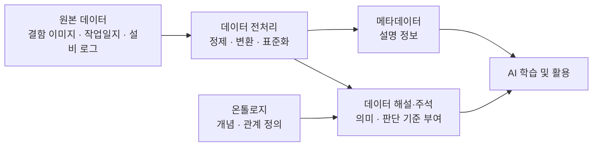

# B-2. 데이터 해설·주석 매뉴얼

---
## 목차
### 1. 개요

- [1.1 데이터 해설·주석이란](#11-데이터-해설주석이란)
- [1.2 메타데이터, 온톨로지, 데이터 해설·주석의 차이](#12-메타데이터-온톨로지-데이터-해설주석의-차이)
- [1.3 데이터 전처리, 온톨로지, 데이터 해설·주석의 관계](#13-데이터-전처리-온톨로지-데이터-해설주석의-관계)
- [1.4 주요 대상 조직](#14-주요-대상-조직)

---

### 2. 왜 필요한가 (Why)

- [2.1 데이터 해설·주석의 핵심 목적](#21-데이터-해설주석의-핵심-목적)
- [2.2 현업 Pain Point](#22-현업-pain-point)
- [2.3 데이터 해설·주석 적용 효과](#23-데이터-해설주석-적용-효과)
- [2.4 자회사 관점 기대 효과](#24-자회사-관점-기대-효과)
- [2.5 데이터 해설·주석이 필요한 데이터](#25-데이터-해설주석이-필요한-데이터)

---

### 3. 무엇을 갖추나 (What)

- [3.1 데이터 라벨링](#31-데이터-라벨링labeling)
- [3.2 데이터 주석](#32-데이터-주석annotation)
- [3.3 Annotation 유형](#33-annotation-유형)
- [3.4 Text Annotation](#34-text-annotation)
- [3.5 Image Annotation](#35-image-annotation)
- [3.6 Video Annotation](#36-video-annotation)
- [3.7 Audio Annotation](#37-audio-annotation)
- [3.8 Taxonomy(분류 체계)](#38-taxonomy분류-체계)
- [3.9 Taxonomy 구조 유형](#39-taxonomy-구조-유형)

---

### 4. 어디부터 하나

- [4.1 주석 대상 선정 원칙](#41-주석-대상-선정-원칙)
- [4.2 주요 대상 데이터](#42-주요-대상-데이터)
- [4.3 우선순위 선정](#43-우선순위-선정)
- [4.4 자회사 적용 시 기대 효과](#44-자회사-적용-시-기대-효과)

---

### 5. 예시 시나리오: 두산전자 결함 이미지 주석

- [5.1 적용 배경](#51-적용-배경)
- [5.2 대상 데이터 선정](#52-대상-데이터-선정)
- [5.3 Taxonomy 설계](#53-taxonomy-설계)
- [5.4 Annotation Guideline 작성](#54-annotation-guideline-작성)
- [5.5 Pilot Annotation](#55-pilot-annotation)
- [5.6 본 Annotation 수행](#56-본-annotation-수행)
- [5.7 AI 보조 Annotation 적용](#57-ai-보조-annotation-적용)
- [5.8 AI 자산화](#58-ai-자산화)
- [5.9 사례의 의미](#59-사례의-의미)

---

### 6. 어떻게 준비·운영하나 (How)

#### 설계

- [6.1 대상 데이터 선정](#61-대상-데이터-선정)
- [6.2 Taxonomy 설계](#62-taxonomy-설계)
- [6.3 Annotation Guideline 작성](#63-annotation-guideline-작성)
- [6.4 Pilot Annotation](#64-pilot-annotation)
- [6.5 IAA 측정 및 Guideline 보정](#65-iaa-측정-및-guideline-보정)

#### 운영

- [6.6 Labeler 합의 체계](#66-labeler-합의-체계)
- [6.7 Gold Standard Dataset 구축](#67-gold-standard-dataset-구축)
- [6.8 본 Annotation 수행](#68-본-annotation-수행)
- [6.9 QA 및 검수](#69-qa-및-검수)

#### 자동화 및 고도화

- [6.10 AI 기반 Annotation 자동화](#610-ai-기반-annotation-자동화)
- [6.11 Pre-labeling](#611-pre-labeling)
- [6.12 Human-in-the-Loop (HITL)](#612-human-in-the-loophitl)
- [6.13 Active Learning](#613-active-learning)
- [6.14 Weak Supervision](#614-weak-supervision)
- [6.15 Annotation 데이터셋 버전 관리](#615-annotation-데이터셋-버전-관리)

#### 운영 지원

- [6.16 데이터 팀용 실행 체크리스트](#616-데이터-팀용-실행-체크리스트)
- [6.17 라벨러 작업 지시 템플릿](#617-라벨러-작업-지시-템플릿)
- [6.18 단계별 최종 산출물 요약](#618-단계별-최종-산출물-요약)

---

### 7. KPI 및 성과 관리

- [7.1 KPI 운영 원칙](#71-kpi-운영-원칙)
- [7.2 품질 KPI](#72-품질-kpi)
- [7.3 생산성 KPI](#73-생산성-kpi)
- [7.4 운영 KPI](#74-운영-kpi)
- [7.5 자동화 KPI](#75-자동화-kpi)
- [7.6 KPI 활용 단계](#76-kpi-활용-단계)
- [7.7 자회사 적용 시 기대 효과](#77-자회사-적용-시-기대-효과)

---

### 8. Roadmap

- [8.1 추진 방향](#81-추진-방향)
- [Phase 1. Preparation](#phase-1-preparation)
- [Phase 2. AI Ready](#phase-2-ai-ready)
- [Phase 3. Automation](#phase-3-automation)
- [Phase 4. AI Assetization](#phase-4-ai-assetization)
- [8.2 자회사 적용 가이드](#82-자회사-적용-가이드)
- [8.3 최종 목표](#83-최종-목표)

---

### Appendix

- [주요 용어](#주요-용어)
- [참고 자료](#참고-자료-references)

---

# Executive Summary

데이터 해설·주석은 AI가 데이터를 올바르게 이해하고 학습할 수 있도록 사람의 판단 기준과 의미 정보를 데이터에 부여하는 활동이다.

제조업에서는 결함 이미지, 설비 이상음, 작업 일지, 품질 검사 결과, 고객 클레임처럼 원천 데이터만으로는 의미를 해석하기 어려운 데이터가 많다. 이러한 데이터는 사람이 업무 기준에 따라 "정상/불량", "결함 유형", "원인", "조치", "심각도" 등을 명확히 부여해야 AI 학습에 활용할 수 있다.

본 가이드는 데이터 해설·주석 체계를 구축하기 위해 데이터 팀이 수행해야 할 준비·운영 절차와 라벨러에게 제공해야 할 작업 기준을 정의한다.

| 구분       | 내용                                                                                                        |
| -------- | --------------------------------------------------------------------------------------------------------- |
| 최종 목표    | AI 학습과 평가에 활용 가능한 신뢰성 있는 Annotation Dataset 구축                                                            |
| 주요 산출물   | Taxonomy, Label Definition, Annotation Guideline, Gold Standard Dataset, Annotation Dataset, QA 결과, 버전 이력 |
| 주요 수행 주체 | 현업 SME, 데이터 팀, AI/데이터 조직, 라벨러, Reviewer, 전사 데이터 거버넌스 조직                                                   |
| 적용 대상    | 결함 이미지, 설비 로그, 작업 일지, 정비 이력, 고객 클레임, 생산 영상, 설비 이상음                                                        |
| 운영 원칙    | 기준 표준화, 품질 검증, 이력 추적, 재사용성 확보, 자동화 확대                                                                     |

데이터 해설·주석의 핵심은 단순히 라벨을 많이 붙이는 것이 아니라, **사람의 판단 기준을 표준화된 데이터 자산으로 전환하는 것**이다. 이를 통해 계열사는 AI 모델 성능을 높이고, 동일한 데이터셋을 여러 AI 과제에서 재사용하며, AI-ready 데이터 기반을 지속적으로 축적할 수 있다.

---

# 1. 개요

## 1.1 데이터 해설·주석이란

데이터 해설·주석(Data Annotation)은 AI가 데이터를 이해하고 학습할 수 있도록 데이터에 의미 정보를 부여하는 작업이다.

AI는 원본 데이터만으로는 데이터가 무엇을 의미하는지 스스로 이해하지 못한다. 예를 들어 결함 사진이 주어지더라도 AI는 해당 사진이 정상인지 불량인지, 어떤 유형의 결함인지, 어느 위치에 존재하는지 알 수 없다.

따라서 사람이 데이터에 의미 정보를 부여해야 하며, 이를 데이터 해설·주석이라고 한다.

예를 들어 결함 사진 한 장에 다음과 같은 정보를 추가할 수 있다.

| 구분 | 예시 |
|---|---|
| 결함 여부 | 불량 |
| 결함 유형 | 스크래치 |
| 결함 위치 | 외경 테두리 |
| 심각도 | 중 |
| 권장 조치 | 재가공 필요 |

이와 같이 원본 데이터에 사람이 해석한 의미 정보를 추가함으로써 AI가 학습 가능한 데이터로 전환된다.

---

## 1.2 메타데이터, 온톨로지, 데이터 해설·주석의 차이

AI가 데이터를 활용하기 위해서는 데이터 자체뿐 아니라 데이터를 설명하고 해석하기 위한 다양한 정보가 필요하다.

대표적으로 메타데이터, 온톨로지, 데이터 해설·주석은 모두 데이터 이해를 지원하지만 목적과 역할은 서로 다르다.

### 메타데이터

메타데이터(Metadata)는 데이터를 설명하기 위한 정보이다.

데이터의 생성 시점, 저장 위치, 담당 조직, 컬럼 정의 등 데이터 자체를 이해하고 관리하기 위한 정보를 제공한다.

즉, 메타데이터는 데이터가 **어떤 데이터인지**를 설명한다.

예를 들어 동일한 결함 이미지에 대해 다음과 같은 정보는 메타데이터에 해당한다.

- 촬영일시
- 설비 ID
- 제품명
- 파일 형식
- 해상도
- 저장 위치

---

### 온톨로지

온톨로지(Ontology)는 업무 개념과 개념 간 관계를 정의하는 체계이다.

개별 데이터를 설명하는 것이 아니라 업무 지식을 구조화하여 AI가 개념 간 관계를 이해할 수 있도록 지원한다.

예를 들어

```text
스크래치
→ 표면 결함

스크래치
→ 원인
→ 롤러 마모

스크래치
→ 조치
→ 재가공
```

와 같이 개념과 관계를 정의한다.

즉, 온톨로지는 **업무 개념이 서로 어떻게 연결되는가**를 설명한다.

---

### 데이터 해설·주석

데이터 해설·주석(Data Annotation / Labelling)은 AI 학습과 판단을 위해 데이터에 의미와 정답 정보를 부여하는 작업이다.

예를 들어 특정 결함 이미지에 대해

- 결함 유형 = 스크래치
- 결함 위치 = 외경 테두리
- 심각도 = 중
- 권장 조치 = 재가공

과 같은 정보를 부여하는 것이 데이터 해설·주석이다.

즉, 데이터 해설·주석은 **이 데이터를 어떻게 해석하고 판단해야 하는가**를 설명한다.

---

### 비교

| 구분 | 메타데이터 | 온톨로지 | 데이터 해설·주석 |
|---|---|---|---|
| 목적 | 데이터 설명 | 개념 및 관계 정의 | 의미 및 정답 부여 |
| 주요 질문 | 이 데이터는 무엇인가? | 이 개념은 무엇과 연결되는가? | 이 데이터를 어떻게 판단해야 하는가? |
| 대상 | 데이터 자체 | 업무 개념 | 개별 데이터 |
| 예시 | 생성일시, 위치, 담당자 | 결함 → 원인 → 조치 | 결함 유형, 심각도, 위치 |

메타데이터는 데이터를 설명하고, 온톨로지는 업무 개념을 구조화하며, 데이터 해설·주석은 개별 데이터에 의미를 부여한다.

---

## 1.3 데이터 전처리, 온톨로지, 데이터 해설·주석의 관계

데이터 전처리, 온톨로지, 데이터 해설·주석은 모두 AI가 데이터를 올바르게 이해할 수 있도록 지원하지만 서로 다른 역할을 수행한다.



데이터 전처리는 원본 데이터를 AI가 처리할 수 있는 형태로 정리하는 역할을 수행한다.

예를 들어 이미지 크기를 통일하거나, 결측치를 제거하거나, 문서 데이터를 텍스트로 변환하는 작업이 이에 해당한다.

온톨로지는 업무 개념과 개념 간 관계를 정의한다.

예를 들어 결함 유형, 원인, 조치 간 관계를 정의하여 어떤 기준으로 데이터를 해석할 것인지를 제공한다.

데이터 해설·주석은 전처리된 데이터에 온톨로지와 업무 기준을 적용하여 개별 데이터에 의미 정보를 부여한다.

예를 들어 특정 결함 이미지에 대해

- 결함 유형 = 스크래치
- 위치 = 외경 테두리
- 심각도 = 중

과 같은 Annotation을 생성한다.

결과적으로 데이터 전처리는 데이터의 형태를 준비하고, 온톨로지는 판단 기준을 제공하며, 데이터 해설·주석은 개별 데이터에 의미를 부여한다.

이 세 가지 요소가 함께 작동해야 AI가 데이터를 올바르게 이해하고 활용할 수 있다.
## 1.4 주요 대상 조직

데이터 해설·주석은 특정 조직만 수행하는 활동이 아니다.

주석 기준 정의, 실제 주석 수행, 품질 검수, AI 활용까지 다양한 조직이 함께 참여한다.

| 조직/역할 | 주요 역할 |
|---|---|
| 지주/전사 데이터 조직 | 주석 표준 및 운영 기준 수립 |
| 현업 전문가(SME) | 분류 기준 및 판단 기준 정의 |
| 데이터 라벨러 | 실제 라벨 및 주석 수행 |
| 검수자(QA) | 품질 검수 및 일치도 관리 |
| AI/데이터 조직 | AI 학습 및 자동화 체계 구축 |

현업 전문가의 역할이 특히 중요하다.

주석은 단순 입력 작업이 아니라 업무 지식을 데이터에 반영하는 과정이기 때문에, 도메인 전문가의 판단 기준이 반드시 반영되어야 한다.

---

# 2. 왜 필요한가 (Why)

AI 모델의 성능은 알고리즘보다 학습 데이터 품질의 영향을 크게 받는다.

동일한 모델을 사용하더라도 학습 데이터가 정확하고 일관되게 구축되어 있으면 높은 성능을 확보할 수 있지만, 데이터에 대한 해석 기준이 불명확하거나 라벨 품질이 낮으면 모델은 잘못된 패턴을 학습하게 된다.

특히 제조 환경에서는 결함 이미지, 고객 클레임, 작업 일지, 설비 점검 기록과 같이 사람의 해석이 필요한 데이터가 많다.

이러한 데이터는 원천 데이터만으로는 AI가 의미를 이해하기 어렵기 때문에, 사람의 판단 기준을 체계적으로 부여하는 데이터 해설·주석 체계가 필요하다.

---

## 2.1 데이터 해설·주석의 핵심 목적

데이터 해설·주석 체계는 단순히 라벨을 붙이는 작업이 아니라, AI가 데이터를 일관되게 이해할 수 있도록 만드는 기반 체계이다.

| 목적                 | 설명                                        | 제조업 예시                                  |
| ------------------ | ----------------------------------------- | --------------------------------------- |
| 데이터 의미 및 판단 기준 표준화 | 제품, 공정, 결함, 원인, 조치 등 핵심 업무 개념의 해석 기준을 표준화 | "긁힘", "스크래치", "표면 손상"을 하나의 표준 Label로 통합 |
| 신뢰 가능한 AI 학습 환경 구축 | 표준화된 주석 기준과 검수 체계로 고품질 학습 데이터셋 구축         | 불량 탐지 모델 학습용 결함 이미지 데이터셋 생성             |
| 주석 품질 및 이력 관리      | 누가, 언제, 어떤 기준으로 주석을 생성·수정했는지 추적           | Guideline v1.1 기준으로 라벨링된 데이터셋 식별        |
| 재사용 가능한 AI 자산 축적   | 과제별 일회성 데이터가 아니라 반복 활용 가능한 데이터셋으로 관리      | 외관 검사 데이터셋을 불량 분류, 원인 분석, 재발 예측에 재사용    |

---

## 2.2 현업 Pain Point

많은 AI 과제는 모델 개발보다 학습 데이터 준비 단계에서 더 많은 시간과 비용이 소요된다.

대표적인 문제는 다음과 같다.

### 데이터 의미와 업무 맥락에 대한 표준 정의 부재

동일한 현상을 사람마다 다르게 해석하는 경우가 많다.

예를 들어 동일한 결함에 대해

- 스크래치
- 긁힘
- 표면 결함

등 서로 다른 표현을 사용할 수 있다.

이 경우 AI는 동일한 현상을 서로 다른 데이터로 학습하게 된다.

---

### 주석 기준 부재로 인한 품질 편차

주석 기준이 명확하지 않으면 동일한 데이터에 대해서도 작업자마다 다른 결과가 생성될 수 있다.

예를 들어 동일한 결함 사진을 보고

- 작업자 A는 크랙
- 작업자 B는 스크래치

로 분류할 수 있다.

이러한 불일치는 학습 데이터 품질을 저하시킨다.

---

### 주석 품질 및 변경 이력 관리 미흡

주석 데이터가 수정되더라도 변경 이력이 관리되지 않는 경우가 많다.

이 경우

- 어떤 기준으로 수정되었는지
- 어느 버전의 데이터가 모델 학습에 사용되었는지

확인하기 어렵다.

---

### AI 과제별 데이터 재작업 반복

과거 AI 과제에서 생성한 데이터셋이 존재함에도 재사용되지 못하면 다음과 같은 비효율이 발생한다.

* 동일한 라벨링 반복
* 동일한 검수 반복
* 동일한 데이터 정제 반복
* 현업 SME의 반복 투입
* 프로젝트별 기준 불일치 발생
* 
---

## 2.3 데이터 해설·주석 적용 효과

데이터 해설·주석 체계를 구축하면 다음과 같은 효과를 기대할 수 있다.

| 효과                   | 설명                                | 예시                                                        |
| -------------------- | --------------------------------- | --------------------------------------------------------- |
| 기계가 이해할 수 있는 데이터로 전환 | 원천 데이터에 의미 정보를 부여하여 AI 학습 데이터로 전환 | 결함 이미지에 결함 유형, 위치, 심각도를 부여                                |
| AI 학습 효율 향상          | 일관된 주석 기준으로 모델이 더 안정적으로 학습        | 불량 분류 정확도 향상, 재학습 비용 감소                                   |
| 데이터 재사용성 향상          | 표준화된 데이터셋을 여러 AI 과제에 활용           | 품질 검사 데이터셋을 불량 분류, 이상 탐지, 원인 분석에 활용                       |
| AI 자산화 기반 구축         | 주석 데이터를 일회성 산출물이 아닌 운영 자산으로 관리    | Annotation Dataset, Taxonomy, Gold Standard Dataset 버전 관리 |

---

## 2.4 자회사 관점 기대 효과

자회사가 본 가이드를 적용하면 다음과 같은 효과를 기대할 수 있다.

| 구분 | 기대 효과 |
|---|---|
| 데이터 품질 | 주석 기준 표준화 |
| AI 성능 | 모델 정확도 및 신뢰도 향상 |
| 운영 효율 | 재작업 감소 |
| 비용 절감 | 데이터 구축 비용 절감 |
| 재사용성 | 데이터셋 재활용 가능 |
| 자산화 | AI 자산 지속 축적 |

---

## 2.5 데이터 해설·주석이 필요한 데이터

모든 데이터가 주석 대상은 아니다. AI가 의미와 판단 기준을 직접 이해하기 어려운 데이터를 우선 대상으로 선정한다.

| 데이터 유형 | 제조업 예시                   | 주석이 필요한 이유               |
| ------ | ------------------------ | ------------------------ |
| Text   | 작업일지, 고객 클레임, 정비 이력      | 원인, 조치, 불만 유형 등 의미 해석 필요 |
| Image  | 결함 이미지, 제품 사진, 설비 사진     | 결함 유형, 위치, 심각도 판단 필요     |
| Video  | 작업 영상, 생산 라인 영상, CCTV    | 작업 행동, 이벤트, 위험 상황 식별 필요  |
| Audio  | 설비 이상음, 작업자 음성, 고객 상담 음성 | 이상 소리, 발화자, 의도, 감정 분류 필요 |

반대로 ERP 마스터 데이터처럼 의미가 이미 구조화되어 있고 정답 기준이 명확한 데이터는 일반적으로 별도의 Annotation 대상이 아니다. 다만 AI 과제에서 추가적인 판단 기준이 필요해질 경우 대상에 포함될 수 있다.

---

# 3. 무엇을 갖추나 (What)

데이터 해설·주석 체계는 AI가 데이터를 이해하고 학습할 수 있도록 의미 정보를 부여하는 체계이다.

본 가이드에서는 데이터 해설·주석 체계를 크게 다음 두 단계로 구분한다.

1. 데이터 라벨링(Labeling)
2. 데이터 주석(Annotation)

데이터 라벨링은 데이터 전체에 대한 분류 결과를 정의하는 활동이며, 데이터 주석은 해당 데이터에 대한 세부 속성과 맥락 정보를 추가하는 활동이다.

---

## 3.1 데이터 라벨링(Labeling)

데이터 라벨링은 데이터 전체에 대해 표준 분류 체계를 적용하는 활동이다.

AI 모델 학습에서는 라벨이 정답(Ground Truth)의 역할을 수행한다.

예를 들어 결함 이미지 한 장에 대해

- 정상
- 불량

을 부여하는 것이 가장 단순한 라벨링이다.

조금 더 세분화하면

- 스크래치
- 크랙
- 찍힘
- 오염

등으로 분류할 수 있다.

### 데이터 라벨링 예시

| 데이터 | 라벨 |
|---|---|
| 결함 이미지 | 스크래치 |
| 고객 클레임 | 배송 불만 |
| 설비 로그 | 이상 |
| 작업 일지 | 정비 작업 |

---

### 라벨 형태

라벨은 AI 과제 특성에 따라 다양한 형태로 구성될 수 있다.

#### 분류 라벨

정해진 범주 중 하나를 선택

예)

- 정상
- 경고
- 고장

---

#### 다중 클래스 라벨

여러 종류의 결함 또는 상태를 구분

예)

- 크랙
- 스크래치
- 찍힘
- 오염

---

#### 수치 라벨

연속적인 값을 표현

예)

- 심각도 1~5
- 위험도 0~100

---

#### 조치 라벨

권장 조치 정의

예)

- 재가공
- 폐기
- 재검사

---

## 3.2 데이터 주석(Annotation)

주석은 라벨만으로 표현하기 어려운 세부 정보와 맥락 정보를 추가하는 활동이다.

예를 들어

"스크래치"

라는 라벨만으로는

- 어디에 존재하는지
- 얼마나 심각한지
- 어떤 원인인지

를 알 수 없다.

이러한 정보를 구조화하여 추가하는 것이 Annotation이다.

---

### Annotation 예시

| 항목 | 예시 |
|---|---|
| 위치 | 외경 테두리 |
| 원인 | 소재 불량 |
| 심각도 | 중 |
| 부품 | 베어링 |
| 시간 | 2026-05-25 10:23 |

---

### 라벨과 주석의 차이

| 구분 | 라벨 | 주석 |
|---|---|---|
| 역할 | 분류 | 세부 설명 |
| 수준 | 데이터 전체 | 데이터 일부 |
| 예시 | 스크래치 | 위치=외경, 심각도=중 |

---

## 3.3 Annotation 유형

주석 대상 데이터는 크게 네 가지 유형으로 구분할 수 있다.

| 유형    | 제조업 예시               | 대표 Annotation 목적     |
| ----- | -------------------- | -------------------- |
| Text  | 작업일지, 고객 클레임, 정비 이력  | 원인·조치·불량 유형 추출       |
| Image | 결함 이미지, 제품 사진, 설비 사진 | 결함 탐지·분류·위치 식별       |
| Video | 생산 영상, 작업 영상, CCTV   | 작업 행동, 이벤트, 위험 상황 탐지 |
| Audio | 설비 이상음, 음성 기록        | 이상음 탐지, 발화 내용 분류     |

---

## 3.4 Text Annotation

Text Annotation은 텍스트 데이터에 의미 정보를 부여하는 작업이다.

| 유형                                | 설명                 | 제조업 예시                        |
| --------------------------------- | ------------------ | ----------------------------- |
| NER<br>(Named Entity Recognition) | 문서 내 주요 개체를 식별     | 설비명, 부품명, 불량 유형, 작업자, 공정명     |
| Span Annotation                   | 특정 문장 또는 구간에 의미 부여 | 원인 분석 구간, 조치 내용 구간            |
| Relation Extraction               | 개체 간 관계 정의         | 결함 → 원인, 원인 → 조치, 설비 → 고장 코드  |
| Document Classification           | 문서 전체 분류           | 품질 보고서, 장애 보고서, 작업 일지, 고객 클레임 |

예시:

```text
문장: "CNC-03 설비에서 스핀들 진동 증가로 표면 스크래치가 발생하여 공구를 교체함"

NER:
- 설비명: CNC-03
- 이상 현상: 스핀들 진동 증가
- 결함 유형: 표면 스크래치
- 조치: 공구 교체

Relation:
- 스핀들 진동 증가 → 표면 스크래치
- 표면 스크래치 → 공구 교체
```

---

## 3.5 Image Annotation

Image Annotation은 제조업에서 많이 활용되는 주석 방식이다.

| 유형                   | 설명               | 적용 예                 |
| -------------------- | ---------------- | -------------------- |
| Image Classification | 이미지 전체에 라벨 부여    | 정상/불량 분류, 결함 유형 분류   |
| Bounding Box         | 객체 위치를 사각형으로 표시  | 결함 탐지, 부품 인식         |
| Polygon              | 객체 외곽선을 정밀하게 표시  | 균열 영역 측정, 부식 영역 측정   |
| Semantic Mask        | 모든 픽셀을 의미 단위로 분류 | 정밀 결함 분할, 영역 분석      |
| Keypoint             | 특정 위치를 좌표로 표시    | 작업자 자세 분석, 구조물 위치 분석 |

예시:

```text
이미지: 외관 검사 이미지

Label:
- 결함 유형 = 스크래치

Annotation:
- 위치 = Bounding Box 좌표
- 심각도 = 중
- 조치 = 재검사
```

---
## 3.6 Video Annotation

Video Annotation은 시간 정보를 포함하는 주석 방식이다.

| 유형                   | 설명               | 제조업 예시                |
| -------------------- | ---------------- | --------------------- |
| Frame Classification | 특정 프레임 단위로 상태 분류 | 정상 작업, 비정상 작업         |
| Object Tracking      | 영상 내 객체 이동 추적    | 작업자, 지게차, 부품 이동 추적    |
| Action Annotation    | 특정 행동에 라벨 부여     | 보호구 미착용, 위험 접근, 조립 작업 |
| Event Annotation     | 특정 이벤트 발생 시점 기록  | 설비 정지, 알람 발생, 낙하 발생   |
| Temporal Segment     | 시간 구간 단위로 의미 부여  | 00:10~00:25 비정상 진동 발생 |

---

## 3.7 Audio Annotation

Audio Annotation은 음성 및 소리 데이터에 의미를 부여하는 작업이다.

| 유형                     | 설명          | 제조업 예시              |
| ---------------------- | ----------- | ------------------- |
| Sound Event Annotation | 소리 이벤트 식별   | 베어링 이상음, 충격음, 누설음   |
| Speech-to-Text         | 음성을 텍스트로 변환 | 작업자 음성 기록, 고객 상담 음성 |
| Speaker Annotation     | 발화자 구분      | 상담원/고객, 작업자/관리자     |
| Intent Annotation      | 발화 의도 분류    | 고장 신고, 부품 요청, 불만 접수 |
| Emotion Annotation     | 감정 상태 분류    | 고객 불만 강도, 긴급도 판단    |

---

## 3.8 Taxonomy(분류 체계)

AI 학습을 위해서는 표준 분류 체계가 필요하다. Taxonomy는 데이터를 중복 없이 일관되게 분류하기 위한 구조이다.

좋은 Taxonomy는 아래 세 가지 원칙을 만족해야 한다.

| 원칙    | 설명                                | 예시                        |
| ----- | --------------------------------- | ------------------------- |
| 상호배타성 | 동일 데이터가 하나의 기준에서는 하나의 범주로 분류되어야 함 | "스크래치"와 "크랙" 기준이 중복되지 않음  |
| 포괄성   | 대부분의 데이터가 적절한 범주를 가져야 함           | 일반 결함 외 "기타/SME 검토" 범주 제공 |
| 일관성   | 동일 데이터는 항상 동일 기준으로 분류되어야 함        | 작업자마다 같은 결함을 같은 Label로 판단 |

---

## 3.9 Taxonomy 구조 유형

Taxonomy 구조는 AI 과제와 데이터 특성에 따라 선택한다.

### Flat

단일 레벨 구조이다.

```text
정상
경고
고장
```

적합한 경우:

* 분류 기준이 단순한 경우
* 초기 Pilot 단계
* 정상/불량 등 1차 분류가 필요한 경우

---

### Hierarchical

상위·하위 개념을 가진 계층 구조이다.

```text
설비 상태
 ├ 정상
 ├ 경고
 └ 고장
     ├ 베어링 고장
     ├ 모터 고장
     └ 센서 고장
```

적합한 경우:

* 결함이나 고장 유형을 단계적으로 세분화해야 하는 경우
* 전사 공통 분류와 공장별 상세 분류를 함께 관리해야 하는 경우

---

### Multi-label

하나의 데이터에 여러 라벨을 허용하는 구조이다.

```text
경고
+
온도 이상
+
진동 이상
+
베어링 관련
```

적합한 경우:

* 하나의 데이터에 복수의 원인이나 상태가 동시에 존재하는 경우
* 설비 이상, 고객 클레임, 복합 결함 분석에 활용하는 경우

---

# 4. 어디부터 하나 — 주석 대상 선정

모든 데이터를 Annotation 대상으로 삼을 필요는 없다. AI가 직접 의미와 판단 기준을 이해하기 어려운 데이터를 우선 대상으로 선정한다.

---

## 4.1 주석 대상 선정 원칙

다음 기준을 만족하는 데이터를 우선 대상으로 선정한다.

| 선정 원칙      | 판단 질문                    | 예시                     |
| ---------- | ------------------------ | ---------------------- |
| 의미 해석 필요성  | 원천 데이터만으로 의미를 판단하기 어려운가? | 결함 이미지, 고객 클레임         |
| 사람의 판단 필요성 | 전문가의 업무 기준이 필요한가?        | 크랙/스크래치 구분, 원인 분류      |
| AI 활용 가치   | 향후 AI 과제에 활용될 가능성이 높은가?  | 품질 검사 자동화, 예지보전        |
| 데이터 확보 가능성 | 충분한 수량과 대표성을 확보할 수 있는가?  | 검사 이미지 5만 건, 정비 이력 3년치 |
| 재사용성       | 여러 과제에서 반복 활용 가능한가?      | 불량 분류, 원인 분석, 재발 예측    |

---

<a id="42-주요-대상-데이터"></a>

## 4.2 주요 대상 데이터

| 유형    | 주요 데이터                      | 활용 가능 AI 과제           |
| ----- | --------------------------- | --------------------- |
| Text  | 작업일지, 고객 클레임, 정비 이력, 품질 보고서 | VOC 분석, 원인 분석, 조치 추천  |
| Image | 설비 사진, 불량 이미지, 제품 사진, 도면    | 결함 탐지, 불량 분류, 부품 인식   |
| Video | 생산 영상, 작업 영상, CCTV          | 작업 행동 분석, 안전 위험 탐지    |
| Audio | 설비 이상음, 작업자 음성, 고객 상담 음성    | 이상음 탐지, 상담 분류, 긴급도 판단 |

---

<a id="43-우선순위-선정"></a>

## 4.3 우선순위 선정

우선순위는 다음 기준으로 평가한다.

| 평가 항목  | 설명             | 점검 질문                        |
| ------ | -------------- | ---------------------------- |
| AI 활용도 | AI 과제 활용 가능성   | 이미 추진 중이거나 계획된 AI 과제가 있는가?   |
| 업무 중요도 | 업무 영향도         | 품질, 안전, 생산성, 비용에 미치는 영향이 큰가? |
| 데이터 규모 | 확보 가능 데이터 양    | 학습에 필요한 양과 기간의 데이터가 있는가?     |
| 구축 난이도 | Annotation 난이도 | SME 판단이 과도하게 필요한가?           |
| 재사용성   | 활용 범위          | 다른 공장·제품·과제에도 활용 가능한가?       |

예시 평가:

| 후보 데이터    | AI 활용도 | 업무 중요도 | 데이터 규모 | 구축 난이도 | 재사용성 | 우선순위 |
| --------- | ------ | ------ | ------ | ------ | ---- | ---- |
| 외관 검사 이미지 | 높음     | 높음     | 높음     | 중      | 높음   | 1    |
| 설비 이상음    | 높음     | 높음     | 중      | 높음     | 중    | 2    |
| 고객 클레임    | 중      | 중      | 중      | 중      | 높음   | 3    |
| 작업 일지     | 중      | 중      | 낮음     | 높음     | 중    | 4    |

---

<a id="44-자회사-적용-시-기대-효과"></a>

## 4.4 자회사 적용 시 기대 효과

주석 대상 데이터를 우선 선정하면 다음 효과를 기대할 수 있다.

* 데이터 구축 비용 절감
* AI 과제 수행 기간 단축
* 주석 품질 향상
* 재사용 가능한 데이터셋 확보
* AI 자산 축적 기반 구축

---

# 5. 예시 시나리오: 두산전자 결함 이미지 주석

본 장에서는 두산전자 외관 검사 데이터를 예시로 데이터 해설·주석 체계가 실제로 어떻게 구축되고 운영되는지 설명한다.

데이터 해설·주석은 단순히 라벨을 부여하는 작업이 아니라, AI가 데이터를 일관되게 이해할 수 있도록 판단 기준을 표준화하고, 이를 재사용 가능한 학습 데이터 자산으로 전환하는 과정이다.

본 사례는 이후 6장에서 설명하는 구축 방법론을 실제 제조 환경에 적용한 예시로 이해할 수 있다.

---

## 5.1 적용 배경

두산전자는 생산 과정에서 다양한 외관 결함 검사를 수행한다.

현재는 검사원이 결함 이미지를 확인한 후 정상 여부와 결함 유형을 기록한다.

그러나 동일한 결함에 대해서도 검사원마다 표현과 판단 기준이 다를 수 있으며, 이러한 데이터는 AI 학습에 직접 활용하기 어렵다.

예를 들어 동일한 결함에 대해 다음과 같이 서로 다른 표현이 사용될 수 있다.

| 작업자 | 표현 |
|---|---|
| A | 스크래치 |
| B | 긁힘 |
| C | 표면 손상 |

AI 입장에서는 동일한 결함임에도 서로 다른 데이터로 인식될 수 있다.

---

## 5.2 대상 데이터 선정

AI 활용 가치와 데이터 확보 가능성을 고려하여 Annotation 대상을 선정한다.

### 후보 데이터

| 데이터 | 활용 목적 |
|---|---|
| 외관 검사 이미지 | 결함 자동 분류 |
| 고객 클레임 | VOC 분석 |
| 설비 점검 일지 | 원인 분석 |

우선순위 평가 결과, 외관 검사 이미지를 1차 Annotation 대상으로 선정하였다.

| 데이터 | AI 활용도 | 데이터 규모 | 구축 난이도 | 우선순위 |
|---|---|---|---|---|
| 외관 검사 이미지 | 높음 | 높음 | 중간 | 1 |
| 고객 클레임 | 높음 | 중간 | 높음 | 2 |
| 설비 점검 일지 | 중간 | 낮음 | 높음 | 3 |

---

## 5.3 Taxonomy 설계

현업 SME와 품질팀이 참여하여 결함 분류 체계를 정의한다.

### 기존 상태

| 표현 |
|---|
| 긁힘    |
| 스크래치  |
| 표면 손상 |
| 금     |
| 갈라짐   |
| 오염    |

### 표준 Taxonomy 정의

```text
결함 유형
 ├ 스크래치
 ├ 크랙
 ├ 찍힘
 └ 오염
```

### Label Definition 작성

| Label | 정의              | 포함 사례      | 제외 사례      |
| ----- | --------------- | ---------- | ---------- |
| 스크래치  | 표면의 선형 긁힘 결함    | 얇고 긴 표면 손상 | 재질이 벌어진 균열 |
| 크랙    | 재질의 균열 결함       | 갈라짐, 균열    | 표면 오염      |
| 찍힘    | 외부 충격에 의한 압흔    | 눌림, 패임     | 선형 긁힘      |
| 오염    | 이물질 또는 오염 물질 부착 | 먼지, 얼룩, 이물 | 재질 손상      |

---

## 5.4 Annotation Guideline 작성

Taxonomy만으로는 작업자 간 일관성을 확보하기 어렵다. 따라서 Annotation Guideline을 작성한다.

### 스크래치 예시

#### Definition

스크래치는 제품 표면에 발생한 선형 긁힘 결함을 의미한다.

#### Positive Example

* 표면에 얇고 긴 선형 흔적이 있음
* 표면이 긁혔으나 재질이 벌어지지는 않음

#### Negative Example

* 재질이 갈라진 균열
* 충격으로 움푹 들어간 찍힘
* 닦으면 제거되는 이물질

#### Decision Rule

```text
IF 선형 흔적이 존재
AND 재질 벌어짐이 없음
AND 오염물 부착이 아님

THEN 스크래치

ELSE SME 검토
```

#### Boundary Case

| 경계 사례             | 처리 기준                  |
| ----------------- | ---------------------- |
| 스크래치와 크랙이 동시에 의심됨 | SME 검토 대상으로 분류         |
| 오염인지 스크래치인지 불명확함  | 닦임 여부 또는 추가 이미지 기준 확인  |
| 결함이 너무 작아 식별 어려움  | "판단 불가" 또는 Reviewer 검토 |

---

## 5.5 Pilot Annotation

본 작업 이전에 Pilot Annotation을 수행한다.

### Pilot 규모

- 샘플 데이터 500건
- Annotator 3명
- Reviewer 1명

### 수행 결과

| Label | Cohen's κ |
|---|---|
| 스크래치 | 0.84 |
| 크랙 | 0.71 |
| 찍힘 | 0.88 |
| 오염 | 0.82 |

### 문제 발견 및 개선 조치

| 문제              | 원인             | 개선 조치                   |
| --------------- | -------------- | ----------------------- |
| 크랙과 스크래치 구분 불일치 | 재질 벌어짐 기준이 불명확 | Guideline에 확대 이미지 예시 추가 |
| 오염과 표면 손상 혼동    | 제거 가능 여부 기준 부재 | "닦임 여부" 판단 기준 추가        |
| 작은 결함 누락        | 최소 크기 기준 부재    | Bounding Box 최소 기준 정의   |

---

## 5.6 본 Annotation 수행

Pilot 결과를 반영하여 전체 데이터셋 Annotation을 수행한다.

### 대상 데이터

| 항목 | 규모 |
|---|---|
| 이미지 수 | 50,000 |
| Label 수 | 4 |
| Annotator | 5명 |
| Reviewer | 2명 |
| SME       | 품질 전문가 1~2명 |

### 생성 데이터

| 항목 | 내용 |
|---|---|
| 결함 유형 | 스크래치, 크랙, 찍힘, 오염 |
| 위치 | Bounding Box |
| 심각도 | 상·중·하 |
| 조치 | 재가공, 폐기, 재검사 |
| 판단 근거 | 필요 시 Reviewer 또는 SME 코멘트 |

### 역할 분담

| 역할        | 수행 업무                          |
| --------- | ------------------------------ |
| 데이터 팀     | 데이터셋 구성, 작업 배치 생성, 결과 적재       |
| Annotator | Guideline 기준에 따른 1차 Annotation |
| Reviewer  | Label 오류, 누락, 기준 위반 검수         |
| SME       | 경계 사례 판단, Guideline 개정 의견 제시   |
| AI 조직     | 학습 데이터셋 변환, 모델 학습 연계           |

---

## 5.7 AI 보조 Annotation 적용

초기 Annotation 데이터를 활용하여 AI 모델을 학습한다.

이후 Pre-labeling을 적용한다.

### 운영 방식

원본 이미지 → AI 자동 Label 생성 → Confidence 계산 → 사람 검토 → 최종 승인

### Confidence 기반 처리

| Confidence | 처리 방식 |
|---|---|
| 0.90 이상 | 자동 승인 |
| 0.70~0.90 | Reviewer 검토 |
| 0.70 미만 | SME 검토 |

### 운영 효과

| KPI | 도입 전 | 도입 후 |
|---|---|---|
| 처리량 | 100건/일 | 450건/일 |
| QA 통과율 | 91% | 97% |
| 재작업률 | 14% | 4% |

---

## 5.8 AI 자산화

최종 결과물은 단순 학습 데이터가 아니라 재사용 가능한 AI 자산으로 관리한다.

### 관리 대상

- Annotation Dataset
- Taxonomy
- Annotation Guideline
- Gold Standard Dataset
- 평가 데이터
- Prompt

### 재사용 예시

```text
과제 1: 외관 불량 분류
↓
과제 2: 불량 원인 분석
↓
과제 3: 불량 재발 예측
```

동일한 데이터 자산을 반복 활용할 수 있도록 데이터셋 버전, Guideline 버전, Label 체계, 품질 지표를 함께 관리해야 한다.

---

## 5.9 사례의 의미

본 사례의 핵심은 사람의 판단 기준을 표준화하고, 이를 AI 학습 데이터로 전환하며, 재사용 가능한 AI 자산으로 축적하는 것이다.

이를 통해 다음 효과를 달성할 수 있다.

* 데이터 품질 향상
* AI 학습 효율 향상
* 재작업 감소
* 현업 판단 기준의 자산화
* AI-ready 데이터셋 확보

다음 장에서는 이러한 체계를 실제로 구축하기 위한 방법론을 설명한다.

---

# 6. 어떻게 준비·운영하나 (How)

본 장은 데이터 팀 또는 데이터 전문가가 데이터 해설·주석 업무를 실제로 준비하고 운영하기 위한 실행 절차를 설명한다.

데이터 해설·주석은 라벨러에게 데이터를 전달하고 입력을 요청하는 단순 작업이 아니다. 데이터 팀은 먼저 **무엇을 라벨링할지**, **어떤 기준으로 판단할지**, **어떤 결과물을 만들어야 하는지**, **품질은 어떻게 확인할지**를 정의해야 한다. 이후 라벨러는 정의된 기준에 따라 작업하고, Reviewer와 SME는 품질과 기준 적합성을 검증한다.

전체 절차는 다음과 같다.

---

| 단계                   | 데이터 팀 / 데이터 전문가 역할 | 라벨러 역할    | Reviewer / SME 역할 | 주요 산출물                     |
| -------------------- | ------------------ | --------- | ----------------- | -------------------------- |
| 6.1 대상 데이터 선정        | 주석 대상과 범위 정의       | 해당 없음     | 대상 적합성 검토         | 대상 데이터 목록, 샘플 데이터셋         |
| 6.2 Taxonomy 설계      | Label 구조 설계        | 해당 없음     | 업무 기준 검토          | Taxonomy, Label Definition |
| 6.3 Guideline 작성     | 작업 기준 문서화          | 기준 학습     | 기준 검토             | Annotation Guideline       |
| 6.4 Pilot Annotation | 시범 작업 운영           | 샘플 주석 수행  | 결과 검토             | Pilot 결과                   |
| 6.5 IAA 측정           | 작업자 간 일치도 분석       | 불일치 원인 공유 | 기준 보정             | IAA 보고서, Guideline 개정본     |
| 6.6 합의 체계            | 불일치 처리 방식 운영       | 의견 제출     | 최종 판단             | 합의 이력                      |
| 6.7 Gold Dataset     | 기준 데이터셋 구성         | 교육용 활용    | 정답 검증             | Gold Standard Dataset      |
| 6.8 본 Annotation     | 대량 작업 운영           | 본 작업 수행   | 검수 지원             | Annotation Dataset         |
| 6.9 QA 및 검수          | 품질 지표 관리           | 오류 수정     | 승인/반려             | QA 결과                      |
| 6.10~6.14 자동화        | AI 보조 방식 도입        | AI 결과 검토  | 저신뢰 사례 판단         | Pre-label 결과, 자동화 KPI      |
| 6.15 버전 관리           | 변경 이력 관리           | 최신 기준 적용  | 기준 변경 승인          | 버전 이력                      |

---

## 6.1 대상 데이터 선정

대상 데이터 선정은 Annotation을 수행할 데이터를 정하는 단계이다. 모든 데이터를 라벨링 대상으로 삼는 것이 아니라, **AI가 직접 의미를 이해하기 어렵고 사람의 판단 기준이 필요한 데이터**를 우선 선정해야 한다.

예를 들어 제조업에서는 결함 이미지, 설비 이상음, 정비 기록, 작업 일지, 고객 클레임과 같이 사람이 해석해야 의미가 드러나는 데이터가 주요 대상이 된다.

---

### 6.1.1 이 단계의 목적

이 단계의 목적은 Annotation 범위를 명확히 정하는 것이다.

데이터 팀은 다음 질문에 답해야 한다.

| 질문                   | 설명                          |
| -------------------- | --------------------------- |
| 어떤 데이터를 라벨링할 것인가?    | 이미지, 텍스트, 영상, 음성 중 대상 유형 정의 |
| 왜 이 데이터가 필요한가?       | AI 과제와의 연결성 정의              |
| 어떤 판단 정보를 부여해야 하는가?  | 정상/불량, 결함 유형, 원인, 조치 등 정의   |
| 데이터는 충분한가?           | AI 학습에 필요한 수량과 대표성 확인       |
| 누가 업무 기준을 설명할 수 있는가? | 품질, 설비, 공정, 정비 등 SME 지정     |

---

### 6.1.2 데이터 팀이 수행해야 할 작업

| 순서 | 수행 작업        | 설명                                     |
| -- | ------------ | -------------------------------------- |
| 1  | AI 활용 목적 확인  | 예: 외관 불량 자동 분류, 설비 이상 탐지, 고객 클레임 원인 분류 |
| 2  | 후보 데이터 목록 작성 | 원천 시스템, 데이터 위치, 데이터 유형, 기간, 수량 확인      |
| 3  | 샘플 데이터 확보    | 전체 데이터 중 대표 샘플을 추출                     |
| 4  | 주석 필요성 평가    | 원천 데이터만으로 의미 판단이 가능한지 확인               |
| 5  | 우선순위 평가      | AI 활용도, 업무 중요도, 데이터 규모, 난이도, 재사용성 평가   |
| 6  | 대상 데이터 확정    | 1차 Annotation 범위와 제외 범위 확정             |

---

### 6.1.3 제조업 예시

| 후보 데이터     | AI 활용 목적 | 주석 필요성                  | 우선순위 판단 |
| ---------- | -------- | ----------------------- | ------- |
| 외관 검사 이미지  | 결함 자동 분류 | 결함 유형과 위치 판단 필요         | 높음      |
| 설비 센서 로그   | 이상 탐지    | 수치 기반 기준이 명확하면 주석 필요 낮음 | 중간      |
| 설비 이상음     | 고장 징후 탐지 | 정상음/이상음 판단 필요           | 높음      |
| 작업 일지      | 원인·조치 추천 | 텍스트 내 원인과 조치 추출 필요      | 높음      |
| ERP 품목 마스터 | 품목 정보 관리 | 이미 구조화되어 있음             | 낮음      |

---

### 6.1.4 라벨러에게 전달해야 할 정보

이 단계에서 라벨러에게 바로 작업을 지시해서는 안 된다. 단, 이후 작업을 위해 다음 정보를 준비해야 한다.

```text
라벨러 작업 대상:
- 데이터 유형: 외관 검사 이미지
- 대상 범위: 2026년 1월~3월 Line 1 검사 이미지
- 제외 대상: 흐림, 중복, 촬영 실패 이미지
- 예상 작업량: 50,000건
- 주요 판단 항목: 결함 여부, 결함 유형, 결함 위치, 심각도
```

---

### 6.1.5 주요 산출물

* Annotation 대상 데이터 목록
* 대상 선정 사유
* 샘플 데이터셋
* 제외 대상 기준
* 우선순위 평가표

---

### 6.1.6 완료 기준

다음 조건이 충족되면 다음 단계로 진행한다.

| 완료 기준              | 설명                               |
| ------------------ | -------------------------------- |
| 대상 데이터가 명확히 정의됨    | 어떤 데이터를 작업할지 확정                  |
| 데이터 위치와 접근 방법이 확인됨 | 원천 시스템, 저장 위치, 접근 권한 확인          |
| 샘플 데이터가 확보됨        | Taxonomy 설계와 Guideline 작성에 활용 가능 |
| SME가 지정됨           | 판단 기준을 설명할 현업 전문가 확보             |
| 제외 기준이 정의됨         | 작업 대상이 아닌 데이터 구분 가능              |

---

<a id="62-taxonomy-설계"></a>

## 6.2 Taxonomy 설계

Taxonomy는 데이터를 일관되게 분류하기 위한 표준 분류 체계이다. 라벨러가 어떤 Label을 선택해야 하는지 판단할 수 있도록 Label의 목록, 구조, 의미를 정의한다.

Taxonomy가 명확하지 않으면 라벨러는 같은 데이터를 서로 다른 Label로 입력하게 된다. 따라서 Taxonomy는 Annotation 품질의 출발점이다.

---

### 6.2.1 이 단계의 목적

이 단계의 목적은 라벨러가 사용할 **표준 Label 체계**를 만드는 것이다.

데이터 팀은 다음을 정의해야 한다.

| 정의 대상       | 설명                         |
| ----------- | -------------------------- |
| Label 목록    | 사용할 Label의 전체 목록           |
| Label 의미    | 각 Label이 무엇을 의미하는지         |
| Label 간 차이  | 유사 Label을 어떻게 구분하는지        |
| Label 구조    | 단일 레벨인지, 계층형인지, 다중 Label인지 |
| 기타/판단 불가 기준 | 분류가 어려운 데이터를 어떻게 처리할지      |

---

### 6.2.2 데이터 팀이 수행해야 할 작업

| 순서 | 수행 작업               | 설명                                   |
| -- | ------------------- | ------------------------------------ |
| 1  | 현업 표현 수집            | 기존 검사 코드, 작업자 표현, 품질 보고서 표현 수집       |
| 2  | 유사 표현 통합            | 같은 의미의 표현을 하나의 표준 Label로 통합          |
| 3  | Label 후보 정의         | AI 학습에 필요한 수준으로 Label 후보 도출          |
| 4  | SME 검토              | 업무적으로 의미가 맞는지 확인                     |
| 5  | Label 구조 결정         | Flat, Hierarchical, Multi-label 중 선택 |
| 6  | Label Definition 작성 | 각 Label의 정의, 포함 사례, 제외 사례 작성         |
| 7  | Label Code 부여       | 시스템 관리와 버전 관리를 위해 코드 부여              |

---

### 6.2.3 제조업 예시: 결함 유형 Taxonomy

#### 기존 현업 표현

| 기존 표현 |
| ----- |
| 긁힘    |
| 스크래치  |
| 표면 손상 |
| 금     |
| 갈라짐   |
| 깨짐    |
| 오염    |
| 이물    |
| 찍힘    |

#### 표준 Label 통합

| 기존 표현           | 표준 Label |
| --------------- | -------- |
| 긁힘, 스크래치, 표면 손상 | 스크래치     |
| 금, 갈라짐          | 크랙       |
| 깨짐              | 파손       |
| 오염, 이물          | 오염       |
| 찍힘              | 찍힘       |

#### 최종 Taxonomy 예시

```text
결함 유형
 ├ DEF-001 스크래치
 ├ DEF-002 크랙
 ├ DEF-003 찍힘
 ├ DEF-004 오염
 └ DEF-999 판단 불가
```

---

### 6.2.4 Label Definition 예시

| Label Code | Label | 정의                      | 포함 사례         | 제외 사례      |
| ---------- | ----- | ----------------------- | ------------- | ---------- |
| DEF-001    | 스크래치  | 제품 표면에 발생한 선형 긁힘        | 얇고 긴 표면 손상    | 재질이 벌어진 균열 |
| DEF-002    | 크랙    | 재질이 갈라지거나 균열이 발생한 상태    | 금, 갈라짐        | 단순 표면 긁힘   |
| DEF-003    | 찍힘    | 외부 충격으로 눌리거나 패인 상태      | 압흔, 패임        | 선형 긁힘      |
| DEF-004    | 오염    | 표면에 이물질이나 얼룩이 부착된 상태    | 먼지, 얼룩, 이물    | 재질 손상      |
| DEF-999    | 판단 불가 | 이미지 품질 또는 기준 부족으로 판단 불가 | 흐림, 가림, 복합 결함 | 단순 경미 결함   |

---

### 6.2.5 라벨러에게 전달해야 할 지시

```text
라벨러 지시 사항:
1. 반드시 제공된 Label 목록 중 하나를 선택한다.
2. 개인적으로 사용하는 표현을 새로 입력하지 않는다.
3. 스크래치/크랙처럼 판단이 어려운 경우 Guideline의 Decision Rule을 따른다.
4. 그래도 판단이 어려우면 DEF-999 판단 불가로 표시하고 사유를 기록한다.
5. 새로운 결함 유형으로 보이는 경우 임의 Label을 만들지 말고 Reviewer에게 전달한다.
```

---

### 6.2.6 주요 산출물

* Taxonomy 구조도
* Label Definition
* Label Codebook
* Label 포함/제외 기준
* 판단 불가 기준

---

### 6.2.7 완료 기준

| 완료 기준              | 설명                          |
| ------------------ | --------------------------- |
| Label 목록이 확정됨      | 라벨러가 선택할 수 있는 범주가 명확함       |
| Label 정의가 작성됨      | 각 Label의 의미가 설명됨            |
| 유사 Label 구분 기준이 있음 | 스크래치와 크랙처럼 혼동되는 Label 구분 가능 |
| SME 검토가 완료됨        | 현업 기준과 일치함                  |
| Label Code가 부여됨    | 데이터셋 관리와 버전 추적 가능           |

---

<a id="63-annotation-guideline-작성"></a>

## 6.3 Annotation Guideline 작성

Annotation Guideline은 라벨러가 실제 작업을 수행할 때 따라야 하는 작업 지침서이다. Taxonomy가 "어떤 Label이 있는지"를 정의한다면, Guideline은 "언제 어떤 Label을 선택해야 하는지"를 설명한다.

Guideline이 모호하면 라벨러는 자신의 경험에 따라 판단하게 되고, 작업자 간 결과가 달라진다. 따라서 Guideline은 최대한 구체적이고 예시 중심으로 작성해야 한다.

---

### 6.3.1 이 단계의 목적

이 단계의 목적은 라벨러가 같은 데이터를 같은 기준으로 판단하도록 만드는 것이다.

Guideline은 다음 질문에 답해야 한다.

| 질문                    | 설명                           |
| --------------------- | ---------------------------- |
| 이 작업의 목적은 무엇인가?       | 어떤 AI 모델을 만들기 위한 주석인지 설명     |
| 어떤 데이터를 작업하는가?        | 대상 데이터와 제외 데이터 정의            |
| 어떤 Label을 사용해야 하는가?   | Taxonomy와 연결                 |
| Label별 판단 기준은 무엇인가?   | 정의, 포함 사례, 제외 사례             |
| 애매한 경우 어떻게 처리하는가?     | Boundary Case와 Decision Rule |
| 결과는 어떤 형식으로 제출해야 하는가? | 파일 포맷, 필수 필드, 좌표 형식 등        |

---

### 6.3.2 데이터 팀이 수행해야 할 작업

| 순서 | 수행 작업            | 설명                                     |
| -- | ---------------- | -------------------------------------- |
| 1  | 작업 목적 작성         | AI 과제와 Annotation 목적 연결                |
| 2  | 작업 범위 작성         | 포함/제외 데이터 정의                           |
| 3  | Label별 기준 작성     | 정의, 포함 사례, 제외 사례 작성                    |
| 4  | 작업 규칙 작성         | Bounding Box, 텍스트 구간, 시간 구간 등 작성 방식 정의 |
| 5  | Boundary Case 작성 | 애매한 사례와 처리 기준 정의                       |
| 6  | Decision Rule 작성 | IF-THEN 형태의 판단 규칙 작성                   |
| 7  | 제출 형식 정의         | 결과 컬럼, 파일 형식, 필수 입력값 정의                |
| 8  | 라벨러 교육 자료 작성     | 작업 예시와 실습 데이터 준비                       |

---

### 6.3.3 Guideline 구성 예시

```text
1. 작업 목적
2. 대상 데이터
3. 제외 데이터
4. Label 목록
5. Label별 정의
6. Label별 Positive Example
7. Label별 Negative Example
8. Boundary Case 처리 기준
9. Annotation 작성 규칙
10. 결과 제출 형식
11. 문의 및 Escalation 기준
12. 변경 이력
```

---

### 6.3.4 이미지 Annotation 작업 규칙 예시

| 항목              | 작업 규칙                                      |
| --------------- | ------------------------------------------ |
| Bounding Box 기준 | 결함 영역 전체가 포함되도록 최소 크기로 표시                  |
| Box 여백          | 결함 경계에서 2~5픽셀 이내로 설정                       |
| 복수 결함           | 결함이 분리되어 있으면 각각 별도 Box 생성                  |
| 겹친 결함           | 주 결함을 우선 Label로 지정하고 보조 Label은 Comment에 기록 |
| 흐린 이미지          | 판단 불가로 표시하고 사유 기록                          |
| 결함 없음           | 정상 Label 부여                                |
| 이미지 오류          | 제외 대상으로 표시                                 |

---

### 6.3.5 텍스트 Annotation 작업 규칙 예시

| 항목        | 작업 규칙                          |
| --------- | ------------------------------ |
| Entity 기준 | 설비명, 부품명, 결함 유형, 원인, 조치를 표시    |
| Span 기준   | 의미가 완결되는 최소 구간을 선택             |
| 중복 표현     | 동일 의미 반복 시 최초 표현과 핵심 표현을 우선 표시 |
| 애매한 원인    | 추정 표현은 "추정 원인"으로 표시            |
| 단순 의견     | 원인이나 조치가 아니면 제외                |
| 오탈자       | 원문은 수정하지 않고 그대로 Annotation     |

---

### 6.3.6 Decision Rule 예시

#### 스크래치 판단 기준

```text
IF 결함이 선형 형태이다
AND 표면에만 존재한다
AND 재질이 벌어지거나 깊게 갈라진 흔적이 없다

THEN Label = 스크래치
```

#### 크랙 판단 기준

```text
IF 결함이 재질 내부까지 갈라진 형태이다
OR 균열이 벌어진 형태로 확인된다

THEN Label = 크랙
```

#### 판단 불가 기준

```text
IF 이미지가 흐리다
OR 결함 영역이 가려져 있다
OR 두 개 이상의 Label이 동일하게 의심된다
AND Guideline 기준으로 결정할 수 없다

THEN Label = 판단 불가
AND Comment에 사유 입력
```

---

### 6.3.7 라벨러에게 전달해야 할 지시

```text
라벨러 지시 사항:
1. 작업 시작 전 Guideline을 반드시 읽고 예시 이미지를 확인한다.
2. 모든 판단은 개인 경험이 아니라 Guideline 기준을 따른다.
3. Label이 애매할 경우 Decision Rule을 먼저 적용한다.
4. Decision Rule로도 판단이 어려우면 "판단 불가"로 표시하고 사유를 남긴다.
5. 임의로 Label을 추가하거나 Label명을 변경하지 않는다.
6. 작업 중 반복적으로 혼동되는 사례는 Reviewer에게 전달한다.
```

---

### 6.3.8 주요 산출물

* Annotation Guideline
* Label별 예시집
* Boundary Case 목록
* Decision Rule 문서
* 라벨러 교육 자료
* 결과 제출 템플릿

---

### 6.3.9 완료 기준

| 완료 기준                         | 설명                        |
| ----------------------------- | ------------------------- |
| Label별 판단 기준이 있음              | 라벨러가 어떤 Label을 선택할지 판단 가능 |
| Positive/Negative Example이 있음 | 정답과 오답 사례를 비교 가능          |
| Boundary Case 기준이 있음          | 애매한 사례 처리 가능              |
| 제출 형식이 정의됨                    | 결과 데이터 구조가 표준화됨           |
| SME와 Reviewer가 검토함            | 업무 기준과 검수 기준이 정렬됨         |

---

<a id="64-pilot-annotation"></a>

## 6.4 Pilot Annotation

Pilot Annotation은 본 작업 전에 소규모 샘플 데이터로 Annotation을 시험하는 단계이다. 목적은 Guideline과 Taxonomy가 실제 데이터에 적용 가능한지 확인하는 것이다.

Pilot 없이 대량 작업을 시작하면 잘못된 기준이 전체 데이터셋에 반영될 수 있다. 따라서 Pilot은 필수 단계로 운영해야 한다.

---

### 6.4.1 이 단계의 목적

Pilot Annotation은 다음을 검증한다.

| 검증 항목         | 설명                      |
| ------------- | ----------------------- |
| Label 체계 적합성  | 실제 데이터를 모두 분류할 수 있는지 확인 |
| Guideline 명확성 | 라벨러가 기준을 동일하게 이해하는지 확인  |
| 작업 난이도        | 건당 작업 시간과 혼동 사례 확인      |
| 품질 수준         | 작업자 간 일치도와 오류 유형 확인     |
| 본 작업 운영 가능성   | 대량 Annotation 전 리스크 확인  |

---

### 6.4.2 데이터 팀이 수행해야 할 작업

| 순서 | 수행 작업            | 설명                            |
| -- | ---------------- | ----------------------------- |
| 1  | Pilot 샘플 선정      | 일반 사례, 경계 사례, 희귀 사례 포함        |
| 2  | 라벨러 교육           | Taxonomy와 Guideline 설명        |
| 3  | 독립 Annotation 수행 | 여러 라벨러가 동일 데이터를 각각 작업         |
| 4  | 결과 취합            | 라벨러별 결과 비교                    |
| 5  | 불일치 분석           | 어떤 Label에서 불일치가 많은지 확인        |
| 6  | 개선 사항 도출         | Guideline, Taxonomy, 교육 내용 보완 |

---

### 6.4.3 Pilot 샘플 구성 기준

| 샘플 유형     | 포함 이유                       |
| --------- | --------------------------- |
| 일반 사례     | 대부분의 데이터에 기준이 잘 적용되는지 확인    |
| 경계 사례     | 혼동 가능성이 높은 Label 기준 검증      |
| 희귀 사례     | 드문 결함이나 이벤트 처리 방식 확인        |
| 품질 낮은 데이터 | 흐림, 누락, 소음 등 제외 기준 검증       |
| 복합 사례     | 여러 결함이나 원인이 동시에 있는 경우 처리 확인 |

---

### 6.4.4 Pilot 운영 예시

| 항목       | 기준                     |
| -------- | ---------------------- |
| 샘플 수     | 200~500건               |
| 라벨러      | 3~5명                   |
| Reviewer | 1~2명                   |
| SME      | 품질/설비/공정 전문가 1명 이상     |
| 기간       | 본 작업 전 단기 수행           |
| 평가 지표    | IAA, 오류율, 작업 시간, 문의 건수 |

---

### 6.4.5 라벨러에게 전달해야 할 지시

```text
Pilot 작업 지시:
1. 모든 라벨러는 동일한 샘플 데이터를 독립적으로 작업한다.
2. 다른 라벨러와 상의하지 않고 Guideline 기준에 따라 판단한다.
3. 애매한 사례는 "판단 불가"로 표시하고 사유를 작성한다.
4. 작업 중 이해되지 않는 기준은 별도 문의 목록에 기록한다.
5. Pilot 결과는 평가 목적이 아니라 기준 개선 목적임을 이해한다.
```

---

### 6.4.6 주요 산출물

* Pilot Annotation 결과
* 라벨러별 결과 비교표
* 불일치 사례 목록
* 문의 및 혼동 사례 목록
* Guideline 개선 후보

---

### 6.4.7 완료 기준

| 완료 기준          | 설명                 |
| -------------- | ------------------ |
| Pilot 샘플 작업 완료 | 모든 라벨러가 동일 샘플 작업   |
| 불일치 사례 분석 완료   | Label별 혼동 원인 확인    |
| 작업 난이도 파악      | 건당 작업 시간과 문의 유형 확인 |
| 개선 과제 도출       | 본 작업 전 보완 사항 확인    |

---

<a id="65-iaa-측정-및-guideline-보정"></a>

## 6.5 IAA 측정 및 Guideline 보정

IAA(Inter-Annotator Agreement)는 여러 라벨러가 동일 데이터를 얼마나 일관되게 판단했는지 측정하는 지표이다.

IAA가 낮다는 것은 라벨러의 능력이 낮다는 의미가 아니라, Taxonomy나 Guideline이 모호할 가능성이 높다는 의미이다. 따라서 IAA는 사람을 평가하기 위한 지표가 아니라 **기준의 명확성을 검증하는 지표**로 활용해야 한다.

---

### 6.5.1 이 단계의 목적

| 목적          | 설명                              |
| ----------- | ------------------------------- |
| 기준 명확성 검증   | Guideline이 라벨러에게 동일하게 해석되는지 확인  |
| 혼동 Label 파악 | 어떤 Label 간 혼동이 많은지 확인           |
| 교육 필요 영역 확인 | 라벨러가 어려워하는 기준 파악                |
| 본 작업 전 보정   | 대량 작업 전에 Taxonomy와 Guideline 수정 |

---

### 6.5.2 데이터 팀이 수행해야 할 작업

| 순서 | 수행 작업            | 설명                                |
| -- | ---------------- | --------------------------------- |
| 1  | 라벨러별 Pilot 결과 취합 | 동일 데이터에 대한 작업 결과 정리               |
| 2  | IAA 계산           | Cohen's Kappa, Fleiss' Kappa 등 적용 |
| 3  | Label별 일치도 분석    | 어떤 Label에서 일치도가 낮은지 확인            |
| 4  | 불일치 사례 리뷰        | 실제 데이터를 보며 원인 분석                  |
| 5  | Guideline 수정     | 정의, 예시, Decision Rule 보완          |
| 6  | 라벨러 재교육          | 변경된 기준 설명                         |
| 7  | 필요 시 재Pilot      | 보정 후 일치도 재측정                      |

---

### 6.5.3 IAA 해석 기준

| 값         | 해석    | 조치                  |
| --------- | ----- | ------------------- |
| 0.81~1.00 | 매우 높음 | 본 작업 진행 가능          |
| 0.61~0.80 | 보통~상당 | 주요 혼동 Label 보완 후 진행 |
| 0.41~0.60 | 낮음    | Guideline 재작성 필요    |
| 0.40 이하   | 매우 낮음 | Taxonomy 구조 재검토 필요  |

권장 기준:

```text
IAA ≥ 0.80
```

단, 제조업의 복잡한 결함·고장 판단에서는 일부 경계 사례가 존재할 수 있으므로, 전체 평균뿐 아니라 Label별 IAA도 함께 확인해야 한다.

---

### 6.5.4 불일치 분석 예시

| 데이터     | 라벨러 A | 라벨러 B | 라벨러 C | 불일치 원인          | 개선 조치                 |
| ------- | ----- | ----- | ----- | --------------- | --------------------- |
| 이미지 001 | 스크래치  | 크랙    | 스크래치  | 크랙 기준 불명확       | 재질 벌어짐 예시 추가          |
| 이미지 014 | 오염    | 스크래치  | 오염    | 오염 제거 가능 여부 불명확 | 닦임 여부 기준 추가           |
| 이미지 027 | 찍힘    | 찍힘    | 판단 불가 | 최소 결함 크기 기준 없음  | Bounding Box 최소 기준 정의 |

---

### 6.5.5 라벨러에게 전달해야 할 지시

```text
IAA 보정 후 지시:
1. 변경된 Guideline 버전을 반드시 확인한다.
2. 이전 기준으로 판단하지 않는다.
3. 혼동이 많았던 Label의 예시를 다시 학습한다.
4. 동일한 유형의 불일치가 반복되면 Reviewer에게 즉시 공유한다.
5. 본 작업은 보정된 Guideline 버전을 기준으로 수행한다.
```

---

### 6.5.6 주요 산출물

* IAA 결과 보고서
* Label별 일치도 분석
* 불일치 사례 목록
* Guideline 개정본
* 라벨러 재교육 자료

---

### 6.5.7 완료 기준

| 완료 기준              | 설명                       |
| ------------------ | ------------------------ |
| IAA가 기준 이상         | 권장 기준 IAA ≥ 0.80         |
| 낮은 Label의 원인 분석 완료 | 혼동 Label의 원인 확인          |
| Guideline 보완 완료    | 예시, 반례, Decision Rule 반영 |
| 라벨러 재교육 완료         | 변경 기준 공유 완료              |

---

<a id="66-labeler-합의-체계"></a>

## 6.6 Labeler 합의 체계

Labeler 합의 체계는 라벨러 간 결과가 다를 때 최종 Label을 어떻게 확정할지 정의하는 운영 체계이다.

대량 Annotation에서는 모든 라벨이 완벽히 일치하지 않는다. 따라서 불일치 발생 시 처리 절차를 미리 정해야 한다.

---

### 6.6.1 이 단계의 목적

| 목적           | 설명                      |
| ------------ | ----------------------- |
| 최종 Label 확정  | 불일치가 있는 데이터의 정답 결정      |
| 품질 일관성 확보    | 동일한 방식으로 불일치 처리         |
| Guideline 개선 | 반복되는 불일치를 기준서에 반영       |
| SME 자원 효율화   | 모든 건이 아니라 필요한 건만 SME 검토 |

---

### 6.6.2 합의 방식

| 방식          | 설명                          | 적용 상황         |
| ----------- | --------------------------- | ------------- |
| 다수결         | 가장 많이 선택된 Label 채택          | 단순 분류 과제      |
| Reviewer 결정 | Reviewer가 최종 Label 결정       | 일반적인 품질 검수    |
| SME 결정      | 도메인 전문가가 최종 판단              | 고난도 경계 사례     |
| 합의 회의       | 데이터 팀, Reviewer, SME가 함께 논의 | 기준 자체가 모호한 경우 |

---

### 6.6.3 합의 운영 절차

```text
1. 라벨러별 결과 비교
2. 불일치 데이터 자동 식별
3. 불일치 유형 분류
4. Reviewer 1차 판단
5. 필요 시 SME 검토
6. 최종 Label 확정
7. 불일치 사유 기록
8. 반복 사례는 Guideline에 반영
```

---

### 6.6.4 불일치 처리 예시

| 불일치 유형          | 처리 방식           |
| --------------- | --------------- |
| 단순 입력 실수        | Reviewer 수정     |
| Label 정의 오해     | 라벨러 피드백 및 교육    |
| 경계 사례           | SME 검토          |
| Taxonomy에 없는 유형 | 신규 Label 후보로 등록 |
| 이미지 품질 문제       | 판단 불가 또는 제외 처리  |

---

### 6.6.5 라벨러에게 전달해야 할 지시

```text
불일치 처리 관련 라벨러 지시:
1. Reviewer가 수정 요청한 경우 수정 사유를 확인한다.
2. 동일 오류가 반복되지 않도록 Guideline 관련 항목을 재확인한다.
3. 본인이 판단한 근거가 있다면 Comment에 남긴다.
4. 불확실한 데이터를 임의로 확정하지 않는다.
5. 새로운 유형으로 보이는 데이터는 신규 Label이 아니라 "검토 필요"로 표시한다.
```

---

### 6.6.6 주요 산출물

* 최종 Label Dataset
* 불일치 사례 목록
* 합의 이력
* SME 검토 결과
* Guideline 개선 후보

---

### 6.6.7 완료 기준

| 완료 기준        | 설명                    |
| ------------ | --------------------- |
| 불일치 처리 절차 확정 | 누가 최종 판단하는지 명확함       |
| 합의 이력 기록     | 왜 Label이 확정되었는지 추적 가능 |
| 반복 이슈 반영     | Guideline 개선으로 연결됨    |

---

<a id="67-gold-standard-dataset-구축"></a>

## 6.7 Gold Standard Dataset 구축

Gold Standard Dataset은 SME 또는 숙련 Reviewer가 검증한 고품질 정답 데이터셋이다. 이는 전체 Annotation 체계의 기준 데이터로 사용된다.

Gold Dataset은 단순 샘플이 아니라, 작업자 교육, QA 기준, 자동화 모델 평가, AI 모델 평가에 활용되는 핵심 자산이다.

---

### 6.7.1 이 단계의 목적

| 목적          | 설명                          |
| ----------- | --------------------------- |
| 정답 기준 확보    | 라벨러와 모델이 따라야 할 기준 데이터 확보    |
| 교육 자료 확보    | 신규 라벨러 교육에 활용               |
| 품질 검수 기준 확보 | 라벨러 결과와 비교하여 품질 평가          |
| 자동화 검증      | Pre-label 모델의 성능 평가 기준으로 활용 |
| 모델 평가 기반    | AI 모델 평가 데이터 후보로 활용         |

---

### 6.7.2 데이터 팀이 수행해야 할 작업

| 순서 | 수행 작업             | 설명               |
| -- | ----------------- | ---------------- |
| 1  | 대표 데이터 선정         | 일반, 경계, 희귀 사례 포함 |
| 2  | SME 1차 Annotation | 도메인 전문가가 정답 작성   |
| 3  | Reviewer 검토       | 형식, 누락, 기준 준수 확인 |
| 4  | 합의 회의             | 모호한 데이터 최종 판단    |
| 5  | Gold Dataset 등록   | 별도 버전으로 관리       |
| 6  | 교육/평가용 분리         | 작업자 교육용과 평가용 구분  |

---

### 6.7.3 Gold Dataset 구성 예시

| 데이터 유형   | 포함해야 할 사례           |
| -------- | ------------------- |
| 일반 사례    | 명확한 정상, 명확한 불량      |
| 경계 사례    | 스크래치/크랙 혼동 사례       |
| 희귀 사례    | 드물게 발생하는 특수 결함      |
| 판단 불가 사례 | 흐림, 가림, 복합 결함       |
| 고위험 사례   | 폐기 또는 안전 조치가 필요한 결함 |

---

### 6.7.4 권장 규모

| 운영 단계   | 권장 규모               |
| ------- | ------------------- |
| 초기 구축   | 200~500건            |
| 본 작업 운영 | 500~1,000건          |
| 자동화 운영  | Label별 충분한 대표 샘플 확보 |

---

### 6.7.5 라벨러에게 전달해야 할 지시

```text
Gold Dataset 활용 지시:
1. 본 작업 전 Gold Dataset 예시를 학습한다.
2. Gold Dataset의 판단 기준을 개인 판단보다 우선 적용한다.
3. 작업 중 유사 사례가 나오면 Gold Dataset 예시와 비교한다.
4. Gold Dataset과 다른 판단을 해야 할 경우 Reviewer에게 문의한다.
```

---

### 6.7.6 주요 산출물

* Gold Standard Dataset
* Gold Dataset 설명서
* Label별 대표 사례
* 교육용 샘플
* 평가용 샘플
* Gold Dataset 버전 이력

---

### 6.7.7 완료 기준

| 완료 기준       | 설명                    |
| ----------- | --------------------- |
| SME 검증 완료   | 전문가가 정답 데이터로 승인       |
| 다양한 사례 포함   | 일반, 경계, 희귀 사례 포함      |
| 버전 등록 완료    | 추적 가능한 형태로 관리         |
| 교육/검수 활용 가능 | 라벨러 교육과 QA 기준으로 사용 가능 |

---

<a id="68-본-annotation-수행"></a>

## 6.8 본 Annotation 수행

본 Annotation은 Pilot과 기준 보정이 완료된 후 전체 대상 데이터에 대해 대량으로 Annotation을 수행하는 단계이다.

이 단계에서는 속도보다 품질과 일관성이 중요하다. 데이터 팀은 작업량, 작업자 배정, 검수 흐름, 이슈 처리 방식을 관리해야 한다.

---

### 6.8.1 이 단계의 목적

| 목적            | 설명                               |
| ------------- | -------------------------------- |
| AI 학습 데이터셋 구축 | 모델 학습에 사용할 Annotation Dataset 생성 |
| 표준 기준 적용      | 확정된 Taxonomy와 Guideline 적용       |
| 운영 효율 확보      | 작업 배치, 검수, 이슈 처리를 체계화            |
| 재사용 가능한 자산 생성 | 버전과 이력을 포함한 데이터셋 구축              |

---

### 6.8.2 데이터 팀이 수행해야 할 작업

| 순서 | 수행 작업              | 설명                      |
| -- | ------------------ | ----------------------- |
| 1  | 작업 배치 생성           | 데이터를 일정 단위로 나눔          |
| 2  | 라벨러 배정             | 숙련도와 Label 난이도에 따라 배정   |
| 3  | 작업 기준 공유           | Guideline 버전과 주의사항 공지   |
| 4  | Annotation 수행 모니터링 | 처리량, 오류율, 문의사항 확인       |
| 5  | Reviewer 검수 연계     | 완료 작업을 검수 대상으로 전달       |
| 6  | 이슈 처리              | 반복 오류, 신규 사례, 시스템 오류 대응 |
| 7  | 승인 데이터셋 적재         | 검수 완료 데이터를 학습 데이터셋으로 등록 |

---

### 6.8.3 작업 배치 구성 예시

| 배치 항목        | 예시                   |
| ------------ | -------------------- |
| Batch ID     | BATCH-IMG-202606-001 |
| 데이터 유형       | 외관 검사 이미지            |
| 데이터 수        | 1,000건               |
| 대상 Label     | 스크래치, 크랙, 찍힘, 오염     |
| 담당 라벨러       | Labeler A, B         |
| Reviewer     | Reviewer 1           |
| Guideline 버전 | v1.2                 |
| 마감일          | 2026-06-25           |

---

### 6.8.4 라벨러 작업 절차

```text
1. 배정된 Batch 확인
2. 적용 Guideline 버전 확인
3. 데이터 품질 확인
4. Label 선택
5. 필요한 Annotation 입력
6. 판단 근거 또는 Comment 입력
7. 판단 불가 데이터 표시
8. 작업 완료 제출
```

---

### 6.8.5 라벨러에게 전달해야 할 지시

```text
본 Annotation 작업 지시:
1. 반드시 지정된 Guideline 버전을 기준으로 작업한다.
2. Batch에 포함된 모든 데이터를 확인한다.
3. 필수 필드는 누락 없이 입력한다.
4. 판단이 어려운 데이터는 임의로 확정하지 말고 "판단 불가"로 표시한다.
5. 반복적으로 발생하는 애매한 사례는 Comment에 남기고 Reviewer에게 공유한다.
6. 작업 완료 후 제출 전 누락 필드와 Label 오류를 자체 점검한다.
```

---

### 6.8.6 주요 산출물

* Annotation Dataset
* Batch별 작업 결과
* 라벨러 작업 로그
* 판단 불가 데이터 목록
* Reviewer 전달 목록
* 학습 데이터셋 후보

---

### 6.8.7 완료 기준

| 완료 기준          | 설명                       |
| -------------- | ------------------------ |
| 전체 Batch 작업 완료 | 대상 데이터의 1차 Annotation 완료 |
| 필수 필드 누락 없음    | 데이터셋 형식 검증 통과            |
| 판단 불가 데이터 분리   | SME/Reviewer 검토 가능       |
| 검수 대상으로 전달     | QA 단계로 이동 가능             |

---

<a id="69-qa-및-검수"></a>

## 6.9 QA 및 검수

QA 및 검수는 Annotation 결과가 기준에 맞게 작성되었는지 확인하는 단계이다. Annotation 결과는 AI 학습의 정답 데이터로 사용될 수 있으므로, 검수 없이 바로 학습에 사용하는 것은 위험하다.

---

### 6.9.1 이 단계의 목적

| 목적          | 설명                          |
| ----------- | --------------------------- |
| 오류 제거       | 잘못된 Label과 누락 Annotation 수정 |
| 기준 준수 확인    | Guideline에 맞게 작업되었는지 검토     |
| 데이터셋 신뢰성 확보 | AI 학습에 사용할 수 있는 품질 확보       |
| 라벨러 피드백     | 반복 오류를 줄이기 위한 교육 근거 확보      |

---

### 6.9.2 Reviewer가 수행해야 할 작업

| 순서 | 수행 작업            | 설명                              |
| -- | ---------------- | ------------------------------- |
| 1  | 검수 대상 수신         | Batch별 완료 결과 확인                 |
| 2  | 샘플링 또는 전수 검수     | 중요도와 위험도에 따라 방식 선택              |
| 3  | Label 정확도 확인     | Taxonomy와 Guideline 기준 준수 여부 확인 |
| 4  | Annotation 누락 확인 | 위치, 심각도, 원인 등 필수 항목 확인          |
| 5  | 형식 오류 확인         | 좌표, 코드, 파일명, 필드값 검증             |
| 6  | 오류 유형 기록         | 어떤 오류가 반복되는지 기록                 |
| 7  | 승인/수정/반려 결정      | 최종 처리 상태 부여                     |

---

### 6.9.3 검수 방식

| 방식           | 설명                 | 적용 상황                |
| ------------ | ------------------ | -------------------- |
| 전수 검수        | 모든 데이터를 검수         | 초기 운영, 고위험 데이터       |
| 샘플링 검수       | 일정 비율만 검수          | 안정화된 반복 작업           |
| Label별 집중 검수 | 오류가 많은 Label 중심 검수 | 크랙/스크래치 등 혼동 Label   |
| 라벨러별 검수      | 특정 작업자 결과 집중 확인    | 신규 라벨러 또는 오류율 높은 작업자 |

---

### 6.9.4 검수 결과 처리 기준

| 결과     | 의미             | 후속 조치        |
| ------ | -------------- | ------------ |
| 승인     | 기준 충족          | 데이터셋 등록      |
| 수정     | 일부 오류 존재       | 라벨러 수정 후 재제출 |
| 반려     | 기준 미달          | Batch 재작업    |
| SME 검토 | Reviewer 판단 불가 | SME 최종 판단    |

---

### 6.9.5 라벨러에게 전달해야 할 지시

```text
QA 피드백 처리 지시:
1. 수정 요청을 받은 경우 수정 사유를 먼저 확인한다.
2. 동일한 오류가 반복되지 않도록 Guideline 항목을 재확인한다.
3. 수정 후 다시 제출할 때 Comment에 수정 완료 여부를 표시한다.
4. Reviewer의 수정 기준이 이해되지 않으면 임의 수정하지 말고 문의한다.
5. 반려 Batch는 처음부터 기준을 재확인한 후 재작업한다.
```

---

### 6.9.6 주요 산출물

* QA 결과 보고서
* 오류 유형 목록
* 라벨러별 품질 결과
* 수정/반려 이력
* 승인된 Annotation Dataset

---

### 6.9.7 완료 기준

| 완료 기준        | 설명                          |
| ------------ | --------------------------- |
| QA 통과율 기준 충족 | 사전 정의한 품질 기준 이상             |
| 주요 오류 수정 완료  | 필수 Label 및 Annotation 오류 제거 |
| 승인 데이터셋 등록   | 학습 데이터셋으로 사용 가능             |
| 반복 오류 피드백 완료 | 라벨러 교육 또는 Guideline 개선으로 연결 |

---

<a id="610-ai-기반-annotation-자동화"></a>

## 6.10 AI 기반 Annotation 자동화

AI 기반 Annotation 자동화는 사람이 모든 데이터를 처음부터 라벨링하지 않고, AI가 초안을 생성하거나 검수 대상을 선별하도록 하는 방식이다.

단, 자동화는 초기부터 적용하는 것이 아니라 일정 수준의 검증된 Annotation Dataset이 축적된 후 적용해야 한다.

---

### 6.10.1 이 단계의 목적

| 목적        | 설명                      |
| --------- | ----------------------- |
| 생산성 향상    | 반복 작업을 AI가 보조           |
| 비용 절감     | 사람의 수작업량 감소             |
| 품질 일관성 향상 | 동일 기준의 자동 초안 생성         |
| SME 집중    | 어려운 사례에 전문가 검토 집중       |
| 대규모 확장    | 대량 데이터 Annotation 운영 가능 |

---

### 6.10.2 자동화 적용 전제 조건

| 조건                     | 설명                      |
| ---------------------- | ----------------------- |
| 검증된 Annotation Dataset | AI가 학습할 수 있는 충분한 데이터 필요 |
| Gold Standard Dataset  | 자동 결과 품질을 비교할 기준 필요     |
| QA 체계                  | AI 결과 오류를 검출할 검수 체계 필요  |
| Confidence 기준          | 자동 승인과 사람 검토 기준 필요      |
| 버전 관리                  | AI 모델과 데이터셋 버전 연결 필요    |

---

### 6.10.3 자동화 운영 단계

```text
1. 기존 Annotation Dataset으로 모델 학습
2. 신규 데이터에 AI가 Pre-label 생성
3. Confidence Score 계산
4. Confidence 기준에 따라 자동 승인/Reviewer 검토/SME 검토 분기
5. 사람 검토 결과를 다시 학습 데이터에 반영
6. 모델과 Guideline을 지속 개선
```

---

### 6.10.4 라벨러에게 전달해야 할 지시

```text
AI 보조 작업 지시:
1. AI 결과를 무조건 승인하지 않는다.
2. AI Label과 실제 데이터가 맞는지 확인한다.
3. 잘못된 AI Label은 Guideline 기준에 따라 수정한다.
4. AI가 자주 틀리는 사례는 Comment에 기록한다.
5. Confidence가 낮은 데이터는 특히 주의해서 검토한다.
```

---

### 6.10.5 주요 산출물

* AI Pre-label 결과
* Confidence Score
* 자동 승인 기준
* AI 오류 사례 목록
* 자동화 성과 KPI

---

### 6.10.6 완료 기준

| 완료 기준         | 설명                        |
| ------------- | ------------------------- |
| 자동화 적용 기준 수립  | Confidence별 처리 방식 정의      |
| 사람 검토 절차 수립   | AI 결과 품질 검증 가능            |
| 자동화 KPI 측정 가능 | Pre-label 채택률, 자동화율 관리 가능 |

---

<a id="611-pre-labeling"></a>

## 6.11 Pre-labeling

Pre-labeling은 AI가 먼저 Label과 Annotation 초안을 생성하고, 사람이 이를 검토·수정하는 방식이다.

Pre-labeling은 라벨러의 작업 시간을 줄일 수 있지만, AI가 만든 결과도 오류가 있을 수 있으므로 검토 절차가 반드시 필요하다.

---

### 6.11.1 이 단계의 목적

| 목적        | 설명                      |
| --------- | ----------------------- |
| 작업 시간 단축  | 처음부터 라벨링하지 않고 AI 초안을 수정 |
| 반복 작업 감소  | 명확한 사례는 빠르게 승인          |
| 품질 피드백 축적 | AI가 틀린 사례를 수집해 개선       |
| 자동화 확장 기반 | 향후 부분 자동 승인으로 발전        |

---

### 6.11.2 Pre-labeling 작업 흐름

```text
원본 데이터 입력
→ AI 모델이 Label/Annotation 초안 생성
→ Confidence Score 부여
→ 라벨러 또는 Reviewer 검토
→ 승인/수정/반려
→ 최종 데이터셋 등록
```

---

### 6.11.3 Pre-label 결과 예시

```text
데이터 ID: IMG-000123

AI Pre-label:
- 결함 여부: 불량
- 결함 유형: 스크래치
- Confidence: 0.94
- Bounding Box: [120, 45, 340, 180]

라벨러 검토 결과:
- 승인
```

---

### 6.11.4 라벨러에게 전달해야 할 지시

```text
Pre-label 검토 지시:
1. AI가 제안한 Label을 먼저 확인한다.
2. 이미지 또는 원문 데이터와 AI 결과가 일치하는지 확인한다.
3. 맞으면 승인한다.
4. 틀리면 올바른 Label로 수정한다.
5. 일부만 맞으면 맞는 항목은 유지하고 틀린 항목만 수정한다.
6. AI가 반복적으로 틀리는 유형은 Comment에 기록한다.
```

---

### 6.11.5 주요 산출물

* Pre-label Dataset
* 라벨러 수정 결과
* AI Label 채택률
* AI 오류 유형 목록
* 최종 승인 Annotation Dataset

---

### 6.11.6 완료 기준

| 완료 기준       | 설명                      |
| ----------- | ----------------------- |
| AI 초안 생성 가능 | 신규 데이터에 Pre-label 적용 가능 |
| 라벨러 검토 가능   | AI 결과를 사람이 수정·승인 가능     |
| 채택률 측정 가능   | 자동화 효과를 KPI로 관리 가능      |

---

<a id="612-human-in-the-loophitl"></a>

## 6.12 Human-in-the-Loop(HITL)

Human-in-the-Loop는 AI가 생성한 결과를 사람이 검토하고, 사람의 판단을 다시 AI 개선에 반영하는 운영 방식이다.

HITL의 핵심은 모든 데이터를 사람이 검토하는 것이 아니라, **사람이 꼭 봐야 하는 데이터에 집중하는 것**이다.

---

### 6.12.1 이 단계의 목적

| 목적         | 설명                    |
| ---------- | --------------------- |
| 품질 유지      | AI 자동화 결과의 오류 방지      |
| 전문가 자원 집중  | SME가 어려운 사례에 집중       |
| 자동화 신뢰성 확보 | Confidence 기준으로 위험 관리 |
| 지속 개선      | 사람의 수정 결과를 모델 개선에 반영  |

---

### 6.12.2 Confidence 기반 라우팅

| Confidence | 처리 방식           | 설명              |
| ---------- | --------------- | --------------- |
| 0.90 이상    | 자동 승인 또는 샘플링 검수 | AI 확신도가 높은 데이터  |
| 0.70~0.90  | Reviewer 검토     | 일반적인 검토 대상      |
| 0.70 미만    | SME 검토          | AI가 어려워하는 데이터   |
| 판단 불가      | 별도 큐 관리         | 데이터 품질 또는 기준 문제 |

---

### 6.12.3 운영 예시

```text
AI 결과:
- 스크래치 0.94 → 자동 승인 후보
- 크랙 0.76 → Reviewer 검토
- 오염 0.52 → SME 검토
```

---

### 6.12.4 라벨러와 Reviewer에게 전달해야 할 지시

```text
HITL 운영 지시:
1. Confidence가 높아도 샘플링 검수 대상이면 반드시 확인한다.
2. Confidence가 중간인 데이터는 Guideline 기준으로 검토한다.
3. Confidence가 낮은 데이터는 단순 수정이 아니라 오류 원인을 기록한다.
4. SME 검토 대상은 판단 근거와 함께 전달한다.
5. 사람의 수정 결과는 최종 정답으로 등록한다.
```

---

### 6.12.5 주요 산출물

* Confidence별 처리 결과
* 자동 승인 데이터
* Reviewer 검토 데이터
* SME 검토 데이터
* AI 개선용 오류 데이터

---

### 6.12.6 완료 기준

| 완료 기준            | 설명                    |
| ---------------- | --------------------- |
| Confidence 기준 정의 | 자동 승인/검토/SME 검토 기준 명확 |
| 검토 큐 운영 가능       | 데이터가 기준별로 분기됨         |
| 사람 수정 결과 저장      | AI 개선에 활용 가능          |

---

<a id="613-active-learning"></a>

## 6.13 Active Learning

Active Learning은 AI가 학습에 가장 도움이 되는 데이터를 우선적으로 사람에게 검토 요청하는 방식이다.

모든 데이터를 무작위로 Annotation하는 대신, 모델이 어려워하거나 불확실해하는 데이터를 우선 라벨링하여 같은 비용으로 더 높은 성능 향상을 얻는 것이 목적이다.

---

### 6.13.1 이 단계의 목적

| 목적               | 설명                 |
| ---------------- | ------------------ |
| Annotation 비용 절감 | 필요한 데이터부터 라벨링      |
| 모델 성능 빠른 개선      | 모델이 어려워하는 사례 우선 학습 |
| 경계 사례 확보         | 혼동이 큰 데이터 집중 수집    |
| 희귀 사례 발굴         | 드물지만 중요한 데이터 확보    |

---

### 6.13.2 데이터 팀이 수행해야 할 작업

| 순서 | 수행 작업       | 설명                                       |
| -- | ----------- | ---------------------------------------- |
| 1  | 모델 예측 결과 수집 | 신규 데이터에 대한 모델 예측값 확보                     |
| 2  | 불확실 데이터 선정  | Confidence가 낮거나 Label 간 점수 차이가 작은 데이터 식별 |
| 3  | 다양성 확보      | 특정 라인·제품·조건에 치우치지 않도록 샘플링                |
| 4  | 라벨러 작업 큐 생성 | 우선 Annotation 대상 구성                      |
| 5  | 결과 재학습 반영   | 새로 라벨링한 데이터를 모델 학습에 반영                   |

---

### 6.13.3 선정 기준 예시

| 기준                   | 설명               | 예시                  |
| -------------------- | ---------------- | ------------------- |
| Uncertainty Sampling | 모델이 확신하지 못하는 데이터 | 스크래치 0.45, 크랙 0.43  |
| Diversity Sampling   | 다양한 조건의 데이터      | 라인, 조명, 제품군, 설비별 샘플 |
| Error Sampling       | 모델이 자주 틀리는 유형    | 오염을 스크래치로 자주 예측     |
| Rare Case Sampling   | 희귀하지만 중요한 사례     | 안전 위험, 치명 결함        |

---

### 6.13.4 라벨러에게 전달해야 할 지시

```text
Active Learning 작업 지시:
1. 배정된 데이터는 모델이 어려워하는 사례일 가능성이 높다.
2. 일반 작업보다 Guideline을 더 엄격히 적용한다.
3. 애매한 판단은 반드시 Comment에 근거를 남긴다.
4. 반복되는 새로운 유형이 보이면 Reviewer에게 공유한다.
5. 판단 불가 데이터는 임의 확정하지 않는다.
```

---

### 6.13.5 주요 산출물

* Active Learning 대상 데이터 목록
* 우선 Annotation 결과
* 모델 취약 사례 목록
* 재학습용 데이터셋

---

### 6.13.6 완료 기준

| 완료 기준        | 설명                   |
| ------------ | -------------------- |
| 우선 라벨링 대상 선정 | 모델 성능 개선에 필요한 데이터 식별 |
| 라벨링 완료       | 선정 데이터에 대한 정답 확보     |
| 재학습 반영 가능    | 모델 개선에 활용 가능한 형태로 저장 |

---

<a id="614-weak-supervision"></a>

## 6.14 Weak Supervision

Weak Supervision은 사람이 모든 데이터를 직접 Annotation하지 않고, 규칙·키워드·기존 시스템 값·AI 초안 등을 활용해 약한 Label을 생성하는 방식이다.

Weak Supervision으로 생성된 Label은 정답이 아니라 후보 Label이다. 반드시 검수 또는 샘플링 검증을 통해 품질을 확인해야 한다.

---

### 6.14.1 이 단계의 목적

| 목적              | 설명                         |
| --------------- | -------------------------- |
| 초기 데이터 빠른 확보    | 사람이 전부 라벨링하기 전 후보 Label 생성 |
| 대규모 데이터 처리      | 많은 데이터를 빠르게 분류             |
| 비용 절감           | 수작업 Annotation 범위 축소       |
| Pre-label 기반 확보 | AI 보조 Annotation의 초기 입력 생성 |

---

### 6.14.2 적용 방식

| 방식       | 설명                     | 제조업 예시                     |
| -------- | ---------------------- | -------------------------- |
| 규칙 기반    | 수치나 조건으로 Label 생성      | 온도 > 100℃ → 고온 이상          |
| 키워드 기반   | 특정 단어 포함 여부로 Label 생성  | "스크래치" 포함 → 스크래치 후보        |
| 기존 코드 기반 | MES/QMS 코드 활용          | 불량 코드 DEF01 → 스크래치         |
| LLM 기반   | 문장 의미를 해석해 후보 분류       | 고객 클레임을 원인 유형으로 분류         |
| 모델 기반    | 기존 모델 예측을 후보 Label로 사용 | 결함 탐지 모델 결과를 Pre-label로 사용 |

---

### 6.14.3 Weak Supervision 예시

#### 규칙 기반

```text
IF 센서_온도 > 100℃
THEN Label = 고온 이상
```

#### 키워드 기반

```text
IF 작업일지에 "진동 증가" 포함
THEN Label = 진동 이상 후보
```

#### 기존 코드 기반

```text
IF QMS_불량코드 = DEF-001
THEN Label = 스크래치 후보
```

---

### 6.14.4 라벨러에게 전달해야 할 지시

```text
Weak Supervision 결과 검토 지시:
1. 규칙으로 생성된 Label은 최종 정답이 아니라 후보로 본다.
2. 후보 Label이 실제 데이터 내용과 일치하는지 확인한다.
3. 틀린 후보 Label은 수정한다.
4. 규칙이 반복적으로 잘못 적용되는 사례는 Comment에 기록한다.
5. 검수되지 않은 Weak Label은 학습 데이터로 확정하지 않는다.
```

---

### 6.14.5 주요 산출물

* Weak Label Dataset
* Labeling Rule 목록
* 규칙별 정확도 평가
* 검수 결과
* 최종 확정 Dataset 후보

---

### 6.14.6 완료 기준

| 완료 기준            | 설명                          |
| ---------------- | --------------------------- |
| Labeling Rule 정의 | 어떤 규칙으로 후보 Label을 만드는지 명확   |
| 검수 절차 정의         | Weak Label 품질 확인 가능         |
| 최종 Dataset과 구분   | 후보 Label과 확정 Label이 혼동되지 않음 |

---

<a id="615-annotation-데이터셋-버전-관리"></a>

## 6.15 Annotation 데이터셋 버전 관리

Annotation 데이터셋은 한 번 만들고 끝나는 산출물이 아니다. Label 기준이 바뀌거나, Guideline이 보완되거나, 오류가 수정되면 데이터셋도 변경된다.

따라서 어떤 데이터셋이 어떤 기준으로 만들어졌고, 어떤 모델 학습에 사용되었는지 추적할 수 있어야 한다.

---

### 6.15.1 이 단계의 목적

| 목적     | 설명                                     |
| ------ | -------------------------------------- |
| 재현성 확보 | 동일 데이터와 기준으로 모델 재학습 가능                 |
| 추적성 확보 | 누가, 언제, 무엇을 변경했는지 확인                   |
| 안정성 확보 | 문제 발생 시 이전 버전 복구                       |
| 성능 비교  | 데이터셋 버전별 모델 성능 비교                      |
| 자산화    | Annotation Dataset을 재사용 가능한 AI 자산으로 관리 |

---

### 6.15.2 버전 관리 대상

| 대상                    | 설명                 |
| --------------------- | ------------------ |
| Taxonomy              | Label 구조와 Label 목록 |
| Label Definition      | Label 의미와 적용 기준    |
| Annotation Guideline  | 작업 규칙과 예시          |
| Annotation Dataset    | 실제 라벨링 결과          |
| Gold Standard Dataset | 검증된 정답 데이터         |
| Pre-label 모델          | 자동 Annotation 모델   |
| QA 결과                 | 품질 검수 결과           |

---

### 6.15.3 버전 규칙

| 버전 유형 | 변경 상황                | 예시              |
| ----- | -------------------- | --------------- |
| Major | Taxonomy 구조 변경       | v1.0 → v2.0     |
| Minor | Label 추가 또는 주요 기준 보완 | v1.1 → v1.2     |
| Patch | 오류 수정, 오탈자, 소규모 보완   | v1.1.0 → v1.1.1 |

---

### 6.15.4 데이터셋 등록 시 필수 정보

| 항목                | 예시                    |
| ----------------- | --------------------- |
| Dataset ID        | DS-DEFECT-IMG-202606  |
| Dataset Version   | v1.2                  |
| Taxonomy Version  | v1.1                  |
| Guideline Version | v1.2                  |
| 생성일               | 2026-06-18            |
| 생성 조직             | 데이터 팀                 |
| 검수 상태             | QA 승인                 |
| 사용 목적             | 외관 불량 분류 모델 학습        |
| 사용 모델             | DefectClassifier-v0.3 |
| 주요 변경 내용          | 크랙/스크래치 기준 보완         |

---

### 6.15.5 라벨러에게 전달해야 할 지시

```text
버전 관리 관련 지시:
1. 작업 전 반드시 적용 Guideline 버전을 확인한다.
2. 이전 버전 기준으로 작업하지 않는다.
3. 작업 결과에는 Dataset ID와 Guideline Version이 함께 기록되어야 한다.
4. 기준 변경 후에는 변경 전 Batch와 변경 후 Batch를 혼합하지 않는다.
5. 수정 작업 시 어떤 항목을 왜 수정했는지 기록한다.
```

---

### 6.15.6 주요 산출물

* Annotation Dataset 버전 이력
* Taxonomy 변경 이력
* Guideline 변경 이력
* Dataset 등록 카드
* 모델 학습 사용 이력
* 변경 사유 기록

---

### 6.15.7 완료 기준

| 완료 기준        | 설명                                 |
| ------------ | ---------------------------------- |
| 모든 산출물 버전 부여 | Dataset, Guideline, Taxonomy 버전 관리 |
| 변경 이력 기록     | 변경 일자, 변경자, 변경 사유 기록               |
| 모델 사용 이력 연결  | 어떤 모델이 어떤 데이터셋을 사용했는지 확인 가능        |
| 이전 버전 복구 가능  | 문제 발생 시 이전 기준으로 되돌릴 수 있음           |

---

<a id="616-데이터-팀용-실행-체크리스트"></a>

## 6.16 데이터 팀용 실행 체크리스트

데이터 팀은 Annotation 프로젝트 시작 전 다음 체크리스트를 확인해야 한다.

| 체크 항목                          | 완료 여부 |
| ------------------------------ | ----- |
| AI 활용 목적이 명확한가?                |       |
| 대상 데이터와 제외 데이터가 정의되었는가?        |       |
| 샘플 데이터셋이 확보되었는가?               |       |
| SME가 지정되었는가?                   |       |
| Taxonomy가 정의되었는가?              |       |
| Label Definition이 작성되었는가?      |       |
| Annotation Guideline이 작성되었는가?  |       |
| 라벨러 교육 자료가 준비되었는가?             |       |
| Pilot Annotation을 수행했는가?       |       |
| IAA를 측정했는가?                    |       |
| Guideline을 보정했는가?              |       |
| Gold Standard Dataset이 구축되었는가? |       |
| QA 기준이 정의되었는가?                 |       |
| 데이터셋 버전 관리 기준이 있는가?            |       |
| 최종 산출물 저장 위치가 정의되었는가?          |       |

---

<a id="617-라벨러-작업-지시-템플릿"></a>

## 6.17 라벨러 작업 지시 템플릿

데이터 팀은 라벨러에게 작업을 지시할 때 다음 형식을 사용할 수 있다.

```text
[Annotation 작업 지시서]

1. 작업명
- 두산전자 외관 결함 이미지 Annotation

2. 작업 목적
- 외관 불량 자동 분류 AI 모델 학습용 데이터셋 구축

3. 작업 대상
- 2026년 1월~3월 Line 1 외관 검사 이미지 50,000건

4. 제외 대상
- 흐린 이미지
- 중복 이미지
- 제품이 보이지 않는 이미지
- 파일 손상 이미지

5. 사용 Taxonomy
- 결함 유형: 스크래치, 크랙, 찍힘, 오염, 판단 불가

6. 필수 입력 항목
- 결함 여부
- 결함 유형
- 결함 위치
- 심각도
- 조치
- 판단 불가 사유

7. 적용 Guideline
- Annotation Guideline v1.2

8. 작업 규칙
- Bounding Box는 결함 전체를 포함한다.
- 복수 결함은 각각 별도 Box로 표시한다.
- 애매한 경우 판단 불가로 표시하고 Comment를 입력한다.
- 임의로 Label을 추가하지 않는다.

9. 검수 기준
- Label 정확도
- Annotation 누락 여부
- Guideline 준수 여부
- 필수 필드 입력 여부

10. 문의 기준
- 스크래치/크랙 구분이 어려운 경우
- 기존 Label에 없는 결함으로 보이는 경우
- 이미지 품질이 낮아 판단이 어려운 경우

11. 제출 형식
- Dataset ID
- Image ID
- Label Code
- Bounding Box 좌표
- Severity
- Action
- Comment
- Annotator ID
- Guideline Version
```

---

<a id="618-단계별-최종-산출물-요약"></a>

## 6.18 단계별 최종 산출물 요약

| 단계                    | 최종 산출물                                     |
| --------------------- | ------------------------------------------ |
| 6.1 대상 데이터 선정         | 대상 데이터 목록, 샘플 데이터셋, 우선순위 평가표               |
| 6.2 Taxonomy 설계       | Taxonomy, Label Definition, Label Codebook |
| 6.3 Guideline 작성      | Annotation Guideline, 예시집, Decision Rule   |
| 6.4 Pilot Annotation  | Pilot 결과, 불일치 사례, 개선 과제                    |
| 6.5 IAA 측정            | IAA 보고서, Guideline 개정본                     |
| 6.6 합의 체계             | 최종 Label Dataset, 합의 이력                    |
| 6.7 Gold Dataset      | Gold Standard Dataset, 교육/평가 샘플            |
| 6.8 본 Annotation      | Annotation Dataset, 작업 로그                  |
| 6.9 QA 및 검수           | QA 결과, 승인 Dataset                          |
| 6.10 자동화              | 자동화 기준, AI 오류 사례                           |
| 6.11 Pre-labeling     | Pre-label Dataset, 채택률                     |
| 6.12 HITL             | Confidence별 처리 결과                          |
| 6.13 Active Learning  | 우선 라벨링 대상, 재학습 데이터                         |
| 6.14 Weak Supervision | Weak Label Dataset, 규칙 목록                  |
| 6.15 버전 관리            | Dataset 버전 이력, 변경 이력, 모델 사용 이력             |

---


# 7. KPI 및 성과 관리

데이터 해설·주석 체계는 품질, 생산성, 자동화 수준을 함께 관리해야 한다.

---

## 7.1 KPI 운영 원칙

단순히 Annotation 수량이 아니라

- 품질
- 생산성
- 운영 안정성
- 자동화 수준

을 함께 측정한다.

---

## 7.2 품질 KPI

### IAA

작업자 간 일관성 측정

권장 기준

```text
IAA ≥ 0.80
```

---

### 라벨 오류율 (LER)

검수 기준 대비 오류 비율

---

## 7.3 생산성 KPI

### 처리량

완료 건수 ÷ 작업 시간

---

### 건당 비용

총 비용 ÷ 완료 건수

---

## 7.4 운영 KPI

### QA 통과율

검수 통과 비율

---

### 재작업률

재작업 발생 비율

---

## 7.5 자동화 KPI

### AI Pre-label 채택률 (ALAR)

수정 없이 승인된 AI Label 비율

---

### 자동화율

AI가 생성한 Annotation 비중

---

## 7.6 KPI 활용 단계

| KPI | 활용 단계 |
|---|---|
| IAA | Pilot Annotation |
| 오류율 | QA |
| 처리량 | 본 Annotation |
| QA 통과율 | 검수 |
| ALAR | 자동화 운영 |

---

## 7.7 자회사 적용 시 기대 효과

- Annotation 품질 향상
- 재작업 감소
- 구축 비용 절감
- AI 학습 데이터 재사용 확대
- 자동화 수준 향상

---

# 8. Roadmap

## 8.1 추진 방향

데이터 해설·주석 체계는 표준화 → 구축 → 운영 → 자동화 → AI 자산화 순서로 발전한다.

---

## Phase 1. Preparation

### 목표

신뢰 가능한 Annotation 기준 구축

### 주요 활동

- Taxonomy 정의
- Guideline 작성
- Gold Standard Dataset 구축
- Pilot 수행

### 전환 기준

```text
IAA ≥ 0.80
```

---

## Phase 2. AI Ready

### 목표

대규모 Annotation 체계 구축

### 주요 활동

- 본 Annotation 수행
- QA 체계 구축
- 버전 관리 구축
- Pre-label 적용

### 전환 기준

```text
AI Pre-label 채택률 ≥ 50%
```

---

## Phase 3. Automation

### 목표

AI 기반 자동화 운영

### 주요 활동

- Active Learning
- Weak Supervision
- HITL
- 자동 QA

### 전환 기준

```text
AI Pre-label 채택률 ≥ 80%
```

---

## Phase 4. AI Assetization

### 목표

주석 데이터를 재사용 가능한 AI 자산으로 운영

### 주요 활동

- Annotation Dataset 재사용
- Prompt 연계
- 평가 데이터 연계
- AI 자산 Repository 구축

---

## 8.2 자회사 적용 가이드

| 현재 수준 | 권장 시작 단계 |
|---|---|
| 주석 체계 없음 | Phase 1 |
| 일부 AI 과제 수행 | Phase 2 |
| AI 운영 조직 보유 | Phase 3 |

---

## 8.3 최종 목표

데이터 해설·주석 체계의 최종 목표는 단순히 학습 데이터를 만드는 것이 아니다.

사람의 판단 기준을 데이터 자산으로 축적하고 재사용 가능한 형태로 관리하는 것이다.

이를 통해

- AI 학습 품질 향상
- 데이터 재사용 확대
- Annotation 비용 절감
- AI 자산 축적

을 달성할 수 있다.

---

# Appendix

## 주요 용어

### 데이터 해설·주석 (Data Annotation)

AI가 데이터를 이해하고 학습할 수 있도록 데이터에 의미 정보와 판단 기준을 부여하는 작업

예)

- 결함 유형
- 원인
- 심각도
- 조치

---

### 데이터 라벨링 (Labeling)

데이터 전체에 대해 표준 분류 결과를 부여하는 작업

예)

- 정상
- 경고
- 고장

- 스크래치
- 크랙
- 오염

---

### Annotation

라벨만으로 표현하기 어려운 세부 정보와 맥락 정보를 추가하는 작업

예)

- 위치
- 원인
- 심각도
- 시간
- 부품

---

### Ground Truth

AI 학습 및 평가 시 기준이 되는 정답 데이터

전문가 검증을 거쳐 최종 확정된 Label을 의미한다.

---

### Gold Standard Dataset

전문가가 검증한 정답 데이터셋

Annotation 품질 평가, 모델 검증, 작업자 교육 시 기준점 역할을 수행한다.

---

### Taxonomy

데이터를 일관되게 분류하기 위한 표준 분류 체계

예)

```text
설비 상태
 ├ 정상
 ├ 경고
 └ 고장
```

---

### Label Definition

각 Label의 의미와 적용 범위를 정의한 문서

예)

스크래치

= 제품 표면의 선형 긁힘 결함

---

### Label Codebook

Taxonomy에 포함된 Label과 코드 체계를 정의한 문서

예)

```text
DEF-001 = 스크래치
DEF-002 = 크랙
```

---

### Annotation Guideline

작업자가 동일한 데이터를 동일하게 해석할 수 있도록 정의한 기준 문서

포함 항목

- Definition
- Rule
- Positive Example
- Negative Example
- Boundary Case

---

### Boundary Case

어떤 Label을 적용해야 하는지 판단이 어려운 경계 사례

예)

크랙인지 스크래치인지 애매한 결함

---

### Edge Case

일반적인 패턴에서 벗어나는 희귀 사례

예)

매우 드물게 발생하는 특수 결함

---

### Pilot Annotation

본 작업 이전에 수행하는 시범 Annotation

목적

- Guideline 검증
- 품질 확인
- 작업자 교육

---

### IAA
(Inter-Annotator Agreement)

여러 작업자가 동일 데이터를 얼마나 일관되게 해석하는지 측정하는 지표

---

### Cohen's Kappa

2명의 작업자 간 일치도를 측정하는 통계 지표

---

### Fleiss' Kappa

3명 이상의 작업자 간 일치도를 측정하는 통계 지표

---

### Krippendorff's Alpha

다수 작업자 및 다양한 데이터 유형에 적용 가능한 일치도 지표

---

### QA
(Quality Assurance)

Annotation 결과 품질을 검증하는 활동

---

### Reviewer

Annotation 결과를 검토하는 검수자

---

### SME
(Subject Matter Expert)

업무 도메인 전문가

예)

- 품질 전문가
- 설비 전문가
- 공정 전문가

---

### Active Learning

AI가 가장 어려워하는 데이터를 우선 선택하여 사람에게 검토를 요청하는 방식

---

### Uncertainty Sampling

모델이 가장 확신하지 못하는 데이터를 우선 선택하는 Active Learning 기법

---

### HITL
(Human-in-the-Loop)

AI가 생성한 결과를 사람이 검토하는 운영 방식

---

### Pre-labeling

AI가 먼저 Annotation 초안을 생성하는 방식

---

### Weak Supervision

사람이 직접 모든 데이터를 Annotation하지 않고 규칙을 통해 Label을 생성하는 방식

---

### Confidence Score

AI가 자신의 예측을 얼마나 확신하는지 나타내는 값

---

### AI Pre-label 채택률 (ALAR)

AI가 생성한 Annotation이 수정 없이 승인된 비율

---

### 데이터셋 버전 관리

Annotation 데이터 변경 이력을 관리하는 체계

예)

- v1.0
- v1.1
- v2.0

---

### Major Version

Taxonomy 변경

---

### Minor Version

Label 추가

---

### Patch Version

오류 수정

---

### 데이터 자산

조직이 보유한 데이터

예)

- ERP
- MES
- QMS
- 이미지
- 문서

---

### AI 자산

AI 과제 수행 과정에서 생성되는 재사용 가능한 자산

예)

- Annotation Dataset
- Prompt
- 평가 데이터
- Ontology

---

### 메타데이터

데이터의 위치, 구조, 소유자, 단위 등을 설명하는 정보

---

### 데이터 전처리

데이터를 AI가 읽을 수 있는 형태로 정리하는 작업

---

### 온톨로지

업무 개념 간 관계를 정의하는 지식 구조

예)

결함
→ 원인
→ 조치

---

### 비즈니스 Glossary

업무 용어의 표준 의미를 정의하는 체계

예)

스크래치 = 제품 표면의 선형 긁힘 결함

---

## 참고 자료 (References)

### 데이터 Annotation 일반

- Label Studio
- CVAT
- Labelbox
- Scale AI
- SuperAnnotate
- Encord
- Roboflow

---

### 자동화 및 품질 관리

- Cleanlab
- Snorkel Flow
- Amazon SageMaker Ground Truth
- SAM 2 (Segment Anything Model 2)

---

### IAA 관련

- Cohen's Kappa
- Fleiss' Kappa
- Krippendorff's Alpha

---

### 데이터셋 관리

- DVC
- LakeFS

---
