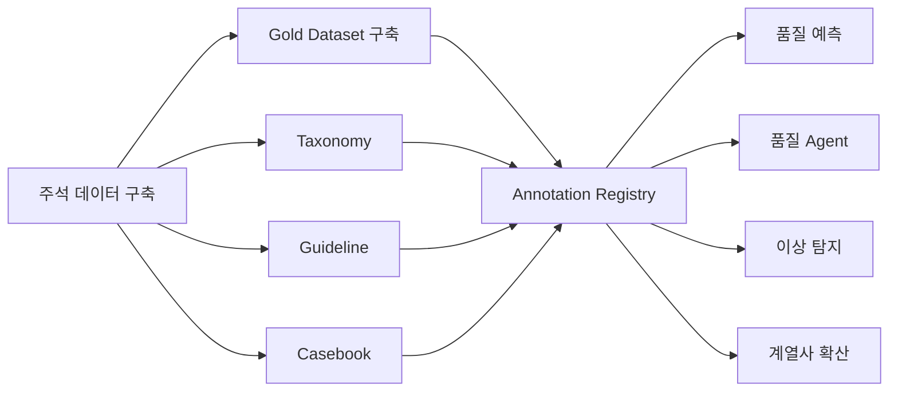

# 1. 개요

## 1.1 데이터 해설·주석이란

데이터 해설·주석(Data Annotation)은 원본 데이터에 사람이 의미 정보를 부여하여 AI가 학습하고 활용할 수 있는 형태로 전환하는 활동이다.

AI는 이미지, 문장, 로그와 같은 원본 데이터를 그대로 입력받을 수는 있지만, 해당 데이터가 무엇을 의미하는지 스스로 판단할 수는 없다. 예를 들어 외관 검사 이미지가 존재하더라도 어떤 결함인지, 어느 위치에 존재하는지, 품질에 어떤 영향을 미치는지에 대한 판단 기준이 없다면 AI는 이를 학습할 수 없다. 또한 고객 클레임 문장이 존재하더라도 어떤 원인에 대한 이야기인지, 어떤 조치가 필요한 상황인지를 이해할 수 없다.

따라서 데이터 해설·주석은 사람의 판단 기준과 업무 지식을 구조화된 형태로 기록하여 AI가 활용 가능한 학습 데이터로 전환하는 과정이며, 동시에 현업 전문가의 판단 기준을 조직의 데이터 자산으로 축적하는 활동이다.

---

## 1.2 주요 참여 조직

데이터 해설·주석은 특정 조직이 단독으로 수행하는 업무가 아니라 현업 조직, 데이터 조직, AI 조직이 함께 참여하여 공통의 판단 기준을 정의하고 이를 데이터 자산으로 구축하는 협업 활동이다.

| 조직 | 역할 |
|--------|--------|
| 전사 데이터 조직 | 표준 체계 수립 및 운영 정책 관리 |
| 현업 SME | 분류 체계 정의 및 최종 승인 |
| 데이터 조직 | Taxonomy, Guideline, 품질 체계 구축 |
| 라벨러 | 실제 Annotation 수행 |
| 검수자 | 품질 검증 및 재작업 관리 |
| AI 조직 | 자동화 및 AI 활용 체계 구축 |

특히 현업 SME는 실제 업무에서 사용되는 판단 기준을 정의하는 핵심 역할을 수행한다. 데이터 해설·주석의 목적은 단순히 데이터를 분류하는 것이 아니라 현업의 판단 기준을 데이터로 전환하는 것이므로, SME의 참여 없이 일관된 품질의 주석 데이터를 구축하기는 어렵다.

---

## 1.3 AI-ready Data 체계 내 위치

데이터 해설·주석은 AI-ready Data 체계에서 전처리 이후 단계에 위치하며, 전처리를 통해 AI가 읽을 수 있는 형태로 변환된 데이터에 의미와 맥락을 부여하여 실제 학습이 가능한 데이터로 완성하는 역할을 수행한다.


주석 결과물은 특정 프로젝트의 일회성 산출물로 사용되는 것이 아니라 Registry를 통해 관리되는 데이터 자산으로 운영되어야 하며, 향후 다양한 AI 과제에서 반복적으로 활용될 수 있는 재사용 가능한 자산으로 축적되어야 한다.

---

## 1.4 데이터 해설·주석의 최종 목표

데이터 해설·주석의 목적은 특정 AI 모델 하나를 구축하기 위한 학습 데이터를 만드는 것이 아니라 조직이 보유한 판단 기준과 업무 지식을 지속적으로 축적하고 재사용 가능한 데이터 자산으로 전환하는 데 있다.

예를 들어 동판 외관검사 AI 구축 과정에서 생성된 주석 데이터셋은 단순히 외관 검사 자동화 모델 학습에만 활용되는 것이 아니라 품질 예측, 결함 원인 분석, 이상 탐지, 품질 Agent 구축 등 다양한 AI 과제의 공통 기반 데이터로 활용될 수 있다.

- 외관 검사 자동화
- 결함 원인 분석
- 품질 예측
- 이상 탐지
- 품질 Agent
- 생성형 AI 기반 품질 지원 서비스

따라서 데이터 해설·주석은 프로젝트 단위로 생성되고 폐기되는 산출물이 아니라 지속적으로 축적·관리되는 AI-ready Data 자산으로 운영되어야 한다. 장기적으로는 AI 과제를 수행할 때마다 동일한 데이터를 반복 구축하는 것이 아니라 기존에 축적된 주석 데이터셋, Taxonomy, Guideline, Gold Dataset을 재사용함으로써 구축 비용과 시간을 지속적으로 절감하고, 계열사 전체가 활용할 수 있는 공통 데이터 자산 체계로 발전해야 한다.

---

# 2. 왜 필요한가 (Why)

AI 프로젝트에서 가장 자주 발생하는 실패 원인은 알고리즘이나 모델 성능의 부족이 아니라 학습에 활용할 수 있는 데이터의 품질과 일관성 부족이다. 많은 조직은 충분한 양의 데이터를 보유하고 있다고 생각하지만, 실제로는 AI가 학습할 수 있는 형태로 의미와 맥락이 정리된 데이터가 준비되어 있지 않은 경우가 많다. 데이터 해설·주석 체계는 이러한 문제를 해결하고 현업의 판단 기준을 AI가 활용 가능한 형태로 전환하기 위해 필요하다.

---

## 2.1 현업 Pain Point

예를 들어 두산전자가 동판 외관검사 자동화를 추진하면서 약 5만 장 규모의 결함 이미지를 확보한 사례를 가정해보자. 데이터 자체는 충분히 존재하였지만 실제 AI 모델 학습을 준비하는 과정에서는 다음과 같은 문제가 확인되었다.

- **정답 데이터의 부재:** 이미지는 존재하지만 결함 유형이 표준화되어 있지 않아 AI 학습 데이터로 직접 활용하기 어렵다.
- **판단 기준의 불일치:** 동일한 결함이라도 작업자마다 서로 다른 명칭과 기준을 사용하여 일관된 학습 데이터 구축이 어렵다.
- **운영 이력 및 품질 관리 부재:** 누가 어떤 기준으로 주석을 수행했는지 추적하기 어렵고 오류 데이터에 대한 관리 체계가 존재하지 않는다.
- **재사용 체계의 부재:** 프로젝트 종료 이후 데이터가 방치되어 다른 AI 과제에서 재활용되지 못한다.

결과적으로 데이터는 존재하지만 AI가 학습할 수 있는 정답 데이터는 부족한 상태가 되며, 동일한 데이터 정비 작업이 프로젝트마다 반복적으로 수행되는 비효율이 발생한다.

---

## 2.2 기대 효과

### 데이터 의미의 표준화

데이터 해설·주석 체계를 구축하면 사람마다 다르게 해석하던 데이터를 공통 기준으로 관리할 수 있으며, 동일한 현상에 대해 누구나 동일한 기준으로 판단할 수 있는 환경을 구축할 수 있다.

### AI 학습 품질 향상

명확하게 정의된 Taxonomy와 Guideline을 기반으로 구축된 주석 데이터는 AI 모델이 일관된 기준을 학습할 수 있도록 지원하며, 결과적으로 모델의 정확도와 신뢰도를 향상시키는 기반이 된다.

### 운영 효율 향상

AI 기반 Pre-labeling, Human-in-the-Loop, 자동 품질 검증 체계를 적용하면 반복적인 주석 작업을 줄이고 사람은 검수와 예외 처리 중심으로 참여할 수 있어 운영 효율을 높일 수 있다.

### 데이터 자산화

한 번 구축된 주석 데이터셋은 특정 프로젝트에서만 사용하는 산출물이 아니라 향후 품질 예측, 이상 탐지, Agent 구축 등 다양한 AI 과제에서 재사용 가능한 데이터 자산으로 활용될 수 있으며, 데이터 구축 비용을 장기적인 투자 자산으로 전환할 수 있다.

---

## 2.3 AI-ready Data 관점의 의미

데이터 해설·주석은 단순히 AI 모델을 학습시키기 위한 준비 작업이 아니라 현업 전문가의 판단 기준을 디지털 자산으로 전환하는 핵심 활동이다.

예를 들어 품질 전문가가 수년간 축적한 결함 판정 경험이 개인의 지식으로만 존재한다면 해당 경험은 조직 차원에서 활용하거나 확산하기 어렵다. 반면 이러한 판단 기준을 Taxonomy, Guideline, 사례집, Gold Dataset 형태로 구조화하면 조직은 이를 지속적으로 활용하고 확장할 수 있는 데이터 자산으로 전환할 수 있다.

특히 AI-ready Data 체계는 단순히 AI 프로젝트를 성공시키는 것을 목표로 하지 않는다. 장기적으로는 여러 계열사와 다양한 AI 과제에서 동일한 데이터 자산을 반복적으로 활용할 수 있도록 축적하는 것을 목표로 하며, 데이터 해설·주석은 이러한 자산화 체계를 구축하는 핵심 출발점이 된다.

따라서 데이터 해설·주석의 최종 목적은 라벨을 생성하는 것이 아니라 조직의 판단 기준을 데이터 형태로 축적하고, 이를 다양한 AI 활용 영역으로 확산할 수 있는 재사용 가능한 자산으로 만드는 것이다.

---

## 3.1 정본 모델

데이터 해설·주석 체계는 단순히 데이터에 라벨을 부여하는 작업으로 구성되지 않는다. 일관된 품질을 확보하고 장기적으로 재사용 가능한 데이터 자산을 구축하기 위해서는 분류 체계 설계부터 품질 검증, 자동화, 자산화까지 포함하는 전주기 관리 체계가 필요하며, 본 가이드는 아래 정본 모델을 기준으로 작성한다.

```text
대상 데이터 선정
→ Taxonomy 설계
→ Guideline 작성
→ Pilot Annotation
→ IAA 측정
→ 본 Annotation
→ QA
→ 자동화 및 자산화
```

데이터 해설·주석은 위 8개 단계를 통해 현업의 판단 기준을 데이터 자산으로 구조화하는 과정이며, 각 단계는 단순히 현재 프로젝트의 학습 데이터를 구축하기 위한 목적이 아니라 향후 다양한 AI 과제에서 재사용 가능한 자산을 축적하기 위한 목적을 가진다.

대상 데이터를 선정한 이후 분류 체계를 정의하고, 이를 기준으로 Guideline을 구축한다. 이후 시범 주석 작업을 통해 기준의 적절성을 검증하고 작업자 간 일관성을 확보한 뒤 본 주석 작업을 수행하며, 최종적으로 품질 검증과 자산화 과정을 거쳐 조직 차원의 데이터 자산으로 운영한다.

본 정본 모델은 5장의 구축 방법론, 7장의 KPI 및 Roadmap, Appendix의 운영 기준에서도 동일하게 활용한다.

---

## 3.2 Taxonomy 및 라벨 정의 체계

데이터 해설·주석의 품질은 결국 어떤 분류 체계를 정의하느냐에 의해 결정된다. Taxonomy는 데이터를 어떤 기준으로 구분하고 분류할 것인지 정의하는 체계이며, 향후 주석 작업, 품질 검증, AI 모델 학습, 자동화 체계의 공통 기준으로 활용된다.

좋은 Taxonomy는 다음 세 가지 조건을 충족해야 한다.

- 상호배타성
- 포괄성
- 일관성

예를 들어 동판 외관검사 데이터를 대상으로 주석 체계를 설계한다면 아래와 같은 구조를 사용할 수 있다.

```text
결함
├─ 균열
├─ 눌림
├─ 오염
└─ 긁힘
```

각 라벨은 정의서를 통해 관리하며, 동일한 의미에 대해 여러 표현이 사용되지 않도록 표준 기준을 함께 정의해야 한다.

| 코드 | 라벨 | 정의 |
|--------|--------|--------|
| DEF-01 | 균열 | 표면이 선형으로 갈라진 결함 |
| DEF-02 | 눌림 | 외부 압력에 의해 함몰된 결함 |
| DEF-03 | 오염 | 이물질 부착 |
| DEF-04 | 긁힘 | 표면 긁힘 흔적 |

Taxonomy는 단순히 현재 주석 작업의 분류 체계가 아니라 향후 AI 모델의 학습 기준이자 조직의 판단 기준을 구조화한 자산으로 관리되어야 한다.

---

### Flat vs Hierarchical Taxonomy

Taxonomy는 데이터 복잡도와 활용 목적에 따라 Flat 구조 또는 Hierarchical 구조로 설계할 수 있으며, 향후 확장 가능성까지 고려하여 선택해야 한다.

| 구분 | Flat Taxonomy | Hierarchical Taxonomy |
|--------|--------|--------|
| 구조 | 단일 레벨 | 다단계 구조 |
| 장점 | 단순, 구축·운영 용이 | 확장성 우수 |
| 단점 | 분류 수 증가 시 관리 어려움 | 설계 복잡 |
| 적용 예 | 단순 결함 분류 | 대규모 품질 체계 |

예를 들어 외관 검사 결함이 5개 이하 수준이라면 Flat 구조만으로도 충분하다.

```text
결함
├─ 균열
├─ 눌림
├─ 오염
└─ 긁힘
```

반면 결함 유형이 지속적으로 증가하거나 상위 분류 체계가 필요한 경우에는 Hierarchical 구조를 적용할 수 있다.

```text
결함
├─ 표면결함
│ ├─ 균열
│ ├─ 긁힘
│ └─ 오염
│
└─ 형상결함
  ├─ 눌림
  └─ 변형
```

초기 구축 단계에서는 관리 복잡도를 최소화하기 위해 Flat 구조를 우선 적용하고, 활용 범위가 확대되면서 분류 체계가 복잡해질 경우 Hierarchical 구조로 확장하는 방식을 권장한다.

---

## 3.3 Guideline 및 사례집

동일한 Taxonomy를 사용하더라도 작업자마다 해석 기준이 다르면 주석 품질은 크게 달라질 수 있다. 따라서 데이터 해설·주석 체계에서는 분류 기준을 문서화한 Guideline과 실제 사례를 정리한 사례집(Casebook)을 함께 구축해야 한다.

Guideline은 작업자가 어떤 기준으로 데이터를 분류해야 하는지를 정의하는 공식 기준서이며, 사례집은 해당 기준을 실제 사례를 통해 설명하는 실무 참고 자료이다.

Guideline은 일반적으로 다음 요소를 포함한다.

- 정의
- 포함 사례
- 제외 사례
- 경계 사례
- 결정 규칙

예를 들어 균열과 긁힘을 구분해야 하는 경우에는 아래와 같은 결정 규칙을 정의할 수 있다.

```text
IF 선형 갈라짐 존재
→ 균열

IF 표면 긁힘 흔적 존재
→ 긁힘

IF 판단 불가
→ SME 검토
```

사례집에는 대표 사례뿐 아니라 제외 사례와 경계 사례도 함께 포함해야 하며, 특히 작업자 간 해석 차이가 자주 발생하는 사례를 지속적으로 추가하여 품질 개선에 활용하는 것이 중요하다.

Guideline과 사례집은 일회성 교육 자료가 아니라 조직의 판단 기준을 축적하는 핵심 자산으로 관리되어야 하며, 향후 AI 자동화 체계와 계열사 확산 과정에서도 동일한 기준으로 활용될 수 있어야 한다.

---

## 3.4 데이터 유형별 주석 방식

데이터 해설·주석은 모든 데이터에 동일한 방식으로 적용되지 않으며, 데이터 유형과 AI 활용 목적에 따라 적절한 주석 방식을 선택해야 한다. 동일한 이미지 데이터라 하더라도 단순 분류가 필요한 경우와 위치 정보를 학습해야 하는 경우의 방식이 다르며, 텍스트·영상·음성 역시 활용 목적에 따라 다른 접근이 필요하다.

| 데이터 유형 | 대표 주석 방식 | 제조업 활용 예 |
|--------|--------|--------|
| 텍스트 | 문서 분류, 개체 추출, 구간 태깅 | 고객 클레임 분석 |
| 이미지 | 분류, 위치 표시, 영역 표시 | 결함 이미지 분석 |
| 영상 | 객체 추적, 이벤트 구간 표시 | 조립 공정 분석 |
| 음성 | 이벤트 탐지, 음성 전사 | 설비 이상음 분석 |

제조업에서는 이미지 데이터가 가장 대표적인 주석 대상이며, 외관 검사, 품질 검사, 설비 점검 영역을 중심으로 활용 범위가 빠르게 확대되고 있다. 따라서 단순히 주석을 수행하는 것이 아니라 과제 목적에 맞는 주석 방식을 선택하고, 향후 재사용 가능한 형태로 관리하는 것이 중요하다.

---

## 3.5 품질 기준 체계

데이터 해설·주석 체계의 품질은 개별 작업자의 숙련도에 의존하는 것이 아니라 표준화된 운영 체계를 통해 관리되어야 하며, 이를 위해 작업자 간 일관성, 기준 데이터, 최종 검증 절차를 함께 운영해야 한다.

주석 데이터 품질을 관리하기 위해 일반적으로 다음과 같은 기준을 활용한다.

| 기준 | 목적 | 설명 |
|--------|--------|--------|
| IAA (Inter-Annotator Agreement) | 작업자 간 일관성 측정 | 동일한 데이터를 여러 작업자가 주석했을 때 얼마나 동일한 결과가 나오는지 측정 |
| Gold Dataset | 품질 기준점 제공 | SME 검증이 완료된 고품질 기준 데이터셋으로 교육·품질 검증·AI 평가의 기준으로 활용 |
| QA (Quality Assurance) | 최종 품질 검증 | 최종 데이터셋이 실제 학습과 운영에 활용 가능한 수준인지 검증 |

이 세 가지 요소는 각각 독립적으로 운영되는 것이 아니라 상호 보완적으로 활용된다. 예를 들어 IAA를 통해 작업자 간 기준 일치 여부를 확인하고, Gold Dataset을 기준으로 품질 수준을 점검하며, 최종적으로 QA를 통해 실제 활용 가능 여부를 검증하는 방식으로 운영한다.

---

## 3.6 데이터셋 버전 관리

주석 데이터는 구축 이후에도 새로운 결함 유형의 등장, Taxonomy 변경, Guideline 보완, 품질 개선 활동 등에 따라 지속적으로 수정되기 때문에 일반 문서와 동일한 수준의 버전 관리 체계를 갖추어야 한다.

특히 동일한 데이터셋이라도 어떤 시점의 기준을 적용했는지에 따라 AI 모델 성능과 결과 해석이 달라질 수 있으므로, 변경 이력을 추적하고 재현 가능한 형태로 관리하는 것이 중요하다.

| 항목 | 설명 |
|--------|--------|
| 데이터셋 버전 | 버전 번호 |
| 변경 사유 | 변경 이유 |
| 작업자 | 수정 수행자 |
| 검수자 | 승인자 |
| 변경 일시 | 변경 시점 |
| 활용 이력 | 적용 모델 및 과제 |

버전 관리 체계는 단순히 변경 이력을 남기는 수준에 그치지 않는다. 어떤 데이터가 어떤 기준으로 생성되었는지 추적하고, 과거 모델 결과를 재현하며, 향후 계열사 확산 과정에서 동일한 품질 기준을 유지하기 위한 기반 역할을 수행한다.

따라서 데이터 해설·주석 체계를 구축할 때는 주석 데이터뿐 아니라 Taxonomy, Guideline, 사례집, Gold Dataset까지 포함한 통합 버전 관리 체계를 함께 설계하는 것을 권장한다.

---

# 4. 어디부터 하나 (Where)

데이터 해설·주석은 모든 데이터를 대상으로 수행해야 하는 활동이 아니다. 주석 작업은 상당한 시간과 비용이 투입되는 만큼, 사람의 판단이 중요하고 향후 AI 활용 및 재사용 가능성이 높은 데이터부터 우선적으로 적용해야 한다.

특히 AI-ready Data 관점에서는 단순히 현재 과제에 필요한 데이터를 만드는 것이 아니라 향후 다양한 AI 과제에서 반복적으로 활용할 수 있는 데이터 자산을 구축하는 것이 중요하므로, 데이터의 활용 가치와 확장성을 함께 고려하여 우선순위를 결정해야 한다.

---

## 4.1 주석 대상 선정 기준

주석 대상은 단순히 데이터 보유 여부만으로 결정해서는 안 되며, 사람의 판단 개입 수준과 향후 활용 가능성을 함께 고려해야 한다.

일반적으로 다음 다섯 가지 기준을 활용하여 우선순위를 평가할 수 있다.

| 기준 | 설명 |
|--------|--------|
| 사람의 판단 필요성 | 사람의 해석이 있어야 의미를 이해할 수 있는가 |
| AI 활용 가능성 | AI 과제에 활용될 가능성이 높은가 |
| 데이터 확보 수준 | 충분한 데이터가 존재하는가 |
| 품질 영향도 | 업무 결과에 직접적인 영향을 미치는가 |
| 재사용 가능성 | 향후 다른 AI 과제에서도 활용 가능한가 |

예를 들어 외관 검사 이미지는 결함 여부와 유형을 사람이 판단해야 하고, AI 활용 가능성이 높으며, 품질 업무와 직접 연결되기 때문에 대표적인 주석 대상에 해당한다.

반면 이미 구조화된 코드 데이터나 단순 수치 데이터는 사람의 해석 없이도 의미를 이해할 수 있으므로 주석 우선순위가 상대적으로 낮다.

---

## 4.2 우선 적용 대상

제조업 환경에서는 사람의 경험과 판단 기준이 포함되어 있는 데이터가 주석 대상이 되는 경우가 많으며, 특히 아래와 같은 데이터는 AI 활용 가치와 재사용 가능성이 높아 우선 적용 대상으로 고려할 수 있다.

| 데이터 유형 | 주석이 필요한 이유 | 우선순위 |
|--------|--------|--------|
| 결함 이미지 | 결함 유형과 위치를 사람이 판단해야 함 | 높음 |
| 고객 클레임 | 원인과 조치 유형이 자연어에 포함됨 | 높음 |
| 설비 이상 이력 | 이상 유형과 원인 해석이 필요함 | 중간 |
| 시험 결과 보고서 | 판정 기준과 조치 결과가 서술형으로 존재함 | 중간 |
| 일반 생산 실적 | 이미 구조화된 수치·코드 중심 | 낮음 |

특히 결함 이미지와 고객 클레임 데이터는 외관 검사 자동화, 품질 예측, 원인 분석, Agent 구축 등 다양한 AI 과제로 확장될 수 있기 때문에 단일 프로젝트 관점이 아니라 장기적인 데이터 자산 구축 관점에서 우선 투자 가치가 높다.

---

## 4.3 적용하지 않아도 되는 경우

모든 데이터에 주석을 적용하는 것이 반드시 좋은 것은 아니다. 사람의 판단이 개입되지 않거나 활용 목적이 불명확한 경우에는 별도의 주석 체계를 구축하기보다 다른 AI-ready Data 주제를 통해 관리하는 것이 더 적절할 수 있다.

| 유형 | 판단 기준 | 처리 방향 |
|--------|--------|--------|
| 이미 코드값으로 관리되는 데이터 | 사람의 해석 없이 의미가 명확함 | 별도 주석 불필요 |
| 단순 수치 데이터 | 라벨보다 품질·이상치 관리가 중요함 | 데이터 품질 관리 대상으로 처리 |
| OCR 전 원본 문서 | 아직 AI가 읽을 수 있는 형태가 아님 | 전처리 이후 주석 검토 |
| 활용 과제가 불명확한 데이터 | 재사용 목적이 없음 | 우선순위 낮음 |
| 기준 합의가 불가능한 데이터 | SME 간 판단 기준 불일치 | Guideline 선행 필요 |

예를 들어 온도, 압력, 전류와 같은 설비 센서 데이터는 주석보다 품질 관리, 이상 탐지, 시계열 분석 체계가 더 중요하다. 반면 고객 클레임 문서처럼 사람의 해석이 필요한 자연어 데이터는 주석을 통해 의미 구조를 부여해야 AI 활용 가치가 높아진다.

---

## 4.4 주석 착수 전 확인 사항

주석 작업은 데이터가 존재한다는 이유만으로 시작해서는 안 되며, 실제 활용 목적과 운영 체계가 준비되어 있는지 먼저 확인해야 한다.

주석 작업 착수 전 최소한 다음 항목을 점검하는 것을 권장한다.

| 확인 항목 | 확인 질문 |
|--------|--------|
| AI 활용 목적 | 이 데이터를 활용할 AI 과제가 정의되어 있는가 |
| 현업 기준 | SME가 판단 기준을 설명할 수 있는가 |
| 데이터 확보 | 충분한 샘플이 확보되어 있는가 |
| 품질 기준 | 주석 결과를 검증할 기준이 있는가 |
| 재사용 가능성 | 다른 과제에서도 활용 가능한가 |

특히 마지막 항목인 재사용 가능성은 AI-ready Data 관점에서 매우 중요하다. 동일한 데이터를 여러 과제에서 활용할 수 없다면 주석 구축 비용은 일회성 비용으로 끝나지만, 다양한 AI 과제에서 반복 활용할 수 있다면 해당 데이터는 장기적으로 조직의 핵심 데이터 자산으로 축적될 수 있다.

따라서 주석 작업은 단순히 현재 프로젝트를 위한 준비 작업이 아니라 향후 조직이 지속적으로 활용할 수 있는 데이터 자산을 구축한다는 관점에서 착수 여부를 판단해야 한다.

---

# 5. 어떻게 구축·운영하나 (How)

본 장은 데이터 해설·주석 체계를 실제 제조업 환경에서 구축하고 운영하는 전체 과정을 설명한다. 단순히 주석 작업을 수행하는 절차를 설명하는 것이 아니라, 현업의 판단 기준을 장기적으로 재사용 가능한 데이터 자산으로 구축하는 방법론을 제시하는 데 목적이 있다.

본 장에서는 두산전자 외관검사 사례를 예시로 활용하여 각 단계에서 무엇을 수행해야 하는지와 실제 현장에서 어떤 문제가 발생하는지를 함께 설명한다.

본 가이드는 아래 정본 모델을 기준으로 작성한다.

```text
대상 데이터 선정
→ Taxonomy 설계
→ Guideline 작성
→ Pilot Annotation
→ IAA 측정
→ 본 Annotation
→ QA
→ 자동화 및 자산화
```

---

## 5.1 대상 데이터 선정

### 목적

주석 작업의 첫 단계는 모든 데이터를 대상으로 하는 것이 아니라 AI 활용 가치와 재사용 가능성이 높은 데이터를 선별하는 것이다. 데이터 해설·주석은 상당한 비용과 시간이 투입되는 활동이므로 현재 프로젝트뿐 아니라 향후 다양한 AI 과제에서 활용될 수 있는 데이터를 우선 선정해야 한다.

### 주요 수행 작업

- 후보 데이터 목록 작성
- AI 활용 가능성 평가
- 현업 중요도 평가
- 재사용 가능성 평가
- 우선순위 선정

### 두산전자 사례

예를 들어 두산전자가 외관 검사 자동화를 추진하면서 보유 데이터 현황을 분석한 결과 다음과 같은 데이터가 확인되었다.

| 데이터 | 활용 가능성 |
|--------|--------|
| 외관 검사 이미지 | 높음 |
| 고객 클레임 | 높음 |
| 생산 실적 | 중간 |
| 설비 로그 | 중간 |

검토 결과 외관 검사 이미지는 AI 활용 가능성이 높고 품질 예측, 이상 탐지, 품질 Agent 등 다양한 활용 시나리오로 확장할 수 있다는 점에서 가장 우선적인 주석 대상으로 선정되었다.

### 산출물

- 대상 데이터 목록
- 우선순위 평가표
- 적용 범위 정의서

### 완료 기준

- 대상 데이터 확정
- SME 승인 완료
- 재사용 시나리오 정의 완료

---

## 5.2 Taxonomy 설계

### 목적

Taxonomy 설계는 데이터를 어떤 기준으로 구분하고 분류할 것인지 정의하는 단계이며, 이후 모든 주석 작업과 AI 학습의 기준이 되는 핵심 활동이다.

### 주요 수행 작업

- 현업 인터뷰
- 기존 분류 체계 분석
- 라벨 체계 설계
- SME 승인

### 두산전자 사례

초기 분석 결과 동일한 결함이 여러 표현으로 기록되고 있었다.

| 현업 표현 | 통합 라벨 |
|--------|--------|
| 갈라짐 | 균열 |
| 크랙 | 균열 |
| 금감 | 균열 |
| 찍힘 | 눌림 |
| 흠집 | 긁힘 |

품질혁신팀과 데이터 조직은 아래와 같은 공통 Taxonomy를 정의하였다.

```text
결함
├─ 균열
├─ 눌림
├─ 오염
└─ 긁힘
```

이 과정에서 중요한 것은 현재 프로젝트만을 고려하는 것이 아니라 향후 새로운 결함 유형이 추가되거나 다른 계열사에서 활용될 가능성까지 고려하여 확장 가능한 구조를 설계하는 것이다.

### 산출물

- Taxonomy 정의서
- 라벨 코드 체계
- 라벨 정의서

### 완료 기준

- Taxonomy 승인 완료
- 표준 라벨 체계 확정
- 향후 확장 구조 검토 완료

---

## 5.3 Guideline 및 사례집 구축

### 목적

Taxonomy가 무엇을 분류할 것인지를 정의한다면 Guideline은 어떻게 분류할 것인지를 정의한다. 동일한 Taxonomy를 사용하더라도 작업자마다 판단 기준이 다르면 데이터 품질이 크게 달라지기 때문에 명확한 Guideline 구축이 필요하다.

### 주요 수행 작업

- 포함 사례 정의
- 제외 사례 정의
- 경계 사례 정의
- 결정 규칙 작성
- 사례집 구축

### 두산전자 사례

품질팀 인터뷰 결과 가장 큰 혼동은 균열과 긁힘을 구분하는 과정에서 발생하였다.

이에 따라 아래와 같은 판단 기준을 정의하였다.

```text
IF 선형 갈라짐 존재
→ 균열

IF 표면 긁힘 흔적 존재
→ 긁힘

IF 판단 불가
→ SME 검토
```

또한 실제 이미지 사례를 기반으로 대표 사례, 제외 사례, 경계 사례를 정리한 사례집을 함께 구축하여 작업자 교육과 품질 검증에 활용하였다.

### 산출물

- Guideline
- 사례집(Casebook)
- 결정 규칙

### 완료 기준

- Guideline 승인 완료
- 사례집 구축 완료
- 작업자 교육 완료

---

## 5.4 Pilot Annotation

### 목적

Pilot Annotation은 본격적인 구축 이전에 정의된 Taxonomy와 Guideline이 실제 현장에서 일관되게 적용 가능한지 검증하기 위한 단계이다.

### 주요 수행 작업

- 샘플 데이터 선정
- 독립 주석 수행
- 불일치 사례 분석
- 기준 개선 과제 도출

### 두산전자 사례

두산전자는 외관 검사 이미지 500장을 선정하여 라벨러 3인이 독립적으로 주석을 수행하도록 하였다.

Pilot 결과 다음과 같은 문제가 확인되었다.

- 균열과 긁힘 간 판단 차이
- 일부 경계 사례 해석 불일치
- 작업자별 라벨 편차 존재

분석 결과 단순히 작업자 숙련도 문제가 아니라 Guideline 자체가 충분히 구체적이지 않았다는 점이 확인되었고, 이후 대표 사례와 결정 규칙을 추가하여 기준을 보완하였다.

### 산출물

- Pilot Dataset
- 불일치 사례 목록
- 개선 과제 목록

### 완료 기준

- Pilot 완료
- 주요 불일치 원인 분석 완료
- Guideline 개선안 도출 완료

---

## 5.5 IAA 측정 및 기준 개선

### 목적

Pilot Annotation 결과를 바탕으로 작업자 간 판단 기준이 얼마나 일관되게 적용되는지 측정하고, 불일치 원인을 분석하여 Guideline을 개선한다. 데이터 해설·주석의 목적은 단순히 데이터를 분류하는 것이 아니라 조직의 판단 기준을 구조화하는 것이므로, 작업자마다 다른 결과가 나온다면 해당 기준은 아직 자산화되었다고 보기 어렵다.

### 주요 수행 작업

- IAA 측정
- 불일치 사례 분석
- Guideline 개선
- 사례집 보완

### 두산전자 사례

Pilot 결과를 분석한 결과 다음과 같은 결과가 나타났다.

| 결함 유형 | IAA |
|--------|--------|
| 균열 | 0.83 |
| 눌림 | 0.86 |
| 오염 | 0.88 |
| 긁힘 | 0.61 |

분석 결과 긁힘과 균열의 경계가 모호하여 작업자별 해석 차이가 크게 발생하는 것으로 확인되었다. 품질혁신팀은 경계 사례를 추가 확보하고 대표 사례를 보강하여 Guideline을 수정하였다.

재측정 결과는 다음과 같았다.

| 결함 유형 | 개선 후 IAA |
|--------|--------|
| 균열 | 0.87 |
| 눌림 | 0.88 |
| 오염 | 0.90 |
| 긁힘 | 0.79 |

### 산출물

- IAA 결과 보고서
- 불일치 분석 보고서
- Guideline 개선안

### 완료 기준

- 목표 IAA 달성
- 주요 불일치 원인 해소
- Guideline 보완 완료

---

## 5.6 본 Annotation

### 목적

검증된 Taxonomy와 Guideline을 기반으로 실제 운영 데이터를 주석하여 조직의 학습 데이터 자산을 구축한다.

### 주요 수행 작업

- Annotation 수행
- 작업 이력 관리
- 품질 모니터링
- 버전 관리

### 두산전자 사례

기준 검증이 완료된 이후 전체 5만 장의 외관 검사 이미지를 대상으로 본 Annotation을 수행하였다.

```text
Annotation 수행
→ 검수
→ SME 승인
→ Dataset 등록
```

이 단계에서 생성되는 결과물은 특정 AI 모델만을 위한 학습 데이터가 아니라 향후 품질 예측, 이상 탐지, 품질 Agent 등 다양한 AI 과제에서 재사용할 수 있는 공통 데이터 자산으로 관리하였다.

### 산출물

- Annotation Dataset
- Annotation Log
- 작업 이력
- 버전 정보

### 완료 기준

- 전체 데이터 처리 완료
- 품질 기준 충족
- Dataset 등록 완료

---

## 5.7 QA

### 목적

최종 데이터셋이 실제 AI 학습 및 운영에 활용 가능한 수준인지 검증하고, 조직의 표준 데이터 자산으로 등록하기 위한 품질 검증을 수행한다.

### 주요 수행 작업

- 샘플 검수
- 오류 분석
- 재작업 수행
- 최종 승인

### 두산전자 사례

QA 단계에서는 다음 항목을 중심으로 품질을 검증하였다.

| 항목 | 목적 |
|--------|--------|
| 라벨 정확도 | 오류 제거 |
| 일관성 | 기준 유지 |
| 누락 여부 | 데이터 완전성 확보 |
| 버전 검증 | 변경 이력 관리 |

QA를 통과한 데이터만 최종 학습 데이터셋으로 승인하였으며, 승인된 데이터는 이후 Gold Dataset 후보로 활용할 수 있도록 별도 관리하였다.

### 산출물

- QA 결과 보고서
- 승인 데이터셋
- 품질 개선 이력

### 완료 기준

- QA 승인
- 재작업 완료
- Gold Dataset 후보 선정 완료

---

## 5.8 자동화 및 자산화

### 목적

데이터 해설·주석 체계의 최종 목적은 데이터를 한 번 구축하고 끝내는 것이 아니라 반복적으로 축적·재사용되는 데이터 자산 체계를 만드는 것이다. 따라서 일정 규모 이상의 데이터가 확보되면 사람 중심의 수작업 체계에서 벗어나 주석 자동화와 자산화를 동시에 추진해야 하며, 구축된 결과물을 다양한 AI 과제와 계열사가 재사용할 수 있는 형태로 관리해야 한다.

### 주요 수행 작업

- AI 기반 주석 자동화
- Active Learning 적용
- Weak Supervision 적용
- Gold Dataset 구축
- Annotation Registry 구축
- 데이터 재사용 체계 구축

### 두산전자 사례

두산전자는 일정 수준 이상의 주석 데이터가 확보된 이후 AI 기반 Pre-labeling을 도입하여 반복적인 주석 작업을 줄이고 검수 중심의 운영 체계로 전환하였다. 또한 운영 과정에서 AI가 판단하기 어려워하는 데이터를 우선 검토하는 Active Learning 방식을 적용하여 데이터 구축 효율을 높였으며, 기존 품질 판정 이력과 검사 결과를 활용하여 일부 데이터를 자동 분류하는 체계도 함께 구축하였다.

이를 통해 주석 작업의 생산성을 높이는 동시에 구축된 데이터를 품질 예측, 이상 탐지, 품질 Agent 등 다양한 AI 과제에서 재사용할 수 있는 기반을 마련하였다.

---



---

### AI 기반 주석 자동화

초기에는 사람이 직접 모든 데이터를 주석하지만 일정 규모 이상의 데이터가 확보되면 AI를 활용하여 1차 주석 결과를 자동 생성할 수 있다.

```text
AI 1차 주석
→ 작업자 검토
→ 검수자 승인
→ Dataset 반영
```

이러한 Pre-labeling 방식은 반복적인 작업 부담을 줄이고 작업자의 역할을 검수와 예외 처리 중심으로 전환할 수 있도록 지원한다.

### Active Learning

모든 데이터를 동일한 수준으로 주석하는 것은 비효율적일 수 있다. 따라서 AI가 가장 판단하기 어려워하거나 불확실성이 높은 데이터를 우선적으로 선별하여 사람의 검토를 수행하는 Active Learning 방식을 적용할 수 있다.

```text
모델 학습
→ 불확실 데이터 추출
→ SME 검토
→ Dataset 반영
→ 재학습
```

이를 통해 동일한 비용으로 더 높은 품질의 데이터셋을 구축할 수 있으며, 데이터 구축 효율도 지속적으로 향상시킬 수 있다.

### Weak Supervision

기존 업무 시스템에 존재하는 코드값, 품질 판정 결과, 검사 이력, 업무 규칙 등을 활용하면 일부 데이터를 자동으로 라벨링할 수 있다.

예를 들어 품질 검사 결과에 이미 존재하는 판정 코드나 고객 클레임 분류 체계를 활용하면 초기 데이터셋을 빠르게 구축할 수 있으며, 이후 사람의 검토를 통해 품질을 보완할 수 있다.

### Gold Dataset 구축

모든 데이터를 동일한 수준으로 관리할 필요는 없으며, 전문가 검증이 완료된 대표 데이터셋은 별도의 Gold Dataset으로 관리하는 것이 바람직하다.

Gold Dataset은 다음과 같은 목적으로 활용된다.

- 작업자 교육
- 품질 검증
- AI 성능 평가
- Guideline 검증
- 계열사 공통 기준 제공

Gold Dataset은 조직의 판단 기준이 가장 명확하게 반영된 핵심 데이터 자산으로 관리되어야 한다.

### Annotation Registry 구축

주석 데이터는 Dataset만 관리해서는 충분하지 않다. 향후 재사용을 위해서는 관련 자산 전체를 함께 관리해야 한다.

| 자산 | 관리 대상 |
|--------|--------|
| Annotation Dataset | 주석 데이터셋 |
| Taxonomy | 분류 체계 |
| Guideline | 주석 기준 |
| Casebook | 사례집 |
| Gold Dataset | 기준 데이터 |
| 활용 이력 | 적용 AI 과제 |

Annotation Registry는 이러한 자산을 통합 관리하는 저장소 역할을 수행하며, 향후 새로운 AI 과제를 수행할 때 기존 자산을 검색하고 재사용할 수 있도록 지원한다.

### 데이터 재사용 체계 구축

데이터 해설·주석 체계의 궁극적인 목표는 AI 과제를 수행할 때마다 동일한 데이터를 반복 구축하지 않는 것이다.

```text
외관 검사 Dataset 구축
→ Registry 등록
→ 품질 예측 활용
→ 품질 Agent 활용
→ 계열사 확산
→ 신규 Dataset 축적
```

예를 들어 특정 계열사에서 구축한 외관 검사 데이터셋은 이후 품질 예측, 결함 원인 분석, 품질 Agent 구축 등에 활용될 수 있으며, 유사한 업무를 수행하는 다른 계열사에서도 재사용할 수 있다.

장기적으로는 새로운 AI 과제를 시작할 때 전체 데이터를 처음부터 구축하는 것이 아니라 기존에 축적된 Dataset, Taxonomy, Guideline, Gold Dataset을 기반으로 부족한 부분만 추가 구축하는 체계로 발전해야 한다.

### 산출물

- Annotation Registry
- Gold Dataset Pool
- 자동화 운영 체계
- 재사용 가이드

### 완료 기준

- Registry 등록 완료
- Gold Dataset 구축 완료
- 자동화 체계 운영 시작
- 재사용 체계 수립
- 계열사 확산 준비 완료

---

# 6. 다른 주제와의 관계

데이터 해설·주석은 AI-ready Data 체계에서 데이터에 의미와 판단 기준을 부여하는 역할을 수행한다. 그러나 AI가 활용 가능한 데이터를 구축하기 위해서는 전처리, 품질 관리, 온톨로지, 평가 데이터 등 다양한 주제와 연계되어야 하며, 각각의 주제가 담당하는 역할을 명확히 구분할 필요가 있다.

데이터 해설·주석은 단독으로 존재하는 활동이 아니라 AI-ready Data 체계 내 여러 주제를 연결하는 허브 역할을 수행하며, 특히 현업의 판단 기준을 데이터 형태로 전환하는 과정에서 다양한 주제와 밀접하게 연계된다.

---

## 6.1 데이터 전처리와의 관계

데이터 전처리는 데이터를 AI가 읽을 수 있는 형태로 변환하는 활동이며, 데이터 해설·주석은 전처리가 완료된 데이터에 의미 정보를 부여하는 활동이다.

예를 들어 PDF 형태의 검사 보고서를 텍스트로 추출하거나 이미지를 구조화된 형태로 변환하는 것은 데이터 전처리의 영역이다. 반면 전처리된 데이터에 결함 유형, 원인 유형, 조치 유형 등의 의미 정보를 부여하는 것은 데이터 해설·주석의 영역이다.

| 구분 | 데이터 전처리 | 데이터 해설·주석 |
|--------|--------|--------|
| 목적 | 읽을 수 있는 형태로 변환 | 의미와 판단 기준 부여 |
| 입력 | 원본 데이터 | 전처리 완료 데이터 |
| 산출물 | 구조화 데이터 | 주석 데이터셋 |
| 핵심 질문 | AI가 읽을 수 있는가 | AI가 이해할 수 있는가 |

데이터 전처리가 완료되지 않으면 주석 자체를 수행하기 어렵기 때문에 일반적으로 전처리가 선행되고 이후 데이터 해설·주석이 수행된다.

---

## 6.2 비즈니스 Glossary와의 관계

비즈니스 Glossary는 조직 내 용어의 의미를 정의하는 체계이며, 데이터 해설·주석은 실제 데이터를 해당 용어 기준으로 분류하는 체계이다.

예를 들어 "균열"이라는 용어를 정의하는 것은 Glossary의 역할이고, 실제 이미지를 "균열"로 분류하는 것은 데이터 해설·주석의 역할이다.

| 구분 | 비즈니스 Glossary | 데이터 해설·주석 |
|--------|--------|--------|
| 관리 대상 | 용어 | 데이터 |
| 목적 | 의미 정의 | 의미 적용 |
| 산출물 | 표준 용어집 | 주석 데이터셋 |
| 활용 방식 | 기준 제공 | 기준 적용 |

Glossary가 없다면 동일한 현상을 여러 용어로 표현하게 되고, 데이터 해설·주석 품질 역시 일관성을 유지하기 어렵다. 따라서 Glossary는 데이터 해설·주석 체계의 기준 정보를 제공하는 역할을 수행한다.

---

## 6.3 온톨로지와의 관계

온톨로지는 개념 간 관계를 정의하는 체계이며, 데이터 해설·주석은 개별 데이터를 특정 개념에 연결하는 체계이다.

예를 들어 "균열"이라는 결함을 정의하고 해당 이미지에 균열 라벨을 부여하는 것은 데이터 해설·주석의 역할이다. 반면 균열이 어떤 설비와 관련되고, 어떤 공정에서 발생하며, 어떤 품질 이슈와 연결되는지를 정의하는 것은 온톨로지의 역할이다.

| 구분 | 온톨로지 | 데이터 해설·주석 |
|--------|--------|--------|
| 목적 | 개념 간 관계 정의 | 데이터 의미 정의 |
| 관리 단위 | 개념·관계 | 데이터 |
| 활용 | 추론·검색·지식 연결 | 학습 데이터 구축 |
| 결과 | 지식 구조 | 주석 데이터셋 |

데이터 해설·주석이 개별 데이터의 의미를 정의한다면, 온톨로지는 이러한 의미들을 연결하여 조직의 지식 구조를 구축하는 역할을 수행한다.

---

## 6.4 데이터 품질 관리와의 관계

데이터 품질 관리는 데이터가 활용 가능한 수준의 품질을 확보하는 활동이며, 데이터 해설·주석은 학습에 활용할 의미 데이터를 생성하는 활동이다.

| 구분 | 데이터 품질 관리 | 데이터 해설·주석 |
|--------|--------|--------|
| 목적 | 데이터 품질 확보 | 의미 정보 생성 |
| 관리 대상 | 데이터 자체 | 데이터 의미 |
| 결과 | 사용 가능 여부 판단 | 학습 데이터 구축 |
| 관점 | 품질 기준 | 의미 기준 |

주석 데이터 역시 데이터 품질 관리의 대상이 되며, 오류·누락·불일치 여부를 지속적으로 점검해야 한다. 따라서 데이터 품질 관리는 데이터 해설·주석 결과물의 신뢰성을 확보하는 역할을 수행한다.

---

## 6.5 AI 평가 데이터와의 관계

데이터 해설·주석과 AI 평가 데이터는 모두 정답 데이터를 다루지만 목적이 다르다.

데이터 해설·주석은 AI를 학습시키기 위한 데이터를 구축하는 활동이고, AI 평가 데이터는 학습이 완료된 모델의 성능을 검증하기 위한 데이터를 구축하는 활동이다.

| 구분 | 데이터 해설·주석 | AI 평가 데이터 |
|--------|--------|--------|
| 목적 | 학습 | 평가 |
| 활용 시점 | 모델 학습 전 | 모델 학습 후 |
| 규모 | 대규모 | 소규모·고품질 |
| 역할 | 가르치는 정답 | 채점하는 정답 |

동일한 데이터가 학습 데이터와 평가 데이터로 동시에 사용될 경우 평가 결과가 왜곡될 수 있으므로, 두 데이터셋은 명확하게 분리하여 운영해야 한다.

---

## 6.6 데이터 Feedback Loop와의 관계

데이터 해설·주석은 구축 이후에도 지속적으로 개선되어야 하며, 운영 과정에서 발견되는 오류와 사용자 피드백은 데이터 Feedback Loop를 통해 다시 주석 체계로 반영되어야 한다.

```text
AI 오분류 발생
→ Feedback 수집
→ 원인 분석
→ Guideline 보완
→ 주석 데이터 수정
→ 재학습
```

예를 들어 운영 과정에서 특정 결함 유형에 대한 오분류가 반복적으로 발생한다면 단순히 모델만 수정하는 것이 아니라 Guideline, 사례집, Taxonomy 자체를 함께 점검해야 한다.

따라서 데이터 Feedback Loop는 데이터 해설·주석 체계를 지속적으로 개선하고 자산의 품질을 높이는 핵심 메커니즘이며, 장기적으로는 조직의 판단 기준을 계속 발전시키는 역할을 수행한다.

---

# 7. KPI 및 Roadmap

데이터 해설·주석은 프로젝트 단위 구축 활동으로 끝나서는 안 되며, 지속적인 품질 관리와 자산 축적, 자동화, 재사용 확산 여부를 함께 측정해야 한다.

특히 AI-ready Data 관점에서는 단순히 얼마나 많은 데이터를 구축했는지가 아니라 얼마나 재사용되고 있는지, 얼마나 많은 AI 과제에 활용되고 있는지, 계열사 전반으로 얼마나 확산되고 있는지를 함께 관리하는 것이 중요하다.

---

## 7.1 KPI

### 품질 KPI

품질 KPI는 주석 데이터의 정확성과 일관성을 측정하기 위한 지표이며, 데이터 해설·주석 체계의 가장 기본적인 운영 수준을 나타낸다.

| KPI | 정의 | 측정 방식 |
|--------|--------|--------|
| IAA | 작업자 간 일치도 | Cohen's Kappa 등 |
| 라벨 오류율 | 잘못된 주석 비율 | 오류 건수 / 전체 건수 |
| QA 통과율 | 품질 검수 통과 비율 | 통과 건수 / 전체 건수 |
| Gold Dataset 적합률 | Gold Dataset 기준 충족 비율 | 적합 데이터 / 검증 데이터 |

---

### 생산성 KPI

생산성 KPI는 주석 구축 효율과 운영 생산성을 측정한다.

| KPI | 정의 | 측정 방식 |
|--------|--------|--------|
| 처리량 | 시간당 주석 건수 | 총 건수 / 작업 시간 |
| 건당 비용 | 주석 1건당 비용 | 총 비용 / 총 건수 |
| 리드타임 | 구축 완료 기간 | 종료일 - 시작일 |
| 자동화율 | AI 지원 주석 비율 | 자동 생성 건수 / 전체 건수 |

---

### 운영 KPI

운영 KPI는 주석 체계가 안정적으로 운영되고 있는지를 측정한다.

| KPI | 정의 | 측정 방식 |
|--------|--------|--------|
| 재작업률 | 수정 필요 비율 | 재작업 건수 / 전체 건수 |
| Guideline 변경 건수 | 기준 변경 빈도 | 월간 변경 건수 |
| 버전 변경 건수 | Dataset 변경 빈도 | 월간 변경 건수 |
| 운영 오류 건수 | 운영 중 발생한 오류 | 월간 집계 |

---

### 자동화 KPI

자동화 KPI는 사람 중심 작업에서 AI 기반 운영 체계로 전환되는 수준을 측정한다.

| KPI | 정의 | 측정 방식 |
|--------|--------|--------|
| AI Pre-label 채택률 | AI 주석 승인 비율 | 승인 건수 / AI 생성 건수 |
| 자동 처리율 | 사람 개입 없는 처리 비율 | 자동 처리 건수 / 전체 건수 |
| 검수 절감률 | 기존 대비 검수 감소 수준 | 감소율 |
| Active Learning 적용률 | 불확실 데이터 우선 검토 비율 | 적용 건수 / 전체 건수 |

---

### 자산화 KPI

자산화 KPI는 데이터가 실제 조직 자산으로 축적되고 있는지를 측정한다.

| KPI | 정의 | 측정 방식 |
|--------|--------|--------|
| Registry 등록률 | 자산 등록 비율 | 등록 자산 / 전체 자산 |
| Gold Dataset 누적 규모 | 누적 기준 데이터 수 | Dataset 건수 |
| Dataset 재사용률 | 재사용 비율 | 재사용 Dataset / 전체 Dataset |
| Annotation 자산 증가율 | 연간 자산 증가 규모 | 전년 대비 증가율 |

---

### 확산 KPI

확산 KPI는 구축된 데이터 자산이 실제 AI 과제와 계열사에서 얼마나 활용되고 있는지를 측정한다.

| KPI | 정의 | 측정 방식 |
|--------|--------|--------|
| 활용 AI 과제 수 | Dataset 활용 과제 수 | 누적 과제 수 |
| 재사용 기반 과제 비율 | 기존 Dataset 활용 과제 비율 | 재사용 과제 / 전체 과제 |
| 계열사 적용률 | 계열사 확산 수준 | 적용 계열사 수 |
| 신규 구축 절감률 | 기존 자산 재활용에 따른 구축 감소율 | 절감 공수 기준 |

---

## 7.2 Roadmap

### Phase 1. Preparation

#### 목표

주석 체계 구축 기반 확보

#### 주요 활동

- 대상 데이터 선정
- Taxonomy 설계
- Guideline 구축
- 사례집 구축
- Pilot 수행

#### 산출물

- Taxonomy
- Guideline
- 사례집
- Pilot Dataset

#### 전환 기준

- Pilot 완료
- Guideline 승인
- 목표 IAA 확보

---

### Phase 2. AI Ready

#### 목표

표준 주석 체계 구축

#### 주요 활동

- 본 Annotation 수행
- QA 수행
- 버전 관리 체계 구축
- Gold Dataset 구축

#### 산출물

- Annotation Dataset
- Gold Dataset
- 품질 기준
- 운영 체계

#### 전환 기준

- 품질 KPI 목표 달성
- QA 체계 정착
- Registry 등록 완료

---

### Phase 3. Automation

#### 목표

주석 자동화 확대

#### 주요 활동

- AI Pre-label 적용
- Active Learning 적용
- Weak Supervision 적용
- 자동 QA 체계 구축

#### 산출물

- 자동화 파이프라인
- AI 지원 Annotation 체계
- 자동 품질 검증 체계

#### 전환 기준

- 자동 처리율 목표 달성
- AI Pre-label 채택률 목표 달성
- 자동화 KPI 안정화

---

### Phase 4. Assetization & Expansion

#### 목표

주석 데이터를 조직 공통 자산으로 운영

#### 주요 활동

- Annotation Registry 구축
- Gold Dataset Pool 구축
- 공통 Taxonomy 구축
- 데이터 재사용 체계 구축
- 계열사 확산

#### 산출물

- Annotation Registry
- Gold Dataset Pool
- 재사용 가이드
- 계열사 확산 체계

#### 전환 기준

- 다수 AI 과제 재사용 달성
- 계열사 확산 완료
- 신규 과제 재사용 기반 구축 정착

---

# Appendix A. 주요 용어

## 데이터 해설·주석 (Data Annotation)

원본 데이터에 사람의 판단 기준과 의미 정보를 부여하여 AI가 학습하고 활용할 수 있는 형태로 전환하는 활동이다.

데이터 해설·주석은 단순히 데이터를 분류하는 작업이 아니라 현업의 판단 기준을 구조화하고 재사용 가능한 데이터 자산으로 축적하는 과정을 의미한다.

---

## 라벨링 (Labeling)

데이터 해설·주석 과정에서 데이터에 특정 분류값이나 태그를 부여하는 작업을 의미한다.

예를 들어 이미지에 결함 유형을 지정하거나 문서에 원인 유형을 분류하는 작업이 이에 해당한다.

라벨링은 데이터 해설·주석을 수행하기 위한 대표적인 방법 중 하나이다.

---

## Taxonomy

데이터를 어떤 기준으로 분류할 것인지 정의하는 체계이다.

주석 품질은 Taxonomy 품질에 크게 영향을 받으며, 이후 Guideline, 품질 검증, AI 학습의 기준으로 활용된다.

---

## Guideline

작업자들이 동일한 기준으로 데이터를 분류할 수 있도록 정의한 규칙 문서이다.

포함 사례, 제외 사례, 경계 사례, 결정 규칙 등을 포함하며 주석 품질의 일관성을 확보하기 위한 기준서 역할을 수행한다.

---

## 사례집 (Casebook)

대표 사례, 제외 사례, 경계 사례를 정리한 자료이다.

Guideline을 실제 사례로 설명하고 작업자 교육, 품질 검증, 기준 개선 활동에 활용한다.

---

## SME

현업 전문가를 의미한다.

Taxonomy 정의, Guideline 검증, 경계 사례 판단, 최종 품질 승인 등의 역할을 수행한다.

---

## IAA (Inter-Annotator Agreement)

동일한 데이터를 여러 작업자가 주석했을 때 얼마나 동일한 결과가 나오는지를 측정하는 지표이다.

작업자 간 판단 기준의 일관성을 검증하기 위해 활용한다.

---

## Gold Dataset

전문가 검증이 완료된 고품질 기준 데이터셋이다.

작업자 교육, 품질 검증, AI 평가, Guideline 검증을 위한 기준 데이터로 활용한다.

---

## Annotation Registry

주석 데이터와 관련 자산을 통합 관리하는 저장소이다.

Dataset뿐 아니라 Taxonomy, Guideline, 사례집, Gold Dataset, 활용 이력 등을 함께 관리한다.

---

## Human-in-the-Loop (HITL)

AI가 생성한 결과를 사람이 검토·수정하는 운영 방식이다.

주석 자동화 과정에서 품질을 유지하기 위한 핵심 운영 방식으로 활용된다.

---

## Pre-labeling

AI가 먼저 주석 초안을 생성하고 사람이 검토하는 방식이다.

주석 생산성을 높이고 반복 작업을 줄이기 위해 활용한다.

---

## Active Learning

AI가 가장 판단하기 어려운 데이터를 우선적으로 선별하여 사람의 검토를 요청하는 방식이다.

동일한 비용으로 더 높은 품질의 데이터셋을 구축하기 위해 활용한다.

---

## Weak Supervision

업무 규칙, 기존 코드값, 운영 이력 등을 활용하여 일부 데이터를 자동으로 라벨링하는 방식이다.

초기 데이터 구축 비용을 줄이고 대규모 데이터셋을 빠르게 구축하는 데 활용할 수 있다.

---

# Appendix E. KPI 참고 기준

| KPI | 권장 수준 |
|--------|--------|
| IAA | 0.80 이상 |
| QA 통과율 | 95% 이상 |
| 라벨 오류율 | 5% 이하 |
| Gold Dataset 적합률 | 95% 이상 |
| AI Pre-label 채택률 | 70% 이상 |
| 자동 처리율 | 지속 증가 |
| Registry 등록률 | 100% |
| Dataset 재사용률 | 지속 증가 |
| 활용 AI 과제 수 | 지속 증가 |
| 계열사 적용률 | 지속 증가 |
| 신규 구축 절감률 | 지속 증가 |

---

## KPI 활용 원칙

데이터 해설·주석의 KPI는 단순히 주석 작업의 생산성과 품질만 측정하기 위한 것이 아니다.

AI-ready Data 관점에서는 데이터 자산이 얼마나 축적되고 있는지, 얼마나 많은 AI 과제에서 재사용되고 있는지, 계열사 전반으로 얼마나 확산되고 있는지를 함께 측정해야 한다.

따라서 KPI는 품질, 생산성, 자동화뿐 아니라 자산화와 확산 수준까지 포함하여 관리하는 것을 권장한다.

---

## KPI 성숙도 예시

| 구분 | 초기 단계 | 운영 단계 | 자산화 단계 |
|--------|--------|--------|--------|
| 품질 | IAA 관리 | QA 체계 운영 | Gold Dataset 운영 |
| 생산성 | 수작업 중심 | AI 지원 주석 적용 | 자동화 중심 운영 |
| 자산화 | Dataset 구축 | Registry 등록 | 재사용 체계 정착 |
| 확산 | 단일 과제 활용 | 복수 과제 활용 | 계열사 확산 |

데이터 해설·주석 체계는 단순히 데이터를 구축하는 단계에서 끝나는 것이 아니라, 장기적으로는 신규 AI 과제 수행 시 기존 데이터 자산을 우선 활용하는 구조로 발전하는 것을 목표로 한다.
