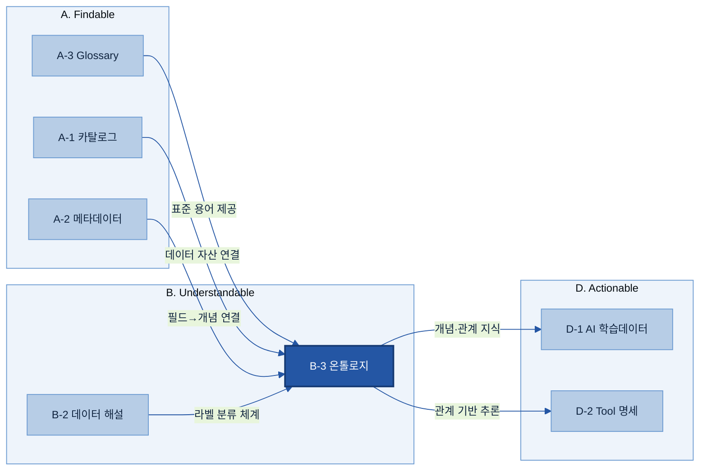
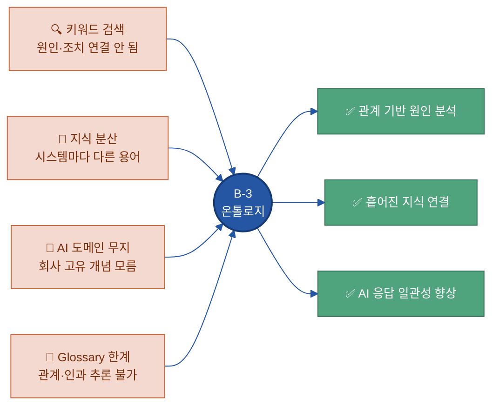
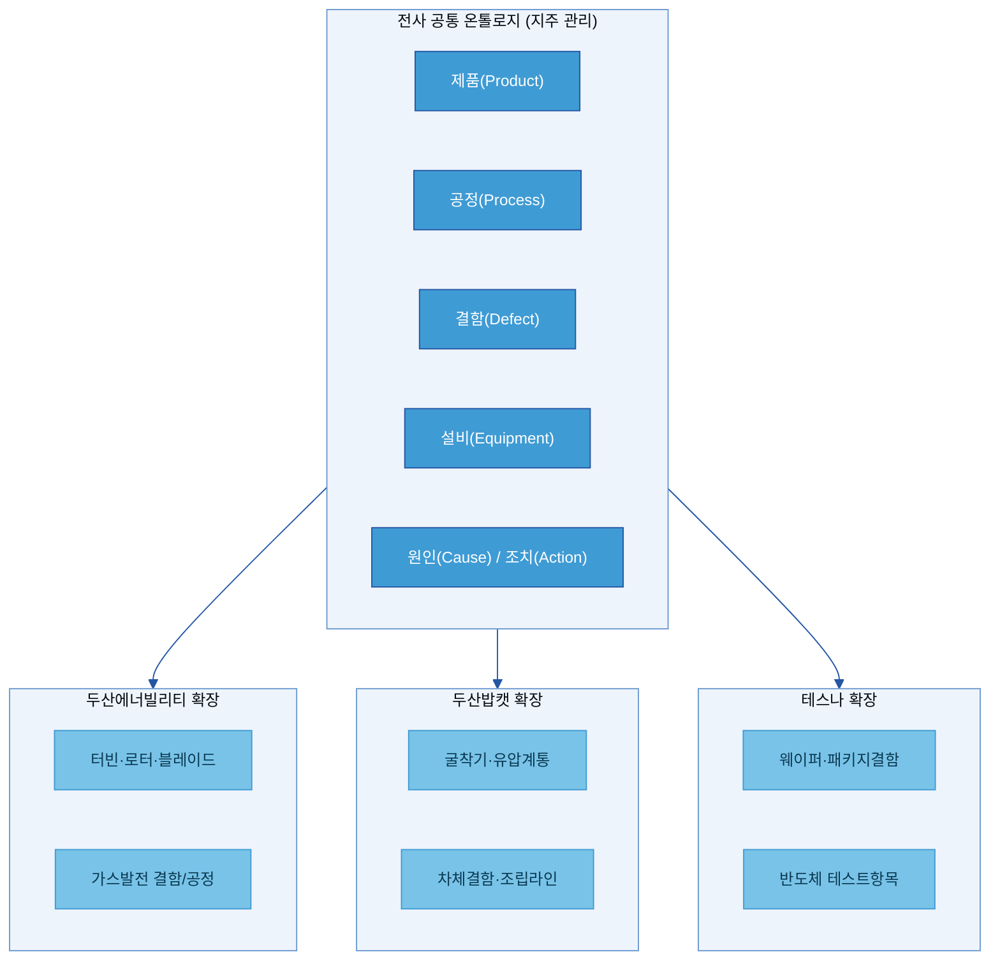
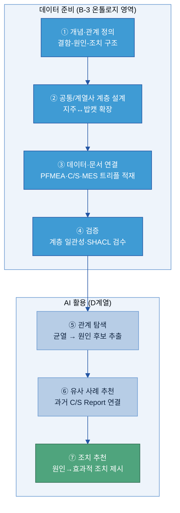
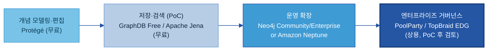
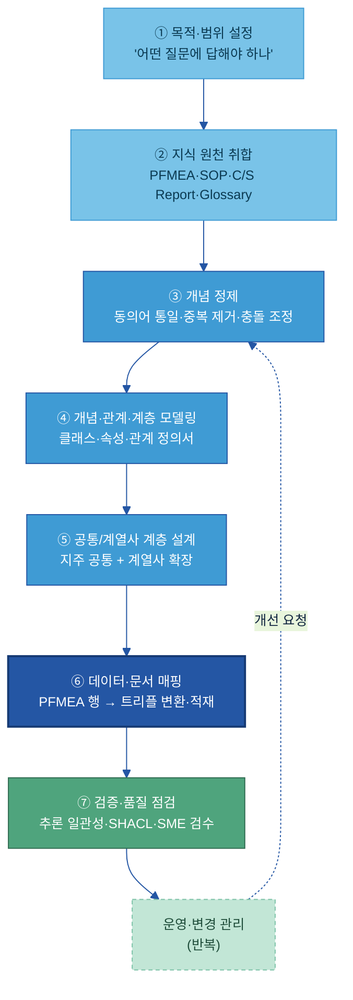
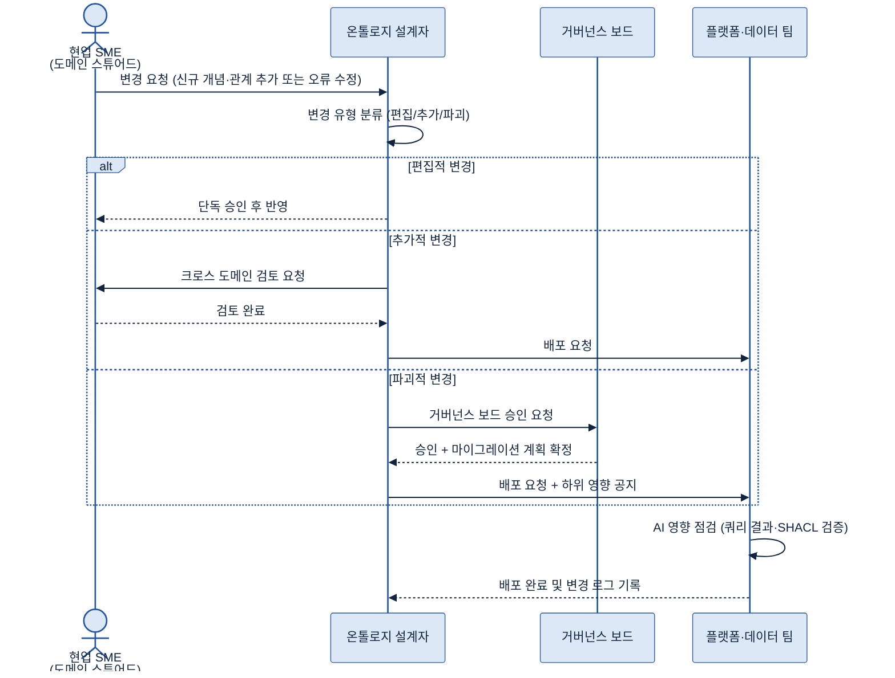
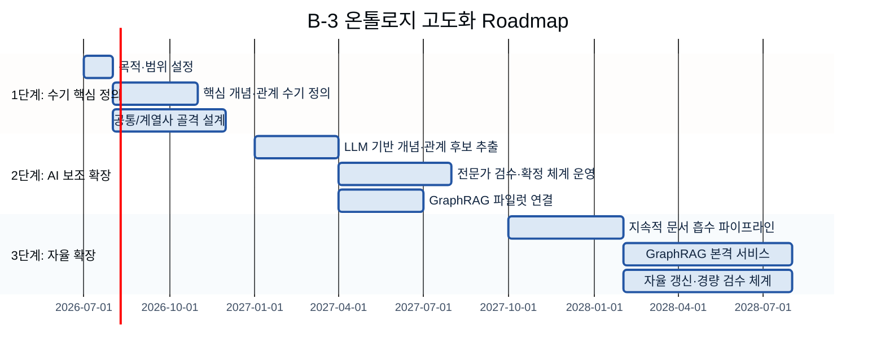

# B-3. 온톨로지(Ontology) 매뉴얼

> 한 줄 정의: 업무 개념들 사이의 **관계·계층·인과 구조**를 명시적으로 정의한 지식 지도 — AI가 "결함이 왜 생겼고 어떻게 조치하나"를 따라갈 수 있게 하는 지식 데이터.

---

## 목차

1. [개요](#1-개요)
2. [왜 필요한가 (Why)](#2-왜-필요한가-why)
3. [무엇을 갖추나 (What)](#3-무엇을-갖추나-what)
4. [언제 온톨로지를 하나 (적용 판단)](#4-언제-온톨로지를-하나-적용-판단)
5. [예시 시나리오](#5-예시-시나리오)
6. [솔루션·도구 검토](#6-솔루션도구-검토)
7. [구축](#7-구축)
8. [운영·활용](#8-운영활용)
9. [관계·지표·고도화](#9-관계지표고도화)

- [별첨 (Appendix)](#별첨-appendix)
- [참고자료 (References)](#참고자료-references)
- [변경 이력 / 피드백 반영](#변경-이력--피드백-반영)

---

<!-- KQ→섹션 매핑 (작성 확인용)
| KQ# | Key Question | 답하는 섹션 |
|-----|--------------|-------------|
| ①   | 어떤 경우 온톨로지를 구축해야 하나 (적용 판단) | 4. 언제 온톨로지를 하나 |
| ②   | 어떤 개념·관계를 모델링하나 (엔티티 목록·관계 정의서) | 3.1, 3.2, 3.3 |
| ③   | 계열사 지식 vs 전사 공통을 어떻게 나누나 | 3.4, 7.2 |
| ④   | 어떤 데이터·문서와 연결하나 (개념-데이터-문서 매핑) | 3.5, 7.3 |
| ⑤   | AI 활용에 어떻게 적용하나 (지식그래프·관계기반 검색) | 5, 8.2 |
| ⑥   | 변경을 어떻게 운영하나 (변경관리·버전) | 8.1 |
-->

---

## 1. 개요

> 👉 온톨로지는 업무 개념 사이의 관계 지도다. 단어 뜻은 A-3 Glossary가, 분류 라벨은 B-2가, 필드 설명은 A-2가 맡는다 — 온톨로지는 그 개념들이 **서로 어떻게 연결되는지**를 정의한다.

### 1.1 온톨로지란 — 개념 사이의 관계 지도

온톨로지(Ontology)는 업무에서 다루는 개념들 사이의 **관계·계층·인과 구조**를 명시적으로 정의한 지식 구조다. AI가 데이터의 맥락과 연결성을 이해할 수 있도록, 개념과 그 관계를 구조화된 **지식 데이터 자산**으로 만드는 작업이다.

쉬운 예시로 이해해 보자:

- "결함(Defect)이 무엇인지"는 [A-3 Glossary](../A-3%20Glossary/A-3%20Glossary.md)가 말한다.
- "결함이 어떤 공정에서 발생하고, 어떤 원인으로 생기며, 어느 조치로 해결되는지"를 연결하는 것이 **온톨로지**다.

**현업 비유로 구분하면:**

| 도구 | 역할 | 예시 |
|---|---|---|
| **Glossary (용어사전)** | 단어의 뜻 | "결함 = 제품이 기준을 벗어난 상태" |
| **Taxonomy (분류체계)** | 상위-하위 계층 분류 | 결함 > 외관결함 > 스크래치 |
| **Ontology (온톨로지)** | 개념 간 관계·인과 구조 전체 | 스크래치 → [연삭공정에서 발생] → [치구마모가 원인] → [연삭조건 조정으로 조치] |
| **Knowledge Graph (지식그래프)** | 온톨로지 구조 + 실제 인스턴스 데이터 | 위 구조에 "2025-03-17 라인3 스크래치 건 #KR-2345" 실제 데이터 연결 |

**정의의 권위:** Gruber(1993)는 온톨로지를 "특정 도메인에 대한 공유된 개념화(conceptualization)를 명시적으로 형식화(formal specification)한 것"으로 정의했다. AI-Ready Data 관점에서 온톨로지는 이 지식 구조를 **구조화된 데이터 자산으로 준비·정비**하는 작업이다.

### 1.2 적용 범위와 인접 주제 경계

B-3 온톨로지의 범위:
- **포함**: 업무 개념 간 관계·계층·인과 구조를 정의하는 지식 자산
- **제외 → [A-3 Glossary](../A-3%20Glossary/A-3%20Glossary.md) 소관**: 단일 용어의 정의·동의어·약어
- **제외 → [A-2 메타데이터](../A-2%20메타데이터/A-2%20메타데이터.md) 소관**: 데이터 필드(컬럼)의 속성 설명
- **제외 → [A-1 데이터 카탈로그](../A-1%20데이터%20카탈로그/A-1%20데이터%20카탈로그.md) 소관**: 데이터 자산의 위치·접근 경로

### 1.3 AI-Ready 체계 내 역할

온톨로지는 AI가 도메인 고유의 지식을 이해하고 관계를 따라 추론하기 위한 **지식 기반(Knowledge Base)**을 제공한다. 아래 조감도에서 B-3이 어디에 위치하는지 확인한다.



**체계 내 역할 요약:**
- A-3 Glossary가 표준 용어를 제공하면 → B-3 온톨로지가 그 용어들 사이의 **관계 구조**를 정의
- B-3이 정의한 지식 구조는 → D계열 AI 검색·에이전트가 **관계 기반 추론**에 활용

---

## 2. 왜 필요한가 (Why)

> 👉 단순 키워드 검색으로는 "왜 생겼고 어떻게 조치하나"를 찾을 수 없다. 온톨로지는 그 인과 구조를 데이터로 만들어 AI가 따라갈 수 있게 한다.

### 2.1 현업 Pain Point

**Pain 1 — 키워드 검색의 한계**: 🏭 제조 현장에서 "균열(crack)"을 검색하면 균열이 언급된 보고서 목록이 나온다. 그러나 균열의 원인(과부하·피로·소재 결함)이나 조치(보강·교체·검사 주기 조정)로 자동으로 이어지지 않는다. 지식이 문서 안에 갇혀 있고, 개념 간 관계로 저장되어 있지 않기 때문이다.

**Pain 2 — 지식의 분산**: 품질 불량 하나에 관한 지식이 여러 시스템에 흩어져 있다. 품질 검사 시스템(불량 유형), MES(공정 파라미터), CMMS(설비 정비 이력), 엔지니어링 문서(설계 기준)가 각기 다른 용어와 시스템에 존재한다. "공정 파라미터 이상 → 품질 불량"의 인과 고리를 AI가 자동으로 연결하지 못한다.

**Pain 3 — AI가 도메인을 모름**: LLM(대규모 언어 모델)은 일반 지식을 갖추고 있지만, 회사·공장 고유의 개념 구조는 모른다. "당사 압연 설비 R3 롤러 균열"에서 R3가 무엇인지, 당사 품질 기준이 무엇인지 AI는 알지 못한다. 온톨로지는 회사 도메인 고유의 **지식 지도**를 AI에게 제공한다.

**Pain 4 — Glossary만으로 부족**: A-3 Glossary는 용어 통일에는 충분하지만, "균열 → 원인 자동 연결"이나 "과부하 → 관련 조치 자동 추론"에는 한계가 있다. Glossary는 단어의 **뜻**을 정의하고, 온톨로지는 개념 간 **관계**를 구조화한다.



### 2.2 기대 효과

**원인 분석 자동화**: 온톨로지에 "균열 → [원인이 된다] → 과부하 / 피로파괴"가 정의되면, AI가 결함 발생 보고를 받았을 때 원인 후보를 자동으로 제시하고, 과거 유사 사례에서 효과적이었던 조치를 추천한다.

**일관된 AI 응답**: 온톨로지 없이는 동일한 질문에 AI가 맥락에 따라 다른 답을 낸다. 온톨로지를 갖추면 모든 AI 에이전트가 **동일한 개념 정의·관계**를 공유해 일관된 답변을 낸다. 벤치마크에 따르면 온톨로지 기반 지식 검증을 LLM에 결합했을 때 응답 정확도가 약 4배 이상 향상된 사례가 있다.[^cyber]

**AI 재사용성**: 온톨로지를 한 번 구축해두면, 새 AI 에이전트·RAG 시스템이 기존 온톨로지를 재사용하여 구축 시간을 크게 단축할 수 있다.

[^cyber]: Cyberhillpartners, "Ontologies & Knowledge Graphs for Enterprise AI" (https://cyberhillpartners.com/enterprise-ai-ontologies-knowledge-graphs/) — data.world 벤치마크 연구를 인용한 블로그 자료. 1차 연구 원문 링크는 별도 확인 필요.

---

## 3. 무엇을 갖추나 (What)

> 👉 온톨로지의 핵심 재료는 **개념(클래스)·인스턴스·속성·관계·계층·공리** 6가지다. 이 6요소로 "개념 A → 관계 → 개념 B" 구조를 만든다.

### 3.1 핵심 6요소 (정본 모델)

아래 6요소가 온톨로지의 구성요소다. 이 가이드 전체에서 이 6요소로 일관되게 설명한다.

| 번호 | 요소명 | 영문 | 한 줄 정의 | 두산 예시 |
|---|---|---|---|---|
| 1 | 개념/클래스 | Entity / Class | 다루는 사물·현상의 범주 | `결함`, `공정`, `설비`, `원인`, `조치` |
| 2 | 인스턴스 | Instance | 개념에 속하는 구체적 사례 | `스크래치`(결함의 인스턴스) |
| 3 | 속성 | Attribute / Property | 개념이 가지는 특성값 | `결함.심각도 = 3`, `설비.가동률` |
| 4 | 관계 | Relationship | 두 개념 사이의 연결에 붙인 이름 | `원인이 된다`, `검출된다`, `발생한다` |
| 5 | 계층 | Hierarchy | "A는 B의 한 종류(is-a)" 상위-하위 구조 | 스크래치 → 외관결함 → 결함 |
| 6 | 규칙/공리 | Axiom / Rule | AI가 새 사실을 추론하는 논리 제약 | "결함 A가 원인 B에 의해 발생하고, B가 조치 C로 해결되면 → A는 C로 조치 가능" |

> 기술 표준(RDF·OWL·SPARQL 등)의 상세 스펙은 가이드 뒷부분의 [[Appendix A]](#appendix-a-기술-표준-rdfowlsparql-한-줄-풀이)를 참고한다. 메인에서는 개념과 구조 이해에 집중한다.

### 3.2 관계 모델링 — Triple(트리플) 구조

온톨로지의 모든 관계는 **"주어(Subject) — 관계(Predicate) — 목적어(Object)"** 3개 짝으로 표현된다. 이것을 **트리플(Triple)**이라 한다.

```
(주어)          [관계]            (목적어)
베어링 마모  ─[원인이 된다]─▶  치수 불량
스크래치     ─[검출된다]────▶  비전 검사
진동 센서    ─[측정한다]────▶  베어링 진동값
```

**왜 Triple인가:** 모든 지식은 "무엇이 — 어떤 관계로 — 무엇과 연결되는가" 3가지로 표현 가능하다. AI가 이 트리플 구조를 따라 경로를 탐색하면서 추론한다.

### 3.3 제조 현장 핵심 엔티티·관계 목록

🏭 두산 계열사 제조 현장에서 우선 정의할 핵심 엔티티 7가지와 관계 유형 7가지는 다음과 같다.

**핵심 엔티티:**

| 엔티티(한글) | 엔티티(English) | 예시 인스턴스 |
|---|---|---|
| 제품 | Product | 터빈, 굴착기, 웨이퍼 |
| 공정 | Process | 연삭, 도금, 조립, 테스트 |
| 결함 | Defect | 스크래치, 치수불량, 균열 |
| 설비 | Equipment | 연삭기, 로봇팔, 측정기 |
| 원인 | Cause | 치구마모, 과부하, 소재이상 |
| 조치 | Action | 치구교체, 조건조정, 소재교환 |
| 검사항목 | InspectionItem | 표면조도, 치수, 경도 |

**핵심 관계 유형:**

| 관계 이름 | 영문 | 예시 트리플 |
|---|---|---|
| 원인이 된다 | causes | (치구마모) causes (스크래치) |
| 검출된다 | detected-by | (스크래치) detected-by (비전검사) |
| 발생한다 | occurs-in | (스크래치) occurs-in (연삭공정) |
| 조치한다 | remediated-by | (치구마모) remediated-by (치구교체) |
| 포함한다 | has-part | (터빈) has-part (로터블레이드) |
| 측정한다 | measured-by | (베어링진동) measured-by (진동센서#VB303) |
| 영향을 준다 | affects | (진동이상) affects (베어링수명) |

### 3.4 공통/계열사 확장 구조

온톨로지는 **전사 공통** 수준과 **계열사 특화** 수준으로 나눠 설계한다.

- **전사 공통 온톨로지 (지주 관리)**: 모든 계열사가 공유하는 상위 개념 구조. `제품`, `공정`, `결함`, `원인`, `조치` 같은 상위 엔티티와 공통 관계 유형을 정의한다.
- **계열사 특화 온톨로지**: 전사 공통 개념을 **확장(Extension)**하여 현장 용어와 관계를 추가한다. 예를 들어 공통의 `설비(Equipment)` 개념 아래 계열사별로 특화 하위 개념을 추가한다.



**연결 방식:** 계열사 온톨로지의 개념이 전사 공통 개념을 상속(is-a 관계)한다. 공통에서 `결함 occurs-in 공정` 관계를 정의하면, 계열사는 `스크래치(결함의 하위) occurs-in 연삭공정(공정의 하위)` 관계를 자동으로 상속받는다.

### 3.5 개념-데이터-문서 연결

온톨로지는 **개념 구조(설계도)**이고, 실제 데이터·문서는 그 설계도에 연결되는 콘텐츠다.

| 온톨로지 요소 | 연결 데이터/문서 | 연결 방법 |
|---|---|---|
| `결함(Defect)` 클래스 | A-3 Glossary의 결함 용어 항목 | 개념 ID → Glossary 용어 ID 매핑 |
| `스크래치` 인스턴스 | QMS의 DEF_CODE = 'SCR001' | 인스턴스 URI ↔ 코드값 매핑 |
| `공정(Process)` 클래스 | MES의 PROC_CD 컬럼 | A-2 메타데이터 필드 설명과 연결 |
| `결함 causes 원인` 관계 | PFMEA 시트의 Cause 컬럼 | PFMEA 행 → 트리플 (결함, causes, 원인) 변환 |
| `결함 occurs-in 공정` 관계 | MES 불량 발생 로그 (PROC_ID + DEF_ID) | 로그 레코드 → 트리플 자동 추출 |
| `설비 measured-by 센서` 관계 | IoT 플랫폼 센서 메타데이터 | 설비 ID + 센서 ID → 트리플 매핑 |

---

## 4. 언제 온톨로지를 하나 (적용 판단)

> 👉 온톨로지는 모든 데이터에 하는 것이 아니다. "AI가 관계를 따라 추론해야 하는가"가 판단 기준이다. 단어 통일이 목적이면 A-3 Glossary로 충분하다.

### 4.1 적용 판단 기준

핵심 질문: **"AI가 단순히 '이 단어가 있는 문서를 찾아라'를 넘어서, '이 현상의 원인이 뭐고 어떻게 조치하나'를 추론해야 하는가?"**
- **YES** → 온톨로지 필요
- **NO** → Glossary·Taxonomy로 충분

**온톨로지가 필요한 경우:**

| 판단 기준 | 제조 현장 예시 |
|---|---|
| 여러 문서·시스템의 지식을 관계로 엮어야 AI가 맥락을 파악할 수 있을 때 | MES 공정 이상 + 품질 불량 + 설비 정비 이력 연결 |
| "왜 이 현상이 발생했는가"를 AI가 추론해야 할 때 | 균열 발생 원인 분석, 품질 불량 근본원인 진단 |
| 단순 검색이 아니라 원인 분석·유사 사례 추천·조치 제안을 AI에게 시킬 때 | 결함 발생 시 유사 과거 사례 + 조치 자동 추천 |
| 업계·회사 고유의 개념 체계가 있어서 일반 LLM이 잘못 해석할 때 | 특수 합금 소재, 자체 설비 코드, 사내 공정 명칭 |

**온톨로지가 불필요한 경우 (대안):**

| 상황 | 대신 쓸 도구 |
|---|---|
| 용어 정의·동의어 통일만 필요 | [A-3 Glossary](../A-3%20Glossary/A-3%20Glossary.md) |
| 단순 문서 분류·태그 검색 | [A-1 데이터 카탈로그](../A-1%20데이터%20카탈로그/A-1%20데이터%20카탈로그.md) 태그·Taxonomy |
| 단일 시스템 내 정형 데이터 집계 | SQL 쿼리, BI 도구 |
| AI 학습용 분류 라벨 부여 | [B-2 데이터 해설·주석](../B-2%20데이터%20해설·주석/B-2%20데이터%20해설·주석.md) |

### 4.2 작게 시작하는 이유

전사 거대 온톨로지를 처음부터 만들면 반드시 실패한다. 개념이 늘어날수록 관계도 기하급수적으로 증가하고, 현업 전문가가 검수·확인하기 어려워지며, AI 연결이 지연된다. **한 공장·한 제품군의 결함-원인-조치 관계처럼 인과 관계가 명확하고 AI 질문이 집중된 업무부터 시작**한다.

### 4.3 우선 영역 고르기

아래 사분면으로 우선 적용 영역을 선별한다.

```mermaid
%%{init: {'theme':'base','themeVariables':{'primaryColor':'#DCE8F5','primaryBorderColor':'#2456A4','primaryTextColor':'#10243f','lineColor':'#2456A4','fontSize':'13px'}}}%%
quadrantChart
    title 온톨로지 우선 적용 영역 (AI 활용 가치 × 지식 복잡도)
    x-axis 낮음 --> 높음
    y-axis 낮음 --> 높음
    quadrant-1 최우선 적용
    quadrant-2 중기 적용
    quadrant-3 비적용 (카탈로그·Glossary)
    quadrant-4 선택적 적용
    품질 결함 근본원인 분석: [0.85, 0.90]
    설비 고장 진단: [0.80, 0.85]
    공정 이상 분석: [0.75, 0.75]
    안전 사고 조사: [0.65, 0.80]
    부품 카탈로그: [0.20, 0.30]
    SOP 문서 분류: [0.25, 0.20]
    코드 테이블 관리: [0.10, 0.10]
```

**두산 계열사 우선 후보 영역:**
1. **품질 결함 근본원인 분석(RCA)** — 결함 유형 → 원인(공정·설비·소재) → 조치의 인과 구조
2. **설비 정비·고장 진단** — 고장 증상 → 원인 → 정비 조치의 지식 체계
3. **공정 이상 분석** — 공정 파라미터 이상 → 품질 영향 → 조정 방안
4. **안전 사고 조사** — 사고 유형 → 원인 체인 → 예방 조치

---

## 5. 예시 시나리오

> 👉 이 섹션은 온톨로지를 실제로 적용했을 때 어떻게 달라지는지 한눈에 보여준다. 두산밥캣 암(Arm) 용접 품질 사례로 구체적인 Before/After와 흐름을 확인한다.

### 5.1 적용 전/후 대비

🏭 **상황**: 두산밥캣 암(Arm) 용접 공정에서 표면균열이 반복 발생. 작업자가 "균열"로 검색한다.

**Before (온톨로지 없음)**
- 검색 결과: "균열"이 언급된 보고서·매뉴얼 목록 100건
- 담당자가 일일이 읽고 유사 사례를 수작업으로 파악
- 원인(과부하? 열처리불량? 소재결함?) 추론은 숙련 전문가의 경험에 의존
- MES 공정 이상 이력, 소재 검사 이력, 설비 정비 기록이 서로 연결되지 않음
- 평균 원인 분석 소요: 2~3일

**After (온톨로지 있음)**
- "표면균열"이 입력되면 온톨로지 관계를 따라 원인 후보 자동 제시:
  - 원인 후보: 열처리불량(48건 중 31건), 용접속도불량(48건 중 12건)
- 지식그래프가 MES 공정 이상 이력 + 소재 검사 결과 + 유사 과거 사례를 자동 연결
- AI가 원인 후보와 효과적인 조치(열처리조건재설정, 성공률 87% — 예시 수치, 실제 구축 시 측정값으로 대체)를 추천
- 평균 원인 분석 소요: 수 시간 이내 목표

### 5.2 흐름 미리보기

아래가 온톨로지 데이터 준비부터 AI 활용까지의 전체 흐름이다.



### 5.3 완성 예시 — 결함-원인-조치 트리플

두산밥캣 C/S Report 48건에서 추출한 핵심 트리플 예시:

```
(표면균열)        ─[is-a]─────────▶  (표면결함)
(표면결함)        ─[is-a]─────────▶  (결함)
(표면균열)        ─[occurs-in]────▶  (암 용접공정)
(열처리불량)      ─[causes]───────▶  (표면균열)
(용접속도불량)    ─[causes]───────▶  (표면균열)
(열처리조건재설정) ─[remediated-by]▶  (열처리불량)
(용접파라미터조정) ─[remediated-by]▶  (용접속도불량)
```

이 트리플들이 그래프 DB에 누적되면 AI가 "표면균열 발생 → 열처리불량이 원인(31/48건) → 열처리조건재설정으로 조치(성공률 87% — 예시 수치)"를 추론할 수 있다.

---

## 6. 솔루션·도구 검토

> 👉 온톨로지를 저장하고 검색하는 도구는 목적에 따라 선택한다. PoC는 무료 도구로 시작하고, 운영 단계에서 상용 도구 확장을 검토한다.

### 6.1 관계 저장·검색 도구 유형

온톨로지 데이터를 저장하고 AI 검색에 활용하는 도구는 크게 세 유형이다.

| 유형 | 특징 | 대표 도구 |
|---|---|---|
| **그래프 DB (속성 그래프)** | 노드-관계 구조, 직관적 탐색, 빠른 패턴 매칭 | [Neo4j](https://neo4j.com/product/neo4j-graph-database/), [Amazon Neptune](https://aws.amazon.com/neptune/) |
| **RDF 트리플스토어** | W3C 표준 RDF 기반, OWL 추론 지원, 국제 표준 상호운용 | [Ontotext GraphDB](https://graphdb.ontotext.com/), [Stardog](https://www.stardog.com/platform/), [Apache Jena](https://jena.apache.org/) |
| **온톨로지 편집기** | 개념·관계를 사람이 직접 편집·설계하는 GUI 도구 | [Protégé](https://protege.stanford.edu/), [PoolParty](https://www.poolparty.biz/ontology-management), [TopBraid EDG](https://www.topquadrant.com/resources/overview-of-topbraid-edg-ontologies/) |

> 가격·버전은 계약 조건에 따라 달라지므로 반드시 PoC 전 공식 견적을 확인한다. 상세 도구 비교표는 [[Appendix B]](#appendix-b-솔루션-상세-비교표)를 참고한다.

### 6.2 단계별 도구 조합 (제조 계열사 권장)



### 6.3 선정 기준

| 기준 | 설명 |
|---|---|
| **표현력** | 복잡한 추론이 필요하면 OWL 기반 RDF 트리플스토어, 탐색·패턴 매칭 중심이면 속성 그래프 |
| **추론 지원** | is-a 계층 추론·규칙 기반 추론이 필요한가 → GraphDB, Stardog, RDFox 검토 |
| **현업 접근성** | 현업이 직접 편집해야 한다면 GUI 편집기(Protégé, PoolParty) 필요 |
| **기존 데이터 연동** | RDB·ERP 연동 → Stardog 가상 그래프, Neo4j 커넥터, Neptune 다중 모델 |
| **운영 부담** | 완전 관리형(운영 최소화) → Amazon Neptune, Neo4j AuraDB |

---

## 7. 구축

> 👉 온톨로지 구축은 7단계 절차로 진행한다. 핵심은 "작게 시작 → 점검 → 확장"이다.

### 7.1 지식 원천 취합·개념 정제

🏭 **지식 원천 취합**: PFMEA, SOP, C/S 리포트, 현장 작업 표준, 기존 Glossary 등 문서를 수집한다.

| 문서 | 포함 내용 |
|---|---|
| PFMEA (2~3년치) | 잠재 결함 유형, 잠재 원인, 현행 관리 방법 |
| SOP (표준작업지침서) | 공정 단계, 작업 기준, 품질 조건 |
| C/S Report | 실제 발생 결함·원인·조치 이력 |
| A-3 Glossary (기존) | 표준 결함명·공정명 용어 |
| 설비 이력 (CMMS) | 설비 고장 증상·교체 이력 |

**개념 정제**: 수집한 문서에서 동의어·약어를 통일하고 중복을 제거한다. 예를 들어 C/S Report에서 "표면 크랙", "크랙 발생", "crack"이 모두 같은 개념이면 A-3 Glossary와 연계하여 `표면균열(SurfaceCrack)`으로 통일한다. "용접 불량", "용착 불량", "용접부 결함"이 혼용되면 상위 클래스 `용접결함(WeldingDefect)` + 하위 클래스로 계층을 설계한다.

### 7.2 개념·관계 모델링과 공통/계열사 계층

**개념·관계 모델링**: 클래스(엔티티), 관계(Relationship), 속성(Property)을 정의한다. 두산밥캣 암(Arm) 사례에서의 계층 예시:

```
결함(Defect)
├── 표면결함(SurfaceDefect)
│   ├── 표면균열(SurfaceCrack)
│   └── 표면기공(SurfacePorosity)
└── 용접결함(WeldingDefect)
    ├── 용접균열(WeldCrack)
    └── 용접미용착(IncompleteFusion)

원인(Cause)
├── 공정결함(ProcessDefect)
│   ├── 열처리불량(HeatTreatmentDefect)
│   └── 용접속도불량(WeldingSpeedDefect)
└── 설비결함(EquipmentDefect)

조치(Action)
├── 공정조치(ProcessAction)
│   └── 열처리조건재설정(HeatTreatmentReset)
└── 설비조치(EquipmentAction)
    └── 노즐교체(NozzleReplacement)
```

**공통/계열사 계층 설계**: 지주는 상위 공통 개념·표준 관계 유형을 정의하고, 계열사는 업무 특화 하위 개념을 확장(Extension)한다. 네임스페이스(Namespace)를 분리하여 공통과 계열사를 구분한다.

### 7.3 데이터·문서 연결 → 트리플 적재 → 검증



**데이터 연결 핵심 작업:**
- PFMEA 항목의 "고장 모드 → 고장 원인" 열을 트리플로 변환: `(치수불량) causes (치구마모)`, `(치구정기교체) prevents (치구마모)`
- C/S Report 건별 결함·원인·조치를 인스턴스로 적재하고 해당 클래스에 연결
- 각 관계 트리플에 발생 빈도·성공률 등 통계 속성도 기록하면 AI 추천 품질이 향상된다

**검증 항목:**
- 온톨로지 편집기(Protégé 등)의 추론기(Reasoner)로 계층 일관성 확인
- SHACL(Shapes Constraint Language, 데이터 형식 규칙 검증 도구)로 "모든 결함 인스턴스는 원인 관계를 반드시 가져야 한다" 같은 규칙 자동 점검
- 현업 품질 담당자가 샘플 검수 (30~50건)

---

## 8. 운영·활용

> 👉 온톨로지는 한 번 만들고 끝이 아니다. 현장 지식이 바뀌면 온톨로지도 업데이트해야 하고, AI 추론 결과에도 변경이 반영되도록 관리한다.

### 8.1 변경 관리·버전

온톨로지는 AI 검색·추론의 기반 설계도이므로 변경이 AI 결과 전체에 영향을 준다. 변경을 세 단계로 분류하여 관리한다.

| 변경 유형 | 예시 | 리스크 | 승인 |
|---|---|---|---|
| **편집적 변경** | 라벨 수정, 설명 추가, 동의어 추가 | 낮음 | 도메인 스튜어드(현업 SME) 단독 |
| **추가적 변경** | 새 클래스·관계·속성 추가 | 중간 | 표준 크로스 도메인 검토 |
| **파괴적 변경** | 클래스 이름 변경, 관계 삭제, 계층 재편 | 높음 | 거버넌스 보드 승인 + 마이그레이션 계획 |

**버전 관리**: 시맨틱 버저닝(X.Y.Z) 형식을 적용한다. X는 파괴적 변경(계층 재편), Y는 추가적 변경(새 클래스·관계 추가), Z는 편집적 변경(라벨·설명 수정)을 나타낸다.

**변경 후 AI 영향 점검 항목:**
- 기존 그래프 쿼리 결과가 달라졌는가
- RAG 검색 결과(개념 확장 범위)가 달라졌는가
- SHACL 제약 검증 통과 여부
- 하위 계열사 확장 온톨로지와 충돌 없는가
- 다운스트림 AI 서비스 담당자에게 변경 공지 완료했는가

**역할·책임:**

| 역할 | 책임 |
|---|---|
| **도메인 스튜어드 (현업 SME)** | 개념 제안·비즈니스 맥락 설명·편집적 변경 승인 |
| **온톨로지 설계자** | 모델링·표준 준수·크로스 도메인 일관성·추가적 변경 검토 |
| **거버넌스 보드** | 파괴적 변경 최종 승인·네이밍 규칙·호환성 기준 관리 |
| **플랫폼·데이터 팀** | 배포·롤백·SHACL 자동 테스트 파이프라인 운영 |

**변경 처리 흐름:**



### 8.2 AI 활용 — 지식그래프 기반 검색·추천

온톨로지(설계도)에 실제 데이터(인스턴스 트리플)를 채워 넣으면 **지식그래프(Knowledge Graph)**가 완성된다. 이 지식그래프를 AI 검색에 연결하는 방식이 **GraphRAG**(그래프 기반 검색 증강 생성 — 온톨로지 관계를 따라 문서를 탐색한 뒤 AI가 답변을 생성하는 방식)다.

**데이터 준비 관점의 GraphRAG 흐름:**

1. 온톨로지 스키마(클래스·관계 정의서) 확정
2. SOP·PFMEA·C/S Report 등 비정형 문서에서 LLM으로 개체·관계를 추출할 때 온톨로지 스키마를 제약 조건으로 사용 → 일관된 추출
3. 추출된 개체·관계를 그래프 DB에 트리플로 적재
4. AI 검색 시: 키워드 → 온톨로지로 개념 확장(하위 개념도 포함) → 확장된 개념으로 그래프 탐색 + 벡터 검색 결합

**현업이 기대할 수 있는 활용:**
- **원인 분석**: "균열" 검색 시 온톨로지가 하위 개념(표면균열·내부균열)과 관련 원인(열처리불량·과부하)까지 자동 포함하여 탐색
- **유사 사례 추천**: 같은 원인·조치를 공유하는 과거 사례 자동 연결
- **조치 추천**: 확인된 원인과 연결된 표준 조치 항목 반환
- **다중 홉 추론**: "균열 원인 → 열처리불량 → 온도 제어 이상 → 설비 교체"로 이어지는 연쇄 관계 탐색

> 주의: B-3은 AI가 활용할 지식 데이터를 **준비·정비**하는 주제다. GraphRAG·에이전트의 구현 코드는 D계열 주제에서 다룬다.

---

## 9. 관계·지표·고도화

> 👉 온톨로지는 인접 주제와 역할이 명확히 나뉜다. 성과는 4가지 지표로 측정하고, 수기 구축에서 시작해 AI 보조 확장, 자율 갱신으로 단계적으로 고도화한다.

### 9.1 다른 주제와의 경계

| 인접 주제 | 그 주제의 역할 | B-3 온톨로지의 역할 | 핵심 경계 |
|---|---|---|---|
| [A-3 Glossary](../A-3%20Glossary/A-3%20Glossary.md) | 단일 용어의 뜻·동의어 표준화 | 개념 간 관계·인과 구조 정의 | Glossary는 단어 사전, 온톨로지는 관계 지도. Glossary 표준 용어가 온톨로지 개념의 이름(label)으로 쓰인다. |
| [A-2 메타데이터](../A-2%20메타데이터/A-2%20메타데이터.md) | 데이터 필드·테이블의 속성 설명 | 업무 개념과 데이터 필드를 의미적으로 연결 | 메타데이터는 "이 필드가 무엇인가(필드 수준)", 온톨로지는 "이 개념이 저 개념과 어떻게 연결되는가(개념 수준)" |
| [A-1 데이터 카탈로그](../A-1%20데이터%20카탈로그/A-1%20데이터%20카탈로그.md) | 데이터 자산의 위치·접근 경로 파악 | 개념과 데이터 자산을 의미 기반으로 연결 | 카탈로그는 "어디 있는가", 온톨로지는 "왜 연결되는가" |
| [B-2 데이터 해설·주석](../B-2%20데이터%20해설·주석/B-2%20데이터%20해설·주석.md) | AI 학습용 분류 라벨 부여 | 개념 간 관계 구조 정의 | B-2의 라벨 분류 체계가 안정되면 B-3 온톨로지 계층 구조에 반영 |
| D계열 AI 검색·에이전트 | 온톨로지를 사용해 추론·검색·추천 실행 | AI가 사용할 지식 구조를 준비·정의·유지 | B-3은 식재료 준비, D계열은 요리 실행 |

### 9.2 성과 지표

아래 4개 지표로 온톨로지 데이터 준비 수준을 측정한다.

**KPI-1. 핵심 개념 모델링 비율 (Concept Coverage Rate)**
- 쉬운 의미: 업무에서 실제로 쓰이는 핵심 개념(제품·공정·결함·원인·조치 등) 중 온톨로지에 정의된 비율
- 측정: 모델링된 핵심 개념 수 ÷ 전체 식별된 핵심 개념 수 × 100
- 목표·방향: ↑ 80% 이상 → 핵심 도메인 내 AI 추론 공백 최소화
- 🏭 두산 예시: 두산밥캣 유압 계통 RCA 온톨로지 — 핵심 개념 60개 중 48개 모델링 → 80%

**KPI-2. 개념-데이터-문서 연결 비율 (Relation Fill Rate)**
- 쉬운 의미: 온톨로지에 등록된 개념이 실제 데이터·문서와 연결된 비율. 연결이 없으면 "지도만 있고 도로가 없는" 상태
- 측정: 연결이 완성된 (개념, 데이터/문서) 매핑 수 ÷ 목표 매핑 전체 수 × 100
- 목표·방향: ↑ 70% 이상 → GraphRAG 기반 검색 적중률 향상
- 🏭 두산 예시: 두산테스나 반도체 공정 온톨로지 — "불량 모드" 개념을 3개 자산(MES·SOP·C/S)과 매핑. 초기 60% → 2단계 AI 보조로 90% 목표

**KPI-3. 관계 기반 추천·검색 적중률 (Relation-based Retrieval Accuracy)**
- 쉬운 의미: 온톨로지 관계를 활용한 AI 추천·검색이 실제로 맞는 비율. 키워드 검색 대비 얼마나 더 정확한가
- 측정: AI 추천·검색 결과 중 전문가가 "관련 있다"고 평가한 건수 ÷ 전체 추천 건수 × 100 (분기별 20~30건 샘플)
- 목표·방향: ↑ 키워드 검색 대비 10~20%p 이상 개선
- 🏭 두산 예시: 밥캣 서비스 매뉴얼 검색 키워드 적중률 55% → 온톨로지 기반 75% 목표

**KPI-4. 전문가 검수 반영 속도 (Expert Review Cycle Time)**
- 쉬운 의미: 온톨로지 변경 요청(신규 개념·관계 추가, 오류 수정)이 전문가 검토를 거쳐 반영·배포되는 평균 일수. 느리면 AI 추론에 낡은 지식이 남는다
- 측정: 변경 요청 접수일 ~ 승인·배포 완료일의 평균(일)
- 목표·방향: ↓ 7일 이내 → 지식 최신성 유지
- 🏭 두산 예시: 두산에너빌리티 — 현재 평균 21일 → 2단계(AI 초안 자동 생성) 적용 후 7일 목표

### 9.3 고도화 Roadmap



**단계별 목표:**

- **1단계 (0~6개월)** — 수기 핵심 정의: 도메인 전문가와 함께 핵심 개념 20~50개·관계 정의서를 수작업으로 구축. 커버리지 40~60%. A-3 Glossary 연계, 개념-데이터 매핑표 초안.
- **2단계 (6~18개월)** — AI 보조 확장: LLM이 사내 문서(SOP·PFMEA·C/S Report)에서 개념·관계 후보를 자동 추출. 전문가는 AI 초안을 검수·승인하는 역할로 전환. 커버리지 70~85%. 검수 사이클 단축.
- **3단계 (18개월 이상)** — 자율 확장: 신규 문서가 유입되면 온톨로지 자동 업데이트. 지식그래프 기반 GraphRAG로 원인 분석·유사 사례 추천 본격 서비스. 커버리지 90% 이상, GraphRAG 적중률 85% 이상 목표.

---

## 별첨 (Appendix)

### [Appendix A] 기술 표준 RDF·OWL·SPARQL 한 줄 풀이

메인 본문에서는 개념 이해에 집중하고, 아래 기술 표준 상세는 구현 시 참고한다.

| 약어 | 풀이 | 한 줄 설명 | 공식 URL |
|---|---|---|---|
| **RDF** | Resource Description Framework (자원 기술 프레임워크) | "주어-관계-목적어" 3개 짝으로 모든 지식을 표현하는 W3C 국제 표준 형식 | [w3.org/RDF](https://www.w3.org/RDF/) |
| **OWL** | Web Ontology Language (웹 온톨로지 언어) | 온톨로지의 규칙·제약을 컴퓨터가 읽고 추론할 수 있도록 쓰는 언어. RDF 위에 얹는다 | [w3.org/TR/owl2-overview](https://www.w3.org/TR/owl2-overview/) |
| **SKOS** | Simple Knowledge Organization System (간단한 지식 조직 시스템) | 분류체계·시소러스를 RDF로 표현하는 간단한 표준. 복잡한 추론 없이 계층·동의어 관리할 때 적합 | [w3.org/TR/skos-reference](https://www.w3.org/TR/skos-reference/) |
| **SPARQL** | SPARQL Protocol and RDF Query Language | RDF 트리플스토어를 검색하는 쿼리 언어. SQL의 그래프 버전 | [w3.org/TR/sparql11-overview](https://www.w3.org/TR/sparql11-overview/) |
| **SHACL** | Shapes Constraint Language (형식 제약 언어) | RDF 데이터가 정해진 형식 규칙을 지키는지 자동 검증하는 표준 | [w3.org/TR/shacl](https://www.w3.org/TR/shacl/) |
| **Triple Store** | 트리플 저장소 | RDF 트리플을 저장하고 SPARQL 쿼리로 검색하는 데이터베이스 | — |
| **Property Graph** | 속성 그래프 | 노드(Node)와 엣지(Edge)에 속성값을 직접 붙일 수 있는 그래프 모델. Neo4j 등이 대표적. RDF보다 단순하고 빠르지만 추론 기능은 약하다 | [neo4j.com](https://neo4j.com/product/neo4j-graph-database/) |

### [Appendix B] 솔루션 상세 비교표

| 도구명 | 유형 | 특징 | 무료 여부 | 공식 URL |
|---|---|---|---|---|
| [Neo4j](https://neo4j.com/product/neo4j-graph-database/) | 그래프 DB (속성 그래프) | 노드-관계 구조, Cypher 쿼리, AuraDB 관리형 클라우드 | 커뮤니티판 무료 | neo4j.com |
| [Amazon Neptune](https://aws.amazon.com/neptune/) | 완전 관리형 그래프 DB | AWS 관리형, RDF(SPARQL) + 속성 그래프(Gremlin) 동시 지원 | 유료(서버리스 옵션) | aws.amazon.com/neptune |
| [Ontotext GraphDB](https://graphdb.ontotext.com/) | RDF 트리플스토어 | W3C 표준 RDF, OWL 추론, Lucene/Elasticsearch 커넥터 | Free판 무료 | graphdb.ontotext.com |
| [Stardog](https://www.stardog.com/platform/) | RDF + 추론 | SPARQL 1.1 + OWL 추론 + SHACL 검증 + 가상 그래프(기존 DB 연결) | 상용(평가판) | stardog.com/platform |
| [Apache Jena](https://jena.apache.org/) | 오픈소스 Java 프레임워크 | Java 기반 RDF/OWL 처리, TDB 트리플스토어, Fuseki SPARQL 서버 | 완전 무료 | jena.apache.org |
| [Protégé](https://protege.stanford.edu/) | 온톨로지 편집기 | Stanford 개발 오픈소스 OWL 편집기, 데스크톱 + WebProtégé | 무료 | protege.stanford.edu |
| [PoolParty](https://www.poolparty.biz/ontology-management) | 엔터프라이즈 온톨로지 관리 | SKOS/OWL 기반, 텍스트 마이닝·자동 태깅 | 상용 | poolparty.biz |
| [TopBraid EDG](https://www.topquadrant.com/resources/overview-of-topbraid-edg-ontologies/) | 엔터프라이즈 지식그래프 관리 | OWL 편집 + SHACL 검증 + 20개 이상 내장 온톨로지, 벡터 DB 내장 | 상용 | topquadrant.com |

> 가격·버전은 계약 조건에 따라 달라진다. 반드시 PoC 전 공식 견적을 확인한다.

---

## 참고자료 (References)

| 제목 | URL | 비고 |
|---|---|---|
| Gruber, T. R. (1993). Ontology Definition | (학술 논문) | 온톨로지 공식 정의 |
| [Ontology components — Wikipedia](https://en.wikipedia.org/wiki/Ontology_components) | en.wikipedia.org | 구성요소 기초 |
| [What Is Ontology? Definition, Components & AI Use Cases — Atlan](https://atlan.com/know/ontology-101-explainer/) | atlan.com | 엔터프라이즈 온톨로지 설명 |
| [From Taxonomies over Ontologies to Knowledge Graphs — Semantic Web Company](https://semantic-web.com/from-taxonomies-over-ontologies-to-knowledge-graphs/) | semantic-web.com | Glossary/Taxonomy/Ontology/KG 구분 |
| [Knowledge Graph vs Ontology: Know Differences — PuppyGraph](https://www.puppygraph.com/blog/knowledge-graph-vs-ontology) | puppygraph.com | KG vs 온톨로지 비교 |
| [Demystifying Ontologies in Knowledge Graphs — Mindbreeze](https://www.mindbreeze.com/blog/demystifying-ontologies-in-knowledge-graphs-building-a-semantic-backbone-for-enterprise-ai) | mindbreeze.com | 엔터프라이즈 AI Pain Point |
| [Ontology and Knowledge Graph in the Age of AI and Agents — Enterprise Knowledge](https://enterprise-knowledge.com/ontology-and-knowledge-graph-in-the-age-of-ai-and-agents/) | enterprise-knowledge.com | AI 에이전트 시대의 온톨로지 역할 |
| [Ontologies & Knowledge Graphs for Enterprise AI — Cyberhillpartners](https://cyberhillpartners.com/enterprise-ai-ontologies-knowledge-graphs/) | cyberhillpartners.com | 응답 정확도 향상 벤치마크 |
| [Ontology Development 101 — Noy & McGuinness (Stanford)](https://protege.stanford.edu/publications/ontology_development/ontology101-noy-mcguinness.html) | protege.stanford.edu | 구축 방법론 표준 |
| [Fault Cause Identification across Manufacturing Lines — arXiv 2510.15428](https://arxiv.org/html/2510.15428) | arxiv.org | 제조 FMEA + LLM + 지식그래프 사례 |
| [Root Cause Analysis using Knowledge Graphs — ResearchGate](https://www.researchgate.net/publication/359090856_Root_Cause_Analysis_in_the_Industrial_Domain_using_Knowledge_Graphs_A_Case_Study_on_Power_Transformers) | researchgate.net | 전력 변압기 RCA 사례 (접근 제한, 기관 구독 확인 필요) |
| [Root-KGD: Root Cause Diagnosis — arXiv 2406.13664](https://arxiv.org/abs/2406.13664) | arxiv.org | 화학공정 근본원인 진단 프레임워크 |
| [Document GraphRAG for Manufacturing — MDPI Electronics 2025](https://www.mdpi.com/2079-9292/14/11/2102) | mdpi.com | 제조 도메인 GraphRAG (접근 제한, 수치 미검증) |
| [Ontology-Driven Knowledge Graph for GraphRAG — deepsense.ai](https://deepsense.ai/resource/ontology-driven-knowledge-graph-for-graphrag/) | deepsense.ai | GraphRAG 데이터 준비 방법론 |
| [Ontology Management Operating Model — Galaxy](https://www.getgalaxy.io/articles/ontology-management-semantic-modeling-operating-model-enterprise-context) | getgalaxy.io | 변경 유형·거버넌스 운영 모델 |
| [Best Practices for FAIR Vocabularies and Ontologies on the Web — arXiv 2003.13084](https://arxiv.org/abs/2003.13084) | arxiv.org | 버전 관리 모범 사례 |
| [AI Agent-Driven Automated Product Knowledge Graph — arXiv 2511.11017](https://arxiv.org/abs/2511.11017) | arxiv.org | LLM 기반 자동 KG 구축(전자상거래 도메인), 97% 속성 커버리지 보고 |
| [Leveraging LLM for Automated Ontology Extraction — arXiv 2412.00608](https://arxiv.org/abs/2412.00608) | arxiv.org | AI 보조 온톨로지 추출 방법론 |
| [What Does It Mean for a Data Catalog to Be Powered by a Knowledge Graph? — data.world](https://data.world/blog/data-catalog-knowledge-graph/) | data.world | 카탈로그-온톨로지 연동 |
| [Metrics to Gauge the Success of a Manufacturing Ontology — ScienceDirect](https://www.sciencedirect.com/science/article/pii/S2351978920301177) | sciencedirect.com | 온톨로지 성과 지표 (접근 제한, 기관 구독 확인 필요) |
| [Structural Quality Metrics for Knowledge Graphs — arXiv 2211.10011](https://arxiv.org/abs/2211.10011) | arxiv.org | KG 품질 지표 |
| [Ontology Quality Improvement — MDPI Systems 2025](https://www.mdpi.com/2079-8954/14/2/154) | mdpi.com | 온톨로지 품질 개선 (접근 제한, 수치 미검증) |

---

## 변경 이력 / 피드백 반영

| 일자 | 버전 | 피드백 (누가/무엇) | 반영 내용 | 반영 위치 |
|------|------|-------------------|-----------|-----------|
| 2026-06-18 | 0.1 | 초안 작성 | — | 전체 |
