# B-3. 온톨로지(Ontology) 매뉴얼

> 한 줄 정의: 업무 개념들 사이의 **관계·계층·인과 구조**를 명시적으로 정의한 지식 지도 — AI가 "결함이 왜 생겼고 어떻게 조치하나"를 비슷한 텍스트 찾기가 아니라 **관계를 따라가며** 추론할 수 있게 하는 지식 데이터.

---

## 목차

1. [개요](#1-개요)
2. [왜 필요한가 (Why)](#2-왜-필요한가-why)
3. [언제 온톨로지를 하나 (적용 판단)](#3-언제-온톨로지를-하나-적용-판단)
4. [무엇을 갖추나 (What)](#4-무엇을-갖추나-what)
5. [예시 시나리오](#5-예시-시나리오)
6. [어떻게 설계·구축하나 (How)](#6-어떻게-설계구축하나-how)
7. [아키텍처·기술 선택](#7-아키텍처기술-선택)
8. [운영·활용](#8-운영활용)
9. [다른 주제와의 관계](#9-다른-주제와의-관계)
10. [성과 지표·로드맵·고도화](#10-성과-지표로드맵고도화)

- [별첨 (Appendix)](#별첨-appendix) — A~D 실행형(별도 .md) · E~J 기술 상세
- [참고자료 (References)](#참고자료-references)
- [변경 이력 / 피드백 반영](#변경-이력--피드백-반영)

---

> [!question] **이 가이드가 답하는 6가지 핵심 질문**
> *(독자가 "무슨 질문에 어떻게 답하는지"를 한눈에 보도록 평문으로 정리한다. 본문 제목에는 내부 코드를 노출하지 않는다.)*
>
> | # | 핵심 질문 | 한 줄 답 | 다루는 곳 |
> |---|-----------|----------|-----------|
> | 1 | 언제 온톨로지를 구축해야 하나? | 지식이 여러 시스템에 흩어져 있고 **인과(원인-결과)가 중요할 때**. 단어 통일이 목적이면 Glossary, 분류만 필요하면 Taxonomy로 충분 | [§3 적용 판단](#3-언제-온톨로지를-하나-적용-판단) |
> | 2 | 어떤 개념·관계를 모델링하나? | 6요소(클래스·인스턴스·속성·관계·계층·공리)로, 제조는 핵심 **엔티티 7 + 관계 7**을 관계 정의서로 | [§4.1·4.6](#4-무엇을-갖추나-what) |
> | 3 | 전사 공통 vs 계열사 특화 지식을 어떻게 나누나? | 공통 상위 개념·표준 관계는 지주 레이어, 계열사는 별도 네임스페이스에서 하위 클래스로 확장 | [§4.5](#sec45) |
> | 4 | 어떤 데이터·문서와 연결하나? | PFMEA·SOP·C/S Report·Glossary(A-3)·메타데이터(A-2)·카탈로그(A-1)를 **개념-데이터-문서 매핑표**로 연결 | [§4.7](#sec47) |
> | 5 | AI 활용에 어떻게 적용하나? | 관계 기반 검색: RAG 개념 확장 · 에이전트 다중 홉 원인 탐색 · 유사 사례·조치 추천 | [§5·8.2](#82-ai-활용--관계-기반-검색추천-3가지-패턴) |
> | 6 | 변경을 어떻게 운영하나? | 변경을 편집/추가/파괴로 분류, SHACL·회귀 쿼리 점검, 시맨틱 버저닝, 파괴적 변경은 거버넌스 보드 경유 | [§8.1](#81-변경-관리버전) |

> **이 가이드의 척추 — 9단계·코어/유즈케이스·As-Is:** 설계는 [§6 9단계 방법론](#6-어떻게-설계구축하나-how)을 단일 정본으로 따른다. 9단계는 **코어 온톨로지(1~7단계) → 유즈케이스 레이어(8단계) → 운영(9단계)**으로 흐르며, 모든 노드·관계의 근거는 **As-Is 분석서**([§6.0](#60-설계-입력-as-is-분석서))에서 나온다. 정론을 *특정 목적 유즈케이스에 적용하는 각론*과 *채우는 산출물 양식*은 별첨으로 분리한다 — [별첨 A 각론](별첨/B-3%20별첨%20A%20—%20유즈케이스%20온톨로지%20구축%20각론.md) · [별첨 B 코어 기획서](별첨/B-3%20별첨%20B%20—%20코어%20온톨로지%20설계%20기획서.md) · [별첨 C 유즈케이스 기획서](별첨/B-3%20별첨%20C%20—%20유즈케이스%20레이어%20설계%20기획서.md) · [별첨 D Discovery Workshop](별첨/B-3%20별첨%20D%20—%20Discovery%20Workshop%20운영%20가이드.md).

> 🔸 **예시 표기 안내:** 본 가이드의 **다이어그램·표·쿼리에 나오는 구체 값**(Lot ID·온도·일시·라인/설비 번호·SOP 번호·인스턴스 수 등)은 **이해를 돕기 위한 가상 예시이며 실제 데이터가 아니다.** 실제 값은 PoC·프로젝트에서 확정한다. 계열사명(에너빌리티·밥캣·테스나 등)은 적용 맥락 설명용이며, 그 아래 세부 개념·수치도 예시다.

> **관련 가이드:** [A-1 데이터 카탈로그](../A-1%20데이터%20카탈로그/A-1%20데이터%20카탈로그.md) · [A-2 메타데이터](../A-2%20메타데이터/A-2%20메타데이터.md) · [A-3 Glossary](../A-3%20Glossary/A-3%20Glossary.md) · [B-2 데이터 해설·주석](../B-2%20데이터%20해설·주석/B-2%20데이터%20해설·주석.md) · D계열 가이드(작성 예정)

---

## 1. 개요

> 👉 온톨로지는 용어사전도 데이터베이스도 아니다. 개념들이 **서로 어떻게 연결되는지**를 알려주는 "연결의 규칙서"여서, AI가 단순 검색이 아니라 추론을 할 수 있게 한다. 단어 뜻은 A-3 Glossary가, 분류 라벨은 B-2가, 필드 설명은 A-2가 맡는다.

### 1.1 온톨로지란 — 개념 사이의 관계 지도

온톨로지(Ontology)는 업무에서 다루는 개념들 사이의 **관계·계층·인과 구조**를 명시적으로 정의한 지식 구조다. 어떤 개념이 존재하고, 어떤 속성을 가지며, 서로 어떻게 연결되는지를 **기계가 읽고 추론할 수 있는 형식**으로 정의한다. AI-Ready Data 관점에서 온톨로지는 이 지식 구조를 구조화된 **지식 데이터 자산**으로 준비·정비하는 작업이다. [[W3C OWL2 Primer](https://www.w3.org/TR/owl2-primer/)]

쉽게 말하면 **"규칙이 붙은 개념 지도"**다. 용어만 나열하는 것이 아니라, 개념들이 어떻게 연결되고 어떤 제약이 있으며, 그 규칙으로부터 **어떤 새 사실을 자동으로 도출할 수 있는지**까지 명시한다.

**현업 비유로 구분하면:**

| 도구 | 역할 | 예시 |
|---|---|---|
| **Glossary (용어사전)** | 단어의 뜻 | "결함 = 제품이 기준을 벗어난 상태" |
| **Taxonomy (분류체계)** | 상위-하위 계층 분류 | 결함 > 외관결함 > 스크래치 |
| **Ontology (온톨로지)** | 개념 간 관계·인과 구조 전체 | 스크래치 → [연삭공정에서 발생] → [치구마모가 원인] → [연삭조건 조정으로 조치] |
| **Knowledge Graph (지식그래프)** | 온톨로지 구조 + 실제 인스턴스 데이터 | 위 구조에 "2025-03-17 라인3 스크래치 건 #KR-2345" 실제 데이터 연결 |

> 위 네 가지는 경쟁 관계가 아니라 **표현력과 비용이 점점 커지는 스펙트럼**이다. 단어 통일만 필요하면 왼쪽(Glossary), 관계·추론까지 필요하면 오른쪽(Ontology→KG)으로 간다. 선택 기준은 [§3 적용 판단](#3-언제-온톨로지를-하나-적용-판단).

**정의의 권위:** Gruber(1993)는 온톨로지를 "특정 도메인에 대한 공유된 개념화(conceptualization)를 명시적으로 형식화(formal specification)한 것"으로 정의했다. W3C OWL2는 이를 클래스·속성·관계·공리로 형식화하는 표준을 제공한다.

🏭 **제조 예시:** 제조 온톨로지는 `결함(Defect)`이 `공정(Process)`에서 *발생(occurs-in)*하고, `검사항목(Inspection-item)`으로 *검출(detected-by)*되며, `원인(Cause)`을 가지고 그 원인은 `조치(Action)`로 *해결(remediated-by)*된다고 정의한다. 이 관계들이 선언되어 있으면, AI는 결함 유형마다 따로 프로그래밍하지 않아도 결함 → 원인 → 조치 경로를 자동으로 따라가 해결책을 제시할 수 있다.

### 1.2 적용 범위와 인접 주제 경계

**B-3이 다루는 것:**
- 온톨로지를 **지식 데이터 자산**으로 모델링·준비 (T-Box: 클래스·관계·계층·규칙)
- 제조 문서로부터 인스턴스 데이터(A-Box) 적재
- 온톨로지를 저장·질의하기 위한 아키텍처 결정
- 시간에 따른 온톨로지 운영·버전 관리
- 준비된 온톨로지가 AI 검색(GraphRAG, 에이전트 원인 탐색)에 **어떻게 소비되는지**

**B-3이 다루지 않는 것:**
- GraphRAG 애플리케이션·AI 에이전트 자체 구현 → D계열 가이드
- 단일 용어의 정의·동의어·약어 → [A-3 Glossary](../A-3%20Glossary/A-3%20Glossary.md)
- 데이터 필드(컬럼)의 속성 설명 → [A-2 메타데이터](../A-2%20메타데이터/A-2%20메타데이터.md)
- 데이터 자산의 위치·접근 경로 → [A-1 데이터 카탈로그](../A-1%20데이터%20카탈로그/A-1%20데이터%20카탈로그.md)

온톨로지 작업은 카탈로그·메타데이터·용어사전 같은 기초 인프라가 갖춰진 위에서 시작하는 것이 적절하다 — 그 토대 위에 쌓는 구조 계층이다.

### 1.3 AI-Ready 체계 내 역할

6대 원칙은 A(Findable)·B(Understandable)·C(Trustworthy)·D(Actionable)·E(Sustainable)·F(Governed)다. B-3 온톨로지는 **B(Understandable)** 기둥에 속한다 — 데이터를 단지 찾을 수 있게(A-1) 하거나 설명되게(A-2) 하는 데서 더 나아가, **의미적으로 연결**해 AI가 내용뿐 아니라 맥락과 연결성을 이해하게 만드는 구조 계층이다.

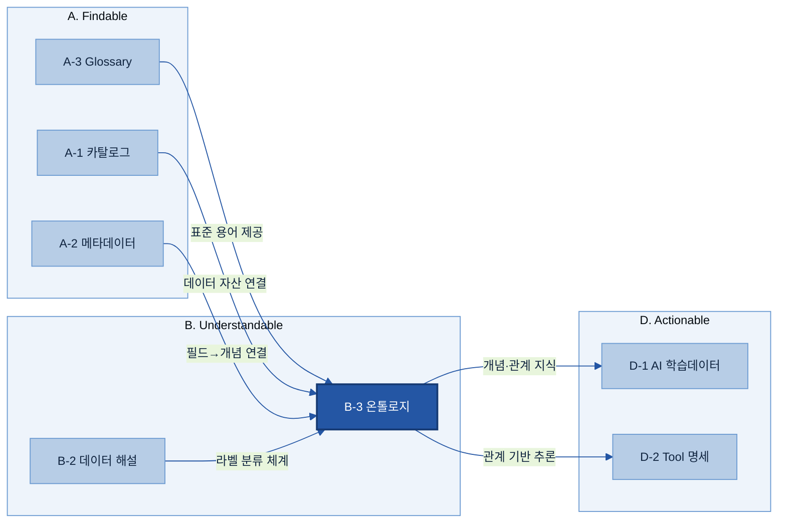

**체계 내 역할 요약:**
- A-3 Glossary가 표준 용어를, A-2가 필드 설명을, A-1이 자산 위치를 제공하면 → B-3 온톨로지가 그것들을 **탐색 가능한 지식 그래프로 연결**
- B-3이 정의한 지식 구조는 → D계열 AI 검색·에이전트가 **관계 기반 추론**에 활용

<a id="sec14"></a>

### 1.4 설계를 관통하는 5가지 원칙

온톨로지는 "문서를 잘 정리하는 일"이 아니라 **"현실을 모델로 옮기는 일"**이다. 아래 5원칙은 두산이 정리한 온톨로지 방법론의 철학으로, 이 가이드의 When·What·How 전체를 관통한다.

| 원칙 | 뜻 | 가이드에서 |
|---|---|---|
| **현실을 담는다** | 특정 산출물 양식·처리 절차가 아니라, 현실에 독립적으로 존재하는 **객체·사건**을 모델링한다 | [§4.3 3계층](#sec43)·[§6.4 함정](#64-설계-전-피해야-할-7가지-함정) |
| **단일 진실 레이어** | 쿼리·LLM·에이전트가 모두 같은 현실을 보는 하나의 층 | 정본 모델 하나(6요소+3계층)·[§4.5 공통 레이어](#sec45) |
| **객체 중심으로 재사용** | 특정 유즈케이스를 위해 만들지 않는다 — 현실 객체 중심으로 설계해야 다음 유즈케이스가 재사용한다 | [§4.4 코어/유즈케이스 분리](#sec44) |
| **관계 중심** | 측정값을 쌓는 게 아니라 인자 간 **인과·선후행 관계**를 구조화한다 | [§4.1 6요소·트리플](#sec41)·[§2 인과 사슬](#2-왜-필요한가-why) |
| **도메인 먼저, 전사는 나중** | 전사 온톨로지를 처음부터 만들지 않는다(불가능). 한 도메인을 검증한 뒤 재사용·확장한다 | [§3.2 작게 시작](#32-작게-시작하는-이유) |

> 이 원칙들은 추상적 구호가 아니라 **검증 기준**이다 — 설계가 끝나면 [§6.5 검증 4원칙](#65-검증-체크리스트--4원칙-백본)으로 "현실을 담았나·암묵지가 드러났나·코어가 독립적인가·근거를 제시하나"를 점검한다.

---

## 2. 왜 필요한가 (Why)

> 👉 AI는 어떤 개념이 *언급된* 텍스트는 잘 찾는다. 그러나 온톨로지가 없으면 개념들 *사이의 연결*을 따라가지 못한다 — 그리고 근본원인 분석은 바로 그 연결을 따라가는 일이다.

### 2.1 현업 Pain Point — 관계가 없는 데이터

제조 데이터는 여러 시스템에 흩어져 있다.
- **PFMEA 시트**: 알려진 고장 모드·원인·권장 조치
- **SOP(표준작업지침서)**: 공정 파라미터·허용 공차
- **MES 기록**: 생산 시점의 실제 파라미터 값
- **설비 로그**: 용접 건 상태, 전극 캡 마모, 알람 이력
- **C/S Report(고객·서비스 불만 보고서)**: 실제 결함 사건과 과거 조치 이력

각 시스템은 자기 용어를 쓴다. MES의 "용접 불량"이 PFMEA에서는 "고장 모드", C/S Report에서는 "품질 부적합"이다. 이들을 연결하는 명시적 관계 계층이 없으면 AI는 **키워드·벡터 유사도 검색**밖에 못 한다 — 개념이 *언급된* 텍스트 덩어리는 찾지만, 그 개념과 인과·계층으로 *연결된* 텍스트는 찾지 못한다.

| Pain | 증상 | 결과 |
|---|---|---|
| **키워드 검색의 한계** | "균열" 검색 → 균열이 언급된 보고서 목록만 | 원인(과부하·피로·소재)·조치로 자동 연결 안 됨 |
| **지식의 분산** | 불량 1건 지식이 품질·MES·CMMS·설계 문서에 흩어짐 | "공정 이상 → 품질 불량" 인과 고리를 AI가 못 엮음 |
| **AI의 도메인 무지** | LLM은 일반 지식뿐, 회사 고유 설비코드·기준 모름 | "압연 설비 R3 롤러 균열"의 R3를 해석 못 함 |
| **Glossary만으로 부족** | 단어 뜻은 통일되나 관계는 없음 | "균열 → 원인 자동 연결" 불가 |

[[Microsoft Research GraphRAG](https://www.microsoft.com/en-us/research/blog/graphrag-unlocking-llm-discovery-on-narrative-private-data/)]: "기본(baseline) RAG는 점들을 잇지 못한다. 질문에 답하려면 여러 정보 조각을 공유 속성을 통해 가로질러야 할 때 이 한계가 드러난다."

### 2.2 벡터 검색이 따라가지 못하는 인과 사슬 — 구체 예시

🏭 **시나리오 — CCL(동박적층판) 들뜸:** 전자BG가 납품한 CCL에서 고객사 PCB 가공 중 **들뜸(Delamination, 층간 박리)**이 발견돼 클레임이 접수됐다. 왜 발생했나?

실제 인과 사슬(예시):

> 프리프레그 원자재 흡습(보관 습도 초과) + 열압착 온도 미달 → 수지 경화 불완전(계면 접착력 저하) → 층간 들뜸(Delamination)

이 사슬은 **여러 개의 서로 다른 데이터 원천**에 걸쳐 있다 — ERP(프리프레그 원자재 Lot·입고/보관 습도 이력), MES(열압착 프레스 온도·압력·시간 로그), SOP(열압착 표준 조건), 검사 기록(들뜸 검출), C/S Report(고객 클레임·과거 조치).

어떤 텍스트 덩어리 하나도 전체 사슬을 담고 있지 않다. 벡터 임베딩에서 "들뜸"과 "프리프레그 흡습"의 의미적 거리는 멀다 — 둘은 완전히 다른 어휘를 쓰기 때문이다. 지식그래프에 명시된 `causes`·`usedMaterial`·`underCondition` 같은 관계만이 이 사슬을 **한 번의 쿼리로** 따라갈 수 있다.

### 2.3 온톨로지가 가능케 하는 것

인과 관계가 온톨로지에 형식적으로 선언되면, AI 에이전트는 다음을 할 수 있다.

| 질문 | 온톨로지 없음 | 온톨로지 있음 |
|---|---|---|
| "이 결함은 무슨 유형인가?" | 전문(full-text) 검색 | 계층 탐색: 들뜸 → 층간결함 → CCL결함 |
| "원인이 뭔가?" | PFMEA 키워드 매칭 | `hasCause` 관계를 직접 따라가 프리프레그 흡습·열압착 온도미달로 |
| "어느 Lot들이 공통인가?" | 분석가 수작업 대조 | `belongsToLot`·`usedMaterial` 따라가 동일 프리프레그 Lot·동일 프레스 식별 |
| "실제 공정조건이 기준을 지켰나?" | MES·SOP 따로 조회 | 실제값(`underCondition`)과 표준(`governedBy SOP`)을 대조해 위반 탐지 |
| "조치는?" | C/S Report 검색 | `hasCorrectiveAction` 따라가 프리프레그 건조·프레스 온도 보정 SOP로 |

**동료심사(peer-reviewed) 근거:** 제조 FMEA 고장 원인 식별을 다룬 2025년 arXiv 사전논문은 관계형·다중 홉 질문에서 **F1@20이 0.267(표준 RAG)에서 0.523(온톨로지 가이드 지식그래프)으로 약 2배 향상**됐다고 보고했다.[^arxiv-fmea] 현 시점 이 주장에 대한 가장 강한 독립 검증 수치이나, 공식 출판본을 확인한 뒤 정식 인용하는 것을 권한다.

검색 정확도를 다룬 비교 연구는 온톨로지 KG + 텍스트 청크가 정답률 **90%**, 벡터 RAG가 **60%**로 **+30%p** 차이를 보고했다.[^arxiv-acc] *단, 평가 셋이 작아(n=20) 방향성 근거로만 보고, 자체 도메인 PoC로 기준선을 측정해야 한다.*

[^arxiv-fmea]: arXiv 2510.15428, "제조 FMEA 가이드 고장 원인 식별"(2025-10 제출) — 관계형·다중 홉 질문에서 F1@20이 0.267(표준 RAG)→0.523(온톨로지 가이드 KG). ⚠️ 공식 출판본 확인 후 정식 인용 권장. (https://arxiv.org/abs/2510.15428)
[^arxiv-acc]: arXiv 2511.05991 — 온톨로지 KG+텍스트 청크 정답률 90% vs 벡터 RAG 60%(+30%p). 평가 셋 소규모(n=20)로 방향성 근거. (https://arxiv.org/html/2511.05991v1)

> ⚠️ **정직성 노트:** 이전 버전(v0.2)의 "정확도 약 4배 향상"은 블로그 재인용(1차 출처 미확인)이었다. v0.3에서 위 동료심사 수치(약 2배, +30%p)로 **교체**했다. 추가 벤치마크는 [[별첨 J]](#appendix-j-추가-정확도-벤치마크근거)를 참고한다.

### 2.4 기대 효과

- **원인 분석 자동화**: "균열 → [원인이 된다] → 과부하/피로파괴"가 정의되면, AI가 결함 보고를 받았을 때 원인 후보와 과거 효과적 조치를 자동 제시한다.
- **일관된 AI 응답**: 모든 AI 에이전트가 **동일한 개념 정의·관계**를 공유해 맥락에 따라 답이 흔들리지 않는다.
- **추적 가능성(설명력)**: 그래프 기반 답변은 근거 노드·엣지·원문 청크로 역추적된다. 규제 대상 시정조치에서는 근거 사슬이 없는 AI 추천은 쓸 수 없다([[별첨 J]](#appendix-j-추가-정확도-벤치마크근거)).
- **AI 재사용성**: 한 번 구축한 온톨로지를 새 AI 에이전트·RAG가 재사용해 구축 시간을 단축한다.

---

## 3. 언제 온톨로지를 하나 (적용 판단)

> 👉 온톨로지는 모든 데이터에 하는 것이 아니다. 스펙트럼 위의 한 선택지다. 구축 트리거는 **개념 간 인과 관계가 개념 자체만큼 중요할 때**다. 단어 통일이 목적이면 A-3 Glossary로 충분하다.

<a id="kq1"></a>

> ❓ **핵심 질문 1 — "언제 온톨로지를 구축해야 하나?"** 에 이 섹션이 답한다. 핵심 결정: **지식이 흩어져 있고 + 관계가 중요할 때** 구축한다. 그렇지 않으면 더 단순한 도구를 쓴다.

### 3.1 적용 판단 기준 — 결정 스펙트럼

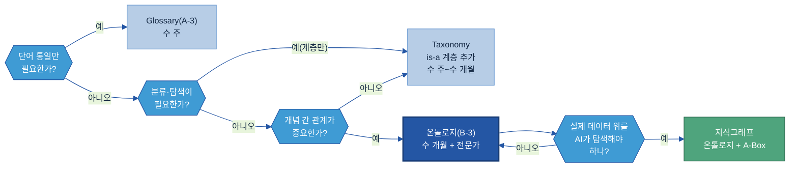

핵심 질문: **"AI가 단순히 '이 단어가 있는 문서를 찾아라'를 넘어서, '이 현상의 원인이 뭐고 어떻게 조치하나'를 추론해야 하는가?"** → YES면 온톨로지, NO면 Glossary·Taxonomy.

**온톨로지가 필요한 5가지 트리거** (하나라도 해당하면 구축을 검토 — 두산 방법론의 4가지 필요조건을 분산·인과로 풀어 5개로):

| 트리거 | 제조 현장 예시 |
|---|---|
| **A. 지식이 흩어져 있고 연결되어야 한다** | PFMEA·SOP·MES·설비 로그가 같은 공정을 각자 용어로 기술 — 두 시스템 이상을 엮어야 답이 나옴 |
| **B. 인과 관계가 중요하다(근본원인·추천·예측)** | "왜 X가 생겼나", "X에 뭘 해야 하나" — 인과는 유사도로 못 구하고 명시 선언이 필요 |
| **C. 여러 유즈케이스가 같은 지식 구조를 공유해야 한다** | 멀티 에이전트·전사 자동화가 하나의 일관된 현실 모델 위에서 동작해야 함 |
| **D. 전문가의 암묵지를 AI가 재현해야 한다** | 숙련자가 머릿속으로 "이 증상이면 보통 저 설비를 의심"하는 판단을 관계·규칙으로 명시 |
| **E. AI 추론 경로를 설명·감사해야 한다** | 규제·품질 감사에서 "AI가 왜 이 원인이라 했나"를 노드·엣지로 역추적해야 함 |

> A·B는 두산 방법론의 **"답이 여러 객체를 건너는 관계 탐색"** 한 조건을 분산(A)·인과(B)로 나눈 것이고, C·D·E는 각각 **지식 구조 공유·암묵지 재현·설명/감사** 필요조건과 1:1 대응한다.

[[Industrial AI Ordo](https://coformation.medium.com/knowledge-graphs-in-manufacturing-20-practical-questions-b86c863d5c4c)]: "산업 AI는 분명한 제약을 드러낸다 — 에이전트는 단절된 시스템들을 가로질러 추론하지 못한다."

**온톨로지가 불필요한 경우 (대안):**

| 상황 | 대신 쓸 도구 |
|---|---|
| 용어 정의·동의어 통일만 필요 (MES "용접 결함코드" ↔ PFMEA "고장 모드 코드" 정렬) | [A-3 Glossary](../A-3%20Glossary/A-3%20Glossary.md) |
| "결함 유형이 뭐가 있나"를 공장 간 일관되게 — 계층 분류만 | Taxonomy |
| 단일 시스템 내 정형 데이터 집계 | SQL·BI 도구 |
| AI 학습용 분류 라벨 부여 | [B-2 데이터 해설·주석](../B-2%20데이터%20해설·주석/B-2%20데이터%20해설·주석.md) |

[[SGKG](https://sgkg.org/blog/2026-03-21-ontology-vs-taxonomy-knowledge-organisation/)]: "조직은 분류체계(taxonomy)로 충분한데도 온톨로지를 만들어 불필요한 복잡성을 낳고 도입을 가로막는 경우가 많다."

### 3.2 작게 시작하는 이유

전사 거대 온톨로지를 처음부터 만들면 반드시 실패한다. 개념이 늘면 관계가 기하급수적으로 증가하고, 현업 검수가 어려워지며, AI 연결이 지연된다. **한 공장·한 제품군의 결함-원인-조치처럼 인과가 명확하고 AI 질문이 집중된 업무부터** 시작한다(도메인 먼저, 전사는 나중 — [§1.4](#sec14)). 초기 50~80개 개념·10~15개 관계 유형이면 AI 검색 시연에 충분하다 — 가치가 보이면 반복 확장한다.

### 3.3 우선 영역 고르기

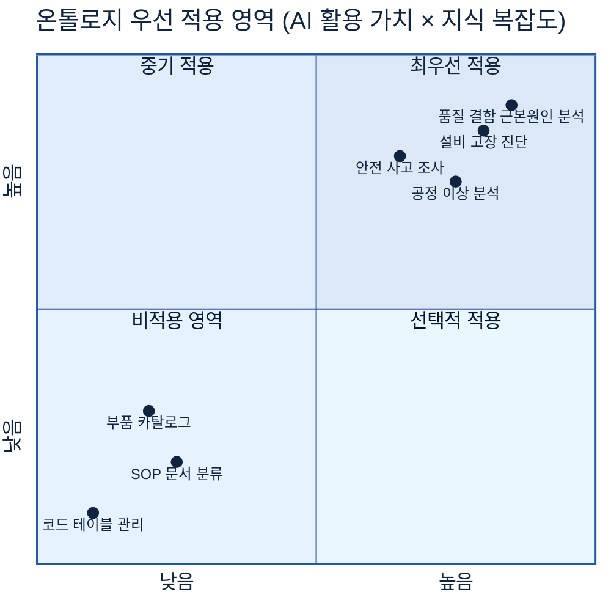

**두산 계열사 우선 후보 영역:**
1. **품질 결함 근본원인 분석(RCA)** — 결함 유형 → 원인(공정·설비·소재) → 조치의 인과 구조
2. **설비 정비·고장 진단** — 고장 증상 → 원인 → 정비 조치
3. **공정 이상 분석** — 공정 파라미터 이상 → 품질 영향 → 조정 방안
4. **안전 사고 조사** — 사고 유형 → 원인 체인 → 예방 조치

---

## 4. 무엇을 갖추나 (What)

> 👉 모든 온톨로지는 6가지 구성요소(재료)로 만들어진다. 그 재료로 만든 클래스를 **성격(3계층)**으로 배치하고, **코어/유즈케이스 2층**과 **공통/계열사 2층**으로 나눠 관리한다. 제조에서는 핵심 클래스 7개와 관계 7개가 필수 T-Box 골격이 된다.

<a id="kq2"></a>

> ❓ **핵심 질문 2 — "어떤 개념·관계를 모델링하나?"** 에 §4.1(6요소)과 §4.6(제조 핵심 엔티티 7·관계 7)이 답한다.

<a id="sec41"></a>

### 4.1 핵심 6요소 (정본 모델)

아래 6요소가 온톨로지의 구성요소다. W3C OWL의 핵심 구성과 정렬하되 제조 현업이 이해하기 쉽게 재정리했다. 이 가이드 전체에서 이 6요소로 일관되게 설명한다.

| 번호 | 요소명 | 영문 | 한 줄 정의 | 두산 예시 |
|---|---|---|---|---|
| 1 | 개념/클래스 | Class | 특성을 공유하는 개체들의 범주 | `결함`, `공정`, `설비`, `원인`, `조치` |
| 2 | 인스턴스 | Instance | 개념에 속하는 구체적 사례 | `스크래치-20240305-L3`(결함의 인스턴스) |
| 3 | 속성 | Property | 개념·인스턴스가 가지는 특성값 | `결함.심각도 = 3`, `결함코드 = "WELD-042"` |
| 4 | 관계 | Relationship | 두 개념을 잇는 방향 있는 연결에 붙인 이름 | `원인이 된다`, `검출된다`, `발생한다` |
| 5 | 계층 | Hierarchy | "A는 B의 한 종류(is-a)" 상위-하위 구조 | 스크래치 → 외관결함 → 결함 |
| 6 | 규칙/공리 | Axiom / Rule | AI가 새 사실을 추론하는 논리 제약 | "결함이 공정에서 발생하고, 그 공정이 쓰는 설비가 열화 상태면 → 결함의 원인은 그 설비다" |

표현의 기본 단위는 **트리플(Triple)** — 온톨로지 지식의 원자다: `주어(Subject) – 관계(Predicate) – 목적어(Object)`. 예: `스크래치-001 – 발생한다 – 연삭공정-라인3`.

**T-Box와 A-Box (가이드 전체에서 쓰는 용어):**
- **T-Box**(Terminological Box, 개념 스키마) — *스키마* 계층: 모든 클래스 정의·관계·계층·공리. 데이터 엔지니어가 설계한다. "DB의 DDL"에 해당.
- **A-Box**(Assertional Box, 인스턴스 데이터) — *인스턴스* 계층: 실제 기록(MES 이벤트, C/S Report, 검사 결과)에서 적재한 구체적 사실. "DB의 행(row)"에 해당.

> 추론을 **언제 계산하느냐**(사전 적재 vs 질의 시)는 아키텍처 결정이므로 [§7.4](#74-추론-적재-방식--t-boxa-box-트레이드오프)에서 다룬다.

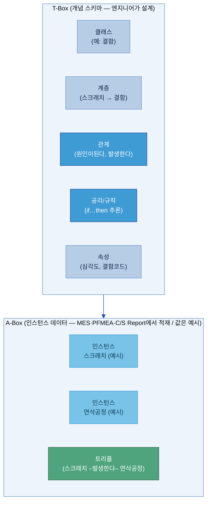

**추론은 이렇게 작동한다:** T-Box가 `스크래치 ⊏ 외관결함 ⊏ 결함`(하위클래스)을 선언하면, 스크래치 인스턴스는 별도 선언 없이 *자동으로* 외관결함이자 결함으로 추론된다. 모든 결함에 정의된 AI 조치가 재프로그래밍 없이 스크래치에도 적용된다. 이것이 계층 + 공리 요소의 힘이다.

> 기술 표준(RDF·OWL·SPARQL 등)의 상세 스펙은 [[별첨 E]](#appendix-e-기술-표준-rdfowlsparql-한-줄-풀이)를, 형식(RDF/LPG) 선택은 [§7](#7-아키텍처기술-선택)을 참고한다. 메인에서는 개념과 구조 이해에 집중한다.

### 4.2 관계 모델링 — Triple(트리플) 구조

온톨로지의 모든 관계는 **"주어(Subject) — 관계(Predicate) — 목적어(Object)"** 3개 짝으로 표현된다. 이것을 **트리플(Triple)**이라 한다.

```
(주어)          [관계]            (목적어)
베어링 마모  ─[원인이 된다]─▶  치수 불량
스크래치     ─[검출된다]────▶  비전 검사
진동 센서    ─[측정한다]────▶  베어링 진동값
```

**왜 Triple인가:** 모든 지식은 "무엇이 — 어떤 관계로 — 무엇과 연결되는가" 3가지로 표현 가능하다. AI가 이 트리플 구조를 따라 경로를 탐색하면서 추론한다.

> 트리플은 관계를 표현하는 **개념 단위**다. 이것을 실제 데이터로 **어떤 형식(RDF 트리플 / LPG 엣지)으로 적고 어디에 저장할지**는 [§7 아키텍처·기술 선택](#7-아키텍처기술-선택)에서 기준을 갖고 고른다.

<a id="sec43"></a>

### 4.3 엔티티를 성격으로 배치하는 3계층 구조

> 👉 6요소로 만든 클래스를 **성격(존재 방식)에 따라 3개 계층**에 배치한다. 이 구분이 "사실"과 "사람의 판단"을 섞지 않게 해, 나중에 판단이 바뀌어도 사실 기록은 그대로 유지된다. 6요소(재료)와 충돌하지 않는 **직교(별도 모델 아님) 배치 규율**이다.

| 계층 | 성격 | 시간 속성 | 제조 예시 | 핵심 엔티티 7 대응 |
|---|---|---|---|---|
| **L1 마스터 객체**(Continuant, 지속자) | 유즈케이스 없이도 존재. 느리게/거의 안 변함 | 없음(상태값은 변할 수 있음) | 설비·제품·공정 단계·자재 유형·공급사·작업자 | 제품·설비·공정·검사항목(항목 자체) |
| **L2 사건**(Occurrent, 발생자) | 해석 이전의 **사실**. 한 번 발생하면 고정 | **필수**(언제 일어났나) | 공정 집행, 검사 이벤트, 파라미터 이탈, 결함 검출 | 결함(검출 사건)·검사(검사 이벤트) |
| **L3 해석**(Interpretation) | 사람의 **판단** | 판단 시점 | 근본원인 판단, 시정조치 결정, 케이스 기록 | 원인(판단)·조치(시정 결정) |

> 어려운 말 풀이: **Continuant(지속자)** = 시간이 지나도 "그대로 있는" 것(설비). **Occurrent(발생자)** = "일어나는" 것, 시점을 가짐(검출). 두산 방법론이 쓰는 구분이며, 산업표준 상위 온톨로지 **BFO**([§7.5](#75-제조-표준-프레임워크-적용-판단-iof))의 핵심 구분과 같다. ('해석 레이어'는 BFO에 그 이름의 범주는 없고, IAO의 Information Content Entity·W3C PROV-O의 "사실 vs 추론 분리"에 근거한 도메인 적용이다.)

🏭 **왜 나누나 — 들뜸/박리 사례:** "라인3 #4521에서 2026-06-12 14:03 들뜸이 검출됨"은 **사건(L2)**이다 — 바뀌지 않는 사실. "그 원인은 프리프레그 흡습이었다"는 **해석(L3)**이다 — 나중에 재조사로 바뀔 수 있다. 둘을 한 노드에 섞으면, 원인 판단이 바뀔 때 검출 사실까지 다시 써야 한다. 분리하면 사건 기록은 영구 보존되고, 해석만 버전 갱신된다.

**참조 방향 규칙 (반드시 지킴):**
```
해석(L3) ──참조──▶ 사건(L2) ──참조──▶ 마스터(L1)     ✅ 허용
사건(L2) ──참조──▶ 해석(L3)                          ❌ 금지(역방향)
```
사건은 자신을 설명할 결론을 "미리" 알 수 없다(해석은 사건보다 나중). 사건이 해석을 참조하면, 새 해석이 추가될 때마다 사건을 수정해야 하고 사실의 불변성이 깨진다.

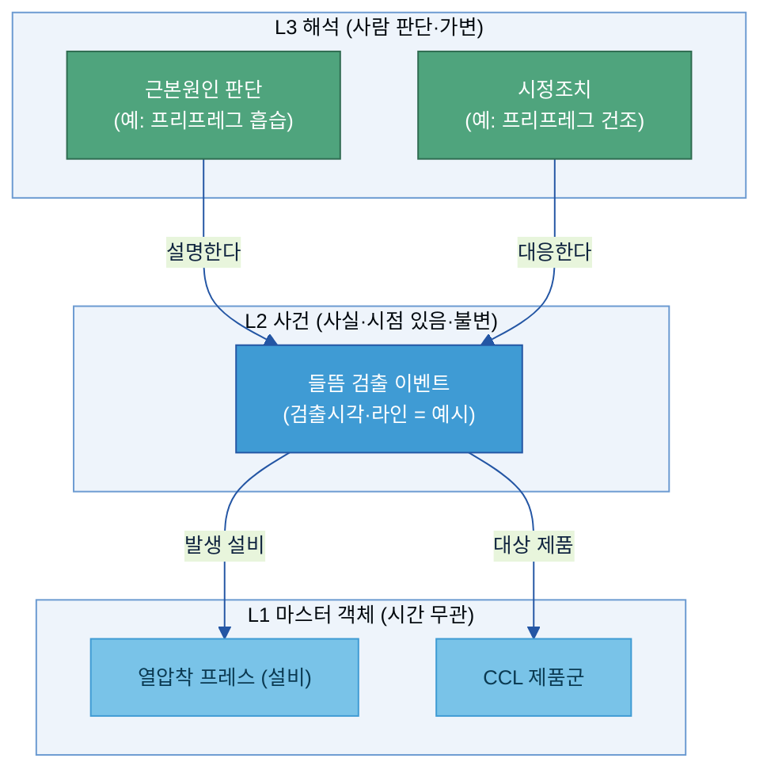

> 🔸 위 도식의 노드명·시각·번호는 **구조를 보여주기 위한 예시**다(실데이터 아님).

> **6요소·트리플과의 관계:** 위 노드는 모두 6요소의 "클래스/인스턴스"이고 화살표는 "관계"다. 3계층은 그 클래스들을 *성격으로 묶어* 참조 방향을 통제하는 **상위 설계 규율**일 뿐, 별도 모델이 아니다. [§5 예시](#5-예시-시나리오)의 결함-원인-조치도 이 3계층으로 읽으면 "검출 사건 → 원인 해석 → 조치 해석"이 된다.

<a id="sec44"></a>

### 4.4 코어 ↔ 유즈케이스 2층 분리 (재사용성의 척추)

> 👉 온톨로지는 **유즈케이스와 무관한 "코어"**와, 그 위에 얹는 **교체 가능한 "유즈케이스 레이어"**로 나눈다. 코어는 현실(객체·사건·해석)만 담고, 특정 대시보드·특정 에이전트의 사정은 유즈케이스 레이어가 흡수한다. 이 분리가 [§1.4 재사용 원칙](#sec14)을 구현하는 핵심 장치다.

| 구분 | 무엇을 담나 | 누가 설계하나 | 변경 빈도 |
|---|---|---|---|
| **코어(Core)** | 현실에 독립 존재하는 객체(L1)·사건(L2)·해석(L3). 어떤 유즈케이스가 와도 그대로 | 시맨틱 아키텍트 + 도메인 SME (9단계 1~7) | 낮음 — 코어 변경은 거의 파괴적([§8.1](#81-변경-관리버전)) |
| **유즈케이스 레이어(Use-case)** | 특정 활용(RCA 대시보드·진단 에이전트·예측 뷰)에만 필요한 전용 노드·관계·분류. 코어를 **복사하지 않고 참조**(`refersTo`·`IS_TYPE`) | 유즈케이스 팀 (9단계 8) | 높음 — 유즈케이스 교체 시 이 레이어만 갈아끼움 |

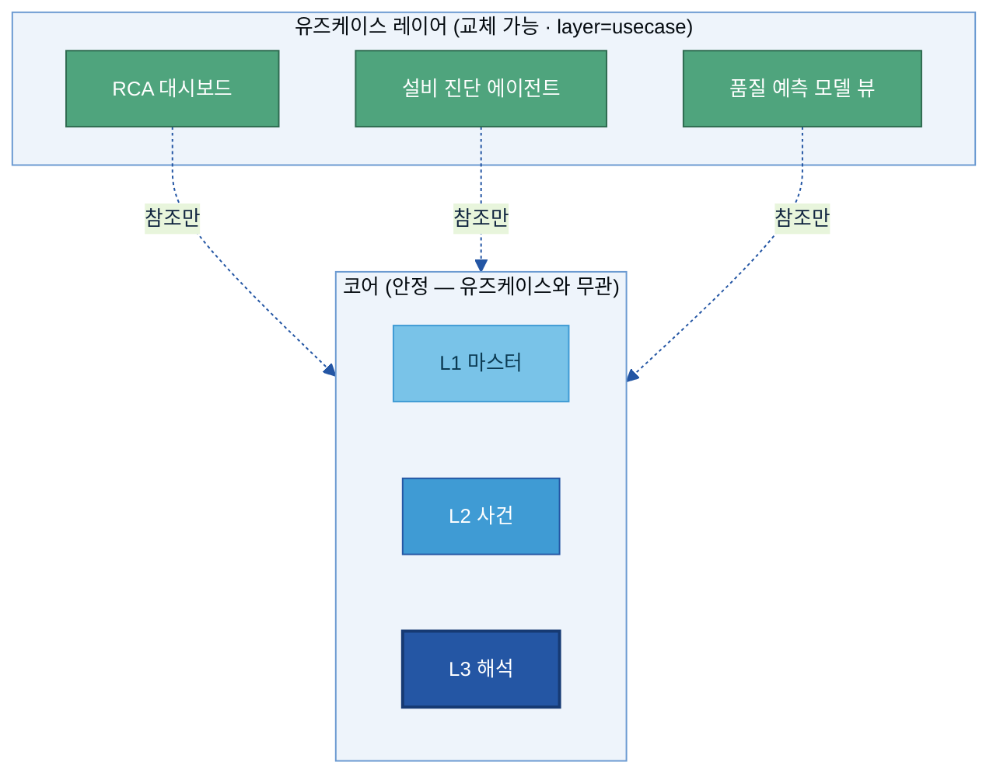

**규칙 세 가지:**
1. **코어는 유즈케이스를 모른다.** 코어만 보고 "이게 어느 대시보드/에이전트를 위한 것"이라고 말할 수 있으면 잘못 섞인 것이다(함정 2·6 — [§6.4](#64-설계-전-피해야-할-7가지-함정)).
2. **유즈케이스 레이어는 코어를 복사하지 않는다.** 같은 현실 객체면 이름이 달라도 새 노드를 만들지 않고 코어 노드를 **참조**한다. 모든 전용 노드에는 `layer: usecase` 태그를 단다.
3. **유즈케이스 교체 = 위 레이어만 교체.** 코어 노드는 건드리지 않는다. 코어가 유즈케이스에 종속되면 두 번째 유즈케이스에서 무엇을 고쳐야 할지 알 수 없게 된다.

> 이 2층은 9단계 방법론에서 **코어(1~7단계) → 유즈케이스(8단계)** 순서로 설계한다([§6](#6-어떻게-설계구축하나-how)). 코어 설계 산출물 양식은 [별첨 B 코어 기획서](별첨/B-3%20별첨%20B%20—%20코어%20온톨로지%20설계%20기획서.md), 유즈케이스 설계 산출물 양식은 [별첨 C 유즈케이스 기획서](별첨/B-3%20별첨%20C%20—%20유즈케이스%20레이어%20설계%20기획서.md). 목적 유형별 설계 차이는 [별첨 A 각론](별첨/B-3%20별첨%20A%20—%20유즈케이스%20온톨로지%20구축%20각론.md).

<a id="sec45"></a>

### 4.5 전사 공통 ↔ 계열사 확장 (지주 레이어)

<a id="kq3"></a>

> ❓ **핵심 질문 3 — "전사 공통 vs 계열사 특화 지식을 어떻게 나누나?"** 에 이 절과 [§6.2](#sec62)가 답한다.

§4.4의 코어/유즈케이스가 **재사용 축**이라면, 이 절은 여러 제조 계열사를 둔 지주사의 **조직 축**이다(두 축은 직교한다). 온톨로지를 **2계층**으로 설계한다.

- **전사 공통 온톨로지 (지주 관리)**: 모든 계열사가 공유하는 상위 개념 구조. `제품`·`공정`·`결함`·`원인`·`조치` 같은 상위 엔티티와 공통 관계 유형을 정의한다.
- **계열사 특화 온톨로지**: 전사 공통 개념을 **확장(Extension)**하여 현장 용어·관계를 추가한다. 별도 네임스페이스로 분리한다.

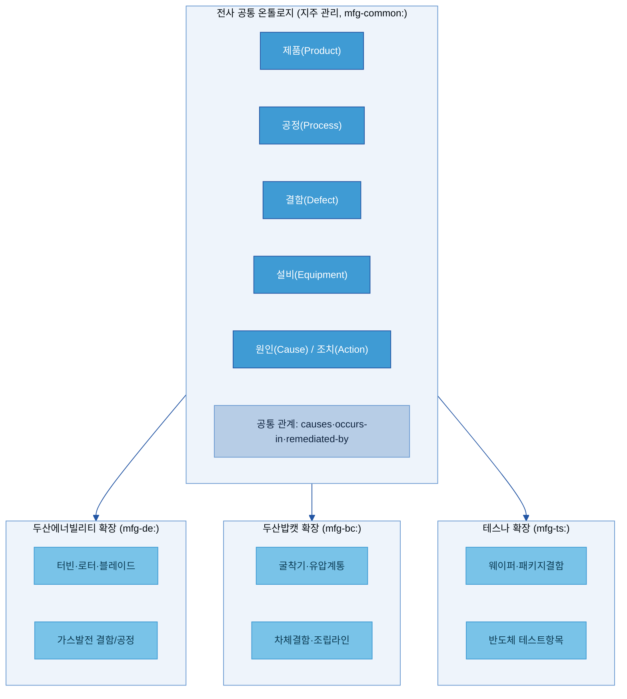

> 🔸 계열사 박스 안의 세부 개념(터빈·로터, 굴착기·유압계통, 웨이퍼 등)은 배치를 보여주기 위한 **예시**다.

**무엇을 어디에 두나 (배치 규칙):**
- **공통**: 2개 이상 계열사에서 같은 의미로 쓰이는 개념·관계
- **계열사**: 한 사업부 고유의 도메인·제품·공정에만 있는 개념
- **경합(여러 계열사에서 조금씩 다른 의미)**: 공통에 상위클래스로 두고, 계열사별 하위클래스로 차이를 흡수

**거버넌스 분리:** 공통 레이어 변경은 **거버넌스 보드 승인**, 계열사 레이어 변경은 **계열사 도메인 스튜어드 승인**만으로 처리한다. 이 분리가 한 계열사의 변경이 다른 계열사의 쿼리를 깨뜨리는 것을 막는다. (네임스페이스 구현 패턴은 [[별첨 I]](#appendix-i-네임스페이스-메커니즘과-neon-시나리오))

**상속 방식:** 계열사 개념이 전사 공통 개념을 상속(is-a)한다. 공통에서 `결함 occurs-in 공정`을 정의하면, 계열사는 `스크래치(결함의 하위) occurs-in 연삭공정(공정의 하위)`을 자동 상속한다.

<a id="sec46"></a>

### 4.6 제조 현장 핵심 엔티티·관계 + 항목 사전

🏭 두산 계열사 제조 현장에서 우선 정의할 핵심 엔티티 7가지와 관계 유형 7가지. PFMEA 구조·SOP 내용·C/S Report 필드와 거의 직접 대응한다.

**핵심 엔티티:**

| 엔티티(한글) | 엔티티(English) | 예시 인스턴스 | 3계층([§4.3](#sec43)) |
|---|---|---|---|
| 제품 | Product | 터빈, 굴착기, 웨이퍼, CCL | L1 |
| 공정 | Process | 연삭, 도금, 조립, 열압착 | L1 |
| 설비 | Equipment | 연삭기, 로봇팔, 열압착 프레스 | L1 |
| 검사항목 | Inspection-item | 표면조도, 치수, 경도 | L1 |
| 결함 | Defect | 스크래치, 치수불량, 들뜸 | L2(검출 사건) |
| 원인 | Cause | 치구마모, 흡습, 소재이상 | L3(판단) |
| 조치 | Action | 치구교체, 건조, 소재교환 | L3(판단) |

**핵심 관계 유형:**

| 관계 이름 | 영문 | From → To | 예시 트리플 |
|---|---|---|---|
| 원인이 된다 | causes | 원인 → 결함 | (치구마모) causes (스크래치) |
| 검출된다 | detected-by | 결함 → 검사항목 | (스크래치) detected-by (비전검사) |
| 발생한다 | occurs-in | 결함 → 공정 | (스크래치) occurs-in (연삭공정) |
| 조치한다 | remediated-by | 결함 → 조치 | (스크래치) remediated-by (치구교체) |
| 포함한다 | has-part | 설비 → 설비/공정 | (터빈) has-part (로터블레이드) |
| 측정한다 | measured-by | 제품/공정 → 검사항목 | (베어링진동) measured-by (진동센서#VB303) |
| 영향을 준다 | affects | 원인/결함 → 제품 | (진동이상) affects (베어링수명) |

🏭 **그래프 읽기:** `치구마모 –causes→ 스크래치 –occurs-in→ 연삭공정 –measured-by→ 표면조도`. 이 4개 노드·3홉 경로 덕분에 AI가 "스크래치가 왜 생겼고 어디서 검출되나?"를 한 번의 탐색 쿼리로 답할 수 있다.

**㉠ 노드 항목 사전 (현업이 코어 기획서에 채우는 칸 — 대표 항목):**

> 아래는 [별첨 B 코어 기획서](별첨/B-3%20별첨%20B%20—%20코어%20온톨로지%20설계%20기획서.md)의 "노드 후보" 표를 현업이 채울 때 각 칸이 무엇인지 풀어 둔 것이다. **빈 양식**은 별첨 B, **실제 채운 사례(CCL)**는 [별첨 A 각론 §4](별첨/B-3%20별첨%20A%20—%20유즈케이스%20온톨로지%20구축%20각론.md).

| 항목 | 쉬운 의미 | 예시값 | 필수/선택 | 작성 주체 |
|---|---|---|---|---|
| 노드명(label) | 클래스 이름(현업 언어) | `들뜸`, `열압착프레스` | 필수 | 도메인 SME |
| 정의 | 한 문장 정의 | "수지 미경화로 층간이 분리된 상태" | 필수 | 도메인 SME |
| 계층(L1/L2/L3) | 마스터/사건/해석 중 어디 | L2(사건) | 필수 | 시맨틱 아키텍트 |
| 주요 속성(property) | 노드가 갖는 특성값 | `검출시각`, `심각도`, `Lot ID` | 필수 | SME + 아키텍트 |
| 데이터 소스 | 이 노드를 채울 시스템·컬럼 | MES `press_temp`, ERP `lot_id` | 필수(없으면 "미확인") | 데이터 엔지니어 |
| 범용 여부 | 공통 vs 도메인 전용 | 도메인 전용 | 필수 | 거버넌스 |
| As-Is 근거 | As-Is 분석서의 출처 항목 | "C/S Report 결함 필드" | 필수 | SME |

> **노드 명명·ID·필수 속성 등 구현 규칙**은 [§7.9](#sec79)와 별첨 B §7. "나쁜 노드 → 좋은 노드" 작성 규칙은 [§6.2](#sec62).

<a id="sec47"></a>

### 4.7 개념-데이터-문서 연결

<a id="kq4"></a>

> ❓ **핵심 질문 4 — "어떤 데이터·문서와 연결하나?"** 에 이 절과 [§6.2](#sec62)가 답한다.

온톨로지는 **개념 구조(설계도)**이고, 실제 데이터·문서는 그 설계도에 연결되는 콘텐츠다. 모든 개념은 실제 데이터 원천으로 역추적되어야 한다(As-Is 분석서 근거가 없는 노드는 만들지 않는다 — [§6.0](#60-설계-입력-as-is-분석서)). **개념-데이터-문서 매핑표**가 ETL 파이프라인이 A-Box를 자동 적재하게 하는 통합 명세다.

🏭 **전자BG CCL 들뜸 온톨로지 — 개념-데이터-문서 매핑 샘플(예시 값):**

| 온톨로지 클래스 | Glossary 용어(A-3) | 메타데이터 필드(A-2) | 카탈로그 자산(A-1) | 원천 문서 | 예시 인스턴스 수 |
|---|---|---|---|---|---|
| `결함(Defect)` | 결함 (Defect) | `defect_type` | 검사 기록 | C/S Report, PFMEA | ~2,400 |
| `들뜸(Delamination)` | 층간 들뜸 | `defect_code='DELAM'` | 출하 검사 기록 | C/S Report 2022–2024 | ~310 |
| `원인(Cause)` | 원인 (Cause) | `cause_code` | PFMEA 테이블 | PFMEA, 8D 보고서 | ~180 |
| `프리프레그흡습` | 프리프레그 흡습 | `humidity_exceed_flag` | 원자재 보관 로그 | PFMEA #LAM-012, 보관 이력 | ~70 |
| `조치(Action)` | 조치 (Corrective Action) | `action_code` | 조치 레지스트리 | 8D 보고서, C/S Report | ~95 |
| `열압착공정` | 열압착 공정 | `process_step_id` | 공정 카탈로그 | SOP-LAM-012 | ~120 |
| `열압착온도` | 열압착 온도 | `press_temp_c` | MES 프레스 로그 | 프레스#2 로그 | 프레스별 측정 |

**이 표의 목적:** 새 C/S Report가 접수되면 ETL 파이프라인이 `defect_type`·`cause_code`를 읽어 이 표로 온톨로지 클래스에 매핑하고, 그래프 DB에 인스턴스 트리플을 **자동 생성**한다 — 신규 레코드마다 온톨로지를 수작업 편집할 필요가 없다.

> §4·§6·별첨의 두산밥캣 용접(전극 캡 마모→박리) 예시는 **또 다른 계열사 적용 사례**다(같은 방법론, 다른 공정).

---

## 5. 예시 시나리오

> 👉 "이 CCL 들뜸 클레임의 원인이 뭐고, 고객에게 보낼 답변을 어떻게 만드나?" — 온톨로지가 있을 때 AI가 **C/S Report(시정조치 보고서) 초안**을 어떻게 채워주는지 전자BG CCL 사례로 본다. *(출처: 내부 자료 — Kearney 두산지주 AI-Ready Data 체계 CSO 중간보고 모듈2, 2026-06-16)*

**상황:** 전자BG CCL(동박적층판) 라인. 고객사에서 PCB 가공 중 **들뜸(Delamination)** 클레임 3건이 접수됐다. 품질 담당자는 원인을 규명해 고객에게 보낼 **C/S Report 초안**을 작성해야 한다. 보통 ERP·MES·SOP·과거 보고서를 따로따로 뒤져 며칠이 걸린다. 담당자가 AI 에이전트에 *"이 클레임들의 공통 원인을 찾고 C/S Report 초안을 만들어줘"*라고 요청한다.

### 5.1 적용 전/후 대비

**Before (온톨로지 없음)** — 담당자가 시스템을 하나씩 수작업 조회:
- ERP에서 클레임 제품의 Lot을 일일이 찾아 공통 원자재·생산일을 수기 대조
- MES에서 해당 Lot의 프레스 로그를 찾아 SOP 기준과 눈으로 비교
- 과거 유사 클레임을 C/S Report 폴더에서 키워드 검색
- 평균 작성 소요: 수일, 담당자 숙련도에 좌우

**After (온톨로지 + 지식그래프)** — 같은 요청. 에이전트가 온톨로지를 따라 5단계로 초안을 채운다.

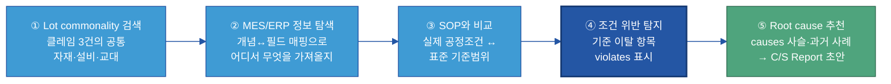

T-Box에 다음이 선언돼 있어 이 탐색이 가능하다(데이터 준비의 산출물):
1. `들뜸 ⊏ 층간결함 ⊏ CCL결함` (계층)
2. `제품 –belongsToLot→ Lot –usedMaterial→ 원자재Lot`, `Lot –producedOn→ 설비` (Lot commonality 다리)
3. `Lot –underCondition→ 공정조건 –governedBy→ SOP –specifies→ 기준범위` (실제값↔표준 다리)
4. `프리프레그흡습/열압착온도미달 –causes→ 수지미경화 –causes→ 들뜸` (인과 사슬)

AI가 공통 Lot과 SOP 위반을 한 쿼리로 탐색한다(LPG 그래프 DB의 openCypher):
```cypher
MATCH (cl:Claim)-[:ABOUT]->(:Product)-[:BELONGS_TO]->(lot:Lot)
MATCH (lot)-[:USED_MATERIAL]->(m:MaterialLot),
      (lot)-[:PRODUCED_ON]->(eq:Equipment),
      (lot)-[:UNDER_CONDITION]->(cond:ProcessCondition)-[:GOVERNED_BY]->(sop:SOP)
WHERE cond.value < sop.minSpec OR cond.value > sop.maxSpec   // SOP 기준 위반
RETURN m.id AS 공통자재, eq.id AS 설비, cond.name, cond.value, sop.spec
```

**검색 결과(예시 값):**
- 공통 자재: 프리프레그 원자재 Lot `PPG-2403-17` (클레임 3건 전부), 공통 설비: 열압착 프레스 `#2`, 공통 교대: 야간조
- SOP 위반: 열압착 온도 `174°C` < 기준 `185±5°C` (SOP-LAM-012), 프리프레그 보관 습도 기준 초과

> **에이전트가 채운 C/S Report 초안(발췌):**
> - **현상**: CCL 들뜸(Delamination) 클레임 3건 — 공통 Lot `PPG-2403-17`·프레스 `#2`
> - **추정 원인**: ① 프리프레그 보관 습도 초과(흡습) ② 열압착 온도 SOP 미달(174°C < 185±5°C) → 수지 미경화
> - **근거**: MES 프레스#2 로그·ERP 보관 습도 이력·SOP-LAM-012 §2.1, 과거 유사 클레임 C/S #2312
> - **권장 조치**: 프리프레그 건조(베이킹) 재적용 · 프레스#2 온도 센서 교정
> *(Lot·수치·SOP ID는 예시 값 — 실제 PoC에서 실데이터로 대체. 초안은 사람 검수 후 발송)*

### 5.2 온톨로지가 구체적으로 가능케 한 것

| 에이전트 단계 | 온톨로지가 선언한 것(준비된 데이터) | AI가 할 수 있게 된 것 |
|---|---|---|
| ① Lot commonality | `제품 –belongsToLot→ Lot –usedMaterial→ 원자재Lot`, `Lot –producedOn→ 설비` | 여러 클레임의 공통 자재·설비·교대를 그래프 탐색 한 번으로 |
| ② MES/ERP 탐색 | 개념↔시스템 필드 매핑(`공정조건 –measuredIn→ MES`, `원자재Lot –sourcedFrom→ ERP`) | 어느 시스템 어느 필드를 가져올지 자동 판단 |
| ③ SOP 비교 | `공정 –governedBy→ SOP –specifies→ 기준범위` | 실제값 vs 표준 자동 대조 |
| ④ 위반 탐지 | `공정조건 –violates→ SOP기준` (규칙/SHACL) | 기준 이탈 항목 자동 식별 |
| ⑤ Root cause | `SOP위반 –causes→ 결함`, `결함 –hasCorrectiveAction→ 조치` | 원인·조치 후보를 근거와 함께 추천 |

**PoC 목표 예시(실제 PoC에서 자체 설정):** C/S Report 초안 작성 시간을 수일 → 수시간으로 단축. 현 담당자 기준선 대비 PoC에서 측정. [as-is에서 채움]

### 5.3 완성 예시 — CCL 결함-조건-원인-조치 트리플

전자BG CCL C/S Report에서 추출한 핵심 트리플 예시:

```
(들뜸)            ─[is-a]──────────▶  (층간결함)
(층간결함)         ─[is-a]──────────▶  (CCL결함)
(들뜸)            ─[occurs-in]─────▶  (열압착공정)
(열압착공정)       ─[governed-by]───▶  (SOP-LAM-012)
(프리프레그흡습)    ─[causes]────────▶  (수지미경화)
(열압착온도미달)    ─[causes]────────▶  (수지미경화)
(수지미경화)       ─[causes]────────▶  (들뜸)
(프리프레그건조)    ─[remediated-by]─▶  (프리프레그흡습)
```

이 트리플들이 그래프 DB에 누적되면 AI가 "들뜸 발생 → 흡습·열압착 온도미달이 원인 → 건조·온도 보정으로 조치"를 추론하고, Lot commonality로 **어느 생산분이 영향받았는지**까지 좁혀 C/S Report 초안에 채운다.

> 이 트리플 구조를 만든 설계 절차(9단계)는 [§6](#6-어떻게-설계구축하나-how), 아키텍처는 [§7](#7-아키텍처기술-선택)에서 다룬다. 위 트리플을 *채워서 내는 양식*은 [별첨 B 코어 기획서](별첨/B-3%20별첨%20B%20—%20코어%20온톨로지%20설계%20기획서.md), *실제 CCL 노드를 어느 레벨로 잡았는지 사례*는 [별첨 A 각론 §4](별첨/B-3%20별첨%20A%20—%20유즈케이스%20온톨로지%20구축%20각론.md).

---

## 6. 어떻게 설계·구축하나 (How)

> 👉 온톨로지 설계는 **9단계**를 단일 정본 절차로 따른다. 흐름은 **코어 온톨로지(1~7단계) → 유즈케이스 레이어(8단계) → 운영(9단계)**이다. 핵심은 "산출물 양식이 아니라 현실에서 개념을 길어 올리고, 작게 시작해 검증한 뒤 확장"이며, 모든 노드·관계의 근거는 **As-Is 분석서**에서 나온다.

<a id="sec60"></a>

### 6.0 설계 입력: As-Is 분석서

9단계에 들어가기 전, 설계의 입력이 되는 **As-Is 분석서**를 확보한다. As-Is 분석서는 대상 도메인의 **현실**을 정리한 문서로, 코어·유즈케이스 기획서의 모든 노드·관계가 여기서 근거를 얻는다(2단계 밸류체인 분석의 산출물 성격).

| As-Is 분석서가 담는 것 | 온톨로지 설계에 쓰이는 곳 |
|---|---|
| E2E 업무 흐름 (예: VOC 접수 ~ C/S 리포트 발송) | 1단계 도메인 목적·적용 범위 |
| 현실에 존재하는 물리·조직·기준 객체 | 3단계 L1 마스터 객체 |
| 시간과 함께 일어나는 사건·이벤트 | 4단계 L2 사건 |
| 현업의 판단·귀책·대책 결과 | 6단계 L3 해석 |
| 데이터 소스 확인 결과 (MES·ERP·WMS 등) | 각 노드의 데이터 소스 컬럼([§4.7 매핑표](#sec47)) |
| 데이터 미확인·수기 관리 항목 | 데이터 소스 "미확인" 표시 → 미결 사항 |
| 팀 간 용어 불일치·동의어 | 노드 정의 및 alias 속성([A-3 Glossary](../A-3%20Glossary/A-3%20Glossary.md) 연계) |

> **원칙: As-Is 근거 없는 노드·관계는 만들지 않는다.** 데이터 소스가 확인되지 않은 노드는 "미확인"으로 표시하고 확정 계획을 미결 사항에 적는다([별첨 B §9 미결](별첨/B-3%20별첨%20B%20—%20코어%20온톨로지%20설계%20기획서.md)). 이것이 함정 1(산출물·양식을 노드화)·함정 4(데이터 없는 연결)를 원천에서 막는다. As-Is에서 객체·사건·암묵지를 *현장에서 길어 올리는* 방법은 [별첨 D Discovery Workshop](별첨/B-3%20별첨%20D%20—%20Discovery%20Workshop%20운영%20가이드.md).

### 6.1 9단계 한눈에

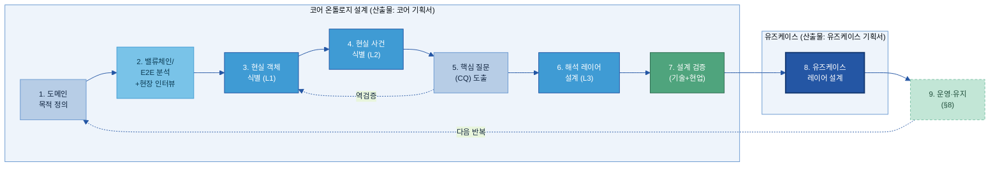

| 단계 | 무엇을 | 산출물·연결 |
|---|---|---|
| **1 도메인 목적 정의** | 측정 가능한 단일 운영지표 수준의 목적 **한 문장**(예: "라인3 용접 결함의 RCA 시간을 단축한다") | 코어 기획서 §1 |
| **2 밸류체인/E2E 분석** | E2E 흐름을 그리고 각 단계에서 객체·사건 후보 도출(아직 노드화 미룸). **현장 인터뷰·디스커버리 워크샵**으로 현실 객체·사건·암묵지 수집(3단계 전 필수) | As-Is([§6.0](#sec60)) · [별첨 D 워크샵](별첨/B-3%20별첨%20D%20—%20Discovery%20Workshop%20운영%20가이드.md) |
| **3 현실 객체 식별** | "①유즈케이스 없이도 독립 존재? ②사실로 고정?" 두 질문으로 L1 마스터 객체 확정 | 코어 기획서 §2 / [§4.3](#sec43) |
| **4 현실 사건 식별** | **시간 속성 필수**. 공정·절차 집행 이벤트가 중심 → L2 사건 | 코어 기획서 §2 / [§4.3](#sec43) |
| **5 핵심 질문(CQ) 도출** | 1단계 목적 관점의 질문 3~5개로 3·4단계 설계를 **역검증** + 각 암묵지를 **온톨로지 관계 vs 쿼리·앱 로직**으로 둘지 분류 | 코어 기획서 §6 |
| **6 해석 레이어 설계** | 근본원인·시정조치 등 사람 판단을 L2 사건 **위에** L3로 | 코어 기획서 §2 / [§4.3](#sec43) |
| **7 설계 검증** | 기술 검증(SHACL·추론기·OOPS!) + 현업 확인 병행 → **코어 완성** | [§6.5](#65-검증-체크리스트--4원칙-백본) / 코어 기획서 §8 |
| **8 유즈케이스 레이어 설계** | 코어 위에 얹고 **코어 불변**. 교체 시 이 레이어만 | 유즈케이스 기획서([별첨 C](별첨/B-3%20별첨%20C%20—%20유즈케이스%20레이어%20설계%20기획서.md)) |
| **9 운영·유지** | 변형·지식 갱신·시스템 대응. L1·L2 수정 시 절차화·준수 | [§8.1 변경 관리](#81-변경-관리버전) |

> 위 9단계 모델은 두산 방법론을 정본으로 하되, METHONTOLOGY의 라이프사이클 규율 [[LibreTexts](https://eng.libretexts.org/Bookshelves/Computer_Science/Programming_and_Computation_Fundamentals/An_Introduction_to_Ontology_Engineering_(Keet)/06:_Methods_and_Methodologies/6.01:_Methodologies_for_Ontology_Development)], NeOn의 재사용 전략 [[NeOn](https://oeg.fi.upm.es/index.php/en/completedprojects/8-neon/index.html)], Stanford Ontology Development 101 [[Noy & McGuinness](https://protege.stanford.edu/publications/ontology_development/ontology101.pdf)]과 정합한다.

<a id="sec62"></a>

### 6.2 코어 온톨로지 설계 (1~7단계) — 산출물: 「코어 설계 기획서」

> 👉 1~7단계의 산출물은 [별첨 B 「코어 온톨로지 설계 기획서」](별첨/B-3%20별첨%20B%20—%20코어%20온톨로지%20설계%20기획서.md)다. 빈 양식 채우기가 아니라 **구축 착수 가능한 실행안**이어야 한다 — 도메인 목적·노드 후보(As-Is 근거 연결)·계층·관계·공리·핵심 질문 경로 검증·기술 검토·설계 검증이 모두 채워져야 완료. 목적 유형별 설계 차이·노드 레벨 결정 각론은 [별첨 A 각론](별첨/B-3%20별첨%20A%20—%20유즈케이스%20온톨로지%20구축%20각론.md).

**1·2단계 — 목적·밸류체인:** 먼저 **측정 가능한 단일 운영지표 수준의 목적을 한 문장**으로 고정한다. 목적이 여러 개로 흩어지거나 측정 불가하면 온톨로지 범위가 발산한다. 그 다음 [§6.0 As-Is 분석서](#sec60)의 E2E 흐름을 따라 각 단계에서 객체·사건 후보를 뽑는다. **이때 아직 노드화하지 않는다** — 현실 흐름에서 개념을 길어 올리는 단계다. 현장 수집은 [별첨 D Discovery Workshop](별첨/B-3%20별첨%20D%20—%20Discovery%20Workshop%20운영%20가이드.md)으로.

**3·4·6단계 — 객체·사건·해석 식별(3계층):** [§4.3](#sec43)의 L1·L2·L3로 후보를 배치한다. L1은 "독립 존재 + 사실 고정" 두 질문을 통과한 것, L2는 시간 속성을 가진 사실, L3는 사람의 판단이다. **사실(L2)과 판단(L3)을 한 노드에 섞지 않는다.**

**5단계 — 핵심 질문(CQ) 역검증:** 1단계 목적 관점의 질문 3~5개(Competency Questions)를 도출해 "지금 설계가 이 질문에 노드·관계 경로로 답하나"를 되짚는다. 경로가 연결되지 않으면 노드·관계를 수정한다. 🏭 예: "이번 분기 라인3 들뜸의 상위 원인은?", "특정 프리프레그 Lot과 관련된 공정 파라미터는?", "지난 12개월 들뜸에 적용된 조치는?" — 동시에 각 암묵지를 **온톨로지 관계로 구조화할지 vs 쿼리·앱 로직으로 둘지**를 분류한다(무엇을 그래프에 넣을지 경계 결정).

**7단계 — 설계 검증 → 코어 완성:** [§6.5 4원칙 백본](#65-검증-체크리스트--4원칙-백본)으로 점검하고, 샘플 데이터로 핵심 질문에 답이 나오는지 확인한 뒤 코어를 확정한다.

> **작게 시작:** 모든 정립된 방법론이 처음부터 전사 종합 온톨로지를 만드는 것을 경계한다. **한 제품 라인 + 한 결함 도메인**(예: "CCL 들뜸 RCA")으로 진입. 50~80개 개념·10~15개 관계면 초기 AI 검색 시연에 충분하다.

#### 6.2.1 PFMEA에서 개념 추출 — 직접 매핑

PFMEA(Process Failure Mode and Effects Analysis, 잠재적 고장 유형 및 영향 분석)는 제조 온톨로지 개념의 가장 풍부한 단일 원천이다(2단계 지식 원천). 열 구조가 B-3 정본 모델에 거의 직접 대응한다.

| PFMEA 열 | 온톨로지 요소 | 3계층 |
|---|---|---|
| 고장 모드(Failure Mode) | 결함 하위클래스 (예: `들뜸`) | L2 |
| 잠재 영향(Potential Effect) | 영향 (`has-effect`로 연결) | L2 |
| 잠재 원인(Potential Cause) | 원인 하위클래스 (예: `프리프레그흡습`) | L3 |
| 현행 관리(Current Control) | 관리수단 (`mitigates`로 연결) | L3 |
| 권장 조치(Recommended Action) | 조치 하위클래스 (예: `프리프레그건조`) | L3 |
| 심각도(S)/발생도(O)/검출도(D) | 결함 클래스의 정수 데이터 속성 | 속성 |

🏭 **PFMEA 추출 완성 예시(밥캣 용접 라인 — 또 다른 계열사 사례):**

```
PFMEA 행:
  공정 단계: 용접 – 캡 형성
  고장 모드: 박리(Desoldering)
  잠재 영향: 접합 강도 기준 미달 → 조립 불합격
  잠재 원인: 전극 캡 마모 > 30일
  현행 관리: 4시간마다 육안 검사
  권장 조치: 전극 캡 교체; 접촉 저항 확인
  심각도: 8 / 발생도: 3 / 검출도: 5

→ 온톨로지 생성:
  클래스: 박리 (⊏ 접합불량 ⊏ 용접결함)        [L2 사건]
  클래스: 전극캡마모 (⊏ 설비열화 ⊏ 원인)       [L3 해석]
  클래스: 캡교체조치 (⊏ 정비조치 ⊏ 조치)        [L3 해석]
  관계: 전극캡마모 –causes→ 박리
  관계: 박리 –remediated-by→ 캡교체조치
  데이터 속성: 박리.심각도=8, .발생도=3, .검출도=5
```

[[ResearchGate PFMEA Ontology](https://www.researchgate.net/publication/258436781_A_System_for_Distributed_Sharing_and_Reuse_of_Design_and_Manufacturing_Knowledge_in_the_PFMEA_Domain_Using_a_Description_Logics-based_Ontology)]: PFMEA 시트는 이미 고장 모드·원인·영향·관리를 표 형태로 조직한다 — 지식 엔지니어의 일은 그 표를 형식적 클래스 계층과 관계 정의서로 변환하는 것이다.

**LLM의 개념 추출 보조:** LLM은 PFMEA/SOP 텍스트에서 후보 개념을 제안해 3·4단계를 가속한다. 단:
- LLM은 올바른 클래스 계층을 결정하지 못한다(도메인 판단 필요)
- LLM은 문서 간 용어 충돌을 해소하지 못한다(SME 권한 필요)
- LLM이 추출한 모든 개념은 형식화 전 SME 검증이 필수다

도메인 특화 질문에서 문서 청크가 온톨로지 구조와 함께 제공될 때 하이브리드 파이프라인은 약 90% 정확도, 구조만으로는 15~20%에 그친다.[[arXiv 2511.05991](https://arxiv.org/html/2511.05991v1)] **사람 SME 검증은 타협 불가**다.

#### 6.2.2 노드·프로퍼티 작성 규칙 — Before → After

> ㉡ 같은 현실도 "어떻게 노드·프로퍼티로 적느냐"에 따라 재사용 가능한 코어가 되기도, 유즈케이스에 종속된 쓰레기가 되기도 한다. 아래는 [별첨 B 코어 기획서](별첨/B-3%20별첨%20B%20—%20코어%20온톨로지%20설계%20기획서.md)를 채울 때의 교정 쌍이다(실제 CCL 적용은 [별첨 A §4](별첨/B-3%20별첨%20A%20—%20유즈케이스%20온톨로지%20구축%20각론.md)).

| 구분 | 🚫 나쁜 예 | ✅ 좋은 예 | 왜 |
|---|---|---|---|
| **객체를 속성에 묻음** | `들뜸.발생설비 = "프레스#2"` (문자열 속성) | `들뜸 –occurs-on→ 프레스#2`(L1 노드) | 객체로 승격해야 "프레스#2에서 난 모든 결함"을 탐색 가능(함정 3) |
| **사실+판단 혼재** | `들뜸{검출시각, 근본원인="흡습"}` 한 노드 | `들뜸검출`(L2) ←설명– `흡습판단`(L3) 분리 | 원인 재판단 시 검출 사실 보존(함정 7·[§4.3](#sec43)) |
| **산출물 양식을 노드화** | `C/S리포트3페이지표` 노드 | 리포트가 *참조하는* 현실 객체·사건을 노드로 | 출력 템플릿이 아니라 현실을 모델(함정 1) |
| **유즈케이스 로직 내장** | `결함.대시보드정렬순위 = 1` | 정렬·우선순위는 유즈케이스 레이어로([§4.4](#sec44)) | 코어가 특정 대시보드에 종속됨(함정 2·6) |
| **동의어 중복 노드** | `용접불량` + `용접결함` 별도 노드 | 한 노드 + `alias` 속성(A-3 연계) | 같은 현실이 여러 노드로 분열(함정 5) |

> **속성 명명·식별자 규칙**(노드 라벨 명명 규칙·관계 유형 명명·ID 구조·필수 속성 기준)은 구현 성격이라 [§7.9](#sec79)와 별첨 B §7에 둔다.

### 6.3 유즈케이스 레이어 설계 (8단계) — 산출물: 「유즈케이스 기획서」

> 👉 코어가 완성(7단계)된 뒤, 특정 활용을 위한 전용 구조를 코어 **위에** 얹는다. 산출물은 [별첨 C 「유즈케이스 레이어 설계 기획서」](별첨/B-3%20별첨%20C%20—%20유즈케이스%20레이어%20설계%20기획서.md)다. **이 문서는 코어를 재정의하지 않는다.**

유즈케이스 설계는 다음을 정의한다(별첨 C 양식 순서):

1. **유즈케이스 정의** — 목적·유형(탐색/예측/모니터링/추천/자동화)·주 사용자·수명·기대 효과
2. **입력 / 출력** — 무엇을 받아 무엇을 내보내나(온톨로지가 애플리케이션과 만나는 경계)
3. **핵심 기능 질문** — 이 레이어가 답할 질문 3~5개 + **코어만으로 답할 수 없는 이유**
4. **코어 참조 구조** — 코어 노드를 **복사하지 않고 참조**(`refersTo`/`IS_TYPE`/`CONCERNS`)
5. **유즈케이스 전용 노드·관계** — 코어에 없는 것만, 모두 `layer: usecase` 태그
6. **암묵지 구현 방식** — 수집·구조화·검증·적재
7. **코어 변경 요청** — 코어에 반영할 공통 개념이 발견되면 기록(없으면 "없음")

> 목적 유형(탐색·예측·모니터링·추천·자동화)에 따라 **무엇을 강조해 설계하는지가 다르다** — 유형별 노드·관계 설계 접근 차이는 [별첨 A 각론 §1](별첨/B-3%20별첨%20A%20—%20유즈케이스%20온톨로지%20구축%20각론.md).

🏭 **전자BG CCL 예시:** 유즈케이스 = "C/S Report 초안 자동 생성"(자동화형). 입력 = 클레임 3건·제품 Lot, 출력 = C/S Report 초안. 핵심 기능 질문 = "여러 클레임의 공통 원인 사슬은?"(코어의 단건 인과는 있으나, *여러 클레임을 가로지르는 commonality 집계 뷰*는 유즈케이스 전용). 전용 노드 = `ClaimCluster`(클레임 묶음), 코어의 `Lot`·`결함`·`SOP`는 참조만.

> **경계 주의(데이터 준비 관점):** 유즈케이스 레이어는 "C/S Report 초안을 만드는 에이전트"를 **구현하는 게 아니라**, 그 에이전트가 읽을 **전용 지식 구조(노드·관계·태그)를 준비**하는 것이다. 에이전트·앱 구현은 D계열 소관([§8.2 경계](#82-ai-활용--관계-기반-검색추천-3가지-패턴)).

### 6.4 설계 전 피해야 할 7가지 함정

아래는 온톨로지 설계가 실패하는 전형적 패턴이다. 각 함정에 이 가이드가 어디서 막는지 함께 적는다.

| # | 함정 | 결과 | 이 가이드의 방어 |
|---|---|---|---|
| 1 | 산출물·양식 구조를 노드로 옮김 | 현실이 아니라 출력 템플릿을 모델링 | [§6.0 As-Is 근거](#sec60)·[§6.2 밸류체인](#sec62) |
| 2 | 처리 순서·우선순위 규칙을 노드로 넣음 | 유즈케이스 로직이 온톨로지에 박혀 종속됨 | [§4.4 코어/유즈케이스 분리](#sec44) |
| 3 | 현실 객체를 (별도 노드가 아니라) 속성으로 묻음 | 객체 기반 패턴 분석 불가 | [§4.3 L1 마스터 객체로 승격](#sec43) |
| 4 | 데이터 없는 연결 설계 | 구현 단계에서 막힘 | [§4.7 매핑표](#sec47)·[[별첨 H]](#appendix-h-graphrag-전제조건-체크리스트) |
| 5 | 이음동의어를 중복 노드로 | 같은 현실 객체가 여러 노드로 분열 | [§6.2 개념 정제](#sec62)·A-3 연계 |
| 6 | 유즈케이스 레이어와 코어 혼용 | 다음 유즈케이스 추가 시 무엇을 고칠지 모름 | [§4.4 코어/유즈케이스 분리](#sec44) |
| 7 | 스키마(T-Box)와 인스턴스(A-Box) 혼재 | 케이스마다 스키마가 버전업됨 | [§4.1 T-Box/A-Box 분리](#sec41) |

<a id="sec65"></a>

### 6.5 검증 체크리스트 — 4원칙 백본

7단계 설계 검증을 **네 가지 원칙**으로 묶어 점검한다. 한 원칙이라도 통과 못 하면 해당 설계 단계가 덜 끝난 것이다. (정량 지표 연결은 [§10 성과 지표](#10-성과-지표로드맵고도화))

| 원칙 | 핵심 질문 | 확인 항목 | 연결 도구·지표 |
|---|---|---|---|
| **현실성(Fidelity)** | 현실을 올바르게 담았나 | 핵심 객체·사건 누락 없음 / L2 시간 속성 존재 / 참조 역방향 없음 / 데이터 연결 확인 / E2E 경로 단절 없음 | SHACL · 고립 개념 수([§10](#10-성과-지표로드맵고도화)) |
| **명시성(Explicitness)** | 암묵지가 구조로 드러났나 | 현업 언어와 라벨 일치 / 인과 판단이 관계로 표현됨 / 동의어 중복 노드 없음 | OOPS! 스캐너 · SME 검수 |
| **재사용성(Reusability)** | 코어가 유즈케이스 없이 성립하나 | 레이어·도메인 태깅 완료 / 유즈케이스 제거 후 코어 독립 성립 / 범용 노드에 도메인 특화 속성 없음 | 코어/유즈케이스 분리([§4.4](#sec44)) |
| **설명력(Explainability)** | 결론의 근거를 구조로 제시하나 | CQ 전체 답변 가능 / 추론 경로를 노드·관계로 재현 / 노드·관계가 자연어로 해석됨 | CQ 답변 테스트 · provenance([[별첨 J]](#appendix-j-추가-정확도-벤치마크근거)) |

> 이 4원칙은 [§1.4 5원칙](#sec14)의 검증판이다 — 5원칙이 "어떻게 설계할까"라면, 4원칙은 "잘 설계됐나"를 묻는다.

---

## 7. 아키텍처·기술 선택

> 👉 무엇을 모델링할지(§4~§6) 정했으면, **"어떤 형식으로 구조화하고 → 어디에 저장하고 → 어떤 쿼리 언어로 → 추론은 언제 계산하고 → 표준을 쓸지 → 외부와 어떻게 연동하고 → 그래프 혼자 못 하는 건 무엇과 조합할지"**를 기준을 갖고 고른다. 이것이 코어 기획서 §7(기술 검토)의 내용이며, 형식을 먼저 정하면 저장소·쿼리 언어가 따라온다.

### 7.1 결정 순서 — 무엇을 먼저 정하나

흔한 실수는 "익숙한 DB부터 고르는 것"이다. 올바른 순서는 **형식 → 저장소 → 쿼리 언어 → 추론 적재 방식 → 표준 적용 판단 → 외부 연동 → 폴리글랏 조합 → 진단**이다. 각 단계는 앞 단계 결정에 의존한다.

```mermaid
%%{init: {'theme':'base','themeVariables':{'primaryColor':'#DCE8F5','primaryBorderColor':'#2456A4','primaryTextColor':'#10243f','lineColor':'#2456A4','clusterBkg':'#EEF4FB','clusterBorder':'#6B9AD1','fontSize':'12px'}}}%%
flowchart LR
    D1["① 형식\nLPG vs RDF"]:::cat
    D2["② 저장소\nRDB vs Graph DB"]:::gate
    D3["③ 쿼리 언어\nopenCypher/GQL/SPARQL"]:::gate
    D4["④ 추론 적재\nT-Box·A-Box"]:::gate
    D5["⑤ 표준\nIOF 채택"]:::src
    D6["⑥ 외부 연동\nAPI·파이프라인"]:::gate
    D7["⑦ 폴리글랏\n벡터·RDB·시멘틱"]:::n
    D8["⑧ 진단\n보안·성능·비용"]:::loop
    D1 --> D2 --> D3 --> D4 --> D5 --> D6 --> D7 --> D8

    classDef src fill:#79C3E8,stroke:#3F9BD4,color:#0b3a52;
    classDef gate fill:#3F9BD4,stroke:#2456A4,color:#fff;
    classDef cat fill:#2456A4,color:#fff,stroke:#163a73,stroke-width:2px;
    classDef loop fill:#4FA47D,stroke:#2f6b50,color:#fff;
    classDef n fill:#B7CDE6,stroke:#6B9AD1,color:#10243f;
```

> **구조화 형식을 가장 먼저 정하는 이유**: 형식이 정해지면 쓸 수 있는 저장소·쿼리 언어가 자동으로 좁혀지고, 한 번 정한 형식을 나중에 바꾸려면 전환 비용이 매우 크다.[^aws-kg]

[^aws-kg]: AWS Database Blog, "Build and deploy knowledge graphs faster with RDF and openCypher" — "Customers have been known to make the wrong choice with no easy way to reverse direction later." (https://aws.amazon.com/blogs/database/build-and-deploy-knowledge-graphs-faster-with-rdf-and-opencypher/)

### 7.2 그래프 모델 형식 — LPG vs RDF/OWL

온톨로지를 데이터로 적는 형식은 크게 둘이다. 둘 다 "개념-관계" 지식을 담지만 적는 방식과 강점이 다르다.

| 형식 | 한 줄 풀이 | 쿼리 언어 | 강점 |
|---|---|---|---|
| **LPG**(Labeled Property Graph, 레이블 속성 그래프) | 노드(개체)·엣지(관계)에 속성(키-값)을 **직접** 붙이는 그래프 | openCypher / GQL | 긴 경로(다중 홉) 탐색이 빠름, 개발 쉬움 |
| **RDF/OWL**(Resource Description Framework, 자원 기술 프레임워크) | 모든 사실을 "주어-관계-목적어" 트리플로 쪼개 적는 W3C 국제표준 + OWL 추론 | SPARQL | OWL 자동 추론, 외부 표준·기관 데이터 연계 |

**핵심 차이 (현업 눈높이):** 제조 인과 사슬은 흔히 6홉 이상이다(결함 → 원인 → 공정 → 설비 → 공급사 → 원자재 …). LPG는 관계를 "일급 엣지"로 저장해 포인터를 따라가듯 탐색하므로 경로가 깊어져도 빠르다. RDF는 사실을 잘게 쪼개므로 깊은 경로에서 **트리플 조인이 폭증**해 성능이 떨어질 수 있다.[^memgraph] 반대로 RDF는 OWL로 "하위 클래스면 상위 클래스다" 같은 추론을 표준으로 지원하고, 외부 기관과 같은 어휘로 데이터를 주고받는 데 강하다.

> 어려운 약어(RDF·OWL·LPG·SPARQL·openCypher·GQL)의 한 줄 풀이는 [[별첨 E]](#appendix-e-기술-표준-rdfowlsparql-한-줄-풀이) 참고.

**형식 선택 기준:**

| 판단 기준 | LPG 선택 | RDF/OWL 선택 |
|---|---|---|
| 주요 쿼리 | 긴 경로 추적·실시간 패턴 분석 | 추론 기반 질의·어휘 통합 |
| 외부 연계 | 사내 시스템 위주 | 공급망·외부 표준기관 데이터 교환 |
| 추론 필요성 | 없거나 단순 | OWL 클래스·규칙 추론 필수 |
| 팀 역량 | 일반 개발자(SQL 친숙) | 시맨틱 웹·OWL 전문가 |
| 성능 우선순위 | 탐색 속도 최우선 | 의미적 정확성·표준 준수 |

> **🏭 본 프로젝트의 결정 — LPG 채택, RDF 배제 (커니 수행)**
>
> 본 프로젝트(커니 수행)는 **LPG를 선택하고 RDF를 검토에서 배제**했다.
> - **배경**: 제조 원인 탐색은 "불량 → 공정 → 설비 → 부품 → 원자재 로트 → 공급사"처럼 **추론 경로가 길다(6홉 이상 다중 홉)**.
> - **이유**: 이런 긴 경로에서 RDF는 트리플 조인이 폭증해 **성능 이슈가 우려**된다. LPG는 엣지를 직접 따라가 빠르고, 엣지에 발생 시각·신뢰도 같은 속성을 직접 붙일 수 있어 원인 분석에 유리하다.
> - **현장 코멘트(허훈석 컨설턴트)**: *"이번 프로젝트는 원인 탐색의 추론 경로가 길어 RDF만으로는 부족하고 성능 이슈가 우려되어 LPG를 선택했다."*
> - **단, 일반 원칙**: 공급망 파트너·외부 표준기관과 데이터를 교환하거나 OWL 자동 추론이 핵심인 과제라면 RDF가 더 맞을 수 있다. 형식 선택은 "정답"이 아니라 **과제 성격에 따른 판단**이다.
> - **하이브리드**: 적재 시 RDF로 추론(A-box 풍부화) → 쿼리 시 LPG로 탐색. 용량과 속도가 모두 필요할 때 검토.

**쿼리 언어 선택 — 형식을 따라온다:** 형식이 정해지면 쿼리 언어가 자동으로 좁혀진다.

| 형식 | 쿼리 언어 | 표준 상태 |
|---|---|---|
| **LPG** | **openCypher / Cypher** | ISO/IEC 39075 **GQL**(Graph Query Language)이 2024-04-12 국제표준으로 발행 — Cypher를 모태로 설계됐고 openCypher 구현들이 GQL 호환 경로를 밟는다. 지금 작성한 Cypher는 명확한 표준화 궤도 위에 있다.[[TigerGraph GQL](https://www.tigergraph.com/blog/the-rise-of-gql-a-new-iso-standard-in-graph-query-language/)] |
| **RDF** | **SPARQL** | W3C 표준 |

> 이식성 우려는 GQL 표준화로 완화된다 — 벤더 잠금(전환 비용) 점검은 §7.8 진단 체크리스트에서 openCypher/GQL 호환 여부로 확인한다.

[^memgraph]: Memgraph Docs, "LPG vs. RDF" — "RDF graph traversals are computationally expensive due to the sheer number of triples … particularly in scenarios requiring multi-hop traversals. In contrast, LPGs store relationships as first-class edges, allowing direct, high-speed traversal." (https://memgraph.com/docs/data-modeling/graph-data-model/lpg-vs-rdf)

### 7.3 저장소 — RDB vs Graph DB (혼용 기준)

형식을 정했으면 저장소를 고른다. 핵심은 **"교체"가 아니라 "혼용"**이라는 점이다(폴리글랏 persistence). 커니도 RDB와 Graph DB를 함께 쓴다.

| 계층 | 저장소 | 무엇을 담나 | 이유 |
|---|---|---|---|
| **T-Box(스키마)** | RDB(PostgreSQL 등) | 클래스·관계 정의, 속성 제약, 네임스페이스 레지스트리, 버전 메타데이터 | 작고 안정적·정형 / 거버넌스 변경에 ACID |
| **A-Box(인스턴스)** | Graph DB(Neo4j/Neptune) | 개별 사례, 트리플, 경로 탐색 데이터 | 지속 증가 / 그래프 탐색이 주 접근 패턴 |
| **원천 트랜잭션 데이터** | RDB(ERP·MES·QMS) | C/S Report 레코드, PFMEA 테이블, 검사 결과 | ACID 보장 / 기존 시스템 연동 |

새 C/S Report가 RDB에 접수되면 ETL이 이를 읽어 [§4.7 매핑표](#sec47)로 온톨로지 클래스 인스턴스에 매핑하고, 속성 그래프 레코드를 Graph DB에 쓴다.

> 형식이 저장소를 좁힌다: **LPG → Neo4j·Memgraph·Neptune(LPG 모드)**, **RDF → Ontotext GraphDB·Apache Jena·Neptune(RDF 모드)**. 그래서 7.2(형식)를 7.3(저장소)보다 먼저 정한다.

### 7.4 추론 적재 방식 — T-Box/A-Box 트레이드오프

[§4.1](#sec41)에서 본 T-Box/A-Box 구분이 "추론 결과를 언제 계산할지"를 정하는 기준이 된다. **추론으로 A-Box를 풍부하게:** T-Box 규칙을 바탕으로 추론 엔진이 A-Box에 없던 사실을 도출한다(예: "V-belt 고장 → D-402 설비 영향"). 이 파생 사실을 **언제 계산하느냐**가 아키텍처 결정이다.

| 방식 | 동작 | 저장 용량 | 쿼리 속도 | 적합한 경우 |
|---|---|---|---|---|
| **사전 적재**(Forward Chaining / Materialization) | 적재 시 추론 결과를 미리 계산해 저장 | ↑ 커짐 | 빠름 | 데이터 안정적·쿼리 빈번 |
| **질의 시 추론**(Backward Chaining / Query-time) | 질문 들어올 때 필요한 추론만 수행 | ↓ 작음 | 느릴 수 있음 | 데이터 변경 잦음·쿼리 드묾 |

> **🏭 제조 현장 권고**: 설비 마스터·공정 구조처럼 **안정적인 데이터**는 사전 적재로 쿼리 성능을 확보하고(T-Box 변경 시 영향 받은 하위 그래프만 **점진적 재적재**), 품질 이벤트·알람처럼 **실시간 생성되는 데이터**는 질의 시 추론을 섞는다.[^ontotext] "사전 추론하면 용량↑, 매번 추론하면 Query 시간↑"의 균형점을 데이터 변경 빈도와 쿼리 빈도로 정한다. ([[Ontotext GraphDB]](https://graphdb.ontotext.com)는 사전 적재, [[Stardog]](https://docs.stardog.com)는 질의 시 추론 중심 — 도입 전 현행 버전 기능 확인.) **LPG(Neo4j)는 사전 적재 추론에 최적화돼 있지 않으므로, 추론이 핵심이면 하이브리드(§7.2)를 검토한다.**

[^ontotext]: Ontotext, "What Is Inference?" — forward-chaining(materialization)과 query-time reasoning의 트레이드오프 설명. (https://www.ontotext.com/knowledgehub/fundamentals/what-is-inference/)

### 7.5 제조 표준 프레임워크 적용 판단: IOF

바닥부터 개념을 정의하는 대신, 제조 업계 **표준 온톨로지 프레임워크**를 가져다 쓰는 선택지가 있다. 대표가 **IOF**다.

> **IOF**(Industrial Ontologies Foundry, 산업 온톨로지 파운드리): NIST와 산업 파트너가 운영하는 제조·유지보수·공급망용 **표준 참조 온톨로지** 모음. 상위 온톨로지 **BFO**(Basic Formal Ontology, ISO/IEC 21838-2) 위에 IOF Core 등을 모듈로 제공한다. IOF Core의 `Process`·`Equipment`·`MaterialArtifact`는 B-3 정본 7엔티티와 직접 대응한다. (공식: [github.com/iofoundry/ontology](https://github.com/iofoundry/ontology))

**중요 — IOF 도입이 무조건 좋은 것은 아니다.** 채택 여부 자체가 설계 방법론의 일부다. **전면 즉시 채택이 아니라 단계적으로** 정렬한다.

| 단계 | IOF 채택 행동 |
|---|---|
| 1단계 (초기 구축) | PFMEA/SOP 지식으로 커스텀 온톨로지 구축. IOF는 참조 어휘로만 확인, 억지로 맞추지 않음 |
| 2단계 (안정화) | 내부 온톨로지 검증 후 고빈도 용어를 IOF Core에 정렬 |
| 3단계 (외부 통합) | 공급사·규제기관·파트너 시스템과 데이터 공유 시 IOF 정렬을 형식화 |

| 채택이 유리 | 커스텀(자체) 온톨로지가 유리 |
|---|---|
| 공급망 파트너·고객사·표준기관과 데이터 교환 필요 | 내부 시스템만 연동 |
| 온톨로지 전문가 확보 가능 | 팀이 OWL/BFO 비전문가 |
| 장기 플랫폼(2년+) 전략 과제 | 빠른 파일럿·PoC(6개월 내) |
| 제조·유지보수 표준 개념이 명확한 영역 | 회사 고유의 독자 공정·개념 |

> **🏭 권고**: 두산 계열사가 내부 AI 데이터 준비를 목적으로 처음 구축한다면, **IOF를 전면 즉시 채택하기보다 IOF 어휘를 참조하되 기업 맞춤 온톨로지로 시작**하고, 외부 연계 필요성이 생길 때 IOF 정렬을 점진적으로 확대하는 접근이 현실적이다. IOF의 비용은 BFO 학습 곡선과 현장 개념을 표준 틀에 매핑하는 공수다.

<a id="sec76"></a>

### 7.6 외부 시스템 연동 인터페이스 (API·파이프라인)

> 👉 온톨로지는 고립된 그래프가 아니라 **MES·ERP·QMS에서 데이터를 받아(적재) AI·BI가 소비(질의)하는** 살아있는 계층이다. 연동은 세 방향으로 설계한다 — **데이터 준비 관점**: 에이전트·앱을 만드는 게 아니라, 그것들이 읽고 쓸 인터페이스를 정의하는 것.

| 방향 | 인터페이스 | 무엇을 | 데이터 준비 포인트 |
|---|---|---|---|
| **① 적재(Inbound)** | ETL / CDC(Change Data Capture) 파이프라인 | MES·ERP·QMS 신규 레코드 → [§4.7 매핑표](#sec47)로 클래스 매핑 → A-Box 트리플 자동 생성 | 매핑표가 곧 적재 명세. 신규 레코드마다 수작업 편집 불필요 |
| **② 질의/소비(Outbound)** | 쿼리 엔드포인트(Cypher/Bolt·SPARQL) + REST/GraphQL API | 대시보드·분석가·서비스가 그래프를 읽음 | 표준 엔드포인트로 노출해 다운스트림이 한 곳에서 질의 |
| **③ AI 소비(Agentic)** | GraphRAG 검색 인터페이스 · 에이전트 Tool 경계 | AI 에이전트가 관계를 따라 다중 홉 탐색([§8.2](#82-ai-활용--관계-기반-검색추천-3가지-패턴)) | B-3는 *읽힐 데이터*를 준비. Tool 명세·에이전트 구현은 [D-2](../D-2%20API·Tool%20명세/D-2%20API·Tool%20명세.md)·D계열 |

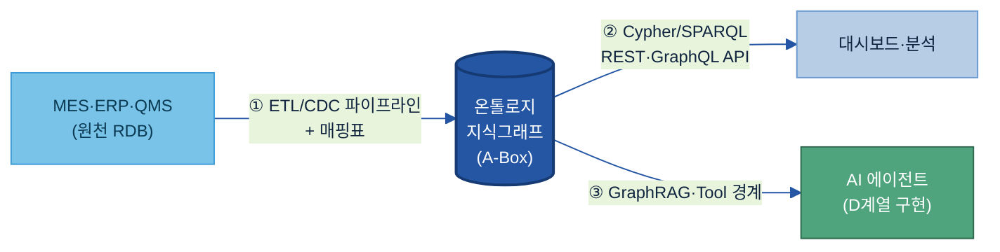

> 적재 파이프라인의 갱신 주기·신규 데이터 연동 방식은 유즈케이스 기획서 §8(운영 지속성)에 적고, 운영 중 변경 관리는 [§8.1](#81-변경-관리버전)에서 다룬다.

<a id="sec77"></a>

### 7.7 그래프DB 단독으로 안 되는 영역 — 폴리글랏 조합

> 👉 그래프DB는 "관계·인과·경로"에 강하지만 **모든 것을 담는 그릇이 아니다.** 비정형 텍스트 유사도, 대량 정형 집계, BI 도구의 의미 일관 소비는 각각 **벡터DB·RDB·시멘틱 레이어**와 조합해 푼다. 온톨로지는 이 조합의 **의미 중심(허브)** 역할을 한다.

| 무엇을 | 어디에 두나 | 온톨로지와의 관계 |
|---|---|---|
| 관계·인과·다중 홉 경로 | **그래프DB**(LPG/RDF) | 온톨로지의 본진 |
| 비정형 텍스트 의미 유사도(문서 청크 검색) | **벡터DB**(임베딩) | 그래프 노드 ↔ 텍스트 청크를 연결 = **하이브리드 GraphRAG**(관계로 좁히고 벡터로 본문 회수) |
| 대량 정형 트랜잭션·집계·시계열 | **RDB / 데이터 웨어하우스** | 온톨로지가 의미를 부여, 집계는 RDB가 수행(폴리글랏 — [§7.3](#73-저장소--rdb-vs-graph-db-혼용-기준)) |
| BI·분석 도구가 "같은 지표·차원 정의"로 소비 | **시멘틱 레이어**(Semantic Layer) | 메트릭·차원 정의를 온톨로지 개념에 정렬해 도구마다 다른 정의가 안 생기게 |

🏭 **CCL 예시 조합:** 들뜸 인과 사슬·Lot commonality 탐색은 **그래프DB**, C/S Report 본문·SOP 문서의 의미 검색은 **벡터DB**(`들뜸검출` 노드에서 관련 문서 청크 회수), 월별 들뜸 발생 건수 집계는 **RDB**, 품질 대시보드의 "들뜸률" 지표 정의 통일은 **시멘틱 레이어**. 네 저장소가 온톨로지 개념(`들뜸`·`Lot`·`SOP`)을 공통 키로 묶인다.

> **하이브리드 GraphRAG 전제조건**은 [[별첨 H]](#appendix-h-graphrag-전제조건-체크리스트). 벡터·시멘틱 레이어를 붙여도 **의미의 단일 진실은 온톨로지**([§1.4](#sec14))라는 점은 변하지 않는다 — 다른 저장소는 온톨로지가 정의한 개념을 참조한다.

### 7.8 아키텍처 진단 체크리스트 — 보안·성능·비용

아키텍처 후보를 정했으면 아래 3축으로 진단한다. 현업 담당자가 PoC 전에 확인할 항목이다.

**🔒 보안(Security)**

| 항목 | 확인 질문 |
|---|---|
| 접근 제어 세분성 | DB 전체 → 레이블/타입 → 노드/트리플 단위까지 권한을 나눌 수 있나 |
| 역할 기반 제어(RBAC) | 사용자 역할별 읽기·쓰기·추론 권한 분리 가능한가 |
| 암호화·감사 | 전송(TLS)·저장 암호화, 접근 감사 로그를 남기나 |
| 내부망 격리 | 외부 클라우드 노출 없이 온프레미스 배포 가능한가 |

**⚡ 성능(Performance)**

| 항목 | 확인 질문 |
|---|---|
| 다중 홉 지연 | 3·5·10홉 탐색 쿼리의 응답 시간이 허용 범위인가 |
| 규모 확장성 | 현재 + 5년 후 예상 노드·엣지 규모에서 성능이 유지되나 |
| 추론 적재 영향 | 사전 적재(7.4) 채택 시 데이터 갱신 주기와 재추론 비용의 균형을 잡았나 |
| 초기 적재 속도 | 기존 RDB·ERP를 온톨로지로 변환·적재하는 시간이 허용 범위인가 |

**💰 비용(Cost)**

| 항목 | 확인 질문 |
|---|---|
| 배포 모델 | 관리형(Neptune·Neo4j Aura) vs 자체 호스팅 중 총비용(TCO)이 유리한 쪽은 |
| 라이선스 | 오픈소스·커뮤니티·엔터프라이즈의 기능 차이와 비용 |
| 벤더 잠금 | openCypher / ISO GQL 호환 여부로 이식성(전환 비용) 확인 |
| 운영 인력 | 자체 호스팅 시 DBA·SRE 인력 비용을 포함해 계산했나 |

> 가격·버전은 변동되므로 단정하지 말고 PoC 전 공식 견적·문서로 확인한다. 정량 벤치마크 수치는 환경 편차가 크므로 자체 PoC로 측정한다.

<a id="sec79"></a>

### 7.9 솔루션·도구 유형 + 그래프DB 구현 구조

온톨로지 데이터를 저장하고 AI 검색에 활용하는 도구는 크게 세 유형이다.

| 유형 | 특징 | 대표 도구 |
|---|---|---|
| **그래프 DB (속성 그래프)** | 노드-관계 구조, 직관적 탐색, 빠른 패턴 매칭 | [Neo4j](https://neo4j.com/product/neo4j-graph-database/), [Amazon Neptune](https://aws.amazon.com/neptune/) |
| **RDF 트리플스토어** | W3C 표준 RDF 기반, OWL 추론 지원, 국제 표준 상호운용 | [Ontotext GraphDB](https://graphdb.ontotext.com/), [Stardog](https://www.stardog.com/platform/), [Apache Jena](https://jena.apache.org/) |
| **온톨로지 편집기** | 개념·관계를 사람이 직접 편집·설계하는 GUI 도구 | [Protégé](https://protege.stanford.edu/), [PoolParty](https://www.poolparty.biz/ontology-management), [TopBraid EDG](https://www.topquadrant.com/resources/overview-of-topbraid-edg-ontologies/) |

**그래프DB 구현 구조 (코어 기획서 §7.4 — 노드·프로퍼티 각론):** 형식·도구를 정한 뒤 아래 구현 규칙을 코어 기획서에 확정한다. [§4.6 항목 사전](#sec46)·[§6.2.2 작성 규칙](#622-노드프로퍼티-작성-규칙--before--after)과 직결된다.

| 항목 | 정하는 것 | 예시(LPG) |
|---|---|---|
| 노드 라벨 명명 규칙 | 클래스 라벨 표기(언어·대소문자) | PascalCase 영문 + `name` 한글 라벨 |
| 관계 유형 명명 규칙 | 관계 predicate 표기 | `UPPER_SNAKE`(`CAUSES`·`OCCURS_IN`) |
| 식별자(ID) 구조 | 인스턴스 고유키 | `{도메인}-{원천키}`(`CCL-LOT-PPG2403-17`) |
| 필수 속성 기준 | 모든 노드/관계가 가져야 할 최소 속성 | L2는 `검출시각` 필수, 노드는 `layer`·`namespace` |

> 상세 도구 비교표는 [[별첨 F]](#appendix-f-솔루션-상세-비교표)를, 솔루션을 묶어 평가·선정하려면 → [Tech Stack 비교 정본](../../전체%20목차/01%20Tech%20Stack%20비교%20(솔루션×주제).md) (B-3 표·Part B·C). 🔗 **2층 연결:** 이 절은 *온톨로지 주제 관점의 기능 비교*(1층)다. 새로 조사된 도구는 정본 Part A에도 반영한다.

**단계별 도구 조합 (제조 계열사 권장):**

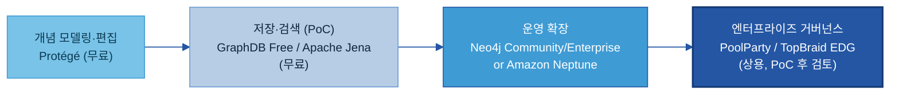

> 개별 도구의 표현력·추론 지원·현업 접근성·기존 데이터 연동·운영 부담은 위 **7.2~7.8의 아키텍처 결정**과 직접 연결된다. LPG 제조 온톨로지 권장 경로는 [[별첨 F]](#appendix-f-솔루션-상세-비교표) 하단을 참고한다.

---

## 8. 운영·활용

> 👉 운영(9단계) = 온톨로지를 시간이 지나도 정확하게 유지. AI 활용 = 준비된 지식을 소비하는 D계열 애플리케이션. 이 섹션은 둘 다 다루되 **데이터 준비 경계에서 멈춘다**.

### 8.1 변경 관리·버전

<a id="kq6"></a>

> ❓ **핵심 질문 6 — "변경을 어떻게 운영하나?"** 에 이 절이 답한다.

온톨로지는 AI 검색·추론의 기반 설계도이므로 변경이 AI 결과 전체에 영향을 준다. 모든 변경을 승인 전에 분류한다.

| 변경 유형 | 예시 | AI 추론 리스크 | 승인 |
|---|---|---|---|
| **편집적(Editorial)** | 라벨 수정, 동의어 추가, 정의 표현 변경 | 없음 — AI 동작 불변 | 도메인 스튜어드 단독 |
| **추가적(Additive)** | 새 하위클래스·관계·속성 추가 | 낮음 — 기존 쿼리 영향 없음 | 스튜어드 + 시맨틱 아키텍트 검토 |
| **파괴적(Breaking)** | 클래스 개명·삭제, 관계 의미 재정의, 계층 재편 | 높음 — 기존 쿼리 결과 변동, 적재된 추론 무효화 | 거버넌스 보드 승인 + 영향 분석 + 마이그레이션 계획 |

**원칙: 파괴보다 추가(additive before breaking).** 가능하면 기존 개념을 수정하지 말고 새 개념을 추가하고, 옛 개념은 새 개념을 가리키며 **폐기 표시**한다.[[Galaxy](https://www.getgalaxy.io/articles/ontology-management-semantic-modeling-operating-model-enterprise-context)]

> **계층별 변경 리스크 (코어/유즈케이스·3계층 관점):** 유즈케이스 레이어([§4.4](#sec44)) 변경은 코어에 영향이 없어 가볍지만, **코어의 L1 마스터·L2 사건 스키마 변경은 거의 항상 파괴적 변경**이다 — 그 위에 쌓인 모든 사건·해석·유즈케이스가 흔들린다. 따라서 코어(L1·L2) 수정은 반드시 위 분류·승인 절차를 거치고, 일상 변경은 유즈케이스 레이어에서 흡수한다. 이것이 9단계의 9단계(운영·유지)에서 "L1·L2 수정 시 절차화·준수"가 강조되는 이유다.

**시맨틱 버저닝 `X.Y.Z`:**
- X(Major): 파괴적 — 삭제·계층 재편·관계 의미 변경
- Y(Minor): 추가적 — 새 클래스·관계·속성
- Z(Patch): 편집적 — 라벨·설명·동의어

**폐기(Deprecation) 프로토콜:** 삭제하지 말고 `deprecated = true`로 표시하고 대체 개념 포인터를 단 뒤, 다음 Major 릴리스까지 유지한다. 다운스트림 소비자(AI 검색 파이프라인·대시보드)의 조용한 실패를 막는다.

**배포 전 영향 점검 체크리스트:**
1. SHACL 검증 스위트 — 치명 위반 0건인가?
2. OWL 추론기 일관성 — 충족 불가 클래스 없는가?
3. 회귀 쿼리 셋(상위 20개 AI 쿼리) — 비파괴 변경에서 결과 동일한가?
4. 파괴적 변경 시: 변경 개념을 참조하는 모든 다운스트림 시스템 식별 + 운영 데이터 샘플 테스트
5. 하위 계열사 온톨로지(자식 네임스페이스) — 충돌 없는가?
6. AI 팀에 변경 공지(특히 파괴적)했는가?
7. 변경 로그 갱신·폐기 개념 표시했는가?

**역할·책임:**

| 역할 | 책임 |
|---|---|
| **도메인 스튜어드 (현업 SME)** | 개념 제안·도메인 검증·편집적 변경 승인·다운스트림 소비자 식별 |
| **시맨틱 아키텍트 / 온톨로지 설계자** | 형식 모델링·추가적 변경 검토·관계 정의서 유지·계열사 간 충돌 해소 |
| **거버넌스 보드** | 공통 레이어 소유·파괴적 변경 승인·네이밍/네임스페이스 정책 |
| **플랫폼·데이터 팀** | 승인 버전 배포·SHACL 파이프라인 운영·Graph DB 관리·롤백 |

> *최소 거버넌스(초기):* 계열사당 도메인 스튜어드 1 + 시맨틱 아키텍트 1 + Git 기반 PR 리뷰. 거버넌스 보드는 공통 레이어가 활성화된 뒤 구성한다.

**변경 처리 흐름:**


### 8.2 AI 활용 — 관계 기반 검색·추천 3가지 패턴

<a id="kq5"></a>

> ❓ **핵심 질문 5 — "AI 활용에 어떻게 적용하나?"** 에 이 절이 답한다. 온톨로지는 아래 AI 패턴을 가능케 하는 **데이터 자산**이다. 에이전트·RAG 시스템 자체의 구현은 D계열 가이드 소관이다.

온톨로지(설계도)에 실제 데이터(인스턴스 트리플)를 채우면 **지식그래프(Knowledge Graph)**가 완성된다. 이를 AI 검색에 연결하는 대표 방식이 **GraphRAG**(온톨로지 관계를 따라 문서를 탐색한 뒤 AI가 답을 생성)다. 세 가지 패턴 모두 벡터 검색만으로는 못 하는 관계 기반 탐색을 요구한다.

- **패턴 1 — RAG 개념 확장(검색 확장):** "들뜸 관련 문서를 찾아라"가 들어오면 온톨로지가 검색을 확장한다 — 들뜸 → 층간결함의 하위 → CCL결함의 하위 → 모든 CCL결함 문서까지 질의. 정밀도 손실 없이 재현율 향상.
- **패턴 2 — 에이전트 다중 홉 원인 탐색:** [§5 예시](#5-예시-시나리오)처럼 에이전트가 선언된 `causes` 사슬을 결함 → 설비 상태 → 정비 기록까지 따라간다. 온톨로지의 선언된 관계가 없으면 매 홉마다 별도 하드코딩 조회가 필요하다.
- **패턴 3 — 유사 사례·조치 추천:** 현재 결함의 클래스 소속 + 원인 요소로 온톨로지를 탐색해 같은 원인·결함 조합을 가진 과거 A-Box 인스턴스를 찾고, 결과 기록과 함께 과거 조치를 반환한다. 임베딩 유사도가 아니라 **구조 기반 유사도**다.

⚠️ [[Neo4j Knowledge Layer](https://neo4j.com/blog/agentic-ai/knowledge-layer/)]: 해당 페이지는 인과 추론에 관한 이 일반 논지를 펴지만, 특정 문장을 그대로 인용 확인하지는 못했다 — 출처 논지의 의역으로 본다.

> **B-3 / D계열 경계:** B-3은 지식 데이터를 준비한다(T-Box 설계·A-Box 적재·검증·버전). D계열이 실행한다(AI 에이전트·RAG가 준비된 온톨로지를 질의·추론). 온톨로지는 데이터 기반이고, D계열은 그것을 소비하는 애플리케이션 계층이다. §8을 "에이전트 만드는 법"으로 흘리지 않는다 — 그것은 D계열 범위다.

---

## 9. 다른 주제와의 관계

> 👉 인접 주제와 겹치는 게 아니라 **경계로 나뉜다** — Glossary는 단어, 메타데이터는 필드, 카탈로그는 위치, B-3은 그 사이의 관계.

| 인접 주제 | 그 주제의 역할 | B-3 온톨로지의 역할 | 핵심 경계 |
|---|---|---|---|
| [A-3 Glossary](../A-3%20Glossary/A-3%20Glossary.md) | 단일 용어의 뜻·동의어 표준화 | 개념 간 관계·인과 구조 정의 | Glossary는 단어 사전, 온톨로지는 관계 지도. Glossary 표준 용어가 온톨로지 개념의 이름(label)으로 쓰인다 |
| [A-2 메타데이터](../A-2%20메타데이터/A-2%20메타데이터.md) | 데이터 필드·테이블의 속성 설명 | 업무 개념과 데이터 필드를 의미적으로 연결 | 메타데이터는 "이 필드가 무엇인가", 온톨로지는 "이 개념이 저 개념과 어떻게 연결되는가" |
| [A-1 데이터 카탈로그](../A-1%20데이터%20카탈로그/A-1%20데이터%20카탈로그.md) | 데이터 자산의 위치·접근 경로 파악 | 개념과 데이터 자산을 의미 기반으로 연결 | 카탈로그는 "어디 있는가", 온톨로지는 "왜 연결되는가" |
| [B-2 데이터 해설·주석](../B-2%20데이터%20해설·주석/B-2%20데이터%20해설·주석.md) | AI 학습용 분류 라벨 부여 | 라벨이 무엇을 뜻하고 라벨 유형이 어떻게 연결되는지 정의 | B-2는 라벨된 인스턴스 생산, B-3은 그 라벨이 따르는 클래스 스키마 제공 |
| D계열 AI 검색·에이전트 | 온톨로지로 추론·검색·추천 실행 | AI가 쓸 지식 구조를 준비·정의·유지 | B-3은 식재료 준비, D계열은 요리 실행 |

---

## 10. 성과 지표·로드맵·고도화

> 👉 온톨로지 품질은 **구조적으로**(커버리지·일관성·고립 개념)와 **AI 효과로**(기준선 대비 검색 개선) 측정한다. 수기 → AI 보조 → 자율 갱신의 성숙 경로로 확장한다.

### 10.1 성과 지표

§2에서 세운 목표(구조 품질·AI 가치·운영 규율)에 묶인 5개 KPI.

| KPI | 쉬운 의미 | 방향·목표 | 측정 |
|---|---|---|---|
| **핵심 개념 모델링 비율** | 범위 내 핵심 개념 중 온톨로지에 정의된 비율 | ↑ (PoC 80%+) | 모델링 개념 수 ÷ 식별 개념 수 |
| **제약 검증 통과율** | OOPS!/SHACL 함정 점검 통과 비율(구조 건전성) | ↑ (치명 100%·중요 90%+) | [OOPS! 스캐너](https://oops.linkeddata.es) + SHACL 셰이프 실행 [[arXiv 2211.10011](https://arxiv.org/abs/2211.10011)] |
| **고립 개념 수** | 관계가 하나도 없는 개념 수(고립 노드 — 구조 품질 실패) | ↓ (0 목표) | 그래프 쿼리: degree = 0 노드 |
| **관계 기반 검색·추천 적중률** | 키워드 기준선 대비 도메인 Q&A 정확도 개선(PoC 측정) | ↑ (방향: 양(+), 목표는 PoC 기준선에서 설정) | 도메인 테스트셋 평가·수동 채점 [[arXiv 2511.05991](https://arxiv.org/html/2511.05991v1)] |
| **변경 반영 속도** | 변경 요청 → 승인·배포까지 평균 영업일(티어별) | ↓ (SLA 준수 90%+) | 거버넌스 티켓 타임스탬프 [[PMC KGCL](https://pmc.ncbi.nlm.nih.gov/articles/PMC11753292/)] |

*KPI 목표치는 PoC에서 도출한다. 도메인 기준선을 측정하기 전에 특정 수치를 약속하지 않는다.* 한 설문에서 변경 반영 속도에 만족한 온톨로지 팀은 17%에 불과했다 — 대부분 조직에서 이 KPI에 개선 여지가 크다는 뜻이다.[[KGCL PMC](https://pmc.ncbi.nlm.nih.gov/articles/PMC11753292/)]

🏭 **두산 예시:** 밥캣 유압 계통 RCA — 핵심 개념 60개 중 48개 모델링(80%); 테스나 반도체 공정 — "불량 모드" 개념을 MES·SOP·C/S 3개 자산과 매핑(초기 60% → 2단계 90% 목표); 에너빌리티 — 변경 반영 현재 평균 21일 → 2단계(AI 초안 자동 생성) 후 7일 목표. (개념-데이터-문서 연결 비율은 로드맵에서 별도 추적)

### 10.2 고도화 Roadmap

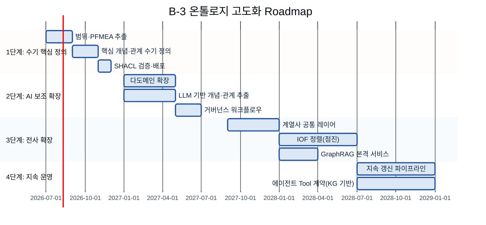

- **1단계 (0~6개월) 수기 핵심 정의:** 한 도메인(예: 한 제품군 결함 RCA). 50~80개 개념·10~15개 관계, Protégé 수기 T-Box. 코어 설계 기획서([별첨 B](별첨/B-3%20별첨%20B%20—%20코어%20온톨로지%20설계%20기획서.md)) 1건 완성. 배포 전 OOPS! 치명 함정 0. KPI 기준선 수립.
- **2단계 (6~18개월) AI 보조 확장:** 2~4개 도메인 추가. LLM 보조 개념 추출(스키마 기반: LLM 제안, 전문가 검증). 거버넌스 워크플로우 구축(변경 요청 → 스튜어드 검토 → SHACL 게이트 → 머지). 첫 유즈케이스 레이어([별첨 C](별첨/B-3%20별첨%20C%20—%20유즈케이스%20레이어%20설계%20기획서.md)) 적용. 문서 매핑 커버리지 추적.
- **3단계 (18~36개월) 전사 확장:** 계열사 공통 레이어. 정식 거버넌스 보드. CI/CD SHACL 검증. IOF Core 정렬 시작. 첫 운영 GraphRAG 배포(AI 근본원인 Q&A). 검색 개선 KPI 측정.
- **4단계 (36개월+) 지속 운영:** 지속 갱신 파이프라인(신규 문서 → LLM 추출 → 파괴적 변경만 사람 검토). 에이전트 Tool 계약·D계열 API 정의가 온톨로지 개념을 직접 참조. 온톨로지 진화에 따른 회귀 테스트로 AI 정확도 유지.

---

## 별첨 (Appendix)

> **별첨 A~D = 실행형(각각 별도 .md 파일).** 정론(본문)을 읽으며 적용·채운다. **별첨 E~J = 기술 상세**(본문 내). 실제 프로젝트 사례(CCL)는 **별첨 A에만** 들어간다 — B·C는 빈 템플릿, D는 일반 운영법.

| 별첨 | 문서 | 성격 | 위치 |
|---|---|---|---|
| **A** | [유즈케이스 온톨로지 구축 각론](별첨/B-3%20별첨%20A%20—%20유즈케이스%20온톨로지%20구축%20각론.md) | 정론↔CCL 기획서 브릿지 + **실제 CCL 노드 설계 사례** | 별도 .md |
| **B** | [코어 온톨로지 설계 기획서](별첨/B-3%20별첨%20B%20—%20코어%20온톨로지%20설계%20기획서.md) | 9단계 1~7 산출물 **빈 템플릿** | 별도 .md |
| **C** | [유즈케이스 레이어 설계 기획서](별첨/B-3%20별첨%20C%20—%20유즈케이스%20레이어%20설계%20기획서.md) | 9단계 8 산출물 **빈 템플릿** | 별도 .md |
| **D** | [Discovery Workshop 운영 가이드](별첨/B-3%20별첨%20D%20—%20Discovery%20Workshop%20운영%20가이드.md) | 9단계 2단계 수집 워크샵 **일반 운영법** | 별도 .md |

### [Appendix E] 기술 표준 RDF·OWL·SPARQL 한 줄 풀이

메인 본문에서는 개념 이해에 집중하고, 아래 기술 표준 상세는 구현 시 참고한다.

| 약어 | 풀이 | 한 줄 설명 | 공식 URL |
|---|---|---|---|
| **RDF** | Resource Description Framework (자원 기술 프레임워크) | "주어-관계-목적어" 3개 짝으로 모든 지식을 표현하는 W3C 국제 표준 형식 | [w3.org/RDF](https://www.w3.org/RDF/) |
| **OWL** | Web Ontology Language (웹 온톨로지 언어) | 온톨로지의 규칙·제약을 컴퓨터가 읽고 추론할 수 있도록 쓰는 언어. RDF 위에 얹는다 | [w3.org/TR/owl2-overview](https://www.w3.org/TR/owl2-overview/) |
| **SKOS** | Simple Knowledge Organization System | 분류체계·시소러스를 RDF로 표현하는 간단한 표준. 복잡한 추론 없이 계층·동의어 관리할 때 적합 | [w3.org/TR/skos-reference](https://www.w3.org/TR/skos-reference/) |
| **SPARQL** | SPARQL Protocol and RDF Query Language | RDF 트리플스토어를 검색하는 쿼리 언어. SQL의 그래프 버전 | [w3.org/TR/sparql11-overview](https://www.w3.org/TR/sparql11-overview/) |
| **SHACL** | Shapes Constraint Language (형식 제약 언어) | RDF 데이터가 정해진 형식 규칙을 지키는지 자동 검증하는 표준 | [w3.org/TR/shacl](https://www.w3.org/TR/shacl/) |
| **Triple Store** | 트리플 저장소 | RDF 트리플을 저장하고 SPARQL 쿼리로 검색하는 데이터베이스 | — |
| **Property Graph / LPG** | (레이블) 속성 그래프 | 노드와 엣지에 속성값을 직접 붙이는 그래프 모델. Neo4j 등이 대표. RDF보다 단순·빠르지만 추론은 약함 | [neo4j.com](https://neo4j.com/product/neo4j-graph-database/) |
| **openCypher / Cypher** | 오픈사이퍼 / 사이퍼 | LPG를 검색하는 쿼리 언어. Neo4j가 만들어 오픈소스로 공개, 가장 널리 쓰임 | [opencypher.org](https://opencypher.org/) |
| **GQL** | Graph Query Language (ISO/IEC 39075) | 2024년 발행된 최초의 국제표준 그래프 쿼리 언어. Cypher를 모태로 설계 | [iso.org/standard/76120](https://www.iso.org/standard/76120.html) |
| **T-Box / A-Box** | 개념 스키마 / 인스턴스 데이터 | T-Box=개념·관계 정의(작음), A-Box=그 규칙에 맞춘 실제 데이터(큼). 추론으로 A-Box를 풍부하게 | [w3.org/TR/owl2-primer](https://www.w3.org/TR/owl2-primer/) |
| **Materialization** | (추론) 사전 적재 | 추론 도출 사실을 적재 시점에 미리 계산해 저장. 쿼리는 빨라지나 용량↑·갱신 비용↑. 반대는 질의 시 추론 | [ontotext.com](https://www.ontotext.com/knowledgehub/fundamentals/what-is-inference/) |
| **IOF / BFO** | 산업 온톨로지 파운드리 / 기초 형식 온톨로지 | IOF=제조 표준 참조 온톨로지 모음. BFO(ISO/IEC 21838-2)는 IOF가 올라타는 최상위 온톨로지. 도입은 외부 연계·팀 역량으로 판단(§7.5) | [github.com/iofoundry](https://github.com/iofoundry/ontology) |

### [Appendix F] 솔루션 상세 비교표

| 도구 | 모델 | 쿼리 언어 | 추론/온톨로지 | 배포 | 적합 |
|---|---|---|---|---|---|
| [Neo4j](https://neo4j.com) | LPG | Cypher / ISO GQL(이행 중) | RDF 브릿지(NeoSemantics) | 자체(Community/Enterprise) + AuraDB | 성숙 생태계, Cypher 역량, 그래프 분석(GDS) |
| [Amazon Neptune](https://aws.amazon.com/neptune/) | LPG + RDF | Gremlin + openCypher + SPARQL 1.1 | RDF+SPARQL 모드 온톨로지 질의 | AWS 완전관리·서버리스 | AWS 네이티브, RDF+LPG 둘 다 필요 |
| [TigerGraph](https://www.tigergraph.com) | LPG(병렬) | GSQL(독자) | 네이티브 온톨로지/RDF 없음 | 자체 + 클라우드 | 심층 분석, 연산 집약 탐색 |
| [Ontotext GraphDB](https://graphdb.ontotext.com) | RDF | SPARQL 1.1 | OWL QL/RL·사전적재·SHACL | 자체 + Cloud | 시맨틱/온톨로지 앱, SHACL 검증 |
| [Stardog](https://www.stardog.com) | RDF | SPARQL 1.1 | 전 OWL 프로파일·질의 시 추론·가상화 | 자체 + 클라우드 | 사일로 통합 KG, no-ETL 가상화 |
| [Memgraph](https://memgraph.com) | LPG | openCypher | 그래프 알고리즘·네이티브 OWL 없음 | 자체(인메모리) | 실시간 IoT 스트리밍, Kafka |
| [Apache Jena + TDB](https://jena.apache.org) | RDF | SPARQL 1.1 | OWL 추론(Pellet/HermiT)·Jena-SHACL | 자체(오픈소스·무료) | 예산형 PoC·연구·RDF 탐색 |
| [Protégé](https://protege.stanford.edu/) | 편집기 | — | OWL 편집·추론기 연동 | 데스크톱 + WebProtégé | 개념·관계 수기 설계 |

> 가격·버전·배포 옵션은 변동되므로 PoC 전 공식 문서·견적으로 확인한다. 위 표를 현행 가격 근거로 쓰지 않는다.

**LPG 제조 온톨로지 권장 경로:** PoC=Neo4j Community(무료) → 운영(클라우드)=Amazon Neptune(AWS) 또는 Neo4j AuraDB → 실시간 대량=Memgraph(Kafka) → RDF/OWL 추론 필요 시=Ontotext GraphDB Free(PoC) → Stardog(엔터프라이즈).

### [Appendix G] OWL 서브언어와 SKOS vs OWL

**OWL 2 서브언어(W3C OWL2 Primer):**

| 서브언어 | 추론 보장 | 용도 |
|---|---|---|
| OWL Lite | 결정 가능, 단순 카디널리티 | 기초 분류 |
| OWL DL | 결정 가능, 최대 표현력 | 본격 제조 온톨로지(권장) |
| OWL Full | 최대 자유, 추론 보장 안 됨 | 연구용 |

**SKOS vs OWL (제조):**

| 차원 | SKOS | OWL |
|---|---|---|
| 표현력 | 낮음 — 라벨·계층만 | 높음 — 클래스·속성·공리·추론 |
| 추론 | 없음 | 완전 OWL 추론 |
| 용도 | A-3 Glossary·통제 어휘 | B-3 온톨로지(완전 시맨틱 계층) |

결함 코드의 *용어사전* → SKOS / A-3. 인과 관계를 모델링하는 *온톨로지* → OWL / B-3.

### [Appendix H] GraphRAG 전제조건 체크리스트

GraphRAG는 지식그래프를 요구하고, 지식그래프는 다음을 요구한다:
1. 일관된 타입으로 정의된 노드(개체) → 최소한 Taxonomy
2. 형식 의미가 부여된 엣지(관계) → 온톨로지 필요
3. 실제 사건·측정 인스턴스 데이터 적재 → 데이터 준비 필요

온톨로지 없는 GraphRAG는 "연결은 있으나 그 연결이 무엇을 뜻하는지에 대한 일관된 규칙이 없는 — 데이터는 있으나 해석할 의미 기반이 없는" 상태가 된다.[[Neo4j](https://neo4j.com/blog/knowledge-graph/taxonomy-vs-ontology-vs-knowledge-graph/)]

**실무 전제조건 체크리스트:**
- [ ] 핵심 도메인 개념 정의·합의(온톨로지 T-Box)
- [ ] 핵심 관계 타입화: `hasCause`·`relatedParameter`·`occursIn`·`hasCorrectiveAction`
- [ ] 원천 시스템 간 동의어 매핑 해소(A-3 Glossary 경유)
- [ ] 인스턴스 데이터 품질 충분(garbage in = garbage graph)
- [ ] 벡터DB·시멘틱 레이어 조합 시 온톨로지 개념을 공통 키로([§7.7](#sec77))

### [Appendix I] 네임스페이스 메커니즘과 NeOn 시나리오

**LPG 네임스페이스 패턴(Neo4j / openCypher):**
```cypher
// 공통 스키마: 네임스페이스 접두 레이블
CREATE (:DefectType:Common {name:'Defect', namespace:'mfg-common'})
CREATE (:DefectType:Bobcat {name:'WeldingDefect', namespace:'mfg-bc'})
CREATE (weld:DefectType {name:'WeldingDefect'})-[:IS_SUBTYPE_OF]->
       (d:DefectType {name:'Defect', namespace:'mfg-common'})
```

**RDF/OWL 네임스페이스 패턴(Turtle):**
```turtle
# 지주 공통 온톨로지
@prefix mfg-common: <http://doosan.com/ontology/common#> .
mfg-common:Defect a owl:Class .
mfg-common:hasCause a owl:ObjectProperty ;
    rdfs:domain mfg-common:Defect ; rdfs:range mfg-common:Cause .

# 밥캣 계열사 확장(공통 import)
@prefix mfg-bc: <http://doosan.com/ontology/bobcat#> .
<http://doosan.com/ontology/bobcat#> owl:imports
    <http://doosan.com/ontology/common#> .
mfg-bc:WeldingDefect a owl:Class ; rdfs:subClassOf mfg-common:Defect .
```

**NeOn 방법론 시나리오 매핑(지주 구조):**

| NeOn 시나리오 | 적용 시점 |
|---|---|
| 시나리오 1 (From scratch) | 지주 공통 레이어 최초 구축 |
| 시나리오 5 (재사용+병합) | 두 계열사 온톨로지를 공통 레이어로 병합 |
| 시나리오 8 (재구조화) | 단일 온톨로지를 공통+계열사 레이어로 모듈화 |
| 시나리오 9 (현지화) | 한국어 라벨·정의 추가 |

### [Appendix J] 추가 정확도 벤치마크·근거

**Lettria 하이브리드 RAG 벤치마크(AWS 블로그 경유):**
- 다양한 기술 도메인 정답률: 전통 RAG 50.83% → GraphRAG 80.00%
- 기술 사양 정답률: 전통 RAG 46.88% → GraphRAG 90.63%
*출처: [[AWS ML Blog](https://aws.amazon.com/blogs/machine-learning/improving-retrieval-augmented-generation-accuracy-with-graphrag/)] (Lettria 1차 연구 인용). 발표 인용 전 Lettria 1차 출판본 확인 권장.*

**KGroot 제조 근본원인 정확도:**
- KG 사용: 93.5% A@3(상위 3 근본원인 식별); 미사용: 90.15% A@3 → +3.35%p, Mean Average Rank에서 비KG 대비 39~96% 우위
*출처: [[arXiv 2402.13264](https://arxiv.org/html/2402.13264v1)] — 마이크로서비스 장애 데이터셋, 산업 기계는 다를 수 있음.*

**설명력(provenance):** GraphRAG는 "원문 근거 텍스트로의 링크를 통해 출처(provenance)를 담는다."[[Microsoft Research](https://www.microsoft.com/en-us/research/blog/graphrag-unlocking-llm-discovery-on-narrative-private-data/)] 각 AI 답변을 특정 노드·엣지·텍스트 청크로 역추적할 수 있다.

---

## 참고자료 (References)

> 표기 규칙: 본문에서 **직접 인용한 문장·핵심 수치**는 각주(↩)로 해당 문장에 달았다(예: §2.3 동료심사 수치, §7 형식·추론 인용). 아래는 각주 출처를 포함한 **전체 출처를 분류한 목록**이다.

**내부 자료:**
- Kearney, 「두산지주 AI-Ready Data 체계 — CSO 중간보고」(2026-06-16) **모듈2** — §2.2·§5 전자BG CCL 들뜸 C/S Report 예시의 출처 (내부 문서·비공개)
- 두산 「온톨로지 구축 방법론 요약」·「코어/유즈케이스 설계 기획서」 — §1.4·§4.3·§4.4·§6 9단계·별첨 A~D의 방법론·산출물 양식 출처 (내부 문서)

**표준·명세:**
- [W3C OWL2 Primer](https://www.w3.org/TR/owl2-primer/) — OWL 구성요소·T-Box/A-Box 1차 권위
- [W3C RDF 1.2 Concepts](https://www.w3.org/TR/rdf12-concepts/) — 트리플 모델 1차 권위
- [W3C SPARQL 1.1](https://www.w3.org/TR/sparql11-query/) · [W3C SKOS Primer](https://www.w3.org/TR/skos-primer/) · [W3C SHACL](https://www.w3.org/TR/shacl/)
- [ISO/IEC 39075:2024 GQL](https://www.iso.org/standard/76120.html) — 그래프 쿼리 언어 국제표준(2024-04 발행)
- [IOF Industrial Ontologies Foundry](https://www.industrialontologies.org) · [BFO](https://basic-formal-ontology.org) · [IOF GitHub](https://github.com/iofoundry/ontology) · [NIST IOF Core](https://www.nist.gov/publications/industrial-ontologies-foundry-iof-core-ontology)

**연구·동료심사 출처:**
- [arXiv 2510.15428 — 제조 FMEA 온톨로지 가이드 고장 원인 식별(F1@20 0.267→0.523)](https://arxiv.org/abs/2510.15428) — 온톨로지 vs RAG 개선의 가장 강한 동료심사 근거(§2.3) ⚠️ 공식 출판본 확인 권장
- [arXiv 2511.05991 — 온톨로지 vs KG 구축; RAG 정확도(+30%p, n=20)](https://arxiv.org/html/2511.05991v1) (§2.3·6.2.1)
- [arXiv 2402.13264 — KGroot: KG 기반 근본원인(93.5% A@3)](https://arxiv.org/html/2402.13264v1) (별첨 J)
- [arXiv 2510.20345 — LLM 기반 KG 구축 서베이·3단계 진행](https://arxiv.org/pdf/2510.20345) · [arXiv 2211.10011 — KG 구조 품질 지표(OntoQA)](https://arxiv.org/abs/2211.10011)
- [OOPS! OntOlogy Pitfall Scanner](https://oops.linkeddata.es) · [PMC 11753292 — KGCL 변경 언어·변경관리 설문](https://pmc.ncbi.nlm.nih.gov/articles/PMC11753292/)
- [CN Patent 114943415A — 금속 용접 결함 근본원인 지식그래프](https://patents.google.com/patent/CN114943415A/en) (§4·§6 밥캣 용접 예시 근거)
- [Stanford Ontology Development 101 (Noy & McGuinness)](https://protege.stanford.edu/publications/ontology_development/ontology101.pdf) · [LibreTexts 온톨로지 방법론](https://eng.libretexts.org/Bookshelves/Computer_Science/Programming_and_Computation_Fundamentals/An_Introduction_to_Ontology_Engineering_(Keet)/06:_Methods_and_Methodologies) · [NeOn Methodology](https://oeg.fi.upm.es/index.php/en/completedprojects/8-neon/index.html)
- [ResearchGate — PFMEA 도메인 DL 기반 온톨로지](https://www.researchgate.net/publication/258436781_A_System_for_Distributed_Sharing_and_Reuse_of_Design_and_Manufacturing_Knowledge_in_the_PFMEA_Domain_Using_a_Description_Logics-based_Ontology) (§6.2.1) ⚠️ 접근 제한 가능
- 검증(정론↔표준/Palantir 대조): BFO Continuant/Occurrent·IAO Information Content Entity·W3C PROV-O — L3 해석 레이어의 이론적 근거. T-box/A-box·CQ·코어 재사용은 표준·Palantir와 일치(세션 검증 결과).

**벤더·실무 출처:**
- [Microsoft Research: GraphRAG](https://www.microsoft.com/en-us/research/blog/graphrag-unlocking-llm-discovery-on-narrative-private-data/) · [AWS: GraphRAG 정확도](https://aws.amazon.com/blogs/machine-learning/improving-retrieval-augmented-generation-accuracy-with-graphrag/) · [SingleStore: GraphRAG 다중홉](https://www.singlestore.com/blog/rethinking-rag-how-graphrag-improves-multi-hop-reasoning-/)
- [Palantir Foundry Ontology: Core concepts](https://www.palantir.com/docs/foundry/ontology/core-concepts) · [Ontology system](https://www.palantir.com/docs/foundry/architecture-center/ontology-system) — 단일 공유 온톨로지 재사용·Object/Link/Action(코어/유즈케이스·semantic/kinetic 대조 근거)
- [Neo4j: Taxonomy vs Ontology vs KG](https://neo4j.com/blog/knowledge-graph/taxonomy-vs-ontology-vs-knowledge-graph/) · [Neo4j: Knowledge Layer](https://neo4j.com/blog/agentic-ai/knowledge-layer/) ⚠️ 인용 의역
- [Memgraph: LPG vs RDF](https://memgraph.com/docs/data-modeling/graph-data-model/lpg-vs-rdf) (§7.2) · [Fluree: RDF vs LPG](https://flur.ee/fluree-blog/rdf-versus-lpg/) · [Enterprise Knowledge: RDF & LPG](https://enterprise-knowledge.com/cutting-through-the-noise-an-introduction-to-rdf-lpg-graphs/)
- [AWS: RDF·openCypher로 KG 구축](https://aws.amazon.com/blogs/database/build-and-deploy-knowledge-graphs-faster-with-rdf-and-opencypher/) (§7.1) · [TigerGraph: ISO GQL 2024](https://www.tigergraph.com/blog/the-rise-of-gql-a-new-iso-standard-in-graph-query-language/) (§7.2)
- [Ontotext: What Is Inference?](https://www.ontotext.com/knowledgehub/fundamentals/what-is-inference/) (§7.4) · [Ontotext: SHACL](https://graphdb.ontotext.com/documentation/standard/shacl-validation.html)
- [Galaxy: 온톨로지 운영 모델](https://www.getgalaxy.io/articles/ontology-management-semantic-modeling-operating-model-enterprise-context) (§8.1) · [EKGF 성숙도 모델](https://maturity.ekgf.org/intro/structure/) · [Industrial AI Ordo: 제조 KG](https://coformation.medium.com/knowledge-graphs-in-manufacturing-20-practical-questions-b86c863d5c4c) (§3)
- [SGKG: 온톨로지 vs 분류체계 결정](https://sgkg.org/blog/2026-03-21-ontology-vs-taxonomy-knowledge-organisation/) (§3.1) · [PuppyGraph: KG vs 온톨로지](https://www.puppygraph.com/blog/knowledge-graph-vs-ontology) · [Protégé](https://protege.stanford.edu) · [OOPS! 스캐너](https://oops.linkeddata.es)

---

## 변경 이력 / 피드백 반영

| 일자 | 버전 | 피드백 (누가/무엇) | 반영 내용 | 반영 위치 |
|------|------|-------------------|-----------|-----------|
| 2026-06-18 | 0.1~0.2 | 초안 + 허훈석 컨설턴트(아키텍처 방법론화) | §아키텍처 설계·선택 방법론 확장 | §아키텍처 |
| 2026-06-19 | 0.3 | 영문 파이프라인 흡수 | 동료심사 수치 교체·KQ 가시화·인과 사슬·T/A-box·워크드 예시·AI 3패턴·KPI 5개 | 전체 |
| 2026-06-19 | 0.4~0.4.4 | 고객/두산 — 일반 방법론 흡수·9단계 점검 | 철학 5·3계층·트리거·함정 7·검증 4원칙·9단계 크로스워크 | 다수 |
| 2026-06-19 | 0.5 | 고객 — 방법론 수정본 + 코어·유즈케이스 기획서 입력 | 9단계 단일 정본화·코어/유즈케이스 척추·As-Is §6.0·기획서 별첨화·아키텍처(외부연동·폴리글랏) 보완 | 전체 |
| 2026-06-19 | 0.6 | 고객 — 본문 순서 정리·별첨 분리·각론/워크샵 신설 | ① **When↔What 순서 교체**(§3 When·§4 What) ② **인라인 기획서를 외부 별첨 .md 링크로**(별첨 A 각론·B 코어·C 유즈케이스·D Discovery Workshop, 각각 별도 파일) ③ **기술 별첨 C~H→E~J 재번호** + 본문 cross-ref 일괄 갱신 ④ **사례는 별첨 A에만**(B·C 빈 템플릿, D 일반) ⑤ 별첨 B에 6요소 계층·공리 보완 ⑥ §6에 각론·워크샵 연결 ⑦ 정론↔표준/Palantir 검증 결과 반영(L3 근거=IAO ICE·PROV-O) | 전체 |

