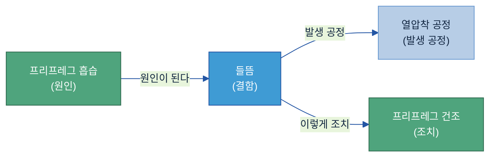
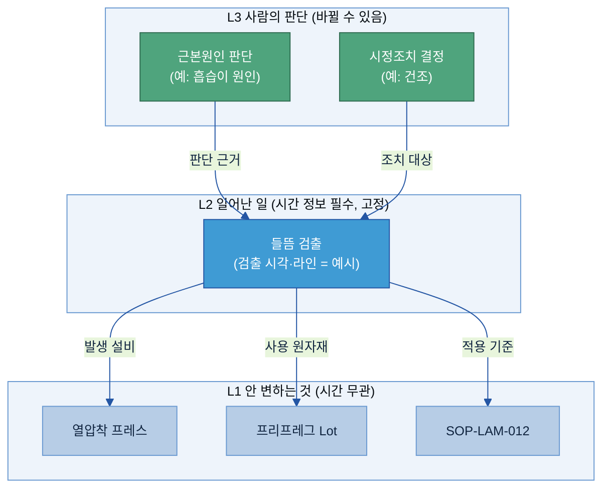
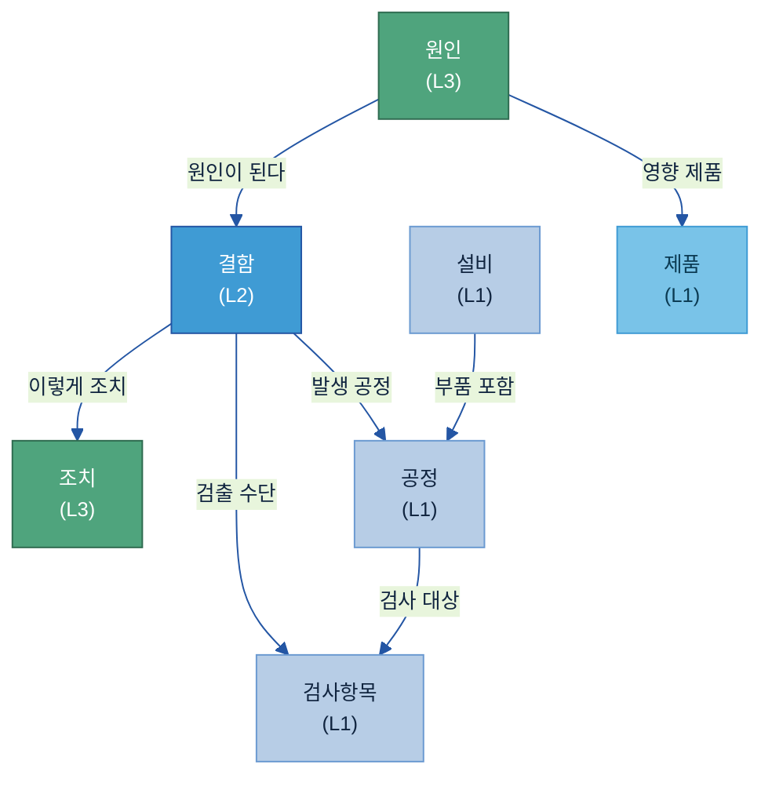
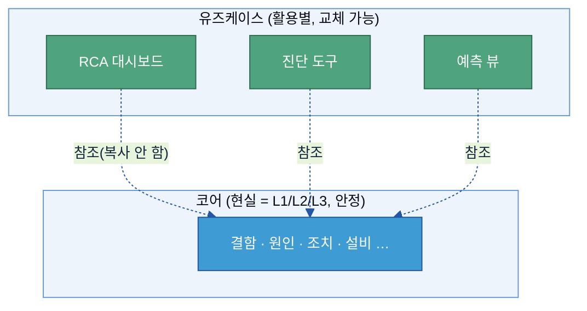
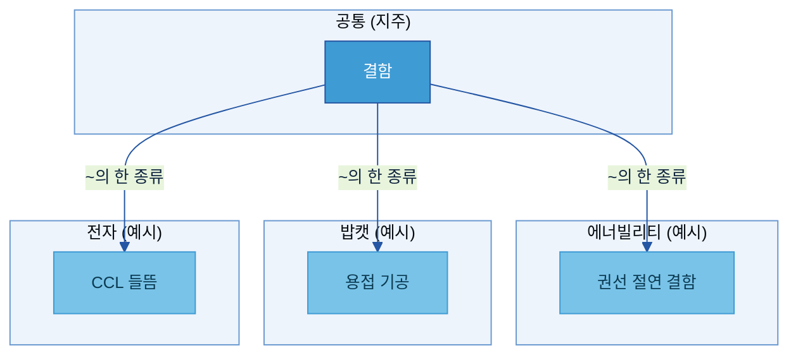
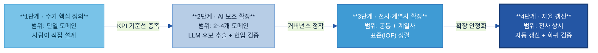

# B-3. 온톨로지(Ontology) 매뉴얼

> 한 줄 정의: 온톨로지는 우리 공장의 개념들(설비·공정·결함·원인·조치 등)이 **서로 어떻게 연결되는지**를 컴퓨터가 따라갈 수 있게 그려 둔 **지식 지도**다.

---

## 목차

1. [온톨로지란 무엇인가](#1-온톨로지란-무엇인가)
2. [언제 온톨로지를 만드나](#2-언제-온톨로지를-만드나)
3. [무엇으로 이루어지나 (구성요소)](#3-무엇으로-이루어지나-구성요소)
4. [어떻게 구축하나 (9단계)](#4-어떻게-구축하나-9단계)
5. [어떤 기술 아키텍처가 필요한가](#5-어떤-기술-아키텍처가-필요한가)
6. [다른 주제와의 관계](#6-다른-주제와의-관계)
7. [성과 지표·고도화 로드맵](#7-성과-지표고도화-로드맵)

- [별첨 (Appendix)](#별첨-appendix) — A~D 실행형(별도 .md) · E·F 기술 참고
- [참고자료 (References)](#참고자료-references)
- [변경 이력 / 피드백 반영](#변경-이력--피드백-반영)

---

> [!question] **이 가이드가 답하는 5가지 질문**
>
> | # | 질문 | 한 줄 답 | 다루는 곳 |
> |---|------|----------|-----------|
> | 1 | 온톨로지가 뭔가요? | 개념들이 서로 어떻게 연결되는지를 컴퓨터가 따라갈 수 있게 적어 둔 지식 지도 | [§1](#1-온톨로지란-무엇인가) |
> | 2 | 언제 만들어야 하나요? | 지식이 여러 시스템에 흩어져 있고, 원인·결과(인과)를 따라가야 할 때 | [§2](#2-언제-온톨로지를-만드나) |
> | 3 | 무엇으로 이루어지나요? | 개념(클래스)·관계·계층 등 6가지 재료를, 3계층·코어/유즈케이스로 정리 | [§3](#3-무엇으로-이루어지나-구성요소) |
> | 4 | 어떻게 만드나요? | 현실(As-Is)에서 개념을 길어 올려 9단계로, 작게 시작해 검증 후 확장 | [§4](#4-어떻게-구축하나-9단계) |
> | 5 | 어떤 기술이 필요한가요? | 그래프 형식(LPG/RDF) → 저장소 → 추론 → 표준 순으로 선택 | [§5](#5-어떤-기술-아키텍처가-필요한가) |

> 🔸 **예시 표기 안내:** 본 가이드의 다이어그램·표에 나오는 구체 값(Lot 번호·온도·SOP 번호·라인/설비 번호·건수 등)은 **이해를 돕기 위한 가상 예시이며 실제 데이터가 아니다.** 실제 값은 PoC·프로젝트에서 확정한다. 계열사명도 적용 맥락 설명용이다.

> **관련 가이드:** [A-1 데이터 카탈로그](../A-1%20데이터%20카탈로그/A-1%20데이터%20카탈로그.md) · [A-2 메타데이터](../A-2%20메타데이터/A-2%20메타데이터.md) · [A-3 Glossary](../A-3%20Glossary/A-3%20Glossary.md) · [B-2 데이터 해설·주석](../B-2%20데이터%20해설·주석/B-2%20데이터%20해설·주석.md)

---

## 1. 온톨로지란 무엇인가

> 👉 온톨로지는 단어 뜻을 모아둔 사전이 아니다. 개념과 개념 사이의 **연결(관계)·계층·인과를 적어 둔 "지식 지도"**다.

### 1.1 한마디로 — 개념들을 잇는 '지식 지도'

지하철 노선도를 떠올려 보자. 노선도는 "역 이름"만 적어 두지 않는다. **어느 역이 어느 역과 이어지고, 어디서 갈아타는지**를 함께 그린다. 그래서 우리는 노선도 하나로 "여기서 저기까지 어떻게 가나"를 따라갈 수 있다.

온톨로지가 공장에서 하는 일이 바로 이것이다. 설비·공정·결함·원인·조치 같은 개념을 **점(노드)**으로 두고, "무엇이 무엇을 일으키고(원인)", "무엇으로 해결되며(조치)", "무엇의 한 종류인지(계층)"를 **선(관계)**으로 이어 둔다. 컴퓨터(AI)는 이 선을 따라가며 "이 결함은 왜 생겼고 어떻게 조치하나"를 추적할 수 있다.

- **단어장**은 단어의 뜻만 알려준다 — "들뜸: 층 사이 접착이 떨어지는 현상".
- **온톨로지**는 거기서 한 걸음 더 나아가 **"들뜸은 흡습이 원인이고, 건조로 조치한다"**처럼 개념 사이의 관계까지 적어 둔다.

🏭 **제일 작은 예 (CCL 들뜸):** 전자 계열사 CCL(동박적층판) 라인에서 **들뜸(층간 박리)** 결함을 다룬다고 하자. 온톨로지에 아래처럼 적어 두면, AI가 "들뜸"에서 출발해 원인과 조치를 선을 따라 찾아갈 수 있다.

### 1.2 왜 필요한가 — 데이터는 있는데 '연결'이 없다

제조 현장에는 데이터가 없는 게 아니다. **흩어져 있고, 시스템마다 부르는 이름이 다른 것**이 문제다. CCL 들뜸 하나만 봐도 관련 정보가 이렇게 흩어져 있다.

| 시스템 | 담고 있는 정보 | 부르는 이름 |
|--------|--------------|----------|
| ERP | 원자재 입고·보관 습도 이력 | "원자재 입고", "보관 조건" |
| MES | 열압착 프레스의 온도·압력·시간 실적 | "공정 파라미터" |
| SOP | 열압착 표준 조건(기준값) | "표준 공정 조건" |
| 검사 기록 | 들뜸 검출 이력, 불량률 | "불량 유형" |
| C/S Report | 고객 클레임·조치 이력 | "품질 부적합" |

같은 사건인데도 시스템마다 이름·구조가 달라서, 사람이 네 시스템을 일일이 열어 머릿속으로 이어 붙여야 한다. 그래서 **"왜 이 결함이 났는가"를 묻는 순간 막힌다** — 원인(ERP 습도)·공정(MES 온도)·결과(검사 들뜸)·조치(C/S)가 서로 다른 곳에 따로 있기 때문이다.

온톨로지는 이 흩어진 개념들을 **"원인이 된다", "발생 공정", "이렇게 조치"** 같은 관계로 한 번 이어 둔다. 그러면 같은 질문에 대한 답이 이렇게 달라진다.

| 현업 질문 | 온톨로지 없을 때 | 온톨로지 있을 때 |
|---------|-------------|-------------|
| "이 결함이 뭔가?" | 사람 경험에 의존 | 계층을 따라: 들뜸 → 층간결함 → CCL결함 |
| "왜 생겼나?" | 문서를 키워드로 검색(일반론) | "원인이 된다" 관계를 따라: 들뜸 ← 수지 미경화 ← 흡습 |
| "어느 Lot이 공통인가?" | 시스템 4개를 수동 대조 | "사용 원자재" 관계로 한 번에 조회 |
| "조치는 무엇인가?" | 과거 보고서 검색·베테랑 판단 | "이렇게 조치" 관계를 따라 표준 조치 확인 |

### 1.3 다루는 범위 (한 줄 경계)

이 가이드는 **개념 사이의 관계·구조를 만드는 일**만 다룬다. 단어의 뜻 자체는 [A-3 Glossary](../A-3%20Glossary/A-3%20Glossary.md), 데이터 필드 설명은 [A-2 메타데이터](../A-2%20메타데이터/A-2%20메타데이터.md), 자산의 위치는 [A-1 데이터 카탈로그](../A-1%20데이터%20카탈로그/A-1%20데이터%20카탈로그.md)가 맡는다. (자세한 경계는 [§6](#6-다른-주제와의-관계).)

---

## 2. 언제 온톨로지를 만드나

> 👉 온톨로지는 모든 데이터에 다 만드는 것이 아니다. **지식이 흩어져 있고, 원인·결과를 따라가야 할 때만** 만든다 — 먼저 "만들지 말지"를 판단한다.

### 2.1 이런 경우에 만든다 (필요조건)

아래 중 **하나라도 해당하면 온톨로지 구축을 검토**한다(둘 이상이면 더 분명하다).

| 이런 상황이면 | 쉽게 말하면 | CCL 예시 |
|---|---|---|
| **답이 여러 개념을 건너가며 나온다** | 한 시스템·한 표만 봐선 답이 안 나오고, 여러 개념을 이어야 답이 나옴 | "이 들뜸의 원인"을 알려면 원자재→공정→검사→조치를 이어야 함 |
| **전문가 머릿속 지식(암묵지)을 남겨야 한다** | 숙련자가 은퇴하면 사라질 "이 증상이면 저게 원인" 같은 판단을 데이터로 | 시니어 품질 엔지니어의 결함–원인 매핑을 구조로 기록 |
| **여러 곳에서 같은 지식 구조를 공유한다** | 분석·예측·진단이 같은 "결함–원인–조치" 구조를 따로 또 만드는 낭비 | 품질 RCA·설비 진단·공정 이상이 모두 같은 구조를 공유 |
| **"왜 그런 답인지"를 설명·감사해야 한다** | 결론에 이른 근거(어떤 관계를 따라갔나)를 보여줘야 하는 규제·품질 요건 | 시정조치 보고서에 원인 판단 근거(따라간 관계)를 남김 |

### 2.2 이럴 땐 안 만들어도 된다

온톨로지는 비용이 든다. 더 단순한 도구로 충분하면 그것을 쓴다.

- **단어 뜻만 통일하면 될 때** → [A-3 Glossary](../A-3%20Glossary/A-3%20Glossary.md)(용어사전)로 충분하다. 관계까지 만들 필요 없다.
- **단순 집계·리포팅이 목적일 때** → SQL·BI 도구가 더 빠르고 단순하다.

### 2.3 시작은 작게 — "도메인 먼저, 전사는 나중"

처음부터 전사 거대 온톨로지를 만들려 하면 **반드시 실패한다.** 개념이 늘수록 이어야 할 관계가 폭증해 현업이 검토할 수 없게 되기 때문이다.

- **한 라인·한 결함 영역**(예: CCL 들뜸)부터 시작한다.
- 초기 규모는 개념 **50~80개**, 관계 **10~15종**이면 가치를 보여주기에 충분하다(숫자는 예시).
- 한 도메인에서 검증되면, 그 구조를 재사용해 다른 도메인·계열사로 넓힌다.

---

## 3. 무엇으로 이루어지나 (구성요소)

> 👉 온톨로지는 **6가지 재료**로 개념을 만들고, 그 개념을 **3계층**으로 배치하며, **코어/유즈케이스**(재사용)와 **공통/계열사**(조직)로 정리한다.

### 3.1 기본 재료 6가지

온톨로지를 이루는 빌딩 블록은 6가지다. 이 6가지가 다 있어야 "지식 구조"이고, 일부만 있으면 단어사전·분류표에 머문다.

| # | 재료 | 쉽게 말하면 | CCL 예시 |
|---|------|-----------|---------|
| ① | **개념(클래스)** | 같은 성격의 것을 묶은 이름 | 결함, 설비, 공정, 제품 |
| ② | **사례(인스턴스)** | 그 개념에 속하는 구체적 하나 | "3월 17일 검출된 들뜸 1건" |
| ③ | **속성** | 개념이 가지는 값 | 심각도=높음, 검출 시각 |
| ④ | **관계** | 두 개념을 잇는 방향 있는 선 | 흡습 →(원인이 된다)→ 들뜸 |
| ⑤ | **계층** | "A는 B의 한 종류" 수직 구조 | 들뜸 → 층간결함 → 결함 |
| ⑥ | **규칙(공리)** | 관계로부터 새 사실을 자동으로 끌어내는 규칙 | "들뜸이면 층간결함이고 결함이다"를 자동 분류 |

> **가장 작은 단위 = 트리플(Triple):** 온톨로지의 정보 한 조각은 항상 **「주어 — 관계 — 목적어」** 세 쌍이다. 예: `들뜸 — 발생 공정 — 열압착 공정`. 이렇게 적어 두면 새 관계가 생겨도 표 구조를 바꿀 필요 없이 한 줄만 추가하면 된다.

> 💡 클래스·관계·계층·규칙을 정의한 **설계도 부분(T-Box)**과, 실제 사례 데이터를 채운 **데이터 부분(A-Box)**을 나눠 부르기도 한다. 자세한 용어는 [별첨 E](#appendix-e-기술-용어-한-줄-풀이).

### 3.2 개념을 3층으로 나눠 배치한다

6가지 재료로 개념을 만들었으면, 그 개념을 **성격에 따라 3층**으로 나눠 놓는다. 이렇게 나누면 나중에 판단이 바뀌어도 사실 기록이 망가지지 않는다.

| 층 | 무엇을 담나 | 시간 정보 | CCL 예시 |
|---|---|---|---|
| **L1 — 안 변하는 것** (마스터) | 시간과 무관하게 그대로 있는 것 | 없음 | 설비·제품·공정·자재·SOP |
| **L2 — 일어난 일** (사건) | 특정 시점에 발생한 사실. 한 번 일어나면 고정 | **반드시 있음**(언제 일어났나) | 들뜸 검출, 공정 집행, 검사 수행 |
| **L3 — 사람의 판단** (해석) | 사람이 사건을 보고 내린 판단. 나중에 바뀔 수 있음 | 선택 | 근본원인 판단, 시정조치 결정 |

> **왜 나누나:** "들뜸이 검출됐다(L2)"는 검사 장비가 남긴 **바뀌지 않는 사실**이다. "원인은 흡습(L3)"은 사람의 **판단**이라 재조사로 "온도 미달이 원인"으로 바뀔 수 있다. 두 층을 나눠 두면 **판단만 고쳐도 검출 사실은 그대로 보존**된다.
>
> **참조 방향 규칙:** 판단(L3) → 사건(L2) → 안 변하는 것(L1) 방향으로만 잇는다. 사건이 판단을 거꾸로 가리키면(L2 → L3), 판단이 바뀔 때 사건 기록까지 오염되므로 **금지**한다.

### 3.3 핵심 개념과 관계 (제조)

제조 결함 분석에서 자주 쓰는 **핵심 개념 7개**와 **핵심 관계 7개**다. 이 둘을 한 그림으로 보면 온톨로지는 곧 **작은 지식 지도**다.

| 개념 | 3계층 | 예시 |
|--------|------|------|
| 제품 | L1 | CCL 제품군 |
| 공정 | L1 | 열압착 공정 |
| 설비 | L1 | 열압착 프레스 |
| 검사항목 | L1 | 외관 검사 |
| 결함 | L2 | 들뜸(검출 사건) |
| 원인 | L3 | 프리프레그 흡습(판단) |
| 조치 | L3 | 프리프레그 건조(판단) |

> 🔸 이 지도를 따라가면 "어떤 원인이 어떤 공정에서 어떤 결함을 만들고, 어떤 조치로 해결되는가"를 한 번에 답할 수 있다. 색은 [§3.2 3계층](#sec33)을 그대로 따른다(연파랑=L1 / 진파랑=L2 / 초록=L3).

### 3.4 코어와 유즈케이스로 나눈다 (재사용 축)

같은 "결함–원인–조치" 구조를 분석 대시보드·진단 도구가 각자 따로 만들면 일관성이 깨진다. 그래서 **두 층으로 나눈다.**

| 구분 | 무엇을 담나 | 바뀌는 빈도 |
|------|---------|---------|
| **코어 온톨로지** | 현실 그 자체(L1·L2·L3) — 변하지 않는 진실 | 낮음 |
| **유즈케이스 온톨로지** | 특정 활용 전용 구조 — 코어를 **복사하지 않고 참조**만 | 높음 |

**규칙 3가지:** ① 코어에는 특정 활용 전용 개념을 넣지 않는다. ② 유즈케이스는 코어를 복사하지 않고 참조만 한다. ③ 요건이 바뀌면 **유즈케이스 층만 교체**하고 코어는 그대로 둔다.

> 코어 설계 산출물은 [별첨 B 코어 기획서](별첨/B-3%20별첨%20B%20—%20코어%20온톨로지%20설계%20기획서.md), 유즈케이스 설계 산출물은 [별첨 C 유즈케이스 기획서](별첨/B-3%20별첨%20C%20—%20유즈케이스%20레이어%20설계%20기획서.md)다. (구축 순서는 [§4](#4-어떻게-구축하나-9단계).)

### 3.5 전사 공통과 계열사로 나눈다 (조직 축)

여러 계열사가 함께 쓰는 지식과 계열사 고유 지식은 층을 나눠 관리한다.

| 구분 | 무엇을 담나 | 누가 관리 |
|------|-----------|---------|
| **공통 상위개념** | 둘 이상의 계열사가 공유하는 상위 개념·관계 | 지주 데이터 보드 |
| **계열사 고유개념** | 계열사 고유 개념 — 공통 개념의 **하위 종류로 확장** | 계열사 데이터 담당 |

> 계열사는 공통 개념을 복사하지 않고 **"~의 한 종류"(하위 클래스)로 상속**해 공통 속성·관계를 그대로 물려받는다. 이것이 KQ — "계열사 지식과 전사 공통 지식을 어떻게 나누나"에 대한 답이다.

### 3.6 데이터·문서와 연결한다

온톨로지 개념(설계도)은 반드시 **실제 데이터·문서와 연결**되어야 한다. 연결이 없으면 채울 사례 데이터가 없어 빈 껍데기가 된다. 아래 표가 그 연결 명세다(이 표대로 데이터 파이프라인을 만들면 사례가 자동으로 채워진다).

| 온톨로지 개념 | A-3 표준 용어 | A-2 메타데이터 필드 | A-1 카탈로그 자산 | 원천 문서 |
|---------------|--------------|-------------------|----------------|---------|
| 결함 | 결함 | defect_code, severity | CCL 검사 결과 | C/S Report·MES 검사 로그 |
| 공정 | 열압착 공정 | process_id | 공정 마스터 | SOP-LAM-012 |
| 설비 | 열압착 프레스 | equipment_id | 설비 마스터 | 설비 점검 일지 |
| 원인 | 프리프레그 흡습 | cause_code | 원인 코드 테이블 | PFMEA 원인 분석 |
| 조치 | 프리프레그 건조 | action_code | 조치 코드 테이블 | C/S Report 처치 이력 |

> 즉 [A-1 카탈로그](../A-1%20데이터%20카탈로그/A-1%20데이터%20카탈로그.md)·[A-2 메타데이터](../A-2%20메타데이터/A-2%20메타데이터.md)·[A-3 Glossary](../A-3%20Glossary/A-3%20Glossary.md)가 준비해 둔 것을 받아서 온톨로지가 개념끼리 연결한다.

---

## 4. 어떻게 구축하나 (9단계)

> 👉 온톨로지 구축은 **9단계**를 따른다. 흐름은 **코어 온톨로지(1~7단계) → 유즈케이스 레이어(8단계) → 운영(9단계)**이다. 핵심은 "산출물 양식을 베끼는 게 아니라, **현실에서 개념을 길어 올려** 작게 시작하고 검증 후 확장"하는 것이다.

### 4.1 만들 때 지키는 5가지 원칙

구축 처음부터 끝까지 아래 5원칙을 지킨다.

| 원칙 | 뜻 |
|---|---|
| **현실을 담는다** | 보고서 양식이 아니라, 현실에 실제 존재하는 객체와 사건을 모델링한다. |
| **단일 진실** | 같은 개념을 여러 곳에서 다르게 정의하지 않는다 — 쿼리·AI가 모두 같은 현실을 본다. |
| **재사용 (객체 중심)** | 특정 활용이 아니라 현실 객체 중심으로 설계해, 한 번 만든 코어를 거듭 쓴다. |
| **관계 중심** | 값(측정치)을 쌓기보다 개념 사이의 **인과·선후 관계**를 먼저 구조화한다. |
| **도메인 먼저** | 전사 온톨로지를 먼저 만들지 않는다. 한 도메인을 먼저 검증하고 넓힌다. |

### 4.2 출발점 — As-Is 분석서

9단계에 들어가기 전, 대상 도메인의 **현실을 정리한 As-Is 분석서**를 먼저 확보한다. 모든 개념·관계의 근거가 여기서 나온다.

| As-Is 분석서가 담는 것 | 온톨로지 설계에 쓰이는 곳 |
|---|---|
| 업무 전체 흐름(예: 클레임 접수 ~ C/S Report 발송) | 1단계 도메인 목적·범위 |
| 현실에 존재하는 물리·조직·기준 객체 | 3단계 L1(안 변하는 것) |
| 시간과 함께 일어나는 사건 | 4단계 L2(일어난 일) |
| 현업의 판단·대책 결정 기록 | 6단계 L3(사람의 판단) |
| 데이터 소스 확인 결과(MES·ERP 등) | 각 개념의 데이터 연결([§3.6](#sec37)) |
| 팀 간 용어 불일치·동의어 | 개념 정의·별칭(alias) |

> **원칙: 근거 없는 개념은 만들지 않는다.** 데이터 소스가 확인 안 된 개념은 "미확인"으로 표시하고 보완 계획을 남긴다. 현장에서 개념을 길어 올리는 워크샵 운영법은 [별첨 D Discovery Workshop](별첨/B-3%20별첨%20D%20—%20Discovery%20Workshop%20운영%20가이드.md).

### 4.3 9단계 한눈에

| 단계 | 무엇을 하나 | 산출물 |
|---|---|---|
| **1. 도메인 목적 정의** | 측정 가능한 목적을 **한 문장**으로 (아래 ★) | 코어 기획서 §1 |
| **2. 업무 흐름 분석 + 현장 인터뷰** | 전체 흐름에서 객체·사건 후보를 뽑음 (아직 확정 안 함) | As-Is·워크샵 |
| **3. 안 변하는 것 식별** | "독립적으로 존재? + 사실로 고정?" → L1 확정 | 코어 기획서 §2 |
| **4. 일어난 일 식별** | **시간 정보가 있는** 사건 → L2 확정 | 코어 기획서 §2 |
| **5. 핵심 질문 도출** | 목적 관점 질문 3~5개로 3·4단계를 **되짚어 검증** | 코어 기획서 §6 |
| **6. 판단 층 설계** | 원인·조치 같은 사람 판단(L3)을 사건(L2) **위에** 설계 | 코어 기획서 §2 |
| **7. 설계 검증** | 기술 점검 + 현업 확인 → **코어 완성** | 코어 기획서 §8 |
| **8. 유즈케이스 레이어** | 코어 위에 활용 전용 구조를 얹음(코어는 불변) | 유즈케이스 기획서(별첨 C) |
| **9. 운영·유지** | 지식 갱신·변경 관리 ([§4.6](#sec46)) | — |

**★ 1단계 — 좋은 목적 문장:** "AI로 품질 개선" 같은 막연한 목적은 범위를 발산시킨다. **측정 가능한 한 문장**으로 고정한다.

| 🚫 나쁜 목적 | ✅ 좋은 목적 |
|---|---|
| "AI로 품질 개선" | "CCL 라인 들뜸 결함의 원인 분석 시간을 수일 → 수시간으로 단축" |

### 4.4 코어 설계 (1~7단계) — 산출물: 「코어 설계 기획서」

코어 설계의 산출물은 [별첨 B 코어 기획서](별첨/B-3%20별첨%20B%20—%20코어%20온톨로지%20설계%20기획서.md)다. 빈 양식 채우기가 아니라 **바로 구축에 착수할 수 있는 실행안**이어야 한다.

**3·4·6단계 — L1·L2·L3 배치:** 2단계에서 뽑은 후보를 [§3.2 3계층](#sec33)으로 배치한다. 판별 질문은 단순하다.

- **L1(안 변하는 것):** "활용과 무관하게 독립적으로 존재하나? + 사실로 고정되나?"
- **L2(일어난 일):** "언제 일어났는지(시간 정보)가 있나?" — L2는 시간 정보가 필수.
- **L3(사람 판단):** "사람의 판단·결정인가? 재조사로 바뀔 수 있나?"

🏭 **CCL 들뜸 배치 (예시):**

| 후보 | 층 | 이유 |
|---|---|---|
| 열압착 프레스 | L1 | 활용과 무관하게 존재하는 설비 |
| 프리프레그 Lot | L1 | 입고된 원자재 — 사실로 고정 |
| 들뜸 검출(특정 일시·라인) | L2 | 시간 정보 있음 · 한 번 발생하면 고정 |
| "원인: 흡습" 판단 | L3 | 재조사로 바뀔 수 있는 사람 판단 |

**5단계 — 핵심 질문으로 되짚어 검증:** 1단계 목적 관점에서 질문 3~5개를 만들고, "지금 설계가 이 질문에 개념·관계 경로로 답하나"를 확인한다. 경로가 끊기면 그 개념·관계가 빠진 것이다.

> 🏭 예: "이번 분기 들뜸의 상위 원인은?" → `클레임 → 제품 → Lot → 공정조건 → (원인이 된다) → 들뜸` 경로가 이어지는지 확인.

**개념을 뽑는 풍부한 원천 — PFMEA:** PFMEA(잠재 고장 분석) 표는 제조 온톨로지 개념의 가장 좋은 출발점이다. 표의 열이 3계층에 거의 그대로 대응한다.

| PFMEA 열 | 온톨로지 개념 | 층 |
|---|---|---|
| 공정 단계 | 공정 | L1 |
| 고장 모드 | 결함 | L2 |
| 잠재 원인 | 원인 | L3 |
| 권장 조치 | 조치 | L3 |
| 심각도/발생도/검출도 | 결함의 속성(숫자값) | 속성 |

> LLM은 PFMEA·SOP 텍스트에서 후보 개념을 빠르게 제안해 도움을 줄 수 있다. 단 **"이게 L2인지 L3인지", "두 문서의 용어가 같은 것인지"** 같은 판단은 LLM이 못 하므로 **현업 전문가 검증은 반드시** 거친다.

**노드를 적는 좋은 습관 (Before → After):** 같은 현실도 어떻게 적느냐에 따라 재사용 가능한 코어가 되기도, 막힌 구조가 되기도 한다.

| 🚫 나쁜 예 | ✅ 좋은 예 | 왜 |
|---|---|---|
| `들뜸.발생설비 = "프레스#2"` (글자값) | `들뜸 →(발생 설비)→ 프레스#2` (개념으로) | 개념으로 둬야 "프레스#2에서 난 모든 결함"을 찾을 수 있다 |
| `들뜸{검출시각, 원인="흡습"}` 한 덩어리 | `들뜸 검출`(L2)과 `흡습 판단`(L3)을 분리 | 원인을 재판단해도 검출 사실은 보존된다 |
| `C/S리포트3페이지표`를 개념으로 | 리포트가 *참조하는* 현실 개념을 둠 | 출력 양식이 아니라 현실을 모델링한다 |
| `용접불량` + `용접결함` 두 개념 | 한 개념 + 별칭(alias) | 같은 현실이 두 개로 갈라지면 결과가 어긋난다 |

**7단계 — 설계 검증 → 코어 완성:** 아래 [§4.8 검증 4원칙](#sec48)으로 점검하고, 샘플 데이터로 핵심 질문에 답이 나오는지 확인한 뒤 코어를 확정한다.

> 실제 CCL 사례에서 어떤 노드를 어느 층으로·어떤 속성으로 잡았는지의 결정 기록은 [별첨 A 각론](별첨/B-3%20별첨%20A%20—%20유즈케이스%20온톨로지%20구축%20각론.md)에 있다.

### 4.5 유즈케이스 레이어 설계 (8단계) — 산출물: 「유즈케이스 기획서」

코어가 완성된 뒤, 특정 활용을 위한 전용 구조를 코어 **위에** 얹는다. 산출물은 [별첨 C 유즈케이스 기획서](별첨/B-3%20별첨%20C%20—%20유즈케이스%20레이어%20설계%20기획서.md)다. **이 단계는 코어를 다시 정의하지 않는다.**

순서대로 정의할 것: ① 유즈케이스 정의(목적·유형·사용자) ② 입력/출력 ③ 핵심 질문 + "코어만으로 안 되는 이유" ④ 코어 참조 구조(복사 금지) ⑤ 전용 개념·관계(모두 `유즈케이스` 태그) ⑥ 암묵지 처리 방식 ⑦ 코어 변경 요청(없으면 "없음").

> 유즈케이스 목적 유형(탐색·예측·모니터링·추천·자동화)에 따라 강조하는 설계가 달라진다 — 유형별 차이는 [별첨 A 각론](별첨/B-3%20별첨%20A%20—%20유즈케이스%20온톨로지%20구축%20각론.md).

### 4.6 운영·유지 (9단계)

온톨로지는 검색·추론의 바탕 설계도라서, 한번 만들면 끝이 아니라 시간이 지나도 정확하게 **유지**해야 한다. 핵심은 **모든 변경을 먼저 분류**하는 것이다.

| 변경 유형 | 예시 | 영향 | 승인 |
|---|---|---|---|
| **편집** | 라벨 수정, 동의어 추가 | 없음 | 담당자 단독 |
| **추가** | 새 하위개념·관계 추가 | 낮음 | 담당자 + 설계자 검토 |
| **파괴적** | 개념 삭제·개명, 계층 재편 | 높음 | 거버넌스 보드 승인 + 영향 점검 |

> **원칙: 고치기보다 더하기.** 가능하면 기존 개념을 바꾸지 말고 새 개념을 추가하고, 옛 개념은 "폐기 표시"만 한다. 특히 **코어(L1·L2)의 변경은 거의 항상 파괴적**이므로(그 위에 쌓인 모든 것이 흔들린다) 반드시 분류·승인을 거치고, 일상 변경은 유즈케이스 층에서 흡수한다. 변경 시 버전을 기록한다.

### 4.7 피해야 할 7가지 함정

온톨로지 설계가 실패하는 전형적 패턴이다.

| # | 함정 | 결과 |
|---|---|---|
| 1 | 보고서·양식 구조를 개념으로 옮김 | 현실이 아니라 출력 템플릿을 모델링 → 재사용 불가 |
| 2 | 처리 순서·우선순위 규칙을 코어에 넣음 | 코어가 특정 활용에 종속됨 |
| 3 | 현실 객체를 개념 아닌 글자값(속성)으로 둠 | 그 객체로 패턴을 찾을 수 없음 |
| 4 | 데이터 소스 확인 없이 개념을 만듦 | 구현 단계에서 "채울 데이터가 없다"며 막힘 |
| 5 | 같은 뜻 단어를 여러 개념으로 중복 | 같은 현실이 갈라져 결과가 어긋남 |
| 6 | 유즈케이스와 코어를 섞음 | 활용 교체 시 무엇을 고칠지 모름 |
| 7 | 설계도(스키마)와 사례 데이터를 섞음 | 사례가 늘 때마다 설계도가 출렁임 |

### 4.8 검증 4원칙

7단계 설계 검증을 네 가지로 묶어 점검한다. 한 가지라도 통과 못 하면 그 단계가 덜 끝난 것이다.

| 원칙 | 핵심 질문 | 확인 |
|---|---|---|
| **현실성** | 현실을 올바르게 담았나 | 핵심 객체·사건 누락 없음 · L2에 시간 정보 있음 · 참조 방향 역방향 없음 · 모든 개념에 데이터 소스 연결 |
| **명시성** | 암묵지가 구조로 드러났나 | 현업 용어와 라벨 일치 · 인과 판단이 관계로 표현됨 · 중복 개념 없음 |
| **재사용성** | 코어가 유즈케이스 없이 성립하나 | 모든 개념에 층 태그 · 유즈케이스 떼어내도 코어 독립 성립 |
| **설명력** | 결론의 근거를 구조로 보여주나 | 핵심 질문 전부 경로로 답함 · 추론 경로를 관계로 되짚을 수 있음 |

---

## 5. 어떤 기술 아키텍처가 필요한가

> 👉 무엇을 모델링할지 정했으면, **① 그래프 형식 → ② 저장소 → ③ 추론 방식 → ④ 제조 표준** 순으로 기술을 고른다. 형식을 가장 먼저 정하는 이유는, 형식이 쓸 수 있는 저장소·쿼리 언어를 자동으로 좁히고 **한 번 정한 형식을 나중에 바꾸려면 비용이 매우 크기** 때문이다.

### 5.1 그래프 형식 — LPG vs RDF

온톨로지를 데이터로 적는 형식은 크게 둘이다. 둘 다 "개념–관계" 지식을 담지만 강점이 다르다.

| 형식 | 쉽게 말하면 | 쿼리 언어 | 강점 |
|---|---|---|---|
| **LPG** (속성 그래프) | 점(개념)·선(관계)에 속성을 직접 붙이는 그래프 | openCypher / GQL | 긴 경로(여러 단계) 탐색이 빠름, 진입 쉬움 |
| **RDF/OWL** | 모든 사실을 「주어-관계-목적어」로 잘게 쪼개 적는 국제 표준 | SPARQL | 자동 추론, 외부 표준·기관과 데이터 교환에 강함 |

> 어려운 약어(LPG·RDF·OWL·SPARQL·Cypher·GQL)는 [별첨 E 한 줄 풀이](#appendix-e-기술-용어-한-줄-풀이) 참고.

> 🏭 **본 프로젝트 결정 — LPG 채택 (커니 수행):** 제조 원인 탐색은 "불량 → 공정 → 설비 → 부품 → 원자재 → 공급사"처럼 **경로가 매우 길다(6단계 이상).** 이 긴 경로에서 RDF는 잘게 쪼갠 사실을 다시 잇느라 성능이 떨어질 수 있는 반면, LPG는 선을 직접 따라가 빠르다. 그래서 본 프로젝트는 LPG를 택했다.
>
> **일반 원칙:** 공급망 파트너·외부 표준기관과 데이터를 교환하거나 자동 추론이 핵심이면 RDF가 더 맞을 수 있다 — 정답이 정해진 게 아니라 **과제 성격에 따른 판단**이다. (둘을 섞는 하이브리드도 가능: 적재 때 RDF로 추론 → 조회는 LPG로.)

### 5.2 저장소 — RDB와 그래프 DB 혼용

"한 군데에 다 넣기"가 아니라 **역할을 나눠 함께 쓴다(폴리글랏).**

| 무엇을 | 어디에 | 이유 |
|---|---|---|
| 개념 설계도(작고 안정적) | RDB(PostgreSQL 등) | 작고 정형 — 변경에 안전 |
| 사례·경로 탐색 데이터(계속 늘어남) | 그래프 DB(Neo4j·Neptune 등) | 그래프 탐색이 주 용도 |
| 원천 거래 데이터(ERP·MES·QMS) | 기존 RDB 그대로 | 그대로 두고 ETL로 가져옴 |

> 형식이 저장소를 좁힌다 — **LPG → Neo4j·Neptune(LPG 모드)**, **RDF → Ontotext GraphDB·Apache Jena**. 그래서 형식(5.1)을 저장소보다 먼저 정한다. 원천 시스템의 새 레코드는 [§3.6 연결 표](#sec37)를 따라 ETL로 사례 데이터에 자동 적재한다.

### 5.3 추론 — 미리 계산 vs 그때그때

규칙(공리)을 바탕으로 컴퓨터가 없던 사실을 끌어내는 것을 **추론**이라 한다. 이 추론을 **언제 계산하느냐**가 선택이다.

| 방식 | 동작 | 용량 | 조회 속도 | 적합 |
|---|---|---|---|---|
| **미리 적재** | 넣을 때 추론 결과를 미리 계산·저장 | 큼 | 빠름 | 데이터가 안정적·조회가 잦음 |
| **그때그때 추론** | 질문이 올 때 필요한 만큼만 계산 | 작음 | 느릴 수 있음 | 데이터 변경 잦음·조회 드묾 |

> 🏭 설비·공정처럼 **안정적인 데이터**는 미리 적재해 조회를 빠르게, 품질 이벤트처럼 **실시간 생기는 데이터**는 그때그때 추론을 섞는 게 현실적이다. (개념 설계도 부분 = T-Box, 사례 데이터 부분 = A-Box — [별첨 E](#appendix-e-기술-용어-한-줄-풀이).)

### 5.4 제조 표준 프레임워크 — IOF (쓸지 판단)

바닥부터 개념을 다 정의하는 대신, 제조 업계 표준 온톨로지를 **가져다 쓰는** 선택지가 있다.

> **IOF**(Industrial Ontologies Foundry): NIST와 산업 파트너가 만든 제조·유지보수용 **표준 참조 온톨로지** 모음. ([github.com/iofoundry/ontology](https://github.com/iofoundry/ontology))

**즉시 전면 채택은 권하지 않는다 — 단계적으로 맞춘다.**

| IOF 채택이 유리 | 자체 온톨로지가 유리 |
|---|---|
| 공급망 파트너·표준기관과 데이터 교환 필요 | 내부 시스템만 연동 |
| 장기 플랫폼(2년+) 과제 | 빠른 파일럿·PoC |

> 🏭 **권고:** 내부 AI 데이터 준비가 목적이면 **IOF 어휘를 참고만 하되 자체 온톨로지로 시작**하고, 외부 연계 필요가 생길 때 IOF에 점진적으로 맞춘다.

### 5.5 도구와 구현 규칙

온톨로지를 저장·편집하는 도구는 세 유형이다.

| 유형 | 특징 | 대표 도구 |
|---|---|---|
| **그래프 DB (속성 그래프)** | 점-선 구조, 빠른 탐색 | [Neo4j](https://neo4j.com) · [Amazon Neptune](https://aws.amazon.com/neptune/) · [Memgraph](https://memgraph.com) |
| **RDF 트리플스토어** | 국제 표준 RDF, 자동 추론 | [Ontotext GraphDB](https://graphdb.ontotext.com) · [Apache Jena](https://jena.apache.org) |
| **온톨로지 편집기** | 개념·관계를 사람이 직접 설계하는 도구 | [Protégé](https://protege.stanford.edu) |

**구현 규칙(코어 기획서에 확정):** 형식·도구를 정한 뒤 아래를 정한다.

| 항목 | 정하는 것 | 예시 |
|---|---|---|
| 개념 이름 규칙 | 라벨 표기(영문/한글) | `Defect`, 한글명 "결함" |
| 관계 이름 규칙 | 관계 표기 | `CAUSES`, `OCCURS_IN` |
| 식별자(ID) 규칙 | 사례 고유키 | `CCL-LOT-PPG2403-17`(예시) |
| 필수 속성 | 모든 개념이 가질 최소 속성 | L2 사건: 검출 시각 필수 |

> 도구별 상세 비교는 [별첨 F](#appendix-f-도구-비교표). 권장 경로: PoC = Protégé(설계) + Neo4j Community(무료) → 운영 = Amazon Neptune 또는 Neo4j AuraDB. (도구를 묶어 비교·선정하려면 → [Tech Stack 비교 정본](../../전체%20목차/01%20Tech%20Stack%20비교%20(솔루션×주제).md).)

---

## 6. 다른 주제와의 관계

> 👉 인접 주제와 겹치지 않고 **경계로 나뉜다.** 단어 뜻은 A-3, 필드는 A-2, 위치는 A-1, 라벨은 B-2가 맡고, B-3 온톨로지는 그 사이의 **관계와 구조**를 맡는다.

| 인접 주제 | 그 주제의 역할 | B-3와의 경계 |
|---|---|---|
| [A-3 Glossary](../A-3%20Glossary/A-3%20Glossary.md) | 단어의 뜻·동의어 표준화 | **A-3는 단어 사전, B-3는 관계 지도.** "균열이 뭔가" → A-3 / "균열이 어디서 나고 원인이 뭔가" → B-3 |
| [A-2 메타데이터](../A-2%20메타데이터/A-2%20메타데이터.md) | 데이터 필드·테이블 속성 설명 | **A-2는 "이 필드가 무엇", B-3는 "이 개념이 저 개념과 어떻게 연결".** A-2 필드명이 사례 적재 시 연결 키가 됨 |
| [A-1 데이터 카탈로그](../A-1%20데이터%20카탈로그/A-1%20데이터%20카탈로그.md) | 데이터 자산의 위치·접근 경로 | **A-1은 "어디 있나", B-3는 "왜 연결되나"** |
| [B-2 데이터 해설·주석](../B-2%20데이터%20해설·주석/B-2%20데이터%20해설·주석.md) | AI 학습용 라벨 부여 | **B-2는 라벨된 사례 생산, B-3는 그 라벨이 따르는 개념 구조 제공** |
| D계열 (활용·실행) | 온톨로지를 검색·추천·추론에 **활용·구현** | **B-3는 지식 데이터를 준비**, 그 활용·구현은 D계열 범위 — 이 가이드는 거기까지 다루지 않는다 |

---

## 7. 성과 지표·고도화 로드맵

> 👉 온톨로지 품질은 **구조로** 측정한다(커버리지·일관성·고립 개념·변경 속도). 성숙 경로는 수기 → AI 보조 → 전사 확장 → 자율 갱신으로 넓힌다.

### 7.1 성과 지표 (KPI)

| 지표 | 쉽게 말하면 | 방향 | 측정 |
|---|---|---|---|
| **핵심 개념 모델링 비율** | 범위 내 핵심 개념 중 온톨로지에 담은 비율 | ↑ (PoC에서 기준 수립) | 담은 개념 ÷ 식별 개념 |
| **검증 통과율** | 설계 함정 점검을 통과한 비율 | ↑ (치명 0건이 배포 조건) | 자동 점검 + 현업 검수 |
| **고립 개념 수** | 관계가 하나도 없는 개념 수(품질 실패 신호) | ↓ (0 목표) | 관계 0개인 개념 수 |
| **변경 반영 속도** | 변경 요청 → 배포까지 평균 영업일 | ↓ | 변경 티켓 기록 |

> 목표치는 **PoC에서 도출**한다 — 기준선을 측정하기 전에 특정 숫자를 약속하지 않는다.

### 7.2 고도화 로드맵 (날짜가 아니라 '수준')

- **1단계 — 수기 핵심 정의** *(단일 도메인)*: 한 제품군 결함부터. 50~80개 개념을 사람이 직접 설계. 코어 기획서([별첨 B](별첨/B-3%20별첨%20B%20—%20코어%20온톨로지%20설계%20기획서.md)) 1건 완성. **전환 게이트 → KPI 기준선 수립.**
- **2단계 — AI 보조 확장** *(2~4개 도메인)*: LLM이 개념 후보를 제안하고 현업이 검증. "요청 → 검토 → 검증 → 반영" 변경 절차 정착. 첫 유즈케이스 레이어([별첨 C](별첨/B-3%20별첨%20C%20—%20유즈케이스%20레이어%20설계%20기획서.md)) 적용. **전환 게이트 → 변경 절차 안정 운영.**
- **3단계 — 전사·계열사 확장** *(공통+계열사)*: 계열사 간 공통 레이어 구축. 자동 검증 파이프라인. 표준(IOF) 정렬을 고빈도 용어부터. **전환 게이트 → 확장 안정화.**
- **4단계 — 자율 갱신** *(전사 상시)*: 새 문서 → LLM 추출 → 파괴적 변경만 사람이 검토하는 지속 갱신. 온톨로지가 커져도 회귀 검증으로 정확도를 유지.

> **앞으로 AI가 점점 대신할 영역:** 문서에서 후보 개념·관계를 뽑는 일(초안 추출), 중복·고립 개념 점검. **사람이 끝까지 쥘 판단:** 무엇을 L1/L2/L3로 둘지, 어떤 판단을 관계로 구조화할지, 파괴적 변경 승인. 즉 **추출은 자동화↑, 구조 결정은 사람**이다.

---

## 별첨 (Appendix)

> **별첨 A~D = 실행형(각각 별도 .md 파일).** 본문을 읽으며 적용·채운다. **별첨 E·F = 기술 참고**(본문 내). 실제 프로젝트 사례(CCL)는 **별첨 A에만** 들어간다.

| 별첨 | 문서 | 성격 |
|---|---|---|
| **A** | [유즈케이스 온톨로지 구축 각론](별첨/B-3%20별첨%20A%20—%20유즈케이스%20온톨로지%20구축%20각론.md) | 정론↔CCL 사례 브릿지 + **실제 CCL 노드 설계** |
| **B** | [코어 온톨로지 설계 기획서](별첨/B-3%20별첨%20B%20—%20코어%20온톨로지%20설계%20기획서.md) | 1~7단계 산출물 **빈 템플릿** |
| **C** | [유즈케이스 레이어 설계 기획서](별첨/B-3%20별첨%20C%20—%20유즈케이스%20레이어%20설계%20기획서.md) | 8단계 산출물 **빈 템플릿** |
| **D** | [Discovery Workshop 운영 가이드](별첨/B-3%20별첨%20D%20—%20Discovery%20Workshop%20운영%20가이드.md) | 현장 지식 수집 워크샵 운영법 |

### [별첨 E] 기술 용어 한 줄 풀이

본문은 개념 이해에 집중하고, 아래 기술 용어는 구현 시 참고한다.

| 용어 | 한 줄 설명 | 공식 |
|---|---|---|
| **RDF** | 모든 지식을 "주어-관계-목적어" 3쌍으로 적는 국제 표준 형식 | [w3.org/RDF](https://www.w3.org/RDF/) |
| **OWL** | 온톨로지의 규칙·제약을 컴퓨터가 추론하도록 적는 언어(RDF 위에 얹음) | [w3.org/OWL](https://www.w3.org/OWL/) |
| **SPARQL** | RDF를 검색하는 쿼리 언어(SQL의 그래프 버전) | [w3.org/TR/sparql11-overview](https://www.w3.org/TR/sparql11-overview/) |
| **LPG (속성 그래프)** | 점·선에 속성값을 직접 붙이는 그래프 모델. Neo4j 등이 대표 | [neo4j.com](https://neo4j.com/product/neo4j-graph-database/) |
| **openCypher / Cypher** | LPG를 검색하는 쿼리 언어. 가장 널리 쓰임 | [opencypher.org](https://opencypher.org/) |
| **GQL** | 2024년 발행된 최초의 국제표준 그래프 쿼리 언어(Cypher 기반) | [iso.org/standard/76120](https://www.iso.org/standard/76120.html) |
| **T-Box / A-Box** | T-Box=개념 설계도(작음), A-Box=그 규칙에 맞춘 실제 사례 데이터(큼) | — |
| **IOF / BFO** | IOF=제조 표준 참조 온톨로지 모음. BFO=그 바탕이 되는 최상위 온톨로지 | [github.com/iofoundry](https://github.com/iofoundry/ontology) |

### [별첨 F] 도구 비교표

| 도구 | 모델 | 쿼리 언어 | 배포 | 적합 |
|---|---|---|---|---|
| [Neo4j](https://neo4j.com) | LPG | Cypher / GQL(이행 중) | 자체 + AuraDB | 성숙 생태계, 그래프 분석 |
| [Amazon Neptune](https://aws.amazon.com/neptune/) | LPG + RDF | openCypher + SPARQL | AWS 완전관리 | AWS 네이티브, 둘 다 필요 |
| [Memgraph](https://memgraph.com) | LPG | openCypher | 자체(인메모리) | 실시간 스트리밍 |
| [Ontotext GraphDB](https://graphdb.ontotext.com) | RDF | SPARQL | 자체 + Cloud | 시맨틱/온톨로지, 자동 추론 |
| [Apache Jena](https://jena.apache.org) | RDF | SPARQL | 자체(무료) | 예산형 PoC·연구 |
| [Protégé](https://protege.stanford.edu) | 편집기 | — | 데스크톱 | 개념·관계 수기 설계 |

> 가격·버전·배포 옵션은 변동되므로 도입 전 공식 문서·견적으로 확인한다.

---

## 참고자료 (References)

**내부 자료:**
- 두산 「온톨로지 구축 방법론 요약」·「코어 설계 기획서」·「유즈케이스 레이어 설계 기획서」 — §3·§4의 3계층·9단계·함정7·검증4원칙·기획서 양식의 출처 (내부 문서)

**표준·도구:**
- [W3C RDF](https://www.w3.org/RDF/) · [W3C OWL](https://www.w3.org/OWL/) · [W3C SPARQL 1.1](https://www.w3.org/TR/sparql11-overview/) · [ISO/IEC 39075 GQL](https://www.iso.org/standard/76120.html)
- [IOF Industrial Ontologies Foundry](https://github.com/iofoundry/ontology) · [BFO](https://basic-formal-ontology.org)
- 도구: [Neo4j](https://neo4j.com) · [Amazon Neptune](https://aws.amazon.com/neptune/) · [Memgraph](https://memgraph.com) · [Ontotext GraphDB](https://graphdb.ontotext.com) · [Apache Jena](https://jena.apache.org) · [Protégé](https://protege.stanford.edu) · [openCypher](https://opencypher.org/)

---

## 변경 이력 / 피드백 반영

| 일자 | 버전 | 피드백 (누가/무엇) | 반영 내용 | 반영 위치 |
|------|------|-------------------|-----------|-----------|
| 2026-06-18 | 0.1~0.2 | 초안 + 허훈석 컨설턴트(아키텍처 방법론화) | 아키텍처 설계·선택 방법론 | §아키텍처 |
| 2026-06-19 | 0.3~0.6 | 영문 파이프라인·두산 방법론·기획서 3종 흡수 | 9단계 단일 정본·3계층·코어/유즈케이스·함정7·검증4원칙·기획서 별첨화 | 전체 |
| 2026-06-19 | 0.7 | 고객 "순서만 바꾼 듯 → 새로 작성" | §1~§10 멀티 에이전트 전면 재작성·앵커 무결성 점검 | 전체 |
| 2026-06-22 | 0.8 | **고객 — "처음 보는 사람도 이해하게 단순화"** | ① **첫 독자 눈높이로 전면 단순화 재작성**(노선도 비유·쉬운 표현·러닝 예시 1개[CCL]로 통일) ② **AI 실행/활용(actionable) 개념 삭제** — 구 §8.2 AI 활용 3패턴·§5 에이전트 C/S Report 워크드 예시·"D계열 AI 실행" 프레이밍 제거, 온톨로지 그 자체만 (D계열은 §6에 경계 한 줄) ③ **학술 인용 삭제**(Gruber 1993 정의·W3C OWL2 권고안 인용·arXiv 동료심사 수치·Stanford/NeOn 등) ④ **Glossary·Taxonomy·KG 차이 설명 삭제**(구 §1.1 4단계 표·결정 스펙트럼·별첨 G SKOS/OWL·별첨 H GraphRAG 전제) ⑤ **구조 재구성**: 무엇(§1)→언제(§2)→구성요소(§3)→구축 9단계(§4)→기술 아키텍처(§5)→관계(§6)→지표·로드맵(§7) ⑥ 워드파일 3종 내용(필요조건·철학5·3계층·9단계·함정7·검증4·기술검토·기획서)은 모두 보존, 별첨 A~D 유지 | 전체 |
