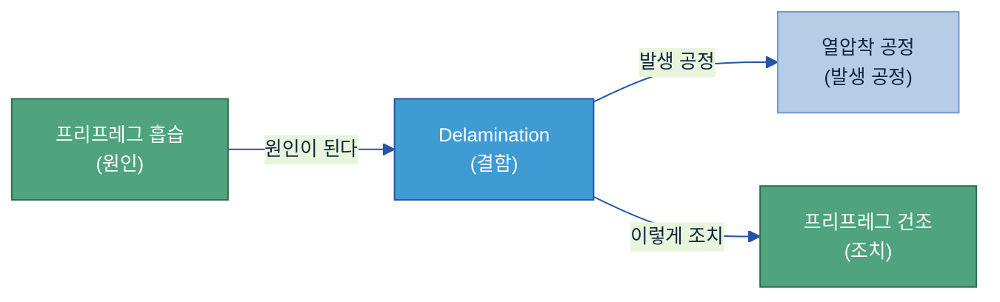
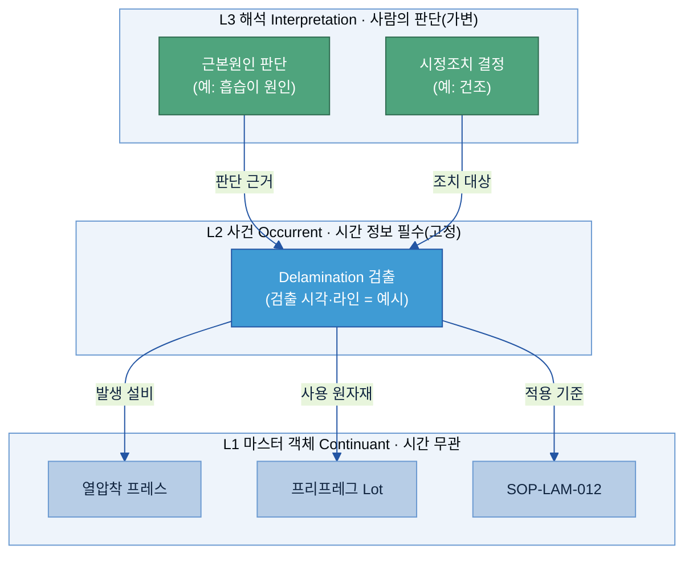
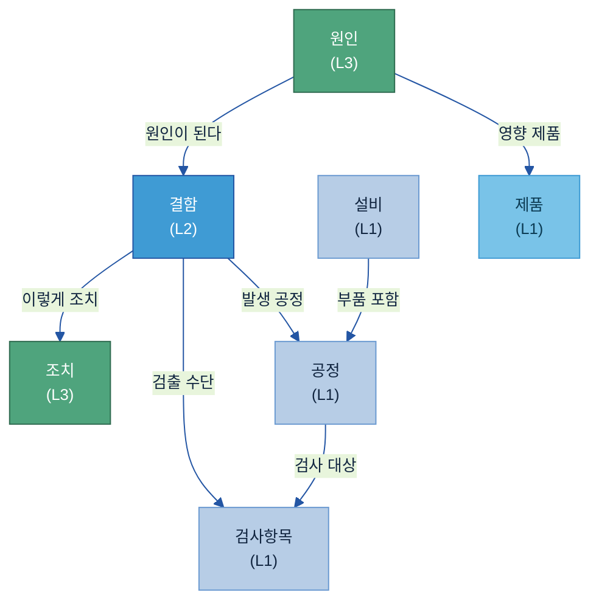
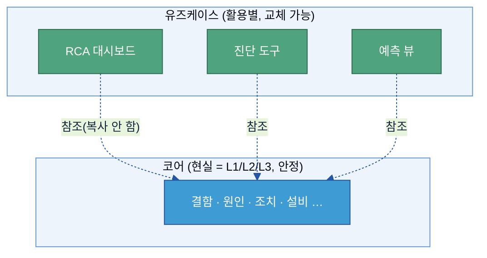
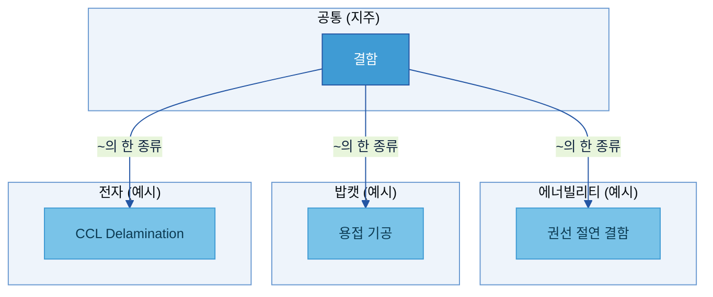
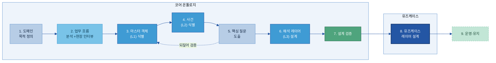
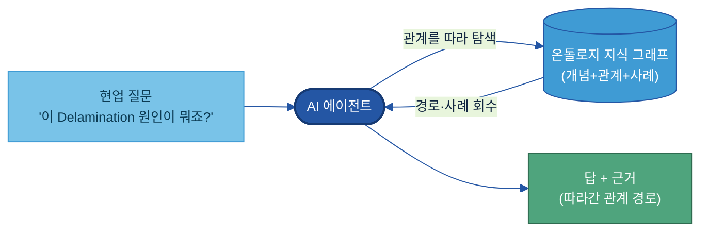

# B-3. 온톨로지(Ontology) 매뉴얼

> 온톨로지는 한 분야의 개념들(설비·공정·결함·원인·조치 등)과 **그 사이의 관계**를, 사람과 컴퓨터가 함께 읽을 수 있게 정리해 둔 **지식 지도**다.

---

## 목차

1. [온톨로지란 무엇인가](#1-온톨로지란-무엇인가)
2. [언제 온톨로지를 만드나](#2-언제-온톨로지를-만드나)
3. [무엇으로 이루어지나 (구성요소)](#3-무엇으로-이루어지나-구성요소)
4. [어떻게 구축하나 (개발 프로세스)](#4-어떻게-구축하나-개발-프로세스)
5. [어떤 기술 아키텍처가 필요한가](#5-어떤-기술-아키텍처가-필요한가)
6. [온톨로지 위에서 AI는 이렇게 쓴다](#6-온톨로지-위에서-ai는-이렇게-쓴다)
7. [다른 주제와의 관계](#7-다른-주제와의-관계)
8. [성과 지표·고도화 로드맵](#8-성과-지표고도화-로드맵)

- [별첨 (Appendix)](#별첨-appendix) — A 설계 각론(별도 .md) · F·G 기술 참고
- [참고자료 (References)](#참고자료-references)
- [변경 이력 / 피드백 반영](#변경-이력--피드백-반영)

---

> [!question] **이 가이드가 답하는 6가지 질문**
>
> | # | 질문 | 한 줄 답 | 다루는 곳 |
> |---|------|----------|-----------|
> | 1 | 어떤 경우에 온톨로지를 구축해야 하나? | 그 위에 올릴 서비스의 가치가 분명하고, 여러 개념을 건너가는 결정적(100%)·설명 가능한 답이 필요할 때. 단순 용어 통일은 Glossary, 단순 집계는 BI로 충분 | [2절](#2-언제-온톨로지를-만드나) |
> | 2 | 어떤 개념과 관계를 모델링하나? | 제품·공정·결함·검사·원인·조치 등 핵심 개념과 "발생한다·검출된다·원인이 된다·조치한다" 같은 관계 | [3절](#3-무엇으로-이루어지나-구성요소) |
> | 3 | 계열사 지식과 전사 공통 지식을 어떻게 나누나? | 지주는 공통 상위 개념·표준 관계, 계열사는 현장 특화 개념을 확장 | [3.5절](#sec35) |
> | 4 | 온톨로지를 어떤 데이터와 연결하나? | Glossary·메타데이터·카탈로그·SOP·PFMEA·C/S Report를 개념에 매핑(개념-데이터-문서) | [3.6절](#sec37) |
> | 5 | AI 활용에 어떻게 적용하나? | 지식 그래프 위에서 개념 확장 검색·다중홉 원인 추적·유사사례/조치 추천 | [6절](#6-온톨로지-위에서-ai는-이렇게-쓴다) |
> | 6 | 온톨로지 변경을 어떻게 운영하나? | 추가·변경·계층 변경을 유형별로 분류해 전문가 검토·버전 관리, AI 영향까지 점검 | [4.6절](#sec46) |

> **예시 표기 안내:** 본 가이드의 다이어그램·표에 나오는 구체 값(Lot 번호·온도·SOP 번호·라인/설비 번호·건수 등)은 **이해를 돕기 위한 가상 예시이며 실제 데이터가 아니다.** 실제 값은 PoC·프로젝트에서 확정한다. 계열사명도 적용 맥락 설명용이다.

> **관련 가이드:** [A-1 데이터 카탈로그](../A-1%20데이터%20카탈로그/A-1%20데이터%20카탈로그.md) · [A-2 메타데이터](../A-2%20메타데이터/A-2%20메타데이터.md) · [A-3 Glossary](../A-3%20Glossary/A-3%20Glossary.md) · [B-2 데이터 해설·주석](../B-2%20데이터%20해설·주석/B-2%20데이터%20해설·주석.md)

---

## 1. 온톨로지란 무엇인가

온톨로지는 단어 뜻을 모아둔 사전이 아니다. 개념과 개념 사이의 **연결(관계)·계층·인과를 적어 둔 "지식 지도"**다.

### 1.1 한마디로 — 개념들을 잇는 '지식 지도'

지하철 노선도를 떠올려 보자. 노선도는 "역 이름"만 적어 두지 않는다. **어느 역이 어느 역과 이어지고, 어디서 갈아타는지**를 함께 그린다. 그래서 노선도 하나로 "여기서 저기까지 어떻게 가나"를 따라갈 수 있다.

온톨로지가 공장에서 하는 일이 이것이다. 설비·공정·결함·원인·조치 같은 개념을 **점(노드)**으로 두고, "무엇이 무엇을 일으키고(원인)", "무엇으로 해결되며(조치)", "무엇의 한 종류인지(계층)"를 **선(관계)**으로 이어 둔다. 컴퓨터(AI)는 이 선을 따라가며 "이 결함은 왜 생겼고 어떻게 조치하나"를 추적할 수 있다.

> 조금 더 정확히 말하면, 온톨로지는 **한 분야의 개념과 그 사이의 관계를, 사람과 컴퓨터가 함께 쓸 수 있도록 명시적으로 정의한 "공유 어휘"**다. 여기에 실제 사례 데이터(예: 3월 17일 검출된 Delamination 1건)를 채우면 **지식베이스(지식 그래프)**가 된다. ([3절 구성요소](#3-무엇으로-이루어지나-구성요소)에서 자세히.)

> **온톨로지와 그것을 담는 그릇(Knowledge DB)은 같은 말이 아니다.** 온톨로지는 비즈니스에 흩어진 **암묵지와 인과관계를 의미 단위로 묶는 '시맨틱 레이어(Semantic Layer)'의 하나**다 — *무엇이 무엇과 어떻게 연결되는가*를 정의한 **의미 구조**이지 저장 기술이 아니다. 이 구조를 실제로 구현해 담는 **그릇이 Knowledge DB**, 즉 개념·관계를 **그래프 형식으로 저장**하는 저장소다([5절 기술 아키텍처](#5-어떤-기술-아키텍처가-필요한가)의 그래프 DB). 즉 **온톨로지(의미 구조)를 설계해 → Knowledge DB(그래프 저장소)에 저장**하는 것이다. 온톨로지는 "무엇을 어떻게 잇는다는 약속", Knowledge DB는 "그 약속과 사례 데이터를 담아 돌리는 저장소"다.

- **단어장**은 단어의 뜻만 알려준다 — "Delamination: 층 사이 접착이 떨어지는 현상".
- **온톨로지**는 거기서 한 걸음 더 나아가 **"Delamination은 흡습이 원인이고, 건조로 조치한다"**처럼 개념 사이의 관계까지 적어 둔다.

**제일 작은 예 (CCL Delamination):** 전자 계열사 CCL(동박적층판) 라인에서 **Delamination** 결함을 다룬다고 하자. 온톨로지에 아래처럼 적어 두면, AI가 "Delamination"에서 출발해 원인과 조치를 선을 따라 찾아갈 수 있다.

### 1.2 왜 만드나 (Why)

제조 현장에는 데이터가 없는 게 아니다. **흩어져 있고, 시스템마다 부르는 이름이 다른 것**이 문제다. CCL Delamination 하나만 봐도 관련 정보가 ERP(보관 습도)·MES(프레스 온도)·SOP(기준값)·검사 기록(Delamination 검출)·C/S Report(클레임)에 따로 흩어져 있고, 이름도 제각각이다. 그래서 **"왜 이 결함이 났는가"를 묻는 순간 막힌다** — 원인·공정·결과·조치가 서로 다른 곳에 있기 때문이다.

온톨로지는 이 흩어진 개념을 한 번 이어 둔다. 표준적으로 온톨로지를 만드는 이유는 다음과 같다.

| 이유 | 쉬운 설명 |
|---|---|
| **사람·AI가 같은 구조를 공유** | 시스템마다 다르게 부르던 것을 한 의미로 모아, 사람도 AI도 같은 그림을 본다 |
| **지식을 재사용** | 한 번 만든 "결함–원인–조치" 구조를 여러 분석·도메인에서 다시 쓴다 |
| **숨은 전제를 드러냄** | 코드·사람 머릿속에 숨어 있던 규칙을 밖으로 꺼내 명시한다 |
| **지식과 처리 로직을 분리** | "현실 지식"은 온톨로지에, "이번에 이렇게 처리하라"는 앱 로직에 따로 둔다 |
| **지식을 점검·확장** | 구조가 명시돼 있어 빠진 곳·모순을 점검하고 넓히기 쉽다 |

같은 질문에 대한 답이 이렇게 달라진다.

| 현업 질문 | 온톨로지 없을 때 | 온톨로지 있을 때 |
|---------|-------------|-------------|
| "이 결함이 뭔가?" | 사람 경험에 의존 | 계층을 따라: Delamination → 층간결함 → CCL결함 |
| "왜 생겼나?" | 문서를 키워드로 검색(일반론) | "원인이 된다" 관계를 따라: Delamination ← 수지 미경화 ← 흡습 |
| "어느 Lot이 공통인가?" | 시스템 4개를 수동 대조 | "사용 원자재" 관계로 한 번에 조회 |
| "조치는 무엇인가?" | 과거 보고서 검색·베테랑 판단 | "이렇게 조치" 관계를 따라 표준 조치 확인 |

### 1.3 알아둘 3가지 기본 원칙

온톨로지를 처음 만들 때 마음에 새겨 둘 세 가지다. 이 세 가지를 모르면 "완벽한 정답표"를 만들려다 길을 잃는다.

| 원칙 | 뜻 |
|---|---|
| **① 정답은 하나가 아니다** | 같은 현실도 모델링 방법이 여러 가지다. **완벽한 보편 분류표를 좇지 말고**, 쓰임새와 앞으로의 확장에 맞는 실용적 설계를 고른다. (단, *무엇을 어디까지* 담을지는 쓰임새가 정해도, **코어는 특정 활용이 아니라 현실 중심**으로 만든다 — [4.1절](#sec14).) |
| **② 한 번에 완성되지 않는다** | 온톨로지 설계는 **반복**이다. 거친 1차안 → 써 보고 → 전문가와 검토 → 고치기를 되풀이한다. |
| **③ 개념은 현실의 명사·동사에 가깝게** | 보고서 양식이 아니라 **현실에 실제 있는 것**을 담는다. 도메인을 설명하는 문장의 **명사(객체)·동사(관계)**가 곧 개념·관계 후보다. |

### 1.4 다루는 범위 (한 줄 경계)

이 가이드는 **개념 사이의 관계·구조를 만드는 일**을 다룬다. 단어의 뜻 자체는 [A-3 Glossary](../A-3%20Glossary/A-3%20Glossary.md), 데이터 필드 설명은 [A-2 메타데이터](../A-2%20메타데이터/A-2%20메타데이터.md), 자산의 위치는 [A-1 데이터 카탈로그](../A-1%20데이터%20카탈로그/A-1%20데이터%20카탈로그.md)가 맡는다. (자세한 경계는 [7절](#7-다른-주제와의-관계).)

---

## 2. 언제 온톨로지를 만드나

온톨로지는 모든 데이터에 다 만드는 것이 아니다. 만들지 말지는 "이것이 기술적으로 온톨로지 문제인가"로 정하지 않는다. **그 위에 어떤 서비스를 올릴 것이고, 그 서비스가 어떤 가치를 주는가**로 정한다. 온톨로지 자체는 현업이 직접 들여다보는 산출물이 아니라, 그 위에서 도는 질문 응답·원인 추적·조치 추천 같은 **서비스의 토대**이기 때문이다.

따라서 판단은 세 단계를 거친다. 먼저 어떤 서비스를 만들지 정하고, 그 서비스가 줄 가치가 구축·유지 비용을 넘는지 보고, 마지막으로 그 서비스가 **온톨로지여야만 가능한지**를 따진다. 마지막 단계에서 더 단순한 도구로도 된다는 답이 나오면 온톨로지를 만들지 않는다.

### 2.1 먼저 정할 것 — 어떤 서비스에 쓰며, 무엇이 좋아지나

가치는 온톨로지 자체가 아니라 그 위에 올린 서비스에서 나온다. 예를 들어 "Delamination 클레임이 들어오면 공통 원인과 표준 조치를 근거와 함께 답해 주는 서비스"가 그런 가치다. 이 서비스가 실제로 어떻게 도는지는 [6절](#6-온톨로지-위에서-ai는-이렇게-쓴다)에서 다룬다. 그래서 구축을 검토할 때 가장 먼저 답할 것은 기술이 아니라 다음 세 가지다.

- 어떤 서비스를 만들 것인가 — 현업이 매일 반복해서 묻는 질문이나 판단은 무엇인가
- 그 서비스를 쓰면 무엇이 좋아지나 — 조사 시간 단축, 베테랑 의존 감소, 판단 근거의 일관성
- 그 가치가 구축·유지 비용을 넘는가

서비스와 그 가치를 분명히 말하지 못하면, 아직 온톨로지를 만들 때가 아니다. 반대로 가치가 분명하다면, 그 서비스가 아래 2.2의 경우에 해당하는지 본다.

### 2.2 이럴 때 온톨로지여야 한다 (다른 도구로는 어려운 경우)

온톨로지가 맞는 문제인지는 풀려는 문제의 성격에서 갈린다. 아래 ①~③ 가운데 하나만 뚜렷해도 표나 검색 같은 단순한 도구로는 벅차 온톨로지를 검토할 만하고, 둘셋이 겹치면 분명해진다. ④는 갖추면 가치가 한층 커지는 조건이다.

| 온톨로지가 맞는 조건 | 현업 케이스 |
|---|---|
| **① 답이 개념 사이 '관계'에서 나온다** 관계를 따라가야 답이 되는 문제 | • 경우의 수가 너무 많아 규칙으로 일일이 못 적는다 • 답이 원자재→공정→검사→원인처럼 여러 단계를 건너야 나온다 • 관계가 늘어도 손이 덜 간다 — 새로 이어 붙이면 그 위 서비스가 알아서 쓴다 • 사라질 전문가 판단(증상→원인)을 관계로 남겨 둔다 |
| **② 100% 정확하고 설명 가능(explainable)해야 한다** 확률이 아니라 선언된 규칙대로 | • 안전·품질·감사처럼 틀리면 안 되는 일 — 제어 로직(인터록) 도면을 그대로 따라 답한다 • 벡터 DB나 생성형 검색(RAG)으로는 100%를 보장하지 못한다 |
| **③ 흩어진 데이터를 하나의 의미로 묶어야 한다** 여러 시스템·용어를 공통 의미층으로 | • 같은 대상을 시스템마다 다른 코드·이름으로 부른다(MES·ERP·QMS) • 묻는 방식이나 시스템이 달라도 같은 답이 나와야 한다 |
| **④ 하나로 여러 곳이 함께 쓴다** (선택) | • 여러 AI 에이전트·분석이 같은 구조를 함께 쓴다 • 계열사·공장으로 확장한다 |

### 2.3 이럴 땐 안 만들어도 된다 (다른 도구가 더 맞을 때)

온톨로지는 만들고 유지하는 비용이 든다. 더 단순한 도구로 충분하면 그것을 쓴다.

- **단어 뜻만 통일하면 될 때** → [A-3 Glossary](../A-3%20Glossary/A-3%20Glossary.md)(용어사전)로 충분하다. 개념 사이 관계까지 만들 필요는 없다.
- **단순 집계·리포팅이 목적일 때** → SQL·BI 도구가 더 빠르고 단순하다.
- **비슷한 문서·문장을 찾아 자연스러운 답을 내면 될 때** → 벡터 검색·생성형 AI(RAG)가 더 쉽다.

다만 벡터 검색·생성형 AI는 비슷한 것을 잘 찾아 줄 뿐, **확률에 기반하므로 항상 똑같고 100% 정확한 답을 보장하지 못한다.** 그래서 안전·품질처럼 틀리면 안 되는 답이나, 여러 단계의 관계를 정확히 따라가야 하는 답은 이 방식만으로는 어렵다. 도면이나 규칙을 그대로 따라간 단 하나의 정답이 필요할 때는 관계를 명시적으로 선언해 두는 온톨로지가 필요하다. 두 방식이 배타적인 것은 아니어서, 실제로는 벡터 검색으로 후보를 좁히고 온톨로지로 정확한 관계를 확인하는 식으로 함께 쓰기도 한다.

### 2.4 시작은 작게 — "도메인 먼저, 전사는 나중"

처음부터 전사 거대 온톨로지를 만들려 하면 **반드시 실패한다.** 개념이 늘수록 이어야 할 관계가 폭증해 현업이 검토할 수 없게 되기 때문이다.

- **한 라인·한 결함 영역**(예: CCL Delamination)부터 시작한다.
- 초기 규모는 개념 **50~80개**, 관계 **10~15종**이면 가치를 보여주기에 충분하다(숫자는 예시).
- 한 도메인에서 검증되면, 그 구조를 재사용해 다른 도메인·계열사로 넓힌다.

---

## 3. 무엇으로 이루어지나 (구성요소)

온톨로지는 **6가지 재료**로 개념을 만들고, 그 개념을 **3계층**으로 배치하며, **코어/유즈케이스**(재사용)와 **공통/계열사**(조직)로 정리한다.

### 3.1 기본 재료 6가지

온톨로지를 이루는 빌딩 블록은 6가지다. 이 6가지가 다 있어야 "지식 구조"이고, 일부만 있으면 단어사전·분류표에 머문다.

| # | 구성요소 (용어) | 쉬운 설명 | CCL 예시 |
|---|------|-----------|---------|
| ① | **클래스** | 같은 성격의 개체를 묶은 개념(범주) | 결함, 설비, 공정, 제품 |
| ② | **인스턴스** | 클래스에 속하는 구체적 개체 하나(=사례) | "3월 17일 검출된 Delamination 1건" |
| ③ | **속성** | 클래스·인스턴스가 가지는 값 | 심각도=높음, 검출 시각 |
| ④ | **관계** | 두 클래스를 잇는 방향 있는 연결 | 흡습 →(원인이 된다)→ Delamination |
| ⑤ | **계층** | "A는 B의 한 종류(is-a)"인 수직 구조 | Delamination → 층간결함 → 결함 |
| ⑥ | **공리** | 관계로부터 새 사실을 자동으로 끌어내는 규칙 | "Delamination이면 층간결함이고 결함"을 자동 분류 |

> **가장 작은 단위 = 트리플(Triple):** 온톨로지의 정보 한 조각은 항상 **「주어 — 관계 — 목적어」** 세 쌍이다. 예: `Delamination — 발생 공정 — 열압착 공정`. 이렇게 적어 두면 새 관계가 생겨도 표 구조를 바꿀 필요 없이 한 줄만 추가하면 된다.

> **설계도(T-Box) + 사례 데이터(A-Box) = 지식베이스.** 위 6가지 중 클래스·속성·관계·계층·공리(①③④⑤⑥)는 개념을 정의한 **설계도 부분(T-Box)**, 인스턴스(②)를 실제로 채운 것이 **데이터 부분(A-Box)**이다. 설계도만 있으면 빈 틀이고, 인스턴스까지 채워야 AI가 쓸 지식베이스가 된다 — 그래프로 구현하면 **지식 그래프**라고도 부른다. (자세한 용어는 [별첨 F](#appendix-f-기술-용어-한-줄-풀이).)

> **계층(⑤)을 만들 때 알아둘 규칙:** ▸ 계층은 "~의 한 종류(is-a)" 관계다 — Delamination은 층간결함의 한 종류. ▸ **같은 뜻 단어는 한 개념으로** — "용접불량"과 "용접결함"을 두 개념으로 쪼개지 않는다(별칭으로). ▸ 한 개념의 바로 아래 하위는 **2~12개**가 적당하다(1개뿐이면 빠진 것, 너무 많으면 중간 분류가 필요).

### 3.2 개념을 3층으로 나눠 배치한다

6가지 재료로 개념을 만들었으면, 그 개념을 **성격에 따라 세 층(Layer 1·2·3)으로 나눠** 배치한다. 이 **3층 모델**이 온톨로지를 "시간이 지나도 안 무너지게" 지탱하는 핵심 설계다 — **안 변하는 것(L1)·일어난 일(L2)·사람의 판단(L3)을 한 노드에 섞지 않는다.**

| 층 | 무엇을 담나 (용어) | 시간 정보 | CCL 예시 |
|---|---|---|---|
| **L1 마스터 객체** — 안 변하는 것 | 시간과 무관하게 지속하는 개체 | 없음 | 설비·제품·공정·자재·SOP |
| **L2 사건** — 일어난 일 | 특정 시점에 발생한 사실. 한 번 일어나면 고정 | **반드시 있음**(언제 일어났나) | Delamination 검출, 공정 집행, 검사 수행 |
| **L3 해석** — 사람의 판단 | 사람이 사건을 보고 내린 판단. 나중에 바뀔 수 있음 | 선택 | 근본원인 판단, 시정조치 결정 |

**각 층이 하는 일:**
- **L1 마스터 객체(Layer 1)** — 현실에 늘 존재하는 것들의 *기준 명부*. 설비·제품·자재·공정·SOP처럼 모든 사건·판단이 가리키는 **고정점**이다. 한 번 잘 정의하면 거의 안 바뀐다.
- **L2 사건(Layer 2)** — *언제 무슨 일이 있었나*의 기록(Delamination 검출·공정 집행·검사 수행). 분석과 추적의 **뼈대**이며, 시간 도장이 찍힌 사실이라 덮어쓰지 않고 **쌓기만** 한다.
- **L3 해석(Layer 3)** — 그 사건을 보고 사람이 내린 *원인·조치 판단*. 재조사로 달라질 수 있어 사건(L2)과 **분리해** 두고 판단만 버전 갱신한다.

> 핵심은 **시간과 무관하게 지속하는 것**(L1 마스터 객체)과 **시간 속에서 일어나는 것**(L2 사건)을 한 노드에 섞지 않는 것이다.

> **왜 나누나:** "Delamination이 검출됐다(L2)"는 검사 장비가 남긴 **바뀌지 않는 사실**이다. "원인은 흡습(L3)"은 사람의 **판단**이라 재조사로 "온도 미달이 원인"으로 바뀔 수 있다. 두 층을 나눠 두면 **판단만 고쳐도 검출 사실은 그대로 보존**된다.
>
> **참조 방향 규칙:** 판단(L3) → 사건(L2) → 안 변하는 것(L1) 방향으로만 잇는다. 사건이 판단을 거꾸로 가리키면(L2 → L3), 판단이 바뀔 때 사건 기록까지 오염되므로 **금지**한다.

### 3.3 핵심 개념과 관계 (제조)

제조 결함 분석에서 자주 쓰는 **핵심 개념 7개**와 **핵심 관계 7개**다. 이 둘을 한 그림으로 보면 온톨로지는 곧 **작은 지식 지도**다.

| 개념 | 3계층 | 예시 |
|--------|------|------|
| 제품 | L1 | CCL 제품군 |
| 공정 | L1 | 열압착 공정 |
| 설비 | L1 | 열압착 프레스 |
| 검사항목 | L1 | 외관 검사 |
| 결함 | L2 | Delamination(검출 사건) |
| 원인 | L3 | 프리프레그 흡습(판단) |
| 조치 | L3 | 프리프레그 건조(판단) |

> 이 지도를 따라가면 "어떤 원인이 어떤 공정에서 어떤 결함을 만들고, 어떤 조치로 해결되는가"를 한 번에 답할 수 있다. 색은 [3.2절 3계층](#sec33)을 그대로 따른다(연파랑=L1 / 진파랑=L2 / 초록=L3).

### 3.4 코어와 유즈케이스로 나눈다 (재사용 축)

같은 "결함–원인–조치" 구조를 분석 대시보드·진단 도구가 각자 따로 만들면 일관성이 깨진다. 그래서 **두 층으로 나눈다.**

| 구분 | 무엇을 담나 | 바뀌는 빈도 |
|------|---------|---------|
| **코어 온톨로지** | 현실 그 자체(L1·L2·L3) — 변하지 않는 진실 | 낮음 |
| **유즈케이스 온톨로지** | 특정 활용 전용 구조 — 코어를 **복사하지 않고 참조**만 | 높음 |

**규칙 3가지:** ① 코어에는 특정 활용 전용 개념을 넣지 않는다. ② 유즈케이스는 코어를 복사하지 않고 참조만 한다. ③ 요건이 바뀌면 **유즈케이스 층만 교체**하고 코어는 그대로 둔다.

> 코어 설계와 유즈케이스 설계는 각각 별도 설계 문서로 정리한다. (구축 순서는 [4절](#4-어떻게-구축하나-개발-프로세스).)

### 3.5 전사 공통과 계열사로 나눈다 (조직 축)

여러 계열사가 함께 쓰는 지식과 계열사 고유 지식은 층을 나눠 관리한다.

| 구분 | 무엇을 담나 | 누가 관리 |
|------|-----------|---------|
| **공통 상위개념** | 둘 이상의 계열사가 공유하는 상위 개념·관계 | 지주·공통 데이터 담당 |
| **계열사 고유개념** | 계열사 고유 개념 — 공통 개념의 **하위 종류로 확장** | 계열사 데이터 담당 |

> 계열사는 공통 개념을 복사하지 않고 **"~의 한 종류"(하위 클래스)로 상속**해 공통 속성·관계를 그대로 물려받는다.

### 3.6 데이터·문서와 연결한다

온톨로지 개념(설계도)은 반드시 **실제 데이터·문서와 연결**되어야 한다. 연결이 없으면 채울 사례 데이터가 없어 빈 껍데기가 된다. 아래 표가 그 연결 명세다(이 표대로 데이터 파이프라인을 만들면 사례가 자동으로 채워진다).

| 온톨로지 개념 | A-3 표준 용어 | A-2 메타데이터 필드 | A-1 카탈로그 자산 | 원천 문서 |
|---------------|--------------|-------------------|----------------|---------|
| 결함 | 결함 | defect_code, severity | CCL 검사 결과 | C/S Report·MES 검사 로그 |
| 공정 | 열압착 공정 | process_id | 공정 마스터 | SOP-LAM-012 |
| 설비 | 열압착 프레스 | equipment_id | 설비 마스터 | 설비 점검 일지 |
| 원인 | 프리프레그 흡습 | cause_code | 원인 코드 테이블 | PFMEA 원인 분석 |
| 조치 | 프리프레그 건조 | action_code | 조치 코드 테이블 | C/S Report 처치 이력 |

> 즉 [A-1 카탈로그](../A-1%20데이터%20카탈로그/A-1%20데이터%20카탈로그.md)·[A-2 메타데이터](../A-2%20메타데이터/A-2%20메타데이터.md)·[A-3 Glossary](../A-3%20Glossary/A-3%20Glossary.md)가 준비해 둔 것을 받아서 온톨로지가 개념끼리 연결한다.

---

## 4. 어떻게 구축하나 (개발 프로세스)

온톨로지 구축은 표준 개발 프로세스(**범위·역량질문 정하기 → 용어 모으기 → 개념·계층 만들기 → 속성·관계 정의 → 사례 채우기**)를 따른다. 본 프로젝트는 이를 제조에 맞춰 **9단계**로 구체화했다. 흐름은 **코어(1~7단계) → 유즈케이스(8단계) → 운영(9단계)**이며, 핵심은 "산출물 양식을 베끼는 게 아니라 **현실에서 개념을 길어 올려** 작게 시작하고 검증 후 확장"하는 것이다.

### 4.1 구축 내내 지키는 설계 원칙

[1.3절 3가지 기본 원칙](#sec13)(정답은 하나가 아니다·반복적 과정·현실의 명사·동사)에 더해, 본 프로젝트는 다음 5가지를 지킨다.

| 원칙 | 뜻 |
|---|---|
| **현실을 담는다** | 보고서 양식이 아니라, 현실에 실제 존재하는 객체와 사건을 모델링한다. |
| **단일 진실** | 같은 개념을 여러 곳에서 다르게 정의하지 않는다 — 쿼리·AI가 모두 같은 현실을 본다. |
| **재사용 (객체 중심)** | 특정 활용이 아니라 현실 객체 중심으로 설계해, 한 번 만든 코어를 거듭 쓴다. |
| **관계 중심** | 값(측정치)을 쌓기보다 개념 사이의 **인과·선후 관계**를 먼저 구조화한다. |
| **도메인 먼저** | 전사 온톨로지를 먼저 만들지 않는다. 한 도메인을 먼저 검증하고 넓힌다. |

### 4.2 출발점 — As-Is 분석서

9단계에 들어가기 전, 대상 도메인의 **현실을 정리한 As-Is 분석서**를 먼저 확보한다. 모든 개념·관계의 근거가 여기서 나온다 — 아래 6가지를 채우면 그대로 코어 설계의 입력이 된다.

| As-Is 분석서가 담는 것 | 온톨로지 설계에 쓰이는 곳 |
|---|---|
| 업무 전체 흐름(예: 클레임 접수 ~ C/S Report 발송) | 1단계 도메인 목적·범위 |
| 현실에 존재하는 물리·조직·기준 객체 | 3단계 L1(안 변하는 것) |
| 시간과 함께 일어나는 사건 | 4단계 L2(일어난 일) |
| 현업의 판단·대책 결정 기록 | 6단계 L3(사람의 판단) |
| 데이터 소스 확인 결과(MES·ERP 등) | 각 개념의 데이터 연결([3.6절](#sec37)) |
| 팀 간 용어 불일치·동의어 | 개념 정의·별칭(alias) |

> **As-Is 정리에는** E2E 흐름·객체/사건/판단 후보·데이터 소스 인벤토리(확인·미확인)·용어 충돌·핵심 질문·미결을 담고, 각 항목이 어느 단계로 흘러가는지(다음 단계 매핑)까지 적어 둔다.

> **원칙: 근거 없는 개념은 만들지 않는다.** 데이터 소스가 확인 안 된 개념은 "미확인"으로 표시하고 보완 계획을 남긴다. As-Is의 개념은 현장 인터뷰·워크샵으로 길어 올린다.

### 4.3 9단계 한눈에

| 단계 | 무엇을 하나 | 표준 프로세스 대응 | 산출물 |
|---|---|---|---|
| **1 도메인 목적 정의** | 측정 가능한 목적을 **한 문장**으로 (아래 설명) | 범위 설정 | 코어 설계 문서 |
| **2 업무 흐름 분석 + 현장 인터뷰** | 전체 흐름에서 개념·관계 후보(용어) 모음 | 용어 수집 | As-Is 정리 |
| **3 마스터 객체(L1) 식별** | "독립 존재? + 사실 고정?" → L1 | 클래스·계층 | 코어 설계 문서 |
| **4 사건(L2) 식별** | **시간 정보가 있는** 사건 → L2 | 클래스·계층 | 코어 설계 문서 |
| **5 핵심 질문 도출** | 목적 관점 질문 3~5개로 3·4단계를 **되짚어 검증** | 핵심 질문 | 코어 설계 문서 |
| **6 해석 레이어(L3) 설계** | 원인·조치 같은 사람 판단(L3)을 사건(L2) **위에** | 클래스·관계 | 코어 설계 문서 |
| **7 설계 검증** | 기술 점검 + 현업 확인 → **코어 완성** | 평가·반복 | 코어 설계 문서 |
| **8 유즈케이스 레이어** | 코어 위에 활용 전용 구조를 얹음(코어 불변) | (응용) | 유즈케이스 설계 문서 |
| **9 운영·유지** | 지식 갱신·변경 관리 ([4.6절](#sec46)) | 진화 | — |

> 위 "표준 프로세스 대응" 열에서 보듯, 9단계는 일반 온톨로지 개발 프로세스(범위→용어→클래스/계층→속성→인스턴스→진화)를 제조 현장에 맞게 구체화한 것이다 — **7단계·9단계가 따로 경쟁하는 게 아니다.** 표준 프로세스의 **속성 정의**는 [3.1절](#sec-what)·[5.6절 구현 규칙](#sec79)에서, **인스턴스 채우기(사례 적재)**는 [3.6절](#sec37)·[6절](#6-온톨로지-위에서-ai는-이렇게-쓴다)에서 다룬다. 그리고 [1.3절 원칙②](#sec13)대로 **한 번에 끝나지 않는다** — 1차안을 만들고 써 보며 반복해 다듬는다.

**1단계 — 좋은 목적 문장:** "AI로 품질 개선" 같은 막연한 목적은 범위를 발산시킨다. **측정 가능한 한 문장**으로 고정한다.

| 나쁜 목적 | 좋은 목적 |
|---|---|
| "AI로 품질 개선" | "CCL 라인 Delamination 결함의 원인 분석 시간을 수일 → 수시간으로 단축" |

### 4.4 코어 설계 (1~7단계) — 산출물: 코어 설계 문서

코어 설계의 산출물(설계 문서)은 빈 양식 채우기가 아니라 **바로 구축에 착수할 수 있는 실행안**이어야 한다.

**2단계 — 용어부터 모은다(노드화는 미룸):** 업무 흐름을 따라가며 "이 분야를 설명하는 문장의 명사·동사"를 폭넓게 적는다([1.3절 원칙③](#sec13)). 이 단계에서는 겹침·계층을 따지지 않고 후보를 모으기만 한다.

**3·4·6단계 — L1·L2·L3 배치:** 모은 후보를 [3.2절 3계층](#sec33)으로 배치한다. 판별 질문은 단순하다.

- **L1 마스터 객체:** "활용과 무관하게 독립적으로 존재하나? + 사실로 고정되나?"
- **L2 사건:** "언제 일어났는지(시간 정보)가 있나?" — L2는 시간 정보가 필수.
- **L3 해석:** "사람의 판단·결정인가? 재조사로 바뀔 수 있나?"

> **계층을 만드는 3가지 방법:** ▸ **위→아래**: 큰 개념(결함)부터 잡고 잘게 나눔(→ 층간결함 → Delamination). ▸ **아래→위**: 구체적인 것(Delamination·기공)부터 잡고 공통 상위(결함)로 묶음. ▸ **혼합**: 핵심 개념 몇 개를 먼저 잡고 위아래로 넓힘(보통 가장 쉬움). 정답은 없고, 팀이 도메인을 보는 방식에 맞춰 고른다.

**CCL Delamination 배치 (예시):**

| 후보 | 층 | 이유 |
|---|---|---|
| 열압착 프레스 | L1 | 활용과 무관하게 존재하는 설비 |
| 프리프레그 Lot | L1 | 입고된 원자재 — 사실로 고정 |
| Delamination 검출(특정 일시·라인) | L2 | 시간 정보 있음 · 한 번 발생하면 고정 |
| "원인: 흡습" 판단 | L3 | 재조사로 바뀔 수 있는 사람 판단 |

**5단계 — 핵심 질문으로 되짚어 검증:** 1단계 목적 관점에서 온톨로지가 답해야 할 질문 3~5개를 만든다. 이 질문은 범위를 잡을 때 미리 스케치해 두고, 여기서 "지금 설계가 이 질문에 개념·관계 경로로 답하나"를 되짚는 **리트머스 시험지**로 쓴다. 경로가 끊기면 그 개념·관계가 빠진 것이다.

> 예: "이번 분기 Delamination의 상위 원인은?" → `클레임 → 제품 → Lot → 공정조건 → (원인이 된다) → Delamination` 경로가 이어지는지 확인.

**개념을 뽑는 풍부한 원천 — PFMEA:** PFMEA(잠재 고장 분석) 표는 제조 온톨로지 개념의 가장 좋은 출발점이다. 표의 열이 3계층에 거의 그대로 대응한다.

| PFMEA 열 | 온톨로지 개념 | 층 |
|---|---|---|
| 공정 단계 | 공정 | L1 |
| 고장 모드 | 결함 | L2 |
| 잠재 원인 | 원인 | L3 |
| 권장 조치 | 조치 | L3 |
| 심각도/발생도/검출도 | 결함의 속성(숫자값) | 속성 |

> LLM은 PFMEA·SOP 텍스트에서 후보 개념을 빠르게 제안해 도움을 줄 수 있다. 단 **"이게 L2인지 L3인지", "두 문서의 용어가 같은 것인지"** 같은 판단은 LLM이 못 하므로 **현업 전문가 검증은 반드시** 거친다.

**노드를 적는 좋은 습관 (Before → After):** 같은 현실도 어떻게 적느냐에 따라 재사용 가능한 코어가 되기도, 막힌 구조가 되기도 한다.

| 나쁜 예 | 좋은 예 | 왜 |
|---|---|---|
| `Delamination.발생설비 = "프레스#2"` (글자값) | `Delamination →(발생 설비)→ 프레스#2` (개념으로) | 개념으로 둬야 "프레스#2에서 난 모든 결함"을 찾을 수 있다 |
| `Delamination{검출시각, 원인="흡습"}` 한 덩어리 | `Delamination 검출`(L2)과 `흡습 판단`(L3)을 분리 | 원인을 재판단해도 검출 사실은 보존된다 |
| `C/S리포트3페이지표`를 개념으로 | 리포트가 *참조하는* 현실 개념을 둠 | 출력 양식이 아니라 현실을 모델링한다 |
| `용접불량` + `용접결함` 두 개념 | 한 개념 + 별칭(alias) | 같은 현실이 두 개로 갈라지면 결과가 어긋난다 |

**7단계 — 설계 검증 → 코어 완성:** 아래 [4.8절 검증 4원칙](#sec48)으로 점검하고, 샘플 데이터로 핵심 질문에 답이 나오는지 확인한 뒤 코어를 확정한다.

> 무엇을 노드로 둘지, 노드를 어느 층으로·무엇을 속성으로 잡을지의 판단 기준은 [별첨 A 설계 각론](별첨/B-3%20별첨%20A%20—%20온톨로지%20설계%20각론.md)에 있다.

### 4.5 유즈케이스 레이어 설계 (8단계) — 산출물: 유즈케이스 설계 문서

코어가 완성된 뒤, 특정 활용을 위한 전용 구조를 코어 **위에** 얹는다. **이 단계는 코어를 다시 정의하지 않는다.**

순서대로 정의할 것: ① 유즈케이스 정의(목적·유형·사용자) ② 입력/출력 ③ 핵심 질문 + "코어만으로 안 되는 이유" ④ 코어 참조 구조(복사 금지) ⑤ 전용 개념·관계(모두 `유즈케이스` 태그) ⑥ 암묵지 처리 방식 ⑦ 코어 변경 요청(없으면 "없음").

> 유즈케이스의 목적이 다르면 강조하는 서브 구조도 달라진다 — 목적에 맞춘 서브 구조 설계 원칙은 [별첨 A 설계 각론](별첨/B-3%20별첨%20A%20—%20온톨로지%20설계%20각론.md) 1.2절.

### 4.6 운영·유지 (9단계)

온톨로지는 한 번 만들면 끝이 아니다. 데이터와 현장이 바뀌면 그래프도 따라가야 계속 정확하게 쓸 수 있다. 운영은 **정기적으로 점검하고 → 새로 생긴 것은 더하고 → 꼭 필요할 때만 바꾸는** 반복이다.

**① 정기 점검 (예: 분기마다 한 번씩 돌린다).**
- 아무 데도 안 이어진 **고립된 노드**가 생겼는지
- 같은 대상이 **두 이름으로 쪼개졌는지**(중복)
- 원천 데이터가 바뀐 게 빠졌는지 — 없어진 설비·새 공정·새 결함유형
- 핵심 질문에 **여전히 답이 나오는지**

**② 언제 더하나.** 더하기는 위에 쌓인 것을 흔들지 않으니 부담 없이 한다.
- 데이터·현장에 **반복해 나오는 개념**이 아직 그래프에 없을 때
- **새 활용**이 지금 구조로 안 풀릴 때 → 코어는 그대로 두고 **유즈케이스 층에 더한다**
- 원천 데이터에서 **새 관계가 확인**될 때 (근거가 있을 때만)

**③ 언제 바꾸나 — 되도록 더하기로 풀고, 바꾸기는 최소로 한다.**
- 이름이 **실제로 틀렸거나** 오해를 부를 때 → 개명
- 알고 보니 **같은 대상이 둘**이었을 때 → 병합
- 관계의 **방향·의미가 틀렸을** 때 → 교정
- **코어(L1·L2)를 바꾸면 그 위에 쌓인 게 다 흔들린다.** 그래서 코어 변경은 거의 하지 않고, 해야 하면 **먼저 백업**한 뒤 바꾼다. 일상적 변화는 유즈케이스 층에서 흡수한다.

| 변경 유형 | 예시 | 영향 | 어떻게 |
|---|---|---|---|
| **편집** | 라벨 수정, 동의어 추가 | 없음 | 바로 반영 |
| **추가** | 새 하위개념·관계 추가 | 낮음 | 설계 기준대로 더함 |
| **파괴적** | 개념 삭제·개명, 계층 재편 | 높음 | 되도록 피하고, 할 땐 **백업 후** 영향 확인 |

> **원칙: 고치기보다 더하기.** 기존 개념을 바꾸기보다 새 개념을 더하고, 옛 개념은 "폐기 표시"만 남긴다. 바꿀 때는 버전을 기록해 **되돌릴 수 있게** 한다. (설계·운영 판단 기준은 [별첨 A 설계 각론](별첨/B-3%20별첨%20A%20—%20온톨로지%20설계%20각론.md).)

### 4.7 피해야 할 7가지 함정

온톨로지 설계가 실패하는 전형적 패턴이다.

| # | 함정 | 결과 |
|---|---|---|
| 1 | 보고서·양식 구조를 개념으로 옮김 | 현실이 아니라 출력 템플릿을 모델링 → 재사용 불가 |
| 2 | 처리 순서·우선순위 규칙을 코어에 넣음 | 코어가 특정 활용에 종속됨 |
| 3 | 현실 객체를 개념 아닌 글자값(속성)으로 둠 | 그 객체로 패턴을 찾을 수 없음 |
| 4 | 데이터 소스 확인 없이 개념을 만듦 | 구현 단계에서 "채울 데이터가 없다"며 막힘 |
| 5 | 같은 뜻 단어를 여러 개념으로 중복 | 같은 현실이 갈라져 결과가 어긋남 |
| 6 | 유즈케이스와 코어를 섞음 | 활용 교체 시 무엇을 고칠지 모름 |
| 7 | 설계도(스키마)와 사례 데이터를 섞음 | 사례가 늘 때마다 설계도가 출렁임 |

### 4.8 검증 4원칙

7단계 설계 검증을 네 가지로 묶어 점검한다. 한 가지라도 통과 못 하면 그 단계가 덜 끝난 것이다.

| 원칙 | 핵심 질문 | 확인 |
|---|---|---|
| **현실성** | 현실을 올바르게 담았나 | 핵심 객체·사건 누락 없음 · L2에 시간 정보 있음 · 참조 방향 역방향 없음 · 모든 개념에 데이터 소스 연결 |
| **명시성** | 암묵지가 구조로 드러났나 | 현업 용어와 라벨 일치 · 인과 판단이 관계로 표현됨 · 중복 개념 없음 |
| **재사용성** | 코어가 유즈케이스 없이 성립하나 | 모든 개념에 층 태그 · 유즈케이스 떼어내도 코어 독립 성립 |
| **설명력** | 결론의 근거를 구조로 보여주나 | 핵심 질문 전부 경로로 답함 · 추론 경로를 관계로 되짚을 수 있음 |

---

## 5. 어떤 기술 아키텍처가 필요한가

"무엇을 모델링할지"(3절·4절)만큼 **"아키텍처를 무슨 기준으로 고르나"도 방법론의 일부**다. 정하는 **순서**가 있다 — **① 그래프 형식(LPG/RDF) → ② 저장소(RDB/그래프 DB) → ③ 추론 방식(T-Box/A-Box) → ④ 제조 표준(IOF) → ⑤ 진단(보안·성능·비용)**. **형식을 가장 먼저** 정하는 이유는, 형식이 쓸 수 있는 저장소·쿼리 언어를 자동으로 좁히고 **한 번 정한 형식은 나중에 바꾸기 어렵기** 때문이다(형식 선정이 저장소 선정에 **선행**). 이 선택과 근거는 설계 문서의 '기술 검토'에 남긴다.

### 5.1 그래프 형식 — LPG vs RDF

온톨로지를 데이터로 적는 형식은 크게 둘이다. 둘 다 "개념–관계" 지식을 담지만 강점이 다르다.

| 형식 | 쉬운 설명 | 쿼리 언어 | 강점 |
|---|---|---|---|
| **속성 그래프(LPG)** | 점(개념)·선(관계)에 속성을 직접 붙이는 그래프 | openCypher / GQL | 긴 경로(여러 단계) 탐색이 빠름, 진입 쉬움 |
| **RDF/OWL** | 모든 사실을 「주어-관계-목적어」로 잘게 쪼개 적는 국제 표준 | SPARQL | 자동 추론, 외부 표준·기관과 데이터 교환에 강함 |

> **쿼리 언어는 형식을 따라온다** — LPG는 openCypher / GQL, RDF는 SPARQL을 쓴다. 어려운 약어(LPG·RDF·OWL·SPARQL·Cypher·GQL)는 [별첨 F 한 줄 풀이](#appendix-f-기술-용어-한-줄-풀이) 참고.

> **권장 — 제조 원인 탐색이 핵심이면 LPG가 유리하다**
> - **LPG가 유리한 이유:** 제조 원인 탐색은 "불량 → 공정 → 설비 → 부품 → 원자재 → 공급사"처럼 **추론 경로가 매우 길다(6단계 이상).** LPG는 관계(선)를 직접 따라가 긴 경로도 빠르다.
> - **RDF가 부담일 수 있는 이유:** RDF는 모든 사실을 잘게 쪼개 저장해, 이 긴 경로를 다시 이어 붙일 때 **성능 부담**이 커질 수 있다.
> - **일반 원칙:** 공급망 파트너·외부 표준기관과 데이터를 교환하거나 자동 추론이 핵심이면 RDF가 더 맞을 수 있다 — 정답이 정해진 게 아니라 **과제 성격에 따른 판단**이다. (둘을 섞는 하이브리드도 가능: 적재 때 RDF로 추론 → 조회는 LPG로.)

### 5.2 저장소(DB) 선정 — 언제 RDB, 언제 그래프 DB

DB에는 **RDB**(관계형)와 **그래프 DB**가 있고, 보통 둘을 **혼용(폴리글랏)**한다. "한 군데 다 넣기"가 아니라 **데이터 성격에 따라 어디에 둘지 기준을 갖고 나눈다** — 이 기준도 방법론의 일부다.

| 이런 데이터·질문은 | 이런 DB에 | 왜 |
|---|---|---|
| 정형·트랜잭션·대량 집계 (개념 설계도, 원천 거래 데이터) | **RDB**(PostgreSQL·ERP·MES 등) | 작고 정형, ACID 보장, 집계·조인이 빠름 |
| **관계를 여러 단계 따라가는** 탐색 (사례 그래프, 다중 홉 원인 추적) | **그래프 DB**(Neo4j·Neptune 등) | 관계(선)를 직접 따라가는 게 주 용도 |

> **판단 기준 한 줄:** "관계를 여러 단계 건너 묻는 질문"이 핵심이면 **그래프 DB**, "정형 집계·트랜잭션"이 핵심이면 **RDB**. 보통은 둘 다 필요하므로 혼용한다(개념 설계도·집계는 RDB, 경로 탐색은 그래프 DB).
>
> 그리고 **형식(5.1절)이 그래프 DB 후보를 좁힌다** — LPG → Neo4j·Neptune(LPG 모드), RDF → Ontotext GraphDB·Apache Jena. 그래서 형식을 저장소보다 먼저 정한다. 원천 시스템의 새 레코드는 [3.6절 연결 표](#sec37)를 따라 ETL로 사례 데이터에 자동 적재한다.

### 5.3 추론(Inference) — T-Box·A-Box와 적재 방식

온톨로지는 두 부분으로 나뉜다 — 개념 간 관계·규칙(설계도)을 **T-Box**, 거기에 적재되는 실제 데이터(사례)를 **A-Box**라 한다([3.1절](#sec-what)에서 본 설계도/데이터 구분).

**무엇이 T-Box이고 무엇이 A-Box인가:**

| 구분 | 담는 것 | CCL 예시 | 성격 |
|---|---|---|---|
| **T-Box**(Terminological Box, 설계도·스키마) | 클래스·계층(is-a)·관계 정의(domain/range·역관계)·공리/제약 — "무엇이 존재할 수 있고 어떤 규칙을 따르나" | `Delamination ⊏ 층간결함 ⊏ CCL결함`, `흡습 –(원인이 된다)→ Delamination`, "프리프레그는 보관습도 속성을 가진다" | 작다 · 드물게 바뀜 · 사람(설계자)이 정의 |
| **A-Box**(Assertional Box, 사례·데이터) | 개별 인스턴스와 그 클래스 소속·속성값·인스턴스 간 실제 관계 — "실제로 무엇이 있었나" | "Lot `PPG-2403-17`은 프리프레그", "`PPG-2403-17`.보관습도=68%", "클레임 `#C-2312`의 결함=Delamination" | 크다 · 자주 바뀜 · 운영 데이터에서 채움 |

> **왜 굳이 나누나:** ① **변경 영향이 다르다** — T-Box(설계도)를 고치면 그 위에 쌓인 모든 사례의 분류·추론이 흔들려 신중한 변경 관리가 필요하고, A-Box(데이터)는 일상적으로 더하고 고친다. ② **재사용** — 같은 T-Box 하나에 라인별·계열사별 A-Box를 여러 벌 채울 수 있다(설계도 한 장으로 공장 여러 곳). ③ **[3.2절 3층 배치](#sec33)와는 다른 축이다** — 3층(마스터·사건·해석)은 "개념의 성격"으로 나눈 것이고, T-Box/A-Box는 "설계도냐 적재 데이터냐"로 나눈 것이다(직교).

규칙(공리)을 바탕으로 컴퓨터가 없던 사실을 끌어내는 것을 **추론(Inference)**이라 하는데, 추론으로 **A-Box를 더 풍부하게** 만들 수 있다 — 예: T-Box에 "부품이 고장나면 그 부품을 쓰는 설비도 영향받는다"가 있으면, A-Box의 부품 고장 사실 하나에서 설비 영향까지 자동 도출해 A-Box에 더한다.

이때 **추론을 언제 계산하느냐**가 트레이드오프다.

| 방식 | 동작 | 용량 | 조회 속도 | 적합 |
|---|---|---|---|---|
| **사전 적재** | A-Box를 넣기 전에 추론 결과를 미리 계산해 함께 저장 | 큼 | 빠름 | 데이터가 안정적·조회가 잦음 |
| **질의 시 추론** | 질문이 올 때 필요한 만큼만 추론 | 작음 | 느릴 수 있음 | 데이터 변경 잦음·조회 드묾 |

> 설비·공정처럼 **안정적인 데이터**는 사전 적재로 조회를 빠르게, 품질 이벤트처럼 **실시간 생기는 데이터**는 질의 시 추론을 섞는 게 현실적이다. (LPG는 OWL 기반 사전 추론에 강하지 않으므로, 추론이 핵심이면 5.1절 하이브리드를 검토한다.)

### 5.4 제조 표준 프레임워크 — IOF (쓸지 판단)

바닥부터 개념을 다 정의하는 대신, 제조 업계 표준 온톨로지를 **가져다 쓰는** 선택지가 있다([1.3절 다른 사람이 만든 것 재사용](#sec13)의 실천이기도 하다).

> **IOF**(Industrial Ontologies Foundry): NIST와 산업 파트너가 만든 제조·유지보수용 **표준 참조 온톨로지** 모음. ([github.com/iofoundry/ontology](https://github.com/iofoundry/ontology))

**즉시 전면 채택은 권하지 않는다 — 단계적으로 맞춘다.**

| IOF 채택이 유리 | 자체 온톨로지가 유리 |
|---|---|
| 공급망 파트너·표준기관과 데이터 교환 필요 | 내부 시스템만 연동 |
| 장기 플랫폼(2년+) 과제 | 빠른 파일럿·PoC |

> **권고:** 내부 AI 데이터 준비가 목적이면 **IOF 어휘를 참고만 하되 자체 온톨로지로 시작**하고, 외부 연계 필요가 생길 때 IOF에 점진적으로 맞춘다.

### 5.5 아키텍처 진단 체크리스트 — 보안·성능·비용

형식·저장소·추론을 정했으면, 도입(PoC) 전에 **보안·성능·비용** 세 축으로 점검한다. 각 축의 확인 질문이 진단 체크리스트다.

| 축 | 확인 질문 |
|---|---|
| **보안** | 노드·관계 단위까지 접근 권한을 나눌 수 있나? 역할별 읽기·쓰기 분리(RBAC)? 전송·저장 암호화와 접근 감사 로그? 외부 노출 없이 온프레미스 배포 가능? |
| **성능** | 3·5·10단계 경로 탐색의 응답 시간이 허용 범위? 현재 + 5년 후 규모에서도 유지? 사전 적재(5.3절) 채택 시 데이터 갱신 주기와 재추론 비용의 균형은? |
| **비용** | 관리형(Neptune·Neo4j Aura) vs 자체 호스팅 중 총비용(TCO)이 유리한 쪽은? 오픈소스·엔터프라이즈 기능·라이선스 차이는? openCypher/GQL 호환으로 벤더 잠금(전환 비용)을 피하나? 운영 인력(DBA·SRE)은? |

> 가격·버전·성능 수치는 환경마다 다르므로 단정하지 말고 **PoC 전 공식 견적·문서로 확인**한다.

### 5.6 도구와 구현 규칙

온톨로지를 저장·편집하는 도구는 세 유형이다.

| 유형 | 특징 | 대표 도구 |
|---|---|---|
| **그래프 DB (속성 그래프)** | 점-선 구조, 빠른 탐색 | [Neo4j](https://neo4j.com) · [Amazon Neptune](https://aws.amazon.com/neptune/) · [Memgraph](https://memgraph.com) |
| **RDF 트리플스토어** | 국제 표준 RDF, 자동 추론 | [Ontotext GraphDB](https://graphdb.ontotext.com) · [Apache Jena](https://jena.apache.org) |
| **온톨로지 편집기** | 개념·관계를 사람이 직접 설계하는 도구 | [Protégé](https://protege.stanford.edu) |

**구현 규칙(설계 문서에 확정):** 형식·도구를 정한 뒤 아래를 정한다.

| 항목 | 정하는 것 | 예시 |
|---|---|---|
| 개념 이름 규칙 | 라벨 표기(영문/한글) | `Defect`, 한글명 "결함" |
| 관계 이름 규칙 | 관계 표기 | `CAUSES`, `OCCURS_IN` |
| 식별자(ID) 규칙 | 사례 고유키 | `CCL-LOT-PPG2403-17`(예시) |
| 필수 속성 | 모든 개념이 가질 최소 속성 | L2 사건: 검출 시각 필수 |

> 도구별 상세 비교는 [별첨 G](#appendix-g-도구-비교표). 권장 경로: PoC = Protégé(설계) + Neo4j Community(무료) → 운영 = Amazon Neptune 또는 Neo4j AuraDB. (도구를 묶어 비교·선정하려면 → [Tech Stack 비교 정본](../../전체%20목차/01%20Tech%20Stack%20비교%20(솔루션×주제).md).)

---

## 6. 온톨로지 위에서 AI는 이렇게 쓴다

온톨로지를 구축하면, 그 **위에 AI·에이전트를 얹어** 관계를 따라 검색·원인추적·추천하게 할 수 있다. 이것이 온톨로지를 "AI가 바로 쓸 수 있는 데이터(AI-Ready Data)"로 준비하는 이유다. 이 절은 *온톨로지를 준비해 두면 무엇이 가능해지는가*를 보여 준다.

**준비물 = 온톨로지(설계도) + 사례 데이터.** [3절](#3-무엇으로-이루어지나-구성요소)에서 만든 개념·관계(설계도)에 실제 사례(Delamination 검출·공정 실적·클레임)를 채우면 **지식 그래프**가 된다. 소프트웨어 에이전트는 이 지식 그래프를 **데이터로 읽어** 동작한다 — 즉, 잘 준비된 온톨로지 자체가 AI의 입력 데이터다.

온톨로지 위에서 AI가 할 수 있는 일은 크게 세 가지다. 셋 다 **단순 키워드 검색으로는 안 되고, 관계를 따라가야** 가능하다.

| 활용 | 무엇을 | 온톨로지가 받쳐주는 것 |
|---|---|---|
| **① 개념 확장 검색** | "Delamination 관련 문서 찾아줘" → Delamination뿐 아니라 상위 개념(층간결함·CCL결함)까지 함께 검색 | 계층(is-a) 구조 — 빠뜨림 없이 찾음 |
| **② 다중 홉 원인 추적** | "이 Delamination 원인이 뭐죠?" → `Delamination ← 수지 미경화 ← 흡습/온도미달`을 한 번에 따라감 | 선언된 "원인이 된다" 관계 사슬 — 시스템을 넘나들며 추적 |
| **③ 유사 사례·조치 추천** | 같은 원인-결함 구조를 가진 과거 사례를 찾아 그때의 조치를 추천 | 구조(관계) 기반 유사도 — 단어가 달라도 같은 구조면 찾음 |

**CCL 예시:** 담당자가 에이전트에게 *"이 Delamination 클레임 3건의 공통 원인을 찾아줘"* 라고 하면, 에이전트는 온톨로지에 선언된 관계를 따라 ① 세 클레임의 **공통 원자재 Lot·설비**를 찾고(사용 원자재 관계) ② 그 공정 조건이 **SOP 기준을 벗어났는지** 대조하고(적용 기준 관계) ③ **원인 사슬**(흡습/온도미달 → 미경화 → Delamination)을 따라 근본 원인과 표준 조치를 근거와 함께 제시한다. 이 모든 게 가능한 이유는, 이 관계들이 **온톨로지에 데이터로 미리 선언**돼 있기 때문이다.

> 본 가이드는 여기까지 — **AI가 딛고 설 지식 데이터(온톨로지)를 준비**하는 데 집중한다. 위 에이전트·앱을 실제로 구현·운영하는 세부는 활용 단계의 몫이며, 온톨로지가 정확히 준비돼 있을수록 그 위의 활용이 쉬워진다.

---

## 7. 다른 주제와의 관계

인접 주제와 겹치지 않고 **경계로 나뉜다.** 단어 뜻은 A-3, 필드는 A-2, 위치는 A-1, 라벨은 B-2가 맡고, B-3 온톨로지는 그 사이의 **관계와 구조**를 맡는다.

| 인접 주제 | 그 주제의 역할 | B-3와의 경계 |
|---|---|---|
| [A-3 Glossary](../A-3%20Glossary/A-3%20Glossary.md) | 단어의 뜻·동의어 표준화 | **A-3는 단어 사전, B-3는 관계 지도.** "균열이 뭔가" → A-3 / "균열이 어디서 나고 원인이 뭔가" → B-3 |
| [A-2 메타데이터](../A-2%20메타데이터/A-2%20메타데이터.md) | 데이터 필드·테이블 속성 설명 | **A-2는 "이 필드가 무엇", B-3는 "이 개념이 저 개념과 어떻게 연결".** A-2 필드명이 사례 적재 시 연결 키가 됨 |
| [A-1 데이터 카탈로그](../A-1%20데이터%20카탈로그/A-1%20데이터%20카탈로그.md) | 데이터 자산의 위치·접근 경로 | **A-1은 "어디 있나", B-3는 "왜 연결되나"** |
| [B-2 데이터 해설·주석](../B-2%20데이터%20해설·주석/B-2%20데이터%20해설·주석.md) | AI 학습용 라벨 부여 | **B-2는 라벨된 사례 생산, B-3는 그 라벨이 따르는 개념 구조 제공** |

> 온톨로지를 **활용**하는 AI 검색·에이전트는 [6절](#6-온톨로지-위에서-ai는-이렇게-쓴다)에서 본 대로 이 지식 데이터를 입력으로 쓴다. 본 가이드는 그 입력 데이터를 정확하게 준비·유지하는 데 집중한다.

---

## 8. 성과 지표·고도화 로드맵

온톨로지 품질은 **구조로** 측정한다(커버리지·일관성·고립 개념·변경 속도). 성숙 경로는 수기 → AI 보조 → 전사 확장 → 자율 갱신으로 넓힌다.

### 8.1 성과 지표 (KPI)

| 지표 | 쉬운 설명 | 방향 | 측정 |
|---|---|---|---|
| **핵심 개념 모델링 비율** | 범위 내 핵심 개념 중 온톨로지에 담은 비율 | ↑ (PoC에서 기준 수립) | 담은 개념 ÷ 식별 개념 |
| **검증 통과율** | 설계 함정 점검을 통과한 비율 | ↑ (치명 0건이 배포 조건) | 자동 점검 + 현업 검수 |
| **고립 개념 수** | 관계가 하나도 없는 개념 수(품질 실패 신호) | ↓ (0 목표) | 관계 0개인 개념 수 |
| **변경 반영 속도** | 변경 요청 → 배포까지 평균 영업일 | ↓ | 변경 티켓 기록 |

> 목표치는 **PoC에서 도출**한다 — 기준선을 측정하기 전에 특정 숫자를 약속하지 않는다.

### 8.2 고도화 로드맵 (날짜가 아니라 '수준')

- **1단계 — 수기 핵심 정의** *(단일 도메인)*: 한 제품군 결함부터. 50~80개 개념을 사람이 직접 설계. 코어 설계 1건 완성. **전환 게이트 → KPI 기준선 수립.**
- **2단계 — AI 보조 확장** *(2~4개 도메인)*: LLM이 개념 후보를 제안하고 현업이 검증. "요청 → 검토 → 검증 → 반영" 변경 절차 정착. 첫 유즈케이스 레이어 적용. **전환 게이트 → 변경 절차 안정 운영.**
- **3단계 — 전사·계열사 확장** *(공통+계열사)*: 계열사 간 공통 레이어 구축. 자동 검증 파이프라인. 표준(IOF) 정렬을 고빈도 용어부터. **전환 게이트 → 확장 안정화.**
- **4단계 — 자율 갱신** *(전사 상시)*: 새 문서 → LLM 추출 → 파괴적 변경만 사람이 검토하는 지속 갱신. 온톨로지가 커져도 회귀 검증으로 정확도를 유지.

> **앞으로 AI가 점점 대신할 영역:** 문서에서 후보 개념·관계를 뽑는 일(초안 추출), 중복·고립 개념 점검. **사람이 끝까지 쥘 판단:** 무엇을 L1/L2/L3로 둘지, 어떤 판단을 관계로 구조화할지, 구조를 바꿀지(파괴적 변경) 여부. 즉 **추출은 자동화↑, 구조 결정은 사람**이다.

---

## 별첨 (Appendix)

> **별첨 A = 설계·운영 원칙(각론, 별도 .md 파일), 별첨 F·G = 기술 참고**(본문 내). A는 노드·관계를 세우고 바꿀 때의 판단 기준이라 설계 중에 옆에 두고 참조한다.

| 별첨 | 문서 | 성격 |
|---|---|---|
| **A** | [온톨로지 설계 각론](별첨/B-3%20별첨%20A%20—%20온톨로지%20설계%20각론.md) | 노드·관계를 세우고 바꿀 때의 **설계·운영 판단 기준**(원칙 1.1~2.3) |

> 설계 사고가 필요할 때 별첨 A를 옆에 두고 참조하고, F·G는 구현할 때 기술 참고로 본다.

### [별첨 F] 기술 용어 한 줄 풀이

본문은 개념 이해에 집중하고, 아래 기술 용어는 구현 시 참고한다.

| 용어 | 한 줄 설명 | 공식 |
|---|---|---|
| **RDF** | 모든 지식을 "주어-관계-목적어" 3쌍으로 적는 국제 표준 형식 | [w3.org/RDF](https://www.w3.org/RDF/) |
| **OWL** | 온톨로지의 규칙·제약을 컴퓨터가 추론하도록 적는 언어(RDF 위에 얹음) | [w3.org/OWL](https://www.w3.org/OWL/) |
| **SPARQL** | RDF를 검색하는 쿼리 언어(SQL의 그래프 버전) | [w3.org/TR/sparql11-overview](https://www.w3.org/TR/sparql11-overview/) |
| **속성 그래프(LPG)** | 점·선에 속성값을 직접 붙이는 그래프 모델. Neo4j 등이 대표 | [neo4j.com](https://neo4j.com/product/neo4j-graph-database/) |
| **openCypher / Cypher** | LPG를 검색하는 쿼리 언어. 가장 널리 쓰임 | [opencypher.org](https://opencypher.org/) |
| **GQL** | 2024년 발행된 최초의 국제표준 그래프 쿼리 언어(Cypher 기반) | [iso.org/standard/76120](https://www.iso.org/standard/76120.html) |
| **T-Box / A-Box** | T-Box=개념 설계도(작음), A-Box=그 규칙에 맞춘 실제 사례 데이터(큼) | — |
| **IOF / BFO** | IOF=제조 표준 참조 온톨로지 모음. BFO=그 바탕이 되는 최상위 온톨로지 | [github.com/iofoundry](https://github.com/iofoundry/ontology) |

### [별첨 G] 도구 비교표

| 도구 | 모델 | 쿼리 언어 | 배포 | 적합 |
|---|---|---|---|---|
| [Neo4j](https://neo4j.com) | LPG | Cypher / GQL(이행 중) | 자체 + AuraDB | 성숙 생태계, 그래프 분석 |
| [Amazon Neptune](https://aws.amazon.com/neptune/) | LPG + RDF | openCypher + SPARQL | AWS 완전관리 | AWS 네이티브, 둘 다 필요 |
| [Memgraph](https://memgraph.com) | LPG | openCypher | 자체(인메모리) | 실시간 스트리밍 |
| [Ontotext GraphDB](https://graphdb.ontotext.com) | RDF | SPARQL | 자체 + Cloud | 시맨틱/온톨로지, 자동 추론 |
| [Apache Jena](https://jena.apache.org) | RDF | SPARQL | 자체(무료) | 예산형 PoC·연구 |
| [Protégé](https://protege.stanford.edu) | 편집기 | — | 데스크톱 | 개념·관계 수기 설계 |

> 가격·버전·배포 옵션은 변동되므로 도입 전 공식 문서·견적으로 확인한다.

---

## 참고자료 (References)

**내부 자료:**
- 두산 「온톨로지 구축 방법론 요약」·「코어 설계 기획서」·「유즈케이스 레이어 설계 기획서」 — 3절·4절의 3계층·9단계·함정7·검증4원칙·기획서 양식의 기반 (내부 문서)

**개념·방법론 참고:**
- Stanford Ontology Development 101 (Noy & McGuinness) — 1절(무엇/왜/3대 기본원칙)·4절(개발 프로세스·계층 설계)의 정론 근거 [protege.stanford.edu](https://protege.stanford.edu/publications/ontology_development/ontology101.pdf)

**표준·도구:**
- [W3C RDF](https://www.w3.org/RDF/) · [W3C OWL](https://www.w3.org/OWL/) · [W3C SPARQL 1.1](https://www.w3.org/TR/sparql11-overview/) · [ISO/IEC 39075 GQL](https://www.iso.org/standard/76120.html)
- [IOF Industrial Ontologies Foundry](https://github.com/iofoundry/ontology) · [BFO](https://basic-formal-ontology.org)
- 도구: [Neo4j](https://neo4j.com) · [Amazon Neptune](https://aws.amazon.com/neptune/) · [Memgraph](https://memgraph.com) · [Ontotext GraphDB](https://graphdb.ontotext.com) · [Apache Jena](https://jena.apache.org) · [Protégé](https://protege.stanford.edu) · [openCypher](https://opencypher.org/)

---

## 변경 이력 / 피드백 반영

| 일자 | 버전 | 피드백 (누가/무엇) | 반영 내용 | 반영 위치 |
|------|------|-------------------|-----------|-----------|
| 2026-06-18 | 0.1~0.2 | 초안 + 허훈석 컨설턴트(아키텍처 방법론화) | 아키텍처 설계·선택 방법론 | 아키텍처 |
| 2026-06-19 | 0.3~0.6 | 영문 파이프라인·두산 방법론·기획서 3종 흡수 | 9단계 단일 정본·3계층·코어/유즈케이스·함정7·검증4원칙·기획서 별첨화 | 전체 |
| 2026-06-19 | 0.7 | 고객 "순서만 바꾼 듯 → 새로 작성" | 1절~10절 멀티 에이전트 전면 재작성·앵커 무결성 점검 | 전체 |
| 2026-06-22 | 0.8 | 고객 — "처음 보는 사람도 이해하게 단순화" | 첫 독자 눈높이 전면 단순화(노선도 비유·예시 1개)·AI실행/actionable 삭제·학술인용 삭제·Glossary/Taxonomy/KG 비교 삭제·5블록 재구성 | 전체 |
| 2026-06-22 | 0.9 | **고객 — "워드 복붙 말고 정론으로, KQ5는 살리되, ontology101 반영"** | ① **워드파일 기반 + 표준 정론(Stanford ontology101) 보강**: 1.1절 정의(공유 어휘·개념+사례=지식베이스)·1.2절 왜 만드나 5가지 이유·**1.3절 3대 기본원칙 신설**(정답 하나X·반복적·현실의 명사동사)·3.1절 계층 규칙(is-a·동의어1개·2~12개)·4.3절 9단계에 "표준 프로세스 대응" 열·4.4절 계층 만드는 3법(top-down/bottom-up/혼합)·용어수집 단계 명시 ② **KQ5 복원** — "AI 실행은 D가 한다"는 떠넘김 삭제하고 **6절 「온톨로지 위에서 AI는 이렇게 쓴다」 신설**(지식 그래프=온톨로지+사례, agent를 얹어 개념확장검색·다중홉 원인추적·유사사례추천, CCL 예시). AI-Ready Data 관점으로 온톨로지의 가치로 제시(구현 세부만 활용 단계 몫) ③ 7절 관계표의 D계열 "식재료/요리" 떠넘김 톤 → 6절 가리키는 중립 문장 ④ 구조 7→8섹션, KQ박스 5→6문항 ⑤ 앵커(sec13 신설 등) 유지·별첨 백링크 무결 | 전체 |
| 2026-06-22 | 0.10 | **고객 — "워드↔ontology101 충돌·스토리라인 검토" + "디테일은 빼되 전문용어는 살리고 설명"** | **(가) 용어 복원**(쉬운 말로 갈아끼운 것을 정식 용어+설명으로): 6요소=클래스·인스턴스·속성·관계·계층·공리 / 3계층=마스터 객체·사건·해석 / 추론=사전 적재·질의 시 추론 / 핵심 질문=Competency Questions. 다이어그램 라벨·9단계 표·판별 질문도 동일 적용(디테일·복잡도는 그대로 낮게). **(나) 워드↔ontology101 충돌 검토 = 하드 충돌 없음**(워드=제조 특화, ontology101=표준 정론, 상보적). 겉보기 긴장 3곳 정합화: ① 1.3절 원칙①을 "완벽한 보편 분류표 좇지 말라"로 고쳐 4.1절 '현실 객체 중심'과 충돌 제거(범위는 쓰임새가·코어는 현실이) ② 3.1절에 인스턴스(②)=A-Box, 나머지=T-Box로 위치 명확화(ontology101 "인스턴스→지식베이스"와 정합) ③ 4.3절에 "7단계·9단계 경쟁 아님"·속성/인스턴스 정의 위치 주석. **(다) 스토리라인**: 지식베이스/지식 그래프 용어 1회 등치 후 일관화, CQ 조기 스케치·리트머스 이중 용도 명시 | 1.3절·3.1절·3.2절·4.3절·4.4절·5.3절 |
| 2026-06-22 | 0.12 | 고객 — "기존 별첨 참고해 As-Is 분석서 양식 제작·추가(온톨로지 구축에 실사용 가능하게)" | **별첨 E 「As-Is 분석서」(빈 템플릿) 신설** — 0절 목적·범위 / 1절 E2E 업무 흐름 / 2절 현실 객체(L1) / 3절 사건(L2) / 4절 판단·대책(L3) / 5절 데이터 소스 인벤토리(확인·미확인) / 6절 용어·동의어 충돌 / 7절 핵심 질문 초안 / 8절 미확인·미결 + **9절 As-Is→다음 단계 매핑**(각 절이 9단계·별첨 B 어느 칸으로 가나). 본문 4.2절에 `sec-asis` 앵커 + 템플릿 링크, 별첨 B(As-Is 연동)·D(준비물)에 백링크. **별첨 재배치**: 실행형 A~E·기술참고 F·G — 본문 inline 기술용어 E→F·도구비교 F→G(앵커·참조 일괄 갱신) | 별첨 E·4.2절·별첨 인덱스 |
| 2026-06-22 | 0.11.4 | 고객 — "온톨로지=암묵지·인과를 묶는 시맨틱 레이어, Knowledge DB는 그것을 담는 그래프 저장 그릇(둘은 다름)을 정의로" | 1.1절 정의에 **온톨로지 ≠ Knowledge DB** 구분 추가 — 온톨로지=비즈니스 암묵지·인과를 묶는 **시맨틱 레이어(의미 구조)**, Knowledge DB=그 구조를 **그래프 형식으로 저장하는 그릇**(5절 그래프 DB), "온톨로지 설계 → Knowledge DB 저장" 관계 명시 | 1.1절 |
| 2026-06-22 | 0.11.3 | 고객 — "상단 '6가지 질문' 박스를 기존 KQ에 맞춰라" | 상단 박스를 가이드 흐름형 질문(온톨로지 뭔가/어떤 기술 등)에서 **최종 주제.md 공식 Key Question 6개**로 교체·정렬: KQ1 적용 판단→2절 / KQ2 개념·관계→3절 / KQ3 전사공통·계열사→3.5절 / KQ4 데이터 연결→3.6절 / KQ5 AI 활용→6절 / KQ6 변경 운영→4.6절. 누락됐던 KQ3·4·6 복원, 비KQ 항목(정의·기술) 제외(해당 섹션은 목차로 접근) | 상단 KQ 박스 |
| 2026-06-22 | 0.11.2 | 고객 — "Layer 1·2·3 내용을 더 드러나게" + "허훈석 컨설턴트 코멘트는 한 적 없으니 빼라" | ① 3.2절 3층(Layer 1·2·3) 강화 — 리드에 "3층 모델"을 핵심 설계로 명시(L1·L2·L3 한 노드에 안 섞음) + 표 아래 **각 층이 하는 일** 3줄 추가(L1 기준 명부·L2 사건 뼈대·L3 해석 분리). ② 5.1절 LPG 결정 박스에서 **허훈석 컨설턴트 인용 삭제**(미발화로 확인) — LPG 채택 이유·RDF 배제 이유 불릿은 유지 | 3.2절·5.1절 |
| 2026-06-22 | 0.11.1 | 고객 — "T-Box/A-Box 개념을 조금 더 디테일하게" | 5.3절에 **「무엇이 T-Box·무엇이 A-Box인가」 표**(담는 것·CCL 예시·크기/변경빈도/작성주체) + **왜 나누나**(① 변경 영향 다름 ② 재사용 ③ 3.2절 3층과 다른 축) 보강. 추론으로 A-Box 풍부화 예시도 구체화. 디테일은 조금만·표현은 전문용어+쉬운 설명 유지 | 5.3절 |
| 2026-06-22 | 0.11 | **고객 — "T-Box/A-Box 등 왜 빠졌나" + 아키텍처 선택을 방법론으로 (8개 항목, Flow 검토 후 전부 수용)** | 5절를 **아키텍처 선택 방법론**으로 강화. ① 5절 인트로에 **결정 순서**(형식→저장소→추론→IOF→진단) 명시·형식이 저장소에 선행·코어 기획서 기술검토로 연결 ② 5.1절에 **쿼리 언어**(LPG=openCypher/GQL·RDF=SPARQL) + **LPG 선택/RDF 배제 이유**를 분리 정리 + **허훈석 컨설턴트 코멘트 복원**(원인 추론 경로 길어 RDF 부족·성능 우려→LPG) ③ 5.2절를 "**언제 RDB·언제 그래프DB**" 선정 기준으로 재구성(관계 다단 탐색=그래프DB / 정형 집계·트랜잭션=RDB, 커니 혼용) ④ **5.3절 T-Box/A-Box 정식 격상** — 개념 관계=T-Box, 적재 데이터=A-Box, 추론으로 A-Box 풍부화 + 사전 적재↔질의 시 추론 trade-off ⑤ 5.4절 IOF 판단 유지 ⑥ **5.5절 「아키텍처 진단 체크리스트(보안·성능·비용)」 신설**(v0.8에서 빠졌던 것 복원) ⑦ 도구·구현 규칙 5.5절→5.6절(sec79 유지). 1차 "너무 어렵다"와 충돌 아님 — 아키텍처 선택 방법론은 고객이 명시 요청한 핵심이라 수용, 표현은 전문용어+설명으로 간결히 | 5절 전체 |
| 2026-06-22 | 0.13 | 문체 표준화(0622 작업지시) | 이모지 전량 제거·요약/정의 박스를 본문 문단으로 흡수·표 작성주체 아이콘을 자동/오너/보안 텍스트로 교체·핵심질문 안내의 물음표 아이콘 제거. 내용·구조·예시·링크 불변. | 전체 |
| 2026-06-22 | 0.14 | **고객 — "When에 '언제 온톨로지를 해야 하나' 판단 기준 보강 + 서비스·가치 강조"** (CSO 보고·조 팀장·에너빌/테스나 인터뷰) | 2절 보강 — ① **서비스·가치가 먼저**라는 판단 틀로 2절 리드 재작성 + 2.1절 신설(온톨로지는 그 위 서비스의 토대, 6절 연결) ② 2.2절 "온톨로지여야 하는 신호"에 **경우의 수 과다(개별 정의 불가)·관계 증가 시 유지보수 부담 낮음·100% 정확/결정적(제어 로직 도면 예)·여러 서비스 재사용** 추가 ③ 2.3절에 **벡터 검색·생성형 AI(RAG) 대비**(확률 기반이라 100% 보장 못 함) 추가 ④ 상단 핵심질문 Q1 답 보강. 「시작은 작게」는 2.4절로 | 2절·상단 KQ |
| 2026-06-22 | 0.15 | 고객 — "별첨 A는 가짜였다 → 제공한 「온톨로지 설계 원칙」 파일로 각론 재작성" | 별첨 A를 **「온톨로지 설계·운영 원칙(각론)」**으로 전면 교체 — 설계 1.1~1.5(노드·서브구조·관계 근거·구조vs값·일관성)·운영 2.1~2.3(스키마·검증·백업)·점검표. 옛 유즈케이스 각론·CCL 예시 노드표 폐기, 파일명 변경. 본문(인덱스·4.4절·4.5절)·별첨 B·C·D·E의 별첨 A 참조·경로 정합화(작성 사례(CCL) 클레임 제거 → 설계 원칙 포인터). | 별첨 A·본문 인덱스·별첨 B/C/D/E |
| 2026-06-22 | 0.16 | 고객 — "'커니 수행'·'커니는 ~~' 류는 hallucination, 검수·제거" | 특정 수행사(커니) 귀속 서술 제거(기술 근거·방법론 내용은 유지): 5.1절 LPG 결정 박스 "본 프로젝트 결정 … (커니 수행)" → 중립 권장("제조 원인 탐색이 핵심이면 LPG 유리"), 5.2절 "커니는 둘을 혼용" → "보통 둘을 혼용". 별첨 5종엔 커니 표현 없음(검수 완료). | 5.1절·5.2절 |
| 2026-06-22 | 0.17 | 고객 — "별첨 A를 설계원칙 v0.3으로 교체 + 별첨 B~E 전부 삭제, 본문 링크도 제거" | ① 별첨 A를 「온톨로지 설계 원칙」 **v0.3**으로 갱신(v0.3에서 빠진 점검표 절 삭제). ② **별첨 B·C·D·E 파일 삭제**(코어 기획서·유즈케이스 기획서·Discovery Workshop·As-Is 분석서). ③ 본문의 B~E 링크·참조 전부 제거 — 인덱스 표(A만 남김)·TOC·3절 산출물 노트·4.2절 As-Is/워크샵 노트·9단계 산출물 열·4.4절/4.5절 헤딩·5절 인트로·로드맵 1·2단계·mermaid 라벨. "코어/유즈케이스 기획서"는 "설계 문서"로 일반화(9단계 방법론·As-Is 절은 유지). 별첨 A의 B~E 백링크(0절·참고·1.3.2·1.3.8·2.1)도 제거. | 별첨 A·B~E 삭제·본문 전반 |
| 2026-06-22 | 0.18 | 고객 — "운영/유지의 '거버넌스 보드 승인+영향 점검'은 비현실적 → 무엇을 반복하고 언제 추가·변경하나로 실질화" | 4.6절 운영·유지 재작성 — ① 정기 점검(고립 노드·중복·원천 변화·CQ 유지) ② 언제 더하나 ③ 언제 바꾸나(개명·병합·교정, 코어는 백업 후 최소). 변경 유형 표의 '승인' 열 → '어떻게'(바로 반영/설계 기준대로/백업 후 영향 확인)로 교체, '거버넌스 보드 승인' 삭제. 연동: 로드맵 '거버넌스 정착'→'변경 절차 정착', AI 전망 '파괴적 변경 승인'→'구조를 바꿀지 결정', 3.5절 '지주 데이터 보드'→'지주·공통 데이터 담당'. | 4.6절·3.5절·로드맵 |
| 2026-06-22 | 0.19 | 고객 — "2.2절 표가 안 읽힌다 + '신호'란 단어가 이상 → 유형을 간결히 이름 붙이고 설명·예시는 그 뒤에 길게" | 2.2절 3열 표(긴 문장이 셀에 갇혀 안 읽힘) → **유형별 굵은 라벨 + 설명 + 예시** 블록 6개로 전환. '신호' 표현 삭제(2.2절 제목 "다른 도구로는 어려운 경우"·2.1절 연결문 포함). 라벨 간결화(경우의 수 과다 / 늘릴수록 이득 / 틀리면 안 되는 답 / 다중 홉 / 지식 보존 / 재사용), 고객이 중요하다고 한 2번(재사용·유지보수 부담↓) 설명 보강. | 2.2절·2.1절 |
| 2026-06-22 | 0.20 | 고객 — "2.2절 기존 내용 전부 무시. '관계로 정의됨·정확도(explainable)' 식으로 구조적 조건을 먼저 정의하고 그 아래 경우·사례를 붙여라" | 2.2절 전면 재구성 — 평면 6라벨 → **2대 구조적 조건 → 사례** 위계. ① 문제가 '관계'로 정의된다(사례: 경우의 수 과다 / 관계 늘어도 유지보수 가벼움) ② 100% 정확·설명가능(explainable, 확률 기반 X — 사례: 제어 로직 도면 그대로 답). + 선택 조건(하나로 여러 에이전트 재사용 / 벡터 DB·RAG로는 어려움). 출처(CSO·조 팀장·에너빌·테스나)는 본문 비노출. | 2.2절 |
| 2026-06-22 | 0.21 | 고객 — "2.2절가 말이 너무 많다 → 구조화. 온톨로지가 맞는 케이스를 더 발굴해 한번에 정리" | 2.2절 산문(조건별 긴 단락) → **조건별 표**(구조적 조건 × 현업 신호 사례, 사례 1줄로 압축). 케이스 발굴·추가: ①에 '다중 홉(여러 단계 건너 답)'·'전문가 판단(증상→원인) 관계 보존', **③ 신설 '흩어진 데이터를 한 의미로 묶기'**(시스템마다 다른 코드·이름 통합 / 질의 일관성) 2사례. 벡터 DB는 ②(정확도) 아래로 이동. ④ 재사용 선택 유지. | 2.2절 |
| 2026-06-22 | 0.22 | 고객 — 용어 표기 일괄 정리(find→replace 목록) | 본문·별첨 A 용어 치환: 6요소·3계층·추론 용어의 `(영문)` 병기 제거(한글만), 핵심질문(CQ)·역량 질문(Competency Questions) → **"핵심 질문"** 통일, **들뜸 → Delamination**(전 표기), Knowledge Graph → 지식 그래프, **LPG (속성 그래프) → 속성 그래프(LPG)**. T-Box/A-Box·약어·별첨 F 기술용어집은 유지. (본문 영문 병기 제거 = v0.10 결정 반전.) | 본문 전반·별첨 A |
| 2026-06-22 | 0.23 | 고객 — "2.2절 문장을 AI스럽지 않게 + 표 가독성·'현업 신호'→'케이스'" | 2.2절 리드를 사람 컨설팅체로(기계적 "①②③ 핵심/하나만~여럿이면" 빼고 "문제 성격에서 갈린다 … 표·검색으론 벅차 …"). 표는 조건당 1행 + 케이스 불릿(blank-cell 제거), 우열 헤더 "이런 경우다(현업 신호)"→**"현업 케이스"**, 좌열 "구조적 조건"→"조건". 케이스 문구도 자연스럽게 다듬음. | 2.2절 |
| 2026-06-22 | 0.24 | 고객 — "§ 기호가 잘 안 쓰는 특수문자 → 자연스러운 절 참조로" | 본문·별첨 A의 절 참조 기호 **§ 전량 제거**: "§3.2"→**"3.2절"**(숫자형), "§유즈케이스/§구현/§검증/§출발점/§아키텍처"는 기호만 제거(이름만 남김). 앵커·링크는 무결(표시 텍스트만 변경). 변경이력 옛 행 포함 일괄. | 본문 전반·별첨 A |
