# B-3. 온톨로지(Ontology) 매뉴얼

> 한 줄 정의: 업무 개념들 사이의 **관계·계층·인과 구조**를 명시적으로 정의한 지식 지도 — AI가 "결함이 왜 생겼고 어떻게 조치하나"를 비슷한 텍스트 찾기가 아니라 **관계를 따라가며** 추론할 수 있게 하는 지식 데이터.

---

## 목차

1. [개요](#1-개요)
2. [왜 필요한가 (Why)](#2-왜-필요한가-why)
3. [언제 온톨로지를 하나 (적용 판단)](#3-언제-온톨로지를-하나-적용-판단)
4. [무엇을 갖추나 (What)](#4-무엇을-갖추나-what)
5. [예시 시나리오](#5-예시-시나리오)
6. [어떻게 설계·구축하나 (How)](#6-어떻게-설계구축하나-how)
7. [아키텍처·기술 선택](#7-아키텍처기술-선택)
8. [운영·활용](#8-운영활용)
9. [다른 주제와의 관계](#9-다른-주제와의-관계)
10. [성과 지표·로드맵·고도화](#10-성과-지표로드맵고도화)

- [별첨 (Appendix)](#별첨-appendix) — A~D 실행형(별도 .md) · E~J 기술 상세
- [참고자료 (References)](#참고자료-references)
- [변경 이력 / 피드백 반영](#변경-이력--피드백-반영)

---

> [!question] **이 가이드가 답하는 6가지 핵심 질문**
> *(독자가 "무슨 질문에 어떻게 답하는지"를 한눈에 보도록 평문으로 정리한다. 본문 제목에는 내부 코드를 노출하지 않는다.)*
>
> | # | 핵심 질문 | 한 줄 답 | 다루는 곳 |
> |---|-----------|----------|-----------|
> | 1 | 언제 온톨로지를 구축해야 하나? | 지식이 여러 시스템에 흩어져 있고 **인과(원인-결과)가 중요할 때**. 단어 통일이 목적이면 Glossary, 분류만 필요하면 Taxonomy로 충분 | [§3 적용 판단](#3-언제-온톨로지를-하나-적용-판단) |
> | 2 | 어떤 개념·관계를 모델링하나? | 6요소(클래스·인스턴스·속성·관계·계층·공리)로, 제조는 핵심 **엔티티 7 + 관계 7**을 관계 정의서로 | [§4.1·4.6](#4-무엇을-갖추나-what) |
> | 3 | 전사 공통 vs 계열사 특화 지식을 어떻게 나누나? | 공통 상위 개념·표준 관계는 지주 레이어, 계열사는 별도 네임스페이스에서 하위 클래스로 확장 | [§4.5](#sec45) |
> | 4 | 어떤 데이터·문서와 연결하나? | PFMEA·SOP·C/S Report·Glossary(A-3)·메타데이터(A-2)·카탈로그(A-1)를 **개념-데이터-문서 매핑표**로 연결 | [§4.7](#sec47) |
> | 5 | AI 활용에 어떻게 적용하나? | 관계 기반 검색: RAG 개념 확장 · 에이전트 다중 홉 원인 탐색 · 유사 사례·조치 추천 | [§5·8.2](#82-ai-활용--관계-기반-검색추천-3가지-패턴) |
> | 6 | 변경을 어떻게 운영하나? | 변경을 편집/추가/파괴로 분류, SHACL·회귀 쿼리 점검, 시맨틱 버저닝, 파괴적 변경은 거버넌스 보드 경유 | [§8.1](#81-변경-관리버전) |

> **이 가이드의 척추 — 9단계·코어/유즈케이스·As-Is:** 설계는 [§6 9단계 방법론](#6-어떻게-설계구축하나-how)을 단일 정본으로 따른다. 9단계는 **코어 온톨로지(1~7단계) → 유즈케이스 레이어(8단계) → 운영(9단계)**으로 흐르며, 모든 노드·관계의 근거는 **As-Is 분석서**([§6.0](#60-설계-입력-as-is-분석서))에서 나온다. 정론을 *특정 목적 유즈케이스에 적용하는 각론*과 *채우는 산출물 양식*은 별첨으로 분리한다 — [별첨 A 각론](별첨/B-3%20별첨%20A%20—%20유즈케이스%20온톨로지%20구축%20각론.md) · [별첨 B 코어 기획서](별첨/B-3%20별첨%20B%20—%20코어%20온톨로지%20설계%20기획서.md) · [별첨 C 유즈케이스 기획서](별첨/B-3%20별첨%20C%20—%20유즈케이스%20레이어%20설계%20기획서.md) · [별첨 D Discovery Workshop](별첨/B-3%20별첨%20D%20—%20Discovery%20Workshop%20운영%20가이드.md).

> 🔸 **예시 표기 안내:** 본 가이드의 **다이어그램·표·쿼리에 나오는 구체 값**(Lot ID·온도·일시·라인/설비 번호·SOP 번호·인스턴스 수 등)은 **이해를 돕기 위한 가상 예시이며 실제 데이터가 아니다.** 실제 값은 PoC·프로젝트에서 확정한다. 계열사명(에너빌리티·밥캣·테스나 등)은 적용 맥락 설명용이며, 그 아래 세부 개념·수치도 예시다.

> **관련 가이드:** [A-1 데이터 카탈로그](../A-1%20데이터%20카탈로그/A-1%20데이터%20카탈로그.md) · [A-2 메타데이터](../A-2%20메타데이터/A-2%20메타데이터.md) · [A-3 Glossary](../A-3%20Glossary/A-3%20Glossary.md) · [B-2 데이터 해설·주석](../B-2%20데이터%20해설·주석/B-2%20데이터%20해설·주석.md) · D계열 가이드(작성 예정)

---

## 1. 개요

> 👉 온톨로지는 단어 뜻을 모아둔 사전이 아니다 — 개념과 개념 사이의 **관계·계층·인과를 명시한 "규칙 붙은 개념 지도"**로, AI가 텍스트를 찾는 데 그치지 않고 **"왜 이 결함이 생겼는가"를 따라갈 수 있게** 해준다.

### 1.1 온톨로지란 — Glossary·Taxonomy·KG와의 차이

토마스 그루버(Thomas Gruber, 1993)는 온톨로지를 **"공유된 개념화에 대한 공식적·명시적 명세(a formal, explicit specification of a shared conceptualization)"** 라고 정의했다. W3C OWL 2 권고안은 이 개념을 웹 표준으로 구현한 국제 규격이다. [[W3C OWL 2 Primer](https://www.w3.org/TR/owl2-primer/)]

쉽게 풀면 이렇다: 단어장은 단어의 뜻을 알려주고, 분류 체계는 "A는 B의 한 종류"라고 말해 준다. 온톨로지는 거기서 한 단계 더 나아가 **"A는 B를 유발하고, C는 D의 일부이며, E가 발생하면 F가 필수적으로 성립한다"** 처럼 관계·인과·제약을 기계가 추론할 수 있는 형태로 명시한다.

아래 표는 지식 표현 방식의 **4단계 스펙트럼**을 정리한다. B-3에서 다루는 온톨로지와 지식 그래프(KG)는 오른쪽 두 단계에 해당한다.

| 수준 | 방식 | 표현하는 것 | 한계 | 예 |
|------|------|-------------|------|-----|
| 1 | **Glossary (용어사전)** | 단어의 정의(뜻) | 관계·계층 없음 | "들뜸: 층간 접착 실패" |
| 2 | **Taxonomy (분류 체계)** | is-a 계층 관계 | 관계는 상하위뿐 | 들뜸 → 층간결함 → CCL결함 |
| 3 | **Ontology (온톨로지)** | 관계·인과·제약·공리까지 | 인스턴스 데이터 없음 | `들뜸` ← `causes` ← `수지경화불완전` ← `causes` ← `열압착온도미달` |
| 4 | **Knowledge Graph, KG (지식 그래프)** | 온톨로지 + 실제 인스턴스(사례 데이터) | 스키마 관리 필요 | (예시) 특정 Lot → 흡습 이력 → 들뜸 클레임 |

> 위 네 가지는 경쟁 관계가 아니라 **표현력과 비용이 점점 커지는 스펙트럼**이다. 단어 통일만 필요하면 왼쪽(Glossary), 관계·추론까지 필요하면 오른쪽(Ontology→KG)으로 간다. 선택 기준은 §3 적용 판단에서 다룬다.

🏭 **제조 예시:** 온톨로지를 구축하면 `결함(Defect)`이 `공정(Process)`에서 발생하고, `원인(Cause)`에 의해 일어나며, `조치(CorrectiveAction)`로 해소된다는 관계가 기계가 읽는 형태로 선언된다. AI는 "들뜸 → 원인 → 조치"를 코드로 따라갈 수 있어 결함 유형별로 별도 프로그래밍 없이도 근본 원인을 추적한다.

### 1.2 적용 범위와 인접 주제 경계

**B-3이 다루는 것**

- 온톨로지를 **지식 데이터 자산**으로 모델링·설계하는 방법 (T-Box: 클래스·관계·계층·공리 스키마)
- 문서·시스템 원천에서 인스턴스 데이터를 뽑아 A-Box로 적재하는 절차
- 온톨로지를 저장·조회하는 아키텍처 (트리플스토어·그래프DB·임베딩 레이어)
- 온톨로지를 운영·버저닝하는 방법
- AI 소비 방식 — GraphRAG·에이전트가 온톨로지를 어떻게 쓰는가 (연결 고리만; 구현은 D계열)

**B-3이 다루지 않는 것**

| 다루지 않는 것 | 담당 가이드 |
|--------------|------------|
| GraphRAG 앱·AI 에이전트 구현 | D계열 가이드 (작성 예정) |
| 단어의 정의·표준 용어 관리 | [A-3 Glossary](../A-3%20Glossary/A-3%20Glossary.md) |
| 데이터 자산의 필드 설명·메타데이터 | [A-2 메타데이터](../A-2%20메타데이터/A-2%20메타데이터.md) |
| 데이터 자산의 위치·등록 | [A-1 데이터 카탈로그](../A-1%20데이터%20카탈로그/A-1%20데이터%20카탈로그.md) |
| 학습 라벨·주석 달기 | [B-2 데이터 해설·주석](../B-2%20데이터%20해설·주석/B-2%20데이터%20해설·주석.md) |

**경계 한 줄 요약:** A-3는 **단어** 뜻을 정의하고, A-2는 **필드**를 설명하며, A-1은 **자산의 위치**를 등록한다. B-3는 이것들을 받아 개념 간 **관계·계층·인과를 연결**하는 레이어다.

### 1.3 AI-Ready 체계 내 역할 — B(Understandable)의 핵심

AI-Ready Data 6대 원칙은 A(찾을 수 있는·Findable) → B(이해할 수 있는·Understandable) → C(신뢰할 수 있는·Trustworthy) → D(실행 가능한·Actionable) → E(지속 가능한·Sustainable) → F(거버넌스·Governed) 순으로 쌓인다.

B-3 온톨로지는 **B(Understandable)** 원칙의 핵심 레이어다. A-1 카탈로그가 자산의 *위치*를 알려주고, A-2 메타데이터가 자산의 *내용*을 설명하고, A-3 Glossary가 *용어*를 정의한다면, B-3 온톨로지는 이 모든 것을 받아 **"이 개념이 저 개념과 어떻게 연결되어 있는가"를 의미적으로 묶어 준다**. 그 결과가 D계열 AI 실행의 재료가 된다.

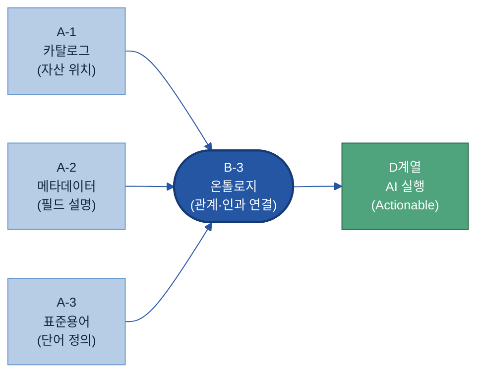

A-3의 표준 용어, A-2의 필드 의미, A-1의 자산 위치가 B-3로 모여 관계 지식이 되고, D계열 AI 에이전트가 그 관계 지식을 소비해 근본 원인을 추적·추론한다.

<a id="sec14"></a>

### 1.4 설계를 관통하는 5가지 원칙

온톨로지 설계에는 처음부터 끝까지 아래 5원칙이 적용된다. 이 원칙들은 모델을 만들 때의 **설계 철학**이자, §6.5에서 다루는 **검증 기준**이기도 하다.

| # | 원칙 | 한 줄 설명 | 가이드 어디서 |
|---|------|-----------|-------------|
| ① | **현실을 담는다** | 현업이 실제로 쓰는 개념·관계를 모델링한다. 이상적 분류가 아니라 실제 공정·결함·조치를 기준으로. | §4 What · §6 How |
| ② | **단일 진실 레이어** | 같은 개념을 여러 곳에서 다르게 정의하지 않는다. A-3 표준 용어와 반드시 일치. | §4.1 · §6.2 |
| ③ | **객체 중심 재사용** | 클래스·관계는 공통 상위 개념에서 뽑고, 계열사별 확장은 서브클래스로. 공통 스키마를 거듭 쓴다. | §4.4 · §4.5 |
| ④ | **관계 중심** | 속성(값)보다 관계(`causes`, `usedMaterial`, `hasCorrectiveAction`)를 우선 모델링한다. AI가 따라가는 것은 관계다. | §4.2 · §4.6 |
| ⑤ | **도메인 먼저, 전사는 나중** | 파일럿 도메인(예: CCL 결함 분석)에서 먼저 검증한 뒤 전사·전 계열사로 확장한다. 처음부터 전사 온톨로지를 만들려다 실패하는 것을 막는다. | §3 When · §10 로드맵 |

---

## 2. 왜 필요한가 (Why)

> 👉 제조 데이터는 시스템마다 흩어지고 용어도 제각각이다. 명시적 관계 계층 없이는 AI가 키워드 검색만 할 수 있을 뿐, 인과 사슬을 따라 "왜 이 결함이 생겼는가"를 추적할 수 없다.

### 2.1 현업 Pain Point — 데이터는 있지만 연결이 없다

제조 현장의 결함 분석 데이터는 여러 시스템에 분산되어 있다. 전자BG CCL(동박적층판, Copper-Clad Laminate) 들뜸(Delamination) 사례를 보자.

| 시스템 | 담고 있는 정보 | 쓰는 용어 |
|--------|--------------|----------|
| ERP | 프리프레그(Prepreg) 원자재 Lot, 입고 시 보관 습도 이력 | "원자재 입고", "보관 조건" |
| MES | 열압착 프레스의 온도·압력·시간 실적 | "프레스 조건", "공정 파라미터" |
| SOP | 열압착 표준 조건(온도·압력·시간 기준값) | "표준 공정 조건", "허용 범위" |
| 검사 기록 | 들뜸 검출 이력, 불량률 | "불량 유형", "검사 결과" |
| C/S Report | 고객 클레임, 조치 이력 | "품질 부적합", "시정 조치" |
| PFMEA | 잠재 고장 모드, 원인, 대책 | "고장 모드", "발생 원인" |

**문제는 연결이 없다는 것이다.** MES의 "프레스 조건 미달"과 PFMEA의 "고장 모드: 들뜸", C/S의 "품질 부적합"은 같은 사건의 세 얼굴이다. 그러나 세 시스템은 서로 용어도, 데이터 구조도, 링크도 다르다.

| Pain | 증상 | 결과 |
|------|------|------|
| 용어 파편화 | "들뜸"·"층간박리"·"품질 부적합"이 같은 결함을 가리키는지 AI가 모른다 | 키워드 검색에서 관련 문서 누락 |
| 인과 단절 | "들뜸"과 "프리프레그 흡습"이 어떤 관계인지 데이터 어디에도 명시되지 않음 | AI가 원인을 추론 못하고 일반론("공정 점검 필요")만 반환 |
| 시스템 사일로 | 원인(ERP 습도)→공정(MES 온도)→결과(검사 들뜸)→조치(C/S 대책)가 다른 DB에 있음 | 담당자가 수동으로 4개 시스템을 열어 연결해야 함 |
| 문서 중복·충돌 | SOP의 기준값과 MES의 실적이 같은 화면에 없어 준수 여부 파악 불가 | 감사·추적에 많은 시간 소요 |

마이크로소프트 리서치 GraphRAG 블로그는 이 구조적 한계를 이렇게 표현한다: **"기본(baseline) RAG는 점들을 잇지 못한다 — 질문에 답하려면 여러 정보 조각을 공유 속성을 통해 가로질러야 할 때 이 한계가 드러난다."** [[Microsoft Research GraphRAG](https://www.microsoft.com/en-us/research/blog/graphrag-unlocking-llm-discovery-on-narrative-private-data/)]

### 2.2 인과 사슬 예시 — 텍스트 덩어리 하나로는 담을 수 없다

전자BG CCL 들뜸 결함의 인과 사슬을 따라가 보자.

**인과 사슬 (예시·가상 시나리오):**

> 프리프레그 원자재 보관 습도 초과(ERP 입고 기록)
> → 프리프레그 흡습(수분 흡수)
> → 열압착 온도 미달(MES 프레스 실적이 SOP 기준값 하회)
> → 수지(Resin) 경화 불완전
> → 층간 들뜸(Delamination) 발생(검사 기록)
> → 고객 클레임·시정 조치(C/S Report)

이 사슬의 핵심 특징: **어떤 텍스트 한 덩어리도 전체 사슬을 담고 있지 않다.** 원인(습도·온도)과 결과(들뜸)는 서로 다른 시스템, 서로 다른 파일에 있다.

벡터 임베딩(vector embedding) 기반 RAG(검색 증강 생성, Retrieval-Augmented Generation)는 **의미적으로 유사한 텍스트 청크(chunk)** 를 가져오는 방식이다. 그런데 "들뜸"과 "프리프레그 흡습"은 같은 문서에 함께 등장하지 않는 한 벡터 공간에서 거리가 멀다. AI는 "들뜸 발생 시 어떻게 조치하나?"에는 일반 대책을 반환하지만, **"이번 Lot에서 들뜸이 생긴 근본 원인이 무엇인가?"** 에는 ERP 습도 이력과 MES 온도 실적을 함께 연결해야 답할 수 있다.

온톨로지에 `causes`·`usedMaterial`·`underCondition`·`hasCorrectiveAction` 같은 명시 관계를 선언해 두면, 단 하나의 관계 탐색(graph traversal) 쿼리로 들뜸 → 수지경화불완전 → 열압착온도미달 → 프리프레그흡습 → 보관습도초과 사슬 전체를 따라갈 수 있다.

### 2.3 온톨로지가 가능케 하는 것

아래 표는 같은 현업 질문에 온톨로지 유무가 어떤 차이를 만드는지 보여 준다.

| 현업 질문 | 온톨로지 없음 | 온톨로지 있음 |
|---------|-------------|-------------|
| "이 결함 유형이 뭔가?" | 전문 검색, 개인 판단 의존 | 계층 탐색: 들뜸 → 층간결함 → CCL결함 |
| "왜 발생했나?" | PFMEA 텍스트 키워드 검색(일반론) | `hasCause` 관계 따라가기 → 수지경화불완전 → 프리프레그흡습 |
| "어느 Lot에서 공통으로 나왔나?" | 시스템 4개 수동 조회·엑셀 취합 | `usedMaterial` / `belongsToLot` 관계 쿼리 한 번 |
| "공정 조건이 기준을 지켰나?" | SOP·MES 두 파일 열어 수동 대조 | 실제값(`hasActualValue`) vs SOP 기준값(`hasNominalValue`) 자동 비교 |
| "조치는 무엇인가?" | C/S Report 검색·베테랑 판단 | `hasCorrectiveAction` 따라가기 → 표준 조치 SOP 자동 추천 |

**동료 심사(peer-reviewed) 연구 근거:**

- 제조 FMEA 결함 원인 식별 연구(arXiv 2510.15428, 2025-10 제출)에서 표준 RAG 대비 온톨로지 기반 지식 그래프는 F1@20 기준 0.267 → 0.523으로 **약 2배** 향상을 보고했다. [[arXiv 2510.15428](https://arxiv.org/abs/2510.15428)] *(프리프린트 — 공식 출판본 확인 후 정식 인용 권장.)*
- 온톨로지 KG + 텍스트 청크 조합과 순수 벡터 RAG의 정답률 비교 연구(arXiv 2511.05991)에서 온톨로지 조합이 90% vs 60%로 **+30%p** 높았다. [[arXiv 2511.05991](https://arxiv.org/html/2511.05991v1)] *단, 평가 세트 n=20의 소규모 연구다. 방향성 참고용으로 보고, 도입 전 도메인 특화 PoC(개념 검증)로 자체 측정을 권한다.*

### 2.4 기대 효과

- **원인 분석 자동화:** AI가 결함 인스턴스에서 원인 사슬을 자동 탐색해 분석 시간을 줄인다. 숙련 기술자 의존도를 낮추고, 야간·주말에도 즉시 조회가 가능해진다.
- **일관된 AI 응답:** 동일한 결함 유형에 대해 시스템·담당자와 무관하게 같은 분류·원인·조치를 제시한다. 개인 경험 편차가 줄어든다.
- **추적 가능성(설명력):** AI가 "어떤 관계를 따라 이 결론에 도달했는가"를 관계 경로로 제시할 수 있어 감사·규제 대응이 쉬워진다.
- **AI 재사용성:** 한번 구축한 온톨로지는 FMEA 분석·예지보전(PdM)·품질 리포팅·신규 라인 SOP 검토 등 여러 AI 유즈케이스에서 공통으로 쓸 수 있어 개별 유즈케이스마다 데이터를 다시 준비하는 비용이 줄어든다.

---

## 3. 언제 온톨로지를 하나 (적용 판단)

> 👉 온톨로지는 "모든 데이터에 하는 것"이 아니라 **지식이 흩어져 있고 인과 관계가 중요한 곳에만 하는 것** — 판단이 먼저다.

### 3.1 적용 판단 기준 — 무엇이 있을 때 온톨로지를 선택하나

> ❓ 핵심 질문 1 — "언제 온톨로지를 만들어야 하나?"에 답하는 절.

온톨로지와 유사한 도구(용어사전·분류체계·관계형 DB)는 목적이 다르다. 아래 결정 스펙트럼으로 먼저 골라라.

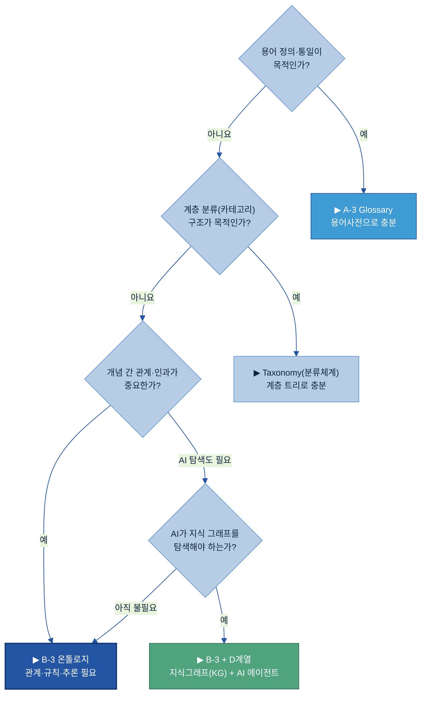

**온톨로지가 필요한 5가지 트리거 (필요조건)** — 다음 중 두 개 이상 해당하면 검토한다. (두산 방법론의 4가지 필요조건 중 "관계 탐색"을 A·B로 나눠 5개로 표현)

| 트리거 | 설명 | 두산 제조 예시 |
|--------|------|---------------|
| **A. 지식이 여러 시스템에 흩어져 연결 필요** | PFMEA·SOP·MES·C/S Report가 같은 개념을 다른 이름으로 써 AI가 연결 못 함 | "불량"(MES)="Failure Mode"(PFMEA)="Quality Nonconformance"(C/S) — 연결 없으면 같은 개념임을 모름 |
| **B. 인과가 중요 — 근본원인·추천·예측 필요** | 단순 검색이 아니라 "왜 발생했나"·"어떻게 고치나"를 AI가 추론 | 들뜸(예시) 발생 시 프리프레그 흡습(원인) → 건조 처치(조치) 경로를 따라가야 함 |
| **C. 여러 유즈케이스가 같은 지식 구조 공유** | RCA 대시보드·예측 모델·진단 에이전트가 같은 개념을 중복 정의하는 낭비 | 품질 RCA / 설비 고장 진단 / 공정 이상 감지가 모두 "결함-원인-조치" 구조 공유 |
| **D. 전문가 암묵지를 데이터로 재현** | 숙련자 머릿속 인과 판단을 이직 후에도 AI가 쓰게 기록 | 시니어 품질 엔지니어 은퇴 전 결함-원인 매핑을 온톨로지로 포착 |
| **E. 추론 경로 설명·감사 필요** | "왜 이 답을 냈나"를 관계 경로로 보여줘야 하는 규제·품질 요건 | ISO 9001 시정조치 보고서에 AI 추천 근거(따라간 관계) 기록 |

**온톨로지가 불필요한 경우 — 더 단순한 대안**

| 상황 | 더 나은 대안 | 이유 |
|------|------------|------|
| 용어 정의·통일만 필요 | [A-3 Glossary](../A-3%20Glossary/A-3%20Glossary.md) | 관계 모델링 불필요, 정의 테이블로 충분 |
| 계층 분류 구조만 필요 | Taxonomy(분류 트리) | is-a 계층만 있고 관계·규칙 없음 |
| 정형 집계·리포팅이 목적 | SQL · BI 도구 | 관계형 모델이 더 빠르고 단순 |
| AI 학습 레이블링이 목적 | [B-2 데이터 해설·주석](../B-2%20데이터%20해설·주석/B-2%20데이터%20해설·주석.md) | 인스턴스 라벨 체계 — 온톨로지 수준 불필요 |

[[SGKG](https://sgkg.org/blog/2026-03-21-ontology-vs-taxonomy-knowledge-organisation/)]: "조직은 분류체계로 충분한데도 온톨로지를 만들어 불필요한 복잡성을 낳는 경우가 많다."

### 3.2 작게 시작해야 하는 이유

처음부터 전사 거대 온톨로지를 만들려 하면 실패한다. 이유는 세 가지다.

1. **관계 폭증**: 개념 수가 늘수록 가능한 관계 쌍은 거의 제곱으로 증가한다. 100개 클래스면 잠재 관계가 수천 쌍 — 검수 불가능.
2. **검수 난항**: 도메인 전문가가 모든 관계 쌍을 검토해야 하는데, 좁은 도메인이 아니면 검토 자체가 불가능.
3. **우선순위 없는 리소스 낭비**: 거대 온톨로지를 절반 채워도 AI에 쓰이지 않으면 유지비만 소진.

**권장 시작 범위**: 한 공장 또는 한 제품군의 **결함-원인-조치** 영역부터.

- 초기 코어: 개념 **50~80개**, 관계 **10~15가지**면 PoC 시연·유용성 검증에 충분(숫자는 예시 기준, 도메인 복잡도에 따라 조정).
- 클래스 설계가 안정화된 뒤 인스턴스(A-Box) 자동 적재로 확장한다.
- 계열사별 도메인 먼저 → 공통 상위개념 추출 → 전사 코어 정제 순서가 현실적이다(도메인 먼저, 전사는 나중 — §1.4).

### 3.3 우선 영역 고르기

모든 제조 도메인이 온톨로지 투자 가치가 같지 않다. **AI 활용 가치**(지식그래프가 AI 정확도를 얼마나 높이나)와 **지식 복잡도**(관계·인과가 얼마나 얽혀 있나) 두 축으로 판단한다.

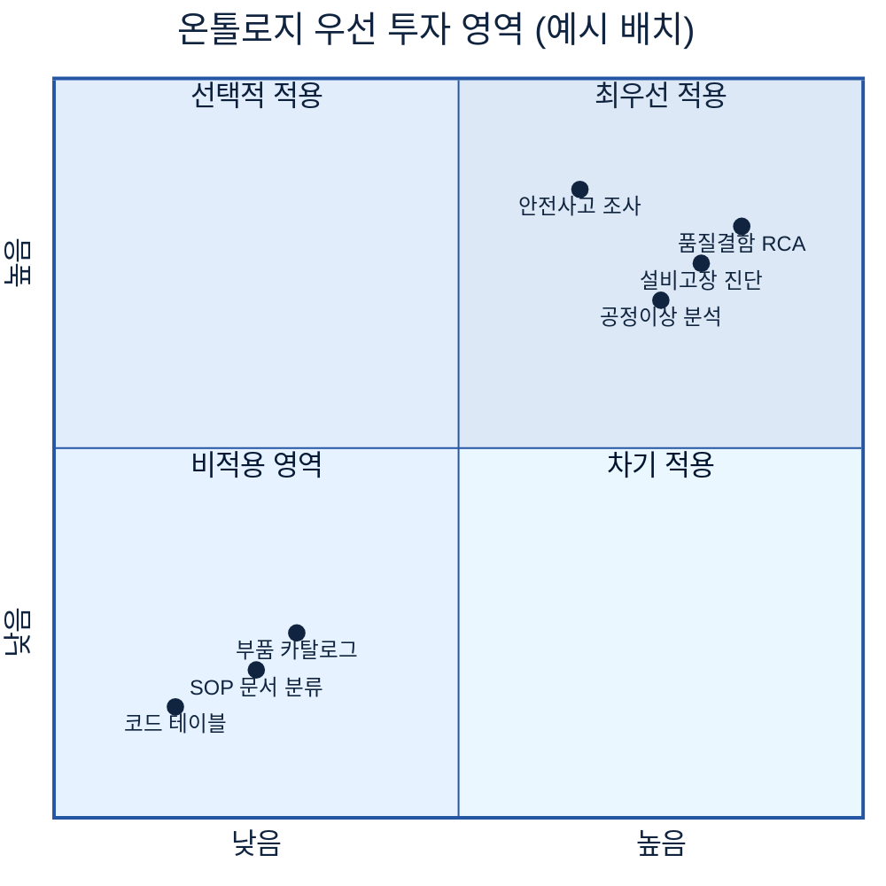

**두산 계열사 우선 후보 4개**

- **품질 결함 근본원인 분석(RCA)**: 결함-원인-조치 3층 구조가 명확하고 AI 추론 경로가 바로 가치를 낸다(CCL 들뜸 등 — 예시).
- **설비 고장 진단**: 설비 부품 계층(has-part) + 마모 이벤트 + 공정 영향 관계가 얽혀 관계형 탐색이 필수.
- **공정 이상 탐지**: 공정-검사항목-파라미터 측정값 연결 → 어느 공정 변수가 어느 불량에 연결되는지 추론.
- **안전 사고 조사**: 사고 이벤트(L2) → 원인 판단(L3) → 설비·공정(L1) 연결이 규제 감사 요건과 맞물림.

---

## 4. 무엇을 갖추나 (What)

> 👉 온톨로지는 **6요소(재료)**로 만든 클래스를 **3계층(성격)**으로 배치하고, **코어/유즈케이스 2층**(재사용 축)과 **공통/계열사 2층**(조직 축)으로 관리하는 4겹 구조다.

<a id="kq2"></a>

> ❓ 핵심 질문 2 — "어떤 개념·관계를 모델링하나?"에 §4.1(6요소)과 §4.6(제조 핵심 엔티티·관계)이 답한다.

<a id="sec41"></a>

### 4.1 핵심 6요소와 T-Box / A-Box

온톨로지를 이루는 빌딩 블록은 6가지다. 이 6요소가 모두 있어야 "지식 구조"이지, 일부만 있으면 용어사전·분류표에 머문다.

| # | 요소 | 영문 | 한 줄 정의 | 두산 제조 예시 (예시값) |
|---|------|------|-----------|----------------------|
| ① | **클래스** | Class | 같은 성격의 개체를 묶는 이름 붙인 범주 | 결함, 설비, 공정, 제품 |
| ② | **인스턴스** | Instance | 클래스에 속하는 구체적 개체 | "들뜸(예시)" — 결함 클래스의 인스턴스 |
| ③ | **속성** | Property | 클래스·인스턴스의 값(데이터 필드) | 심각도=High, 결함코드(예시) |
| ④ | **관계** | Relationship | 두 클래스를 잇는 방향 있는 연결 | causes(원인→결함), occurs-in(결함→공정) |
| ⑤ | **계층** | Hierarchy | is-a(하위-상위) 수직 트리 | 스크래치(예시) → 외관결함 → 결함 |
| ⑥ | **규칙/공리** | Axiom | 관계로부터 새 사실을 추론하는 형식 규칙 | "스크래치 ⊏ 외관결함 ⊏ 결함" 자동 분류 |

**표현 단위 = 트리플(Triple)**: 온톨로지의 가장 작은 정보 단위는 `주어 — 관계 — 목적어` 세 쌍이다. 예: `들뜸(예시) — occurs-in — 열압착 공정(예시)`.

**T-Box vs. A-Box — 두 층의 역할**

- **T-Box (Terminological Box, 개념 스키마)**: 클래스·관계·계층·공리를 정의하는 *설계도* 층. 데이터 엔지니어가 설계. "DB의 DDL"에 해당.
- **A-Box (Assertional Box, 인스턴스 데이터)**: 실제 데이터 레코드(MES 이벤트·C/S 보고서·검사 결과)를 인스턴스로 적재하는 *데이터* 층. "DB의 행"에 해당.
- **추론(Inference)**: T-Box의 공리를 A-Box 인스턴스에 적용해 새 사실을 자동 도출한다. 추론 작동 시점·방식은 §7.4 아키텍처에서 다룬다.

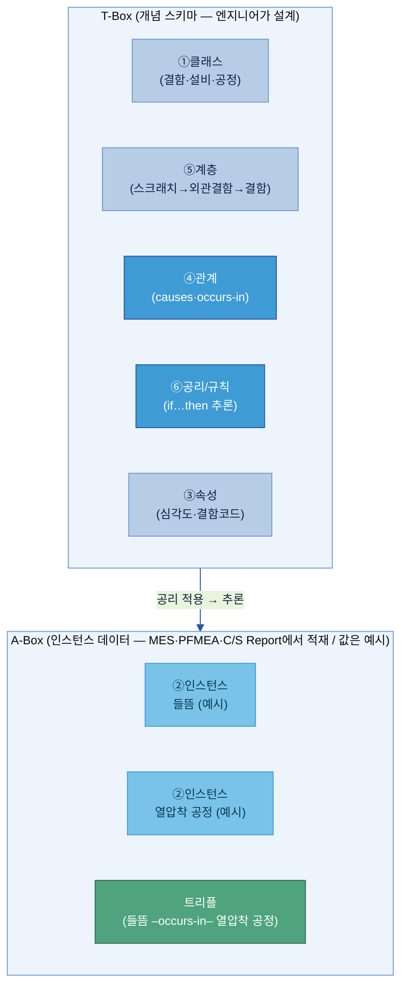

**추론 작동 예**: T-Box에 `스크래치 ⊏ 외관결함 ⊏ 결함`이 계층으로 정의되면, A-Box에서 "스크래치" 인스턴스를 질의할 때 추론 엔진이 자동으로 "외관결함·결함에도 해당한다"를 도출한다 — 별도 라벨 없이. 기술 표준(RDF·OWL·SPARQL)의 한 줄 풀이는 별첨 E.

<a id="sec42"></a>

### 4.2 관계 모델링 — 트리플의 힘

온톨로지에서 지식은 **트리플(Triple)** 3짝으로 표현된다: `주어(Subject) — 관계(Predicate) — 목적어(Object)`.

**왜 트리플인가**: 관계형 DB는 테이블로 저장하고 조인으로 관계를 표현하므로 새 관계를 추가하려면 테이블 구조를 바꿔야 한다. 트리플은 세 쌍이 하나의 독립 사실이라 **스키마 변경 없이 새 관계를 추가**할 수 있다. 인과 구조가 계속 발견·추가되는 제조 지식에 적합하다.

**제조 도메인 트리플 예시 (모두 예시값)**

```
들뜸(예시)         — causes(원인이 된다)     — 프리프레그 흡습(예시)
들뜸(예시)         — occurs-in(발생 공정)    — 열압착 공정(예시)
들뜸(예시)         — detected-by(검출 수단)  — 외관 검사 항목(예시)
들뜸(예시)         — remediated-by(조치)     — 프리프레그 건조(예시)
베어링 마모(예시)   — causes(원인이 된다)     — 치수 불량(예시)
열압착 프레스(예시) — has-part(부품 포함)     — 히팅 플레이트(예시)
```

물리 저장 형식(RDF 그래프 vs. 레이블 속성 그래프 LPG)과 질의 언어(SPARQL vs. Cypher)는 §7에서 기준을 갖고 고른다.

<a id="sec43"></a>

### 4.3 엔티티를 성격으로 배치하는 3계층 구조

6요소로 클래스를 만들었으면, 그 클래스들을 **성격에 따라 3층으로 배치**한다. 이 3계층은 "별도 모델"이 아니라 6요소와 직교(orthogonal)하는 배치 규율이다 — 클래스(요소①)를 어느 층에 놓느냐가 달라질 뿐, 6요소 자체는 동일하게 적용된다.

| 계층 | 성격 | 시간속성 | 제조 예시 | 핵심 7엔티티 대응 |
|------|------|---------|---------|----------------|
| **L1 마스터 객체** (Continuant 지속자) | 시간과 무관하게 존재하는 지속적 개체. 이벤트가 아님 | **없음** (시간 독립) | 설비·제품·공정·자재·공급사 | 제품·공정·설비·검사항목 |
| **L2 사건** (Occurrent 발생자) | 특정 시점·구간에 발생한 사건·이벤트. 발생 시각 없으면 L2가 못 됨 | **필수** (발생 시각·구간) | 결함 검출·공정 집행·검사 수행 | 결함(검출 사건) |
| **L3 해석** (Interpretation 판단) | 사람이 L2 사건을 해석해 내린 판단. 나중에 바뀔 수 있는 가변 지식 | 판단 시각(선택) | 근본원인 판단·시정조치 결정 | 원인·조치 |

**용어 풀이**
- **Continuant(지속자)**: 시간 속에서 동일성을 유지하며 지속하는 개체(상위 온톨로지 BFO의 용어) — 설비는 어제도 오늘도 "그 설비"다.
- **Occurrent(발생자)**: 시작-끝이 있는 사건·과정. 같은 이름의 사건이 두 번 일어나면 두 개의 다른 인스턴스다.
- **L3 해석 레이어**: BFO 자체에 "해석"이라는 이름의 상위 범주는 없다. W3C PROV-O(사실 vs 추론 분리)와 IAO Information Content Entity에 근거한 **두산 도메인 확장**임을 명시한다.

🏭 **왜 L2와 L3를 반드시 나누나 — CCL 들뜸 예시 (예시값)**

> "들뜸 검출(L2 사건)"은 검사 장비가 기록한 불변의 사실이다. "프리프레그 흡습이 원인(L3 해석)"은 품질 엔지니어의 판단이며 나중에 "열압착 온도 미달이 원인"으로 바뀔 수 있다. 두 층을 분리하면 L3 판단만 재작성해도 L2 검출 사실은 그대로 보존된다. 섞어 두면 판단 수정 시 원본 검출 기록이 덮어씌워질 위험이 생긴다.

**참조 방향 규칙 (역방향 금지)**
```
L3 해석 (원인 판단·시정조치)  ──참조──▶  L2 사건 (결함 검출·공정 집행)  ──참조──▶  L1 마스터 객체 (설비·제품·공정·자재)   ✅
L2 사건  ──참조──▶  L3 해석                                                                                          ❌ 금지
```
사건(불변)이 판단(가변)을 역참조하면, 판단이 바뀔 때 사건 레코드까지 오염된다.

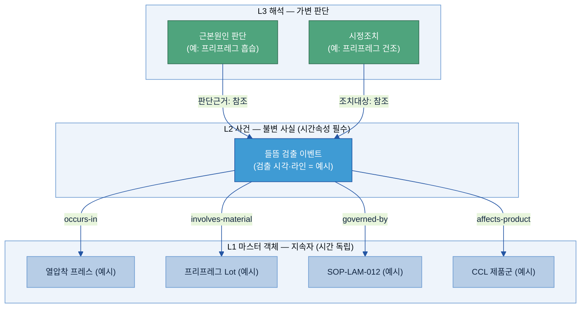

> 🔸 위 도식의 노드명·시각·번호는 구조를 보여주기 위한 **예시**다(실데이터 아님).

<a id="sec44"></a>

### 4.4 코어 ↔ 유즈케이스 2층 분리 (재사용 축)

같은 "결함-원인-조치" 지식 구조를 RCA 대시보드·설비 진단 에이전트·예측 뷰가 각자 복사해 정의하면 일관성이 깨진다. **코어/유즈케이스 2층**이 이를 해결한다.

| 구분 | 담는 것 | 누가 설계 | 변경 빈도 |
|------|---------|---------|---------|
| **코어 온톨로지** | 현실(L1 마스터·L2 사건·L3 해석) — 도메인 진실 | 데이터 아키텍트 + 도메인 전문가 (9단계 1~7) | 낮음 (안정 후 드물게) |
| **유즈케이스 온톨로지** | 애플리케이션 전용 뷰 — 코어를 복사 없이 참조 | 유즈케이스 담당 팀 (9단계 8) | 높음 (요건 변화마다) |

**핵심 규칙 3가지**
1. 코어는 유즈케이스를 모른다 — 코어에 "RCA 전용 클래스"가 들어가선 안 된다.
2. 유즈케이스는 코어 개념을 복사하지 않고 `refersTo` / `IS_TYPE` 로 참조만 한다. `layer: usecase` 태그로 구분한다.
3. 요건이 바뀌면 유즈케이스 레이어만 교체한다 — 코어는 그대로.

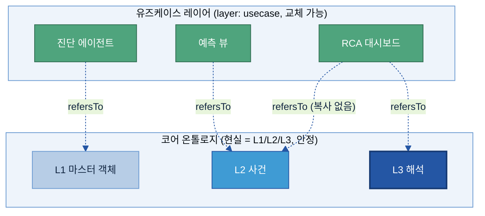

**산출물**: 코어 기획서(별첨 B 양식) / 유즈케이스별 기획서(별첨 C 양식). 9단계로 **코어(1~7) → 유즈케이스(8)** 순서로 설계한다(§6). 목적 유형별 설계 차이는 별첨 A 각론에서 다룬다.

<a id="sec45"></a>

### 4.5 전사 공통 ↔ 계열사 확장 (조직 축)

코어/유즈케이스 2층이 **재사용 축**이라면, 공통/계열사 2층은 **조직 축**이다. 두 축은 직교(독립)한다 — 공통 온톨로지에도, 계열사 온톨로지에도 각각 코어/유즈케이스 2층이 있다.

<a id="kq3"></a>

> ❓ 핵심 질문 3 — "전사 공통 vs 계열사 특화 지식을 어떻게 나누나?"에 이 절과 §6.2가 답한다.

| 구분 | 무엇을 담나 | 거버넌스 |
|------|-----------|---------|
| **공통 상위개념** | 두 개 이상 계열사가 공유하는 상위 클래스·공통 관계 | 지주 데이터 보드 승인 |
| **계열사 하위개념** | 계열사 고유 개념 — 공통 클래스의 하위클래스(subclass) | 계열사 데이터 스튜어드 관리 |
| **경합 개념** | 두 계열사가 비슷하지만 다른 개념 — 공통에 상위 추상, 계열사에 각자 하위 | 보드 + 스튜어드 협의 |

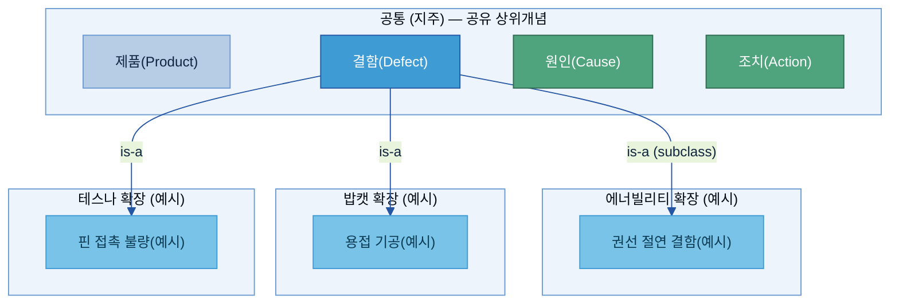

> 🔸 계열사 박스 안 세부 개념(권선 절연 결함·용접 기공·핀 접촉 불량 등)은 배치를 보여주기 위한 **예시**다.

계열사는 공통 클래스를 **복사하지 않고 is-a(하위클래스 선언)로 상속**해 공통 속성·관계를 그대로 물려받는다. 계열사 네임스페이스 구현 패턴은 별첨 I.

<a id="sec46"></a>

### 4.6 제조 핵심 엔티티·관계 + 항목 사전

두산 제조 도메인의 결함-원인-조치 그래프를 구성하는 **핵심 엔티티 7개**와 **핵심 관계 7개**다.

| 엔티티(한글) | 영문 | 예시 인스턴스 (예시값) | 3계층 |
|--------|--------|-------------------|------|
| 제품 | Product | CCL 제품군 | L1 |
| 공정 | Process | 열압착 공정 | L1 |
| 설비 | Equipment | 열압착 프레스 | L1 |
| 검사항목 | InspectionItem | 외관 검사 | L1 |
| 결함 | Defect | 들뜸 | L2 (검출 사건) |
| 원인 | Cause | 프리프레그 흡습 | L3 (판단) |
| 조치 | Action | 프리프레그 건조 | L3 (판단) |

| 관계명 | 영문 | From → To | 예시 트리플 (예시값) |
|--------|--------|---------|-------------------|
| 원인이 된다 | causes | 원인(L3) → 결함(L2) | 프리프레그 흡습 → causes → 들뜸 |
| 검출된다 | detected-by | 결함(L2) → 검사항목(L1) | 들뜸 → detected-by → 외관 검사 |
| 발생 공정 | occurs-in | 결함(L2) → 공정(L1) | 들뜸 → occurs-in → 열압착 공정 |
| 조치로 해결 | remediated-by | 결함(L2) → 조치(L3) | 들뜸 → remediated-by → 프리프레그 건조 |
| 부품 포함 | has-part | 설비(L1) → 부품(L1) | 열압착 프레스 → has-part → 히팅 플레이트 |
| 검사 대상 | measured-by | 공정(L1) → 검사항목(L1) | 열압착 공정 → measured-by → 두께 측정 |
| 영향 제품 | affects | 원인(L3) → 제품(L1) | 프리프레그 흡습 → affects → CCL 제품군 |

이 7관계를 따라가면 "어떤 원인이 어떤 공정에서 어떤 결함을 만들고, 어떤 설비·검사항목이 관여하며, 어떤 조치로 해결하는가"를 한 번의 그래프 탐색으로 답한다.

**㉠ 항목 사전 — 코어 기획서를 채우는 칸:** 빈 양식은 별첨 B, 실제 CCL 사례는 별첨 A 각론에서 확인한다.

| 항목 | 쉬운 의미 | 예시값 (모두 예시) | 필수/선택 | 작성 주체 |
|------|---------|-----------------|---------|---------|
| 노드명(한글) | 개념의 한국어 이름 | 들뜸 | 필수 | 도메인 전문가 |
| 노드명(영문) | 영문 클래스명(PascalCase) | Delamination | 필수 | 데이터팀 |
| 한 줄 정의 | 무엇인지 한 문장 | 적층 후 레이어 간 접착 실패 사건 | 필수 | 도메인 전문가 |
| 3계층 배치 | L1·L2·L3 중 어디 | L2 (사건) | 필수 | 데이터팀 |
| 주요 속성 | 가지는 값 필드 | 심각도·검출 시각·라인 | 필수 | 도메인 전문가 |
| 데이터 소스 | 인스턴스가 오는 시스템 | MES 검사 결과·C/S Report | 필수 | 데이터팀 |
| 범용 여부 | 공통(지주) vs 계열사 전용 | 공통 | 선택 | 데이터 아키텍트 |
| As-Is 근거 | 실제로 쓰이는 문서·시스템 | PFMEA 결함 목록 | 필수 | 도메인 전문가 |

> As-Is 근거 없는 노드는 코어 기획서에 올리지 않는다(§6.0). 명명·ID 구현 규칙은 §7.9.

<a id="sec47"></a>

### 4.7 개념-데이터-문서 연결

온톨로지 클래스(설계도)는 실제 데이터·문서와 반드시 연결되어야 한다. 연결 없는 개념은 AI가 읽을 A-Box 인스턴스를 채울 수 없고, A-Box 없는 T-Box는 빈 지식 구조다.

<a id="kq4"></a>

> ❓ 핵심 질문 4 — "어떤 데이터·문서와 연결하나?"에 이 절과 §6.2가 답한다.

**ETL 매핑표** — 이 표가 있어야 데이터 파이프라인이 온톨로지 A-Box를 자동 적재한다.

| 온톨로지 클래스 | A-3 용어 | A-2 메타데이터 필드 | A-1 카탈로그 자산 | 원천 문서 | 예시 인스턴스 수 (예시) |
|---------------|--------------|-------------------|----------------|---------|----------------------|
| Defect (결함) | 결함 | defect_code, severity | CCL 검사 결과 테이블 | C/S Report·MES 검사 로그 | ~2,000건/년 |
| Process (공정) | 열압착 공정 | process_id | 공정 마스터 | SOP-LAM-012 | ~30개 |
| Equipment (설비) | 열압착 프레스 | equipment_id, line_no | 설비 마스터 | 설비 점검 일지 | ~15대 |
| Cause (원인) | 프리프레그 흡습 | cause_code | 원인 코드 테이블 | PFMEA 원인 분석 | ~200개 |
| Action (조치) | 프리프레그 건조 | action_code | 조치 코드 테이블 | C/S Report 처치 이력 | ~150개 |
| InspectionItem | 외관 검사 | inspection_id, spec_value | 검사 항목 마스터 | 검사 규격서 | ~80개 |
| Product (제품) | CCL 제품군 | product_code, grade | 제품 마스터 | BOM·제품 사양서 | ~120개 |

> 🔸 모든 인스턴스 수치는 **예시(가상)**이며 실제 규모와 다를 수 있다. 도입 시 ETL 설계 단계에서 현업과 확인한다.

**목적**: 이 매핑표를 기준으로 ETL 파이프라인을 설계하면 MES·ERP·C/S Report 등 원천에서 인스턴스가 A-Box에 자동 적재된다. 수동 입력 의존도를 최소화하는 것이 핵심이다.

> §4·§6·별첨의 두산밥캣 용접(전극 캡 마모→박리) 예시는 **또 다른 계열사 적용 사례**다(같은 방법론, 다른 공정).

---

## 5. 예시 시나리오

> 👉 "이 CCL 들뜸 클레임의 원인이 뭐고, 고객에게 보낼 C/S Report 초안을 어떻게 만드나?" — 온톨로지가 있을 때 AI가 **C/S Report(시정조치 보고서) 초안**을 어떻게 채워주는지 전자BG CCL 사례로 본다. *(출처: 내부 자료 — Kearney 두산지주 AI-Ready Data 체계 CSO 중간보고 모듈2, 2026-06-16)*

<a id="kq5"></a>

> ❓ **핵심 질문 5 — "AI 활용에 어떻게 적용하나?"** 에 이 섹션이 답한다. 요점: 에이전트가 "검색"이 아니라 **온톨로지 관계를 따라 탐색**하기 때문에 Lot 공통성·SOP 위반·인과 사슬을 한 번의 쿼리로 엮어낼 수 있다.

**상황:** 전자BG CCL(동박적층판, Copper Clad Laminate) 라인. 고객사에서 PCB 가공 중 **들뜸(Delamination, 층간 박리)** 클레임 3건이 접수됐다. 품질 담당자는 원인을 규명해 고객에게 보낼 **C/S Report 초안**을 작성해야 한다. 온톨로지가 없으면 ERP·MES·SOP·과거 보고서를 따로따로 뒤져 며칠이 걸린다. 담당자가 AI 에이전트에 *"이 클레임들의 공통 원인을 찾고 C/S Report 초안을 만들어줘"*라고 요청한다.

> 🔸 **가상 예시 안내:** 이하의 구체 값(Lot ID·온도·SOP 번호·프레스 번호·클레임 번호·인스턴스 수·일시)은 **이해를 돕기 위한 가상 예시**이며 실제 데이터가 아니다. 실제 값은 PoC·프로젝트에서 확정한다.

### 5.1 적용 전/후 대비

**Before (온톨로지 없음)** — 담당자가 시스템을 하나씩 수작업 조회:

- ERP에서 클레임 제품의 Lot을 일일이 찾아 공통 원자재·생산일을 수기 대조
- MES에서 해당 Lot의 프레스 로그를 찾아 SOP 기준과 눈으로 비교
- 과거 유사 클레임을 C/S Report 폴더에서 키워드 검색(숙련자만 어디 있는지 앎)
- 평균 작성 소요: **수일**, 담당자 숙련도·기억에 좌우

**After (온톨로지 + 지식그래프)** — 같은 요청에 에이전트가 온톨로지를 따라 5단계로 초안을 채운다.

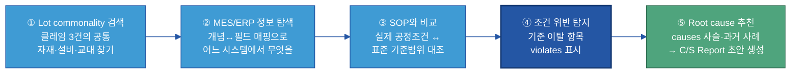

이 5단계 탐색이 가능한 이유는 T-Box(코어 온톨로지)에 다음 네 가지가 **데이터로 선언**되어 있기 때문이다(온톨로지 준비의 산출물):

1. `들뜸 ⊏ 층간결함 ⊏ CCL결함` — 계층(Hierarchy)으로 결함 유형을 분류
2. `제품 –belongsToLot→ Lot –usedMaterial→ 원자재Lot`, `Lot –producedOn→ 설비` — Lot commonality를 잇는 관계 다리
3. `Lot –underCondition→ 공정조건 –governedBy→ SOP –specifies→ 기준범위` — 실제 공정값과 SOP 기준을 연결하는 관계 다리
4. `프리프레그흡습 –causes→ 수지미경화`, `열압착온도미달 –causes→ 수지미경화`, `수지미경화 –causes→ 들뜸` — 인과 사슬(다중 원인 구조)

**openCypher 쿼리 예시** — 공통 Lot과 SOP 위반을 한 번에 탐색(LPG 그래프 DB):

```cypher
// 클레임 3건의 공통 자재 Lot · 공통 설비 · SOP 기준 위반 항목을 한 번에 탐색
// (노드명·값은 가상 예시)
MATCH (cl:Claim)-[:ABOUT]->(:Product)-[:BELONGS_TO]->(lot:Lot)
MATCH (lot)-[:USED_MATERIAL]->(m:MaterialLot),
      (lot)-[:PRODUCED_ON]->(eq:Equipment),
      (lot)-[:UNDER_CONDITION]->(cond:ProcessCondition)
              -[:GOVERNED_BY]->(sop:SOP)
WHERE cond.value < sop.minSpec OR cond.value > sop.maxSpec
RETURN m.id          AS 공통자재Lot,
       eq.id          AS 생산설비,
       cond.name       AS 위반항목,
       cond.value      AS 실제값,
       sop.spec        AS SOP기준
ORDER BY 공통자재Lot
```

**검색 결과(가상 예시):**
- 공통 자재 Lot: 프리프레그 원자재 `PPG-2403-17`(클레임 3건 전부 공통 — 가상값)
- 공통 설비: 열압착 프레스 `#2`(가상)
- 공통 교대: 야간조
- SOP 위반 항목: 열압착 온도 `174°C` < 기준 `185±5°C`(SOP-LAM-012 — 가상), 프리프레그 보관 습도 초과

> **에이전트가 채운 C/S Report 초안(발췌) — 모두 가상 예시, 사람 검수 후 발송:**
>
> | 항목 | 내용 |
> |---|---|
> | **현상** | CCL 들뜸(Delamination) 클레임 3건 — 공통 원자재 Lot `PPG-2403-17` · 프레스 `#2`(가상값) |
> | **추정 원인** | ① 프리프레그 보관 습도 초과(흡습) ② 열압착 온도 SOP 미달(`174°C` < `185±5°C`, 가상) → 수지 미경화 → 층간 접착력 저하 → 들뜸 |
> | **근거** | MES 프레스`#2` 온도 로그 · ERP 원자재 보관 습도 이력 · SOP-LAM-012 §2.1 기준범위 · 과거 유사 클레임 C/S `#2312`(가상) |
> | **권장 조치** | ① 프리프레그 건조(베이킹) 재적용 ② 프레스`#2` 온도 센서 교정 ③ 동일 Lot 기생산분 출하 전 재검사 |
>
> *(위 Lot ID·수치·SOP 번호·C/S 번호는 가상 예시 — 실제 PoC에서 실데이터로 대체. 초안은 반드시 사람 검수 후 고객에게 발송한다.)*

### 5.2 온톨로지가 구체적으로 가능케 한 것

다음 표는 "에이전트가 무엇을 할 수 있었는가"를 **온톨로지가 선언한 것(준비된 데이터)** 관점에서 정리한다. "AI가 알아서 함"이 아니라, 이 데이터 구조가 준비됐기 때문에 가능한 것임을 보여준다.

| 에이전트 단계 | 온톨로지가 선언한 것 (준비된 데이터) | AI가 할 수 있게 된 것 |
|---|---|---|
| ① Lot commonality | `제품 –belongsToLot→ Lot –usedMaterial→ 원자재Lot` `Lot –producedOn→ 설비` | 여러 클레임의 공통 자재·설비·교대를 그래프 탐색 한 번으로 — SQL 조인 없이 |
| ② MES/ERP 탐색 | 개념↔시스템 필드 매핑(`공정조건 –measuredIn→ MES`, `원자재Lot –sourcedFrom→ ERP`) | 어느 시스템 어느 필드를 가져올지 온톨로지가 안내 — 에이전트가 시스템 구조를 몰라도 됨 |
| ③ SOP 비교 | `공정 –governedBy→ SOP –specifies→ 기준범위` | 실제 공정값과 SOP 표준범위를 자동 대조 — 담당자가 표를 눈으로 비교할 필요 없음 |
| ④ 위반 탐지 | `공정조건 –violates→ SOP기준`(SHACL 규칙) | 기준 이탈 항목을 그래프 쿼리로 자동 식별 |
| ⑤ Root cause + 조치 | `SOP위반 –causes→ 수지미경화 –causes→ 들뜸` `들뜸 –hasCorrectiveAction→ 조치` | 원인 사슬·권장 조치를 T-Box 경로에서 역추적해 근거와 함께 추천 |

**PoC 목표 예시(자체 설정):** C/S Report 초안 작성 시간 수일 → 수시간 단축(예시 — 현 담당자 기준선 대비 실제 PoC에서 측정·확정, "as-is에서 채움").

> 이 탐색에서 에이전트가 한 일은 **온톨로지 관계를 따라가는 쿼리**였다. LLM이 "알아서 추론"한 것이 아니라, T-Box에 선언된 `causes`·`governedBy`·`belongsToLot` 관계가 탐색 경로를 제공했다 — 온톨로지 준비가 핵심이다.

### 5.3 완성 예시 — CCL 결함-조건-원인-조치 핵심 트리플

전자BG CCL C/S Report에서 추출한 핵심 트리플(ASCII — 노드명은 가상 예시):

```
(들뜸)              ─[is-a]────────────▶  (층간결함)
(층간결함)           ─[is-a]────────────▶  (CCL결함)
(들뜸)              ─[occurs-in]───────▶  (열압착공정)
(열압착공정)         ─[governed-by]─────▶  (SOP-LAM-012)
(프리프레그흡습)      ─[causes]──────────▶  (수지미경화)
(열압착온도미달)      ─[causes]──────────▶  (수지미경화)
(수지미경화)         ─[causes]──────────▶  (들뜸)
(프리프레그건조)      ─[remediated-by]───▶  (프리프레그흡습)
(프레스온도보정)      ─[remediated-by]───▶  (열압착온도미달)
```

이 트리플들이 그래프 DB에 누적되면 AI가 "들뜸 발생 → 흡습·열압착 온도미달이 원인 → 건조·온도 보정으로 조치"를 추론하고, Lot commonality로 **어느 생산분이 영향받았는지**까지 좁혀 C/S Report 초안에 채운다. *트리플을 채워서 내는 양식은 별첨 B 코어 기획서, 실제 CCL 노드를 어느 레벨로 잡았는지 사례는 별첨 A 각론 §4 평문 참고.*

**또 다른 계열사 사례 — 두산밥캣 용접 박리:** 밥캣 굴착기 아암 조립 용접 라인에서 박리(Desoldering) 발생. 인과: 전극 캡 마모(`ElectrodeCapWear`) → 접촉 저항 증가 → 너깃 과열 → 박리. PFMEA 추출 예시는 §6.2.1, 관계 탐색 쿼리 예시는 [§7 아키텍처·기술 선택](#7-아키텍처기술-선택)에서 볼 수 있다. CCL과 같은 방법론·다른 공정 도메인에 적용한 사례다.

> 이 트리플 구조를 만든 설계 절차(9단계)는 [§6](#6-어떻게-설계구축하나-how), 아키텍처는 [§7](#7-아키텍처기술-선택)에서 다룬다.

---

## 6. 어떻게 설계·구축하나 (How)

> 👉 온톨로지 설계는 **9단계 단일 정본**을 따른다. 흐름은 **코어 온톨로지(1~7단계) → 유즈케이스 레이어(8단계) → 운영(9단계)**이다. 핵심은 "산출물 양식이 아니라 현실에서 개념을 길어 올리고, 작게 시작해 검증 후 확장"이다. 모든 노드·관계의 근거는 **As-Is 분석서**에서 나온다.

<a id="sec60"></a>

### 6.0 설계 입력: As-Is 분석서

9단계에 들어가기 전, 설계의 출발점이 되는 **As-Is 분석서**를 먼저 확보한다. As-Is 분석서는 대상 도메인의 **현실**을 정리한 문서로, 코어·유즈케이스 기획서의 모든 노드·관계가 여기서 근거를 얻는다(2단계 밸류체인 분석의 선행 입력).

| As-Is 분석서가 담는 것 | 온톨로지 설계에 쓰이는 곳 |
|---|---|
| E2E 업무 흐름 (예: VOC 접수 ~ C/S Report 발송까지 전체 단계) | 1단계 도메인 목적·적용 범위 확정 |
| 현실에 독립적으로 존재하는 물리·조직·기준 객체 | 3단계 L1 마스터 객체 후보 식별 |
| 시간과 함께 일어나는 사건·이벤트 (검출·공정 집행·파라미터 이탈 등) | 4단계 L2 사건 후보 식별 |
| 현업의 판단·귀책·대책 결정 기록 | 6단계 L3 해석 레이어 설계 |
| 데이터 소스 확인 결과 (MES·ERP·WMS·QMS 등, 컬럼 단위) | 각 노드의 데이터 소스 매핑([§4.7 매핑표](#sec47)) |
| 데이터 미확인·수기 관리 항목 | 데이터 소스 "미확인" 표시 → 미결 사항으로 관리 |
| 팀 간 용어 불일치·동의어 (MES "불량코드" ↔ PFMEA "고장모드") | 노드 정의 및 alias 속성([A-3 Glossary](../A-3%20Glossary/A-3%20Glossary.md) 연계) |

> **원칙: As-Is 근거 없는 노드·관계는 만들지 않는다.** 데이터 소스가 확인되지 않은 노드는 "미확인"으로 표시하고 확정 계획을 미결 사항에 적는다(별첨 B §9 미결). 이것이 함정 1(산출물·양식을 노드화)과 함정 4(데이터 없는 연결)를 원천에서 막는다. As-Is에서 객체·사건·암묵지를 현장에서 길어 올리는 방법은 별첨 D Discovery Workshop 운영 가이드 평문 참고.

### 6.1 9단계 한눈에


| 단계 | 무엇을 | 산출물·연결 |
|---|---|---|
| **1 도메인 목적 정의** | 측정 가능한 단일 운영지표 수준의 목적 **한 문장** | 코어 기획서 §1(별첨 B) |
| **2 밸류체인/E2E 분석** | E2E 흐름에서 객체·사건 후보 도출(아직 노드화 미룸). 현장 인터뷰·워크샵으로 현실 수집 | As-Is 분석서(§6.0) · 별첨 D 워크샵 |
| **3 현실 객체 식별** | "독립 존재? + 사실 고정?" 두 질문으로 L1 마스터 객체 확정 | 코어 기획서 §2 / §4.3 |
| **4 현실 사건 식별** | **시간 속성 필수**. 공정·검사 집행 이벤트 → L2 사건 | 코어 기획서 §2 / §4.3 |
| **5 핵심 질문(CQ) 도출** | 목적 관점 질문 3~5개로 3·4단계 **역검증** + 암묵지를 온톨로지 관계 vs 쿼리·앱 로직으로 분류 | 코어 기획서 §6 |
| **6 해석 레이어 설계** | 판단·시정조치 등 L3를 L2 **위에** 설계. 사실(L2)과 판단(L3) 섞지 않음 | 코어 기획서 §2 / §4.3 |
| **7 설계 검증** | SHACL·추론기·OOPS! + 현업 확인 병행 → **코어 완성** | §6.5 / 코어 기획서 §8 |
| **8 유즈케이스 레이어 설계** | 코어 위에 얹고 **코어 불변**. 교체 시 이 레이어만 | 유즈케이스 기획서(별첨 C) |
| **9 운영·유지** | 지식 갱신·시스템 대응·변경 관리. L1·L2 수정 시 절차화 | §8.1 변경 관리 |

> 이 9단계 모델은 METHONTOLOGY의 라이프사이클 규율[[LibreTexts](https://eng.libretexts.org/Bookshelves/Computer_Science/Programming_and_Computation_Fundamentals/An_Introduction_to_Ontology_Engineering_(Keet)/06:_Methods_and_Methodologies/6.01:_Methodologies_for_Ontology_Development)], NeOn의 재사용 전략[[NeOn](https://oeg.fi.upm.es/index.php/en/completedprojects/8-neon/index.html)], Stanford Ontology Development 101[[Noy & McGuinness](https://protege.stanford.edu/publications/ontology_development/ontology101.pdf)]과 정합한다.

---

<a id="sec62"></a>

### 6.2 코어 온톨로지 설계 (1~7단계) — 산출물: 「코어 설계 기획서」

> 👉 1~7단계의 산출물은 별첨 B 「코어 온톨로지 설계 기획서」다. 빈 양식 채우기가 아니라 **구축 착수 가능한 실행안**이어야 한다 — 도메인 목적·노드 후보(As-Is 근거 연결)·계층·관계·공리·핵심 질문 경로 검증·기술 검토·설계 검증이 모두 채워져야 완료다.

**1단계 — 도메인 목적 정의:**

**측정 가능한 단일 운영지표 수준의 목적을 한 문장으로** 고정한다. "AI로 품질 개선"처럼 측정 불가한 목적은 온톨로지 범위를 발산시킨다. 좋은 목적 문장은 "어떤 도메인에서 어떤 AI 질문을 가능하게 할 것인지"를 담는다.

| 🚫 나쁜 목적 | ✅ 좋은 목적 |
|---|---|
| "AI로 품질 개선" | "전자BG CCL 라인 들뜸 결함의 RCA 시간을 현재 수일 → 수시간으로 단축" |
| "제조 온톨로지 구축" | "밥캣 용접 라인 불량 3종의 원인 추천 정확도를 PoC에서 측정·검증" |

목적이 둘 이상이면 도메인을 분리하고 **두 개의 코어를 순차 구축**한다 — 처음부터 합치면 어느 쪽에도 충분한 깊이가 나오지 않는다.

**2단계 — 밸류체인/E2E 분석 + 현장 인터뷰:**

As-Is 분석서(§6.0)의 E2E 흐름을 따라 각 단계에서 객체·사건 후보를 뽑는다. **이때 아직 노드화하지 않는다** — 현실 흐름에서 개념을 길어 올리는 단계다. "이 흐름에서 독립 존재하는 것이 뭔가?", "어떤 사건이 일어나나?"를 묻는다. 현장 수집(Discovery Workshop)은 별첨 D 운영 가이드 평문 참고.

🏭 예 — 전자BG CCL 들뜸 E2E 흐름에서 길어올린 후보:
- 물리 객체: 프리프레그 원자재, 열압착 프레스, CCL 제품, SOP 문서
- 사건: 원자재 입고, 보관 습도 이력, 프레스 집행(온도·압력·시간 기록), 검사 실시, 클레임 접수
- 판단: 원인 결론, 조치 결정, C/S Report 발송

**3·4·6단계 — L1·L2·L3 배치(3계층):**

[§4.3](#sec43)의 3계층으로 후보를 배치한다. 두 가지 판별 질문:
- L1 마스터 객체: "유즈케이스 없이도 독립적으로 존재하나?" + "사실로 고정되나?"
- L2 사건: "시간 속성(언제 일어났나)을 가지나?" — **L2는 시간 속성이 필수**
- L3 해석: "사람의 판단·귀책·결정인가?" — 나중에 재조사로 바뀔 수 있으면 L3

**사실(L2)과 판단(L3)을 한 노드에 섞지 않는다.** 섞으면 원인 재판단 시 검출 사실 기록도 건드려야 하고, L2의 불변성이 깨진다.

🏭 예 — CCL 들뜸 케이스 배치(가상 예시):

| 후보 개념 | 계층 | 이유 |
|---|---|---|
| 열압착 프레스 `#2` | L1 마스터 | 유즈케이스 없이 독립 존재하는 설비 |
| 프리프레그 Lot `PPG-2403-17`(가상) | L1 마스터 | 독립 존재하는 원자재 배치 |
| `들뜸 검출 이벤트`(특정 일시·라인) | L2 사건 | 시간 속성 있음 · 한 번 발생하면 고정 |
| "원인: 프리프레그 흡습" 판단 | L3 해석 | 재조사로 바뀔 수 있는 사람의 판단 |

**5단계 — 핵심 질문(CQ) 역검증 + 온톨로지 vs 로직 분류:**

1단계 목적 관점에서 질문 3~5개(Competency Questions)를 도출해 "지금 설계가 이 질문에 노드·관계 경로로 답하나"를 되짚는다. 경로가 끊어지면 그 노드·관계가 빠진 것이다.

🏭 예 — CCL 들뜸 코어의 CQ 역검증:
1. "이번 분기 들뜸 클레임의 상위 원인은?" → `클레임 –about→ 제품 –belongsToLot→ Lot –underCondition→ 공정조건 –causes→ 들뜸` 경로 확인
2. "특정 프리프레그 Lot과 연관된 공정 조건은?" → `원자재Lot –usedMaterial← Lot –underCondition→ 공정조건` 경로 확인
3. "지난 12개월 들뜸에 적용된 조치 중 가장 많은 것은?" → `들뜸 –hasCorrectiveAction→ 조치` 집계 경로 확인

동시에 각 **암묵지(숙련자 판단)를 온톨로지 관계로 구조화할지 vs 쿼리·앱 로직으로 둘지**를 분류한다:
- **온톨로지 관계로 구조화** — 여러 유즈케이스가 공유해야 하는 인과·계층·속성 (예: `전극캡마모 –causes→ 박리`)
- **쿼리·앱 로직으로** — 특정 출력 포맷·정렬 규칙·임계값 비교 (예: "심각도 ≥ 7이면 긴급 처리" 규칙)

**7단계 — 설계 검증 → 코어 완성:**

[§6.5 4원칙 백본](#sec65)으로 점검하고, 샘플 데이터로 CQ에 답이 나오는지 확인한 뒤 코어를 확정한다. 기술 검증(SHACL · 추론기 · OOPS! 자동 스캐너)과 현업 확인(SME가 노드명·관계가 현업 언어와 일치하는지)을 병행한다.

> **작게 시작(한 라인+한 결함 도메인):** 처음부터 전사 종합 온톨로지를 만들면 반드시 실패한다. 개념이 늘면 관계가 기하급수적으로 증가하고, 현업 검수가 불가능해진다. **CCL 들뜸처럼 한 라인·한 결함**으로 진입해 50~80개 개념·10~15개 관계 유형으로 AI 검색 시연부터 한다. 가치가 확인되면 반복 확장한다.

#### 6.2.1 PFMEA에서 개념 추출 — 직접 매핑

PFMEA(Process Failure Mode and Effects Analysis, 잠재적 고장 유형 및 영향 분석)는 제조 온톨로지 개념의 가장 풍부한 단일 원천이다(2단계 지식 원천 수집). 열 구조가 B-3 정본 모델의 3계층에 거의 직접 대응한다.

| PFMEA 열 | 온톨로지 요소 | 3계층 | 비고 |
|---|---|---|---|
| 공정 단계(Process Step) | 공정 클래스 (예: `열압착공정`) | L1 | 독립 존재하는 마스터 객체 |
| 고장 모드(Failure Mode) | 결함 하위클래스 (예: `들뜸`) | L2 | 시간 속성 필수 — 검출 사건 |
| 잠재 영향(Potential Effect) | 영향 클래스·`has-effect` 관계 | L2 | 결함과 같은 사건 계층 |
| 잠재 원인(Potential Cause) | 원인 하위클래스 (예: `프리프레그흡습`) | L3 | 사람의 판단 — 재조사로 변경 가능 |
| 현행 관리(Current Control) | 관리수단·`mitigates` 관계 | L3 | 판단·운영 결정 |
| 권장 조치(Recommended Action) | 조치 하위클래스 (예: `프리프레그건조`) | L3 | 판단·결정 |
| 심각도(S)/발생도(O)/검출도(D) | 결함 클래스의 정수 데이터 속성 | 속성 | 숫자값 — 별도 노드 불필요 |

🏭 **밥캣 용접 PFMEA → 온톨로지 변환 완성 예시(또 다른 계열사 사례 — 가상 값):**

```
PFMEA 행:
  공정 단계: 용접 – 캡 형성
  고장 모드: 박리(Desoldering)
  잠재 영향: 접합 강도 기준 미달 → 조립 불합격
  잠재 원인: 전극 캡 마모 > 30일
  현행 관리: 4시간마다 육안 검사
  권장 조치: 전극 캡 교체; 접촉 저항 확인
  심각도: 8 / 발생도: 3 / 검출도: 5  (이하 가상값)

→ 온톨로지 변환 결과:
  클래스: 박리   (⊏ 접합불량 ⊏ 용접결함)        [L2 사건 — 시간 속성 필수]
  클래스: 전극캡마모 (⊏ 설비열화 ⊏ 원인)        [L3 해석 — 판단]
  클래스: 캡교체조치 (⊏ 정비조치 ⊏ 조치)        [L3 해석 — 결정]
  관계: 전극캡마모 –causes→ 박리
  관계: 박리 –remediated-by→ 캡교체조치
  데이터 속성: 박리.심각도=8, .발생도=3, .검출도=5  (가상)
```

[[ResearchGate PFMEA Ontology](https://www.researchgate.net/publication/258436781_A_System_for_Distributed_Sharing_and_Reuse_of_Design_and_Manufacturing_Knowledge_in_the_PFMEA_Domain_Using_a_Description_Logics-based_Ontology)]: PFMEA 시트는 이미 고장 모드·원인·영향·관리를 표 형태로 조직한다 — 지식 엔지니어의 일은 그 표를 형식적 클래스 계층과 관계 정의서로 변환하는 것이다.

**LLM의 개념 추출 보조와 한계:**

LLM은 PFMEA/SOP 텍스트에서 후보 개념을 빠르게 제안해 3·4단계를 가속할 수 있다. 단 다음 판단은 LLM이 하지 못한다:

- **클래스 계층 결정**: "전극캡마모"가 L3(해석)인지 L2(사건)인지 — 도메인 지식 필요
- **문서 간 용어 충돌 해소**: MES의 "불량코드 WD-042"와 PFMEA의 "고장모드 박리"가 같은 것인지 — SME 권한 필요
- **암묵지 경계 결정**: 어떤 판단을 관계로 구조화하고 어떤 것을 쿼리 로직으로 둘지

LLM이 추출한 모든 개념은 **SME 검증 후 형식화**한다. 하이브리드 파이프라인(온톨로지 구조 + 텍스트 청크)은 도메인 특화 질문에서 약 90% 정확도, 구조만으로는 15~20%에 그쳤다[[arXiv 2511.05991](https://arxiv.org/html/2511.05991v1)] — **사람 SME 검증은 타협 불가**다.

#### 6.2.2 노드·프로퍼티 작성 규칙 — Before → After

> ㉡ 같은 현실도 "어떻게 노드·프로퍼티로 표현하느냐"에 따라 재사용 가능한 코어가 되기도, 유즈케이스에 종속된 막힌 구조가 되기도 한다. 아래는 별첨 B 코어 기획서를 채울 때의 교정 쌍이다.

| 구분 | 🚫 나쁜 예 | ✅ 좋은 예 | 왜 (함정 번호) |
|---|---|---|---|
| **객체를 속성에 묻음** | `들뜸.발생설비 = "프레스#2"` (문자열) | `들뜸 –occurs-on→ 프레스#2`(L1 노드) | 객체로 승격해야 "프레스#2에서 발생한 모든 결함"을 그래프 탐색 가능 (함정 3) |
| **사실+판단 혼재** | `들뜸{검출시각, 근본원인="흡습"}` 한 노드 | `들뜸검출`(L2 사건) ←설명– `흡습판단`(L3 해석) 분리 | 원인 재판단 시 검출 사실 기록 보존, L2 불변성 유지 (함정 7·§4.3) |
| **산출물 양식을 노드화** | `C/S리포트3페이지표` 노드 | 리포트가 *참조하는* 현실 객체·사건을 노드로 | 출력 템플릿이 아니라 현실을 모델링 (함정 1) |
| **유즈케이스 로직 내장** | `결함.대시보드정렬순위 = 1` | 정렬·우선순위는 유즈케이스 레이어로 (§4.4) | 코어가 특정 대시보드에 종속되어 다음 유즈케이스 추가 시 코어를 고쳐야 함 (함정 2·6) |
| **동의어 중복 노드** | `용접불량` + `용접결함` 별도 노드 | 한 노드 + `alias` 속성·A-3 Glossary 연계 | 같은 현실이 여러 노드로 분열, 쿼리 결과 불일치 (함정 5) |

> **속성 명명·식별자 규칙**(노드 라벨 명명 규칙·관계 유형 명명·ID 구조·필수 속성 기준)은 구현 성격이라 §7.9와 별첨 B §7에 둔다.

---

### 6.3 유즈케이스 레이어 설계 (8단계) — 산출물: 「유즈케이스 기획서」

> 👉 코어가 완성(7단계)된 뒤, 특정 활용을 위한 전용 구조를 코어 **위에** 얹는다. 산출물은 별첨 C 「유즈케이스 레이어 설계 기획서」다. **이 단계는 코어를 재정의하지 않는다.**

유즈케이스 설계는 다음 7항목을 순서대로 정의한다(별첨 C 양식 순서):

1. **유즈케이스 정의** — 목적·유형(탐색/예측/모니터링/추천/자동화) · 주 사용자 · 수명 · 기대 효과
2. **입력/출력** — 무엇을 받아 무엇을 내보내나 (온톨로지가 애플리케이션과 만나는 데이터 경계)
3. **핵심 기능 질문 + 코어만으로 안 되는 이유** — 이 레이어 전용 질문 3~5개와 "코어의 어느 경로가 없어서 전용 노드·관계가 필요한가"
4. **코어 참조 구조** — 코어 노드를 **복사하지 않고 참조** (`refersTo` / `IS_TYPE` / `CONCERNS`)
5. **유즈케이스 전용 노드·관계** — 코어에 없는 것만, 모두 `layer: usecase` 태그 부착
6. **암묵지 구현 방식** — 수집·구조화·검증·적재 방법
7. **코어 변경 요청** — 이 레이어 설계 중 공통 개념이 발견되면 기록(없으면 "없음")

> 목적 유형(탐색·예측·모니터링·추천·자동화)에 따라 무엇을 강조해 설계하는지가 달라진다 — 유형별 노드·관계 설계 접근 차이는 별첨 A 각론 §1 평문 참고.

🏭 **전자BG CCL "C/S Report 초안 자동 생성" 유즈케이스(자동화형) 예시:**

- **유즈케이스 정의:** 목적 = 클레임 접수 시 원인·조치 초안 자동 생성, 유형 = 자동화형
- **입력/출력:** 입력 = 클레임 3건 메타데이터(제품·Lot·불량 코드), 출력 = C/S Report 초안(현상·원인·근거·권장조치)
- **코어만으로 안 되는 이유:** 코어에는 단건 인과 경로는 있지만, *여러 클레임을 가로질러 공통 원인을 집계하는 뷰*는 없다 → `ClaimCluster`(클레임 묶음) 전용 노드 필요
- **코어 참조:** 코어의 `Lot`·`결함`·`SOP`·`조치`를 복사하지 않고 `refersTo`로 참조
- **전용 노드·관계:** `ClaimCluster {clusterDate, claimCount, commonLot}`, `ClaimCluster –GROUPS→ Claim`, `ClaimCluster –COMMON_CAUSE→ Cause` — 모두 `layer: usecase`

> **★ 경계 주의 — 데이터 준비 관점:** 유즈케이스 레이어는 "C/S Report 초안을 생성하는 에이전트"를 **구현하는 게 아니다.** 그 에이전트가 읽을 **전용 지식 구조(노드·관계·태그)를 데이터로 준비**하는 것이다. 에이전트·앱 구현은 D계열 가이드 소관이며 이 레이어는 그 D계열 에이전트에 제공하는 **데이터 준비 산출물**이다.

---

### 6.4 설계 전 피해야 할 7가지 함정

온톨로지 설계가 실패하는 전형적 패턴이다. 각 함정에 이 가이드가 어디서 막는지 함께 적는다.

| # | 함정 | 결과 | 이 가이드의 방어 (§ 평문) |
|---|---|---|---|
| 1 | 산출물·양식·보고서 구조를 노드로 옮김 | 현실이 아니라 출력 템플릿을 모델링 — 다른 유즈케이스에 재사용 불가 | §6.0 As-Is 근거 원칙 · §6.2 밸류체인 분석 |
| 2 | 처리 순서·우선순위·정렬 규칙을 노드로 넣음 | 유즈케이스 로직이 코어에 박혀 다음 유즈케이스에서 코어를 건드려야 | §4.4 코어/유즈케이스 분리 |
| 3 | 현실 객체를 별도 노드 아닌 속성(문자열)으로 묻음 | 해당 객체로 패턴 탐색 불가 (예: "이 설비에서 발생한 모든 결함" 질의 못함) | §4.3 L1 마스터 객체로 승격 · §6.2.2 Before/After |
| 4 | 데이터 소스 확인 없이 노드·관계 설계 | 구현 단계에서 막힘 — "이 노드를 채울 데이터가 없다" | §4.7 매핑표 · 별첨 B §9 미결 사항 |
| 5 | 동의어·이음동의어를 중복 노드로 | 같은 현실 객체가 여러 노드로 분열, 쿼리 결과 불일치 | §6.2 개념 정제 · A-3 Glossary 연계 |
| 6 | 유즈케이스 레이어와 코어 혼용 | 유즈케이스 교체 시 무엇을 고쳐야 할지 알 수 없음 | §4.4 코어/유즈케이스 분리 · §6.3 |
| 7 | T-Box(스키마)와 A-Box(인스턴스) 혼재 | 케이스 데이터가 추가될 때마다 스키마가 버전업됨 — 거버넌스 붕괴 | §4.1 T-Box/A-Box 분리 |

---

<a id="sec65"></a>

### 6.5 검증 체크리스트 — 4원칙 백본

7단계 설계 검증을 **네 가지 원칙**으로 묶어 점검한다. 한 원칙이라도 통과 못 하면 해당 설계 단계가 덜 끝난 것이다. (정량 지표 연결은 §10 성과 지표)

이 4원칙은 §1.4 5원칙의 **검증판**이다 — 5원칙이 "어떻게 설계할까"라면, 4원칙은 "잘 설계됐나"를 묻는다.

| 원칙 | 핵심 질문 | 확인 항목 | 연결 도구·지표 |
|---|---|---|---|
| **현실성 (Fidelity)** | 현실을 올바르게 담았나 | ① 핵심 객체·사건 누락 없음 ② L2 사건에 시간 속성 존재 ③ 참조 방향 역방향 없음(L3→L2→L1) ④ 모든 노드에 데이터 소스 연결(미확인 표시 포함) ⑤ E2E 경로 단절 없음 | SHACL 제약 검사 · 고립 개념 수(§10) |
| **명시성 (Explicitness)** | 암묵지가 구조로 드러났나 | ① 현업 언어와 노드 라벨 일치 ② 인과 판단이 관계(`causes`·`remediated-by`)로 표현됨 ③ 동의어 중복 노드 없음 ④ 모든 관계에 방향·의미 명시 | OOPS! 자동 스캐너 · SME 검수 |
| **재사용성 (Reusability)** | 코어가 유즈케이스 없이 성립하나 | ① 전 노드에 `layer` 태그 완료(core/usecase) ② 유즈케이스 레이어 제거 후 코어 독립 성립 ③ 코어 노드에 유즈케이스 특화 속성·정렬값 없음 ④ 전사 공통/계열사 네임스페이스 분리 | §4.4 코어/유즈케이스 분리 확인 |
| **설명력 (Explainability)** | 결론의 근거를 구조로 제시하나 | ① CQ 전체 답변 가능(경로 단절 없음) ② 추론 경로를 노드·관계로 역추적 가능 ③ 자연어로 노드·관계 읽힘(SME가 이해) ④ 모든 A-Box 인스턴스에 원천 문서 provenance 링크 | CQ 답변 테스트 · provenance 속성 확인(별첨 J 정확도 벤치마크 참고) |

---

## 7. 아키텍처·기술 선택

> 👉 무엇을 모델링할지(§4~§6) 정했으면 **형식 → 저장소 → 쿼리 언어 → 추론 적재 → 표준 채택 → 외부 연동 → 폴리글랏 조합 → 진단**의 순서로 기준을 갖고 선택한다. 형식을 가장 먼저 정하는 이유는, 형식이 쓸 수 있는 저장소·쿼리 언어를 자동으로 좁히고 **한 번 정한 형식을 나중에 바꾸려면 전환 비용이 매우 크기 때문**이다. 이것이 코어 기획서 §7(기술 검토)의 내용이다.

### 7.1 결정 순서 — 무엇을 먼저 정하나

흔한 실수는 "익숙한 DB부터 고르는 것"이다. 올바른 순서는 아래 8단계다. 앞 단계 결정이 뒤 단계 선택지를 좁힌다.

```mermaid
%%{init: {'theme':'base','themeVariables':{'primaryColor':'#DCE8F5','primaryBorderColor':'#2456A4','primaryTextColor':'#10243f','lineColor':'#2456A4','clusterBkg':'#EEF4FB','clusterBorder':'#6B9AD1','fontSize':'12px'}}}%%
flowchart LR
    D1["① 형식\nLPG vs RDF/OWL\n(전환 비용 최대 — 최우선 결정)"]:::cat
    D2["② 저장소\nRDB(T-Box) +\nGraph DB(A-Box)\n폴리글랏"]:::gate
    D3["③ 쿼리 언어\nopenCypher/GQL\nvs SPARQL"]:::n
    D4["④ 추론 적재\n사전 vs 질의 시\n(T-Box 안정성 기준)"]:::n
    D5["⑤ 표준 채택\nIOF+BFO\n단계적 정렬"]:::src
    D6["⑥ 외부 연동\nETL·API\n파이프라인"]:::gate
    D7["⑦ 폴리글랏\n벡터DB·RDB·\n시멘틱 레이어"]:::n
    D8["⑧ 진단\n보안·성능·비용"]:::loop
    D1 --> D2 --> D3 --> D4 --> D5 --> D6 --> D7 --> D8

    classDef cat fill:#2456A4,color:#fff,stroke:#163a73,stroke-width:2px;
    classDef gate fill:#3F9BD4,stroke:#2456A4,color:#fff;
    classDef src fill:#79C3E8,stroke:#3F9BD4,color:#0b3a52;
    classDef n fill:#B7CDE6,stroke:#6B9AD1,color:#10243f;
    classDef loop fill:#4FA47D,stroke:#2f6b50,color:#fff;
```

> **형식을 최우선으로 정하는 이유:** AWS Database Blog — "고객은 잘못된 선택을 하고도 방향을 되돌릴 쉬운 방법이 없다는 것을 뒤늦게 알게 된다."[^aws-kg]

[^aws-kg]: AWS Database Blog, "Build and deploy knowledge graphs faster with RDF and openCypher" — "Customers have been known to make the wrong choice with no easy way to reverse direction later." (https://aws.amazon.com/blogs/database/build-and-deploy-knowledge-graphs-faster-with-rdf-and-opencypher/)

### 7.2 그래프 모델 형식 — LPG vs RDF/OWL

온톨로지를 데이터로 적는 형식은 크게 둘이다. 둘 다 "개념-관계" 지식을 담지만, 적는 방식과 강점이 결정적으로 다르다.

| 형식 | 한 줄 풀이 | 쿼리 언어 | 강점 |
|---|---|---|---|
| **LPG**(Labeled Property Graph, 레이블 속성 그래프) | 노드(개체)·엣지(관계)에 속성(키-값)을 **직접** 붙이는 그래프 | openCypher / ISO GQL | 긴 경로(다중 홉) 탐색이 빠름, 개발 진입 장벽 낮음, 엣지에 맥락 속성 직접 부착 |
| **RDF/OWL**(Resource Description Framework / Web Ontology Language) | 모든 사실을 "주어-관계-목적어" 트리플로 쪼개 적는 W3C 국제표준. OWL로 자동 추론 | SPARQL | OWL 클래스·규칙 추론, 외부 표준·기관 데이터 연계, 트리플 재사용 |

**핵심 차이 — 제조 인과 6홉+에서:** 제조 원인 탐색은 결함 → 원인 → 공정 → 설비 → 공급사 → 원자재 로트처럼 경로가 길다. LPG는 관계를 "일급 엣지(first-class edge)"로 저장해 포인터를 따라가듯 탐색하므로 홉이 깊어져도 조인 폭증이 없다. RDF는 사실을 트리플로 잘게 쪼개어 깊은 경로에서 **트리플 조인이 기하급수적으로 폭증**해 성능이 떨어질 수 있다.[^memgraph] 반대로 RDF는 OWL 추론("하위 클래스면 상위 클래스다")을 국제표준으로 지원하고 외부 기관과 같은 어휘로 데이터를 교환하는 데 강하다.

[^memgraph]: Memgraph Docs, "LPG vs. RDF" — "RDF 그래프 탐색은 트리플의 수가 방대해 계산 비용이 크다 … 특히 다중 홉 탐색 시나리오에서. 반면 LPG는 관계를 일급 엣지로 저장해 직접적이고 고속 탐색이 가능하다." (https://memgraph.com/docs/data-modeling/graph-data-model/lpg-vs-rdf)

> 어려운 약어(RDF·OWL·LPG·SPARQL·openCypher·GQL)의 한 줄 풀이는 [[별첨 E]](#appendix-e-기술-표준-rdfowlsparql-한-줄-풀이) 참고.

**형식 선택 기준:**

| 판단 기준 | LPG 선택 | RDF/OWL 선택 |
|---|---|---|
| 주요 쿼리 | 긴 경로 추적·실시간 패턴 분석 (6홉 이상 다중 홉) | OWL 추론 기반 질의·의미적 어휘 통합 |
| 외부 연계 | 사내 MES·ERP·QMS 시스템 위주 | 공급망 파트너·외부 표준기관과 데이터 교환 |
| 추론 필요성 | 없거나 경로 탐색 중심 | OWL 클래스·규칙 추론이 핵심 |
| 팀 역량 | 일반 개발자(SQL·NoSQL 친숙) | 시맨틱 웹·OWL 전문가 확보 가능 |
| 성능 우선 | 탐색 속도 최우선 | 의미적 정확성·표준 준수 우선 |

> 🏭 **본 프로젝트 결정 — LPG 채택, RDF 배제 (커니 수행)**
>
> - **배경:** 두산 계열사 제조 원인 탐색은 "불량 → 공정 → 설비 → 부품 → 원자재 로트 → 공급사"처럼 **6홉 이상 다중 홉 경로**가 일반적이다.
> - **이유:** 이 긴 경로에서 RDF 트리플 조인이 폭증해 **성능 이슈가 우려**된다. LPG는 엣지를 직접 따라가 빠르고, 엣지에 발생 시각·신뢰도 같은 맥락 속성을 직접 붙일 수 있어 원인 분석에 유리하다.
> - **현장 코멘트(허훈석 컨설턴트):** *"이번 프로젝트는 원인 탐색의 추론 경로가 길어 RDF만으로는 부족하고 성능 이슈가 우려되어 LPG를 선택했다."*
> - **일반 원칙:** 공급망 파트너·외부 표준기관과 데이터를 교환하거나 OWL 자동 추론이 핵심인 과제라면 RDF가 더 맞을 수 있다. 형식 선택은 "정답"이 없고 **과제 성격에 따른 판단**이다.
> - **하이브리드 옵션:** 적재 시 RDF로 추론(A-Box 풍부화) → 쿼리 시 LPG로 탐색. 추론과 탐색 속도를 동시에 원할 때 검토한다.

**쿼리 언어 선택 — 형식을 따라온다:**

| 형식 | 쿼리 언어 | 표준 현황 |
|---|---|---|
| **LPG** | **openCypher / Cypher** | ISO/IEC 39075 **GQL**(Graph Query Language)이 2024-04-12 국제표준으로 발행. Cypher를 모태로 설계, openCypher 구현들이 GQL 호환 경로를 밟는 중. 지금 작성한 Cypher는 명확한 표준화 궤도 위에 있다.[[TigerGraph GQL](https://www.tigergraph.com/blog/the-rise-of-gql-a-new-iso-standard-in-graph-query-language/)] |
| **RDF** | **SPARQL 1.1** | W3C 표준([W3C SPARQL 1.1](https://www.w3.org/TR/sparql11-query/)) |

> 이식성 우려는 GQL 표준화로 완화된다. 벤더 잠금(전환 비용) 점검은 §7.8 진단 체크리스트에서 openCypher/GQL 호환 여부로 확인한다.

---

### 7.3 저장소 — RDB와 Graph DB 혼용(폴리글랏)

형식을 정했으면 저장소를 고른다. 핵심은 **"교체"가 아니라 "계층별 역할 분리 후 혼용"(폴리글랏 persistence)**이다. T-Box(스키마)는 작고 안정적이므로 RDB에, A-Box(인스턴스 + 탐색 데이터)는 그래프DB에, 원천 트랜잭션은 기존 RDB(ERP·MES·QMS)에 둔다.

| 계층 | 저장소 | 무엇을 담나 | 이유 |
|---|---|---|---|
| **T-Box (개념 스키마)** | RDB(PostgreSQL 등) | 클래스·관계 정의, 속성 제약, 네임스페이스 레지스트리, 버전 메타데이터 | 작고 안정·정형. 거버넌스 변경에 ACID 트랜잭션 |
| **A-Box (인스턴스)** | Graph DB(Neo4j/Neptune 등) | 개별 사례·트리플·경로 탐색 데이터 | 지속 증가. 그래프 탐색이 주 접근 패턴 |
| **원천 트랜잭션 데이터** | RDB(ERP·MES·QMS — 기존 시스템) | C/S Report 레코드, PFMEA 테이블, 검사 결과 | ACID 보장. 기존 시스템 그대로 |

형식 결정이 저장소를 좁힌다 — **LPG → Neo4j·Memgraph·Neptune(LPG 모드)**, **RDF → Ontotext GraphDB·Apache Jena·Neptune(RDF 모드)**. 그래서 §7.2(형식)를 §7.3(저장소)보다 먼저 정한다.

새 C/S Report가 RDB에 접수되면 ETL 파이프라인이 이를 읽어 [§4.7 개념-데이터-문서 매핑표](#sec47)로 온톨로지 클래스 인스턴스에 매핑하고, 속성 그래프 레코드를 Graph DB에 쓴다.

---

### 7.4 추론 적재 방식 — T-Box/A-Box 트레이드오프

T-Box 규칙을 바탕으로 추론 엔진이 A-Box에 없던 사실을 도출한다(예: "V-belt 고장 → D-402 설비 영향"). 이 파생 사실을 **언제 계산하느냐**가 아키텍처 결정이다.

| 방식 | 동작 | 저장 용량 | 쿼리 속도 | 적합한 경우 |
|---|---|---|---|---|
| **사전 적재**(Forward Chaining / Materialization) | 적재 시 추론 결과를 미리 계산·저장 | ↑ 커짐 | 빠름 | 데이터 안정적·쿼리 빈번 |
| **질의 시 추론**(Backward Chaining / Query-time) | 질문이 들어올 때 필요한 추론만 수행 | ↓ 작음 | 느릴 수 있음 | 데이터 변경 잦음·쿼리 드묾 |

> 🏭 **제조 현장 권고:** 설비 마스터·공정 구조처럼 **안정적인 데이터**는 사전 적재로 쿼리 성능을 확보하고(T-Box 변경 시 영향 받은 하위 그래프만 **점진적 재적재**), 품질 이벤트·알람처럼 **실시간 생성되는 데이터**는 질의 시 추론을 섞는 혼합 전략이 현실적이다.[^ontotext] [[Ontotext GraphDB](https://graphdb.ontotext.com)]는 사전 적재(forward-chaining materialization) 중심, [[Stardog](https://docs.stardog.com)]는 질의 시 추론 중심 — 도입 전 현행 버전 기능·적합성을 직접 확인한다. **LPG(Neo4j)는 OWL 기반 사전 적재 추론에 최적화돼 있지 않으므로, 추론이 핵심 요건이면 하이브리드(§7.2)나 RDF 혼용을 검토한다.**

[^ontotext]: Ontotext, "What Is Inference?" — forward-chaining(materialization)과 query-time reasoning의 트레이드오프 (https://www.ontotext.com/knowledgehub/fundamentals/what-is-inference/)

---

### 7.5 제조 표준 프레임워크 적용 판단 — IOF

바닥부터 개념을 정의하는 대신, 제조 업계 **표준 온톨로지 프레임워크**를 가져다 쓰는 선택지가 있다.

> **IOF**(Industrial Ontologies Foundry, 산업 온톨로지 파운드리): NIST와 산업 파트너가 운영하는 제조·유지보수·공급망용 **표준 참조 온톨로지** 모음. 상위 온톨로지 **BFO**(Basic Formal Ontology, ISO/IEC 21838-2) 위에 IOF Core 등을 모듈로 제공한다. IOF Core의 `Process`·`Equipment`·`MaterialArtifact`는 B-3 정본 7엔티티와 직접 대응한다. (공식: [github.com/iofoundry/ontology](https://github.com/iofoundry/ontology) · [NIST IOF Core](https://www.nist.gov/publications/industrial-ontologies-foundry-iof-core-ontology))

**중요 — IOF 전면 즉시 채택은 권장하지 않는다.** 단계적으로 정렬한다.

| 단계 | IOF 채택 행동 |
|---|---|
| **1단계** (초기 구축) | PFMEA/SOP 지식으로 커스텀 온톨로지 구축. IOF는 참조 어휘로만 확인, 억지로 맞추지 않음 |
| **2단계** (안정화) | 내부 온톨로지 검증 후 고빈도 용어를 IOF Core에 정렬 |
| **3단계** (외부 통합) | 공급사·규제기관·파트너 시스템과 데이터 공유 시 IOF 정렬을 형식화 |

| IOF 채택이 유리한 경우 | 커스텀(자체) 온톨로지가 유리한 경우 |
|---|---|
| 공급망 파트너·고객사·표준기관과 데이터 교환 필요 | 내부 시스템만 연동, 외부 교환 없음 |
| 시맨틱 웹·OWL 전문가 확보 가능 | 팀이 BFO/OWL 비전문가 |
| 장기 플랫폼(2년+) 전략 과제 | 빠른 파일럿·PoC(6개월 내) |
| 제조·유지보수 표준 개념이 명확한 영역 | 회사 고유의 독자 공정·개념 |

> 🏭 **두산 계열사 권고:** 내부 AI 데이터 준비가 목적이면 **IOF 어휘를 참조하되 기업 맞춤 온톨로지로 시작**하고, 외부 연계 필요성이 생길 때 IOF 정렬을 점진적으로 확대하는 접근이 현실적이다. IOF의 비용은 BFO 학습 곡선과 현장 개념을 표준 틀에 매핑하는 공수다.

---

<a id="sec76"></a>

### 7.6 외부 시스템 연동 인터페이스

> 👉 온톨로지는 고립된 그래프가 아니라 **MES·ERP·QMS에서 데이터를 받아(①적재) AI·BI가 소비(②질의)하는 살아있는 계층**이다. 에이전트·RAG 시스템이 소비하는 ③AI 연동까지 세 방향으로 설계한다. **데이터 준비 관점**: 에이전트·앱을 만드는 것이 아니라, 그것들이 읽고 쓸 인터페이스를 정의하는 작업이다.

| 방향 | 인터페이스 | 무엇을 | 데이터 준비 포인트 |
|---|---|---|---|
| **① 적재(Inbound)** | ETL / CDC(Change Data Capture) 파이프라인 | MES·ERP·QMS 신규 레코드 → [§4.7 매핑표](#sec47)로 클래스 매핑 → A-Box 트리플 자동 생성 | 매핑표가 곧 적재 명세. 신규 레코드마다 수작업 편집 불필요 |
| **② 질의/소비(Outbound)** | 쿼리 엔드포인트(Cypher/Bolt·SPARQL) + REST/GraphQL API | 대시보드·분석가·서비스가 그래프를 읽음 | 표준 엔드포인트로 노출해 다운스트림이 한 곳에서 질의 |
| **③ AI 소비(Agentic)** | GraphRAG 검색 인터페이스 · 에이전트 Tool 경계 | AI 에이전트가 관계를 따라 다중 홉 탐색([§8.2](#82-ai-활용--관계-기반-검색추천-3가지-패턴)) | B-3는 *읽힐 데이터*를 준비. Tool 명세·에이전트 구현은 [D-2](../D-2%20API·Tool%20명세/D-2%20API·Tool%20명세.md)·D계열 |

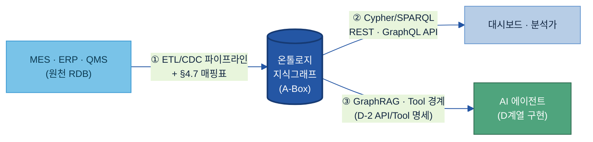

> ③ AI 소비에서 **B-3의 역할은 여기까지** — 에이전트가 탐색할 수 있게 그래프를 정확하게 유지하는 것. Tool 명세 데이터 준비(D-2 API/Tool 명세)·에이전트 구현은 D계열 범위다. 적재 파이프라인의 갱신 주기·신규 데이터 연동은 유즈케이스 기획서 §8(운영 지속성)에, 운영 중 변경 관리는 [§8.1](#81-변경-관리버전)에서 다룬다.

<a id="sec77"></a>

### 7.7 그래프DB 단독으로 안 되는 영역 — 폴리글랏 조합

> 👉 그래프DB는 "관계·인과·경로"에 강하지만 **모든 것을 담는 그릇이 아니다.** 비정형 텍스트 유사도, 대량 정형 집계, BI 도구의 의미 일관 소비는 각각 **벡터DB·RDB·시멘틱 레이어**와 조합해 푼다. 온톨로지는 이 조합의 **의미 중심(허브)** 역할을 한다.

| 무엇을 | 어디에 두나 | 온톨로지와의 관계 |
|---|---|---|
| 관계·인과·다중 홉 경로 | **그래프DB**(LPG/RDF) | 온톨로지의 본진 |
| 비정형 텍스트 의미 유사도(문서 청크 검색) | **벡터DB**(임베딩) | 그래프 노드 ↔ 텍스트 청크를 연결 = **하이브리드 GraphRAG**(관계로 좁히고 벡터로 본문 회수) |
| 대량 정형 트랜잭션·집계·시계열 | **RDB / 데이터 웨어하우스** | 온톨로지가 의미를 부여, 집계는 RDB가 수행(폴리글랏 — §7.3) |
| BI·분석 도구가 "같은 지표·차원 정의"로 소비 | **시멘틱 레이어**(Semantic Layer) | 메트릭·차원 정의를 온톨로지 개념에 정렬해 도구마다 다른 정의가 안 생기게 |

🏭 **CCL 예시 조합:** 들뜸 인과 사슬·Lot commonality 탐색은 **그래프DB**, C/S Report 본문·SOP 문서의 의미 검색은 **벡터DB**(`들뜸검출` 노드에서 관련 문서 청크 회수), 월별 들뜸 발생 건수 집계는 **RDB**, 품질 대시보드의 "들뜸률" 지표 정의 통일은 **시멘틱 레이어**. 네 저장소가 온톨로지 개념(`들뜸`·`Lot`·`SOP`)을 공통 키로 묶인다.

> **하이브리드 GraphRAG 전제조건**은 [[별첨 H]](#appendix-h-graphrag-전제조건-체크리스트). 벡터·시멘틱 레이어를 붙여도 **의미의 단일 진실은 온톨로지**([§1.4](#sec14))라는 점은 변하지 않는다 — 다른 저장소는 온톨로지가 정의한 개념을 참조한다.

### 7.8 아키텍처 진단 체크리스트 — 보안·성능·비용

아키텍처 후보를 정했으면 아래 3축으로 진단한다. 현업 담당자가 PoC 전에 확인할 항목이다.

**🔒 보안(Security)**

| 항목 | 확인 질문 |
|---|---|
| 접근 제어 세분성 | DB 전체 → 레이블/타입 → 노드/트리플 단위까지 권한을 나눌 수 있나 |
| 역할 기반 제어(RBAC) | 사용자 역할별 읽기·쓰기·추론 권한 분리 가능한가 |
| 암호화·감사 | 전송(TLS)·저장 암호화, 접근 감사 로그를 남기나 |
| 내부망 격리 | 외부 클라우드 노출 없이 온프레미스 배포 가능한가 |

**⚡ 성능(Performance)**

| 항목 | 확인 질문 |
|---|---|
| 다중 홉 지연 | 3·5·10홉 탐색 쿼리의 응답 시간이 허용 범위인가 |
| 규모 확장성 | 현재 + 5년 후 예상 노드·엣지 규모에서 성능이 유지되나 |
| 추론 적재 영향 | 사전 적재(7.4) 채택 시 데이터 갱신 주기와 재추론 비용의 균형을 잡았나 |
| 초기 적재 속도 | 기존 RDB·ERP를 온톨로지로 변환·적재하는 시간이 허용 범위인가 |

**💰 비용(Cost)**

| 항목 | 확인 질문 |
|---|---|
| 배포 모델 | 관리형(Neptune·Neo4j Aura) vs 자체 호스팅 중 총비용(TCO)이 유리한 쪽은 |
| 라이선스 | 오픈소스·커뮤니티·엔터프라이즈의 기능 차이와 비용 |
| 벤더 잠금 | openCypher / ISO GQL 호환 여부로 이식성(전환 비용) 확인 |
| 운영 인력 | 자체 호스팅 시 DBA·SRE 인력 비용을 포함해 계산했나 |

> 가격·버전은 변동되므로 단정하지 말고 PoC 전 공식 견적·문서로 확인한다. 정량 벤치마크 수치는 환경 편차가 크므로 자체 PoC로 측정한다.

<a id="sec79"></a>

### 7.9 솔루션·도구 유형 + 그래프DB 구현 구조

온톨로지 데이터를 저장하고 AI 검색에 활용하는 도구는 세 유형이다.

| 유형 | 특징 | 대표 도구 |
|---|---|---|
| **그래프 DB (속성 그래프)** | 노드-관계 구조, 직관적 탐색, 빠른 패턴 매칭 | [Neo4j](https://neo4j.com), [Amazon Neptune](https://aws.amazon.com/neptune/), [TigerGraph](https://www.tigergraph.com), [Memgraph](https://memgraph.com) |
| **RDF 트리플스토어** | W3C 표준 RDF 기반, OWL 추론 지원, 국제 표준 상호운용 | [Ontotext GraphDB](https://graphdb.ontotext.com), [Stardog](https://www.stardog.com/platform/), [Apache Jena](https://jena.apache.org) |
| **온톨로지 편집기** | 개념·관계를 사람이 직접 편집·설계하는 GUI 도구 | [Protégé](https://protege.stanford.edu), [PoolParty](https://www.poolparty.biz/ontology-management), [TopBraid EDG](https://www.topquadrant.com/resources/overview-of-topbraid-edg-ontologies/) |

**그래프DB 구현 구조 — 코어 기획서 §7.4 노드·프로퍼티 각론:** 형식·도구를 정한 뒤 아래 구현 규칙을 코어 기획서([별첨 B](별첨/B-3%20별첨%20B%20—%20코어%20온톨로지%20설계%20기획서.md))에 확정한다. [§4.6 항목 사전](#sec46)·[§6.2.2 작성 규칙](#622-노드프로퍼티-작성-규칙--before--after)과 직결된다.

| 항목 | 정하는 것 | LPG 예시 |
|---|---|---|
| 노드 라벨 명명 | 클래스 라벨 표기(언어·대소문자) | PascalCase 영문 + `name` 한글 라벨 (`Defect`, name: "결함") |
| 관계 유형 명명 | 관계 predicate 표기 | `UPPER_SNAKE` — `CAUSES`, `OCCURS_IN`, `REMEDIATED_BY` |
| 식별자(ID) 구조 | 인스턴스 고유키 포맷 | `{도메인}-{원천키}` 예: `CCL-LOT-PPG2403-17` (예시값) |
| 필수 속성 기준 | 모든 노드/관계가 가져야 할 최소 속성 | L2 사건 노드: `detectedAt`(검출시각) 필수. 모든 노드: `layer`·`namespace` |

> 상세 도구 비교표는 [[별첨 F]](#appendix-f-솔루션-상세-비교표)를, 솔루션을 묶어 평가·선정하려면 → [Tech Stack 비교 정본](../../전체%20목차/01%20Tech%20Stack%20비교%20(솔루션×주제).md)(B-3 표·Part B·C). 이 절은 *온톨로지 주제 관점의 기능 비교*(1층)이며, 새로 조사된 도구는 정본 Part A에도 반영한다.

**단계별 도구 조합 (제조 계열사 권장 경로):**

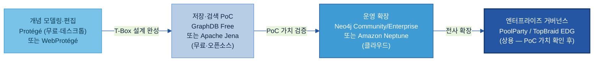

> LPG 제조 온톨로지 권장 경로 상세: PoC = Neo4j Community(무료) → 운영(클라우드) = Amazon Neptune(AWS) 또는 Neo4j AuraDB → 실시간 대량 스트리밍 = Memgraph(Kafka) → RDF/OWL 추론 필요 시 = Ontotext GraphDB Free(PoC) → Stardog(엔터프라이즈). 개별 도구의 표현력·추론 지원·현업 접근성·기존 데이터 연동·운영 부담은 위 §7.2~7.8의 아키텍처 결정과 직접 연결된다. ([[별첨 F]](#appendix-f-솔루션-상세-비교표))

---

## 8. 운영·활용

> 👉 운영(9단계) = 온톨로지를 시간이 지나도 정확하게 유지. AI 활용 = 준비된 지식을 D계열이 소비. 이 섹션은 둘 다 다루되 **데이터 준비 경계에서 멈춘다**.

### 8.1 변경 관리·버전

<a id="kq6"></a>

> ❓ **핵심 질문 6 — "변경을 어떻게 운영하나?"** 에 이 절이 답한다.

온톨로지는 AI 검색·추론의 기반 설계도이므로 변경이 AI 결과 전체에 영향을 준다. **모든 변경은 승인 전에 반드시 분류**한다.

| 변경 유형 | 예시 | AI 추론 리스크 | 승인 |
|---|---|---|---|
| **편집적(Editorial)** | 라벨 수정, 동의어 추가, 정의 표현 변경 | 없음 — AI 동작 불변 | 도메인 스튜어드 단독 |
| **추가적(Additive)** | 새 하위클래스·관계·속성 추가 | 낮음 — 기존 쿼리 영향 없음 | 스튜어드 + 시맨틱 아키텍트 검토 |
| **파괴적(Breaking)** | 클래스 개명·삭제, 관계 의미 재정의, 계층 재편 | 높음 — 기존 쿼리 결과 변동, 적재된 추론 무효화 | 거버넌스 보드 승인 + 영향 분석 + 마이그레이션 계획 |

**원칙: 파괴보다 추가(additive before breaking).** 가능하면 기존 개념을 수정하지 말고 새 개념을 추가하고, 옛 개념은 새 개념을 가리키며 **폐기 표시**한다.[[Galaxy 온톨로지 운영 모델](https://www.getgalaxy.io/articles/ontology-management-semantic-modeling-operating-model-enterprise-context)]

> **계층별 변경 리스크:** 유즈케이스 레이어([§4.4](#sec44)) 변경은 코어에 영향이 없어 가볍다. 반면 **코어의 L1 마스터·L2 사건 스키마 변경은 거의 항상 파괴적**이다 — 그 위에 쌓인 모든 사건·해석·유즈케이스가 흔들린다. 코어(L1·L2) 수정은 반드시 위 분류·승인 절차를 거치고, 일상 변경은 유즈케이스 레이어에서 흡수한다.

**시맨틱 버저닝 `X.Y.Z`:**
- **X (Major):** 파괴적 — 삭제·계층 재편·관계 의미 변경
- **Y (Minor):** 추가적 — 새 클래스·관계·속성
- **Z (Patch):** 편집적 — 라벨·설명·동의어 수정

**폐기(Deprecation) 프로토콜:** 삭제하지 말고 `deprecated = true`로 표시하고 대체 개념 포인터를 단 뒤, 다음 Major 릴리스까지 유지한다. 다운스트림 소비자(AI 검색 파이프라인·대시보드)의 조용한 실패를 막는다.

**배포 전 영향 점검 체크리스트:**
1. SHACL([W3C SHACL](https://www.w3.org/TR/shacl/)) 검증 스위트 — 치명 위반 0건인가?
2. OWL 추론기 일관성 검사 — 충족 불가(unsatisfiable) 클래스 없는가?
3. 회귀 쿼리 셋(상위 20개 AI 쿼리) 실행 — 비파괴 변경에서 결과가 동일한가?
4. 파괴적 변경 시: 변경 개념을 참조하는 모든 다운스트림 시스템 식별 + 운영 데이터 샘플 테스트
5. 하위 계열사 온톨로지(자식 네임스페이스) — 충돌 없는가?
6. AI 팀에 변경 공지(특히 파괴적 변경)했는가?
7. 변경 로그 갱신·폐기 개념 표시했는가?

**역할·책임:**

| 역할 | 책임 |
|---|---|
| **도메인 스튜어드** (현업 SME) | 개념 제안·도메인 검증·편집적 변경 승인·다운스트림 소비자 식별 |
| **시맨틱 아키텍트 / 온톨로지 설계자** | 형식 모델링·추가적 변경 검토·관계 정의서 유지·계열사 간 충돌 해소 |
| **거버넌스 보드** | 공통 레이어 소유·파괴적 변경 승인·네이밍/네임스페이스 정책 결정 |
| **플랫폼·데이터 팀** | 승인 버전 배포·SHACL 파이프라인 운영·Graph DB 관리·롤백 |

> *최소 거버넌스(초기):* 계열사당 도메인 스튜어드 1 + 시맨틱 아키텍트 1 + Git 기반 PR 리뷰. 거버넌스 보드는 공통 레이어가 활성화된 뒤 구성한다.

**변경 처리 흐름:**

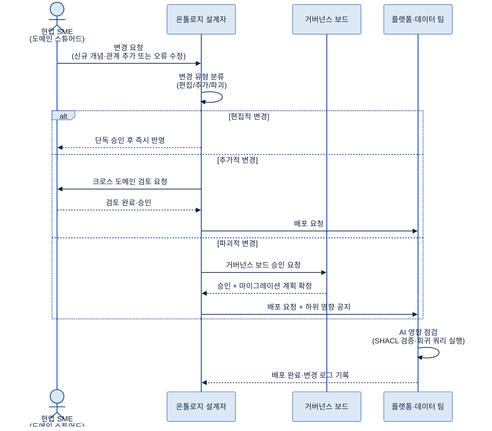

### 8.2 AI 활용 — 관계 기반 검색·추천 3가지 패턴

<a id="kq5"></a>

> ❓ **핵심 질문 5 — "AI 활용에 어떻게 적용하나?"** 에 이 절이 답한다. 온톨로지는 아래 AI 패턴을 가능케 하는 **데이터 자산**이다. 에이전트·RAG 시스템 자체의 구현은 D계열 가이드 소관이다.

온톨로지(설계도)에 실제 데이터(인스턴스 트리플)를 채우면 **지식그래프(Knowledge Graph)**가 완성된다. 이를 AI 검색에 연결하는 대표 방식이 **GraphRAG** — 온톨로지 관계를 따라 문서를 탐색한 뒤 AI가 답을 생성하는 구조다. 아래 세 패턴 모두 **벡터 검색만으로는 제공할 수 없는 관계 기반 탐색**을 요구한다.

**패턴 1 — RAG 개념 확장(검색 재현율 향상):**

"들뜸 관련 문서를 찾아라"가 들어오면 온톨로지가 검색을 자동으로 확장한다.

```
질의: "들뜸" (Delamination)
  ↓ 온톨로지 계층 탐색
  들뜸 → 층간결함(InterlayerDefect)의 하위 클래스
  층간결함 → CCL결함(CCLDefect)의 하위 클래스
  ↓ 확장된 질의
  "들뜸 OR 층간결함 OR CCL결함" 관련 모든 문서 검색
  ↓ 결과
  재현율(Recall) 향상 — 정밀도(Precision) 손실 없음
```

**패턴 2 — 에이전트 다중 홉 원인 탐색:**

[§5 예시 시나리오](#5-예시-시나리오)처럼 에이전트가 선언된 `causes` 사슬을 결함 → 설비 상태 → 정비 기록까지 따라간다. 온톨로지의 선언된 관계가 없으면 매 홉마다 별도 하드코딩 조회가 필요하다.

🏭 **CCL 들뜸 탐색 예시(예시값):**
```
들뜸 사건(L2) → [hasCause] → 프리프레그 흡습(L3 원인 판단)
                           → [usedMaterial] → 프리프레그 Lot PPG2403-17(L1)
                           → [storedAt] → 창고 3구역 (보관 습도 72% 초과)
→ [또는] 열압착 온도미달(L3 원인 판단)
          → [governedBy] → SOP-CCL-011 (표준: 185°C ± 3°C)
          → [actualValue] → 178°C (실제 온도 기록 — MES 로그)
```

3~4홉을 한 번의 Cypher 쿼리로 탐색. 온톨로지 없이는 3개 이상의 시스템(ERP 재고·MES 로그·SOP DB)을 수작업으로 대조해야 한다.

**패턴 3 — 유사 사례·조치 추천(구조 기반 유사도):**

현재 결함의 클래스 소속 + 원인 요소로 온톨로지를 탐색해, 같은 원인·결함 조합을 가진 과거 A-Box 인스턴스를 찾고, 결과 기록과 함께 과거 조치를 반환한다. **임베딩 유사도가 아니라 구조 기반 유사도**다 — 어휘가 달라도 같은 구조 경로를 공유하면 유사 사례로 찾는다.

> **B-3 / D계열 경계:**
>
> B-3은 지식 데이터를 준비한다(T-Box 설계·A-Box 적재·검증·버전 관리). D계열이 실행한다 — D-2 API/Tool 명세가 에이전트가 온톨로지를 어떻게 호출할지 정의하고, D계열이 GraphRAG 애플리케이션·에이전트를 구현한다. **§8을 "에이전트 만드는 법"으로 흘리지 않는다 — 그것은 D계열 범위다.** B-3는 "식재료 준비", D계열은 "요리 실행"이다.

---

## 9. 다른 주제와의 관계

> 👉 인접 주제와 **겹치는 게 아니라 경계로 나뉜다.** Glossary는 단어 뜻, 메타데이터는 필드 설명, 카탈로그는 위치, B-2는 라벨, B-3 온톨로지는 그 사이의 **관계와 구조**를 맡는다. D계열은 그 구조를 실행에 올린다.

| 인접 주제 | 그 주제의 역할 | B-3 온톨로지의 역할 | 핵심 경계 |
|---|---|---|---|
| [A-3 Glossary](../A-3%20Glossary/A-3%20Glossary.md) | 단일 용어의 뜻·동의어·약어 표준화 | 개념 간 관계·인과 구조·계층 정의 | **A-3는 단어 사전, B-3는 관계 지도.** A-3의 표준 용어가 온톨로지 클래스의 `name` 라벨로 쓰인다. "균열이 뭔가" → A-3. "균열이 어디서 발생하고 원인이 뭔가" → B-3 |
| [A-2 메타데이터](../A-2%20메타데이터/A-2%20메타데이터.md) | 데이터 필드·테이블의 속성(설명·타입·소유자 등) 설명 | 업무 개념과 데이터 필드를 의미적으로 연결 | **A-2는 "이 필드가 무엇인가", B-3는 "이 개념이 저 개념과 어떻게 연결되는가".** A-2의 필드명이 온톨로지 A-Box 적재 시 매핑 키가 된다 |
| [A-1 데이터 카탈로그](../A-1%20데이터%20카탈로그/A-1%20데이터%20카탈로그.md) | 데이터 자산의 위치·접근 경로·소유자 파악 | 개념과 데이터 자산을 의미 기반으로 연결 | **A-1은 "어디 있나", B-3는 "왜 연결되나".** 카탈로그가 자산 위치를 알려주면, 온톨로지가 그 자산의 개념적 의미와 다른 자산과의 관계를 부여한다 |
| [B-2 데이터 해설·주석](../B-2%20데이터%20해설·주석/B-2%20데이터%20해설·주석.md) | AI 학습·분류를 위한 인스턴스 라벨 부여 | 라벨 유형이 무엇이고 라벨 유형들이 어떻게 연결되는지 클래스 스키마 정의 | **B-2는 라벨된 인스턴스 생산, B-3는 그 라벨이 따르는 클래스 스키마 제공.** B-2가 "이 결함은 스크래치"로 라벨하면, B-3는 스크래치가 외관결함의 하위 클래스이고 연삭공정에서 발생한다는 구조를 정의한다 |
| D계열 AI 검색·에이전트 | 온톨로지 지식으로 추론·검색·추천·Tool 호출 실행 | AI가 쓸 지식 구조를 준비·정의·검증·유지 | **B-3는 식재료 준비, D계열은 요리 실행.** D-2 API/Tool 명세가 "에이전트가 온톨로지를 어떻게 호출할지" 정의하고, D계열 나머지가 실행 파이프라인을 구현한다. B-3는 그 파이프라인이 소비할 데이터를 정확하게 유지하는 것이 역할이다 |

> 이 경계 구분의 실용적 의미: 어떤 작업이 "어느 주제 범위인가"를 모를 때는 **"데이터 구조와 의미를 정의하는가(B-3) vs 그것을 소비해 실행하는가(D계열)"**로 가른다. "GraphRAG 호출 API 명세 작성"은 D-2 범위, "GraphRAG가 탐색할 관계 구조 설계·인스턴스 적재"는 B-3 범위다.

---

## 10. 성과 지표·로드맵·고도화

> 👉 온톨로지 품질은 **구조적으로**(커버리지·일관성·고립 개념)와 **AI 효과로**(기준선 대비 검색 개선) 측정한다. 성숙 경로는 수기(Manual) → AI 보조 → 자율 갱신으로 확장한다.

### 10.1 성과 지표 (KPI)

§2에서 세운 목표(구조 품질·AI 가치·운영 규율)에 묶인 5개 KPI.

| KPI | 쉬운 의미 | 방향·목표 | 측정 방법 |
|---|---|---|---|
| **핵심 개념 모델링 비율** | 범위 내 핵심 개념 중 온톨로지에 정의된 비율 | ↑ (PoC 80%+ — PoC에서 기준선 수립) | 모델링 개념 수 ÷ 식별 개념 수 |
| **제약 검증 통과율** | OOPS!/SHACL 함정 점검 통과 비율 (구조 건전성) | ↑ (치명 100%·중요 90%+ — 배포 조건) | [OOPS! 스캐너](https://oops.linkeddata.es) + SHACL 셰이프 실행 [[arXiv OntoQA](https://arxiv.org/abs/2211.10011)] |
| **고립 개념 수** | 관계가 하나도 없는 개념 수 (고립 노드 — 구조 품질 실패 지표) | ↓ (0 목표) | 그래프 쿼리: `degree = 0` 인 노드 수 |
| **관계 기반 검색·추천 적중률** | 키워드 기준선 대비 도메인 Q&A 정확도 개선율 (PoC 측정) | ↑ (방향: 양(+). 목표치는 PoC 기준선에서 설정) | 도메인 테스트셋 평가·수동 채점 [[arXiv 2511.05991](https://arxiv.org/html/2511.05991v1)] |
| **변경 반영 속도** | 변경 요청 → 승인·배포까지 평균 영업일 (티어별 SLA) | ↓ (SLA 준수율 90%+) | 거버넌스 티켓 타임스탬프 [[PMC KGCL](https://pmc.ncbi.nlm.nih.gov/articles/PMC11753292/)] |

> **목표치는 PoC에서 도출한다.** 도메인 기준선을 측정하기 전에 특정 수치를 약속하지 않는다. 한 설문에서 변경 반영 속도에 만족한 온톨로지 팀은 **17%에 불과**했다 — 대부분 조직에서 이 KPI에 개선 여지가 크다.[[KGCL PMC 11753292](https://pmc.ncbi.nlm.nih.gov/articles/PMC11753292/)]

🏭 **두산 계열사 적용 예시(예시값, PoC에서 실측 필요):**

| 계열사 | 유즈케이스 | KPI 예시 |
|---|---|---|
| **밥캣** | 유압 계통 RCA 온톨로지 | 핵심 개념 80개 중 64개 모델링(80%), SHACL 치명 위반 0건으로 첫 배포 |
| **테스나** | 반도체 검사 공정 결함 분류 | "불량 모드" 개념을 MES·SOP·C/S Report 3개 자산과 매핑 — 초기 커버리지 60% → 2단계 90% 목표 |
| **에너빌리티** | 터빈 부품 결함 원인 분석 | 변경 반영 현재 평균 21일 → LLM 보조 초안 도입 후 7일 목표 |

*(위 수치는 목표 설정을 위한 가상 예시다. 실제 값은 PoC·현황 분석에서 확정한다.)*

### 10.2 고도화 Roadmap

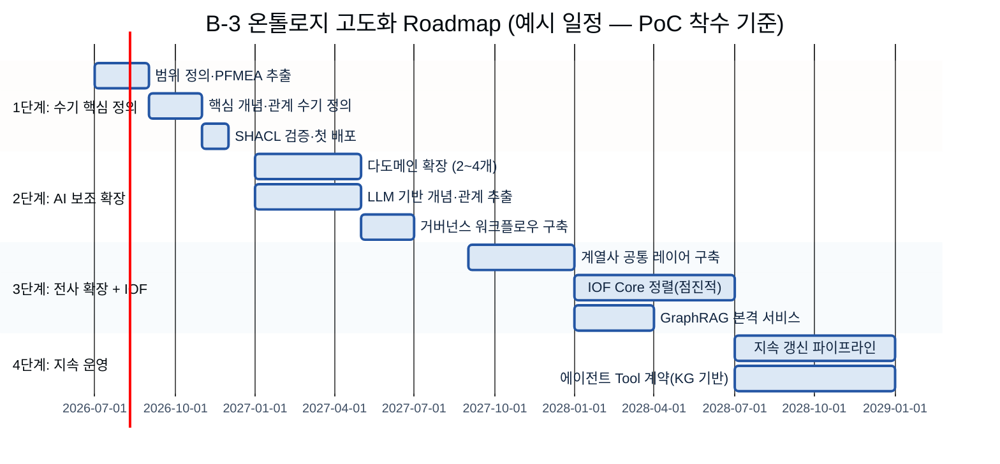

- **1단계 (0~6개월) — 수기 핵심 정의:** 한 도메인(예: 한 제품군 결함 RCA). 50~80개 개념·10~15개 관계 유형, [Protégé](https://protege.stanford.edu) 수기 T-Box 모델링. 코어 설계 기획서([별첨 B](별첨/B-3%20별첨%20B%20—%20코어%20온톨로지%20설계%20기획서.md)) 1건 완성. 배포 전 OOPS! 치명 함정 0건. KPI 기준선 수립.

- **2단계 (6~18개월) — AI 보조 확장:** 2~4개 도메인 추가. LLM 보조 개념 추출(스키마 기반: LLM 제안 → 현업 검증). 변경 요청 → 스튜어드 검토 → SHACL 게이트 → 머지 거버넌스 워크플로우 구축. 첫 유즈케이스 레이어([별첨 C](별첨/B-3%20별첨%20C%20—%20유즈케이스%20레이어%20설계%20기획서.md)) 적용.

- **3단계 (18~36개월) — 전사 확장·IOF:** 계열사 간 공통 레이어 구축(지주 데이터팀 조율). CI/CD SHACL 자동 검증. IOF Core 정렬 시작(고빈도 용어부터). 첫 운영 GraphRAG 배포(AI 근본원인 Q&A). 검색 개선 KPI 실측.

- **4단계 (36개월+) — 지속 운영:** 신규 문서 → LLM 추출 → 파괴적 변경만 사람 검토하는 **지속 갱신 파이프라인**. 에이전트 Tool 계약·D계열 API 정의가 온톨로지 개념을 직접 참조. 온톨로지 진화에 따른 회귀 테스트로 AI 정확도 유지.

---

## 별첨 (Appendix)

> **별첨 A~D = 실행형(각각 별도 .md 파일).** 정론(본문)을 읽으며 적용·채운다. **별첨 E~J = 기술 상세**(본문 내). 실제 프로젝트 사례(CCL)는 **별첨 A에만** 들어간다 — B·C는 빈 템플릿, D는 일반 운영법.

| 별첨 | 문서 | 성격 | 위치 |
|---|---|---|---|
| **A** | [유즈케이스 온톨로지 구축 각론](별첨/B-3%20별첨%20A%20—%20유즈케이스%20온톨로지%20구축%20각론.md) | 정론↔CCL 기획서 브릿지 + **실제 CCL 노드 설계 사례** | 별도 .md |
| **B** | [코어 온톨로지 설계 기획서](별첨/B-3%20별첨%20B%20—%20코어%20온톨로지%20설계%20기획서.md) | 9단계 1~7 산출물 **빈 템플릿** | 별도 .md |
| **C** | [유즈케이스 레이어 설계 기획서](별첨/B-3%20별첨%20C%20—%20유즈케이스%20레이어%20설계%20기획서.md) | 9단계 8 산출물 **빈 템플릿** | 별도 .md |
| **D** | [Discovery Workshop 운영 가이드](별첨/B-3%20별첨%20D%20—%20Discovery%20Workshop%20운영%20가이드.md) | 9단계 2단계 수집 워크샵 **일반 운영법** | 별도 .md |

### [Appendix E] 기술 표준 RDF·OWL·SPARQL 한 줄 풀이

메인 본문에서는 개념 이해에 집중하고, 아래 기술 표준 상세는 구현 시 참고한다.

| 약어 | 풀이 | 한 줄 설명 | 공식 URL |
|---|---|---|---|
| **RDF** | Resource Description Framework (자원 기술 프레임워크) | "주어-관계-목적어" 3개 짝으로 모든 지식을 표현하는 W3C 국제 표준 형식 | [w3.org/RDF](https://www.w3.org/RDF/) |
| **OWL** | Web Ontology Language (웹 온톨로지 언어) | 온톨로지의 규칙·제약을 컴퓨터가 읽고 추론할 수 있도록 쓰는 언어. RDF 위에 얹는다 | [w3.org/TR/owl2-overview](https://www.w3.org/TR/owl2-overview/) |
| **SKOS** | Simple Knowledge Organization System | 분류체계·시소러스를 RDF로 표현하는 간단한 표준. 복잡한 추론 없이 계층·동의어 관리할 때 적합 | [w3.org/TR/skos-reference](https://www.w3.org/TR/skos-reference/) |
| **SPARQL** | SPARQL Protocol and RDF Query Language | RDF 트리플스토어를 검색하는 쿼리 언어. SQL의 그래프 버전 | [w3.org/TR/sparql11-overview](https://www.w3.org/TR/sparql11-overview/) |
| **SHACL** | Shapes Constraint Language (형식 제약 언어) | RDF 데이터가 정해진 형식 규칙을 지키는지 자동 검증하는 표준 | [w3.org/TR/shacl](https://www.w3.org/TR/shacl/) |
| **Triple Store** | 트리플 저장소 | RDF 트리플을 저장하고 SPARQL 쿼리로 검색하는 데이터베이스 | — |
| **Property Graph / LPG** | (레이블) 속성 그래프 | 노드와 엣지에 속성값을 직접 붙이는 그래프 모델. Neo4j 등이 대표. RDF보다 단순·빠르지만 추론은 약함 | [neo4j.com](https://neo4j.com/product/neo4j-graph-database/) |
| **openCypher / Cypher** | 오픈사이퍼 / 사이퍼 | LPG를 검색하는 쿼리 언어. Neo4j가 만들어 오픈소스로 공개, 가장 널리 쓰임 | [opencypher.org](https://opencypher.org/) |
| **GQL** | Graph Query Language (ISO/IEC 39075) | 2024년 발행된 최초의 국제표준 그래프 쿼리 언어. Cypher를 모태로 설계 | [iso.org/standard/76120](https://www.iso.org/standard/76120.html) |
| **T-Box / A-Box** | 개념 스키마 / 인스턴스 데이터 | T-Box=개념·관계 정의(작음), A-Box=그 규칙에 맞춘 실제 데이터(큼). 추론으로 A-Box를 풍부하게 | [w3.org/TR/owl2-primer](https://www.w3.org/TR/owl2-primer/) |
| **Materialization** | (추론) 사전 적재 | 추론 도출 사실을 적재 시점에 미리 계산해 저장. 쿼리는 빨라지나 용량↑·갱신 비용↑. 반대는 질의 시 추론 | [ontotext.com](https://www.ontotext.com/knowledgehub/fundamentals/what-is-inference/) |
| **IOF / BFO** | 산업 온톨로지 파운드리 / 기초 형식 온톨로지 | IOF=제조 표준 참조 온톨로지 모음. BFO(ISO/IEC 21838-2)는 IOF가 올라타는 최상위 온톨로지. 도입은 외부 연계·팀 역량으로 판단(§7.5) | [github.com/iofoundry](https://github.com/iofoundry/ontology) |

### [Appendix F] 솔루션 상세 비교표

| 도구 | 모델 | 쿼리 언어 | 추론/온톨로지 | 배포 | 적합 |
|---|---|---|---|---|---|
| [Neo4j](https://neo4j.com) | LPG | Cypher / ISO GQL(이행 중) | RDF 브릿지(NeoSemantics) | 자체(Community/Enterprise) + AuraDB | 성숙 생태계, Cypher 역량, 그래프 분석(GDS) |
| [Amazon Neptune](https://aws.amazon.com/neptune/) | LPG + RDF | Gremlin + openCypher + SPARQL 1.1 | RDF+SPARQL 모드 온톨로지 질의 | AWS 완전관리·서버리스 | AWS 네이티브, RDF+LPG 둘 다 필요 |
| [TigerGraph](https://www.tigergraph.com) | LPG(병렬) | GSQL(독자) | 네이티브 온톨로지/RDF 없음 | 자체 + 클라우드 | 심층 분석, 연산 집약 탐색 |
| [Ontotext GraphDB](https://graphdb.ontotext.com) | RDF | SPARQL 1.1 | OWL QL/RL·사전적재·SHACL | 자체 + Cloud | 시맨틱/온톨로지 앱, SHACL 검증 |
| [Stardog](https://www.stardog.com) | RDF | SPARQL 1.1 | 전 OWL 프로파일·질의 시 추론·가상화 | 자체 + 클라우드 | 사일로 통합 KG, no-ETL 가상화 |
| [Memgraph](https://memgraph.com) | LPG | openCypher | 그래프 알고리즘·네이티브 OWL 없음 | 자체(인메모리) | 실시간 IoT 스트리밍, Kafka |
| [Apache Jena + TDB](https://jena.apache.org) | RDF | SPARQL 1.1 | OWL 추론(Pellet/HermiT)·Jena-SHACL | 자체(오픈소스·무료) | 예산형 PoC·연구·RDF 탐색 |
| [Protégé](https://protege.stanford.edu/) | 편집기 | — | OWL 편집·추론기 연동 | 데스크톱 + WebProtégé | 개념·관계 수기 설계 |

> 가격·버전·배포 옵션은 변동되므로 PoC 전 공식 문서·견적으로 확인한다. 위 표를 현행 가격 근거로 쓰지 않는다.

**LPG 제조 온톨로지 권장 경로:** PoC=Neo4j Community(무료) → 운영(클라우드)=Amazon Neptune(AWS) 또는 Neo4j AuraDB → 실시간 대량=Memgraph(Kafka) → RDF/OWL 추론 필요 시=Ontotext GraphDB Free(PoC) → Stardog(엔터프라이즈).

### [Appendix G] OWL 서브언어와 SKOS vs OWL

**OWL 2 서브언어(W3C OWL2 Primer):**

| 서브언어 | 추론 보장 | 용도 |
|---|---|---|
| OWL Lite | 결정 가능, 단순 카디널리티 | 기초 분류 |
| OWL DL | 결정 가능, 최대 표현력 | 본격 제조 온톨로지(권장) |
| OWL Full | 최대 자유, 추론 보장 안 됨 | 연구용 |

**SKOS vs OWL (제조):**

| 차원 | SKOS | OWL |
|---|---|---|
| 표현력 | 낮음 — 라벨·계층만 | 높음 — 클래스·속성·공리·추론 |
| 추론 | 없음 | 완전 OWL 추론 |
| 용도 | A-3 Glossary·통제 어휘 | B-3 온톨로지(완전 시맨틱 계층) |

결함 코드의 *용어사전* → SKOS / A-3. 인과 관계를 모델링하는 *온톨로지* → OWL / B-3.

### [Appendix H] GraphRAG 전제조건 체크리스트

GraphRAG는 지식그래프를 요구하고, 지식그래프는 다음을 요구한다:
1. 일관된 타입으로 정의된 노드(개체) → 최소한 Taxonomy
2. 형식 의미가 부여된 엣지(관계) → 온톨로지 필요
3. 실제 사건·측정 인스턴스 데이터 적재 → 데이터 준비 필요

온톨로지 없는 GraphRAG는 "연결은 있으나 그 연결이 무엇을 뜻하는지에 대한 일관된 규칙이 없는 — 데이터는 있으나 해석할 의미 기반이 없는" 상태가 된다.[[Neo4j](https://neo4j.com/blog/knowledge-graph/taxonomy-vs-ontology-vs-knowledge-graph/)]

**실무 전제조건 체크리스트:**
- [ ] 핵심 도메인 개념 정의·합의(온톨로지 T-Box)
- [ ] 핵심 관계 타입화: `hasCause`·`relatedParameter`·`occursIn`·`hasCorrectiveAction`
- [ ] 원천 시스템 간 동의어 매핑 해소(A-3 Glossary 경유)
- [ ] 인스턴스 데이터 품질 충분(garbage in = garbage graph)
- [ ] 벡터DB·시멘틱 레이어 조합 시 온톨로지 개념을 공통 키로([§7.7](#sec77))

### [Appendix I] 네임스페이스 메커니즘과 NeOn 시나리오

**LPG 네임스페이스 패턴(Neo4j / openCypher):**
```cypher
// 공통 스키마: 네임스페이스 접두 레이블
CREATE (:DefectType:Common {name:'Defect', namespace:'mfg-common'})
CREATE (:DefectType:Bobcat {name:'WeldingDefect', namespace:'mfg-bc'})
CREATE (weld:DefectType {name:'WeldingDefect'})-[:IS_SUBTYPE_OF]->
       (d:DefectType {name:'Defect', namespace:'mfg-common'})
```

**RDF/OWL 네임스페이스 패턴(Turtle):**
```turtle
# 지주 공통 온톨로지
@prefix mfg-common: <http://doosan.com/ontology/common#> .
mfg-common:Defect a owl:Class .
mfg-common:hasCause a owl:ObjectProperty ;
    rdfs:domain mfg-common:Defect ; rdfs:range mfg-common:Cause .

# 밥캣 계열사 확장(공통 import)
@prefix mfg-bc: <http://doosan.com/ontology/bobcat#> .
<http://doosan.com/ontology/bobcat#> owl:imports
    <http://doosan.com/ontology/common#> .
mfg-bc:WeldingDefect a owl:Class ; rdfs:subClassOf mfg-common:Defect .
```

**NeOn 방법론 시나리오 매핑(지주 구조):**

| NeOn 시나리오 | 적용 시점 |
|---|---|
| 시나리오 1 (From scratch) | 지주 공통 레이어 최초 구축 |
| 시나리오 5 (재사용+병합) | 두 계열사 온톨로지를 공통 레이어로 병합 |
| 시나리오 8 (재구조화) | 단일 온톨로지를 공통+계열사 레이어로 모듈화 |
| 시나리오 9 (현지화) | 한국어 라벨·정의 추가 |

### [Appendix J] 추가 정확도 벤치마크·근거

**Lettria 하이브리드 RAG 벤치마크(AWS 블로그 경유):**
- 다양한 기술 도메인 정답률: 전통 RAG 50.83% → GraphRAG 80.00%
- 기술 사양 정답률: 전통 RAG 46.88% → GraphRAG 90.63%
*출처: [[AWS ML Blog](https://aws.amazon.com/blogs/machine-learning/improving-retrieval-augmented-generation-accuracy-with-graphrag/)] (Lettria 1차 연구 인용). 발표 인용 전 Lettria 1차 출판본 확인 권장.*

**KGroot 제조 근본원인 정확도:**
- KG 사용: 93.5% A@3(상위 3 근본원인 식별); 미사용: 90.15% A@3 → +3.35%p, Mean Average Rank에서 비KG 대비 39~96% 우위
*출처: [[arXiv 2402.13264](https://arxiv.org/html/2402.13264v1)] — 마이크로서비스 장애 데이터셋, 산업 기계는 다를 수 있음.*

**설명력(provenance):** GraphRAG는 "원문 근거 텍스트로의 링크를 통해 출처(provenance)를 담는다."[[Microsoft Research](https://www.microsoft.com/en-us/research/blog/graphrag-unlocking-llm-discovery-on-narrative-private-data/)] 각 AI 답변을 특정 노드·엣지·텍스트 청크로 역추적할 수 있다.

---

## 참고자료 (References)

> 표기 규칙: 본문에서 **직접 인용한 문장·핵심 수치**는 각주(↩)로 해당 문장에 달았다(예: §2.3 동료심사 수치, §7 형식·추론 인용). 아래는 각주 출처를 포함한 **전체 출처를 분류한 목록**이다.

**내부 자료:**
- Kearney, 「두산지주 AI-Ready Data 체계 — CSO 중간보고」(2026-06-16) **모듈2** — §2.2·§5 전자BG CCL 들뜸 C/S Report 예시의 출처 (내부 문서·비공개)
- 두산 「온톨로지 구축 방법론 요약」·「코어/유즈케이스 설계 기획서」 — §1.4·§4.3·§4.4·§6 9단계·별첨 A~D의 방법론·산출물 양식 출처 (내부 문서)

**표준·명세:**
- [W3C OWL2 Primer](https://www.w3.org/TR/owl2-primer/) — OWL 구성요소·T-Box/A-Box 1차 권위
- [W3C RDF 1.2 Concepts](https://www.w3.org/TR/rdf12-concepts/) — 트리플 모델 1차 권위
- [W3C SPARQL 1.1](https://www.w3.org/TR/sparql11-query/) · [W3C SKOS Primer](https://www.w3.org/TR/skos-primer/) · [W3C SHACL](https://www.w3.org/TR/shacl/)
- [ISO/IEC 39075:2024 GQL](https://www.iso.org/standard/76120.html) — 그래프 쿼리 언어 국제표준(2024-04 발행)
- [IOF Industrial Ontologies Foundry](https://www.industrialontologies.org) · [BFO](https://basic-formal-ontology.org) · [IOF GitHub](https://github.com/iofoundry/ontology) · [NIST IOF Core](https://www.nist.gov/publications/industrial-ontologies-foundry-iof-core-ontology)

**연구·동료심사 출처:**
- [arXiv 2510.15428 — 제조 FMEA 온톨로지 가이드 고장 원인 식별(F1@20 0.267→0.523)](https://arxiv.org/abs/2510.15428) — 온톨로지 vs RAG 개선의 가장 강한 동료심사 근거(§2.3) ⚠️ 공식 출판본 확인 권장
- [arXiv 2511.05991 — 온톨로지 vs KG 구축; RAG 정확도(+30%p, n=20)](https://arxiv.org/html/2511.05991v1) (§2.3·6.2.1)
- [arXiv 2402.13264 — KGroot: KG 기반 근본원인(93.5% A@3)](https://arxiv.org/html/2402.13264v1) (별첨 J)
- [arXiv 2510.20345 — LLM 기반 KG 구축 서베이·3단계 진행](https://arxiv.org/pdf/2510.20345) · [arXiv 2211.10011 — KG 구조 품질 지표(OntoQA)](https://arxiv.org/abs/2211.10011)
- [OOPS! OntOlogy Pitfall Scanner](https://oops.linkeddata.es) · [PMC 11753292 — KGCL 변경 언어·변경관리 설문](https://pmc.ncbi.nlm.nih.gov/articles/PMC11753292/)
- [CN Patent 114943415A — 금속 용접 결함 근본원인 지식그래프](https://patents.google.com/patent/CN114943415A/en) (§4·§6 밥캣 용접 예시 근거)
- [Stanford Ontology Development 101 (Noy & McGuinness)](https://protege.stanford.edu/publications/ontology_development/ontology101.pdf) · [LibreTexts 온톨로지 방법론](https://eng.libretexts.org/Bookshelves/Computer_Science/Programming_and_Computation_Fundamentals/An_Introduction_to_Ontology_Engineering_(Keet)/06:_Methods_and_Methodologies) · [NeOn Methodology](https://oeg.fi.upm.es/index.php/en/completedprojects/8-neon/index.html)
- [ResearchGate — PFMEA 도메인 DL 기반 온톨로지](https://www.researchgate.net/publication/258436781_A_System_for_Distributed_Sharing_and_Reuse_of_Design_and_Manufacturing_Knowledge_in_the_PFMEA_Domain_Using_a_Description_Logics-based_Ontology) (§6.2.1) ⚠️ 접근 제한 가능
- 검증(정론↔표준/Palantir 대조): BFO Continuant/Occurrent·IAO Information Content Entity·W3C PROV-O — L3 해석 레이어의 이론적 근거. T-box/A-box·CQ·코어 재사용은 표준·Palantir와 일치(세션 검증 결과).

**벤더·실무 출처:**
- [Microsoft Research: GraphRAG](https://www.microsoft.com/en-us/research/blog/graphrag-unlocking-llm-discovery-on-narrative-private-data/) · [AWS: GraphRAG 정확도](https://aws.amazon.com/blogs/machine-learning/improving-retrieval-augmented-generation-accuracy-with-graphrag/) · [SingleStore: GraphRAG 다중홉](https://www.singlestore.com/blog/rethinking-rag-how-graphrag-improves-multi-hop-reasoning-/)
- [Palantir Foundry Ontology: Core concepts](https://www.palantir.com/docs/foundry/ontology/core-concepts) · [Ontology system](https://www.palantir.com/docs/foundry/architecture-center/ontology-system) — 단일 공유 온톨로지 재사용·Object/Link/Action(코어/유즈케이스·semantic/kinetic 대조 근거)
- [Neo4j: Taxonomy vs Ontology vs KG](https://neo4j.com/blog/knowledge-graph/taxonomy-vs-ontology-vs-knowledge-graph/) · [Neo4j: Knowledge Layer](https://neo4j.com/blog/agentic-ai/knowledge-layer/) ⚠️ 인용 의역
- [Memgraph: LPG vs RDF](https://memgraph.com/docs/data-modeling/graph-data-model/lpg-vs-rdf) (§7.2) · [Fluree: RDF vs LPG](https://flur.ee/fluree-blog/rdf-versus-lpg/) · [Enterprise Knowledge: RDF & LPG](https://enterprise-knowledge.com/cutting-through-the-noise-an-introduction-to-rdf-lpg-graphs/)
- [AWS: RDF·openCypher로 KG 구축](https://aws.amazon.com/blogs/database/build-and-deploy-knowledge-graphs-faster-with-rdf-and-opencypher/) (§7.1) · [TigerGraph: ISO GQL 2024](https://www.tigergraph.com/blog/the-rise-of-gql-a-new-iso-standard-in-graph-query-language/) (§7.2)
- [Ontotext: What Is Inference?](https://www.ontotext.com/knowledgehub/fundamentals/what-is-inference/) (§7.4) · [Ontotext: SHACL](https://graphdb.ontotext.com/documentation/standard/shacl-validation.html)
- [Galaxy: 온톨로지 운영 모델](https://www.getgalaxy.io/articles/ontology-management-semantic-modeling-operating-model-enterprise-context) (§8.1) · [EKGF 성숙도 모델](https://maturity.ekgf.org/intro/structure/) · [Industrial AI Ordo: 제조 KG](https://coformation.medium.com/knowledge-graphs-in-manufacturing-20-practical-questions-b86c863d5c4c) (§3)
- [SGKG: 온톨로지 vs 분류체계 결정](https://sgkg.org/blog/2026-03-21-ontology-vs-taxonomy-knowledge-organisation/) (§3.1) · [PuppyGraph: KG vs 온톨로지](https://www.puppygraph.com/blog/knowledge-graph-vs-ontology) · [Protégé](https://protege.stanford.edu) · [OOPS! 스캐너](https://oops.linkeddata.es)

---

## 변경 이력 / 피드백 반영

| 일자 | 버전 | 피드백 (누가/무엇) | 반영 내용 | 반영 위치 |
|------|------|-------------------|-----------|-----------|
| 2026-06-18 | 0.1~0.2 | 초안 + 허훈석 컨설턴트(아키텍처 방법론화) | §아키텍처 설계·선택 방법론 확장 | §아키텍처 |
| 2026-06-19 | 0.3 | 영문 파이프라인 흡수 | 동료심사 수치 교체·KQ 가시화·인과 사슬·T/A-box·워크드 예시·AI 3패턴·KPI 5개 | 전체 |
| 2026-06-19 | 0.4~0.4.4 | 고객/두산 — 일반 방법론 흡수·9단계 점검 | 철학 5·3계층·트리거·함정 7·검증 4원칙·9단계 크로스워크 | 다수 |
| 2026-06-19 | 0.5 | 고객 — 방법론 수정본 + 코어·유즈케이스 기획서 입력 | 9단계 단일 정본화·코어/유즈케이스 척추·As-Is §6.0·기획서 별첨화·아키텍처(외부연동·폴리글랏) 보완 | 전체 |
| 2026-06-19 | 0.6 | 고객 — 본문 순서 정리·별첨 분리·각론/워크샵 신설 | ① **When↔What 순서 교체**(§3 When·§4 What) ② **인라인 기획서를 외부 별첨 .md 링크로**(별첨 A 각론·B 코어·C 유즈케이스·D Discovery Workshop, 각각 별도 파일) ③ **기술 별첨 C~H→E~J 재번호** + 본문 cross-ref 일괄 갱신 ④ **사례는 별첨 A에만**(B·C 빈 템플릿, D 일반) ⑤ 별첨 B에 6요소 계층·공리 보완 ⑥ §6에 각론·워크샵 연결 ⑦ 정론↔표준/Palantir 검증 결과 반영(L3 근거=IAO ICE·PROV-O) | 전체 |
| 2026-06-19 | 0.7 | §7~§10 전면 강화 (정본 아키텍처 모델 반영) | **§7** 8단계 의사결정 순서 정본화(형식→저장소→쿼리→추론→표준→연동→폴리글랏→진단)·LPG 채택 이유 명확화·IOF 판단 기준표 재구성·외부연동 3방향 다이어그램·솔루션 테이블 TigerGraph/Memgraph 추가 **§8.1** 분류표 강화·sequenceDiagram "단독 승인 후 즉시 반영" 명확화·SHACL URL 추가 **§8.2** 패턴 3가지 구조화(코드블록·CCL 다중홉 예시·식재료/요리 메타포 경계박스) **§9** 경계 표 서술 강화·분류 경계 판단 가이드 추가 **§10.1** 두산 계열사 예시 테이블(밥캣·테스나·에너빌리티)·간트 타이틀·단계 설명 개선 | §7~§10 전체 |
| 2026-06-19 | 0.7 | 고객 — "순서만 바꾼 듯, 새로 작성해달라" | **멀티 에이전트 전면 재작성**: ① §1~§4를 Sonnet 4개 병렬로 **처음부터 새로 작성**(Opus advisor가 목차·flow·다이어그램·예시 점검 후 조립) ② §5~§6 재구성 ③ 다이어그램·예시의 가짜 정밀값 sanitize·"예시" 명시 ④ 앵커·in-page 링크 무결성 전수 검증(깨진 링크 0) ⑤ 에이전트가 스코프 외로 수정한 `00 전체 목차` 복원 | 전체 |

