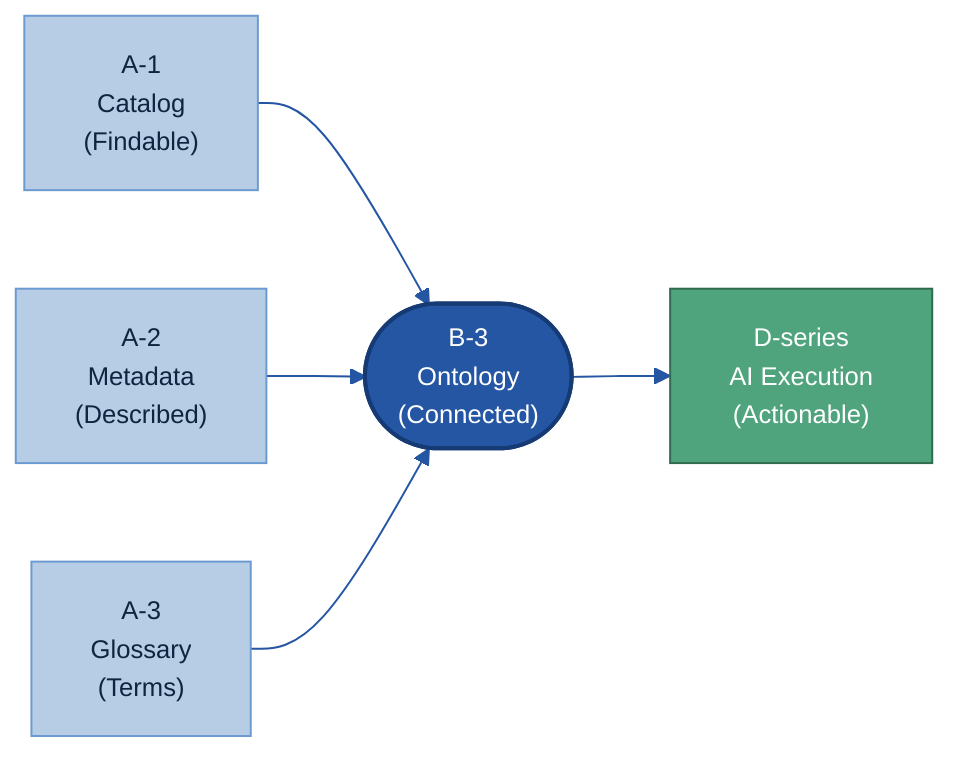
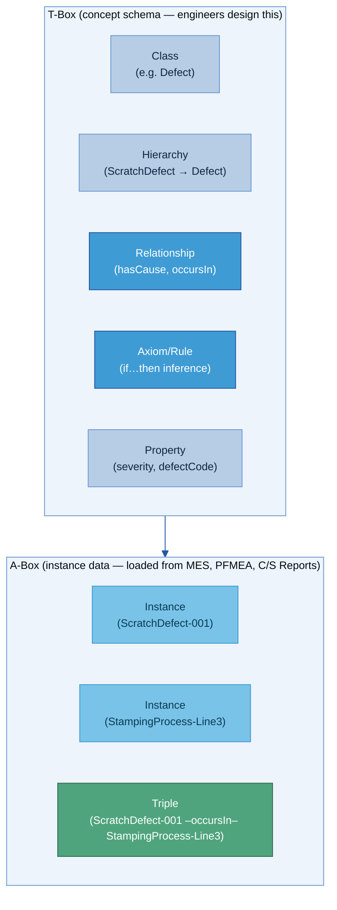
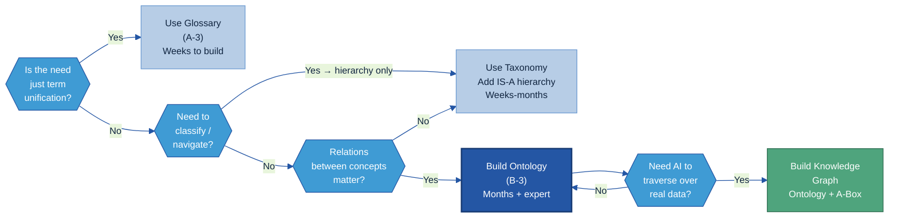
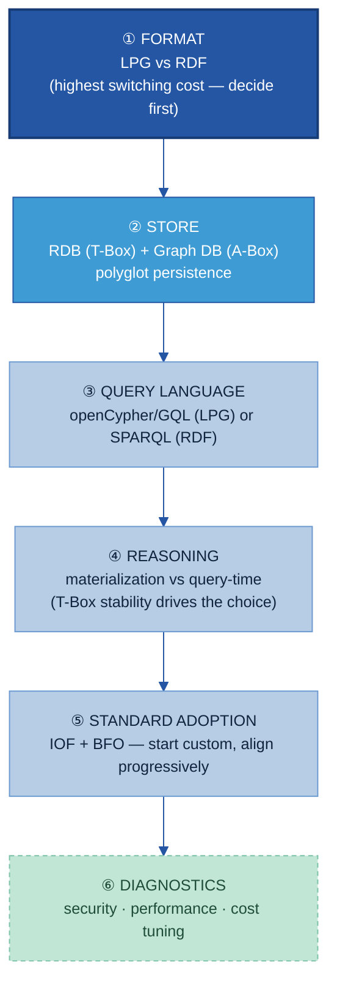
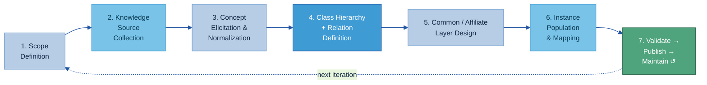
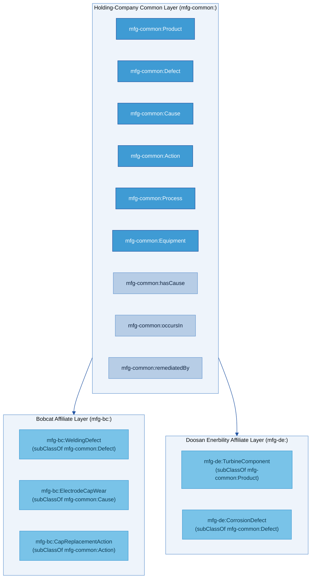
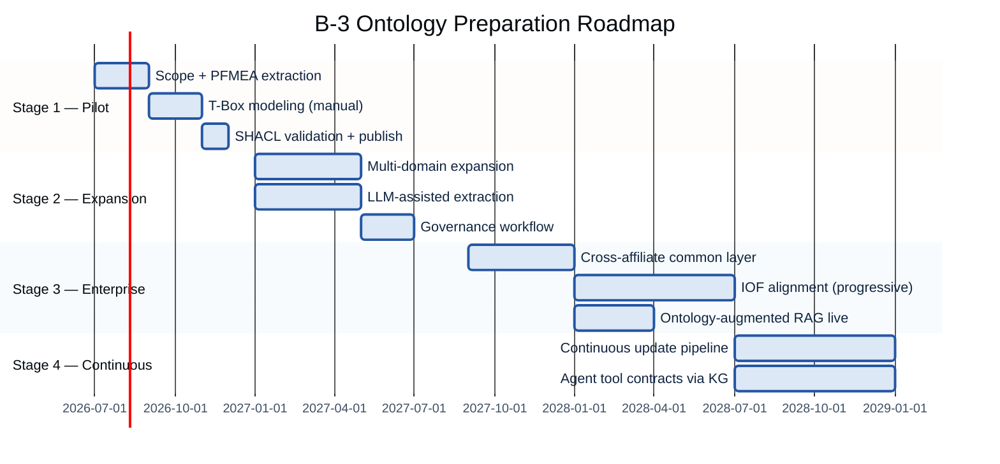

# B-3. Ontology (온톨로지) Manual

> An ontology is a formal knowledge structure that explicitly defines the relationships, hierarchy, and causal connections among business concepts — a knowledge map that lets AI follow the path "why did this defect occur and how should it be fixed," not just find similar text.

## Contents

1. [Overview](#1-overview)
2. [Why it is needed — what breaks without it](#2-why)
3. [What it is — the 6-component structure](#3-what)
4. [When to build one — adoption judgement](#4-when)
5. [Example scenario: Doosan Bobcat welding quality](#5-example)
6. [Architecture design and selection methodology](#6-architecture)
7. [How to build the ontology](#7-build)
8. [Operations and AI utilization](#8-operations)
9. [Boundaries, KPI, and roadmap](#9-kpi-roadmap)
- [Appendix](#appendix) · [References](#references) · [Change log](#change-log)

---

> [!question] **6 Key Questions this guide answers**
> *(No internal KQ codes appear in titles or body. The questions are listed here in plain language so the reader always knows what this guide is for.)*
>
> | # | Key question | One-line answer | Where |
> |---|---|---|---|
> | 1 | When should you build an ontology? | Build when knowledge is scattered across multiple systems AND cause-effect matters — otherwise use a simpler glossary or taxonomy | [§4 When to build](#4-when) |
> | 2 | Which concepts and relations to model? | 7 core manufacturing classes (Product, Process, Defect, Equipment, Cause, Action, Inspection-item) + 7 relations, defined in a Relation Definition Document | [§3.2 The manufacturing entity set](#32-manufacturing-entity-set) |
> | 3 | How to split holding-company common vs affiliate-specific knowledge? | Common upper concepts + standard relations at holding level; affiliates extend with subclasses in separate namespaces | [§7.3 Common vs affiliate structure](#73-common-vs-affiliate-structure) |
> | 4 | Which data and documents to connect the ontology to? | PFMEA, SOP, C/S Reports, Glossary (A-3), metadata fields (A-2), catalog assets (A-1) — mapped in the Concept–Data–Document Mapping table | [§7.2 Data and document mapping](#72-data-and-document-mapping) |
> | 5 | How to apply the ontology to AI usage? | Relation-based retrieval: ontology-augmented RAG for concept expansion, agent multi-hop root-cause traversal, similar-case and action recommendation | [§8.2 AI utilization](#82-ai-utilization) |
> | 6 | How to manage ontology changes? | Classify every change (editorial/additive/breaking), run SHACL + regression query tests, version with semver, route breaking changes through Governance Board | [§8.1 Change management](#81-change-management) |

> **Related guides:** [A-1 Data Catalog](../A-1%20데이터%20카탈로그/A-1%20데이터%20카탈로그.md) · [A-2 Metadata](../A-2%20메타데이터/A-2%20메타데이터.md) · [A-3 Glossary](../A-3%20용어사전/A-3%20용어사전.md) · [B-2 Training Labels](../B-2%20데이터%20해설·주석/B-2%20데이터%20해설·주석.md) · D-series guides (작성 예정)

---

## 1. Overview

<a id="overview"></a>

👉 **An ontology is not a glossary and not a database — it is the "rulebook of connections" that tells AI how concepts relate, so it can reason rather than just retrieve.**

### 1.1 Definition

An ontology (온톨로지) is a **formal, explicit specification of a shared conceptualization of a domain** — a structured knowledge model that defines what concepts exist in a domain, what properties they have, and how they relate to each other, in a machine-readable and machine-reasoned form. [[W3C OWL2 Primer](https://www.w3.org/TR/owl2-primer/)]

In plain terms: think of it as a "concept map with rules." It not only lists terms but says explicitly how they connect, what constraints apply, and — from those rules — what new facts can be derived automatically.

🏭 **Manufacturing example:** A manufacturing ontology defines that a `Defect` *occurs-in* a `Process`, is *detected-by* an `Inspection-item`, and has a *Cause* that can be *remediated-by* an `Action`. With those relations declared, an AI can automatically traverse the path Defect → Cause → Action to suggest a fix — without being individually programmed for each defect type.

### 1.2 Scope — what this guide covers and does not cover

**B-3 covers:**
- Modeling and preparing the ontology as a **knowledge data asset** (the T-Box: classes, relations, hierarchies, rules)
- Populating instance data (A-Box) from manufacturing documents
- Architecture decisions for storing and querying the ontology
- Operating and versioning the ontology over time
- How the prepared ontology is consumed by AI retrieval (GraphRAG, agent root-cause)

**B-3 does NOT cover:**
- Building the GraphRAG application or AI agent itself → D-series guides
- Defining single-term meanings → [A-3 Glossary](../A-3%20용어사전/A-3%20용어사전.md)
- Describing metadata fields of data assets → [A-2 Metadata](../A-2%20메타데이터/A-2%20메타데이터.md)
- Registering and locating data assets → [A-1 Data Catalog](../A-1%20데이터%20카탈로그/A-1%20데이터%20카탈로그.md)

### 1.3 Target organizations

The ontology preparation workstream needs three roles:
- **Business units** that own the domain knowledge (quality engineering, manufacturing engineering)
- **Data/IT function** that has ontology or graph modeling expertise
- **Governance committee** that approves changes to the shared common layer

Ontology work is appropriate once basic data infrastructure (catalog, metadata, glossary) is in place — it builds on top of those foundations.

### 1.4 Where ontology sits in the AI-Ready data system

The six AI-Ready data principles are A(Findable), B(Understandable), C(Trustworthy), D(Actionable), E(Sustainable), F(Governed). B-3 Ontology lives in the **B (Understandable)** pillar: it is the structural layer that makes data not just locatable (A-1 catalog) or described (A-2 metadata) but **semantically connected** — AI can understand context and connectivity, not just content.



The ontology takes terms from the Glossary, field descriptions from Metadata, and asset locations from the Catalog — then connects all of it into a traversable knowledge graph. D-series AI agents then execute reasoning over that prepared knowledge.

---

## 2. Why it is needed — what breaks without it

<a id="2-why"></a>

👉 **AI can retrieve text that mentions a concept. Without an ontology, it cannot traverse the connections between concepts — and root-cause analysis is all about traversing connections.**

### 2.1 The structural gap: data without explicit relations

Manufacturing data exists across many systems:
- **PFMEA worksheets** list known failure modes, causes, and recommended actions
- **SOPs** specify required process parameters and tolerances
- **MES records** contain actual parameter values at production time
- **Equipment logs** hold welding gun state, electrode cap wear, alarm history
- **C/S Reports** (Customer/Service 고객불만 보고서) document actual defect events and past resolutions

Each system uses its own vocabulary. "Weld defect" in MES may be "failure mode" in PFMEA and "quality nonconformance" in the C/S Report. Without an explicit relational layer connecting these, AI can only perform **keyword or vector similarity search** — it finds text chunks that *mention* a concept, not text that is causally or hierarchically *connected* to it.

**The failure chain:**

```
Data exists in PFMEA + SOP + MES + Equipment Logs + C/S Reports
                ↓
No explicit relation layer bridging these systems
                ↓
AI does keyword/vector similarity search only
                ↓
"Why did desoldering occur on Line 3?" →
  returns PFMEA text about desoldering generically
  cannot cross-reference Line 3's MES parameter history
  cannot trace equipment log showing electrode cap wear = HIGH
                ↓
Answer: generic ("check contact resistance") — no specificity, not actionable
```

[[Microsoft Research GraphRAG](https://www.microsoft.com/en-us/research/blog/graphrag-unlocking-llm-discovery-on-narrative-private-data/)]: "Baseline RAG struggles to connect the dots. This happens when answering a question requires traversing disparate pieces of information through their shared attributes."

[[SingleStore](https://www.singlestore.com/blog/rethinking-rag-how-graphrag-improves-multi-hop-reasoning-/)]: "Vector search retrieves chunks that are individually relevant, but it does not explicitly capture how pieces of information connect across chunks."

### 2.2 A concrete causal chain that vector RAG cannot traverse

**Scenario — welding line defect:** Surface desoldering detected at final inspection. Why did it occur?

The actual causal chain (from CN Patent 114943415A — a welding quality knowledge graph patent [[src-250]]):

> Plate surface has wrinkles → increased contact resistance at weld point → same current I produces more heat (formula E = I²RT) → nugget overheats → desoldering

This chain spans **five different data sources**: incoming QC (surface wrinkle measurement), MES sensor data (nugget temperature), engineering manual (the physics formula), equipment logs (contact resistance), inspection report (desoldering defect).

No single text chunk contains the full chain. The semantic distance between "desoldering" and "plate wrinkle" is near zero in a vector embedding — they use completely different vocabulary. Only explicit `causes` and `relatedParameter` relations in a knowledge graph can traverse this chain in one query.

### 2.3 What the ontology enables

Once the causal relations are formally declared in the ontology, an AI agent can:

| Question | Without ontology | With ontology |
|----------|-----------------|---------------|
| "What type is this defect?" | Full-text search | Hierarchy traversal: Desoldering → BondingFailure → WeldDefect |
| "What causes this?" | Keyword match in PFMEA | Traverse `hasCause` relation directly to ContactResistanceAnomaly |
| "Which process parameter is involved?" | Manual analyst work | Traverse `relatedParameter` → SurfaceRoughness on incoming plate |
| "What is the corrective action?" | Search C/S Reports | Traverse `hasCorrectiveAction` → CapReplacementSOP #WELD-047 |
| "Why is Line 3 worse than Lines 1–2?" | Not answerable | Traverse `hasEquipment` → WeldingGun_G07 `currentState` → ElectrodeCapWear=HIGH |

**Peer-reviewed evidence:** A 2025 arXiv preprint on FMEA fault cause identification in manufacturing (arXiv [2510.15428](https://arxiv.org/abs/2510.15428), submitted October 2025) found F1@20 improved from 0.267 (standard RAG baseline) to 0.523 (ontology-guided knowledge graph) — approximately a 2× improvement for relational, multi-hop questions. These are the strongest independently verified numbers for this claim available at time of writing; confirm with the final published version before citing in a formal context.

A 2024 comparative study on retrieval accuracy (arXiv [2511.05991](https://arxiv.org/html/2511.05991v1)) found that ontology KG + text chunks achieved 90% correct answers vs. 60% for vector RAG — a +30 percentage-point improvement. *Note: small evaluation set (n=20); treat as directional, not a guaranteed enterprise benchmark. Run a domain-specific PoC to measure your own baseline.*

> ▸ **Backup:** [Backup 2-1] Additional accuracy benchmarks and explainability evidence

---

## 3. What it is — the 6-component structure

<a id="3-what"></a>

<a id="kq2"></a>

> ❓ **Key question 2 — "Which concepts and relations to model?"** is answered in §3.1 (the 6 components, including Relationship) and §3.2 (the manufacturing entity set with 7 classes and 7 relations).

👉 **Every ontology is built from 6 types of building blocks. In manufacturing, 7 core classes and 7 core relations form the essential T-Box skeleton.**

### 3.1 The 6 components

The canonical model for B-3 uses **6 components**. These align with W3C OWL's core constructs, reorganized for clear communication with manufacturing practitioners.

| # | Component | One-line definition | Manufacturing example |
|---|-----------|-------------------|----------------------|
| 1 | **Class (클래스)** | A named category grouping entities that share characteristics | Defect, Equipment, Process, Product |
| 2 | **Instance (인스턴스)** | A specific individual belonging to one or more classes | "ScratchDefect-20240305-L3" is an instance of Defect |
| 3 | **Property (속성)** | An attribute of a class or instance — a data value | severity=High, defectCode="WELD-042" |
| 4 | **Relationship (관계)** | A directed link between two classes expressing how they connect | `causes`, `occurs-in`, `remediated-by` |
| 5 | **Hierarchy (계층)** | An is-a (subclass) tree organizing classes from general to specific | ScratchDefect → SurfaceDefect → Defect |
| 6 | **Axiom / Rule (규칙/공리)** | A formal constraint or inference rule that restricts or derives knowledge | "If Defect occurs-in Process AND Process uses Equipment AND Equipment has-state Degraded, THEN Defect has-cause Equipment" |

The foundational unit of expression is the **Triple (트리플)** — the atom of ontology knowledge: `Subject – Predicate – Object`. Example: `ScratchDefect-001 – occurs-in – StampingProcess-Line3`.

**T-Box vs. A-Box (terminology used throughout this guide):**
- **T-Box** (Terminological Box, 개념 스키마) — the *schema* layer: all class definitions, relations, hierarchies, and axioms. This is what data engineers design. Think "database DDL."
- **A-Box** (Assertional Box, 인스턴스 데이터) — the *instance* layer: all specific facts loaded from real records (MES events, C/S Reports, inspection results). Think "database rows."



**How inference works:** When the T-Box declares `ScratchDefect rdfs:subClassOf SurfaceDefect rdfs:subClassOf Defect`, any instance of ScratchDefect is *automatically inferred* to also be a SurfaceDefect and a Defect — without manually asserting it. AI actions defined for all Defects apply to ScratchDefect without re-programming. This is the power of the Hierarchy + Axiom components.

### 3.2 Manufacturing entity set

<a id="32-manufacturing-entity-set"></a>

The B-3 canonical model uses **7 core classes** and **7 core relations** as the manufacturing T-Box skeleton. These map directly to PFMEA structure, SOP content, and C/S Report fields.

**7 core classes:**

`Product` | `Process` | `Defect` | `Equipment` | `Cause` | `Action` | `Inspection-item`

🏭 **Doosan example values:**
- Product: "BobcatArm_Model-T470" (기계팔 제품)
- Process: "StampingProcess-Line3" (프레스 공정)
- Defect: "ScratchDefect" (표면 스크래치), "Desoldering" (용접 박리)
- Equipment: "WeldingGun_G07" (용접 건), "DieEquipment-07" (금형 설비)
- Cause: "ElectrodeCapWear" (전극 캡 마모), "DieWear" (금형 마모)
- Action: "CapReplacementAction" (전극 캡 교체), "DieReplacementAction" (금형 교체)
- Inspection-item: "NuggetDiameter" (너깃 직경 검사), "SurfaceRoughnessCheck" (표면 거칠기)

**7 core relations:**

| Relation | From → To | Plain meaning |
|----------|-----------|---------------|
| `causes` | Cause → Defect | A cause leads to this defect |
| `detected-by` | Defect → Inspection-item | The defect is found via this inspection method |
| `occurs-in` | Defect → Process | The defect happens in this process step |
| `remediated-by` | Defect → Action | The defect is fixed by this action |
| `has-part` | Equipment → Equipment (or Process) | Part-of decomposition |
| `measured-by` | Product/Process → Inspection-item | Quality is measured by this item |
| `affects` | Cause/Defect → Product | The impact travels to this product |

🏭 **Reading the graph:** `ElectrodeCapWear –causes→ Desoldering –occurs-in→ WeldingProcess-Line3 –measured-by→ NuggetDiameter`. This four-node, three-hop path is what allows AI to answer "why did desoldering occur and where was it detected?" in a single traversal query.

### 3.3 Ontology vs. taxonomy vs. glossary — the boundary

These are not competing alternatives. They form a **spectrum of increasing richness and cost**:

| Structure | What it adds | Does NOT have | B-3 scope? |
|-----------|-------------|---------------|-----------|
| **Glossary (A-3)** | Term definitions | No relations between concepts | No — single-term meaning |
| **Taxonomy** | IS-A hierarchy (parent→child) | No lateral relations, no inference rules | Subset of ontology |
| **Ontology (B-3)** | Typed lateral relations + axioms + inference | Instance data | Yes — the knowledge schema |
| **Knowledge Graph** | Ontology T-Box + populated A-Box instances | — | Yes — ontology applied to real data |

> ▸ **Backup:** [Backup 3-1] OWL sublanguages (Lite/DL/Full) and SKOS vs OWL comparison

---

## 4. When to build one — adoption judgement

<a id="4-when"></a>

<a id="kq1"></a>

> ❓ **Key question 1 — "When should you build an ontology?"** is answered in this section. The core decision: build when knowledge is scattered AND relations matter. Otherwise, use the simpler tool.

👉 **An ontology is one option on a spectrum. The trigger for building one is when cause-effect relations between concepts are as important as the concepts themselves.**

### 4.1 The decision spectrum: glossary → taxonomy → ontology → knowledge graph



### 4.2 Build an ontology — three concrete triggers

**Trigger A: Knowledge is scattered AND must be connected**

PFMEA, SOP, MES, and equipment logs each describe the same production process in their own vocabulary and schema. If a question requires pulling information from more than one of these — and the systems use different terms for the same concept — a glossary helps with terms but cannot connect the knowledge. An ontology provides the shared structure.

*Example: "How does the PFMEA failure mode 'surface crack' relate to the MES parameter 'stamping pressure deviation' and the C/S Report corrective action 'die replacement'?" — answerable only with an ontology linking these three systems.*

**Trigger B: Cause-effect relations matter (root cause, recommendation, prediction)**

If the question is "why did X happen?" or "what should we do about X?" — traversing causal relations is required. Causal relations cannot be inferred from semantic similarity; they must be explicitly declared.

*Example: Tracing a welding defect back through process parameters to equipment condition to maintenance history — every arrow in that chain is a declared ontology relation.*

**Trigger C: An AI agent must analyze or recommend across multiple data sources**

Agents confined to one system cannot reason across disconnected data. Without a relational layer, an agent cannot cross-reference MES data against PFMEA knowledge against equipment maintenance records. [[Industrial AI Ordo](https://coformation.medium.com/knowledge-graphs-in-manufacturing-20-practical-questions-b86c863d5c4c)]: "Industrial AI exposes a hard constraint: agents cannot reason across disconnected systems."

### 4.3 Do NOT build an ontology — when simpler is right

[[SGKG Knowledge Organisation](https://sgkg.org/blog/2026-03-21-ontology-vs-taxonomy-knowledge-organisation/)]: "Organizations frequently build ontologies when taxonomies would suffice, creating unnecessary complexity that hinders adoption."

**Use a Glossary (A-3) instead when:**
- The need is purely term unification ("field A in MES = field B in PFMEA")
- No relational queries are planned — users just look up what a term means
- The maintenance must be done by non-specialists without ontology tooling

**Use a Taxonomy instead when:**
- The need is hierarchical classification only: "What types of surface defects exist?"
- A tree structure covers the requirement; no cross-category relations needed
- Build time must be weeks, not months

**Use a relational database instead when:**
- Relationships are fixed, tabular, and well-understood in advance
- Schema does not evolve dynamically; no need to infer unstated relationships

**Crisp decision table:**

| Situation | Right tool |
|-----------|-----------|
| Align "welding fault code" (MES) with "failure mode code" (PFMEA) | Glossary / A-3 |
| Answer "What defect types exist?" consistently across plants | Taxonomy |
| Answer "What process parameters are associated with desoldering?" | Ontology (`associatedParameter` relation) |
| Trace desoldering to root cause across MES + PFMEA + equipment log | Knowledge graph + ontology |
| AI agent recommends corrective action from defect + context | Knowledge graph + ontology + agent |

> ▸ **Backup:** [Backup 4-1] When GraphRAG is a prerequisite and its checklist

---

## 5. Example scenario: Doosan Bobcat welding quality root-cause

<a id="5-example"></a>

👉 **"Why is the desoldering rate on Line 3 higher than Lines 1 and 2 this month?" — here is what changes when an ontology is in place.**

**Context:** Bobcat hydraulic arm assembly plant. Welding line produces 800–1,200 assemblies per shift. Quality engineer notices that Line 3 desoldering rate has risen to 3.2% this month (Lines 1 and 2: 0.8%). They query the AI agent.

---

**Without the ontology — what actually happens:**

The AI does vector similarity search across three disconnected data stores:
- PFMEA file: retrieves the "desoldering" entry → generic causes listed ("check contact resistance, electrode condition")
- MES database: no shared schema with PFMEA → agent cannot cross-reference Line 3 parameter logs
- Equipment log: separate system; no concept bridge to "desoldering" → not retrieved at all

**Agent answer:** "Desoldering can be caused by insufficient contact resistance or electrode cap wear. Check SOP-WELD-047 §3.2." (Generic; identical response regardless of which line has the problem.)

---

**With the ontology + knowledge graph — the same query:**

The ontology T-Box has declared:
1. `Desoldering` IS-A `BondingFailure` IS-A `WeldDefect` (Hierarchy)
2. `ElectrodeCapWear –causes→ IncreasedContactResistance –causes→ ExcessiveNuggetHeat –causes→ Desoldering` (4-hop causal chain, declared Relationships)
3. `WeldingGun –hasMaintenanceCycle→ CapReplacementInterval` (Property-Relationship link)
4. `MES:WeldingLine –hasEquipment→ WeldingGun` (cross-system bridge declared in ontology)

The AI traverses (openCypher query on LPG graph DB):
```cypher
MATCH path = (:WeldingLine {id:'Line3'})-[:HAS_EQUIPMENT]->(gun:WeldingGun)
             -[:CURRENT_STATE]->(state:EquipmentState)
             -[:CAUSES*1..4]->(d:WeldDefect {type:'Desoldering'})
RETURN gun.id, state.name, state.value, length(path) AS hops
```

**Result retrieved:**
- WeldingGun_G07 on Line 3: `ElectrodeCapWear = HIGH` (38 days since last replacement; threshold 30 days)
- Lines 1 and 2: WeldingGun_G03, G05 → `ElectrodeCapWear = NORMAL` (replaced 12 and 19 days ago)

**Agent answer:** "Line 3's elevated desoldering rate (3.2% vs. 0.8% baseline) is associated with high electrode cap wear on Gun G07. Cap was last replaced 38 days ago; replacement threshold is 30 days. Recommended action: immediate cap replacement — see SOP-WELD-047 §3.2. Lines 1 and 2 are within maintenance window."

---

**What the ontology specifically enabled:**

| Step | What ontology declared | What AI could do |
|------|----------------------|-----------------|
| Connect MES Line 3 to WeldingGun_G07 | `WeldingLine –hasEquipment→ WeldingGun` | Cross-system join (no SQL join — graph traversal) |
| Link cap wear to desoldering | 4-hop `causes` chain in T-Box | Traverse causal path in one query |
| Compare Line 3 vs Lines 1–2 | Shared `WeldingGun` class across all lines | Uniform comparison across lines |
| Retrieve SOP action | `WeldDefect –hasCorrectiveAction→ SOP_Action` | Directly retrieve action with source link |

**Example PoC target (set your own in actual PoC):** Reduce average manual root-cause analysis time from ~4 hours to ~20 minutes for Tier-1 defect types. Measure in PoC against current analyst baseline. [fill from as-is]

> Note: the architecture that made this traversal efficient (LPG over RDB+Graph DB polyglot, Cypher query) is explained in §6. The build steps that created this T-Box are in §7.

---

## 6. Architecture design and selection methodology

<a id="6-architecture"></a>

👉 **Architecture decisions have a strict order: format first (LPG vs RDF), then store, then query language, then reasoning strategy. Changing format later is the highest-cost reversal.**

The architecture decisions in this section determine how the ontology data asset is stored, queried, and reasoned over. They are made **in order** because each constrains the next.



### 6.1 Format decision: LPG vs RDF

**LPG (Labeled Property Graph, 레이블 속성 그래프):** Nodes and edges both carry key-value properties directly. Used by [Neo4j](https://neo4j.com), [Amazon Neptune](https://aws.amazon.com/neptune/), [Memgraph](https://memgraph.com). Fast multi-hop traversal; schema-optional; Cypher query language.

**RDF (Resource Description Framework, 자원 기술 프레임워크):** All facts stored as subject–predicate–object triples. W3C standard. Full OWL reasoning; strong external interoperability (Linked Data, IOF); [SPARQL](https://www.w3.org/TR/sparql11-query/) query language.

**The decisive factor for manufacturing root-cause paths:**

Manufacturing causal chains regularly span 6 or more hops (Defect → Cause → Process → Equipment → Supplier → Material → ...). In RDF, every hop requires a join across the triple table — this **triple join explosion** makes 6+ hop queries slow. LPG stores relationships as first-class edges; traversal follows pointers directly with no join overhead. [[Memgraph LPG vs RDF](https://memgraph.com/docs/data-modeling/graph-data-model/lpg-vs-rdf)]

**Decision rule for this project: LPG** (for manufacturing root-cause reasoning with long causal paths).

**When to choose RDF instead:**
- External standard interoperability is primary (IOF alignment, supplier data sharing, regulatory compliance with W3C standards)
- OWL-based logical inference (not just path traversal) is the core requirement
- Cross-domain semantic integration with external partners dominates the use case

*Neither choice is universally "better." The decision is genuinely conditional on use case.* [[Enterprise Knowledge: RDF & LPG](https://enterprise-knowledge.com/cutting-through-the-noise-an-introduction-to-rdf-lpg-graphs/)] [[Fluree: RDF vs LPG](https://flur.ee/fluree-blog/rdf-versus-lpg/)]

**LPG portability concern addressed:** ISO/IEC 39075 GQL (Graph Query Language) was published April 12, 2024, as an international standard. openCypher implementations are on a migration path to GQL compliance. Cypher written today has a clear standardization trajectory. [[TigerGraph GQL](https://www.tigergraph.com/blog/the-rise-of-gql-a-new-iso-standard-in-graph-query-language/)]

### 6.2 Store: RDB + Graph DB polyglot

The polyglot persistence (다중 저장소) pattern splits data by its access pattern:

| Layer | Store type | What goes here | Why |
|-------|-----------|---------------|-----|
| **T-Box (schema)** | RDB (PostgreSQL or equivalent) | Class definitions, relation definitions, property constraints, namespace registry, version metadata | Small, stable, tabular; ACID transactions for governance-controlled changes |
| **A-Box (instances)** | Graph DB (Neo4j / Neptune) | Individual cases, triples, path traversal data | Grows continuously; graph traversal is dominant access pattern |
| **Source transactional data** | RDB (ERP, MES, QMS) | C/S Report records, PFMEA tables, inspection results | ACID guarantees; existing system integration |

When a new C/S Report is filed in the RDB, an ETL pipeline reads it, maps field values to ontology class instances (using the Concept–Data–Document Mapping Table from §7.2), and writes property-graph records to the graph DB. The T-Box schema in the RDB constrains valid classes and relations.

### 6.3 Query language

| Store | Query language | Standard |
|-------|---------------|---------|
| LPG (Neo4j, Neptune openCypher mode) | openCypher → ISO GQL | ISO/IEC 39075:2024 |
| RDF (Stardog, Ontotext GraphDB) | SPARQL 1.1 | W3C Recommendation |

🏭 **Defect path query in openCypher (LPG):**
```cypher
MATCH path = (c:Case {product:'BobcatArm'})-[:HAS_DEFECT]->(d:Defect)
             -[:OFTEN_CAUSED_BY*1..4]->(root:Cause)
WHERE c.date > '2024-01-01'
RETURN d.name, root.name, length(path) AS hops, count(*) AS frequency
ORDER BY frequency DESC LIMIT 10
```

### 6.4 Reasoning and materialization

**T-Box reasoning** derives new facts from declared axioms. Two strategies:

| Strategy | Mechanism | Best when |
|----------|-----------|-----------|
| **Materialization (pre-compute)** | Run reasoner; write all inferred triples to store | T-Box is stable; queries are frequent; query speed is priority |
| **Query-time inference** | Apply axioms per query execution | T-Box is evolving rapidly; always-current data is required |

For manufacturing ontology: T-Box (class hierarchy, causal relation schema) is designed once and changes infrequently → **materialize** for query performance. When the T-Box changes (e.g., new defect subclass added), run **incremental re-materialization** on the affected subgraph only.

[[Ontotext GraphDB](https://graphdb.ontotext.com)] uses forward-chaining materialization (faster queries on stable T-Box). [[Stardog](https://docs.stardog.com)] uses query-time reasoning (more flexible when T-Box evolves). *Confirm current version features via vendor documentation before selecting.*

### 6.5 IOF/BFO standard adoption

The **[Industrial Ontologies Foundry (IOF)](https://www.industrialontologies.org)** is an international initiative (NIST and industry partners) providing a suite of interoperable manufacturing ontologies built on **[BFO (Basic Formal Ontology)](https://basic-formal-ontology.org)**. IOF Core provides manufacturing-common concepts: processes, materials, equipment, measurements, roles. Its `Process`, `Equipment`, `MaterialArtifact` classes map directly to the B-3 canonical 7-entity set.

**Adopt progressively — do not start with IOF:**

| Phase | IOF adoption action |
|-------|-------------------|
| Phase 1 (initial build) | Build custom ontology from PFMEA/SOP knowledge; check IOF for reference vocabulary but do not force-fit |
| Phase 2 (stabilization) | Align high-frequency terms to IOF Core after internal ontology is validated |
| Phase 3 (external integration) | Formalize IOF alignment when sharing data with suppliers, regulators, or partner systems |

> ▸ **Backup:** [Backup 6-1] Full Graph DB comparison table (Neo4j / Neptune / TigerGraph / Ontotext GraphDB / Stardog / Memgraph / Jena)

---

## 7. How to build the ontology

<a id="7-build"></a>

<a id="kq4"></a>

👉 **Ontology build follows a 7-stage process. The richest source for manufacturing concepts is the PFMEA — its columns map almost directly to the ontology's Defect, Cause, and Action classes.**

### 7.1 Build methodology — 7 stages

The following stage model synthesizes three recognized methodologies — METHONTOLOGY's lifecycle discipline [[LibreTexts Ontology Methodologies](https://eng.libretexts.org/Bookshelves/Computer_Science/Programming_and_Computation_Fundamentals/An_Introduction_to_Ontology_Engineering_(Keet)/06:_Methods_and_Methodologies/6.01:_Methodologies_for_Ontology_Development)], NeOn's reuse strategy [[NeOn Methodology](https://oeg.fi.upm.es/index.php/en/completedprojects/8-neon/index.html)], and Stanford Ontology Development 101 [[Noy & McGuinness](https://protege.stanford.edu/publications/ontology_development/ontology101.pdf)] — into a single sequence for manufacturing data preparation.



**Stage 1 — Scope definition:** What questions must this ontology answer? Define the domain (e.g., "welding defects on Line 3 product family"), target users, and **competency questions (CQs)** — the specific questions the ontology must be able to answer. CQs become the acceptance test for Stage 7.

🏭 Example CQs for a Bobcat welding quality ontology:
- "What are the top causes of desoldering defects on Line 3 this quarter?"
- "Which process parameters are associated with ScratchDefect occurrences?"
- "What corrective actions have been applied to BondingFailure defects in the past 12 months?"

**Stage 2 — Knowledge source collection:** Gather PFMEA, SOP, C/S Reports, inspection records, and the existing Glossary (A-3). Identify which source contains which type of knowledge (causes vs. actions vs. standards).

**Stage 3 — Concept elicitation and normalization:** Domain experts + knowledge engineers work together (see §7.1.1 below). Resolve synonyms and cross-department term conflicts; link to Glossary A-3 for canonical term forms.

**Stage 4 — Class hierarchy + relation definition:** Define the class IS-A tree; write the **Relation Definition Document** (name, domain, range, inverse, cardinality, transitivity — see §7.2 Backup for template). This is the T-Box specification.

**Stage 5 — Common/affiliate layer design:** See §7.3 below.

**Stage 6 — Instance population and data mapping:** Map ontology classes to actual data fields in MES/ERP/QMS tables (the Concept–Data–Document Mapping table). Load instance triples from C/S Reports, PFMEA, inspection data into the graph DB.

**Stage 7 — Validate → Publish → Maintain:** Run SHACL constraint checks and OWL reasoner consistency validation. Test CQ answerability (do the pilot competency questions return meaningful graph query results?). Publish with version label. Enter the change management cycle (§8.1). Iterate for the next domain or feature.

**Start small:** All recognized methodologies warn against a comprehensive enterprise ontology from the beginning. Enter with **one product line + one defect domain** (e.g., "welding defects on Line 3"). 50–80 concepts and 10–15 relation types are enough for an initial AI retrieval demonstration. Expand iteratively once value is visible.

#### 7.1.1 Extracting concepts from PFMEA — the direct mapping

The PFMEA (Process Failure Mode and Effects Analysis, 잠재적 고장 유형 및 영향 분석) is the richest single source for manufacturing ontology concepts. Its column structure maps almost directly to the B-3 canonical model:

| PFMEA column | Ontology element |
|-------------|-----------------|
| Failure Mode | Defect subclass (e.g., `SurfaceCrack`) |
| Potential Effect | Effect (linked via `has-effect`) |
| Potential Cause | Cause subclass (e.g., `HeatTreatmentDeviation`) |
| Current Control | Control (linked via `mitigates`) |
| Recommended Action | Action subclass (e.g., `HeatTreatmentReset`) |
| Severity (S) / Occurrence (O) / Detection (D) | Integer data properties on Defect class |

🏭 **Worked PFMEA extraction example (Bobcat welding line):**

```
PFMEA row: 
  Process step: Welding – Cap formation
  Failure Mode: Desoldering (용접 박리)
  Potential Effect: Bond strength below spec → assembly rejection
  Potential Cause: Electrode cap wear (전극 캡 마모) > 30 days
  Current Control: Visual inspection every 4 hours
  Recommended Action: Replace electrode cap; check contact resistance
  Severity: 8 / Occurrence: 3 / Detection: 5

→ Creates in ontology:
  Class: Desoldering (subClassOf BondingFailure subClassOf WeldDefect)
  Class: ElectrodeCapWear (subClassOf EquipmentDegradation subClassOf Cause)
  Class: CapReplacementAction (subClassOf MaintenanceAction subClassOf Action)
  Relation: ElectrodeCapWear –causes→ Desoldering
  Relation: Desoldering –remediated-by→ CapReplacementAction
  Data property: Desoldering.severity = 8, .occurrence = 3, .detection = 5
```

[[ResearchGate PFMEA Ontology](https://www.researchgate.net/publication/258436781_A_System_for_Distributed_Sharing_and_Reuse_of_Design_and_Manufacturing_Knowledge_in_the_PFMEA_Domain_Using_a_Description_Logics-based_Ontology)]: PFMEA worksheets already organize failure modes, causes, effects, and controls in tabular form — the knowledge engineer's job is to convert the table into a formal class hierarchy and relation definition document.

**LLM assistance in concept extraction:** LLMs can speed up Stage 3 by suggesting candidate concepts from PFMEA/SOP text. However:
- LLMs cannot determine correct class hierarchy (requires domain judgment)
- LLMs cannot resolve cross-document terminology conflicts (requires SME authority)
- Every LLM-extracted concept requires SME validation before formalization

A hybrid pipeline achieves ~90% accuracy on domain-specific queries when document text chunks accompany the ontology structure. Ontology structure alone achieves only 15–20%. [[arXiv 2511.05991](https://arxiv.org/html/2511.05991v1)]. Human SME validation is non-negotiable.

### 7.2 Data and document mapping

<a id="72-data-and-document-mapping"></a>

> ❓ **Key question 4 — "Which data and documents to connect the ontology to?"** is answered here.

Every ontology concept must trace back to an actual data source. The **Concept–Data–Document Mapping table** is the integration specification that enables the ETL pipeline to auto-populate the A-Box.

🏭 **Bobcat welding quality ontology — sample Concept–Data–Document Mapping:**

| Ontology class | Glossary term (A-3) | Metadata field (A-2) | Catalog asset (A-1) | Source document | Example instance count |
|----------------|--------------------|--------------------|-------------------|----------------|----------------------|
| `Defect` | 결함 (Defect) | `defect_type` | Inspection Records | C/S Report, PFMEA | ~2,400 |
| `Desoldering` | 용접 박리 (Desoldering) | `weld_defect_code='SOLD'` | Welding QC Records | C/S Report 2022–2024 | ~310 |
| `Cause` | 원인 (Cause) | `cause_code` | PFMEA Table | PFMEA, 8D Reports | ~180 distinct |
| `ElectrodeCapWear` | 전극 캡 마모 | `cap_wear_flag` | Equipment Maintenance Log | PFMEA #W-023, Equipment log | ~95 |
| `Action` | 조치 (Corrective Action) | `action_code` | Action Registry | 8D Reports, C/S Reports | ~95 distinct |
| `WeldingProcess` | 용접 공정 | `process_step_id` | Process Catalog | SOP-WELD-047 | ~120 |
| `NuggetDiameter` | 너깃 직경 | `nugget_diameter_mm` | QC Measurement Log | Inspection records | per-weld measurement |

**Purpose of this table:** When a new C/S Report is filed, the ETL pipeline reads `defect_type` and `cause_code` from the structured report, maps them to the ontology classes via this table, and creates instance triples in the graph DB automatically — no manual ontology editing required for new data records.

### 7.3 Common vs. affiliate structure

<a id="73-common-vs-affiliate-structure"></a>

<a id="kq3"></a>

> ❓ **Key question 3 — "How to split holding-company common vs affiliate-specific knowledge?"** is answered here.

A holding company with multiple manufacturing affiliates (Bobcat, Doosan Enerbility, Doosan Robotics, etc.) needs a **two-layer ontology structure**:



**Rule for what belongs where:**
- **Common:** Any concept or relation that appears in ≥2 affiliates with the same meaning
- **Affiliate:** Any concept specific to one business unit's domain, product type, or process
- **Contested** (appears in multiple affiliates with slightly different meanings): Hold in common as a superclass; affiliate-specific subclasses handle differences

**Governance:** Common layer changes require **Governance Board approval**. Affiliate layer changes require **Affiliate Domain Steward approval** only. This separation prevents one affiliate's changes from breaking another's queries.

> ▸ **Backup:** [Backup 7-1] Namespace mechanics (LPG pattern + RDF/Turtle `owl:imports` pattern); NeOn Methodology scenario mapping for holding-company structures

---

## 8. Operations and AI utilization

<a id="8-operations"></a>

👉 **Operations = keeping the ontology accurate over time. AI utilization = the D-series applications that consume the prepared knowledge. This section covers both, and ends at the data-preparation boundary.**

### 8.1 Change management

<a id="81-change-management"></a>

<a id="kq6"></a>

> ❓ **Key question 6 — "How to manage ontology changes?"** is answered here.

Every ontology change must be classified before approval:

| Change type | Examples | Risk to AI reasoning | Approval |
|-------------|---------|---------------------|---------|
| **Editorial** | Label correction, synonym added, definition rewording | None — AI behavior unchanged | Domain Steward alone |
| **Additive** | New subclass, new relation type, new data property | Low — new concepts available; existing queries unaffected | Steward + Semantic Architect review |
| **Breaking** | Class renamed or deleted, relation semantics redefined, hierarchy restructured | High — existing queries return different results; materialized inferences invalidated | Governance Board approval + impact analysis + migration plan |

**Principle: additive before breaking.** When possible, add a new concept instead of modifying an existing one, and deprecate the old concept with a pointer to the new one. [[Galaxy Ontology Operating Model](https://www.getgalaxy.io/articles/ontology-management-semantic-modeling-operating-model-enterprise-context)]

**Semantic versioning** format `X.Y.Z`:
- X (Major): breaking changes — deletions, hierarchy restructure, relation semantic change
- Y (Minor): additive — new classes, relations, properties
- Z (Patch): editorial — label corrections, descriptions, synonyms

**Deprecation protocol:** Do NOT delete — mark with `deprecated = true`, add pointer to replacement concept, keep until next Major version release. This protects downstream consumers (AI retrieval pipelines, dashboards) from silent failures.

**Pre-publish impact checklist (before any change goes live):**
1. Run SHACL validation suite — zero critical violations?
2. Run OWL reasoner consistency check — no unsatisfiable classes?
3. Execute regression query set (top 20 AI queries) — results unchanged for non-breaking changes?
4. For breaking changes: identify all downstream systems that reference changed concepts; test with production data sample
5. Affiliated ontologies (child namespaces) — no conflicts introduced?
6. AI teams notified of change (especially if breaking)?
7. Changelog updated and deprecated concepts marked?

**Governance roles:**

| Role | Responsibility |
|------|---------------|
| **Domain Steward** | Proposes new concepts; validates for their domain; approves editorial changes; identifies downstream data consumers |
| **Semantic Architect / Ontology Engineer** | Models concepts formally; reviews additive changes; maintains relation definition documents; resolves cross-affiliate conflicts |
| **Governance Board** | Owns common layer; approves breaking changes; sets naming conventions and namespace policy |
| **Platform / Data Team** | Publishes approved versions; runs SHACL pipelines; manages graph DB; implements rollback |

*Minimum viable governance (early stage):* One Domain Steward per affiliate + one Semantic Architect + Git-based pull-request review process. Governance Board can be established once the shared common layer is active.

### 8.2 AI utilization

<a id="82-ai-utilization"></a>

<a id="kq5"></a>

> ❓ **Key question 5 — "How to apply the ontology to AI usage?"** is answered here. The ontology is the **data asset** that enables the following AI patterns. Building the agent or RAG system is in the D-series guides.

The ontology enables three distinct AI application patterns — all of which require relation-based traversal that vector search alone cannot provide:

**Pattern 1 — RAG concept expansion (검색 확장):** When an AI retrieval system receives "find documents about desoldering," the ontology expands the search: Desoldering → subtype of BondingFailure → subtype of WeldDefect → also queries for all WeldDefect documents. Recall improves without sacrificing precision.

**Pattern 2 — Agent multi-hop root-cause traversal:** As shown in the §5 example: agent follows the declared `causes` chain from defect to equipment condition to maintenance record. Without the ontology's declared relations, each hop would require a separate hard-coded lookup.

**Pattern 3 — Similar-case and action recommendation:** An agent can find the closest past C/S Report case by traversing the ontology: current defect's class membership + causing factors → find A-Box instances with matching Cause and Defect combinations → return past actions with outcome records. This is structure-driven similarity, not embedding similarity.

⚠️ [[Neo4j Knowledge Layer](https://neo4j.com/blog/agentic-ai/knowledge-layer/)]: The page makes this general point about causal reasoning but the exact quoted sentence was not confirmed present verbatim — treat as a paraphrase of the source's argument.

**The B-3 / D-series boundary:**

B-3 prepares the knowledge data (T-Box design, A-Box population, validation, versioning). D-series executes: D-series guides define how AI agents and RAG systems query and reason over the prepared ontology. The ontology is the data substrate; D-series is the application layer that consumes it. Do not drift §8 into "how to build the agent" — that is D-series scope.

---

## 9. Boundaries, KPI, and roadmap

<a id="9-kpi-roadmap"></a>

👉 **Measure ontology quality structurally (coverage, consistency, orphan concepts) and by AI impact (retrieval improvement vs. baseline). Scale via a manual → LLM-assisted → autonomous maturity path.**

### 9.1 Boundaries with adjacent topics

| Adjacent topic | What that topic does | What B-3 ontology does | Boundary |
|---------------|---------------------|----------------------|---------|
| [A-1 Catalog](../A-1%20데이터%20카탈로그/A-1%20데이터%20카탈로그.md) | Registers and locates data assets | Connects concepts that describe those assets | Catalog feeds asset locations into ontology A-Box mapping |
| [A-2 Metadata](../A-2%20메타데이터/A-2%20메타데이터.md) | Describes field-level properties of data assets | Defines semantic relations between domain concepts | Metadata field names become ontology Property values |
| [A-3 Glossary](../A-3%20용어사전/A-3%20용어사전.md) | Defines single-term meanings | Models concept networks and causal relations | Glossary terms become Class labels in the ontology; A-3 is the vocabulary; B-3 is the relations |
| [B-2 Training Labels](../B-2%20데이터%20해설·주석/B-2%20데이터%20해설·주석.md) | Labels individual data instances for AI training | Defines what the labels mean and how label types relate | B-2 produces labeled instances; B-3 provides the class schema those labels conform to |
| D-series (작성 예정) | AI agent execution, RAG, tool APIs | Knowledge data preparation (T-Box + A-Box) | B-3 = the knowledge substrate; D-series = the execution application |

### 9.2 KPIs

Five KPIs tied to the goals established in §2 (structural quality, AI value, operational discipline):

| KPI | Meaning | Direction | How measured |
|-----|---------|-----------|-------------|
| **Concept coverage rate** | % of in-scope domain concepts modeled in the ontology | ↑ (target: 80%+ in PoC) | Scope inventory count ÷ modeled concept count |
| **Constraint validation pass rate** | % of critical + important OOPS!/SHACL pitfall checks passing | ↑ (target: 100% critical; 90%+ important) | Run [OOPS! scanner](https://oops.linkeddata.es) + SHACL shapes on ontology [[arXiv 2211.10011](https://arxiv.org/abs/2211.10011)] |
| **Orphan concept count** | Number of concepts with no relations (isolated nodes — a structural quality failure) | ↓ (target: 0) | Graph query: nodes with degree = 0 |
| **AI retrieval improvement** | % improvement in domain-specific Q&A accuracy vs. keyword baseline, measured in PoC | ↑ (direction goal: positive; set target from PoC baseline) | Domain test-set evaluation; manual scoring [[arXiv 2511.05991](https://arxiv.org/html/2511.05991v1)] |
| **Change request turnaround** | Average business days from change request to approved update by tier | ↓ (target: SLA compliance ≥ 90%) | Governance ticket system timestamps [[PMC KGCL](https://pmc.ncbi.nlm.nih.gov/articles/PMC11753292/)] |

*Important:* KPI targets are PoC-derived. Do not commit to specific numbers before measuring your domain baseline. Survey evidence: only 17% of ontology teams were satisfied with change turnaround times — meaning this KPI has clear improvement headroom at most organizations. [[KGCL PMC 11753292](https://pmc.ncbi.nlm.nih.gov/articles/PMC11753292/)]

### 9.3 Roadmap

The roadmap follows a three-stage progression grounded in the LLM-empowered KG construction literature [[arXiv 2510.20345](https://arxiv.org/pdf/2510.20345)] and aligned with the [EKGF EKG Maturity Model](https://maturity.ekgf.org/intro/structure/).



**Stage 1 — Pilot (months 0–6):** One domain (e.g., welding defect root-cause for one product family). 50–80 concepts, 10–15 relation types, manual T-Box build in [Protégé](https://protege.stanford.edu). Zero critical OOPS! pitfalls before publish. Establish KPI baselines.

**Stage 2 — Expansion (months 6–18):** 2–4 additional domains. Introduce LLM-assisted concept extraction (schema-driven: LLM proposes, expert validates). Build governance workflow (change request → steward review → SHACL gate → merge). Track Document Mapping Coverage.

**Stage 3 — Enterprise scale (months 18–36):** Shared common layer across affiliates. Formal Governance Board. SHACL validation in CI/CD. Begin IOF Core alignment. First production ontology-augmented RAG deployment for AI root-cause Q&A. Measure AI Retrieval Improvement KPI.

**Stage 4 — Continuous (months 36+):** Continuous update pipeline (new documents → LLM extraction → human review only for breaking changes). Agent tool contracts and D-series API definitions reference ontology concepts directly. Ontology-powered AI accuracy maintained via regression testing as ontology evolves.

---

## Appendix

<a id="appendix"></a>

### [Backup 2-1] Additional accuracy benchmarks and explainability evidence

**Lettria hybrid RAG benchmark (via AWS blog):**
- Correct answers, diverse technical domains: traditional RAG 50.83% → GraphRAG 80.00%
- Correct answers, technical specifications: traditional RAG 46.88% → GraphRAG 90.63%
*Source: [[AWS ML Blog: Improving RAG Accuracy with GraphRAG](https://aws.amazon.com/blogs/machine-learning/improving-retrieval-augmented-generation-accuracy-with-graphrag/)] citing Lettria primary study. Confirm Lettria primary publication before citing these specific numbers in a presentation.*

**KGroot manufacturing root cause accuracy:**
- With KG: 93.5% A@3 accuracy (top-3 root cause identification)
- Without KG: 90.15% A@3 → KG adds +3.35 pp; outperforms non-KG baselines by 39–96% on Mean Average Rank
*Source: [[arXiv 2402.13264](https://arxiv.org/html/2402.13264v1)] — microservice fault dataset; industrial machinery results may differ.*

**Explainability via provenance:** GraphRAG "contains provenance through links to the original supporting text." [[Microsoft Research GraphRAG](https://www.microsoft.com/en-us/research/blog/graphrag-unlocking-llm-discovery-on-narrative-private-data/)] Each AI answer can be traced to specific nodes, edges, and text chunks. For manufacturing quality management: an AI recommendation without an auditable evidence chain cannot be used in a regulated corrective action process.

---

### [Backup 3-1] OWL sublanguages and SKOS vs OWL

**OWL 2 sublanguages (W3C OWL2 Primer):**
| Sublanguage | Reasoning guarantee | Use |
|-------------|-------------------|-----|
| OWL Lite | Decidable, simple cardinality | Basic classification |
| OWL DL | Decidable, maximum expressiveness | Full manufacturing ontologies (recommended) |
| OWL Full | Maximum freedom; reasoning not guaranteed | Research use only |

**SKOS vs OWL for manufacturing:**
| Dimension | SKOS | OWL |
|-----------|------|-----|
| Expressiveness | Low — labels and hierarchy only | High — classes, properties, axioms, inference |
| Reasoning | None | Full OWL reasoning |
| Use case | A-3 Glossary / controlled vocabularies | B-3 Ontology (full semantic layer) |

A manufacturing *glossary* of defect codes → SKOS / A-3. A manufacturing *ontology* modeling causal relationships → OWL / B-3.

---

### [Backup 4-1] GraphRAG prerequisite checklist

GraphRAG requires a knowledge graph. A knowledge graph requires:
1. Nodes (entities) formally defined with consistent types → at minimum a taxonomy
2. Edges (relations) typed with formal semantics → requires an ontology
3. Instance data (actual events, measurements) loaded → requires data preparation

A GraphRAG deployment without an underlying ontology will have "connections but no consistent rules for what those connections mean — data but no semantic foundation to interpret it." [[Neo4j: Taxonomy vs Ontology vs KG](https://neo4j.com/blog/knowledge-graph/taxonomy-vs-ontology-vs-knowledge-graph/)]

**Practical prerequisite checklist:**
- [ ] Core domain concepts defined and agreed (ontology T-Box)
- [ ] Key relations typed: `hasCause`, `relatedParameter`, `occursIn`, `hasCorrectiveAction`
- [ ] Synonym mapping across source systems resolved (via A-3 Glossary)
- [ ] Instance data quality sufficient (garbage in = garbage graph)

---

### [Backup 6-1] Graph DB comparison table

| Database | Model | Query language | Reasoning / ontology | Deployment | Best for |
|---------|-------|---------------|---------------------|-----------|---------|
| [**Neo4j**](https://neo4j.com) | LPG | Cypher / ISO GQL (migrating) | NeoSemantics plugin for RDF bridge | Self-managed (Community/Enterprise) + AuraDB | Mature ecosystem, Cypher expertise, graph analytics (GDS library) |
| [**Amazon Neptune**](https://aws.amazon.com/neptune/) | LPG + RDF | Gremlin + openCypher + SPARQL 1.1 | RDF+SPARQL mode supports ontology queries | Fully managed AWS; serverless | AWS-native orgs needing both RDF and LPG; SageMaker ML integration |
| [**TigerGraph**](https://www.tigergraph.com) | LPG (native parallel) | GSQL (proprietary) | No native ontology/RDF | Self-managed + cloud | Deep analytics, fraud detection; compute-intensive traversal |
| [**Ontotext GraphDB**](https://graphdb.ontotext.com) | RDF | SPARQL 1.1 | OWL QL/RL; forward-chaining materialization; SHACL | Self-managed + GraphDB Cloud | Semantic/ontology-driven apps; SHACL validation workloads |
| [**Stardog**](https://www.stardog.com) | RDF | SPARQL 1.1 | All OWL profiles; query-time reasoning; data virtualization | Self-managed + cloud | Cross-silo enterprise KG; no-ETL data virtualization |
| [**Memgraph**](https://memgraph.com) | LPG | openCypher | Graph algorithms; no native OWL | Self-managed (in-memory) | Real-time IoT streaming; Kafka integration; sub-millisecond latency |
| [**Apache Jena + TDB**](https://jena.apache.org) | RDF | SPARQL 1.1 | OWL reasoning (Pellet, HermiT); SHACL via Jena-SHACL | Self-managed (open source, free) | Budget PoC; research; RDF exploration |

*Confirm current version features, pricing, and deployment options via vendor official documentation before selection. Do not rely on this table for current pricing.*

**Recommended path for LPG manufacturing ontology:**
- PoC: Neo4j Community (free, full Cypher)
- Production (cloud-first): Amazon Neptune (if AWS org) or Neo4j AuraDB
- High-volume real-time streaming: Memgraph (Kafka-native)
- If RDF/OWL reasoning becomes required: Ontotext GraphDB Free (PoC) → Stardog (enterprise)

---

### [Backup 7-1] Namespace mechanics and NeOn scenario mapping

**LPG namespace pattern (Neo4j / openCypher):**
```cypher
// Common schema: node labels with namespace prefix
CREATE (:DefectType:Common {name: 'Defect', namespace: 'mfg-common'})
CREATE (:DefectType:Bobcat {name: 'WeldingDefect', namespace: 'mfg-bc'})
CREATE (weld:DefectType {name:'WeldingDefect'})-[:IS_SUBTYPE_OF]->
       (d:DefectType {name:'Defect', namespace:'mfg-common'})
```

**RDF/OWL namespace pattern (Turtle syntax):**
```turtle
# Holding company common ontology
@prefix mfg-common: <http://doosan.com/ontology/common#> .
mfg-common:Defect a owl:Class .
mfg-common:hasCause a owl:ObjectProperty ;
    rdfs:domain mfg-common:Defect ; rdfs:range mfg-common:Cause .

# Bobcat affiliate extension (imports common)
@prefix mfg-bc: <http://doosan.com/ontology/bobcat#> .
<http://doosan.com/ontology/bobcat#> owl:imports
    <http://doosan.com/ontology/common#> .
mfg-bc:WeldingDefect a owl:Class ;
    rdfs:subClassOf mfg-common:Defect .
```

**NeOn Methodology scenario mapping for holding-company structures** [[NeOn Methodology](https://oeg.fi.upm.es/index.php/en/completedprojects/8-neon/index.html)]:
| NeOn Scenario | When applied |
|--------------|-------------|
| Scenario 1 (From scratch) | Building the holding-company common layer for the first time |
| Scenario 5 (Reusing + Merging) | Two affiliates' ontologies merged into the common layer |
| Scenario 8 (Restructuring) | Modularizing a monolithic ontology into common + affiliate layers |
| Scenario 9 (Localizing) | Adding Korean-language labels and definitions |

---

## References

<a id="references"></a>

**Standards and specifications:**
- [W3C OWL2 Primer](https://www.w3.org/TR/owl2-primer/) — primary authority on OWL components, T-Box/A-Box, Open World Assumption
- [W3C RDF 1.2 Concepts](https://www.w3.org/TR/rdf12-concepts/) — primary authority on triple model
- [W3C SPARQL 1.1 Query Language](https://www.w3.org/TR/sparql11-query/) — RDF query standard
- [W3C SKOS Primer](https://www.w3.org/TR/skos-primer/) — lightweight controlled vocabulary standard
- [ISO/IEC 39075:2024 GQL](https://www.iso.org/standard/76120.html) — Graph Query Language international standard (published April 2024)
- [IOF Industrial Ontologies Foundry](https://www.industrialontologies.org) — manufacturing ontology standard
- [BFO Basic Formal Ontology](https://basic-formal-ontology.org) — upper-level ontology used by IOF

**Research and peer-reviewed sources:**
- [arXiv 2510.15428 — FMEA ontology-guided fault cause identification (peer-reviewed; F1@20 0.267→0.523)](https://arxiv.org/abs/2510.15428) — strongest peer-reviewed evidence for ontology vs. RAG improvement
- [arXiv 2511.05991 — Ontology vs KG construction; RAG accuracy (+30 pp)](https://arxiv.org/html/2511.05991v1)
- [arXiv 2402.13264 — KGroot: KG-enhanced root cause analysis (93.5% A@3)](https://arxiv.org/html/2402.13264v1)
- [arXiv 2510.20345 — LLM-empowered KG construction survey; three-stage progression](https://arxiv.org/pdf/2510.20345)
- [arXiv 2211.10011 — Structural quality metrics for KGs (OntoQA)](https://arxiv.org/abs/2211.10011)
- [OOPS! OntOlogy Pitfall Scanner (IJSWIS 2014)](https://www.semanticscholar.org/paper/OOPS!-(OntOlogy-Pitfall-Scanner!):-An-On-line-Tool-Poveda-Villal%C3%B3n-G%C3%B3mez-P%C3%A9rez/28f692a5b6e61ab48bece1221f4e17e05a9a8139)
- [arXiv 2409.13425 — Procedure model for building KGs for industry (KG-PM)](https://arxiv.org/html/2409.13425v1)
- [PMC 11753292 — KGCL: Change language for ontologies; survey evidence on change management pain](https://pmc.ncbi.nlm.nih.gov/articles/PMC11753292/)
- [CN Patent 114943415A — Metal welding defect root cause knowledge graph](https://patents.google.com/patent/CN114943415A/en)
- [Stanford Ontology Development 101 (Noy & McGuinness)](https://protege.stanford.edu/publications/ontology_development/ontology101.pdf)

**Vendor and practitioner sources:**
- [Microsoft Research: GraphRAG blog](https://www.microsoft.com/en-us/research/blog/graphrag-unlocking-llm-discovery-on-narrative-private-data/)
- [AWS ML Blog: Improving RAG Accuracy with GraphRAG](https://aws.amazon.com/blogs/machine-learning/improving-retrieval-augmented-generation-accuracy-with-graphrag/)
- [Neo4j: Taxonomy vs Ontology vs Knowledge Graph](https://neo4j.com/blog/knowledge-graph/taxonomy-vs-ontology-vs-knowledge-graph/)
- [Neo4j: Knowledge Layer for Enterprise AI](https://neo4j.com/blog/agentic-ai/knowledge-layer/)
- [Ontotext: What Are Ontologies](https://www.ontotext.com/knowledgehub/fundamentals/what-are-ontologies/)
- [Ontotext: SHACL](https://graphdb.ontotext.com/documentation/standard/shacl-validation.html)
- [PuppyGraph: Knowledge Graph vs Ontology](https://www.puppygraph.com/blog/knowledge-graph-vs-ontology)
- [Memgraph: LPG vs RDF](https://memgraph.com/docs/data-modeling/graph-data-model/lpg-vs-rdf)
- [Fluree: RDF vs LPG](https://flur.ee/fluree-blog/rdf-versus-lpg/)
- [Enterprise Knowledge: RDF and LPG](https://enterprise-knowledge.com/cutting-through-the-noise-an-introduction-to-rdf-lpg-graphs/)
- [Enterprise Knowledge: Extending Taxonomies to Ontologies](https://enterprise-knowledge.com/extending-taxonomies-to-ontologies/)
- [SingleStore: GraphRAG multi-hop reasoning](https://www.singlestore.com/blog/rethinking-rag-how-graphrag-improves-multi-hop-reasoning-/)
- [Cognee: Ontology and AI memory](https://www.cognee.ai/blog/deep-dives/ontology-ai-memory)
- [SGKG: Ontology vs taxonomy decision framework](https://sgkg.org/blog/2026-03-21-ontology-vs-taxonomy-knowledge-organisation/)
- [Galaxy: Ontology management operating model](https://www.getgalaxy.io/articles/ontology-management-semantic-modeling-operating-model-enterprise-context)
- [EKGF EKG Maturity Model](https://maturity.ekgf.org/intro/structure/)
- [Industrial AI Ordo: Knowledge graphs in manufacturing](https://coformation.medium.com/knowledge-graphs-in-manufacturing-20-practical-questions-b86c863d5c4c)
- [TigerGraph: ISO GQL 2024](https://www.tigergraph.com/blog/the-rise-of-gql-a-new-iso-standard-in-graph-query-language/)
- [Protégé ontology editor](https://protege.stanford.edu)
- [OOPS! online scanner](https://oops.linkeddata.es)
- IOF GitHub releases: [https://github.com/iofoundry/ontology](https://github.com/iofoundry/ontology)

---

## Change log

<a id="change-log"></a>

| Date | Version | Feedback (who/what) | Reflected change | Where |
|------|---------|---------------------|-----------------|-------|
| 2026-06-19 | 0.3 | English-pipeline re-author: broader EN primary sources; FMEA-ontology peer-reviewed citation (arXiv 2510.15428, F1@20 0.267→0.523) replaces unverified blog numbers; full 9-section structure aligned to locked canonical model | Full guide written to English-pipeline spec; coherence pass applied | all |
