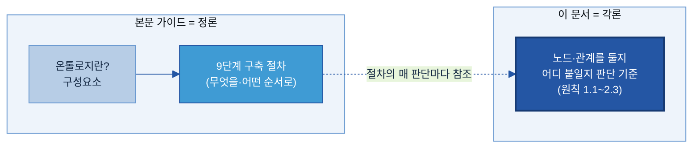

# 별첨 A — 온톨로지 설계·운영 원칙 (각론)

업무를 그래프 온톨로지(노드와 관계로 표현한 지식 구조)로 옮길 때 따르는 기준이다. 노드나 관계를 새로 넣거나 구조를 바꿀 때 이 기준으로 판단한다. 1장은 구조를 만드는 **설계 원칙**, 2장은 만든 구조를 관리·변경하는 **운영 원칙**이다.

**먼저, 이 세 용어가 모든 원칙의 바탕이다.** 노드·관계·속성을 무엇으로 둘지가 설계의 핵심이다.

| 용어 | 뜻 | 예 |
|---|---|---|
| **노드** | 업무의 한 개념 | 고객, 제품, 설비 |
| **관계** | 두 개념의 연결 | 고객 —주문— 제품 |
| **속성** | 노드에 딸린 값 | 고객명, 제품코드 |

---

## 0. 이 문서의 위치 — 정론과 각론

**본문 가이드(정론)**는 온톨로지가 무엇이고 어떤 구성요소로 어떤 9단계 절차로 만드는가를 다룬다. 그 절차를 밟다 보면 **노드 하나, 관계 하나를 둘지·어디에 붙일지**를 매번 판단해야 하는데, **이 문서(각론)**가 바로 그 **판단 기준**이다. 정론이 "무엇을 해야 하나"라면, 각론은 "이 결정을 무슨 기준으로 내리나"에 답한다.

| 구분 | 본문 가이드 (정론) | 이 문서 (각론) |
|---|---|---|
| **다루는 것** | 온톨로지란·구성요소·9단계 절차 | 노드·관계를 둘지·어디에 붙일지 |
| **답하는 질문** | "무엇을 해야 하나" | "이 결정을 무슨 기준으로 내리나" |
| **쓰는 때** | 전체 개념·흐름을 익힐 때 | 설계 중 매 판단마다 |
| **예** | 코어를 먼저, 유즈케이스를 나중에 | "이 측정값은 노드인가 속성인가" → 속성(1.1.4) |

> 정론을 모르면 먼저 [메인 가이드 `B-3 온톨로지.md`](../B-3%20온톨로지.md)를 본다.

요지를 한 문장으로: **업무의 중심 개념을 노드로 세워 메인·서브로 구조를 잡되 서브 구조는 목적에 맞추고, 관계는 실제 데이터 근거가 있을 때만 만들며, 그래프에는 개념·관계만 두고 대량의 값은 데이터베이스에 둔다. 구조 정의는 온톨로지 스키마 한 곳에서 관리하고, 바꿀 때는 데이터로 검증한 뒤 백업을 남긴다.**

## 설계·운영 원칙 한눈에

| 장 | 절 | 원칙 |
|---|---|---|
| **1. 설계** | 1.1 | 중심 개념을 노드로 세운다 |
| | 1.2 | 서브노드의 구조는 목적에 맞춰 설계한다 |
| | 1.3 | 모든 관계는 실제 데이터 근거가 있을 때만 만든다 |
| | 1.4 | 그래프에는 구조를, 데이터베이스에는 값을 둔다 |
| | 1.5 | 전체가 하나로 연결되고, 이름과 표기를 일관되게 한다 |
| **2. 운영** | 2.1 | 노드·관계·속성을 온톨로지 스키마로 관리한다 |
| | 2.2 | 변경은 데이터로 검증한다 |
| | 2.3 | 되돌릴 수 있게 한다 |

---

## 1. 설계 원칙

### 1.1 중심 개념을 노드로 세운다

**1.1.1** 업무에서 반복해 등장하고 그 자체로 식별되는 핵심 개념을 노드로 둔다.
> 예) 제조업이라면 고객, 제품, 자재, 설비, 공정.

**1.1.2** 노드는 메인노드와 서브노드로 나눈다. 메인노드는 업무의 중심을 이루는 핵심 개념이고, 서브노드는 메인노드에 딸려 그 의미를 보충하는 개념이다.
> 예) '제품'은 업무의 중심이라 메인노드, '제품 상세규격'은 제품에 딸린 보조라 서브노드.

> 메인/서브 구분은 본문 [3절 구성요소](../B-3%20온톨로지.md#sec-what)의 핵심 클래스와 그 하위·세부에 대응한다.

**1.1.3** 메인노드인지는 연결 정도로 판단한다 — 다른 핵심 개념 둘 이상과 직접 이어지면 메인노드로 본다. 연결이 하나뿐이어도, 앞으로 늘어날 것이 예정된 개념은 메인노드로 둘 수 있다.
> 예) '공급처'는 현재 '자재'에만 연결되지만, 나중에 판매·매출 쪽으로 확장할 것을 보고 미리 메인노드로 둔 경우다.

**1.1.4** 노드는 그 자체로 식별·참조되는 대상에만 쓴다. 측정값이나 발생 이력, 서술은 노드로 만들지 말고 속성이나 관계로 표현한다.
> 예) '고객'은 노드지만, "3월 5일 측정 두께 1.2mm"는 측정 기록의 속성이다.

> 이 규칙을 노드 적기 습관으로 풀어 쓴 것이 본문 [코어 설계의 'Before → After'](../B-3%20온톨로지.md#sec62)다(글자값 대신 개념으로, 한 덩어리 대신 분리).

**1.1.5** 노드 타입마다 식별 키(고유 키)를 정해 온톨로지 스키마에 선언한다. 키가 없으면 데이터를 넣을 때 같은 대상이 중복으로 생기거나 다른 대상이 잘못 합쳐질 수 있다.
> 예) 고객은 거래처코드, 제품은 품목코드를 키로 삼아, 같은 코드는 언제 넣어도 한 노드로 모이게 한다.

> 노드 ID·명명 등 구현 규칙은 본문 [구현](../B-3%20온톨로지.md#sec79)을 따른다.

### 1.2 서브노드의 구조는 목적에 맞춰 설계한다

**1.2.1** 메인노드(업무의 중심 개념)는 업무 자체에서 정해지지만, 서브노드와 그 관계 구조는 이 온톨로지가 답해야 할 목적에 맞춰 짠다. 목적이 달라지면 서브 구조도 달라진다.
> 예) 메인노드인 '제품·공정·설비'는 어떤 목적이든 업무에 늘 있지만, '현상·원인·검사' 같은 서브 구조는 "불량 원인분석"이라는 목적이 있어서 짜 넣은 것이다.

> 여기서 '목적'은 이 온톨로지가 답할 핵심 질문이다. 목적(유즈케이스)에 맞춘 레이어 설계는 본문 [유즈케이스](../B-3%20온톨로지.md#sec-uc)에서 다룬다.

**1.2.2** 서브노드를 잇는 관계 사슬은 목적이 그리는 경로를 그대로 따른다.
> 예) 목적이 "이 불량의 원인은 무엇이고 어떤 검사로 확인하나"라면, 결함—현상—원인—검사—기준을 한 줄로 이어, 결함에서 출발해 관계를 따라가면 원인과 추천 검사가 나오게 한다.

**1.2.3** 서브노드는 메인노드 하나에 종속된다(소유). 그 메인노드에 곧장 붙거나, 다른 서브노드를 거쳐 결국 하나의 메인노드로 닿으면 된다. 두 개 이상의 메인노드가 동시에 소유하게 잇지 않는다.
> 예) '제품 상세규격'은 '제품'에 곧장 붙고, '세부 판정기준'은 '검사항목'을 거쳐 상위 개념으로 이어진다.

**1.2.4** 소유와 분류는 다르다. '소유'는 "이것이 누구에게 딸렸나", '분류'는 "이것이 어떤 종류인가"에 답한다. 분류 연결은 소유 메인노드와 별개로 가질 수 있다.
> 예) 현장의 '3호기 설비'는 'A공정'에 딸리면서(소유 — 어느 공정의 설비인가), 동시에 '프레스기'라는 설비 종류로 분류된다(분류 — 무슨 종류인가). 둘은 다른 질문에 답하므로 함께 가질 수 있다.

### 1.3 모든 관계는 실제 데이터 근거가 있을 때만 만든다

**1.3.1** 두 개념이 같은 원천 데이터에 함께 나타날 때 연결하고, 어느 데이터의 어느 항목에서 나왔는지 온톨로지 스키마에 적어 둔다. 다른 관계를 계산해 만든 연결이면 그 계산식도 남긴다.
> 예) 주문 데이터 한 줄에 고객과 제품이 같이 있으면, 그것을 근거로 고객—제품을 잇는다.

**1.3.2** 거래·실적 데이터로 직접 드러나지 않는 관계(주로 진단 지식 — 결함·현상·원인·검사 사이의 연결)는 전문가 인터뷰로 문서화하거나 기존 문서·표준을 근거로 삼는다. 그 출처(인터뷰 대상·문서명)를 노드와 관계에 함께 기록한다.
> 예) "이 원인은 이 검사로 확인한다" 같은 지식은 데이터에 안 나온다. 담당 전문가 인터뷰나 작업표준·관리대장을 근거로 만들고, 출처를 '인터뷰' 또는 '○○ 관리대장'으로 남긴다.

**1.3.3** 특정 사건에서만 성립하는 사실은 두 노드를 직접 잇지 않고, 사이에 '사건' 노드를 두어 잇는다. 즉 `A—B`로 바로 잇는 대신 `A ← 사건 → B` 구조로 만든다.
> 예) "A고객이 B불량을 신고했다"는 특정 클레임에서 일어난 일이다. '고객—불량'으로 바로 이으면 그 클레임이 지나도 "A고객 = B불량"이 영구 사실로 남는다. 대신 '클레임' 노드를 만들어 `클레임→고객`, `클레임→불량`으로 이으면, 그 사실이 "그 클레임에서" 성립함이 분명해지고 다른 건과 섞이지 않는다.

> 이 '사건' 노드가 본문 [3계층](../B-3%20온톨로지.md#sec33)의 *사건(L2)* 레이어다 — "언제 일어난 사실"은 객체나 해석과 분리해 둔다.

**1.3.4** 성격(출처·관리주체)이 다른 노드는 합치지 말고 관계로 잇는다.
> 예) 현장에서 들어온 '클레임'과 전문가가 정의한 '불량유형'은 따로 두고 "해당한다" 관계로 연결한다.

**1.3.5** 출처가 다른 노드는 같은 대상임이 확인될 때만 잇는다. 이름이 비슷하다고 자동으로 잇지 않는다.
> 예) 클레임의 고객명과 거래 시스템의 거래처명이 같은 회사로 확인되면 잇지만, "한국전자"와 "한국전자부품"처럼 비슷하기만 하면 두지 않는다.

**1.3.6** 이미 다른 경로로 알 수 있는 관계는 또 만들지 않는다. 다만 자주 조회돼 한 번에 보는 편이 나으면 그 이유를 온톨로지 스키마에 적어 두고 직접 연결을 둔다.
> 예) "공정→불량"이 "불량→원인→공정"으로 이미 추적되면 중복이지만, 진단 화면에서 자주 쓰면 근거를 스키마에 남기고 추가할 수 있다.

**1.3.7** 관계의 이름과 방향, 선후는 실제 업무와 맞춘다.
> 예) 봉쇄조치가 원인 규명보다 먼저라면, "근본원인이 봉쇄조치를 일으킨다"처럼 거꾸로 그리지 않는다.

**1.3.8** 근거 데이터가 없으면 관계를 만들지 않는다. 아무 데도 안 이어지는 노드는 그대로 둔다.
> 예) 거래 이력이 없는 제품은 연결 없이 두고, 구조를 채우려고 없는 연결을 지어내지 않는다.

> "근거 없는 개념·관계는 만들지 않는다"는 본문 [출발점 As-Is](../B-3%20온톨로지.md#sec-asis)의 원칙과 같다 — 데이터 소스가 확인 안 된 것은 "미확인"으로 남긴다.

### 1.4 그래프에는 구조를, 데이터베이스에는 값을 둔다

**1.4.1** 그래프에는 개념과 관계를 둔다. 건별 측정값이나 거래 기록처럼 양이 많은 데이터는 데이터베이스에 두고 필요할 때 불러온다. 값을 노드로 만들면 노드가 폭발하고 중복된다.
> 예) "이 제품은 이 자재로 만든다"는 그래프에, "3월 5일 측정 1.2mm" 수백만 건은 데이터베이스에 둔다.

**1.4.2** 값을 비교하거나 판정할 때는 기준만 그래프에서 가져오고 실제 값은 데이터베이스에서 읽는다.
> 예) 합격·불합격은 기준값(그래프)과 실측값(데이터베이스)을 비교해 정하지, 실측값을 그래프에 복제하지 않는다.

> 이 "구조는 그래프, 값은 데이터베이스" 구분은 본문 [3절 구성요소](../B-3%20온톨로지.md#sec-what)의 설계도 vs 사례 데이터 구분과 같다.

### 1.5 전체가 하나로 연결되고, 이름과 표기를 일관되게 한다

**1.5.1** 구조는 하나로 이어지게 한다. 메인노드가 여러 조각으로 끊겨 있으면 잇는 관계가 빠진 것이니 점검한다.
> 예) 고객·제품 무리가 나머지와 동떨어져 떠 있으면 연결이 누락된 것이다.

**1.5.2** 같은 개념은 설계서·데이터베이스·응용 화면에서 같은 이름으로 부른다.
> 예) 같은 '고객'을 설계서에선 Customer, 화면에선 거래처로 따로 부르지 않는다.

> 같은 개념을 같은 이름으로 부르는 표준 용어는 [A-3 Glossary](../../A-3%20Glossary/A-3%20Glossary.md)에서 관리한다.

**1.5.3** 노드·관계 이름의 표기 규칙(대소문자·구분자)을 정하고 일관되게 적용한다. 같은 종류의 노드가 제각각 표기되지 않게 한다.
> 예) 노드 이름을 PascalCase로 정했으면 전부 그 규칙을 따른다. 계층별로 표기를 달리하기로 했다면(예: 마스터는 PascalCase, 사례는 대문자) 그 규칙 자체를 정해 두고 예외 없이 적용한다.

---

## 2. 운영·거버넌스 원칙

설계가 끝난 뒤, 구조를 관리하고 변경할 때의 기준이다.

### 2.1 노드·관계·속성을 온톨로지 스키마로 관리한다

**2.1.1** 어떤 노드·관계·속성이 있는지, 각 노드가 어느 영역(기준정보·업무지식·사례 등)에 속하는지, 노드 타입별 식별 키는 무엇인지를 온톨로지 스키마 한 곳에 모은다. 설계와 실제 데이터베이스가 어긋나지 않게 하고, 노드나 관계를 새로 만들면 스키마에 등록한다.
> 예) 노드·관계·속성·키 목록을 한 스키마 파일에 적어 두고, 구조를 바꿀 때는 항상 이 스키마를 먼저 고친다.

> 이 온톨로지 스키마가 본문에서 말하는 설계도다.

### 2.2 변경은 데이터로 검증한다

**2.2.1** 변경은 스키마를 먼저 고치고, 실제 데이터베이스와 대조한 뒤, 적합성 테스트로 확인하는 순서로 한다. 의도대로 됐는지는 짐작하지 말고 데이터로 확인한다.
> 예) 관계를 하나 추가했으면, 스키마에 적고 → 실제 DB에 생겼는지 대조하고 → "스키마와 DB가 같은가"를 테스트로 확인한다.

> 데이터로 확인한다는 원칙은 본문 [검증·함정](../B-3%20온톨로지.md#sec-traps)의 검증 원칙과 같은 취지다.

### 2.3 되돌릴 수 있게 한다

**2.3.1** 삭제나 대규모 이름 변경처럼 되돌리기 어려운 작업 전에는 현재 상태를 백업해 둔다.
> 예) 노드를 대량으로 지우기 전에 그래프를 통째로 백업해 두면, 문제가 생겨도 그 시점으로 돌아갈 수 있다.

---

## 참고

- 정론: [메인 가이드 `B-3 온톨로지.md`](../B-3%20온톨로지.md) — 개념·구성요소·9단계 절차
- 표준 용어: [A-3 Glossary](../../A-3%20Glossary/A-3%20Glossary.md)
- 원천(내부): 두산 「온톨로지 설계 원칙」
