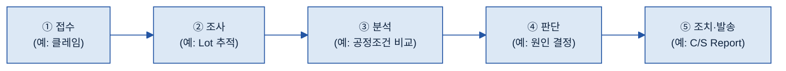

# 별첨 E — As-Is 분석서 (빈 템플릿)

> 한 줄: **온톨로지 9단계에 들어가기 *전에* 가장 먼저 작성하는 출발점 문서.** 대상 도메인의 "현실"(업무 흐름·실제 존재하는 객체·일어나는 사건·사람의 판단·데이터 소스·용어)을 있는 그대로 정리한다. **모든 개념·관계의 근거가 여기서 나온다 — 여기에 없는 것은 노드로 만들지 않는다.**

> **쓰는 법:** 메인 가이드 [§4.2 출발점](../B-3%20온톨로지.md#sec-asis)을 읽고 채운다. 현장에서 내용을 길어 올리는 **워크샵 운영법**은 [별첨 D Discovery Workshop](B-3%20별첨%20D%20—%20Discovery%20Workshop%20운영%20가이드.md), 채운 결과가 흘러 들어가는 곳은 [별첨 B 코어 기획서](B-3%20별첨%20B%20—%20코어%20온톨로지%20설계%20기획서.md)다. 실제로 어떻게 채웠는지의 **작성 사례(CCL)**는 [별첨 A 각론](B-3%20별첨%20A%20—%20유즈케이스%20온톨로지%20구축%20각론.md). *(아래 괄호 안 「예: …」는 작성 요령을 보여주는 예시이며, 표 칸은 비워서 배포한다.)*

> **쓰는 순서:** **이 문서(As-Is) → [워크샵(별첨 D)](B-3%20별첨%20D%20—%20Discovery%20Workshop%20운영%20가이드.md)로 보강 → [코어 기획서(별첨 B)](B-3%20별첨%20B%20—%20코어%20온톨로지%20설계%20기획서.md)·[유즈케이스 기획서(별첨 C)](B-3%20별첨%20C%20—%20유즈케이스%20레이어%20설계%20기획서.md)에 옮김.** As-Is는 9단계의 입력이지 산출물이 아니다.

**문서 정보**

| 버전 | 작성일 | 작성자 | 대상 도메인·라인 | 상태 |
|---|---|---|---|---|
| | | | *(예: 전자BG CCL 라인 — 적층/열압착 공정)* | 초안/검토/확정 |

**작성 완료 기준 (이게 다 돼야 9단계 착수):**

| 항목 | 완료 기준 |
|---|---|
| 분석 목적·범위 | 한 문장 목적 + 대상/제외 범위 명시 (§0) |
| E2E 업무 흐름 | 시작~끝 1개 흐름이 끊김 없이 그려짐 (§1) |
| 객체·사건·판단 후보 | L1/L2/L3로 갈 후보가 §2·§3·§4에 정의·구분됨 |
| 데이터 소스 확인 | 모든 후보에 데이터 소스 + **확인/미확인** 표기 (§5) |
| 용어·동의어 | 팀 간 용어 충돌이 정리됨 (§6) |
| 핵심 질문(CQ) 초안 | 목적이 답해야 할 질문 3~5개 (§7) |
| 미확인·미결 | 데이터 없는 항목이 보완 계획과 함께 등록됨 (§8) |

> **★ 원칙: 근거 없는 개념은 만들지 않는다.** 데이터 소스가 확인 안 된 항목은 버리지 말고 **"미확인"으로 표시**하고 §8 미결에 보완 계획(담당·기한)을 남긴다. As-Is에 근거가 없는 노드·관계는 코어 기획서에서 작성하지 않는다([별첨 B](B-3%20별첨%20B%20—%20코어%20온톨로지%20설계%20기획서.md)).

> **★ 핵심 자세 — 노드화는 미룬다.** 이 단계에서는 "현실에 무엇이 있고, 무엇이 일어나고, 누가 어떻게 판단하나"만 적는다. 클래스·관계로 옮기는 형식화는 코어 기획서에서 한다. **보고서 양식의 표를 그대로 노드로 옮기지 않는다**(메인 [§4.7 함정](../B-3%20온톨로지.md#sec-traps)).

---

## 0. 분석 목적·범위

| 항목 | 내용 |
|---|---|
| 분석 목적 (한 문장) | *(예: "들뜸 결함의 원인 분석에 쓸 현실 개념을 빠짐없이 식별한다")* |
| 대상 도메인·공정 | *(예: CCL 적층/열압착 공정, 클레임 처리)* |
| 포함 범위 (E2E 시작~끝) | *(예: 클레임 접수 ~ C/S Report 발송)* |
| 제외 범위 | *(이번 분석에서 다루지 않는 것 — 발산 방지)* |
| 인터뷰·자료 출처 | *(예: 품질반장 인터뷰, PFMEA, SOP, 8D 보고서)* |

## 1. E2E 업무 흐름 (→ 9단계 1단계 도메인 목적·범위)

> 업무를 **끝에서 끝까지** 한 줄기로 적는다. 흐름 위에서 객체·사건·판단(§2·§3·§4)이 어디서 등장하는지 함께 표시한다.

| 순서 | 단계 | 담당(조직/역할) | 입력 | 출력 | 사용 시스템 | 여기서 등장하는 객체/사건/판단 |
|---|---|---|---|---|---|---|
| 1 | | | | | | |
| 2 | | | | | | |
| 3 | | | | | | |

*(시각화가 도움이 되면 아래 흐름도를 대상 도메인에 맞게 교체. 단순 나열이면 위 표만으로 충분.)*

## 2. 현실 객체 — 물리·조직·기준 (→ 9단계 3단계 L1 마스터 객체)

> **판별 질문:** "활용과 무관하게 **독립적으로 존재**하나? + **사실로 고정**되나(시간에 따라 안 변함)?" → 둘 다 Yes면 L1 후보. 설비·원자재·제품·공정·기준(SOP)·조직이 여기 온다.

| 객체명 | 구분(물리/조직/기준) | 쉬운 설명(한 문장) | 식별자(있으면) | 데이터 소스 | 동의어·다른 팀 표현 | 확인상태 |
|---|---|---|---|---|---|---|
| | | | *(예: Lot ID)* | *(예: ERP 자재마스터)* | | 확인/미확인 |
| | | | | | | 확인/미확인 |

## 3. 사건 — 시간과 함께 일어나는 일 (→ 9단계 4단계 L2 사건)

> **판별 질문:** "**언제 일어났는지(시간 정보)**가 있나?" → Yes면 L2 후보. 한 번 발생하면 사실로 고정된다(공정 집행·검사·결함 검출·이탈 이벤트).

| 사건명 | 언제 발생(트리거) | 시간 필드(필수) | 함께 기록되는 값 | 기록 위치(시스템·테이블/문서) | 확인상태 |
|---|---|---|---|---|---|
| | *(예: 열압착 집행 시)* | *(예: 집행시각)* | *(예: 온도·압력·시간)* | *(예: MES 공정이력)* | 확인/미확인 |
| | | | | | 확인/미확인 |

## 4. 판단·대책 결정 기록 (→ 9단계 6단계 L3 해석)

> **판별 질문:** "**사람의 판단·결정**인가? **재조사로 바뀔 수 있나**?" → Yes면 L3 후보(원인·귀책·시정조치 같은 해석). 사실(L2)과 섞지 않는다 — "그건 사실인가요(언제 일어남), 판단인가요(누가 그렇게 봄)?"로 분리.

| 판단/결정 | 누가 판단 | 판단 근거 | 바뀔 수 있나 | 기록 위치 | 확인상태 |
|---|---|---|---|---|---|
| | *(예: 품질엔지니어)* | *(예: 8D 분석)* | Y/N *(예: 재조사 시 Y)* | *(예: 8D 보고서·QMS)* | 확인/미확인 |
| | | | Y/N | | 확인/미확인 |

## 5. 데이터 소스 인벤토리 (→ 각 개념의 데이터 연결 [§3.6](../B-3%20온톨로지.md#sec37) · 노드 데이터 소스 컬럼)

> §2·§3·§4의 후보가 **실제 데이터로 존재하는지** 한 표에 모은다. 데이터 엔지니어와 함께 채워 "데이터 없는 연결"을 거른다.

| 시스템·문서 | 종류(MES/ERP/QMS/문서) | 주요 테이블·문서 | 주요 필드 | 정형/반정형/수기 | 접근 방법 | 확인상태 |
|---|---|---|---|---|---|---|
| | | | | | *(예: API/추출/수기)* | 확인/미확인 |
| | | | | | | 확인/미확인 |

## 6. 용어·동의어 충돌 (→ 개념 정의·별칭(alias) · [A-3 Glossary](../../A-3%20Glossary/A-3%20Glossary.md) 연계)

> 같은 것을 팀마다 다르게 부르는 경우를 그 자리에서 기록한다. 표준 용어는 A-3 Glossary로 넘기고, 온톨로지에서는 **대표 용어 + 동의어 alias**로 흡수한다.

| 우리/현장 용어 | 다른 팀·문서 용어 | 맥락(어디서 다르게 쓰나) | 표준 후보(대표 용어) |
|---|---|---|---|
| *(예: "용접 불량" = MES)* | *(예: "고장 모드" = PFMEA)* | | |
| | | | |

## 7. 핵심 질문(CQ) 초안 (→ 9단계 5단계 핵심 질문 역검증)

> 0번 목적 관점에서 온톨로지가 **답해야 할 질문 3~5개**를 미리 스케치한다. 나중에 "지금 설계가 이 질문에 개념·관계 경로로 답하나"를 되짚는 리트머스 시험지가 된다.

| # | 핵심 질문(목적 관점) | 왜 중요한가 |
|---|---|---|
| 1 | *(예: "이번 분기 들뜸의 상위 원인은?")* | |
| 2 | | |
| 3 | | |

## 8. 미확인·미결 항목 (→ "미확인" 표시 · [별첨 B §9 미결](B-3%20별첨%20B%20—%20코어%20온톨로지%20설계%20기획서.md))

> 데이터가 없거나 수기로만 관리되는 항목을 버리지 않고 등록한다. As-Is의 공백이 곧 코어 기획서의 미결로 이어진다.

| # | 미확인/공백 항목 | 어느 후보의 근거인가(§2~§4) | 보완 계획 | 담당 | 기한 |
|---|---|---|---|---|---|
| 1 | | | | | |

## 9. As-Is → 다음 단계 매핑 (이 문서가 어디로 흘러가나)

> As-Is의 각 절이 **9단계 / 코어 기획서(별첨 B)**의 어느 칸으로 들어가는지의 연결표. "근거 없는 개념 금지" 원칙이 작동하는 통로다.

| As-Is 절 | 담은 것 | → 9단계 | → 별첨 B 반영 위치 |
|---|---|---|---|
| §1 E2E 업무 흐름 | 업무 전체 흐름 | 1단계 도메인 목적·범위 | §1 도메인 목적 적용 범위 |
| §2 현실 객체 | 독립 존재·사실 고정 객체 | 3단계 L1 식별 | §2 L1 마스터 객체 |
| §3 사건 | 시간 정보 있는 사건 | 4단계 L2 식별 | §2 L2 사건 |
| §4 판단·대책 | 사람의 판단·결정 | 6단계 L3 설계 | §2 L3 해석 |
| §5 데이터 소스 | 소스 확인 결과(MES·ERP 등) | 각 개념 데이터 연결([§3.6](../B-3%20온톨로지.md#sec37)) | 각 노드 데이터 소스 컬럼 |
| §6 용어·동의어 | 팀 간 용어 충돌 | 개념 정의·별칭 | 노드 정의·alias 속성 |
| §7 핵심 질문(CQ) | 목적이 답할 질문 | 5단계 CQ 역검증 | §6 핵심 질문 및 경로 검증 |
| §8 미확인·미결 | 데이터 미확인·수기 항목 | (미확인 표시) | §9 미결 사항 |

---

## 참고
- 정론: [메인 §4.2 출발점](../B-3%20온톨로지.md#sec-asis) · 9단계 전체: [메인 §4 How](../B-3%20온톨로지.md#sec-how)
- 수집(워크샵): [별첨 D Discovery Workshop](B-3%20별첨%20D%20—%20Discovery%20Workshop%20운영%20가이드.md) · 흘러 들어가는 곳: [별첨 B 코어 기획서](B-3%20별첨%20B%20—%20코어%20온톨로지%20설계%20기획서.md) · [별첨 C 유즈케이스 기획서](B-3%20별첨%20C%20—%20유즈케이스%20레이어%20설계%20기획서.md)
- 작성 사례(CCL): [별첨 A 각론](B-3%20별첨%20A%20—%20유즈케이스%20온톨로지%20구축%20각론.md)
</content>
</invoke>
