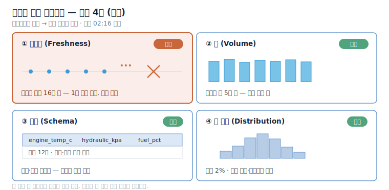
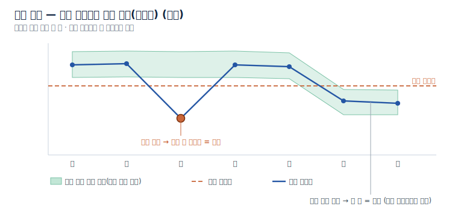
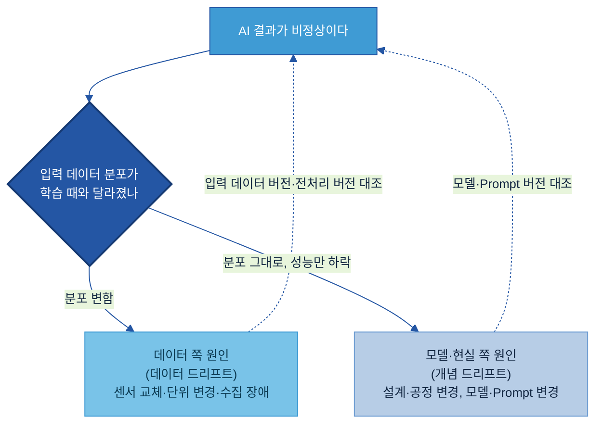
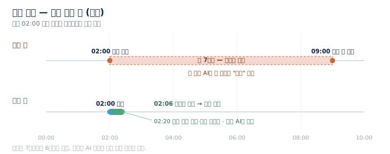
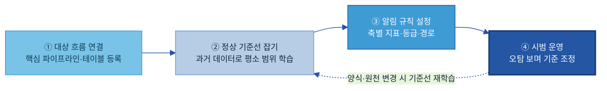
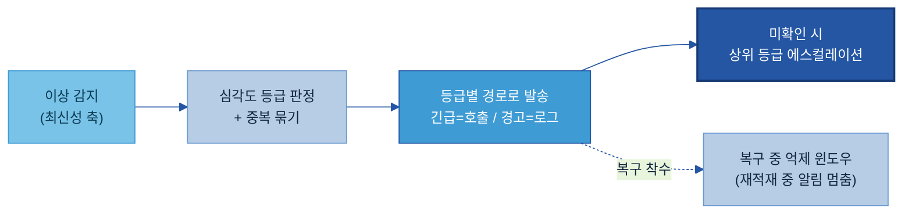

# C-1. 데이터 Observability 가이드

> 정의: 데이터 흐름의 지연·누락·변경·이상 징후를 운영 중 감지·알림하는 모니터링 체계.

---

## 목차

1. [Why — 왜 필요한가](#why)
    - [1.1 현업 적용 시 발생하는 문제](#s11)
    - [1.2 기대 효과](#s12)
2. [What — 무엇인가·무엇을 갖추나](#what)
    - [2.1 데이터 Observability의 정의와 역할](#s21)
    - [2.2 관측 4축 — 무엇을 지켜보나](#s22)
    - [2.3 이상 판단 기준 — 고정 한계값과 평소 추세](#s23)
    - [2.4 알림 체계 — 심각도 등급](#s24)
    - [2.5 원인 구분용 기록 — 데이터·모델 원인 구분](#s25)
3. [When — 어디부터 관측하나 (관측 대상 우선순위)](#when)
    - [3.1 기본 필수 대상](#s31)
    - [3.2 관측 우선순위 판단 기준](#s32)
4. [How — 어떻게 준비·운영하나](#how)
    - [4.1 적용 전후 비교](#s41)
    - [4.2 Observability 구축 절차](#s42)
    - [4.3 관측 지표·판단 기준 설정](#s43)
    - [4.4 알림·에스컬레이션 운영](#s44)
5. [Tech Stack — 솔루션 검토](#tech)
    - [5.1 솔루션 유형](#s51)
    - [5.2 선정 기준](#s52)
6. [Where — 다른 주제와의 관계](#where)
7. [KPI](#kpi)
    - [7.1 관리 기준과 핵심 KPI](#s71)

- [별첨 (Appendix)](#별첨-appendix) · [참고자료 (References)](#참고자료-references) · [변경 이력 / 피드백 반영](#변경-이력--피드백-반영)

<!-- KQ→섹션 매핑(자가 점검): KQ1 관측 지표→2.2(s22) / KQ2 판단 기준→2.3(s23) / KQ3 알림→2.4(s24) / KQ4 데이터vs모델 구분→2.5(s25) / KQ5 운영 수준 측정·KPI→7.1(s71)+7.2(s72). -->

---

> **관련 가이드:** [B-1 데이터 전처리](../B-1%20데이터%20전처리/B-1%20데이터%20전처리.md) · [A-2 메타데이터](../A-2%20메타데이터/A-2%20메타데이터.md) · [C-2 데이터 품질 관리](../C-2%20데이터%20품질%20관리/C-2%20데이터%20품질%20관리.md) · [C-3 데이터 계통 Lineage](../C-3%20데이터%20계통%20Lineage/C-3%20데이터%20계통%20Lineage.md) · [F-1 데이터 운영관리](../F-1%20데이터%20운영관리/F-1%20데이터%20운영관리.md)

이 가이드는 데이터 관측이 왜 필요한지(1장), 무엇을 지켜보고 무엇을 갖추는지(2장), 어디부터 적용하는지(3장), 실제로 어떻게 구축·운영하는지(4장), 어떤 솔루션을 검토하는지(5장), 인접 주제와 어떻게 나뉘는지(6장), 운영 수준을 어떤 기준과 지표로 측정하는지(7장)를 다룬다. AI는 들어온 데이터를 그대로 받아들여 결과를 산출하므로, 데이터가 중단되거나 변형된 시점을 사전에 감지하는 장치가 없으면 잘못된 데이터가 그대로 AI 결과로 이어진다.

## 이 가이드가 답하는 5가지 질문

| 핵심 질문 | 한 줄 답 | 본문 |
|---|---|---|
| 어떤 데이터 이상을 관찰해야 하는가? | 최신성·양·구조·값 분포 네 축을 정해 두고 각 축마다 지표를 설정한다 | [2.2](#kq1) |
| 이상 여부를 어떤 기준으로 판단할 것인가? | 고정 한계값과 평소 추세 두 방식을 데이터 성격에 따라 골라 쓰되, 제조 데이터는 평소 추세를 기본으로 한다 | [2.3](#kq2) |
| 이상이 발생하면 어떻게 알릴 것인가? | 긴급·주의·경고·정보 네 등급으로 나눠, 등급마다 알림 경로·시점을 고정해 둔다 | [2.4](#kq3) |
| AI 결과 이상이 데이터 문제인지 모델 문제인지 어떻게 구분할 것인가? | 입력 데이터·전처리·모델·Prompt 버전을 함께 남겨, 입력 분포 변화 여부로 데이터 드리프트와 개념 드리프트를 먼저 가린다 | [2.5](#kq4) |
| Observability 운영 수준을 어떻게 측정할 것인가? | 관리 기준을 정하고, 구축 수준(관측 커버리지)·운영 수준(MTTD·MTTR·놓친 건수)·운영 품질(오탐률·최신성·자동화율) 지표로 잰다 | [7](#kq5) |

---

<a id="why"></a>

## 1. Why — 왜 필요한가

데이터는 구축 이후에도 지속적인 운영과 관리가 필요한 자산이다. 운영 과정에서는 수집 지연, 적재 누락, 건수 변화, 원천 시스템 변경 등으로 데이터 흐름에 비정상 상태가 발생할 수 있다. AI는 이 변화를 스스로 인지하지 못한 채 들어온 데이터를 사실로 받아들여 결과를 산출한다. 데이터 관측은 이 흐름의 이상을 운영 중에 감지해, 잘못된 데이터가 AI 결과로 굳기 전에 담당자에게 알린다.

<a id="s11"></a>

### 1.1 현업 적용 시 발생하는 문제

제조 현장에서 관측 장치 없이 AI 서비스를 운영할 때 반복적으로 발생하는 문제는 다음과 같다.

| 발생 문제 | 현업 영향 |
|---|---|
| 수집 중단을 늦게 인지함 | 새벽에 특정 지역 장비의 텔레매틱스 수집이 중단되었으나 익일 오전에야 인지된다. 그 사이 예지보전 AI는 직전 값으로 정상으로 판정한다 |
| 이상값이 그대로 적재됨 | 센서 교체·보정 오류로 측정값이 물리적으로 불가능한 범위로 유입되어도 걸러지지 않고 피처 테이블에 적재된다 |
| 원천 변경으로 하위 입력 오류 발생 | 단말 펌웨어 업데이트로 압력 단위나 컬럼명이 변경되면 하위 AI 입력에 오류가 발생하며, 결과 이상이 나타난 뒤에야 인지되는 경우가 많다 |
| 이상 알림 체계가 없음 | 이상을 발견해도 심각도에 따라 알리는 체계가 없어, 사소한 알림에 묻히거나 대응이 지연된다 |
| AI 결과 오류의 원인 구분이 어려움 | AI 결과가 비정상일 때 데이터·모델·Prompt 중 어느 영역의 문제인지 구분하지 못해 원인 추적에 장시간이 소요된다 |

공통점은 데이터가 없는 것이 아니라, 데이터에 이상이 발생한 시점을 감지할 장치가 없다는 점이다.

<a id="s12"></a>

### 1.2 기대 효과

데이터 관측을 표준화하면 세 가지가 달라진다.

- 운영 중 이상 징후를 자동으로 감지한다. 수집 중단이나 이상값 유입이 발생하는 즉시 알림이 발송되어, 사용자 신고나 잘못된 보고가 발생하기 전에 대응 시간을 확보한다. 이상 발견 시간이 수일 단위에서 분 단위로 단축된다.
- 잘못된 데이터가 AI에 유입되는 것을 차단한다. 관측은 데이터가 AI에 투입되기 전 단계에서 흐름의 상태를 점검하여, AI 오작동·잘못된 자동 판정의 위험을 사전에 낮춘다.
- 원인 후보를 빠르게 구분한다. 데이터·전처리·모델·Prompt 버전을 함께 기록하면, AI 결과가 비정상일 때 데이터, 전처리, 모델, Prompt 중 원인 영역을 우선 구분하여 원인 분석 시간을 단축한다.

---

<a id="what"></a>

## 2. What — 무엇인가·무엇을 갖추나

이 장은 데이터 관측이 무엇이고 무엇으로 이루어지는지를 정의한다. 구축 절차와 운영 방법은 [4장](#how)에서 다루고, 여기서는 네 가지 구성 요소(관측 4축·판단 기준·알림 체계·원인 구분 기록)를 정의한다.

<a id="s21"></a>

### 2.1 데이터 Observability의 정의와 역할

데이터 Observability는 운영 중인 데이터 흐름의 상태를 지속적으로 지켜보다가, 지연·누락·구조 변경·값 이상 같은 징후가 나타나면 그 즉시 감지해 담당자에게 알리는 체계이다. 이를 공장의 관제실에 비유하면, 관제실은 설비를 직접 고치지는 않지만, 어느 라인이 멈췄고 어느 계기가 비정상인지를 한눈에 비추고 경보를 울려 사람이 제때 조치를 취하게 한다. 마찬가지로 데이터 관측은 데이터를 직접 고치거나 사용 여부를 판정하는 것이 아닌, 흐름이 정상인지 지켜보고 이상을 알리는 역할을 수행한다.

데이터 관측은 데이터를 신뢰할 수 있게(Trustworthy) 만드는 단계에서 "지금 이 순간 흐름이 정상인가"를 실시간 신호로 살피는 역할을 맡는다. 사용 여부 판정([C-2 데이터 품질 관리](../C-2%20데이터%20품질%20관리/C-2%20데이터%20품질%20관리.md))·사후 이력 추적([C-3 데이터 계통 Lineage](../C-3%20데이터%20계통%20Lineage/C-3%20데이터%20계통%20Lineage.md))과의 경계는 [6장](#where)에서 정리한다.

<a id="s22"></a>

### 2.2 관측 4축 — 무엇을 지켜보나

<a id="kq1"></a>

관측은 단순히 "데이터를 본다"는 의미가 아니라, 데이터 흐름이 훼손되는 **네 가지 주요 지점**을 정의하고 각 지점에 대응하는 지표를 설정하는 것이다. 본 가이드는 이 네 가지를 관측의 정본 모델로 삼아 끝까지 일관되게 쓴다.

| 관측 축 | 관측 항목 | 이상 신호 (텔레매틱스 예시) |
|---|---|---|
| **① 최신성 (Freshness)** | 데이터가 제때 들어오는가 | 1분 주기로 와야 할 장비 데이터가 15분째 새 레코드 없음 — 수집 중단의 첫 신호 |
| **② 양 (Volume)** | 평소만큼의 건수가 들어오는가 | 하루 5만 건 적재되던 가동 로그가 오늘 200건만 — 수집 어댑터 장애·지역 단절 |
| **③ 구조 (Schema)** | 칸 구조·단위가 그대로인가 | 펌웨어 업데이트 후 `pressure_kpa` 컬럼이 사라지고 단위가 바뀜 — 하위 입력 어긋남 |
| **④ 값 분포 (Distribution)** | 값이 정상 범위 안에 있는가 | 평소 결측 2%이던 유압 센서가 갑자기 40% 결측, 또는 오류코드 -999가 채워짐 |

이 네 축은 데이터 관측 업계에서 흔히 쓰는 다섯 기둥(5 Pillars) 가운데 네 가지다[1]. 다섯 번째 기둥인 계보(Lineage)는 [C-3 데이터 계통 Lineage](../C-3%20데이터%20계통%20Lineage/C-3%20데이터%20계통%20Lineage.md)가 별도로 맡으므로 관측 지표에서는 제외하되, C-1은 이상이 났을 때 그 데이터가 어디로 흘러가 어떤 영향을 주는지 파악할 때 계보를 활용한다([2.4](#s24)).

네 축이 흐르는 데이터 위에서 동시에 켜져 있는 모습은 관제 화면 한 장으로 그려진다.



<a id="s23"></a>

### 2.3 이상 판단 기준 — 고정 한계값과 평소 추세

<a id="kq2"></a>

지표를 설정했으면 "어디까지가 정상이고 어디부터가 이상인가"를 정해야 한다. 판단 기준은 두 방식이 있고, 데이터 성격에 따라 선택하여 사용한다.

- **고정 한계값(Threshold):** "건수가 1,000건 미만이면 이상", "온도가 150도를 넘으면 이상"처럼 값을 직접 정한다. 물리 한계나 규정으로 정상 범위가 명확할 때 적합하다. 단순하고 설명하기 쉽지만, 주말 생산 감소나 시간대별 변동 같은 정상적인 출렁임에도 알림이 울려 알림 피로(alert fatigue)를 부른다.
- **평소 추세 대비 (적응형 베이스라인, Adaptive Baseline):** 과거의 요일·시간대·계절 패턴을 학습해 "이 시간대의 정상 범위"를 자동으로 잡고, 그 범위를 벗어날 때만 알린다. 변동이 큰 제조 데이터에 맞고, 임계값을 일일이 정하지 않아도 된다. 다만 학습 초기에는 정확도가 낮고, 왜 이상으로 봤는지 설명이 어려울 수 있다.

둘은 배타적이지 않다. 물리 한계처럼 명확한 곳은 고정 한계값으로 단단히 막고, 변동이 큰 흐름은 평소 추세로 거는 식으로 함께 쓴다.



> **권장 — 평소 추세를 기본으로, 고정 한계값을 보강으로.** 제조 데이터는 요일·교대·계절 변동이 커서 고정 한계값만으로는 오탐이 많다. 평소 추세를 기본으로 설정하고, 물리적으로 불가능한 값(음수 두께, 오류코드)이나 규정 한계는 고정 한계값으로 덧대는 조합을 권장한다.

<a id="s24"></a>

### 2.4 알림 체계 — 심각도 등급

<a id="kq3"></a>

이상을 잡아도 모든 알림이 똑같은 무게로 쏟아지면 대응이 늦는다. 알림은 **심각도 등급**으로 무게를 나누고, 등급마다 **어떤 경로로·언제까지** 처리할지를 정해 둔다.

| 심각도 | 상황 | 경로·시점 |
|---|---|---|
| **긴급 (높음)** | 핵심 흐름 완전 중단·데이터 손실, AI 서비스 즉시 영향 | 즉시 호출(전화·메신저 호출) + 채널 공지 |
| **주의 (중간)** | 핵심 흐름 지연·부분 손상, 우회 가능 | 메신저 알림, 정해진 시간 내 확인 |
| **경고 (낮음)** | 일부 구간 품질 이상, AI 즉시 영향 없음 | 업무 시간 메신저 알림, 당일 처리 |
| **정보** | 경미한 스키마 경고·소수 필드 이상 | 로그·티켓 기록, 정기 검토 |

등급이 높을수록 즉시·강한 경로(호출)로, 낮을수록 로그·정기 검토로 보낸다. 긴급 건이 정해진 시간 안에 확인되지 않으면 상위 등급으로 자동 에스컬레이션하는 규칙을 둔다.

<a id="s25"></a>

### 2.5 원인 구분용 기록 — 데이터·모델 원인 구분

<a id="kq4"></a>

AI 결과가 비정상일 때 가장 먼저 확인해야 하는 것은 데이터 문제인지, 모델 문제인지, Prompt 변경의 영향인지 구분하는 것이다. 이를 구분하려면 결과가 산출된 시점의 **각 단계 버전을 함께 기록해** 두어야 한다. 무엇을 기록하는지가 관측 체계의 한 구성 요소다.

| 기록 항목 | 기록 내용 | 확인 포인트 |
|---|---|---|
| 입력 데이터 버전 | 추론에 쓰인 데이터 스냅샷 시점 | 이 시점에 스키마·분포 변화가 있었나 |
| 전처리 버전 | 전처리 파이프라인 버전([B-1](../B-1%20데이터%20전처리/B-1%20데이터%20전처리.md)) | 정규화·필터 로직이 바뀌었나 |
| 모델 버전 | 추론에 쓴 모델 체크포인트 | 재학습·배포 이력이 있나 |
| Prompt 버전 | LLM 기반이면 Prompt 텍스트 버전 | 문구가 바뀌었나 |

원인을 구분하는 핵심은 입력 데이터의 분포 변화 여부를 먼저 확인하는 것이다. 입력 분포가 학습 때와 달라졌으면(데이터 드리프트, data drift) 센서 교체·단위 변경·수집 장애 같은 데이터 쪽 원인이 유력하다. 반대로 입력 분포는 그대로인데 성능만 떨어졌으면(개념 드리프트, concept drift) 제품 설계 변경이나 공정 조건 변화처럼 현실이 달라진 것이거나 모델·Prompt 쪽 문제다. 이 구분이 가능해야 데이터 파이프라인, 모델, Prompt 가운데 어떤 영역을 우선 점검할지 결정할 수 있다.



> **주의 — 책임 경계.** C-1은 원인을 "데이터 쪽인지 아닌지" 가르는 신호와 기록까지 책임진다. 모델 재학습이나 Prompt 개선 자체는 [E-4 데이터 Feedback Loop](../E-4%20데이터%20Feedback%20Loop/E-4%20데이터%20Feedback%20Loop.md)와 각 모델·Prompt 주제가 맡는다.

---

<a id="when"></a>

## 3. When — 어디부터 관측하나 (관측 대상 우선순위)

관측은 기본적으로 모든 핵심 흐름에 필요하지만, 일괄 적용하지는 않는다. 우선 AI 서비스로 직접 연결되는 흐름부터 적용한 뒤, 변동이 잦거나 중단 시 업무 영향이 큰 흐름으로 관측 범위를 확대한다.

<a id="s31"></a>

### 3.1 기본 필수 대상

우선적으로 관측해야 할 대상은 AI 서비스와 핵심 리포트로 **직접 연결되는 흐름**으로, 해당 흐름이 중단되거나 왜곡될 경우 곧바로 잘못된 AI 결과와 부정확한 보고로 이어질 수 있기 때문이다. 앞서 살펴본 텔레매틱스 예시에서는 장비 데이터 수집 파이프라인부터 그 데이터가 적재되는 피처 테이블, 예지보전 AI가 읽는 입력까지가 1순위다.

<a id="s32"></a>

### 3.2 관측 우선순위 판단 기준

기본 대상에 관측을 적용한 이후에는 업무 영향도와 변동 수준을 고려하여 관측 수준을 단계적으로 높인다. 두 가지 축으로 우선순위를 매긴다. 하나는 그 흐름이 틀어졌을 때의 **업무 영향도**(AI 서비스·안전·품질 판정에 직접 닿는가), 다른 하나는 그 흐름의 **변동·고장 빈도**(원천이 자주 바뀌거나 수집이 자주 끊기는가)다.

| 후보 흐름 | 업무 영향도 | 변동·고장 빈도 | 적용 순위 |
|---|---|---|---|
| 텔레매틱스 수집 → 예지보전 AI 입력 | 높음 | 높음 | 1 — 즉시 적용 |
| 품질검사 결과 적재 → 불량 분석 | 높음 | 중간 | 1 — 즉시 적용 |
| 설비 점검 집계 → 운영 대시보드 | 중간 | 중간 | 2 — 기본 관측 |
| 사내 참고용 정적 마스터 데이터 | 낮음 | 낮음 | 3 — 후순위 |

영향도가 높고 변동도 잦은 텔레매틱스 흐름은 관측 수준을 가장 높게 적용하고, 영향도는 높지만 변동이 적은 흐름은 기본 관측을 빠짐없이 적용한다. 영향도가 낮은 정적 데이터는 후순위로 둔다.

---

<a id="how"></a>

## 4. How — 어떻게 준비·운영하나

관측은 한 번 설정하고 종료되는 것이 아니라, 대상을 연결하고 정상 기준을 정의한 뒤 알림을 설정하여, 운영하며 알림 피로를 줄여 나가는 과정이다. 본 장은 적용 전후의 차이부터, 구축 절차, 지표·판단 기준 설정, 알림·에스컬레이션 운영까지 순서대로 다룬다.

<a id="s41"></a>

### 4.1 적용 전후 비교

건설·산업 장비의 텔레매틱스 수집 파이프라인을 가상 예시로 든다. 전 세계 현장의 장비가 엔진온도·유압·연료·가동시간을 1분 주기로 클라우드에 보내고, 그 데이터가 데이터 레이크와 피처 테이블을 거쳐 예지보전 AI로 흐른다. 어느 새벽, 한 지역의 통신 장애로 수집이 끊긴 상황을 비교한다.

| 구분 | 적용 전 | 적용 후 |
|---|---|---|
| 수집 중단 발견 | 아침 출근 후 대시보드가 비어 있어 알아챔 (약 7시간 후) | 새 레코드가 끊긴 지 몇 분 만에 최신성 축이 경보 |
| 그 사이 AI 동작 | 어제 값으로 "정상"이라 답해 점검 시점을 놓침 | 이상 알림과 함께 해당 AI 결과를 보류 |
| 원인 파악 | 데이터·모델·통신 중 어디 문제인지 며칠 추적 | 최신성 축만 켜지고 값 분포는 정상 → 수집 단계 문제로 즉시 좁힘 |



<a id="s42"></a>

### 4.2 Observability 구축 절차

관측 체계는 네 단계로 구축한다. 각 단계는 다음 단계가 쓰는 산출물을 하나씩 남긴다.



| 단계 | 수행 내용 | 산출물 |
|---|---|---|
| **① 대상 흐름 연결** | [3장](#when)에서 고른 1순위 흐름을 관측 솔루션에 읽기 전용으로 등록한다. 흐름 전체가 아니라 AI가 실제로 읽는 테이블을 고르고, 그 오너와 알림 수신자를 함께 지정한다. | 관측 대상 목록·담당자 |
| **② 정상 기준선 잡기** | 최근 수 주~수개월 과거 데이터로 "평소" 범위를 잡는다. 고정 한계값이 분명한 축(최신성 5분·음수 금지)은 값을 직접 넣고, 변동이 큰 축(양·값 분포)은 학습된 범위를 확인·조정한다([2.3](#s23)). 축별 세부는 [4.3](#s43). | 축별 정상 기준선 |
| **③ 알림 규칙 설정** | 4축마다 지표·정상 기준에 더해 심각도 등급과 수신 경로(누구에게·어느 채널로)를 연결한다([2.4](#s24)). | 축별 알림 규칙 |
| **④ 시범 운영** | 며칠~몇 주 돌리며 오탐과 놓친 이상을 함께 점검한다. 과거에 실제 있었던 이상(통신 장애로 수집 중단)을 재생해 경보가 담당자에게 도달하는지 확인하고, 자주 울리면 느슨하게·놓치면 민감하게 조정한 뒤 본 운영으로 넘긴다. 운영 중 되돌림은 [4.4](#s44). | 검증된 알림 규칙 |

> **권장 — 한 흐름으로 끝까지 먼저.** 처음부터 모든 흐름의 규칙을 채우려 하지 않는다. [3장](#when)에서 고른 1순위 흐름 하나에 위 네 단계(연결→기준→알림→시범 운영)를 4축 모두 걸어 끝까지 돌려 본다. 그 한 흐름에서 오탐을 잡고 경보가 실제 경로로 도달하는지 확인한 뒤, 같은 방식([4.3](#s43))을 다음 흐름으로 넓힌다. 관측은 "전 데이터에 한꺼번에"가 아니라 "핵심 흐름 하나부터 끝까지"가 빠르다.

<a id="s43"></a>

### 4.3 관측 지표·판단 기준 설정

네 축의 감지·알림은 원리가 같다. 관측 솔루션이 축마다 지표를 **주기적으로 계산**해 **정상 기준과 비교**하고, 기준을 벗어나면 그 축에 지정한 **심각도로 경보**를 올려 [2.4](#s24)의 경로로 발송한다. 축마다 다른 것은 "무엇을·언제 확인해 무엇과 비교하는가"뿐이다. 흐름 하나를 등록할 때 4축을 아래처럼 정한다.

| 관측 축 | 무엇을·언제 확인하나 (감지) | 판단 방식 | 정상 기준(예시값) | 이상 시 심각도 |
|---|---|---|---|---|
| 최신성 | 마지막 적재 시각을 1분마다 확인 | 고정 한계값 | 5분 넘게 새 데이터 없으면 이상 | 긴급 |
| 양 | 시간당 적재 건수를 집계해 평소와 비교 | 평소 추세 | 평소 범위 ±30% 벗어나면 이상 | 주의 |
| 구조 | 컬럼·타입·단위를 직전 스키마와 대조 | 변경 감지 | 바뀌면 이상 | 주의 |
| 값 분포 | 결측률·범위 이탈 비율을 계산 | 평소 추세 + 물리 한계 | 결측 5% 초과·음수 등장 시 이상 | 경고 |

정한 4축은 관측 솔루션([5장](#tech))의 설정으로 옮겨야 실제 감지 규칙이 된다. 솔루션이 설정 파일로 관리하는 코드형이냐 화면으로 관리하는 화면형이냐에 따라 옮기는 방식만 다르다.

코드형 솔루션([Soda](https://www.soda.io)[5]·dbt·Great Expectations)은 4축을 설정 파일에 직접 적어 배포한다. 위 표에서 정한 네 줄은 예시적으로 아래 설정이 된다(실제 문법은 각 도구 문서 확인).

```yaml
# telemetry_features 테이블 관측 규칙 (SodaCL 개념 예시)
checks for telemetry_features:
  - freshness(event_time) < 5m           # 최신성(긴급): 5분 넘게 새 데이터 없으면 경보
  - row_count > 0                        # 양(주의): 건수 0·급감 감지, 평소 범위는 자동 학습
  - missing_percent(hydraulic_kpa) < 5   # 값 분포(경고): 결측 5% 초과 시 경보
  - schema:                              # 구조(주의): 컬럼·타입·단위 변경 감지
      warn: when schema changes
```

표의 "정상 기준"이 임계값(`< 5m`·`< 5`)으로, "심각도"가 경보 등급(주석)으로, "무엇을 확인"이 점검 함수(`freshness`·`row_count`·`missing_percent`·`schema`)로 한 줄씩 옮겨진 것이다. 이 파일을 저장소에 두고 파이프라인이 돌 때마다 실행하면 규칙이 그대로 감지에 적용된다.

화면형 솔루션([Monte Carlo](https://montecarlo.ai)[2]·[Bigeye](https://www.bigeye.com)[4] 등)은 같은 4축을 알림 규칙 화면의 항목으로 입력한다. 원천에 읽기 전용 커넥터로 연결해 관측할 테이블을 고른 뒤, 양·값 분포처럼 변동이 큰 축은 과거 데이터로 학습된 평소 범위를 확인·조정하고, 최신성 5분·음수 금지처럼 값이 분명한 축만 직접 입력한다. 끝으로 축별 심각도를 채널(긴급=호출, 경고=로그)에 연결한다([2.4](#s24)).

두 형태 모두 정하는 내용(4축·기준·심각도)은 위 표와 같다. 코드형은 파일에 적어 배포하고, 화면형은 화면에서 켜 학습 결과를 확인·조정한다는 차이뿐이다.

<a id="s44"></a>

### 4.4 알림·에스컬레이션 운영

관측 운영의 성패는 **알림 피로를 줄이는 것**에 달려 있다. 사소한 알림이 쏟아지면 팀이 알림을 무시하기 시작해 정작 진짜 이상을 놓친다. 다음 네 가지로 알림을 줄인다.

- **등급 조정.** 모든 알림을 같은 경로로 보내지 않는다. 긴급만 호출로, 경고는 메신저·로그로 분리한다([2.4](#s24)).
- **중복 묶기(Grouping).** 같은 원인에서 연달아 나는 알림은 하나의 사건으로 묶어 한 번만 알린다.
- **억제 윈도우(Suppression Window).** 계획된 정비·배치 작업 중에는 알림을 잠시 멈춘다. 예컨대 수집 복구 후 누락분을 한꺼번에 재적재하면 양 축이 급증하는데, 이는 정상이므로 억제한다.
- **기준 되돌림.** 시범 운영 이후에도 오탐·놓침을 주기적으로 보며 기준을 다듬는다. 오탐이 잦으면 기준을 느슨하게, 놓친 이상이 있으면 더 민감하게 되돌려 조정한다.

이상을 감지한 뒤 알림이 흐르는 순서는 다음과 같다. 감지된 이상은 심각도 등급을 판정하고 중복을 묶은 뒤, 등급에 맞는 경로로 발송된다. 긴급 건이 정해진 시간 안에 확인되지 않으면 상위 등급으로 올린다. 복구된 파이프라인을 다시 돌리고 재실행하는 운영 인프라 자체는 [F-1 데이터 운영관리](../F-1%20데이터%20운영관리/F-1%20데이터%20운영관리.md)가 맡는다.



---

<a id="tech"></a>

## 5. Tech Stack — 솔루션 검토

<a id="s51"></a>

### 5.1 솔루션 유형

데이터 관측 솔루션은 세 유형으로 나뉜다.

| 유형 | 특징 | 대표 솔루션 |
|---|---|---|
| **전용 데이터 관측 솔루션** | 4축을 자동으로 학습·감지, 계보·알림 연동까지 갖춘 통합 플랫폼 | [Monte Carlo](https://montecarlo.ai)[2] · [Anomalo](https://www.anomalo.com)[3] · [Bigeye](https://www.bigeye.com)[4] · [Soda](https://www.soda.io)[5] · [Metaplane](https://www.metaplane.dev)[6] · [Acceldata](https://www.acceldata.io)[7] · [Sifflet](https://www.siffletdata.com)[8] |
| **데이터 플랫폼 내장형** | 이미 쓰는 데이터 플랫폼에 딸린 관측·품질 기능 | [Databricks Data Quality Monitoring](https://www.databricks.com/product/data-quality-monitoring)[9] · [Snowflake DMF](https://docs.snowflake.com/en/user-guide/data-quality-intro)[10] · [dbt tests·source freshness](https://docs.getdbt.com/docs/build/data-tests)[11] · [AWS Glue Data Quality](https://aws.amazon.com/glue/data-quality/)[12] |
| **오픈소스** | 직접 호스팅해 비용을 낮추는 라이브러리·도구 | [Great Expectations](https://greatexpectations.io)[13] · [Soda Core](https://github.com/sodadata/soda-core)[14] · [Elementary](https://www.elementary-data.com)[15] · [Deequ](https://github.com/awslabs/deequ)[16] · [Evidently](https://www.evidentlyai.com)[17] |

전용 솔루션은 임계값을 일일이 정하지 않아도 평소 추세를 자동 학습해 초기 운영 부담이 낮다. 플랫폼 내장형은 이미 그 플랫폼을 쓰면 추가 도입 없이 켤 수 있으나 해당 환경에 묶인다. 오픈소스는 비용이 낮지만 알림·운영 화면을 직접 붙여야 한다. 분포 드리프트나 예측 품질 관측이 핵심이면 Evidently[17] 같은 도구를 보강으로 쓴다.

<a id="s52"></a>

### 5.2 선정 기준

솔루션은 다음 기준으로 비교한다. 가격·세부 기능은 자주 바뀌므로 단정하지 말고 공식 문서와 PoC(개념 검증)로 확인한다.

| 선정 기준 | 확인 포인트 |
|---|---|
| 이상탐지 방식 | 평소 추세를 자동 학습하는가(룰을 일일이 안 짜도 됨) vs 규칙을 직접 정의해야 하는가 |
| 계보 연계 | 이상이 났을 때 상위 원인·하위 영향 범위를 자동으로 추적하는가([C-3](../C-3%20데이터%20계통%20Lineage/C-3%20데이터%20계통%20Lineage.md) 연계) |
| 컬럼 단위 지원 | 테이블 전체뿐 아니라 특정 컬럼(불량률·출하량) 단위로 이상을 잡는가 |
| 알림 연동 | 사내가 쓰는 메신저·호출 도구에 바로 연동되는가 |
| 배포 형태 | 사외 반출이 제한되는 제조 데이터라면 온프렘·단일 테넌트(VPC)·메타데이터만 읽기를 지원하는가 |

> **권장 — 사외 반출 제약을 먼저 확인.** 제조 현장 데이터는 사외 반출이 제한되는 경우가 많다. 클라우드 SaaS를 쓰기 어려우면 온프렘·VPC 배포가 되는 전용 솔루션이나 오픈소스(Elementary·Great Expectations·Deequ) 자기호스팅을 우선 검토한다.

---

<a id="where"></a>

## 6. Where — 다른 주제와의 관계

데이터 관측은 운영 중 실시간 신호에만 집중한다. 이상을 잡은 다음의 판정·추적·복구는 인접 주제가 맡으며, 경계는 다음과 같다.

| 인접 주제 | 그 주제의 역할 | C-1과의 경계 |
|---|---|---|
| [C-2 데이터 품질 관리](../C-2%20데이터%20품질%20관리/C-2%20데이터%20품질%20관리.md) | 데이터를 AI에 쓸 수 있는지 판정 | C-1은 "지금 흐름이 정상인가"를 신호로 띄우고, C-2는 그 데이터를 "쓸 수 있는가"를 판정한다. C-1은 근거를 대고 C-2가 결정한다 |
| [C-3 데이터 계통 Lineage](../C-3%20데이터%20계통%20Lineage/C-3%20데이터%20계통%20Lineage.md) | 출처·이동·변환 이력 추적 | C-1은 "지금 이상"을 실시간 감지하고, C-3는 "어디서 와서 어디로 갔나"를 사후 추적한다. C-1은 이상의 영향 범위를 파악할 때 C-3의 계보를 활용한다 |
| [F-1 데이터 운영관리](../F-1%20데이터%20운영관리/F-1%20데이터%20운영관리.md) | 파이프라인 실행·복구·재처리 | C-1은 이상을 알리는 데까지, 멈춘 파이프라인을 다시 돌리고 복구하는 운영 실행은 F-1이 맡는다 |
| [B-1 데이터 전처리](../B-1%20데이터%20전처리/B-1%20데이터%20전처리.md) | 비정형 데이터를 AI가 읽을 구조로 변환 | B-1은 전처리 산출물을 만들고, C-1은 그 산출물이 운영 중에도 건강한지 지켜본다. 양식이 바뀌어 전처리가 깨지면 C-1의 구조·값 분포 축이 잡아낸다 |
| [A-2 메타데이터](../A-2%20메타데이터/A-2%20메타데이터.md) | 필드·단위·갱신 주기 등 속성 정의 | A-2가 정한 단위·갱신 주기·허용값이 C-1이 이상을 판단하는 기준이 된다 |

---

<a id="kpi"></a>

# 7. KPI

데이터 Observability는 데이터 품질·출처·변경 이력·계보(Lineage) 관리 체계의 한 축으로서, 데이터 흐름의 이상을 사전에 감지하여 AI 활용 시 데이터 신뢰성 저하와 Hallucination을 방지하는 것을 목표로 한다.

관리 기준과 KPI는 층이 다르다. **관리 기준**은 "이렇게 운영하겠다"는 약속으로, 아래 여덟 가지를 모두 갖춰 운영하는 것이 목표다. **KPI**는 그 약속이 잘 지켜지는지 숫자로 재는 계기판으로, 여덟 가지를 다 수치화하지 않고 상태를 대표하는 다섯 개만 상시로 본다. 아래 표는 각 관리 기준을 어떤 핵심 KPI로 재는지 한 줄로 잇는다 — KPI를 붙이지 않은 항목은 숫자 대신 정기 점검으로 관리한다.

<a id="s71"></a>
<a id="s72"></a>
<a id="kq5"></a>

## 7.1 관리 기준과 핵심 KPI

| 관리 항목 | 관리 기준 (무엇을 지키나) | 핵심 KPI (얼마나 잘 되나) | 목표 방향 |
|-----------|--------------------------|--------------------------|-----------|
| 관측 대상 | AI 활용 핵심 데이터 흐름을 관측 대상으로 등록한다 | 관측 커버리지 | 높을수록 |
| 관측 4축 | 최신성·양·구조·값 분포를 함께 관측한다 | (관측 커버리지에 포함) | — |
| 이상 판단 기준 | 고정 한계값과 평소 추세 기준을 함께 정의한다 | 오탐률 · 놓친 이상 건수 | 낮을수록 · 적을수록 |
| 알림·에스컬레이션 | 심각도 등급과 등급별 경로를 정의하여 운영한다 | 이상 감지 시간(MTTD) | 짧을수록 |
| 운영 점검 | 관측 규칙과 알림 운영 현황을 정기적으로 점검한다 | 정성 점검(정기) | — |
| 데이터 오너십 | 관측 대상마다 이상 대응을 책임지는 데이터 오너를 지정한다 | 운영 기준 정의율 | 높을수록 |
| 역할·책임(R&R) | 이상 감지·알림·복구의 역할과 책임을 구분하여 운영한다 | 운영 기준 정의율 | 높을수록 |
| 생애주기(Lifecycle) | 데이터 생성부터 폐기까지 단계별 관측 기준을 정의한다 | 운영 기준 정의율 | 높을수록 |

핵심 KPI 다섯 개(관측 커버리지·운영 기준 정의율·이상 감지 시간·놓친 이상 건수·오탐률)의 산식과 나머지 관측 지표는 [별첨 전체 KPI 목록](#kpi-all)에 둔다. 절대 기준값을 정하기보다 지표마다 자체 목표(SLA)를 세워 목표 대비로 관리하고, 오탐률과 놓친 이상 건수는 한쪽을 무리하게 낮추면 다른 쪽이 늘 수 있으므로 함께 본다.

---

## 별첨 (Appendix)

<a id="kpi-all"></a>

### 전체 KPI 목록

[7.2 핵심 운영 KPI](#s72)의 다섯 개를 포함한 관측 KPI 전체다. 처음부터 전부 재지 말고 핵심 다섯 개로 시작해, 운영이 자리 잡으면 아래 지표까지 단계적으로 넓힌다.

| 구분 | KPI | 정의 | 산식 | 활용 목적 |
|------|------|------|------|-----------|
| 구축 수준 | 관측 커버리지 | 관리 대상 데이터 흐름 중 관측이 적용된 비율 | 관측 등록 파이프라인 / 전체 핵심 파이프라인 | 관측 구축 범위 관리 |
| 구축 수준 | 관측 4축 적용률 | 관측 대상 중 4축이 모두 적용된 비율 | 4축 적용 데이터 / 관측 대상 데이터 | 관측 충실도 관리 |
| 구축 수준 | 알림 규칙 정의율 | 관측 대상 중 알림 규칙이 정의된 비율 | 알림 규칙 정의 대상 / 관측 대상 | 대응 체계 구축 수준 관리 |
| 구축 수준 | 운영 기준 정의율 | 관측 대상 중 오너십·R&R·생애주기 기준이 정의된 비율 | 운영 기준 정의 대상 / 관측 대상 | 운영 체계 구축 수준 관리 |
| 운영 수준 | 이상 감지 시간(MTTD) | 이상 발생부터 알림까지 평균 소요 시간 | 평균(알림 발송 시각 − 이상 발생 시각) | 감지 속도 관리 |
| 운영 수준 | 해결 시간(MTTR) | 알림부터 정상 복구까지 평균 소요 시간 | 평균(정상 복구 시각 − 알림 발송 시각) | 대응 효율 관리 |
| 운영 수준 | 놓친 이상 건수 | 관측이 잡지 못하고 다른 경로로 발견된 이상 건수 | 기간 내 외부 경로 발견 이상 건수 | 감지 누락 관리 |
| 운영 품질 | 오탐률 | 전체 알림 중 실제 이상이 아닌 알림 비율 | (전체 알림 건수 − 실제 이상 확인 건수) / 전체 알림 건수 | 알림 신뢰성 관리 |
| 운영 품질 | 관측 규칙 최신성 | 관측 규칙이 최신 기준으로 유지되는 수준 | 최신 규칙 / 전체 규칙 | 기준 최신성 관리 |
| 운영 품질 | 관측 자동화율 | 이상 감지가 자동으로 수행되는 비율 | 자동 감지 / 전체 감지 | 운영 자동화 수준 관리 |

---

## 참고자료 (References)

본문 곳곳의 **[N]** 표시를 누르면 아래 해당 항목으로 이동한다. 가격·세부 기능은 변동하므로 도입 시 각 공식 문서·PoC로 최신 정보를 확인한다.

**개념·프레임워크**
- <a id="ref1"></a>**[1]** Monte Carlo — The 5 Pillars of Data Observability — <https://montecarlo.ai/blog-what-is-data-observability/>

**전용 데이터 관측 솔루션**
- <a id="ref2"></a>**[2]** Monte Carlo — <https://montecarlo.ai>
- <a id="ref3"></a>**[3]** Anomalo — <https://www.anomalo.com>
- <a id="ref4"></a>**[4]** Bigeye — <https://www.bigeye.com>
- <a id="ref5"></a>**[5]** Soda — <https://www.soda.io>
- <a id="ref6"></a>**[6]** Metaplane (Datadog 인수) — <https://www.metaplane.dev>
- <a id="ref7"></a>**[7]** Acceldata — <https://www.acceldata.io>
- <a id="ref8"></a>**[8]** Sifflet — <https://www.siffletdata.com>

**데이터 플랫폼 내장형**
- <a id="ref9"></a>**[9]** Databricks Data Quality Monitoring — <https://www.databricks.com/product/data-quality-monitoring>
- <a id="ref10"></a>**[10]** Snowflake Data Metric Functions — <https://docs.snowflake.com/en/user-guide/data-quality-intro>
- <a id="ref11"></a>**[11]** dbt tests — <https://docs.getdbt.com/docs/build/data-tests>
- <a id="ref12"></a>**[12]** AWS Glue Data Quality — <https://aws.amazon.com/glue/data-quality/>

**오픈소스**
- <a id="ref13"></a>**[13]** Great Expectations — <https://greatexpectations.io>
- <a id="ref14"></a>**[14]** Soda Core — <https://github.com/sodadata/soda-core>
- <a id="ref15"></a>**[15]** Elementary — <https://www.elementary-data.com>
- <a id="ref16"></a>**[16]** Deequ — <https://github.com/awslabs/deequ>
- <a id="ref17"></a>**[17]** Evidently — <https://www.evidentlyai.com>

---

## 변경 이력 / 피드백 반영

| 일자 | 버전 | 피드백 (누가/무엇) | 반영 내용 | 반영 위치 |
|------|------|--------------------|-----------|-----------|
| 2026-06-24 | 0.1 | 초안 작성 (00 전체 목차 C-1 8섹션·B-3/B-1 스타일·0622 작업지시 문체) | Why→What→When→예시→Tech Stack→How→Where→KPI 전 섹션 작성. 정본 모델=관측 4축(최신성·양·구조·값 분포), 일관 예시=두산밥캣 텔레매틱스. Mermaid 5종 + SVG 3종. Key Question 5개 전부 커버 | 전체 |
| 2026-06-24 | 0.2 | KQ 가시화 위치 변경 (공통 규칙 개정) | 절머리 안내 제거 후 핵심 질문 박스를 문서 맨 마지막에 신설·목차에 점검 링크 | 맨 끝·목차 |
| 2026-06-29 | 0.3 | 0629 작업지시 반영 (고객) | ① 섹션 순서 Why→What→When→How→Tech Stack→Where로 재편(How를 Tech Stack 앞으로). ② 예시 시나리오를 How 4.1로, 구 KPI 섹션을 How 4.5 운영 성과 측정으로 흡수(산식 칼럼 추가). ③ How를 4.1 적용 전후 비교·4.2 구축 절차·4.3 지표·판단 기준 설정(구 별첨 점검표 흡수)·4.4 알림·에스컬레이션 운영·4.5 운영 성과 측정으로 재구성. ④ 5가지 질문 표를 머릿말 다음 문서 상단으로 이동, "예시 표기 안내" 박스 삭제. ⑤ 제목 "(한눈에)" 삭제·제목 금지기호(+)·금지어(촘촘히·탓인지) 제거. ⑥ 1~3장 문구를 보고서 톤으로 수정(막히는 지점/값이 튀어도/조용히 망가진다/엉뚱한 곳을 뒤지는 시간/누가 볼 것인지 등 제거). 4장 이후 문구는 다음 라운드 예정 | 전체 |
| 2026-06-30 | 0.4 | 0630 작업지시 반영 (고객) | 0.3에서 미반영된 세부 문구를 보고서 톤으로 일괄 수정. ① 5가지 질문·2.2 "지표를 건다→설정한다". ② 2.1 역할/체계 위치 문단 재작성("C 그룹" 표현 정리·종결어미 보고서체), 2.2 도입("막연히→단순히"), 2.3("지표를 걸었으면→설정했으면", "골라 쓴다→선택하여 사용", 권장박스 "걸고→설정하고"). ③ 표머리글: 2.2 무엇을 보나→관측 항목, 2.4 어떤 상황→상황, 2.5 무엇을 남기나→기록 내용, 3.2 착수 순위→적용 순위, 4.1 관측 없을 때/있을 때→적용 전/후. ④ 3장 도입·3.1·3.2 본문 보고서 톤(한 번에 전부 걸지는/바로 흘러가/오른쪽 위 등 제거). ⑤ 4장 도입·4.2 ③단계·4.5 본문 보고서 톤. ⑥ 적용전후 타임라인 SVG 행 라벨·캡션 "관측 없을 때/있을 때→적용 전/후" | 1~4장·SVG |
| 2026-06-30 | 0.5 | KPI 섹션 C-2·C-3와 정렬 (고객) | How 4.5 운영 성과 측정을 떼어 독립 `# 7. KPI` 섹션으로 이동(Where 뒤 마지막). C-2·C-3와 동일 구조로 7.1 관리 기준 + 7.2 운영 KPI(구분·KPI·정의·산식·활용 목적, 구축/운영/운영품질 3구간) 구성. 기존 MTTD·MTTR·놓친 건수·오탐률·커버리지 5지표를 3구간에 배치하고 4축 적용률·알림 규칙 정의율·최신성·자동화율을 보강. 목차·KQ 매핑·5가지 질문 링크(#kq5→7장) 갱신 | 목차·4장·7장 신설 |
| 2026-06-30 | 0.6 | KPI 관리 기준·목표 정렬 (고객) | C-1·C-2·C-3·F-1 공통 반영. ① KPI 도입문을 "데이터 품질·출처·변경 이력·계보 관리 체계의 한 축으로서 AI 활용 시 데이터 신뢰성 저하·Hallucination 방지" 목표로 정렬. ② 7.1 관리 기준에 운영 기준 3행(데이터 오너십·역할과 책임(R&R)·생애주기(Lifecycle)) 추가. ③ 7.2 운영 KPI에 "운영 기준 정의율"(오너십·R&R·생애주기 정의 비율) 구축 지표 추가 — 운영 기준을 도메인별로 측정 가능하게 함 | 7장 |
| 2026-07-01 | 0.7 | 용어·R&R 정리 (고객) | ① 관측 4축 "신선도(Freshness)"→"최신성(Freshness)"로 변경(본문·SVG 2종 라벨 포함 전면). ② 2.4 알림 체계에서 알림 대상(운영 당번·데이터 오너·AI 서비스 팀) 열·역할 설명 문단 삭제 → 심각도 등급별 경로·시점만 남김(제목 "심각도 등급과 알림 대상"→"심각도 등급"). ③ 4.4 운영 역할 3분류 문단 삭제, 역할 기반 sequenceDiagram을 역할 없는 알림 라이프사이클 flowchart로 교체. ④ 4.3 지표 표·빈 템플릿에서 "알림 대상"·오너/운영담당/AI서비스 필드 제거. ⑤ 1.1 Pain("담당 책임 불명확"→"알림 체계 없음"), 2.2·6장 계보 문구, 2.1 신호원 문구, 4.1 적용후 행에서 역할 명칭 제거. 단, KPI(7장) 오너십·R&R·생애주기 관리기준은 C-1~F-1 4개 가이드 공통 정렬이라 고객 확인 후 유지. ⑥ 4.1 가상 예시에서 계열사명·"계열사" 표현 제거 → "건설·산업 장비의 텔레매틱스 수집 파이프라인"으로 제품/도메인만 서술 | 2.1·2.2·2.4·4장·6장·SVG |
| 2026-07-01 | 0.8 | How 명확화 (고객 질문) | ① 4.3 표 "점검 지표"→"무엇을·언제 확인하나(감지)"로 바꿔 4축 각각의 감지 방법 구체화(마지막 적재 시각 1분마다 확인 / 시간당 건수 집계 / 스키마 대조 / 결측·범위 계산), 도입문에 "주기 계산→정상 기준 비교→심각도 경보→2.4 경로" 공통 감지·알림 원리 명시. ② 4.3 템플릿이 무엇인지·어디에 쓰는지 설명 추가("규칙 설계서 → 관측 솔루션 5장의 알림 규칙 화면·설정 파일에 입력, 추세 축은 자동 학습분 확인·조정"), 템플릿에 확인 방법 행 반영. ③ 4.2에 "한 흐름으로 끝까지 먼저"(1순위 흐름 하나에 4축 파일럿 후 확장) 권장 콜아웃 추가 | 4.2·4.3 |
| 2026-07-01 | 0.9 | 대표 솔루션 예시 요청 (고객) | 4.3 빈 템플릿 뒤에 "실제 솔루션에서 어떻게 들어가는가" worked example 추가. ① 자동 학습형(Monte Carlo·Bigeye 등) 5스텝: 커넥터로 원천 연결→테이블 선택→기준선 자동 학습·고정값만 입력→Slack/PagerDuty 채널·심각도 연결→시범, 각 스텝을 설계서 항목과 대응. ② 코드형(Soda·dbt·GX)은 같은 4축을 설정 파일에 적어 배포 — SodaCL 개념 예시 YAML(freshness/row_count/missing_percent/schema) 4줄로 "설계서→규칙" 시각화. ③ "자동 학습형=화면에서 켜고 확인, 코드형=파일에 적어 배포, 정하는 내용은 동일" 정리. 솔루션 URL·각주[2·4·5] 5장 컨벤션대로 인라인 링크 | 4.3 |
| 2026-07-01 | 1.0 | KPI 슬림화 (고객) — C-1·C-2·C-3 공통 | ① 7.2를 "핵심 운영 KPI" 5개(구축=관측 커버리지·운영 기준 정의율 / 운영=MTTD·놓친 이상 건수 / 운영 품질=오탐률)로 축소하고 "목표 방향" 열 추가(대시보드형 운영 기준). ② 활용 목적 열은 전체 목록으로 이관, 나머지 5개(4축 적용률·알림 규칙 정의율·MTTR·규칙 최신성·자동화율)를 별첨 "전체 KPI 목록"으로 보존(신설 별첨). ③ 목차에 별첨 추가, 7.2 제목·링크 정합. 함께 §1.2 기대효과의 C-2 인라인 링크를 평문으로 정리(본문 상호 내비게이션 축소) | 7.2·별첨·목차·1.2 |
| 2026-07-01 | 1.1 | 관리 기준·KPI 관계 명확화 (고객) — C-1·C-2·C-3 공통 | 7.1 관리 기준(8행)과 7.2 KPI(5개)가 따로 놀아 혼란 → 한 표 "7.1 관리 기준과 핵심 KPI"로 병합. 각 관리 기준 행에 그걸 재는 핵심 KPI·목표 방향을 나란히 두고, KPI 없는 항목(관측 4축·운영 점검)은 "정성 점검/커버리지 포함"으로 표기. 도입문에 "관리 기준=약속 전부 지킴 / KPI=대표 5개만 숫자로 잼" 층위 설명 추가. 산식·전체 지표는 별첨 유지, 7.2 제목 삭제(s72 앵커는 별첨 역링크용 유지), 목차 1줄로 정리 | 7장·목차 |
| 2026-07-01 | 1.2 | 4.2 구축 절차 상세화 (고객) | 4.2 네 단계를 산문 불릿에서 "단계·수행 내용·산출물" 표로 전환(밀도↑, 글자 수는 유지). ① 읽기 전용 등록·AI가 읽는 테이블만 선별·오너/알림 수신자 지정, ② 기준선 학습 기간(수 주~수개월)·고정 vs 학습 축 분리, ③ 심각도+수신 경로 연결, ④ 과거 이상 재생으로 경보 도달 검증·오탐/놓침 조정. 각 단계 산출물 명시. mermaid·권장 콜아웃·교차참조(2.3·2.4·4.3·4.4) 유지 | 4.2 |
| 2026-07-01 | 1.3 | 4.3 솔루션 설정 방식 강조 (고객) | 추상적 "설계서" 프레이밍·빈 템플릿(종이 채우기 양식) 제거. 4축 표는 유지하되 그 4축이 실제 솔루션 설정으로 옮겨지는 예시를 본론으로 전환 — 코드형(Soda·dbt·GX) SodaCL config 예시 + "정상 기준→임계값·심각도→경보 등급·확인 항목→점검 함수" 표-설정 매핑 설명, 화면형(Monte Carlo·Bigeye) 화면 항목 입력으로 축약. 옛 UI 5스텝 목록 흡수, 4.2 권장 콜아웃 "4.3 템플릿"→"4.3" | 4.3·4.2 |
| 2026-07-01 | 1.4 | 2.1 "체계 내 위치" 중복 제거 (고객) — C-1·C-2·C-3 공통 | C-1·C-2·C-3의 2.1이 같은 신뢰(Trustworthy) 삼각 분업 설명·다이어그램을 세 파일에 반복하고 6장 Where와도 겹쳐 읽기 불편 → 2.1을 "정의와 역할"로 개칭하고 정의 + 한 줄 위치 포인터만 남김. 삼각 분업 문단·mermaid는 삭제하고 다른 주제와의 경계는 6장 Where로 일원화. What 도입문·목차 앵커 문구 정합 | 2장·목차 |
