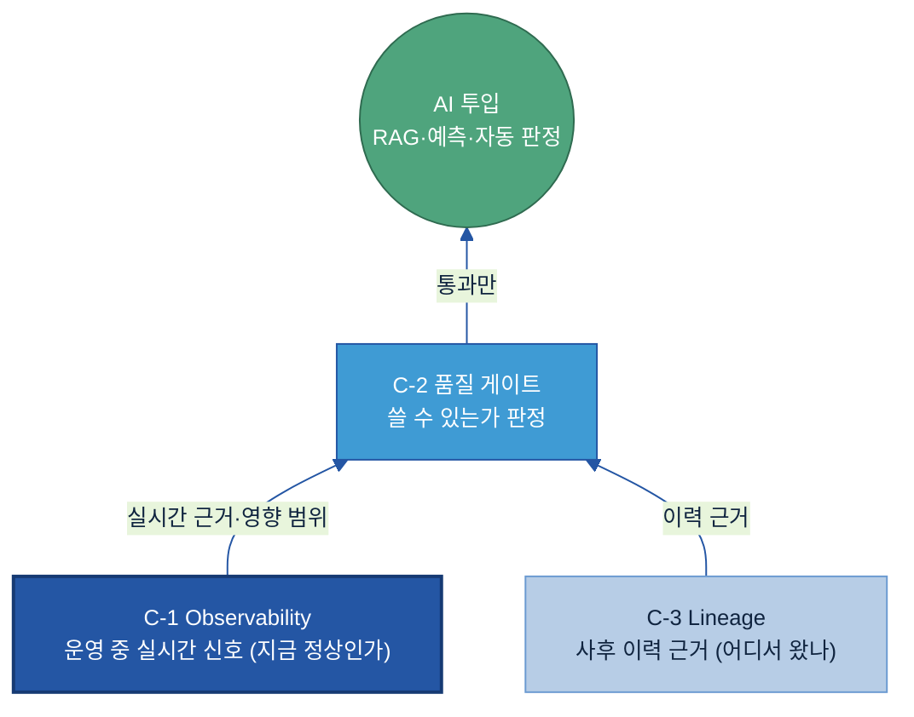
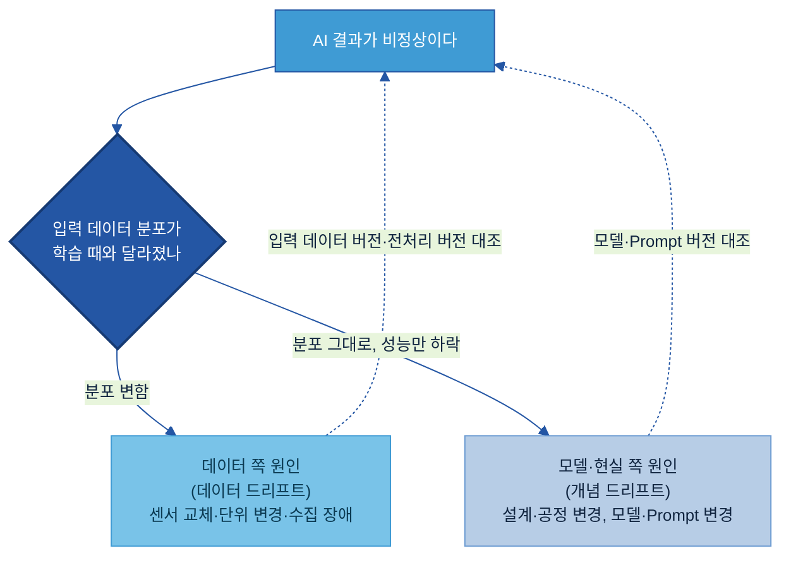
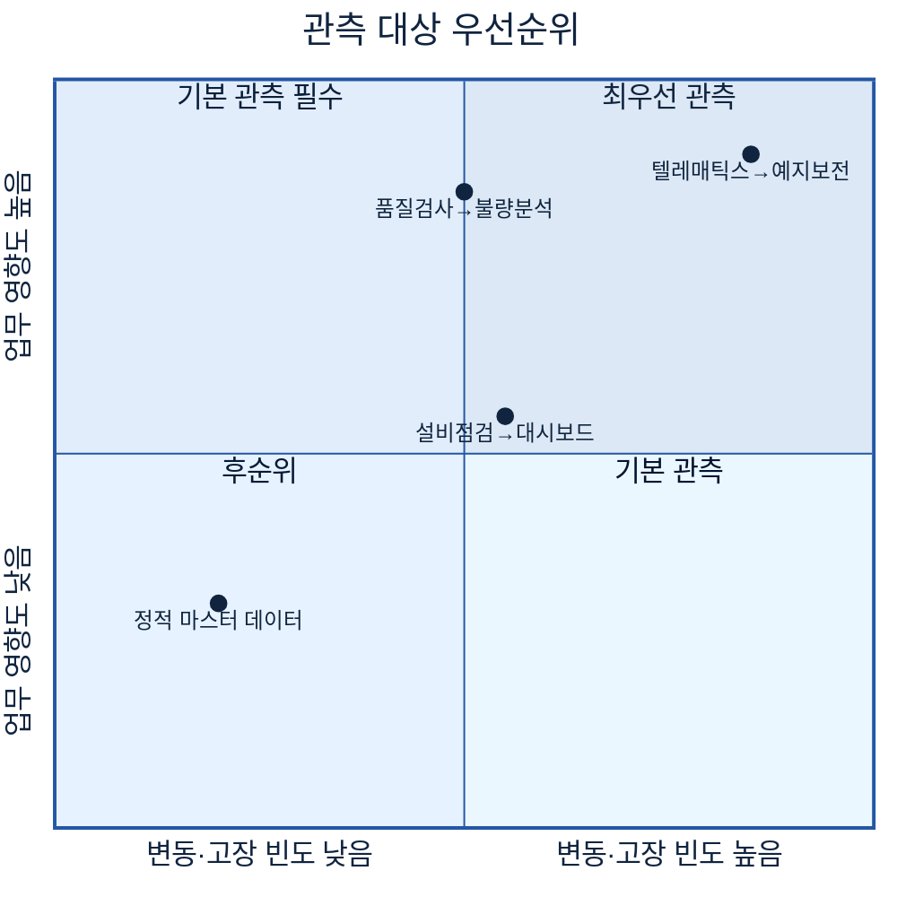
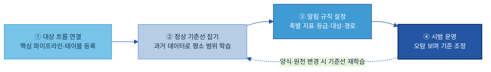
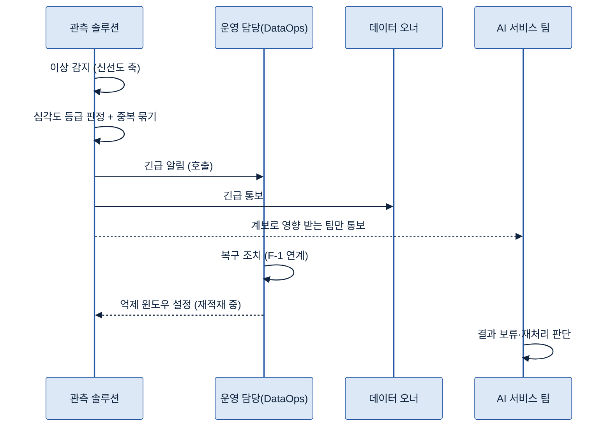

# C-1. 데이터 Observability 매뉴얼

> 정의: 데이터 흐름의 지연·누락·변경·이상 징후를 운영 중 감지·알림하는 모니터링 체계.

---

## 목차

1. [Why — 왜 필요한가](#why)
    - [1.1 현업 적용 시 발생하는 문제](#s11)
    - [1.2 관측으로 얻는 것](#s12)
2. [What — 무엇인가·무엇을 갖추나](#what)
    - [2.1 데이터 Observability의 역할과 체계 내 위치](#s21)
    - [2.2 관측 4축 — 무엇을 지켜보나](#s22)
    - [2.3 이상 판단 기준 — 고정 한계값과 평소 추세](#s23)
    - [2.4 알림 체계 — 심각도 등급과 알림 대상](#s24)
    - [2.5 원인 구분용 기록 — 데이터·모델 원인 구분](#s25)
3. [When — 어디부터 관측하나 (관측 대상 우선순위)](#when)
    - [3.1 기본 필수 대상](#s31)
    - [3.2 관측 우선순위 판단 기준](#s32)
4. [How — 어떻게 준비·운영하나](#how)
    - [4.1 적용 전후 비교](#s41)
    - [4.2 Observability 구축 절차](#s42)
    - [4.3 관측 지표·판단 기준 설정](#s43)
    - [4.4 알림·에스컬레이션 운영](#s44)
    - [4.5 운영 성과 측정](#s45)
5. [Tech Stack — 솔루션 검토](#tech)
    - [5.1 솔루션 유형](#s51)
    - [5.2 선정 기준](#s52)
6. [Where — 다른 주제와의 관계](#where)

- [참고자료 (References)](#참고자료-references) · [변경 이력 / 피드백 반영](#변경-이력--피드백-반영)

<!-- KQ→섹션 매핑(자가 점검): KQ1 관측 지표→2.2(s22) / KQ2 판단 기준→2.3(s23) / KQ3 알림→2.4(s24) / KQ4 데이터vs모델 구분→2.5(s25) / KQ5 운영 수준 측정→4.5 운영 성과 측정(s45). -->

---

> **관련 가이드:** [B-1 데이터 전처리](../B-1%20데이터%20전처리/B-1%20데이터%20전처리.md) · [A-2 메타데이터](../A-2%20메타데이터/A-2%20메타데이터.md) · [C-2 데이터 품질 관리](../C-2%20데이터%20품질%20관리/C-2%20데이터%20품질%20관리.md) · [C-3 데이터 계통 Lineage](../C-3%20데이터%20계통%20Lineage/C-3%20데이터%20계통%20Lineage.md) · [F-1 데이터 운영관리](../F-1%20데이터%20운영관리/F-1%20데이터%20운영관리.md)

이 가이드는 데이터 관측이 왜 필요한지(1장), 무엇을 지켜보고 무엇을 갖추는지(2장), 어디부터 적용하는지(3장), 실제로 어떻게 구축·운영하고 운영 수준을 어떻게 측정하는지(4장), 어떤 솔루션을 검토하는지(5장), 인접 주제와 어떻게 나뉘는지(6장)를 다룬다. AI는 들어온 데이터를 그대로 받아들여 결과를 산출하므로, 데이터가 중단되거나 변형된 시점을 사전에 감지하는 장치가 없으면 잘못된 데이터가 그대로 AI 결과로 이어진다.

## 이 가이드가 답하는 5가지 질문

| 핵심 질문 | 한 줄 답 | 다루는 곳 |
|---|---|---|
| 어떤 데이터 이상을 관찰해야 하는가? | 신선도·양·구조·값 분포 네 축을 정해 두고 각 축마다 지표를 건다 | [2.2 관측 4축](#kq1) |
| 이상 여부를 어떤 기준으로 판단할 것인가? | 고정 한계값과 평소 추세 두 방식을 데이터 성격에 따라 골라 쓰되, 제조 데이터는 평소 추세를 기본으로 한다 | [2.3 이상 판단 기준](#kq2) |
| 이상이 발생했을 때 누구에게 어떻게 알릴 것인가? | 긴급·주의·경고·정보 네 등급으로 나눠, 등급마다 알림 대상(데이터 오너·운영 담당·AI 서비스 팀)과 경로를 고정해 둔다 | [2.4 알림 체계](#kq3) |
| AI 결과 이상이 데이터 문제인지 모델 문제인지 어떻게 구분할 것인가? | 입력 데이터·전처리·모델·Prompt 버전을 함께 남겨, 입력 분포 변화 여부로 데이터 드리프트와 개념 드리프트를 먼저 가린다 | [2.5 원인 구분용 기록](#kq4) |
| Observability 운영 수준을 어떻게 측정할 것인가? | 이상 감지 시간(MTTD)·해결 시간(MTTR)·놓친 건수·오탐률·관측 커버리지 다섯 지표로 잰다 | [4.5 운영 성과 측정](#kq5) |

---

<a id="why"></a>

## 1. Why — 왜 필요한가

데이터는 구축 이후에도 지속적인 운영과 관리가 필요한 자산이다. 운영 과정에서는 수집 지연, 적재 누락, 건수 변화, 원천 시스템 변경 등으로 데이터 흐름에 비정상 상태가 발생할 수 있다. AI는 이 변화를 스스로 인지하지 못한 채 들어온 데이터를 사실로 받아들여 결과를 산출한다. 데이터 관측은 이 흐름의 이상을 운영 중에 감지해, 잘못된 데이터가 AI 결과로 굳기 전에 담당자에게 알린다.

<a id="s11"></a>

### 1.1 현업 적용 시 발생하는 문제

제조 현장에서 관측 장치 없이 AI 서비스를 운영할 때 반복적으로 발생하는 문제는 다음과 같다.

| 발생 문제 | 현업 영향 |
|---|---|
| 수집 중단을 늦게 인지함 | 새벽에 특정 지역 장비의 텔레매틱스 수집이 중단되었으나 익일 오전에야 인지된다. 그 사이 예지보전 AI는 직전 값으로 정상으로 판정한다 |
| 이상값이 그대로 적재됨 | 센서 교체·보정 오류로 측정값이 물리적으로 불가능한 범위로 유입되어도 걸러지지 않고 피처 테이블에 적재된다 |
| 원천 변경으로 하위 입력 오류 발생 | 단말 펌웨어 업데이트로 압력 단위나 컬럼명이 변경되면 하위 AI 입력에 오류가 발생하며, 결과 이상이 나타난 뒤에야 인지되는 경우가 많다 |
| 담당 책임이 불명확함 | 이상을 발견해도 데이터 오너·운영 담당·AI 서비스 팀 중 담당 주체가 지정되어 있지 않아 대응이 지연된다 |
| AI 결과 오류의 원인 구분이 어려움 | AI 결과가 비정상일 때 데이터·모델·Prompt 중 어느 영역의 문제인지 구분하지 못해 원인 추적에 장시간이 소요된다 |

공통점은 데이터가 없는 것이 아니라, 데이터에 이상이 발생한 시점을 감지할 장치가 없다는 점이다.

<a id="s12"></a>

### 1.2 관측으로 얻는 것

데이터 관측을 표준화하면 세 가지가 달라진다.

- 운영 중 이상 징후를 자동으로 감지한다. 수집 중단이나 이상값 유입이 발생하는 즉시 알림이 발송되어, 사용자 신고나 잘못된 보고가 발생하기 전에 대응 시간을 확보한다. 이상 발견 시간이 수일 단위에서 분 단위로 단축된다.
- 잘못된 데이터가 AI에 유입되는 것을 차단한다. 관측은 데이터가 신뢰 게이트([C-2 데이터 품질 관리](../C-2%20데이터%20품질%20관리/C-2%20데이터%20품질%20관리.md))를 통과하기 전 단계에서 데이터 흐름의 상태를 점검하여, AI 오작동·잘못된 자동 판정의 위험을 사전에 낮춘다.
- 원인 후보를 빠르게 구분한다. 데이터·전처리·모델·Prompt 버전을 함께 기록하면, AI 결과가 비정상일 때 데이터, 전처리, 모델, Prompt 중 원인 영역을 우선 구분하여 원인 분석 시간을 단축한다.

---

<a id="what"></a>

## 2. What — 무엇인가·무엇을 갖추나

이 장은 데이터 관측이 무엇이고 무엇으로 이루어지는지를 정의한다. 구축 절차와 운영 방법은 [4장](#how)에서 다루고, 여기서는 관측 체계의 위치와 네 가지 구성 요소(관측 4축·판단 기준·알림 체계·원인 구분 기록)를 정의한다.

<a id="s21"></a>

### 2.1 데이터 Observability의 역할과 체계 내 위치

데이터 Observability는 운영 중인 데이터 흐름의 상태를 지속적으로 지켜보다가, 지연·누락·구조 변경·값 이상 같은 징후가 나타나면 그 즉시 감지해 담당자에게 알리는 체계다. 공장의 관제실에 비유할 수 있다. 관제실은 설비를 직접 고치지는 않지만, 어느 라인이 멈췄고 어느 계기가 비정상인지를 한눈에 비추고 경보를 울려, 사람이 제때 손쓰게 한다. 데이터 관측도 데이터를 직접 고치거나 사용 여부를 판정하지는 않는다. 흐름이 정상인지 지켜보고 이상을 알리는 데까지가 책임 범위다.

데이터 관측은 데이터를 신뢰할 수 있게(Trustworthy) 만드는 C 그룹에 속한다. C 그룹은 세 주제가 역할을 나눈다. 사용 여부를 판정하는 [C-2 데이터 품질 관리](../C-2%20데이터%20품질%20관리/C-2%20데이터%20품질%20관리.md)가 상위의 관문이라면, C-1은 운영 중 실시간 신호로, [C-3 데이터 계통 Lineage](../C-3%20데이터%20계통%20Lineage/C-3%20데이터%20계통%20Lineage.md)는 사후 이력으로 그 판정에 근거를 댄다. C-1이 보는 것은 "지금 이 순간 흐름이 정상인가"이고, 다른 주제와의 경계는 [6장](#where)에서 정리한다.



C-1은 이 그림의 왼쪽 아래 신호원이다. 흐름이 멈췄거나 틀어졌다는 신호를 가장 먼저 띄워, 품질 게이트와 운영 담당이 손쓰게 한다.

<a id="s22"></a>

### 2.2 관측 4축 — 무엇을 지켜보나

<a id="kq1"></a>

관측은 막연히 "데이터를 본다"가 아니라, 흐름이 망가지는 **네 가지 길목**을 정해 두고 그 길목마다 지표를 건다. 본 가이드는 이 네 가지를 관측의 정본 모델로 삼아 끝까지 일관되게 쓴다.

| 관측 축 | 무엇을 보나 | 이상 신호 (텔레매틱스 예시) |
|---|---|---|
| **① 신선도 (Freshness)** | 데이터가 제때 들어오는가 | 1분 주기로 와야 할 장비 데이터가 15분째 새 레코드 없음 — 수집 중단의 첫 신호 |
| **② 양 (Volume)** | 평소만큼의 건수가 들어오는가 | 하루 5만 건 적재되던 가동 로그가 오늘 200건만 — 수집 어댑터 장애·지역 단절 |
| **③ 구조 (Schema)** | 칸 구조·단위가 그대로인가 | 펌웨어 업데이트 후 `pressure_kpa` 컬럼이 사라지고 단위가 바뀜 — 하위 입력 어긋남 |
| **④ 값 분포 (Distribution)** | 값이 정상 범위 안에 있는가 | 평소 결측 2%이던 유압 센서가 갑자기 40% 결측, 또는 오류코드 -999가 채워짐 |

이 네 축은 데이터 관측 업계에서 흔히 쓰는 다섯 기둥(5 Pillars) 가운데 네 가지다[1]. 다섯 번째 기둥인 계보(Lineage)는 [C-3 데이터 계통 Lineage](../C-3%20데이터%20계통%20Lineage/C-3%20데이터%20계통%20Lineage.md)가 별도로 맡으므로 관측 지표에서는 제외하되, C-1은 이상이 났을 때 "이 데이터를 누가 쓰는가"를 찾아 알림 대상을 정할 때 계보를 활용한다([2.4](#s24)).

네 축이 흐르는 데이터 위에서 동시에 켜져 있는 모습은 관제 화면 한 장으로 그려진다.


<a id="s23"></a>

### 2.3 이상 판단 기준 — 고정 한계값과 평소 추세

<a id="kq2"></a>

지표를 걸었으면 "어디까지가 정상이고 어디부터가 이상인가"를 정해야 한다. 판단 기준은 두 방식이 있고, 데이터 성격에 따라 골라 쓴다.

- **고정 한계값(Threshold):** "건수가 1,000건 미만이면 이상", "온도가 150도를 넘으면 이상"처럼 값을 직접 정한다. 물리 한계나 규정으로 정상 범위가 명확할 때 적합하다. 단순하고 설명하기 쉽지만, 주말 생산 감소나 시간대별 변동 같은 정상적인 출렁임에도 알림이 울려 알림 피로(alert fatigue)를 부른다.
- **평소 추세 대비 (적응형 베이스라인, Adaptive Baseline):** 과거의 요일·시간대·계절 패턴을 학습해 "이 시간대의 정상 범위"를 자동으로 잡고, 그 범위를 벗어날 때만 알린다. 변동이 큰 제조 데이터에 맞고, 임계값을 일일이 정하지 않아도 된다. 다만 학습 초기에는 정확도가 낮고, 왜 이상으로 봤는지 설명이 어려울 수 있다.

둘은 배타적이지 않다. 물리 한계처럼 명확한 곳은 고정 한계값으로 단단히 막고, 변동이 큰 흐름은 평소 추세로 거는 식으로 함께 쓴다.


> **권장 — 평소 추세를 기본으로, 고정 한계값을 보강으로.** 제조 데이터는 요일·교대·계절 변동이 커서 고정 한계값만으로는 오탐이 많다. 평소 추세를 기본으로 걸고, 물리적으로 불가능한 값(음수 두께, 오류코드)이나 규정 한계는 고정 한계값으로 덧대는 조합을 권장한다.

<a id="s24"></a>

### 2.4 알림 체계 — 심각도 등급과 알림 대상

<a id="kq3"></a>

이상을 잡아도 엉뚱한 사람에게 가거나 모두에게 똑같이 가면 대응이 늦는다. 알림은 **심각도 등급**으로 무게를 나누고, 등급마다 **누구에게·어떤 경로로** 보낼지를 정해 둔다.

| 심각도 | 어떤 상황 | 알림 대상 | 경로·시점 |
|---|---|---|---|
| **긴급 (높음)** | 핵심 흐름 완전 중단·데이터 손실, AI 서비스 즉시 영향 | 운영 당번 + 데이터 오너 + AI 서비스 팀 | 즉시 호출(전화·메신저 호출) + 채널 공지 |
| **주의 (중간)** | 핵심 흐름 지연·부분 손상, 우회 가능 | 운영 당번 + 운영 팀 | 메신저 알림, 정해진 시간 내 확인 |
| **경고 (낮음)** | 일부 구간 품질 이상, AI 즉시 영향 없음 | 운영 팀 | 업무 시간 메신저 알림, 당일 처리 |
| **정보** | 경미한 스키마 경고·소수 필드 이상 | 담당자 | 로그·티켓 기록, 정기 검토 |

알림을 받는 사람은 역할에 따라 셋으로 나뉜다. **데이터 오너**는 해당 데이터의 비즈니스 책임자로, 긴급·주의 등급에서 함께 받는다. **운영 담당(DataOps)**은 파이프라인을 실제로 손보는 사람으로 대부분의 등급에 포함된다. **AI 서비스 운영자**는 그 데이터를 쓰는 AI 모델·서비스 팀으로, 계보([C-3](../C-3%20데이터%20계통%20Lineage/C-3%20데이터%20계통%20Lineage.md))로 영향 범위를 확인해 관련된 팀만 골라 알린다. 긴급 건이 정해진 시간 안에 확인되지 않으면 상위 책임자로 자동 에스컬레이션하는 규칙을 둔다.

<a id="s25"></a>

### 2.5 원인 구분용 기록 — 데이터·모델 원인 구분

<a id="kq4"></a>

AI 결과가 비정상일 때 가장 먼저 확인해야 하는 것은 데이터 문제인지, 모델 문제인지, Prompt 변경의 영향인지 구분하는 것이다. 이를 구분하려면 결과가 산출된 시점의 **각 단계 버전을 함께 기록해** 두어야 한다. 무엇을 기록하는지가 관측 체계의 한 구성 요소다.

| 기록 항목 | 무엇을 남기나 | 확인 포인트 |
|---|---|---|
| 입력 데이터 버전 | 추론에 쓰인 데이터 스냅샷 시점 | 이 시점에 스키마·분포 변화가 있었나 |
| 전처리 버전 | 전처리 파이프라인 버전([B-1](../B-1%20데이터%20전처리/B-1%20데이터%20전처리.md)) | 정규화·필터 로직이 바뀌었나 |
| 모델 버전 | 추론에 쓴 모델 체크포인트 | 재학습·배포 이력이 있나 |
| Prompt 버전 | LLM 기반이면 Prompt 텍스트 버전 | 문구가 바뀌었나 |

원인을 구분하는 핵심은 입력 데이터의 분포 변화 여부를 먼저 확인하는 것이다. 입력 분포가 학습 때와 달라졌으면(데이터 드리프트, data drift) 센서 교체·단위 변경·수집 장애 같은 데이터 쪽 원인이 유력하다. 반대로 입력 분포는 그대로인데 성능만 떨어졌으면(개념 드리프트, concept drift) 제품 설계 변경이나 공정 조건 변화처럼 현실이 달라진 것이거나 모델·Prompt 쪽 문제다. 이 구분이 가능해야 데이터 파이프라인, 모델, Prompt 가운데 어떤 영역을 우선 점검할지 결정할 수 있다.



> **주의 — 책임 경계.** C-1은 원인을 "데이터 쪽인지 아닌지" 가르는 신호와 기록까지 책임진다. 모델 재학습이나 Prompt 개선 자체는 [E-4 데이터 Feedback Loop](../E-4%20데이터%20Feedback%20Loop/E-4%20데이터%20Feedback%20Loop.md)와 각 모델·Prompt 주제가 맡는다.

---

<a id="when"></a>

## 3. When — 어디부터 관측하나 (관측 대상 우선순위)

관측은 기본적으로 모든 핵심 흐름에 필요하지만, 한 번에 전부 걸지는 않는다. AI 서비스로 바로 흘러가는 흐름부터 걸고, 변동이 잦거나 중단 시 업무 영향이 큰 흐름으로 관측 범위를 확대한다.

<a id="s31"></a>

### 3.1 기본 필수 대상

가장 먼저 거는 대상은 AI 서비스와 핵심 리포트로 **바로 흘러가는 흐름**이다. 이 흐름이 멈추거나 틀어지면 곧장 잘못된 AI 결과·잘못된 보고로 이어지기 때문이다. 텔레매틱스 예시라면 장비 데이터 수집 파이프라인부터 그 데이터가 적재되는 피처 테이블, 예지보전 AI가 읽는 입력까지가 1순위다.

<a id="s32"></a>

### 3.2 관측 우선순위 판단 기준

기본 대상에 관측을 적용한 이후에는 업무 영향도와 변동 수준을 고려하여 관측 수준을 단계적으로 높인다. 두 가지 축으로 우선순위를 매긴다. 하나는 그 흐름이 틀어졌을 때의 **업무 영향도**(AI 서비스·안전·품질 판정에 직접 닿는가), 다른 하나는 그 흐름의 **변동·고장 빈도**(원천이 자주 바뀌거나 수집이 자주 끊기는가)다.

| 후보 흐름 | 업무 영향도 | 변동·고장 빈도 | 착수 순위 |
|---|---|---|---|
| 텔레매틱스 수집 → 예지보전 AI 입력 | 높음 | 높음 | 1 — 즉시 적용 |
| 품질검사 결과 적재 → 불량 분석 | 높음 | 중간 | 1 — 즉시 적용 |
| 설비 점검 집계 → 운영 대시보드 | 중간 | 중간 | 2 — 기본 관측 |
| 사내 참고용 정적 마스터 데이터 | 낮음 | 낮음 | 3 — 후순위 |



영향도가 높고 변동도 잦은 오른쪽 위(텔레매틱스 흐름)는 관측 수준을 가장 높게 적용하고, 영향도는 높지만 변동이 적은 흐름은 기본 관측을 빠짐없이 적용한다. 영향도가 낮은 정적 데이터는 후순위로 둔다.

---

<a id="how"></a>

## 4. How — 어떻게 준비·운영하나

관측은 한 번 켜고 끝나는 것이 아니라, 대상을 연결하고 정상 기준을 잡아 알림을 걸고, 운영하며 알림 피로를 줄여 나가는 과정이다. 본 장은 적용 전후의 차이부터, 구축 절차, 지표·판단 기준 설정, 알림·에스컬레이션 운영, 운영 성과 측정까지 순서대로 다룬다.

<a id="s41"></a>

### 4.1 적용 전후 비교

두산밥캣 장비 텔레매틱스 수집 파이프라인을 가상 예시로 든다. 전 세계 현장의 건설장비가 엔진온도·유압·연료·가동시간을 1분 주기로 클라우드에 보내고, 그 데이터가 데이터 레이크와 피처 테이블을 거쳐 예지보전 AI로 흐른다. 어느 새벽, 한 지역의 통신 장애로 수집이 끊긴 상황을 비교한다.

| 구분 | 관측 없을 때 | 관측 있을 때 |
|---|---|---|
| 수집 중단 발견 | 아침 출근 후 대시보드가 비어 있어 알아챔 (약 7시간 후) | 새 레코드가 끊긴 지 몇 분 만에 신선도 축이 경보 |
| 그 사이 AI 동작 | 어제 값으로 "정상"이라 답해 점검 시점을 놓침 | 영향 받는 AI 서비스 팀에 함께 통보되어 결과를 보류 |
| 원인 파악 | 데이터·모델·통신 중 어디 문제인지 며칠 추적 | 신선도 축만 켜지고 값 분포는 정상 → 수집 단계 문제로 즉시 좁힘 |


<a id="s42"></a>

### 4.2 Observability 구축 절차

관측 체계는 네 단계로 구축한다.



- **① 대상 흐름 연결.** [3장](#when)에서 고른 핵심 파이프라인·테이블을 관측 솔루션에 등록한다. 어떤 데이터를 어디서 읽는지를 연결하는 단계다.
- **② 정상 기준선 잡기.** 과거 데이터로 "평소 이 시간대엔 이 정도"라는 정상 범위를 학습시킨다. 고정 한계값이 명확한 축은 값을 직접 넣고, 변동이 큰 축은 평소 추세를 학습시킨다([2.3](#s23)). 축별 설정 세부는 [4.3](#s43)에서 다룬다.
- **③ 알림 규칙 설정.** 4축마다 지표를 걸고, 이상 시 심각도 등급·알림 대상·경로를 [2.4](#s24)의 표대로 지정한다.
- **④ 시범 운영.** 며칠~몇 주 시범으로 돌리며 오탐을 본다. 너무 자주 울리면 기준을 느슨하게, 놓친 이상이 있으면 더 민감하게 조정한 뒤 본 운영으로 넘긴다. 운영하며 기준을 다듬는 되돌림 고리는 [4.4](#s44)에서 이어진다.

<a id="s43"></a>

### 4.3 관측 지표·판단 기준 설정

구축 절차의 ②·③단계에서는 4축마다 거는 지표와 판단 방식·정상 기준·심각도·알림 대상을 정한다. 관측 대상 흐름 하나를 등록할 때 아래 항목을 채워 알림 규칙을 만든다. 빈 템플릿을 그대로 복사해 흐름마다 1건씩 작성한다.

| 관측 축 | 점검 지표 | 판단 방식 | 정상 기준(예시값) | 이상 시 심각도 | 알림 대상 |
|---|---|---|---|---|---|
| 신선도 | 마지막 적재 후 경과 시간 | 고정 한계값 | 5분 이내 | 긴급 | 운영 담당 + 데이터 오너 |
| 양 | 시간당 적재 건수 | 평소 추세 | 평소 범위 ±30% | 주의 | 운영 담당 |
| 구조 | 컬럼·타입·단위 변경 | 변경 감지 | 변경 없음 | 주의 | 운영 담당 + AI 서비스 팀 |
| 값 분포 | 결측률 / 범위 이탈 | 평소 추세 + 물리 한계 | 결측 5% 이내, 음수 없음 | 경고 | 운영 담당 |

빈 템플릿:

```text
대상 흐름: ____________________ (예: 텔레매틱스 수집 → 피처 테이블)
오너: __________  운영 담당: __________  쓰는 AI 서비스: __________
[신선도]  지표:________  방식: 고정/추세  정상기준:________  심각도:____  대상:________
[양]      지표:________  방식: 고정/추세  정상기준:________  심각도:____  대상:________
[구조]    지표:________  방식: 변경감지    정상기준:________  심각도:____  대상:________
[값 분포] 지표:________  방식: 고정/추세  정상기준:________  심각도:____  대상:________
```

<a id="s44"></a>

### 4.4 알림·에스컬레이션 운영

관측 운영의 성패는 **알림 피로를 줄이는 것**에 달려 있다. 사소한 알림이 쏟아지면 팀이 알림을 무시하기 시작해 정작 진짜 이상을 놓친다. 다음 네 가지로 알림을 줄인다.

- **등급 조정.** 모든 알림을 같은 경로로 보내지 않는다. 긴급만 호출로, 경고는 메신저·로그로 분리한다([2.4](#s24)).
- **중복 묶기(Grouping).** 같은 원인에서 연달아 나는 알림은 하나의 사건으로 묶어 한 번만 알린다.
- **억제 윈도우(Suppression Window).** 계획된 정비·배치 작업 중에는 알림을 잠시 멈춘다. 예컨대 수집 복구 후 누락분을 한꺼번에 재적재하면 양 축이 급증하는데, 이는 정상이므로 억제한다.
- **기준 되돌림.** 시범 운영 이후에도 오탐·놓침을 주기적으로 보며 기준을 다듬는다. 오탐이 잦으면 기준을 느슨하게, 놓친 이상이 있으면 더 민감하게 되돌려 조정한다.

운영 역할은 셋으로 나뉜다. **데이터 오너**는 자기 도메인 데이터의 정상 기준이 맞는지 확인하고 긴급 이상에 의사결정을 한다. **운영 담당(DataOps)**은 알림을 받아 파이프라인을 복구하고 기준을 유지·조정한다. **AI 서비스 운영자**는 자기 서비스에 영향이 오는 이상을 통보받아 결과 보류·재처리를 판단한다. 복구된 파이프라인을 다시 돌리고 재실행하는 운영 인프라 자체는 [F-1 데이터 운영관리](../F-1%20데이터%20운영관리/F-1%20데이터%20운영관리.md)가 맡는다.



<a id="s45"></a>

### 4.5 운영 성과 측정

<a id="kq5"></a>

관측 체계의 운영 수준은 "얼마나 빨리 잡고, 얼마나 안 놓치며, 얼마나 넓게 보는가"로 잰다. 아래 다섯 지표를 핵심으로 둔다. 절대 기준값보다 자체 목표(SLA)를 먼저 세우고 그와 비교하는 방식을 권장한다.

| 지표 | 쉬운 의미 | 측정 목적 | 산식 (산정 가능 시) | 방향 |
|---|---|---|---|---|
| **이상 감지 시간 (MTTD)** | 이상이 난 시점부터 알림이 뜰 때까지 걸린 평균 시간 | 얼마나 빨리 잡는가 | 평균(알림 발송 시각 − 이상 발생 시각) | 낮을수록 좋음 (↓) |
| **해결 시간 (MTTR)** | 알림 후 정상 복구까지 걸린 평균 시간 | 얼마나 빨리 푸는가 | 평균(정상 복구 시각 − 알림 발송 시각) | 낮을수록 좋음 (↓) |
| **놓친 건수** | 관측이 못 잡고 사용자 신고 등 다른 경로로 발견된 이상 건수 | 빠뜨리지 않는가 | 기간 내 다른 경로로 발견된 이상 건수 (집계) | 낮을수록 좋음 (↓) |
| **오탐률** | 전체 알림 중 실제 이상이 아니었던 알림 비율 | 알림이 믿을 만한가 | (전체 알림 건수 − 실제 이상 확인 건수) ÷ 전체 알림 건수 | 낮을수록 좋음 (↓) |
| **관측 커버리지** | 전체 핵심 파이프라인 중 관측이 걸린 비율 | 얼마나 넓게 보는가 | 관측 등록 파이프라인 수 ÷ 전체 핵심 파이프라인 수 | 높을수록 좋음 (↑) |

이상 감지 시간과 놓친 건수는 [1.2](#s12)에서 말한 "이상을 사전에 감지한다"는 목표와 직접 이어진다. 오탐률은 [4.4](#s44)의 알림 피로와 맞물린다. 오탐률을 무리하게 0으로 누르면 놓친 건수가 늘 수 있으므로, 두 지표는 함께 본다. 커버리지는 [3장](#when)의 우선순위에 따라 핵심 흐름부터 100%에 가깝게 올리는 것을 목표로 한다.

---

<a id="tech"></a>

## 5. Tech Stack — 솔루션 검토

> **2층 연결:** 솔루션을 주제 가로질러 묶어 평가·선정하려면 → [Tech Stack 비교 정본](../../Tech%20Player/01%20Tech%20Stack%20비교%20(솔루션×주제).md). 본 절은 데이터 관측 관점에서 솔루션의 기능을 비교한다.

<a id="s51"></a>

### 5.1 솔루션 유형

데이터 관측 솔루션은 세 유형으로 나뉜다.

| 유형 | 특징 | 대표 솔루션 |
|---|---|---|
| **전용 데이터 관측 솔루션** | 4축을 자동으로 학습·감지, 계보·알림 연동까지 갖춘 통합 플랫폼 | [Monte Carlo](https://montecarlo.ai)[2] · [Anomalo](https://www.anomalo.com)[3] · [Bigeye](https://www.bigeye.com)[4] · [Soda](https://www.soda.io)[5] · [Metaplane](https://www.metaplane.dev)[6] · [Acceldata](https://www.acceldata.io)[7] · [Sifflet](https://www.siffletdata.com)[8] |
| **데이터 플랫폼 내장형** | 이미 쓰는 데이터 플랫폼에 딸린 관측·품질 기능 | [Databricks Data Quality Monitoring](https://www.databricks.com/product/data-quality-monitoring)[9] · [Snowflake DMF](https://docs.snowflake.com/en/user-guide/data-quality-intro)[10] · [dbt tests·source freshness](https://docs.getdbt.com/docs/build/data-tests)[11] · [AWS Glue Data Quality](https://aws.amazon.com/glue/data-quality/)[12] |
| **오픈소스** | 직접 호스팅해 비용을 낮추는 라이브러리·도구 | [Great Expectations](https://greatexpectations.io)[13] · [Soda Core](https://github.com/sodadata/soda-core)[14] · [Elementary](https://www.elementary-data.com)[15] · [Deequ](https://github.com/awslabs/deequ)[16] · [Evidently](https://www.evidentlyai.com)[17] |

전용 솔루션은 임계값을 일일이 정하지 않아도 평소 추세를 자동 학습해 초기 운영 부담이 낮다. 플랫폼 내장형은 이미 그 플랫폼을 쓰면 추가 도입 없이 켤 수 있으나 해당 환경에 묶인다. 오픈소스는 비용이 낮지만 알림·운영 화면을 직접 붙여야 한다. 분포 드리프트나 예측 품질 관측이 핵심이면 Evidently[17] 같은 도구를 보강으로 쓴다.

<a id="s52"></a>

### 5.2 선정 기준

솔루션은 다음 기준으로 비교한다. 가격·세부 기능은 자주 바뀌므로 단정하지 말고 공식 문서와 PoC(개념 검증)로 확인한다.

| 선정 기준 | 확인 포인트 |
|---|---|
| 이상탐지 방식 | 평소 추세를 자동 학습하는가(룰을 일일이 안 짜도 됨) vs 규칙을 직접 정의해야 하는가 |
| 계보 연계 | 이상이 났을 때 상위 원인·하위 영향 범위를 자동으로 추적하는가([C-3](../C-3%20데이터%20계통%20Lineage/C-3%20데이터%20계통%20Lineage.md) 연계) |
| 컬럼 단위 지원 | 테이블 전체뿐 아니라 특정 컬럼(불량률·출하량) 단위로 이상을 잡는가 |
| 알림 연동 | 사내가 쓰는 메신저·호출 도구에 바로 연동되는가 |
| 배포 형태 | 사외 반출이 제한되는 제조 데이터라면 온프렘·단일 테넌트(VPC)·메타데이터만 읽기를 지원하는가 |

> **권장 — 사외 반출 제약을 먼저 확인.** 제조 현장 데이터는 사외 반출이 제한되는 경우가 많다. 클라우드 SaaS를 쓰기 어려우면 온프렘·VPC 배포가 되는 전용 솔루션이나 오픈소스(Elementary·Great Expectations·Deequ) 자기호스팅을 우선 검토한다.

---

<a id="where"></a>

## 6. Where — 다른 주제와의 관계

데이터 관측은 운영 중 실시간 신호에만 집중한다. 이상을 잡은 다음의 판정·추적·복구는 인접 주제가 맡으며, 경계는 다음과 같다.

| 인접 주제 | 그 주제의 역할 | C-1과의 경계 |
|---|---|---|
| [C-2 데이터 품질 관리](../C-2%20데이터%20품질%20관리/C-2%20데이터%20품질%20관리.md) | 데이터를 AI에 쓸 수 있는지 판정 | C-1은 "지금 흐름이 정상인가"를 신호로 띄우고, C-2는 그 데이터를 "쓸 수 있는가"를 판정한다. C-1은 근거를 대고 C-2가 결정한다 |
| [C-3 데이터 계통 Lineage](../C-3%20데이터%20계통%20Lineage/C-3%20데이터%20계통%20Lineage.md) | 출처·이동·변환 이력 추적 | C-1은 "지금 이상"을 실시간 감지하고, C-3는 "어디서 와서 어디로 갔나"를 사후 추적한다. C-1은 알림 대상을 찾을 때 C-3의 계보를 활용한다 |
| [F-1 데이터 운영관리](../F-1%20데이터%20운영관리/F-1%20데이터%20운영관리.md) | 파이프라인 실행·복구·재처리 | C-1은 이상을 알리는 데까지, 멈춘 파이프라인을 다시 돌리고 복구하는 운영 실행은 F-1이 맡는다 |
| [B-1 데이터 전처리](../B-1%20데이터%20전처리/B-1%20데이터%20전처리.md) | 비정형 데이터를 AI가 읽을 구조로 변환 | B-1은 전처리 산출물을 만들고, C-1은 그 산출물이 운영 중에도 건강한지 지켜본다. 양식이 바뀌어 전처리가 깨지면 C-1의 구조·값 분포 축이 잡아낸다 |
| [A-2 메타데이터](../A-2%20메타데이터/A-2%20메타데이터.md) | 필드·단위·갱신 주기 등 속성 정의 | A-2가 정한 단위·갱신 주기·허용값이 C-1이 이상을 판단하는 기준이 된다 |

---

## 참고자료 (References)

본문 곳곳의 **[N]** 표시를 누르면 아래 해당 항목으로 이동한다. 가격·세부 기능은 변동하므로 도입 시 각 공식 문서·PoC로 최신 정보를 확인한다.

**개념·프레임워크**
- <a id="ref1"></a>**[1]** Monte Carlo — The 5 Pillars of Data Observability — <https://montecarlo.ai/blog-what-is-data-observability/>

**전용 데이터 관측 솔루션**
- <a id="ref2"></a>**[2]** Monte Carlo — <https://montecarlo.ai>
- <a id="ref3"></a>**[3]** Anomalo — <https://www.anomalo.com>
- <a id="ref4"></a>**[4]** Bigeye — <https://www.bigeye.com>
- <a id="ref5"></a>**[5]** Soda — <https://www.soda.io>
- <a id="ref6"></a>**[6]** Metaplane (Datadog 인수) — <https://www.metaplane.dev>
- <a id="ref7"></a>**[7]** Acceldata — <https://www.acceldata.io>
- <a id="ref8"></a>**[8]** Sifflet — <https://www.siffletdata.com>

**데이터 플랫폼 내장형**
- <a id="ref9"></a>**[9]** Databricks Data Quality Monitoring — <https://www.databricks.com/product/data-quality-monitoring>
- <a id="ref10"></a>**[10]** Snowflake Data Metric Functions — <https://docs.snowflake.com/en/user-guide/data-quality-intro>
- <a id="ref11"></a>**[11]** dbt tests — <https://docs.getdbt.com/docs/build/data-tests>
- <a id="ref12"></a>**[12]** AWS Glue Data Quality — <https://aws.amazon.com/glue/data-quality/>

**오픈소스**
- <a id="ref13"></a>**[13]** Great Expectations — <https://greatexpectations.io>
- <a id="ref14"></a>**[14]** Soda Core — <https://github.com/sodadata/soda-core>
- <a id="ref15"></a>**[15]** Elementary — <https://www.elementary-data.com>
- <a id="ref16"></a>**[16]** Deequ — <https://github.com/awslabs/deequ>
- <a id="ref17"></a>**[17]** Evidently — <https://www.evidentlyai.com>

---

## 변경 이력 / 피드백 반영

| 일자 | 버전 | 피드백 (누가/무엇) | 반영 내용 | 반영 위치 |
|------|------|--------------------|-----------|-----------|
| 2026-06-24 | 0.1 | 초안 작성 (00 전체 목차 C-1 8섹션·B-3/B-1 스타일·0622 작업지시 문체) | Why→What→When→예시→Tech Stack→How→Where→KPI 전 섹션 작성. 정본 모델=관측 4축(신선도·양·구조·값 분포), 일관 예시=두산밥캣 텔레매틱스. Mermaid 5종 + SVG 3종. Key Question 5개 전부 커버 | 전체 |
| 2026-06-24 | 0.2 | KQ 가시화 위치 변경 (공통 규칙 개정) | 절머리 안내 제거 후 핵심 질문 박스를 문서 맨 마지막에 신설·목차에 점검 링크 | 맨 끝·목차 |
| 2026-06-29 | 0.3 | 0629 작업지시 반영 (고객) | ① 섹션 순서 Why→What→When→How→Tech Stack→Where로 재편(How를 Tech Stack 앞으로). ② 예시 시나리오를 How 4.1로, 구 KPI 섹션을 How 4.5 운영 성과 측정으로 흡수(산식 칼럼 추가). ③ How를 4.1 적용 전후 비교·4.2 구축 절차·4.3 지표·판단 기준 설정(구 별첨 점검표 흡수)·4.4 알림·에스컬레이션 운영·4.5 운영 성과 측정으로 재구성. ④ 5가지 질문 표를 머릿말 다음 문서 상단으로 이동, "예시 표기 안내" 박스 삭제. ⑤ 제목 "(한눈에)" 삭제·제목 금지기호(+)·금지어(촘촘히·탓인지) 제거. ⑥ 1~3장 문구를 보고서 톤으로 수정(막히는 지점/값이 튀어도/조용히 망가진다/엉뚱한 곳을 뒤지는 시간/누가 볼 것인지 등 제거). 4장 이후 문구는 다음 라운드 예정 | 전체 |
