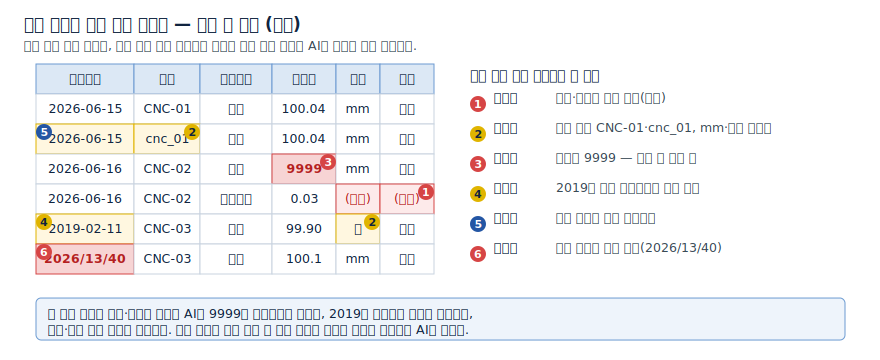
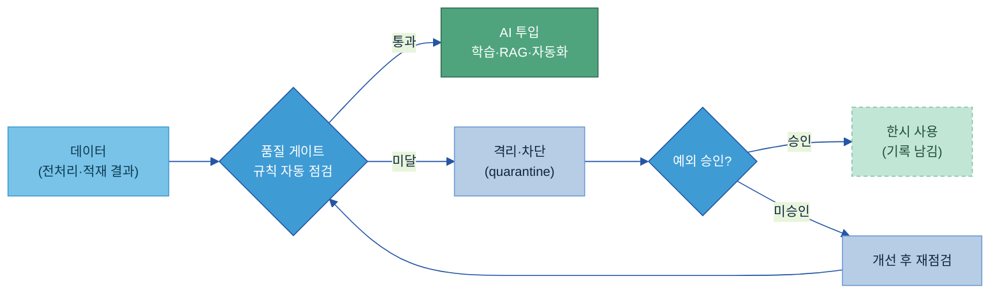
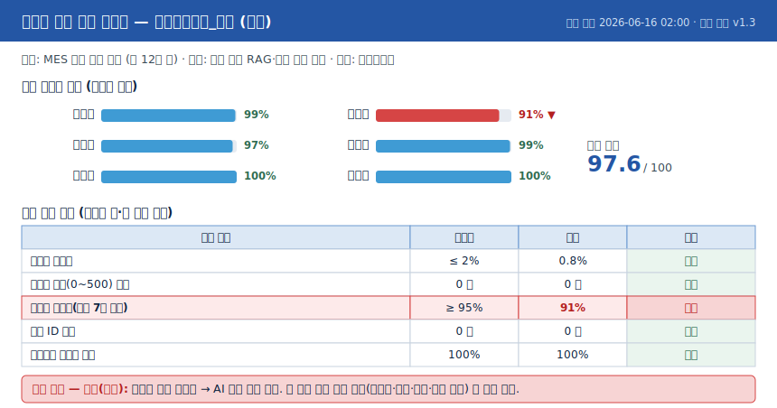
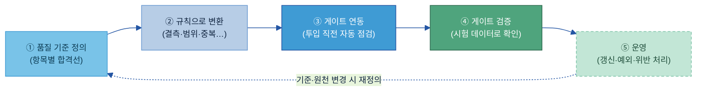
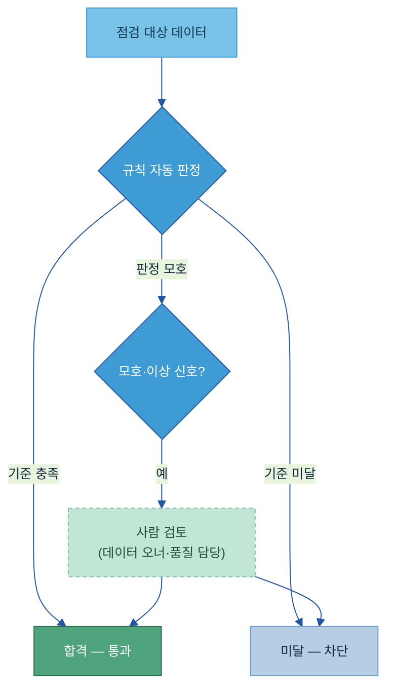
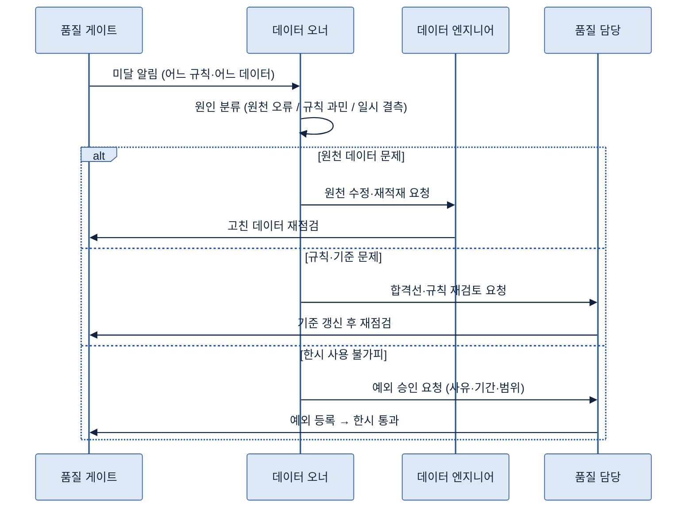

# C-2. 데이터 품질 관리(Data Quality Management) 가이드

> 정의: 데이터가 AI 활용 기준을 충족하는지 판정해, 통과한 데이터만 AI에 투입되게 하는 통제 체계. "쓸 수 있는가"를 판정하는 관문이다.

---

## 목차

1. [Why — 왜 필요한가](#why)
    - [1.1 현업 적용 시 발생하는 문제](#s11)
    - [1.2 기대 효과](#s12)
2. [What — 무엇인가·무엇을 갖추나](#what)
    - [2.1 데이터 품질 관리의 정의와 역할](#s21)
    - [2.2 품질 기준 — 여섯 가지 항목](#s22)
    - [2.3 AI에 쓰면 안 되는 데이터](#s23)
    - [2.4 Quality Gate](#s24)
3. [When — 어디부터 게이트를 적용하나 (적용 우선순위)](#when)
    - [3.1 기본 필수 대상](#s31)
    - [3.2 적용 우선순위 판단 기준](#s32)
4. [How — 어떻게 준비·운영하나](#how)
    - [4.1 적용 전후 비교](#s41)
    - [4.2 구축 절차](#s42)
    - [4.3 품질 규칙과 자동 판정](#s43)
    - [4.4 운영 — 기준 갱신·예외 승인·위반 처리](#s44)
5. [Tech Stack — 품질 솔루션 검토](#tech)
    - [5.1 솔루션 유형](#s51)
    - [5.2 선정 기준](#s52)
6. [Where — 다른 주제와의 관계](#where)
7. [KPI — 성과 지표](#kpi)
    - [7.1 관리 기준과 핵심 KPI](#s71)

- [별첨 (Appendix)](#별첨-appendix) · [참고자료 (References)](#참고자료-references) · [변경 이력 / 피드백 반영](#변경-이력--피드백-반영)

<!-- KQ→섹션 매핑(자가 점검): KQ1 AI 활용을 위한 데이터 품질 기준→2.2(s22)+2.3(s23) / KQ2 AI 사용 제한 데이터→2.4(s24)+3(when) / KQ3 Quality Gate→4.2(s42)+4.3(s43)+4.4(s44) / KQ4 품질 관리 측정→7.1(s71). -->
---

> **관련 가이드:** [B-1 데이터 전처리](../B-1%20데이터%20전처리/B-1%20데이터%20전처리.md) · [C-1 Observability](../C-1%20Observability/C-1%20Observability.md) · [C-3 데이터 계통 Lineage](../C-3%20데이터%20계통%20Lineage/C-3%20데이터%20계통%20Lineage.md) · [A-2 메타데이터](../A-2%20메타데이터/A-2%20메타데이터.md) · [F-4 AI 데이터 권한 보안](../F-4%20AI%20데이터%20권한%20보안/F-4%20AI%20데이터%20권한%20보안.md)

이 가이드는 데이터 품질 관리가 왜 필요한지(1장), 무엇을 기준으로 판정하고 무엇을 갖추는지(2장), 어디부터 적용하는지(3장), 어떻게 구축·운영하고 성과를 어떻게 측정하는지(4장), 어떤 솔루션을 검토하는지(5장), 인접 주제와 어떻게 나뉘는지(6장)를 다룬다. AI는 들어온 데이터를 그대로 받아들여 결과를 산출하므로, 빈칸·오류·오래된 값이 섞인 데이터를 거르지 않으면 잘못된 데이터가 그대로 AI 결과로 이어진다.

## 이 가이드가 답하는 5가지 질문

| 핵심 질문 | 한 줄 답 | 본문 |
|---|---|---|
| AI 활용을 위한 데이터 품질 기준은 무엇인가 | 완전성·정확성·일관성·최신성·유효성·유일성 여섯 항목으로 보고, 업무·용도별 합격선을 정한다 | [2.2](#kq1) |
| 어떤 데이터는 AI에 쓰면 안 되는가 | 품질 미달·출처 불명·미승인·최신성 미보장·목적 외 데이터를 사용 제한한다 | [2.3](#kq2) |
| AI 투입 전 Quality Gate를 어떻게 적용하나 | 투입 직전 규칙으로 자동 점검해 통과분만 보내고 미달분은 차단·격리한다 | [2.4](#kq3) |
| 예외 사용은 어떻게 승인하나 | 승인자·사유·기간·범위를 기록한 한시 승인으로만 허용한다 | [4.4](#kq4) |
| 품질 관리를 어떻게 측정하나 | 품질 통과율·미달 차단 건수·개선 리드타임으로 측정한다 | [7.1](#kq5) |

---

<a id="why"></a>

## 1. Why — 왜 필요한가

데이터가 많아도 그 안에 빈칸·오류·오래된 값이 섞여 있으면 AI는 그것을 그대로 학습하고 그대로 답한다. 사람이 보는 보고서는 사람이 이상한 값을 걸러 읽지만, AI는 잘못된 데이터를 걸러내지 못하고 흡수해 대규모로 재생산한다. 품질 관리는 이 위험을 투입 전에 차단하는 통제 장치다.

<a id="s11"></a>

### 1.1 현업 적용 시 발생하는 문제

품질 통제 없이 데이터를 AI에 그대로 투입할 때 반복적으로 발생하는 문제는 다음과 같다.

| 발생 문제 | 현업 영향 |
|---|---|
| 오류 데이터를 그대로 학습함 | 빈칸·오기·범위를 벗어난 측정값이 섞인 채 학습되어, AI가 9999 같은 오류값을 정상값으로 학습한다 |
| 갱신이 중단된 과거 데이터로 현재를 판정함 | 갱신이 멈춘 옛 검사 데이터가 최신값처럼 섞여, AI가 현재 라인 상태를 잘못 판단한다 |
| 허용되지 않은 데이터까지 유입됨 | 출처를 모르거나 승인되지 않은 파일이 학습·검색에 유입되어, 근거를 제시할 수 없는 답이 산출된다 |
| 시스템 간 값이 어긋남 | 같은 LOT 결과가 MES와 QMS에서 다르게 적히고 단위·코드 표기가 제각각이라, 집계와 검색 결과가 어긋난다 |
| 문제를 사후에야 인지함 | 잘못된 데이터로 AI 답이 틀어진 뒤에야 원인을 찾아, 이미 산출된 결과를 되돌리는 비용이 크다 |

공통점은 데이터가 없는 것이 아니라, 있는 데이터를 거르지 않고 AI에 투입하는 데 있다. 데이터 품질은 일반적으로 '용도 적합성(Fitness for Use)'[\[1\]](#ref1)으로 정의한다. 즉, 품질은 절대적인 완벽함이 아니라 해당 AI 활용 목적에 적합한지를 판단하는 상대적인 개념이다.

<a id="s12"></a>

### 1.2 기대 효과

품질 게이트를 표준화하면 세 가지가 달라진다.

- 신뢰할 수 있는 데이터만 AI에 투입된다. 투입 직전 자동 점검을 통과한 데이터만 학습·검색·자동화로 가므로, 오답·환각의 입력 측 원인이 줄어든다.
- 사고를 사전에 차단한다. 기준 미달 데이터가 격리·차단되어, AI 답이 틀어진 뒤 수습하는 대신 투입 전에 멈춘다.
- 품질이 데이터 자산의 표식이 된다. 어떤 데이터가 어떤 기준을 통과했는지 기록되어, 다음 AI 과제가 그 데이터를 안심하고 재사용한다.

---

<a id="what"></a>

## 2. What — 무엇인가·무엇을 갖추나

이 장은 품질 관리가 무엇이고 무엇을 기준으로 판정하는지를 정의한다. 구축 절차와 운영 방법은 [4장](#how)에서 다루고, 여기서는 품질 기준(여섯 항목), 사용 제한 기준, Quality Gate를 정의한다.

<a id="s21"></a>

### 2.1 데이터 품질 관리의 정의와 역할

데이터 품질 관리는 데이터가 AI 활용 기준을 충족하는지 판정해, 통과한 데이터만 AI에 투입되게 하는 통제 체계다. 데이터를 정제·교정하는 작업 자체가 아니라, 정제된 데이터가 "쓸 수 있는 수준인가"를 판정하고 수준에 도달하지 못할 경우 투입을 막는 관문이다.

품질 관리는 데이터를 신뢰할 수 있게(Trustworthy) 만드는 단계에서 AI 투입 직전에 "써도 되는가"를 판정하는 마지막 관문을 맡는다. 실시간 이상 감지([C-1 Observability](../C-1%20Observability/C-1%20Observability.md))·사후 이력 추적([C-3 데이터 계통 Lineage](../C-3%20데이터%20계통%20Lineage/C-3%20데이터%20계통%20Lineage.md))·접근 권한과 개인정보 통제([F-4 AI 데이터 권한 보안](../F-4%20AI%20데이터%20권한%20보안/F-4%20AI%20데이터%20권한%20보안.md))와의 경계는 [6장](#where)에서 정리한다.

<a id="s22"></a>

### 2.2 품질 기준 — 여섯 가지 항목

<a id="kq1"></a>

본 가이드는 데이터 품질을 단순히 좋다·나쁘다로 판단하지 않고 여섯 가지 항목으로 구분하여 일관성 있는 검증을 한다.[\[2\]](#ref2)

| 항목 | 점검 내용 | 제조 데이터 예시 |
|---|---|---|
| 완전성(Completeness) | 있어야 할 값이 다 채워졌는가(결측 없음) | 검사 로그의 측정값·판정·시각 칸이 비지 않음 |
| 정확성(Accuracy) | 값이 실제(참값)를 올바르게 나타내는가 | 두께 측정값이 실제 두께와 일치(센서 오차·오기 없음) |
| 일관성(Consistency) | 시스템·소스 간 값이 서로 모순되지 않는가 | MES의 LOT 결과와 QMS의 같은 LOT 결과가 어긋나지 않음 |
| 최신성(Timeliness) | 필요한 시점에 최신 상태로 쓸 수 있는가 | 라인 상태 데이터가 정해진 주기 내 갱신됨 |
| 유효성(Validity) | 정해진 형식·범위·코드 규칙을 따르는가 | 불량코드가 코드표에 있는 값, 온도가 허용 범위 내 |
| 유일성(Uniqueness) | 같은 대상이 중복 없이 한 번만 들어가는가 | 같은 시각·같은 LOT가 두 번 적재되지 않음 |

여섯 가지 기준 항목이 실제 사례에서 아래와 같이 적용될 수 있다.



> **예시 — 범위는 통과하지만 막아야 하는 값.** 열전대(thermocouple)가 고장 나 마지막 측정값을 72시간 동안 그대로 반복해 보내면, 그 값은 허용 범위 안이라 범위 규칙은 통과한다. 그러나 값이 멈춰 있다는 점에서 최신성·이상치 규칙으로 걸러야 한다. 품질은 한 항목만으로 판정되지 않는다.

항목별 합격선은 업무 목적과 용도에 따라 다르게 설정하며, 동일한 데이터라도 안전·품질 판정에 활용할 경우에는 기준을 높이고 참고용 검색에 활용할 경우에는 기준을 낮춘다. 표준에 따라 항목을 더 잘게 나누기도 하지만(데이터 관리 표준 DMBOK은 여덟 개, 데이터 품질 모델 ISO/IEC 25012는 열다섯 개[\[3\]](#ref3)), 본 가이드는 현업이 바로 점검할 수 있는 위 여섯 개로 고정한다.

<a id="s23"></a>

### 2.3 AI에 쓰면 안 되는 데이터

<a id="kq2"></a>

품질 판정의 또 다른 축은 유입 자체를 허용해서는 안 되는 데이터를 식별하는 것이다. 다음 다섯 유형은 AI 학습·추론 사용을 제한한다.

| 제한 사유 | 제한 대상 | 제조 맥락 예시 |
|---|---|---|
| 품질 기준 미달 | 여섯 항목의 합격선을 넘지 못한 데이터 | 결측 과다한 검사 로그, 범위를 벗어난 센서값 |
| 출처 불명 | 누가 언제 어떻게 만들었는지 모르는 데이터 | 출처가 적히지 않은 엑셀, 경위 불명의 외부 반입 파일 |
| 미승인 | 사용 승인을 받지 않은 데이터 | 검토 전 초안 데이터, 공식 등록되지 않은 임시 추출본 |
| 최신성 미보장 | 갱신이 멈춰 현재를 반영 못 하는 데이터 | 단종 공정·옛 규격 기준의 과거 데이터 |
| 목적 외 사용 제한 | 수집 목적과 다른 용도로 못 쓰는 데이터 | 특정 계약상 분석 외 사용이 금지된 데이터 |

> **주의 — 품질 판정과 보안 통제의 경계.** C-2는 "품질로 쓸 수 있는가"(미달·출처 불명·최신성)만 판정한다. 개인정보·반출 권한·동의 같은 통제는 [F-4 AI 데이터 권한 보안](../F-4%20AI%20데이터%20권한%20보안/F-4%20AI%20데이터%20권한%20보안.md)이 맡는다. 두 통제가 같은 관문에서 함께 걸리지만 책임은 나뉜다. AI 규제(EU AI Act 등)는 학습 데이터의 출처·제외 사유를 문서화하도록 요구하는데[\[4\]](#ref4), 이 요건은 품질(C-2)과 권한(F-4) 양쪽에 걸친다.

<a id="s24"></a>

### 2.4 Quality Gate

<a id="kq3"></a>

품질 기준을 정의하는 것에서 그치지 않고, 데이터가 AI로 유입되는 과정에 Quality Gate를 두어 데이터가 품질 기준에 충족하도록 한다.

Quality Gate는 데이터가 AI 학습·RAG·자동화에 투입되기 전 품질 규칙을 자동으로 점검해, 통과한 데이터만 내보내고 미달 데이터는 격리·차단하는 관문이다.[\[5\]](#ref5) 핵심은 "통과해야만 투입된다"는 한 가지 원칙이다.



게이트를 적용하는 방식은 데이터 파이프라인에서 몇 가지 정형 패턴으로 구현되며, 개념은 동일하지만 명칭은 서로 다르다.

- 적재-점검-공개(Write-Audit-Publish): 데이터를 먼저 대기 영역에 적재하고(Write), 규칙으로 점검한 뒤(Audit), 통과분만 운영으로 승격한다(Publish). AI 투입 전 게이트를 적용하는 대표 절차이다.[\[6\]](#ref6)
- 회로 차단(Circuit Breaker): 품질 지표가 안전 임계값을 넘으면 파이프라인을 멈춰, 저품질 데이터가 하류(AI)로 가지 못하게 막는다. 가용성보다 신뢰성을 앞세운다.[\[7\]](#ref7)
- 데이터 계약(Data Contract): 데이터 생산자와 소비자가 데이터 형식, 품질 기준, 갱신 주기 등을 사전에 합의하고, 이를 검증 규칙으로 관리하는 체계이다. 상류 데이터 변경이 예고 없이 하류 시스템에 영향을 주는 문제를 줄인다.[\[8\]](#ref8)

세 가지를 다 갖출 필요는 없다. 적재-점검-공개 하나로 시작하고, 틀리면 영향이 큰 흐름에 회로 차단을, 부서·시스템 간에 데이터를 주고받는 흐름에 데이터 계약을 더한다. 기준 미달 데이터를 무조건 막기만 하면 현업이 게이트를 우회하므로, 기준에 못 미쳐도 꼭 써야 하는 경우의 예외 통로를 정식으로 두되 흔적을 남긴다. 예외 승인의 기록 항목과 운영 방법은 [4.4](#s44)에서 다룬다.

---

<a id="when"></a>

## 3. When — 어디부터 게이트를 적용하나 (적용 우선순위)

품질 관리는 기본적으로 모든 핵심 데이터에 필요하지만, 일괄 적용하지는 않는다. AI로 실제로 투입되어 오류가 발생했을 때 영향이 큰 데이터부터 적용한다.

<a id="s31"></a>

### 3.1 기본 필수 대상

우선적으로 게이트를 적용하는 대상은 AI 학습·RAG·자동화로 직접 투입되는 데이터이다. 사람이 한 번 더 검토하지 않고 AI가 바로 받아 사용하는 흐름일수록 품질 문제가 그대로 결과로 이어진다. 불량 원인 질의응답에 쓰는 검사 데이터, 월간 품질 집계의 원천 데이터처럼 AI 결과를 직접 뒷받침하는 데이터가 최우선 순위다.

<a id="s32"></a>

### 3.2 적용 우선순위 판단 기준

기본 대상에 게이트를 건 이후에는 두 가지 축으로 우선순위를 매겨 합격선을 차등 적용한다. 하나는 **AI 투입 직접성**(사람 검토 없이 AI가 바로 받아 쓰는가, 사람이 한 번 검토하고 쓰는가), 다른 하나는 **틀렸을 때 업무 영향**(안전·품질 판정·규제 보고에 닿는가, 참고용에 그치는가)이다.

| 후보 데이터 | AI 투입 직접성 | 틀렸을 때 영향 | 적용 기준 |
|---|---|---|---|
| CCL 검사 결과 → 설비 합·불 자동 판정 | 높음 (사람 검토 없이 즉시 판정) | 큼 (오판 시 불량 유출·라인 정지) | 1 — 최우선, 전 항목 엄격 |
| 검사 이력 → 불량 원인 질의응답(RAG) | 높음 (질의 즉시 근거로 인용) | 중간 (분석 참고, 재확인 여지) | 1 — 핵심 규칙 자동 점검 |
| 생산·품질 로그 → 월간 집계 리포트 | 중간 (집계 후 담당자 검토) | 중간 (보고 수치 왜곡 가능) | 2 — 기본 기준 + 정기 점검 |
| 사내 기술 문서 → 참고용 검색 | 낮음 (담당자가 열람·판단) | 작음 (판단 근거 아닌 참고) | 3 — 샘플 점검 |

두 축이 모두 높은 첫 행(설비 자동 판정용 데이터)은 여섯 항목 전부에 엄격한 합격선을 걸고, 사람이 한 번 걸러 쓰거나 영향이 작은 아래 행은 핵심 규칙만 걸거나 샘플로 점검한다. 직접성이 높아도 영향이 작으면(참고용 검색) 우선순위는 내려간다. 한꺼번에 전부 통제하지 않고, 두 축이 모두 높은 데이터에서 기준선을 만든 다음 범위를 넓힌다.

---

<a id="how"></a>

## 4. How — 어떻게 준비·운영하나

품질 관리는 품질 기준을 규칙으로 정의하고, 이를 데이터 파이프라인의 Quality Gate에 적용해 AI 활용 가능 여부를 자동으로 판정하는 체계이다. 운영 과정에서는 품질 기준을 지속적으로 개선하고 위반 사항을 관리한다. 본 장에서는 품질 관리가 필요한 이유와 적용 효과를 시작으로, 구축 절차, 품질 규칙과 Quality Gate 설계, 운영 방법, 성과 측정 순으로 설명한다. 예시는 외관검사 결과 데이터를 불량 원인 질의응답(RAG)과 월간 품질 분석에 활용하는 제조 현장을 기준으로 이어서 설명한다.

<a id="s41"></a>

### 4.1 적용 전후 비교

품질 관리 적용 전에는 MES에서 내려받은 검사 결과를 그대로 검색·집계에 투입했으며, 그 안에는 측정값이 빈 행, 9999처럼 있을 수 없는 값, 2019년의 옛 데이터, 같은 검사의 중복 행이 섞여 있었다. 품질 관리 적용 후에는 데이터가 검색·집계로 가기 전에 품질 게이트를 거쳐, 통과한 데이터만 투입된다.

| 구분 | 적용 전 | 적용 후 |
|---|---|---|
| 검색·집계 입력 | 빈칸·9999·옛 데이터·중복이 섞인 채 그대로 투입 | 결측·범위·중복·최신성·코드 표준값을 자동 점검해 통과분만 투입 |
| AI 동작 | 9999를 정상값으로 학습, 옛 데이터로 추세 오집계, 중복으로 불량 건수 부풀려짐 | 점검 리포트로 항목별 합·불을 확인, 미달 시 투입 차단 |
| 미달 처리 | 결과가 틀어진 사후에야 인지, 이미 나간 결과 수습 | 투입 직전 차단, 예외 승인으로만 한시 사용 |

점검 결과는 아래와 같은 리포트로 남아, 어느 항목이 합격선을 넘었고 무엇이 막혔는지 확인할 수 있다.



이 사례에서는 대부분의 항목이 합격선을 넘었으나 최신성이 91%로 기준(95%)에 미달해, 게이트가 투입을 자동 차단했다. 담당자는 갱신이 늦은 원천을 수정하여 다시 게이트를 통과시키거나, 분석이 시급한 경우 예외 승인(승인자·사유·기간·범위 기록)을 받아 한시적으로만 쓴다.

<a id="s42"></a>

### 4.2 구축 절차

품질 관리 절차는 다섯 단계로 구성된다.



- **① 품질 기준 정의.** [2.2](#kq1)의 여섯 항목을 그 데이터의 용도에 맞춰 합격선으로 정한다. "결측률 2% 이하", "최신성 95% 이상"처럼 숫자로 둔다.
- **② 규칙으로 변환.** 항목별 합격선을 데이터에 바로 적용할 수 있는 점검 규칙으로 옮긴다([4.3](#s43)).
- **③ 게이트 연동.** [2.4](#s24)의 적재-점검-공개 절차대로, 데이터를 대기 영역에 적재한 직후 규칙을 돌리고 통과분만 AI 활용 환경으로 승격한다. 미달분은 격리 영역으로 보내고 담당자에게 알린다.
- **④ 게이트 검증.** 일부러 문제를 심은 시험 데이터(빈칸·범위 초과·중복을 넣은 표본)를 흘려보내 게이트가 실제로 막는지 확인한다. 규칙이 점검 없이 빠져나가는 것을 막기 위해, 새 규칙을 넣거나 합격선을 바꿀 때마다 이 시험 데이터로 다시 점검한다.
- **⑤ 운영.** 기준 갱신·예외 승인·위반 처리로 운영한다([4.4](#s44)).

<a id="s43"></a>

### 4.3 품질 규칙과 자동 판정

구축 절차의 ②단계에서는 여섯 항목을 실제 점검 가능한 규칙으로 개선시킨다. 항목은 추상적이지만 규칙은 데이터에 바로 적용할 수 있는 구체적 조건이다.

| 규칙 유형 | 점검 내용 | CCL 검사 데이터 예시 | 연결 항목 |
|---|---|---|---|
| 결측 체크 | 필수 칸이 비었는가 | 판정·측정값·검사시각이 비면 실패 | 완전성 |
| 범위 체크 | 수치·날짜가 허용 범위 안인가 | 경화 온도 0~300℃ 밖이면 실패, 미래 날짜 금지 | 유효성·정확성 |
| 형식·패턴 | 정해진 형식·코드값을 따르는가 | LOT 번호 형식, 불량코드가 코드표에 있는 값인지 | 유효성 |
| 참조 무결성 | 기준값이 실제 존재하는가 | 검사 데이터의 설비ID가 설비마스터에 있는지 | 일관성 |
| 유일성 | 같은 키가 중복되는가 | 같은 시각·같은 LOT가 두 번 적재됐는지 | 유일성 |
| 최신성 | 마지막 갱신이 기준 시간 내인가 | 검사 데이터가 정해진 주기 내 갱신됐는지 | 최신성 |
| 분포·이상치 | 값 분포가 평소를 벗어났는가 | 불량률이 평소 분포를 크게 이탈했는지 | 정확성 |

품질 점검은 사람이 일일이 보지 않고 규칙으로 자동 판정하는 것을 기본으로 한다. 결측·범위·형식·중복·최신성은 규칙으로 합·불을 명확히 판정할 수 있으므로 자동화한다. 분포 이상이 잡혔으나 원인이 불분명한 경우는 규칙으로 판정하기 모호하므로 사람이 개입한다.



규칙으로 대부분을 자동 판정하고, 사람은 좁은 회색지대만 검토한다. 이와 같은 방식으로 진행해야 월 수만~수십만 건의 검사 데이터를 사람의 수작업 없이 점검할 수 있다. 규칙 한 건을 정의하는 항목과 빈 템플릿은 [별첨](#a1)에 수록한다.

> **권장 — 합격선은 메타데이터로 관리한다.** 항목별 합격선과 규칙 정의는 데이터에 분산 저장하지 않고 [A-2 메타데이터](../A-2%20메타데이터/A-2%20메타데이터.md)에 함께 기록해, 같은 데이터에 같은 기준이 일관되게 적용하고, 기준 변경 이력을 남긴다.

<a id="s44"></a>

### 4.4 운영 — 기준 갱신·예외 승인·위반 처리

<a id="kq4"></a>

품질 기준은 고정된 것이 아니며, 새로운 제품이나 공정이 추가되거나 합격선이 현실과 맞지 않는 경우 갱신한다. 갱신은 데이터 오너와 품질 담당의 합의 아래 수행하고, 변경 이력을 남긴다.

예외 승인은 운영에서 가장 흔히 활용되는 통로이며, 기준 미달 데이터를 반드시 사용해야 할 경우 다음 네 가지를 기록한 뒤 한시적으로만 허용한다.

- 승인자: 누가 책임지고 허용했는가
- 사용 사유: 왜 기준 미달인데 써야 하는가
- 사용 기간: 언제까지 한시적으로 쓰는가
- 사용 범위: 어느 과제·어느 용도에만 쓰는가

> **권장 — 예외는 한시적으로.** 예외 승인은 영구 허가가 아니라 기한이 있는 임시 통과다. 기간이 지나면 다시 게이트를 거치게 하고, 같은 예외가 반복되면 품질을 근본에서 고치거나 합격선 자체를 재검토한다.

게이트가 미달 데이터를 탐지하는 것에서 끝나는 것이 아니라, 원인을 식별하고 수정해야 한다. 위반 처리 흐름과 역할은 다음과 같다.



역할은 세 가지로 구분되며, 데이터 오너는 미달 원인을 식별하고 책임을 지고, 데이터 엔지니어는 규칙과 게이트를 설계·구현하며 원천을 개선하고, 품질 담당은 합격선과 예외 승인을 관리한다. 자동 판정이 대부분을 처리하므로 사람은 원인 판단과 예외 승인 등 핵심 결정에 집중한다.

---

<a id="tech"></a>

## 5. Tech Stack — 품질 솔루션 검토

<a id="s51"></a>

### 5.1 솔루션 유형

품질 솔루션은 네 유형으로 나뉜다.

(1) 오픈소스 검증 프레임워크 — 코드·YAML로 품질 규칙을 선언해 합·불을 판정하는 방식으로, 게이트에 가장 직접적으로 적용한다. [Great Expectations](https://greatexpectations.io/) · [Soda Core](https://soda.io/) · [dbt test / dbt-expectations](https://docs.getdbt.com/docs/build/data-tests) · [Amazon Deequ](https://github.com/awslabs/deequ).

(2) 데이터 플랫폼 내장형 — 기존에 사용 중인 플랫폼 내에서 점검을 수행하는 방식으로, 별도 도구 추가나 데이터 반출이 필요 없기 때문에 해당 플랫폼을 이미 활용하고 있다면 우선적으로 고려한다. [AWS Glue Data Quality](https://docs.aws.amazon.com/glue/latest/dg/glue-data-quality.html) · [Databricks DLT Expectations·Lakehouse Monitoring](https://www.databricks.com/discover/pages/data-quality-management) · [Google Dataplex AutoDQ](https://docs.cloud.google.com/dataplex/docs/auto-data-quality-overview) · [Microsoft Purview·Fabric](https://learn.microsoft.com/en-us/purview/unified-catalog-data-quality).

(3) 데이터 관측(Observability, ML 이상탐지) — 개별 규칙을 일일이 정의하지 않아도 ML이 평소 패턴을 학습해 이상을 자동 감지하는 방식으로, 대규모 테이블에 특히 적합하다. [Monte Carlo](https://www.montecarlodata.com/) · [Anomalo](https://www.anomalo.com/) · [Bigeye](https://www.bigeye.com/) · [Metaplane](https://www.metaplane.dev/).

(4) 엔터프라이즈 DQ — 규칙, 정제, 거버넌스를 하나의 플랫폼에 통합한 방식이며, 온프레미스와 하이브리드 배포를 지원해 규제나 반출 제한이 있는 환경에서 자주 활용된다. [Collibra Data Quality](https://www.collibra.com/products/data-quality-and-observability) · [Informatica Data Quality](https://www.informatica.com/products/data-quality/cloud-data-quality-radar.html) · [Ataccama ONE](https://www.ataccama.com/platform/data-quality) · [Qlik Talend Data Quality](https://www.qlik.com/us/products/data-quality-governance) · [IBM Databand](https://www.ibm.com/products/databand) · [SAP Information Steward](https://www.sap.com/products/technology-platform/data-profiling-steward.html).

| 솔루션 | 유형 | 규칙/ML | 배포 | 게이트 연결 |
|---|---|---|---|---|
| [Great Expectations](https://greatexpectations.io/) | ① 오픈소스 | 규칙(선언) | 오픈소스 / Cloud | Airflow·Spark·dbt 검증 단계 삽입 |
| [Soda Core·Cloud](https://soda.io/) | ① 오픈소스 + 관측 | 규칙 + Cloud 이상탐지 | 오픈소스 / SaaS | dbt·CI/CD 체크, 데이터 계약 |
| [dbt test / dbt-expectations](https://docs.getdbt.com/docs/build/data-tests) | ① 오픈소스 | 규칙(테스트) | 오픈소스 / Cloud | `dbt test` 빌드 중 차단 |
| [Amazon Deequ](https://github.com/awslabs/deequ) | ① 오픈소스 | 규칙 + 메트릭 이상탐지 | 오픈소스(Spark) | Spark 배치·레이크 적재 검증 |
| [AWS Glue Data Quality](https://docs.aws.amazon.com/glue/latest/dg/glue-data-quality.html) | ② 플랫폼 내장 | 규칙(DQDL) + 자동 추천 | AWS 서버리스 | Glue Studio ETL 노드 분기·차단 |
| [Databricks DLT·Lakehouse Monitoring](https://www.databricks.com/discover/pages/data-quality-management) | ② 플랫폼 내장 | 규칙 + 드리프트 모니터 | Databricks | `ON VIOLATION fail`로 적재 차단 |
| [Google Dataplex AutoDQ](https://docs.cloud.google.com/dataplex/docs/auto-data-quality-overview) | ② 플랫폼 내장 | 규칙 + 자동 추천 | GCP 서버리스 | 스캔 결과로 게이트·드리프트 감지 |
| [Microsoft Purview·Fabric](https://learn.microsoft.com/en-us/purview/unified-catalog-data-quality) | ② 플랫폼 내장 | 규칙(6항목) + AI 보조 | Azure·Fabric SaaS | Lakehouse 프로파일·규칙·스캔 |
| [Monte Carlo](https://www.montecarlodata.com/) | ③ 관측(ML) | ML 이상탐지 | SaaS | 회로 차단기로 파이프라인 정지 |
| [Anomalo](https://www.anomalo.com/) | ③ 관측(ML) | ML 비지도 이상탐지 | SaaS / in-VPC / 온프레 | 자동 감지 게이트(no-code) |
| [Bigeye](https://www.bigeye.com/) | ③ 관측(ML) | ML 이상탐지 + SQL 모니터 | SaaS | CI/CD·메타데이터 임계 게이트 |
| [Collibra Data Quality](https://www.collibra.com/products/data-quality-and-observability) | ④ 엔터프라이즈 | 규칙 + ML 적응형 자동생성 | 자체 환경 등 | 자동 규칙 + 거버넌스 워크플로 |
| [Informatica DQ (CLAIRE)](https://www.informatica.com/products/data-quality/cloud-data-quality-radar.html) | ④ 엔터프라이즈 | 규칙 + AI 자동 생성 | IDMC 클라우드 | 프로파일 기반 규칙 잡 실행 |
| [Ataccama ONE](https://www.ataccama.com/platform/data-quality) | ④ 엔터프라이즈 | 규칙 + Agentic AI | SaaS/온프레/하이브리드 | AI 에이전트 규칙 생성·정제 |
| [Qlik Talend Data Quality](https://www.qlik.com/us/products/data-quality-governance) | ④ 엔터프라이즈 | 규칙 + 점수화 | Qlik Talend Cloud | Trust Score 임계로 적합성 게이트 |

유형 (3) 관측 솔루션(Monte Carlo·Anomalo·Bigeye 등)은 [C-1 Observability](../C-1%20Observability/C-1%20Observability.md)와 같은 제품군이다. C-2는 그 제품을 "AI 투입 전 합격 판정 게이트"로 쓰고, C-1은 "운영 중 상시 모니터링"으로 쓴다는 점이 다르다.

<a id="s52"></a>

### 5.2 선정 기준

솔루션은 다음 기준을 비교하여 선정한다. 가격·버전·배포 옵션은 수시로 변경될 수 있으므로 단정하지 않고 PoC와 공식 문서를 통해 확인한다.

| 선정 기준 | 확인 포인트 |
|---|---|
| 규칙 기반 vs ML 이상탐지 | 합격선을 명시할 수 있으면 규칙 기반을, 무엇이 틀릴지 모르는 대규모 데이터는 ML 이상탐지를 선정하지만 일반적으로는 혼합하여 사용한다 |
| 데이터 반출 제한 | 사외 반출이 제한되면 오픈소스 자체 호스팅이나 온프레미스 가능 상용을 검토한다 |
| 기존 데이터 플랫폼 | 이미 Databricks, AWS, GCP, Azure를 사용하고 있다면 내장형 방식으로 별도 반출 없이 게이트 구축이 가능하다 |
| 게이트 삽입 | 파이프라인에 게이트로 삽입하여 실패 시 차단·격리할 수 있는가 |
| 계보·카탈로그 연계 | 출처 불명 판정·영향 범위 추적을 [C-3](../C-3%20데이터%20계통%20Lineage/C-3%20데이터%20계통%20Lineage.md)·[A-2](../A-2%20메타데이터/A-2%20메타데이터.md)와 묶을 것인가 |

> **권장 — 방식과 맞춰 고른다.** 합격선을 명확히 적을 수 있는 핵심·규정 항목은 규칙 기반(오픈소스·플랫폼 내장)으로 강제하고, 무엇이 틀릴지 모르는 대규모 테이블은 ML 이상탐지로 자동 감시한다. AI 준비도를 점수로 명시하려면 [Qlik Trust Score for AI](https://www.qlik.com/us/news/company/press-room/press-releases/qlik-releases-trust-score-for-ai-in-qlik-talend-cloud)처럼 점수형이 그 관점에 가깝다.

---

<a id="where"></a>

## 6. Where — 다른 주제와의 관계

품질 관리는 "데이터를 쓸 수 있는가"의 판정까지를 책임진다.

| 인접 주제 | 그 주제의 역할 | C-2와의 경계 |
|---|---|---|
| [C-1 Observability](../C-1%20Observability/C-1%20Observability.md) | 운영 중 데이터 이상을 실시간 감지·알림 | C-1은 운영 중 이상 감지, C-2는 투입 전 합격 판정. 분포·이상치 규칙이 접점 |
| [C-3 데이터 계통 Lineage](../C-3%20데이터%20계통%20Lineage/C-3%20데이터%20계통%20Lineage.md) | 출처·이동·변환 이력을 사후 추적 | C-3는 이력 추적, C-2는 현시점 판정. 출처 불명 판정 시 C-3 정보 참조 |
| [F-4 AI 데이터 권한 보안](../F-4%20AI%20데이터%20권한%20보안/F-4%20AI%20데이터%20권한%20보안.md) | 접근 권한·동의·민감정보 마스킹 | F-4는 권한·보안, C-2는 품질. 같은 관문에서 함께 걸리되 책임은 분리 |
| [B-1 데이터 전처리](../B-1%20데이터%20전처리/B-1%20데이터%20전처리.md) | 비정형 데이터를 구조화·적재 | B-1은 형식 변환, C-2는 적재 결과의 품질 판정 |
| [A-2 메타데이터](../A-2%20메타데이터/A-2%20메타데이터.md) | 데이터 속성·기준을 기록 | A-2는 품질 기준을 기록, C-2는 그 기준으로 판정 |

가장 혼동하기 쉬운 경계는 C-1과 C-2이다. 둘 다 데이터 이상을 다룬다는 점은 유사하지만 데이터 관측(C-1)은 운영 중 흐르는 데이터의 이상을 실시간으로 감지해 알리는 역할이고, 데이터 품질 관리(C-2)는 AI 투입 직전에 합격·불합격을 판정해 차단하는 역할이다. C-1이 감시라면 C-2는 관문이다.

---

<a id="kpi"></a>

## 7. KPI — 성과 지표

데이터 품질 관리는 데이터 품질·출처·변경 이력·계보(Lineage) 관리 체계의 한 축으로서, AI 활용에 필요한 데이터가 정의된 품질 기준을 지속적으로 만족하도록 관리하여 AI 활용 시 데이터 신뢰성 저하와 Hallucination을 방지하는 것을 목표로 한다.

관리 기준과 KPI는 층이 다르다. **관리 기준**은 "이렇게 운영하겠다"는 약속으로, 아래 여덟 가지를 모두 갖춰 운영하는 것이 목표다. **KPI**는 그 약속이 잘 지켜지는지 숫자로 재는 계기판으로, 여덟 가지를 다 수치화하지 않고 상태를 대표하는 다섯 개만 상시로 본다. 아래 표는 각 관리 기준을 어떤 핵심 KPI로 재는지 한 줄로 잇는다 — KPI를 붙이지 않은 항목은 숫자 대신 정기 점검으로 관리한다.

<a id="s71"></a>
<a id="kq5"></a>

### 7.1 관리 기준과 핵심 KPI

| 관리 항목 | 관리 기준 (무엇을 지키나) | 핵심 KPI (얼마나 잘 되나) | 목표 방향 |
|-----------|--------------------------|--------------------------|-----------|
| 품질 규칙 | AI 활용 대상 데이터에 품질 규칙을 정의한다 | Quality Gate Coverage | 높을수록 |
| Quality Gate | AI 학습·추론 전 Quality Gate를 반드시 수행한다 | Quality Gate Coverage | 높을수록 |
| AI 활용 제한 | 통과하지 못한 데이터는 AI 활용 대상에서 제외한다 | Quality Gate Pass Rate | 높을수록 |
| 규칙 변경 관리 | 품질 기준 변경 시 규칙과 게이트를 함께 갱신한다 | 정성 점검(정기) | — |
| 운영 점검 | 품질 규칙과 게이트 운영 현황을 정기적으로 점검한다 | 데이터 품질 이슈 발생률 · 품질 개선 Lead Time | 낮을수록 · 짧을수록 |
| 데이터 오너십 | 품질 관리 대상마다 품질을 책임지는 데이터 오너를 지정한다 | 운영 기준 정의율 | 높을수록 |
| 역할·책임(R&R) | 품질 규칙 정의·검증·예외 승인의 역할과 책임을 구분한다 | 운영 기준 정의율 | 높을수록 |
| 생애주기(Lifecycle) | 데이터 생성부터 폐기까지 단계별 품질 관리 기준을 정의한다 | 운영 기준 정의율 | 높을수록 |

핵심 KPI 다섯 개(Quality Gate Coverage·운영 기준 정의율·Quality Gate Pass Rate·데이터 품질 이슈 발생률·품질 개선 Lead Time)의 산식과 나머지 품질 지표는 [별첨 전체 KPI 목록](#kpi-all)에 둔다. 절대 기준값을 정하기보다 지표마다 자체 목표(SLA)를 세워 목표 대비로 관리하고, 통과율(Pass Rate)이 지나치게 높으면 게이트가 느슨한 것은 아닌지, 지나치게 낮으면 원천 품질이나 합격선을 재검토할 것인지 함께 본다.

---

## 별첨 (Appendix)

<a id="kpi-all"></a>

### 전체 KPI 목록

[7.1 관리 기준과 핵심 KPI](#s71)의 핵심 다섯 개를 포함한 품질 KPI 전체다. 처음부터 전부 재지 말고 핵심 다섯 개로 시작해, 운영이 자리 잡으면 아래 지표까지 단계적으로 넓힌다.

| 구분 | KPI | 정의 | 산식 | 활용 목적 |
|------|------|------|------|-----------|
| 구축 수준 | Quality Rule Coverage | 관리 대상 데이터 중 품질 규칙이 정의된 비율 | 품질 규칙 정의 데이터 / 관리 대상 데이터 | 품질 기준 구축 수준 관리 |
| 구축 수준 | Quality Gate Coverage | AI 활용 전 Quality Gate가 적용되는 데이터 비율 | Quality Gate 적용 데이터 / AI 활용 데이터 | 품질 통제 범위 관리 |
| 구축 수준 | AI-ready Data Coverage | AI 활용 기준을 충족한 데이터 비율 | AI 활용 가능 데이터 / 전체 데이터 | AI 활용 준비 수준 관리 |
| 구축 수준 | 운영 기준 정의율 | 품질 관리 대상 중 오너십·R&R·생애주기 기준이 정의된 비율 | 운영 기준 정의 대상 / 관리 대상 | 운영 체계 구축 수준 관리 |
| 운영 수준 | Quality Gate Pass Rate | Quality Gate를 통과한 데이터 비율 | 통과 데이터 / 검증 데이터 | 운영 품질 수준 관리 |
| 운영 수준 | 데이터 품질 이슈 발생률 | 운영 중 품질 오류가 발생한 비율 | 품질 이슈 건수 / 운영 데이터 건수 | 품질 안정성 관리 |
| 운영 수준 | 품질 개선 Lead Time | 품질 이슈 발견 후 개선 완료까지 소요 시간 | 평균 개선 시간 | 운영 효율성 관리 |
| 운영 품질 | Rule 최신성 | 품질 규칙이 최신 기준으로 유지되는 수준 | 최신 규칙 / 전체 규칙 | 품질 기준 최신성 관리 |
| 운영 품질 | 재발률 | 동일 품질 이슈가 반복 발생한 비율 | 재발 건수 / 전체 품질 이슈 | 지속 개선 수준 관리 |
| 운영 품질 | 품질 자동화율 | 품질 검증이 자동 수행되는 비율 | 자동 검증 데이터 / 전체 검증 데이터 | 운영 자동화 수준 관리 |

<a id="a1"></a>

### 품질 규칙 항목 사전

품질 규칙 한 건을 정의할 때 채우는 항목이다. 본문에는 대표 항목만 두고, 전체 규칙 목록은 외부 관리 시트로 둔다.

| 항목 | 쉬운 의미 | 예시값 | 필수/선택 | 작성 주체 |
|---|---|---|---|---|
| rule_id | 규칙 고유 식별자 | DQ-CCL-0007 | 필수 | 데이터 엔지니어 |
| 대상 데이터 | 규칙을 적용할 데이터셋·컬럼 | CCL_검사결과.측정값 | 필수 | 데이터 오너 |
| 항목 | 여섯 항목 중 어디에 속하나 | 최신성 | 필수 | 품질 담당 |
| 규칙 유형 | 결측·범위·형식·참조·유일·최신·분포 | 최신성 | 필수 | 데이터 엔지니어 |
| 합격선 | 통과 기준값 | 최근 7일 비율 ≥ 95% | 필수 | 데이터 오너 + 품질 담당 |
| 미달 시 처리 | 차단·경고·격리 중 무엇 | 차단 | 필수 | 품질 담당 |
| 적용 용도 | 어느 AI 과제에 적용되나 | 불량 원인 RAG | 선택 | 데이터 오너 |

<a id="a2"></a>

### 규칙 표준값

표기가 불안정하면 게이트가 동일한 규칙을 다르게 처리할 수 있으므로, 자유 입력으로 두지 않고 선택값으로 제한해야 한다.

- 항목: 완전성 · 정확성 · 일관성 · 최신성 · 유효성 · 유일성
- 규칙 유형: 결측 체크 · 범위 체크 · 형식·패턴 · 참조 무결성 · 유일성 · 최신성 · 분포·이상치
- 미달 시 처리: 차단(block) · 격리(quarantine) · 경고(warn)
- 판정 결과: 합격(pass) · 미달(fail) · 검토 필요(review)

<a id="a3"></a>

### 빈 템플릿 + 완성 예시

품질 규칙 정의서의 빈 양식과, CCL 검사 데이터로 한 건을 채운 예시다.

빈 템플릿:

```
[품질 규칙 정의서]
- rule_id:
- 대상 데이터:
- 항목:
- 규칙 유형:
- 합격선:
- 미달 시 처리:
- 적용 용도:
```

완성 예시(가상):

```
[품질 규칙 정의서]
- rule_id: DQ-CCL-0007
- 대상 데이터: CCL_검사결과_월간 (전체 레코드)
- 항목: 최신성
- 규칙 유형: 최신성 체크
- 합격선: 최근 7일 내 갱신 비율 ≥ 95%
- 미달 시 처리: 차단 (예외 승인 시 한시 통과)
- 적용 용도: 불량 원인 RAG · 월간 품질 집계
```

<a id="a4"></a>

### 주요 용어

- Quality Gate(품질 관문): 데이터가 AI에 투입되기 전 품질 기준 통과를 강제하는 점검 지점. 통과해야만 다음 단계로 넘어간다.
- 적재-점검-공개(Write-Audit-Publish): 데이터를 대기 영역에 적재 → 규칙 점검 → 통과분만 운영으로 공개하는 게이트 구현 절차.
- 회로 차단(Circuit Breaker): 품질 지표가 임계값을 넘으면 파이프라인을 멈춰 저품질 데이터의 하류 전달을 막는 패턴.
- 데이터 계약(Data Contract): 데이터 생산자와 소비자가 형식·기준·갱신 규칙을 문서로 합의하고 자동 강제하는 협약.
- 격리(Quarantine): 기준 미달 데이터를 운영으로 보내지 않고 별도 영역에 분리해 두는 것.
- 용도 적합성(Fitness for Use): 품질을 절대 기준이 아니라 "의도한 용도에 쓸 수 있는가"로 보는 관점.

---

## 참고자료 (References)

본문 곳곳의 **[N]** 표시를 누르면 아래 해당 항목으로 이동한다. 접속일 2026-06. 가격·버전·지원 범위 등 변동 정보는 각 공식 문서·PoC로 확인한다.

**개념·기준·표준**
- <a id="ref1"></a>**[1]** 용도 적합성(Fitness for Use, Juran) — First San Francisco Partners, Fundamental Concepts of Data Quality <https://www.firstsanfranciscopartners.com/blog/fundamental-concepts-data-quality/>
- <a id="ref2"></a>**[2]** 데이터 품질 6항목 — DAMA-NL, Dimensions of Data Quality (DDQ) Research Paper v1.2 <https://dama-nl.org/wp-content/uploads/2020/09/DDQ-Dimensions-of-Data-Quality-Research-Paper-version-1.2-d.d.-3-Sept-2020.pdf>
- <a id="ref3"></a>**[3]** ISO/IEC 25012 데이터 품질 모델(15개 특성) — ISO 25000 Portal <https://iso25000.com/index.php/en/iso-25000-standards/iso-25012> · (DAMA DMBOK2 8개 항목 참고 <https://www.damadmbok.org/dmbok2-revisions>)
- <a id="ref4"></a>**[4]** EU AI Act Article 10 데이터 거버넌스(학습 데이터 출처·제외 사유 문서화) — HighRiskAudit.EU <https://highriskaudit.eu/blog/eu-ai-act-data-governance-article-10>
- <a id="ref5"></a>**[5]** Quality Gate(품질 관문) — Data Engineering Weekly, An Engineering Guide to Data Quality <https://www.dataengineeringweekly.com/p/an-engineering-guide-to-data-quality>
- <a id="ref6"></a>**[6]** Write-Audit-Publish 패턴 — Dagster, Write-Audit-Publish <https://dagster.io/blog/python-write-audit-publish>
- <a id="ref7"></a>**[7]** Circuit Breaker(회로 차단) 패턴 — Modern CDO, Taming Data Quality with Circuit Breakers <https://modern-cdo.medium.com/taming-data-quality-with-circuit-breakers-dbe550d3ca78>
- <a id="ref8"></a>**[8]** Data Contract(데이터 계약) — Atlan, Data Contracts Explained <https://atlan.com/data-contracts/>
- <a id="ref9"></a>**[9]** 데이터 품질 KPI(통과율 계산식) — DQOps, Definition of Data Quality KPIs <https://dqops.com/docs/dqo-concepts/definition-of-data-quality-kpis/> · Metaplane, Data Quality Metrics <https://www.metaplane.dev/blog/data-quality-metrics-for-data-warehouses>

추가 근거: 품질 규칙 유형(Microsoft Purview <https://learn.microsoft.com/en-us/purview/unified-catalog-data-quality-rules>, Google Dataplex <https://docs.cloud.google.com/dataplex/docs/auto-data-quality-overview>) · AI에서의 품질(GIGO, Sama <https://www.sama.com/blog/garbage-in-garbage-out-why-data-accuracy-matters-for-ai-models>) · 제조 데이터 품질 사례(Lasso <https://lassosupplychain.com/resources/blog/what-data-quality-actually-looks-like-in-a-manufacturing-environment-and-how-to-measure-it/>).

**품질 솔루션 (§5 Tech Stack)**

오픈소스 검증 프레임워크
- [Great Expectations](https://greatexpectations.io/) · [Soda](https://soda.io/) ([Soda Core](https://github.com/sodadata/soda-core)) · [dbt 데이터 테스트](https://docs.getdbt.com/docs/build/data-tests) ([dbt-expectations](https://github.com/metaplane/dbt-expectations)) · [Amazon Deequ](https://github.com/awslabs/deequ) ([PyDeequ](https://github.com/awslabs/python-deequ))

데이터 플랫폼 내장형
- [AWS Glue Data Quality](https://docs.aws.amazon.com/glue/latest/dg/glue-data-quality.html) · [Databricks 데이터 품질](https://www.databricks.com/discover/pages/data-quality-management) · [Google Dataplex 자동 데이터 품질](https://docs.cloud.google.com/dataplex/docs/auto-data-quality-overview) · [Microsoft Purview Unified Catalog 데이터 품질](https://learn.microsoft.com/en-us/purview/unified-catalog-data-quality)

데이터 관측(ML 이상탐지)
- [Monte Carlo](https://www.montecarlodata.com/) · [Anomalo](https://www.anomalo.com/) · [Bigeye](https://www.bigeye.com/) · [Metaplane](https://www.metaplane.dev/)

엔터프라이즈 DQ
- [Collibra Data Quality & Observability](https://www.collibra.com/products/data-quality-and-observability) · [Informatica Cloud Data Quality](https://www.informatica.com/products/data-quality/cloud-data-quality-radar.html) · [Ataccama ONE](https://www.ataccama.com/platform/data-quality) · [Qlik Talend Data Quality](https://www.qlik.com/us/products/data-quality-governance) · [IBM Databand](https://www.ibm.com/products/databand) · [SAP Information Steward](https://www.sap.com/products/technology-platform/data-profiling-steward.html)

---

## 변경 이력 / 피드백 반영

| 일자 | 버전 | 피드백 (누가/무엇) | 반영 내용 | 반영 위치 |
|------|------|--------------------|-----------|-----------|
| 2026-06-24 | 0.1 | 초안 작성 (00 전체 목차 C-2 9섹션 + B-1·B-3 스타일 참고) | 품질 6항목 정본·Quality Gate·예외 승인·KPI 3종 + 다이어그램 7종·SVG 2종 작성 | 전체 |
| 2026-06-24 | 0.2 | KQ 가시화 위치 변경(공통 규칙 개정) | 핵심 질문 박스를 문서 맨 마지막으로 이동·목차에 점검 링크 | 맨 끝·목차 |
| 2026-06-29 | 0.3 | 0630 작업지시(v3) 반영 (고객) — C-1과 동일 레벨링 | ① 섹션 순서 Why→What→When→How→Tech Stack→Where로 재편(How를 Tech Stack 앞으로). ② 독립 장이던 Quality Gate를 What 2.4로, 예시 시나리오를 How 4.1로, KPI 섹션을 How 4.5 운영 성과 측정으로 흡수. ③ How를 4.1 적용 전후 비교·4.2 구축 절차·4.3 품질 규칙과 자동 판정·4.4 운영(기준 갱신·예외 승인·위반 처리)·4.5 운영 성과 측정으로 재구성. ④ 5가지 질문 표를 머릿말 다음 상단으로 이동, "예시 표기 안내" 박스 삭제. ⑤ §15 위반 4사분면(분포 불균등) 제거→우선순위 표로 대체, 중복 흐름 미리보기 다이어그램 삭제. ⑥ 금지 표머리글·구어체·감성표현 보고서 문체로 수정(막히는 지점/무엇을 보나/벌어지는 일/한눈에 등 제거) | 전체 |
| 2026-06-30 | 0.4 | KPI 관리 기준·목표 정렬 (고객) | C-1·C-2·C-3·F-1 공통 반영. ① KPI 도입문(7장)을 "데이터 품질·출처·변경 이력·계보 관리 체계의 한 축으로서 AI 활용 시 데이터 신뢰성 저하·Hallucination 방지" 목표로 정렬. ② 7.1 관리 기준에 운영 기준 3행(데이터 오너십·역할과 책임(R&R)·생애주기(Lifecycle)) 추가. ③ 7.2 운영 KPI에 "운영 기준 정의율"(오너십·R&R·생애주기 정의 비율) 구축 지표 추가 — 운영 기준을 도메인별로 측정 가능하게 함 | 7장 |
| 2026-07-01 | 0.5 | KPI 슬림화 (고객) — C-1·C-2·C-3 공통 | ① 7.2를 "핵심 운영 KPI" 5개(구축=Gate Coverage·운영 기준 정의율 / 운영=Gate Pass Rate·품질 이슈 발생률 / 운영 품질=품질 개선 Lead Time)로 축소하고 "목표 방향" 열 추가(대시보드형 운영 기준). ② 나머지 5개(Rule Coverage·AI-ready Data Coverage·Rule 최신성·재발률·품질 자동화율)를 별첨 "전체 KPI 목록"으로 보존. ③ 깨져 있던 5가지 질문 표의 #kq5 링크 앵커를 7.2에 신설해 복구, 7.2 제목·목차 정합 | 7.2·별첨·목차 |
| 2026-07-01 | 0.6 | 관리 기준·KPI 관계 명확화 (고객) — C-1·C-2·C-3 공통 | 7.1 관리 기준(8행)과 7.2 KPI(5개)가 따로 놀아 혼란 → 한 표 "7.1 관리 기준과 핵심 KPI"로 병합. 각 관리 기준 행에 그걸 재는 핵심 KPI·목표 방향을 나란히 두고, KPI 없는 항목(규칙 변경 관리)은 "정성 점검"으로 표기. 도입문에 "관리 기준=약속 전부 지킴 / KPI=대표 5개만 숫자로 잼" 층위 설명 추가. 산식·전체 지표는 별첨 유지, 깨져 있던 #kpi 앵커 신설, 7.2 제목 삭제·목차 1줄로 정리 | 7장·목차 |
| 2026-07-01 | 0.7 | 0701 작업지시 반영 (고객) — 문장·문체 다듬기 | ① Why: 1.1 '철 지난'→'갱신이 중단된 과거', 용도 적합성 정의문 재서술, 1.2 제목 '품질 관리로 얻는 것'→'기대 효과'. ② 표현 통일 '게이트를 거나/거는/끼워'→'적용하나/적용하는/삽입', '애매'→'모호'(본문·다이어그램), 4.1 표머리 '게이트 없을 때/있을 때'→'적용 전/후'. ③ What·When·How·Tech Stack·Where 전반 서술 보고서체로 정돈(선언형·복문 완화). ④ 6장 도입부 축약, 별첨 규칙 표준값 안내문 재서술 | 1~6장·별첨 |
| 2026-07-01 | 0.8 | 표현·KPI 섹션 정돈 (고객) | ① 머릿말·1장 '철 지난 값'→'오래된 값'. ② KPI 섹션 병합 후 잔재 정리 — H1 '# 7. KPI'→H2 '## 7. KPI — 성과 지표', 소제목 '## 7.1'→'### 7.1', 삭제된 '7.2 핵심 운영 KPI' 잔여 참조(별첨·KQ 주석·#s72 앵커) 제거·#s71로 정정, 목차 KPI 제목 정합. ③ 변경 이력 시간순 재배열·버전 정리(중복 0.4 해소, frontmatter 0.8) | 7장·목차·별첨 |
| 2026-07-01 | 0.9 | 0701 작업지시(개정판) 반영 (고객) | ① 용어 '차원'→'항목' 문서 전체 + SVG 2종 통일(품질 여섯 항목). ② 'Quality Gate'로 명칭 통일 — §2.4 제목에서 '— 투입 전 관문' 제거, §2 도입부 '투입 전 관문(Quality Gate)'→'Quality Gate'. ③ 문장 재서술: §2.1(막는 관문)·§2.2 도입·예시 안내문·§2.4 도입·데이터 계약·§3 도입·§3.1·§4 도입(계열사명 제거→제조 현장 일반화)·§4.1·§4.2·§4.3(규칙으로 개선)·§5.2·§6 경계(C-1/C-2 명칭 보강). 구조·수치 변경 없음 | 전체·SVG |
| 2026-07-01 | 0.9 | 2.1 "체계 내 위치" 중복 제거 (고객) — C-1·C-2·C-3 공통 | C-1·C-2·C-3의 2.1이 같은 신뢰(Trustworthy) 삼각 분업 설명·다이어그램을 세 파일에 반복하고 6장 Where와도 겹쳐 읽기 불편 → 2.1을 "정의와 역할"로 개칭하고 정의 + 한 줄 위치 포인터만 남김. 삼각 분업 문단·mermaid는 삭제하고 다른 주제와의 경계는 6장 Where로 일원화. What 도입문·목차 앵커 문구 정합 | 2장·목차 |
