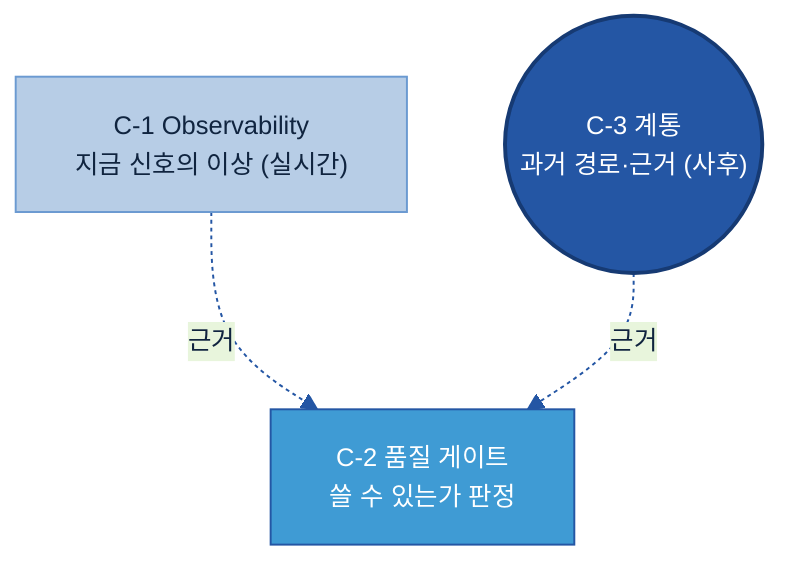
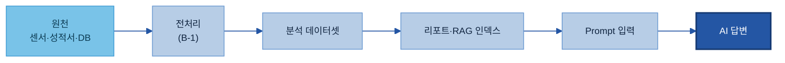
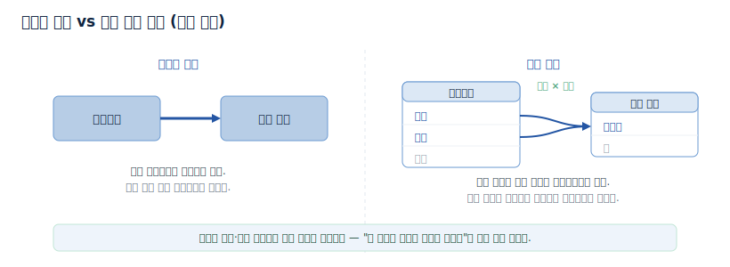
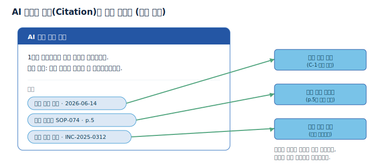
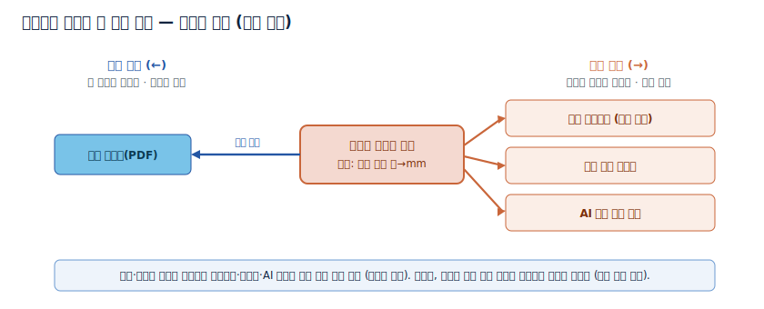
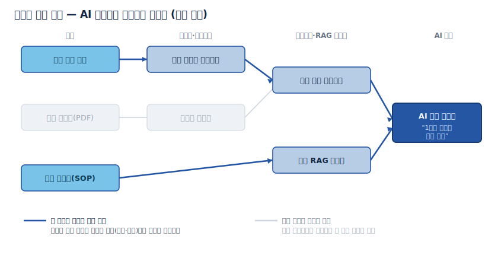
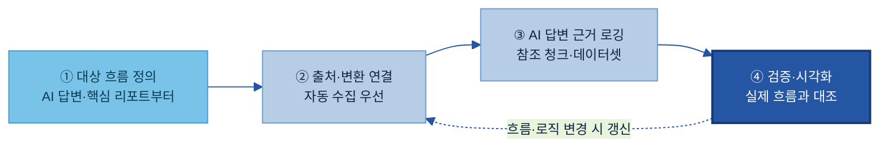
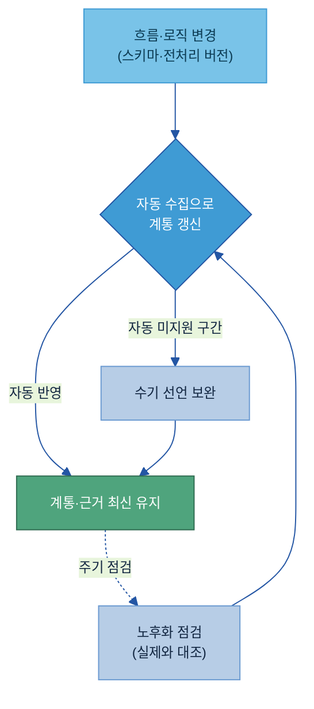
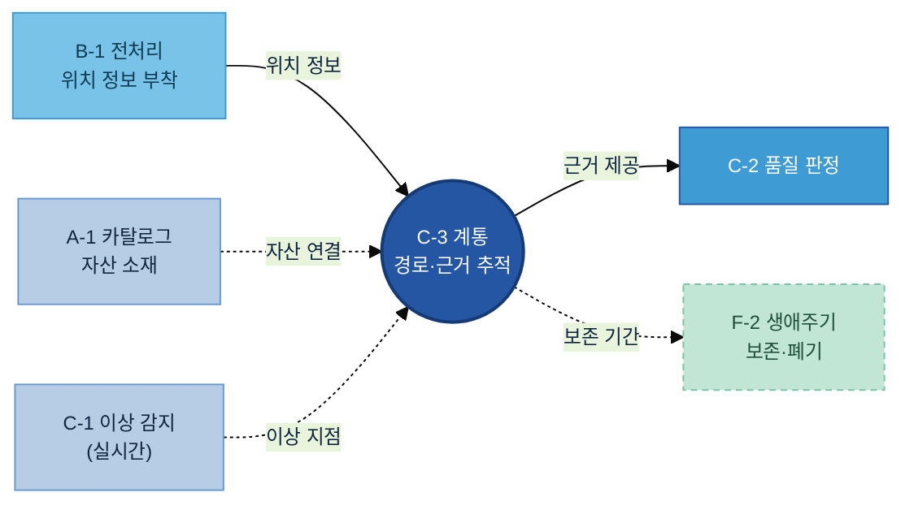

# C-3. 데이터 계통(Data Lineage) 매뉴얼

---

1. [Why — 왜 필요한가](#why)
    - [1.1 현업 적용 시 발생하는 문제](#s11)
    - [1.2 기대 효과](#s12)
2. [What — 무엇을 준비하는가](#what)
    - [2.1 역할과 체계 내 위치](#s21)
    - [2.2 추적 대상 흐름과 입도](#s22)
    - [2.3 계통이 기록하는 세 가지](#s23)
    - [2.4 계통으로 답하는 두 질문 — 영향도와 감사](#s24)
3. [When — 어디부터 추적하나](#when)
    - [3.1 우선 적용 대상](#s31)
    - [3.2 적용 우선순위 판단 기준](#s32)
4. [How — 어떻게 준비·운영하나](#how)
    - [4.1 적용 전후 비교](#s41)
    - [4.2 구축 절차](#s42)
    - [4.3 수집 방식 고르기](#s43)
    - [4.4 계통 레코드에 무엇을 남기나](#s44)
    - [4.5 운영과 갱신](#s45)
5. [Tech Stack — 솔루션 검토](#tech)
    - [5.1 솔루션 유형](#s51)
    - [5.2 선정 기준](#s52)
6. [Where — 다른 주제와의 관계](#where)
7. [KPI](#kpi)
    - [7.1 관리 기준](#s71)
    - [7.2 운영 KPI](#s72)

- [별첨 (Appendix)](#별첨-appendix) · [참고자료 (References)](#참고자료-references) · [변경 이력 / 피드백 반영](#변경-이력--피드백-반영)

<!-- KQ→섹션 매핑(자가 점검): KQ1 대상 흐름→2.2(s22)+3(when) / KQ2 변환 기록→2.3(s23)+4.4(s44) / KQ3 근거 역추적→2.3(s23)+4.1(s41)+4.4(s44) / KQ4 변경 영향→2.4(s24)+4.3(s43) / KQ5 감사 증빙→2.4(s24)+3.2(s32) / KQ6 관리 기준 및 KPI→7.1(s71)+7.2(s72). -->

---

> **관련 가이드:** [B-1 데이터 전처리](../B-1%20데이터%20전처리/B-1%20데이터%20전처리.md) · [C-1 Observability](../C-1%20Observability/C-1%20Observability.md) · [C-2 데이터 품질 관리](../C-2%20데이터%20품질%20관리/C-2%20데이터%20품질%20관리.md) · [A-1 데이터 카탈로그](../A-1%20데이터%20카탈로그/A-1%20데이터%20카탈로그.md) · [D-2 API/Tool 연계 데이터](../D-2%20API_Tool%20연계%20데이터/D-2%20API_Tool%20연계%20데이터.md) · [F-2 데이터 생애주기 관리](../F-2%20데이터%20생애주기%20관리/F-2%20데이터%20생애주기%20관리.md)

이 가이드는 데이터 계통이 왜 필요한지(1장), 무엇을 기록하는지(2장), 어떤 흐름부터 추적하는지(3장), 어떻게 구축·운영하고 운영 수준을 어떻게 측정하는지(4장), 어떤 솔루션을 검토하는지(5장), 인접 주제와 어떻게 나뉘는지(6장)를 다룬다. AI가 산출한 답과 보고서는 그 근거가 어느 데이터에서 왔는지 제시해야 현업이 신뢰하고 활용한다. 데이터 계통은 그 근거의 경로를 데이터로 기록한다.

## 이 가이드가 답하는 5가지 질문

| 핵심 질문 | 한 줄 답 | 본문 |
|---|---|---|
| 어떤 데이터 흐름을 계통 대상으로 관리하는가? | 원천부터 AI 답변까지 전 구간 중, AI 답변·핵심 리포트로 이어지는 흐름을 우선으로 잡는다 | [2.2](#s22) · [3](#when) |
| 데이터가 어떤 변환과 조합을 거쳤는지 어떻게 기록하는가? | 연결·변환 이력·AI 답변 근거 세 가지를 계통 레코드에 항목별로 남긴다 | [2.3](#s23) · [4.4](#s44) |
| AI 답변·보고서의 근거 데이터를 어떻게 역추적하는가? | 답변 로깅 시 참조 청크·데이터셋·Tool 결과를 함께 남겨, 답 → 청크 → 원본까지 거슬러 찾는다 | [2.3](#s23) · [4.4](#s44) |
| 데이터 변경의 영향 범위를 어떻게 분석하는가? | 하류(Downstream) 추적으로 변경 전에 영향받는 리포트·모델·AI 서비스 목록을 확인한다 | [2.4](#s24) · [4.3](#s43) |
| 감사·규제 대응 시 무엇을 증빙하는가? | 출처·변환 이력·접근 이력·AI 답변 근거를 한 번에 꺼내는 증빙 체계를 계통으로 갖춘다 | [2.4](#s24) · [3.2](#s32) |

---

## 1. Why — 왜 필요한가

AI가 점검 결과를 답해도 그 판단의 근거가 어느 센서값·어느 기준서에서 나왔는지 제시하지 못하면 현업은 결과를 신뢰하지 않는다. 데이터 계통은 답과 데이터를 잇는 경로를 기록해, AI 결과를 검증 가능한 상태로 만든다.

### 1.1 현업 적용 시 발생하는 문제

계통 기록 없이 AI 과제를 운영할 때 반복적으로 발생하는 문제는 다음과 같다.

| 발생 문제 | 현업 영향 |
|---|---|
| 답의 근거를 제시하지 못한다 | AI 점검 리포트가 결론만 제시하고 근거가 된 센서 로그·성적서·기준서를 보여주지 못해, 현업 엔지니어가 결과를 신뢰하지 않는다 |
| 변경 영향 범위를 사전에 알 수 없다 | 원천 테이블 스키마나 전처리 로직을 변경한 뒤에야 영향받은 리포트·모델·AI 답변이 드러난다. 사전에 영향 범위를 파악하지 못한다 |
| 감사 질의에 즉시 대응하지 못한다 | 불량 판정 AI가 사용한 데이터의 출처와 변환 과정을 묻는 내부·고객 감사에 즉시 증빙하지 못해 대응에 수일이 걸린다 |
| 팀마다 출처 이해가 다르다 | 같은 데이터의 출처와 가공 이력을 생산팀·품질팀·IT가 다르게 이해해, 분석 결과가 어긋날 때 원인 파악에 시간이 든다 |

공통 원인은 데이터의 부재가 아니라, 데이터가 어디서 와서 어떻게 변형되어 그 답이 되었는지의 경로가 남아 있지 않다는 데 있다.

### 1.2 기대 효과

흐름을 기록하면 세 가지가 달라진다.

- 근거를 즉시 역추적한다. AI 답변·리포트가 참조한 데이터셋·문서·청크를 답과 함께 남기면, 현업이 클릭 한 번으로 원천 센서값·성적서 페이지까지 거슬러 확인한다. 전처리가 부착해 둔 원본 위치 정보([B-1 데이터 전처리](../B-1%20데이터%20전처리/B-1%20데이터%20전처리.md))가 이 역추적의 출발점이 된다.
- 변경 영향을 사전에 파악한다. 원천이나 전처리 로직을 변경하기 전에 그 변경이 어떤 리포트·모델·AI 서비스로 번지는지 확인한다. 배포 후 장애로 인지하는 대신, 배포 전에 영향받는 자산 목록을 본다.
- 감사·규제에 바로 대응한다. 출처·변환 이력·사용 목적·답변 근거를 한 번에 꺼내는 증빙 체계를 갖추면, 감사 질의에 수일이 아니라 당일에 대응한다. AI의 투명성·추적성을 요구하는 규제 흐름[\[15\]](#ref15)에도 같은 기록이 쓰인다.

---

## 2. What — 무엇을 준비하는가

이 장은 데이터 계통이 무엇이고 무엇을 기록하는지를 정의한다. 구축 절차와 운영은 [4장](#how)에서 다루고, 여기서는 계통의 정의·경계, 추적 대상 흐름, 기록하는 요소, 그것으로 답하는 질문을 정한다.

### 2.1 역할과 체계 내 위치

데이터 계통은 데이터가 어디서 와서(출처) 어떤 가공을 거쳐(변환) 어디에 쓰였는지(활용)를 잇는 경로를 기록한 것이다. 구조로 보면 방향 그래프(DAG, 한 방향으로 흐르고 되돌아오지 않는 그래프)다 — 노드는 데이터 자산(원천 테이블·문서·전처리 결과·데이터셋·리포트·RAG 인덱스·AI 답변)이고, 엣지는 그 사이의 변환·이동이다.[\[1\]](#ref1)

계통은 AI 결과를 신뢰하고 활용하게 만드는 신뢰(Trustworthy) 묶음의 한 축이다. 같은 데이터를 두고 역할이 나뉜다 — [C-1 Observability](../C-1%20Observability/C-1%20Observability.md)는 지금 흐르는 데이터의 이상을 실시간으로 감지하고, 데이터 계통은 과거에 어떤 경로로 왔는지를 사후에 추적하며, [C-2 데이터 품질 관리](../C-2%20데이터%20품질%20관리/C-2%20데이터%20품질%20관리.md)는 그 데이터를 AI에 써도 되는지 판정한다. 계통은 판정하지 않는다. 판정과 이상 감지에 근거를 대는 경로 기록이다.

계통의 책임 범위는 연결성·추적성까지다. 실시간 이상 탐지는 [C-1](../C-1%20Observability/C-1%20Observability.md), 사용 가능 여부 판정은 [C-2](../C-2%20데이터%20품질%20관리/C-2%20데이터%20품질%20관리.md), 데이터의 보존·폐기 기간은 [F-2 데이터 생애주기 관리](../F-2%20데이터%20생애주기%20관리/F-2%20데이터%20생애주기%20관리.md)가 맡는다. 이 경계는 [6장](#where)에서 정리한다.

### 2.2 추적 대상 흐름과 입도

추적 대상은 데이터가 AI 답변이 되기까지 거치는 흐름 전체다. 정형 데이터의 ETL뿐 아니라, 문서가 전처리·청킹을 거쳐 RAG 인덱스가 되고 AI 답변의 근거가 되는 경로까지 잇는 것이 AI-ready 관점의 계통이다.

같은 흐름이라도 얼마나 잘게 추적하느냐(입도)가 다르다. 세 수준이 있다.

- 테이블 단위: 어느 자산이 어느 자산에서 왔는지만 기록한다. 구현이 단순하고 대부분 솔루션이 기본 제공하지만, 안의 어느 값이 영향인지는 알 수 없다.
- 컬럼 단위(Column-level): 어느 컬럼이 어느 컬럼을 만드는지까지 기록한다. 영향도 분석과 감사 증빙에는 이 수준이 필요하다.[\[4\]](#ref4)
- 청크·근거 단위: AI 답변이 참조한 문서 청크·원본 위치까지 기록한다. AI 답변의 근거를 역추적하는 출발점이다.

테이블 단위는 "이 테이블이 저 테이블에 영향을 준다"까지만 알려주지만, 컬럼 단위는 "단가 컬럼이 바뀌면 총원가 컬럼이 영향받는다"를 짚어 준다. 그래서 스키마를 변경하기 전에 실제로 영향받는 리포트·모델을 정확히 추린다.

### 2.3 계통이 기록하는 세 가지

계통은 흐름 위에 세 가지를 기록한다. 가이드 전체가 이 세 가지를 정본으로 삼아 일관되게 사용한다.

- 연결(경로): 데이터가 어디서 와서 어디로 갔는지 — 노드와 엣지. "이 데이터셋은 이 센서 로그와 이 성적서에서 왔다."
- 변환 이력: 각 단계에서 무슨 가공을 했는지 — 병합·필터·파생 규칙, 전처리·파서 버전, 실행 시각. "결측을 보간하고 1분 평균으로 집계했다(preproc v2.3)."
- AI 답변 근거 연결: 답·리포트가 참조한 문서·청크·데이터셋·Tool 결과 — 근거(Citation). "이 답은 진동 센서 로그와 기준서 SOP-074 5페이지를 근거로 했다."

세 번째가 AI-ready 계통을 일반 계통과 구분 짓는 지점이다. 검색 증강 생성(RAG, AI가 답할 때 우리 문서를 찾아 근거로 함께 쓰는 방식)에서는 답이 참조한 청크와 그 원본 위치를 함께 남겨야 답을 근거까지 되짚는다.

> **용어 풀이 — 근거(Citation)·출처 정보(Provenance).** 근거는 한 답변이 참조한 데이터 조각의 목록이다. 출처 정보는 각 조각이 어느 문서·페이지·좌표에서 왔는지의 꼬리표로, 전처리가 청크에 부착해 둔다. 계통은 이 꼬리표들을 흐름으로 이어, 답 → 청크 → 원본 문서 → 원천까지의 경로를 만든다.

### 2.4 계통으로 답하는 두 질문 — 영향도와 감사

세 가지를 기록해 두면 방향을 따라 두 가지 질문에 답한다.

- 하류(downstream) 추적 — 영향도 분석: "이 원천·로직이 바뀌면 무엇이 깨지나." 변경 전에 영향받는 데이터셋·리포트·AI 답변의 목록을 본다.[\[7\]](#ref7)
- 상류(upstream) 추적 — 근본 원인·감사: "이 답·이 값은 왜 이렇게 나왔고 어디서 왔나." 이상한 결과의 원인을 원천까지 거슬러 찾고, 출처·변환 이력을 감사 증빙으로 제시한다.

예를 들어 성적서 전처리에서 두께 단위를 변경하면, 하류로는 그 컬럼을 쓰는 품질 데이터셋·불량 분석 리포트·AI 점검 답변이 영향받음을 배포 전에 확인한다. 거꾸로 불량 분석 결과가 이상하면 상류로 거슬러 어느 전처리 단계·원천 성적서에서 비롯됐는지 찾는다. 영향도 분석을 신뢰할 수준으로 수행하려면 [2.2](#s22)의 컬럼 단위 계통이 필요하다.

---

## 3. When — 어디부터 추적하나

AI 활용 흐름에는 기본적으로 계통이 필요하지만, 모든 흐름을 똑같이 깊게 추적하지는 않는다. AI 답변·핵심 보고서로 바로 이어지는 흐름부터 잡고, 감사 대상이거나 틀렸을 때 영향이 큰 흐름은 더 깊게(컬럼 단위까지) 추적한다.

### 3.1 우선 적용 대상

먼저 추적하는 것은 AI가 직접 근거로 쓰는 흐름이다.

- AI 답변·자동 리포트로 바로 이어지는 흐름 — 답의 근거를 제시하지 못하면 현업이 활용하지 못하므로 가장 먼저 잇는다.
- 여러 팀·계열사가 함께 쓰는 핵심 데이터셋 — 한 곳이 바뀌면 여러 곳이 영향받으므로 경로를 파악해야 한다.
- 전처리·병합이 여러 단계 겹친 흐름 — 단계가 많을수록 어디서 틀어졌는지 사람이 기억으로 짚기 어렵다.

### 3.2 적용 우선순위 판단 기준

다음 흐름은 입도를 컬럼 단위까지 올리고 근거 보존 기간을 길게 둔다.

- 감사·규제 대상 흐름 — 출처·변환·접근 이력을 증빙해야 하는 품질·안전·재무 관련 데이터.
- 틀리면 영향이 큰 흐름 — 안전·품질 판정처럼 잘못된 근거가 현장 의사결정으로 이어지는 경우.
- 민감정보가 섞인 흐름 — 어느 필드가 어디로 흘렀는지 컬럼 단위로 짚어야 [F-4 데이터 권한·보안](../F-4%20AI%20데이터%20권한%20보안/F-4%20AI%20데이터%20권한%20보안.md) 통제와 연결된다.

두 축으로 정리하면 착수 순서가 나온다. 세로축은 신뢰·감사 중요도, 가로축은 자동 수집 난이도다.

| 적용 대상 | 신뢰·감사 중요도 | 자동 수집 난이도 | 착수 순서 |
|---|---|---|---|
| AI 답변 근거 흐름 | 높음 | 낮음 | 최우선 |
| 품질·안전 판정 리포트 | 높음 | 낮음 | 최우선 |
| 레거시 ETL 경로 | 중간 | 높음 | 도구 확보 후 단계적 |
| 내부 임시 분석 | 낮음 | 중간 | 후순위 |

가치가 높고 자동 수집이 쉬운 흐름(최우선)부터 잇고, 중요하지만 레거시라 자동 수집이 어려운 경로는 솔루션을 확보한 뒤 단계적으로 옮겨 간다. 자동화가 어려운 구간은 [4.3](#s43)의 수기 선언으로 공백을 메운다.

---

## 4. How — 어떻게 준비·운영하나

계통은 다음 순서로 구축·운영한다. 적용 전후의 차이를 확인하고([4.1](#s41)), 대상 흐름을 정의해 출처·변환을 잇고([4.2](#s42)~[4.3](#s43)), 계통 레코드와 AI 답변 근거를 남기며([4.4](#s44)), 흐름 변경을 반영하는 운영([4.5](#s45))과 성과 측정([4.6](#s46))으로 마무리한다.

### 4.1 적용 전후 비교

발전 설비 진동 점검 AI를 운영하는 경우를 가상 예시로 든다. 적용 전에는 AI가 "1호기 베어링 이상 징후"라고 답해도 근거를 제시하지 못해, 현업이 데이터를 직접 재확인한 뒤에야 조치한다. 계통과 근거 기록을 부착하면 답이 참조한 센서 로그·기준서·과거 사례를 클릭해 원천까지 거슬러 확인하고, 그 자리에서 조치로 넘어간다.

| 적용 전 | 적용 후 |
|---|---|
| AI 점검 리포트가 결론만 제시하고 근거가 불명확하다 | 답변에 근거(센서 로그·기준서 p.5·유사 사례)를 함께 표시한다 |
| 현업이 데이터를 재확인해 검증한 뒤 조치한다 | 근거를 클릭해 원천까지 역추적하고 바로 조치한다 |
| 원천 변경 시 장애가 발생한 뒤 대응한다 | 변경 전에 영향받는 리포트·모델을 미리 확인한다 |
| 감사 때 출처 수집에 수일이 걸린다 | 출처·변환·근거를 당일에 증빙한다 |

굵은 파란 경로가 이 답변이 실제로 근거로 삼은 흐름이다. 답변의 근거 링크를 누르면 이 경로를 거꾸로 따라가 진동 센서 로그와 정비 기준서 원본까지 도달한다. 같은 데이터셋에 모이지만 이 답과 무관한 흐름(회색)은 근거에서 빠진다. 답마다 근거 경로가 분리돼 남는 것이 AI-ready 계통의 목표 모습이다.

흐름을 정리하면 다음과 같다. 추적할 흐름을 고르고([3장](#when)) → 출처·변환을 자동 수집으로 잇고([4.2](#s42)~[4.3](#s43)) → AI 답변에 근거를 로깅하고([4.4](#s44)) → 역추적·영향분석으로 활용한다([2.4](#s24)).

### 4.2 구축 절차

대상 흐름을 정의할 때는 [3장](#when)의 우선순위로 AI 답변·핵심 리포트로 이어지는 흐름부터 잡는다. 출처·변환 연결은 자동 수집을 기본으로 하고([4.3](#s43)), AI 답변 근거 로깅은 답이 참조한 청크·데이터셋·Tool 결과를 답과 함께 남긴다. 검증은 그려진 계통이 실제 흐름과 맞는지 대조하는 단계로, 누락·끊김을 잡는다.

### 4.3 수집 방식 고르기

출처·변환을 잇는 방식은 세 가지이며, 환경에 따라 섞어 쓴다.

| 방식 | 수집 방법 | 적합 상황 | 한계 |
|---|---|---|---|
| 정적 파싱 | 실행 전 SQL·ETL 코드를 분석해 흐름 추론 | 레거시 ETL·저장 프로시저, 배포 전 사전 영향도 분석 | 동적 SQL·복잡한 UDF는 정확도 저하 |
| 런타임 이벤트 | 실제 실행 시 엔진·오케스트레이터가 계통 이벤트 방출(OpenLineage 등) | 실제 실행 경로 추적, 동적 경로 추적 | 에이전트·플러그인 설치 필요, 실행 안 된 경로는 누락 |
| 수기 선언 | 사람이 흐름을 직접 입력·선언 | 자동화 안 되는 레거시·엑셀·공유드라이브 공백 보완 | 변경 시 수동 갱신, 실제와 어긋날 위험 |

현대 환경은 정적 파싱과 런타임 이벤트를 함께 써 설계 의도와 실제 실행을 모두 담고, 수기 선언으로 자동화가 닿지 않는 공백만 보완한다. 전수를 수기로 그리지 않는다. 관리 비용이 커지고 금세 실제와 어긋난다.

### 4.4 계통 레코드에 무엇을 남기나

계통 한 단계(엣지)에는 무엇이 무엇으로, 어떤 가공을 거쳐 갔는지를 남긴다. 본문에는 대표 항목만 두고, 전체는 [별첨](#a2)에 둔다.

| 항목 | 쉬운 의미 | 예시값 | 필수/선택 | 작성 주체 |
|---|---|---|---|---|
| 입력 자산 | 이 단계의 입력 | 진동 센서 로그(raw) | 필수 | 자동 수집 |
| 출력 자산 | 이 단계의 결과 | 센서 시계열 데이터셋 | 필수 | 자동 수집 |
| 변환 로직 | 무슨 가공을 했나 | 결측 선형보간 + 1분 평균 집계 | 필수 | 자동/엔지니어 |
| 변환 버전 | 어떤 전처리·파서 버전 | preproc v2.3 | 권장 | 자동 |
| 실행 시각 | 언제 실행했나 | 2026-06-14 03:00 | 필수 | 자동(런타임) |
| 입도 | 테이블/컬럼/청크 | 컬럼 | 권장 | 자동/엔지니어 |
| 근거 청크 ID | AI 답변이 참조한 원본 조각 | QR-2026-0481_p3_r2 | 답변 흐름 시 필수 | 자동(로깅) |

남기는 내용이 막연하면 쓸모가 없다. 무엇을·어떤 로직으로·어느 버전으로 바꿨는지가 구체적이어야 나중에 되짚는다.

> **작성 규칙 — 막연한 기록과 추적 가능한 기록.**
> - 변환 단계: "데이터 정리함" → "입력=진동 센서 로그(raw), 출력=센서 시계열, 로직=결측 선형보간+1분 평균, 버전=preproc v2.3"
> - AI 답변: "관련 자료를 참고했습니다" → "근거=진동 센서 로그(2026-06-14), 기준서 SOP-074 p.5, 유사 사례 INC-2025-0312"
> - 금지 표현: "정리/가공함", "관련 문서 참조", "여러 데이터 종합" — 무엇을·어느 것을·어떻게가 빠진 기록.

### 4.5 운영과 갱신

계통은 한 번 그리면 끝이 아니다. 파이프라인 로직과 원천 양식은 계속 바뀌는데, 계통이 따라 갱신되지 않으면 그래프가 실제와 어긋나 오히려 잘못된 근거를 가리킨다. 그래서 변경을 계통에 반영하고 노후화를 점검하는 운영이 필요하다.

역할은 세 주체로 나뉜다. 데이터 오너는 자기 자산의 흐름과 근거 보존 기준을 확인하고, 데이터 엔지니어는 자동 수집 연결·계통 검증·갱신을 맡으며, 거버넌스 담당은 감사 대상 흐름의 증빙 범위와 보존 기간을 정한다. AI 답변 근거 로깅은 AI 서비스 운영자가 계통과 연결되게 유지한다. 근거의 보존·폐기 기간 자체는 [F-2 데이터 생애주기 관리](../F-2%20데이터%20생애주기%20관리/F-2%20데이터%20생애주기%20관리.md)와 맞춘다.

---

## 5. Tech Stack — 솔루션 검토

### 5.1 솔루션 유형

계통 솔루션은 세 갈래다. 한 제품을 고르기보다, 우리 데이터 환경에 맞는 조합을 정하는 문제다.

**(1) 계통 수집 오픈 표준·오픈소스.** 도구를 바꿔도 계통 데이터를 재활용하도록 표준 위에서 모은다.

| 솔루션 | 성격 | 잘하는 것 | 공식 |
|---|---|---|---|
| OpenLineage | 수집 오픈 표준(이벤트 스펙) | 실행 중 파이프라인이 계통 이벤트(Run·Job·Dataset)를 표준 형식으로 방출 — 도구 간 상호운용 | [openlineage.io](https://openlineage.io/)[\[1\]](#ref1) |
| Marquez | OpenLineage 참조 구현 | 표준 이벤트를 받아 저장·시각화하는 경량 계통 저장소 | [marquezproject.ai](https://marquezproject.ai/)[\[2\]](#ref2) |
| DataHub | 오픈소스 메타데이터+계통 | 80+ 커넥터, SQL 파싱 기반 컬럼 단위 계통 | [datahub.com](https://datahub.com/)[\[3\]](#ref3) |
| Apache Atlas | 오픈소스 거버넌스 | 하둡·Hive·Spark 환경 계통 | [atlas.apache.org](https://atlas.apache.org/)[\[5\]](#ref5) |
| dbt | 변환 도구(계통 노출) | SQL 변환 모델의 의존 그래프(DAG)·컬럼 단위 계통 | [getdbt.com](https://docs.getdbt.com/docs/explore/column-level-lineage)[\[6\]](#ref6) |
| Apache Spline | Spark 특화 오픈소스 | Spark 실행 계획에서 계통 자동 수집 | [absaoss.github.io/spline](https://absaoss.github.io/spline/)[\[7s\]](#ref7s) |

**(2) 데이터 플랫폼 내장 계통.** 이미 쓰는 플랫폼 안에서 추가 도구 없이 계통이 자동으로 모인다.

| 솔루션 | 컬럼 단위 | 잘하는 것 | 공식 |
|---|---|---|---|
| Databricks Unity Catalog | 지원 | 쿼리 실행 계획을 런타임에 잡아 전 언어 계통 무설정 자동 수집 | [docs.databricks.com](https://docs.databricks.com/aws/en/data-governance/unity-catalog/data-lineage)[\[8\]](#ref8) |
| Microsoft Purview | PoC 확인 | Azure 데이터 흐름(ADF·Synapse 등) 엔드투엔드 자동 수집 | [learn.microsoft.com/purview](https://learn.microsoft.com/en-us/purview/)[\[9\]](#ref9) |
| Snowflake | 지원 | SQL 실행 시 객체·컬럼 계통을 내장 기록(ACCESS_HISTORY) | [docs.snowflake.com](https://docs.snowflake.com/en/user-guide/ui-snowsight-lineage)[\[10\]](#ref10) |
| Google Dataplex | 지원(BigQuery) | BigQuery 잡의 컬럼 단위 계통 | [cloud.google.com/dataplex](https://docs.cloud.google.com/dataplex/docs/about-data-lineage)[\[11\]](#ref11) |

**(3) 전용 상용 계통·거버넌스 솔루션.** 여러 원천·레거시 ETL을 가로질러 엔터프라이즈 계통을 그린다.

| 솔루션 | 수집 방식 | 잘하는 것 | 공식 |
|---|---|---|---|
| Collibra | 정적 파싱 + OpenLineage | 비즈니스·기술 계통 이중 뷰, 레거시 ETL 파싱 | [collibra.com](https://www.collibra.com/products/data-lineage)[\[12\]](#ref12) |
| Atlan | SQL 파싱+API+OpenLineage+수기 | 가장 넓은 수집 범위, AI 연동, 컬럼 단위 | [atlan.com](https://atlan.com/data-lineage/)[\[13\]](#ref13) |
| IBM Manta | 정적 파싱(코드·ETL) | 레거시 ETL·SQL 스크립트 자동 정적 계통 | [ibm.com/manta](https://www.ibm.com/products/manta-data-lineage)[\[14\]](#ref14) |
| Alation | SQL 로그 파싱 | 쿼리 로그 기반 자동 계통, 비즈니스 컨텍스트 | [alation.com](https://www.alation.com/product/data-lineage/)[\[16\]](#ref16) |

AI 답변 근거([2.3](#s23))는 위 데이터 계통과 별개로, LLM 호출 단계에서 참조 청크·프롬프트·출력을 함께 로깅해 남긴다. 이 로그를 남기는 관측 도구로 LangSmith[\[17\]](#ref17)·Langfuse[\[18\]](#ref18) 등이 있다. 본 가이드는 이를 모델 개발 도구가 아니라 답변의 근거 데이터를 기록하는 장치로 본다.

### 5.2 선정 기준

계통 솔루션은 다음 기준으로 고른다.

- 컬럼 단위 추적 — 영향도 분석·감사가 목적이면 테이블 단위로는 부족하다([2.2](#s22)).
- 수집 자동화 범위 — 우리 원천(MES·QMS·LIMS·DW·BI·레거시 ETL)에 커넥터가 있는지, 변환과 근거를 자동 수집하는지.
- 수집 방식 적합성 — 레거시 코드가 많으면 정적 파싱, 실행 경로가 중요하면 런타임 이벤트([4.3](#s43)).
- AI 답변 근거 연결 — 답이 참조한 청크·데이터셋을 계통과 잇는지.
- 운영 형태 — 사외 반출이 제한되면 온프레미스(폐쇄망) 가능 여부.

> **권장 — 기존 환경에서 출발.** 단일 클라우드(Databricks·Snowflake·Azure)면 그 내장 계통으로 시작하는 편이 빠르다. 여러 원천과 레거시 ETL을 가로지르면 전용(Collibra·Atlan·IBM Manta)을 검토하고, 폐쇄망·무료로 시작하려면 DataHub와 OpenLineage 조합을 본다. 컬럼 단위 지원 범위·온프레미스 가능 여부·가격은 변동되므로 단정하지 말고 우리 원천 2~3종을 연결한 PoC로 확인한다.

---

## 6. Where — 다른 주제와의 관계

데이터 계통은 흐름·근거의 추적까지를 책임지고, 인접 주제가 그 앞뒤를 분담한다.

| 인접 주제 | C-3이 하는 것 | 인접 주제가 하는 것 | 연계 포인트 |
|---|---|---|---|
| [C-1 Observability](../C-1%20Observability/C-1%20Observability.md) | 과거 경로·근거를 사후 추적 | 지금 흐르는 데이터의 이상을 실시간 감지 | 이상 발생 지점을 계통으로 거슬러 원인 추적 |
| [C-2 데이터 품질 관리](../C-2%20데이터%20품질%20관리/C-2%20데이터%20품질%20관리.md) | 경로·근거 기록 | 그 데이터를 AI에 써도 되는지 판정 | 계통이 품질 판정에 근거를 제공 |
| [B-1 데이터 전처리](../B-1%20데이터%20전처리/B-1%20데이터%20전처리.md) | 위치 정보를 흐름으로 이음 | 청크에 원본 위치 정보(provenance) 부착 | 위치 정보가 계통·근거 추적의 출발점 |
| [A-1 데이터 카탈로그](../A-1%20데이터%20카탈로그/A-1%20데이터%20카탈로그.md) | 자산 사이의 흐름·변환 | 자산의 소재·오너·등록 | 계통 노드가 카탈로그 자산과 연결 |
| [D-2 API/Tool 연계 데이터](../D-2%20API_Tool%20연계%20데이터/D-2%20API_Tool%20연계%20데이터.md) | Tool 결과를 답변 근거로 기록 | Tool 호출 로그 명세 정의 | Tool 호출 기록이 답변 근거의 한 갈래 |
| [F-2 데이터 생애주기 관리](../F-2%20데이터%20생애주기%20관리/F-2%20데이터%20생애주기%20관리.md) | 근거·이력을 기록·보존 | 데이터·로그의 보존·폐기 기간 정책 | 근거 보존 기간을 생애주기 정책과 맞춤 |

가장 혼동되는 경계는 C-1과 C-3이다. 둘 다 신뢰를 떠받치지만, C-1은 지금 이 순간의 이상을 감지하는 실시간 관측이고, C-3은 과거에 어떤 경로로 왔는지를 사후에 추적하는 이력이다. C-1이 "지금 신호가 이상한가"라면 C-3은 "이 결과가 어디서 왔는가"다.

---

# 7. KPI

데이터 계통(Lineage)은 데이터 품질·출처·변경 이력·계보 관리 체계의 한 축으로서, 데이터의 출처·변환·활용 이력을 지속적으로 관리하여 AI 활용 시 데이터 신뢰성 저하와 Hallucination을 방지하는 것을 목표로 한다.

이를 위해 **무엇을 관리할 것인가(관리 기준)**와 **얼마나 잘 관리되고 있는가(KPI)**를 정의하여 운영하며, 관리 기준에는 데이터 오너십·역할과 책임(R&R)·생애주기(Lifecycle)를 포함한 운영 기준을 함께 정의한다.

## 7.1 관리 기준

| 관리 항목 | 관리 기준 | 관리 목적 |
|-----------|-----------|-----------|
| 추적 대상 | AI 활용 데이터 흐름은 원천부터 AI 답변까지 Lineage 대상으로 관리한다. | End-to-End 추적성 확보 |
| 추적 범위 | 출처, 변환 이력, 활용 이력을 함께 관리한다. | 데이터 신뢰성 확보 |
| 변경 관리 | 데이터 구조 또는 변환 로직 변경 시 Lineage를 함께 갱신한다. | 변경 영향 관리 |
| 근거 관리 | AI 답변은 참조한 데이터, 문서, Citation을 함께 기록한다. | AI 결과 검증 가능성 확보 |
| 최신성 관리 | 운영 중인 Lineage는 실제 데이터 흐름과 일치하도록 지속적으로 유지한다. | 계통 정보 최신성 확보 |
| 데이터 오너십 | 계통 관리 대상마다 계통 정보를 책임지는 데이터 오너를 지정한다. | 계통 책임 소재 명확화 |
| 역할·책임(R&R) | 계통 수집·갱신·검증의 역할과 책임을 구분하여 운영한다. | 운영 책임 체계 확보 |
| 생애주기(Lifecycle) | 데이터 생성부터 폐기까지 계통 기록을 유지·관리한다. | 전 생애주기 추적성 유지 |

## 7.2 운영 KPI

| 구분 | KPI | 정의 | 산식 | 활용 목적 |
|------|------|------|------|-----------|
| 구축 수준 | Lineage Coverage | 관리 대상 데이터 중 Lineage가 구축된 비율 | 구축 대상 자산 중 Lineage 연결 완료 비율 | 구축 범위 관리 |
|  | Column-level Coverage | 컬럼 단위까지 추적 가능한 데이터 비율 | Column Lineage 구축 데이터 / 전체 구축 데이터 | 영향도 분석 수준 관리 |
|  | AI Citation Coverage | AI 답변에 근거(Citation)가 연결된 비율 | Citation 포함 답변 / 전체 AI 답변 | AI 근거 추적 수준 관리 |
|  | 운영 기준 정의율 | 계통 관리 대상 중 오너십·R&R·생애주기 기준이 정의된 비율 | 운영 기준 정의 대상 / 관리 대상 | 운영 체계 구축 수준 관리 |
| 운영 수준 | 영향도 분석 수행률 | 변경 작업 전 영향도 분석을 수행한 비율 | 영향도 분석 수행 건수 / 변경 작업 건수 | 변경 관리 수준 |
|  | 근거 추적 성공률 | AI 답변을 원천 데이터까지 역추적 가능한 비율 | 성공 건수 / 추적 대상 건수 | 추적 가능성 확보 |
|  | 계통 최신성 | 실제 파이프라인 변경 후 Lineage 반영 수준 | SLA 내 갱신 건수 / 전체 변경 건수 | 최신성 관리 |
| 운영 품질 | Broken Lineage 비율 | 단절된 Lineage 비율 | 단절 Edge / 전체 Edge | 계통 품질 관리 |
|  | Lineage 수정 Lead Time | 오류 발견 후 수정 완료까지 소요 시간 | 평균 수정 시간 | 운영 효율성 관리 |
|  | 계통 활용률 | 영향도 분석, 감사, AI 근거 조회에 활용된 횟수 | 조회 건수 | 실제 활용도 관리 |

---

## 별첨 (Appendix)

### 주요 용어

- 데이터 계통(Data Lineage): 데이터가 어디서 와서 어떤 변환을 거쳐 어디에 쓰였는지를 잇는 경로 기록. 방향 그래프(DAG)로 표현한다.
- 출처 정보(Provenance): 각 데이터 조각이 어느 문서·페이지·좌표·시스템에서 왔는지의 꼬리표. 계통은 이 꼬리표들을 흐름으로 잇는다.
- 근거(Citation): 한 AI 답변이 참조한 데이터 조각의 목록. 답을 원본까지 되짚는 출발점이다.
- 컬럼 단위 계통(Column-level Lineage): 테이블이 아니라 개별 컬럼 사이의 유래까지 추적하는 입도. 영향도 분석·감사에 필요하다.
- 상류/하류(Upstream/Downstream): 흐름의 위쪽(출처 방향)과 아래쪽(활용 방향). 상류 추적은 근본 원인, 하류 추적은 영향 범위에 쓴다.
- OpenLineage: 실행 중 파이프라인이 계통 이벤트(Run·Job·Dataset)를 표준 형식으로 방출하게 하는 오픈 표준. 도구를 바꿔도 계통을 재활용한다.

### 계통 레코드 항목 사전 (전체)

본문 [4.4](#s44)의 대표 항목을 포함한 전체 목록. 실제 항목은 솔루션·PoC에서 확정한다.

| 항목 | 쉬운 의미 | 필수/선택 | 작성 주체 |
|---|---|---|---|
| 노드 ID | 계통 그래프의 한 자산 식별자 | 필수 | 자동 |
| 노드 유형 | 원천·전처리·데이터셋·인덱스·답변 등 | 필수 | 자동 |
| 입력 자산 / 출력 자산 | 이 변환의 입력·결과 | 필수 | 자동 |
| 변환 로직 | 병합·필터·파생 등 가공 내용 | 필수 | 자동/엔지니어 |
| 변환 버전 | 전처리·파서·잡 버전 | 권장 | 자동 |
| 실행 시각·실행 ID | 언제·어느 실행에서 | 필수 | 자동(런타임) |
| 입도 | 테이블/컬럼/청크 | 권장 | 자동/엔지니어 |
| 근거 청크 ID | AI 답변이 참조한 원본 조각 | 답변 흐름 시 필수 | 자동(로깅) |
| 오너 | 흐름 책임자·책임 조직 | 권장 | 데이터 오너 |
| 보존 기간 | 근거·이력 보존 기간 | 권장 | 거버넌스 |

### 수집 방식 비교

| 방식 | 정확도 | 사전 영향분석 | 설치 부담 | 대표 |
|---|---|---|---|---|
| 정적 파싱 | 코드 기준(동적 SQL 약함) | 가능(실행 전) | 낮음 | IBM Manta·Collibra·dbt |
| 런타임 이벤트 | 실제 실행 기준 | 어려움(실행 후) | 중간(에이전트) | OpenLineage·Unity Catalog·Spline |
| 수기 선언 | 사람 입력 의존 | 가능 | 낮음 | 메타데이터 플랫폼 UI |

### 감사 대응 점검표

- 중요 데이터 자산과 그 흐름을 계통에 연결했는가
- 변환 이력(로직·버전·실행 시각)을 단계마다 남기는가
- AI 답변의 근거(참조 청크·데이터셋)를 답과 함께 로깅하는가
- 출처·변환·접근 이력·사용 목적을 한 번에 꺼내는 증빙 형식을 갖췄는가
- 근거·이력의 보존 기간을 생애주기 정책([F-2](../F-2%20데이터%20생애주기%20관리/F-2%20데이터%20생애주기%20관리.md))과 맞췄는가

---

## 참고자료 (References)

본문 곳곳의 **[N]** 표시를 누르면 아래 해당 항목으로 이동한다. 접속일 2026-06. 컬럼 단위 지원 범위·가격·버전·온프레미스 가능 여부 등 변동 정보는 각 공식 문서·PoC로 확인한다.

**계통 표준·오픈소스**
- **[1]** OpenLineage (수집 오픈 표준) — <https://openlineage.io/>
- **[2]** Marquez (OpenLineage 참조 구현) — <https://marquezproject.ai/>
- **[3]** DataHub — <https://datahub.com/>
- **[4]** DataHub — 컬럼 단위 계통 — <https://datahub.com/blog/column-level-lineage-comes-to-datahub/>
- **[5]** Apache Atlas — <https://atlas.apache.org/>
- **[6]** dbt — 컬럼 단위 계통 — <https://docs.getdbt.com/docs/explore/column-level-lineage>
- **[7s]** Apache Spline (Spark 계통) — <https://absaoss.github.io/spline/>

**플랫폼 내장 계통**
- **[8]** Databricks Unity Catalog — Data Lineage — <https://docs.databricks.com/aws/en/data-governance/unity-catalog/data-lineage>
- **[9]** Microsoft Purview — <https://learn.microsoft.com/en-us/purview/>
- **[10]** Snowflake — Lineage(Snowsight) — <https://docs.snowflake.com/en/user-guide/ui-snowsight-lineage>
- **[11]** Google Cloud Dataplex — Data Lineage — <https://docs.cloud.google.com/dataplex/docs/about-data-lineage>

**전용 상용 계통·거버넌스**
- **[12]** Collibra Data Lineage — <https://www.collibra.com/products/data-lineage>
- **[13]** Atlan Data Lineage — <https://atlan.com/data-lineage/>
- **[14]** IBM Manta Data Lineage — <https://www.ibm.com/products/manta-data-lineage>
- **[16]** Alation Data Lineage — <https://www.alation.com/product/data-lineage/>

**영향도·감사·AI 근거 추적**
- **[7]** Atlan — Data Lineage Impact Analysis — <https://atlan.com/know/data-lineage-impact-analysis/>
- **[15]** EU AI Act (규제 체계) — <https://digital-strategy.ec.europa.eu/en/policies/regulatory-framework-ai>
- **[17]** LangSmith (LLM 추적·근거 로깅) — <https://www.langchain.com/langsmith>
- **[18]** Langfuse (오픈소스 LLM 관측) — <https://langfuse.com/docs>
- **[19]** murdio — Data Lineage Metrics — <https://murdio.com/insights/data-lineage-metrics/>

> 솔루션을 주제 전반에 걸쳐 묶어 비교·선정하는 일은 2층 정본 [Tech Stack 비교 (솔루션×주제)](../../Tech%20Player/01%20Tech%20Stack%20비교%20(솔루션×주제).md)가 전담한다.

---

## 변경 이력 / 피드백 반영

| 일자 | 버전 | 피드백 (누가/무엇) | 반영 내용 | 반영 위치 |
|------|------|--------------------|-----------|-----------|
| 2026-06-24 | 0.1 | 초안 작성 (00 전체 목차 C-3 8섹션 + B-1·B-3 가이드 스타일 참고) | Why→What→When→예시→Tech Stack→How→Where→KPI 구성. 정본 모델("계통이 기록하는 세 가지: 연결·변환 이력·AI 답변 근거"), 입도 3수준, 상류/하류 영향도·감사. SVG 4종(추적 그래프·테이블vs컬럼·근거 카드·영향도 상하류) + Mermaid 6종. 솔루션 3유형 비교(검증 URL)·2층 정본 링크. | 전체 |
| 2026-06-24 | 0.2 | KQ 가시화 위치 변경(공통 규칙 개정) | 핵심 질문 박스를 문서 맨 마지막으로 이동·목차 링크 정리 | 맨 끝·목차 |
| 2026-06-29 | 0.3 | 0630 작업지시 반영 (고객) | ① 섹션 순서를 Why→What→When→How→Tech Stack→Where로 재편(How를 Tech Stack 앞으로). ② 예시 시나리오(구 §4)를 How 4.1 적용 전후 비교로, 구 KPI 섹션(§8)을 How 4.6 운영 성과 측정으로 흡수(산식·측정 목적 칼럼 추가). ③ How를 4.1 적용 전후 비교·4.2 구축 절차·4.3 수집 방식·4.4 계통 레코드·4.5 운영과 갱신·4.6 운영 성과 측정으로 재구성. ④ 5가지 질문 표를 머릿말 다음 문서 상단으로 이동, "예시 표기 안내" 박스 삭제. ⑤ §1.1 제목·표 머리글 보고서 문체로(막히는 지점→발생 문제 등), 제목 "(한눈에)" 삭제, 빈 사분면 quadrant 차트를 우선순위 표로 교체. ⑥ 금지 문체(헷갈리는·뒤져·~할 수 있다 등) 제거. | 전체 |
| 2026-06-30 | 0.4 | KPI 관리 기준·목표 정렬 (고객) | C-1·C-2·C-3·F-1 공통 반영. ① KPI 도입문(7장)을 "데이터 품질·출처·변경 이력·계보 관리 체계의 한 축으로서 AI 활용 시 데이터 신뢰성 저하·Hallucination 방지" 목표로 정렬. ② 7.1 관리 기준에 운영 기준 3행(데이터 오너십·역할과 책임(R&R)·생애주기(Lifecycle)) 추가. ③ 7.2 운영 KPI에 "운영 기준 정의율"(오너십·R&R·생애주기 정의 비율) 구축 지표 추가 — 운영 기준을 도메인별로 측정 가능하게 함 | 7장 |
