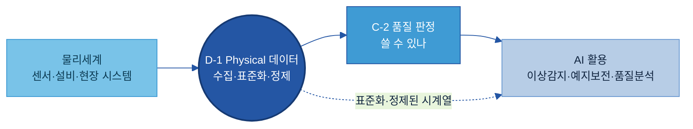
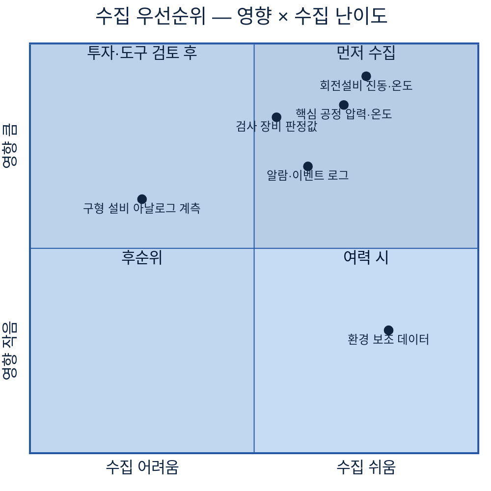
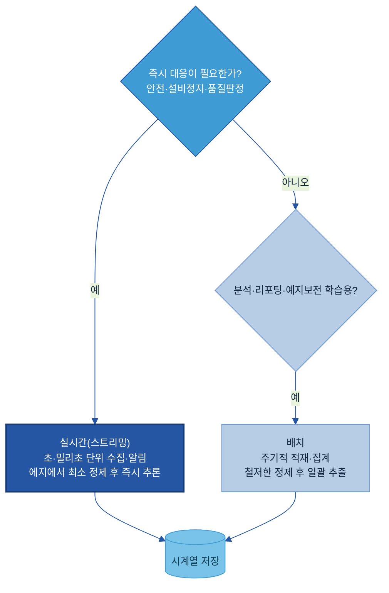
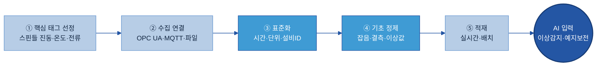
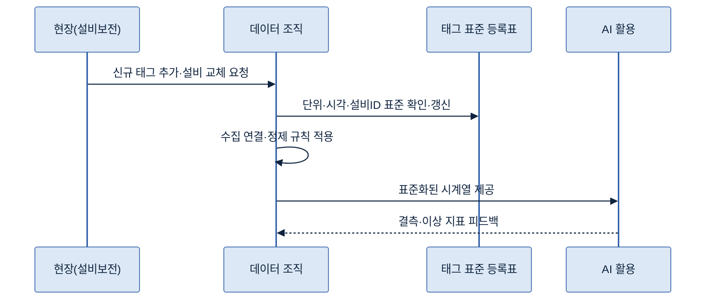
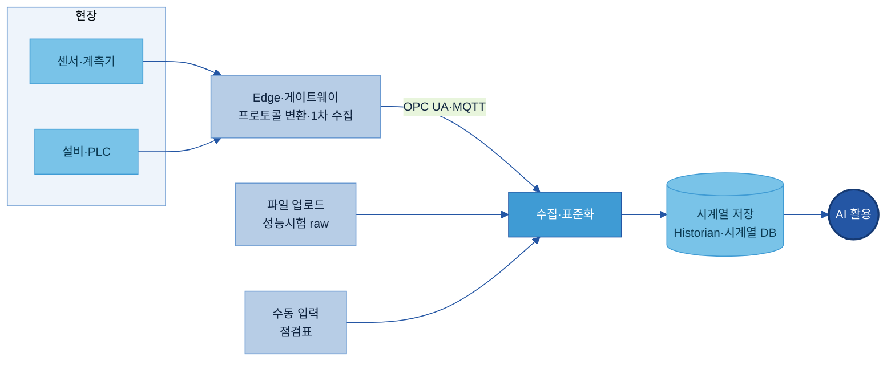
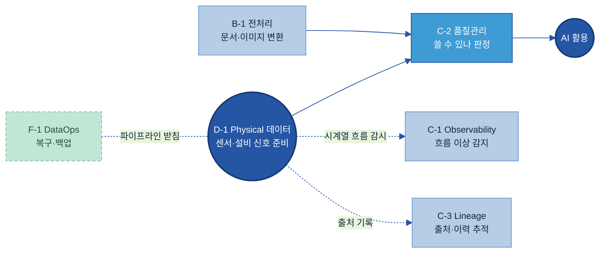

# D-1. Physical 데이터(Physical Data) 매뉴얼

---

## 목차

1. [Why — 왜 필요한가](#why)
    - [1.1 현업에서 막히는 지점](#s11)
    - [1.2 기대 효과](#s12)
2. [What — 무엇인가·무엇을 갖추나](#what)
    - [2.1 Physical 데이터란 + 체계 내 위치](#s21)
    - [2.2 수집 대상](#kq1)
    - [2.3 표준 3종 — 시간·단위·설비ID](#kq3)
    - [2.4 기초 정제 기준](#kq4)
3. [When — 어디부터 수집하나 (우선순위)](#when)
    - [3.1 우선 대상](#s31)
    - [3.2 실시간과 배치 구분](#kq5)
4. [예시 시나리오](#ex)
    - [4.1 적용 전과 후](#s41)
    - [4.2 흐름 미리보기](#s42)
5. [How — 어떻게 준비·운영하나](#how)
    - [5.1 대상 태그 정의와 수집 연결](#s61)
    - [5.2 표준화와 기초 정제](#s62)
    - [5.3 초기 적재와 검증](#s63)
    - [5.4 운영 — 태그 추가·설비 교체](#s64)
    - [5.5 운영 — 정제 기준·실시간 지연·역할](#s65)
6. [Tech Stack — 솔루션·연결 방식](#tech)
    - [6.1 수집·연결 방식](#kq2)
    - [6.2 시계열 저장·처리 솔루션](#s52)
7. [Where — 다른 주제와의 관계](#where)

- [별첨 (Appendix)](#별첨-appendix)
    - [태그 표준 등록표 항목 사전](#ap-a) · [빈 템플릿과 완성 예시](#ap-b) · [주요 용어·단위 표준값](#ap-c)
- [참고자료 (References)](#참고자료-references) · [변경 이력 / 피드백 반영](#변경-이력--피드백-반영)

---

> **예시 표기 안내:** 본 가이드의 표·그림·시나리오에 나오는 구체 값(설비 ID·태그명·수치·단위·날짜 등)은 이해를 돕기 위한 가상 예시이며 실제 데이터가 아니다. 실제 값은 PoC·프로젝트에서 확정한다. 계열사명도 적용 맥락 설명용이다.

> **관련 가이드:** [B-1 데이터 전처리](../B-1%20데이터%20전처리/B-1%20데이터%20전처리.md) · [A-2 메타데이터](../A-2%20메타데이터/A-2%20메타데이터.md) · [C-1 데이터 Observability](../C-1%20Observability/C-1%20Observability.md) · [C-2 데이터 품질 관리](../C-2%20데이터%20품질%20관리/C-2%20데이터%20품질%20관리.md) · [C-3 데이터 계통 Lineage](../C-3%20데이터%20계통%20Lineage/C-3%20데이터%20계통%20Lineage.md) · [F-1 데이터 운영관리](../F-1%20데이터%20운영관리/F-1%20데이터%20운영관리.md)

이 가이드는 Physical 데이터가 왜 필요한지(1장), 무엇이고 무엇을 갖춰야 하는지(2장), 어느 설비부터 수집할지(3장), 적용하면 무엇이 달라지는지(4장), 실제로 어떻게 준비하고 운영하는지(5장), 어떤 솔루션으로 연결하고 저장하는지(6장), 인접 주제와 어떻게 나뉘는지(7장)를 다룬다. 끝까지 이어지는 메시지는 하나다. 센서·설비 신호는 양이 많아도 시간·단위·설비 이름이 어긋나 있으면 합치거나 비교할 수 없고, AI 입력으로 쓸 수 없다. Physical 데이터 준비는 이 신호를 같은 기준으로 맞추고 1차 정제해 AI가 바로 쓰는 시계열 자산으로 바꾸는 일이다.

---

<a id="why"></a>

## 1. Why — 왜 필요한가

설비와 센서는 이미 막대한 데이터를 쏟아낸다. 그러나 이상 감지·예지보전·품질 분석 같은 AI 과제를 시작하면, 부담은 모델이 아니라 현장 신호를 AI가 읽을 수 있는 형태로 모으고 맞추는 단계에 몰린다. Physical 데이터 준비는 이 단계를 표준화해, 흩어진 설비 신호를 분석 가능한 시계열로 전환한다.

<a id="s11"></a>

### 1.1 현업에서 막히는 지점

제조 현장에서 현장 신호를 그대로 AI에 넣으려 할 때 반복적으로 부딪히는 문제는 다음과 같다.

| 막히는 지점 | 현장에서 벌어지는 일 |
|---|---|
| 시간·단위·설비 이름이 제각각 | 설비마다 시각 기준(타임존·형식)과 단위(℃/℉, mm/s/g)가 다르고 이름도 제각각이라, 같은 순간·같은 종류인데 한 표로 합치거나 비교할 수 없다 |
| 분석 전 정리에 수 주 | 성능 시험 raw data는 제품 한 대에 수십 개 파일·초당 수백 태그라, 병합·추출 프로그램을 만드는 데만 수 주가 걸린다 |
| 센서 신호에 잡음·결측·튐 | 전기 노이즈·통신 두절·센서 오작동으로 값이 떨리거나 비거나 순간적으로 튀어, 그대로 학습하면 AI가 허구를 사실로 배운다 |
| 압축·데드밴드로 간격이 불규칙 | Historian이 저장 공간을 아끼려 변화가 있을 때만 기록해, 꺼내 보면 시각 간격이 들쭉날쭉이라 시계열 모델의 등간격 가정이 깨진다 |
| 실시간과 분석용이 안 나뉨 | 즉시 멈춰야 할 안전 신호와 나중에 분석할 데이터를 한 경로로 다뤄, 빠를 것은 느리고 정밀할 것은 거칠다 |

공통점은 데이터가 없는 것이 아니라, 있는 신호가 같은 기준으로 정렬되지 않아 합칠 수 없다는 데 있다. 아래 그림은 같은 09시·같은 종류 설비인데도 시각·단위·이름이 어긋나 한 표로 합쳐지지 않는 상태를 보여준다.


<a id="s12"></a>

### 1.2 기대 효과

시간·단위·설비ID를 맞추고 신호를 1차 정제하면 세 가지가 달라진다.

- 여러 설비를 한 화면에서 비교하고 이상을 가려낸다. 공통 시간축·공통 단위로 정렬하면, 같은 종류 설비를 겹쳐 보고 한 설비만 튀는 이상 징후를 즉시 찾아낸다.
- 분석 준비 시간이 짧아지고 같은 자산을 반복 재사용한다. 태그 표준과 정제 규칙을 한 번 만들면, 새 데이터는 사람 손 없이 같은 기준으로 정리되어 들어온다. 분석마다 매번 다시 맞추던 수 주의 작업이 사라진다.
- 이상 감지·예지보전·품질 분석에 현장 데이터를 바로 쓴다. AI가 신뢰할 수 있는 입력이 갖춰져, 설비 고장 예측과 공정 이상 탐지 같은 과제의 출발선이 앞당겨진다.

---

<a id="what"></a>

## 2. What — 무엇인가·무엇을 갖추나

이 장은 Physical 데이터가 무엇이고 무엇으로 이루어지는지를 설명한다. 수집 연결과 표준화·정제의 구체적 절차는 [5장](#how)에서 다루고, 여기서는 정의와 범위, 수집 대상, 갖춰야 할 표준과 정제 기준을 정의한다.

<a id="s21"></a>

### 2.1 Physical 데이터란 + 체계 내 위치

Physical 데이터는 센서·설비·현장 시스템에서 발생하는 물리세계의 신호를 AI 입력으로 연결·표준화·정제하는 데이터 체계다. 온도·압력·진동·전류 같은 측정값, 가동·정지 같은 설비 상태, 알람 로그가 모두 여기 속한다. 이런 신호는 대부분 시간 순서로 쌓이는 시계열(Time-series) 데이터이며, 사람에게는 계기판 숫자로 읽히지만 AI에게는 어느 설비의·어떤 단위의·언제 값인지가 정리돼 있지 않다.

> 시계열(Time-series) 데이터: 시간 순서대로 쌓이는 측정값. 예: 1초마다 기록되는 베어링 진동값.
> 태그(Tag): 센서·설비에서 나오는 하나의 측정 신호를 가리키는 이름. 예: 1번 펌프 베어링의 진동.

Physical 데이터 준비는 IoT 시스템이나 AI 모델을 만드는 일이 아니라, 그 AI가 쓸 현장 데이터를 준비하는 활동이다. 물리세계의 신호를 AI 활용 영역으로 잇는 입구에 해당하며, 표준화·정제를 거친 시계열을 넘기면 그 뒤에서 품질 관리가 사용 가능 여부를 판정하고 AI가 이상 감지·예지보전에 활용한다.



Physical 데이터 한 건이 AI-ready 시계열이 되기까지는 네 단계를 거친다. 가이드 전체가 이 네 단계를 정본 흐름으로 삼아 일관되게 사용한다.

```text
현장 신호 1건
→ ① 수집·연결   설비·센서에서 신호를 가져와 잇는다 (직결·Edge·OPC UA·MQTT·파일·수동)
→ ② 표준화      시간·단위·설비ID 세 가지 키를 같은 기준으로 맞춘다
→ ③ 기초 정제   잡음·결측·이상값·고착을 AI 입력 전 1차로 정리한다
→ ④ 적재        시계열 저장소·분석 테이블에 실시간 또는 배치로 올린다
```

표준화까지 해야 여러 설비를 한 축에서 합칠 수 있고, 기초 정제를 거쳐야 AI가 허구 값을 사실로 학습하지 않는다. 20개 주제 전체 조감도는 [전체 목차](../../전체%20목차/00%20전체%20목차%20(20개%20주제).md)에 있다. 문서·이미지의 형식 변환은 [B-1 데이터 전처리](../B-1%20데이터%20전처리/B-1%20데이터%20전처리.md), 최종 사용 판정은 [C-2 데이터 품질 관리](../C-2%20데이터%20품질%20관리/C-2%20데이터%20품질%20관리.md)가 맡는다. 경계는 [7장](#where)에서 정리한다.

<a id="kq1"></a>

### 2.2 수집 대상

AI 입력으로 가져올 Physical 데이터는 측정값에 한정되지 않는다. 설비 상태와 작업 조건까지 함께 모아야 "왜 그 값이 나왔는지"를 AI가 해석할 수 있다. 수집 대상은 크게 여섯 가지로 나뉜다.

| 유형 | 대표 신호 (예시) | 특징 |
|---|---|---|
| 센서값 | 온도·압력·진동·유량·전류 | 연속 시계열, 샘플링 주기가 분석 정밀도를 좌우 |
| 설비 상태 | 가동·정지·운전 모드·회전속도(RPM) | 상태가 바뀌는 시점이 중요한 이벤트 |
| 검사 장비값 | 치수·두께·외관 판정값 | 품질 결과와 직접 연결 |
| 알람·이벤트 로그 | 경보 발생·해제·정지 코드 | 비주기 이벤트, 발생 시각의 정확성이 핵심 |
| 작업 조건 | 설정값(Setpoint)·레시피·운전 모드 | 측정값을 해석하는 맥락 정보 |
| 환경 데이터 | 외기 온습도·전력 품질 | 이상 원인을 설명하는 보조 변수 |

> 측정값만 모으고 작업 조건을 빠뜨리면, AI는 온도가 올라간 이유가 설비 이상인지 레시피 변경인지 구분하지 못한다. 측정값과 그 맥락을 함께 수집하는 것이 출발점이다.

어느 설비·태그부터 수집할지의 우선순위는 [3장](#when)에서, 각 태그에 무엇을 기록할지의 항목은 [5.1](#s61)과 [별첨 A](#ap-a)에서 다룬다.

<a id="kq3"></a>

### 2.3 표준 3종 — 시간·단위·설비ID

여러 설비의 신호를 한데 모아 비교·분석하려면 세 가지 키를 같은 기준으로 맞춰야 한다. 시간, 단위, 설비ID다. 이 세 가지가 어긋나면 데이터의 양과 무관하게 합치거나 비교할 수 없다([1.1](#s11)의 그림이 그 상태다).

| 표준 대상 | 맞추는 것 | 안 맞추면 | 맞추는 방법 (예시) |
|---|---|---|---|
| 시간 | 모든 설비 시각을 공통 기준(UTC 등)으로 동기화하고, 측정 시각을 기록 | 같은 순간을 못 맞춰 분석·병합 불가, 이상 발생 순서가 뒤바뀜 | 시각 동기화(NTP·PTP), UTC 저장, 측정 시각과 수집 시각 구분 |
| 단위 | 같은 물리량은 하나의 단위로 통일 | ℃와 ℉를 그대로 합치면 틀린 비교, AI가 단위 차이를 물리 변화로 오인 | 표준 단위 지정, 수집 시 자동 변환·단위 태깅 |
| 설비ID·공정ID | 설비·공정을 유일한 ID로, 이름 규칙을 통일 | 같은 설비인지 알 수 없음, 계열사·라인 합산 불가 | 설비·공정 명명 규칙 수립, 라인·공장 계층 부여 |

> 시각에는 두 종류가 있다. 측정 시각(센서가 실제로 잰 시점)과 수집 시각(상위 시스템이 받아 기록한 시점)은 네트워크 지연·폴링 주기 때문에 수 초까지 어긋날 수 있다. 어느 시각 기준인지 명시하고 통일해야 한다.

설비 계층을 표준에 맞춰 부여할 때는 국제 표준인 [ISA-95(IEC 62264)](https://www.isa.org/standards-and-publications/isa-standards/isa-95-standard)의 기업·사이트·영역·라인·설비 계층을 참조하면, 같은 설비가 시스템마다 다른 이름으로 흩어지는 문제를 줄일 수 있다. 표준값 목록과 명명 규칙은 [6.2](#s62)와 [별첨 C](#ap-c)에서 구체화한다.

<a id="kq4"></a>

### 2.4 기초 정제 기준

센서 신호는 그대로 두면 잡음·결측·튐이 섞여 있어, 정제 없이 학습하면 AI가 잘못된 패턴을 사실로 받아들인다. AI 입력 전에 1차로 정리해야 할 문제는 네 가지가 대표적이다. 아래 그림은 한 신호에 네 문제가 어떻게 나타나는지 보여준다.


| 문제 | 증상 (예시) | AI 입력 전 1차 처리 |
|---|---|---|
| 잡음(노이즈) | 값이 미세하게 떨림 | 평활화(이동평균 등)로 추세만 남기되 원본도 보존 |
| 이상값(스파이크) | 순간 튀는 비현실적 값 | 물리 한계를 벗어나면 표시, 제거보다 플래그 우선 |
| 결측·신호 끊김 | 값이 비어 있음·통신 두절 | 짧으면 보간, 길면 채우지 말고 결측 표시 |
| 고착(stuck) | 같은 값만 반복 | 변동 없음을 감지해 센서 점검 플래그 |

> 이상값(스파이크)은 한 점만 튀는 경우가 많아 센서 오류일 가능성이 높다. 반면 실제 공정 이상은 여러 시점에 걸쳐 지속된다. 그래서 스파이크는 무조건 지우기보다 표시해 두고, 실제 이상과 구분한다.

이 밖에 같은 시각에 값이 두 번 찍히는 중복, 나중 값이 더 이른 시각을 갖는 시간 역전도 정렬 전에 정리한다. Historian이 저장 공간을 아끼려 변화가 있을 때만 기록하는 압축·데드밴드 때문에 시각 간격이 불규칙해지는 문제는 [6.2](#s62)에서 다룬다. 다만 여기까지는 신호를 다룰 수 있게 만드는 기초 정제이며, 이 배치를 최종적으로 써도 되는가의 판정은 [C-2 데이터 품질 관리](../C-2%20데이터%20품질%20관리/C-2%20데이터%20품질%20관리.md)가 맡는다.

---

<a id="when"></a>

## 3. When — 어디부터 수집하나 (우선순위)

설비의 모든 태그를 한 번에 수집하지 않는다. 신호 수가 수천을 넘는 현장에서 전수 수집은 비용과 운영 부담만 키운다. 고장·품질에 영향이 크고 수집이 가능한 태그부터 시작해 범위를 넓힌다.

<a id="s31"></a>

### 3.1 우선 대상

우선순위는 두 축으로 가린다. 하나는 고장·품질에 미치는 영향이고, 다른 하나는 수집의 난이도다. 영향이 크고 수집이 쉬운 태그가 가장 먼저다.



> 신규 설비는 OPC UA·MQTT를 기본 지원해 수집이 쉽지만, 구형 설비는 통신 기능이 없거나 Modbus 같은 단순 방식만 지원해 게이트웨이가 필요하다. 영향이 크지만 수집이 어려운 구형 설비는 둘째 단계로 두고 도구·투자를 검토한다.

<a id="kq5"></a>

### 3.2 실시간과 배치 구분

수집한 신호를 어떤 속도로 처리할지는 용도가 정한다. 즉시 대응이 필요한 신호는 실시간(스트리밍)으로, 분석·리포팅·모델 학습용은 배치로 처리한다. 두 경로의 데이터 준비 방식이 다르므로 처음부터 구분한다.



> 실시간 경로는 과도한 전처리가 지연을 부르므로, 에지에서 스파이크 제거·단위 변환 같은 최소 정제만 하고 즉시 판단한다. 배치 경로는 시간 여유가 있으므로 결측 보간·리샘플링·중복 제거까지 정밀하게 처리한다. 둘을 한 경로로 묶지 않는다.

---

<a id="ex"></a>

## 4. 예시 시나리오

표준화와 정제가 실제로 무엇을 바꾸는지를 가공·회전설비 예지보전 사례로 그린다. 이 사례는 [5장](#how)의 구축 절차까지 하나의 흐름으로 이어진다.

<a id="s41"></a>

### 4.1 적용 전과 후

두산밥캣 가공공장은 CNC 가공설비의 고장을 예측하기 위해 스핀들 진동·온도·전류 데이터를 모으려 했다. 적용 전에는 설비마다 제어기 세대가 달라 시각 기준·단위·태그명이 제각각이었다. CNC-01은 ℃와 mm/s, 다른 설비는 ℉와 g를 쓰고, 시각도 날짜 없는 로컬 시각과 epoch가 섞여 있었다. 세 설비의 진동을 한 화면에 겹쳐 보려는 시도는 매번 수작업 변환에서 막혔다.

표준 3종을 맞추고 기초 정제를 적용한 뒤에는, 세 설비를 공통 시간축·공통 단위로 겹쳐 보고 한 설비만 온도가 오르는 이상 징후를 즉시 가려낼 수 있게 되었다.


<a id="s42"></a>

### 4.2 흐름 미리보기

적용 전에서 후로 가는 길은 다섯 단계다. 핵심 태그를 고르고, 수집을 연결하고, 시간·단위·설비ID를 맞추고, 잡음·결측·이상값을 1차 정제하고, 실시간 또는 배치로 적재해 AI 입력으로 넘긴다.



이 다섯 단계는 [2.1](#s21)의 정본 흐름(수집·연결 → 표준화 → 기초 정제 → 적재)에 핵심 태그 선정을 앞에 둔 것이다. 각 단계의 구체적 수행은 5장에서 같은 사례로 이어진다.

---

<a id="how"></a>

## 5. How — 어떻게 준비·운영하나

[4장](#ex)의 두산밥캣 CNC 예지보전 사례를 처음부터 끝까지 이어 구축과 운영을 설명한다. 흐름은 [2.1](#s21)의 정본(수집·연결 → 표준화 → 기초 정제 → 적재)을 따른다.

<a id="s61"></a>

### 5.1 대상 태그 정의와 수집 연결

먼저 어떤 신호를 모을지를 태그 단위로 정의한다. CNC-01·02·03의 스핀들 진동, 베어링 온도, 주축 전류를 우선 태그로 선정했다. 각 태그에는 무엇을·어느 설비에서·어떤 단위로·얼마나 자주 재는지를 표준 항목으로 기록한다. 이 기록이 태그 표준 등록표이며, Physical 데이터 준비의 핵심 산출물이다.

본문에는 대표 항목만 둔다. 전체 항목 사전은 [별첨 A](#ap-a), 빈 템플릿과 완성 예시는 [별첨 B](#ap-b)에 있다.

| 항목 | 쉬운 의미 | 예시값 | 필수/선택 | 작성 주체 |
|---|---|---|---|---|
| 태그ID | 신호 하나의 고유 식별자 | CNC01.SPNDL.VIB | 필수 | 데이터 조직 |
| 설명 | 이 신호가 무엇인지 평문 | 1호 가공기 스핀들 진동 | 필수 | 현장 SME |
| 설비ID·공정ID | 어느 설비·어느 라인인가 | CNC-01 / 가공 A라인 | 필수 | 현장 |
| 물리량·단위 | 무엇을 어떤 단위로 | 진동 / mm/s | 필수 | 데이터 조직 |
| 샘플링 주기 | 얼마나 자주 재는가 | 1초 | 필수 | 데이터 조직 |
| 시각 기준 | 시각 표준·타임존 | UTC, 측정 시각 | 필수 | 데이터 조직 |
| 처리 구분 | 실시간·배치 | 실시간 | 필수 | AI 조직·데이터 조직 |
| 오너 | 책임자 | 설비보전팀 | 필수 | 현장 |

태그를 정했으면 수집을 연결한다. CNC-01·02는 OPC UA를 지원해 직접 연결하고, 통신 기능이 약한 구형 CNC-03은 게이트웨이가 Modbus 신호를 OPC UA로 변환해 올린다([6.1](#kq2)). 연결 방식과 수집 주기는 태그별로 등록표에 함께 적는다.

<a id="s62"></a>

### 5.2 표준화와 기초 정제

수집된 신호를 표준 3종에 맞추고 기초 정제를 적용한다. 이 단계가 "합칠 수 없던 데이터"를 "겹쳐 볼 수 있는 데이터"로 바꾼다.

표준화는 자유 입력을 막고 표준값에서 고르게 한다. 단위는 같은 물리량마다 하나로 정하고, 시각은 UTC로 저장하며, 설비·태그명은 명명 규칙을 따른다. 작성 규칙을 교정 쌍으로 정리하면 다음과 같다.

| 항목 | 막연한 기록 | 표준화된 기록 |
|---|---|---|
| 태그명 | 온도2, temp_new | CNC01.BRG.TEMP (설비ID.위치.물리량) |
| 단위 | 185 (단위 없음) | 85 ℃ (단위·물리량 명시) |
| 시각 | 09:00 (날짜·타임존 없음) | 2026-06-24T00:00:00Z (UTC, 측정 시각) |
| 설비명 | CNC-01·1호기·TAG_7731 혼용 | CNC-01 (전사 명명 규칙 하나로) |

> 금지 표현: 단위 없는 수치, 날짜·타임존 없는 시각, 자유롭게 적은 설비명, "온도2·temp_new" 같은 임시 태그명. 단위는 표준값 목록에서 선택한다(℃·mm/s·bar·A 등, [별첨 C](#ap-c)).

기초 정제는 [2.4](#kq4)의 네 문제를 1차로 정리한다. 잡음은 이동평균으로 추세만 남기고, 짧은 결측은 보간하되 긴 결측은 채우지 않고 표시하며, 물리 한계를 벗어난 스파이크는 플래그하고, 같은 값만 반복되는 고착은 센서 점검 대상으로 표시한다. 진동(1초)·온도(10초)처럼 주기가 다른 신호는 공통 격자(예: 1초)에 맞춰 리샘플링·정렬한다.

> Historian에서 데이터를 꺼낼 때 주의할 점이 있다. 저장 공간을 아끼는 압축·데드밴드 때문에 값은 변화가 있을 때만 기록되어, 그대로 꺼내면 시각 간격이 불규칙하다. 시계열 모델은 등간격을 가정하므로, 균일 간격으로 재보간해 요청하거나 적재 단계에서 등간격 리샘플링을 적용한다.

표준화·정제를 실제로 수행하는 위치는 솔루션마다 다르다. Historian([PI System](https://www.aveva.com/en/products/aveva-pi-system/) 등)에서는 단위·설명을 태그 속성으로 관리하고, 시계열 데이터베이스([InfluxDB](https://www.influxdata.com/products/influxdb/) 등)에서는 측정·태그·필드 구조로 관리하며, 단위 변환·정제는 수집 파이프라인([Telegraf](https://www.influxdata.com/time-series-platform/telegraf/)·스트리밍 처리)에서 적용한다.

<a id="s63"></a>

### 5.3 초기 적재와 검증

표준화·정제를 거친 시계열을 저장소에 적재하고, AI 입력으로 쓰기 전에 검증한다. CNC 사례에서는 실시간 경로(이상 즉시 알림)와 배치 경로(예지보전 학습용 이력)를 나눠 적재했다.

검증은 세 가지를 확인한다. 세 설비를 공통 시간축에 겹쳤을 때 정렬이 맞는지, 단위가 모두 표준값으로 변환됐는지, 결측·이상값 플래그가 의도대로 표시됐는지다. [4.1](#s41)의 비교 화면처럼 한 설비만 튀는 이상이 드러나면 표준화·정제가 제대로 된 것이다. 적재 이후 이 배치를 최종적으로 써도 되는가의 품질 판정은 [C-2 데이터 품질 관리](../C-2%20데이터%20품질%20관리/C-2%20데이터%20품질%20관리.md)가 맡는다.

<a id="s64"></a>

### 5.4 운영 — 태그 추가·설비 교체

운영 중에는 태그가 늘고 설비가 교체된다. 새 설비를 들이거나 센서를 바꾸면 태그 표준 등록표를 먼저 갱신하고, 단위·시각·설비ID를 표준에 맞춘 뒤 수집을 연결한다. 이 순서를 지키지 않으면 새 신호가 기존 표준과 어긋나 다시 합칠 수 없게 된다.



<a id="s65"></a>

### 5.5 운영 — 정제 기준·실시간 지연·역할

정제 기준은 고정값이 아니다. 새로운 잡음 패턴이나 센서 노후가 나타나면 평활화·이상값 기준을 조정한다. 실시간 경로는 수집부터 알림까지의 지연을 점검해, 안전·품질 신호가 정해진 시간 안에 처리되는지 확인한다. 결측·고착이 잦아지는 태그는 센서 점검으로 연결한다.

역할은 다음과 같이 나눈다.

| 역할 | 주요 책임 |
|---|---|
| 현장·설비보전 | 태그 의미·정상 범위·측정 위치 정의, 센서 점검, 오너 |
| 데이터 조직 | 수집 연결, 표준화·정제 규칙 적용, 등록표 관리, 적재 |
| IT·OT | 게이트웨이·네트워크·프로토콜 연결, 폐쇄망 운영 |
| AI 조직 | 처리 구분(실시간·배치) 요건 제시, 입력 적합성 확인 |

> 실시간 수집의 지연·끊김 자체를 운영 중 모니터링하고 알리는 일은 [C-1 데이터 Observability](../C-1%20Observability/C-1%20Observability.md), 파이프라인 장애 복구·백업은 [F-1 데이터 운영관리](../F-1%20데이터%20운영관리/F-1%20데이터%20운영관리.md)가 맡는다. D-1은 신호를 AI 입력으로 준비하는 데까지를 책임진다.

---

<a id="tech"></a>

## 6. Tech Stack — 솔루션·연결 방식

<a id="kq2"></a>

### 6.1 수집·연결 방식

현장 신호를 가져오는 길은 설비의 통신 능력에 따라 갈린다. 신호는 설비·센서에서 출발해 직결, Edge 게이트웨이, MES·Historian, IoT 플랫폼을 거쳐 시계열 저장소로 모인다.



연결을 잇는 산업 통신 방식은 계층별로 역할이 나뉜다. 어느 하나가 우월한 것이 아니라 설비 세대와 위치에 따라 함께 쓴다.

| 계층 | 방식 | 역할 | 언제 쓰나 |
|---|---|---|---|
| 필드 기기 ↔ PLC | [Modbus](https://modbus.org/) | 단순 읽기·쓰기 | 구형 PLC·계측기 등 통신 자원이 적은 기기 |
| PLC/DCS ↔ MES | [OPC UA](https://opcfoundation.org/about/opc-technologies/opc-ua/) | 의미·단위·계층까지 담은 구조화 데이터, 보안 내장 | 신규 설비, 맥락·보안이 필요한 수직 통신 |
| 에지 ↔ 클라우드 | [MQTT + Sparkplug B](https://sparkplug.eclipse.org/) | 경량·실시간 스트리밍, 기기 온·오프라인 추적 | 다수의 분산 센서, 불안정한 네트워크 |

> Modbus는 보안 기능이 없어, 현대 환경에서는 게이트웨이가 Modbus 신호를 OPC UA·MQTT로 변환해 상위로 올린다. 구형 설비를 신속히 편입할 때 이 변환 방식이 표준적이다.

수집 방식은 실시간 스트리밍, 주기적 파일 업로드, 수동 입력으로 나뉜다. 발생 즉시 전송하는 실시간은 이상 감지에, 일정 주기로 모으는 파일 업로드는 성능 시험 raw data 같은 대량 데이터에, 수동 입력은 육안 점검 기록에 쓴다. 수집 에이전트로는 경량 단일 바이너리인 [Telegraf](https://www.influxdata.com/time-series-platform/telegraf/)가 Modbus·OPC UA·MQTT를 폭넓게 지원하고, 대용량 스트리밍은 [Apache Kafka](https://kafka.apache.org/), 시각적 흐름 구성은 [Node-RED](https://nodered.org/)가 흔히 함께 쓰인다.

<a id="s52"></a>

### 6.2 시계열 저장·처리 솔루션

수집한 신호는 시계열 저장소에 모인다. 솔루션은 크게 산업용 Historian, 시계열 데이터베이스, 산업 IoT 플랫폼 세 유형으로 나뉜다. 제조 현장은 보안·망분리 때문에 온프렘·폐쇄망 동작 여부가 가장 중요한 선정 기준이 된다.

| 유형 | 대표 솔루션 | 데이터 준비 관점 핵심 기능 | 온프렘 |
|---|---|---|---|
| 산업용 Historian | [AVEVA PI System](https://www.aveva.com/en/products/aveva-pi-system/) · [GE Proficy Historian](https://www.gevernova.com/software/products/proficy/historian) · [Aspen InfoPlus.21](https://www.aspentech.com/en/products) | 태그 기반 수집·압축·시계열 조회, 다수의 설비 인터페이스, 자산 계층 모델 | 가능 |
| 시계열 데이터베이스 | [InfluxDB](https://www.influxdata.com/products/influxdb/) · [TimescaleDB](https://www.tigerdata.com/) · [Apache IoTDB](https://iotdb.apache.org/) | 대용량 시계열 수집·보존, 다운샘플링, 표준 쿼리·BI 연계 | 가능 |
| 산업 IoT 플랫폼 | [AWS IoT SiteWise](https://aws.amazon.com/iot-sitewise/) · [Azure IoT Operations](https://learn.microsoft.com/en-us/azure/iot-operations/overview-iot-operations) · [Ignition](https://inductiveautomation.com/scada-software/) · [Cognite Data Fusion](https://www.cognite.com/en/product/cognite_data_fusion_industrial_dataops_platform) | 설비 연결·자산 모델링·컨텍스트화, AI 연계까지 통합 | 솔루션별 상이(엣지·하이브리드) |

선정은 이 주제 관점에서 다음 기준으로 가린다. 설비·프로토콜 커버리지, 온프렘·폐쇄망 지원, 시계열 압축·보존 정책, 태그·자산 모델링, 단위 변환·이상값 플래그 같은 표준화 기능, 기존 Historian·MES 연계, 센서 증가에 따른 확장성이다. 구체적 비교·선정과 PoC는 위 2층 정본에서 묶어 평가한다.

> 산업용 Historian은 설비·공정 신호의 장기 보관과 OT 환경 연계에 강하고, 시계열 데이터베이스는 자유로운 스키마와 IT 분석 연계에 강하다. IoT 플랫폼은 설비 계층 컨텍스트를 붙여 AI 입력 구조를 잡아 준다. 현장에서는 Historian과 시계열 데이터베이스를 함께 쓰는 구성이 흔하다. 버전·가격·지원 범위는 변동이 크므로 공식 문서와 PoC로 확인한다.

---

<a id="where"></a>

## 7. Where — 다른 주제와의 관계

Physical 데이터는 물리세계 신호를 AI 입력으로 잇는 입구다. 인접 주제와는 다음과 같이 역할이 나뉜다. 겹치는 것이 아니라 경계가 분명하다.



| 인접 주제 | 경계 — 누가 무엇을 |
|---|---|
| [B-1 데이터 전처리](../B-1%20데이터%20전처리/B-1%20데이터%20전처리.md) | B-1은 문서·표·이미지의 형식 변환. D-1은 센서·설비의 시계열 신호. 대상이 다르다 |
| [C-2 데이터 품질 관리](../C-2%20데이터%20품질%20관리/C-2%20데이터%20품질%20관리.md) | D-1은 신호를 다룰 수 있게 1차 정제. C-2는 이 배치를 최종적으로 써도 되는가 판정 |
| [C-1 데이터 Observability](../C-1%20Observability/C-1%20Observability.md) | D-1은 신호를 AI 입력으로 준비. C-1은 그 흐름의 지연·끊김·이상을 운영 중 감지·알림 |
| [C-3 데이터 계통 Lineage](../C-3%20데이터%20계통%20Lineage/C-3%20데이터%20계통%20Lineage.md) | D-1은 어느 설비·태그에서 왔는지 기록. C-3은 그 출처·변환 이력을 끝까지 추적 |
| [A-2 메타데이터](../A-2%20메타데이터/A-2%20메타데이터.md) | A-2는 자산의 속성을 설명. D-1의 태그 표준 등록표는 그 시계열판 속성에 해당 |
| [F-1 데이터 운영관리](../F-1%20데이터%20운영관리/F-1%20데이터%20운영관리.md) | F-1은 수집 파이프라인의 장애 복구·백업·변경 관리를 받친다 |

---

## 별첨 (Appendix)

<a id="ap-a"></a>

### 태그 표준 등록표 항목 사전 (전체)

태그 하나에 기록하는 전체 항목이다. 본문 [5.1](#s61)에는 대표 항목만 두었고, 여기서 전체를 정리한다. 실제 운영에서는 외부 마스터시트로 관리할 수 있다.

| 항목 | 쉬운 의미 | 예시값 | 필수/선택 | 작성 주체 |
|---|---|---|---|---|
| 태그ID | 신호 하나의 고유 식별자 | CNC01.SPNDL.VIB | 필수 | 데이터 조직 |
| 설명 | 이 신호가 무엇인지 평문 | 1호 가공기 스핀들 진동(RMS) | 필수 | 현장 SME |
| 설비ID | 어느 설비인가 | CNC-01 | 필수 | 현장 |
| 공정ID·라인 | 어느 공정·라인인가 | 가공 A라인 | 필수 | 현장 |
| 측정 위치 | 센서가 붙은 위치 | 스핀들 전단 베어링 | 선택 | 현장 |
| 물리량 | 무엇을 재는가 | 진동 | 필수 | 데이터 조직 |
| 단위 | 어떤 단위로 | mm/s | 필수 | 데이터 조직 |
| 샘플링 주기 | 얼마나 자주 재는가 | 1초 | 필수 | 데이터 조직 |
| 시각 기준 | 시각 표준·타임존·측정/수집 | UTC, 측정 시각 | 필수 | 데이터 조직 |
| 정상 범위 | 물리적으로 가능한 범위 | 0~20 mm/s | 선택 | 현장 SME |
| 정제 규칙 | 적용할 1차 처리 | 이동평균·스파이크 플래그 | 선택 | 데이터 조직 |
| 처리 구분 | 실시간·배치 | 실시간 | 필수 | AI 조직·데이터 조직 |
| 수집 방식 | 어떻게 가져오나 | OPC UA | 필수 | 데이터 조직·IT |
| 오너 | 책임자 | 설비보전팀 | 필수 | 현장 |
| 상태 | 운영 상태 | 활성 | 선택 | 데이터 조직 |

<a id="ap-b"></a>

### 빈 템플릿과 완성 예시

빈 템플릿(그대로 복사해 채운다):

```text
태그ID:        ______________________
설명:          ______________________
설비ID / 공정: ______________ / ______________
물리량 / 단위: ____________ / __________
샘플링 주기:   __________      시각 기준: UTC, 측정/수집: ______
정상 범위:     __________      정제 규칙: __________________
처리 구분:     실시간 / 배치    수집 방식: __________
오너:          ______________  상태: 활성/중지/폐기
```

완성 예시 1건:

```text
태그ID:        CNC03.BRG.TEMP
설명:          3호 가공기 주축 베어링 온도
설비ID / 공정: CNC-03 / 가공 A라인
물리량 / 단위: 온도 / ℃
샘플링 주기:   10초            시각 기준: UTC, 측정 시각
정상 범위:     20~95 ℃         정제 규칙: 이동평균(5점)·물리한계 플래그
처리 구분:     배치            수집 방식: 게이트웨이(Modbus→OPC UA)
오너:          설비보전팀       상태: 활성
```

<a id="ap-c"></a>

### 주요 용어·단위 표준값

주요 용어:

- Physical 데이터: 센서·설비·현장 시스템의 물리세계 신호를 AI 입력으로 연결·표준화·정제하는 데이터 체계.
- 시계열(Time-series): 시간 순서로 쌓이는 측정값.
- 태그(Tag): 센서·설비에서 나오는 하나의 측정 신호를 가리키는 이름.
- Historian: 설비·공정 신호를 태그 단위로 수집·압축·장기 저장하는 산업용 소프트웨어.
- Edge(에지): 현장 설비 옆에서 1차 수집·변환·정제를 수행하는 장치.
- 데드밴드(Deadband): 값이 일정 폭 이상 변할 때만 기록해 저장을 줄이는 방식. 시각 간격이 불규칙해지는 원인.
- 측정 시각·수집 시각: 센서가 잰 시점과 상위 시스템이 받아 기록한 시점. 둘은 어긋날 수 있다.

단위 표준값 (예시 — 자유 입력 금지, 같은 물리량은 하나로):

| 물리량 | 표준 단위 | 혼재되곤 하는 단위 |
|---|---|---|
| 온도 | ℃ | ℉, K |
| 진동 | mm/s | g |
| 압력 | bar | MPa, psi |
| 유량 | L/min | m³/h |
| 전류 | A | mA |
| 길이·치수 | mm | inch |

> 국제 표준 단위 체계는 [ISO/IEC 80000](https://www.iso.org/standard/76921.html) 시리즈를 참조한다. 비표준 단위로 들어오는 값은 적재 파이프라인에서 표준 단위로 자동 변환한다.

---

## 참고자료 (References)

산업 통신 프로토콜·표준

- [OPC UA — OPC Foundation](https://opcfoundation.org/about/opc-technologies/opc-ua/) — 공식 표준기구 소개 (2026-06-24)
- [MQTT Sparkplug — Eclipse Foundation](https://sparkplug.eclipse.org/) — 공식 표준기구 (2026-06-24)
- [Modbus Organization](https://modbus.org/) — 공식 표준기구 (2026-06-24)
- [ISA-95 (IEC 62264) — ISA](https://www.isa.org/standards-and-publications/isa-standards/isa-95-standard) — 공식 표준 (2026-06-24)
- [NTP.org — PTP(IEEE 1588) 참고](https://www.ntp.org/reflib/ptp/) — 시각 동기화 표준 참고 (2026-06-24)
- [ISO/IEC 80000-1:2022 — ISO](https://www.iso.org/standard/76921.html) — 물리량·단위 국제 표준 (2026-06-24)

산업용 Historian·시계열 데이터베이스

- [AVEVA PI System](https://www.aveva.com/en/products/aveva-pi-system/) — 공식 제품 페이지 (2026-06-24)
- [GE Proficy Historian — GE Vernova](https://www.gevernova.com/software/products/proficy/historian) — 공식 제품 페이지 (2026-06-24)
- [Aspen InfoPlus.21 — AspenTech 제품 목록](https://www.aspentech.com/en/products) — 공식 제품 목록 (2026-06-24)
- [InfluxDB — InfluxData](https://www.influxdata.com/products/influxdb/) — 공식 제품 페이지 (2026-06-24)
- [TimescaleDB](https://www.tigerdata.com/) — 공식 사이트 (2026-06-24)
- [Apache IoTDB](https://iotdb.apache.org/) — 공식 사이트 (2026-06-24)

산업 IoT 플랫폼·수집 도구

- [AWS IoT SiteWise](https://aws.amazon.com/iot-sitewise/) — 공식 제품 페이지 (2026-06-24)
- [Azure IoT Operations](https://learn.microsoft.com/en-us/azure/iot-operations/overview-iot-operations) — 공식 문서 (Microsoft Learn, 2026-06-24)
- [Ignition — Inductive Automation](https://inductiveautomation.com/scada-software/) — 공식 제품 페이지 (2026-06-24)
- [Cognite Data Fusion](https://www.cognite.com/en/product/cognite_data_fusion_industrial_dataops_platform) — 공식 제품 페이지 (2026-06-24)
- [Telegraf — InfluxData](https://www.influxdata.com/time-series-platform/telegraf/) — 공식 제품 페이지 (2026-06-24)
- [Apache Kafka](https://kafka.apache.org/) — 공식 사이트 (2026-06-24)
- [Node-RED](https://nodered.org/) — 공식 사이트 (2026-06-24)

> 솔루션의 가격·버전·지원 범위는 변동이 크므로 단정하지 않는다. 도입 검토 시 공식 문서와 PoC로 확인한다.

---

## 변경 이력 / 피드백 반영

| 일자 | 버전 | 피드백 (누가/무엇) | 반영 내용 | 반영 위치 |
|------|------|--------------------|-----------|-----------|
| 2026-06-24 | 0.1 | 초안 작성 | 00 전체 목차 7섹션 구성으로 D-1 작성, B-3·B-1 형식 참조, 다이어그램 7종·SVG 3종 포함 | 전체 |
