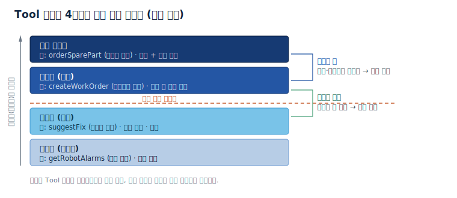
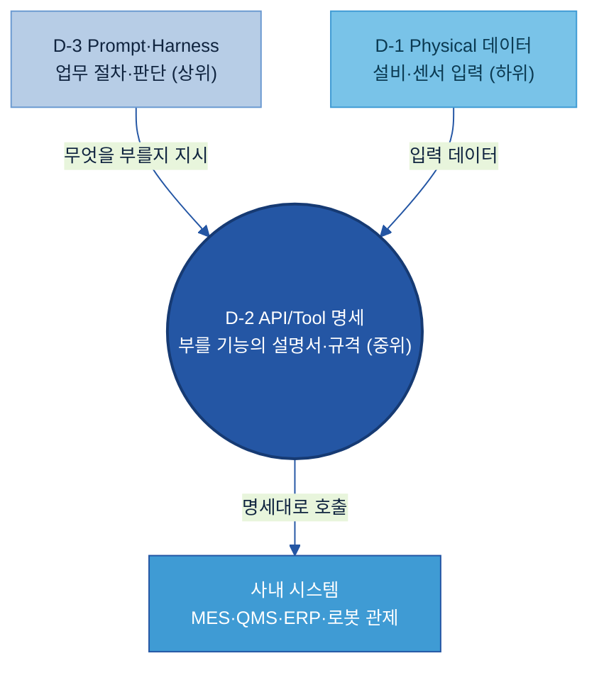
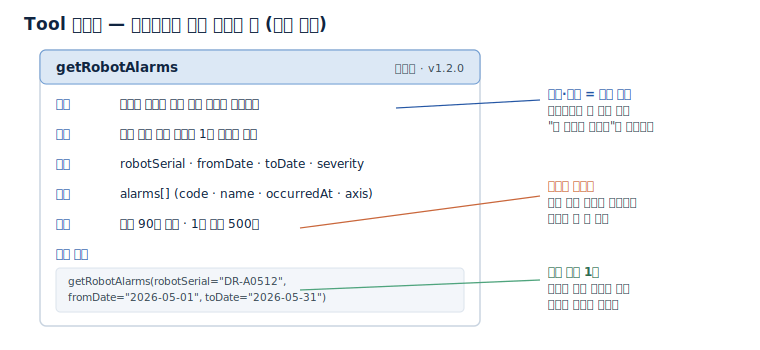
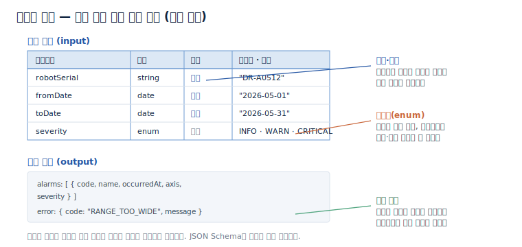
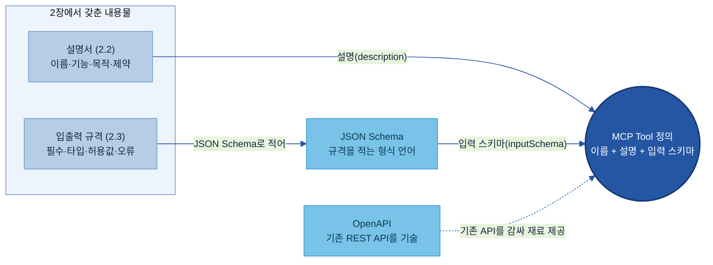
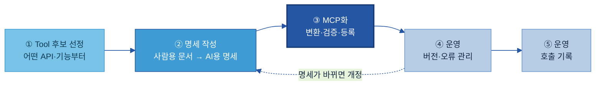
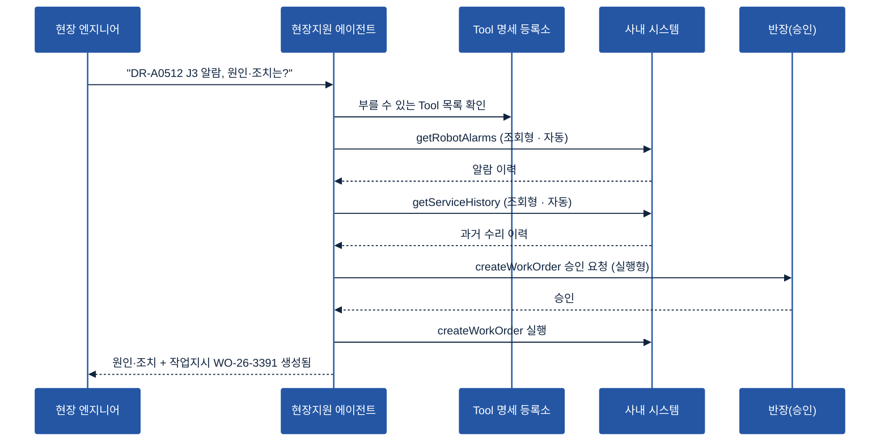
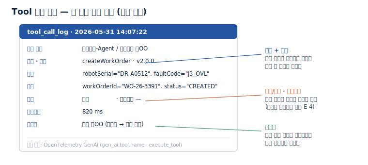
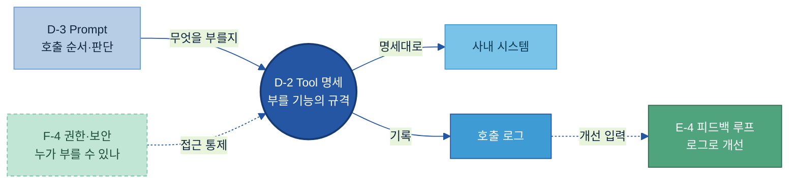

# D-2. API/Tool 연계 데이터 매뉴얼

> 정의: AI 에이전트가 외부 시스템과 Tool을 안전하게 호출하도록 기능·입출력·제약을 정의한 명세 체계.

---

## 목차

1. [Why — 왜, 언제 필요한가 (적용 판단)](#why)
    - [1.1 현업에서 막히는 지점](#s11)
    - [1.2 명세를 갖추면 달라지는 것 — 적용 전/후](#s12)
    - [1.3 위험도 분류·우선순위](#s13)
2. [What — Tool 명세란 무엇인가 (무엇을 갖추나)](#what)
    - [2.1 API/Tool 연계 데이터란 + 체계 내 위치](#s21)
    - [2.2 Tool 설명서 — AI가 읽고 고르는 설명](#s22)
    - [2.3 입출력 규격 — 기계가 검증하는 약속](#s23)
    - [2.4 명세 표준 — MCP · OpenAPI · JSON Schema](#s24)
3. [How — 어떻게 만들고 운영하나 (기존 API → MCP Tool 명세)](#how)
    - [3.1 구축 절차 5단계 한눈에](#s31)
    - [3.2 ① Tool 후보 선정 — 어떤 API·기능부터 연결하나](#s32)
    - [3.3 ② 명세 작성 — 사람용 API 문서를 AI용 명세로](#s33)
    - [3.4 ③ MCP화 — 변환·검증·등록](#s34)
    - [3.5 ④ 운영 — 버전·오류 관리](#s35)
    - [3.6 ⑤ 운영 — 호출 기록](#s36)
4. [Tech Stack — 솔루션 검토](#tech)
    - [4.1 레지스트리·게이트웨이](#s41)
5. [Where — 다른 주제와의 관계](#where)

- [별첨 (Appendix)](#별첨-appendix)
    - [Appendix A — Tool 명세 항목 사전 (전체)](#apx-a) · [Appendix B — 빈 템플릿 + 완성 예시](#apx-b)
- [참고자료 (References)](#참고자료-references) · [변경 이력 / 피드백 반영](#변경-이력--피드백-반영)

---

> **예시 표기 안내:** 본 가이드의 다이어그램·표에 나오는 구체 값(로봇 시리얼·알람 코드·작업지시 번호·버전·건수 등)은 이해를 돕기 위한 가상 예시이며 실제 데이터가 아니다. 실제 값은 PoC·프로젝트에서 확정한다.

> **관련 가이드:** [D-1 Physical 데이터](../D-1%20Physical%20데이터/D-1%20Physical%20데이터.md) · [D-3 Prompt/Harness 자산화](../D-3%20Prompt_Harness%20자산화/D-3%20Prompt_Harness%20자산화.md) · [E-4 데이터 Feedback Loop](../E-4%20데이터%20Feedback%20Loop/E-4%20데이터%20Feedback%20Loop.md) · [F-4 AI 데이터 권한 보안](../F-4%20AI%20데이터%20권한%20보안/F-4%20AI%20데이터%20권한%20보안.md) · [A-1 데이터 카탈로그](../A-1%20데이터%20카탈로그/A-1%20데이터%20카탈로그.md) · [B-1 데이터 전처리](../B-1%20데이터%20전처리/B-1%20데이터%20전처리.md) · [B-3 온톨로지](../B-3%20온톨로지/B-3%20온톨로지.md)

이 가이드는 AI 에이전트(AI Agent, 사람의 지시를 받아 스스로 시스템을 호출하며 일을 처리하는 AI)가 외부 시스템과 Tool을 부르려면 무엇을 데이터로 준비해야 하는지를 다룬다. 다루는 것은 에이전트를 만드는 법이 아니라, **회사에 이미 있는 API를 에이전트가 읽을 수 있는 Tool 명세 데이터로 바꾸는 일**이다. 왜 필요하고 무엇이 위험한지(1장), 명세라는 데이터가 무엇이고 어떤 표준(MCP·OpenAPI·JSON Schema)으로 적는지(2장), 기존 API를 골라 AI용 명세로 다시 쓰고 MCP로 바꿔 운영하는 순서(3장), 그 명세를 모아 관리하는 솔루션(4장), 인접 주제와의 경계(5장) 순으로 본다.

---

<a id="why"></a>

## 1. Why — 왜, 언제 필요한가 (적용 판단)

Tool 명세는 골라서 만든다. 에이전트가 실제로 외부 시스템을 부를 때만 필요하고, 단순 답변형이면 필요 없다. 만들기로 했다면 가장 먼저 위험도를 나눠, 되돌리기 어려운 동작에 사람 승인을 끼운다(1.3).

<a id="s11"></a>

### 1.1 현업에서 막히는 지점

사내 시스템에는 API가 이미 있다. 그러나 에이전트에게 시스템 호출을 맡기려 하면 Tool 명세 없이는 다음 문제에 반복적으로 부딪힌다.

| 막히는 지점 | 현장에서 벌어지는 일 |
|---|---|
| 무엇을 어떻게 부를지 모름 | 에이전트가 MES·QMS에서 실적을 조회해 답해야 하는데, 부를 창구와 방법이 정해져 있지 않아 결국 사람이 매번 시스템을 대신 뒤진다 |
| 설명이 부실해 엉뚱한 Tool 선택 | 생산 실적 조회와 검사 실적 조회처럼 비슷한 Tool이 여럿일 때, 기능 설명이 모호하면 에이전트가 잘못 고른다 |
| 입력 규격이 없어 잘못된 호출 | 날짜 형식·필수값·범위 한도가 정해져 있지 않아, 빈 결과가 나오거나 과도한 범위 조회로 운영계에 부하를 준다 |
| 위험한 동작을 그냥 실행 | 작업지시 생성·부품 발주·설비 정지처럼 되돌리기 어려운 동작을 사람 확인 없이 실행해 사고로 이어진다 |
| 시스템이 바뀌었는데 옛 방식으로 호출 | API 응답 구조가 바뀌었는데 에이전트는 예전 명세로 불러, 조용히 실패하거나 잘못된 값을 받는다 |

공통점은 에이전트의 성능 문제도, API의 부재도 아니다. 에이전트가 부를 대상의 **설명서와 규격이 데이터로 정리돼 있지 않다**는 데 있다.

<a id="s12"></a>

### 1.2 명세를 갖추면 달라지는 것 — 적용 전/후

Tool 명세를 표준화하면 네 가지가 달라진다.

- 에이전트가 맞는 Tool을 정확히 골라 호출한다. 기능·목적이 분명한 설명서가 있으면 비슷한 Tool 사이에서 옳게 선택하고, 사람이 시스템을 일일이 뒤지지 않아도 된다.
- 잘못된 호출을 사전에 막는다. 입출력 규격이 필수값·타입·허용값을 약속하면, 규격을 벗어난 호출은 실행 전에 거부된다.
- 사고를 예방한다. Tool을 위험도로 나누고 높은 등급에 사람 승인을 끼우면, 되돌리기 어려운 동작이 검토 없이 실행되지 않는다.
- 한 번 만든 명세를 여러 에이전트가 재사용한다. 명세가 자산으로 등록되면, 새 에이전트도 같은 Tool을 다시 정의할 필요 없이 바로 호출한다.

협동로봇 A/S 현장에 지원 에이전트를 도입하는 상황(현장 엔지니어가 로봇 알람의 원인·조치를 문의)을 예로 들면, 적용 전과 후는 다음과 같이 갈린다.

| 구분 | Tool 명세 없을 때 | Tool 명세 있을 때 |
|---|---|---|
| 알람 원인 조회 | 엔지니어가 관제·MES·서비스 시스템을 차례로 직접 연다 | 에이전트가 알람·이력·재고를 자동 조회해 한 번에 모은다 |
| Tool 선택 | — | 기능 설명을 읽고 알람 조회 Tool을 정확히 고른다 |
| 작업지시 생성 | 사람이 수기로 작성, 누락·중복 발생 | 에이전트가 초안을 만들고 반장 승인 후 생성된다 |
| 부품 발주 | 담당자가 협력사에 개별 연락 | 한도 안에서 승인 후 발주, 모든 호출이 기록된다 |

이 시나리오가 실제로 돌아가는 흐름은 [3.1절](#s31)의 예시에서, 명세를 만드는 순서는 3장 전체에서 단계별로 따라간다.

<a id="s13"></a>

### 1.3 위험도 분류·우선순위

만들기로 한 Tool은 가장 먼저 **위험도로 나눈다.** 같은 호출이라도 데이터를 읽기만 하는 것과 작업지시를 생성하거나 외부로 전송하는 것은 사고 시 파장이 다르기 때문이다. 위험도는 Tool 명세에 메타데이터로 적어 두고, 등급에 따라 자동 호출할지 사람 승인을 끼울지 규칙을 함께 데이터로 관리한다.



| 등급 | 무엇을 | 제조 예시 | 처리 |
|---|---|---|---|
| **조회형** | 데이터를 읽기만 | 로봇 알람·가동 로그 조회, 검사 실적 조회 | 자동 호출 |
| **추천형** | 제안만, 실제 변경 없음 | 조치안 제시, 점검 항목 추천 | 자동 호출 · 기록 |
| **실행형** | 시스템에 쓰기 | 작업지시 생성, 재고 차감, 설비 정지 | 실행 전 사람 승인 |
| **외부 전송형** | 조직 밖으로 내보냄 | 협력사 부품 발주, 고객 통지 발송 | 사람 승인 + 금액·범위 한도 |

> **판단 기준:** 등급이 헷갈리면 "이 호출이 잘못됐을 때 되돌릴 수 있는가"를 묻는다. 되돌릴 수 있으면 게이트 아래(자동), 사고가 나거나 되돌리기 어려우면 게이트 위(승인)다. 권한을 넓게 주기 전에 좁게 시작해 넓히는 편이 안전하다 — 에이전트에 과도한 실행 권한을 주는 위험은 OWASP가 LLM 애플리케이션의 주요 위험으로 정리한 Excessive Agency로 다루고[\[11\]](#ref11), 위험도에 따라 관리 강도를 달리하는 접근은 NIST AI 위험관리 프레임워크의 위험 기반 관리와 같은 방향이다[\[12\]](#ref12).

우선순위는 위험이 낮고 효과가 분명한 **조회형부터** 시작한다. 조회형으로 에이전트가 데이터를 정확히 가져오는 것을 검증한 뒤, 실행형·외부 전송형으로 넓힌다.

---

<a id="what"></a>

## 2. What — Tool 명세란 무엇인가 (무엇을 갖추나)

Tool 명세 한 건은 에이전트가 읽고 고르는 **설명서**(2.2)와 기계가 검증하는 **입출력 규격**(2.3)으로 이루어지고, 이 둘을 MCP·OpenAPI·JSON Schema라는 **표준 형식**(2.4)으로 적는다.

<a id="s21"></a>

### 2.1 API/Tool 연계 데이터란 + 체계 내 위치

API/Tool 연계 데이터란 에이전트가 부를 기능 하나하나를 **설명서와 규격으로 적어 둔 명세**다. 여기서 Tool(도구)이란 에이전트가 호출해 일을 시키는 기능 단위이고, API(Application Programming Interface)란 시스템끼리 데이터를 주고받는 약속된 창구다. 에이전트는 이 명세를 읽어 어떤 Tool이 있고 무엇을 넣으면 무엇이 나오는지 파악한 뒤, 맞는 Tool을 골라 호출한다.

이 주제는 에이전트를 만드는 법이 아니라, 에이전트가 읽을 **명세를 데이터로 준비하는 법**이다. 호출 순서를 짜고 판단하는 일은 [D-3 Prompt/Harness 자산화](../D-3%20Prompt_Harness%20자산화/D-3%20Prompt_Harness%20자산화.md)가 맡고, D-2는 그 위에서 불릴 기능의 설명서·규격·위험 등급·호출 기록을 정의한다. 실행 그룹(D)에서 D-2는 가운데 층에 있다 — 위에서 절차·판단(D-3)이 지시하고, 아래에서 설비·센서 입력([D-1 Physical 데이터](../D-1%20Physical%20데이터/D-1%20Physical%20데이터.md))이 들어오며, D-2는 그 사이에서 "부를 기능의 규격"을 정의해 사내 시스템과 잇는다.



사람용 API 문서와 에이전트용 Tool 명세는 같은 API를 다루지만 쓰임이 다르다. 개발자는 문서가 모호해도 담당자에게 묻고 시험하며 행간을 메우지만, 에이전트는 **적힌 것만** 읽고 스스로 고르고 호출한다. 그래서 명세는 참고 문서가 아니라 데이터여야 한다. Tool 명세 한 건은 에이전트가 읽고 고르는 **설명서**(2.2)와 기계가 검증하는 **입출력 규격**(2.3) 두 부분으로 이루어지며, 이를 담는 표준 형식이 MCP·OpenAPI·JSON Schema다(2.4). 기존 API에서 이 명세를 실제로 만들어 운영하는 순서는 3장에서 다룬다.

<a id="s22"></a>

### 2.2 Tool 설명서 — AI가 읽고 고르는 설명

Tool 설명서는 에이전트가 후보 Tool 가운데 하나를 부를지 판단하는 근거가 되는 글이다. 사람이 읽는 매뉴얼이 아니라, 에이전트가 후보 여럿 중 하나를 고르는 근거이므로, 기능과 목적이 분명해야 잘못 고르지 않는다. 설명서 한 건은 다음 항목으로 적는다.



현업 실행 키트 ㉠ — 항목 사전 (대표 항목). 전체는 [Appendix A](#apx-a)에 둔다.

| 항목 | 쉬운 의미 | 예시값 | 필수/선택 | 작성 주체 |
|---|---|---|---|---|
| 이름 | Tool을 부르는 고유 이름 | `getRobotAlarms` | 필수 | 데이터·IT |
| 기능 | 무엇을 하는지 한 줄 | 지정한 로봇의 최근 알람 이력을 조회한다 | 필수 | 데이터·IT + 현업 |
| 목적 | 언제 쓰는지 | 현장 알람 원인 분석의 1차 데이터 확보 | 필수 | 현업 |
| 입력 | 넣을 값 (규격은 2.3) | robotSerial, fromDate, toDate, severity | 필수 | 데이터·IT |
| 출력 | 나올 값 | alarms[] (code·name·occurredAt·axis) | 필수 | 데이터·IT |
| 제약 | 한도·금지 | 최대 90일 범위, 1회 최대 500건 | 필수 | 데이터·IT + 현업 |
| 호출 예시 | 올바른 호출 1건 | `getRobotAlarms(robotSerial="DR-A0512", …)` | 권장 | 데이터·IT |
| 위험도 | 등급 (1.3) | 조회형 | 필수 | 현업 + 보안 |

> **주의:** 기능 설명을 "데이터를 가져온다"처럼 모호하게 적으면, 에이전트가 비슷한 Tool과 구분하지 못해 엉뚱한 것을 부른다. 무엇을·어디서·무엇으로 좁혀 적는다(작성 규칙은 [3.3절](#s33)).

<a id="s23"></a>

### 2.3 입출력 규격 — 기계가 검증하는 약속

입출력 규격은 Tool에 **넣을 값과 나올 값의 약속**이다. 설명서가 사람·에이전트가 읽는 글이라면, 입출력 규격은 기계가 검사하는 계약이다. 필수값이 비거나 타입이 다르거나 허용값을 벗어나면 호출 자체를 거부해, 에이전트가 잘못된 값으로 시스템을 부르는 일을 막는다.



규격에 적는 것은 네 가지다.

- 필수값: 없으면 호출이 성립하지 않는 값(예: robotSerial). 비면 거부한다.
- 타입: 값의 형식(문자·숫자·날짜). 다르면 거부한다.
- 허용값: 고를 수 있는 값의 목록(예: severity = INFO·WARN·CRITICAL). 목록 밖 값은 받지 않아, 에이전트가 오타나 임의 값으로 부르지 못한다.
- 응답·오류: 성공 시 나올 구조와, 실패 시 돌려줄 오류 코드(예: `RANGE_TOO_WIDE`). 실패도 정해진 코드로 돌려줘야 에이전트가 다음 행동을 정한다.

> **용어 풀이:** 이 약속을 기계가 검사할 수 있게 적는 표준 언어가 JSON Schema다 — 필수값(`required`)·타입(`type`)·허용값(`enum`)을 선언하면 호출 전에 자동 검증된다([2.4절](#s24))[\[5\]](#ref5).

<a id="s24"></a>

### 2.4 명세 표준 — MCP · OpenAPI · JSON Schema

Tool 명세는 임의 양식이 아니라 표준 형식으로 적는다. 표준으로 적어야 솔루션과 에이전트가 사람 손을 거치지 않고 그대로 읽고 검증한다. 표준은 세 가지가 역할을 나눈다.

| 표준 | 무엇을 정하나 | 대표 쓰임 | 출처 |
|---|---|---|---|
| **JSON Schema** | 입출력의 타입·필수값·허용값 (약속의 언어) | 입력 규격을 기계가 검증 가능하게 선언 | [\[5\]](#ref5) |
| **OpenAPI** | 기존 REST API의 경로·파라미터·응답 | ERP·MES·QMS의 기존 API를 문서화해 Tool로 감쌀 준비 | [\[3\]](#ref3)[\[4\]](#ref4) |
| **MCP** | 에이전트와 Tool을 잇는 호출 프로토콜 | Tool 목록 제공·호출(`tools/list`·`tools/call`)·변경 알림 | [\[1\]](#ref1)[\[2\]](#ref2) |

세 표준의 관계는 다음과 같다. **JSON Schema**가 입출력의 형식을 적는 바탕 언어이고, **OpenAPI**는 그 언어로 기존 REST API를 기술하는 표준이며, **MCP**(Model Context Protocol, 에이전트와 Tool을 잇는 개방형 프로토콜)는 에이전트가 Tool 목록을 받아 호출하는 방식을 정한다.

MCP의 Tool 정의는 결국 **이름 + 설명 + 입력 스키마** 세 가지로 이루어진다[\[1\]](#ref1). 즉 2.2에서 갖춘 설명서가 설명(description)으로, 2.3에서 갖춘 입출력 규격이 입력 스키마(inputSchema, JSON Schema로 적음)로 그대로 들어간다 — MCP는 이 장에서 갖춘 두 내용물을 담는 표준 그릇이다. 이름·설명·입력 스키마만 잘 관리하면 특정 제품에 종속되지도 않는다. 같은 명세가 MCP 서버로도, 개별 LLM의 Tool 정의로도 옮겨 쓰인다[\[6\]](#ref6).

세 표준과 2장에서 갖춘 두 내용물의 관계를 그림으로 나타내면 다음과 같다.



> **주의:** MCP는 빠르게 발전하는 표준이다. 안정 명세 일자와 호환 범위는 도입 시점에 공식 문서로 확인한다(버전 운영은 [3.5절](#s35))[\[15\]](#ref15).

---

<a id="how"></a>

## 3. How — 어떻게 만들고 운영하나 (기존 API → MCP Tool 명세)

기존 API에서 Tool 명세를 만드는 일은 다섯 단계다 — 부를 Tool을 고르고(①), AI용 명세로 다시 쓰고(②), 표준 형식으로 바꿔 등록한 뒤(③), 버전과 기록으로 운영한다(④·⑤). 조회형 한 건으로 작게 시작해 검증한 뒤 넓힌다.

<a id="s31"></a>

### 3.1 구축 절차 5단계 한눈에

모든 시스템 기능을 한꺼번에 명세로 만들지 않는다. 아래 다섯 단계를 조회형 한 건으로 먼저 완주해 호출을 검증하고, 그다음 Tool을 늘린다.



| 단계 | 수행 내용 | 현장 지원 에이전트 사례 (협동로봇 A/S, 가상) |
|---|---|---|
| **① Tool 후보 선정** | 에이전트가 부를 기능을 추리고 위험도·우선순위를 매김 | 알람 조회·이력 조회·재고 조회(조회형) + 작업지시 생성(실행형)을 후보로 정함 |
| **② 명세 작성** | 사람용 API 문서를 AI용 설명서·입출력 규격으로 다시 씀 | `getRobotAlarms` 설명서·규격 작성(robotSerial 필수, 90일·500건 제한), 실행형엔 반장 승인 규칙 |
| **③ MCP화 — 변환·검증·등록** | 표준 형식으로 바꿔 호출 테스트 후 등록소에 올림 | OpenAPI 정의를 MCP Tool로 매핑, "DR-A0512, 최근 30일" 호출 검증, v1.0.0 등록 |
| **④ 운영 — 버전·오류** | 변경을 버전으로 남기고 폐기를 예고 | `createWorkOrder`에 필수값 추가 → v2로 올리고 v1 병행·폐기 예고 |
| **⑤ 운영 — 호출 기록** | 모든 호출을 정해진 형태로 기록 | 호출 주체·버전·입출력·승인자를 로그로 축적 |

**예시로 따라가기 — 완성된 명세가 돌아가는 모습.** 다섯 단계를 마치면 한 질문이 이렇게 처리된다. 에이전트는 등록소에서 부를 수 있는 Tool 목록을 확인하고, 조회형은 자동으로, 실행형은 사람 승인을 거쳐 호출한다.



조회형(getRobotAlarms·getServiceHistory)은 부작용이 없어 자동으로 부르고, 실행형(createWorkOrder)은 사람 승인을 거친 뒤 실행된다. 이 모든 호출은 기록으로 남는다([3.6절](#s36)).

<a id="s32"></a>

### 3.2 ① Tool 후보 선정 — 어떤 API·기능부터 연결하나

먼저 에이전트가 부를 만한 Tool을 추린다. 모든 시스템 기능을 Tool로 만들지 않고, 에이전트가 실제로 쓸 기능부터 고른다. 후보는 기능 성격으로 분류하면 빠짐없이 추리기 쉽고, 유형이 곧 위험도(1.3)로 이어져 우선순위까지 함께 정해진다.

| 유형 | 무엇을 | 제조 예시 (협동로봇 A/S) | 위험도 |
|---|---|---|---|
| 조회 | 시스템에서 데이터를 읽음 | 로봇 알람·가동 로그 조회, A/S 이력 조회 | 조회형 |
| 계산 | 값을 받아 결과를 냄 | 가동률(OEE) 계산, 수리 예상 시간 산출 | 조회형 |
| 검색 | 자료를 찾아 돌려줌 | 정비 매뉴얼·SOP 검색 | 조회형 |
| 보고서 생성 | 정해진 양식으로 문서를 만듦 | 일일 현장 점검 리포트 생성 | 추천형 |
| 업무 실행 | 시스템 상태를 바꿈 | 작업지시 생성, 부품 재고 차감 | 실행형 |
| 외부 전송 | 조직 밖으로 내보냄 | 협력사 부품 발주, 고객 알림 발송 | 외부 전송형 |

> **제조 예시:** 협동로봇 제조사가 현장 지원 에이전트를 도입한다면, 후보는 로봇 알람 조회·A/S 이력 조회·부품 재고 조회(조회형) → 작업지시 생성(실행형) → 협력사 발주(외부 전송형) 순으로 추린다. 조회형 세 개로 먼저 검증하고 실행형·외부 전송형을 더한다.

<a id="s33"></a>

### 3.3 ② 명세 작성 — 사람용 API 문서를 AI용 명세로

사람용 API 문서를 그대로 에이전트에 주지 않는다. 개발자는 모호한 문서를 물어보고 시험하며 메우지만, 에이전트는 적힌 것만 읽고 판단한다. 그래서 ①에서 고른 Tool마다 설명서(2.2)와 입출력 규격(2.3)을 **AI용으로 다시 쓴다.** 다시 쓸 때 규칙은 세 가지다.

- **기능 설명은 좁게 다시 쓴다.** 설명은 에이전트가 비슷한 Tool 사이에서 고르는 근거다 — 같은 Tool이라도 설명에 따라 선택 정확도가 갈리므로, 작성에서 가장 효과가 큰 항목이다.
- **입력은 에이전트에 필요한 값만 남긴다.** 사람용 API의 파라미터를 전부 노출하지 않는다. 남긴 값은 필수·타입·허용값을 못 박는다.
- **제약·오류를 명시한다.** 한도(기간·건수)와 실패 시 오류 코드를 정해진 값으로 적고, 위험도 등급·승인 규칙(1.3)도 이 단계에서 명세에 함께 적는다.

현업 실행 키트 ㉡ — Before → After 작성 규칙.

| 구분 | 다듬기 전 | 다듬은 뒤 |
|---|---|---|
| 기능 설명 | "로봇 데이터를 가져온다" | "지정한 로봇 시리얼의 최근 알람 이력을 조회한다" |
| 입력 | "조건을 넣는다" | "robotSerial(필수), fromDate·toDate(필수), severity(선택)" |
| 제약 | (비어 있음) | "최대 90일 범위, 1회 최대 500건" |
| 오류 | (비어 있음) | "범위 초과 시 `RANGE_TOO_WIDE` 반환" |

> **금지 표현:** 기능·제약에 "각종·관련·적절히·필요시" 같은 막연한 말을 쓰지 않는다. 무엇을·얼마까지를 수치와 목록으로 좁힌다.

명세 한 건의 빈 템플릿과 완성 예시는 [Appendix B](#apx-b)에 있다 — 그대로 복사해 채운다.

<a id="s34"></a>

### 3.4 ③ MCP화 — 변환·검증·등록

작성한 명세를 에이전트가 읽는 표준 형식으로 바꾼다. 기존 REST API에 OpenAPI 문서가 있으면 변환은 매핑에 가깝다 — OpenAPI의 경로·동작·스키마가 MCP Tool 정의(이름·설명·입력 스키마)의 재료로 그대로 대응된다[\[1\]](#ref1)[\[4\]](#ref4). 문서가 없는 레거시 API는 먼저 OpenAPI로 기술한다. 이 문서화 자체가 데이터 준비의 출발선이고, 이후 테스트·문서·Tool 생성에 모두 재사용된다.

| 기존 API 문서 (OpenAPI) | MCP Tool 명세 | 옮길 때 할 일 |
|---|---|---|
| 경로·동작 (path·operation) | 이름 (name) | Tool 이름 규칙으로 바꿔 단다 (예: `GET /robots/{sn}/alarms` → `getRobotAlarms`) |
| 요약·설명 (summary·description) | 설명 (description) | **그대로 옮기지 않고 다시 쓴다** — 사람용 요약은 에이전트의 선택 근거가 못 된다(②의 작성 규칙) |
| 파라미터·요청 스키마 | 입력 스키마 (inputSchema) | 에이전트에 필요한 값만 남기고, 필수·타입·허용값(enum)을 보강한다 |
| 응답 (responses) | 출력 구조·오류 코드 | 성공 구조와 실패 코드를 정해진 형태로 정리한다 |

> **판단 기준 — 우리 API는 어느 경로인가:**
> - 기존 시스템에 REST API가 있고 OpenAPI 문서가 있으면 → 위 표대로 MCP Tool로 매핑한다.
> - API는 있으나 문서가 없으면 → OpenAPI로 먼저 기술한다.
> - 에이전트에 Tool로 노출하려면 → MCP 서버로 감싼다.
> - 입력 규칙을 못 박으려면 → JSON Schema의 `required`·`enum`으로 선언한다.

> **주의:** 자동 변환 도구를 쓰더라도 설명(description)은 반드시 다시 쓴다 — 사람용 요약을 그대로 옮긴 Tool은 에이전트가 잘못 고른다. API 전체를 노출하지도 않는다 — ①에서 고른 기능만 MCP Tool로 만든다.

변환을 마치면 **검증하고 등록한다.** 예시 값으로 실제 호출해 규격대로 도는지 확인하고(예: "DR-A0512, 최근 30일" 호출 → 알람 5건이 약속한 구조로 반환), 통과한 명세를 등록소(Registry)에 올려 버전을 부여한다(v1.0.0). 등록소에 올라가야 여러 에이전트가 같은 명세를 찾아 재사용한다(등록소 선택은 [4장](#tech)).

현업 실행 키트 ㉤ — 어디서 하나(플랫폼 매핑). 기존 REST API는 OpenAPI로 기술하고[\[4\]](#ref4), 에이전트에 노출할 Tool은 MCP 서버로 감싸며[\[1\]](#ref1), 입력 규칙은 JSON Schema로 못 박는다[\[5\]](#ref5). 사내 API가 게이트웨이(Kong·Apigee·AWS API Gateway)로 관리되면 그곳에 등록·버전 관리한다[\[8\]](#ref8)[\[9\]](#ref9)[\[10\]](#ref10).

<a id="s35"></a>

### 3.5 ④ 운영 — 버전·오류 관리

Tool의 기능·입출력·응답 구조는 시간이 지나면 바뀐다. 바뀐 사실을 버전으로 남기지 않으면, 에이전트가 옛 명세대로 불러 조용히 실패하거나 잘못된 값을 받는다. 그래서 명세에 버전을 붙이고 변경 이력을 관리한다.

- 버전 표기는 의미적 버전(Semantic Versioning, `X.Y.Z`)을 쓴다 — 하위 호환을 깨는 변경은 X(메이저)를 올린다[\[14\]](#ref14). MCP처럼 날짜형(YYYY-MM-DD) 버전을 쓰는 표준도 있으므로 표준 관례를 따른다[\[15\]](#ref15).
- 하위 호환을 깨는 변경(필수값 추가, 응답 구조 변경)은 메이저 버전을 올리고, 옛 버전을 일정 기간 함께 두고 폐기(deprecation)를 예고한다.
- 폐기·변경 시 그 Tool에 의존하는 에이전트와 Prompt를 함께 점검한다(의존 관계는 [D-3 Prompt/Harness 자산화](../D-3%20Prompt_Harness%20자산화/D-3%20Prompt_Harness%20자산화.md)).

> **제조 예시:** `createWorkOrder`에 필수 입력 `priority`를 새로 넣으면 하위 호환이 깨지므로 v1 → v2로 올린다. 옛 v1을 부르던 에이전트가 멈추지 않도록 v1을 한동안 함께 두고, 폐기 예정일을 명세에 적는다.

<a id="s36"></a>

### 3.6 ⑤ 운영 — 호출 기록

에이전트가 Tool을 부를 때마다 호출 기록(로그)을 남긴다. 기록이 있어야 무엇이 어떻게 불렸는지 감사하고, 실패 원인을 찾고, 개선의 근거로 쓴다. 한 건의 로그에는 다음을 담는다.



| 필드 | 무엇을 | 왜 |
|---|---|---|
| 시각 | 호출 시점 | 순서·지연 추적 |
| 호출 주체 | 어느 에이전트·사용자 | 책임 소재 |
| 도구 · 버전 | Tool 이름과 명세 버전 | 어느 명세로 불렀는지 확인 |
| 입력 · 출력 | 넣은 값과 나온 값 | 재현·디버깅 |
| 성공/실패 · 오류코드 | 결과와 실패 원인 | 개선의 입력 |
| 소요시간 | 호출에 걸린 시간 | 성능 점검 |
| 승인자 | 실행형 승인한 사람 | 위험 행동 감사 추적 |

> **용어 풀이:** 로그 필드 이름은 OpenTelemetry의 생성형 AI 관례(`gen_ai.tool.name` 등)를 따르면 관측 솔루션과 그대로 연결된다[\[13\]](#ref13).

기록을 **모아서** 실패 패턴을 분석하고 명세·Prompt 개선으로 되돌리는 일은 [E-4 데이터 Feedback Loop](../E-4%20데이터%20Feedback%20Loop/E-4%20데이터%20Feedback%20Loop.md)가 맡는다. D-2는 그 입력이 되는 로그를 어떤 형태로 남길지를 정한다.

---

<a id="tech"></a>

## 4. Tech Stack — 솔루션 검토

명세를 적는 표준(MCP·OpenAPI·JSON Schema)은 [2.4절](#s24)에서 다뤘다. 여기서는 만든 명세를 모아 관리하는 곳 — 등록소와 게이트웨이를 이 주제 관점에서 비교한다.

<a id="s41"></a>

### 4.1 레지스트리·게이트웨이

만든 명세는 **등록소(Registry)**에 모아 등록·검색·버전 관리한다. 등록소가 있어야 여러 에이전트가 같은 Tool 명세를 찾아 일관되게 부른다. 등록소는 두 계열로 나뉜다.

| 유형 | 무엇을 | 대표 솔루션 |
|---|---|---|
| Tool 명세 레지스트리 | 에이전트용 Tool 명세를 등록·검색 | MCP Registry [\[7\]](#ref7) |
| 기업 API 카탈로그·게이트웨이 | 사내 호출 가능한 API를 등록·통제 | Kong [\[8\]](#ref8) · Apigee API hub [\[9\]](#ref9) · AWS API Gateway [\[10\]](#ref10) |

주요 API 게이트웨이 제품은 MCP 서버와 AI 트래픽까지 카탈로그·통제 대상으로 넓히고 있어, 사내 API 카탈로그가 "에이전트가 부를 수 있는 Tool"의 정본 목록 역할로 확장되는 추세다[\[8\]](#ref8)[\[9\]](#ref9).

> **권장:** 사내 시스템 API가 이미 API 게이트웨이로 관리되고 있으면, 그곳을 "호출 가능한 Tool의 정본"으로 삼고 에이전트용 명세를 그 위에 얹는다. 새 저장소를 따로 만들기보다 기존 카탈로그를 재사용하는 편이 중복과 불일치를 줄인다. 가격·기능 범위는 환경마다 다르므로 PoC 전 공식 견적·문서로 확인한다.

---

<a id="where"></a>

## 5. Where — 다른 주제와의 관계

D-2는 "부를 기능의 규격"을 정의하는 자리다. 호출을 지휘하는 일, 기록을 개선으로 잇는 일, 누가 부를 수 있는지 통제하는 일은 인접 주제가 맡는다.



| 인접 주제 | 그 주제의 역할 | D-2와의 경계 |
|---|---|---|
| [D-3 Prompt/Harness 자산화](../D-3%20Prompt_Harness%20자산화/D-3%20Prompt_Harness%20자산화.md) | 업무 절차·판단·호출 순서 | **D-3은 "언제 무엇을 부를지", D-2는 "부를 수 있는 기능의 규격".** 호출 순서·실행 흐름은 D-3 |
| [E-4 데이터 Feedback Loop](../E-4%20데이터%20Feedback%20Loop/E-4%20데이터%20Feedback%20Loop.md) | 운영 결과를 개선으로 환류 | **D-2는 호출 로그를 남기고, E-4는 그 로그를 모아 개선으로 되돌림** |
| [F-4 AI 데이터 권한 보안](../F-4%20AI%20데이터%20권한%20보안/F-4%20AI%20데이터%20권한%20보안.md) | 누가 무엇을 부를 수 있나 | **D-2는 Tool의 규격·위험 등급, F-4는 접근 권한·승인 거버넌스.** 승인 게이트의 권한 통제는 F-4 |
| [D-1 Physical 데이터](../D-1%20Physical%20데이터/D-1%20Physical%20데이터.md) | 설비·센서 입력 데이터 | **D-1은 에이전트가 받는 입력, D-2는 에이전트가 부르는 기능** |
| [A-1 데이터 카탈로그](../A-1%20데이터%20카탈로그/A-1%20데이터%20카탈로그.md) · [A-2 메타데이터](../A-2%20메타데이터/A-2%20메타데이터.md) | 데이터 자산의 위치·필드 속성 | **A-1·A-2는 데이터 자산을 설명, D-2는 그 자산을 부르는 Tool을 설명** |

---

## 별첨 (Appendix)

<a id="apx-a"></a>

### Appendix A — Tool 명세 항목 사전 (전체) · 현업 실행 키트 ㉠ 확장

본문 [2.2절](#s22)에 대표 항목만 둔 명세의 전체 항목이다. 실제 운영 시 이 표를 마스터시트(엑셀)로 관리한다.

| 항목 | 쉬운 의미 | 예시값 | 필수/선택 | 작성 주체 |
|---|---|---|---|---|
| 이름 | Tool 고유 이름 | `getRobotAlarms` | 필수 | 데이터·IT |
| 기능 | 무엇을 하는지 한 줄 | 지정한 로봇의 최근 알람 이력을 조회한다 | 필수 | 데이터·IT + 현업 |
| 목적 | 언제·왜 쓰는지 | 현장 알람 원인 분석의 1차 데이터 확보 | 필수 | 현업 |
| 위험도 | 4등급 중 하나 | 조회형 | 필수 | 현업 + 보안 |
| 연결 시스템 | 실제 호출 대상 | 로봇 관제 / MES | 필수 | 데이터·IT |
| 입력 파라미터 | 넣을 값 목록 | robotSerial, fromDate, toDate, severity | 필수 | 데이터·IT |
| 입력 타입·필수 | 각 값의 형식과 필수 여부 | robotSerial: string(필수) | 필수 | 데이터·IT |
| 허용값 | 고를 수 있는 값 | severity: INFO·WARN·CRITICAL | 해당 시 | 데이터·IT + 현업 |
| 출력 구조 | 나올 값의 형태 | alarms[] (code·name·occurredAt·axis·severity) | 필수 | 데이터·IT |
| 제약 | 한도·금지 | 최대 90일, 1회 500건 | 필수 | 데이터·IT + 현업 |
| 오류 코드 | 실패 시 반환 | `RANGE_TOO_WIDE`, `NOT_FOUND` | 권장 | 데이터·IT |
| 호출 예시 | 올바른 호출 1건 | `getRobotAlarms(robotSerial="DR-A0512", fromDate="2026-05-01", toDate="2026-05-31")` | 권장 | 데이터·IT |
| 승인 규칙 | 사람 승인 필요 여부 | 불필요(조회형) / 반장 승인(실행형) | 필수 | 현업 + 보안 |
| 버전 | 명세 버전 | v1.2.0 | 필수 | 데이터·IT |

표준값 목록(현업 실행 키트 ㉢) — 위험도: 조회형 · 추천형 · 실행형 · 외부 전송형. 승인 규칙: 불필요 · 담당자 승인 · 책임자 승인 · 승인 + 한도.

<a id="apx-b"></a>

### Appendix B — 빈 Tool 명세 템플릿 + 1건 완성 예시 · 현업 실행 키트 ㉣

빈 템플릿 (그대로 복사해 채운다):

```yaml
이름:            <영문 고유 이름>
기능:            <무엇을 하는지 한 줄>
목적:            <언제·왜 쓰는지>
위험도:          <조회형 | 추천형 | 실행형 | 외부 전송형>
연결 시스템:     <실제 호출 대상>
입력:
  - <이름>: { 타입: <string|number|date|enum>, 필수: <예/아니오>, 허용값: <목록> }
출력:            <나올 값의 구조>
제약:            <한도·금지>
오류 코드:       <실패 시 반환 코드>
호출 예시:       <올바른 호출 1건>
승인 규칙:       <불필요 | 담당자 | 책임자 | 승인+한도>
버전:            <X.Y.Z>
```

완성 예시 (협동로봇 A/S, 가상):

```yaml
이름:            getRobotAlarms
기능:            지정한 로봇 시리얼의 최근 알람 이력을 조회한다
목적:            현장 알람 원인 분석의 1차 데이터 확보
위험도:          조회형
연결 시스템:     로봇 관제 / MES
입력:
  - robotSerial: { 타입: string, 필수: 예, 허용값: "DR-로 시작" }
  - fromDate:    { 타입: date,   필수: 예 }
  - toDate:      { 타입: date,   필수: 예 }
  - severity:    { 타입: enum,   필수: 아니오, 허용값: [INFO, WARN, CRITICAL] }
출력:            alarms[] (code, name, occurredAt, axis, severity)
제약:            최대 90일 범위, 1회 최대 500건
오류 코드:       RANGE_TOO_WIDE, NOT_FOUND
호출 예시:       getRobotAlarms(robotSerial="DR-A0512", fromDate="2026-05-01", toDate="2026-05-31")
승인 규칙:       불필요(조회형)
버전:            v1.2.0
```

---

## 참고자료 (References)

본문 곳곳의 **[N]** 표시를 누르면 아래 해당 항목으로 이동한다. 버전·가격 등 변동 정보는 도입 시점에 공식 문서로 확인한다.

**표준·명세**
- <a id="ref1"></a>**[1]** MCP(Model Context Protocol) 명세 — <https://modelcontextprotocol.io/specification/2025-11-25>
- <a id="ref2"></a>**[2]** MCP 아키텍처 개요 — <https://modelcontextprotocol.io/docs/learn/architecture>
- <a id="ref3"></a>**[3]** OpenAPI Initiative — <https://www.openapis.org/>
- <a id="ref4"></a>**[4]** OpenAPI Specification(최신) — <https://spec.openapis.org/oas/latest.html>
- <a id="ref5"></a>**[5]** JSON Schema Specification — <https://json-schema.org/specification>
- <a id="ref6"></a>**[6]** Anthropic Tool use 개요 — <https://platform.claude.com/docs/en/agents-and-tools/tool-use/overview>

**레지스트리·솔루션**
- <a id="ref7"></a>**[7]** MCP Registry — <https://registry.modelcontextprotocol.io/> (소개: <https://modelcontextprotocol.io/registry/about>)
- <a id="ref8"></a>**[8]** Kong Service Catalog — <https://konghq.com/products/kong-konnect/features/api-service-catalog>
- <a id="ref9"></a>**[9]** Google Apigee API hub — <https://docs.cloud.google.com/apigee/docs/apihub/what-is-api-hub>
- <a id="ref10"></a>**[10]** AWS API Gateway 스테이지 — <https://docs.aws.amazon.com/apigateway/latest/developerguide/set-up-stages.html>

**위험·운영**
- <a id="ref11"></a>**[11]** OWASP LLM06:2025 Excessive Agency — <https://genai.owasp.org/llmrisk/llm062025-excessive-agency/>
- <a id="ref12"></a>**[12]** NIST AI Risk Management Framework — <https://www.nist.gov/itl/ai-risk-management-framework>
- <a id="ref13"></a>**[13]** OpenTelemetry GenAI Semantic Conventions — <https://github.com/open-telemetry/semantic-conventions-genai>
- <a id="ref14"></a>**[14]** Semantic Versioning — <https://semver.org/>
- <a id="ref15"></a>**[15]** MCP Versioning — <https://modelcontextprotocol.io/specification/versioning>

---

## 변경 이력 / 피드백 반영

| 일자 | 버전 | 피드백 (누가/무엇) | 반영 내용 | 반영 위치 |
|------|------|--------------------|-----------|-----------|
| 2026-06-24 | 0.1 | 초안 작성 (00 전체 목차 D-2 구조 · B-3/B-1 다이어그램·SVG 참고 · 0622 작업지시 문체) | Why·When 통합 6섹션, Tool 명세=데이터 준비 관점 고정, SVG 4종(위험도·설명서·입출력·로그)·Mermaid 5종, 명세 표준(MCP·OpenAPI·JSON Schema)·등록소·위험도·버전·로그, E2E 예시, 항목 사전·Before→After·빈 템플릿 | 전체 |
| 2026-07-02 | 0.2 | 고객 피드백 (스토리라인 점검 — 주제 축은 "기존 API를 MCP Tool 명세 데이터로", 명세 구성·표준·MCP화 방법론이 본론) | 목차 개편: 예시 시나리오 섹션 해체(적용 전/후→1.2, 흐름 미리보기→3.1 예시 콜아웃), Tool 후보 목록을 What에서 How ①로 이동(선정 작업), 명세 표준을 Tech Stack에서 What 2.4로 승격, How를 5단계(①선정→②명세 작성→③MCP화→④버전·오류→⑤호출 기록)로 재편하고 ③MCP화(OpenAPI→MCP 매핑 표·판단 기준) 신설, Tech Stack은 레지스트리·게이트웨이만, 본문 예시의 계열사명 표기 제거(제품·공정 표현으로) | 전체 |
| 2026-07-02 | 0.3 | 고객: B-1·B-3 말투 참고해 대화형 문장을 일반 컨설팅 문장으로 | 대화형·구어 표현 6곳 교정 — 따옴표 안 독백("이 Tool을 부를까"·"어떤 Tool이 있고…") 평서화, "그런데"→"그러나", "세 표준의 관계는 단순하다"→"…다음과 같다", "…의 몫이다"(A 그룹·E-4 2곳)→"…가 맡는다". 정의문·경계 대조·구조·표·다이어그램·출처는 유지 | 1.1, 1.3, 2.1·2.2·2.4, 3.6 |
| 2026-07-02 | 0.4 | 고객: '묶다' 표현 지양 | §2.4 "특정 제품에 묶이지도 않는다"→"…종속되지도 않는다", §3.2 "기능 성격으로 묶으면"→"…분류하면" | 2.4, 3.2 |
| 2026-07-02 | 0.5 | 고객: 옛 "1.3 적용 판단 — 언제 만드나" 절 불필요 | 해당 절(적용 시점 문단 + 적용 판단 결정트리 다이어그램) 삭제, 위험도 절을 1.3으로 당김, 참조(도입부·2.2·3.2·3.3) 번호 갱신 | 1장, 목차 |
| 2026-07-02 | 0.6 | 고객: 그림 필요한 곳 다이어그램 추가 | §2.4에 명세 표준 관계도 신설 — 설명서(2.2)→MCP 설명, 규격(2.3)→JSON Schema→MCP 입력 스키마, OpenAPI→기존 API 재료, MCP Tool 정의=이름+설명+입력 스키마의 합성 관계 시각화. 그림 아래 중복 문장 정리 | 2.4 |
