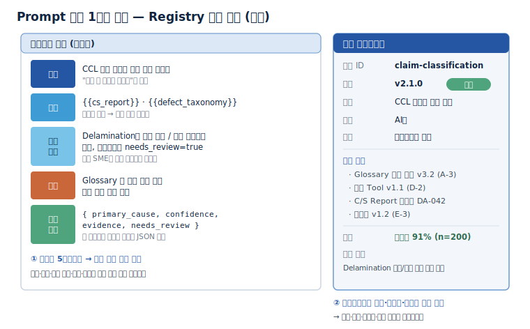

## 1.1 Test Test

같은 클레임 분류 업무인데 담당자마다 Prompt가 달라 분류 결과가 들쭉날쭉하다. --> 같은 클레임 분류 업무인데 담당자마다 Prompt가 달라 분류 결과에 일관성이 없다.

베테랑이 다듬어 둔 좋은 --> 검증된

AI 출력이 나빠져도 --> 결과 품질이 저하되어도

*Mermaid Chart*
P1["담당자마다 Prompt가 달라 결과가 들쭉날쭉"]:::pain

-->

P1["담당자마다 Prompt가 달라 결과가 일정하지 못함"]:::pain

## 1.2 기대 효과

Prompt를 검증된 공용 자산으로 관리하면 다음이 달라진다 --> Prompt를 공용 자산으로 관리하면 다음과 같은 효과를 기대할 수 있다.

노하우 축적: 현업 전문가의 판단 기준이 Prompt에 명문화되어 조직 자산으로 남는다.

-->

노하우 축적: 현업 전문가의 판단 기준이 Prompt에 규정화되어 조직 자산으로 남는다.

## 1.3 무엇을 자산화하나 (적용 판단)

하나만 뚜렷해도 후보가 되고, 여럿이 겹칠수록 우선순위가 높다. --> 한 가지만 분명해도 후보로 볼 수 있고, 여러 조건이 겹칠수록 우선순위는 더 높아진다.

| **노하우 함축도** | 전문가의 판단·제외 기준이 담겨 있는가 | "소재 결함 / 공정 결함" 구분 기준이 명문화된 Prompt |

-->

| **노하우 함축도** | 전문가의 판단·제외 기준이 담겨 있는가 | 소재 결함 / 공정 결함 구분 기준이 명문화된 Prompt |

모든 Prompt가 처음부터 자산인 것은 아니다. 일회성 대화로 시작한 Prompt가 반복 사용되며 보존 가치가 확인되고, 변수로 일반화되고, 평가를 통과한 뒤에야 Registry(등록소)에 등록되는 공용 자산으로 승격된다.

-->

모든 Prompt가 처음부터 자산인 것은 아니다. 일회성 대화로 시작한 Prompt가 반복 사용되며 보존 가치가 검증되고, 변수로 일반화되어 평가를 통과한 뒤에야 Registry에 등록되는 공용 자산으로 전환된다.

S1 -->|"반복되면"| S2 -->|"다듬어"| S3 -->|"평가로 검증"| S4 -->|"승인·등록"| S5

-->

S1 -->|"반복"| S2 -->|"형식 조정"| S3 -->|"평가로 검증"| S4 -->|"승인·등록"| S5

2.1 Prompt/ Harness 자산화란+체계 내 위치
Harness(하네스) — Prompt에 입력 데이터, Tool 호출 순서, 출력 형식(과 평가 기준)을 더해 하나로 묶어, 같은 업무를 반복 실행할 수 있게 만든 패키지[1][2].

-->

Harness — Prompt에 입력 데이터, Tool 호출 순서, 출력 형식(과 평가 기준)을 더해 하나로 묶어, 같은 업무를 반복 실행할 수 있게 만든 패키지[1][2].

2.2 자산 목록 - 무엇을 자산으로 관리하나
| **금지 행동** (Guardrails) | 해서는 안 되는 행동·출력 규칙 | 조직 리스크 기준의 명문화 |

-->

| **금지 행동** (Guardrails) | 해서는 안 되는 행동·출력 규칙 | 조직 리스크 기준의 규정화 |

2.3 업무 --> Prompt 변환 틀
사람의 업무 절차를 Prompt로 바꿀 때는 자유 서술로 적지 않고, 다섯 구획으로 나눠 적는다.

-->

사람의 업무 절차를 Prompt로 바꿀 때는 자유 서술로 적지 않고, 다섯 구역으로 나눠 적는다.

이렇게 구조화한 Prompt 자산 1건의 실제 모습은 다음과 같다. 왼쪽은 다섯 구획으로 나눈 본문, 오른쪽은 자산으로 관리하기 위한 메타데이터다.

-->

이렇게 구조화한 Prompt 자산 1건의 실제 모습은 다음과 같다. 왼쪽은 다섯 구역으로 나눈 본문, 오른쪽은 자산으로 관리하기 위한 메타데이터다.

-->

3.1 구축 절차
대상 선정 — 월 30\~50건으로 반복성이 높고, 오분류 시 고객 대응 오류로 이어져 영향도가 크다. 자산화 대상으로 확정한다.

-->

대상 선정 — 월 30\~50건으로 반복성이 높고, 오분류 시 고객 대응으로 이어져 영향도가 크다. 자산화 대상으로 확정한다.

3.2 버전 의존성 관리
업무 영향도가 큰 Prompt(분류·판정)는 반드시 현업 SME 승인을 거쳐 배포한다.

-->

업무 영향도가 큰 Prompt는 반드시 현업 SME 승인을 거쳐 배포한다.

3.3 운영 - 성능 저하 감지 개선
변경 영향도 분석으로 원인을 Glossary 변경으로 짚고, SME와 기준을 재정의해 새 버전을 작성·승인·배포했으며, 회귀 테스트로 91% 회복과 기존 통과 케이스 유지를 함께 확인했다.

-->

변경 영향도 분석을 통해 원인을 Glossary 변경으로 파악하고, SME와 기준을 재정의한 뒤 새 버전을 작성·승인·배포했다. 이후 회귀 테스트로 91% 회복과 기존 통과 케이스의 유지를 함께 확인했다.

3.4 작성 규칙 - 잘 쓴 자산과 못 쓴 자산
같은 업무라도 Prompt를 어떻게 적느냐에 따라 자산 가치가 갈린다.

-->

같은 업무라도 Prompt를 어떻게 적느냐에 따라 자산 가치가 달라진다.

4. Tech Stack — 솔루션 검토
2층 연결: 본 절은 이 주제 관점에서 솔루션의 기능을 비교한다. 솔루션을 주제 가로질러 묶어 평가·선정하려면 Tech Stack 비교 정본을 참조한다.

-->

2층 연결: 본 절에서는 해당 주제 관점에서 솔루션의 기능을 비교한다. 솔루션을 주제 전반에서 묶어 평가·선정하려면 Tech Stack 비교 정본을 참조한다.

4.1 솔루션 유형
비개발자가 화면에서 직접 Prompt를 편집·검토하는 기능은 일부 제품이 명시한다[11][15] — 현업 SME가 직접 참여하는 구조를 설계할 때 확인할 항목이다.

-->

비개발자가 화면에서 직접 프롬프트를 편집·검토하는 가능은 일부 제품에서 명시하고 있으며[11][15], 현업 SME가 직접 참여하는 구조를 설계할 때 확인해야 할 항목이다.

5. Where - 다른 주제와의 관계
D2["D-2 Tool 명세 부를 기능"]:::n

-->

D2["D-2 Tool 명세 불러오기 기능"]:::n

D3["D-3 Prompt/Harness 업무 절차·판단 (이 가이드)"]:::cat

-->

D3["D-3 Prompt/Harness 업무 절차 및 판단 가이드"]:::cat
