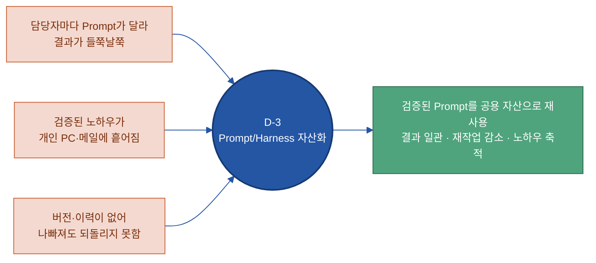
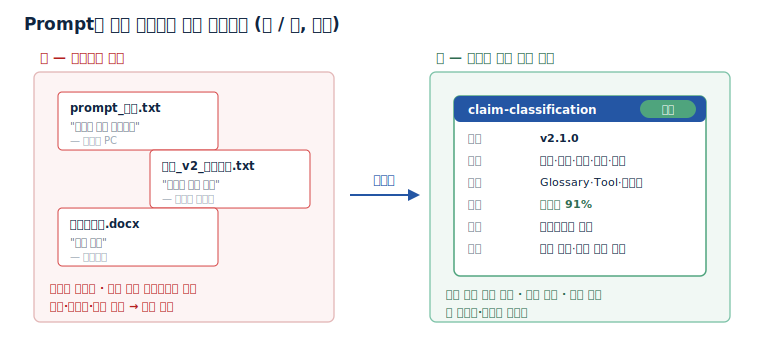
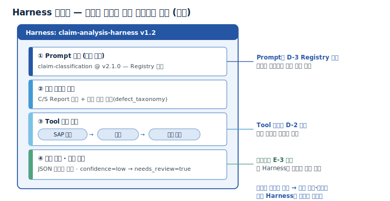
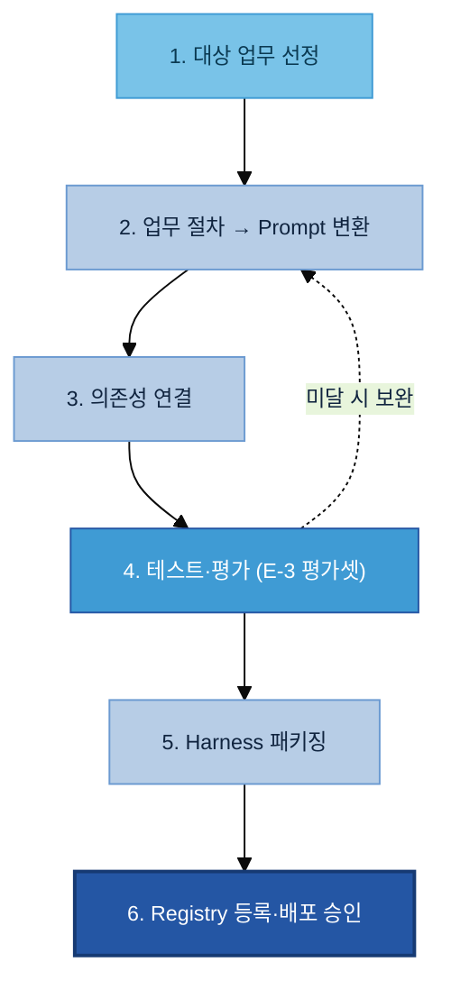
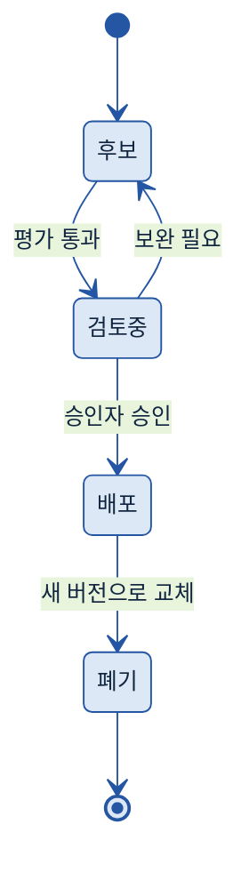
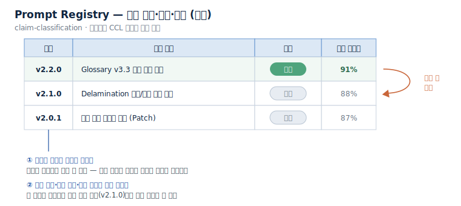
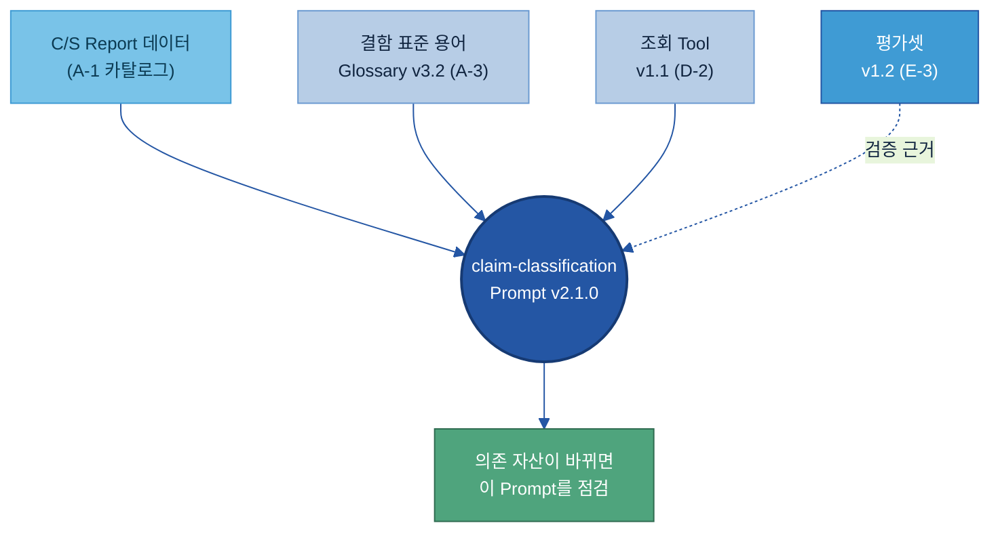
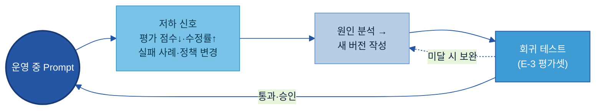
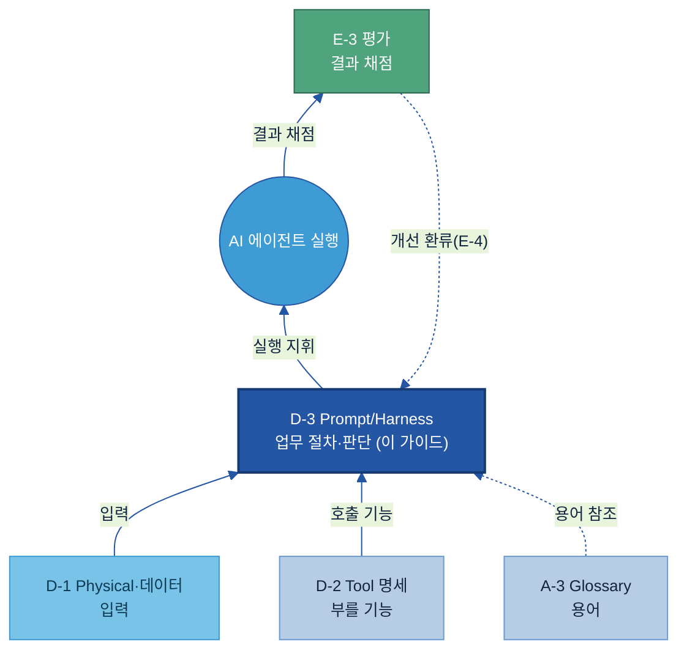

# D-3. Prompt/Harness 자산화(Prompt & Harness Assetization) 매뉴얼

---

## 목차

1. [Why — 왜, 언제 필요한가 (적용 판단)](#why)
    - [1.1 현업 Pain Point](#s11)
    - [1.2 기대 효과](#s12)
    - [1.3 무엇을 자산화하나 (적용 판단)](#kq1)
    - [1.4 우선순위 — 작게 시작](#s14)
2. [What — 무엇인가·무엇을 갖추나](#what)
    - [2.1 Prompt/Harness 자산화란 + 체계 내 위치](#s21)
    - [2.2 자산 목록 — 무엇을 자산으로 관리하나](#s22)
    - [2.3 업무→Prompt 변환 틀](#kq2)
    - [2.4 Harness — 반복 실행 패키지](#kq6)
    - [2.5 항목 사전 — Prompt 자산 1건의 등록 항목](#s25)
3. [How — 어떻게 준비·운영하나](#how)
    - [3.1 구축 절차](#s51)
    - [3.2 운영 — 버전·의존성 관리](#kq3)
    - [3.3 운영 — 성능 저하 감지·개선](#kq5)
    - [3.4 작성 규칙 — 잘 쓴 자산과 못 쓴 자산](#s54)
    - [3.5 역할 (RACI)](#s55)
4. [Tech Stack — 솔루션 검토](#tech)
    - [4.1 솔루션 유형](#s41)
    - [4.2 선정 기준](#s42)
5. [Where — 다른 주제와의 관계](#where)

- [별첨 (Appendix)](#별첨-appendix)
    - [Appendix A — Prompt 자산 항목 사전 (전체)](#apx-a) · [Appendix B — 빈 템플릿 + 완성 예시](#apx-b)
- [참고자료 (References)](#참고자료-references) · [변경 이력 / 피드백 반영](#변경-이력--피드백-반영)

---

> **예시 표기 안내:** 본 가이드의 표·다이어그램·그림에 나오는 구체 값(Prompt 이름·버전 번호·정확도·결함 코드·계열사 업무 등)은 이해를 돕기 위한 가상 예시이며 실제 데이터가 아니다. 실제 값은 PoC·프로젝트에서 확정한다. 계열사명도 적용 맥락 설명용이다.

> **관련 가이드:** [A-1 데이터 카탈로그](../A-1%20데이터%20카탈로그/A-1%20데이터%20카탈로그.md) · [A-3 Glossary](../A-3%20Glossary/A-3%20Glossary.md) · [D-2 API/Tool 연계 데이터](../D-2%20API_Tool%20연계%20데이터/D-2%20API_Tool%20연계%20데이터.md) · [E-3 AI 평가 데이터](../E-3%20AI%20평가%20데이터/E-3%20AI%20평가%20데이터.md) · [E-4 데이터 Feedback Loop](../E-4%20데이터%20Feedback%20Loop/E-4%20데이터%20Feedback%20Loop.md) · [C-3 데이터 계통 Lineage](../C-3%20데이터%20계통%20Lineage/C-3%20데이터%20계통%20Lineage.md)

본 가이드는 검증된 Prompt와 Harness를 개인의 메모가 아니라 조직이 함께 쓰는 데이터 자산으로 만드는 방법을 다룬다. 왜·언제 자산화하는지(1장), 무엇을 갖추고 적용하면 무엇이 달라지는지(2장), 실제로 어떻게 구축·운영하는지(3장), 어떤 솔루션으로(4장), 인접 주제와 경계는 어디인지(5장)를 차례로 본다. 다루는 대상은 AI 에이전트를 만드는 일이 아니라, 그 AI가 실행할 Prompt·Harness를 조직의 데이터 자산으로 준비하는 일이다.

---

<a id="why"></a>

## 1. Why — 왜, 언제 필요한가 (적용 판단)

Prompt/Harness 자산화는 모든 Prompt에 적용하는 작업이 아니다. 자주 쓰이고 업무 판단에 영향이 큰 Prompt를 가려서 자산으로 만든다. 먼저 현업에서 무엇이 막히는지 보고(1.1), 자산화로 얻는 것을 확인한 뒤(1.2), 무엇을 대상으로 삼을지(1.3)와 어디부터 시작할지(1.4)를 정한다.

<a id="s11"></a>

### 1.1 현업 Pain Point

AI 과제가 늘면서 현업과 데이터 조직은 같은 업무에 쓰는 Prompt를 사람마다 따로 만들어 쓴다. 이때 세 가지 문제가 반복된다.

- 결과 편차: 같은 클레임 분류 업무인데 담당자마다 Prompt가 달라 분류 결과가 들쭉날쭉하다.
- 노하우 소실: 베테랑이 다듬어 둔 좋은 Prompt가 개인 PC·메일·메신저에 흩어져 있어 조직이 재사용하지 못한다.
- 변경 통제 불가: 누가 언제 무엇을 바꿨는지 기록이 없어, AI 출력이 나빠져도 이전 상태로 되돌릴 수 없다.



<a id="s12"></a>

### 1.2 기대 효과

Prompt를 검증된 공용 자산으로 관리하면 다음이 달라진다. 프롬프트를 애플리케이션 코드에서 분리해 중앙에서 관리하면, 코드를 다시 배포하지 않고도 Prompt만 갱신하고 여러 업무에서 재사용할 수 있다[4].

- 결과 일관성: 누가 실행해도 검증된 동일 Prompt를 써서 분류·요약·판정 품질이 고르게 유지된다.
- 재작업 감소: 같은 Prompt를 매번 새로 만들지 않고 등록된 자산을 불러 쓴다.
- 노하우 축적: 현업 전문가의 판단 기준이 Prompt에 명문화되어 조직 자산으로 남는다.
- 안전한 변경: 변경 이력과 평가 결과가 남아, 문제가 생기면 직전 버전으로 되돌린다.

<a id="kq1"></a>

### 1.3 무엇을 자산화하나 (적용 판단)

자산화 대상은 네 가지 기준으로 가린다. 하나만 뚜렷해도 후보가 되고, 여럿이 겹칠수록 우선순위가 높다.

| 기준 | 판단 질문 | 제조 예시 |
|---|---|---|
| **반복성** | 같은 업무에 주기적으로 쓰는가 | 주간 C/S Report 분류, 월별 불량 원인 요약 |
| **업무 영향도** | 품질 판정·고객 대응 등 판단에 직접 영향을 주는가 | 클레임 원인 분류, CCL Delamination 판정 지원 |
| **재사용 가능성** | 다른 부서·계열사도 유사하게 쓸 수 있는가 | 품질 원인 분석 Prompt를 용접 결함 분석에도 적용 |
| **노하우 함축도** | 전문가의 판단·제외 기준이 담겨 있는가 | "소재 결함 / 공정 결함" 구분 기준이 명문화된 Prompt |

자산화하지 않는 대상도 분명히 둔다.

> **자산화에서 제외:** 일회성 실험·탐색용 Prompt, 개인이 임시로 쓰는 질문, 특정 데이터에만 동작해 일반화가 안 되는 Prompt, 아직 평가([E-3](../E-3%20AI%20평가%20데이터/E-3%20AI%20평가%20데이터.md))를 거치지 않아 품질이 검증되지 않은 Prompt.

모든 Prompt가 처음부터 자산인 것은 아니다. 일회성 대화로 시작한 Prompt가 반복 사용되며 보존 가치가 확인되고, 변수로 일반화되고, 평가를 통과한 뒤에야 Registry(등록소)에 등록되는 공용 자산으로 승격된다.


<a id="s14"></a>

### 1.4 우선순위 — 작게 시작

전사 Prompt를 한 번에 자산화하지 않는다. 현업 노하우가 담긴 반복 업무 두세 개를 먼저 자산으로 만들어 효과를 확인한 뒤 범위를 넓힌다. 우선순위는 사용 빈도가 높은 것, 오류 시 업무 손실이 큰 것, 여러 사람이 각자 다르게 만들어 쓰는 것 순으로 둔다.

---

<a id="what"></a>

## 2. What — 무엇인가·무엇을 갖추나

<a id="s21"></a>

### 2.1 Prompt/Harness 자산화란 + 체계 내 위치

Prompt/Harness 자산화란 사람의 업무 절차와 판단 기준을 AI가 실행할 수 있는 지시문으로 구조화하고, 이를 검증·버전관리·재사용하는 데이터 자산으로 다루는 일이다.

- **Prompt** — 모델에게 전달하는 지시·맥락 텍스트. 역할·입력·판단 기준·출력 형식·금지 행동을 담는다.
- **Harness(하네스)** — Prompt에 입력 데이터, Tool 호출 순서, 출력 형식(과 평가 기준)을 더해 하나로 묶어, 같은 업무를 반복 실행할 수 있게 만든 패키지[1][2].

자산화는 Prompt를 애플리케이션 코드 안에 박아 두지 않고, 중앙 Registry에서 버전·메타데이터와 함께 관리한다[4]. AI 에이전트나 챗봇을 만드는 일은 본 가이드의 범위가 아니다. 본 가이드가 준비하는 대상은 그 AI가 입력으로 받아 실행하는 Prompt·Harness 자산 자체다.

D 묶음(실행할 수 있게)에서 D-3은 "업무 절차·판단"을 담당한다. 에이전트가 무엇을 입력으로 받고([D-1](../D-1%20Physical%20데이터/D-1%20Physical%20데이터.md)), 어떤 기능을 부르며([D-2](../D-2%20API_Tool%20연계%20데이터/D-2%20API_Tool%20연계%20데이터.md)), 어떤 절차와 판단으로 실행할지(D-3)를 나눠 보면, D-3은 그중 절차·판단을 지휘하는 자리다.

자산화하면 같은 Prompt가 어떻게 달라지는지는 두산전자 CCL 클레임 원인 분류 업무로 그려볼 수 있다. 자산화 전에는 담당자마다 Prompt를 따로 만들어 결과가 제각각이었고, 누가 언제 만들었는지·어떤 데이터에 쓰는지 기록이 없었다. 자산화 후에는 검증된 Prompt 한 건이 버전·의존성·평가 결과와 함께 등록되어, 누가 써도 같은 품질이 나오고 문제가 생기면 즉시 되돌린다.



<a id="s22"></a>

### 2.2 자산 목록 — 무엇을 자산으로 관리하나

자산으로 관리하는 대상은 단순한 지시문 한 줄이 아니다. 업무를 AI에 맡기는 데 필요한 구성요소를 함께 관리한다.

| 자산 요소 | 상세 | 자산인 이유 |
|---|---|---|
| **시스템 지시문** (System Prompt) | 역할·목표·행동 규칙을 일관되게 정의하는 상시 지시문 | 여러 업무에서 재사용, 바뀌면 모든 결과에 영향 |
| **업무 지시 Prompt** | 특정 업무를 수행하라는 지시(변수 포함 템플릿) | 같은 업무를 반복 처리할 때 일관 품질 보장 |
| **역할 정의** (Role) | 어떤 전문가로 행동할지 정의하는 블록 | 여러 Prompt에서 공통 재사용 |
| **판단 기준** | 추론 시 따라야 할 단계별 기준·체크리스트 | 사람의 업무 판단 로직을 명문화 |
| **출력 형식** | 결과의 구조(JSON·표·정형 텍스트) | 뒤 시스템이 자동 처리하려면 형식 일관성 필수 |
| **금지 행동** (Guardrails) | 해서는 안 되는 행동·출력 규칙 | 조직 리스크 기준의 명문화 |
| **Tool 호출 순서** | Harness 안에서 도구를 부르는 순서 로직 | 검증된 호출 순서는 재사용 가치가 큼 |

> 위 목록은 정해진 표준 개수가 아니라 제조 업무에서 자주 관리하는 대표 요소를 고른 예시다. 업무에 따라 더하거나 뺀다.

<a id="kq2"></a>

### 2.3 업무→Prompt 변환 틀

사람의 업무 절차를 Prompt로 바꿀 때는 자유 서술로 적지 않고, 다섯 구획으로 나눠 적는다. 의도를 먼저 명확히 적고 그다음 모델이 실행하게 한다는 원칙을 따른다[6].

| 구획 | 상세 | 예시 (CCL 클레임 분석) |
|---|---|---|
| **역할** | 이 업무를 수행하는 전문가가 누구인지 | "두산전자 CCL 품질 클레임 원인 분류 전문가" |
| **입력** | 판단에 쓰는 입력을 변수로 분리 | `{{cs_report}}`, `{{defect_taxonomy}}` |
| **판단 기준** | 단계별 판단 순서·기준 | "Delamination은 소재 결함 / 공정 결함으로 구분, 불명확하면 보류" |
| **금지 행동** | 하면 안 되는 것 | "Glossary 외 임의 용어 금지, 근거 없는 단정 금지" |
| **출력 형식** | 결과의 구조 | `{primary_cause, confidence, evidence, needs_review}` |

이렇게 구조화한 Prompt 자산 1건의 실제 모습은 다음과 같다. 왼쪽은 다섯 구획으로 나눈 본문, 오른쪽은 자산으로 관리하기 위한 메타데이터다.


입력을 변수로 분리해 두면 같은 Prompt를 다른 클레임 건, 다른 제품, 다른 라인에 그대로 다시 쓸 수 있다. 변수 치환은 `{{변수}}` 형식의 템플릿 문법으로 처리하며, 주요 Prompt 관리 솔루션이 공통으로 지원한다[10].

<a id="kq6"></a>

### 2.4 Harness — 반복 실행 패키지

Harness란 한 업무를 AI가 반복 실행할 수 있도록, Prompt에 입력·도구·출력 검증을 더해 하나로 묶은 패키지다[1]. Prompt가 "무엇을 지시하는가"라면, Harness는 "그 Prompt를 어떤 입력·도구·출력 약속과 함께 돌리는가"까지 묶는다.

| 구성 요소 | 상세 | 예시 |
|---|---|---|
| **Prompt 자산** | Registry에 등록된 버전 고정 Prompt | `claim-classification@v2.1.0` |
| **입력 데이터 연결** | 어떤 데이터를 어떤 형식으로 넣나 | C/S Report 본문 + 결함 표준 용어 |
| **Tool 호출 순서** | 어떤 도구를 어떤 순서로 부르나 | SAP 조회 → 분류 → 결과 저장 |
| **출력 형식·검증** | 출력이 약속한 형식인지 확인, 미달 시 처리 | JSON 검증, 확신도 낮으면 사람 검토로 |



Harness를 재사용 가능하게 만드는 원칙은 네 가지다.

- 입력을 변수로 분리해 특정 데이터에 고정하지 않는다.
- Prompt와 Harness를 따로 버전 관리해, 한쪽이 바뀌어도 다른 쪽은 유지한다.
- Tool 명세는 [D-2](../D-2%20API_Tool%20연계%20데이터/D-2%20API_Tool%20연계%20데이터.md) Registry에서 참조하고, Harness 안에 도구 정의를 직접 넣지 않는다.
- 이 Harness를 검증할 평가셋([E-3](../E-3%20AI%20평가%20데이터/E-3%20AI%20평가%20데이터.md)) ID를 명세에 적는다.

<a id="s25"></a>

### 2.5 항목 사전 — Prompt 자산 1건의 등록 항목

Prompt 자산을 Registry에 등록할 때 채우는 대표 항목이다. 현업이 최소한 무엇을, 누가 채우는지 보여 준다. 전체 항목은 [Appendix A](#apx-a)에 둔다.

| 항목 | 쉬운 의미 | 예시값 | 필수/선택 | 작성 주체 |
|---|---|---|---|---|
| 자산 ID | Registry 내 고유 식별자 | `claim-classification` | 필수 | 시스템 자동 |
| 버전 | 변경마다 부여되는 순번 | `v2.1.0` | 필수 | 시스템 자동 |
| 업무 | 어느 업무에 쓰나 | "CCL 클레임 원인 분류" | 필수 | 현업 SME |
| 템플릿 본문 | 실제 Prompt 내용(변수 포함) | "{{cs_report}}에서 원인 분류…" | 필수 | 현업 SME + AI 조직 |
| 출력 형식 | 기대하는 출력 구조 | JSON 스키마 | 필수 | AI 조직 |
| 상태 | 생애주기 단계 | 후보 / 검토중 / 배포 / 폐기 | 필수 | 시스템 + 승인자 |
| 승인자 | 배포를 승인한 사람 | 품질기술팀 책임 | 필수 | 현업 리더 |
| 의존 자산 | 참조하는 데이터·용어·Tool·평가셋 | Glossary v3.2, Tool v1.1, 평가셋 v1.2 | 필수 | 데이터 조직 |
| 평가 결과 | 검증 점수 | 정확도 91% (n=200) | 필수 | AI 조직 |
| 변경 사유 | 이 버전에서 무엇을 왜 바꿨나 | "Delamination 구분 기준 추가" | 필수 | 작성자 |

---

<a id="how"></a>

## 3. How — 어떻게 준비·운영하나

자산화는 반복·고영향 업무를 고르는 데서 시작해, 업무 절차를 Prompt로 바꾸고, 의존 자산을 연결하고, 평가를 통과하면 버전을 등록하고, Harness로 묶어 재사용하는 흐름으로 진행한다. 아래에서 그 구축 절차(3.1)와 배포 후 버전·의존성 관리(3.2)·성능 저하 대응(3.3), 자산을 잘 쓰는 작성 규칙(3.4), 역할 분담(3.5)을 차례로 본다.

<a id="s51"></a>

### 3.1 구축 절차

앞의 큰 흐름을 실제 작업 단위로 풀면 여섯 단계가 된다. 대상 선정에서 시작해 Registry 등록으로 끝난다.



| 단계 | 수행 내용 | 산출물 |
|---|---|---|
| **1 대상 선정** | 반복성·영향도 기준으로 자산화 후보 식별 | 자산화 대상 Prompt 후보 목록 |
| **2 변환** | 현업 SME 인터뷰로 업무 절차를 다섯 구획 Prompt로 문서화 | 구조화된 Prompt 초안 |
| **3 의존성 연결** | 참조하는 데이터·Glossary 용어·Tool·평가셋 식별 | 의존성 맵 |
| **4 테스트·평가** | 평가셋 기준 성능 측정, 합격선 통과 확인 | 평가 리포트 |
| **5 Harness 패키징** | Prompt + 입력 + Tool 순서 + 출력 검증을 한 단위로 묶음 | Harness 명세서 |
| **6 등록·배포** | Registry에 메타데이터 입력, 승인자 검토 후 배포 상태 전환 | 등록 레코드 + 배포 승인 기록 |

이 절차를 두산전자 CCL 클레임 원인 분류 업무에 적용하면 다음과 같이 진행된다. 두산전자는 CCL 제품에서 Delamination 클레임이 반복 발생했고, 현업 전문가가 C/S Report를 보고 소재 결함인지 공정 결함인지 수작업으로 분류했으나 담당자마다 기준이 달라 일관성 문제가 있었다.

- **대상 선정** — 월 30~50건으로 반복성이 높고, 오분류 시 고객 대응 오류로 이어져 영향도가 크다. 자산화 대상으로 확정한다.
- **변환** — 현업 SME 인터뷰로 "분리 면적·위치·패턴으로 1차 판단, 공정 로그 대조로 확정, 불명확하면 보류" 기준을 추출해 다섯 구획 Prompt 초안(`claim-classification v1.0.0`)을 만든다.
- **의존성 연결** — 결함 표준 용어(Glossary v3.2), C/S Report 데이터, SAP 조회 Tool, 정답 50건 평가셋을 연결한다.
- **테스트·평가** — 평가셋 기준 v1.0.0이 정확도 73%로 합격선(85%) 미달이라, SME와 기준을 보완해 v1.1.0에서 88%로 통과한다.
- **Harness 패키징** — Prompt v1.1.0에 입력·Tool 순서·출력 검증을 묶어 `claim-analysis-harness v1.0.0`으로 만든다.
- **등록·배포** — 품질기술팀 책임자 검토·승인 후 배포 상태로 전환하고 메타데이터를 기록한다.

<a id="kq3"></a>
<a id="kq4"></a>

### 3.2 운영 — 버전·의존성 관리

**버전 관리.** Prompt에도 소프트웨어와 같은 시맨틱 버전(Semantic Versioning) `X.Y.Z`를 적용한다. 판단 구조·역할의 큰 변경은 앞자리(Major), 기준 추가·출력 형식 변경은 가운데(Minor), 문구 수정은 뒷자리(Patch)를 올린다. 배포된 버전은 고치지 않고, 수정이 필요하면 새 버전을 만든다. 운영 로그가 특정 버전에 고정되어야 추적과 롤백이 정확하기 때문이다[5].

Prompt 한 건은 후보에서 시작해 검토·배포를 거쳐 폐기에 이르는 생애주기를 따른다. 업무 영향도가 큰 Prompt(분류·판정)는 반드시 현업 SME 승인을 거쳐 배포한다.



버전 이력은 변경 사유·평가 점수·롤백 대상과 함께 남긴다. 새 버전이 더 나빠지면 직전 배포 버전으로 즉시 되돌린다.



**의존성 관리.** Prompt는 단독으로 동작하지 않는다. 특정 Glossary 용어, 데이터 자산, Tool([D-2](../D-2%20API_Tool%20연계%20데이터/D-2%20API_Tool%20연계%20데이터.md)), 평가셋([E-3](../E-3%20AI%20평가%20데이터/E-3%20AI%20평가%20데이터.md))에 의존한다. 어떤 Prompt가 어떤 자산에 의존하는지 기록해 두어야, 의존 자산이 바뀔 때 영향 범위를 짚을 수 있다.



| 변경 이벤트 | 점검 대상 |
|---|---|
| Glossary 결함 용어 변경 (A-3) | 그 용어를 참조하는 모든 Prompt의 판단 기준 재검토 |
| Tool 입력 규격 변경 (D-2) | 그 Tool을 부르는 Harness의 입력 파라미터 확인 |
| 데이터 항목 변경 (A-2) | 그 항목을 변수로 받는 Prompt의 변수명 점검 |
| 평가셋 기준 갱신 (E-3) | 기존 통과 기록이 유효한지 재평가 여부 판단 |

> **권장:** 의존 자산 변경 시 "영향받는 Prompt 목록"을 바로 조회할 수 있도록, Registry에 역방향 참조를 기록한다.

<a id="kq5"></a>

### 3.3 운영 — 성능 저하 감지·개선

배포한 Prompt도 시간이 지나면 성능이 떨어질 수 있다. 평가 점수 하락, 사용자 수정률 상승, 실패 사례 누적, 업무 정책 변경의 네 가지 신호로 저하를 감지한다. 평가 기준 자체는 [E-3](../E-3%20AI%20평가%20데이터/E-3%20AI%20평가%20데이터.md)이 관리하고, 운영 결과를 모아 개선 과제로 연결하는 일은 [E-4](../E-4%20데이터%20Feedback%20Loop/E-4%20데이터%20Feedback%20Loop.md)가 맡는다.



개선 시 회귀 테스트(Regression Test)는 "새 버전이 더 좋아졌는지"만 보지 않고 "기존에 잘되던 것이 깨지지 않았는지"를 함께 확인한다[5]. 앞의 두산전자 사례에서 6개월 운영 후 Glossary가 v3.2에서 v3.3으로 갱신되며 표준 용어가 바뀌자, 그 용어를 참조하던 분류 Prompt의 정확도가 88%에서 79%로 떨어졌다. 변경 영향도 분석으로 원인을 Glossary 변경으로 짚고, SME와 기준을 재정의해 새 버전을 작성·승인·배포했으며, 회귀 테스트로 91% 회복과 기존 통과 케이스 유지를 함께 확인했다.

개선 권한은 변경 크기에 따라 나눈다.

| 변경 유형 | 처리 방법 |
|---|---|
| 문구 개선 (Patch) | AI 조직 단독 수정 → 평가 통과 후 배포 |
| 기준 추가·변경 (Minor) | 현업 SME 검토 → 승인 후 배포 |
| 판단 구조 전면 개편 (Major) | 현업 SME·데이터 조직·승인자 검토 |

<a id="s54"></a>

### 3.4 작성 규칙 — 잘 쓴 자산과 못 쓴 자산

같은 업무라도 Prompt를 어떻게 적느냐에 따라 자산 가치가 갈린다.

**본문 구조.** 구조 없이 적으면 사람마다 결과가 달라진다.

> 못 쓴 예: "이 C/S Report 보고 원인 분류해줘."
> 잘 쓴 예: "[역할] CCL 클레임 원인 분류 전문가 / [입력] {{cs_report}}, {{defect_taxonomy}} / [판단] Delamination은 소재·공정으로 구분, 불명확 시 needs_review=true / [금지] Glossary 외 용어·근거 없는 단정 금지 / [출력] {primary_cause, confidence, evidence, needs_review}"

**관리 정보.** 텍스트 파일로만 두면 추적·롤백이 안 된다.

> 못 쓴 예: `prompt_최신.txt` — 언제·누가 만들었는지, 어떤 데이터에 쓰는지 기록 없음.
> 잘 쓴 예: Registry에 ID·버전·상태·승인자·의존 자산·평가 결과·변경 사유를 함께 등록.

> **피해야 할 표현:** "잘 분류해줘", "알아서 판단해서", "대충 정리해줘"처럼 기준 없이 맡기는 표현. 판단 기준·금지·출력 형식으로 바꿔 적는다.

<a id="s55"></a>

### 3.5 역할 (RACI)

| 활동 | 현업 SME | AI 조직 | 데이터 조직 | 승인자 |
|---|---|---|---|---|
| 자산화 대상 선정 | A | R | C | I |
| Prompt 구조화 | C | R | I | I |
| 의존성 맵 작성 | I | R | A | I |
| 평가(E-3 기반) | C | R | I | I |
| Registry 등록 | I | R | A | I |
| 운영 배포 승인 | C | I | I | A |
| 성능 저하 대응 | A | R | C | I |

> R=실행 · A=책임 · C=자문 · I=통보. 현업 SME는 업무 절차·판단 기준을 제공하고, AI 조직은 구조화·패키징·버전 관리를, 데이터 조직은 Registry 운영·의존성 관리를, 승인자는 배포·폐기를 결정한다.

---

<a id="tech"></a>

## 4. Tech Stack — 솔루션 검토

> **2층 연결:** 본 절은 이 주제 관점에서 솔루션의 기능을 비교한다. 솔루션을 주제 가로질러 묶어 평가·선정하려면 [Tech Stack 비교 정본](../../Tech%20Player/01%20Tech%20Stack%20비교%20(솔루션×주제).md)을 참조한다.

<a id="s41"></a>

### 4.1 솔루션 유형

Prompt 자산을 등록·버전관리·평가 연계하는 솔루션은 크게 두 유형이다. 제품 라인업·가격·기능은 자주 바뀌므로 도입 전 공식 문서·PoC로 확인한다.

| 유형 | 상세 | 대표 솔루션 |
|---|---|---|
| **오픈소스 셀프호스트형** | 온프레미스 배포 가능, 라이선스 비용 없음, 운영 인력 필요 | [Langfuse](https://langfuse.com)[10] · [Agenta](https://agenta.ai)[11] · [Helicone](https://helicone.ai)[12] · [Portkey](https://portkey.ai)[13] |
| **상용 SaaS형** | 즉시 사용, 운영 부담 적음, 외부 전송 검토 필요 | [LangSmith](https://www.langchain.com/langsmith)[14] · [PromptLayer](https://www.promptlayer.com)[15] |

대부분의 솔루션이 Prompt 버전 관리·환경 분리(운영/검증)·평가 연계를 제공한다. 비개발자가 화면에서 직접 Prompt를 편집·검토하는 기능은 일부 제품이 명시한다[11][15] — 현업 SME가 직접 참여하는 구조를 설계할 때 확인할 항목이다.

> **주의:** 일부 제품은 인수·종료로 신규 도입이 어려울 수 있다(예: Humanloop는 플랫폼 종료 안내). 제품 상태와 오픈소스 유지보수 활동을 도입 전에 확인한다.

<a id="s42"></a>

### 4.2 선정 기준

제조 환경에서 솔루션을 고를 때 보는 기준이다.

| 기준 | 확인 질문 |
|---|---|
| **셀프호스트(온프레미스)** | Prompt에 내부 업무 지식이 담길 때 외부로 보내지 않고 내부에 배포할 수 있나 |
| **버전·롤백** | 변경 후 문제가 생기면 즉시 이전 버전으로 되돌릴 수 있나, 운영/검증 환경을 분리하나 |
| **평가 연계** | 새 버전 배포 전 자동 평가([E-3](../E-3%20AI%20평가%20데이터/E-3%20AI%20평가%20데이터.md))를 걸 수 있나 |
| **현업 편집** | 품질·생산 담당자가 코드 없이 Prompt를 수정·검토할 수 있나 |
| **접근 권한** | 읽기·편집·배포 권한을 역할별로 나눌 수 있나 |
| **기존 체계 연계** | 카탈로그([A-1](../A-1%20데이터%20카탈로그/A-1%20데이터%20카탈로그.md))·평가([E-3](../E-3%20AI%20평가%20데이터/E-3%20AI%20평가%20데이터.md))와 API로 연결되나 |

> 가격·버전·지원 범위는 변동이 잦다. 단정하지 말고 공식 문서·벤더 데모·PoC로 확인한다.

---

<a id="where"></a>

## 5. Where — 다른 주제와의 관계

D-3은 에이전트가 따르는 업무 절차·판단을 자산으로 준비한다. 에이전트가 부르는 기능의 명세(D-2), 그 결과를 채점하는 평가(E-3), 운영 결과를 개선으로 되돌리는 환류(E-4)는 각각 다른 주제가 맡는다.



| 인접 주제 | 그 주제의 역할 | D-3과의 경계 |
|---|---|---|
| [D-2 API/Tool 연계 데이터](../D-2%20API_Tool%20연계%20데이터/D-2%20API_Tool%20연계%20데이터.md) | Tool의 기능·입출력·제약 명세 | **D-2는 도구의 설명서, D-3은 그 도구를 언제·어떤 순서로 부를지의 절차.** Harness는 D-2 명세를 참조만 한다 |
| [E-3 AI 평가 데이터](../E-3%20AI%20평가%20데이터/E-3%20AI%20평가%20데이터.md) | 성능 판단용 정답셋·평가 기준 | **E-3은 채점 기준, D-3은 채점 대상인 Prompt 자산.** Prompt 성능 판정은 E-3 평가셋으로 한다 |
| [E-4 데이터 Feedback Loop](../E-4%20데이터%20Feedback%20Loop/E-4%20데이터%20Feedback%20Loop.md) | 운영 결과·오류를 개선 과제로 환류 | **E-4는 환류 허브, D-3은 환류 결과를 받아 Prompt를 고치는 자리** |
| [A-3 Glossary](../A-3%20Glossary/A-3%20Glossary.md) | 업무 용어·약어 표준 정의 | **A-3은 단어의 뜻, D-3은 그 뜻을 참조하는 지시문.** Prompt가 Glossary 용어에 의존 |
| [C-3 데이터 계통 Lineage](../C-3%20데이터%20계통%20Lineage/C-3%20데이터%20계통%20Lineage.md) | AI 결과의 근거 추적 | **C-3은 어떤 Prompt 버전이 어떤 출력을 냈는지 계보로 잇는다** |

---

## 별첨 (Appendix)
<a id="별첨-appendix"></a>

<a id="apx-a"></a>

### Appendix A — Prompt 자산 항목 사전 (전체)

본문 [2.5절](#s25)의 대표 항목을 포함한 전체 등록 항목이다. 솔루션에 따라 항목명은 다를 수 있다.

| 항목 | 쉬운 의미 | 예시값 | 필수/선택 | 작성 주체 |
|---|---|---|---|---|
| 자산 ID | Registry 내 고유 식별자 | `claim-classification` | 필수 | 시스템 자동 |
| 이름 | 사람이 알아볼 이름 | "클레임 원인 분류 Prompt" | 필수 | 현업 SME |
| 버전 | 변경마다 부여되는 순번 | `v2.1.0` | 필수 | 시스템 자동 |
| 업무 카테고리 | 어느 업무 영역인지 | "품질관리 / 클레임분석" | 필수 | AI 조직 |
| 대상 모델 | 이 Prompt를 검증한 모델 | (PoC에서 확정) | 필수 | AI 조직 |
| 모델 파라미터 | 온도 등 실행 설정 | `temperature: 0.2` | 필수 | AI 조직 |
| 템플릿 본문 | 실제 Prompt 내용(변수 포함) | "{{cs_report}}에서 원인 분류…" | 필수 | 현업 SME + AI 조직 |
| 입력 변수 | 교체 가능한 변수 | `cs_report, defect_taxonomy` | 필수 | AI 조직 |
| 출력 형식 | 기대하는 출력 구조 | JSON 스키마 | 필수 | AI 조직 |
| 작성자 | 이 버전을 만든 사람 | (담당자) | 필수 | 시스템 자동 |
| 승인자 | 배포를 승인한 사람 | 품질기술팀 책임 | 필수 | 현업 리더 |
| 상태 | 생애주기 단계 | 후보 / 검토중 / 배포 / 폐기 | 필수 | 시스템 + 승인자 |
| 변경 사유 | 이 버전에서 무엇을 왜 바꿨나 | "Delamination 구분 기준 추가" | 필수 | 작성자 |
| 의존 데이터·용어 | 참조하는 데이터·Glossary | Glossary v3.2, 데이터 DA-042 | 필수 | 데이터 조직 |
| 의존 Tool | Harness에서 부르는 도구 | SAP 조회 Tool v1.1 | 해당 시 | AI 조직 |
| 평가셋 연결 | 검증에 쓴 평가 데이터 | 평가셋 v1.2 (정확도 91%) | 필수 | AI 조직 |
| 롤백 대상 | 문제 시 돌아갈 버전 | `v2.0.1` | 필수 | 시스템 자동 |
| 태그 | 분류·검색 키워드 | `pcb, 품질, 클레임` | 선택 | 작성자 |

<a id="apx-b"></a>

### Appendix B — 빈 템플릿 + 완성 예시

**빈 Prompt 자산 템플릿** (그대로 복사해 채운다)

```
[역할]     (이 업무를 수행하는 전문가)
[입력]     (변수로 분리: {{변수1}}, {{변수2}})
[판단 기준] (단계별 판단 순서·기준)
[금지 행동] (해서는 안 되는 것)
[출력 형식] (결과 구조: JSON·표·정형 텍스트)
---
ID / 버전 / 상태 / 승인자 / 의존 자산 / 평가셋 / 변경 사유
```

**완성 예시 1건** (두산전자 CCL 클레임 분류, 가상 값)

```
[역할]     두산전자 CCL 품질 클레임 원인 분류 전문가
[입력]     C/S Report 본문: {{cs_report}}
           결함 표준 용어: {{defect_taxonomy}}
[판단 기준] 1. 분리 면적·위치·패턴으로 1차 판단
           2. 공정 로그와 대조해 소재 결함 / 공정 결함 확정
           3. 판단 불가 시 needs_review=true
[금지 행동] Glossary 외 임의 결함 용어 사용 금지
           근거 없는 원인 단정 금지
[출력 형식] {"primary_cause": "...", "confidence": "high/medium/low",
            "evidence": "...", "needs_review": true/false}
---
ID: claim-classification | 버전: v2.1.0 | 상태: 배포
승인자: 품질기술팀 책임
의존 자산: Glossary v3.2(A-3) · 조회 Tool v1.1(D-2) · 평가셋 v1.2(E-3) · 데이터 DA-042(A-1)
평가셋: claim_eval v1.2 (정확도 91%, n=200)
변경 사유: Delamination 소재/공정 구분 기준 추가
```

---

## 참고자료 (References)

본문의 **[N]** 표시를 누르면 아래 해당 항목으로 이동한다. 솔루션의 가격·버전·기능 범위는 변동되므로 도입 전 공식 문서·PoC로 확인한다.

**개념·표준**
- <a id="ref1"></a>**[1]** Anthropic — Effective Harnesses for Long-Running Agents — <https://www.anthropic.com/engineering/effective-harnesses-for-long-running-agents>
- <a id="ref2"></a>**[2]** Databricks — What is an AI agent harness? — <https://www.databricks.com/blog/ai-harness>
- <a id="ref3"></a>**[3]** MLflow — Prompt Registry — <https://mlflow.org/docs/latest/genai/prompt-registry/>
- <a id="ref4"></a>**[4]** Braintrust — What is prompt management? — <https://www.braintrust.dev/articles/what-is-prompt-management>
- <a id="ref5"></a>**[5]** Braintrust — What is prompt versioning? — <https://www.braintrust.dev/articles/what-is-prompt-versioning>
- <a id="ref6"></a>**[6]** Martin Fowler — Structured Prompt-Driven Development — <https://martinfowler.com/articles/structured-prompt-driven/>
- <a id="ref7"></a>**[7]** JSON Schema — <https://json-schema.org>
- <a id="ref8"></a>**[8]** OpenAI — Structured Outputs — <https://platform.openai.com/docs/guides/structured-outputs>
- <a id="ref9"></a>**[9]** Anthropic — Tool Use overview — <https://docs.anthropic.com/en/docs/build-with-claude/tool-use/overview>

**솔루션**
- <a id="ref10"></a>**[10]** Langfuse — <https://langfuse.com> (Prompt Management: <https://langfuse.com/docs/prompt-management/overview>)
- <a id="ref11"></a>**[11]** Agenta — <https://agenta.ai>
- <a id="ref12"></a>**[12]** Helicone — <https://helicone.ai>
- <a id="ref13"></a>**[13]** Portkey — <https://portkey.ai>
- <a id="ref14"></a>**[14]** LangSmith (LangChain) — <https://www.langchain.com/langsmith>
- <a id="ref15"></a>**[15]** PromptLayer — <https://www.promptlayer.com>

---

## 변경 이력 / 피드백 반영

| 일자 | 버전 | 피드백 (누가/무엇) | 반영 내용 | 반영 위치 |
|------|------|--------------------|-----------|-----------|
| 2026-06-24 | 0.1 | 초안 작성 (00 전체 목차 D-3 6섹션 흐름·B-3/B-1 다이어그램·SVG 스타일·0622 작업지시 문체) | Why~Where 6개 섹션, Mermaid 8종 + SVG 모형 4종, 항목 사전·Before/After·빈 템플릿(현업 실행 키트), 데이터 준비 관점 고정 | 전체 |
| 2026-06-30 | 0.2 | 독립 "예시 시나리오" 섹션 해체 요청 | 적용 전/후(+before-after 모형)는 What §2.1 끝에, 흐름 미리보기 narrative는 How 도입부에 흡수(중복 다이어그램은 §4.1 구축 6단계로 일원화). 이후 섹션 Tech Stack 3·How 4·Where 5로 재번호 | §2.1·§4 도입·목차·번호 |
