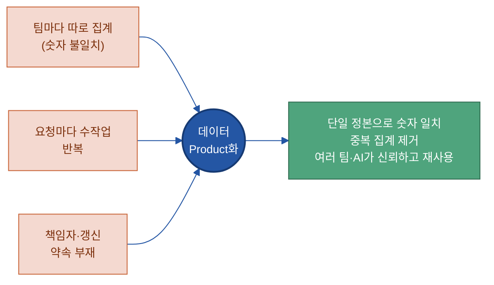
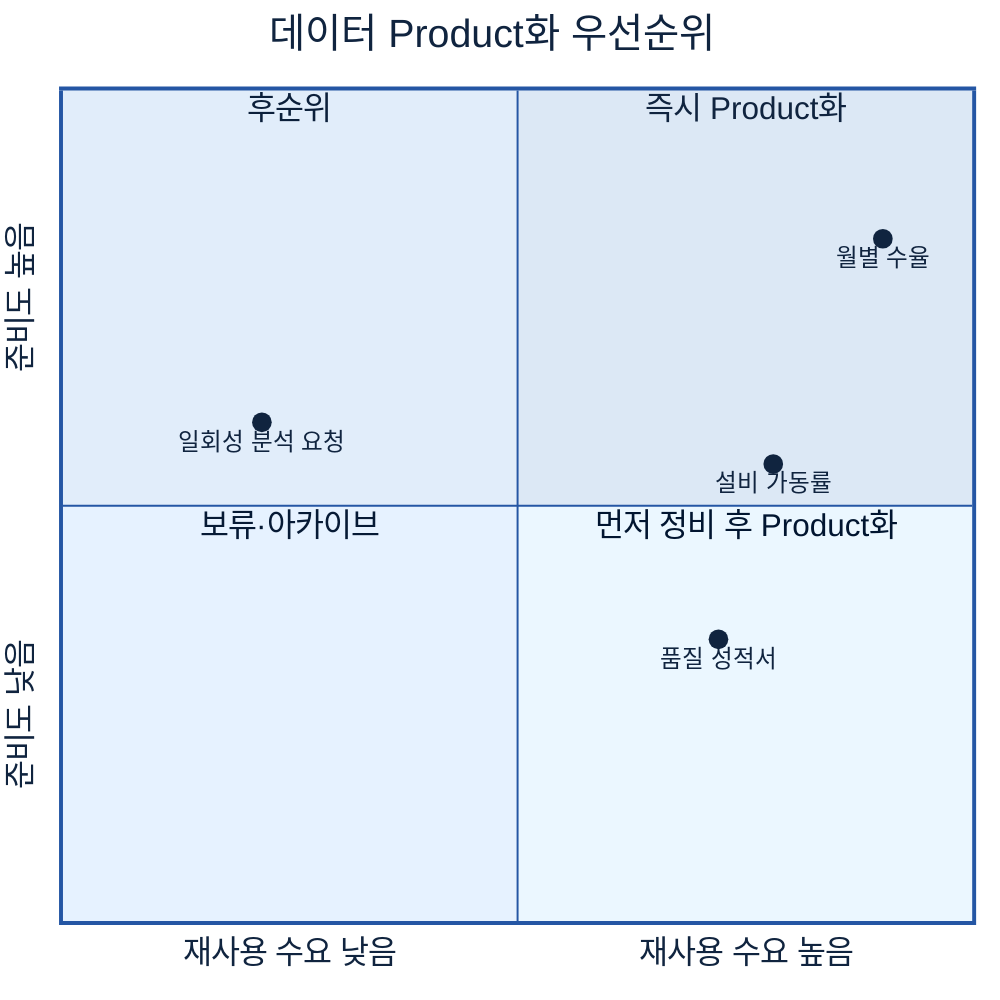
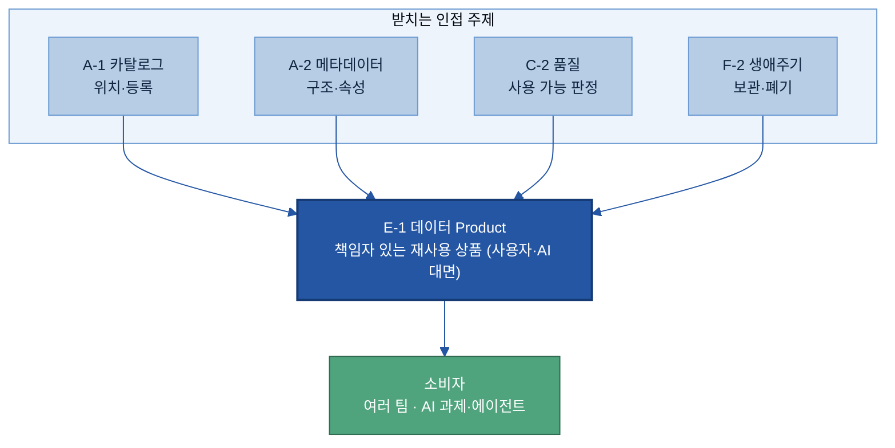
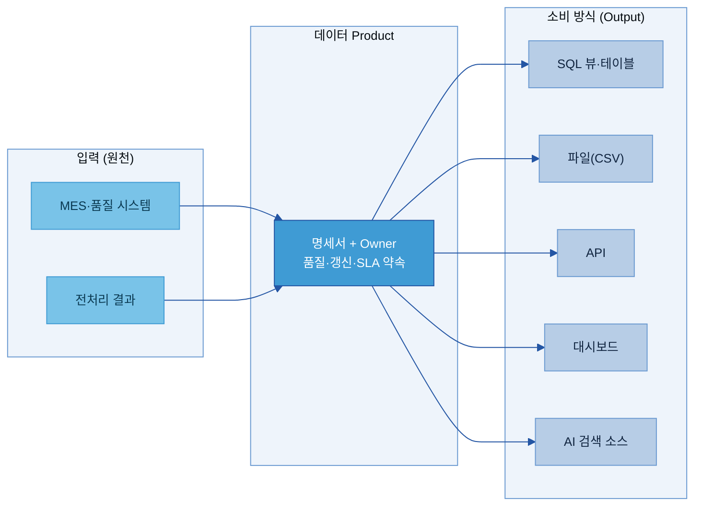
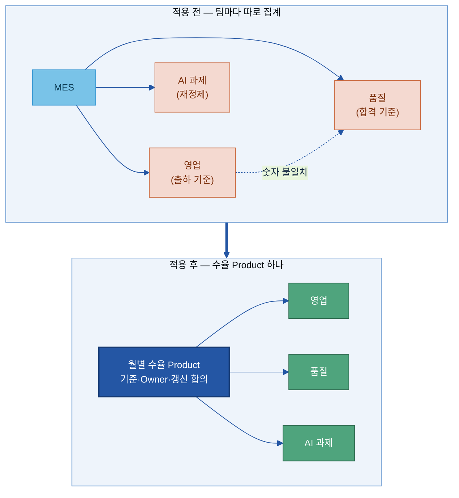
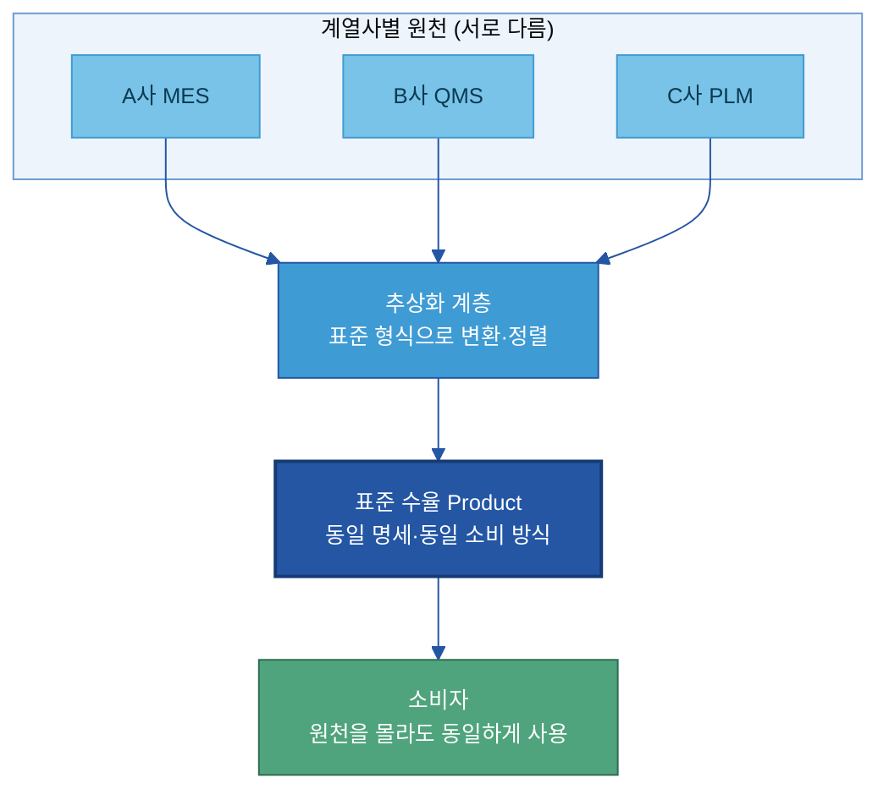
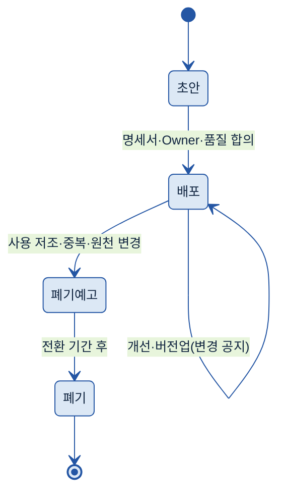

# E-1. 데이터 Product화(Data Productization) 매뉴얼

---

## 목차

1. [Why — 왜, 언제 필요한가 (적용 판단)](#why)
    - [1.1 현업에서 막히는 지점](#s11)
    - [1.2 Product화로 얻는 것](#s12)
    - [1.3 적용 판단 — 무엇을 Product화하나](#s13)
    - [1.4 우선순위](#s14)
2. [What — 무엇인가·무엇을 갖추나](#what)
    - [2.1 데이터 Product화란 + 체계 내 위치](#s21)
    - [2.2 데이터 Product 명세서](#s22)
    - [2.3 책임자(Owner)와 제공 약속](#s23)
    - [2.4 소비 방식](#s24)
3. [예시 시나리오 (한눈에)](#example)
    - [3.1 적용 전과 후](#s31)
    - [3.2 흐름 미리보기](#s32)
4. [Tech Stack — 솔루션 검토](#tech)
    - [4.1 솔루션 유형](#s41)
    - [4.2 선정 기준](#s42)
5. [How — 어떻게 준비·운영하나](#how)
    - [5.1 만드는 절차](#s51)
    - [5.2 계열사마다 다른 시스템에서 같은 Product 제공](#s52)
    - [5.3 운영 — Owner가 하는 일](#s53)
6. [Where — 다른 주제와의 관계](#where)

- [별첨 (Appendix)](#별첨-appendix)
    - [별첨 A — 데이터 Product 명세서 항목 사전(전체)](#appendix-a) · [별첨 B — 빈 명세서 템플릿 + 완성 예시](#appendix-b)
- [참고자료 (References)](#참고자료-references) · [변경 이력 / 피드백 반영](#변경-이력--피드백-반영)

---

> **예시 표기 안내:** 본 가이드의 표·예시에 나오는 구체 값(Product명·수치·갱신 주기·팀명·계열사명 등)은 이해를 돕기 위한 가상 예시이며 실제 데이터가 아니다. 실제 값은 PoC·프로젝트에서 확정한다. 계열사명도 적용 맥락 설명용이다.

> **관련 가이드:** [A-1 데이터 카탈로그](../A-1%20데이터%20카탈로그/A-1%20데이터%20카탈로그.md) · [A-2 메타데이터](../A-2%20메타데이터/A-2%20메타데이터.md) · [C-2 데이터 품질 관리](../C-2%20데이터%20품질%20관리/C-2%20데이터%20품질%20관리.md) · [F-2 데이터 생애주기 관리](../F-2%20데이터%20생애주기%20관리/F-2%20데이터%20생애주기%20관리.md) · [B-1 데이터 전처리](../B-1%20데이터%20전처리/B-1%20데이터%20전처리.md)

이 가이드는 데이터 Product화가 언제 필요한지(1장), 데이터 Product가 무엇이고 무엇을 갖추는지(2장), 적용하면 어떻게 달라지는지(3장), 어떤 솔루션으로(4장) 어떻게 만들고 운영하는지(5장)를 다룬다. 끝까지 강조하는 메시지는 하나다. 여러 팀과 AI가 반복해서 쓰는 데이터는 매번 다시 뽑는 일회성 추출물이 아니라, 책임자와 품질 약속을 갖춘 재사용 상품으로 한 번 잘 만들어 두는 편이 낫다.

---

## 1. Why — 왜, 언제 필요한가 (적용 판단)

데이터 Product화는 모든 데이터에 하는 일이 아니다. 여러 팀이 반복해서 요청하고, AI 과제가 자주 쓰는 데이터만 골라서 상품으로 만든다. 먼저 현업에서 무엇이 막히는지 보고(1.1), Product화로 무엇이 달라지는지 확인한 뒤(1.2), 어떤 데이터를 대상으로 삼을지(1.3)와 무엇부터 할지(1.4)를 정한다.

### 1.1 현업에서 막히는 지점

같은 데이터를 여러 팀이 반복해서 쓰는데도 그 데이터를 한 번 잘 만들어 공유하는 체계가 없을 때, 제조 현장에서 반복적으로 부딪히는 문제는 다음과 같다.

| 막히는 지점 | 현장에서 벌어지는 일 |
|---|---|
| 팀마다 따로 집계 | 영업·품질·생산관리가 "이번 달 수율"을 각자 MES에서 뽑아 Excel로 가공한다. 같은 수율인데 집계 기준이 달라 회의에서 숫자가 어긋난다 |
| 매번 다시 만드는 수작업 | 같은 데이터 요청이 들어올 때마다 데이터팀이 쿼리를 새로 짠다. 요청이 쌓일수록 추출·가공이 일상 업무를 잠식한다 |
| 책임자가 불분명 | 그 숫자가 맞는지, 갱신은 누가 하는지, 정의가 바뀌면 누구에게 묻는지가 정해져 있지 않다 |
| AI 과제마다 데이터 재확보 | AI 과제를 시작할 때마다 같은 원천 데이터를 다시 찾고 다시 정제한다. 직전 과제가 만든 데이터가 재사용되지 않는다 |
| 신뢰가 쌓이지 않음 | 한 번 쓴 데이터에 품질 보증·갱신 약속이 없어, 다음에 또 쓸 때 처음부터 검증을 다시 한다 |

공통점은 데이터가 없다는 것이 아니라, 여러 곳이 함께 쓰는 데이터를 한 번 잘 만들어 책임지고 제공하는 단위가 없다는 데 있다. 그래서 같은 일을 여러 팀이 중복해서 하고, 결과 숫자가 팀마다 달라진다.

### 1.2 Product화로 얻는 것

여러 팀이 쓰는 데이터를 상품으로 만들면 세 가지가 달라진다.

- 같은 데이터를 한 번만 만든다. 집계 기준·갱신 주기·책임자를 한 번 정해 두면, 영업·품질·AI 학습이 모두 같은 정본을 쓴다. 팀마다 다시 뽑는 중복 작업이 사라지고, 회의에서 숫자가 어긋나지 않는다.
- 책임자가 품질을 보증한다. 데이터 Product에는 Owner와 제공 약속(품질 기준·갱신 주기)이 붙는다. 소비자는 매번 검증을 다시 하지 않고, 약속된 수준을 믿고 바로 쓴다.
- 한 번 만든 데이터 자산을 AI 과제가 반복 재사용한다. 데이터 Product는 일회성 추출물이 아니라 카탈로그에 등록되어 검색·구독되는 상품이다. 새 AI 과제는 원천을 다시 정제하지 않고 기존 Product를 가져다 쓴다.

### 1.3 적용 판단 — 무엇을 Product화하나

데이터 Product화는 만들고 운영하는 비용이 든다. 한두 번 쓰고 마는 데이터까지 상품으로 만들 필요는 없다. 아래 조건에 해당하는 데이터만 대상으로 삼는다. 하나만 뚜렷해도 검토 대상이 되고, 여럿이 겹칠수록 분명해진다.

| Product화가 맞는 조건 | 현업 케이스 |
|---|---|
| **여러 팀이 반복 요청한다** | 같은 데이터를 영업·품질·생산관리가 매달 따로 요청한다. 데이터팀에 같은 추출 요청이 반복해서 들어온다 |
| **AI 과제가 자주 쓴다** | 예지보전·불량 분류·수요 예측 같은 과제가 같은 원천 데이터를 반복 소비한다. AI 에이전트가 조회할 지식 소스로 계속 쓰인다 |
| **중복 집계로 숫자가 어긋난다** | 팀마다 집계 기준이 달라 같은 지표인데 값이 다르다. 단일 정본이 필요하다 |
| **품질·책임을 명확히 해야 한다** | 경영 보고·규제 대응처럼 그 숫자에 책임 소재와 품질 보증이 필요하다 |

반대로 한 번만 쓰는 일회성 분석, 특정 담당자만 보는 개인용 추출물은 Product화 대상이 아니다. 그대로 일회성으로 처리하고, 카탈로그 등록만으로 충분하면 [A-1 데이터 카탈로그](../A-1%20데이터%20카탈로그/A-1%20데이터%20카탈로그.md)로 둔다.

### 1.4 우선순위

대상이 여러 개면 한 번에 다 만들지 않는다. **재사용 수요**(요청 빈도·소비 팀 수·AI 과제 사용)와 **데이터 준비도**(현재 품질·가용성) 두 축으로 우선순위를 정한다.

- **즉시 Product화(수요 높음·준비도 높음):** 가장 먼저 만든다. 효과가 빠르게 나타난다.
- **먼저 정비 후 Product화(수요 높음·준비도 낮음):** 가치는 크지만 품질·가용성이 부족하다. [B-1 데이터 전처리](../B-1%20데이터%20전처리/B-1%20데이터%20전처리.md)·[C-2 데이터 품질 관리](../C-2%20데이터%20품질%20관리/C-2%20데이터%20품질%20관리.md)로 정비한 뒤 Product화한다.
- **후순위(수요 낮음·준비도 높음):** 준비는 됐지만 쓰는 곳이 적다. 수요가 늘면 그때 만든다.
- **보류·아카이브(둘 다 낮음):** 지금은 만들지 않는다.

> 판단 기준: "여러 팀이 반복해서 쓰고, 지금 데이터 상태로 바로 제공 가능한가"가 핵심이다. 우선순위는 요청 빈도·소비 팀 수·중복 제거 효과로 매긴다[\[8\]](#ref8).

---

## 2. What — 무엇인가·무엇을 갖추나

데이터 Product란 여러 팀과 AI가 반복 재사용하도록 책임자·품질·제공 방식을 갖춰 제공하는 데이터 단위다.

### 2.1 데이터 Product화란 + 체계 내 위치

데이터 Product화는 자주 쓰이는 데이터를 한 번 잘 만들어, 책임자·품질 약속·제공 방식을 붙여 여러 팀과 AI가 반복해서 쓸 수 있는 상품으로 만드는 활동이다. 이 개념은 데이터 메시(Data Mesh)의 "데이터를 Product로(Data as a Product)" 원칙에서 출발한다 — 분석 데이터를 제공하고 끝나는 납품물이 아니라, 소비자(다른 팀·AI)를 고객으로 두고 만족할 때까지 책임지는 상품으로 다룬다[\[1\]](#ref1).

일회성 데이터 추출물과의 차이는 분명하다.

| 구분 | 일회성 데이터 추출물 | 데이터 Product |
|---|---|---|
| 생명주기 | 납품하면 끝 | Owner가 지속 운영·유지 |
| 품질 | 그때그때 다름 | 품질 기준·갱신 주기를 약속 |
| 소비 | 요청한 한 팀만 | 여러 팀·AI가 반복 재사용 |
| 발견 | 아는 사람만 요청 | 카탈로그에 등록·검색 |
| 변경 | 공지 없음 | 버전 관리·소비자 공지 |

데이터 Product화는 데이터를 지속해서 쓸 수 있게(Sustainable) 만드는 그룹에 속한다. 여러 인접 주제가 떠받치는 위에서, 사용자와 AI가 직접 만나는 상품 계층을 담당한다.

인접 주제와의 경계는 [6장](#where)에서 정리한다.

### 2.2 데이터 Product 명세서

데이터 Product의 핵심 구성요소는 명세서(Specification)다. 명세서는 이 데이터가 무엇이고, 누가 책임지며, 어떤 품질로 어떻게 제공되는지를 한 장에 적은 문서다. 소비자는 이 명세서만 보고 이 Product를 믿고 쓸지 판단한다.

명세서에 담는 항목을 데이터 메시 커뮤니티의 Data Product Canvas[\[2\]](#ref2)와 공개 표준 ODPS(Open Data Product Specification)[\[4\]](#ref4)를 참고해 제조 현장에 맞게 정리하면 다음과 같다. 본문에는 대표 항목만 두고, 전체 항목 사전은 [별첨 A](#appendix-a)에 둔다.

| 항목 | 쉬운 의미 | 예시값 | 필수/선택 | 작성 주체 |
|---|---|---|---|---|
| Product명 | 조직 내 유일한 이름 | 월별 수율 Product | 필수 | Owner |
| 대상 소비자 | 누가 쓰나 | 생산관리·품질·AI 학습팀 | 필수 | Owner |
| 제공 데이터 | 무슨 데이터를 담나 | 라인·제품·월별 수율(%)·검사 수량 | 필수 | Owner·데이터 담당 |
| 사용 목적 | 어떤 판단에 쓰나 | 월 보고·불량 추세 분석·AI 학습 입력 | 필수 | Owner |
| 품질 기준 | 어느 수준을 보장하나 | 결측 1% 미만·집계 오차 0건 | 필수 | Owner·[C-2](../C-2%20데이터%20품질%20관리/C-2%20데이터%20품질%20관리.md) |
| 갱신 주기 | 얼마나 자주 새로 채우나 | 월 1회(매월 3영업일) | 필수 | Owner |
| 제공 약속(SLA) | 언제까지·어느 가용성으로 | 매월 3일 09시 · 가용성 99% | 필수 | Owner |
| 책임자(Owner) | 누가 책임지나 | 생산관리팀 · 담당 책임 | 필수 | 데이터 거버넌스 |
| 이용 조건 | 누가 어떻게 접근하나 | 사내 임직원 · 대외비 | 필수 | Owner·보안 |
| 소비 방식 | 어떤 형태로 받나 | SQL 뷰 · 월간 CSV · 대시보드 | 필수 | Owner·데이터 담당 |
| 예시 쿼리 | 바로 써 볼 예시 | "2026-05 A라인 수율 조회" | 선택 | 데이터 담당 |

> 표준값(고르는 항목)이 있는 칸은 자유 입력 대신 허용값에서 고른다. 갱신 주기 = {실시간 · 시간 · 일 · 주 · 월}, 소비 방식 = {테이블 · 파일 · API · 대시보드 · AI 검색 소스}, 상태 = {초안 · 배포 · 폐기 예고 · 폐기}.

데이터 Product는 안에 무엇이 들었는가보다, 무엇을 받아(입력) 어떤 약속으로 무엇을 내보내는가(소비 방식)로 정의된다. 명세서·Owner·품질이 가운데에서 그 약속을 보증한다.

### 2.3 책임자(Owner)와 제공 약속

데이터 Product에는 반드시 한 명의 책임자(Owner)가 있다. Owner는 이 Product가 약속한 품질과 갱신을 지키고, 소비자의 문의에 대응하며, 변경과 폐기를 판단하는 사람이다. Owner가 없는 데이터는 Product가 아니라 일회성 추출물이다.

Owner가 소비자에게 거는 약속을 제공 약속(SLA, 서비스 수준 약속 = 언제까지 어떤 수준으로 제공하겠다는 합의)이라 한다. 제조 현장에서 SLA는 다음을 정한다.

- 갱신 시점: 매월 3영업일 09시까지 전월 데이터 반영
- 가용성: 월 99% 이상 조회 가능
- 품질 한도: 결측 1% 미만, 집계 기준 변경 시 사전 공지

소비자는 이 약속을 믿고 자기 업무·AI 과제를 그 위에 올린다. 그래서 약속을 지키는 책임이 Owner에게 명확히 있어야 한다. Owner가 실제로 무엇을 하는지는 [5.3절](#s53)에서 다룬다.

### 2.4 소비 방식

같은 데이터 Product라도 소비자마다 받고 싶은 형태가 다르다. 분석가는 SQL로 직접 쿼리하고 싶고, 경영 보고는 대시보드가 편하며, AI 에이전트는 검색 소스나 API로 받아야 한다. 그래서 데이터 Product는 하나의 데이터를 여러 소비 방식(Output Port)으로 제공한다[\[3\]](#ref3).

| 소비 방식 | 누가 주로 쓰나 | 제조 적용 예 |
|---|---|---|
| **테이블·SQL 뷰** | 분석가·데이터 과학자 | 월별 수율 뷰를 직접 쿼리 |
| **파일(CSV·Parquet)** | 정기 보고·외부 제출 | 품질 성적서 월간 일괄 다운로드 |
| **API** | 운영 시스템·앱 | 실시간 설비 가동률 조회 |
| **대시보드** | 경영진·현업 관리자 | 생산관리 대시보드에 직접 연결 |
| **AI 검색 소스(RAG)** | AI 에이전트·LLM | 품질 기준서를 AI가 근거로 조회 |

> **용어:** RAG(Retrieval-Augmented Generation) = AI가 답할 때 우리 데이터를 찾아 근거로 함께 쓰는 방식.

소비 방식을 여러 개 제공해도 데이터 정본은 하나다. 그래서 어느 경로로 받든 같은 숫자가 나온다. 검색 등록 자체는 [A-1 데이터 카탈로그](../A-1%20데이터%20카탈로그/A-1%20데이터%20카탈로그.md)가 맡고, 여기서는 소비자가 실제로 데이터를 받는 방식을 정한다.

---

## 3. 예시 시나리오 (한눈에)

How로 들어가기 전에, Product화가 현장을 어떻게 바꾸는지 하나의 데이터로 끝까지 따라간다. 예시는 제조 계열사의 "월별 수율" 데이터다. (가상 예시이며 실제 수치가 아니다.)

### 3.1 적용 전과 후

**적용 전:** 영업·품질·생산관리가 매달 각자 MES에서 수율을 뽑아 Excel로 가공한다. 영업은 출하 기준, 품질은 검사 합격 기준으로 집계해, 같은 "5월 A라인 수율"인데 회의에서 숫자가 다르게 나온다. AI 불량 분석 과제도 시작할 때마다 수율 데이터를 다시 찾아 정제한다.

**적용 후:** "월별 수율 Product"를 한 번 정의한다. 집계 기준(검사 합격 기준)·갱신 주기(월 1회)·Owner(생산관리팀)·소비 방식(SQL 뷰·CSV·대시보드)을 명세서에 적어 카탈로그에 등록한다. 이후 영업·품질·AI 과제가 모두 같은 정본을 소비한다. 숫자 불일치가 사라지고, 매달 반복하던 집계 작업이 없어진다.

### 3.2 흐름 미리보기

수율 Product를 만드는 흐름은 네 단계다. 대상을 고르고, 명세서와 Owner를 정하고, 소비 방식을 열고, 사용 현황을 보며 개선한다. 상세 절차는 [5장](#how)에서 다룬다.

---

## 4. Tech Stack — 솔루션 검토

> **2층 연결:** 솔루션을 주제 가로질러 묶어 평가·선정하려면 → [Tech Stack 비교 정본](../../전체%20목차/01%20Tech%20Stack%20비교%20(솔루션×주제).md). 이 절은 데이터 Product화 관점에서 솔루션의 기능을 비교한다.

### 4.1 솔루션 유형

데이터 Product화를 지원하는 솔루션은 세 유형으로 나뉜다. 데이터를 직접 옮기는 정도가 유형마다 다르다.

| 유형 | 하는 일 | 대표 솔루션 |
|---|---|---|
| **Product 카탈로그·마켓플레이스** | 명세서·Owner·품질과 함께 Product를 등록하고, 소비자가 검색·요청·승인으로 접근. 전용 쇼핑형 화면 제공 | [Collibra Data Marketplace](https://www.collibra.com/products/data-marketplace)[\[10\]](#ref10) · [Alation Data Products](https://www.alation.com/product/data-products-marketplace/)[\[11\]](#ref11) · [Informatica Cloud Data Marketplace](https://www.informatica.com/products/data-governance/cloud-data-marketplace.html)[\[12\]](#ref12) |
| **셀프서비스 제공 플랫폼** | 명세 정의뿐 아니라 데이터 전달(테이블·스트림·API·모델)까지 플랫폼이 처리. 계열사 간 공유 프로토콜 포함 | [Databricks](https://www.databricks.com/product/marketplace)[\[13\]](#ref13) · [Snowflake](https://www.snowflake.com/en/data-cloud/marketplace/)[\[14\]](#ref14) · [Microsoft Fabric](https://learn.microsoft.com/en-us/fabric/governance/onelake-catalog-overview)[\[16\]](#ref16) |
| **기존 카탈로그 확장형** | 기존 메타데이터 카탈로그(A-1)에 "데이터 Product" 객체를 더한 형태. 데이터 이동은 원천이 맡고 카탈로그가 명세·발견을 관리 | [Atlan](https://atlan.com/data-products-marketplace/)[\[17\]](#ref17) · [Microsoft Purview](https://learn.microsoft.com/en-us/purview/unified-catalog-data-products)[\[15\]](#ref15) · [DataHub](https://docs.datahub.com/docs/dataproducts/)[\[18\]](#ref18) · [Google Knowledge Catalog](https://cloud.google.com/products/knowledge-catalog)[\[19\]](#ref19) · [data.world](https://data.world/product/knowledge-graph)[\[20\]](#ref20) |

이미 데이터 카탈로그([A-1](../A-1%20데이터%20카탈로그/A-1%20데이터%20카탈로그.md))를 쓰고 있으면 확장형부터 검토하고, Databricks·Snowflake 같은 데이터 플랫폼을 쓰고 있으면 그 플랫폼의 마켓플레이스 기능을 우선 검토한다.

### 4.2 선정 기준

데이터 Product화 솔루션은 다음 네 가지를 기준으로 본다.

- **명세서·Owner·SLA 관리:** Product를 1등급 객체로 다루고, Owner·품질·갱신·이용 조건을 구조화된 항목으로 관리하는가. SLA를 별도 계약 객체로 다루는 솔루션도 있다.
- **소비 방식 다양성:** 테이블·파일·API·대시보드에 더해 AI 검색 소스(RAG·MCP)까지 여러 형태로 제공하는가.
- **사용 로그 수집:** 어떤 Product를 누가 얼마나 쓰는지(조회 수·소비 팀·요청 이력)를 보여 주는가. 개선과 폐기 판단의 근거가 된다.
- **계열사 다(多)시스템 연계:** 서로 다른 원천 시스템과 클라우드를 가로질러 동일한 Product를 제공·공유할 수 있는가.

가격·에디션·버전은 환경마다 다르므로 단정하지 말고 PoC 전 공식 견적·문서로 확인한다. 솔루션별 상세 기능 비교는 [별첨](#별첨-appendix)이 아니라 2층 정본([Tech Stack 비교](../../전체%20목차/01%20Tech%20Stack%20비교%20(솔루션×주제).md))에서 묶어 본다.

---

## 5. How — 어떻게 준비·운영하나

데이터 Product를 만드는 일은 새 데이터를 만드는 것이 아니라, 이미 있는 데이터에 기준·책임·제공 약속을 입혀 재사용 가능한 상품으로 바꾸는 일이다.

### 5.1 만드는 절차

수율 Product 예시로 네 단계를 따라간다.

- **① 대상 선정:** [1.3·1.4절](#s13)의 기준으로 대상을 고른다. 수율은 여러 팀이 매달 요청하고 AI 과제도 쓰므로 즉시 대상이다.
- **② 명세서·Owner 합의:** Product명·대상 소비자·집계 기준·품질 기준·갱신 주기·SLA·Owner를 [2.2절](#s22) 명세서에 적는다. 핵심은 집계 기준을 하나로 합의하는 것이다 — 출하 기준과 합격 기준이 섞이면 Product화 효과가 사라진다. Owner는 생산관리팀으로 정한다.
- **③ 품질·갱신 기준 확정:** 품질 한도(결측 1% 미만)와 갱신 시점(매월 3영업일)을 정하고, 품질 통과 여부 판정은 [C-2 데이터 품질 관리](../C-2%20데이터%20품질%20관리/C-2%20데이터%20품질%20관리.md)와 연결한다.
- **④ 소비 방식 공개:** SQL 뷰·CSV·대시보드를 열고 카탈로그에 등록한다. 예시 쿼리를 함께 제공해 소비자가 바로 쓰게 한다.

명세서를 쓸 때 가장 흔한 문제는 약속이 막연한 것이다. 측정할 수 없는 약속은 Owner도 지킬 수 없고 소비자도 믿을 수 없다.

| 막연한 명세 | 측정 가능한 명세 |
|---|---|
| "수율 데이터를 최신으로 제공" | "매월 3영업일 09시까지 전월 수율 반영" |
| "품질 좋은 데이터" | "결측 1% 미만, 집계 기준 변경 시 1주 전 공지" |
| "필요할 때 조회 가능" | "사내 분석 포털에서 월 99% 이상 조회 가능" |
| "관련 팀이 사용" | "대상 소비자 = 생산관리·품질·AI 학습팀(명시)" |

> 명세에서 피할 표현: "최신·최대한·수시로·관련 부서·필요시" 같은 측정 불가능한 말. 모두 시점·수치·대상으로 바꿔 적는다.

### 5.2 계열사마다 다른 시스템에서 같은 Product 제공

계열사마다 원천 시스템이 다르다. 같은 "수율"이라도 한 곳은 MES, 한 곳은 품질 시스템(QMS), 한 곳은 PLM에 들어 있다. 소비자가 이 차이를 일일이 알아야 한다면 표준 Product라 할 수 없다. 그래서 원천과 소비자 사이에 추상화 계층(Abstraction Layer)을 둔다 — 각 계열사가 자기 원천에서 데이터를 가져와 표준 형식으로 변환해 올리면, 소비자는 어느 시스템에서 왔는지 모른 채 동일한 소비 방식(같은 SQL 뷰·같은 API)으로 받는다[\[1\]](#ref1).

지주는 표준 명세(어떤 항목을 어떤 단위·기준으로 담을지)를 정하고, 계열사는 자기 원천을 그 표준에 맞춰 변환해 올린다. 표준 항목·단위를 맞출 때는 [A-2 메타데이터](../A-2%20메타데이터/A-2%20메타데이터.md)의 단위·기준 정의를 따른다. 셀프서비스 제공 플랫폼([4.1절](#s41))은 이 추상화와 계열사 간 공유를 도구로 지원한다.

### 5.3 운영 — Owner가 하는 일

데이터 Product는 한 번 만들고 끝나지 않는다. Owner는 약속한 품질을 지키고, 변화를 반영하며, 수명이 다하면 폐기를 판단한다. Owner가 운영에서 하는 일은 다음과 같다.

- **품질 유지:** 갱신이 약속대로 됐는지, 결측·오차가 한도 안인지 점검한다. 이상은 [C-2 데이터 품질 관리](../C-2%20데이터%20품질%20관리/C-2%20데이터%20품질%20관리.md) 기준으로 판정한다.
- **변경 공지:** 집계 기준·스키마·SLA가 바뀌면 소비자에게 사전 공지하고 버전을 올린다. 예고 없는 변경은 소비자의 업무·AI 과제를 망가뜨린다.
- **문의 대응:** 소비자의 질문·오류 신고·개선 요청을 받아 처리한다.
- **사용 현황 점검·개선:** 누가 얼마나 쓰는지(사용 로그)를 보고 개선 우선순위를 정한다. 사용이 늘면 소비 방식을 추가하고, 거의 안 쓰이면 폐기를 검토한다.
- **버전·폐기 판단:** 사용 저조·다른 Product와 중복·원천 변경으로 신뢰성이 떨어지면 폐기를 예고하고, 전환 기간을 둔 뒤 단계적으로 내린다[\[8\]](#ref8)[\[9\]](#ref9).

Product의 상태는 다음과 같이 흐른다. 폐기는 곧바로 끊지 않고, 예고와 전환 기간을 거쳐 소비자가 옮겨 갈 시간을 준다.

운영을 실제로 어디서 하는지는 솔루션마다 다르다. Collibra·Atlan·Alation 같은 카탈로그·마켓플레이스에서는 Product 레코드 화면에서 Owner·상태·SLA를 관리하고 사용 로그를 본다. Databricks·Snowflake 같은 플랫폼에서는 마켓플레이스 리스팅과 공유 권한으로 같은 일을 한다. 데이터 자체의 보관·폐기 처리는 [F-2 데이터 생애주기 관리](../F-2%20데이터%20생애주기%20관리/F-2%20데이터%20생애주기%20관리.md)와 연결한다.

---

## 6. Where — 다른 주제와의 관계

데이터 Product화는 여러 인접 주제 위에 서는 상품 계층이다. 각 주제가 맡는 일과 경계는 다음과 같다.

| 인접 주제 | 그 주제의 역할 | E-1과의 경계 |
|---|---|---|
| [A-1 데이터 카탈로그](../A-1%20데이터%20카탈로그/A-1%20데이터%20카탈로그.md) | 데이터 자산의 위치·등록·검색 | **A-1은 "어디 있나"를 등록, E-1은 "상품으로 책임지고 제공".** Product도 카탈로그에 등록하지만, 명세·Owner·SLA·소비 방식을 갖춘 점이 다르다 |
| [A-2 메타데이터](../A-2%20메타데이터/A-2%20메타데이터.md) | 필드·단위·기준의 기술 속성 | **A-2는 항목의 단위·기준 정의, E-1은 그것을 묶은 상품.** 계열사 표준 Product의 단위·기준은 A-2를 따른다 |
| [C-2 데이터 품질 관리](../C-2%20데이터%20품질%20관리/C-2%20데이터%20품질%20관리.md) | 데이터의 사용 가능 여부 판정 | **C-2는 품질 기준과 판정, E-1은 그 기준을 명세서의 약속으로 노출.** Product의 품질 한도는 C-2가 판정한다 |
| [F-2 데이터 생애주기 관리](../F-2%20데이터%20생애주기%20관리/F-2%20데이터%20생애주기%20관리.md) | 데이터의 보관·아카이브·폐기 | **F-2는 데이터 수명 처리, E-1은 상품의 상태·버전·폐기 판단.** Product 폐기 시 데이터 처리는 F-2와 연결 |
| [B-1 데이터 전처리](../B-1%20데이터%20전처리/B-1%20데이터%20전처리.md) | 원천을 AI가 읽을 구조로 변환 | **B-1은 재료 손질, E-1은 손질된 데이터를 상품으로 포장.** 준비도가 낮은 데이터는 B-1로 정비한 뒤 Product화 |

---

## 별첨 (Appendix)

### 별첨 A — 데이터 Product 명세서 항목 사전(전체)

본문 [2.2절](#s22)에 둔 대표 항목의 전체 사전이다. Data Product Canvas[\[2\]](#ref2)·ODPS[\[4\]](#ref4)를 제조 현장에 맞게 정리했다. 모든 Product에 전 항목이 필요하지는 않다 — 필수만 채우고 나머지는 해당 시 채운다.

| 구분 | 항목 | 쉬운 의미 | 필수/선택 | 작성 주체 |
|---|---|---|---|---|
| 식별 | Product명 | 조직 내 유일한 이름 | 필수 | Owner |
| 식별 | Product ID | 시스템 식별자 | 선택 | 데이터 담당 |
| 식별 | 버전 | 변경 추적용 버전 | 필수 | Owner |
| 식별 | 상태 | 초안·배포·폐기 예고·폐기 | 필수 | Owner |
| 소비자 | 대상 소비자 | 어느 팀·역할이 쓰나 | 필수 | Owner |
| 소비자 | 사용 목적 | 어떤 판단·과제에 쓰나 | 필수 | Owner |
| 소비자 | 예시 쿼리·사용 예 | 바로 써 볼 예시 | 선택 | 데이터 담당 |
| 데이터 | 제공 데이터 | 어떤 데이터를 담나(스키마) | 필수 | Owner·데이터 담당 |
| 데이터 | 단위·기준 | 집계 단위·기준 시점·계산 기준 | 필수 | 데이터 담당·[A-2](../A-2%20메타데이터/A-2%20메타데이터.md) |
| 데이터 | 원천(Input) | 어디서 받아 오나 | 필수 | 데이터 담당 |
| 품질 | 품질 기준 | 결측·정확도·일관성 한도 | 필수 | Owner·[C-2](../C-2%20데이터%20품질%20관리/C-2%20데이터%20품질%20관리.md) |
| 품질 | 갱신 주기 | 실시간·시간·일·주·월 | 필수 | Owner |
| 품질 | 제공 약속(SLA) | 갱신 시점·가용성·응답 | 필수 | Owner |
| 책임 | 책임자(Owner) | 팀·담당자·연락처 | 필수 | 데이터 거버넌스 |
| 책임 | 이용 조건 | 접근 권한·보안 등급·라이선스 | 필수 | Owner·보안 |
| 제공 | 소비 방식 | 테이블·파일·API·대시보드·AI 검색 | 필수 | Owner·데이터 담당 |
| 제공 | 계보(Lineage) | 어떤 원천·변환을 거쳤나 | 선택 | 데이터 담당·[C-3](../C-3%20데이터%20계통%20Lineage/C-3%20데이터%20계통%20Lineage.md) |

### 별첨 B — 빈 명세서 템플릿 + 완성 예시

아래 빈 템플릿을 그대로 복사해 채운다. 오른쪽은 "월별 수율 Product"로 채운 완성 예시다. (가상 예시)

| 항목 | (빈 템플릿) | 완성 예시 — 월별 수율 Product |
|---|---|---|
| Product명 | | 월별 수율 Product |
| 버전 / 상태 | | v1.2 / 배포 |
| 대상 소비자 | | 생산관리·품질·경영기획·AI 불량분석팀 |
| 사용 목적 | | 월 보고, 불량 추세 분석, AI 학습 입력 |
| 제공 데이터 | | 라인·제품·월별 수율(%)·검사/합격 수량 |
| 단위·기준 | | 수율 = 합격수량 / 검사수량, 월 마감 기준 |
| 원천(Input) | | MES 생산실적, 품질 시스템 검사결과 |
| 품질 기준 | | 결측 1% 미만, 집계 오차 0건 |
| 갱신 주기 | | 월 1회(매월 3영업일) |
| 제공 약속(SLA) | | 매월 3일 09시 반영 · 가용성 99% |
| 책임자(Owner) | | 생산관리팀 · 담당 책임 |
| 이용 조건 | | 사내 임직원 · 대외비 |
| 소비 방식 | | SQL 뷰 · 월간 CSV · 생산 대시보드 |
| 예시 쿼리 | | SELECT line, yield FROM v_yield_monthly WHERE ym='2026-05' |

---

## 참고자료 (References)

본문의 **[N]** 표시를 누르면 아래 해당 항목으로 이동한다.

**개념·표준**
- **[1]** Data Mesh Principles (Zhamak Dehghani, martinfowler.com) — <https://martinfowler.com/articles/data-mesh-principles.html>
- **[2]** Data Product Canvas (datamesh-architecture.com) — <https://www.datamesh-architecture.com/data-product-canvas>
- **[3]** What is a Data Product (Entropy Data, 구 datamesh-manager) — <https://www.entropy-data.com/learn/what-is-a-data-product>
- **[4]** Open Data Product Specification (ODPS) — <https://opendataproducts.org/>
- **[5]** Open Data Mesh — Data Product Descriptor Specification (DPDS) — <https://dpds.opendatamesh.org/concepts/data-product-descriptor/>
- **[6]** Thoughtworks — Data as a Product — <https://www.thoughtworks.com/en-us/insights/e-books/modern-data-engineering-playbook/data-as-a-product>
- **[8]** OvalEdge — Data Product Strategy Guide — <https://www.ovaledge.com/blog/data-product-strategy-guide>
- **[9]** Atlan — Data Product Lifecycle — <https://atlan.com/know/data-product-lifecycle/>

**솔루션**
- **[10]** Collibra Data Marketplace — <https://www.collibra.com/products/data-marketplace>
- **[11]** Alation Data Products Marketplace — <https://www.alation.com/product/data-products-marketplace/>
- **[12]** Informatica Cloud Data Marketplace — <https://www.informatica.com/products/data-governance/cloud-data-marketplace.html>
- **[13]** Databricks Marketplace · Unity Catalog — <https://www.databricks.com/product/marketplace>
- **[14]** Snowflake Marketplace · Horizon Catalog — <https://www.snowflake.com/en/data-cloud/marketplace/>
- **[15]** Microsoft Purview — Data Products — <https://learn.microsoft.com/en-us/purview/unified-catalog-data-products>
- **[16]** Microsoft Fabric — OneLake Catalog — <https://learn.microsoft.com/en-us/fabric/governance/onelake-catalog-overview>
- **[17]** Atlan — Data Products Marketplace — <https://atlan.com/data-products-marketplace/>
- **[18]** DataHub — Data Products — <https://docs.datahub.com/docs/dataproducts/>
- **[19]** Google Cloud — Knowledge Catalog (Dataplex) — <https://cloud.google.com/products/knowledge-catalog>
- **[20]** data.world — Knowledge Graph · Marketplace — <https://data.world/product/knowledge-graph>

---

## 변경 이력 / 피드백 반영

| 일자 | 버전 | 피드백 (누가/무엇) | 반영 내용 | 반영 위치 |
|------|------|--------------------|-----------|-----------|
| 2026-06-24 | 0.1 | 초안 작성 (00 전체 목차 6섹션 구조 · B-1·B-3 다이어그램/문체 참고 · 0622 작업지시 문체) | Why·What·예시·Tech Stack·How·Where 6섹션 신규 작성. KQ1~5 전부 커버(§1.3·1.4 / §2.2 / §5.2 / §2.4 / §2.3·5.3). 다이어그램 8종(컬러 스키마 준수)·현업 실행 키트(항목 사전·Before→After·표준값·빈 템플릿·플랫폼 매핑) 포함. 솔루션 출처 URL 검증. | 전체 |
