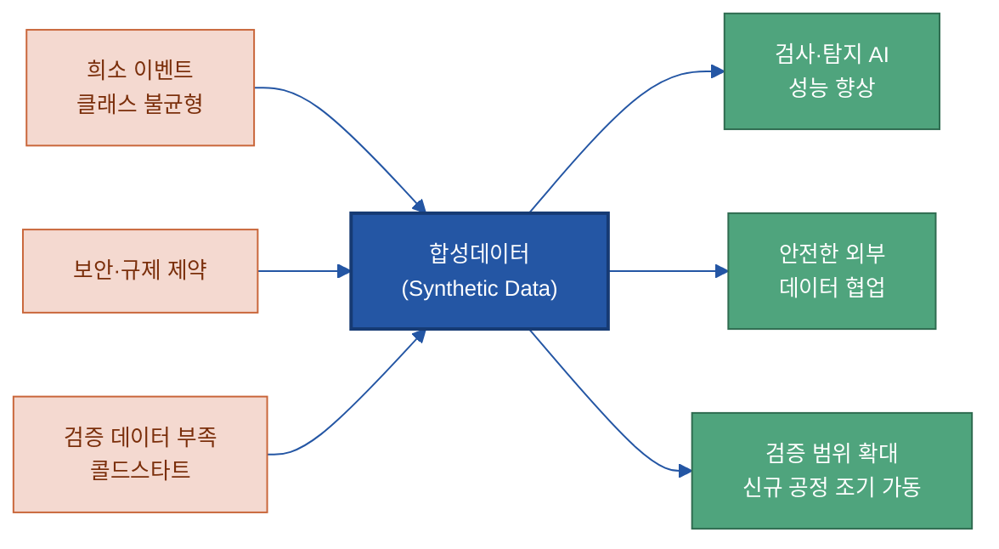
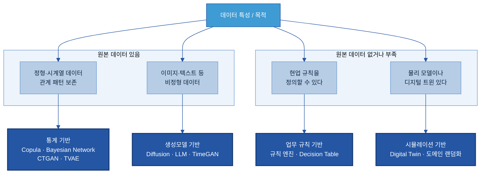
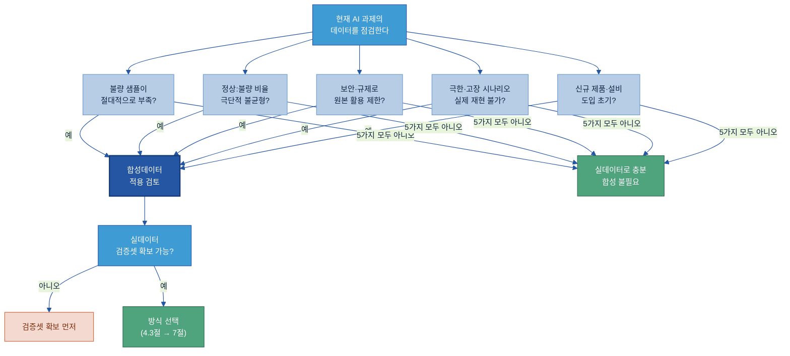
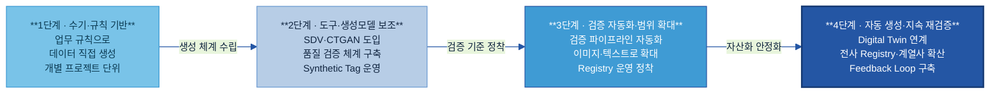

# E-2. 합성데이터(Synthetic Data) 매뉴얼

> 합성데이터는 실데이터가 부족하거나 사용이 제한되는 상황에서 AI 학습·검증에 쓸 데이터를 확보하기 위해, 원본의 통계 특성·변수 관계·업무 규칙을 보존하며 인공으로 생성한 데이터이다. 원본을 복제·대체하는 것이 아니라 AI가 쓸 수 있는 데이터 범위를 넓히는 수단이다.

---

## 목차

1. [개요](#1-개요)
2. [왜 필요한가 (Why)](#2-왜-필요한가-why)
3. [무엇을 갖추나 (What)](#3-무엇을-갖추나-what)
4. [언제 합성하나 (적용 판단)](#4-언제-합성하나-적용-판단)
5. [예시 시나리오 (한눈에)](#5-예시-시나리오-한눈에)
6. [솔루션·도구 검토](#6-솔루션도구-검토)
7. [어떻게 만들고 운영하나](#7-어떻게-만들고-운영하나-how)
8. [다른 주제와의 관계](#8-다른-주제와의-관계)
9. [성과 지표·고도화 로드맵](#9-성과-지표고도화-로드맵)

- [별첨 (Appendix)](#별첨-appendix)
- [기술 용어 한 줄 풀이](#기술-용어-한-줄-풀이)
- [참고자료 (References)](#참고자료-references)
- [변경 이력 / 피드백 반영](#변경-이력--피드백-반영)

---

> [!question] **이 가이드가 답하는 5가지 질문**
>
> | # | 질문 | 한 줄 답 | 다루는 곳 |
> |---|------|----------|-----------|
> | 1 | 어떤 경우에 합성데이터가 필요한가? | 희소 이벤트·클래스 불균형·보안 제약·검증 시나리오 부족·콜드스타트 다섯 신호 중 하나라도 해당할 때 검토한다 | [4절](#kq1) |
> | 2 | 어떤 데이터를 합성하나? | 실데이터 확보가 어렵거나 활용에 제약이 있는 데이터 — 정형·시계열·이미지·텍스트 전 유형에 적용 가능하며 제조업에서는 희귀 불량·설비 이상·신규 공정 데이터가 주된 대상이다 | [3.1절](#kq2) |
> | 3 | 어떤 방식으로 생성하나? | 통계 기반·업무 규칙 기반·시뮬레이션 기반·생성모델 기반 네 가지 방식 중 데이터 유형과 목적에 맞게 선택하거나 조합한다 | [3.2절](#kq3) |
> | 4 | 합성데이터가 실제를 닮았는지 어떻게 검증하나? | 충실도(분포 유사성)·유용성(AI 성능 유지)·프라이버시(재식별 위험) 세 축으로 검증하며, 반드시 실데이터 검증셋과 비교한다 | [3.3절](#kq4) |
> | 5 | 합성데이터의 위험을 어떻게 관리하나? | 합성 표시(Synthetic Tag) 의무화, 합성 비율 상한 관리, 편향 증폭·모드 붕괴·재식별 위험 점검을 운영 체계에 내장한다 | [7.3절](#kq5) |

> **예시 표기 안내:** 다이어그램·표의 구체 값(불량률·온도·건수 등)은 이해를 돕는 가상 예시이며 실제 데이터가 아니다. 실제 값은 PoC에서 확정한다.

> **관련 가이드:** [B-1 데이터 전처리](../B-1%20데이터%20전처리/B-1%20데이터%20전처리.md) · [B-2 데이터 해설·주석](../B-2%20데이터%20해설·주석/B-2%20데이터%20해설·주석.md) · [A-2 메타데이터](../A-2%20메타데이터/A-2%20메타데이터.md)

---

## 1. 개요

### 1.1 합성데이터란

합성데이터(Synthetic Data)는 원본 데이터를 그대로 복제하거나 단순히 가공한 것이 아니다. 실제 데이터의 통계적 분포, 변수 간 상관관계, 업무 규칙, 시계열 패턴 같은 특성을 학습한 뒤, 그 패턴에 따라 새로운 레코드를 인공으로 만들어 낸다. 원본 레코드와 1대1 대응 관계가 없으므로 원본을 직접 노출하지 않으면서도 동일한 통계 구조를 갖는 데이터를 얻을 수 있다.

비식별(De-identification)과의 차이는 한 줄로 구분된다. 비식별은 원본 레코드에서 식별자를 제거·마스킹·익명화해 재활용하는 것이고, 합성은 원본 레코드 자체를 변형하지 않고 통계 패턴만 학습해 새 레코드를 생성한다. 그래서 합성데이터는 원본과의 1대1 대응이 없어 재식별 위험이 구조적으로 낮다는 차이가 있다. 두 방식의 경계와 선택 기준은 8절에서 다룬다.

AI-Ready Data 관점에서 합성데이터의 역할은 명확하다. 실데이터를 대체하는 것이 아니라 실데이터만으로 채울 수 없는 부분 — 희귀 불량, 극한 시나리오, 개인정보 포함 영역 — 을 보완해 AI가 쓸 수 있는 데이터 범위를 넓히는 것이다.

### 1.2 적용 범위와 체계 내 위치

합성데이터는 AI-Ready Data 체계에서 "부족한 데이터를 인공으로 채우는 자리"를 맡는다. 경계를 짚어 두면 작업 범위가 명확해진다.

| 경계 항목 | 이 가이드에서 다루는 것 | 다른 주제가 맡는 것 |
|---------|---------------------|-----------------|
| 데이터 준비 범위 | 학습·검증용 데이터 부족 보강 (신규 생성) | 데이터 수집 여부 판정 → C-2 |
| 프라이버시 처리 | 합성 생성으로 원본 미노출 | 기존 데이터 비식별·접근 제어 → F-4 |
| 평가 정답셋 | 합성으로 학습셋 보강 | 평가 데이터셋 구성·기준 → E-3 |
| 데이터 전처리 | 합성 전 원본 품질 확보는 B-1에 위임 | 원본 정제·결측치 처리 → B-1 |

합성데이터 구축은 일곱 단계로 이루어진다. 이 정본 7단계는 이 가이드 전체에서 일관된 기준으로 사용된다.

> **정본 모델 — 합성데이터 구축 7단계:**
> 1) 목적 정의 → 2) 보존 특성 정의 → 3) 생성 방식 선택 → 4) 합성데이터 생성 → 5) 품질 검증 → 6) 위험 관리(합성 표시) → 7) 운영 및 자산화

---

## 2. 왜 필요한가 (Why)

### 2.1 데이터 부족의 구조적 유형

실데이터가 부족한 이유는 단일하지 않다. 제조 AI 과제에서 데이터가 부족한 데에는 서로 다른 구조적 원인이 있으며, 합성데이터가 그 원인을 보완하는 방식도 각각 다르다.

| 유형 | 구조 | 왜 문제인가 | 합성이 보완하는 방식 |
|-----|-----|-----------|-----------------|
| 희소 이벤트 (Rare Event) | 전체 생산 중 불량·장애가 극소수 비율(0.1% 수준). 수십만 건 이력이 있어도 불량 샘플은 수백 건에 그친다 | AI 모델은 충분한 사례를 반복 학습해야 패턴을 추출한다. 불량 샘플이 절대적으로 적으면 모델은 불량 특징을 학습하지 못하고 "모든 것이 정상"이라 판정하는 방향으로 편향된다 | 기존 불량 샘플에서 통계적 패턴을 학습해 불량 샘플 수를 늘린다 |
| 클래스 불균형 (Class Imbalance) | 정상:불량 비율이 99.8:0.2처럼 극단적으로 기울어져 있다 | 모델은 "항상 정상"이라 예측해도 99.8% 정확도를 얻으므로 불량 감지를 포기하는 방향으로 수렴한다. 정확도(Accuracy)가 높아도 재현율(Recall)이 0에 가까울 수 있다 | 소수 클래스(불량)를 합성으로 늘려 학습 데이터셋의 클래스 비율을 균형 있게 맞춘다 |
| 보안·규제 제약 | 인사·급여·고객·계약 데이터에 개인정보나 영업비밀이 포함되어 AI 학습용 사용이나 외부 제공에 법적·정책적 제약이 생긴다 | 데이터를 활용하지 못하면 AI 과제 자체가 막히거나, 외부 솔루션사·연구기관과의 협업이 불가능해진다 | 원본 레코드를 제공하지 않고 통계 패턴만 재현한 합성데이터를 제공한다 |
| 검증 데이터 부족 | 극한 운전 조건·비상 정지·설비 고장 시나리오를 실제 현장에서 의도적으로 재현하기 어렵다 | 검증 데이터가 없으면 AI 모델이 정상 범위 내에서만 동작하고, 이상 상황에서의 신뢰성을 확인할 수 없다 | 물리 시뮬레이션이나 업무 규칙 기반 시나리오로 실제 재현이 어려운 상황을 인공으로 만들어 검증셋에 포함한다 |
| 콜드스타트 (Cold Start) | 신제품 출시나 신규 설비 도입 초기에는 이상 패턴 데이터가 아예 없다 | 데이터 축적 전까지 AI 품질검사·이상탐지 모델을 가동할 수 없어 AI 도입 효과가 지연된다 | 유사 공정의 통계적 패턴을 참조하거나 설비 스펙 기반 시뮬레이션 데이터로 초기 모델을 구성한다 |
| 확보 리드타임·비용 (부수 효과) | 데이터 수집·정제·라벨링에 시간과 비용이 많이 든다 | 이것은 ①~⑤의 구조적 한계가 해소된 뒤에 오는 부수적 이점이다. 비용 절감만을 합성의 이유로 내세우면 "실데이터 대체"라는 오해로 이어진다 | 반복 생성이 필요한 테스트 데이터 확보에서 리드타임을 단축할 수 있다 |

두산전자 CCL Delamination 사례로 구체화하면, Delamination 불량이 전체 생산의 0.1~0.3% 수준일 때 연간 수십만 장 생산 기준으로 불량 샘플은 수백~수천 건에 불과하다. 이미지 AI 학습에는 이보다 많은 균형 잡힌 데이터가 필요하므로, 실데이터만으로는 재현율(Recall)을 충분히 높이기 어렵다. 이때 기존 불량 이미지의 패턴을 학습해 유사한 합성 불량 이미지를 추가로 만들어 학습셋을 보강한다.

### 2.2 보안·규제 맥락

보안·규제 제약의 경우, GDPR(유럽 개인정보보호규정) 시행 이후 개인정보 처리 요건이 강화되면서 합성데이터를 "개인정보가 아닌 대안"으로 활용하는 논의가 학계와 산업계에서 진행 중이다. 국내 개인정보보호법(2023년 개정)도 가명처리·익명처리 기준을 명시하고 있어, 합성데이터가 익명처리에 해당할 경우 법 적용 대상에서 제외될 수 있다는 논의가 있다. 다만 규제기관의 공식 해석은 합성 방식과 품질에 따라 다르게 적용될 수 있으므로, 실제 적용 시 개인정보보호위원회([www.pipc.go.kr](https://www.pipc.go.kr/)) 가이드라인 확인이 필요하다.

실무 관점에서 확실한 것은, 원본 데이터를 외부에 직접 제공하지 않아도 협업이 가능해진다는 실질적 이점이다.

### 2.3 기대 효과



합성데이터를 적절히 활용했을 때 기대할 수 있는 효과를 앞의 유형별로 연결하면 아래와 같다.

| 효과 | 연결되는 유형 | 두산전자 적용 예시 (가상) |
|-----|------------|----------------------|
| 검사·이상탐지 AI 성능 향상 | 희소 이벤트·클래스 불균형 | Delamination 탐지 재현율(Recall) 개선 |
| 안전한 외부 데이터 협업 | 보안·규제 제약 | 솔루션사·연구기관에 합성데이터 제공 |
| 검증 범위 확대 | 극한·고장 시나리오 부족 | 비상정지·과압 시나리오 AI 검증 가능 |
| 신규 제품 AI 조기 가동 | 콜드스타트 | 출시 전 모델 사전 구성 후 실데이터로 점진 전환 |
| 데이터 확보 리드타임 단축 | 부수 효과 | 추가 라벨링 없이 보강 샘플 즉시 생성 |

---

## 3. 무엇을 갖추나 (What)

합성데이터 체계는 무엇을 합성할지(대상), 어떻게 만들지(생성 방식), 잘 만들었는지 어떻게 확인할지(검증)라는 세 가지 구성 요소를 함께 갖추어야 한다.

<a id="kq2"></a>

### 3.1 무엇을 합성하나 (합성 대상)

> 핵심 질문 2 — "어떤 데이터를 합성하나"에 답하는 절.

모든 데이터를 합성할 필요는 없다. 실데이터 확보가 어렵거나 활용에 제약이 있는 데이터를 대상으로 선택적으로 적용한다.

**데이터 유형 기준**

| 유형 | 쉬운 설명 | 제조 예시 | 대표 합성 기법 |
|-----|---------|---------|-------------|
| 정형(표) 데이터 | 행·열로 정리된 데이터 | ERP 생산 이력, MES 공정 데이터, 품질 검사 이력 | Copula, CTGAN, TVAE |
| 시계열 데이터 | 시간 순서로 기록된 센서·측정값 | 온도·압력·진동 로그, CCL 경화 사이클 | TimeGAN, 시뮬레이션 |
| 이미지 | 외관검사·현미경·CCTV 영상 | Delamination·Wicking·Void 불량 이미지 | Diffusion, NVIDIA Omniverse |
| 텍스트 | 문서·자연어 데이터 | VOC, 작업일지, 정비 보고서 | LLM(대형 언어 모델) |
| 그래프 데이터 | 관계 기반 데이터 | 공급망, 설비 연결 구조 | Bayesian Network |

**활용 목적 기준**

| 목적 | 설명 | 제조 예시 |
|-----|-----|---------|
| 희귀 이벤트 확보 | 발생 빈도가 낮아 실데이터로 충분히 모으기 어려운 사례 보강 | Delamination, Wicking, 설비 고장 |
| 클래스 불균형 해소 | 정상 대비 불량 비율이 극단적으로 낮을 때 불량 클래스 보강 | 불량 이미지 증강 |
| 민감정보 보호 | 개인정보·영업비밀 포함 데이터를 직접 쓰지 않고 통계 구조만 재현 | 인사·급여·고객 데이터 |
| 신규 제품·설비 (콜드스타트) | 이력이 쌓이기 전 초기 모델 구성용 데이터 확보 | 신규 CCL 제품 라인, 신규 검사 설비 |
| 검증 시나리오 | 실제 재현이 어려운 극한·고장 상황 생성 | 비상 정지, 과열, 극한 운전 조건 |
| 안전한 외부 공유 | 원본 미노출 상태로 연구·협업 진행 | 솔루션사에 합성 공정 데이터 제공 |

**제조업 주요 적용 대상**

두산전자 CCL 외관검사를 기준으로 대표 적용 대상을 정리하면 다음과 같다.

| 분류 | 합성 대상 | 합성 목적 |
|-----|---------|---------|
| 품질 데이터 | Delamination, Wicking, Void, 균열(Crack) 불량 이미지 및 정형 이력 | 희귀 불량 샘플 보강, 재현율(Recall) 향상 |
| 설비 데이터 | 설비 이상 진동·과열·압력 이상 시계열 | 이상 탐지 모델 학습 |
| 생산 데이터 | 신규 제품·공정 생산 이력 | 콜드스타트 해소 |
| 문서 데이터 | VOC, 작업일지, 점검 보고서 | 텍스트 AI 학습 데이터 확보 |

<a id="kq3"></a>

### 3.2 어떻게 만드나 (생성 방식 4가지)

> 핵심 질문 3 — "어떤 방식으로 생성하나"에 답하는 절(방식 선택 기준은 4.3절, 적용은 7절).

합성데이터 생성 방식은 데이터 특성과 활용 목적에 따라 네 가지 중에서 선택하거나 조합한다. 각 방식의 원리와 역할을 먼저 이해하면 어느 상황에 무엇을 쓸지 판단하기 쉬워진다.



**네 가지 방식 개요**

| 방식 | 원리 한 줄 | 대표 기법 | 어디에 맞나 |
|-----|---------|---------|-----------|
| 통계 기반 | 실제 데이터의 분포와 변수 간 상관관계를 학습해 새 샘플을 생성한다 | Copula, Bayesian Network, CTGAN, TVAE | 정형·표 데이터, 소규모 데이터, 설명 가능성이 중요할 때 |
| 업무 규칙 기반 | 현업 전문가(SME)가 정의한 제약 조건과 규칙을 직접 코드로 구현해 데이터를 생성한다 | 규칙 엔진, Decision Table | 원본 데이터 없이도 가능, 희귀·극한 이벤트, 안전 검증, 인과 관계 명확할 때 |
| 시뮬레이션 기반 | 실제 물리 법칙 또는 공정 논리를 가상 환경에 구현하고 다양한 파라미터 조합으로 데이터를 생성한다 | Digital Twin, NVIDIA Omniverse, AnyLogic | 설비·공정 이상 시나리오, 비전 AI 학습 이미지, 신규 설비 초기 데이터 |
| 생성모델 기반 | 대규모 실제 데이터에서 잠재 패턴을 학습한 딥러닝 모델이 새로운 현실적 샘플을 생성한다 | Diffusion, LLM, TimeGAN, TabDDPM | 이미지·텍스트·시계열, 비정형 데이터, 원본 데이터가 어느 정도 확보됐을 때 |

제조 현장에서는 단일 방식보다 두 가지 이상을 조합하는 경우가 많다. 예를 들어 정형 공정 데이터는 Copula(통계 기반)로, Delamination 불량 이미지는 Diffusion(생성모델 기반)으로, 설비 과열 시나리오는 업무 규칙 기반으로 각각 생성한 뒤 하나의 학습셋에 결합한다. 각 방식의 상세 비교와 도구 선택은 6절과 별첨을 참조한다.

<a id="kq4"></a>

### 3.3 검증 항목과 합성 표시

> 핵심 질문 4 — "합성데이터가 실제를 닮았는지 어떻게 검증하나"에 답하는 절(지표 상세는 9.1절·별첨).

합성데이터는 생성한 뒤 반드시 품질을 검증해야 한다. 검증은 세 축으로 수행하며, 각 축은 서로 트레이드오프 관계여서 활용 목적에 따라 우선순위를 정해야 한다.

| 검증 축 | 핵심 질문 | 개념 수준 설명 | 제조 예시 |
|--------|--------|------------|---------|
| 충실도 (Fidelity) | 합성 분포가 원본 분포와 얼마나 닮았나 | 온도·압력·수분 함량의 분포와 변수 간 상관관계가 원본과 일치하는지 확인한다. 분포가 어긋나면 모델이 실제와 다른 패턴을 학습하게 된다 | Delamination 불량 시 온도·흡습률의 조합 분포가 합성데이터에서도 재현되는지 |
| 유용성 (Utility) | 합성으로 학습한 AI가 실제 성능을 유지하나 | 합성데이터로 학습(Train on Synthetic)한 모델을 실데이터로 평가(Test on Real)해서 실데이터 기반 모델과 성능을 비교한다 | 합성 보강 후 Delamination 탐지 재현율(Recall)이 원본 데이터 기반과 비슷한 수준을 유지하는지 |
| 프라이버시 (Privacy) | 합성 레코드에서 원본을 역추적할 수 있나 | 합성 레코드가 원본과 얼마나 가까운지(재식별 거리)와 원본 학습 데이터 포함 여부를 통계적으로 점검한다 | 합성 생산 이력에서 특정 Lot 번호나 설비 ID를 역추론할 수 없는지 |

통계 지표만으로는 제조 현업의 물리·업무 제약 위반을 잡아내지 못한다. 따라서 현업 전문가(SME) 검토를 반드시 함께 수행한다. 온도가 음수이거나 검사 전에 출하 처리가 된 레코드, 또는 Delamination 불량 비율이 원본(0.1~0.3%)과 동떨어진 합성데이터는 통계 지표가 양호해도 실제 활용에는 부적합하다. 지표 정의와 측정 방법의 상세는 9.1절과 별첨에서 다룬다.

**합성 표시(Synthetic Tag)** 는 검증만큼 중요하다. 합성데이터와 실데이터가 혼동되면 모델이 실제 현장과 괴리된 패턴을 학습하거나, 합성 데이터를 근거로 한 의사결정이 이루어지는 사고로 이어질 수 있다. 모든 합성 데이터셋에는 생성 목적·방식·일자·버전·소유자를 포함한 합성 표시를 반드시 부착하고, 실데이터와 분리 관리한다.

---

<a id="kq1"></a>

## 4. 언제 합성하나 (적용 판단)

> 핵심 질문 1 — "어떤 경우에 합성데이터가 필요한가"에 답하는 절.

합성데이터는 모든 AI 과제에 필요하지 않다. 실데이터가 충분하고 활용에 제약이 없다면 합성데이터를 생성할 이유가 없다. 판단은 기술이 아니라 데이터 확보 관점에서, 아래 흐름으로 내린다.

### 4.1 적용 판단

**이럴 때 합성 검토 — 5가지 신호**

아래 중 하나 이상에 해당하면 합성데이터 적용을 검토한다.

| 신호 | 판단 지표 예시 | 연결되는 Why 유형 |
|-----|------------|----------------|
| 불량·장애 샘플이 절대적으로 부족 | 불량률 1% 미만, 불량 샘플 수백 건 이하 | 희소 이벤트 |
| 정상·불량 비율이 극단적으로 불균형 | 정상:불량 100:1 이상 | 클래스 불균형 |
| 보안·규제로 원본 활용이 제한 | 개인정보·영업비밀 포함, 외부 공유 필요 | 보안·규제 제약 |
| 극한·고장 시나리오를 실제로 재현할 수 없음 | 비상 정지·설비 고장·극한 운전 조건 | 검증 데이터 부족 |
| 신규 제품·설비 도입 초기, 이력 데이터 없음 | 출시 6개월 이내, 장애 사례 0건 | 콜드스타트 |

**이럴 땐 합성이 불필요 — 4가지 조건 모두 해당 시**

아래 네 가지를 모두 만족하면 합성데이터 없이 실데이터만으로 충분하다.

| 조건 | 판단 근거 |
|-----|---------|
| 학습·검증에 충분한 실데이터가 확보됨 | 클래스 균형 포함 |
| 원본 데이터 활용에 보안·규제 제약 없음 | 개인정보·영업비밀 미포함, 내부 전용 |
| 극한·고장 시나리오를 실데이터나 운영 이력으로 커버 가능 | 충분한 장애 사례 누적 |
| 이미 충분한 이력이 쌓인 공정·제품 | 콜드스타트 상황 아님 |

적용 판단 흐름을 하나의 분기로 그리면 다음과 같다.



### 4.2 비교 기준이 될 실데이터 먼저 확보

합성데이터 적용을 결정한 뒤에 반드시 지켜야 할 원칙이 있다. 가용한 실데이터를 학습셋(train)과 검증셋(test/val)으로 먼저 나누고, 합성데이터는 학습셋에만 보강한다. 검증은 반드시 실데이터로만 수행한다.

이 원칙을 지키지 않으면 합성데이터로 학습하고 합성데이터로 검증하는 상황이 생겨 "현장에서는 동작하지 않는 모델"을 만들 위험이 있다. 합성데이터의 충실도(Fidelity)를 확인하려면 실데이터와 비교할 수 있어야 하고, AI 모델이 실제 현장에서 제대로 동작하는지 확인하려면 실데이터 기반 검증셋이 기준점이 되어야 한다.

```
실데이터 분리 원칙
  학습셋(train) : 실데이터 + 합성데이터로 보강 가능
  검증셋(test/val) : 반드시 실데이터만 → 모델 성능 기준점
```

### 4.3 생성 방식 선택 기준

합성 적용을 결정했다면 다음으로 어떤 방식으로 생성할지를 정한다. 방식 선택은 세 가지 축으로 판단한다.

| 판단 축 | 상황 | 권장 방식 |
|--------|-----|---------|
| 데이터 유형 | 정형·표 데이터 | 통계 기반 (Copula, Bayesian Network, CTGAN) |
| 데이터 유형 | 이미지 | 생성모델 기반 (Diffusion), 시뮬레이션 기반 (Omniverse) |
| 데이터 유형 | 텍스트 | 생성모델 기반 (LLM) |
| 데이터 유형 | 시계열 | 통계 기반 (Copula) 또는 생성모델 기반 (TimeGAN) |
| 원본 데이터 규모 | 원본 데이터 충분 (수천 건 이상) | 통계 기반 또는 생성모델 기반 |
| 원본 데이터 규모 | 원본 데이터 부족·없음 | 업무 규칙 기반 또는 시뮬레이션 기반 |
| 도메인 지식 보유 | 현업 규칙 정의 가능 | 업무 규칙 기반 우선 검토 |
| 도메인 지식 보유 | 규칙화 어려운 복잡 패턴 | 생성모델 기반 |

이 판단 결과가 7절(어떻게 만들고 운영하나)의 3단계(생성 방식 선택)로 이어진다. 도구별 상세 비교는 6절을 참조한다.

---

## 5. 예시 시나리오 (한눈에)

### 5.1 적용 전/후

두산전자 CCL 외관검사 라인에서 Delamination 불량 예측 AI를 구축하려 한다. 생산 데이터를 분석했더니 정상 이력 124만 건 대비 Delamination 불량은 약 2,350건(0.19%)에 불과했다. 이 비율로 AI 모델을 학습하면 모델은 "항상 정상"이라 예측하는 방향으로 수렴하고, 실제 불량을 거의 잡지 못하는 상태가 된다.

품질혁신팀은 합성데이터를 활용해 Delamination 불량 샘플을 보강하기로 결정했다. CTGAN을 사용해 공정 조건(온도·압력·프리프레그 흡습률)과 불량 여부 간의 통계 패턴을 학습시키고, 보강 샘플을 생성해 학습셋에 추가했다. 검증은 실데이터 검증셋으로만 수행했다. 그 결과 Delamination 탐지 재현율(Recall)이 개선되었다(가상 예시).

### 5.2 흐름 미리보기

정본 7단계를 한 줄 흐름으로 압축하면 아래와 같다. 각 단계의 구체적인 작업과 산출물은 7절에서 상세히 다룬다.

```
목적·대상 정하기
→ 원본에서 닮아야 할 특성 정의 (온도·압력 분포, Delamination 연관 패턴)
→ 데이터 유형과 원본 규모에 맞는 방식 선택 (CTGAN, Diffusion 등)
→ 합성데이터 생성
→ 충실도·유용성·프라이버시 검증 (실데이터 검증셋 기준)
→ "합성" 표시 부착 후 실데이터와 분리 관리
→ 학습셋에 투입, 재사용 자산으로 카탈로그 등록
```

이 흐름을 실제 공정 데이터에 적용하면 7절의 E2E 사례가 된다. 각 단계에서 무엇을 결정하고 어떤 산출물이 나오는지 7절에서 확인한다.

---

## 6. 솔루션·도구 검토

> 솔루션을 묶어 평가·선정하려면 → [Tech Stack 비교 정본](../../전체%20목차/01%20Tech%20Stack%20비교%20(솔루션×주제).md). 아래는 합성데이터 관점의 도구 유형·기능 비교다.

합성데이터 도구는 생성하려는 데이터 유형에 따라 역할이 명확히 갈린다. 정형·시계열 데이터 합성, 이미지·비전 합성, 품질 검증의 세 유형으로 분류하여 기능을 살핀다.

### 6.1 도구 유형 및 기능 비교

**전통적 증강(Data Augmentation)과 합성 생성의 구분**

합성데이터 도구를 선택하기 전에 전통적 증강과 합성 생성의 차이를 명확히 해야 한다. 전통적 증강은 기존 이미지를 회전·뒤집기·밝기 조정 등으로 변형하는 방식으로 원본 데이터가 반드시 존재해야 하며, Delamination처럼 원본 자체가 수백 건에 불과하면 증강 효과도 제한된다. 합성 생성은 3D 렌더링이나 생성 모델로 없던 이미지를 만들어 내므로 원본 건수가 매우 적거나 0건인 상황에도 대응할 수 있다.

**① 정형·시계열 합성 도구**

| 도구 | 구분 | 한 줄 설명 | 온프레미스 | 공식 URL |
|------|------|-----------|:--------:|---------|
| **SDV (Synthetic Data Vault)** | 오픈소스 | 정형·관계형·시계열 합성의 사실상 표준. CTGAN·TVAE·Gaussian Copula 내장 | 가능 | [sdv.dev](https://sdv.dev/) |
| **YData (ydata-synthetic)** | 오픈소스 | 정형·시계열 합성 특화. GAN·VAE 기반 Python 패키지 | 가능 | [ydata.ai](https://ydata.ai/) |
| **SmartNoise SDK** | 오픈소스 | Microsoft 주도, 커뮤니티 공동 개발. 차분 프라이버시(DP) 적용 합성 생성 | 가능 | [smartnoise.org](https://smartnoise.org/) |
| **MOSTLY AI** | 상용 | 웹 UI 기반 고품질 정형 합성. 2026년 3월 Syntho와 합병 — 도입 전 현황 확인 | 엔터프라이즈 | [mostly.ai](https://mostly.ai/) |
| **Syntho** | 상용 | AI 생성 합성 + 규칙 기반 + 마스킹 통합. 온프레미스 배포 명시. MOSTLY AI와 합병 — 도입 전 현황 확인 | 가능(명시) | [syntho.ai](https://www.syntho.ai/) |
| **Tonic.ai** | 상용 | 소프트웨어 개발·AI 훈련용 테스트 데이터 합성 특화 | 확인 필요 | [tonic.ai](https://www.tonic.ai/) |
| **Gretel AI** | 상용 | 2025년 3월 NVIDIA가 인수. NVIDIA Synthetic Data Generation으로 통합됨 — 도입 전 현황 확인 | 확인 필요 | [gretel.ai](https://www.gretel.ai/) |

주의: Gretel(NVIDIA 인수), Hazy(SAS Data Maker로 통합), MOSTLY AI·Syntho 합병 등 2024~2026년 사이 상용 플랫폼의 M&A가 활발하다. 도입 검토 시 현재 운영 상태와 제품 로드맵을 공식 채널에서 직접 확인한다.

**② 이미지·비전 합성 도구 (제조 불량 이미지용)**

| 도구 | 한 줄 설명 | 제조 적용 포인트 | 공식 URL |
|------|-----------|---------------|---------|
| **NVIDIA Omniverse Replicator** | 물리 기반 렌더링 합성데이터 생성 프레임워크. 3D CAD 모델로 결함 이미지 대량 생성 | CCL Delamination 결함 텍스처를 3D 기판 모델에 적용해 다양한 촬영 각도·조명 조건의 불량 이미지를 대량 생성 가능 | [developer.nvidia.com/omniverse](https://developer.nvidia.com/omniverse) |
| **Unity Perception** | Unity 엔진 기반 컴퓨터 비전 합성데이터 생성. 도메인 랜덤화(Domain Randomization)로 다양한 조건 이미지 생성. 자동 레이블 포함. 현재 Unity의 공식 지원이 종료됨(커뮤니티 유지) | 제조 결함 탐지 모델용 학습 이미지 생성. Ground truth 주석 자동화 | [GitHub](https://github.com/Unity-Technologies/com.unity.perception) |

**③ 검증·품질 평가 도구**

| 도구 | 한 줄 설명 | 주요 기능 | 공식 URL |
|------|-----------|---------|---------|
| **SDMetrics** | SDV 에코시스템의 합성데이터 품질·프라이버시 평가 라이브러리 | 통계 유사도(KS Complement·TV Complement), 상관관계 보존, 재식별 위험(Singling Out·Linkability·Inference) 평가, 시각화 리포트 자동 생성 | [docs.sdv.dev/sdmetrics](https://docs.sdv.dev/sdmetrics) |
| **Great Expectations** | 데이터 품질 검증 오픈소스 프레임워크. 합성데이터 업무 규칙 준수 여부 자동 검증 | Expectation 기반 규칙 정의, 배치·스트림 검증, 검증 결과 리포트(Data Docs) 자동 생성. Apache 2.0 라이선스 | [greatexpectations.io](https://greatexpectations.io/) |

### 6.2 도구 선정 기준

합성데이터 도구를 고를 때 제조 현장에서 가장 중요하게 봐야 하는 기준은 온프레미스·셀프호스트 가능 여부다. 합성데이터 생성에는 원본 데이터가 입력으로 필요하므로, 클라우드 SaaS 방식은 생산 데이터가 사외로 나간다는 보안 위험을 수반한다.

| 선정 기준 | 설명 | 제조 온프레미스 중요도 |
|---------|------|----------------|
| 데이터 유형 커버리지 | 정형·시계열·이미지 중 어디까지 지원하는가 | 높음 |
| 충실도(Fidelity) | 통계 분포와 변수 관계를 얼마나 잘 보존하는가 | 높음 |
| 프라이버시 보존 | 차분 프라이버시(DP) 지원 여부 | 중간(제조 B2B는 기밀정보가 우선) |
| 재식별 위험 평가 기능 | Singling Out·Linkability·Inference 평가 도구 내장 여부 | 높음 |
| 온프레미스·셀프호스트 가능 | 데이터가 사외 클라우드로 나가지 않고 사내에서 처리 가능한가 | 매우 높음 |
| PoC 용이성 | Python 패키지 또는 Docker로 빠른 시작 가능 여부 | 높음 |
| 라이선스 | 오픈소스(무료) vs. 상용(구독·계약) | 중간 |

두산전자처럼 제조 온프레미스 환경에서 PoC를 시작할 때 권장하는 조합은 다음과 같다. 정형 데이터 합성에는 SDV([sdv.dev](https://sdv.dev/))를 온프레미스 Python 환경에 설치하고, 품질 검증에는 SDMetrics([docs.sdv.dev/sdmetrics](https://docs.sdv.dev/sdmetrics))를 연동하며, 업무 규칙 검증에는 Great Expectations([greatexpectations.io](https://greatexpectations.io/))를 병행한다. 이미지 합성이 필요한 경우에는 GPU 서버가 확보된 환경에서 NVIDIA Omniverse Replicator를 검토한다. 상용 제품을 도입할 경우 온프레미스 배포를 명시한 Syntho([syntho.ai](https://www.syntho.ai/))를 우선 PoC 대상으로 고려한다.

#### [Backup] 도구 종합 비교표

| 도구 | 정형 | 시계열 | 이미지 | 온프레미스 | DP 지원 | 오픈소스 |
|------|:---:|:----:|:----:|:--------:|:------:|:------:|
| SDV | O | O | — | O | 일부 | O |
| YData | O | O | — | O | — | O |
| SmartNoise | O | — | — | O | O | O |
| MOSTLY AI | O | — | — | 엔터프라이즈 | O | — |
| Gretel(→NVIDIA) | O | O | — | 확인 필요 | O | — |
| Tonic.ai | O | — | — | 확인 필요 | — | — |
| Syntho | O | — | — | O(명시) | — | — |
| NVIDIA Replicator | — | — | O | O(GPU 필요) | — | 일부 |
| Unity Perception | — | — | O | O | — | O |
| SDMetrics | O | O | — | O | — | O |
| Great Expectations | O | O | — | O | — | O |

셀: O=지원, —=해당 없음 또는 미지원. 가격·버전·배포 옵션은 변동되므로 도입 전 공식 문서로 확인한다.

---

## 7. 어떻게 만들고 운영하나 (How)

합성데이터 구축은 도구를 실행해 데이터를 생성하는 단순 작업이 아니다. 생성 목적을 정의하고 보존할 특성을 결정한 뒤 적절한 방식을 선택하며, 검증과 위험 관리를 거쳐 운영 체계까지 구축해야 비로소 완성된다. 합성데이터의 품질은 생성 모델 자체의 수준보다 이 절차를 얼마나 체계적으로 수행했는지에 의해 결정된다.

### 7.1 만드는 절차 — 합성데이터 구축 7단계

합성데이터 구축은 아래 7단계를 기준으로 수행한다. 데이터 유형과 생성 방식이 달라지더라도 이 흐름은 그대로 적용된다.

```mermaid
%%{init: {'theme':'base','themeVariables':{'primaryColor':'#DCE8F5','primaryBorderColor':'#2456A4','primaryTextColor':'#10243f','lineColor':'#2456A4','clusterBkg':'#EEF4FB','clusterBorder':'#6B9AD1','fontSize':'13px'}}}%%
flowchart LR
    S1["1 목적 정의\n활용 목적·\n기대성과 정의"]:::src
    S2["2 보존 특성 정의\n분포·관계·\n규칙 결정"]:::n
    S3["3 생성 방식 선택\n데이터 유형·\n목적 기준"]:::n
    S4["4 합성데이터 생성\n모델 학습·\n데이터 생성"]:::n
    S5["5 품질 검증\n충실도·유용성\n검증"]:::gate
    S6["6 위험 관리\n재식별·\n합성 표시"]:::gate
    S7["7 운영 및 자산화\n카탈로그 등록·\n버전 관리"]:::cat
    S1 --> S2 --> S3 --> S4 --> S5 --> S6 --> S7
    classDef n fill:#B7CDE6,stroke:#6B9AD1,color:#10243f;
    classDef src fill:#79C3E8,stroke:#3F9BD4,color:#0b3a52;
    classDef cat fill:#2456A4,color:#fff,stroke:#163a73,stroke-width:2px;
    classDef gate fill:#3F9BD4,stroke:#2456A4,color:#fff;
```



| 단계 | 목적 | 주요 작업 | 산출물 |
|------|------|---------|-------|
| 1 목적 정의 | 왜 생성하는지 명확히 한다 | 활용 목적·기대 성과·허용 위험 수준·활용 범위 정의 | 합성데이터 활용 계획서 |
| 2 보존 특성 정의 | 무엇을 닮아야 하는지 결정한다 | 분포·상관관계·시계열 패턴·업무 규칙·희귀 이벤트 중 보존 대상 선택 | 보존 특성 정의서 |
| 3 생성 방식 선택 | 데이터 특성·목적에 맞는 방식을 정한다 | 데이터 유형·원본 규모·설명 가능성·구현 난이도 검토 | 생성 방식 검토서 |
| 4 합성데이터 생성 | 선택한 방식으로 데이터를 만든다 | 데이터 정제·모델 학습·합성 생성·Synthetic Tag 부여 | 합성데이터셋·생성 로그 |
| 5 품질 검증 | 활용 가능 수준인지 확인한다 | 통계 유사도·변수 관계·업무 규칙·AI 모델 성능 비교 | 품질 검증 보고서 |
| 6 위험 관리 | 재식별 위험을 평가하고 통제한다 | Singling Out·Linkability·Inference 평가, 마스킹·일반화 조치 | 위험 평가 보고서 |
| 7 운영 및 자산화 | 일회성이 아닌 재사용 자산으로 관리한다 | 데이터 카탈로그 등록·메타데이터 등록·버전 관리·활용 이력 관리 | Synthetic Registry·메타데이터 |

### 7.2 End-to-End 사례 — 두산전자 CCL Delamination

두산전자 품질혁신팀은 CCL 외관검사 AI 모델의 재현율(Recall)을 높이기 위해 Delamination 데이터 보강 프로젝트를 수행하였다. 다음은 7단계를 실제 프로젝트에 적용한 과정이다.

**단계 1 — 목적 정의**

품질혁신팀은 프로젝트 목적을 "Delamination 예측 모델 학습용 데이터 확보, 재현율(Recall) 향상"으로 정의하였다. 실제 생산 이력 분석 결과, 정상 데이터 1,240,000건 대비 Delamination 불량은 2,350건(약 0.19%)에 불과하여 원본 데이터만으로 학습하면 모델이 정상 클래스에 과도하게 편향될 가능성이 높았다. 허용 위험 수준은 "재식별 위험 낮음, 내부 학습 전용"으로 설정하였다.

**단계 2 — 보존 특성 정의**

보존 대상으로는 온도·압력·프리프레그 흡습률 분포, Lot 간 공정 패턴, 프리프레그 흡습→수지 미경화→Delamination 인과 관계를 선정하였다. 반면 작업자 ID·설비 일련번호처럼 재식별 위험이 있는 식별 정보는 보존 대상에서 제외하였다.

**단계 3 — 생성 방식 선택**

정형 생산 데이터에는 범주형 변수(불량 유형 코드, 공정 단계)가 다수 포함되어 있고 변수 간 비선형 복잡 패턴이 존재하였다. 품질혁신팀은 이 특성에 맞춰 CTGAN을 1차 생성 방식으로 선택하였다. 인과 시나리오 보강을 위해 Bayesian Network를 병행 적용하여 "프리프레그 흡습률이 높을 때" 조건을 고정한 후속 불량 시나리오를 추가로 생성하였다. 불량 이미지 확보는 Diffusion 모델(Stable Diffusion + LoRA 파인튜닝)로 진행하여 실제 Delamination·Wicking·Void 이미지 수십 장으로 파인튜닝 후 수백 장을 생성하였다. 극한 공정 조건(경화 온도 이탈·냉각 속도 편차) 데이터는 업무 규칙 기반으로 직접 생성하였다.

**단계 4 — 합성데이터 생성**

MES 생산 이력·공정 데이터·품질 데이터를 전처리하여 CTGAN을 학습시킨 결과 Delamination 정형 데이터 30,000건을 생성하였다. Bayesian Network 시나리오로 흡습 조건 변이 데이터 5,000건을 추가하였다. 생성된 모든 데이터에는 Synthetic Tag(생성 방식·일자·버전·생성 목적·합성 비율)를 부여하여 실데이터와 구분하였다.

**단계 5 — 품질 검증**

SDMetrics로 통계 유사도와 변수 관계 보존율을 측정하고, Great Expectations로 온도 범위·압력 하한·Lot 패턴 등 업무 규칙 위반 여부를 자동 검증하였다. 최종 AI 모델 성능 비교(TSTR)에서 원본 데이터 기반 모델의 재현율 0.71 대비 합성데이터 포함 모델의 재현율 0.84로 향상이 확인되었다.

**단계 6 — 위험 관리**

Lot 번호 일반화와 설비 ID 마스킹을 적용한 후 Singling Out·Linkability·Inference 위험을 평가하여 재식별 위험이 허용 수준 이내임을 확인하였다. 합성데이터가 전체 학습 데이터 중 차지하는 비율은 37%로 제한하였다(이미지 합성 선행 연구에서 37% 초과 시 성능 저하 사례 확인).

**단계 7 — 운영 및 자산화**

생성된 데이터셋을 데이터 카탈로그에 "Synthetic_Delamination_V1.0, 품질혁신팀 오너"로 등록하고, 메타데이터에 생성 방식(CTGAN+Bayesian Network), 생성 일자, 품질 검증 결과를 기록하였다. 분기별 재검증 일정을 수립하여 원본 데이터 분포 변화에 따른 합성 품질 갱신 체계를 갖추었다.

<a id="kq5"></a>

### 7.3 운영과 위험 관리

> 핵심 질문 5 — "합성데이터의 위험을 어떻게 관리하나"에 답하는 절.

합성데이터는 생성 이후의 관리가 생성 자체만큼 중요하다. 잘못 운영된 합성데이터는 AI 모델의 판단을 왜곡하고, 검증되지 않은 데이터가 의사결정 근거로 쓰이는 사고로 이어질 수 있다.

**위험 4가지와 대응**

| 위험 | 현상 | 대응 |
|------|------|------|
| 편향 증폭(Bias Amplification) | 원본 데이터의 편향(특정 설비·교대조 과다)이 합성 과정에서 증폭되어 AI 모델이 더 왜곡된 판단을 내림 | 원본 편향 사전 진단 후 합성 진행. 합성 비율 상한 관리(권장: 전체 학습 데이터의 50% 미만). 실데이터와 반드시 혼합 사용 |
| 모드 붕괴(Mode Collapse) | 생성 모델(GAN 계열)이 원본의 다양한 패턴 중 일부만 반복 생성하여 합성데이터 다양성 감소 | 생성 후 분포 다양성 지표(Coverage) 확인. 합성데이터 분산이 원본보다 현저히 낮으면 재생성 |
| 현실 왜곡(Reality Distortion) | 합성 비율이 과도하게 높아 AI 모델이 실제 현장과 괴리된 패턴을 학습 | Synthetic Tag 의무화로 실데이터와 혼동 방지. 합성 비율 기록 및 상한 준수. 분기·반기 단위 품질 재검증 |
| 재식별(Re-identification) | 합성 레코드가 원본 데이터의 특정 개인·설비 정보를 역추적 가능한 수준으로 유사 | DCR(최근접 거리) 및 Privacy Share 측정. Singling Out·Linkability·Inference 평가. 필요 시 마스킹·일반화 추가 적용 |

**합성 표시(Synthetic Tag)와 운영 체계**

합성데이터는 생성 즉시 Synthetic Tag를 부여하여 실데이터와 명확히 구분한다. Tag에 포함할 최소 항목은 생성 목적·방식·일자·버전·합성 비율·원본 데이터셋 참조·검증 결과 상태다. 접근 권한은 실데이터와 분리하여 관리하며, 활용 이력과 배포 이력을 추적한다. 보존 기간이 종료된 합성데이터는 폐기 승인 기록을 남기고 삭제한다.

재생성 주기는 원본 데이터 분포가 크게 바뀌거나(예: 신규 공정 도입, 원자재 변경), 합성데이터 품질 지표가 기준선 아래로 떨어질 때 트리거한다. 정기 점검은 분기 단위를 권장한다.

---

## 8. 다른 주제와의 관계

합성데이터는 AI-Ready Data 체계 내 여러 주제와 연결되며, 각 주제와의 역할 경계를 명확히 해야 중복과 혼선을 피할 수 있다.

| 인접 주제 | 그 주제의 역할 | E-2와의 경계 |
|---------|------------|------------|
| E-3 AI 평가 데이터 | AI 모델 평가를 위한 정답 레이블 데이터(Ground Truth) 관리 | E-3는 모델 성능을 측정하는 평가 정답셋. E-2는 학습 데이터를 보강하는 합성 생성. 합성데이터를 평가셋으로 쓸 수 없다 — 평가는 반드시 실데이터로 |
| F-4 AI 데이터 권한·보안 | 데이터 접근 권한 정책·비식별화 기준 관리 | F-4 비식별화는 원본을 가공·변형. E-2 합성은 패턴을 학습해 새 데이터를 생성. 둘은 보안 목적이 겹치나 방식이 다름. 재식별 위험 평가 기준은 F-4 정책을 따른다 |
| C-2 데이터 품질 관리 | 데이터의 정확성·완전성·일관성 기준 정의 및 측정 | 합성데이터가 AI 학습에 사용 가능한지 판정하는 기준은 C-2가 정의. E-2는 생성·검증 절차를 수행 |
| [B-1 데이터 전처리](../B-1%20데이터%20전처리/B-1%20데이터%20전처리.md) | 원본 데이터의 오류·결측·이상치 정제 | 합성데이터 품질은 원본 품질에 직접 영향을 받음. 합성 생성 전에 B-1 전처리가 선행되어야 함 |
| [B-2 데이터 해설·주석](../B-2%20데이터%20해설·주석/B-2%20데이터%20해설·주석.md) | AI 학습용 라벨(결함 유형·원인 분류 등) 부여 | 라벨이 있는 데이터를 학습해야 의미 있는 합성데이터를 생성할 수 있음. 불량 이미지 합성 시 B-2의 결함 유형 주석이 전제 |
| [A-2 메타데이터](../A-2%20메타데이터/A-2%20메타데이터.md) | 데이터 필드·테이블 속성 설명 및 이력 관리 | 합성 여부(Synthetic Tag)·생성 방식·버전·검증 결과는 A-2 메타데이터 속성으로 등록. "이 데이터가 합성인가"는 A-2에서 확인 |
| D-1 Physical 데이터 | 설비·센서 데이터 수집·관리 및 Digital Twin 연계 | Digital Twin이 시뮬레이션 데이터원으로 합성 생성에 활용. D-1이 구축될수록 시뮬레이션 기반 합성 품질 향상 |
| E-1 데이터 Product화 | 데이터를 재사용 가능한 Product 형태로 패키징·운영 | 합성데이터를 일회성이 아닌 재사용 자산으로 관리하는 체계. E-1의 Synthetic Registry·버전 관리·활용 이력 추적이 E-2 7단계 자산화를 완성 |

---

## 9. 성과 지표·고도화 로드맵

### 9.1 성과 지표

합성데이터의 성과는 생성된 건수가 아니라 그 데이터가 실제로 AI 성능에 기여했는지, 재식별 위험은 낮은지, 자산으로 활용되고 있는지로 평가한다. 구체적인 목표 수치는 데이터 특성과 활용 목적에 따라 다르므로 PoC 단계에서 원본 기준선을 먼저 측정하고 팀 합의로 설정한다.

| 지표 | 쉬운 의미 | 방향 | 측정·도구 |
|------|---------|------|---------|
| 통계 유사도 점수(Quality Score) | 합성 분포가 원본 분포와 얼마나 같은지 | 높을수록 좋음 | SDMetrics Quality Report (KS Complement·TV Complement·Correlation Similarity 통합, 0~100%) |
| 변수 관계 보존율(Correlation Similarity) | 온도·압력·품질 간 관계가 합성에도 유지되는지 | 높을수록 좋음 | SDMetrics Correlation Similarity. Pearson 또는 Spearman 기반. 변수 쌍별 측정 후 평균 (0~1) |
| 모델 성능 유지율(TSTR Utility Score) | 합성으로 학습한 AI가 실데이터 기반 AI 성능을 얼마나 유지하는지 | 1에 가까울수록 좋음 | TSTR / TRTR 비율. 예: F1-Score 기준. PoC에서 기준선 설정 권장 |
| 재식별 위험도(DCR Privacy Share) | 합성 레코드가 원본을 얼마나 가까이 복제했는지 | 50%에 가까울수록 좋음 | DCR(Distance to Closest Record) 방법론. Privacy Share 이상적 목표 50%. 도구: SDMetrics Privacy Suite, MOSTLY AI |
| 합성데이터 활용률 | 생성된 합성데이터가 실제 AI 과제에 쓰이고 있는지 | 높을수록 좋음 | (활용 과제 수) / (생성 데이터셋 수). 낮으면 생성 후 방치 데이터가 많다는 신호 |

### 9.2 고도화 로드맵

성숙 경로는 수기·규칙 기반에서 시작해 도구 보조, 자동화, 전사 자산화로 발전한다. 날짜가 아니라 '수준'으로 현재 위치를 진단하고 다음 한 걸음을 정한다.



- **1단계 — 수기·규칙 기반**: 이런 모습이면 이 수준이다 — 합성데이터 생성을 Python 스크립트나 Excel 규칙 테이블로 수행, 단일 과제에서 일회성으로 사용, Synthetic Tag가 없거나 수기 관리. 다음 한 걸음 — 생성 목적 정의서와 보존 특성 정의서 양식을 마련하고, 첫 과제에 SDV를 파일럿으로 적용한다.

- **2단계 — 도구·생성모델 보조**: 이런 모습이면 이 수준이다 — SDV·CTGAN 등 오픈소스 도구를 사용하고, SDMetrics로 품질을 측정하며, Synthetic Tag를 생성 시점에 의무 부여. 다음 한 걸음 — Great Expectations로 업무 규칙 검증을 자동화하고, 생성된 데이터를 데이터 카탈로그에 등록하는 Registry를 구축한다.

- **3단계 — 검증 자동화·범위 확대**: 이런 모습이면 이 수준이다 — 생성~검증 파이프라인이 자동화되어 있고, 이미지(Diffusion)나 텍스트(LLM)까지 합성 범위가 확대되었으며, Synthetic Registry에서 어느 AI 과제가 어떤 합성 데이터를 쓰는지 추적 가능. 다음 한 걸음 — 분기 재검증 일정을 수립하고, 위험 평가 자동화(DCR 측정)를 파이프라인에 포함한다.

- **4단계 — 자동 생성·지속 재검증**: 이런 모습이면 이 수준이다 — Digital Twin 연계로 시뮬레이션 기반 합성이 가능하고, 전사 Synthetic Registry가 운영되며, 원본 데이터 분포 변화 시 자동 재생성 및 재검증이 작동. 다음 한 걸음 — 계열사로 확산하고 합성데이터 활용 Feedback Loop(실제 AI 성능 변화 → 합성 방식 개선)를 구축한다.

**미래 AI 자동화 전망**: 앞으로 AI가 점점 대신할 영역은 생성 방식 추천(데이터 특성을 분석해 최적 방식 제안), 1차 데이터 생성 실행, 통계 검증 자동화다. 사람이 끝까지 쥘 판단은 무엇을 합성할지(목적과 보존 특성 결정), 합성 결과가 현업 상식에 맞는지 검토, 합성데이터 채택 여부 결정, 위험 수준 승인이다. 즉, 생성과 검증은 자동화가 가능해지지만, 합성 여부 판단과 위험 승인은 사람이 쥔다.

---

## 별첨 (Appendix)

### A. 생성 방식 비교표

| 항목 | 통계 기반 | 업무 규칙 기반 | 시뮬레이션 기반 | 생성모델 기반 |
|------|---------|------------|------------|------------|
| 대표 기법 | Copula, Bayesian Network, GMM | 규칙 엔진, Decision Table | Digital Twin, Omniverse, FEA | CTGAN, TVAE, TabDDPM, Diffusion, TimeGAN, LLM |
| 원본 데이터 필요량 | 중간(수백~수천 건) | 없어도 가능 | 없어도 가능 | 높음(수천 건 이상 권장) |
| 설명 가능성 | 높음 | 매우 높음 | 높음 | 낮음(블랙박스) |
| 현실성 | 중간 | 중간 | 높음 | 매우 높음 |
| 구현 난이도 | 낮음~중간 | 중간 | 높음 | 높음 |
| 희귀 이벤트 생성 | 가능(통계적 외삽) | 매우 우수(직접 생성) | 매우 우수 | 가능(조건부) |
| 비정형 데이터 처리 | 어려움 | 어려움 | 제한적 | 우수 |
| 인과 관계 보존 | Bayesian만 우수 | 설계 반영 가능 | 물리 법칙 기반 | 학습 의존적 |
| 적합 데이터 유형 | 정형·표 데이터 | 정형·규칙 기반 | 모든 유형(비용 높음) | 정형·이미지·텍스트·시계열 |

### B. 합성데이터 검증 체크리스트

**충실도 검증**

- 수치형 변수의 분포(평균·분산·분위수) 형태가 원본과 유사한가
- 범주형 변수의 범주별 비율이 원본과 일치하는가
- 변수 간 상관관계가 유지되는가
- 조건부 분포가 유지되는가

**유용성 검증**

- TSTR(합성으로 학습, 실데이터로 테스트) 성능이 TRTR과 유사한가
- 재현율(Recall), F1-Score 등 핵심 지표가 기준선 이상인가
- 합성데이터만으로 학습했을 때 과적합 징후가 없는가

**프라이버시 검증**

- Singling Out: 특정 레코드가 유일하게 식별되는 경우가 없는가
- Linkability: 외부 데이터와 결합해 식별 가능한 컬럼 조합이 없는가
- Inference: 민감정보(급여·고장 원인)를 역추론할 수 있는 패턴이 없는가
- DCR Privacy Share가 50%에 가까운가

**업무 타당성 검증**

- 물리적으로 불가능한 값이 없는가(온도 음수, 압력 음수 등)
- 공정 순서·조건이 실제 프로세스와 일치하는가
- 희귀 이벤트(Delamination 등)의 비율이 목적에 맞게 설정되었는가
- 도메인 전문가(SME)가 샘플을 검토해 "실제처럼 보인다"고 확인했는가

### C. 합성 표시(Synthetic Tag) 항목 사전

합성데이터 생성 즉시 아래 항목을 메타데이터에 기록한다. 실데이터와 혼동을 방지하는 핵심 장치다.

| 항목 | 쉬운 의미 | 예시값 | 필수/선택 | 작성 주체 |
|------|---------|-------|---------|---------|
| 데이터셋 이름 | 합성 데이터셋 고유 식별명 | Synthetic_Delamination_V1 | 필수 | 데이터 오너 |
| 생성 목적 | 왜 만들었는가 | Delamination 예측 모델 학습 | 필수 | 데이터 오너 |
| 생성 방식 | 어떤 방법으로 만들었는가 | CTGAN + Bayesian Network | 필수 | 데이터 오너 |
| 생성 일자 | 언제 만들었는가 | 2026-06-22 | 필수 | 자동 기록 |
| 버전 | 갱신 이력 관리 | V1.0 | 필수 | 데이터 오너 |
| 합성 비율 | 전체 학습 데이터 중 합성 비중 | 37% | 필수 | 데이터 오너 |
| 원본 데이터셋 참조 | 어떤 원본 데이터로 만들었는가 | MES_QualityHistory_2024 | 필수 | 데이터 오너 |
| 검증 결과 상태 | 품질 검증 통과 여부 | 승인(Quality Score 89%, Privacy Share 51%) | 필수 | 품질 검증 담당 |
| 활용 가능 범위 | 어디에 쓸 수 있는가 | 내부 AI 학습 전용 | 필수 | 데이터 오너 |
| 보존 기간 | 언제까지 보관하는가 | 3년 | 선택 | 데이터 오너 |

### D. 도입 시 자주 발생하는 실패 사례

**실패 1 — 원본 데이터를 거의 그대로 복제**

합성 비율(ε 또는 닮음 수준)을 지나치게 높게 설정하면 재식별 위험이 증가한다. 합성데이터가 충실도가 높더라도 Privacy Share가 50%에서 크게 벗어나면 특정 Lot·설비 정보가 역추적될 수 있다. 충실도(Fidelity)와 프라이버시(Privacy)의 균형을 유지해야 하며, SDMetrics로 두 지표를 동시에 측정한다.

**실패 2 — 생성만 하고 검증 없이 사용**

생성 모델이 실행되면 데이터가 만들어지는 것처럼 보이지만, 모드 붕괴(Mode Collapse)나 업무 규칙 위반 데이터가 섞여 있을 수 있다. 검증 없이 AI 학습에 투입하면 오히려 모델 성능이 저하된다. 생성 직후 SDMetrics Quality Report와 Great Expectations 검증을 의무화한다.

**실패 3 — 합성데이터를 실데이터 완전 대체 수단으로 사용**

합성데이터를 전체 학습 데이터의 50% 이상으로 사용하거나, 평가 데이터를 합성으로 대체하면 AI 모델이 실제 현장 데이터 분포를 제대로 반영하지 못한다. 합성데이터는 보완 수단이며 실데이터와 반드시 혼합 사용해야 한다. 평가셋은 반드시 실데이터를 사용한다.

**실패 4 — 프로젝트 종료 후 데이터 방치**

합성데이터를 Registry에 등록하지 않거나 Synthetic Tag 없이 파일 서버에 저장하면, 다음 프로젝트에서 이 데이터가 실데이터인지 합성데이터인지 알 수 없게 된다. 재사용도 불가능하다. 생성 시점에 카탈로그 등록과 Synthetic Tag 부여를 의무화하고, E-1 데이터 Product화 체계와 연결한다.

---

## 기술 용어 한 줄 풀이

본문은 개념 이해에 집중하고, 아래 기술 용어는 구현 시 참고한다.

| 용어 | 한 줄 설명 | 공식 |
|------|---------|------|
| Copula (코풀라) | 각 변수의 분포와 변수 간 상관관계를 분리해 학습한 후 결합하여 새 데이터를 생성하는 통계 기법 | [SDV GaussianCopulaSynthesizer](https://sdv.dev/) |
| Bayesian Network (베이지안 네트워크) | 변수 간 인과 방향을 확률 그래프로 표현하고 조건부 확률 분포에서 데이터를 생성하는 모델. 프리프레그 흡습→수지 미경화→Delamination처럼 인과 경로 모델링에 적합 | [pgmpy](https://pgmpy.org/) |
| GAN (Generative Adversarial Network) | 생성기와 판별기가 경쟁하며 학습해 실제와 유사한 데이터를 생성하는 딥러닝 모델. 정형·이미지 합성에 널리 사용 | — |
| CTGAN (Conditional Tabular GAN) | 범주형 변수와 불균형 데이터가 있는 정형 데이터 합성에 특화된 GAN 변형 모델. 불량 유형 코드 등 범주형 조건 생성을 지원 | [sdv-dev/CTGAN](https://github.com/sdv-dev/CTGAN) |
| TVAE (Tabular Variational Autoencoder) | 정형 데이터 합성용 VAE 기반 모델. 소규모 데이터에서 10배 이상 대규모 증강 시 CTGAN보다 안정적 | [SDV TVAE 문서](https://docs.sdv.dev/sdv/modeling/single-table-synthesizers/tvaesynthesizer) |
| VAE (Variational Autoencoder) | 데이터를 잠재 공간으로 압축했다가 복원하며 새 샘플을 생성하는 생성 모델. TVAE의 기반 구조 | — |
| Diffusion (확산 모델) | 데이터에 점진적으로 노이즈를 추가한 후 역방향으로 제거하는 과정을 학습해 고품질 데이터를 생성하는 모델. 이미지(Stable Diffusion)와 정형 데이터(TabDDPM) 양쪽에 적용 | — |
| TabDDPM | 정형 데이터에 확산 모델을 적용한 모델. 수치형과 범주형 변수를 함께 처리하며 GAN 대비 훈련 불안정성(모드 붕괴)이 없음 | [arXiv:2209.15421](https://arxiv.org/abs/2209.15421) |
| TimeGAN | 시계열 데이터의 시간적 의존성을 학습해 합성 시계열을 생성하는 GAN 모델. 온도·압력·진동 등 공정 시계열 합성에 적용 | [jsyoon0823/TimeGAN](https://github.com/jsyoon0823/TimeGAN) |
| TSTR (Train on Synthetic, Test on Real) | 합성데이터로 모델을 학습하고 실데이터로 평가하는 방법. 합성데이터의 실용적 품질을 직접 측정하는 가장 현실적인 유용성 평가 방식 | [AWS ML Blog](https://aws.amazon.com/blogs/machine-learning/how-to-evaluate-the-quality-of-the-synthetic-data-measuring-from-the-perspective-of-fidelity-utility-and-privacy/) |
| DCR (Distance to Closest Record, 최근접 거리) | 합성 레코드 하나와 가장 가까운 원본 레코드 간의 거리. 거리가 가까울수록 원본을 거의 복제한 것으로 재식별 위험이 높음 | [MOSTLY AI 벤치마크](https://mostly.ai/blog/how-to-benchmark-synthetic-data-generators) |
| KS Complement (콜모고로프-스미르노프 보완 지수) | 수치형 변수의 분포 유사성을 0~1로 나타내는 지표. 1에 가까울수록 원본과 분포가 같음 | [SDMetrics Quality Report](https://docs.sdv.dev/sdmetrics/data-metrics/quality/quality-report) |
| 차분 프라이버시(Differential Privacy, DP) | 데이터에 수학적 노이즈를 추가해 어떤 개인의 데이터가 포함되어도 분석 결과가 크게 달라지지 않도록 보장하는 기법. ε(epsilon)이 작을수록 강한 프라이버시 | [NIST SP 800-226](https://nvlpubs.nist.gov/nistpubs/SpecialPublications/NIST.SP.800-226.ipd.pdf) |
| 모드 붕괴(Mode Collapse) | GAN 계열 생성 모델이 원본의 다양한 패턴 중 일부만 반복 생성해 합성데이터 다양성이 떨어지는 현상 | — |
| 합성 표시(Synthetic Tag) | 합성데이터임을 식별하기 위해 생성 즉시 부여하는 메타데이터 표식. 생성 목적·방식·일자·버전·합성 비율 포함 | — |
| Digital Twin (디지털 트윈) | 실제 설비와 공정을 가상 환경에 구현한 디지털 복제 모델. 시뮬레이션 기반 합성데이터 생성의 데이터원으로 활용 | — |
| 도메인 랜덤화(Domain Randomization) | 3D 가상 환경에서 조명·텍스처·카메라 각도 등을 무작위 변경하여 다양한 조건의 이미지를 대량 생성하는 기법. NVIDIA Omniverse Replicator에서 구현 | [NVIDIA Omniverse 문서](https://docs.omniverse.nvidia.com/extensions/latest/ext_replicator.html) |
| SDV (Synthetic Data Vault) | 정형·관계형·시계열 합성의 사실상 표준 오픈소스 프레임워크. MIT 데이터·AI 연구소에서 시작, 현재 DataCebo 운영 | [sdv.dev](https://sdv.dev/) |
| SDMetrics | SDV 에코시스템의 합성데이터 품질·프라이버시 평가 라이브러리. Quality Score 자동 생성 | [docs.sdv.dev/sdmetrics](https://docs.sdv.dev/sdmetrics) |

---

## 참고자료 (References)

**내부 자료**

- 두산전자 품질혁신팀 — CCL Delamination 합성데이터 프로젝트 배경(내부)
- E-2 합성데이터 리서치 클러스터 (research-why-when.md · research-methods.md · research-tools.md · research-validation-kpi.md)

**개념·방법론**

- [How to evaluate the quality of the synthetic data (AWS Machine Learning Blog)](https://aws.amazon.com/blogs/machine-learning/how-to-evaluate-the-quality-of-the-synthetic-data-measuring-from-the-perspective-of-fidelity-utility-and-privacy/)
- [A Comparative Study of Open-Source Libraries for Synthetic Tabular Data Generation: SDV vs. SynthCity (arXiv:2506.17847, 2025)](https://arxiv.org/html/2506.17847v1)
- [Modeling Tabular data using Conditional GAN — CTGAN/TVAE 원논문 (NeurIPS 2019)](https://github.com/sdv-dev/CTGAN)
- [TabDDPM: Modelling Tabular Data with Diffusion Models (ICLR 2024)](https://arxiv.org/abs/2209.15421)
- [Latent Diffusion Models for Steel Surface Defect Segmentation (PMC 2024)](https://pmc.ncbi.nlm.nih.gov/articles/PMC11436218/)
- [Time Series Data Augmentation with TimeGAN (NeurIPS 2019)](https://github.com/jsyoon0823/TimeGAN)
- [Synthetic data generation with probabilistic Bayesian Networks (PMC 2021)](https://pmc.ncbi.nlm.nih.gov/articles/PMC8848551/)
- [Synthetic data generation using Causal Models for injection molding processes (ScienceDirect 2025)](https://www.sciencedirect.com/science/article/pii/S2212827125005906)
- [Fairness Feedback Loops: Training on Synthetic Data Amplifies Bias (FAccT 2024)](https://facctconference.org/static/papers24/facct24-144.pdf)
- [Synthetic Data Privacy Metrics (arXiv:2501.03941)](https://arxiv.org/pdf/2501.03941)
- [How to benchmark synthetic data generators (MOSTLY AI)](https://mostly.ai/blog/how-to-benchmark-synthetic-data-generators)
- [Galileo AI — Master Synthetic Data Validation to Avoid AI Failure](https://galileo.ai/blog/validating-synthetic-data-ai)
- [Synthetic data generation for digital twins in manufacturing (Taylor & Francis 2024)](https://www.tandfonline.com/doi/full/10.1080/0951192X.2024.2322981)
- [Synthetic Data Generation Using Large Language Models (arXiv:2503.14023, 2025)](https://arxiv.org/html/2503.14023v1)

**표준·도구**

- [SDV 공식 사이트](https://sdv.dev/) · [SDV GitHub](https://github.com/sdv-dev/SDV)
- [SDMetrics 문서](https://docs.sdv.dev/sdmetrics)
- [Great Expectations 공식 사이트](https://greatexpectations.io/) · [Great Expectations 문서](https://docs.greatexpectations.io/)
- [NVIDIA Omniverse Replicator 문서](https://docs.omniverse.nvidia.com/extensions/latest/ext_replicator.html)
- [NVIDIA — 결함 탐지 합성데이터 Technical Blog](https://developer.nvidia.com/blog/how-to-train-a-defect-detection-model-using-synthetic-data-with-nvidia-omniverse-replicator/)
- [SmartNoise SDK](https://smartnoise.org/) (차분 프라이버시 오픈소스)
- [Unity Perception GitHub](https://github.com/Unity-Technologies/com.unity.perception)
- [NIST SP 800-226 — Differentially Private Synthetic Data](https://nvlpubs.nist.gov/nistpubs/SpecialPublications/NIST.SP.800-226.ipd.pdf)
- [YData Synthetic 문서](https://docs.synthetic.ydata.ai/)

---

## 변경 이력 / 피드백 반영

| 일자 | 버전 | 피드백(누가/무엇) | 반영 내용 | 반영 위치 |
|------|------|----------------|---------|---------|
| 2026-06-22 | 0.1 | 초안 작성(B-3 문체·00 목차 기반 멀티에이전트) | — | 전체 |
| 2026-06-22 | 0.2 | 문체 표준화(0622 작업지시 적용) | 이모지·요약박스·메타코멘트·짧은 선언문 반복 제거, 흐르는 컨설팅체로 정리. 구조·다이어그램·앵커·핵심질문 박스 불변. | 전체 |
